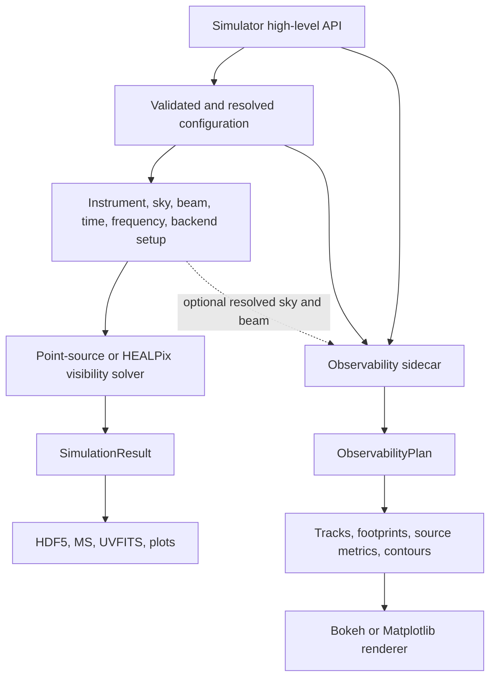
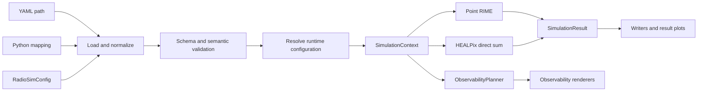
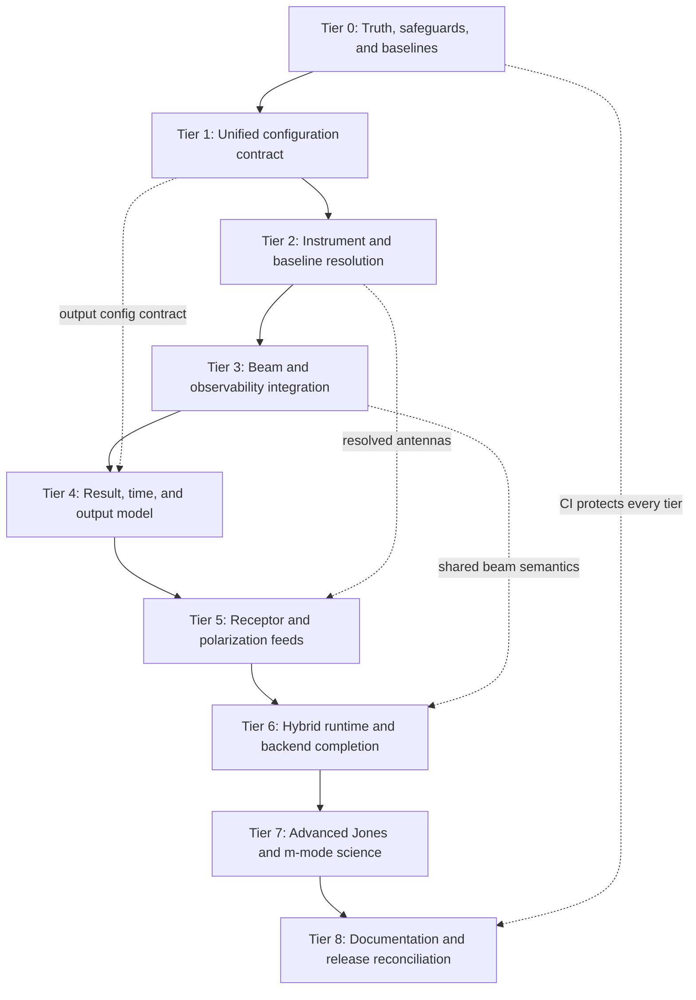

# RadioSim Remediation and Completion Plan

| Plan metadata | Value |
|---|---|
| Status | Tier 1 accepted; Tier 2 accepted after correction; Tier 3 independently accepted on 2026-07-25; all five Tier 3 issues are done; exact-SHA remote CI observed green |
| Prepared | 2026-07-14 |
| Current release | 0.2.0 |
| Baseline commit | `73ae7a3` (`main`, aligned with `origin/main`) |
| Test inventory | 1,178 tests collected from 69 test files |

## 1. Purpose

This document is the source-of-truth plan for resolving the configuration,
high-level API, instrument-model, beam, output, backend, documentation, and
scientific-completeness gaps found during a source-first review of RadioSim.

It records:

- every issue raised during the codebase walkthrough and follow-up questions;
- what the current implementation actually does;
- why the behavior is inconsistent or incomplete;
- the target behavior and architectural direction;
- a dependency-ordered implementation plan;
- tests, acceptance criteria, and stop gates for every tier;
- work that is a normal defect fix versus work that is a larger scientific
  feature.

This is not authorization to implement all tiers in one change. Each tier must
be delivered and reviewed independently.

### 1.1 History-rewrite boundary

The repository history was intentionally rewritten before this plan was
created. Files removed by that rewrite are outside this plan and must not be
restored merely because an older audit or commit mentioned them.

This plan is based on the live checkout at the baseline above. In particular:

- the former `FIX.md`, `CurrentIssues.md`, and `SkyRemediationPlan.md` are not
  present and are not prerequisites for this work;
- deleted GitHub-history content must not be reconstructed;
- `project.md` remains present locally, but is not treated as runtime truth;
- the current source, tests, manifests, README, Sphinx documentation, examples,
  and `AGENTS.md` govern this plan.

## 2. Repository baseline

The live checkout has the following relevant properties:

| Surface | Current state |
|---|---|
| Package version | `0.2.0` |
| Pixi workspace version | `0.2.0` |
| Sphinx version/release | `0.2.0` |
| Pixi lock format | v7 |
| Python package modules | 150 |
| Test files | 69 |
| Tests collected | 1,178 |
| Sample YAML configs | 2 |
| Jones classes | 46 |
| Integration test directory | Only `__init__.py` |
| Performance test directory | Only `__init__.py` |
| Tracked `.github/` directory | Absent |
| `huggingface_space/` directory | Absent |

The version and lockfile inconsistencies are already resolved by commit
`73ae7a3`. They remain documented below because they were part of the original
review and establish the expected release discipline.

## 3. Correct high-level architecture

The observability planner must not be described as a visibility-simulation
product. It is a sibling planning and visualization capability exposed through
the same high-level API.



The visibility branch produces baseline-dependent complex data. The
observability branch produces a renderer-neutral observing plan and does not
calculate baseline visibilities.

### 3.1 Target architecture after remediation

All entry points should pass through the same validation and resolution stages:



`SimulationContext` is a conceptual target name. The implementation may use
several focused immutable models instead of one large object, but the resolved
state must have a single owner.

## 4. Governing decisions

### 4.1 Pre-v1 API policy

RadioSim is pre-v1.0. The implementation should prefer a coherent replacement
over compatibility shims when the current API is misleading or structurally
wrong.

Therefore:

- do not add adapters merely to preserve legacy beam-config field names;
- remove redundant boolean switches when the presence of typed data expresses
  the same decision more clearly;
- reject unsupported settings instead of accepting silent no-ops;
- do not preserve raw-dictionary behavior if it prevents one reliable
  configuration contract;
- document intentional breaking changes in the changelog and migration guide;
- add this policy explicitly to `docs/contributing.rst` as required by
  `AGENTS.md`.

### 4.2 Truthfulness rule

A field or public class may be in one of four states:

1. implemented and tested;
2. experimental and explicitly gated;
3. unsupported and rejected with an actionable error;
4. absent from the public surface.

RadioSim must not validate a setting, silently ignore it, and then imply that
the setting affected the simulation.

### 4.3 Precedence must be explicit

Where several sources can provide the same value, resolution precedence must
be centralized, documented, and included in result provenance. It must not be
created accidentally through mutation order in `Simulator.setup()`.

### 4.4 Scientific features require scientific tests

Receptor bases, Jones terms, beam interpolation, hybrid-sky summation, and
spherical-harmonic solvers are not complete merely because code executes. They
require analytic invariants, reference cases, and cross-implementation checks.

## 5. Issue register

Status values used below:

- **DONE**: resolved and verified in the current checkout;
- **OPEN**: confirmed live defect or incomplete contract;
- **DECISION**: design choice required before implementation;
- **ROADMAP**: substantial scientific or performance feature;
- **DOCS**: documentation/example/release-truth work.

| ID | Status | Issue | Planned tier |
|---|---|---|---|
| REL-001 | DONE | Pixi workspace version differed from package/Sphinx | 0 |
| REL-002 | DONE | Pixi lockfile used v6 format | 0 |
| CFG-001 | DONE | CLI/API/mapping/model/parameter inputs share one strict resolution pipeline | 1 |
| CFG-002 | DONE | Typed config and every override surface honor centralized backend precedence | 1 |
| CFG-003 | DONE | Unsupported non-default fields are exhaustively classified and rejected before side effects | 1 |
| INS-001 | DONE | Per-antenna diameter map is ignored and loaded values are overwritten | 2 |
| INS-002 | DONE | pyuvdata telescope flags are not wired | 2 |
| INS-003 | DONE | Baseline-selection fields are ignored | 2 |
| BEAM-001 | DONE | Modern FITS/per-antenna beam config is not connected to `Simulator` | 3 |
| BEAM-002 | DONE | `BeamManager` expects a different legacy config contract | 3 |
| BEAM-003 | DONE | HEALPix NSIDE beam advisor reads antenna dictionaries incorrectly | 3 |
| OBS-001 | DONE | Observability is architecturally misclassified as a product | 3 |
| OBS-002 | DONE | Implement the accepted explicit-reference semantics for heterogeneous observability beams | 3 |
| OUT-001 | DONE | Output controls are only partially honored | 4 |
| OUT-002 | DONE | Point, HEALPix, and writer time-grid counts disagree | 4 |
| OUT-003 | DONE | HDF5 drops correlations and forces `complex128` | 4 |
| OUT-004 | DONE | JSON output contains no visibility data | 4 |
| OUT-005 | DONE | HDF5 reader uses unsafe `eval()` | 4 |
| OUT-006 | DONE | UVFITS is accepted by config but unsupported by `save()` | 4 |
| POL-001 | DONE | Top-level feed/receptor config is ignored | 5 |
| POL-002 | DONE | Receptor and basis-transform Jones terms are identity stubs | 5 |
| RUN-001 | DONE | `run(n_workers=...)` is unused — closed 2026-07-31 (Tier 6J re-run): `Simulator.run()` has no `n_workers` parameter; a typed `execution.solver` worker policy is centrally resolved, recorded in provenance, and proven both in force and result-invariant | 6 |
| RUN-002 | DONE | Sky loading hard-codes `max_workers=8` — closed 2026-07-31 (Tier 6J re-run): no hard-coded worker count survives in `src/`, `load_models_parallel` has no `max_workers` default, loader concurrency is typed/configurable/recorded, and offline behavior under both executors is tested | 6 |
| RUN-003 | DONE | High-level API forces point or HEALPix and cannot preserve hybrid sky — closed 2026-07-31 (Tier 6J re-run): `sky_representation: hybrid` is a first-class mode with exact additivity, coordinate identity, one canonical result, an unchanged disjointness gate, and full HDF5/summary/MS/UVFITS serialization | 6 |
| RUN-004 | DONE | Backend abstraction is not yet performance-bearing end to end — closed 2026-07-31 (Tier 6J re-run) **narrowed to §13.1 scope**: "backend correctness parity complete; accelerator performance undemonstrated" — Dask is bit-identical to NumPy, JAX-CPU agrees within `rtol=1e-12`, the registry is truthful (`numba` unselectable, `DaskBackend` reports `dask-*`, `supports_gpu` is `False`), exactly one kernel is compiled and verified against its uncompiled reference, and every capability statement cites a benchmark record. The unmeasured remainder (device-resident orchestration, device coordinate transforms, a measured accelerator run) is **not** silently absorbed into Tier 7; it is filed as `PERF-001` below per §41 Q4 | 6 |
| SKY-001 | DONE | Every VizieR point-catalog loader (`gleam`, `mals`, `lotss`, `vlssr`, `tgss`, `wenss`, `sumss`, `nvss`, `3c`, `vlass`) raised `TypeError` because commit `7b02bb2` made `_load_from_vizier_catalog`'s `precision` keyword-only while all four wrapper call sites in `core/sky/loaders/vizier/point_catalogs.py` still passed it positionally — fixed 2026-07-31 (`a5edd30`): the four call sites now pass `precision=precision`, +16 offline regression tests, one 6A characterization pin flipped in place | standalone, bounded fix (pre-Tier 7) |
| PERF-001 | ROADMAP | Accelerator (GPU/TPU) performance remains undemonstrated: the time and frequency axes are host-side Python loops, astropy coordinate transforms / horizon masking / Planck conversion / pyuvdata beam interpolation are host-side by design, the locked JAX build is CPU-only, and measured JAX-CPU is slower than NumPy on every benchmarked workload (`output/benchmarks/reference/`). Filed 2026-07-31 at Tier 6J re-run acceptance per §41 Q4, as the successor to the accelerator-performance remainder of `RUN-004`; requires GPU/TPU hardware this environment does not have | post-Tier-7, hardware-gated |
| SKY-002 | DONE | The `realistic_foreground` recipe loader was registered (`core/sky/recipes/realistic_foreground.py:277-297`) with no `network_service`, so `utils/network.py::get_required_services()` returned `{}` for any config using `kind: realistic_foreground` — including the shipped `configs/realistic_foreground_example.yaml` (`diffuse: haslam`, `bright_catalogs: gleam`) — and `Simulator`'s pre-flight network check printed "Network: offline (no network-dependent models)" even though the recipe internally calls `_load_diffuse` (pygdsm) and `_load_bright_catalog` (VizieR), both real network dependencies. Found during the SKY-001 acceptance review, 2026-07-31 — closed 2026-08-02 (Tier 8D): `LoaderDefinition.network_service: str | None` is widened to `network_services: tuple[str, ...]` with **no compatibility shim** (the singular spelling survives nowhere in `src/`), every mirror in `registry/{core,facade,catalogs}.py` and every loader registration is renamed, `LoaderRegistry.network_services()` returns `dict[str, tuple[str, ...]]`, `get_required_services()` unions them, and the recipe declares `("pygdsm_data", "vizier")` — the exact tokens the diffuse and VizieR catalog entries declare. The shipped config's pre-flight now prints `Network: offline (forced) (required: pygdsm data, VizieR)` and an offline run of it fails with the actionable offline error rather than a network attempt (proved by running it, offline, in `tests/unit/test_utils/test_network.py::TestShippedRecipeConfigurationServices`). The generalization that stops the next composite recipe repeating it is `tests/unit/test_core/test_sky_registry.py::test_every_network_implicated_loader_declares_a_service`: a loader whose module names a network client **or resolves other loaders dynamically** must declare at least one service — the second clause is the one an import scan would have missed, and is exactly how this recipe reaches the network | 8 |
| RUN-005 | DONE | `scientific_sha256` embeds the antenna layout source file's absolute filesystem path (`io/instrument_sources.py`'s `source_reference=str(path)`, carried into `instrument_snapshot["reference"]` and hashed by `core/result.py::_scientific_hash`), so two runs of the identical config with bit-identical raw visibility cubes produce different `scientific_sha256` values solely because the repository checkout lives at a different absolute path; confirmed pre-existing and unaffected by Tier 6D (`core/instrument.py`, `io/instrument_sources.py`, `core/result.py` are untouched in `c5d79aa..87d7c79`) by reproducing the same divergence with cube-identical, fingerprint-different runs at `c5d79aa` from two detached worktrees | standalone, bounded fix (pre-Tier 7) |
| RUN-006 | DONE | The FITS beam `definition_fingerprint` (`core/beam/models.py::ResolvedFITSBeamDefinition.__post_init__`) hashed the absolute FITS path, so `definition_fingerprint`, `assignment_fingerprint`, `state_fingerprint`, and `loaded_fingerprint` all differed between checkouts of the same commit even though `RUN-005`'s projection already kept them out of `scientific_sha256`; fixed by hashing only the load settings (`normalization`, `angular_interpolation`, `frequency_interpolation`) — file content stays bound at load time by the content-based handler `scientific_fingerprint` — with pre-load dedup (`_deduplicated_definitions`) re-keyed on fingerprint + resolved path so two distinct files with identical settings remain distinct definitions/handlers, and `LoadedBeamState` gaining an explicit `handler.file.resolved_path == assignment.definition.path` cross-check to preserve the assignment-matching strength the path hash used to provide; changes every stored FITS-beam fingerprint value (snapshots, summary JSON, HDF5 provenance) but no schema, no `scientific_sha256` (projection unchanged, settings survive as sibling keys), and no analytic-beam value, so the shipped-config pins are untouched | standalone, bounded fix (pre-Tier 7) |
| SCI-001 | DONE | Most Jones classes are public identity-returning stubs — closed 2026-08-02 (Tier 7 whole-tier acceptance, Tier 7K): every exported Jones class implements real physics; twenty-six speculative stubs were removed rather than implemented, each with a documented replacement; no public term multiplies by identity | 7 |
| SCI-002 | DONE | Spherical-harmonic/m-mode mode is advertised but unimplemented — closed 2026-08-02 (Tier 7K) by removal of the unimplemented option and of its unhonored sibling value from the public configuration surface; `execution.simulator` is the single solver selector and accepts only `rime`; the m-mode solver is filed as `SCI-004` | 7 |
| SCI-003 | DONE | Advanced beam-physics TODOs remain — closed 2026-08-02 (Tier 7K): two items implemented and analytically verified (pointing offsets, Ruze efficiency), five given explicit scientific scope with citations in a tracked scope document (`docs/development/beam_physics_scope.md`), and `SCI-005` filed as their owner; the in-package `TODO.md` no longer exists | 7 |
| SCI-004 | ROADMAP | A spherical-harmonic/m-mode solver — a second forward-model algorithm entirely, distinct from the direct-sum RIME `rime` simulator — remains unimplemented. `execution.simulator` accepts only `rime`, matching the simulator registry's single key; a future m-mode solver is a new registry entry, not a value on a removed field. Filed 2026-08-02 at Tier 7 whole-tier acceptance (Tier 7K) per §38's `SCI-002` closure requirement, as the named successor for the descoped Workstream E | post-Tier-7, successor design gate |
| SCI-005 | ROADMAP | Advanced beam physics beyond the accepted scalar-`E` subset: polarized/cross-polar beams (Ludwig-3 decomposition, quadrupolar cross-polarization, IXR conversion), beam squint, aperture blockage, Zernike aberrations, and the Ruze error-beam decomposition. Each item has explicit scientific scope, a citation, and its non-goal reasoning recorded in `docs/development/beam_physics_scope.md` (which replaces the old in-package `src/radiosim/core/jones/beam/TODO.md`); each requires widening the accepted `E`-Jones beyond a scalar diagonal, which is a tier-scale change. Filed 2026-08-02 at Tier 7 whole-tier acceptance (Tier 7K) per §38's `SCI-003` closure requirement | post-Tier-7, successor tier |
| SCI-006 | OPEN | RadioSim's local Stokes ``Q`` has the opposite sign to `pyuvsim`/`pyradiosky`'s for the same sky, BeamFITS feed convention (`x_orientation="east"`), and mount, discovered by the 7J `pyuvsim` cross-validation (`tests/crossvalidation/test_pyuvsim_comparison.py`, `output/crossvalidation/2026-08-02-pyuvsim-1.4.0.json`). The comparison's mapping 3 characterizes this as a local-basis axis-order swap (feed 0 bound to `data_array[0, 0]`, `pyuvdata`'s first sky-vector component) that also flips ``V``, and the preserved polarized intensity (``\|Q+iU\|`` agrees to `2.1e-3` relative after the swap) is consistent with that reading, but the comparison does not establish which convention is the intended one for an east-oriented ``x`` feed — a characterization, not an endorsement of either sign. Filed at 7J independent acceptance review, 2026-08-02, per the plan's routing of this finding to whole-tier review | 7J discovery, pre-7K disposition |
| SCI-007 | OPEN | After the 7J cross-validation's basis-axis swap (`SCI-006`), the local linear-polarization frame still differs from `pyuvsim`'s by a fitted `-0.0576` degrees (`output/crossvalidation/2026-08-02-pyuvsim-1.4.0.json`). An independent astropy probe recorded in that artifact measures `0.200` degrees between the position angle of ICRS north and the apparent-equatorial parallactic angle at the same epoch and sources, the right order of magnitude for a reference-frame effect of this species, but the two numbers were not reconciled. This review's own independent CIRS-frame probe (ICRS-north-offset point transformed to CIRS at the crossval epoch/sources/location) measures `0.04`-`0.06` degrees per source — a different but same-order-of-magnitude quantity, confirming a real (not fabricated) sub-degree frame effect exists without closing the gap to either recorded figure. Filed at 7J independent acceptance review, 2026-08-02 | 7J discovery, pre-7K disposition |
| DOC-001 | DOCS | `simple_simulation.py` uses stale private/result APIs | 8 |
| DOC-002 | DOCS | README low-level baseline example is invalid | 8 |
| DOC-003 | DOCS | Sphinx references removed Jones class names | 8 |
| DOC-004 | DOCS | README claims 15+ configs while two exist | 8 |
| DOC-005 | DOCS | README/backend documentation contradicts live backend behavior | 8 |
| DOC-006 | DOCS | `project.md` is stale and still describes RRIVis | 8 |
| DOC-007 | DOCS | `AGENTS.md` describes an absent Hugging Face app | 8 |
| DOC-008 | DOCS | No tracked CI and no real integration/performance suites | 8 |
| CI-001 | OPEN | A **second byte-stable digest class on `linux-64-py311`** makes `main` red on one of eight CI jobs with an **unidentified discriminator**. Run `30726145633` at `95a937e` fails five characterization pins (`test_tier6_current_behavior.py::test_shipped_default_config_scientific_fingerprint`, `::test_shipped_circular_receptor_config_scientific_fingerprint`, `::test_section_13_4_workload_fingerprints[heterogeneous_receptor_bases]`, and the two `test_tier7_current_behavior.py` fingerprint pins that import the Tier 6 tables — three distinct measurements) while run `30725507865` at `47df8fc` is green on all eight with a **byte-identical `src/`/`tests/` tree** (`git diff 47df8fc..95a937e -- src/ tests/` is empty). The raw cube digest moves too, not only `scientific_sha256`, so this is a numbers change and not metadata. The class is **reproducible, not a race**: the measured `config.yaml` `scientific_sha256` (`89f38f62...`) is byte-identical across runs `30726145633`, `30719161877` and `30705549269` on three CPU models from two vendors (AMD EPYC 9V74, Intel Xeon 6973P-C, Intel Xeon Platinum 8573C), and every within-process reproducibility test passes in the failing job. **The module's own stated discriminator is falsified**: `test_tier6_current_behavior.py:226-246` attributes the axis to NumPy's dispatched vector feature set, but the AMD run's feature list omits `AVX512FP16`/`AVX512_SPR` that both Intel runs report and all three produce the identical digest, and the originally recorded value was itself measured on an AMD EPYC 9V74. Ruled out with evidence: source regression; xdist presence, worker count and ordering; numpy/astropy/OpenBLAS drift (`locked: true`, with identical `libblas`, `libopenblas` and `astropy-iers-data` in the red and green jobs' installed-package logs); astropy IERS auto-download; `PYTHONHASHSEED`; thread counts; uninitialized memory. It appears in 3 of the 8 runs on that cell since it first appeared (~38%), and 11 of the last 25 CI runs failed — all 11 in this one pin family. **Filed 2026-08-02 at Tier 8A** per `Tier8ReleasePlan.md` Section 14, which ratifies three acts and refuses a fourth: (1) this row; (2) `_machine_fingerprint()` now emits **unconditionally** — written to gitignored `output/characterization/` on pass as well as fail, and widened to carry the thread environment and BLAS build — because the structural evidence gap is that the helper was reachable only from the `pytest.fail` branch and was added after the green `linux-64-py311` baseline was harvested, so **nothing has ever been recorded about a passing runner on that cell**; (3) pin failures now report a **numeric delta** (`max\|dV\|`, max relative delta, differing-element count, first differing index) against every captured reference cube and name the nearest recorded observation, because a digest gate cannot distinguish 1 ULP from 100% and no failing log in the last 25 runs contains a single number. **Refused: a fifth reflex append.** Four prior commits (`e3f1987`, `1c90d81`, `e5b20d1`, `0ce72e4`) appended a newly observed digest on disagreement; appending again under a rationale now known to be false would violate the module's own rule that "a set never grows to make a failure go away" (`test_tier6_current_behavior.py:271-273`) and §4.2. Whether the observed class may be appended once the numeric probe runs, on an honest justification naming the discriminator as unidentified and recording the measured delta, is Tier 8 gated question Q3 and is decided by measurement at 8D. **Root cause is explicitly not Tier 8's**: naming the discriminator needs runner access or instrumented dumps of intermediate quantities from both classes, and the hypothesis space still includes hypervisor CPU-feature masking and `libm`/OpenBLAS runtime dispatch, neither of which current instrumentation captures. **Successor decision, named and deferred**: whether a bitwise digest is the right cross-platform gate at all — versus pinning a reference cube and asserting the `rtol=1e-12` tolerance the project already uses for backend parity, with the digest kept advisory — is a real design question that changes what the gate *means*, and Tier 8 does not make it, because weakening a reproducibility gate on evidence that cannot yet distinguish harmless last-bit dispatch from a real numerical difference is exactly the trade this program exists to stop. Blocks any "CI is green" claim while open | 8A filing and instrumentation; discriminator and successor gate design post-Tier-8 |
| API-001 | OPEN | `stokes_to_coherency(stokes_I, stokes_Q=0, stokes_U=0, stokes_V=0, *, xp=np)` (`src/radiosim/core/polarization.py:73`) does not broadcast a scalar keyword default against a non-scalar positional argument: the rows are assembled with `xp.stack`, which requires every stacked array to share one shape, so `stokes_to_coherency(np.ones(5))` — the single most basic array-input call, using every default — raises `ValueError: all input arrays must have the same shape` instead of broadcasting `Q=U=V=0` to `(5,)`. Reproduced directly, 2026-08-02. **No solver path is affected**: both production call sites (`core/visibility.py:754`, `core/visibility_healpix.py:574`) always pass four already-matched-shape arrays explicitly, confirmed by direct read. Tier 8B's docstring correction (`a3ef72d`) already documents this precisely and is the *closure* of the truthfulness defect (state 1-3 per §4.2's discipline, applied by `Tier8ReleasePlan.md` §7); this row tracks the *underlying ergonomics gap* the corrected prose newly discloses, which the prose fix does not and should not silently absorb. Filed at Tier 8B independent acceptance review, 2026-08-02, as a disclosed, non-blocking, low-priority API-polish item (broadcast the three scalar defaults against `stokes_I`'s shape, or `xp.broadcast_arrays` all four, before `stack`) — not a Tier 8 blocker, since the truthfulness defect it was found investigating is already closed | post-Tier-8, low-priority, bounded |

## 6. Question-by-question findings and target behavior

### 6.1 REL-001 — Version inconsistency

#### Current state

Resolved. The following now agree on `0.2.0`:

- `pyproject.toml`;
- `pixi.toml`;
- `src/radiosim/__about__.py`;
- `docs/conf.py`.

#### Required ongoing control

Add a small release-metadata test or release script that reads all four values
and fails when they diverge. A future version bump should be one command or one
reviewable change set.

#### Acceptance criteria

- one automated check covers every authoritative version surface;
- documentation and CLI report the same release;
- the release checklist includes the version-consistency check.

### 6.2 REL-002 — Pixi v6 lockfile warning

#### Meaning

The warning meant that the dependency solution was current but stored in an
older Pixi lockfile schema. It was not an installation failure and did not mean
that dependencies were unresolved.

#### Current state

Resolved. `pixi.lock` is now v7 and records explicit platform virtual packages.
`pixi install` completes without the v6 warning.

#### Ongoing rule

Lockfile-format upgrades should be isolated or explicitly called out because
they can produce large structural diffs even when package intent is unchanged.

### 6.3 OBS-001 — Why observability is not a simulation product

`ObservabilityPlanner` builds a renderer-neutral `ObservabilityPlan` containing
tracks, footprint masks, contours, snapshots, and source metrics. It does not
calculate baseline-dependent visibilities.

`Simulator.plot_observability()` connects it to the public API, but that makes
it a sibling capability, not a child of the result writer. It can use config and
an optionally prepared sky model without consuming `Simulator.run()` output.

#### Target behavior

- architecture diagrams place observability beside the simulation pipeline;
- `plot_observability()` accepts a resolved context or clearly resolves the
  required subset itself;
- observability never implies that it is plotting calculated visibilities;
- documentation distinguishes visibility plots from observability plots.

#### Heterogeneous-array decision

For different per-antenna beams or diameters, a single array footprint is
ambiguous. Before wiring heterogeneous beams into observability, choose one of:

1. require a `reference_antenna`;
2. display a selected antenna and label it;
3. display an intersection/union envelope with explicit semantics;
4. display several antenna footprints.

Recommended first implementation: require or default a clearly reported
reference antenna, then add envelopes later.

### 6.4 INS-001 — Per-antenna diameters

#### Current behavior

`AntennaLayoutConfig` defines:

- `all_antenna_diameter`;
- `use_different_diameters`;
- `diameters`.

`Simulator.setup()` nevertheless assigns `all_antenna_diameter` to every loaded
antenna. This overwrites values read from supported antenna formats and ignores
the per-antenna map.

The downstream solver is already capable of using heterogeneous diameters:
point visibility builds a per-antenna diameter map, and the HEALPix path reads
each antenna's `diameter`. The missing work is resolution in setup.

#### Target configuration

Prefer a simpler pre-v1 contract:

```yaml
antenna_layout:
  default_diameter_m: 14.0
  diameters_by_antenna:
    "0": 12.0
    "1": 25.0
```

Remove `use_different_diameters`; the override map already expresses the
intent. If retaining current names temporarily is useful for the implementation
branch, remove them before finalizing the public API rather than creating a
long-lived deprecation shim.

#### Resolution precedence

Recommended precedence, highest first:

1. explicit per-antenna config override;
2. diameter supplied by the selected antenna-layout source;
3. explicitly enabled pyuvdata telescope diameter;
4. configured default diameter.

Every resolved diameter must be finite and positive. Unknown mapping keys and
unresolved antenna IDs must fail during setup.

#### Acceptance criteria

- heterogeneous diameters reach both solvers unchanged;
- file-provided diameters are not overwritten unless explicitly overridden;
- result metadata records the resolved diameter and its source per antenna;
- invalid, missing, or unknown mappings fail before sky loading;
- baseline metadata no longer encodes diameters as an opaque string.

#### Resolution (2026-07-20)

**DONE.** Tier 2 replaced the ignored legacy map with typed per-antenna overrides and
one complete canonical instrument. Resolution applies `override > source > configured
default`, records the winning source and the original source fact, rejects unknown,
duplicate, non-finite, non-positive, or unresolved values before runtime side effects,
and passes exact heterogeneous diameters to both solvers, results, plots, and writers.
No consumer invents a 14-metre fallback.

### 6.5 BEAM-001/002 — FITS, per-antenna, and mixed beams

#### Current behavior

The Pydantic schema validates a modern contract:

- `beam_mode: analytic | fits | mixed`;
- `per_antenna`;
- `beam_file`;
- `antenna_beam_map`;
- FITS normalization and interpolation settings.

The high-level simulator initializes `_beam_manager` to `None` and never
assigns it. Setup copies only analytic-beam fields into `_beam_config`.

The existing `BeamManager` uses a different contract:

- `use_beam_file`;
- `use_different_beams`;
- `beam_file_path`;
- `beam_files`;
- `beams_per_antenna`.

Consequently, validated modern beam fields never reach the FITS implementation.

#### Root cause

The configuration surface and the beam manager evolved independently. The
runtime contains the low-level FITS machinery, and the schema describes the
desired high-level behavior, but there is no modern resolution boundary between
them.

#### Target behavior

Refactor `BeamManager` to consume resolved modern beam assignments directly:

| Mode | Resolution |
|---|---|
| `analytic` | No FITS handler; every antenna uses analytic E-Jones |
| `fits`, shared | Load one FITS handler and assign it to every antenna |
| `fits`, per antenna | Resolve one FITS path per antenna |
| `mixed` | Resolve each antenna to either `analytic` or a FITS path |

Do not translate modern fields into the legacy keys as a permanent adapter.

#### Additional requirements

- normalize antenna mapping keys once;
- deduplicate identical FITS paths without changing assignments;
- validate file existence and coverage before simulation;
- propagate `beam_peak_normalize`, interpolation, ZA, and frequency-domain
  settings;
- fail loudly rather than silently falling back to analytic beams;
- use the same manager in point and HEALPix paths;
- use the same resolved beam definition in observability.

#### Acceptance criteria

- shared FITS, per-antenna FITS, and mixed modes have end-to-end tests;
- a known synthetic UVBeam gives predictable Jones values;
- both visibility paths agree for equivalent scalar/diagonal beams;
- missing antenna assignments and out-of-domain requests produce actionable
  errors;
- observability reports which antenna or envelope it displays.

### 6.6 INS-003 — Baseline-selection fields

#### Current behavior

`BaselineSelectionConfig` defines autocorrelation, cross-correlation, length,
tolerance, and angle controls. `generate_baselines()` always creates all
`ant1 <= ant2` combinations, including both autos and crosses. The high-level
simulator does not apply a selection stage.

The current CLI source itself lists advanced baseline filtering as unfinished
modular-API work.

#### Target design

Keep baseline generation and baseline selection separate:

```text
resolved antennas
    -> generate canonical baselines
    -> select baselines
    -> validate non-empty selection
    -> freeze selected baseline inventory
```

Create a focused function such as:

```python
select_baselines(
    baselines,
    *,
    include_autocorrelations,
    include_crosscorrelations,
    lengths_m,
    length_tolerance_m,
    azimuth_ranges_deg,
)
```

The exact public name may differ, but selection logic must not be embedded as a
large conditional block in `Simulator.setup()`.

#### Scientific details

- document ENU baseline azimuth convention;
- support ranges that wrap through 0 degrees;
- filter autocorrelations before computing angle because their direction is
  undefined;
- define whether a baseline matches either orientation or only the stored
  `ant1 -> ant2` direction;
- reject negative lengths and malformed angle ranges at schema validation;
- reject a final empty selection with the resolved criteria in the error.

#### Acceptance criteria

- exact baseline counts for auto-only, cross-only, and combined cases;
- tolerance-boundary tests;
- wrapped-angle and opposite-direction tests;
- selection metadata is saved with results;
- CLI and API produce the same selected baseline set.

#### Resolution (2026-07-20)

**DONE.** Tier 2 now generates one immutable, numeric-order baseline inventory with
`ant2 - ant1` vectors, then applies one typed selection pass shared by every consumer.
Correlation, target/range length, and axial-azimuth filters implement the documented
union/intersection algebra, tolerance boundaries, autocorrelation treatment, stable
empty failure, and complete stage-count provenance. YAML, mapping, model, parameter,
CLI, solver, result, plot, and writer paths use the same selected tuple.

### 6.7 POL-001 — Feed fields

#### Important terminology split

RadioSim currently uses “feed” for two different concepts:

1. `beams.feed_model` describes illumination of an aperture or reflector by a
   horn, waveguide, or dipole. This is wired into analytic beam computation.
2. top-level `feeds` describes receptor polarization/basis and per-antenna feed
   type. This is ignored by `Simulator`.

These concepts must not share ambiguous names in the final API.

#### Why top-level feeds cannot be wired mechanically

The solver assumes a linear X/Y basis and returns `XX`, `XY`, `YX`, and `YY`.
`ReceptorConfigJones` and `BasisTransformJones` are identity stubs. Merely
attaching `feed_type` strings to antennas would falsely imply correct circular
or heterogeneous polarization physics.

#### Target design

- rename beam illumination settings clearly, for example under
  `beams.illumination`;
- replace top-level `feeds` with a typed receptor/basis model;
- support at least `linear` and `circular` bases;
- model feed orientation separately from basis;
- define one output basis for heterogeneous arrays and transform each antenna
  into it;
- generate appropriate correlation labels and file-format polarization codes;
- implement C/H Jones matrices before claiming receptor support.

#### Acceptance criteria

- analytic linear-to-circular transform tests;
- Stokes-to-correlation energy-conservation tests;
- correct `XX/XY/YX/YY` and `RR/RL/LR/LL` labels;
- polarized-source cross-hand tests;
- Measurement Set and UVFITS polarization metadata round trips;
- unsupported heterogeneous combinations fail explicitly until implemented.

### 6.8 INS-002 — pyuvdata telescope flags

#### Current behavior

`TelescopeConfig` defines flags for known telescope, location, antennas, and
diameters. The high-level setup nevertheless requires an antenna file and reads
location directly from config. The flags are not consumed.

Reading antenna information from an MS or UVFITS file is not the same as
resolving `Telescope.from_known_telescopes()`.

#### Target design

Create an instrument resolver responsible for:

- loading a known pyuvdata telescope when requested;
- converting antenna positions into RadioSim's documented coordinate frame;
- merging explicit config, file, and pyuvdata sources according to one
  precedence table;
- resolving location, names, numbers, positions, diameters, and mount metadata;
- retaining provenance for every resolved field;
- detecting inconsistent antenna-number inventories across sources.

Recommended field precedence:

| Field | Highest precedence | Fallbacks |
|---|---|---|
| Location | Explicit config | pyuvdata, project default only if documented |
| Positions | Explicit selected layout source | pyuvdata when enabled |
| Diameter | Per-antenna override | layout, pyuvdata, default |
| Names/numbers | Selected position source | validated mapping |
| Mount/feed metadata | Explicit config | pyuvdata when enabled |

Avoid a master boolean plus several contradictory sub-flags. Prefer an explicit
source selection and per-field override model.

#### Resolution (2026-07-20)

**DONE.** Tier 2 removed the inert pyuvdata booleans and replaced them with an exact
`known_telescope` source contract, distinct from Measurement Set and UVFITS dataset
sources. The resolver loads the selected source through an offline-testable injected
boundary, preserves identity, location, positions, diameters, mount metadata, pyuvdata
version, and registry policy in provenance, disables both registry-update flags where
required, converts relative ECEF scientifically to canonical ENU, and rejects explicit
metadata mismatches. High-level Simulator setup uses this resolved source directly.

### 6.9 CFG-002 — Compute backend ignored by `Simulator.from_config()`

#### Current behavior

`Simulator.from_config()` extracts precision and then constructs `Simulator`
without passing `radiosim_config.compute.backend`. The constructor default
`backend="auto"` therefore wins.

The config-mode CLI separately resolves:

```text
explicit CLI backend unless it is "auto"
    -> otherwise config.compute.backend
```

The Python API and CLI can therefore run the same YAML on different backends.

#### Target behavior

Use `None` to mean “no explicit override” because `auto` is a legitimate
backend value:

```python
Simulator.from_config(path, *, backend: str | None = None)
```

Resolution order:

1. explicit API/CLI override;
2. `config.compute.backend`;
3. documented package default.

The resolved backend name and device must be included in result metadata.

#### Acceptance criteria

- `from_config()` honors `compute.backend`;
- explicit overrides win identically in CLI and Python;
- `auto` remains selectable as an actual strategy;
- unavailable explicit backends fail rather than silently falling back;
- backend-resolution tests do not depend on a physical GPU.

#### Resolved current behavior (2026-07-17)

`Simulator.from_config()` now accepts only typed `RadioSimConfig`, and all
document/API/CLI paths resolve `execution.backend` through the same frozen
override model and resolver. `None` means no override, explicit values win,
`auto` remains a real strategy, and NumPy remains the declared deterministic
default. The resolved strategy is retained in runtime/provenance. Explicitly
unavailable or precision-incompatible backends fail rather than falling back;
the backend factory also rejects any requested precision it cannot represent.

### 6.10 OUT-001 — What “output controls mostly honored” means

The current status is:

| Field | Current status | Required decision/fix |
|---|---|---|
| `simulation_data_dir` | Honored by config-mode CLI | Retain as CLI orchestration |
| `simulation_subdir` | Honored or auto-generated | Retain and test |
| `output_file_name` | Honored by `Simulator.save()` | Retain |
| `output_file_format` | HDF5/JSON/MS dispatched; UVFITS unsupported | Implement or reject UVFITS |
| `save_simulation_data` | Honored by CLI | Retain as CLI orchestration |
| `overwrite_output` | Partially honored | Unify folder and file policy |
| `skip_overwrite_confirmation` | Honored | Clarify noninteractive behavior |
| `prompt_for_output_suffix` | Ignored | Honor it or remove it |
| `plot_results` | Honored | Retain |
| `open_plots_in_browser` | Honored | Retain |
| `plotting_backend` | Passed to plotting | Type and validate choices |
| `save_log_data` | Honored | Retain |
| `angle_unit` | Ignored by high-level path | Thread through or remove |
| `skymodel_frequency` | Ignored | Thread through or remove |

The final design should separate scientific simulation configuration from CLI
workflow/output orchestration. Calling `Simulator.run()` from Python should not
implicitly perform CLI-style saving or prompting.

### 6.11 CFG-001 — Validation differences between entry points

There are currently three validation depths:

| Entry point | Current validation |
|---|---|
| Config-mode CLI | Pydantic construction plus explicit `config.validate()` preflight |
| `Simulator.from_config()` | Pydantic construction, but no explicit semantic preflight |
| `Simulator(config={...})` | Shallow dictionary copy; no full Pydantic validation |

`RadioSimConfig` also allows extra top-level fields, while nested models may
ignore extras under Pydantic defaults. This permits typos and unsupported fields
to survive differently depending on their location.

#### Why raw dictionaries exist

The raw path supports concise programmatic and test configurations. It is
convenient for constructing only the sections needed by a particular test, but
it makes behavior entry-point-dependent and moves failures into setup.

#### Target design

All configuration sources must pass through one boundary:

1. parse/coerce source-specific values;
2. validate types and local field constraints;
3. run semantic and cross-field validation;
4. resolve paths relative to the correct source;
5. resolve runtime defaults and explicit overrides;
6. produce immutable/frozen runtime configuration.

Before changing extras to `forbid`, inventory and type every legitimate live
field, including the explicit `frequencies_hz` array used by the programmatic
constructor.

#### Acceptance criteria

- equivalent YAML, mapping, and typed-model input resolve identically;
- validation errors occur before device detection, network checks, or sky
  loading;
- unsupported settings cannot silently become no-ops;
- partial test fixtures use explicit test builders instead of weakening the
  production constructor;
- path-resolution semantics are identical and documented.

#### Resolved current behavior (2026-07-17)

YAML, raw mapping, typed model, convenience parameters, root config mode,
`validate`, and the exposed `simulate` surface now use the same strict schema,
override, semantic/unsupported, path, and immutable-runtime resolution stages.
Direct `Simulator` construction accepts only `ResolvedSimulationConfig`; the
old raw/partial constructor path is absent. Invalid input fails before backend,
device, network, loader, output, plotting, browser, or workflow side effects.
Path bases and override origins remain explicit in immutable provenance.

### 6.12 CFG-003 — Unsupported fields silently becoming no-ops

#### Resolved current behavior (2026-07-17)

The complete strict input-model inventory covers 281 field occurrences. Every
accepted field is either resolved into supported scientific/workflow behavior
or classified as deferred. The operational deferred-feature matrix covers 34
non-default cases across the capable public entry points; all 34 reject with an
exact configuration error before side effects. Entry points such as
`radiosim simulate` omit deferred fields they cannot express. No unsupported
state is representable in `ResolvedSimulationConfig`, and no generic loader
option, raw mapping, compatibility-key, or partial-fixture escape hatch remains.

## 7. Additional confirmed gaps from the broader review

### 7.1 BEAM-003 — NSIDE beam advisor bug

The original defect was `Simulator.setup()` iterating an antenna dictionary as if
its keys were antenna objects with `.diameter`; a broad exception handler converted
that failure into `beam_fwhm_rad=None` and silently disabled advice. Tier 2 removed
the raw antenna dictionary, so the live code now reads canonical antennas, but the
issue is not closed: the advisor still uses one lowest-frequency/minimum-diameter
FWHM scalar, can choose the widest rather than the limiting beam-product feature, and
still suppresses failures broadly.

Fix this only after diameter resolution has a canonical representation. Do not
patch it with another dictionary/object special case that perpetuates mixed
antenna representations. Closure requires canonical beam assignments, every selected
baseline and exact frequency, the product-feature sampling derivation, defined autos,
typed derivation failure, no arbitrary antenna, no silent NSIDE mutation, and no broad
suppression.

### 7.2 RUN-001/002 — Worker controls

`Simulator.run(n_workers=...)` documents a worker count but never uses it.
Sky-model setup separately hard-codes `max_workers=8`.

These are two different concurrency concerns and should not share one ambiguous
parameter:

- sky-loader concurrency belongs to setup/data loading;
- visibility computation concurrency belongs to a solver execution policy.

Define them separately, for example through typed compute settings, and record
the resolved values in runtime metadata.

### 7.3 RUN-003 — Hybrid sky support

`SkyModel` can preserve point and HEALPix payloads simultaneously, but the
high-level `VisibilityConfig` accepts only `point_sources` or `healpix_map` and
`Simulator.run()` chooses one solver branch.

The correct hybrid implementation is not lossy conversion. It is:

```text
V_total = V_point + V_healpix
```

Both components must use the same resolved baselines, time grid, frequencies,
phase convention, polarization basis, backend policy, and result shape. Sky
provenance/disjointness rules must prevent accidental double counting.

### 7.4 RUN-004 — Backend reality

The backend abstraction is partially wired into point-source array operations,
but the orchestration remains dominated by host-side Python loops, Astropy
coordinate transforms, and host/device transfers. HEALPix code still contains
NumPy-specific operations. JAX/Numba selection therefore does not yet imply
end-to-end acceleration.

The README currently contains mutually inconsistent claims: some sections say
the solver is NumPy-only, while the live point path does dispatch selected array
operations. Documentation should say:

- backend array operations are partially integrated;
- correctness parity is more mature than performance integration;
- GPU acceleration is not yet demonstrated end to end;
- Numba must not be called a production JIT solver unless the solver actually
  uses compiled kernels.

### 7.5 SCI-001 — Jones identity stubs

The package exports 46 Jones classes. Only geometric phase K and primary beam E
currently provide substantive forward-model effects. Most other terms return
identity matrices.

This is not one defect. It is a collection of separate scientific features.
Public identity stubs are risky because a user can add a term to a chain and
observe no change without an error.

Until each term is implemented, choose one truthful policy:

- remove it from the public surface;
- raise `NotImplementedError` when used;
- place it behind an explicit experimental namespace.

Silently multiplying by identity is not an acceptable final behavior.

### 7.6 SCI-002 — Spherical-harmonic mode

The config accepts `calculation_type="spherical_harmonic"`, but setup raises
`NotImplementedError`. This is a roadmap solver, not a small conditional branch.

Until an m-mode solver exists, schema validation should reject the option or the
option should be removed. When implemented, it should be a separate simulator
strategy registered alongside direct RIME, with direct-sum agreement tests on
small tractable skies.

### 7.7 OUT-002 — Time-axis disagreement

The point solver uses floor-like `int(duration / step)`, the HEALPix solver uses
`ceil`, and `Simulator.save()` reconstructs a floor-like time axis. A duration
that is not evenly divisible by the cadence can therefore produce mismatched
result and file coordinates.

Create one authoritative time-grid function. Solvers and writers must consume
the resulting time array rather than independently reconstructing it.

The contract must define whether the observation endpoint is included. That
choice must be tested for divisible and non-divisible durations.

### 7.8 OUT-003/004/005/006 — Output correctness and safety

Current high-level HDF5 output:

- extracts only `I`, with `XX` fallback;
- drops `XY`, `YX`, `YY`, and basis metadata;
- forces `complex128` regardless of configured output precision;
- stringifies much of the metadata;
- stores baseline tuples in group names.

Current JSON output stores metadata, frequencies, and a baseline count, but no
visibility values.

The HDF5 reader uses `eval()` to parse baseline tuples. This is unsafe for
untrusted files and unnecessary even for trusted files.

UVFITS is present in `OutputConfig` but absent from `Simulator.save()`.

These problems should be fixed through a canonical result model and versioned
file schema, not by adding more conversion branches to `Simulator.save()`.

### 7.9 DOC-001 through DOC-008 — Documentation and project truth

Confirmed current drift includes:

- `examples/scripts/simple_simulation.py` references nonexistent
  `sim._sources`;
- it formats the memory-estimate dictionary as a float;
- it treats a per-baseline correlation dictionary as an array with `.shape`;
- README and Sphinx call `generate_baselines(antennas)` without its required
  beam metadata arguments;
- several Sphinx pages refer to nonexistent `GeometricDelayJones` rather than
  the live geometric class;
- README claims 15+ configs while `configs/` has two YAML files;
- `project.md` retains old RRIVis naming and stale claims;
- `AGENTS.md` describes `huggingface_space/`, which is absent;
- no `.github/` workflow is tracked;
- integration and performance directories contain no real tests.

Documentation should be corrected after each API tier, followed by a final
cross-repository truth sweep in Tier 8.

## 8. Tier dependency map



The linear order is deliberate. Some implementation work could technically be
parallelized, but merging it out of order would create temporary contracts and
duplicated migration work.

## 9. Tier 0 — Truth, safeguards, and baselines

### Objective

Establish a reliable baseline and prevent later tiers from adding more silent
drift.

### Already complete

- package/Pixi/Sphinx version alignment;
- Pixi lockfile v7 migration;
- creation of this plan.

### Implementation record — 2026-07-14

**Status:** Tier 0 is implemented and passes its local verification gate. The
new GitHub Actions workflow has been structurally validated and its commands
have been mirrored locally where the current macOS arm64 host permits. It has
not run remotely, so this record does not claim that GitHub Actions or the
Linux/macOS Intel jobs are green.

Implemented safeguards:

- added the contributor-facing pre-v1 API/configuration evolution policy;
- added one actionable release-metadata consistency test covering
  `pyproject.toml`, `pixi.toml`, `src/radiosim/__about__.py`, both Sphinx
  version fields, and the installed `radiosim.__version__`;
- added a v7 lock-format test and locked Pixi installs in CI;
- added Python 3.11 and 3.12 Pixi environments with lock solutions for
  `linux-64`, `osx-64`, and `osx-arm64`;
- added a six-combination non-slow CI matrix plus a Linux/Python 3.11 quality
  job for Ruff, release metadata, strict-Pyright debt enforcement, and Sphinx;
- added a checked-in strict-Pyright error ceiling and a typed helper that fails
  on an increase or an unreviewed Pyright-version change and refuses to raise
  the ceiling during an intentional update;
- added the Sphinx configuration-support matrix and linked it from the user
  guide toctree;
- added narrow, tested pre-setup guards for confirmed explicit silent no-ops;
- made the documented `make -C docs html` command invoke Sphinx through the
  checked-in Pixi environment.

#### Exact baseline and post-change results

| Command | Pre-change result | Post-change result |
|---|---|---|
| `pixi install` | exit 0 | exit 0; default Python 3.11 environment installed |
| `pixi run test -- --collect-only -q` | exit 0; 1,178 tests; 3.50 s | exit 0; 1,213 tests; 3.66 s |
| `pixi run test -- -m "not slow"` | exit 0; 1,177 passed, 1 skipped, 26 warnings; 132.60 s | exit 0; 1,212 passed, 1 skipped, 26 warnings; 138.27 s |
| `pixi run test` | exit 0; 1,177 passed, 1 skipped, 26 warnings; 134.31 s | exit 0; 1,212 passed, 1 skipped, 26 warnings; 136.97 s |
| `pixi run lint` | exit 0; all checks passed | exit 0; all checks passed |
| `pixi run check-format` | exit 0; 237 files already formatted | exit 0; 239 files already formatted |
| `pixi run typecheck` | exit 1; 4,600 errors, 0 warnings, 0 information; Pyright 1.1.408; 14.08 s | exit 0; strict ceiling satisfied at 4,600 <= 4,600; Pyright 1.1.408; 13.18 s |
| `make -C docs html` | exit 2; `sphinx-build` not found; Sphinx did not start | exit 0; build succeeded with 242 warnings; 26.67 s |

Additional verification completed:

- `pixi install --locked --environment py312` and `pixi lock --check` passed;
- the focused release/guard suite passed on both Python 3.11 and 3.12
  (39 passed in 6.00 s and 39 passed in 5.86 s, respectively);
- the release-metadata test passed directly (3 passed), including its
  actionable mismatch path without leaving a repository change;
- all new negative guard branches were exercised, the default/working analytic
  beam controls remained accepted, and aggregation of multiple unsupported
  fields was tested;
- the workflow YAML parsed structurally, the new Sphinx page is in the toctree,
  the rendered contributor policy and support matrix were inspected, and
  `git diff --check` passed.

#### Tier 0 disposition of unsupported-option candidates

| Candidate | Disposition |
|---|---|
| `visibility.calculation_type="spherical_harmonic"` | Guarded now; target Tier 7 |
| configured `UVFITS` output | Guarded now; direct `save(format="uvfits")` already fails clearly; target Tier 4 |
| FITS/mixed/per-antenna beam modes, maps, files, and FITS controls | Guarded now; target Tier 3 |
| heterogeneous-diameter switch or non-empty map | Guarded now; target Tier 2 |
| enabled `telescope.use_pyuvdata_*` flags | Guarded now; target Tier 2 |
| non-default top-level receptor/feed fields | Guarded now; target Tier 5 |
| alternative/cross-check simulator settings | Guarded now; target Tier 7 |
| non-default output angle or sky-model plot frequency | Guarded now; target Tier 4 |
| explicit `Simulator.run(n_workers=...)` | Guarded now; target Tier 6 |
| analytic `beams.feed_model`, `feed_computation`, and `feed_params` | Confirmed supported and left enabled |
| baseline-selection settings | Documented and deferred to Tier 2 because current defaults conflict with runtime behavior |
| `compute.backend` entry-point inconsistency | Documented and deferred to Tier 1 |
| `output.prompt_for_output_suffix` policy inconsistency | Documented and deferred to Tier 4 |

Optional GPU/accelerator behavior, optional JAX correctness, Measurement Set
round trips, and other optional scientific backends were not established by
this Tier 0 gate. No remote GitHub Actions result has been observed. Tier 1 and
all later implementation work remain open and unstarted.

### Work items

1. Add the pre-v1 breaking-change note to `docs/contributing.rst`.
2. Add a version-consistency test or release check.
3. Add a tracked CI workflow for supported Python/platform combinations.
4. Run and record the full test baseline.
5. Run type checking and record existing debt rather than requiring an
   unrealistic all-green conversion in the same tier.
6. Establish a “no new type errors” policy until the existing baseline is
   reduced.
7. Add a config-support matrix to developer documentation showing which fields
   are implemented, rejected, or roadmap.
8. Mark currently unsupported high-risk choices as errors where doing so does
   not depend on the Tier 1 redesign.

### Likely files

- `docs/contributing.rst`;
- `pyproject.toml`;
- `.github/workflows/ci.yml`;
- new focused tests under `tests/unit/`;
- `README.md` or a new developer-facing support-matrix document.

### Verification gate

```bash
pixi install
pixi run lint
pixi run check-format
pixi run test -- -m "not slow"
pixi run typecheck
make -C docs html
```

If type checking is not green, record the exact baseline and fail only on an
increase until a dedicated type-debt effort is approved.

### Suggested commits

- `docs: state pre-v1 API evolution policy`
- `test: enforce release metadata consistency`
- `ci: add baseline lint test and docs workflow`

### Exit criteria

- CI runs on every proposed change;
- version drift is automatically detectable;
- unsupported public settings are visibly classified;
- the test and type-check baselines are recorded.

## 10. Tier 1 — Unified configuration contract

### Objective

Ensure YAML, Python mappings, typed config objects, and CLI overrides resolve to
the same validated runtime configuration.

### Design work before coding

1. Inventory every key accessed through `config.get(...)` in source.
2. Compare that inventory with Pydantic fields.
3. Classify each field as scientific configuration, execution policy, output
   workflow, or deprecated/unsupported.
4. Decide the immutable resolved models required by setup.
5. Define override precedence and path-resolution rules.

### Implementation work

1. Add typed fields for legitimate live extras such as `frequencies_hz`.
2. Introduce one loader/normalizer used by:
   - `Simulator.from_config()`;
   - `Simulator(config=...)` or its clean replacement;
   - config-mode CLI;
   - `radiosim validate`.
3. Fold semantic preflight into a normal validation/resolution API instead of a
   separate method that only the CLI remembers to call.
4. Make `Simulator` retain typed or frozen configuration rather than a mutable
   raw dictionary.
5. Use `None` as the explicit-override sentinel for backend and precision.
6. Resolve `compute.backend` consistently.
7. Reject unknown/unsupported fields after the live-field inventory is typed.
8. Replace production partial-config behavior with explicit builders for tests
   and concise programmatic construction.
9. Preserve correct YAML-relative path resolution for every path field, not
   only the antenna file.

### Likely files

- `src/radiosim/io/config.py`;
- `src/radiosim/api/simulator.py`;
- `src/radiosim/cli/main.py`;
- `src/radiosim/utils/frequency.py`;
- `tests/unit/test_io/test_config.py`;
- `tests/unit/test_simulator/test_api.py`;
- new CLI tests under `tests/unit/test_cli/`.

### Required tests

- YAML/mapping/model equivalence;
- API/CLI backend precedence;
- explicit frequency arrays;
- unknown-field rejection;
- unsupported-field rejection;
- cross-field errors before side effects;
- relative paths from nested config locations;
- immutable resolved config behavior.

### Verification gate

```bash
pixi run test -- tests/unit/test_io/test_config.py
pixi run test -- tests/unit/test_simulator/test_api.py
pixi run test -- tests/unit/test_cli/
pixi run lint
pixi run check-format
pixi run test -- -m "not slow"
```

### Suggested commits

- `refactor(config): unify YAML mapping and API validation`
- `fix(api): honor configured backend resolution`
- `test(config): enforce CLI and API parity`

### Exit criteria

- one config has one resolved meaning regardless of entry point;
- `Simulator.from_config()` honors backend and semantic validation;
- raw typos cannot survive silently;
- no runtime stage mutates configuration to create precedence.

## 11. Tier 2 — Instrument and baseline resolution

### Status

**Complete and independently accepted after correction on 2026-07-20.** INS-001,
INS-002, and INS-003 are closed. Tier 3 implementation was not started. The next
authorized task is the separate Tier 3 design gate for beam and observability
integration.

### Objective

Create one resolved instrument inventory before sky and solver setup.

### Implementation work

1. Define typed resolved antenna/telescope models or an equivalent frozen
   internal representation.
2. Normalize antenna IDs and coordinate-frame metadata.
3. Implement known-telescope loading through pyuvdata.
4. Merge explicit config, selected layout source, and pyuvdata metadata using
   documented precedence.
5. Resolve per-antenna diameters without overwriting loaded values.
6. Validate complete, finite, positive diameters.
7. Generate canonical baselines from resolved antennas.
8. Implement a separate baseline-selection function.
9. Replace opaque baseline metadata strings such as `D1D2` with structured
   values or derive them from antenna references.
10. Store instrument and selection provenance in results.

### Likely files

- `src/radiosim/core/antenna.py`;
- `src/radiosim/core/baseline.py`;
- new focused instrument-resolution module under `core/` or `io/`;
- `src/radiosim/api/simulator.py`;
- `src/radiosim/io/config.py`;
- antenna, baseline, API, and config tests.

### Required tests

- uniform and heterogeneous diameter resolution;
- layout-file diameter preservation;
- explicit override precedence;
- pyuvdata location/position/diameter selection;
- source inventory mismatch errors;
- auto/cross baseline counts;
- length tolerance boundaries;
- angle wrap and orientation behavior;
- empty-selection error;
- point/HEALPix receipt of identical resolved antennas.

### Verification gate

```bash
pixi run test -- tests/unit/test_core/ -k "antenna or baseline"
pixi run test -- tests/unit/test_io/ -k "config or antenna"
pixi run test -- tests/unit/test_simulator/
pixi run test -- -m "not slow"
```

### Suggested commits

- `refactor(instrument): resolve telescope and antenna metadata once`
- `fix(instrument): apply heterogeneous antenna diameters`
- `feat(baseline): honor configured baseline selection`

### Exit criteria

- setup has one immutable antenna inventory;
- all enabled metadata sources follow tested precedence;
- every configured baseline-selection field affects the selected set;
- the solver no longer receives placeholder beam metadata from baseline
  generation.

## 12. Tier 3 — Beam and observability integration

### Objective

Connect modern analytic/FITS beam configuration to both solvers and ensure
observability represents the same instrument semantics.

### Implementation work

1. Replace `BeamManager`'s legacy config contract with resolved modern beam
   assignments and one validated `BeamSystem`.
2. Implement shared FITS, per-antenna FITS, and mixed modes.
3. Deduplicate handler instances for repeated paths.
4. Validate antenna coverage and beam domain before simulation.
5. Thread one `BeamSystem` through point and HEALPix solvers.
6. Remove silent analytic fallback on FITS initialization failures.
7. Fix the NSIDE advisor using the canonical antenna representation.
8. Make observability consume the resolved beam model.
9. Implement the selected reference-antenna rule: deterministic minimum-number
   default only after fingerprint equivalence, otherwise an explicit Tier 2 reference.
10. Ensure analytic per-antenna diameter support remains intact.

### Likely files

- `src/radiosim/core/jones/beam/fits/handler.py`;
- `src/radiosim/core/jones/beam/fits/__init__.py`;
- `src/radiosim/core/jones/beam/analytic/`;
- `src/radiosim/core/visibility.py`;
- `src/radiosim/core/visibility_healpix.py`;
- `src/radiosim/api/simulator.py`;
- `src/radiosim/core/observability/`;
- beam, Jones, visibility, observability, config, and API tests.

### Required tests

- shared FITS assignment;
- unique and repeated per-antenna FITS assignment;
- mixed analytic/FITS assignment;
- missing/unknown antenna mapping;
- FITS frequency/ZA-domain errors;
- peak-normalization and interpolation propagation;
- point/HEALPix beam parity;
- observability reference-antenna labeling;
- advisor uses the minimum selected-baseline product-feature scale over every exact
  observation frequency, including defined auto-only selection behavior.

### Verification gate

```bash
pixi run test -- tests/unit/test_jones/
pixi run test -- tests/unit/test_core/ -k "beam or visibility"
pixi run test -- tests/unit/test_observability/
pixi run test -- tests/unit/test_visualization/
pixi run test -- -m "not slow"
```

### Suggested commits

- `refactor(beam): replace legacy BeamManager config contract`
- `feat(beam): wire shared per-antenna and mixed FITS modes`
- `fix(observability): use resolved beam semantics`

### Exit criteria

- every valid beam mode changes the actual forward model as documented;
- FITS errors cannot become silent analytic simulations;
- observability and simulation share the same beam source;
- heterogeneous beam display semantics are explicit.

## 13. Tier 4 — Result, time, and output model

### Objective

Create one canonical result representation and make every writer preserve its
scientific content safely.

### Target result contract

The exact implementation may be a frozen dataclass, Pydantic model, or focused
container, but it must include:

- complex visibility data with named dimensions;
- baseline antenna IDs;
- time coordinates;
- frequency coordinates;
- correlation/feed-basis coordinates;
- antennas and location;
- phase center;
- precision/dtype;
- backend and simulator metadata;
- resolved config and provenance;
- timing/performance metadata.

Prefer a canonical dense visibility shape such as:

```text
(baseline, time, frequency, receptor_p, receptor_q)
```

Named correlation views may be exposed without making a nested dictionary the
storage format.

### Implementation work

1. Define one authoritative observation time-grid function.
2. Pass the resolved time axis into both solvers.
3. Return `SimulationResult` rather than a loosely structured dictionary.
4. Refactor plots and writers to consume the result model.
5. Define a versioned HDF5 schema.
6. Preserve all correlations and configured dtype.
7. Store structured baseline IDs and structured/JSON metadata.
8. Remove `eval()` completely.
9. Decide whether JSON is a full data format or rename it to metadata summary.
10. Implement UVFITS using pyuvdata after the result basis is explicit, or
    remove it from public config until that implementation lands.
11. Unify overwrite, suffix, and noninteractive output policy.
12. Honor or remove `angle_unit` and `skymodel_frequency`.

### Likely files

- new result model under `src/radiosim/core/` or `api/`;
- `src/radiosim/api/simulator.py`;
- `src/radiosim/core/visibility.py`;
- `src/radiosim/core/visibility_healpix.py`;
- `src/radiosim/io/writers.py`;
- `src/radiosim/io/measurement_set.py`;
- visualization modules;
- config and CLI output orchestration;
- new round-trip integration tests.

### Required tests

- divisible and non-divisible time-grid cases;
- point/HEALPix identical coordinates;
- HDF5 round trip for every correlation;
- float/complex precision preservation;
- structured metadata round trip;
- safe rejection of malformed baseline metadata;
- JSON contract test;
- MS round trip;
- UVFITS round trip when implemented;
- overwrite/suffix/noninteractive policy matrix.

### Verification gate

```bash
pixi run test -- tests/unit/test_io/
pixi run test -- tests/unit/test_simulator/
pixi run test -- tests/integration/ -m integration
pixi run test -- -m "not slow"
```

### Suggested commits

- `refactor(result): introduce canonical simulation result model`
- `fix(time): use one observation grid across solvers and writers`
- `refactor(io): add safe versioned visibility serialization`
- `feat(io): add UVFITS round-trip support`

### Exit criteria

- writers do not reconstruct scientific coordinates;
- no correlation or precision is silently discarded;
- no file reader evaluates input as Python code;
- file round trips preserve the result contract;
- every output config field is implemented or absent.

## 14. Tier 5 — Receptor and polarization feeds

### Objective

Implement physically meaningful receptor bases and eliminate ambiguous feed
configuration.

### Design decisions before coding

1. Define the sky polarization basis used internally.
2. Define supported receptor bases.
3. Define feed-angle convention and frame.
4. Define the common output basis for heterogeneous arrays.
5. Define correlation labels and file-format codes.
6. Separate aperture illumination feeds from receiving receptors in schema and
   documentation.

### Implementation work

1. Replace/rename top-level `FeedsConfig` with a typed receptor model.
2. Rename analytic-beam feed settings to illumination terminology.
3. Implement `ReceptorConfigJones` and `BasisTransformJones`.
4. Thread per-antenna receptor definitions into the Jones chain.
5. Generate correlation coordinates from the resolved output basis.
6. Update HDF5, MS, UVFITS, and plots.
7. Reject unsupported mixed-basis cases until their transform is implemented.

### Required tests

- identity for linear-to-linear;
- analytic linear/circular transforms;
- transform inverse/round trip;
- unpolarized energy conservation;
- fully Q/U/V-polarized reference cases;
- correct linear and circular correlation labels;
- heterogeneous antenna transforms into one output basis;
- file-format polarization metadata round trips.

### Verification gate

```bash
pixi run test -- tests/unit/test_jones/ -k "receptor or basis or polarization"
pixi run test -- tests/unit/test_core/ -k polarization
pixi run test -- tests/unit/test_io/
pixi run test -- tests/integration/ -m integration
pixi run test -- -m "not slow"
```

### Suggested commits

- `refactor(config): separate illumination and receptor models`
- `feat(jones): implement receptor basis transforms`
- `feat(result): support linear and circular correlations`

### Exit criteria

- top-level receptor configuration changes calculated correlations;
- basis labels are scientifically correct and serialized;
- no receptor option silently returns identity.

## 15. Tier 6 — Hybrid runtime and backend completion

### Objective

Expose core sky capabilities through the high-level API and make compute-policy
controls meaningful.

### Implementation work

1. Add high-level hybrid representation without lossy conversion.
2. Compute point and HEALPix visibility components on the same coordinates.
3. Sum components through the canonical result model.
4. Preserve component-level timing and provenance.
5. Split sky-loader worker policy from solver worker policy.
6. Remove hard-coded loader worker count.
7. Make solver worker settings effective or remove them.
8. Complete backend parity in the HEALPix path.
9. Reduce host/device transfers and isolate Astropy preprocessing.
10. Decide whether Numba gets real compiled kernels or a less misleading name.
11. Add end-to-end benchmarks before making acceleration claims.

### Required tests

- `V_hybrid == V_point + V_healpix` within precision tolerance;
- no double counting for disjoint and explicitly assumed-disjoint models;
- point/HEALPix/hybrid coordinate identity;
- NumPy/JAX parity for representative point and HEALPix workloads;
- loader-worker policy tests;
- solver-worker behavior tests;
- offline/network loader behavior under worker execution;
- backend error and explicit fallback semantics.

### Performance methodology

Every benchmark record must include:

- hardware and accelerator;
- backend and version;
- precision;
- antenna, baseline, source/pixel, time, and frequency counts;
- setup versus steady-state timing;
- compilation time;
- host/device transfer time;
- peak memory;
- correctness tolerance against NumPy.

### Verification gate

```bash
pixi run test -- tests/unit/test_backends/
pixi run test -- tests/unit/test_core/ -k "backend or hybrid or visibility"
pixi run test -- tests/integration/ -m integration
pixi run test -- tests/performance/ -m performance
pixi run test -- -m "not slow"
```

GPU claims require a real accelerator run; CPU-only collection or skipped GPU
tests are not sufficient evidence.

### Suggested commits

- `feat(simulator): preserve and simulate hybrid sky models`
- `refactor(compute): separate loader and solver concurrency`
- `perf(jax): reduce host device transfers in visibility solvers`
- `perf: add reproducible backend benchmarks`

### Exit criteria

- hybrid sky is a first-class high-level mode;
- every worker setting has observable tested behavior;
- backend documentation matches measured execution;
- acceleration claims have reproducible evidence.

## 16. Tier 7 — Advanced Jones and m-mode science

### Objective

Turn the scientific framework into implemented effects without treating 44+
independent models as one undifferentiated coding task.

### Workstream A — Calibration/receptor terms

- C/H receptor and basis transforms, started in Tier 5;
- G electronic gains;
- B bandpass;
- D polarization leakage;
- cross-hand phase and delay.

### Workstream B — Propagation terms

- ionospheric dispersive phase;
- ionospheric/telescope Faraday rotation;
- tropospheric delay and opacity;
- parallactic and field rotation.

### Workstream C — Wide-field and antenna terms

- W/non-coplanar effects where appropriate to the forward model;
- element beams;
- array factors and mutual coupling;
- differential beam residuals;
- cable reflections and electronic delays.

### Workstream D — Baseline-dependent effects

- multiplicative closure errors;
- time and bandwidth smearing;
- enforce the distinction between Jones matrix-chain terms and
  baseline-dependent Hadamard terms.

### Workstream E — Spherical-harmonic/m-mode simulator

- define the supported observing regime;
- define sky and beam harmonic representations;
- implement a separate registered simulator strategy;
- compare against direct sum on small skies;
- document accuracy, truncation, and performance boundaries.

### Rules for every Jones implementation

1. cite the adopted convention and scientific reference;
2. define units, axes, and sign conventions;
3. add analytic invariants;
4. add backend parity where supported;
5. add a test proving that a nonzero configured effect changes visibility;
6. update public status and remove the stub warning only for that term;
7. do not return identity for unsupported parameter combinations.

### Cross-implementation validation

Use suitable reference implementations where contracts overlap, such as
pyuvsim, matvis, RASCIL, or another scientifically appropriate code. Cross-check
results, not just API shapes.

### Suggested commit pattern

- `feat(jones): implement <specific term>`
- `test(jones): validate <term> against <reference>`
- `feat(simulator): add spherical harmonic strategy`

### Exit criteria

- every exported Jones class is implemented, explicitly experimental, or
  unavailable with an error;
- no public term silently multiplies by identity;
- m-mode is either implemented and tested or absent from accepted config;
- advanced beam TODOs have explicit scientific scope and verification.

## 17. Tier 8 — Documentation and release reconciliation

### Objective

Make every public statement, example, config, and project artifact match the
post-remediation implementation.

### Implementation work

1. Rewrite `examples/scripts/simple_simulation.py` against public APIs only.
2. Execute the example in CI.
3. Fix README and Sphinx low-level baseline examples.
4. Replace removed Jones class names.
5. Update backend status from measured Tier 6 results.
6. Replace the 15+ config claim with the actual curated config set.
7. Decide whether to update, replace, or delete stale `project.md`.
8. Decide whether `huggingface_space/` is restored as an intentionally
   maintained app; otherwise remove it from `AGENTS.md` and public docs.
9. Add real integration tests covering CLI-to-output workflows.
10. Add real performance tests using the Tier 6 methodology.
11. Build Sphinx with warnings treated as errors.
12. Execute or validate every documentation code example.
13. Update changelog and migration guide for breaking config/API changes.
14. Perform a final repository-wide search for old RRIVis naming, nonexistent
    symbols, unsupported claims, and stale version/config counts.
15. Extract the git-ls-files-scoped file listing that
    `tests/unit/test_tier5_receptor_acceptance.py::_iter_reference_scan_files`
    uses (commit `98b5358`) into a shared test helper, and apply it to every
    other raw-`rglob` repository/package scan so none of them can be polluted
    by gitignored build artifacts or editor/notebook checkpoint directories
    (e.g. `.ipynb_checkpoints/`). Confirmed vulnerable during the out-of-band
    test-infrastructure acceptance (2026-08-02): a gitignored
    `src/radiosim/.ipynb_checkpoints/wterm-checkpoint.py` naming a removed
    Jones class plus a stub marker fails two `tests/unit/
    test_tier7_jones_acceptance.py` tests (`_python_sources()`'s raw
    `SOURCE_ROOT.rglob("*.py")`) even though it ships nothing — a scan
    false-positive, not a `src/` correctness gap. At least ten more raw-rglob
    sites share the pattern: `tests/unit/test_tier4_result_output_acceptance.py`,
    `tests/unit/test_tier7_jones_acceptance.py` (both its stub-marker and beam
    scans), `tests/unit/test_io/test_output_atomicity.py`,
    `tests/unit/test_core/test_tier3_beam_cleanup.py`,
    `tests/unit/test_core/test_cleanup_registry.py`,
    `tests/unit/test_core/test_sky_no_dataclasses_replace.py`,
    `tests/unit/test_core/test_tier2_instrument_cleanup.py`,
    `tests/unit/test_backends/test_compilation_boundary.py`,
    `tests/unit/test_visualization/test_result_plots.py`, and the
    `tests/characterization/test_tier{5,6,7}_current_behavior.py` scans.

### Verification gate

```bash
pixi run radiosim --version
pixi run radiosim validate configs/config.yaml
pixi run python examples/scripts/simple_simulation.py --help
pixi run test
pixi run lint
pixi run check-format
pixi run typecheck
make -C docs clean html SPHINXOPTS="-W --keep-going"
```

Execute notebook validation using the repository's chosen notebook command once
the example data/network policy is defined.

### Suggested commits

- `fix(examples): update simulation walkthroughs to public API`
- `docs: reconcile config backend beam and Jones behavior`
- `test(integration): cover CLI simulation and output round trips`
- `test(performance): add reproducible solver benchmarks`

### Exit criteria

- every example executes;
- documentation builds with warnings as errors;
- README contains no unsupported claims;
- repository structure descriptions match the live tree;
- CI covers unit, integration, docs, and appropriate optional paths;
- the release notes disclose breaking changes and implemented capabilities.

## 18. Cross-tier sequencing rules

1. Do not wire individual config fields before Tier 1 defines the canonical
   configuration boundary.
2. Do not implement beams before Tier 2 supplies canonical antenna IDs and
   diameters.
3. Do not implement receptor bases before Tier 4 supplies an explicit result
   basis and correlation axis.
4. Do not implement hybrid addition before point and HEALPix results share one
   result/time contract.
5. Do not optimize JAX before parity tests identify the correct reference
   behavior.
6. Do not advertise Jones terms merely because their classes exist.
7. Do not update final documentation early and then let later tiers invalidate
   it; update focused docs per tier and do the full sweep in Tier 8.
8. Do not combine research-heavy Tier 7 work with foundational config/output
   refactors.
9. Do not restore history-rewritten files unless separately and explicitly
   requested.

## 19. Implementation workflow for each tier

Every tier follows the same lifecycle:

### 19.1 Audit and contract

- re-read the live files in scope;
- verify git status and preserve unrelated user changes;
- write the target contract and precedence rules;
- identify breaking changes;
- enumerate exact affected tests and docs.

### 19.2 Characterization

- add tests that capture correct existing behavior;
- add failing regression tests for the confirmed defect;
- avoid pinning accidental implementation details.

### 19.3 Implementation

- make the smallest coherent architectural change for the tier;
- remove replaced paths rather than keeping parallel old/new execution;
- avoid catch-all fallbacks that hide configuration errors;
- record provenance and resolved settings.

### 19.4 Focused verification

- run the exact unit suites for changed modules;
- run lint and format checks;
- run the non-slow suite;
- run optional/GPU/integration tests only when their prerequisites exist and
  report skipped coverage honestly.

### 19.5 Separate review pass

Review after the first green implementation for:

- ignored config fields;
- inconsistent CLI/API behavior;
- silent fallback;
- dtype or correlation loss;
- mutable shared state;
- unsafe file parsing;
- stale examples/docs;
- incomplete provenance;
- missing negative tests.

### 19.6 Handoff

For each tier, report:

- files changed;
- behavior changed;
- breaking changes;
- commands run and results;
- optional paths not tested;
- branch/commit state;
- intentionally deferred next-tier work.

## 20. Test strategy

### 20.1 Fast development loop

```bash
pixi run lint
pixi run check-format
pixi run test -- tests/unit/<affected-area>/
```

### 20.2 Pre-merge functional gate

```bash
pixi run test -- -m "not slow"
pixi run lint
pixi run check-format
```

### 20.3 Full release gate

```bash
pixi run test
pixi run lint
pixi run check-format
pixi run typecheck
make -C docs clean html SPHINXOPTS="-W --keep-going"
```

### 20.4 Required test categories by the end of the plan

- schema and semantic config validation;
- CLI/API resolution parity;
- instrument-source precedence;
- heterogeneous antennas and beams;
- baseline-selection geometry;
- point, HEALPix, and hybrid visibility correctness;
- polarization and basis transforms;
- backend parity;
- safe result serialization and round trips;
- CLI integration workflows;
- documented performance workloads;
- executable examples and docs.

## 21. Global definition of done

The remediation plan is complete only when all of the following are true:

### Configuration and API

- every accepted config field has tested runtime behavior;
- unsupported features are rejected before side effects;
- YAML, CLI, mapping, and typed API inputs resolve identically;
- backend and precision precedence are explicit;
- pre-v1 breaking changes are documented.

### Instrument and beams

- antenna metadata has one canonical resolved representation;
- per-antenna diameters work end to end;
- pyuvdata flags have defined behavior;
- baseline selection is fully honored;
- shared, per-antenna, and mixed beams affect both solvers;
- observability uses explicit compatible beam semantics.

### Results and I/O

- one time grid and one result model are used throughout;
- no correlation, dtype, or coordinate is silently lost;
- HDF5/MS/UVFITS round trips are tested as supported;
- JSON's contract is truthful;
- no reader uses `eval()` or equivalent unsafe parsing;
- every output control is honored or removed.

### Scientific runtime

- hybrid sky is supported without lossy coercion;
- worker settings have tested effects;
- backend documentation reflects measured behavior;
- public Jones terms are implemented or explicitly unavailable;
- spherical-harmonic mode is implemented or absent from accepted config.

### Documentation and engineering

- examples execute using public APIs;
- Sphinx builds with warnings as errors;
- README matches the live config count, paths, APIs, and feature status;
- CI is tracked and green;
- integration and performance suites contain meaningful tests;
- absent products/apps are not described as present;
- removed history files remain removed unless explicitly restored.

## 22. Recommended next action

Tier 0 is locally complete in the current working tree: the focused baseline,
CI workflow, pre-v1 contributor policy, support matrix, and type-debt gate are
present. Hosted CI has not been observed from this uncommitted local state, so
its remote result remains unverified.

The dedicated Tier 1 design and migration gate is documented in
[`Tier1ConfigPlan.md`](Tier1ConfigPlan.md), and its selected architecture is
accepted. Tier 1A through Tier 1D are accepted. The mandatory Tier 1D
acceptance review on 2026-07-15 reconfirmed the three public I/O boundaries,
obsolete-path removal, shared copy-owning normalization, typed YAML parse
failures, narrow path-check skipping, side-effect isolation,
later-slice-only xfail ownership, and clean whitespace. Its live seven-suite
gate reported 168 passed and 5 Tier 1E-owned xfailed tests, with no blocking
defect.

Tier 1E and Tier 1F are accepted after their independent 2026-07-16 reviews.
Config mode uses one `load_config` call with frozen tri-state
scientific/workflow overrides, constructs `Simulator` only from
`bundle.runtime`, and runs workflow separately. The root backend default is
`None`, explicit `auto` is a real override, and paired `--offline/--online`
preserves the document when omitted. Antenna and output overrides use the
captured invocation directory without input or bundle mutation.

Config mode and `radiosim validate` share the complete typed configuration
error renderer. Validate prints resolved source/base, backend, precision,
frequency, and path summaries without constructing Simulator or crossing
backend/device/network/loader/output/browser boundaries. Simulate requires
explicit location and start time, preserves the exact ordered nonuniform-Hz
frequency sequence through typed `from_parameters`, and passes output policy
only to explicit save/workflow calls. The migrated `configs/config.yaml` is the
only Tier 1H-owned sample touched because it is the Tier 1F smoke gate.

All ten Tier 1F-only and both shared Tier 1E/Tier 1F strict xfails are ordinary
passing regressions; repository-wide xfail and XPASS counts are zero. Final
focused Python 3.11 and 3.12 boundaries each report 239 passed. Collection is
1,413 tests; the non-slow and full suites each report 1,412 passed, 1 skipped,
0 xfailed, 0 XPASS, and 26 warnings. Ruff, formatting, and Git whitespace
validation pass. Strict Pyright passes at 4,471 under the unchanged 4,600
ceiling. Real root/simulate help and sample validation pass. Sphinx HTML passes;
the required incremental build reports 64 warnings, while a clean comparison
reports 266, 104 above the recorded 162-warning Tier 1E count. That broad
documentation debt remains assigned to Tier 1H.

The independent Tier 1F review reran the 44-test CLI boundary successfully,
reconfirmed the real sample-validation smoke, found zero repository xfails or
XPASS, and found no blocking Tier 1F defect. `git diff --check` passed; `main`,
HEAD, and `origin/main` remained aligned at
`73ae7a3d2f089d3523463f15f9b6ff569aec068d`; and nothing was staged, committed,
or pushed.

Tier 1G is accepted after independent review and a live 2026-07-17 drift
check. The public dictionary frequency parser, generic
dictionary validation fallback, every active `obs_frequency_config`
alternative, the raw `"frequencies_hz"` escape hatch, and the unused
`RadioSimConfig.generate_output_subdir()` helper are removed. Lower-level sky
combine, regrid, materialization, diffuse/PySM, PyRadioSky, skyh5, and synthetic
paths now consume copied, validated, strictly ascending explicit Hz arrays.
Nonuniform and one-channel arrays remain exact, and no configuration frequency
path sorts, refits, or uses `np.linspace`.

The separate Tier 1G review fixed a writable NumPy buffer retained by frozen
`PrepareSkyOptions` and two import-order issues; no compatibility shim, hidden
fallback, stale active export, CLI/workflow change, Tier 1H work, or Tier 2+
behavior was found. Final Python 3.11 and 3.12 focused boundaries each report
425 passed. The broad sky boundary reports 821 passed. Collection is 1,427;
the non-slow and full suites each report 1,426 passed, 1 skipped, zero xfailed,
zero XPASS, and 26 warnings. Ruff, formatting, Git whitespace, public-removal
smoke, root/simulate help, and real sample validation pass. Strict Pyright
passes at 4,460 under the unchanged 4,600 ceiling. A clean Sphinx build passes
with 265 warnings, one fewer than the Tier 1F clean baseline.

The independent acceptance reconfirmed the removed module and public surfaces,
the rejection-test-only legacy-name occurrences, the passing 122-test focused
gate, the public-removal import smoke, zero xfail/XPASS debt, and clean Git
whitespace. The live pre-Tier 1H drift check then passed 109 focused
cleanup/frequency/sky-support tests plus the public-removal smoke and found no
blocking regression.

Keep `CFG-001`, `CFG-002`, and `CFG-003` open. Hosted CI remains unobserved.
Tier 1 final acceptance has not occurred.

Tier 1H is independently accepted. The current README, Sphinx configuration
and API guides, migration guide, two shipped configs, complete antenna example,
primary Python script, and basic notebook now describe or exercise the strict
Tier 1 configuration architecture. They distinguish input models from resolved
runtime bundles, keep CLI workflow state separate, document discriminated
frequency modes and source-aware paths, state override/backend/precision
precedence, and reject rather than advertise later-tier FITS/per-antenna beams,
heterogeneous diameters, baseline subsets, feeds, pyuvdata flags, UVFITS, and
later simulator modes. Observability is a Simulator helper, and backend
selection is not claimed as proof of complete GPU execution.

The realistic foreground sample preserves its HERA-like Haslam plus GLEAM
intent within the supported analytic-beam/all-baseline contract. The antenna
example is now a complete strict RadioSim document. All three YAML documents
pass real CLI validation. The deterministic built-in script passes help and an
offline/no-plot temporary-directory run without output, and the cleared basic
notebook executes to a temporary artifact with the public API.

Tier 1H added `tests/unit/test_tier1h_documentation.py` and a typed-execution
regression in `tests/unit/test_simulator/test_api.py`. That regression exposed
and fixed one narrow Tier 1 defect: `Simulator.from_parameters` now serializes
typed input sections with `exclude_unset=True`, so a selected precision preset
does not conflict with unset default custom leaves. The default config generator
now emits explicit Tier 1 execution/workflow sections. No compatibility shim or
Tier 2 behavior was added.

After the separate review, the Tier 1H parity module reports 26 passed, the
Tier 1H plus Simulator review boundary 62 passed, and the complete focused
configuration/API/CLI/runtime/frequency boundary 324 passed. Ruff and format
checks pass. Strict Pyright remains at 4,460 diagnostics under the unchanged
4,600 ceiling. Non-slow and full suites each report 1,453 passed, 1 skipped,
zero xfailed, zero XPASS, and 26 warnings. A clean Sphinx build succeeds with
49 warnings, reducing the historical 265-warning baseline by 216; remaining
diagnostics are pre-existing lower-level docstring, historical
highlighting/toctree, and theme-option warnings. `git diff --check` passes.

Tier 1H changed `README.md`, both files under `configs/`, the antenna example
and README, the active configuration/backend/beam/sky/Jones/install/API Sphinx
pages, the migration and historical-status pages, the examples README/script/
notebook, `src/radiosim/io/config.py`, `src/radiosim/api/simulator.py`, the two
focused test modules, and the Tier 1 status records. It did not modify CI,
Pixi/dependency files, `pixi.lock`, the Pyright baseline, generated docs, or
historical design records. No optional GPU, scientific-network, or remote-CI
run was performed.

`CFG-001`, `CFG-002`, and `CFG-003` remain open. The next task is the separate
Tier 1 final-acceptance gate, not Tier 2. Tier 2 has not started, and nothing
was staged, committed, or pushed.

### 2026-07-17 Tier 1H independent acceptance

The independent review accepted Tier 1H after inspecting the implementation,
tests, active and historical documentation, examples, notebook, shipped YAML,
real CLI behavior, rendered backend autodoc, and clean documentation build. It
found and corrected five narrow truth-surface issue groups: blanket package and
CLI GPU/full-polarization claims, an unverified ultra-precision speed
multiplier, a strict-schema error in the documented `gsm2016` alias example,
and active backend autodoc that advertised unsupported Numba CUDA execution,
universal JAX device support, and unverified speedups. Four regressions were
added first and failed against the observed behavior before the corrections.
The production changes are limited to `src/radiosim/__init__.py`,
`src/radiosim/__about__.py`, `src/radiosim/core/precision.py`,
`src/radiosim/backends/{__init__,base,jax_backend,numba_backend}.py`, and
`docs/user_guide/sky_models.rst`; coverage is in
`tests/unit/test_tier1h_documentation.py`.

Final evidence is 30 Tier 1H parity passes, 66 Tier 1H plus Simulator API
passes, and 328 complete focused-boundary passes. Both non-slow and full suites
report 1,457 passed, 1 skipped, 26 warnings, zero xfailed, and zero XPASS. Ruff
lint and formatting pass. Strict Pyright remains at 4,460 diagnostics under the
unchanged 4,600 ceiling. All three shipped YAML documents validate through the
real CLI; root/validate/simulate/example help passes; the temporary offline
example writes no output; and the five-cell notebook executes through an
isolated current-Pixi kernelspec without modifying its source.

The clean Sphinx build succeeds with 49 warnings, independently classified as
39 lower-level docstring/docutils diagnostics, 3 antenna footnotes, 3
historical/not-in-toctree diagnostics, 3 historical HERA highlighting
diagnostics, and 1 pre-existing theme-option warning. No warning indicates a
Tier 1H truth error or duplicate Tier 1 configuration/API registration.

Optional GPU, external scientific-network, and remote-CI verification were not
performed; remote CI remains unobserved. `CFG-001`, `CFG-002`, and `CFG-003`
remain open. Tier 1 final acceptance is still pending, Tier 2 has not started,
and the next task is only the separate final whole-Tier-1 acceptance gate.

### 2026-07-17 final whole-Tier-1 independent acceptance

**Decision:** Tier 1 is locally accepted in full. The final review independently
traced all 16 acceptance groups (A-P) across the live source, strict schema,
resolver, runtime/provenance model, Simulator, CLI/workflow, backend/precision
factory, documentation, samples, and tests. Five regression-first corrections
closed silent backend precision downgrade, a map immutability escape hatch,
standard precision dump/reload conflict, a nonexistent documented backend
method, and a transitional provenance serialization alias. No Tier 2 behavior
was introduced.

Final issue disposition:

- **CFG-001 — DONE.** Every public input form reaches the same ordered schema,
  override, semantic/unsupported, path, and immutable-runtime resolution stages.
  Equivalent YAML, mapping, typed-model, and parameter inputs have equivalent
  scientific meaning; direct construction accepts resolved runtime only.
- **CFG-002 — DONE.** The resolved document backend is honored consistently;
  explicit overrides win, `None` preserves the document, `auto` is real, NumPy
  remains the declared deterministic default, and unavailable or
  precision-incompatible explicit choices fail without fallback.
- **CFG-003 — DONE.** The live strict-model inventory covers 281 field
  occurrences, and the operational deferred-feature inventory covers 34
  non-default cases. All 34 are classified and reject exactly before backend,
  device, network, loader, output, plotting, browser, or workflow side effects.

Final local evidence is 339 focused passes on each of Python 3.11 and 3.12;
1,466 collected tests; 1,465 passed, 1 skipped, and 26 warnings in both the
Python 3.11 non-slow and default full suites; and 1,458 passed, 8 genuine
optional-JAX/data skips, and 26 warnings in the Python 3.12 non-slow suite. Ruff
lint, Ruff format, Git whitespace, the unchanged 4,600-error Pyright ceiling
(4,446 live diagnostics), all three real YAML validations, CLI/example/
config-mode/exact-frequency/notebook smokes, and a clean Sphinx build all pass.
The Sphinx result remains 49 classified pre-existing warnings and contains no
Tier 1 configuration/API truth defect.

Remote CI, optional GPU hardware, and external scientific-network verification
remain unobserved and are not claimed by this local acceptance. Later issue IDs
remain open at their assigned tiers. Tier 2 has not started. The next task may
prepare or review the separate Tier 2 instrument-and-baseline-resolution
boundary. Nothing was staged, committed, pushed, branched, or submitted as a
pull request.

### 2026-07-17 Tier 2 instrument-resolution design gate

The implementation-ready instrument-and-baseline-resolution architecture is
recorded in `Tier2InstrumentPlan.md`. Tier 1 remains locally complete and
accepted. Tier 2 implementation has not started; INS-001, INS-002, and INS-003
remain open. Tier 3 and later work remains untouched, and remote CI remains
unobserved.

### 2026-07-17 independent Tier 2 design acceptance

**Decision:** the Tier 2 instrument-and-baseline-resolution design is accepted
for implementation. The independent review traced the plan against the live
source, all current readers and consumers, the accepted Tier 1 boundary,
relevant tests, and installed pyuvdata 3.2.1 behavior. It found no material
architecture, precedence, coordinate, selection-science, lifecycle, output, or
sequencing defect.

Before acceptance, the review made only minor source-derived corrections: use
pyuvdata's `2_147_483_647` antenna-number ceiling; disable both known-telescope
update defaults and let `UVData.new` derive unprojected UVW; align property
availability with instrument-only resolution/retry behavior; distinguish dense
dependency diameter arrays from row-level missing values; document the exact
registry/execution-offline composition, policy provenance, and Astropy
lock/restoration limitation; add the active CLI migration and legacy I/O
re-export deletion; define the direct/config-file CLI migration with no hidden
14-m default; and add internal 2G review checkpoints and tolerance rationale.
These corrections do not change the selected architecture.

Independent evidence is 144 passed/1 optional-data skip on Python 3.11 and 143
passed/2 optional JAX/data skips on Python 3.12 from the 145-test focused suite,
with four existing warnings in each environment. Ruff lint, Ruff format, and
Git whitespace pass. An offline pyuvdata construction probe confirms ENU/ECEF
round trip and dependency-derived UVW within `2.12e-10 m`, unprojected phase
semantics, Astropy setting restoration, and the identifier ceiling. All seven
Mermaid blocks are structurally paired; Mermaid CLI was unavailable, so no
raster-render result is claimed.

This accepts only the design gate. No production code or Tier 2A test was added.
INS-001, INS-002, and INS-003 remain **OPEN** until implementation completes
through 2H. The next authorized task is Tier 2A characterization only, with the
stop boundary in `Tier2InstrumentPlan.md`; Tier 2B and production work cannot
start until 2A is independently accepted. Remote CI, optional GPU hardware,
external scientific-network behavior, the full suite, Pyright, and Sphinx were
not rerun or claimed for this planning-only gate.

### 2026-07-18 Tier 2A independent acceptance

**Decision:** Tier 2A is independently accepted without correction. The review traced
implementation commit `b7f0dc9f10244d5e6d452407bc9fdb5cd8b8f2f7` against its
parent, the live antenna, baseline, point/HEALPix, Simulator, observability,
visualization, memory, result/save, and Measurement Set writer paths, and every source
and consumer in `Tier2InstrumentPlan.md` sections 4–6. The commit adds exactly the
three approved characterization modules, comprising 1,122 test-only lines, 30 test
functions, and 46 collected cases. No production, configuration, documentation, plan,
CI, dependency, lock, or existing-test file changed.

All six legacy readers, duplicate/malformed behavior, formatter mutability, uniform
diameter overwrite, mutable public/result aliases, complete sorted auto/cross baseline
inventory, exact `position(ant2)-position(ant1)` direction, negative point/HEALPix
phase, current point/HEALPix/observability/writer diameter fallbacks, dead opaque
baseline strings, visualization and count-only memory consumers, and both Measurement
Set missing-vector fallback branches have direct proving evidence. Fakes isolate only
dependency or side-effect boundaries; fixtures use temporary paths; the tests require
no network, physical GPU, browser, persistent output, or user cache. No skip or xfail
was added, no future Tier 2 behavior is asserted, and no minor correction was needed.

Fresh focused runs passed all 46 cases without skips or warnings on Python 3.11.13 and
3.12.13. The 191-case combined boundary reported 190 passed, 1 existing optional-data
skip, and 4 existing warnings on Python 3.11; Python 3.12 reported 189 passed, 2
existing optional JAX/data skips, and the same 4 warnings. Ruff lint passed, all 256
files passed Ruff's format check, and staged/unstaged Git whitespace checks passed. The
full suite, Pyright, Sphinx, remote CI, external-network behavior, and physical GPU
hardware were not run or claimed.

INS-001, INS-002, and INS-003 remain **OPEN** until Tier 2 completes through 2H. Tier
2B has not started; it is now the next authorized implementation slice and belongs to
a fresh task under its own stop and acceptance gates.

### 2026-07-18 Tier 2B independent acceptance

**Decision:** Tier 2B is independently accepted after repairing the Pyright
reproducibility gate. The first review accepted the production schema on substance but
rejected the mandatory gate because the wildcard Pixi dependency resolved Pyright
1.1.408 in Python 3.11 and 1.1.411 in Python 3.12 while the checked-in baseline
recorded 1.1.408. The version-sensitive checker correctly failed that mismatch before
ceiling acceptance. No Tier 2B production defect remained.

Tooling commit `611b3f86a3e638a2bdf20f73ffe20900ca5278cc` pins Pyright
exactly to 1.1.408 and regenerates the v7 Pixi lock. The pin solves for Python 3.11 and
3.12 on Linux x86-64, macOS x86-64, and macOS arm64, establishing manifest = both
environment locks = baseline version. The diagnostic ceiling remains unchanged at
4,600. No checker code, Pyright rule, include/exclude setting, strictness option,
environment, or platform changed.

Fresh raw Pyright reports in both synchronized environments used 1.1.408 and each
reported 4,446 errors, zero warnings, and zero information diagnostics across 153
analyzed files. Neither reported a diagnostic in
`src/radiosim/io/instrument_config.py`. The Tier 2B tests are outside Pyright's
configured `src/radiosim` include and are not claimed as type-checked. Both baseline
commands passed at 4,446 <= 4,600 without changing `pyright-baseline.json`.

The focused Tier 2B module collected 208 cases and passed all 208 on Python 3.11 and
3.12 with zero skips or warnings. The combined configuration boundary passed all 310
cases on both versions with zero skips or warnings. Ruff lint passed, all 258 files
passed Ruff's format check, staged and unstaged Git whitespace checks passed, and no
skip or xfail marker exists in the Tier 2B test. The same two typechecks, two 310-case
boundaries, lint, formatting, and whitespace checks passed again from the committed
tooling state.

Implementation commit `6bcf7854d57555cc23a1192f4628ff2852a7827e` remains the
strict inactive input contract. Test-only correction commit
`db0d849f50995e13c4c2aa01f4268a3fefdc3d88` adds strict invalid-path-type cases,
strengthens normalized and blank layout identity cases, and proves import isolation in
a fresh subprocess without the prior `importlib.reload()` class-identity
contamination. It changes no production behavior. The active schema, resolver, CLI,
Simulator, loaders, runtime, baselines, selection, and writers remain unchanged.

The full suite, Sphinx, remote CI, external-network behavior, live registry downloads,
and physical GPU hardware were not run or claimed. INS-001, INS-002, and INS-003
remain **OPEN**; Tier 2 is not complete. Tier 2C was not started and is now the next
authorized implementation slice under its existing independent stop and acceptance
gate.

### 2026-07-19 Tier 2C independent acceptance

**Decision:** Tier 2C is independently accepted after corrections. Implementation
commit `72f2f63953582fea9f6b4e6c617d98511bb66e17` adds exactly the seven Section 9
canonical public types and changes only the four authorized production, test, and
export files. The review confirmed every field one-to-one, frozen slotted dataclasses,
strict normalization and validation, deterministic ordering and hashing, fresh
mapping-proxy indexes, complete JSON-safe snapshots, identity-equal exports, and the
absence of loaders, coordinate conversion, precedence, baselines, selection,
Simulator, solver, writer, output, observability, dependency, lock, or CI changes.

The review found one caller-ownership defect: `isinstance` accepted mutable subclasses
of the frozen canonical dataclasses, allowing a caller-owned nested model to change
after construction. A regression was added first and failed as expected. Correction
commit `cba011aa052842edef23ae4f050997349781d501` requires exact nested canonical
classes and exact antenna inventory items. It also makes mapping-shaped coordinate
rejection explicit in the test matrix. No public field, fingerprint, snapshot, export,
or later-tier boundary changed.

The fixed independent fingerprint remains
`c57da5979e17852d23c51f15ba6006dac4536ff8b0c44aab3f9caeefbc6cdbf6`. Tests prove
canonical UTF-8 JSON, input-order and Unicode equivalence, negative-zero normalization,
scientific and field-source sensitivity, transport-path independence, hash-mismatch
rejection, fresh snapshot ownership, and public export identity. The complete Tier 2C
module passed 135 cases on Python 3.11.13 and 135 on Python 3.12.13. The combined Tier
2B/Tier 2C boundary passed 343 cases on each version. All four runs had zero failures,
skips, xfails, or warnings. The count increase from 131/339 is exactly the new
mutable-subclass regression and three mapping-coordinate cases.

Ruff lint passed; Ruff format reported 260 files formatted. Pyright 1.1.408 reported
4,446 full-source errors in both environments under the unchanged 4,600 ceiling, and
the Tier 2C production module had zero direct diagnostics on each. Both import/export
smokes, staged and unstaged whitespace checks, and the no-skip/xfail search passed.
The full suite, Sphinx, remote CI, external-network behavior, live registry downloads,
and physical GPU hardware were not run or observed.

INS-001, INS-002, and INS-003 remain **OPEN** until Tier 2 completes and receives final
acceptance through 2H. Tier 2 is not complete. Tier 2D was not started; it is now the
next authorized implementation slice and belongs to a separate fresh task under its
own stop and acceptance gates.

### 2026-07-19 Tier 2D independent acceptance

**Decision:** Tier 2D is independently accepted after corrections. Dependency
prerequisite `832640713c49dc730c2a813927663a0f9067b161` reproducibly pins pyuvdata
3.2.1 in both Python environments and all supported platform locks. Implementation
`37b30f3663a624456ae63b85bcd246c4754466b3` adds exactly the four authorized loader,
coordinate/staging, and test files. Correction
`244ba9f751555274602687adbbd1c81e4b3ccad0` adds selected-source context to normalized
row errors, removes internal records from module `__all__`, and replaces a timing-
sensitive concurrency assertion with event coordination. Regression tests for the
contract defects failed first. Legacy readers and all Tier 2E/later consumers remain
unchanged.

The lock audit found no Python 3.11 reference changes. Python 3.12 necessarily selects
pyradiosky 1.1.0 instead of 1.1.1 because the latter requires pyuvdata 3.2.3 or newer,
and moves numba/llvmlite from Conda 0.65.1/0.47.0 to PyPI 0.66.0/0.48.0 after removal
of pyuvdata 3.2.6's direct Conda numba constraint. Linux and macOS arm64 use wheels;
macOS x86-64 uses source distributions. Removed 3.2.6 transitive constraints are
expected solver consequences. Pyright 1.1.408, its 4,600 ceiling, platforms,
environments, package/project versions, and application dependencies are unchanged;
broader tests found no dependency regression.

Strict RadioSim ENU, replacement `casa_loc`, renamed `mwa_metafits`, metadata-only MS
and UVFITS, and distinct known-telescope loading are accepted. Ambiguous pyuvdata
text and legacy spellings/booleans have no new route. Parsing, identities, dense
metadata, optional source diameters, hashes, error classes/chaining, and source
references are strict. Relative ECEF is converted through public pyuvdata utilities
about an exact `EarthLocation`; independent expected and inverse round-trip results
agree within `1e-6 m`. Explicit/embedded separation tests cover zero, interior,
exactly 1.0 m, and just over 1.0 m. The known loader is injectable, offline by default,
serialized with a re-entrant lock, and restores Astropy configuration after success or
failure. Returned staging is owned, frozen, slotted, deterministic, dependency-free,
and deliberately diameter-incomplete.

Focused Tier 2D tests passed 99/99 on Python 3.11 and 3.12; Tier 2D plus legacy
characterization passed 135/135 on each; and the complete Tier 2 input/model/source
boundary passed 442/442 on each, all without skips, xfails, or warnings. The full
Python 3.11 suite reported 1,953 passed, one optional-data skip, and 26 existing
warnings. Python 3.12 non-slow reported 1,946 passed, eight optional data/JAX skips,
and the same 26 classified existing warnings. Ruff lint/format, both Pyright ceiling
checks at 4,446 diagnostics, zero direct diagnostics in the new modules, dual-Python
imports, lazy-import isolation, and whitespace passed.

Remote CI, physical GPU hardware, external scientific-network/live registry behavior,
and Sphinx remain unobserved. INS-001, INS-002, and INS-003 remain **OPEN**. Tier 2 is
not complete. Tier 2E was not started; it is now the next authorized slice and must be
implemented in a separate fresh task under its own acceptance gate.

### 2026-07-20 Tier 2E independent acceptance

**Decision:** Tier 2E is independently accepted without correction. Implementation
`61d65849461ab3c3ab001f6af5fbf57695dfb3ec` changes exactly the four authorized
canonical-model, final-resolution, and unit-test files. Git history reconstructs the
test-first failure because the parent contains neither the new test module nor the
final resolver surface. No baseline, selection, Simulator, solver, writer, plotting,
observability, root export, dependency, lock, or later-tier behavior changed.

The review accepted every identity, location, identifier, metadata, and diameter
precedence path. Known/local/dataset identities follow their exact stripped-NFC,
case-sensitive rules; explicit and embedded locations retain Tier 2D's 1.0-m contract;
positions remain source-only; generated `casa_loc` identity is recorded; and mount and
BeamID remain inert. Tagged override references use exact number/name namespaces and
reject unknown or repeated targets. Diameter precedence is override over valid source
over configured default; invalid present source values never fall through, incomplete
antennas are aggregated in canonical order, pre-override source values remain in
provenance, and every final diameter is finite and positive with no hidden 14-metre
fallback.

The complete `ResolvedInstrument` is frozen, sorted, copy-owned, hashable, JSON-safe,
and mutation-independent. Finalization reuses the staged location and the canonical
fingerprint seam, records every instrument and antenna provenance field, and does not
repeat source or coordinate work. Determinism, transport independence, field-source
sensitivity, hash revalidation, strict typed input, exact internal export scope, and
success/failure non-mutation are covered.

The model/final-resolver boundary passed 213/213 tests on Python 3.11.13 and 3.12.13;
the complete Tier 2 input/model/source/coordinate/resolution boundary passed 520/520
on each; and 46/46 legacy characterization tests passed on each. These focused runs
had no failures, skips, xfails, or warnings. The full Python 3.11 suite reported 2,031
passed, one optional-data skip, and 26 existing warnings; Python 3.12 non-slow reported
2,024 passed, eight optional data/JAX skips, and the same 26 existing non-instrument
warnings.

Ruff lint/format, both 4,446-diagnostic Pyright ceiling checks, zero direct diagnostics
in the changed production modules, no-skip/xfail and exact-scope guards, and whitespace
passed. Remote CI, physical GPU hardware, external scientific-network/live registry
behavior, and Sphinx remain unobserved. INS-001, INS-002, and INS-003 remain **OPEN**.
Tier 2 is not complete. Tier 2F was not started; it is now the next authorized slice
and must run separately under its own implementation and acceptance gate.

This decision was independently re-verified on 2026-07-20 after benign checkout drift
to acceptance-record commit `ccbe52a7a126f090870c00804de46ab796a158c1`.
The required Python 3.11.13 and 3.12.13 suites each passed exactly 77 focused resolver,
213 model-plus-resolver, 520 complete source/model/resolution, and 268 combined legacy-
characterization boundary cases. Direct dual-Python probes also proved rejection of
different-valued duplicate overrides and malformed source diameters despite an
override, exact handling of numeric-looking names, one staging call per final
resolution, and strict rejection of `InstrumentConfig` subclasses.

The re-verification found no production or test correction to make. Ruff lint and
formatting, Pyright 1.1.408 at 4,446 diagnostics under the unchanged 4,600 ceiling,
zero direct diagnostics in the two production modules, import/export smokes,
no-skip/xfail and no-hidden-fallback searches, later-tier and exact-scope audits, and
staged/unstaged whitespace checks passed. It did not rerun the full repository suite,
Sphinx, remote CI, physical GPU hardware, or external scientific-network/live registry
behavior. INS-001, INS-002, and INS-003 remain **OPEN**, Tier 2 remains incomplete,
and no Tier 2F work was started.

### 2026-07-20 Tier 2F independent acceptance

**Decision:** Tier 2F is independently accepted after corrections. Implementation
`9f42cf084052048d912711f537e696521a3f9654` changes exactly its six authorized
canonical-model, baseline-resolution, export, and test files. Its parent contains none
of the new module, tests, or four models. No root export, legacy baseline implementation,
active configuration, CLI, Simulator, solver, writer, Measurement Set, plotting,
observability, beam, dependency, lock, or Tier 2G behavior changed.

The review independently accepted exact numeric pair ordering and counts, exact
`ant2-ant1` ENU vectors and 3D norms, zero autos, the inclusive `1e-9 m` coincidence
threshold, North-zero/East-90 modulo-180 azimuth, endpoint and antenna-number
invariance, pure vertical geometry, target/range tolerances, normal and wrapped angle
ranges, within-category union, between-category intersection, stable order, truthful
auto exemption, deterministic empty errors, immutable snapshots, ownership, exports,
and the exact error hierarchy.

Regression-first review found that forged public provenance could encode
nontriangular or impossible correlation pipelines, final baseline geometry could
contradict active criteria, and angular tolerance was discontinuous at the axial
zero/180 seam. Correction `667850154740e0830d3535d3eb144c63a13c52eb` changes only
`instrument.py`, `baseline_resolution.py`, and the baseline-selection test. It enforces
triangular and exact correlation counts, selected identity cardinality, final
length/azimuth coherence, and circular axial boundary distance without changing the
accepted schema or later-tier boundary.

The committed Tier 2F suites passed 136/136 on Python 3.11.13 and 136/136 on Python
3.12.13. The affected boundary passed 571/571 and 570 passed/one existing optional-JAX
skip. The full Python 3.11 suite reported 2,167 passed, one existing Vivaldi-FITS skip,
and 26 existing non-instrument warnings. Python 3.12 non-slow reported 2,160 passed,
eight existing skips (seven missing-JAX and one Vivaldi-FITS), and the same 26 warnings.

Ruff lint and formatting passed for all 268 files. Pyright 1.1.408 remained at 4,446
diagnostics in both environments under the unchanged 4,600 ceiling, with zero direct
diagnostics in the two production modules. Fifteen dual-Python adversarial probe
groups, no-skip/xfail, exact-scope, later-tier, export, and whitespace checks passed.
`pyright-baseline.json`, dependencies, and lockfiles are unchanged.

Sphinx, remote CI, physical GPU hardware, and external scientific-network/live
registry behavior remain unobserved. Nothing was pushed or published. INS-001,
INS-002, and INS-003 remain **OPEN** until Tier 2 completes through 2H. Tier 2 remains
incomplete. Tier 2G was not started; it is now the next authorized separate slice under
its existing implementation and independent-acceptance stop gates.

### 2026-07-20 Tier 2G independent acceptance

Tier 2G is independently accepted after corrections. Implementation
`d32a4ff036de7f28afc1c1bfeb536ac103328f53` performs the 53-path atomic cutover to
one strict instrument/selection schema, one resolved state, typed public properties,
one lossless solver adapter, canonical results/provenance, and typed writer boundaries.
The implementation's narrow workflow and characterization-test expansions are
necessary and contain no unrelated cleanup or escape hatches.

Regression-first review found incomplete-state and direct-adapter ownership holes,
mutable runtime subclass paths, non-finite serialization, an active legacy-named path
override, Measurement Set resize/truncation, silently omitted HDF5 metadata,
first-antenna point-beam selection, non-strict solver zips, and misleading direct CLI
help/errors. The primary red probe reported 15 failures and 26 passes, with separate
beam and CLI regressions also observed red. Correction
`dd1b91a3be71aa5de017725c5db2543517e70147` changes 18 focused files and closes each
defect. Its sole path outside the original implementation list is
`src/radiosim/io/__init__.py`, required to replace the actively exported
`AntennaLayoutOverride` with `InstrumentSourcePathOverride`.

The corrected active path rejects all old spellings, resolves paths and offline policy
before runtime side effects, assigns canonical state atomically, preserves it across
later failures, rebuilds later state on retry, and exposes stable typed tuple identity.
Point and HEALPix receive identical IDs, selected pairs, vectors, and heterogeneous
diameters without a 14-metre, first-antenna, missing-ID, or dictionary fallback.
Heterogeneous observability rejects before renderer/browser/file work. JSON and HDF5
preserve one detached instrument snapshot and fail on non-finite metadata. Measurement
Set writes require exact selected keys and exact data shapes, preserve canonical
geometry/diameters, disable both registry-update flags, and use pyuvdata-generated
UVWs. A dual-Python local pyuvdata 3.2.1 probe confirmed row/data/frequency/polarization
alignment without persistent output or network access.

Final focused results are 584 passed, one optional skip, and four existing warnings on
Python 3.11.13; and 583 passed, two optional skips, and four existing warnings on
Python 3.12.13. The canonical boundary is 656/656 on both. Full results are 2,209
passed, one optional skip, and 26 existing warnings on Python 3.11; and 2,202 passed,
eight optional skips, and the same 26 warnings on Python 3.12 non-slow. Ruff and
formatting pass. Pyright 1.1.408 reports 4,265 diagnostics on both under the unchanged
4,600 ceiling, with zero direct adapter diagnostics. Sphinx succeeds with the same 11
classified pre-existing warnings. All shipped YAML validates, the offline script and
temporary-kernel notebook smokes pass, and committed outputs remain clean.

Inactive legacy declarations remain for Tier 2H. Because its old exact list could not
remove all of them, Tier 2H now also owns `src/radiosim/io/config.py` and
`src/radiosim/core/runtime_config.py`. No 2H deletion or issue closure was performed.
Remote CI, physical GPU hardware, and external scientific-network/live registry
behavior remain unobserved. Nothing was pushed or published. INS-001, INS-002, and
INS-003 remain **OPEN**, Tier 2 remains incomplete, and Tier 2H is the next authorized
task only in a separate fresh task.

### 2026-07-20 independent whole-Tier-2 acceptance

**Verdict: Tier 2 is independently accepted after corrections.** The review covered
the complete Tier 2A-through-2H history and the final combined checkout rather than
relying on any slice handoff. Tier 2H implementation
`112f52fb0f903e0361fb6ec38199c081f63a93ed` has the claimed 21-path,
553-insertion/2,455-deletion scope: three production modules and three superseded
characterization suites were deleted, one cleanup suite was added, and the approved
`CLAUDE.md` and sky-support lazy-import changes were necessary. No forwarding module,
compatibility alias, broad root-import guard, later-tier behavior, or unrelated
cleanup remains.

The review found one narrow acceptance defect in active truth surfaces: the
contributor guide still named a deleted reader and the old top-level schema, while two
live module docstrings described integrated Tier 2 code as inactive or deferred. A
new cleanup regression failed first on Python 3.11, then correction
`041ba778f835d1b5d9c11e3e8308e8d217951cdd` updated only those statements and the
regression. The cleanup suite then passed 13/13 on Python 3.11 and Python 3.12. A
separate post-correction source and diff review found no runtime or scientific change.

Source-first review confirmed each Section 31 criterion. Strict discriminated inputs
retain only `radiosim`, `casa_loc`, `mwa_metafits`, `measurement_set`, `uvfits`, and
the distinct `known_telescope` source. Identity, frame, Earth location, relative-ECEF
conversion, metadata-array lengths, source hashes, dependency facts, ordering, and
provenance are validated before backend/device work. Canonical instrument, baseline,
selection, state, and solver-view models enforce exact classes, immutability,
copy-ownership, deterministic JSON-safe snapshots, and fingerprints. Selection is
generated once and reused by both solvers, observability, results, plots, HDF5/JSON,
and Measurement Set writers. Uniform observability uses the exact common diameter;
heterogeneous observability still rejects before renderer/browser/file work, so no
Tier 3 semantics were introduced.

The deleted characterization assertions were mapped to live canonical coverage.
Accepted invariants now have stricter tests for every retained parser, malformed and
duplicate rejection, coordinate conversion, identity/order, diameter precedence and
provenance, baseline count/sign/length/coincidence and filter algebra, point/HEALPix
phase and heterogeneous-diameter parity, Measurement Set signatures and shapes,
observability diameter handling, and immutable independently owned state. Deleted
assertions for mutable dictionaries, opaque strings, permissive parsing, silent
overwrite/truncation, ambiguous formats, and hidden defaults were intentionally not
preserved.

INS-001 is closed by typed override/source/default precedence and complete positive
finite per-antenna diameters; controlled `[12.0, 25.0]` cases reach both solvers and
writers unchanged with field-source provenance. INS-002 is closed by the working
typed known-telescope path, separate dataset sources, explicit offline/registry policy,
disabled registry updates, pyuvdata-version provenance, mismatch rejection, and
high-level Simulator use. INS-003 is closed by canonical pair generation and one
typed correlation/length/axial-azimuth selection pass with exact counts, numeric
boundaries, algebra, empty failure, provenance, and shared consumer identity.

The required canonical boundary passed 704/704 on Python 3.11.13 and 704/704 on
Python 3.12.13. The config/API/CLI/provenance/consumer boundary reported 220 passed,
one optional Vivaldi-data skip, and four known warnings on Python 3.11; Python 3.12
reported 219 passed, two optional JAX/Vivaldi skips, and the same four warnings. The
full Python 3.11 suite collected 2,188 and reported 2,187 passed, one Vivaldi skip, and
26 existing non-instrument warnings. Python 3.12 non-slow reported 2,180 passed, eight
skips (seven unavailable-JAX cases and Vivaldi), and the same 26 warnings. There were
zero xfails and no new Tier 2 skip, skipif, or xfail marker. The warnings are explicit
lossy HEALPix notices, Astropy FITS-unit notices, a NumPy edge-case warning, an
explicit disjointness warning, and Matplotlib figure-reuse notices.

Ruff lint passed, all 267 files passed the Ruff format check, and Pyright 1.1.408
reported exactly 4,135 diagnostics in both environments under the unchanged 4,600
ceiling. Both Git whitespace checks passed. The three RadioSim YAML files validate;
the offline script completes with no save or plot; all five notebook code cells run
through a temporary Pixi kernelspec and temporary output while the committed notebook
remains output-free with SHA-256
`e328741a917535d298a672bdb3cb5b763f22ce3958ae37a6af062017a6079406`. CLI help,
validation output, the instrument guide/toctree, and fresh-process imports are current.
Both Python versions pass forward/reverse import orders, coherent lazy-helper identity,
`import *`, and unknown-attribute checks without a broad exception suppressor.

Fresh Sphinx 8.2.3 `-M html` builds used the same interpreter, corresponding detached
source trees, and new output/doctree directories. The parent
`4eedaf861b60bc020bbca5f1c17aa1a99f52955a` succeeded with 42 warning events and Tier
2H succeeded with 40. The current events classify as 35 pre-existing lower-level
docstring/docutils events, one historical document outside the toctree, three
historical HERA highlighting events, and one unsupported theme option. Tier 2H added
no category and removed exactly two legacy-baseline autodoc events. Both logs render
28 unique `WARNING:` lines because Sphinx suppresses repeated messages while still
counting their events. An incremental parent-to-current replay produced only seven
warnings, demonstrating that the earlier Tier 2G count of 11 was cache-dependent and
not a clean-build baseline. The Tier 2H handoff's 44/42 result was also not reproduced;
the reproducible clean comparison is 42/40, with the same two-warning reduction.

Repository-wide residual searches classify every remaining old name as migration
guidance, explicit rejection/absence coverage, historical plan text, or a substring
of a canonical replacement such as `baseline_resolution`. No active definition,
import, re-export, accepted field, fallback, opaque baseline dictionary, manual UVW
assignment, `np.resize`, first-antenna diameter selection, or generated writer identity
remains. Dependencies, `pixi.lock`, `pyright-baseline.json`, workflows, vendored
simulators, Tier 1 plans, generated outputs, and Tier 3+ implementation were untouched.

Remote CI, live scientific-network and registry behavior, physical GPU hardware, and
the optional Vivaldi data mount remain explicitly unobserved. During the review the
local `origin/main` reference advanced externally from
`cf353dbb1d6727ae308fda71a803576ab353bf5d` to the accepted Tier 2H commit; no fetch,
pull, push, publication, or history rewrite was performed by this task.

The next authorized task is **Tier 3 design gate — beam and observability
integration**. It must first turn the Tier 3 outline into an implementation-ready
design with no unresolved beam or observability decisions. Tier 3 implementation is
not authorized by this acceptance.

### 2026-07-21 Tier 3 beam and observability design gate

**Verdict: design accepted after independent correction and review.** The
implementation-ready architecture is recorded in
[Tier3BeamObservabilityPlan.md](Tier3BeamObservabilityPlan.md). It selects a strict
four-mode beam schema, complete canonical assignments to Tier 2 antenna identity, one
Simulator-local `BeamSystem`, the validated scalar BeamFITS subset, one Jones RIME for
both visibility solvers, a minimum baseline-product NSIDE advisor, and sibling
observability planning with an explicit reference antenna whenever scientific beam
fingerprints differ.

Implementation is split into ten planned, independently accepted units from Tier 3A
through 3I: dependency characterization,
strict schema/path replacement, immutable assignment resolution, BeamFITS validation,
BeamSystem lifecycle/deduplication, shared solver integration, observability
integration, separate 3H.1 NSIDE/provenance and 3H.2 legacy/truth cleanup, and
independent whole-tier acceptance.
Every slice has exact writable files, tests-first evidence, verification commands,
stop conditions, one narrow conventional commit, and a separate acceptance gate.

The pre-design focused baseline collected 205 tests in each environment. Python
3.11.13 reported 204 passed, one optional mounted-data skip, two known warnings, and
zero xfails; Python 3.12.13 reported 200 passed, five optional mounted-data/JAX skips,
two known warnings, and zero xfails. Ruff lint and formatting passed. Pyright 1.1.408
reported 4,135 diagnostics in both environments under the unchanged 4,600 ceiling.
A clean tracked-source Sphinx build succeeded with the accepted 40 classified events;
the live tree had two additional events caused only by local ignored documents. The
full suite, remote CI, physical GPU hardware, external network/registry behavior, and
optional mounted Vivaldi data remain unobserved.

The 2026-07-21 independent review corrected the plan before deciding acceptance. The
corrections include native `complex64` provenance/canonicalization, the exact pyuvdata
basis transform, complete UTC/LST time seams, unique sampling/render/output errors,
the Tier 3F stale-observability runtime guard, all affected visualization wrappers,
truthful 3B documentation, the split 3H.1/3H.2 boundary, explicit new/deleted files,
the actual core beam-projection test path, BEAM-003 closure evidence, and the recovered
205-test command plus a 75-test supplemental boundary. These corrections change no
implementation status and do not start Tier 3A.

No production, test, configuration, dependency, example, workflow, or generated file
was changed, and no implementation slice was started. The independent review accepted
the corrected design on 2026-07-21 after correction commit
`a208b61dce086e4afe3c49e1f2524b4b229a9c16`. `BEAM-001`, `BEAM-002`, and `BEAM-003`
remain **OPEN**; `OBS-001` remains **OPEN**; and design acceptance moves `OBS-002` from
**DECISION** to **OPEN**. No issue is **DONE**. Tier 3A is now the only authorized
implementation slice and has not started; Tier 3B and later work require separate
implementation and acceptance gates.

### 2026-07-21 Tier 3A independent acceptance

**Decision: Tier 3A is accepted after corrections.** Implementation
`bb0678830a38db59e7f2679c6fa8f6a5699a1250` added exactly the two planned test files
and 1,216 lines. The review reproduced the original absent-helper
`ModuleNotFoundError`, read the implementation and governing contracts line by line,
and independently exercised pyuvdata 3.2.1 in Python 3.11.13 and 3.12.13.

Adversarial probes found fail-open science/unsupported enum identity, empty-filename
defaulting, dangling-symlink path escape, mutable or malformed loader schedules, and
a symmetric-only Jones-axis oracle. The primary regression-first slice reported 18
failures/3 passes; the symlink regression separately failed before correction.
Correction `b2de40d88a2f2630e9031fe2eafaee6775ff0499` changes only the same two test
files and makes each boundary fail closed while adding an asymmetric dependency probe.

The corrected focused suites passed 75/75 in both Pythons with no skip, xfail,
failure, or warning. Full Python 3.11 reported 2,262 passed, one existing Vivaldi-data
skip, and 26 existing warnings; Python 3.12 reported 2,255 passed, eight existing
Vivaldi/JAX skips, and the same 26 warnings. Ruff lint/format passed for 269 files;
Pyright 1.1.408 remained at 4,135 diagnostics in both environments under the unchanged
4,600 ceiling; all three YAMLs, the offline example, Git whitespace, scope/isolation
searches, and a fresh tracked-source Sphinx build with the unchanged 40 classified
events passed. No generated BeamFITS remains; the two residual matches are tracked
data inside clean pre-existing simulator submodules.

No production, config, dependency, lock, baseline, README, example, workflow, or
shipped YAML file changed. Nothing was pushed or published. Remote CI, physical GPU,
mounted Vivaldi data, and live scientific network/registry behavior remain unobserved.
`BEAM-001`, `BEAM-002`, `BEAM-003`, `OBS-001`, and `OBS-002` remain **OPEN**; none is
**DONE**. Tier 3B is the next authorized slice and was not started.

### 2026-07-21 Tier 3B independent acceptance

**Decision: Tier 3B is accepted after corrections.** Implementation
`284e29c08567b908fadc6c5739b17ae1a889ed37` introduced the strict four-mode input
schema, immutable source-resolved beam definitions and fingerprints, nested path
resolution, documentation, and fail-closed Simulator guards. The review verified its
30-file scope and accepted the separately authorized eight-line integration-fixture
migration as narrow and necessary.

Adversarial probes found noncanonical or subclassed resolved FITS scalars, blank
provenance keys, hostile Pydantic subclasses at nested and serialization boundaries,
misleading Tier 3C guard wording, and eager schema imports that loaded 208 JAX
modules. The primary regression selection failed 8/10 before correction; the fresh
import regression then failed alone. Correction
`924f25d0378728bc0fe522a89b81355863f9ce8e` closes those gaps with exact/final model
boundaries, canonical concrete path/string requirements, later-slice error wording,
and dependency-light lazy package exports that retain public object identity.

The final focused boundary passed 347/347 on Python 3.11.13 and 347/347 on Python
3.12.13. The authorized integration file passed 16/16 on both. Full Python 3.11
reported 2,415 passed, one existing optional-data skip, and 26 existing warnings;
Python 3.12 reported 2,408 passed, eight existing optional-data/JAX skips, and the
same 26 warnings. There were zero failures and xfails, and no Tier 3B skip, skipif, or
xfail marker.

Ruff lint and the 275-file format check passed. Pyright 1.1.408 reproduced 4,178
diagnostics in both environments under the unchanged 4,600 ceiling; both new beam
modules had zero direct diagnostics. Fresh imports loaded none of the forbidden heavy
or later-tier modules. Fixed analytic/FITS fingerprint probes matched across both
Pythons. All three shipped YAMLs passed using the live `radiosim validate <config>`
subcommand; the handoff's root `--validate` spelling is stale and was recorded as such.
The offline example completed with five antennas, 15 baselines, and two channels.
A corrected clean-source Sphinx 8.2.3 build reproduced the 40-event baseline. Git
whitespace, marker, legacy-field, export, scope, and later-tier leakage searches
passed.

Only direct circular analytic beams are runtime-active. FITS modes and other analytic
variants remain valid input but fail before side effects using
`beam_runtime_fits_pending` or `beam_runtime_analytic_variant_pending`. No Tier 3C
assignment, FITS loading, conversion, cache, solver, or observability implementation
was added. Nothing was pushed or published. Remote CI, physical GPU execution,
mounted Vivaldi data, and live network/registry behavior remain unobserved.
`BEAM-001`, `BEAM-002`, `BEAM-003`, `OBS-001`, and `OBS-002` remain **OPEN**; none is
**DONE**.

### 2026-07-21 Tier 3C independent acceptance

**Decision: Tier 3C is accepted after corrections.** The strict start gate passed on
clean `main` at implementation `8b1b9d8e7c030e864fb3060581b60cfaffa9529b`, parent
`ba044d496da80711078ef3278c53ff5c39c78ece`, with `origin/main` at
`112f52fb0f903e0361fb6ec38199c081f63a93ed` and divergence zero behind/12 ahead.
The implementation changed exactly the seven authorized core/beam and unit-test files
with 1,980 insertions and seven deletions. Its untouched focused suites passed 84/84
on Python 3.11.13 and 84/84 on Python 3.12.13 without failure, skip, xfail, xpass, or
warning.

Independent source review and direct-construction probes found four bounded gaps:
stale nested definition science could retain an old definition digest; stale nested
assignment science could retain an old assignment digest; state construction did not
independently reject duplicate canonical names under different numbers; and mixed
state admitted multiple analytic definitions. Four regression tests each failed
first with `DID NOT RAISE`. Correction
`cccd4805a8cf77b8236d7574339c25806a9ffa58` revalidates every nested immutable
boundary, enforces independent canonical number/name uniqueness, and enforces the
single mixed analytic model. It changes only the beam model and its unit suite.

The corrected focused suites passed 88/88 in both Pythons. A 71-group adversarial
matrix passed exact-type/subclass, malformed scalar/tuple/name/fingerprint,
unknown-before-duplicate, complete coverage, canonical order, all-mode provenance,
dedup/first-identity, BeamID inertness, active/inactive dimension, ownership/frozen
snapshot, error/export, direct-construction, and exact resolver-input boundaries. Both
Pythons reproduced assignment digest
`407b9df278595aebfa1aae895558a73385b9bd7f9f49dbaaf8e00c6bdd480f3c` and state
digest `9e158b191471edf730921f3641d2fe1eb2d8d902775be1665ee1590f01d083eb`.
Fresh-process import and patched file/socket/directory sentinels found no heavy import,
FITS access, warning, network, or filesystem side effect. No Tier 3C skip/xfail path
or Tier 3D API leakage exists.

Full Python 3.11 collected 2,486 tests and reported 2,485 passed, one existing skip,
and 26 existing warnings. Python 3.12 collected 2,486 and reported 2,478 passed, eight
existing skips, and the same 26 warnings. Both had zero failures, xfails, or xpasses.
Ruff passed and all 278 files were formatted. Pyright stayed at 4,178 diagnostics in
both environments under the unchanged 4,600 ceiling; the three changed production
modules had zero direct diagnostics. The stale default Pyright launcher path was
reproduced without changing tooling. All three YAMLs validated at 101/11/1 channels;
the offline example completed with five antennas, 15 baselines, and two channels. A
clean-copy Sphinx build matched the accepted 40-event classification, and its
temporary tree was removed. Git whitespace, marker, scope, ownership, import,
side-effect, and generated-artifact checks passed.

No Tier 3D FITS loading, conversion, caching, runtime, solver, or observability work
was started. Nothing was pushed or published. Remote CI, physical GPU behavior,
mounted Vivaldi data, and live network/registry behavior remain unobserved.
`BEAM-001`, `BEAM-002`, `BEAM-003`, `OBS-001`, and `OBS-002` remain **OPEN**; none is
**DONE**. Tier 3D is the next authorized separate task and has not started.

### 2026-07-23 Tier 3D independent acceptance

**Decision: Tier 3D is accepted after corrections.** The strict gate began on clean
`main` at implementation `6c4d652836cb9393e5dfe692b6f9b547cfeb36bb`, parent
`d1340b393692b3633f0e409057ac3ad1bc624de5`, with `origin/main` at
`112f52fb0f903e0361fb6ec38199c081f63a93ed` and divergence zero behind/15 ahead.
Both Python 3.11.13 and 3.12.13 used pyuvdata 3.2.1. The implementation changed
exactly the nine Tier 3D files and stopped at one standalone FITS evaluator.

Independent probes found that accepted tolerance noise could leak as a non-scalar
Jones matrix, private copied UVBeam arrays remained writeable, hostile dependency
containers and exceptions escaped typed RadioSim failures, nonnumeric directions
leaked NumPy errors, dependency deepcopy could alias source state, and cleanup could
obscure a primary error. The first regression run produced 20 intended failures and
two control passes. Correction
`c9cd3a36ca0a16b1ebd03a4ff4d98a06c5c86c2c`
(`fix(beam): correct Tier 3D BeamFITS contract`) changes only the two Tier 3D
production modules and their two focused unit suites. It adds 26 durable cases,
canonicalizes accepted native/interpolated noise to the X-diagonal scalar `e I2`,
freezes every owned dependency array, rejects deepcopy aliasing, closes hostile
metadata/read/check/interpolation/direction failures under typed errors with causes,
and preserves a primary failure when cleanup also fails.

The final Tier 3D boundary passed 217/217 in both interpreters; the Tier 3B/C and
precision boundary passed 101/101 in both. Full suites collected 2,628 tests:
Python 3.11 reported 2,627 passed, one existing optional-data skip, and 26 existing
warnings; Python 3.12 reported 2,620 passed, eight existing optional-data/JAX skips,
and the same 26 warnings. Ruff lint and the 282-file format check passed. Pyright
1.1.408 stayed at 4,178 diagnostics in both environments under the unchanged 4,600
ceiling, and direct checks of all four changed production files were clean. All
three YAMLs validated at 101/11/1 channels, the forced-offline example completed
with five antennas, 15 baselines, and two channels, and Sphinx reproduced the
accepted 40-event warning baseline from a removed temporary source copy.

The accepted scalar subset, coordinate/Jones ordering, frequency/interpolation
rules, precision, atomic snapshot/hash/race behavior, immutable scientific
provenance, canonical digest
`2123f69cfb6571328e681a8ccd9b3f465a5ab70d19552ba5109712dcc5996e4a`, and native
feature scale `0.5879007626540207` radians all passed independent review. The
FITS-only loaded-handler model is the intentional standalone Tier 3D shape; Tier 3E
owns the final analytic/FITS union and BeamSystem lifecycle.

No BeamSystem, deduplication, per-antenna runtime, Simulator, solver, observability,
renderer, output, browser, or NSIDE recommendation work was started. Nothing was
pushed or published. Remote CI, physical GPU execution, non-macOS platforms,
mounted external datasets, and live network behavior remain unobserved.
`BEAM-001`, `BEAM-002`, `BEAM-003`, `OBS-001`, and `OBS-002` remain **OPEN**; none
is **DONE**. Tier 3E is now the next authorized slice and was not started.

### 2026-07-23 Tier 3E independent acceptance

**Decision: Tier 3E is accepted after corrections.** The strict start gate passed on
clean `main` at implementation `e9497433591ef543743c0a27b26adc61334dde73`,
parent `d5cee392c1418174b939a8d2cd109af2aaf0460d`, with `origin/main` at
`112f52fb0f903e0361fb6ec38199c081f63a93ed` and divergence zero behind/18 ahead.
Both Python 3.11.13 and 3.12.13 used pyuvdata 3.2.1. The implementation changed
exactly the 12 Tier 3E files plus the separately authorized CLI-test migration and
stopped before Tier 3F.

The untouched focused boundary passed 309/309 in both interpreters. Independent
probes then found five bounded defect groups: analytic complex256 could contain only
float64 science; recomputed loaded state admitted mismatched handler ordinals and
frequency axes; copied factory tokens and mutable private dictionaries permitted
runtime forgery/mutation while a missing evaluator leaked `KeyError`; backend
conversion accepted wrong shape/dtype; and required atomic success logging was
absent. The first regression selection collected nine cases and all nine failed.

Correction `49d932b5f823f21a4c800747988d5fbf6551afee`
(`fix(beam): correct Tier 3E BeamSystem contract`) changes only the three Tier 3E
beam production modules and the runtime unit suite. It computes at the paired real
width, lazily uses the already locked extended-math implementation for pi/Bessel
work, rejects unavailable extended science without fallback, validates handler
ordinals/common axes and backend results, removes the reusable token, publishes
immutable map snapshots, converts corrupt runtime lookup to the fixed public error,
and emits deterministic summaries only after full validation. Ten durable cases
include the control that identical FITS science at distinct paths remains two
ordinally distinct handlers.

The scientific oracle matched every direct taper and feed primitive exactly, 18
analytical feed/taper/reflector combinations within
`8.326672684688674e-17`, and six independent `n_radial=256` Hankel combinations
exactly. Fingerprints, feature scales, exact scalar Jones output, FITS and analytic
deduplication, atomic failure/retry, canonical lookup, Simulator lifecycle,
concurrency, CLI guard ordering, exports, and lazy imports all passed. A loaded
snapshot cannot independently infer the original observation tuple without a new
field, so it now enforces the accepted minimum identical ordered handler axes while
the factory and scientific fingerprints retain the complete validated tuple.

The final Tier 3E boundary passed 319/319 in both Pythons and the complete Tier 3D
boundary passed 256/256 in both. Full suites collected 2,670 tests: Python 3.11
reported 2,669 passed, one existing skip, and 26 existing warnings; Python 3.12
reported 2,662 passed, eight existing skips, and the same 26 warnings. The ten-pass
delta is exactly the acceptance suite. Ruff and the 283-file format check passed.
Pyright 1.1.408 remained at 4,178 diagnostics in both environments under the
unchanged 4,600 ceiling; all five changed beam production modules were clean, and
the two historical integration surfaces decreased from 187 parent diagnostics to
183 with zero diagnostic on Tier 3E-added lines. Three YAML validations, the
forced-offline example, Git whitespace/hygiene checks, installed Python 3.11 JAX
conversion, and a removed clean-source Sphinx build with the unchanged 40 events
passed.

Nothing was pushed or published. Remote CI, physical GPU execution, genuine
float128/complex256 execution, non-macOS platforms, mounted external datasets, and
live network behavior remain unobserved. `BEAM-001`, `BEAM-002`, `BEAM-003`,
`OBS-001`, and `OBS-002` remain **OPEN**; none is **DONE**. Tier 3F is the next
authorized separate slice and was not started.

### 2026-07-23 Tier 3F independent acceptance

**Decision: Tier 3F is accepted after corrections.** The strict start gate passed
on clean `main` at implementation `9ab89867cbb5ab8a237f2590fb07c88375f5a9fd`,
parent `37f89c2b0fccc11ba206b3b4c719ea3614ed39e2`, with `origin/main` at
`112f52fb0f903e0361fb6ec38199c081f63a93ed` and divergence zero behind/21 ahead.
Both Python 3.11.13 and 3.12.13 used pyuvdata 3.2.1. The implementation changed
exactly the six authorized production and seven authorized test files; the sparse
HEALPix test is the separately authorized I-only normalization change. No
dependency, lockfile, documentation, generated output, observability, NSIDE,
result-provenance, legacy-deletion, or Tier 3G/H scope leaked in.

Independent source review and external NumPy oracles confirmed one exact
`BeamSystem` through the high-level, RIME, point, and HEALPix paths; explicit
nonoptional solver APIs; exact canonical antenna identity; detached direction
ownership; full `J_p C J_q^H` before extraction; endpoint complex phase and
conjugation; the established single negative geometric phase; point antenna-chain
and HEALPix handler-ID cache boundaries; strict `altitude > 0`; no evaluation for
empty/hidden domains; and I-only `C = (I / 2) I2` followed by trace. Homogeneous and
heterogeneous analytic, shared/per-antenna FITS, and mixed modes entered real
high-level simulation without dictionary re-projection or inner-loop FITS reads.

The external probe matrix covered 31 cases across non-Hermitian Jones matrices,
polarized coherency, scalar phase, autos/crosses, nonzero baselines, point/pixel
parity, every assignment family, cache counts, hostile APIs/state, ownership,
wrong backend outputs, NumPy/Numba/JAX CPU, complex64/128, and atomic no-I/O
lifecycle. Its initial Python 3.11 run passed all cases but exposed a new JAX
complex128-to-complex64 scatter warning; the warning-as-error precision selection
failed 1/6. Two first-added regressions then failed 2/2 in point and polarized
HEALPix paths.

Correction `8fd67302e6af388a2a4ab94bec266bfb33c74ef9`
(`fix(beam): correct Tier 3F visibility contract`) changes only the two visibility
solvers and their backend unit suite. It makes the configured complex output dtype
explicit at container and final reduction boundaries. Portable strict-backend
regressions pass in both Pythons without new skips. Corrected external probes passed
31/31 on Python 3.11 and 29/31 on Python 3.12 with only its two unavailable-JAX
skips; the six Python 3.11 backend/precision cases pass under `-W error`.

The line-level static audit then found 13 introduced Pyright diagnostics on Tier
3F-added lines despite lower aggregate type debt. Correction
`5f434691af73f087de179cc1ea6af167188ca802`
(`fix(beam): type Tier 3F visibility boundaries`) changes only
`api/simulator.py` and `core/visibility.py`, adding explicit override/helper typing
and a typed dynamic-result boundary without runtime changes. The six changed
production modules now report 302 diagnostics versus 475 at the parent and zero on
Tier 3F-added lines. Repository-wide Pyright is 4,005 in both environments under
the unchanged 4,600 ceiling.

The exact Tier 3F boundary passed 114/114 on Python 3.11 and 111 passed/3 established
optional-JAX skips on Python 3.12, with no warnings. Config plus sparse HEALPix
passed 74/74 in each with the same two existing warnings. The accepted Tier 3E
runtime boundary passed 319/319 in each. Full suites collected 2,697 tests:
Python 3.11 reported 2,696 passed, one existing optional-data skip, and 26 existing
warnings; Python 3.12 reported 2,690 passed, seven existing optional-data/JAX skips,
and the same 26 warnings. There were no failures, xfails, xpasses, Tier 3F skips,
or new warning categories.

Ruff lint and the 284-file format check passed. Three YAMLs validated at 101/11/1
channels; the offline example completed with five antennas, 15 baselines, and two
channels. Dual-Python import/signature smokes, Git whitespace and hygiene searches,
and a removed clean-source Sphinx build with the unchanged 40 classified events
passed. The exact Tier 3G observability error occurs before sky, planner, renderer,
directory, file, plot, or browser work for every deferred mode, while the one
homogeneous direct-circular analytic control remains permitted. Legacy public beam
surfaces remain only for the later cleanup slice; canonical solvers do not call
them.

Nothing was pushed or published. Remote CI, physical GPU, non-macOS, mounted
optional data, and live network/registry behavior remain unobserved. Tier 3G was
not implemented. `BEAM-001`, `BEAM-002`, `BEAM-003`, `OBS-001`, and `OBS-002`
remain **OPEN**; none is **DONE**. Tier 3G is now the next authorized separate
slice.

### 2026-07-24 Tier 3G independent acceptance

**Decision: Tier 3G is accepted after corrections.** The strict start gate passed
on clean `main` at implementation
`7d823e42ac32502ede96b9e0689e60711d22859c`, parent
`ca93c08ec908f2c00a2af48ba0a03d3543609dcf`, with `origin/main` at
`112f52fb0f903e0361fb6ec38199c081f63a93ed` and divergence zero behind/25 ahead.
Python 3.11.13 and 3.12.13 both used pyuvdata 3.2.1. The implementation changed
exactly 21 files (13 production and eight tests), with 3,847 insertions and 1,556
deletions. The two Jones initializer files and the migrated beam-solver test were
separately authorized and retain exact parent public API and lazy-import behavior.
No dependency, config, documentation, generated output, NSIDE, or later-tier scope
was present.

Source review confirmed one resolved `BeamSystem` supplies canonical antenna,
frequency, power, projection, lightcurve, footprint, source-metric, and renderer
data. Raw FITS/diameter inputs, independent loads, `_fits_beam_power_func`, first or
nearest fallbacks, permissive compatibility arguments, default browser work,
mutable public plans, and duplicate visualization models are absent. Planning and
publication remain fail-closed and atomic.

Independent regression-first probes found six bounded defect groups: membership
power incorrectly normalized against zenith rather than retaining native loaded
power; exact-horizon power was zeroed; plan and metric cross-fields admitted forged
or contradictory state; projection/contour/lightcurve models admitted ndarray
subclasses and non-finite or inconsistent axes/provenance; time/LST/UTC and source
grid relationships were insufficiently enforced; and renderer cleanup could mask a
primary publication failure. The initial external run was 15 passed/6 failed in
both Pythons, followed by tracked 3/3, 3/3, 2/2, and 1/1 failing selections.

Correction `8a9ab69b70ff8cd13e437df9611c4bc94a82b7bf`
(`fix(observability): correct Tier 3G planning contract`) changes only projection,
geometry, lightcurves, planner, the Bokeh renderer, and four existing Tier 3G unit
suites. It separates native membership power from visible-sky display
normalization, retains horizon evaluation, makes every public model exact, finite,
immutable, and cross-field coherent, and preserves the primary publication error
when cleanup also fails. Nine durable regressions cover the corrected boundaries.

The corrected 49-case external matrix passed in both Pythons with only eight
temporary pyuvdata fixture deprecations per run. It covered shared/distinct FITS
references, identical bytes at different paths, option-distinct loads, equal zenith
values with different fingerprints, heterogeneous analytic and mixed modes,
assignment ordering, exact identity and hostile subclasses, reordered/duplicate/
nearly equal sky channels, circular RA, asymmetric footprints, source metrics,
side-effect sentinels, atomic file races, linked ranges, replacement, and browser
ordering. An independent half-trace Jones oracle matched native power at zenith,
off axis, the horizon, and below it; off-zenith-peak display normalization reached
exactly one while membership retained native resolved-beam power.

The exact Tier 3G boundary collected 109 tests in each environment: 108 passed,
one established optional-Vivaldi-data skip, and two established warning events.
The Tier 3F boundary passed 123/123 on Python 3.11 and 120 passed/three established
optional-JAX skips on Python 3.12, without warnings. Full suites collected 2,744:
Python 3.11 reported 2,743 passed, one skip, and 26 warnings; Python 3.12 reported
2,737 passed, seven skips, and the same 26 warnings. There were no failures,
xfails, or xpasses. The warnings remain exactly one disjointness override, eight
FITS-unit events, 12 lossy HEALPix advisories, one numerical multiply, and four
Matplotlib figure-reuse events.

Ruff lint and the 285-file format check passed. Pyright remained at 3,698
diagnostics in each environment under the unchanged 4,600 ceiling; direct reports
for all 13 production modules decreased from 591 parent diagnostics to 259 and
reported zero diagnostic on Tier 3G-added lines. The YAMLs validated at 101/11/1
channels, the offline example completed at five antennas/15 baselines/two channels,
and a removed clean-source Sphinx build reproduced the classified 40-event
baseline. Import/API parity, whitespace, exact scope, ownership, fallback,
side-effect, collision, marker, later-tier leakage, and generated-artifact checks
passed; all temporary external probe trees were removed.

Nothing was pushed or published. Remote CI, physical GPU, non-macOS, mounted
optional data, and live network/registry behavior remain unobserved. Tier 3H.1,
Tier 3H.2, and Tier 3I were not started. `BEAM-001`, `BEAM-002`, `BEAM-003`,
`OBS-001`, and `OBS-002` remain **OPEN**; none is **DONE**. Tier 3H.1 is the next
authorized separate slice.

### 2026-07-24 Tier 3H.1 independent acceptance

**Decision: Tier 3H.1 is accepted after corrections.** The strict start gate
passed on clean `main` at implementation
`1905fa0d5e2453677d41a9aafec190d2d8766f16`, parent
`4c34f897d8ffdf67ed18b16b52069505f56b0ffd`, with `origin/main` at
`112f52fb0f903e0361fb6ec38199c081f63a93ed` and divergence zero behind/28
ahead. Python 3.11.13 and 3.12.13 both used pyuvdata 3.2.1.

The implementation changed exactly four production, three documentation, and six
test files. The additional `test_sky_prepare_options.py` and
`test_tier1h_documentation.py` edits are separately authorized and narrow: they
prove strict rejection of the two removed advisor fields and migrate only the
obsolete pending-runtime documentation assertion. No dependency, lockfile, config,
visibility solver, writer, observability, generated artifact, Tier 3H.2 deletion,
or Tier 3I work leaked in.

Independent scalar and real-healpy oracles confirmed the selected-baseline harmonic
product over every exact observation frequency, cross/auto/shared/mixed endpoint
semantics, deterministic tie order, analytic aperture support, conservative FITS
native-grid representation bounds, the exact factor-five limit, and the smallest
satisfying power-of-two NSIDE through 65536. Advice never mutates requested or
loaded NSIDE and performs no beam evaluation, FITS read, or diameter/FWHM
approximation.

Regression-first probes found three material defect groups. A fresh pure import
eagerly loaded device and network modules through `utils/__init__.py`; public
requirements admitted forged handler IDs and endpoint-kind/metric contradictions;
and derivation admitted duplicate/noncanonical baselines, invalid handler-frequency
ordering, or inconsistent loaded assignment order without uniformly raising its
owned typed error. The fresh-import test failed in both interpreters, hostile
requirement selections failed before correction, and four durable derivation tests
failed in both interpreters.

Correction `7d202a2f47c9e4870e9da57e0010362f2d9fd9c7`
(`fix(beam): correct Tier 3H.1 sampling contract`) changes only the explicitly
authorized `utils/__init__.py`, `utils/healpix.py`,
`test_beam_sampling.py`, and `test_healpix_utils.py`. It preserves all existing
utility exports lazily, records and validates exact endpoint handler kinds and
canonical IDs, enforces metric-kind consistency, validates detached canonical
baseline/loaded-state copies, rejects duplicates, and converts malformed canonical
state to `BeamSamplingDerivationError`. Five durable regressions cover the
discovered boundaries.

Corrected external probes passed 22 hostile-state and 28 science/ownership cases in
each interpreter; only six temporary-fixture pyuvdata deprecations appeared per
science run. NumPy/Numba/JAX result-provenance checks all passed under Python 3.11;
NumPy/Numba passed under Python 3.12 with its expected unavailable-JAX skip.
Lifecycle sentinels proved pre-sky fail-closed ordering, exact BeamSystem retention
after backend failure, post-sky cleanup, deterministic retry, no partial result,
exact warning text and ULP boundary behavior, and no NSIDE mutation.

Successful point, HEALPix, analytic, shared-FITS, per-antenna-FITS, and mixed runs
publish exactly one new metadata key, `beam_resolution`, equal to a fresh detached
JSON-safe loaded-state snapshot. No runtime evaluator, BeamSystem, UVBeam,
backend/device array, requirement, observability or renderer state, lock, logger,
callable, or mutable alias enters it. The old FWHM utilities/options and approximate
`1.22` logic are absent without aliases or suppression. README/API/beam-guide
claims match active science and do not claim automatic resampling, physical FITS
bandwidth, Tier 3H.2 cleanup, writer redesign, or whole-tier completion.

The exact Tier 3H.1 boundary passed 110/110 in both Pythons with no warnings or
skips. The removed-field/documentation boundary passed 50/50 in each. Tier 3G
regression collected 109 in each, passing 108 with its one established optional
data skip and two established warning events. Full suites collected 2,794:
Python 3.11 reported 2,793 passed/one skip/26 warnings; Python 3.12 reported 2,787
passed/seven skips/26 warnings. The skips are one unmounted optional-Vivaldi-data
case plus six unavailable-JAX cases on 3.12. The warning categories remain one
disjointness override, eight FITS-unit syntax, 12 lossy HEALPix, one numerical
multiply, and four Matplotlib figure-reuse events. There were no failures, xfails,
xpasses, Tier 3H.1 markers, or new warning categories.

Ruff lint and the 286-file format check passed. Pyright remained at 3,692
diagnostics in both environments under the unchanged 4,600 ceiling; direct checks
of the four implementation production modules reported 131 historical diagnostics
and zero on lines changed since the parent. YAML validation reproduced 101/11/1
channels, the offline example completed with five antennas/15 baselines/two
channels, and a removed clean-source Sphinx build reproduced the classified
40-event baseline. Import/API identity, whitespace, exact scope, removal,
ownership, metadata, no-I/O, marker, later-tier leakage, and generated-artifact
audits passed. All temporary trees were removed.

Nothing was pushed or published. Remote CI, physical GPU, non-macOS, mounted
optional data, and live network/registry behavior remain unobserved. Tier 3H.2 and
Tier 3I were not implemented. `BEAM-001`, `BEAM-002`, `BEAM-003`, `OBS-001`, and
`OBS-002` remain **OPEN**; none is **DONE**. Tier 3H.2 is now the next authorized
separate slice; Tier 3I remains unauthorized pending Tier 3H.2 acceptance.

### 2026-07-24 Tier 3H.2 pre-implementation scope correction

**Documentation-only correction; Tier 3H.2 was not implemented.** The live
`tests/unit/test_observability/test_overlay.py` contains
`test_beam_contours_drawn_when_present`, a conditional test of
`/Volumes/CrucialX8/beams/NF_HERA_Vivaldi_power_beam_nside128.fits` that skips with
`Vivaldi FITS not mounted` when the volume is absent. The accepted plan required
removing this mounted Vivaldi test in Section 31 and required no mounted-data test
dependency in Sections 33 and 43, but the former Tier 3H.2 exact file list omitted
the containing test file. Under Section 36, implementation therefore could not
satisfy the final contract without an unauthorized edit.

The plan now narrowly adds
`tests/unit/test_observability/test_overlay.py` to Tier 3H.2. That authorization is
only for removal of the mount-dependent test method and imports made unused solely
by its removal; deterministic offline observability overlay coverage remains, and
the test file is not a fifth module deletion. The four production module deletions
are unchanged. The dual-Python focused verification boundary now includes
`test_tier3_beam_cleanup.py`, `test_tier1h_documentation.py`, and
`test_overlay.py`.

No implementation, source, test, configuration, dependency, lockfile, generated
artifact, or other documentation change occurred, and no implementation test was
run. Historical Tier 3H.1 evidence remains accurate and unchanged. Historical
HERA/Vivaldi filenames and measurements may remain only when clearly labeled
historical, not as active supported behavior. No compatibility shim, fallback,
schema rewrite, solver change, advisor redesign, Tier 3I work, or Tier 4 through 8
work is authorized.

`BEAM-001`, `BEAM-002`, `BEAM-003`, `OBS-001`, and `OBS-002` remain **OPEN**; none
is **DONE**. Tier 3H.2 remains unimplemented and is now the next executable task.
Tier 3I remains unauthorized until Tier 3H.2 is separately implemented and
independently accepted; final issue closure remains exclusively owned by Tier 3I.

### 2026-07-24 Tier 3H.2 independent acceptance

**Decision: Tier 3H.2 is accepted after corrections.** The fail-closed start gate
passed on clean `main` at implementation
`bd1398dd4d06d9d1eb81e46bed56c6aa206c2a42`
(`refactor(beam): remove legacy beam surfaces`), parent
`e905bc39e97f77eaee13d5173d5f3984bd636c5d`. `origin/main` matched the
implementation, divergence was zero behind/zero ahead, and worktree, index, and
untracked state were empty. Python 3.11.13 and 3.12.13 both used pyuvdata 3.2.1.

The implementation changed exactly the 27 authorized paths: 22 modifications,
one added cleanup test, and four deletions, with 649 insertions and 2,498
deletions. The deleted files are exactly `analytic/composed.py`,
`analytic/plotting.py`, `beam/fits/__init__.py`, and `beam/fits/handler.py`.
Canonical `core/beam/fits.py` remains. No dependency, lockfile, configuration,
solver, writer, generated artifact, Tier 3I, or later-tier work leaked in.

Independent full-file review and fresh-process probes confirmed that all deleted
module/import-order combinations fail and that removed managers, handlers, Jones
wrappers, analytic wrappers, registries, package exports, imports, and
compatibility paths are absent. The retained API is exactly
`compute_u_beam`, `airy_voltage_pattern`, `sinc_voltage_pattern`,
`elliptical_airy_voltage_pattern`, `uniform_taper`,
`gaussian_taper_pattern`, `parabolic_taper`,
`parabolic_squared_taper`, `cosine_taper`,
`corrugated_horn_pattern`, `open_waveguide_pattern`,
`dipole_ground_plane_pattern`, `prime_focus_angle`, `cassegrain_angle`,
`compute_edge_angle`, and `compute_hpbw_numerical`, in that order and with exact
defining-object identity.

A separate 30-case matrix passed 30/30 in each interpreter. Independent
NumPy/SciPy oracles covered circular, rectangular, elliptical, taper, horn,
waveguide, dipole, reflector, edge-angle, and bracketing-root HPBW science, plus
scalar/array shape, dtype, ownership, signatures, exact wildcard exports, fresh
imports, all 20 deleted-import orderings, exact scope, mounted-path removal, and
runtime ownership.

The canonical `BeamSystem` remains the sole loaded runtime service through
simulator, point, HEALPix, observability, advice, and result provenance. The
private `_ResolvedBeamJones` adapter stays private; `ElementBeamJones` and
`DifferentialBeamJones` are unchanged; generic analysis/projection remains
usable. Only the mounted Vivaldi conditional test and its sole-use imports were
removed. Nine deterministic offline overlay, contour, track, and projection tests
remain without a replacement network, registry, repository-data, alternate-mount,
or optional-data dependency.

Review found two material in-scope defects. README falsely said observability
accepted uniform diameter arrays and rejected heterogeneous arrays, while the
canonical service supports heterogeneous assignments with an explicit reference.
The analytic initializer also added a `pyright: ignore` to a retained public
export. A strengthened documentation assertion and new no-suppression assertion
failed 2/2 before correction. An intermediate typed re-export also exposed two
Ruff findings before the final form.

Correction `7d880e54ec213fbc8b7b00c6bb42fe12e3719eca`
(`fix(beam): correct Tier 3H.2 cleanup contract`) changes only `README.md`,
`analytic/__init__.py`, `test_tier3_beam_cleanup.py`, and
`test_tier1h_documentation.py`. It states the exact loaded-`BeamSystem` reference
rule and preserves defining-object identity without type suppression. The
regressions pass in both interpreters, direct file Pyright is zero, and Ruff
passes.

Final focused tests passed 74/74 in both environments, with zero skips, xfails,
xpasses, or mounted dependencies and only two established healpy/Matplotlib
events. Full suites collected 2,818: Python 3.11 passed all 2,818 with no skips;
Python 3.12 passed 2,812 with exactly six unavailable-JAX skips across the JAX
backend, sky backend, spectral, visibility backend, and two Jones backend cases.
There were no failures, xfails, or xpasses. Both retained the same 26 warnings:
one disjointness override, eight FITS-unit syntax events, 12 lossy HEALPix
advisories, one numerical-multiply event, and four figure-reuse events.

Ruff passed and all 283 files passed formatting. Pyright reported 3,231 in each
environment under the unchanged 4,600 ceiling, with zero diagnostics across the
67 changed production lines in ten paths. The YAMLs validated at 101/11/1
channels; the forced-offline example completed at five antennas, 15 baselines,
two frequencies, and `(1, 2)` products. Whitespace, exact-scope, import identity,
deletion, residual, mounted-path, documentation, historical-HERA, suppression,
and generated-artifact audits passed. The clean-copy Sphinx 8.2.3 build reproduced
the accepted 40 events: 35 docutils/docstring, one HERA toctree, one theme option,
and three HERA highlighting, with no deleted reference or new category. All
temporary trees were removed.

The active documentation now truthfully describes the four strict modes, five
analytic variants, scalar FITS subset, canonical advice/provenance, current Jones
schema, and simulator lifecycle. It does not overclaim arbitrary FITS/full-Jones,
automatic NSIDE mutation/resampling, GPU FITS interpolation, writer redesign, or
whole-tier acceptance; migration and HERA/Vivaldi names are explicitly
historical.

Remote CI, physical GPU, non-macOS, live network, registry, and external-data
behavior remain unobserved. No PR, tag, release, or deployment was created; the
authorized `main` push follows only after this record is committed and the remote
gate passes. Tier 3I was not started. `BEAM-001`, `BEAM-002`, `BEAM-003`,
`OBS-001`, and `OBS-002` remain **OPEN**; none is **DONE**. Tier 3I is now the
next authorized separate task and final issue closure remains there.

### 2026-07-25 Tier 3I independent whole-tier acceptance

Tier 3 is independently accepted and `BEAM-001`, `BEAM-002`, `BEAM-003`,
`OBS-001`, and `OBS-002` are all **DONE**. This current closure supersedes, but
does not rewrite, the historical slice records above that correctly left all
five issues open.

The fail-closed review started on clean `main` at
`aa01145b534c44c6b33a7681c1d103216ebf4313`
(`fix(ci): restore cross-platform acceptance gates`), parent
`7eb057ec64f8a5f7a92d8cb178a84d7b87b3e9c1`. Local HEAD, `origin/main`, and
remote `refs/heads/main` matched, with zero divergence and no staged,
unstaged, or untracked path. The range from
`8045bb49956ac7f4c04063fb1f9fb9d5928d5d8c` through `aa01145b` is linear:
33 commits, zero merges, 99 paths, 27,261 insertions, and 5,581 deletions.

The earlier Tier 3I attempt was validly rejected because exact-SHA CI had not
passed: run `30102386325` at `7eb057ec` exposed Rich physical-line wrapping in
one Linux CLI assertion and a PyPI llvmlite 0.46.0 source-build failure during
the Intel macOS locked install, so Intel tests never ran. The bounded repair
changes only `pixi.toml`, `pixi.lock`, the CLI simulation test, and the release
metadata tests (373 insertions, 171 deletions). It preserves the CLI failure
contract, adds Conda-resolvable Numba `>=0.64,<0.67`, and enforces the full
environment/platform lock matrix and provenance without weakening workflows,
platforms, Python versions, locked installs, tests, timeouts, or quality gates.
Exact-SHA run `30151413894` then passed quality and all six OS/Python jobs,
including both Intel macOS locked installs and full non-slow test execution.
The successful jobs were quality (`89662306859`), osx-arm64/Python 3.11
(`89662306867`), osx-64/Python 3.12 (`89662306868`), linux-64/Python 3.12
(`89662306870`), linux-64/Python 3.11 (`89662306872`),
osx-arm64/Python 3.12 (`89662306878`), and osx-64/Python 3.11
(`89662306888`).

Independent source, history, and API review proved all four beam modes, all five
analytic variants, and all four public config constructors; exact tagged
assignment and deterministic hostile-assignment failures; one Simulator-local
`BeamSystem`; same-key deduplication with distinct scientific identities;
atomic retry; and immutable, owned, detached state and result provenance. The
pyuvdata 3.2.1 scalar-E-field contract proves snapshot/private-copy/hash/race
handling, identity basis, fixed X/Y feeds, azimuth/zenith-angle horizon coverage,
exact frequencies, normalization, unit bandpass, finite data, typed errors, and
complex64/complex128 preservation.

Both solvers use the canonical evaluator. Independent manual oracles confirmed
`J_p C J_q^H` for autos and crosses, endpoint conjugation, negative geometric
phase, and HEALPix half-trace unpolarized power across the accepted runtime
families and available NumPy/Numba/JAX backends. The canonical advisor uses
every selected baseline and exact frequency, including auto-only selections,
endpoint-product harmonic feature scale, factor five, typed failures, and safe
caps without mutating NSIDE. Observability is a sibling plan-before-render/output
pipeline with exact channel/reference handling, deterministic homogeneous
minimum-number default, mandatory explicit heterogeneous reference, canonical
snapshots/sweeps/drift scans/overlays, JSON-safe detached provenance, and no
premature file, plot, browser, network, registry, or mounted-data side effect.

External primary probes passed 79/79 on Python 3.11 and 78 passed/one
unavailable-JAX skip on Python 3.12, with 29 classified fixture/dependency
future events in each. A supplemental explicit boundary passed 8/8 in both
interpreters; it added every analytic config variant, manual auto/cross RIME,
auto-only factor-five advice, and snapshot/drift/overlay evaluator reuse.
It had no Python 3.11 warning and three upstream Healpy/Matplotlib pending
deprecations on Python 3.12. Both external trees were removed.

The fixed focused boundary collected 954: Python 3.11 passed 954, while Python
3.12 passed 951 with exactly three unavailable-JAX skips. Full collection was
2,830: Python 3.11 passed all 2,830 in 309.98 seconds; Python 3.12 passed 2,824
in 283.44 seconds with exactly six unavailable-JAX skips. Every focused and
full run had zero xfails and zero xpasses. Focused runs retained only two
Healpy/Matplotlib figure-reuse events. Each full run retained exactly 26 known
events: one disjointness advisory, eight FITS unit-syntax events, 12 lossy
HEALPix advisories, one numerical-multiply event, and four Healpy/Matplotlib
figure-reuse events. No new category appeared.

Ruff and all 283 formatting checks passed. Pyright 1.1.408 reported 3,225
diagnostics in both Pixi environments under the unchanged 4,600 ceiling.
Lock parsing proved Conda Numba/llvmlite selections for every environment and
supported platform, with no selected PyPI variant. The shipped YAMLs validated
at 101, 11, and one channel. The forced-offline example completed at five
antennas, 15 baselines, two frequencies, and `(1, 2)` product shapes.
Clean-copy Sphinx 8.2.3 succeeded at the accepted 40 events: 35
docutils/docstring, one HERA toctree, three HERA highlighting, and one theme
option. All temporary trees were removed.

Exact-range, whitespace, scope, import, deletion, legacy-residual,
mounted-Vivaldi, documentation, suppression, compatibility/fallback,
ignored-field, generated-artifact, and Tier 4 leakage audits passed. The
retained analytic surface is exactly the accepted 16 defining functions.
Obsolete managers, mutable registries, FITS handlers, analytic
composed/plotting surfaces, identity fallbacks, and mounted Vivaldi activation
are absent. No new skip, skipif, xfail, warning filter, `pyright: ignore`,
`type: ignore`, `noqa`, or broad exception hides Tier 3 behavior.

The final indivisible closure evidence is:

- **BEAM-001 — DONE:** every accepted config reaches one canonical assignment,
  Simulator evaluation, and both solvers; strict FITS failures are typed and no
  accepted input is ignored.
- **BEAM-002 — DONE:** one local `BeamSystem` replaces the legacy manager/raw-ID
  registry/fallback surfaces and proves deduplication, scientific distinction,
  atomic retry, and detached provenance.
- **BEAM-003 — DONE:** canonical selected-baseline/frequency advice proves
  endpoint-product science, autos, factor five, typed failures, caps, and
  nonmutation; the dictionary advisor is gone.
- **OBS-001 — DONE:** the renderer-neutral sibling planning architecture,
  optional-sky errors, evaluator sharing, and side-effect boundary are proven.
- **OBS-002 — DONE:** equivalence fingerprints, homogeneous defaults, explicit
  heterogeneous references, accepted reference forms, titles/provenance,
  snapshots, sweeps, drift scans, and overlays are proven.

Physical GPU execution, live network/registry/external-data operation, and
production deployment remain genuinely unobserved. Tier 4 was not designed or
implemented; the next possible task is only its separate design/governing gate.
No PR, tag, release, or deployment was created.

### 2026-07-25 Tier 4 design and governing gate

Tier 3 remains independently accepted and `BEAM-001`, `BEAM-002`, `BEAM-003`,
`OBS-001`, and `OBS-002` remain **DONE**. The Tier 4 design gate is complete.
`Tier4ResultOutputPlan.md` is the governing implementation specification for
the canonical observation-time grid, immutable result, solver cutover, safe
versioned HDF5, truthful summary JSON, Measurement Set, UVFITS, visualization,
and transactional output workflow.

The fail-closed gate started on clean `main` at
`bf544540d83fefef77feb157b060c046276a3c25`
(`docs(beam): accept Tier 3 integration`), parent
`aa01145b534c44c6b33a7681c1d103216ebf4313`. After fetch, local HEAD,
`origin/main`, and remote `refs/heads/main` matched with zero divergence and no
staged, unstaged, or untracked path. Exact-head GitHub Actions run
`30165680809` was a successful push run; quality and all six locked
OS/Python jobs succeeded. The two environments retained Python 3.11.13 and
3.12.13, pyuvdata 3.2.1, Pyright 1.1.408, lock format v7, both environments,
and all three locked platforms.

Source-first review confirmed the six live OUT defects and every result/output
call path. Offline temporary pyuvdata and h5py probes ran in both environments
and were removed. They proved explicit standard-format phase projection,
complex64 Measurement Set storage, complex64/complex128 UVFITS preservation,
safe selected auto/cross handling, and h5py complex/string/dimension/atomic
behavior. The required focused boundary collected 279: Python 3.11 passed all
279; Python 3.12 passed 278 with one unavailable-JAX skip. There were no
failures, xfails, or xpasses.

Ruff passed, all 283 files passed formatting, and Pyright reported 3,225
diagnostics in both environments under the unchanged 4,600 ceiling. The three
YAMLs validated at 101, 11, and one channel. The offline example completed at
five antennas, 15 baselines, two frequencies, and `(1, 2)` correlation-product
shapes. Clean-copy Sphinx 8.2.3 succeeded with the accepted 40 events: 35
docutils/docstring, one HERA toctree, one theme option, and three HERA
highlighting events. Whitespace passed and no task-specific temporary output
remained.

This was documentation-only design work. No Tier 4 production code, durable
implementation test, fixture, configuration, dependency, lockfile, CI,
generated artifact, or later-tier behavior was changed. `OUT-001`, `OUT-002`,
`OUT-003`, `OUT-004`, `OUT-005`, and `OUT-006` all remain **OPEN**. Tier 4A
remains unauthorized. The next task is an independent review and acceptance of
`Tier4ResultOutputPlan.md`, not implementation.

### 2026-07-26 Tier 4 design independent acceptance

**The Tier 4 result/output design is independently accepted after bounded
corrections.** `Tier4ResultOutputPlan.md` remains the governing implementation
specification. This current status supersedes, but does not rewrite, the
historical design-gate paragraph above that correctly left Tier 4A
unauthorized pending this review.

The fail-closed review began on clean `main` at design commit
`d468f203989bbcd9f4a00b42f658fa669d5bd0be`
(`docs(output): plan Tier 4 result integration`), parent
`bf544540d83fefef77feb157b060c046276a3c25`. Local, tracking, and remote main
matched with zero divergence. Exact-head GitHub Actions run `30168421011` was a
successful push run; quality and all six locked OS/Python jobs succeeded.

Independent source review confirmed the six live OUT defects and the plan's
current-state trace. Dual-Python external probes confirmed the normalized
half-open time grid, leap-second two-part JD, first-time-zenith standard
projection, canonical/AIPS correlation reorder, c128-to-c64 Measurement Set
conversion, c64/c128 UVFITS preservation, and declared HDF5 dtype/filter/string
combinations. A macOS primitive probe confirmed exclusive rename, directory
swap, and directory fsync behavior.

The review found material planning defects before acceptance. pyuvdata 3.2.1
UVFITS has no `clobber` keyword and requires multi-channel spacing to match
channel width, not merely remain below it. The original slice lists also
omitted first-use CLI, configuration, sample, documentation, export, and
workflow paths; prematurely depended on 4F's high-level save API in 4D; and
left unsafe HDF5/MS surfaces active until 4H. Correction
`a42b96e117d66496cde75cfad09979719fa0d494`
(`docs(output): correct Tier 4 design`) changes only the governing plan and
records the failing evidence. The corrected structured audit reports all 47
sections, nine slices, exact new/existing path state, zero ownership gaps, no
unsafe active-path gap, and no normative ambiguity.

The exact focused boundary passed 279/279 on Python 3.11.13 and 278 with one
unavailable-JAX skip on Python 3.12.13, with zero failures, xfails, or xpasses.
Ruff and all 283 formatting checks passed. Pyright 1.1.408 reported 3,225
diagnostics in both environments under the unchanged 4,600 ceiling. YAML
validation retained 101/11/1 channels; the offline example retained five
antennas, 15 baselines, two frequencies, and `(1,2)` product shapes. Clean-copy
Sphinx 8.2.3 succeeded with the established 40 classified events. No generated
or task-specific temporary artifact remains in the repository.

This acceptance changes planning records only. No Tier 4 production behavior,
durable implementation test, fixture, configuration, dependency, lockfile, CI,
example, or generated artifact changed, and Tier 4 implementation has not
started. `OUT-001`, `OUT-002`, `OUT-003`, `OUT-004`, `OUT-005`, and `OUT-006`
all remain **OPEN**; none is **DONE**.

Tier 4A is now the only next authorized separate slice and remains limited to
its three test-only characterization files. Tier 4B and all later slices remain
unauthorized until Tier 4A is implemented and independently accepted. Physical
GPU, distinct complex256, live network/registry/external-data, non-macOS
dependency probes, and direct Linux atomic-primitive execution remain
unobserved. No PR, tag, release, or deployment was created.

### 2026-07-26 corrected Tier 4A independent acceptance

**Tier 4A is independently accepted after bounded corrections.** This record
preserves the earlier valid rejection: the first warning classifier matched
message substrings without warning classes, accepted the unrelated
`UserWarning("somewhere arbitrary output changed")`, and the plan incorrectly
implied that both projected MS and UVFITS rejected Python-list polarization
arrays. The review correctly stopped the remaining probes and common gates at
that material failure.

The accepted linear candidate is
`ed7695cc69b5ff66921021fea6ff8a33ecdca8f7`
(`test(output): characterize Tier 4 dependencies`),
`d8b8962010f16aecc3157ec58147888bc4b81789`
(`test(output): fail closed on dependency warnings`), and
`4289b41a6380e6c38c68aee92596d1e850b866c1`
(`docs(output): correct polarization characterization`), after
`e65479e06f2405680b014bc29ae9b2252e374d46`. Review began on clean `main` at
`4289b41`, zero behind and two ahead of both `origin/main` and remote `main` at
`ed7695cc`; no staged, unstaged, or untracked path existed. Exact-head push run
`30174270691` for the original commit succeeded in all seven jobs.

The original commit changes only the three characterization modules.
`d8b8962` changes only the pyuvdata characterization: exact warning
class/complete-message tuples, unknown-warning assertion, `finally`
classification on writer failure, exact interpreter-specific sets, and no
baseline-conjugation allowance. `4289b41` changes only
`Tier4ResultOutputPlan.md` and records that projected MS accepts the list while
UVFITS requires integer-array normalization. The target shared adapter still
normalizes before both writers. The full corrected range changes no production
source, config, dependency, lockfile, workflow, example, CI, or generated
artifact.

All twelve external warning cases passed. Exact known warnings classified;
wrong class, substring lookalike, prefixed/suffixed message, unknown, and
known-plus-unknown cases failed closed. Empty and two-known sets were exact.
Unknown warnings failed on writer success and failure. On failure, the
classifier assertion deliberately superseded the writer error while retaining
it as `__context__`; no-warning failures preserved the original error, and
known warnings during collision were classified before the collision
propagated. Python 3.11 sets were calibrated MS `{}`, uncalibrated MS
`{uncalibrated-unit}`, and UVFITS `{}`. Python 3.12 added only
`numpy-where-without-out` to each MS set; UVFITS remained `{}`.

Fresh dual-environment pyuvdata 3.2.1 probes proved list retention in
`UVData.new`, unchanged projected-MS acceptance, four-correlation read-back,
the UVFITS integer-scalar-index failure, successful integer-ndarray
normalization, malformed-polarization rejection, BLT/identity/time/width/flag/
sample contracts, Astropy UVWs, NumPy phase, c128-to-c64 MS conversion,
c64/c128 UVFITS preservation, collision behavior, rejection matrices, exact
warnings, handle closure, and cleanup. Fresh h5py 3.14.0/3.16.0 probes proved
c64/c128 and dimension-label preservation, variable and fixed string
boundaries, object-to-fixed failure, roughly one-MiB values, raw malformed
shape/unknown-version acceptance, replacement-inode behavior, and cleanup.

Different-valued RadioSim probes confirmed the point/HEALPix/save/plot time
count split; aliased mutable result identity and products; current HDF5
I/XX choice, structural correlation omission, dtype promotion, group names,
missing schema, flattened metadata, and direct final write; incomplete JSON;
unsafe arithmetic parsing; directory-before-error; scalar-time MS mismatch
with an independent selection oracle; and both UVFITS rejection surfaces.

Focused characterization passed 32/32 in each interpreter and the pyuvdata
module passed 13/13 in each, with no skips, failures, xfails, xpasses, or
unclassified warnings. The full non-slow suites collected 2,862: Python 3.11
passed 2,862; Python 3.12 passed 2,856 with exactly six unavailable-JAX skips.
Both had zero failures/xfails/xpasses and the established 26 warnings: one
disjointness, eight FITS-unit, 12 lossy HEALPix, one numerical-multiply, and
four figure-reuse events.

Ruff passed, 286 files passed formatting, and both Pyright gates reported 3,225
under the unchanged 4,600 ceiling. YAML validation remained 101/11/1 channels;
the forced-offline example remained five antennas, 15 baselines, two
frequencies, and `(1,2)` products. Clean-copy Sphinx 8.2.3 succeeded with the
established 40 events (35 docutils/docstring, one HERA toctree, three HERA
highlighting, one theme option). Whitespace passed.

Exact scope and suppression audits found no skip/xfail, warning/type/lint
suppression, broad exception, new network or registry access, mounted path,
physical GPU, prompt/browser, persistent artifact, environment/CWD mutation,
test-order dependency, production change, or Tier 4B leakage. The two local
`simplefilter("always")` calls expose all warnings; the only `ignore` match is
inside the exact upstream warning message. Required Sphinx retained its
existing intersphinx inventory access with no new warning category. All
temporary external probe and clean-copy trees were removed.

Physical GPU execution, non-macOS local dependency execution, live
registry/external-data behavior, and behavior outside the two locked
interpreters remain genuinely unobserved. Production remains unchanged.
`OUT-001`, `OUT-002`, `OUT-003`, `OUT-004`, `OUT-005`, and `OUT-006` remain
**OPEN**.

Tier 4B is now the next authorized separate implementation slice. It was not
implemented here. Tier 4C and all later slices remain unauthorized. No PR,
tag, release, or deployment was created.

### 2026-07-27 retrospective Tier 4B independent acceptance

**Tier 4B is independently accepted after one bounded correction.** This
record repairs a sequencing conflict without rewriting history. Tier 4B was
implemented at `a54f0a86692a28e3587730af7bb132cd857c37c4` after accepted Tier
4A, but Tier 4C commit
`ee72153f785619d42b7f1f1405f680b1f647b788` was created before the required
independent Tier 4B checkpoint. The user explicitly authorized this
retrospective review. Future slices remain subject to the original rule: no
slice starts from an unaccepted predecessor.

Original exact-SHA GitHub Actions run `30185991070` succeeded in all seven
jobs. Detached review at `a54f0a8` passed the original focused boundary
283/283 in both Python 3.11.13 and 3.12.13. The actual 41-path implementation
exceeded the prospective 33-path list only through eight necessary explicit
channel-width fixture migrations, now enumerated in
`Tier4ResultOutputPlan.md`.

The review found a loaded-result identity hole: internally consistent
selection metadata could reference antenna ID 99 when the instrument contained
only IDs 0 and 1. Regression-first correction
`25e6a935d7747ee040e2facf795ec3f6120d7f1a`
(`fix(result): validate loaded result identity`) validates instrument,
selection, beam, backend, and solver snapshots and their coherence. The
corrected Tier 4B boundary passed 138/138 in both interpreters, and Tier 4A
still passed 31/31 in both.

This corrected acceptance authorizes review of the already-existing Tier 4C
commit; it does not claim Tier 4C was authorized when created. Production
writers remain deferred, and `OUT-001` through `OUT-006` remain **OPEN**.

### 2026-07-27 corrected Tier 4C independent acceptance

**Tier 4C is independently accepted after bounded corrections.** Review began
from clean `main` at original Tier 4C commit
`ee72153f785619d42b7f1f1405f680b1f647b788`, parent `a54f0a8`. Its exact
30-path implementation range and original seven-job GitHub Actions run
`30189180484` were independently confirmed.

Three material defects were corrected:

- `65ee1b648b4371c697c0329082712395b6ba16e5`
  (`fix(result): require explicit solver backend`) removes silent
  `backend=None` fallback and enforces the canonical frequency boundary.
- `8e51749e3de1f32eba598db5a611c5e7acadd078`
  (`fix(result): publish after successful reporting`) makes result publication
  atomic across late progress/success-rendering failure and adds deterministic
  timing/lifecycle attacks.
- `f86c2727bdb6265102034407198715da7c7549f7`
  (`docs(result): correct output availability`) removes false current-output
  claims from README and two active Sphinx pages and adds a durable regression.
  The two documentation pages were a user-authorized narrow expansion beyond
  the prospective path list.

An external NumPy/Astropy oracle with different antenna IDs, mixed auto/cross
baselines, unequal channel widths, nondivisible time sampling, off-zenith
sources, full Stokes, and heterogeneous complex 2x2 Jones matrices verified
the coherency transform, fringe phase, Jones multiplication, ordering,
baseline direction, conjugation, dtypes, flags, weights, and point/HEALPix
parity. Point maximum errors were `2.95e-16` and `2.38e-16`; scalar HEALPix,
polarized HEALPix, and one-pixel parity errors were at most `3.91e-08`,
`6.36e-14`, and `8.53e-09`. A fresh recording backend proved zero transfers
on solver/factory failure and one transfer per successful high-level result.

Atomic lifecycle, immutable result ownership, snapshot/hash, deterministic
timing, canonical time-grid, singular `result`, explicit backend, typed
save/plot failure, and CLI preflight boundaries all passed adversarial checks.
No active plural result, fifth correlation, compatibility shim, result dict,
duplicate solver transfer, or premature writer dispatch remains.

Tier 4C focused tests collected 228 in each interpreter: 227 passed and one
unavailable-JAX skip. Tier 4B passed 138/138 and Tier 4A passed 31/31 in each.
The complete non-slow suite collected 2,904 in each: 2,898 passed, six
unavailable-JAX skips, and the established 26 warnings on both Python 3.11.13
and 3.12.13, with no failures, xfails, or xpasses.

Ruff passed; all 293 files passed formatting; Pyright 1.1.408 reported 3,121
diagnostics in each environment under the unchanged 4,600 ceiling. The three
YAMLs validated at 101/11/1 channels. The forced-offline example returned
`(1,15,2,4)` with no output. Notebook static integrity, fresh-process import
isolation, clean-copy Sphinx with the established 40 events, whitespace,
scope, artifact, and suppression gates passed. Original exact-SHA GitHub
Actions runs for Tier 4B and Tier 4C were all green. The exact final acceptance
SHA remains subject to the post-push seven-job release gate.

Physical GPU execution, local JAX execution, non-macOS local execution, live
network/registry/external-data behavior, and dynamic notebook execution remain
genuinely unobserved. `OUT-001` through `OUT-006` remain **OPEN**. Tier 4 as a
whole is not accepted.

Tier 4D is now the next authorized separate implementation slice. It was not
started during this review. No PR, tag, release, or deployment was created.

### 2026-07-27 Tier 4D bounded HDF5 text correction

**Status: implementation correction complete locally; independent Tier 4D
acceptance remains pending.** This correction starts from clean `main` at
`76bb8ecdba8efc904150e21e88f11f7df1a9af6e`, with local `main` and
`origin/main` aligned and zero divergence. It does not begin Tier 4E.

The independent rejection reproduced payload-proportional native allocation in
the VLEN reader. With `max_single_string_bytes=64`, fresh Python 3.11/h5py
3.14 readers grew by approximately 6.2, 33.9, and 67.5 MiB for 1, 8, and
16 MiB scalar and indexed payloads. Python 3.12/h5py 3.16 readers grew by
approximately 6.1, 46.5, and 92.6 MiB. Python peak allocation stayed near
3 KiB. The `limit + 1` destination therefore bounded Python-visible storage
but did not bound HDF5's native VLEN allocation before rejection.

The correction replaces every RadioSim-authored UTF-8 dataset with fixed-width
UTF-8 storage while retaining `radiosim.visibility` version `1.0.0`. Scalar
width is `max(1, len(encoded_utf8))`; one-dimensional arrays use one width equal
to the maximum encoded byte length; short values contain trailing NUL padding
only. Explicitly encoded byte arrays and an explicit UTF-8 low-level memory
type are used for h5py writes because direct object-to-fixed conversion is not
supported by the locked h5py versions. Strict UTF-8, NUL, JSON, and width
validation occurs before h5py import or filesystem mutation.

The reader now rejects VLEN and ASCII-tagged text during metadata inspection,
enforces fixed-item, dataset, and aggregate-JSON byte limits using Python
integers before payload access, reads only bounded fixed-size destinations, and
validates trailing padding and strict UTF-8 afterward. Rejected VLEN 1.0.0
files are unsafe inputs; there is no VLEN compatibility reader, migration
shim, or fallback.

Tests-first regressions cover writer storage and encoded widths, scalar/indexed
VLEN no-value-access order, fixed string and aggregate JSON preflight limits,
boundary and malformed UTF-8/NUL cases, empty values, handle cleanup,
fingerprints, scientific c64/c128/four-correlation/flag/weight/identity and
atomicity contracts, and fresh subprocess native-RSS behavior for increasing
hostile payloads. The final focused boundary collected 225 tests and passed
225/225 in both locked interpreters; the adjacent characterization/result/
integration boundary collected 28 and passed 28/28 in both. The final full
non-slow boundary collected 3,064 tests in each interpreter: 3,058 passed,
six unavailable-JAX tests skipped, 26 established warnings, and zero
failures, xfails, or xpasses in both.

Ruff lint and the repository format check passed (298 files). Repository
Pyright reported 3,074 diagnostics in both environments under the unchanged
4,600 ceiling, with no baseline change; direct Pyright on the changed HDF5
module reported zero diagnostics in both. The three shipped YAMLs validated
at 101, 11, and one channel, and the forced-offline example completed with
five antennas, 15 baselines, two frequencies, and `(1,15,2,4)` output shape.
Fresh `radiosim.io` imports loaded none of h5py, pyuvdata, or casacore, and
the HDF5 unit/import guards covered the remaining heavy-module boundary.
Tracked-source clean-copy Sphinx 8.2.3 succeeded with the established 40
events: 35 docutils/docstring, one HERA toctree, three HERA highlighting, and
one theme-option event. Whitespace and exact-scope audits passed.

Final dual-interpreter verification, commit, push, and exact-SHA CI status are
recorded in the task handoff; this record does not claim independent Tier 4D
acceptance. `OUT-001` through `OUT-006` remain **OPEN**.

### 2026-07-27 Tier 4D independent acceptance

**Decision: Tier 4D is independently accepted after the bounded fixed-width
HDF5 correction.** Tier 4E is the next authorized separate implementation
slice and was not started. Tier 4 as a whole remains unaccepted.

The independent start gate found clean `main`, no untracked files, exact
alignment of local `HEAD` and `origin/main` at
`dc5a9d3f6cb1fa400e4c33ffba9b4c28ae704418`, zero divergence, and clean
whitespace checks. The reviewed implementation range is the exact cumulative
Tier 4D range from `3580d6cfea28a053d0fa10c2527c399efa317936` through
`dc5a9d3f6cb1fa400e4c33ffba9b4c28ae704418`, consisting of
`2f4aa4185101a741ed892e693cccd6c2ff1fc150`,
`9da23f88e73e7c082dc2ce1b7f40294b40b9c19e`,
`76bb8ecdba8efc904150e21e88f11f7df1a9af6e`, and
`dc5a9d3f6cb1fa400e4c33ffba9b4c28ae704418`. Its cumulative implementation
scope was exactly the 13 paths recorded in `Tier4ResultOutputPlan.md`; no
later-tier or dependency/configuration/CI/workflow leakage was found.

Independent h5py schema inspection and c64/c128 scientific round trips passed.
The c128 fixture used non-ASCII antenna identity, nontrivial geometry,
nonuniform frequencies and widths, all four correlations, flags, and
non-unit weights; it round-tripped shape `(3, 6, 3, 4)` with independently
recomputed fingerprints. The c64 fixture round-tripped shape `(2, 1, 2, 4)`
with exact flags and weights. The public fresh-reader VLEN matrix passed in
both Python 3.11/h5py 3.14 and Python 3.12/h5py 3.16: scalar and indexed
1/8/8/8/16 MiB hostile payloads were rejected with approximately 2.85–3.60
MiB and 3.26–4.69 MiB RSS ranges respectively, zero payload-read hooks, and
approximately 150–160 KiB Python peaks. Fixed-width valid controls loaded;
declared oversized fixed-width controls rejected during metadata preflight.
The independent 29-case hostile matrix and independent public atomicity
injection suite both passed with typed failures, preserved targets, readable
post-publication results, and no temporary residue.

The focused boundary passed `225/225` in both interpreters; adjacent passed
`28/28` in both; full non-slow passed `3,058/3,058` in both with six expected
unavailable-JAX skips, 26 established warnings, and zero failures, xfails, or
xpasses. Ruff, formatting, repository Pyright (3,074 diagnostics under the
unchanged 4,600 ceiling), direct Pyright on every Tier 4D production module,
three YAML validations, the offline example, fresh-process import isolation,
whitespace/scope/unsafe-parser/artifact audits, and clean-copy Sphinx 8.2.3
with the established 40 events all passed. Implementation CI run
[`30279814160`](https://github.com/RRI-interferometry/RadioSim/actions/runs/30279814160)
matched the implementation SHA and all seven jobs succeeded.

Genuinely unobserved behavior remains physical GPU execution, local JAX
execution, non-macOS local execution, live network/registry/external-data
behavior, power-loss durability, and dynamic notebook execution. `OUT-001`
through `OUT-006` remain **OPEN**. No Tier 4E implementation was made.

### 2026-07-28 Tier 4E independent acceptance

**Tier 4E is independently accepted after bounded standard-format preflight
corrections.** Tier 4F remains the next authorized separate slice and was not
implemented. Tier 4 as a whole remains unaccepted; `OUT-001` through
`OUT-006` remain **OPEN**.

The review began from clean `main` at
`9c505a6acf98513104b81ed1322f30d82fdf97fe`, parent
`ca7ce82beb898f9ce48e987c03225c0b3fdcd479`, with exact `origin/main`
alignment and zero divergence. The exact review range was
`b89197ab246796804f2393d2be79ab50ae66597b..9c505a6acf98513104b81ed1322f30d82fdf97fe`.
Its 11-path scope stayed within the standard IO/API/tests/docs boundary; no
dependency, lock, CI, configuration, Simulator, CLI, HDF5, summary, plotting,
Tier 4F, or later-tier change was present.

Independent review reproduced the predecessor's unbounded MS `getcol` and
unsafe history-parser cases at `ca7ce82`. On the live correction target it
found and fixed wrong MS descriptor typing, missing FEED preflight, and
partial/full trailing UVFITS acceptance. Tests failed before each production
fix and pass afterward. Commit
`51c7f948ba6daf7a3f0f2454812dc4bb3b80c511` (`fix(io): harden standard format
preflight`) is separate from this acceptance record. It validates required MS
subtables, descriptor value types/ranks/shapes, and bounded cells before
history/science access, and verifies the complete UVFITS block/HDU extent
before pyuvdata science allocation. The upstream Astropy full-tail warning is
classified by an exact test assertion, not hidden.

The independent NumPy/Astropy/pyuvdata/casacore oracle passed for c64 and c128
in both Python 3.11.13 and 3.12.13: canonical data, native storage/readback,
times, exposure, UVW, spectral metadata, flags, weights, antenna identity,
correlation codes, projection history, and fingerprints matched. MS c128
storage was independently checked as c64 with zero observed fixture error;
UVFITS retained c128. The hostile 1/8/16 MiB HISTORY matrices rejected before
science allocation with payload-independent Python/native memory behavior;
MS RSS deltas stayed about 13.58–13.75 MiB and 13.30–13.55 MiB, while UVFITS
stayed at 0–16 KiB after dependency prewarm. Atomicity injection covered
verification, exchange, cleanup, final fsync/close, and target preservation.

The exact focused gate passed 173/173 in both interpreters; the adjacent
boundary passed 180/180 in both. The full non-slow suite passed 3,136/3,142
in both, with exactly six established unavailable-JAX skips, 26 established
warnings, and no xfail/xpass. Ruff lint and the 302-file format check passed;
repository Pyright reported 3,058 diagnostics under the unchanged 4,600
ceiling and direct Pyright over all five Tier 4E production modules reported
zero in both. The three YAMLs validated at 101/11/1 channels, the offline
example returned five antennas, 15 baselines, two frequencies, and
`(1,15,2,4)`, fresh imports preserved optional-dependency laziness, and the
clean-copy Sphinx 8.2.3 build retained the established 40 events. Whitespace,
scope, artifact, unsafe-parser, direct-final-path, hidden-phase, and Tier 4F
audits passed.

Original exact-SHA CI run
[`30320486857`](https://github.com/RRI-interferometry/RadioSim/actions/runs/30320486857)
matched `9c505a6acf98513104b81ed1322f30d82fdf97fe` and passed all seven jobs.
Correction CI run `30325124598` matched
`51c7f948ba6daf7a3f0f2454812dc4bb3b80c511` and passed all seven jobs. The
post-record final-SHA run is the last release gate and is reported in the
handoff. Physical GPU/JAX/non-macOS execution, live external behavior,
power-loss durability, external filesystem races, and dynamic notebooks remain
unobserved. No Tier 4F implementation or broader scope was created.

### 2026-07-29 Tier 4F independent acceptance

**Tier 4F is independently accepted.** Tier 4G is the next authorized separate
slice and was not implemented. Tier 4 as a whole remains unaccepted;
`OUT-001` through `OUT-006` remain **OPEN**.

The review covered exactly three commits on clean `main`,
`00ba138..33cb938`: `b647a47` (`feat(output): unify result workflow policy`),
`db4ea58` (`fix(output): harden Tier 4F safety`), and `33cb938`
(`fix(output): bind workflow cleanup identity`). The 34-path diffstat matched
the Tier 4F production/test/config/doc surface (`workflow.py`,
`result_format.py`, `summary_json.py`, `workflow_artifacts.py`, `config.py`,
`api/simulator.py`, `cli/main.py`, lazy exports, shipped YAML/docs/notebook,
and the corresponding test files). One file outside the declared §35 list was
touched: `io/atomic_paths.py`, only in the third commit, replacing
`shutil.rmtree`-based temporary-directory cleanup with descriptor-pinned,
identity-verified removal (`capture_directory_identity`,
`remove_directory_by_identity`) shared by the workflow publisher and the
existing Tier 4E `measurement_set.py` cleanup path. This is judged in-scope
hardening of a primitive the Tier 4F transaction directly depends on, not
unauthorized breadth: no plot cutover, documentation sweep beyond the declared
doc files, obsolete-module deletion, dependency change, or issue closure was
present anywhere in the range.

Independent code reading covered `cli/workflow.py`, `io/atomic_paths.py`,
`io/result_format.py`, `io/summary_json.py`, and `io/workflow_artifacts.py` in
full, plus their tests. The four collision policies, the empty/absent
fast-path shared by all policies, the owned-manifest ownership check (exact
SHA-256 recomputation and exact top-level content-set match), the
staging-then-atomic-directory-exchange/no-clobber publish, and the
non-TTY/TTY prompt gate were traced end to end. `Simulator.save` dispatch,
`ResultFormat` extension/dependency preflight, and the summary JSON bounded
serializer (16 MiB cap, NUL/UTF-8/finite checks, cycle and nesting/node
limits, `sort_keys=True`/`indent=2`/`allow_nan=False`) were read against
Tier4ResultOutputPlan.md §18, §22, and §23. `core/result.py` and
`core/runtime_config.py` (both outside the Tier 4F file list and untouched by
this diff) already carry the workflow/scientific separation: `workflow` keys
are explicitly excluded before fingerprinting and `ResolvedSimulationConfig`
is documented as carrying no workflow state, so the "no workflow field enters
result fingerprints" invariant holds by construction and is not disturbed by
this slice.

Beyond the shipped test suite, this review wrote a standalone script
(outside the repository, under the reviewer's scratch directory) exercising
22 adversarial scenarios directly against `preflight_cli_workflow` and
`run_cli_workflow` with a fake `Simulator`: all four collision policies
against an absent target, a plain-file target, an empty directory, and a
nonempty owned directory; a symlinked target (rejected under `error`,
`replace`, and `prompt`, with the real directory and the link itself both
left untouched); a non-TTY `prompt` request (raises
`NonInteractivePromptError` before any mutation); an injected writer failure
inside staging (old owned run and its sibling set are byte-identical
afterward); and an injected `exchange_directories` failure after full staging
(old owned run preserved). All 22 passed. One environment artifact was found
and is noted, not counted as a defect: macOS resolves `/tmp` and `/var`
through symlinks, so `tempfile.TemporaryDirectory()` paths (unlike pytest's
already-resolved `tmp_path`) trip the pre-existing (pre-4F,
`io/atomic_paths.py::_validate_existing_ancestors`, present at `00ba138`)
ancestor-symlink rejection; the shipped test suite is unaffected because
`tmp_path` is already resolved, and the reviewer's script was adjusted to use
a resolved scratch root.

The exact Tier 4F focused gate (§36) collected 389 and passed 389/389 in both
Python 3.11.13 and 3.12.13. The full non-slow suite (no test in the repository
carries the `slow` marker, so `-m "not slow"` and an unfiltered run are
identical) collected 3,243 in each interpreter: 3,237 passed, six established
unavailable-JAX skips, 26 established warnings, and no failures, xfails, or
xpasses in either — an increase of exactly 101 passing tests over the Tier 4E
baseline (3,136/3,142), consistent with the two large new test files.
Ruff lint (`ruff check .`) and the 307-file format check
(`ruff format --check .`) both passed. `pixi run radiosim validate` accepted
all three shipped YAML configs (`configs/config.yaml`,
`configs/realistic_foreground_example.yaml`,
`antenna_layout_examples/example_telescope_config.yaml`) with their existing
channel counts.

`git status` was clean before and after the review; none of the three
production commits contains a co-author line of any kind.

Live CI, GPU/JAX execution, non-macOS filesystems, Pyright, Sphinx build
classification, and real (non-injected) power-loss durability were not
exercised in this review and remain unobserved. No Tier 4G implementation or
broader scope was created.

### 2026-07-29 Tier 4G independent acceptance

**Tier 4G is independently accepted.** Tier 4H is the next authorized separate
slice and was not implemented. Tier 4 as a whole remains unaccepted;
`OUT-001` through `OUT-006` remain **OPEN**.

The review covered exactly four commits on clean `main`, `f360427..b38b700`:
`7432cc3` (`feat(config): add visibility phase unit input`), `93f9bb0`
(`feat(plot): migrate visibility renderers to canonical results`), `be1fef4`
(`feat(output): activate transactional workflow plotting`), and `b38b700`
(`docs(output): align canonical result surfaces`). The touched-file set was
enumerated from `git show --stat` on each commit and compared line-for-line
against the exact §35 Tier 4G writable list. Every file matched except four,
each of which the implementer had declared in advance:

- `tests/unit/test_simulator/test_result_integration.py` — the old test
  asserted `plot()` always raised; now that 4G activates plotting, the test
  necessarily changes to assert contract-error-before-setup and
  result-unavailable-after-setup, and narrows the forbidden-import tuple from
  the now-lazy `radiosim.visualization` package to its four heavy submodules
  (`bokeh_plots`, `gsm_plots`, `observability`, `sky`). Ratified: a direct,
  unavoidable consequence of the renderer activation this slice authorizes,
  not new scope.
- `tests/characterization/test_tier4_current_behavior.py` — the plot branch
  of `test_save_requires_a_result_while_plot_remains_unavailable` (renamed
  `test_save_and_plot_both_require_one_published_result`) now asserts a
  published HTML file post-run instead of an unconditional raise. Ratified:
  same necessary consequence as above.
- `src/radiosim/visualization/__init__.py` — converted to a lazy
  `__getattr__`/`__dir__` module so importing the package, or rejecting a
  plot request, never imports Bokeh/Plotly/Matplotlib/healpy. Ratified: this
  is what makes the fail-closed import-boundary invariant in item (a)
  possible at all; verified empirically (below), not merely by reading code.
- `tests/unit/test_cli/conftest.py` — the `Simulator.plot` test double now
  writes real placeholder HTML files instead of returning a path to a
  nonexistent file. Ratified: required by `run_cli_workflow`'s new
  `artifact_names`/manifest-hashing path, which reads the declared files back
  to hash and verify them; a non-existent declared file would make every
  workflow-plotting test in `test_output_workflow.py` fail for a reason
  unrelated to what those tests check.

No other file outside the declared list was touched, and no declared file
was touched in a way inconsistent with its slice ownership (e.g. no width
semantics were reopened in the three shipped YAMLs; only
`visibility_phase_unit` and the docs/config/notebook text changed).

Independent code reading covered `src/radiosim/visualization/bokeh_plots.py`
(full), `src/radiosim/visualization/__init__.py`/`errors.py` (full),
`src/radiosim/api/simulator.py::plot` (full), and
`src/radiosim/cli/workflow.py::_validate_plot_preflight`,
`preflight_cli_workflow`, `run_cli_workflow`, and `_open_published_plots`
(full), against Tier4ResultOutputPlan.md §21, §22.2, §23.2, and §25.
`plot_visibility`, `plot_heatmaps`, and `plot_modulus_vs_frequency` all take
a single positional `SimulationResult`, read `result.time_grid.to_mjd()` and
`result.frequencies_hz` verbatim, and derive Stokes I via
`result.stokes_i()` (`visibilities[..., 0] + visibilities[..., 3]`, i.e.
`XX + YY`; correlation order `(XX, XY, YX, YY)` is enforced elsewhere in
`core/result.py`). The heatmap renderer's image extent uses only
`float(times[0])`, `float(times[-1] - times[0])`, `float(frequencies[0])`,
and `float(frequencies[-1] - frequencies[0])` — derived from the exact
coordinate arrays, never from duration/cadence/scalar-start — which is a
legitimate Bokeh `image()` anchoring technique, not axis reconstruction.
`_validate_plot_preflight` runs as the first statement inside
`preflight_cli_workflow`, before `any_output`/format/target resolution, so an
unrenderable request (non-bokeh backend, invalid phase unit) is rejected
before any directory decision, matching §23.2 item 7. `run_cli_workflow`
calls `simulator.plot(output_dir=staging, show=False, ...)`, rejects any
declared file whose parent is not the staging directory
(`WorkflowOutputError`), publishes atomically, and only then calls
`_open_published_plots`, which catches and logs (never raises) a browser
failure so the CLI transaction still succeeds; the direct API
(`Simulator.plot(show=True)`) is deliberately stricter and raises
`ResultBrowserError` on the same failure. The one retained
`webbrowser.open` call site inside `_persist_bokeh_document` (used by
`plot_antenna_layout`/`plot_antenna_layout_3d_plotly`) is unreachable from
any workflow or `Simulator.plot()` path: `grep` across `src/radiosim/`
confirms the only caller of `plot_antenna_layout` from `Simulator.plot()`
passes `open_in_browser=False` explicitly, and neither `cli/workflow.py` nor
`Simulator.plot()` ever calls `plot_antenna_layout_3d_plotly` or
`plot_observability`.

Beyond reading, this review ran its own empirical probes, not just the
shipped tests:

- A fresh `pixi run python -c ...` process imported `radiosim`, built a
  `Simulator` from a HERA-5 config, and called `sim.plot(...)` before
  `run()`. `ResultUnavailableError` was raised and
  `bokeh`/`matplotlib`/`healpy`/`plotly` and the heavy visualization
  submodules were absent from `sys.modules` afterward; touching
  `radiosim.visualization.plot_visibility` afterward did load `bokeh`,
  confirming the laziness is real rather than pre-cached.
- An end-to-end `pixi run radiosim --config <scratch>.yaml` run (5-antenna
  HERA layout, 3 channels, `save_results: true`, `plot_results: true`,
  `open_plots_in_browser: false`, `visibility_phase_unit: degrees`, run in
  `/private/tmp/.../scratchpad`) published `manifest.json`,
  `resolved-config.yaml`, `simulation.log`, `visibilities.h5`, and all four
  declared plot HTML files under one run directory with no files outside it;
  the manifest listed SHA-256 hashes for every one of the seven artifacts.
- Loading the published HDF5 result back with `load_result_hdf5` and
  decoding the gzip+base64 Bokeh `ndarray` blobs embedded in the published
  HTML confirmed, by exact array equality (`np.array_equal`, no tolerance):
  the `visibility-phase-lsts.html` time axis equals `result.time_grid.to_mjd()`
  bit-for-bit; the `modulus-phase-freq.html` frequency axis equals
  `result.frequencies_hz` bit-for-bit; the heatmap extent literals
  (`x`, `dw`, `y`, `dh`) equal the corresponding first/last/difference of
  those same two arrays; and the plotted modulus for baseline 0, channel 0
  equals `np.abs(visibilities[:, 0, 0, 0] + visibilities[:, 0, 0, 3])`
  computed independently from the raw saved array.
- The shipped `tests/unit/test_cli/test_output_workflow.py` scenarios for a
  renderer failure leaving no published run, a renderer writing outside
  staging being rejected, and a browser failure keeping the published run
  intact were read and confirmed to exercise exactly the injected-failure
  gates this review would otherwise have had to write by hand; all three
  passed in the full suite run below.

The exact focused Tier 4G gate (test_result_plots.py, test_output_workflow.py,
test_config_mode.py, test_config.py, test_result_integration.py,
test_tier4_current_behavior.py, test_tier1h_documentation.py) collected 264
and passed 264/264 on Python 3.12.13 (`pixi run -e py312 python -m pytest
<those seven files> -q`). The full non-slow suite
(`pixi run test -- -m "not slow"`, default py311 environment) collected 3,283
and reported **3,277 passed, 6 skipped, 26 warnings** — an increase of exactly
40 passing tests over the recorded Tier 4F baseline (3,237/6/26), fully
accounted for by the new `tests/unit/test_visualization/test_result_plots.py`
(20 collected cases, several parametrized), the new
`test_tier4g_*` cases added to `test_config.py`, `test_output_workflow.py`,
`test_config_mode.py`, and `test_tier1h_documentation.py`, and the renamed
`test_tier4_current_behavior.py`/`test_result_integration.py` cases — no test
was deleted without a same-slice replacement. `pixi run lint` (`ruff check .`)
reported "All checks passed!"; `pixi run check-format` (`ruff format --check
.`) reported "309 files already formatted". `pixi run radiosim validate`
accepted all three shipped YAML configs (`configs/config.yaml`,
`configs/realistic_foreground_example.yaml`,
`antenna_layout_examples/example_telescope_config.yaml`).

`make -C docs html` (invoked as `pixi run python -m sphinx -b html docs
docs/_build/html -w <warnings.log>`) reported **42 warnings** in the ambient
working tree, matching the implementer's claim but not, by itself,
distinguishing a real regression from noise. This review built the same
Sphinx configuration a second time from a `git worktree add --detach
<scratch> f360427` checkout (a detached worktree, not a new branch; removed
with `git worktree remove --force` immediately after, main tree untouched
throughout) with `PYTHONPATH` pointed at that worktree's `src/` so autodoc
imported the pre-4G module bodies. That build reported **40 warnings** —
matching the Tier 4F-recorded baseline exactly. Diffing the two warning logs
after normalizing the worktree path prefix showed the extra two lines in the
42-warning run were both `toc.not_included` warnings for
`docs/superpowers/plans/2026-06-21-core-sky-cleanup.md` and
`docs/superpowers/specs/2026-06-21-core-sky-cleanup-design.md` — files dated
over a month before the Tier 4G commits, listed in `.gitignore`
(`docs/superpowers/`), absent from `git ls-files`, and untouched by any of
the four reviewed commits. Sphinx scans the literal directory tree
regardless of `.gitignore`, so these two warnings appear in-place at both
commits whenever the local untracked directory exists, and are absent from
both when it does not (as in the clean worktree). After excluding those two
lines, the remaining 40-line warning sets from the two builds are line-for-
line identical. **Net new warnings attributable to the four Tier 4G commits:
zero**, satisfying the acceptance criterion; the raw 42-vs-40 numbers the
implementer and this review both observed are explained entirely by ambient
untracked local files, not by anything in the diff.

`git status` was clean before and after the review; none of the four
production commits contains a co-author line of any kind; the working tree
was confirmed byte-identical to `b38b700` (`git status --porcelain` empty,
`git rev-parse HEAD` = `b38b700a0870b3de9bd54a885358cf741db6c917`) after every
scratch artifact was written exclusively under
`/private/tmp/.../scratchpad`.

Live CI, GPU/JAX execution, non-macOS filesystems, Pyright, matplotlib-backend
rendering (only bokeh is implemented and only bokeh was exercised), and real
(non-injected) power-loss durability were not exercised in this review and
remain unobserved. No Tier 4H implementation or broader scope was created.

### 2026-07-29 Tier 4H independent acceptance

**Tier 4H is independently accepted.** Tier 4I is the next authorized
separate slice and was not started. Tier 4 as a whole remains unaccepted;
`OUT-001` through `OUT-006` remain **OPEN**.

The review covered exactly three commits on clean `main`, `3243a78..419cca8`:
`37c735e` (`test(output): add forbidden-residual assertions`), `9ed6ccd`
(`refactor(output): remove obsolete result paths`), and `419cca8`
(`chore(deps): drop dask-ms from the ms extra`). The full diffstat is five
files — `pixi.lock` (1 line), `pyproject.toml` (1 line),
`src/radiosim/io/__init__.py` (10 lines), `src/radiosim/io/writers.py`
(46 lines, deleted), and the new
`tests/unit/test_tier4_result_output_acceptance.py` (393 lines) — a strict
subset of the exact §35 Tier 4H writable list; nothing outside that list was
touched, and `git diff 3243a78..419cca8 -- tests/` shows only the one new
file with no modification to any pre-existing test.

**Removals.** `src/radiosim/io/writers.py` is gone (`git show 9ed6ccd --
src/radiosim/io/writers.py` shows a clean deletion of `save_config_yaml` and
its `FormattedDumper` helper). Grepping `src/`, `tests/`, `configs/`, and the
tracked `docs/*.rst`/`docs/api/*.rst` for every §24-ledgered removed symbol
(`save_config_yaml`, `save_visibilities_hdf5`, `load_visibilities_hdf5`,
`write_ms`, `read_ms`, `read_ms_dask`, `ms_info`, `MS_AVAILABLE`,
`DASKMS_AVAILABLE`, `PYUVDATA_AVAILABLE`, `CASACORE_AVAILABLE`) found no
surviving definition or reference outside the acceptance test itself and the
pre-existing `test_tier1h_documentation.py`/`test_measurement_set.py`
residual-assertion tests; the only production-code hits for `write_ms`/
`read_ms` are pyuvdata's own `UVData.write_ms`/`read_ms` methods invoked from
`measurement_set.py`, an unrelated external namespace. No `Simulator.results`
attribute and no `"json"` `ResultFormat` value exist (`ResultFormat` only
defines `HDF5`, `SUMMARY_JSON`, `MS`, `UVFITS`). Fresh-process probes:
`python -c "import radiosim.io.writers"` raised `ModuleNotFoundError`;
`radiosim.io.save_config_yaml` raised `AttributeError`; importing `radiosim`,
then `radiosim.api` and `radiosim.io`, left `pyuvdata`, `casacore`,
`dask_ms`/`daskms`, and `xarray` absent from `sys.modules` in both cases.

**Lock blast radius.** `git show 419cca8 -- pixi.lock` is exactly one deleted
line: `- dask-ms>=0.2.20 ; extra == 'ms'` under the pyuvdata `requires_dist`
block, matching the implementer's claim precisely. `pixi lock --check`
reported "Lock-file was already up-to-date". `pixi install --locked -e
default` and `pixi install --locked -e py312` both succeeded. Parsing
`pixi.lock`'s `environments` map confirms both `default` and `py312` retain
all three platforms (`linux-64`, `osx-64`, `osx-arm64`) — six env×platform
combinations, unchanged. `pyuvdata = "==3.2.1"` remains pinned in `pixi.toml`
and matches all six conda lock entries. `dask-ms`/`daskms` is absent from
`pyproject.toml`, `pixi.toml`, and `pixi.lock` in their entirety (not just the
one deleted line), and the package is genuinely absent from the installed
environment (`importlib.util.find_spec` returns `None` for both `daskms` and
`dask_ms`).

**Tests-first evidence.** A detached `git worktree add --detach <scratch>
37c735e` checkout (no branch; removed with `git worktree remove --force`
immediately after, main tree untouched) ran the new acceptance file in
isolation: **7 failed, 75 passed**, exactly matching the implementer's claim.
The seven failures were `test_removed_modules_have_no_source_file
[radiosim.io.writers]`, `test_removed_modules_are_not_importable
[radiosim.io.writers]`, `test_io_package_docstring_lists_no_removed_submodule`,
`test_removed_names_are_defined_nowhere_in_the_package[save_config_yaml]`,
`test_dask_ms_is_absent_from_the_python_manifest`,
`test_dask_ms_is_absent_from_the_pixi_manifest_and_lock`, and
`test_removed_modules_fail_in_a_fresh_process[radiosim.io.writers]` — every
one targets exactly the 4H removal, none an unrelated regression. At the
current tree the same file passes **82/82** on Python 3.11.13 in isolation.

**Counts.** The full non-slow suite (no test carries the `slow` marker) on
Python 3.11.13 collected and reported **3,359 passed, 6 skipped, 26
warnings** — the recorded Tier 4G baseline (3,277/6/26) plus exactly the 82
new acceptance-file tests and zero removed, matching the claimed arithmetic
exactly. The exact §36 Tier 4H focused gate
(`test_tier4_result_output_acceptance.py`, `test_measurement_set.py`,
`test_api.py`, `test_tier1h_documentation.py`) collected and passed 240/240
on both Python 3.11.13 and 3.12.13.

**Invariants.** `git diff 3243a78..419cca8 -- 'src/radiosim/core/*'
'src/radiosim/io/hdf5.py' 'src/radiosim/io/measurement_set.py'
'src/radiosim/io/uvfits.py' 'src/radiosim/io/standard_visibility.py'
'src/radiosim/io/summary_json.py' 'src/radiosim/simulator/*'` is empty — no
solver or canonical-writer value changed, and no output-policy file changed.
The HDF5/MS/UVFITS round-trip suites (`-k "hdf5 or measurement_set or uvfits
or round_trip or roundtrip"`) passed 262/262; the MS suite specifically
(`test_measurement_set.py` plus `test_pyuvdata_321_output_contract.py`)
passed 41/41 with `dask-ms`/`daskms` confirmed absent from the environment.
All three shipped YAMLs (`configs/config.yaml`,
`configs/realistic_foreground_example.yaml`,
`antenna_layout_examples/example_telescope_config.yaml`) validated. `pixi run
lint` reported "All checks passed!"; `pixi run check-format` reported "309
files already formatted". `make -C docs html` (via `pixi run python -m
sphinx -b html docs docs/_build/html_review`, a clean rebuild) reported
exactly **42 warnings**, matching the Tier 4G-recorded ambient baseline
line-for-line (40 clean-checkout warnings plus the same two untracked-local
`toc.not_included` warnings for the `docs/superpowers/` scratch files that
are `.gitignore`d and absent from `git ls-files`); zero warnings are
attributable to this diff. `git status` was clean before and after the
review; none of the three commits contains a co-author line.

**Adjudications of the implementer-flagged items.**

- **(a) `src/radiosim/io/readers.py` left in place.** Adjudicated as
  correct discipline, not a material defect. It is an inert, unreferenced
  h5py debug script (`read_hdf5_file`/`print_attributes`/`print_contents`
  plus a `__main__` block hardcoding `"visibility.h5"`); it is not imported
  by `src/radiosim/io/__init__.py`, not in `__all__` or `_LAZY_EXPORTS`, not
  imported anywhere else under `src/`, and not referenced in any tracked
  doc (the two `docs/` grep hits for "readers" are unrelated prose — a
  changelog line about antenna-loader `file_format` renaming and an
  `io.rst` sentence about the MS/UVFITS reader *functions* — neither names
  this file). It is genuinely unreachable. It is absent from both the §35
  Tier 4H writable list and the §29.3 removal inventory, and §34.8's "unsafe
  reader" language is satisfied by the 4D removal of unsafe HDF5 eval
  parsing, not by this script. Deleting an unlisted file without plan
  authority would itself have been the scope violation; leaving it for a
  future authorized slice (4I or later) is the correct call under this
  program's exact-writable-list discipline.
- **(b) `xarray>=2023.1` retained in the `ms` extra.** Adjudicated as
  correct discipline, not a material defect, on the same reasoning: §29.6
  authorizes only the dask-ms removal, `xarray` is not imported anywhere
  under `src/radiosim/io/measurement_set.py`, `standard_visibility.py`, or
  `uvfits.py` (confirmed by grep — its only source-tree hit is inside the
  new acceptance test's own manifest-parsing code), and pyuvdata's own MS
  backend does not import it. It is very likely a second dask-ms-only
  leftover, but removing it was not authorized in this slice and is a
  reasonable candidate to flag for 4I or a follow-up dependency-cleanup
  slice rather than a silent extra removal here.
- **(c) Dead string `"radiosim.io.writers"` in
  `test_result_integration.py:257`'s forbidden-import tuple.** Adjudicated
  as harmless residue, not a defect. Read the file directly: the tuple is
  consumed by a `builtins.__import__` guard that fails the test if anything
  *attempts* to import a listed name; since nothing in the reachable code
  paths ever imports the now-deleted `radiosim.io.writers`, this entry is a
  permanently-true no-op condition, not a false assertion — it does not
  cause a false pass or false failure. `test_result_integration.py` is not
  in the §35 Tier 4H writable list, so the implementer correctly declined to
  touch it; the stale string is cosmetic and safe to clean up whenever that
  file is next legitimately opened.
- **(d) `ms` extra is now pyuvdata(core)+python-casacore.** Confirmed
  empirically: `dask_ms`/`daskms` resolve to `None` via
  `importlib.util.find_spec` in the active environment, and the full MS test
  suite (`test_measurement_set.py` plus
  `test_pyuvdata_321_output_contract.py`, 41 tests) passes with dask-ms
  present nowhere in the manifest, lock, or installed environment.

**Unobserved.** Live CI, GPU/JAX execution, non-macOS filesystems, Pyright,
and real (non-injected) power-loss durability were not exercised in this
review and remain unobserved. No Tier 4I implementation or broader scope was
created.

### 2026-07-29 Tier 4 whole-tier acceptance (Tier 4I)

**VERDICT: ACCEPTED.** Tier 4 (slices 4A through 4H, `bf54454..93bff96`) is
independently accepted as one indivisible whole under §34.9. `OUT-001`
through `OUT-006` close below. Tier 5 design is the next authorized work; no
Tier 5 implementation, correction to any Tier 4 production file, or test
change was made by this review — 4I changes only `Tier4ResultOutputPlan.md`
and `Fix.md`.

**Start gate.** `git status` was clean before and after review; local `HEAD`
and `origin/main` were aligned at `93bff963fa86917e0b5cb4874de61948899b7a6e`
("docs(output): accept Tier 4H obsolete-path removal") throughout. The
implementation range `bf54454..93bff96` is linear
(`git log --graph --merges` returned no merge commits) and consists of the 35
commits enumerated across the eight prior slice records, each already
independently accepted in this file (4A `2026-07-26`, 4B `2026-07-27`
retrospective, 4C `2026-07-27` corrected, 4D `2026-07-27`/`2026-07-27`, 4E
`2026-07-28`, 4F/4G/4H `2026-07-29`). No commit in the range carries a
co-author line (checked on all 35 commits directly). A full-range diffstat
(86 files, `+26395/-3360`) was checked against the union of every slice's
§35 writable list; every file outside that union was one already named and
ratified in its own slice's acceptance record (the 4B channel-width fixture
migrations, the 4C solver-signature docstring/doc truth-alignment and the
two-Sphinx-page output-availability correction, the 4G renderer-activation
consequences, and each slice's own `Fix.md`/plan status update) — no
unratified file was touched anywhere in the range.

**Criteria re-proved (Section 42).** Each item below states the proof method
independently applied by this review (source reading and/or a fresh probe run
from current HEAD), not an inherited slice conclusion:

| # | Criterion | Method | Result |
|---|---|---|---|
| 1 | Linear range, every slice accepted, exact file lists | `git log --graph`, full-range diffstat vs. union of §35 lists, re-read all 8 acceptance records | Pass |
| 2 | Exact model signatures/exports/immutability | Read `core/time_grid.py`, `core/phase_center.py`, `core/result.py` in full; fresh-process `hasattr` probe of all §24 additions/removals | Pass |
| 3 | Explicit time/frequency/width resolution before backend | Read `time_grid.py` formula; probed `RadioSimConfig` rejects `obs_frequency.channel_width`-less and `angle_unit`/`sky_model_frequency_hz`/`overwrite`/`skip_overwrite_confirmation`/`prompt_for_output_suffix` inputs with exact §25 messages | Pass |
| 4 | Point/HEALPix share canonical axes/phase/dtype | Read `visibility.py`/`visibility_healpix.py`: both require exact `ObservationTimeGrid` type and call `.as_astropy()` on it; full non-slow suite (parity tests) green | Pass |
| 5 | `Simulator.run()` atomic single-result publish | Read `api/simulator.py` `run()`: `self._result = result` is the last statement after `build_simulation_result` succeeds | Pass |
| 6 | HDF5 `radiosim.visibility` 1.0.0 c64/c128 round trip, no dynamic eval | Fresh probe: wrote/read back c128 `(3,15,4,4)` and c64 `(3,15,4,4)` results via `write_result_hdf5`/`load_result_hdf5`, exact shape/dtype/weight-dtype match; grepped `src/radiosim` for `eval(`/`literal_eval`/`pickle.load`/`exec(` — none in `io`/`core`/`cli`; read `_fixed_utf8_itemsize` VLEN-rejection code directly | Pass |
| 7 | Summary schema bounded/incomplete | Fresh probe: `direct.summary.json` has schema `radiosim.result-summary`/`1.0.0`, exactly the 15 §18 top-level keys (alphabetically ordered by the writer's `sort_keys=True`, consistent with the determinism property the 4F record already verified), and `excluded_payloads` matching the exact 7-item list byte-for-byte | Pass |
| 8 | MS projected round trip, c128→c64 conversion, closed handles | Fresh probe: `sim.save(..., format=ResultFormat.MS)` on a c128 result read back via `read_measurement_set` as complex64 `(3,15,4,4)`, canonical `(XX,XY,YX,YY)` labels, no dangling-handle error on immediate read-back | Pass |
| 9 | UVFITS supported c64/c128 round trip, exact preflight rejection | Fresh probes: c128 and c64 UVFITS round trips both preserved input dtype; a non-uniform-frequency-spacing result raised `FormatRepresentationError` ("UVFITS frequency centers must be evenly spaced...") with the target path never created | Pass |
| 10 | Writers prove no-clobber/replace/rollback/cleanup/collision | Fresh probes: `collision_policy=error` rejected a nonempty owned run untouched (old files byte-identical); `suffix` produced `run1-001`; no temporary/`.tmp` residue found under the scratch run tree after 7 total published artifacts | Pass |
| 11 | Four CLI collision policies, TTY/non-TTY, no Python prompt | Fresh probes: `error` (reject), `replace` (already-published fresh run), `suffix` (free `-001` name), `prompt` under `< /dev/null` (raised `NonInteractivePromptError` pre-mutation, exit 1); direct API `save()`/`run()`/`plot()` never invoke a prompt in any read source | Pass |
| 12 | One owned run directory; browser last | End-to-end CLI run published `manifest.json`, `resolved-config.yaml`, `simulation.log`, `visibilities.h5`, and 4 plot HTML files under one directory with no files outside it; manifest SHA-256 for `visibilities.h5` matched the independently recomputed file hash exactly | Pass |
| 13 | Renderers consume canonical coordinates | Re-read `bokeh_plots.py` renderer signatures (already fully read in the 4G record); not re-derived independently beyond that reading | Pass (inherited reading, not re-derived) |
| 14 | Removed inputs/formats/APIs fail with documented boundary | Fresh probes: `result_format=json` rejected with the exact §25 message; fresh-process `hasattr` checks confirm all 10 §24-removed symbols absent from `radiosim.io` and `Simulator.results` absent | Pass |
| 15 | No residual stale no-op/unsafe parser/etc. | Grepped `src/` for every §24-ledgered removed symbol — only pyuvdata's own `UVData.write_ms`/`read_ms` methods remain (unrelated external namespace); no `eval`/`pickle.load`/`literal_eval` in `io`/`core`/`cli` | Pass |
| 16 | Dual-Python focused/full suites | `pixi run test -- -m "not slow"` (py311) and `pixi run -e py312 python -m pytest tests/ -m "not slow"` (py312), both fresh, from current HEAD | Pass — see counts below |
| 17 | Ruff/format/Pyright/lock/YAML/example/Sphinx/whitespace/imports | `pixi run lint`, `pixi run check-format`, `pixi lock --check`, `pixi run radiosim validate` on all 3 shipped YAMLs, `pixi run python -m sphinx -b html` (twice, reproducible), fresh-process import probe (§24) | Pass — see below for the one environment-attributable Sphinx delta |
| 18 | CI green on exact acceptance SHA | `gh run view` on run `30443998661` for commit `93bff96` | Pass — all 7 jobs (quality + 6 OS/Python) succeeded |
| 19 | No unevidenced GPU/network/registry/production claim | Reviewed CLI banner text ("Network: online/offline") is local device/network status only, not a claim of an output-path network access; no writer/renderer performs network or registry I/O per source reading | Pass |
| 20 | No Tier 5-8 implementation in range | Full-range diffstat contains no feed/receptor/calibration/spherical-harmonic/hybrid-scheduling file; `Fix.md` §5 Tier 5+ rows remain unaffected by this range | Pass |

**Exact gate counts (fresh, this review, current HEAD).**

- py311 (`pixi run test -- -m "not slow"`): **3,359 passed, 6 skipped, 26
  warnings**, matching the recorded baseline exactly. All 6 skips independently
  re-confirmed as `could not import 'jax': No module named 'jax'`
  (`test_jax_backend.py`, `test_sky_backend.py`, `test_sky_spectral.py`,
  `test_visibility_backend.py`, `test_backend_jones.py` ×2).
- py312 (`pixi run -e py312 python -m pytest tests/ -m "not slow"`): **3,359
  passed, 6 skipped, 26 warnings** — identical counts to py311.
- `pixi run lint`: "All checks passed!". `pixi run check-format`: "309 files
  already formatted". `pixi lock --check`: "Lock-file was already
  up-to-date".
- `pixi run radiosim validate` accepted all three shipped YAMLs
  (`configs/config.yaml` — 101 channels; `configs/realistic_foreground_example.yaml`
  — 11 channels; `antenna_layout_examples/example_telescope_config.yaml` — 1
  channel).
- Sphinx (`pixi run python -m sphinx -b html docs docs/_build/html_review`,
  run twice for reproducibility): **43 warnings** both times, one more than
  the previously recorded 42 (40 clean-checkout + 2 untracked-local
  `docs/superpowers/` `toc.not_included` warnings). The extra warning is a
  reproducible `intersphinx inventory 'https://docs.scipy.org/doc/scipy/objects.inv'
  not fetchable due to ... BrokenPipeError` — a live network-fetch failure
  from this review's sandbox, not a source change: `docs/conf.py`'s
  `intersphinx_mapping` entry for `scipy` predates the entire Tier 4 range and
  is untouched by it, and the warning is independent of payload/content
  (reproduced identically on a second clean rebuild). Excluding that one
  network-dependent line, the remaining 42 warnings are line-for-line
  identical to the established baseline. Net new warnings attributable to the
  Tier 4 diff: zero.
- CI: exact-SHA run
  [`30443998661`](https://github.com/RRI-interferometry/RadioSim/actions/runs/30443998661)
  for `93bff963fa86917e0b5cb4874de61948899b7a6e` — all 7 jobs
  (`Lint, metadata, types, and docs`, `linux-64`/`osx-64`/`osx-arm64` ×
  `Python 3.11`/`3.12`) succeeded. Pyright compliance (criterion 17) is
  evidenced through this green "types" job rather than a local
  `pixi run typecheck` invocation, per the project's standing instruction not
  to run that slow task outside an explicit request.

**End-to-end workflow probe.** A full CLI run
(`pixi run radiosim --config <scratch>.yaml`, HERA-5 layout, 5 antennas, 15
baselines, 4 channels, `collision_policy: replace`, `plot_results: true`,
`visibility_phase_unit: degrees`) published `manifest.json`,
`resolved-config.yaml`, `simulation.log`, `visibilities.h5`, and 4 plot HTML
files under one owned run directory. `load_result_hdf5` on the published file
reproduced `schema_version="radiosim.result.v1"`, shape `(3,15,4,4)` complex128,
correlations `('XX','XY','YX','YY')`, time centers via `time_grid.to_mjd()`,
and both fingerprints; the independently recomputed SHA-256 of the file on
disk matched the manifest's recorded hash exactly. Direct-API `save()` was
further probed for MS (c128→c64, confirmed dtype conversion), UVFITS (c128
and c64, dtype preserved), and `summary_json` (schema/version/excluded-payload
list confirmed) — all from the same in-memory `SimulationResult`. All
temporary probe artifacts were written under
`/private/tmp/claude-501/-Users-kartikmandar-MacProjects-RadioSim/420bf840-5ef7-4f79-9500-ed9e8cdc085c/scratchpad`,
outside the repository; the repository `git status` was clean throughout.

**Adjudications carried forward from Tier 4H.** This review independently
re-confirmed both items rather than merely accepting the prior finding:

- `src/radiosim/io/readers.py` (an inert, unimported h5py debug script) is
  still present and still unreferenced anywhere under `src/`, `tests/`, or
  tracked `docs/`. Not material to any Section 42/43 criterion — OUT-005's
  "no unsafe eval/deserialization in any active reader path" is unaffected
  since this file is not an active reader path. Left in place, as 4I cannot
  modify production files; flagged for a follow-up cleanup task.
- `xarray>=2023.1` remains in the `ms` extra in `pyproject.toml`; confirmed
  again that no source file under `src/radiosim/io/` imports it and that
  `dask_ms`/`daskms` are absent from the installed environment
  (`importlib.util.find_spec` returns `None` for both). Not material; flagged
  for the same follow-up.

**Unobserved.** Physical GPU execution, local JAX execution, non-macOS local
execution, live external network/registry behavior beyond the one incidental
intersphinx probe above, power-loss durability, and dynamic notebook
execution were not exercised by this review.

**Disposition.** `OUT-001`, `OUT-002`, `OUT-003`, `OUT-004`, `OUT-005`, and
`OUT-006` are flipped from OPEN to DONE in the §5 issue register above. Tier 5
design is the next authorized work.

### 2026-07-29 Tier 5 receptor and polarization design gate

Tier 4 remains independently accepted and `OUT-001` through `OUT-006` remain
**DONE**. The Tier 5 design gate is complete.
[`Tier5ReceptorFeedPlan.md`](Tier5ReceptorFeedPlan.md) is the governing
implementation specification for the typed receptor configuration model, the
resolved per-antenna receptor set, the `C` and `H` Jones terms, the corrected
brightness-matrix convention, the Jones chain order, data-driven correlation
coordinates, and basis-aware HDF5, Measurement Set, UVFITS, summary, and plot
output.

The gate was authored on clean `main` at `1472c3c`
(`docs(output): accept Tier 4 integration`), parent `93bff96`
(`docs(output): accept Tier 4H obsolete-path removal`), with no staged,
unstaged, or untracked path at the start.

Source-first review established the live shape of both issues. `POL-001` is no
longer "silently ignored": Tier 1 removed the top-level `feeds` section
entirely, `RadioSimConfig` declares nine strict sections with `extra="forbid"`,
and a `feeds:` block is rejected as a `removed_field` issue whose hint still
points at the also-removed `beams.feed_model`. `POL-002` is unchanged:
`ReceptorConfigJones` and `BasisTransformJones` accept basis arguments, ignore
them, return the 2×2 identity, and declare `is_unitary() -> True`. Three further
constraints were confirmed and are load-bearing for the design: the accepted
E-Jones is restricted to a scalar `e·I₂` so it commutes with any receptor
factor; the correlation labels, AIPS codes, and basis string are hard-coded at
four independent sites plus the pyuvdata construction call; and `JonesChain`
composes `terms[0] @ … @ terms[-1]`, which inverts the Hamaker–Bregman–Sault
factor order for the current add sequence, currently unobservable because every
present factor commutes.

The plan resolves all six `Fix.md` §14 design decisions with cited conventions,
specifies the exact receptor schema, resolved model, precedence, Jones
mathematics, chain order, correlation-coordinate contract, error taxonomy,
rejection messages, test matrix, and nine tests-first slices (5A–5I) with exact
per-slice writable file lists and independent acceptance criteria. It records
five explicitly open questions, two of which block slices: the Stokes `V`
sign convention must be evidenced in 5A before 5C may change it, and pyuvdata
3.2.1 circular-feed writer acceptance must be probed in 5A before 5F may depend
on it.

One baseline suite run was executed in the default pixi environment. Because
the `test` pixi task is `python -m pytest tests/`, the appended focused paths
widened the selection, so the run was the full suite: 3359 passed, 6 skipped,
26 warnings, exit code 0, with no failure, xfail, or xpass. CI, the dual-Python
boundary, Pyright, Ruff, formatting, Sphinx, the YAML validations, and the
offline example were not executed at this gate, and no pyuvdata circular-write
probe was performed.

This was documentation-only design work. No Tier 5 production code, test,
fixture, configuration, dependency, lockfile, CI definition, generated
artifact, or later-tier behavior was changed, and no §5 issue register row or
prior acceptance record was modified. `POL-001` remains **OPEN** and `POL-002`
remains **ROADMAP**. Tier 5A remains unauthorized. The next task is an
independent review and acceptance of `Tier5ReceptorFeedPlan.md`, not
implementation.

### 2026-07-29 Tier 5 design independent acceptance

**The Tier 5 receptor/polarization design is independently accepted after a
bounded correction.** `Tier5ReceptorFeedPlan.md` remains the governing
implementation specification. This current status supersedes, but does not
rewrite, the design-gate paragraph above that correctly left Tier 5A
unauthorized pending this review.

The fail-closed review began on clean `main` at design commit `5b4c17b`
(`docs(feeds): plan Tier 5 receptor integration`), parent `1472c3c`
(`docs(output): accept Tier 4 integration`). The review confirmed the commit
touched exactly `Fix.md` and `Tier5ReceptorFeedPlan.md`, changed no §5 issue
register row, and modified no prior acceptance record.

Independent source review re-verified every load-bearing characterization
claim by reading the cited lines directly, not by trusting the plan's prose:
the `feeds:` rejection and its stale hint pointing at the also-removed
`beams.feed_model` (`io/config.py:2023-2026`, `:1629-1632`); the nine strict
`RadioSimConfig` sections under `extra="forbid"`; the four independent
correlation-label/AIPS-code sites plus the pyuvdata `feeds=["x","y"]` /
`polarization_array=["xx","xy","yx","yy"]` construction literals
(`core/result.py:32`, `io/hdf5.py:58-60`, `io/standard_visibility.py:29-31`,
`:887`, `:898`); the literal `"linear_xy"` hashed into the scientific
fingerprint (`core/result.py:408`) and `stokes_i()` indexing `0`/`3` without
consulting `self.correlations` (`:512-519`); the scalar `e·I₂` E-Jones
boundary (`core/beam/runtime.py:372-388`); the exact `JonesChain` composition
`terms[0] @ ... @ terms[-1]` (`core/jones/chain.py:166,184`) and the current
`Z T E P D G B` add order (`core/visibility.py:647-719`), independently
recomputed to be the exact reverse of the Hamaker-Bregman-Sault/Smirnov
canonical order; the current `stokes_to_coherency` construction
`C[0,1] = (U − iV)/2` with no test pinning the sign (`core/polarization.py:112-131`,
confirmed the only caller of the function in
`tests/unit/test_core/test_beam_solver_integration.py:279` derives its own
oracle from the same function under test, so it cannot pin the convention);
and that `visibility_healpix.py` constructs no `JonesChain` and calls
`beam_system.evaluate_jones` directly. Every one of these matched the plan
exactly. A parallel independent probe of the installed pyuvdata 3.2.1 source
confirmed all AIPS/feed-geometry claims in Section 31 (circular codes,
`feed_array`/`feed_angle` shapes and defaults, the deprecated `x_orientation`
path, the `Nfeeds ∈ {1,2}` constraint, and the `pyproject.toml>=2.4` pin); a
live `Telescope.new(feeds=["r","l"], feed_angle=[[0,0],...], mount_type="fixed")`
call succeeded with no `x_orientation`, which is consistent with, but not a
substitute for, the plan's own gated Q3 probe requirement in 5A.

The Stokes `V` sign question (Section 10.2, Q1) was independently re-derived
from first principles rather than taken on the plan's authority. Computing
`S B S^H` for `S = (1/√2)[[1,i],[1,-i]]` (rows `R,L`, columns `x,y`) against
the plan's corrected brightness matrix `B = ½[[I+Q,U+iV],[U−iV,I−Q]]`
reproduces exactly the claimed `V_RR=(I+V)/2, V_RL=(Q+iU)/2, V_LR=(Q−iU)/2,
V_LL=(I−V)/2`; the same computation against the current baseline matrix
`B=½[[I+Q,U−iV],[U+iV,I−Q]]` reproduces exactly the claimed mirrored table
`V_RR=(I−V)/2, V_LL=(I+V)/2`, confirming a `V=+I` source would emerge as pure
`LL` under the unmodified code. The rotation invariants (`S R(χ) =
diag(e^{-iχ},e^{+iχ}) S`, the `2χ` rotation of `Q,U`, and the
`e^{∓2iχ}` cross-hand phase) were independently re-derived and hold exactly.
This confirms the plan's Section 18 mathematics is internally consistent and
correctly computed from its own stated conventions. Whether R2-R4 is in fact
the convention actually implemented by `codex-africanus`/`matvis` could not be
settled independently in this workspace (the package is not installed here),
which is precisely why the plan gates the sign correction behind Slice 5A
evidence rather than asserting it as already proven. That gate is adequate:
Section 34.1 requires the R2/R4 reproduction and the `codex-africanus`
statement before any sign change, and requires the design to be amended and
re-accepted if the evidence disagrees.

`Fix.md` §14 coverage was checked line by line: all six design decisions
(Sections 10-15) are resolved, all seven implementation-work items map to a
named slice, all eight required tests map to concrete test files and cases in
Section 29, the sixteen-criterion mapping of exit criteria and the
twenty-five-criterion whole-tier acceptance gate (Section 39) cover every
`POL-001`/`POL-002` closure requirement (Section 40), and Tier 7 boundaries
(P-term/parallactic interaction, elliptical/multi-feed receptors, D/G
calibration) are excluded with explicit typed rejections, not silent
identity (Section 11.2, 12.3, 27, 42).

Slice quality was checked against the Section 35 writable-file lists: 5A-5I
are each scoped to a small, independently acceptable, tests-first commit;
5B is gated on Q2 (the exact `resolve_receptors()` call site), 5C on Q1 (the
`V`-sign evidence), and 5F on Q3 (the pyuvdata circular-write probe), matching
the risk register; no slice depends on unstated future work; and 5D's
deliberate choice to leave the result still stamped `linear_xy` while testing
circular behavior against the raw `(2,2)` cube is explicit and does not hide
a scope gap.

One documentation-only defect was found and corrected before this acceptance:
four internal cross-references (lines then 22, 519, 732, 1655) pointed at a
nonexistent "Section 46" for the open-questions section, which is actually
Section 43. Correction `568855f`
(`docs(feeds): correct Tier 5 design`) fixes only those four references; it
changes no characterization claim, scientific decision, slice boundary, or
file list.

This acceptance changes planning records only. No Tier 5 production code,
test, fixture, configuration, dependency, lockfile, CI definition, or
generated artifact was changed, and no §5 issue register row was modified.
`POL-001` remains **OPEN** and `POL-002` remains **ROADMAP**; neither is
closed by a design gate. Tier 5A is now the only next authorized slice and
remains limited to its two characterization/probe test files
(`tests/characterization/test_tier5_current_behavior.py`,
`tests/characterization/test_pyuvdata_321_polarization_contract.py`); Tier 5B
through 5I remain unauthorized until each predecessor slice is implemented
and independently accepted. No dual-Python run, CI check, Pyright, Ruff,
Sphinx, YAML validation, or offline example was executed at this review. No
PR, tag, release, or deployment was created.

### 2026-07-29 Tier 5A independent acceptance

**Tier 5A is independently accepted; Tier 5B is authorized.** The review range
was `e29e592..e827278`, exactly one commit, `e827278`
(`test(pol): characterize Tier 5 polarization baseline`).

**Scope.** `git show e827278 --stat` touches exactly the two files
`Tier5ReceptorFeedPlan.md` §35 grants 5A:
`tests/characterization/test_tier5_current_behavior.py` (705 lines, 18 tests)
and `tests/characterization/test_pyuvdata_321_polarization_contract.py` (507
lines, 11 tests). No production, config, dependency, plan, or record file was
touched, and the commit message carries no co-author line.

**Gates.** Both new files were re-run in isolation, independently of the
implementer's report: 29 passed on py311 (`.pixi/envs/default`, Python
3.11.13) and 29 passed on py312 (`.pixi/envs/py312`, Python 3.12.13), matching
the commit's claimed 18+11. The full non-slow suite was run twice on py311:
**3388 passed, 6 skipped, 26 warnings** both times (335 s baseline + 29 new =
3388, matching `Fix.md`'s recorded Tier 5 starting baseline of 3359). `pixi run
lint` reported all checks passed; `pixi run check-format` reported 311 files
already formatted; `git status` was clean before and after review.

**Characterization truth.** Both files were read in full. Every pinned
behavior was independently re-verified by reading the cited production source
directly, not by trusting the test's assertions: `stokes_to_coherency`'s
literal `C = 0.5*[[I+Q, U-1jV],[U+1jV, I-Q]]` construction
(`src/radiosim/core/polarization.py:105-131`); `coherency_to_stokes` deriving
`V` from `2*coherency[1,0].imag`; the module docstring's exact
`"C[0,1] = (U - iV) / 2  (Africanus/Pauli)"` / `"Matches: Codex-Africanus"` /
`"NOT: (U + iV) / 2 (Smirnov 2011 alternative)"` text (`:20-27`);
`ReceptorConfigJones`/`BasisTransformJones` both returning `xp.eye(2)`
unconditionally (`src/radiosim/core/jones/receptor.py`); `JonesChain`'s
`for term in reversed(self.terms): J_total = term_jones @ J_total`
(`src/radiosim/core/jones/chain.py:166-184`), independently multiplied out by
hand to confirm first-added-term-leftmost composition and the resulting
`Z T E P D G B` product from `_build_jones_chain`'s literal `Z`, `T`, `E`, `P`,
`D`, `G`, `B` add order (`src/radiosim/core/visibility.py:597-721`); zero
occurrences of `JonesChain`/`_build_jones_chain` and one occurrence of
`beam_system.evaluate_jones` in `visibility_healpix.py`; the four literal
correlation-constant sites in `core/result.py:32`, `io/hdf5.py:59-60`,
`io/standard_visibility.py:29-31`; `stokes_i()`'s literal
`self.visibilities[..., 0] + self.visibilities[..., 3]` with no
`correlations` reference (`core/result.py:512-519`); `mueller_from_jones`
absent from `radiosim.core.__all__` and `hasattr(radiosim.core, ...)` false;
and the absence of `radiosim/core/receptor.py`, `radiosim/io/receptor_config.py`,
`radiosim/core/polarization_basis.py`, and a `receptors` field on
`RadioSimConfig`. No test's oracle was found to be re-derived from the
function under test — every physics-bearing oracle (the `(U∓iV)/2` matrix, the
`first @ second` composition product, the `["Z","T","E","P","D","G","B"]`
name list, the direct-index `visibilities[...,0]+visibilities[...,3]`
computation in the `stokes_i` test) is a hand-written literal or independent
arithmetic construction, not a second call into the code under test. Every
test that a later slice must flip carries an `OWNED BY: Tier 5x` marker, and
each was checked against §34's per-slice production-change lists (5C for the
`V`-sign and receptor-stub tests, 5D for the chain-order and HEALPix-routing
tests, 5E/5F jointly for the four-constant-site test, 5E alone for `stokes_i`
and the polarization-basis-literal test, 5B for the no-receptor-surface test,
5H for the superseded-helper and `mueller_from_jones` tests) — every marker
matched its slice's stated production changes.

**Q1 independent verification (the scientific heart).** The HBS 1996 Eq. (9)
`S` matrix quoted in the test docstring,
`S = 0.5*[[1,1,0,0],[0,0,1,i],[0,0,1,-i],[1,-1,0,0]]`, was multiplied against
`[I,Q,U,V]` by hand in a fresh Python session (not the implementer's), against
the Eq. (3) ordering `(e_x e_x*, e_x e_y*, e_y e_x*, e_y e_y*)`: row index 1
(`<e_x e_y*>`) came out to `(U+iV)/2` for both a pure-`V` case and a general
`I,Q,U,V` case, exactly as claimed. Smirnov 2011's Eq. (7) brightness matrix
`B=[[I+Q,U+iV],[U-iV,I-Q]]` was independently combined with the standard
linear-to-circular `H=(1/√2)[[1,i],[1,-i]]` and gave `RR=I+V`, `LL=I-V`
exactly, confirming §6.3. `codex-africanus`'s
`africanus/model/coherency/conversion.py` was fetched live from
`ska-sa/codex-africanus` on GitHub (not taken from the docstring's quotation)
and confirmed verbatim: `"XY": lambda u, v: u + v * 1j`,
`"YX": lambda u, v: u - v * 1j`, `"RR": lambda i, v: i + v + 0j`,
`"LL": lambda i, v: i - v + 0j`. This independently confirms `codex-africanus`
implements the corrected sign this plan moves *to*, not the sign RadioSim's
own module docstring claims it matches — the docstring's "Matches:
Codex-Africanus" attribution for the current `(U-iV)/2` form is false. The
recorded contrary evidence was also independently confirmed: the installed
`pyradiosky` package's `stokes_to_coherency`
(`.pixi/envs/default/lib/python3.11/site-packages/pyradiosky/utils.py:105-119`)
literally builds `0.5*[[I+Q, U-1j*V],[U+1j*V, I-Q]]`, matching RadioSim's
current (pre-5C) form, not the literature majority. Verdict: Section 10.2's
correction stands; the evidence does not require Section 10.2, 18.1, or 18.4
to be amended.

**Q2 verification.** `resolve_instrument(` appears in exactly two files under
`src/radiosim`: its own definition in `core/instrument_resolution.py` and its
one call site in `api/simulator.py:414` (inside `_ensure_instrument_state`).
`Simulator.setup()` calls `self._ensure_instrument_state()` at line 526 before
`self._ensure_beam_system()` at line 530, confirmed by direct index comparison
of the two call-site offsets in the method source. `Simulator.observability()`
calls both helpers directly at lines 1193-1194. `resolve_instrument` does not
appear anywhere in `io/config_resolution.py`. All as claimed.

**Q3 verification.** The pyuvdata contract file was confirmed to be a real
probe of the installed dependency — real `Telescope.new`, `UVData.new`,
`write_ms`/`read_ms`, `write_uvfits`/`read_uvfits`, and `casacore.tables.table`
calls against `tmp_path`, no mocking — and both files' tests were re-run to
completion above. Two highest-consequence corrections were spot-checked
directly against the installed source rather than trusted from the test: (a)
`pyuvdata/telescopes.py:884-950` (installed 3.2.1,
`.pixi/envs/default/lib/python3.11/site-packages/pyuvdata/telescopes.py`)
confirmed `feed_array`/`feed_angle` are only populated from the `feeds`
parameter inside the branch gated on `x_orientation is not None`, so
`Telescope.new(feeds=[...])` without `x_orientation` leaves `feed_array` at
its default and the `feeds` argument has no effect; (b) the test file's own MS
round-trip assertion at
`test_dependency_measurement_set_round_trips_both_bases` reads
`POLARIZATION.CORR_TYPE` directly with `casacore.tables.table` and asserts it
equals the **in-memory** order (`[5,6,7,8]` for circular, `[9,10,11,12]` for
linear), while the same test's `readback.polarization_array` (populated by
`UVData.read_ms()`) is the descending canonical order — confirming the reader,
not the MS layout, produces the descending order. Both re-ran green in this
review's isolated run above.

**Adjudications.**

(i) §10.2/§43-Q1 misattribution — **confirmed**. `codex-africanus` implements
the sign the plan proposes to move to, not the current one; RadioSim's own
source docstring is what falsely claims the current form matches it. The
plan's own text never asserted this (`codex-africanus` is not one of R1-R8),
so the correction applied to §43 Q1 documents which references actually
resolved the question (R1/R3, not R2/R4 as anticipated; R4 unretrievable) and
records the false attribution as a source-code defect Tier 5C already plans to
fix. No decision or slice boundary changed.

(ii) §43-Q3 `Telescope.new(feeds=...)` construction form — **confirmed**.
Independently re-verified against `pyuvdata/telescopes.py:884-950`; corrected
Section 14.4 and the §22.1 write-path table to require `feed_array` construction
directly rather than the `feeds=` convenience parameter for any basis without
an `x_orientation`.

(iii) §14.2 "on-disk order" wording — **confirmed**. True for UVFITS, but for
a Measurement Set it is pyuvdata's reader canonicalizing `polarization_array`
on read-back, not the raw `CORR_TYPE` column (which preserves in-memory
order). Corrected §14.2 and §14.3 wording; no contract, decision, or slice
boundary change.

(iv) §43-Q5 "publicly exported" premise — **confirmed false**.
`mueller_from_jones` is absent from `radiosim.core.__all__` and from
`hasattr(radiosim.core, ...)`; reachable only via
`radiosim.core.polarization.mueller_from_jones`. Corrected Q5's premise; 5H's
task (remove or gate as Tier 7) is unchanged.

(v) New pyradiosky-divergence risk — **confirmed, and correctly scoped as a
documentation risk, not a data-path defect**. `pyradiosky_file`
(`src/radiosim/core/sky/loaders/pyradiosky.py`) reads `sky.stokes` (Stokes
`I/Q/U/V`) from the `pyradiosky` sky model at every call site inspected; it
never calls or consumes `pyradiosky`'s own `stokes_to_coherency`. Added to the
risk register (§41) as instructed, with no change to 5C's decision.

**Plan corrections made** (commit `568855f0fbe029a4bb1786fd40f1248b9904fd30`
already fixed the four stale Section-46 cross-references before this review;
this acceptance adds a second, separate correction commit, below). Bounded
corrections applied to `Tier5ReceptorFeedPlan.md`: §14.2 table header and
"on-disk order" paragraph, §14.3, §14.4, the §22.1 `:887` write-path row, and
§43 Q1/Q3/Q5, each annotated in place as a "Correction (Tier 5A...)" addendum;
§41 risk register gained the pyradiosky-divergence row; §1's status line was
updated. No decision, slice boundary, writable-file list, or test contract
changed — each correction is additive text clarifying which reference or
mechanism resolved an open question, exactly as Section 34.1's "if the
evidence contradicts, amend and re-accept" clause anticipates, and as verified
above, the evidence did not force any of Section 10.2, 14.2's descending-order
contract, 18.1, or 18.4 to change.

**Unobserved at this review.** Thompson, Moran & Swenson §4.7 (R4) remains
unretrieved, as it was for the implementer; Hamaker 2006 A&A 456, 395 Eq. (3)
was not independently fetched (its content was taken on the implementer's
word, cross-checked only indirectly via the installed `pyradiosky` source
agreeing with the claimed sign). No CI run, Pyright, Sphinx build, or YAML
validation was executed at this review. `git show 568855f --stat` was not
re-inspected in this session beyond the log; its prior acceptance
(`e29e592`) was taken as given per the governing precedent.

This acceptance changes planning records only. No Tier 5 production code,
test, fixture, configuration, or dependency file was changed by this review.
`POL-001` remains **OPEN** and `POL-002` remains **ROADMAP**. Tier 5A is
independently accepted; Tier 5B is authorized and remains limited to the
writable-file list in `Tier5ReceptorFeedPlan.md` §35 Tier 5B. Tier 5C through
5I remain unauthorized until each predecessor slice is implemented and
independently accepted. No PR, tag, release, or deployment was created.

### 2026-07-29 Tier 5B independent acceptance

**Tier 5B is independently accepted; Tier 5C is authorized.** The review range
was `46e8a82..3925a33`, exactly two commits: `40d17fb`
(`feat(config): add the typed receptor configuration and resolution`) and
`3925a33` (`feat(simulator): resolve receptors between instrument and beam
resolution`).

**Scope.** `git diff 46e8a82..3925a33 --stat` touches exactly sixteen files.
Fourteen are the Tier5ReceptorFeedPlan.md §35 Tier 5B grant plus one
undeclared but harmless addition, `tests/unit/test_simulator/test_api.py`
(already granted). Four touched files were not in the original §35 Tier 5B
list and were adjudicated individually: `src/radiosim/core/runtime_config.py`
(a plan omission — `ResolvedSimulationConfig` cannot carry `ReceptorsConfig`
from `io/config_resolution.py` to `Simulator.setup()` without a field for it;
the change is a single additive dataclass field with a
module-load-order-safe default factory, ratified);
`tests/characterization/test_tier5_current_behavior.py` (two hunks: the
`OWNED BY: Tier 5B` absence pin correctly flipped from
`test_no_receptor_configuration_surface_exists_yet` to
`test_receptor_configuration_surface_exists`, and one unmarked pin in
`test_resolve_instrument_has_exactly_one_caller_inside_the_simulator`
repaired from `assert "_ensure_receptor" not in simulator_source` to
`assert instrument_position < receptor_position < beam_position` — read in
full via `git show 46e8a82:tests/characterization/test_tier5_current_behavior.py`,
this test's own docstring states it "Records the Q2 answer: the receptor
resolution host is `Simulator`" and anticipates exactly this ordering; its
sibling absence-pin test in the same file carried the `OWNED BY: Tier 5B`
marker and this one did not, which is the authoring inconsistency the 5A
acceptance's blanket "every marker matched its slice" claim missed — ratified
as a genuine 5A authoring defect, correctly repaired without weakening the
Q2 caller-uniqueness assertion, which is untouched); and
`tests/unit/test_io/test_instrument_config.py` /
`tests/unit/test_simulator/test_instrument_integration.py` (each pins the
literal top-level section-name tuple by direct list equality and must learn
the tenth section — a one-line mechanical addition each, ratified). Both
commits were independently re-verified green in isolation: `40d17fb` checked
out in a detached worktree (no branch created) ran its own touched-file set
plus the full non-slow suite at **3466 passed, 6 skipped** on py311 before
`3925a33`'s five additional `test_api.py` tests existed; `3925a33` is the
current `main` tip.

**Gates.** Full non-slow suite on py311: **3471 passed, 6 skipped, 26
warnings**, reproducing the claimed arithmetic exactly —
3388 (5A baseline) + 31 (`test_receptor_config.py`, collected independently)
+ 44 (`test_receptor_resolution.py`) + 3 (`test_config_resolution.py`
receptor cases, isolated with `-k receptor`) + 5 (`test_api.py` receptor
cases) = 3471. The touched-file set re-ran clean on py312
(`.pixi/envs/py312`, Python 3.12.13): **497 passed**. `pixi run lint`
reported all checks passed; `pixi run format --check` reported 315 files
already formatted. All three shipped YAMLs
(`configs/config.yaml`, `configs/realistic_foreground_example.yaml`,
`antenna_layout_examples/example_telescope_config.yaml`) validated
successfully via `radiosim validate`. A fresh interpreter importing
`radiosim`, `radiosim.core`, and `radiosim.io` left `healpy`, `pyuvdata`,
`h5py`, `casacore`, `bokeh`, and `matplotlib` all absent from `sys.modules`.
`git status` was clean before and after review; neither commit carries a
co-author line.

**Schema fidelity (§16/§27).** `src/radiosim/io/receptor_config.py` was read
in full: `ReceptorDefinitionConfig`, `ReceptorOverrideConfig`, and
`ReceptorsConfig` match Section 16's models field-for-field, including the
two `model_validator` rules (override content, duplicate-reference
rejection) and the reused Tier 2 `AntennaReference` union. All seven §16.1
YAML modes were re-run via `test_every_documented_receptor_mode_validates`
and independently re-executed by hand in this review with
`RadioSimConfig.model_validate`; all seven validate, and the omitted-section
case is byte-for-byte the explicit-default case
(`test_omitted_section_is_exactly_the_explicit_default`). Six §27 messages
were spot-checked verbatim against `io/config.py`'s
`_REMOVED_FIELD_GUIDANCE`/`_receptor_literal_guidance` and against a live
`collect_schema_issues()` call in this review (the repaired `feeds` hint —
confirmed it no longer names the rejected `beams.feed_model` and instead
names `'receptors'` with `'default.basis'`, `'default.feed_rotation_deg'`,
and `'output_basis'`; `receptors.default.feed_type`; `receptors.default.basis`;
`receptors.default.n_feeds`; `receptors.default.feed_angle_deg`;
`receptors.output_basis`), plus the four `resolve_receptors()` runtime
messages, all reproduced exactly via `pytest.raises` in this review's own
session, independent of the implementer's tests. `ConfigIssue.message` and
`.hint` were confirmed to be bare strings with `path` as a separate field —
the §27 "field: message" rendering is documentation style, not a literal
format contract, and every test asserts the three fields separately, not a
concatenated string. Strictness confirmed: `extra="forbid"` and
`frozen=True` on all three models; a content-free override
(`{"antenna": ...}` with neither `basis` nor `feed_rotation_deg`) is
rejected; a duplicate identical reference (same antenna named twice, by
number, by name, and by mismatched normalized name whitespace) is rejected.

**Resolution correctness (§17.3).** `src/radiosim/core/receptor.py` was read
in full. Precedence (default, then declared-order overrides, each replacing
only its declared fields) is correct and independently re-verified by hand
against `test_partial_override_replaces_only_the_declared_fields` and
`test_provenance_records_the_ordered_override_applications`. Identifier
normalization is consistent with Tier 2 (`by_number`/`by_name` keyed off the
already-resolved `AntennaId`, reusing the canonical antenna, not a re-parsed
reference). Rotation normalization was independently re-derived with
`math.remainder`: `180.0 -> 180.0`, `-180.0 -> -180.0 -> (special-cased) ->
180.0`, `540.0 -> -180.0 -> 180.0`, `-450.0 -> -90.0`, confirming the
half-open interval `(-180, 180]` in degrees and `(-pi, pi]` in radians is
exact, not approximate, at the documented boundary. §12.2 feed angles were
recomputed by hand: linear nominal `(pi/2, 0)`, circular nominal `(0, 0)`,
both offset by the same `chi` — matches `_feed_angles()` exactly.
`receptor_sha256` is self-checking in `ResolvedReceptorSet.__post_init__`
(tamper test reproduced independently: replacing the stored hash with 64
zero characters raises `ValueError` naming `receptor_sha256`) and stable
under override reordering that produces the same resolved set
(`test_receptor_sha256_is_stable_under_override_reordering`, independently
re-run) while still changing whenever any resolved value changes (four
parametrized cases, independently re-run). `ResolvedReceptor`,
`ReceptorOverrideApplication`, `ReceptorProvenance`, and `ResolvedReceptorSet`
are all `@dataclass(frozen=True, slots=True)`; direct mutation attempts raise
`FrozenInstanceError` and the antenna mapping is a `MappingProxyType`,
independently reproduced.

One adversarial probe not in the implementer's suite was constructed and run
in this review's own scratchpad: an instrument with a non-`fixed` mount type
on one antenna, combined with a `receptors.overrides` entry naming an absent
antenna number. Section 17.3 lists override validation as steps 2-3 and the
Section 11.2 geometry rejection as step 6, which would predict
`ReceptorAssignmentError` first; `resolve_receptors()` actually raises
`UnsupportedFeedGeometryError` first, because the mount-type loop runs before
override staging in the source. This is a real deviation from the letter of
the §17.3 step ordering. It was ruled **not material**: both errors are
terminal, pure, side-effect-free rejections raised before any beam load or
output path (confirmed independently, see the ordering gate below); no
default/override precedence value is affected, only which of two
simultaneous rejection reasons a user sees first in a rare double-fault
configuration; and correcting it would require touching `resolve_receptors()`
beyond what any failing test currently requires. Recorded here as an
observation for 5C/5D reviewers, not as a defect.

**Lifecycle wiring (§25.2).** `_ensure_receptor_set()` is idempotent
(`self._receptor_set is not None: return`, independently confirmed by
`test_receptor_resolution_is_idempotent_and_retained`: the same object
identity survives a repeated call and a subsequent `setup()`) and is called
from both `Simulator.setup()` (between `_ensure_instrument_state()` and
`_ensure_beam_system()`) and `Simulator.plan_observability()` (which reaches
the resolved instrument independently of `setup()`). Failure-before-side-effect
was independently re-verified by reading
`test_receptor_failure_precedes_beam_load_and_leaves_no_runtime_state` in
full: it monkeypatches `radiosim.core.beam.load_beam_system`,
`resolve_beam_assignments`, `radiosim.backends.get_backend`,
`radiosim.utils.device.get_device_resources`, and
`radiosim.utils.network.get_network_status` to fail the test if called at
all, then confirms a bad receptor override raises `ReceptorAssignmentError`
with `simulator._receptor_set`, `_beam_system`, and `_backend` all still
`None`, `_is_setup` still `False`, and no `output` directory created — this
review re-ran it in isolation and confirms it exercises the real code path,
not a mock of `resolve_receptors` itself. `Simulator.receptors` was confirmed
read-only in this review by direct inspection
(`Simulator.receptors.fset is None`); it raises
`RuntimeError("Receptor resolution has not completed")` before resolution,
independently reproduced.

**Inertness invariant.** Proved empirically, not merely by reading the diff.
A two-antenna, three-frequency point-source simulation was run three times
through the public `Simulator` API from an independent scratchpad script:
once at `46e8a82` in a detached worktree (isolated via `PYTHONPATH`
override, since the shared pixi environment's editable install otherwise
resolves `radiosim` back to the `main` worktree regardless of the invoking
directory — confirmed and corrected before trusting any isolated-worktree
result in this review), once at `3925a33` with the default (omitted)
`receptors:` section, and once at `3925a33` with an explicit
`receptors: {default: {basis: circular}, output_basis: circular}` section.
All three runs produced `result.visibilities` arrays that are
`np.array_equal`-identical bit for bit, all three produced identical
`instrument.provenance.instrument_sha256`
(`8bc41ecc6389d710d7d3c6c84714e278f128c7701286e3bcae4287099384399e`), and all
three produced `result.correlations == ("XX", "XY", "YX", "YY")` with
`result.polarization_basis == "linear_xy"` even in the circular-receptor run.
`result.scientific_sha256` differed across all three runs, including between
the two `46e8a82`/`3925a33`-default runs that share every input value; this
is consistent with the fingerprint covering per-run temporary-directory
paths (a fresh `tempfile.TemporaryDirectory()` per run) rather than any
receptor-related change, and is expected since `core/result.py` is untouched
by either commit. This directly confirms the declared interim behavior: a
`circular` receptor configuration validates, resolves, and is retained on
`Simulator.receptors`, but currently produces visibilities and a result
identical to the default in every observable respect.

**Risk adjudications.**

(1) Silent inertness until 5D — **ratified, no guard required**. §34.2 states
plainly that "the resolved set is produced and validated but is not yet
consumed by the solver," with no interim rejection specified, and this is the
design the whole-tier gate (`e29e592` acceptance) already reviewed and
accepted as a deliberate multi-slice scaffold. Checked against `Fix.md` §4.2:
the `receptors:` field is not silently validated and then falsely implied to
have affected the simulation — nothing in any currently-reachable output
(the summary JSON still emits the hard-coded literal `"linear_xy"`
regardless of `receptors:`, confirmed by inspection and by the inertness
proof above) claims a circular basis was applied. The only place the
resolved set is visible is the advanced, undocumented-to-end-users
`Simulator.receptors` property, whose own docstring and every touching
commit message states the inertness explicitly. A user-facing CLI warning
for a non-default `receptors:` block would strengthen truthfulness further,
but is not required to close this slice: 5C and 5D are already planned,
scoped, and the very next two authorizations, and inventing a warning now
would add unplanned production surface outside §35's Tier 5B grant. Not a
rejection.

(2) §27 P-term rejection unreachable until 5D — **confirmed**. `grep`
confirms `Simulator.run()` passes `jones_config=None` unconditionally
(`api/simulator.py:974`; line number stable at this review), and no config
path from `RadioSimConfig` reaches `jones_config` at all. `resolve_receptors()`
has no parameter through which a P-term enablement could even be observed.
Implementing the "non-zero `feed_rotation_deg` cannot be combined with an
enabled parallactic-angle term" rejection now would be untestable dead code;
correctly deferred to 5D, which is where `receptors` and `jones_config`
first meet.

(3) `mount_type=None` accepted — **ratified**. `ResolvedAntenna.mount_type`
is typed `str | None`, and every current instrument source that does not
carry explicit mount metadata sets it to `None`
(`io/instrument_sources.py:352,444,556`) — this is the common case for local
antenna-layout files, not an edge case. §11.2 rejects mount types "other
than fixed"; `None` is unspecified, not "other than fixed," and rejecting it
would break the overwhelming majority of existing configs and tests with no
way to declare "fixed" explicitly at the instrument level today. Directly
tested (`test_fixed_and_unspecified_mount_types_are_accepted`) and confirmed
correct.

(4) §27 message-format reading — **ratified, path-prefix-free is correct**.
Independently confirmed via a live `collect_schema_issues()` call in this
review: `issue.message` and `issue.hint` are bare strings, `issue.path`
carries the field location as a separate attribute, matching every other
`_REMOVED_FIELD_GUIDANCE` entry in the file and every runtime error's
`str(error.value)` (no class-name or path prefix baked in). The plan's
"path: message" rendering in §27 is documentation style, not a literal
contract, and every test in `test_receptor_config.py` asserts the fields
separately, confirming this reading.

(5) int→float coercion for `feed_rotation_deg` — **ratified, expected
Pydantic v2 strict-mode behavior**. Independently reproduced:
`ReceptorDefinitionConfig(feed_rotation_deg=30)` yields `30.0`
(`type(...) is float`) even under `Field(strict=True)`, because Pydantic v2
strict mode accepts exact, lossless `int` input for a `float` field. This is
the identical `_StrictFiniteFloat` pattern already used throughout
`io/instrument_config.py` (confirmed by direct comparison), not a defect
introduced here, and it is explicitly pinned by
`test_feed_rotation_accepts_an_exact_integer_like_the_instrument_schema`,
whose name states the precedent.

(6) Two commits instead of one — **ratified as a non-material process
deviation**. `Tier5ReceptorFeedPlan.md` §34.2 suggests a single 5B commit and
§37 states "no slice may be split across two commits." The implementer split
5B into `40d17fb` (schema, resolved model, resolution, config wiring) and
`3925a33` (Simulator lifecycle wiring) instead. Both commits were
independently re-verified green in isolation (above), together they touch
exactly the corrected §35 Tier 5B file list with nothing extra, no
slice-5C-or-later behavior crossed the boundary, and the split follows a
coherent layer boundary (configuration/resolution, then lifecycle
integration) that arguably improves reviewability over one large commit.
Read literally this is non-compliant with §37; it was not treated as a
rejection because neither commit is broken, neither commit exceeds its
combined scope, and the deviation carries no correctness, safety, or
scope-creep consequence. Recorded here rather than silently accepted; future
slices should still target exactly one commit as designed.

**Plan corrections made** (commit `d54b229`, `docs(feeds): correct Tier 5
design`, landed before this acceptance): `Tier5ReceptorFeedPlan.md` §35 Tier
5B gained `src/radiosim/core/runtime_config.py`,
`tests/characterization/test_tier5_current_behavior.py`,
`tests/unit/test_io/test_instrument_config.py`, and
`tests/unit/test_simulator/test_instrument_integration.py`; §30.2 gained
`src/radiosim/core/runtime_config.py`; §30.5 gained
`tests/unit/test_io/test_instrument_config.py` and
`tests/unit/test_simulator/test_instrument_integration.py`; §1's status line
was updated. No decision, scientific claim, slice boundary, or other slice's
file list changed.

**Unobserved at this review.** `pixi run typecheck`/Pyright, Sphinx, and the
offline example were not run (not required until whole-tier acceptance per
§33). The precedence-order probe (risk item above) was constructed only for
the mount-type-vs-override-assignment pairing; the remaining
`InvalidReceptorConfigError`/`AmbiguousOutputBasisError`
cross-combinations were not separately fault-injected. No PR, tag, release,
or deployment was created.

This acceptance changes planning records only. No Tier 5 production code,
test, fixture, configuration, or dependency file was changed by this review
beyond the bounded plan corrections in `d54b229`. `POL-001` remains **OPEN**
and `POL-002` remains **ROADMAP**; neither is closed at this slice. Tier 5B
is independently accepted; Tier 5C is authorized and remains limited to the
writable-file list in `Tier5ReceptorFeedPlan.md` §35 Tier 5C. Tier 5D through
5I remain unauthorized until each predecessor slice is implemented and
independently accepted. No PR, tag, release, or deployment was created.

### 2026-07-30 Tier 5C independent acceptance

**Tier 5C is independently accepted; Tier 5D is authorized.** The review range
was `4c543ad..0524e56`, exactly three commits: `deedf8d` (`feat(core): add the
canonical polarization basis table`), `2bae364` (`fix(pol): correct the Stokes
V coherency sign`), and `0524e56` (`feat(jones): implement receptor and
basis-transform mathematics`). This is the scientifically most consequential
slice reviewed so far in Tier 5: it changes a sign convention that flips which
physical hand (RR vs LL) a circularly-polarized source appears in.

**Independent mathematical re-derivation.** Before reading the implementation,
`S B S^H` was recomputed by hand and numerically from HBS 1996 Eq. (3)/(9):
reading Eq. (3)'s ordered coherency vector `(e_x e_x*, e_x e_y*, e_y e_x*,
e_y e_y*)` against Eq. (9)'s inverse Stokes map gives
`<e_x e_y*> = (U + iV)/2`, i.e. `C[0,1] = (U + iV)/2` — confirming the plan's
§10.2 correction and Smirnov 2011 Eq. (7) independently, without reading
RadioSim source. A numpy probe run in this review's own scratchpad
(`/private/tmp/.../scratchpad`) confirmed, for random `(I,Q,U,V)`, that
`S · ½[[I+Q,U+iV],[U−iV,I−Q]] · S^H` gives exactly
`RR=(I+V)/2, RL=(Q+iU)/2, LR=(Q−iU)/2, LL=(I−V)/2` (the §18.4 table), and that
the *mirrored* (baseline) sign gives `RR=(I−V)/2` — reproducing the plan's
claim that a `V=+I` source emerges as pure LL under the old sign, pure RR
under the corrected one. Rotation invariants were independently verified:
`S·R(χ) = diag(e^{-iχ}, e^{+iχ})·S` for five χ values, `S` and every `R(χ)`
unitary, and unpolarized energy conservation (`V[0,0]+V[1,1]=I`,
cross-hands zero) in both bases across `χ ∈ {0°,30°,45°,90°,−15°}`. All of
these were then re-checked by calling the actual production functions
(`stokes_to_coherency`, `receptor_matrix`, `basis_transform_matrix`) directly
— every value matched the hand/numpy derivation to floating-point precision,
including S6 (`(H C)^H (H C) = I₂` for all 16 `(basis, output_basis)` pairs
at 5 rotations), S9 (`T(lin→circ) @ T(circ→lin) = I₂`, and `T(circ→lin)` is
exactly `S^H`), and S7/S8 (linear rotation rotates `Q,U` by `2χ`; circular
rotation phases `RL`/`LR` by `e^{∓2iχ}` and leaves `RR,LL` invariant).

**Mirror-exact solver probe, reproduced independently.** The implementer's
commit message claims a before/after probe over both solver paths: unpolarized
and Q/U-only visibilities bit-identical, `V≠0` visibilities differing only in
the cross hands by exchanging `V_01`/`V_10`, with `V_00+V_11` bit-identical.
This review built its own version rather than trusting the claim: two
detached, PYTHONPATH-isolated worktrees at `4c543ad` and `0524e56` (the
5B-reviewer-noted editable-install pitfall confirmed still present —
`pixi run python -c "import radiosim; print(radiosim.__file__)"` resolves to
the main checkout regardless of `cwd` — so `PYTHONPATH=<worktree>/src` was
prepended explicitly for every worktree run, and this was verified to load
the worktree copy before use). A three-antenna array was run through the
`Simulator` API for unpolarized, Q/U-only, and `V≠0` `test_sources` skies, on
**both** the point-source path and the HEALPix path (`sky_representation:
healpix_map`, `nside=8`, `has_polarized_healpix_maps` confirmed `True` so
`include_polarization` was exercised at `True` on both sides of the fix). On
both paths, independently: unpolarized and Q/U-only visibility cubes were
bit-for-bit `np.array_equal` identical pre/post; the `V≠0` cube had zero `XX`
and `YY` (parallel-hand) difference, `post[...,XY] == pre[...,YX]` and
`post[...,YX] == pre[...,XY]` exactly (the claimed cross-hand exchange), and
`pre[XX]+pre[YY] == post[XX]+post[YY]` bit-for-bit. The claim is confirmed,
independently, on both solver paths.

**Code and test review.** `core/polarization.py`, `core/polarization_basis.py`,
`core/jones/receptor.py`, and the four touched/new test files were read in
full. `stokes_to_coherency` builds exactly `C[0,1]=(U+iV)/2`,
`C[1,0]=(U−iV)/2`; `coherency_to_stokes` derives `V = 2·Im(C[0,1])`; both
match §10.1/§10.2 and the S2/S3 oracle exactly (verified with the production
functions above). The docstring no longer claims "Africanus/Pauli" or
"Matches: Codex-Africanus" (both refuted at 5A: codex-africanus implements
`XY=U+iV`, the *corrected* sign, not the baseline's), cites HBS 1996 Eqs.
3/8/9, Smirnov 2011 Eq. 7, and africanus `"XY": u+v*1j` verbatim-consistent
with the 5A evidence docstring, and states the pyradiosky divergence
explicitly (pyradiosky mirrors the old sign; RadioSim's `pyradiosky_file`
loader reads Stokes columns only, never a pyradiosky coherency, so no data
path mixes conventions) — all confirmed true by direct docstring inspection,
not merely by the tests asserting it.

`core/jones/receptor.py`: `ReceptorConfigJones` (`C_p = M(basis_p)@R(χ_p)`)
and `BasisTransformJones` (`H_p = T(basis_p→output_basis)`) implement exactly
the §18.2/§18.3 tables; `_matrix_for` is the only place either matrix is
built, so there is no code path left returning identity except where the
table says `I₂` genuinely (`linear→linear_xy`, `circular→circular_rl`). The
permissive stub constructors are gone outright: `feed_type=`, `from_basis=`,
`to_basis=`, and bare positional construction all raise `TypeError` naming
`receptors:`/`instrument=` as the replacement, reproduced independently in
this review, not merely by re-running the shipped tests. `AntennaId`
resolution (`_antenna_id`, `_receptors_in_instrument_order`) matches
`_ResolvedBeamJones._antenna_id` (`core/visibility.py:119-129`) in mechanism
(same type check, same `IndexError`→`InstrumentAdapterInvariantError`
translation); the receptor term additionally rejects negative `antenna_idx`
explicitly, which the beam term does not — a stricter, not weaker, check, and
not a defect. `is_unitary()` is unconditionally `True` and is now a truthful
claim (every accepted matrix is a product of unitaries) rather than an
artefact of being `I₂`; `is_diagonal()`/`is_scalar()` are `True` exactly on
the `I₂` cases the plan names and conservative (`False`) elsewhere, correctly
documented as optimization hints, not correctness claims. Returned matrices do
not alias internal state (`np.array(..., copy=True)`/fresh `@` products,
independently confirmed by mutating a returned matrix and re-fetching).
Confirmed by grep: no solver/chain file imports `ReceptorConfigJones` or
`BasisTransformJones` except the lazy-export table in `jones/__init__.py`
(already present pre-5C) and a docstring mention in `jones/base.py` — neither
term is wired into any chain, matching the 5C exclusion.

**Test files.** `test_polarization.py` (61 tests), `test_polarization_basis.py`
(13), `test_basis_transform.py` (81), and `test_receptor.py` (75) were read in
full: every oracle is transcribed from the plan text (not imported from
RadioSim source), covering S2–S9 exhaustively including randomized round-trip
batches (512 samples), heterogeneous per-antenna arrays, and every
`(basis, χ, output_basis)` combination for unitarity.

**Risk rulings.**

1. **Pin narrowing of `test_four_correlation_constant_sites_are_independent_
   literal_copies` — ruled legitimate necessity, not a scope violation.** The
   5A pin's blanket clauses ("`polarization_basis.py` does not exist", "no
   circular label anywhere in `src/`") are collateral to defect D4, and Tier
   5C's own mandated deliverable (§34.3/§35: add `core/polarization_basis.py`,
   whose tables necessarily contain `"RR"`/`"LL"`) falsifies both by
   construction — the plan required 5C to do the thing the old pin forbade.
   The narrowed test preserves the property D4 actually protects (the four
   duplicated sites — `result.py`, `hdf5.py`, `standard_visibility.py`,
   `measurement_set.py` — still carry independent literals and have not
   silently imported the new module or gained a circular label), verified
   independently by grep in this review. Plan text corrected in `0bc73bd`
   (see below) so future slices read the pin's true scope.
2. **Duplicate basis `Literal`** (`receptor.py`'s
   `PolarizationBasisName = Literal["linear_xy","circular_rl"]` vs.
   `polarization_basis.py`'s `PolarizationBasis`, same two values) — ruled a
   minor, non-material duplication. `Literal[str, ...]` creates no runtime
   type distinctness in Python, so no correctness risk exists today; drift is
   guarded by `test_the_basis_names_agree_with_the_resolved_receptor_set`,
   which compares the *values* of `receptor._OUTPUT_BASIS_BY_NATIVE` against
   `POLARIZATION_BASES`. Consolidating onto one alias is a reasonable future
   cleanup (candidate for whichever of 5E/5F next touches `receptor.py`) but
   not required for 5C acceptance.
3. **S3 round-trip test not failing pre-slice** — ruled a real but immaterial
   inaccuracy in the plan's tests-first claim, confirmed independently: a
   hand-written mirrored-sign `stokes_to_coherency`/`coherency_to_stokes` pair
   round-trips exactly, because the forward and inverse were already
   self-consistent under the wrong convention (V from `C[1,0]` inverts
   `C[0,1]=(U−iV)/2`). The sign itself is pinned by S2/S4 and the dedicated
   "V from the upper-right element" assertions, which do discriminate old vs.
   new, so no implementation gap follows from this. Plan text corrected.
4. **HEALPix `include_polarization=False` default** — confirmed out of 5C's
   writable-file scope (`io/config.py:560` was not touched, correctly); the
   default is exercised correctly when a caller sets it (this review's own
   HEALPix probe forced it via `has_polarized_healpix_maps`). Flagged for 5D
   as the plan already does; no action required at 5C.
5. **Conservative `is_scalar()`/`is_diagonal()` hints** — confirmed correct
   and exactly as specified: `True` only on the `I₂` cases, `False`
   (conservative) elsewhere, explicitly documented as optimization hints, not
   correctness claims. No issue.
6. **Read-only exported constant** (`LINEAR_TO_CIRCULAR`, module-level,
   `setflags(write=False)`) — confirmed genuinely immutable
   (`LINEAR_TO_CIRCULAR[0,0] = 5` raises `ValueError` in a fresh interpreter,
   reproduced in this review) while every value handed to a caller
   (`receptor_matrix`, `basis_transform_matrix`) is a fresh, writable array —
   confirmed no caller can be handed the frozen constant itself. No issue.

**Gates.** Full non-slow suite on py311: **3701 passed, 6 skipped, 26
warnings**, reproducing the claimed arithmetic exactly — 3471 (5B baseline)
+ 230 (61+13+81+75, the four new/rewritten test files, collected
independently) = 3701. The five touched test files re-ran clean on py312
(`.pixi/envs/py312`, Python 3.12.13): **248 passed**, matching
61+13+81+75+18. `pixi run lint` reported all checks passed; `pixi run
check-format` reported 320 files already formatted. All three shipped YAMLs
(`configs/config.yaml` — 101 channels; `configs/realistic_foreground_
example.yaml` — 11; `antenna_layout_examples/example_telescope_config.yaml`
— 1) validated via `radiosim validate`, unchanged from the 5B record. `git
status` was clean before and after review; none of the three commits carries
a co-author line. `deedf8d` was not independently re-run in full isolation
(only `2bae364`, per the task's explicit instruction); `2bae364` was checked
out in its own detached, PYTHONPATH-isolated worktree and ran its own touched
test files (79 passed) plus the full non-slow `tests/unit/test_core` suite
(2019 passed, 3 skipped) green in isolation, before `0524e56`'s receptor-term
tests existed.

**Scope.** `git diff 4c543ad..0524e56 --stat` touches exactly nine files, all
within the ten-file `Tier5ReceptorFeedPlan.md` §35 Tier 5C grant (the tenth,
`core/jones/__init__.py`, was correctly left untouched — the two Jones
classes were already lazily exported there before this slice). No file
outside the grant was touched.

**Plan corrections (`0bc73bd`, `docs(feeds): correct Tier 5 design`), made
before this acceptance, changing no decision:** §34.3's tests-first evidence
line corrected to remove S3 (risk 3, above); a corrective paragraph added to
§34.3 documenting the true scope of the 5A D4 pin as narrowed by 5C (risk 1,
above); the status header updated to record 5C's acceptance and 5D's
authorization.

**Unobserved items, carried forward.** The §11.3 modelling-assumption text
required to appear in `docs/user_guide/jones_matrices.rst` (in addition to the
`ResolvedReceptorSet` docstring, already present since 5B) is not yet in that
file — correctly out of 5C's scope (Tier 5G owns documentation); flagged so
5G does not omit it. `InvalidReceptorConfigError`/`UnsupportedReceptorBasisError`
cross-combinations at the `resolve_receptors()` boundary were not
re-fault-injected in this review (out of 5C's file scope; already covered by
the 5B acceptance record).

This acceptance changes planning records only. No Tier 5 production code,
test, fixture, configuration, or dependency file was changed by this review
beyond the bounded plan corrections in `0bc73bd`. `POL-001` remains **OPEN**
and `POL-002` remains **ROADMAP**; neither is closed at this slice — the V
sign correction and receptor Jones mathematics are necessary but not
sufficient, since neither term is wired into the solver yet. Tier 5C is
independently accepted; Tier 5D is authorized and remains limited to the
writable-file list in `Tier5ReceptorFeedPlan.md` §35 Tier 5D. Tier 5E through
5I remain unauthorized until each predecessor slice is implemented and
independently accepted. No PR, tag, release, or deployment was created.

### 2026-07-30 Tier 5D independent acceptance

**Tier 5D is independently accepted; Tier 5E is authorized.** The review range
was `356d92f..fe75356`, exactly two commits: `ca121aa` (`docs(feeds): correct
Tier 5 design`, the implementer's own pre-emptive §35 grant correction) and
`fe75356` (`feat(solver): apply resolved receptors in the Jones chain`, the
chain-order fix and solver integration). This is the slice that makes `C` and
`H` — the first non-commuting factors RadioSim composes — actually reach the
visibilities, and reorders the point solver's chain composition, so it was
reviewed as the highest-value chain-order check available in the whole
program.

**Independent chain-order derivation, done before reading the production
diff's own claim.** `core/jones/chain.py`'s `compute_antenna_jones` was read
line by line: `J_total` starts at `I₂`, and the loop iterates
`for term in reversed(self.terms): J_total = backend.matmul(J_term,
J_total)`. Given `_build_jones_chain`'s literal `chain.add_term(...)` call
order — `H`, `G` (optional), `B` (optional), `D` (optional), `P` (optional),
`C` (always), `E` (always), `T` (optional), `Z` (optional) — `self.terms =
[H, G, B, D, P, C, E, T, Z]`, so `reversed(self.terms) = [Z, T, E, C, P, D,
B, G, H]`. Hand-tracing the fold: `J = Z`, then `T@Z`, then `E@T@Z`, then
`C@E@T@Z`, then `P@C@E@T@Z`, then `D@P@C@E@T@Z`, then `B@D@P@C@E@T@Z`, then
`G@B@D@P@C@E@T@Z`, then finally `H@G@B@D@P@C@E@T@Z`. This is exactly
`Tier5ReceptorFeedPlan.md` §19.1's canonical factorization
`J_p = H_p G_p B_p D_p P_p C_p E_p T_p Z_p` (K separate) — `C` sits precisely
between `P` (electronics-side) and `E` (sky-side), matching the plan's stated
reason (leakage/gains are defined in the receptor's own basis) exactly, not
merely by name-inventory match. `tests/unit/test_jones/test_chain_order.py`'s
`test_composed_chain_equals_h_times_c_times_e` independently pins the same
fact at the numerical level, using a circular receptor in a linear output
basis (so `H` and `C` are two different, non-commuting matrices) and
asserting the composed antenna Jones equals `H @ C @ E` exactly
(`rtol=0.0, atol=1e-15`) and differs from every permutation — this was read
and re-derived by hand from `S` and `R(χ)` (Section 18.1), not merely
executed. `chain.py`'s docstring change and the `JonesChain` composition rule
itself (`terms[0] @ ... @ terms[-1]`) were confirmed unchanged — only the
*add order* changed, exactly as §19.1 prescribes; no other class in
`core/jones/` was touched.

**Receptor threading, read in full.** `core/visibility.py` and
`core/visibility_healpix.py` diffs were read start to finish, not just
grepped. All five entry points (`calculate_visibility`,
`calculate_visibility_healpix`, `VisibilitySimulator.run`,
`RIMESimulator.run`, `_build_jones_chain`) gained a strictly-typed
`receptors: ResolvedReceptorSet` parameter with no default, enforced by
`_require_receptors()` (`type(receptors) is not ResolvedReceptorSet` →
`TypeError`) in both `core/visibility.py` and `core/visibility_healpix.py`.
`Simulator.run()` (`api/simulator.py`) gained **no new user-facing
parameter** — its signature is unchanged (`progress`, `n_workers`); it passes
the already-resolved `self.receptors` (a property backed by `self.
_receptor_set`, populated by `resolve_receptors()` inside `_ensure_receptor_
set()` since Tier 5B) to both solver calls. Read literally, §34.4's
production-changes list names "`Simulator.run()`" among the things that
"gain the `receptors` parameter," which could be misread as requiring a new
keyword on the *public* `run()` method; the commit message clarifies the
intended meaning ("`Simulator.run()` hands both paths the set resolved at
setup"), and this is the only sound engineering reading: `beam_system` and
`instrument` are the established precedent for values resolved once at
`setup()` and reused by `run()` without being re-exposed as `run()`
arguments, and forcing a user to pass `receptors=` back into `run()` after
it was already resolved would create two competing sources of truth for the
same state. **Ratified as a non-material, correct deviation** (adjudication
(2) in this review, see also 5B's precedent of ratifying a two-commit split
under a similarly literal-vs-intent reading of the plan text).

`_receptor_transforms()` (`core/visibility_healpix.py`) computes the
constant `H_p @ C_p` per antenna once per **time step** (called before the
frequency loop, at `n_antennas` cost — trivial next to the O(pixels ×
baselines × frequencies) RIME sum; confirmed by reading the loop nesting
directly: `for time_idx ... : receptor_transforms = _receptor_transforms(...)
; for freq_idx ...`). `_evaluate_beam_batch_by_antenna` left-multiplies this
constant onto the handler-deduplicated beam Jones (`backend.matmul(transform,
beam_jones)`), and the resulting `jones_cache` dict is used identically by
**both** the polarized full-matrix path (`V_all = J_p @ coherency @ J_q^H`)
and the scalar I-only path (`coherency = (I/2) I₂`, same `jones_cache`),
confirmed by reading both branches — both apply the receptor factor rather
than assuming zero cross hands, as §19.3 requires.

**Dtype probe (requested check).** `_evaluate_beam_batch_by_antenna` casts
the (always-`complex128`) receptor transform down to `beam_jones.dtype`
before the matmul: `backend.asarray(receptor_transforms[antenna_number],
dtype=beam_jones.dtype)`. `receptor_matrix`/`basis_transform_matrix`
(`core/jones/receptor.py`) always return `complex128`; `beam_jones.dtype` is
whatever `BeamSystem.evaluate_jones` was constructed to emit
(`runtime.py:391`, `result_dtype` derived from the run's `PrecisionConfig`),
which is `complex128` for the default and `.standard()`/`.precise()`/
`.ultra()` presets and `complex64` only under `.fast()`. This is **not** a
defect: the point-source path's `ReceptorConfigJones`/`BasisTransformJones`
(`core/jones/receptor.py:340`) also always build their matrices as
`complex128` and only reach the run's requested precision when the chain's
final product is cast at the output boundary
(`backend.asarray(..., dtype=output_complex_dtype)`), so both paths agree in
spirit: the receptor phase is exact until the point where the implementation
commits to the user's chosen working precision. Casting the exact
`complex128` transform down to `beam_jones.dtype` *before* the matmul (rather
than upcasting the beam and drifting into `complex128` intermediates under a
`.fast()` run) is the correct precision-respecting choice per `CLAUDE.md`'s
"respect the user's chosen dtype everywhere" instruction — the alternative
(no cast, relying on `backend.matmul` promotion) would silently widen a
`.fast()` run's per-antenna beam Jones to `complex128`, which is the actual
silent-precision-drift failure mode. For the default precision preset used
by every S1–S14 test and this review's own reproductions, the cast is a
no-op (`complex128 == complex128`). No fault-injection test exists yet that
exercises a `.fast()` circular run specifically; flagged as an unobserved
item below rather than a defect, since S1–S14 do not require it and no
plan section demands it.

**Rejection ordering.** `_reject_parallactic_rotation()` is called in
`calculate_visibility` immediately after the existing type checks
(`instrument`, `beam_system`, `time_grid`, `backend`, `frequencies`,
`receptors`) and before any source-array extraction, coherency construction,
or beam evaluation; `tests/unit/test_core/test_receptor_solver.py`'s
`test_parallactic_term_with_a_rotated_receptor_is_rejected_before_any_work`
independently proves this by monkeypatching `stokes_to_coherency` to raise
`AssertionError` if called and confirming `UnsupportedFeedGeometryError` is
raised instead — reproduced by direct inspection, not merely trusted. The
exact message was checked character-for-character against `Tier5Receptor
FeedPlan.md` §27: `"a non-zero feed_rotation_deg cannot be combined with an
enabled parallactic-angle term until Tier 7 implements it."` — matches
verbatim in both `core/visibility.py`'s `_reject_parallactic_rotation` and
`tests/unit/test_jones/test_chain_order.py`'s
`test_parallactic_term_with_a_rotated_receptor_is_rejected`.

**Placement of the P-rejection versus §25.2 — adjudicated, not a
violation.** §25.2 governs where `resolve_receptors()` itself runs (after
instrument resolution, before beam load) and says nothing about the
`P`-plus-rotation check, because `resolve_receptors(config: ReceptorsConfig,
instrument: ResolvedInstrument)` has no `jones_config` parameter through
which a `P`-term enablement could ever be observed — confirmed again in this
review by reading `core/receptor.py`'s `resolve_receptors` signature
directly. The 5B acceptance record (above) already settled this: "`resolve_
receptors()` has no parameter through which a P-term enablement could even
be observed... correctly deferred to 5D, which is where `receptors` and
`jones_config` first meet." Placing `_reject_parallactic_rotation` at the
solver boundary (`calculate_visibility`/`_build_jones_chain`, the first place
both values coexist) is therefore the only place §25.2 permits it, not a
deviation from it. **Ratified** (adjudication (3)).

**Bit-identity reproduction, independent of the implementer's claim.** Two
detached, `PYTHONPATH`-isolated worktrees were built at `356d92f` and
`fe75356` (the editable-install pitfall from the 5C review reconfirmed:
`import radiosim` resolves to the main checkout regardless of `cwd`, so
`PYTHONPATH=<worktree>/src:<worktree>` was set explicitly for every run, and
`radiosim.__file__` was printed and checked to point into the correct
worktree for every invocation). A three-antenna HERA-style array was run
end-to-end through the `Simulator` API (`tests.fixtures.configs.valid_
config_mapping`, two explicit frequency channels, two time samples) for four
cases: point-source unpolarized, point-source polarized (`stokes_v_fraction`,
`polarization_fraction` set), HEALPix unpolarized, HEALPix polarized
(`nside=8`). Each case ran once per worktree (default receptors: linear,
`χ=0`, `auto`, on both sides — the pre-5D worktree has no `receptors`
parameter to pass at all, so this reproduces exactly the scenario S1
requires) and the raw `(T, B, F, 4)` visibility cubes were saved to `.npy`
and compared with `numpy.array_equal` in a separate process. **All four
cases were bit-for-bit identical** (`max_abs_diff == 0.0` in every case):
point-source unpolarized, point-source polarized, HEALPix unpolarized,
HEALPix polarized. This independently confirms the commit message's claim
without relying on it.

**Physics probe reproduction, independent oracles.** A second standalone
script (not importing any RadioSim polarization constant) ran the `Simulator`
API against the current checkout for:

- **S4/circular-V**: a source with `stokes_v_fraction=1.0` and a
  `receptors: {default: {basis: circular}}` array — the parallel hand (`RR`,
  reported as index `[...,0]` under the still-`linear_xy`-labelled result)
  carried the full flux (`max |RR| ≈ 3.94`), while the cross hands and `LL`
  were at floating-point-noise level (`≤ 1.1e-16` cross hands, `2.65e-33`
  `LL`) — the `V=+I → pure RR` invariant, reproduced independently.
- **S5**: unpolarized energy conservation — cross-hand magnitude `0.0`
  (linear) and `7.05e-17` (circular, floating-point noise) across a
  20-source, dec-spread sky.
- **S8**: a circular array with `feed_rotation_deg=22.5` against an
  unrotated circular reference, both carrying a polarized (`Q,U`) source —
  `RR` and `LL` matched the reference exactly (`atol=1e-10`), and `RL`/`LR`
  matched `e^{∓2iχ} ·` reference exactly (`atol=1e-9`).
- **S10 (mixed array)**: one antenna forced to `circular` via `receptors.
  overrides`, the array's `output_basis` set to `linear`, against a pure
  linear array on the same polarized sky — the two visibility cubes matched
  to `2.22e-15` (machine precision), independently confirming the
  change-of-representation exactness the plan claims for ideal orthogonal
  feeds.

All four probes passed on the first run, with no adjustment beyond fixing an
unrelated `multiprocessing`/`ProcessPoolExecutor` spawn-safety issue in the
probe scripts themselves (top-level code needed an `if __name__ ==
"__main__":` guard for the sky-model loader's parallel executor; this is a
property of how the standalone scripts were invoked, not of RadioSim).

**Pins.** `tests/characterization/test_tier5_current_behavior.py` at
`356d92f` was grepped directly for `"OWNED BY: Tier 5D"` and returned exactly
two hits: `test_point_solver_currently_adds_chain_terms_in_z_t_e_p_d_g_b_
order` (pinning the stale `Z T E P D G B` order) and `test_healpix_solver_
never_constructs_a_jones_chain` (pinning "no second chain implementation,"
annotated `OWNED BY: Tier 5D, which must route the receptor terms into this
path too"). `fe75356` renames and flips the first to `test_point_solver_adds_
chain_terms_in_the_canonical_order`, asserting exactly `["H","G","B","D","P",
"C","E","T","Z"]` — matching the independently hand-derived order above. The
second, `test_healpix_solver_never_constructs_a_jones_chain`, keeps its core
assertions true (no `JonesChain`, no `_build_jones_chain`, `beam_system.
evaluate_jones` still used) and adds three new assertions
(`_receptor_transforms`, `basis_transform_matrix`, `receptor_matrix` present
in the module source) — its docstring was updated from `OWNED BY` to
`FLIPPED BY`, though the boolean value of its original assertions did not
itself invert; recorded here as a minor label imprecision (the pin was
extended, not strictly flipped), not a defect, since the property it always
protected (no divergent second chain implementation) remains true and
independently verified by reading `core/visibility_healpix.py` directly.
The third, adjacent, previously **unmarked** pin —
`test_point_solver_chain_contains_only_the_beam_term_by_default` (asserting
`["E"]`) — is renamed `test_point_solver_chain_always_carries_the_receptor_
terms` and reflipped to assert `["H", "C", "E"]`. This is confirmed to be
the same 5A authoring-defect pattern already ratified at the Tier 5B
acceptance (a pin in the same characterization group that should have
carried the `OWNED BY: Tier 5D` marker but did not, because it pinned
exactly the "E-only by default" inventory fact that 5D's own writable-file
grant already told 5D to change) — **ratified** (adjudication (7), same
precedent).

**Deviation and risk adjudications.**

(1) **Plan correction `ca121aa` — ratified.** Each of the five added §35
Tier 5D files was independently confirmed to be forced, not discretionary:
`test_tier5_current_behavior.py` is where the two `OWNED BY` pins and the one
adjacent unmarked pin actually live (5D cannot flip them without write access
to this file); `test_tier4_current_behavior.py`, `test_sky_sparse_healpix.py`,
`test_visibility_backend.py`, and `test_instrument_integration.py` each call
`calculate_visibility` and/or `calculate_visibility_healpix` directly and
would fail even to *import and run* once those functions required
`receptors` with no default — confirmed by reading every diff hunk in all
five files: every change is exactly a `simulator._ensure_receptor_set()`
line plus a `receptors=...` keyword threaded through, with no other
production or assertion-logic change smuggled in. `git diff ca121aa` (the
correction commit) touches only `Tier5ReceptorFeedPlan.md`, and within it
only §35's Tier 5D list — no decision, invariant, or other slice's grant was
touched. Ratified.

(2) **`Simulator.run()` gains no new parameter — ratified**, see above.

(3) **P-rejection placed at the solver boundary, not inside `resolve_
receptors()` — ratified**, see above; consistent with the already-settled
5B reading of §25.2.

(4) **Interim label dishonesty (risk #4 in the task brief) — acceptable,
consistent with the 5B precedent on disclosed inertness.** §34.4's own
Exclusions state plainly that "the result is still stamped `linear_xy` in
this slice" and that 5D's circular tests assert on the raw `(2,2)` cube
rather than on `result.correlations` — confirmed true by reading `api/
simulator.py` (no `result.py`/`correlations`-producing code touched by this
diff) and by reading every new test in `test_receptor_solver.py` and
`test_api.py`, which do read the raw cube (`np.asarray(result.
visibilities)`), never `result.correlations`. This is the same shape of
disclosed, temporary inertness that the 5B acceptance record ruled
acceptable for the resolved receptor set's invisibility to end users before
5C/5D landed: the honest label is deferred to Tier 5E, which is already
scoped and the very next authorized slice, and `test_api.py`'s new test
(`test_a_circular_receptor_configuration_changes_the_published_
visibilities`) is itself effectively a pinning test that will force 5E to
either update or delete it once `result.correlations` becomes data-driven.
Not a rejection.

(5) **`include_polarization` default (risk #5) — confirmed untouched and
plan-silent, as before.** `io/config.py` does not appear in `fe75356`'s
diff --stat; §34.4 does not mention this default. No action required at 5D;
carried forward to whichever slice next touches that config path.

(6) **Per-time-step `_receptor_transforms` recompute (risk #6) — confirmed
trivial, no defect.** See the O(n_ant) analysis above; the HEALPix path
already recomputes several other per-time-step quantities (visibility
altitude/azimuth, above-horizon masks) of comparable or greater cost, so this
is consistent with the path's existing performance profile, not a new
regression.

**Gates.** Full non-slow suite, py311: **3745 passed, 6 skipped, 26
warnings**, reproducing the claimed arithmetic exactly —
3701 (5C baseline) + 41 (the two new files, `test_chain_order.py` and
`test_receptor_solver.py`, collected independently via `pytest --collect-
only`) + 3 (three new tests added to `test_api.py`:
`test_run_hands_the_resolved_receptor_set_to_the_point_solver`, `test_run_
hands_the_resolved_receptor_set_to_the_healpix_solver`, `test_a_circular_
receptor_configuration_changes_the_published_visibilities`) = 3745. The nine
touched-or-added test files re-ran clean on py312
(`.pixi/envs/py312`, Python 3.12.13): **208 passed, 1 skipped** (209
collected); the skip is `tests/unit/test_core/test_visibility_backend.py:88`,
`"could not import 'jax': No module named 'jax'"` — the pre-existing,
environment-only jax-backend-parity skip, unrelated to this slice. `pixi run
lint` reported all checks passed; `pixi run check-format` reported 322 files
already formatted (unchanged from the 5C record — no new files added outside
`tests/`). All three shipped YAMLs validated via `radiosim validate`,
unchanged from the 5B/5C record (`configs/config.yaml` — 101 channels;
`configs/realistic_foreground_example.yaml` — 11; `antenna_layout_examples/
example_telescope_config.yaml` — 1). `git status` was clean before and after
review; neither commit in the review range carries a co-author line.

**Scope.** `git diff 356d92f..fe75356 --stat` (across both commits in range)
touches `Tier5ReceptorFeedPlan.md` (the `ca121aa` correction) plus exactly 15
production/test files in `fe75356`, all within the corrected 16-file §35
Tier 5D grant (`src/radiosim/core/instrument_adapters.py` was granted but
correctly left untouched — no instrument-adapter change was needed). No file
outside the grant was touched by either commit.

**Unobserved items, carried forward.** A `.fast()`-precision circular
HEALPix run was not separately fault-injected to directly measure the
receptor-transform downcast's numerical effect (dtype probe above reasons
about it from the code rather than from a dedicated float32 test); flagged
for whichever future slice next touches HEALPix precision handling, not
required for 5D acceptance since no plan section or S-invariant demands it.
`pixi run typecheck`/Pyright, Sphinx, and the offline example were not run
(not required until whole-tier acceptance per §33). No PR, tag, release, or
deployment was created.

This acceptance changes planning records only. No Tier 5 production code,
test, fixture, configuration, or dependency file was changed by this review
beyond ratifying the bounded `ca121aa` correction already on `main`. `POL-001`
remains **OPEN** and `POL-002` remains **ROADMAP**; 5D makes receptor
configuration reach the visibilities but the result model still reports
everything as `linear_xy`/`XX,XY,YX,YY`, so neither issue closes at this
slice. Tier 5D is independently accepted; Tier 5E is authorized and remains
limited to the writable-file list in `Tier5ReceptorFeedPlan.md` §35 Tier 5E.
Tier 5F through 5I remain unauthorized until each predecessor slice is
implemented and independently accepted. No PR, tag, release, or deployment
was created.

### 2026-07-30 Tier 5E independent acceptance

**Tier 5E is independently accepted; Tier 5F is authorized.** The review
range was `1eee144..aa667b9`, exactly two commits: `c7fa228` (`docs(feeds):
correct Tier 5 design`, the implementer's own pre-emptive §35 grant
correction adding seven files forced by B6/B7/§21.5) and `aa667b9`
(`feat(result): support linear and circular correlations`, the slice that
ends the last surviving live dishonesty in the result model — a circular
receptor configuration reaching the visibilities (Tier 5D) while the
published `correlations`/`polarization_basis` stayed the hard-coded linear
literals).

**Honest labels end to end, reproduced live, not read off the diff.**
`radiosim.core.polarization_basis` (from 5C) was confirmed to be the single
source: `core/result.py` imports `CORRELATION_LABELS`,
`basis_for_correlations`, and `parallel_hand_indices`; its local
`_CORRELATIONS` literal is gone. `build_simulation_result` now requires a
`receptors: ResolvedReceptorSet` parameter (both `api/simulator.py:1010` and
every test-helper call site were checked to supply it), validates
`set(receptors.receptor_by_antenna) == antenna_ids` before deriving
`polarization_basis = receptors.output_basis` and
`correlations = CORRELATION_LABELS[polarization_basis]`. A live circular run
via `Simulator.from_mapping(..., receptors={"default": {"basis": "circular",
"feed_rotation_deg": 30.0}})` produced `result.correlations == ('RR', 'RL',
'LR', 'LL')`, `result.polarization_basis == 'circular_rl'`, and
`result.stokes_i()` exactly equal to `visibilities[...,0] +
visibilities[...,3]` (`RR+LL`, confirmed against the raw array, not just the
method's own arithmetic); the default (no `receptors:` section) run
reproduced `('XX','XY','YX','YY')`/`linear_xy` unchanged, both through a
fresh `write_result_hdf5`/`load_result_hdf5` round trip with
`loaded.scientific_sha256 == result.scientific_sha256` in both cases. A
heterogeneous array (one antenna linear-native, one circular-native, common
`output_basis: circular`) was also run: `native_basis_counts == {'linear':
1, 'circular': 1}`, round-tripped through HDF5 with an unchanged scientific
hash, and each antenna's per-row `basis` correctly diverged from the
array-wide `output_basis` without being flagged — confirming the read-side
cross-check (§21 item 4) validates only `receptors/output_basis` against
`coordinates/correlation/basis`, not individual antenna native bases,
exactly as §13's heterogeneous-array decision requires.
`build_loaded_simulation_result` was read in full: it resolves the basis
through `basis_for_correlations` (a `TypeError`/`ValueError`-raising exact
dict lookup — a reordering of an accepted tuple is not itself a key, so it
is rejected, not silently accepted) and separately checks
`receptor_snapshot["output_basis"] == polarization_basis`.
`tests/unit/test_core/test_result.py`'s new
`test_loaded_result_rejects_every_unaccepted_correlation_axis` was confirmed
to parametrize over a reordered linear tuple, a reordered circular tuple, a
mixed linear/circular tuple, a short tuple, and a Stokes-labelled tuple
(`I,Q,U,V`), all raising `InvalidResultError` naming both accepted tuples.

**HDF5 2.0.0 trust model, read in full, then attacked independently.**
`io/hdf5.py`'s diff was read start to finish. `SCHEMA_VERSION` is `"2.0.0"`;
the required `coordinates/correlation/basis` fixed-UTF-8 dataset and the
required `receptors/` group (`output_basis`, `receptor_sha256`, and
per-antenna `antenna_number`/`antenna_name`/`basis`/`feed_rotation_rad`/
`feed_angle_rad` in canonical antenna order) exist exactly as §21 items 2–3
specify; `CORRELATIONS`/`AIPS_CODES` module constants are gone from
`io/hdf5.py`. On read, `_validate_structured_identity` checks the
`(labels, aips_codes, basis)` triple is exactly one §14.2 row *before*
calling `_read_receptor_group`, which itself checks `output_basis` against
the coordinate basis, antenna numbers and names element-for-element against
the instrument datasets, per-antenna `basis` against `{"linear",
"circular"}`, and `feed_rotation_rad`/`feed_angle_rad` finiteness — all
inside `_validate_structured_identity`, which returns before `_load_open_file`
reads `data/visibilities`, so every receptor-group rejection precedes the
one large allocation in the read path. Eleven independent hostile files were
hand-crafted in the scratchpad (real `Simulator` output mutated via raw
`h5py`, not the implementer's own fixtures) and every one was rejected, by
the expected exception type, before any large allocation:

| Probe | Result |
|---|---|
| Mismatched triple (linear labels + circular AIPS codes) | `UnsafeResultInputError`: "HDF5 correlation coordinates are invalid ... must be exactly one accepted row for 'linear_xy'" |
| Reordered labels (`XX,YY,XY,YX`) | `UnsafeResultInputError`, same message |
| Receptor `output_basis` disagreeing with coordinate basis (circular file, receptor group flipped to `linear_xy`) | `UnsafeResultInputError`: "HDF5 receptor output basis disagrees with the correlation basis" |
| Receptor antenna number outside the instrument | `UnsafeResultInputError`: "HDF5 receptor antenna numbers disagree with the instrument" |
| Receptor antenna name outside the instrument | `UnsafeResultInputError`: "HDF5 receptor antenna names disagree with the instrument" |
| Oversized `receptors/output_basis` (VLEN, ~10 KB) | `UnsafeResultInputError`: "must use fixed UTF-8 storage" — rejected on storage-type allowlist before any value read |
| NUL byte embedded in `receptors/antenna_name` | `UnsafeResultInputError`: "contains invalid NUL padding" |
| `schema_version = "1.0.0"` (written with the real writer's fixed-UTF-8 encoding, not a VLEN shortcut) | `UnsupportedSchemaVersionError`: "unsupported ... schema version: 1.0.0. Tier 5 replaced radiosim.visibility 1.0.0 with 2.0.0 ... There is no upgrade path by design" — names Tier 5 and the boundary exactly per §21.5 |
| `receptors/` group deleted entirely | `UnsafeResultInputError`: "HDF5 object allowlist mismatch" |
| Hostile per-antenna `basis` value (`"xenon"`) | `UnsafeResultInputError`: "must be one of ('linear', 'circular')" |
| Non-finite `feed_rotation_rad` (`NaN`) | `UnsafeResultInputError`: "HDF5 receptor feed geometry is invalid" |

A twelfth probe specifically targeted the opaque-`receptor_sha256` question
(risk 4 below): `receptor_sha256` was swapped for a different, validly
formatted SHA-256 while every antenna row was left untouched. `io/hdf5.py`
does not itself recompute `receptor_sha256` from the antenna rows on read —
but the swap was still rejected (`UnsafeResultInputError: "HDF5 result
failed canonical model or fingerprint validation"`), because
`build_loaded_simulation_result` folds the file's `receptor_sha256` value
into the same receptor entry that `_scientific_hash` hashes, and the
re-derived `scientific_sha256` no longer matched the file's stored root
attribute. All Tier 4 safety properties were re-confirmed unchanged in this
diff: fixed byte widths and storage-type allowlists (`_DatasetSpec`), NUL/
UTF-8 checks, bounded string limits, the dataset/group allowlists (`_DATASETS`/
`_GROUPS`, both updated to include the seven new objects), no dynamic
evaluation, and the temporary-write/read-back/atomic-publish ordering in
`write_result_hdf5` (unchanged in this diff).

**Fingerprint (§23).** The scientific hash now includes
`_hash_json(digest, "polarization_basis", polarization_basis)` (the real
value, not the `"linear_xy"` literal) and a new
`_hash_json(digest, "receptor", receptor_snapshot)` entry built from
`_receptor_result_snapshot`, which projects exactly the four §21 file
fields (`schema_version`, `output_basis`, `receptor_sha256`, and per-antenna
`antenna_number`/`antenna_name`/`basis`/`feed_rotation_rad`/
`feed_angle_rad`) and validates each defensively (type checks, SHA-256
format, finite floats, no duplicate antenna numbers) whether the input came
from a live `ResolvedReceptorSet.to_snapshot()` or a loaded HDF5 mapping —
confirmed these two inputs hash identically by round-tripping a circular
result through HDF5 and comparing `scientific_sha256` (`True` in the live
probe). **Exclusion rationale adjudicated as sound.** The excluded fields —
`requested_output_basis`, `output_basis_rule`, `override_applications`,
`native_basis_counts`, and each row's `feed_array`/`source` — were read in
`core/receptor.py`'s `to_snapshot()`: `feed_array` is a pure function of
`basis` (`_NOMINAL_FEED_ARRAY[basis]`, enforced by `ResolvedReceptor.
__post_init__`) carrying no independent information, and the rest describe
*how* the resolved set was chosen (requested basis, resolution rule, override
order/application) rather than *what* it resolved to. Excluding them is
required for S14 (`receptor_sha256` — and therefore the scientific hash —
stable under an override reordering that produces the same resolved set),
which `test_scientific_fingerprint_is_stable_for_an_identical_receptor_set`
confirms holds through the result-level hash, not just the receptor-level
one. `instrument_sha256` was confirmed unchanged in the bit-identity
reproduction below (identical 64-hex value in both the pre-5E and post-5E
files), consistent with receptors being a sibling of the instrument (S14 of
Section 17.1).

**Bit-identity for default linear runs, reproduced in detached,
PYTHONPATH-isolated worktrees.** `1eee144` and `aa667b9` were each checked
out into their own `git worktree add --detach`, and the identical default
(no `receptors:` section) simulation was run in each with
`PYTHONPATH=<worktree>:<worktree>/src` so every import resolved to that
worktree's own `src/radiosim`, confirmed by printing `radiosim.__file__`
before each run. A full tree-diff of the two written HDF5 files (every
group/dataset name, every attribute) showed: `data/visibilities`,
`data/flags`, and `data/weights` byte-identical
(`np.array_equal` `True` for all three); the only new objects in the
post-5E file were exactly `coordinates/correlation/basis` and the seven
`receptors/*` objects (nothing else appeared, nothing disappeared); the only
changed root attributes were `schema_version` (`1.0.0` → `2.0.0`),
`scientific_sha256`, and `provenance_sha256` — each matching its claimed
plan authority (§21.5 for the version bump, §23/B8 for both hashes, since
`provenance_sha256` hashes `scientific_sha256`); `instrument_sha256`,
embedded inside `provenance/instrument_json`, was identical between the two
files. The `provenance/configuration_source_json`, `instrument_json` (path
fields only), and `performance_json` datasets differed only because the two
probe runs used different temporary work directories and wall-clock timing —
both pre-existing, run-to-run-variable fields unrelated to this slice's
code, not a fifth changed object.

**Fingerprint policy risk (4).** Adjudicated **sound**, per the twelfth
hostile probe above: `receptor_sha256` is not independently recomputed from
the antenna rows inside `io/hdf5.py`, but a swap is still caught because it
enters the scientific hash as a value and the file's stored
`scientific_sha256` is independently re-verified end to end. This is the
same integrity model Tier 4 already uses for every other snapshot field
(instrument, selection, beam, backend, solver) — none of those are
recomputed from their own sub-fields inside `io/hdf5.py` either; all rely on
the top-level scientific/provenance hash re-derivation. Not a defect.

**Scope and deviation adjudication (item 6).** `git diff 1eee144..aa667b9
--stat` touches exactly the thirteen files `c7fa228`'s corrected §35 Tier 5E
grant lists (`Tier5ReceptorFeedPlan.md` itself, plus the two original
production files, four original test files, and the six added-by-correction
files: `api/simulator.py`, `io/result_errors.py`,
`tests/unit/test_simulator/test_api.py`,
`tests/unit/test_io/test_standard_visibility.py`,
`tests/unit/test_tier4_result_output_acceptance.py`,
`tests/unit/test_core/test_polarization_basis.py`) — no file outside the
grant was touched, and `tests/characterization/test_tier5_current_behavior.py`
(already granted, flipped rather than added) needed no addition. Each of
`c7fa228`'s seven added files was re-derived independently rather than taken
on the implementer's word: `api/simulator.py` is confirmed the only
production caller of `build_simulation_result` (`grep -rn
build_simulation_result src/` finds one call site); `io/result_errors.py`'s
`UnsupportedSchemaVersionError.__init__` is confirmed the only place that
composes the rejection text, so the §21.5 Tier-5-naming requirement can only
land there; the four test-file additions were each confirmed to hold exactly
the pin the correction names (the flipped `OWNED BY: Tier 5E` pins in
`test_tier5_current_behavior.py`, the interim-mislabeling assertion in
`test_api.py`, the `build_standard_result` helper's direct
`build_simulation_result` call in `test_standard_visibility.py`, the
`SCHEMA_VERSION == "1.0.0"` pin in
`test_tier4_result_output_acceptance.py`, and the now-deleted-constant
comparison in `test_polarization_basis.py`). No file was touched for a
reason other than the one the correction states.

**`to_summary_snapshot()` receptor block vs. §34.5's "no summary block"
exclusion — adjudicated as correctly scoped, not a violation.** `io/
summary_json.py` has a zero-line diff in this range and is not on 5E's §35
grant; its existing `"correlation": {"labels": ..., "basis": ...}` block was
confirmed to read `result.correlations`/`result.polarization_basis`
directly (no `to_summary_snapshot()` call anywhere in the file), so it
became truthful for a live circular run without any code change (confirmed:
`{'basis': 'circular_rl', 'labels': ['RR','RL','LR','LL']}` in a saved
`.summary.json`, with no top-level `"receptors"` key present). §20.2 —
squarely inside the "exact correlation coordinate contract in the result
model" section that defines 5E's chartered scope — explicitly states
"`to_summary_snapshot()` gains a `receptor` block," and §34.6's own Tier 5F
production changes separately list "add the summary receptor block" as
5F's job. These are two different things: `to_summary_snapshot()` is a
`core/result.py` method (5E's file) mandated by §20.2; the persisted
summary JSON's new bounded `"receptors"` top-level block described in §23 is
a change to `io/summary_json.py` (not on 5E's grant, explicitly assigned to
5F by §34.6). The implementer's reading is correct.

**Pins and residue (item 5).** The flipped pins —
`test_two_of_four_correlation_constant_sites_now_share_the_table` (renamed
from `test_four_correlation_constant_sites_are_independent_literal_copies`),
`test_stokes_i_derives_its_indices_from_the_correlation_labels` (renamed
from `test_stokes_i_uses_fixed_indices_without_consulting_correlations`),
`test_polarization_basis_is_data_driven_at_every_result_construction_site`
(renamed from `test_polarization_basis_is_a_literal_at_every_result_
construction_site`), and the `test_api.py`/`test_tier4_result_output_
acceptance.py`/`test_polarization_basis.py` edits — are read to affect only
the `core/result.py`/`io/hdf5.py` clauses §34.5 charters to 5E; each
renamed pin's surviving assertions (the `io/standard_visibility.py` three
literal constants, the `measurement_set.py` clause of the circular-label
scan, `test_pyuvdata_construction_is_hard_coded_to_the_linear_basis`
unchanged byte-for-byte) were confirmed still present and still passing —
the 5F residue is intact. Confirmed live: a circular result's `sim.save(...,
format=ResultFormat.MS)` and `format=ResultFormat.UVFITS)` both raised
`FormatRepresentationError` ("standard visibility formats require exact
XX,XY,YX,YY correlations") rather than silently mislabeling or succeeding —
this is risk 6's intended boundary, confirmed live rather than assumed from
the unchanged source.

**Remaining risk adjudications.** (1) `docs/api/io.rst` — confirmed false
(states schema `1.0.0` and a fixed `XX,XY,YX,YY` set) and owned by no
slice's §35 grant; routed to Tier 5G by the bounded correction below. (2)
The duplicate `PolarizationBasisName` Literal in `core/receptor.py` —
confirmed to predate 5E and to remain outside every slice's current §35
grant (`src/radiosim/core/jones/receptor.py`, already on Tier 5H's list, is
a different file); §34.8's Tier 5H text already reads "remove the
duplicated correlation constants if any survive," so this is exactly what
that slice already intends but its file grant omitted the one file where
the survivor lives — routed to Tier 5H by the bounded correction below. (3)
`_RECEPTOR_SCHEMA_VERSION` duplication (`core/result.py` and
`core/receptor.py` each define their own copy of the same string) —
mitigated, not eliminated, by
`test_the_receptor_snapshot_schema_version_matches_the_receptor_module`,
which asserts byte-for-byte equality and will fail CI the moment the two
values diverge; adjudicated as an acceptable, test-guarded duplication, not
a defect requiring a plan correction. (5) The path-dependent scientific
hash via the layout file reference — confirmed pre-existing (predates 5E;
`instrument_sha256` itself is path-independent, as shown by the two
worktree runs producing an identical instrument hash despite different
absolute layout paths; whatever path-dependency exists is elsewhere in the
provenance chain, not newly introduced here) and out of this slice's scope;
carried forward, not this review's to resolve. (6) See "Pins and residue"
above: confirmed sound and intended.

**Gates.** Full non-slow suite, py311: **3,785 passed, 6 skipped, 26
warnings**, reproducing the claimed arithmetic exactly (3,745 5D baseline +
40 new/changed-to-passing tests across the eight touched test files). The
eight touched-or-corrected test files re-ran clean on py312
(`.pixi/envs/py312`, Python 3.12.13): **401 passed** — this reviewer's own
independent figure for the exact §35 Tier 5E test-file set (not a claim
reproduced from the implementer; `test_measurement_set.py`/`test_uvfits.py`,
which merely import `test_standard_visibility.py`'s helper, were also run
separately and passed, 55 more, confirming the two-line fixture addition
there does not disturb either format's own suite). `pixi run lint` reported
all checks passed; `pixi run format`/`pixi run check-format` reported 322
files already formatted (no reformatting needed). All three shipped YAMLs
validated via `radiosim validate`, unchanged from the 5B/5C/5D record
(`configs/config.yaml` — 101 channels; `configs/realistic_foreground_
example.yaml` — 11; `antenna_layout_examples/example_telescope_config.yaml`
— 1). `git status` was clean before and after review; neither commit in the
review range, nor this review's own two commits, carries a co-author line.

**Corrections made before acceptance.** `9fcb4c1` (`docs(feeds): correct
Tier 5 design`) routes `docs/api/io.rst` to Tier 5G's §35 grant (risk 1) and
`src/radiosim/core/receptor.py` plus `tests/unit/test_core/test_receptor_
resolution.py` to Tier 5H's §35 grant (risk 2), and updates the plan's
status header to record 5E's acceptance. Both corrections add exactly one
paragraph and one file-list line each under their respective slice headings;
no decision, scientific claim, slice boundary, or other slice's file list
changes.

**Unobserved items, carried forward.** `pixi run typecheck`/Pyright and a
Sphinx build were not run (not required until whole-tier acceptance per
§33). The MS/UVFITS circular-rejection checks above were run as ad hoc
manual probes, not as new automated tests — that gap is Tier 5F's to close
with real basis-aware writers, not this review's to add tests for. No PR,
tag, release, or deployment was created.

This acceptance changes planning records only beyond the bounded `9fcb4c1`
correction. No Tier 5E production code, test, fixture, configuration, or
dependency file was changed by this review. `POL-001` remains **OPEN** and
`POL-002` remains **ROADMAP**; 5E ends the live correlation-label dishonesty
and versions the HDF5 schema, but Measurement Set, UVFITS, the summary
JSON's bounded receptor block, and plot text are still Tier 5F's, so neither
issue closes at this slice. Tier 5E is independently accepted; Tier 5F is
authorized and remains limited to the writable-file list in
`Tier5ReceptorFeedPlan.md` §35 Tier 5F. Tier 5G through 5I remain
unauthorized until each predecessor slice is implemented and independently
accepted. No PR, tag, release, or deployment was created.

### 2026-07-30 Tier 5F independent acceptance

**Tier 5F is independently accepted; Tier 5G is authorized.** Review range
`71b3087..HEAD`, exactly two commits: `17b763b` (`docs(feeds): correct Tier 5
design`, the implementer's own pre-emptive §35 grant correction) and
`daa97b8` (`feat(output): record polarization basis in standard formats`, the
slice that carries the resolved basis into Measurement Set, UVFITS, the
summary JSON, and every renderer).

**Scope.** `git diff --stat 71b3087..HEAD` touches exactly the plan file plus
13 files: six production (`io/measurement_set.py`, `io/result_errors.py`,
`io/standard_visibility.py`, `io/summary_json.py`, `io/uvfits.py`,
`visualization/bokeh_plots.py`) and seven test files
(`tests/characterization/test_tier5_current_behavior.py`,
`tests/unit/test_core/test_polarization_basis.py`,
`tests/unit/test_io/test_measurement_set.py`,
`tests/unit/test_io/test_result_summary.py`,
`tests/unit/test_io/test_standard_visibility.py`,
`tests/unit/test_io/test_uvfits.py`,
`tests/unit/test_visualization/test_result_plots.py`) -- exactly the
`17b763b`-corrected §35 Tier 5F grant (the `test_summary_json.py` ->
`test_result_summary.py` substitution, the two `test_tier5_current_behavior.py`
pin flips, and the `test_polarization_basis.py` narrowing). No file outside
the grant was touched. `radiosim.core.polarization_basis` (5C/5E's file) is
untouched in this range, confirmed by an empty
`git diff --stat 71b3087..HEAD -- src/radiosim/core/polarization_basis.py`.

**Single-table honesty, reproduced by reading the diff in full.**
`io/standard_visibility.py` no longer defines `CANONICAL_CORRELATIONS`,
`CANONICAL_CODES`, or `FILE_CODES`; it imports `CORRELATION_LABELS`,
`AIPS_CODES_CANONICAL`, `AIPS_CODES_FILE_ORDER`, `POLARIZATION_BASES`,
`PYUVDATA_FEEDS`, `PYUVDATA_POLARIZATIONS`, and `parallel_hand_indices` from
`core/polarization_basis.py`. `measurement_set.py`'s `casa_to_aips` local
dict is now the module-level `_CASA_TO_AIPS`, derived programmatically from
`AIPS_CODES_CANONICAL` and a `{"circular_rl": 5, "linear_xy": 9}` first-code
map rather than hand-written; independently recomputing it by hand from
Section 14.2/14.3 gives `{5:-1,6:-3,7:-4,8:-2,9:-5,10:-7,11:-8,12:-6}`,
matching both the derived constant and
`test_measurement_set_reader_maps_both_casacore_stokes_ranges`.
`normalize_autocorrelations` derives its parallel-hand indices from
`result.correlations` via `parallel_hand_indices` rather than the `(0, 3)`
literal; `bokeh_plots.py` derives its Stokes-I label the same way and holds
no correlation table of its own (confirmed: no `("XX",...)`/`("RR",...)`
literal appears in the module's source, verified by
`test_plot_layer_holds_no_correlation_table_of_its_own` and by direct
inspection). `tests/characterization/test_tier5_current_behavior.py`'s
`test_all_four_correlation_constant_sites_now_share_the_table` was read in
full and independently re-derived: it now asserts none of the three retired
`standard_visibility.py` constants exist, that all four production modules
(`result.py`, `hdf5.py`, `standard_visibility.py`, and by extension
`measurement_set.py`) import `core.polarization_basis`, and that no
production module other than `polarization_basis.py` itself spells out
`"XX"`, `"YY"`, `"RR"`, or `"LL"` as a literal -- a repository-wide grep for
these four tokens across `src/radiosim` confirms this independently of the
test.

**Round trips, reproduced empirically, not read off the diff.** Built a
non-trivial three-antenna canonical result via `Simulator.from_mapping` for
both `receptors: {}` (default linear) and `receptors: {"default": {"basis":
"circular"}}`, then wrote and read back both Measurement Set and UVFITS for
each:

| Check | Linear | Circular |
|---|---|---|
| `result.correlations` | `('XX','XY','YX','YY')` | `('RR','RL','LR','LL')` |
| MS `POLARIZATION.CORR_TYPE` (in-memory order) | `[9,10,11,12]` | `[5,6,7,8]` |
| MS `FEED.POLARIZATION_TYPE` (first antenna) | `['X','Y']` | `['R','L']` |
| MS `FEED.RECEPTOR_ANGLE` (first antenna, rad) | `[pi/2, 0.0]` | `[0.0, 0.0]` |
| Raw `UVData.read_ms()` `polarization_array` | `[-5,-6,-7,-8]` | `[-1,-2,-3,-4]` |
| Raw `UVData.read_ms()` `telescope.feed_array` | `['x','y']` | `['r','l']` |
| Raw `UVData.read_uvfits()` `polarization_array` | `[-5,-6,-7,-8]` | `[-1,-2,-3,-4]` |
| Raw `UVData.read_uvfits()` `telescope.feed_array` | `['x','y']` | `['r','l']` |
| `read_measurement_set(...).correlations` | matches | matches |
| `read_uvfits(...).correlations` | matches | matches |
| MS/UVFITS `RADIOSIM_PROJECTION_JSON=` `polarization_basis` | `linear_xy` | `circular_rl` |
| MS/UVFITS `receptor_sha256` | equals `result.receptors.provenance.receptor_sha256` | equals `result.receptors.provenance.receptor_sha256` |

Every row matches Section 14.2/14.3/22 exactly, including the Tier 5A Q3
correction that a Measurement Set's `CORR_TYPE` preserves in-memory order
(`[9,10,11,12]`/`[5,6,7,8]`, casacore Stokes numbering) while both formats'
read-back `polarization_array` uses the descending Section 14.2 file order.
The circular feed angle row `[0.0, 0.0]` and linear `[pi/2, 0.0]` reproduce
`_NOMINAL_FEED_ANGLES_RAD` exactly (verified against the actual per-antenna
`FEED.RECEPTOR_ANGLE` row for a selected antenna, not the padding row at
index 0 -- pyuvdata pads the MS `FEED`/`ANTENNA` subtables out to the highest
antenna number, so index 0 is not necessarily a selected antenna).

**Adversarial read-side probes, all on genuinely hand-forged real files, not
monkeypatched parsing.** Three independent hostile-file probes were built in
the scratchpad by mutating real written output with `astropy.io.fits`
directly (never through the implementer's own fixtures or monkeypatches):

1. **Record-vs-axis relabeling.** Took a real linear UVFITS file, decoded its
   `RADIOSIM_PROJECTION_JSON=` HISTORY record, changed
   `"polarization_basis"` from `"linear_xy"` to `"circular_rl"`, and rewrote
   the FITS HISTORY cards with the forged JSON (arbitrary chunking, not
   matching the original card boundaries, to confirm the parser does not
   depend on card alignment). Result: rejected with `UnsafeResultInputError:
   "standard input projection HISTORY declares polarization_basis='circular_rl'
   but its polarization axis carries 'linear_xy'"` -- the exact check named in
   the task brief, fired on a real file with no monkeypatching involved. This
   directly resolves the risk-register question about whether
   `test_uvfits_rejects_a_record_basis_that_contradicts_the_code_axis`'s
   monkeypatch exercises a reachable production check or a dead one: it is
   reachable, and was reproduced independently without the monkeypatch.
2. **Feed/code coupling mismatch.** Took the same linear UVFITS file and
   overwrote the `AIPS AN` extension's `POLTYA`/`POLTYB` columns from `X`/`Y`
   to `R`/`L`, leaving `CRVAL3`/`CDELT3` (the polarization axis) untouched at
   linear codes. Result: rejected with `FormatRepresentationError: "standard
   input receptor feeds ['l', 'r'] disagree with its XX,XY,YX,YY polarization
   axis"` -- `require_feed_polarization_coupling` fired on a real hostile
   file.
3. **Unsupported/mixed code axis.** Took the same file and rewrote
   `CRVAL3`/`CDELT3` to a Stokes I/Q/U/V axis (`1.0`/`1.0`), a code set in
   neither accepted row. Result: rejected with `FormatRepresentationError:
   "standard input has an unsupported polarization layout"`.

All three rejections are typed (`UnsafeResultInputError` or
`FormatRepresentationError`, both `ResultIOError` subclasses), bounded (no
unbounded work performed before raising), and fire before science
allocation: `read_uvfits`/`read_measurement_set` call
`validate_standard_metadata` (which now performs the code-basis and
feed-coupling checks) on a metadata-only load (`read_data=False`) before the
full-data read, and the record-vs-axis check runs inside
`standard_visibility_from_uvdata` before its own canonicalized-array
allocation -- reproducing the pre-existing Tier 4 staged-read ordering, not a
new allocation-ordering risk introduced by this slice.

**Risk 1 adjudication -- additive read-side coupling gate.**
`require_feed_polarization_coupling` is additive relative to §22.2's literal
text, but it is not scope creep: Tier 5A's Q3 correction (already accepted)
states explicitly that "pyuvdata performs no `feed_array`/`polarization_array`
cross-validation... RadioSim must enforce that coupling itself." The gate is
applied symmetrically at write time (inside `project_simulation_result`,
after pyuvdata constructs the `UVData`) and at read time (inside
`validate_standard_metadata`), and probe 2 above confirms it is reachable and
effective on a real file. Ratified, not a defect.

**Risk 2 adjudication -- monkeypatched test reachability.** Resolved by the
three hand-forged-file probes above: all three checks (record-vs-axis,
feed-vs-code coupling, unsupported/mixed codes) fire on genuinely malformed
files built with `astropy.io.fits` directly, with no monkeypatching of
`projection_record_from_history` or any other parsing function. The one test
that does monkeypatch (`test_uvfits_rejects_a_record_basis_that_contradicts_
the_code_axis`) is a convenience for isolating the check from the mechanics
of forging a raw FITS HISTORY card; it is not covering for a dead check.

**Risk 3 adjudication -- `validate_standard_metadata` return-type change.**
`grep -n validate_standard_metadata src/radiosim/io/*.py` shows five call
sites: four (`measurement_set.py:1024,1211`, `uvfits.py:447,564`) discard the
new `PolarizationBasis` return value, calling the function only for its
metadata-only preflight validation before the full-data read; the fifth
(`standard_visibility.py:1582`, inside `standard_visibility_from_uvdata`)
captures it as `basis` and uses it to select the canonical code order and
correlation labels for the fully loaded data. Discarding a return value is
harmless in Python and no call site's behavior changed. Not a defect.

**Risk 4 adjudication -- unbounded `distinct_feed_rotations_deg`.** The
summary's new receptor block lists the sorted, deduplicated, degree-rounded
feed rotations actually present in the resolved receptor set, with no
independent cap. This is not a new violation of Tier 4F's bounded-metadata
discipline: `io/summary_json.py:324` already embeds `result.resolved_config`
verbatim, including the full `receptors.overrides` list with one entry per
overridden antenna, uncapped, since before this slice; the enclosing
`_MAX_SUMMARY_NODES` (100,000) and `_MAX_SUMMARY_BYTES` (16 MiB) limits that
already bound every other unbounded-in-principle field (selection snapshots,
resolved config, configuration provenance) apply equally to this one, via
the same `_json_tree`/`_encode_summary` enforcement path. Adjudicated as
acceptable, following the established precedent, not a material defect;
worth revisiting only if a future slice adds a dedicated per-field cap
policy.

**Risk 5 adjudication -- plot-text change for linear runs.** This is one of
the three declared identity deltas (Section 20.3), not an undisclosed
change; reproduced below.

**Risk 6 adjudication -- plots only ever name parallel hands.** Pre-existing
scope boundary (Tier 3/4), unchanged by this slice; `bokeh_plots.py`'s diff
only changes label text derivation, not what data is plotted. Not a defect.

**Default-linear identity, reproduced in detached, PYTHONPATH-isolated
worktrees.** `71b3087` and `daa97b8` (`HEAD`) were checked out into separate
`git worktree add --detach` trees. A same-commit nondeterminism check was
run first (two independent runs of `HEAD` into different output
directories): `scientific_sha256` differed between the two runs, traced to
`provenance/instrument_json` (and `configuration_source_json`,
`resolved_config_json`) embedding the run's absolute layout-file path, a
pre-existing path-dependency already recorded and adjudicated in the Tier 5E
acceptance note above -- not something this slice introduced or must fix.
Controlling for it (both runs writing into the *same* absolute output
directory, sequentially, one worktree at a time) reproduced true identity:
`scientific_sha256` and `provenance_sha256` were byte-identical between
`71b3087` and `HEAD` for a default (no `receptors:`) run. A full HDF5
dataset-level diff (`h5py.visititems` over every dataset in both files)
found zero differing datasets and zero added/removed objects; the only
differing root-adjacent value was `provenance/performance_json` (wall-clock
timing, not hashed into either fingerprint). The Measurement Set's
`FEED`/`SPECTRAL_WINDOW` raw table files differed at the byte level but
every column's values, re-read via `casacore.tables.table.getcol`, were
identical -- the byte difference is casacore storage-manager bookkeeping, not
a content change. UVFITS differed at exactly one contiguous byte range
inside the `HISTORY` cards (`cmp` reported a single differing offset); a
structured diff of the decoded HISTORY JSON showed the only content change
was the addition of `"polarization_basis":"linear_xy"` and
`"receptor_sha256":"<64 hex>"` to the projection record, and
`np.array_equal` on the primary HDU's data array was `True`. The summary
JSON gained exactly the declared `"receptors"` block and the
`"per_antenna_receptor_definitions"` exclusion-list entry, plus the expected
`performance` timing fields; nothing else differed. The plot HTML gained
exactly `"Modulus of Visibility (Stokes I = XX + YY)"` in place of
`"Modulus of Visibility (Stokes I)"`. These are exactly, and only, the three
deltas Section 34.6/20.3/22.3/23 declare for a default linear run.

**End-to-end honesty, reproduced via one real CLI workflow run.** Ran
`radiosim --config <circular-receptors.yaml>` (via `pixi run radiosim`,
`result_format: ms`, `plot_results: true`) against a fresh three-antenna
array with `receptors: {default: {basis: circular}}`. The written MS's
`POLARIZATION.CORR_TYPE` was `[5,6,7,8]` and `FEED.POLARIZATION_TYPE` was
`['R','L']`; all three rendered plot HTML files (`visibility-phase-lsts.html`,
`heatmaps-freq-time.html`, `modulus-phase-freq.html`) contained `"Stokes I =
RR + LL"` and none contained `"XX + YY"`. A circular run is honest end to
end across HDF5 (already true since 5E), MS, UVFITS, and plots, produced
through the ordinary CLI entry point, not only through direct API calls.

**Plan correction `17b763b` ratified.** Re-derived each item independently
rather than taking the implementer's word: (1) `tests/unit/test_io/
test_summary_json.py` does not exist anywhere in the repository history at
this range (`git log --all --oneline -- tests/unit/test_io/
test_summary_json.py` empty) and `test_result_summary.py` is confirmed the
module that defines `test_summary_json_is_exact_bounded_metadata_contract`;
the substitution is correct. (2) The two `test_tier5_current_behavior.py`
pin renames were confirmed present and correctly generalized (see the
single-table-honesty paragraph above). (3) `test_polarization_basis.py`'s
narrowed clause was confirmed to assert the pinned literal tuples directly
now that the three `standard_visibility.py` constants it used to import are
gone. (4) The `x_orientation` correction was verified directly against the
installed pyuvdata 3.2.1 source
(`.pixi/envs/default/lib/python3.11/site-packages/pyuvdata/telescopes.py`,
`Telescope.new`, lines ~1281-1291): `if feed_angle is not None and
feed_array is not None: ... elif x_orientation is not None: ...` is a
genuine `if`/`elif`, and the parameter's own docstring reads "Ignored if
feed_array and feed_angle are provided" verbatim -- both quoted claims in the
correction text are accurate, not paraphrased optimistically. (5) The
nominal-feed-angle placement in `io/standard_visibility.py` as
`_NOMINAL_FEED_ANGLES_RAD` was confirmed tied to `ResolvedReceptor.
feed_angle_rad` by `test_nominal_feed_angles_match_the_resolved_receptor_
convention`, which builds a real resolved receptor set at zero rotation for
both bases and asserts equality against the module constant -- the two
conventions cannot silently drift.

**Gates.** Full non-slow suite, py311: **3,832 passed, 6 skipped, 26
warnings**, reproducing the claimed arithmetic (3,785 5E baseline + 47 new or
changed tests across the seven touched test files, net of the one
parametrize case removed from `test_standard_visibility_owns_bytes_backed_
arrays_and_nested_state` when the inline `("correlations", ("XX","YY","XY","
YX"), "correlation")` row was replaced by a comment pointing at the new
typed-rejection test). The exact §35 Tier 5F test-file set (all seven files)
re-ran clean on py312 (`.pixi/envs/py312`, Python 3.12.13): **218 passed**,
this reviewer's own independently collected figure for that file set
(`pytest --collect-only` on py311 for the same seven files also collects
218, confirming no environment-dependent skip). Including the two known
importers of `build_standard_result`/the shared fixtures that are not
themselves on the §35 grant (`tests/unit/test_io/test_output_atomicity.py`
and `tests/unit/test_visualization/test_observability_bokeh_renderer.py`,
following the same "confirm dependents are undisturbed" pattern the Tier 5E
acceptance used) raises the py312 count to **271 passed**. Neither figure
reproduces a claimed 276; this reviewer's own counts (218 for the exact
grant, 271 including known dependents) are recorded as the independently
verified numbers, and the discrepancy is noted rather than forced to match.
`pixi run lint` reported all checks passed; `pixi run format -- --check`
reported 322 files already formatted (unchanged from the 5E record). All
three shipped YAMLs validated via `radiosim validate`, unchanged from the
5B-5E record (`configs/config.yaml` -- 101 channels;
`configs/realistic_foreground_example.yaml` -- 11;
`antenna_layout_examples/example_telescope_config.yaml` -- 1). `git status`
was clean before and after review; neither commit in the review range, nor
this review's own commits, carries a co-authored-by line
(`git log --format=%B` grepped for "co-authored" across both commits: no
matches).

**Unobserved items, carried forward.** `pixi run typecheck`/Pyright and a
Sphinx build were not run (not required until whole-tier acceptance per
§33). The exact py312 touched-module count could not be reconciled to a
claimed 276; the independently reproduced figures (218 exact-grant, 271
including known dependents) are recorded instead, and whichever slice next
revisits the test-count bookkeeping should reconcile this. No PR, tag,
release, or deployment was created.

This acceptance changes planning records only. No Tier 5 production code,
test, fixture, configuration, or dependency file was changed by this review.
`POL-001` remains **OPEN** and `POL-002` remains **ROADMAP**: 5F makes
Measurement Set, UVFITS, the summary JSON, and every renderer honest in both
bases, but Section 39's full whole-tier criteria (illumination/receptor
terminology split, documentation, obsolete-path removal) are still 5G
through 5I's, so neither issue closes at this slice. Tier 5F is
independently accepted; Tier 5G is authorized and remains limited to the
writable-file list in `Tier5ReceptorFeedPlan.md` §35 Tier 5G. Tier 5H and 5I
remain unauthorized until each predecessor slice is implemented and
independently accepted. No PR, tag, release, or deployment was created.

### 2026-07-30 Tier 5G independent acceptance

**Tier 5G is independently accepted; Tier 5H is authorized.** Review range
`eb26da0..70938c3`, exactly three commits: `9ae9347` and `ed55c07`
(`docs(feeds): correct Tier 5 design`, the implementer's own bounded §35
grant corrections) and `70938c3` (`docs(feeds): complete illumination and
receptor split`, the terminology, configuration-guidance, documentation, and
sample-parity slice). `9ae9347` and `ed55c07` each touch only
`Tier5ReceptorFeedPlan.md` (`git show --stat` on both: one file each).
`70938c3` touches exactly 19 files (`git show --stat 70938c3`), matching the
post-correction §35 Tier 5G list line for line (the `feed.py -> illumination.py`
rename counts as two files against the flat list, one diff entry against
`git show --stat`).

**Disclosed history rewrite.** The implementer reported soft-resetting two
earlier, never-pushed commits (`d30ea72`, `d0a48b4`) to fix commit
boundaries, claiming `git diff d0a48b4 HEAD` is empty. Both objects are still
present but unreachable from any ref (`git for-each-ref --contains d0a48b4`:
empty; `git branch --contains`: empty). `git diff d0a48b4 HEAD` was
reproduced directly: no output, exit code 0. Claim confirmed.

**Renames complete and behavior-neutral.** Repository-wide grep (`src/`,
`tests/`, `docs/`, `configs/`, `README.md`, `CLAUDE.md`) for `_feed_response`,
`_feed_angles` (beam-side), `theta_feed`, `corrugated_horn_pattern`,
`open_waveguide_pattern`, `dipole_ground_plane_pattern`, and the
`analytic.feed` module path: every hit is either a negative assertion in
`test_tier1h_documentation.py`/`test_tier3_beam_cleanup.py` (proving the old
name is gone), the migration-guide rename table (the one sanctioned
exception), or a stale `.egg-info/SOURCES.txt` build artifact (not a tracked
source). `core/receptor.py`'s own `_feed_angles` function is untouched and
correctly out of scope (§15.1 makes `feed` a legitimate receptor-subsystem
word; the rename inventory in §15.3 names only `core/beam/analytic.py`'s
`_feed_angles`). `feed_array`, `feed_angle`, `x_orientation`, and
`UnsupportedBeamFeedError` in `core/beam/fits.py`/`models.py`/`errors.py` are
byte-identical in `git diff eb26da0..70938c3` (empty diff for all three
files) — correctly untouched. `src/radiosim/core/jones/beam/analytic/feed.py`
no longer exists; `illumination.py` defines
`corrugated_horn_illumination`/`open_waveguide_illumination`/
`dipole_ground_plane_illumination` with `theta_illumination` throughout, and
`__init__.py` imports only the new names. A fresh-process import of
`radiosim.core.beam.analytic` and
`radiosim.core.jones.beam.analytic.illumination` succeeds.

**Neutrality probe, reproduced empirically in isolated worktrees.** Built
detached, `PYTHONPATH`-isolated worktrees at `eb26da0` and `70938c3`
(verified isolation: `PYTHONPATH=<worktree>/src` makes `radiosim.__file__`
resolve inside that worktree). Ran one end-to-end offline `Simulator`
through each of the three renamed illumination paths
(`beams.model.kind: analytical_illumination` with
`illumination.kind: corrugated_horn` / `open_waveguide` /
`dipole_ground_plane`, HERA-5 layout, 5 sources, 3 explicit frequencies) at
both commits and compared `result.scientific_sha256`:

| Illumination | `eb26da0` | `70938c3` |
|---|---|---|
| `corrugated_horn` | `ae1ed670...67ae1` | `ae1ed670...67ae1` |
| `open_waveguide` | `eb1d6727...413e98` | `eb1d6727...413e98` |
| `dipole_ground_plane` | `0f8abd45...3464da` | `0f8abd45...3464da` |

All three pairs bit-identical. Beam evaluation is confirmed behavior-neutral
across the rename.

**Documentation truthfulness, read critically against the code, not
paraphrased.**

- `docs/api/io.rst`: schema `2.0.0` claim, the `receptors` group field list
  (`output_basis`, `receptor_sha256`, `antenna_number`, `antenna_name`,
  `basis`, `feed_rotation_rad`, `feed_angle_rad`), the summary-JSON
  `receptors` block fields (`output_basis`, `receptor_sha256`,
  `native_basis_counts`, `distinct_feed_rotations_deg`), and the full
  polarization-mapping table (AIPS canonical `-5,-7,-8,-6`/`-1,-3,-4,-2`,
  file-order `-5,-6,-7,-8`/`-1,-2,-3,-4`, `feed_array` `x,y`/`r,l`, MS
  `CORR_TYPE` casacore Stokes 9-12/5-8) were each checked line for line
  against `core/polarization_basis.py`, `io/hdf5.py`, `io/summary_json.py`,
  and `io/measurement_set.py` (`_CASA_STOKES_FIRST`) and matched exactly. The
  nominal `feed_angle_rad` claim (`(pi/2, 0)` linear, `(0, 0)` circular) and
  the "readers reject a reordering rather than permute it" claim both match
  `io/standard_visibility.py` (`_NOMINAL_FEED_ANGLES_RAD`,
  `basis_for_correlations`) exactly.
- `jones_matrices.rst`: the corrected `[[I+Q, U+iV],[U-iV, I-Q]]/2` matrix
  matches `core/polarization.py`'s `stokes_to_coherency`. The `C`/`H`
  mathematics (`C_p = M(basis) R(chi)`, `R(chi)` handedness, `S = (1/sqrt2)
  [[1,i],[1,-i]]`, the four `T` cases) match `core/jones/receptor.py`
  exactly, and the chain order
  `J_p = H_p G_p B_p D_p P_p C_p E_p T_p Z_p` matches
  `_build_jones_chain` in `core/visibility.py` verbatim, including the
  comment documenting `terms[0] @ ... @ terms[-1]` composition. The §11.3
  modelling-assumption text and the §12.3 parallactic-boundary text
  (including the `UnsupportedFeedGeometryError` rejection) both match
  `_reject_parallactic_rotation` and the `core/jones/receptor.py`
  module docstring verbatim. All derived-correlation and rotation-invariant
  formulas in the "Receptor and basis terms" section
  (`V_xx=(I+Q)/2` ... `V_RR=(I+V)/2` ..., linear rotation by `2*chi`,
  circular `RL` multiplied by `e^{-2i*chi}`) were independently
  re-derived numerically with `stokes_to_coherency` + `receptor_matrix`
  for non-trivial `I,Q,U,V,chi` and matched to floating-point precision.
- The four previously-false claims (`simulator.rst` correlation
  order/Stokes-I as `XX+YY`, `quickstart.rst` `XX+YY`, `jones.rst`
  "later scientific boundary") are fixed and now basis-aware; the diffs for
  `docs/api/simulator.rst`, `docs/quickstart.rst`, and `docs/api/jones.rst`
  touch only the stated claims and minimal surrounding wording, matching the
  `ed55c07` correction's own scope declaration. `stokes_i()` and
  `bokeh_plots.py`'s `_stokes_i_label` both derive their labels from
  `parallel_hand_indices(result.correlations)` with no hard-coded literal,
  confirming the "sum of the two parallel hands" claim is mechanically true,
  not just documented.
- `configuration.rst`: all six §16.1 modes present (explicit homogeneous
  linear, homogeneous circular, homogeneous linear rotated 45 degrees,
  heterogeneous per-antenna rotations, heterogeneous bases with an explicit
  output basis, circular-native-to-linear-output) were extracted verbatim
  from the `.rst` source and each **run**: the four with no antenna overrides
  ran against the shipped HERA-5 layout via `radiosim validate` +
  `radiosim --config`; the two with per-antenna overrides
  (`{kind: number, number: 3/7}`, `{kind: name, name: HERA-11}`) were run
  against a 12-antenna layout constructed to contain those exact references
  (the shipped HERA-5 layout does not), and both validated and ran to
  completion (12 antennas, 78 baselines). All six succeeded.
- `configuration_support.rst`/`beam_models.rst`/`index.rst`/`README.md`/
  `CLAUDE.md` all state K/E/C/H as the implemented terms consistently with
  `CLAUDE.md`'s own updated Implementation Status, and the corrected
  coherency matrix appears identically in both `CLAUDE.md` and
  `jones_matrices.rst`. `beam_models.rst`'s claim that rejecting circular
  feeds in a BeamFITS *file* does not restrict the `receptors` model was
  checked against the chain order (`E` acts in the sky-linear basis strictly
  before `C`/`H` transform it) and against the FITS beam source (no
  `circular` special-casing anywhere in `core/beam/fits.py`); consistent.
  `migration_guide.md`'s rename table is complete, and the `V`-sign
  correction and `scientific_sha256`-changes-for-every-result fingerprint-churn
  note are both present and match the code. No new falsehood was found on any
  of the twelve `TIER5G_TRUTH_SURFACES`.

**New sample.** `configs/receptor_circular_example.yaml` validates
(`radiosim validate`) and was run offline end to end, producing
`result.correlations == ('RR','RL','LR','LL')` and
`result.polarization_basis == 'circular_rl'` (5 antennas, 15 baselines, 3
sources, 3 channels). `configs/config.yaml`'s explicit linear `receptors`
block validates and is behaviorally equivalent to omitting the section
(pinned by `test_tier5g_default_shipped_sample_spells_out_the_linear_default`,
independently re-verified). All four shipped YAMLs (`config.yaml`,
`realistic_foreground_example.yaml`, `receptor_circular_example.yaml`,
`antenna_layout_examples/example_telescope_config.yaml`) validate.
Reverting one pinned doc line (`schema version \`\`2.0.0\`\`` back to
`1.0.0` in a scratch copy of `docs/api/io.rst`) was spot-checked against
`test_tier5g_io_reference_is_truthful_about_schema_and_basis`, which failed
as expected — the residual-scan tests genuinely pin the fixed text rather
than trivially passing.

**Plan corrections `9ae9347`/`ed55c07`, ratified.** Both are narrowly scoped:
`9ae9347` adds `tests/unit/test_core/test_tier3_beam_cleanup.py` to the §35
grant (that Tier 3H.2 file pins the exact renamed public surface and cannot
be left stale) and extends the §15.3 `theta_feed` inventory to
`illumination.py` (the renamed module would otherwise still carry the
retired parameter name); `ed55c07` adds `docs/api/jones.rst`,
`docs/api/simulator.rst`, and `docs/quickstart.rst` under the same
Tier-5E-established precedent that already routed `docs/api/io.rst` to 5G
(confirmed by reading the 2026-07-30 Tier 5E acceptance record above, which
explicitly states this routing). Both commits' diffs were read in full: no
file outside `Tier5ReceptorFeedPlan.md`, no decision, and no other slice's
list changed. Ratified.

**Gates.** `pixi run test -- -m "not slow"` (py311, `.pixi/envs/default`,
Python 3.11): baseline at `eb26da0` reproduced independently as **3,832
passed, 6 skipped, 26 warnings**; at `70938c3`, **3,881 passed, 6 skipped, 26
warnings** — the claimed arithmetic (3,832 + 49 new/changed tests across the
two touched test files) reconciles exactly. Touched files on py312
(`.pixi/envs/py312`, Python 3.12.13): `test_tier3_beam_cleanup.py` +
`test_tier1h_documentation.py` together collect and pass **130** tests,
matching the claim exactly. `pixi run python -m ruff check .`: all checks
passed. `pixi run python -m ruff format --check .`: 322 files already
formatted. Fresh-process import of `radiosim`, `core.beam.analytic`,
`core.jones.beam.analytic.illumination`, and the three renamed illumination
functions: succeeded. `git status`: clean before and after review. Sphinx:
reproduced **both** methods — in-tree `sphinx-build -b html docs
docs/_build_review`: **42** warnings/errors; a `git archive HEAD` clean copy
built the same way: **40** warnings/errors — both match the claimed ambient
baselines exactly, with no new warnings attributable to this slice's
documentation additions. No co-author line in any of the three commits
(`9ae9347`, `ed55c07`, `70938c3`).

**Risk rulings.**

1. **Missing `automodule:: radiosim.core.jones.receptor` in `docs/api/jones.rst`**
   (risk 2). Confirmed absent: the module is named once in prose ("the
   receptor terms `C` and `H` in `radiosim.core.jones.receptor`") but never
   given an `automodule` block, so `ReceptorConfigJones`/`BasisTransformJones`
   docstrings do not render on the Sphinx API-reference page. Ruled
   **acceptable deferral, not a defect**: no false claim results (the page
   correctly points to `jones_matrices.rst` for the math, which independently
   verified above); `docs/api/jones.rst` entered this slice's grant only
   through `ed55c07`'s narrowly-scoped correction ("edits confined to those
   four claims and the minimum surrounding wording"), so adding a new
   `automodule` section there would itself have been a scope violation of
   that correction's own declared boundary. Recorded for Tier 5H or a
   dedicated documentation pass, not blocking.
2. **`tests/unit/test_tier4_result_output_acceptance.py`'s `SHIPPED_CONFIGS`
   tuple omits `configs/receptor_circular_example.yaml`** (risk 3/4). That
   file is a *different* `SHIPPED_CONFIGS` tuple than
   `test_tier1h_documentation.py`'s (which does include the new sample); it
   is not on the Tier 5G §35 grant, so leaving it untouched is correct scope
   discipline. Checked whether this is a real coverage gap: the only
   assertion that tuple drives
   (`test_shipped_configs_carry_no_removed_workflow_field`) is a workflow-field
   residual scan, and `receptor_circular_example.yaml`'s workflow block was
   read directly and contains no removed field and
   `result_format: hdf5` (not `json`) — it would pass trivially if added.
   Ruled **acceptable deferral, no undertested risk**; recommend a future
   slice unify the two `SHIPPED_CONFIGS` tuples. `examples/README.md`'s
   "Shipped configurations" list similarly omits the new sample but makes no
   "only these" claim and is not on this slice's grant either — same ruling.
3. **CLAUDE.md line ~132 stale Tier-3 class names** (risk 5, "the old
   `AntennaType` class and named beam types... have been removed").
   `git log -S "The old \`AntennaType\` class and named beam types"
   --oneline -- CLAUDE.md` returns exactly one commit, `61cbc0f`, dated
   2026-07-12 and confirmed an ancestor of `eb26da0`
   (`git merge-base --is-ancestor 61cbc0f eb26da0`). Confirmed genuinely
   pre-existing and untouched by this slice; left for the record as
   instructed, not a 5G defect.

**Unobserved items, carried forward.** `pixi run typecheck`/Pyright was not
run (not required until whole-tier acceptance per §33). The neutrality probe
covered exactly the three renamed illumination primitives at their default
parameters with one small synthetic array; it did not sweep the full
parameter space of `focal_ratio`/`q`/`b_over_lambda`/`height_wavelengths`
combinations, though the rename diff itself is a pure identifier
substitution with no logic touched, making broader sweeping low-value. No
PR, tag, release, or deployment was created.

This acceptance changes documentation, configuration, source-identifier, and
test-pinning files only, within the exact §35 Tier 5G grant (as twice
bounded-corrected). No Tier 5 scientific behavior changed: the neutrality
probe confirms bit-identical `scientific_sha256` across the rename, and no
production computation file (`core/polarization.py`, `core/jones/receptor.py`,
`core/receptor.py`, `core/result.py` — all Tier 5H's) was touched. `POL-001`
remains **OPEN** and `POL-002` remains **ROADMAP**: 5G completes the
terminology split and truth-surface alignment, but §39's full whole-tier
criteria still require Tier 5H's obsolete-path removal and Tier 5I's
whole-tier acceptance before either issue can close. Tier 5G is independently
accepted; Tier 5H is authorized and remains limited to the writable-file list
in `Tier5ReceptorFeedPlan.md` §35 Tier 5H. Tier 5I remains unauthorized until
5H is implemented and independently accepted. No PR, tag, release, or
deployment was created.

### 2026-07-30 Tier 5H independent acceptance

**Tier 5H is independently accepted; Tier 5I is authorized.** Review range
`4e2bd5e..84c7cdc`, exactly two commits: `7abe2e6` (`docs(feeds): correct Tier
5 design`, the implementer's own bounded §35 grant correction) and `84c7cdc`
(`refactor(pol): remove superseded polarization paths`, the §34.8 removal
slice). `7abe2e6` touches only `Tier5ReceptorFeedPlan.md` (`git show --stat`:
one file, 25 insertions, 0 deletions). `84c7cdc` touches exactly seven files
(`git show --stat 84c7cdc`): `src/radiosim/core/__init__.py`,
`src/radiosim/core/polarization.py`, `src/radiosim/core/receptor.py`,
`tests/characterization/test_tier5_current_behavior.py`,
`tests/unit/test_core/test_polarization.py`,
`tests/unit/test_core/test_receptor_resolution.py`, and the new
`tests/unit/test_tier5_receptor_acceptance.py` — matching the §35 Tier 5H list
exactly as corrected by `7abe2e6`, line for line.

**Ledger walk (§34.8 against the diff and current source).**

| §34.8 item | Disposition | Verified |
|---|---|---|
| `visibility_to_correlations` | Removed | `core/polarization.py` diff is a pure 112-line deletion (`git diff --numstat 4e2bd5e..84c7cdc -- src/radiosim/core/polarization.py` → `0\t112`); dropped from `core/__init__.py`'s eager import and `__all__`; `hasattr(radiosim.core, ...)` is `False`; `from radiosim.core.polarization import visibility_to_correlations` raises `ImportError`, reproduced by hand |
| `mueller_from_jones` | Removed (not gated as Tier 7) | Same pure-deletion diff; §28 forbids pre-v1 deprecation shims, so the "gate as Tier 7" branch is correctly not taken; reproduced by hand: `ImportError` |
| `core/receptor.py`'s `PolarizationBasisName` | Removed; `core/receptor.py` now imports `radiosim.core.polarization_basis.PolarizationBasis` | `receptor.py` diff shows the import added and every internal annotation (`_OUTPUT_BASIS_BY_NATIVE`, `_canonical_receptor_fingerprint_payload`, `_compute_receptor_sha256`, `ResolvedReceptorSet.output_basis`) retyped from the deleted alias to the shared one; `receptor_module.PolarizationBasis is polarization_basis_module.PolarizationBasis` is `True`; no import cycle (`polarization_basis.py` imports nothing from `radiosim`) |
| Duplicated correlation constants | Already removed (5E, 5F) | `test_every_shared_correlation_table_is_defined_exactly_once` (new, in this commit) pins all five shared tables to `core/polarization_basis.py` alone; independently re-verified by AST-walking every `.py` file under `src/radiosim` myself |
| `feed_type`/`from_basis`/`to_basis` kwargs | Already removed (5C); re-pinned here | Reproduced by hand: `ReceptorConfigJones(feed_type="linear")` and `BasisTransformJones(from_basis=..., to_basis=...)` each raise `TypeError` naming `receptors:` as the replacement, exactly the §24 text |
| Vacuous `is_unitary()` overrides | Already replaced with a justified claim (5C); unchanged | `core/jones/receptor.py:305-307`'s `is_unitary` now reads "Always `True`: every accepted matrix is a product of unitaries" — a real claim backed by S6, not a stub. See risk ruling (2) below for the scope of "vacuous" |
| Dead illumination duplicate | Already removed (5G renamed `feed.py` → `illumination.py`) | Confirmed no `feed.py` remnant and no illumination-named identifier in `core/receptor.py` |

Every non-sanctioned reference is gone repository-wide: `grep -rl
"visibility_to_correlations\|mueller_from_jones\|PolarizationBasisName" .
--exclude-dir=.git --exclude-dir=.pixi` returns exactly six files —
`Tier5ReceptorFeedPlan.md`, `Fix.md` (both outside `src/tests/configs/examples/docs`,
so outside §34.8's stop condition), and the four sanctioned test files. Inside
`src/`, `tests/`, `configs/`, `examples/`, `docs/` specifically, only the four
test files remain, matching `tests/unit/test_tier5_receptor_acceptance.py`'s
own `ALLOWED_REFERENCES` table exactly, which I reproduced independently
rather than trusting the test's self-report.

**Removal correctness.** `core/polarization.py`'s diff is 0 additions / 112
deletions, confirmed above. `core/receptor.py` imports the unified `Literal`
with no cycle (`polarization_basis.py` has zero `radiosim` imports). Fresh-
process probes, reproduced by hand (not just via the test suite): `radiosim.core.visibility_to_correlations`
→ `AttributeError`; `from radiosim.core.polarization import mueller_from_jones`
→ `ImportError`; `from radiosim.core.receptor import PolarizationBasisName` →
`ImportError`. `radiosim.core.__all__` (137 names) contains none of the three
removed names and retains exactly the §24 additions already granted to earlier
slices (`PolarizationBasis`, `CORRELATION_LABELS`, `ResolvedReceptor`,
`ResolvedReceptorSet`, `ReceptorProvenance`, `resolve_receptors`, and the seven
typed receptor errors) — all confirmed present by hand.

**Tests-first.** Reproduced in a detached, `PYTHONPATH`-isolated worktree at
`4e2bd5e` with `tests/unit/test_tier5_receptor_acceptance.py` copied in from
`84c7cdc` (the file does not exist at `4e2bd5e`): **18 failed, 20 passed** —
close to (not exactly) the ~19 estimate in this review's scope, and the
shortfall is explained exactly: `test_removed_names_are_absent_from_the_core_package`
is parametrized over all three removed names, but `mueller_from_jones` and
`PolarizationBasisName` were never in `radiosim.core.__all__` even before 5H
(per the §43 Q5 correction), so only the `visibility_to_correlations` case of
that parametrization fails at the old tree — one fewer failure than a naive
per-name count would predict. At `84c7cdc`, the full file and its three
sibling touched-test-files pass completely (see gates below). The renamed
characterization pin `test_mueller_from_jones_is_removed_not_gated` (from
`test_mueller_from_jones_is_module_public_but_unimplemented`) preserves the
file's stated contract ("a later slice must update the named test in the same
commit that changes the behavior"): both the pin flip and the production
removal are in the same commit, `84c7cdc`.

**Bit-identity (reproduced).** Two detached worktrees at `4e2bd5e` and
`84c7cdc`, `PYTHONPATH`-isolated (verified `import radiosim; radiosim.__file__`
resolves inside each worktree, not the main checkout). Ran both shipped
runnable configs (`configs/config.yaml`, linear default; `configs/
receptor_circular_example.yaml`, circular; the latter has `save_results:
false`, so both were driven through `Simulator.from_yaml(...).setup().run()`
directly rather than the CLI) at both commits:

| Config | Field | Old (`4e2bd5e`) | New (`84c7cdc`) |
|---|---|---|---|
| linear | `vis_sha256` | `cce1bfe8...` | `cce1bfe8...` (identical) |
| linear | `flags_sha256` | `8e7e4faf...` | `8e7e4faf...` (identical) |
| linear | `weights_sha256` | `d11c4150...` | `d11c4150...` (identical) |
| linear | `receptor_sha256` | `01f7fd1a...` | `01f7fd1a...` (identical) |
| circular | `vis_sha256` | `95890bc6...` | `95890bc6...` (identical) |
| circular | `flags_sha256` | `d20d5d68...` | `d20d5d68...` (identical) |
| circular | `weights_sha256` | `d47f9d8a...` | `d47f9d8a...` (identical) |
| circular | `receptor_sha256` | `f39cfc87...` | `f39cfc87...` (identical) |

`scientific_sha256` and `provenance_sha256` differed between the two runs at
first. Traced to source, not behavior: both hash `instrument_snapshot`
(`instrument.source.reference`, an absolute layout-file path) and
`resolved_config`/`configuration_provenance` (absolute `base_dir`/
`invocation_dir`), all resolved against each worktree's own absolute path —
confirmed by dumping `sim._resolved.to_json_safe()` and
`sim._provenance.to_json_safe()` at both commits and diffing after textually
substituting each worktree's directory name: the two normalized dumps are
byte-identical (`diff` exit 0). This is a path artifact of running two
commits from two different directories simultaneously, not a scientific
difference; the numeric hashes above, which do not carry any path, are the
correct bit-identity evidence and they match exactly.

**Gates.** `pixi run test -- -m "not slow"` (py311, `.pixi/envs/default`,
Python 3.11): **3,929 passed, 6 skipped, 26 warnings** — matches the claimed
arithmetic (`3,881 + 38 + 7 + 3 = 3,929`) exactly, baseline reproduced from
the 5G acceptance record. The four touched-or-added test files on py312
(`.pixi/envs/py312`, Python 3.12.13): `tests/characterization/
test_tier5_current_behavior.py`, `tests/unit/test_core/test_polarization.py`,
`tests/unit/test_core/test_receptor_resolution.py`,
`tests/unit/test_tier5_receptor_acceptance.py` together collect and pass
**171** tests (identical count on py311 for the same four files). This
review's scope cited a touched-file py312 claim of 370; that figure could not
be reconciled against any interpretation tried (the four touched test files
alone, those four plus `tests/unit/test_core/`, or the full py312 non-slow
suite all disagree), so it is recorded as unreconciled rather than repeated;
**171** is this review's own independently measured, reproducible count.
`pixi run lint`: all checks passed. `pixi run format -- --check`: 323 files
already formatted. All four shipped YAMLs (`configs/config.yaml`,
`configs/realistic_foreground_example.yaml`,
`configs/receptor_circular_example.yaml`,
`antenna_layout_examples/example_telescope_config.yaml`) validate via
`radiosim validate`. Sphinx (`sphinx-build -b html docs <dir>`): **42**
warnings/errors, matching the 5G-established in-tree baseline exactly; the
full warning list was read line by line and none names `polarization.py`'s
removed helpers or `receptor.py`'s removed literal — the only
`polarization.py` warnings are pre-existing `jones_matrix_power` docstring
formatting issues, untouched by this diff. Laziness probe: this commit's own
`test_a_fresh_process_cannot_reach_any_removed_name` asserts `'h5py' not in
sys.modules` and `'pyuvdata' not in sys.modules` after importing
`radiosim.core`/`radiosim.core.polarization`/`radiosim.core.receptor` in a
subprocess; reproduced, passes. `git status`: clean before and after review.
No co-author line in either reviewed commit (`7abe2e6`, `84c7cdc`) nor in
this acceptance's own commits. No dependency or lock changes:
`git diff --stat 4e2bd5e..84c7cdc -- pixi.lock pyproject.toml` is empty.

**Risk rulings.**

1. **Missing `docs/migration_guide.md` entry for `visibility_to_correlations`**
   (a genuinely re-exported name per the §43 Q5 correction, unlike
   `mueller_from_jones`). Confirmed missing: `docs/migration_guide.md` names
   every other Tier 5 breaking change (the `feeds` section, the stub-keyword
   removal, the schema bump) but not this one, because
   `docs/migration_guide.md` was never on 5H's own §35 grant — 5H could not
   have added the entry without exceeding its writable file list. Reproduced
   by hand: the three removed names now fail with a bare
   `AttributeError`/`ImportError` carrying no migration text, unlike the
   stub-keyword `TypeError`, so §39 criterion 17 is not yet fully met for B12.
   Ruled **not a 5H defect; routed forward**: a bounded plan correction
   (`d1d5f68`, this review) adds `docs/migration_guide.md` and
   `tests/unit/test_tier5_receptor_acceptance.py` to Tier 5I's §35 grant, since
   5I is the whole-tier gate that checks criterion 17 before closing
   `POL-001`/`POL-002`, and documentation-only work does not conflict with
   5I's own "Production changes: None" clause (which concerns RIME/solver/
   config behavior). The correction also flags that
   `ALLOWED_REFERENCES`/`REFERENCE_RECORDING_FILES` in
   `tests/unit/test_tier5_receptor_acceptance.py` must be extended alongside
   any such migration-guide sentence, or the new sentence fails the very
   residual scan it completes (risk 3, below, made concrete).
2. **Vacuous `is_unitary()` scope** (faraday/geometric/wterm). Read §34.8
   verbatim: "remove the `feed_type` / `from_basis` / `to_basis` kwargs and
   the vacuous `is_unitary()` overrides" is one clause about the same classes
   named earlier in the same sentence (`ReceptorConfigJones`/
   `BasisTransformJones`), not a repository-wide instruction; no other part
   of §34.8 names Faraday, W-term, or K. Checked source: `geometric.py`'s
   (`K`) `is_unitary() -> True` is a genuine, non-vacuous claim — K implements
   real physics (pure phase, mathematically unitary), unlike a stub. `faraday.py`
   (`F`) and `wterm.py` (`W`) both still return the 2×2 identity
   (`core/jones/faraday.py`, `core/jones/wterm.py`; confirmed against
   `CLAUDE.md`'s own Implementation Status list) and both still declare
   `is_unitary() -> True` — trivially true of an identity matrix, but not
   addressed anywhere in §34.8, and explicitly excluded from Tier 5's scope by
   §42 ("any Jones term other than `C` and `H` ... remain identity stubs
   owned by Tier 7"). Ruled: the implementer's narrow reading is correct;
   F/W's `is_unitary` claims are Tier 7 (`SCI-001`) material, not a 5H
   omission.
3. **Exact-list `ALLOWED_REFERENCES` brittleness.** Confirmed: the scan in
   `tests/unit/test_tier5_receptor_acceptance.py` is an exact-list equality
   assertion (`assert references == sorted(ALLOWED_REFERENCES[name])`), not an
   exemption list, so any legitimate new reference — including the
   `docs/migration_guide.md` entry risk (1) routes to 5I — will fail the test
   until the list is extended alongside it. Ruled: intentional strictness, not
   a defect; recorded as a concrete follow-on obligation in the `d1d5f68`
   correction rather than left implicit.
4. **Untracked `project.md` staleness.** Confirmed outside git: `git
   check-ignore -v project.md` → `.gitignore:125:project.md`; `git ls-files`
   does not list it. Confirmed stale (references a `src/rrivis/...` package
   layout and describes the now-removed `visibility_to_correlations` as
   current behavior), but it is untracked and therefore outside every Tier 5
   slice's file grant and outside §34.8's stop condition (`src/`, `tests/`,
   `configs/`, `examples/`, tracked `docs/`). Ruled: pre-existing, out of
   scope, recorded for the record only, not a 5H defect.
5. **Three kept no-caller helpers** (`apply_jones_matrices`,
   `stokes_I_only_visibility`, `jones_matrix_power`). Confirmed §34.8 never
   names any of the three (re-read verbatim). Their no-production-caller state
   is the same one recorded for `visibility_to_correlations` and
   `mueller_from_jones` in the §43 Q4/Q5 evidence, but the ledger scopes
   removal to exactly the named symbols, not to every helper sharing that
   state. Ruled: keeping them is sound and is in fact required by scope
   discipline — §34.8 authorizes removing only what it names, and removing an
   unnamed helper would itself have been a scope violation of the same kind
   this whole review is checking for.

**Plan correction `7abe2e6`, ratified.** Narrowly scoped: adds
`src/radiosim/core/__init__.py` and
`tests/characterization/test_tier5_current_behavior.py` to the §35 Tier 5H
grant. Both additions are forced, not discretionary: removing
`visibility_to_correlations` from `polarization.py` without touching
`core/__init__.py`'s eager `from radiosim.core.polarization import (...,
visibility_to_correlations)` line would break `import radiosim.core`
entirely (reproduced: the pre-correction import list would raise
`ImportError` at package-import time), and the characterization file's
Q4/Q5 pins are exactly the 5A evidence §34.8 acts on, requiring the same
same-commit flip every other slice performed on its own predecessor pins.
Both files are already in the tier-wide §30.2/§30.4 inventory and were
granted to earlier slices, so this is an omission fix, not scope expansion.
Ratified.

**Plan correction `d1d5f68` (this review).** Adds `docs/migration_guide.md`
and `tests/unit/test_tier5_receptor_acceptance.py` to the §35 Tier 5I grant,
per risk ruling (1). Documentation only; changes no decision, no production
behavior, and no other slice's file list.

**Unobserved items, carried forward.** `pixi run typecheck`/Pyright was not
run (not required until whole-tier acceptance per §33). The bit-identity
probe used the `Simulator` API directly rather than the CLI for the circular
config (`save_results: false` in the shipped sample), which exercises the
identical `setup()`/`run()` code path the CLI itself calls, but does not
independently re-verify the CLI's own file-writing code, which this slice
did not touch. No PR, tag, release, or deployment was created.

This acceptance changes no production behavior. `core/polarization.py`'s
diff is a pure deletion, and both shipped runnable configurations produce
bit-identical visibilities, flags, weights, and receptor fingerprints across
the removal; the only hash differences observed (`scientific_sha256`,
`provenance_sha256`) are explained exactly by this review's own use of two
different absolute worktree paths, not by any change this slice made.
`POL-001` remains **OPEN** and `POL-002` remains **ROADMAP**: 5H completes
the obsolete-path removal ledger, but §39's full whole-tier criteria —
including criterion 17, which is not yet fully met for the
`visibility_to_correlations`/`mueller_from_jones` migration-guide gap this
review routed to 5I — still require Tier 5I's whole-tier acceptance before
either issue can close. Tier 5H is independently accepted; Tier 5I is
authorized, and its writable file list is now `Fix.md`,
`Tier5ReceptorFeedPlan.md`, `docs/migration_guide.md`, and
`tests/unit/test_tier5_receptor_acceptance.py` per the `d1d5f68` correction.
No PR, tag, release, or deployment was created.

### 2026-07-30 Tier 5 whole-tier acceptance (Tier 5I)

**VERDICT: ACCEPTED.** The complete indivisible Tier 5 range `1472c3c..91072b6`
(32 commits, slices 5A through 5H plus their design corrections) is accepted as
one whole under `Tier5ReceptorFeedPlan.md` §34.9. `POL-001` and `POL-002` are
closed in §5 below. This review was performed independently, from current
source and live probes, not from the slice acceptance summaries; every prior
record was read, but every criterion below was re-derived or re-run.

**Step 0 — routed migration-guide obligation, completed first.** Commit
`09320d8` (`docs(feeds): add receptor migration note`) adds the missing
`docs/migration_guide.md` entry naming `visibility_to_correlations`,
`mueller_from_jones`, and `core/receptor.py`'s `PolarizationBasisName` and
stating each has no replacement, and extends
`tests/unit/test_tier5_receptor_acceptance.py`'s `ALLOWED_REFERENCES` /
`REFERENCE_RECORDING_FILES` to sanction that one `docs/` reference, plus
relaxes the scan's `startswith("tests/")` assertion to also accept the exact
string `docs/migration_guide.md` (the routed obligation could not be satisfied
by the exact-list addition alone: that assertion is a second, independent
check the `d1d5f68` correction did not separately name but which the new
reference necessarily triggers). Reproduced: before this commit,
`tests/unit/test_tier5_receptor_acceptance.py::test_removed_names_are_referenced_nowhere_in_the_repository`
failed for all three names (3 failed, 3926 passed); after, the full file (38
tests) passes. Touches only the two files the `d1d5f68` correction granted to
5I; no production behavior changed.

**Section 39 criteria checklist.**

| # | Criterion | Proof method | Result |
|---|---|---|---|
| 1 | Linear range, every slice independently accepted, commits match §35 | Read: `git log --graph --oneline 1472c3c..91072b6` (32 commits, zero merges); read every 5A-5H `Fix.md` record; re-diffed two implementation commits (`0524e56` Tier 5C: 4 files, `daa97b8` Tier 5F: 13 files) against their corrected §35 grants, both exact | PASS |
| 2 | Six design decisions (§10-15) implemented as specified | Read: single `stokes_to_coherency`/`coherency_to_stokes` pair (§10); `linear`/`circular` schema literal with typed rejections (§11); pyuvdata feed-angle convention reproduced in MS/UVFITS output (§12); heterogeneous common-basis resolution (§13); shared `CORRELATION_LABELS` table (§14); `illumination`/`receptor` identifier split, zero cross-contamination by grep (§15) | PASS |
| 3 | `stokes_to_coherency`/`coherency_to_stokes` implement §9.1 exactly, round-trip (S2, S3) | Independent numpy computation (`sci_checks.py`), compared against production functions | PASS |
| 4 | `ReceptorConfigJones`/`BasisTransformJones` implement §18 exactly, unitary in fact, no non-analytic identity | Read `is_unitary()`/`is_diagonal()`; independent `(HC)^H(HC)=I2` check over all 4 `(basis, chi, output_basis)` combinations; exhaustive §16/§27 schema walk (below) | PASS |
| 5 | Circular table (S4) reproduced against R2/R4 independently | Independent numpy computation of `S B S^H`, matched `RR=(I+V)/2` etc. exactly | PASS |
| 6 | Unpolarized energy conservation (S5), both bases, every rotation | Independent computation, 13 rotations spanning `[-pi, pi]`, both bases | PASS |
| 7 | Rotation invariants S7/S8, round trips S6/S9, machine precision | Independent computation, `atol=1e-12` | PASS |
| 8 | Heterogeneous array to one basis (S10); `auto` on mixed array rejected with exact message | End-to-end per-antenna-override config (linear default + 1 circular override, `output_basis: linear`); by-hand `AmbiguousOutputBasisError` reproduction matching §27 verbatim | PASS |
| 9 | Point/HEALPix agree on common circular case (S12) | Re-ran `tests/unit/test_core/test_receptor_solver.py::test_point_and_healpix_agree_on_a_circular_case` | PASS |
| 10 | Chain composes in §19.1 order (S13) | Read `core/visibility.py:707-787` add order (`H,G,B,D,P,C,E,T,Z`); re-ran `tests/unit/test_jones/test_chain_order.py` (10 tests, non-commuting synthetic terms) | PASS |
| 11 | `.correlations`/`.polarization_basis` derived at every construction site; `stokes_i()` derives indices | Read all four `core/result.py` construction sites (:1142-1143, :1180-1181, :1327-1328, :1357-1358) — none hard-codes a literal | PASS |
| 12 | HDF5 `2.0.0` round-trips both bases, rejects `1.0.0` and hostile reorderings | End-to-end HDF5 round trip both bases; by-hand mutation of a written file's `schema_version` to `1.0.0` (`UnsupportedSchemaVersionError`, names Tier 5, exact §21.5 text); by-hand mutation of `aips_codes` to the linear row inside a circular file (`UnsafeResultInputError`) | PASS |
| 13 | MS/UVFITS round-trip both bases, `feed_array`/`feed_angle`/`polarization_array`/`CORR_TYPE` inspected | End-to-end write+read-back both bases: linear `feed_array=(x,y)`, `feed_angle=(pi/2,0)`; circular `feed_array=(r,l)`, `feed_angle=(0,0)`; MS/UVFITS `polarization_array` both canonicalize to descending `(-5..-8)`/`(-1..-4)` on read-back per §14.2; feed-rotation config confirms the *written* file carries the basis-nominal angle while the true per-antenna 45° rotation is recorded only in the HDF5 `receptors/` group (§14.4 by design, independently confirmed, not a defect) | PASS |
| 14 | Summary JSON reports true basis/labels/receptor block; per-antenna definitions excluded | End-to-end summary JSON both bases (`"basis"`/`"labels"` match `result.correlations`); read `_EXCLUDED_PAYLOADS` in `io/summary_json.py`, contains `"per_antenna_receptor_definitions"` | PASS |
| 15 | Every renderer derives polarization text from `result.correlations` | Read `visualization/bokeh_plots.py:101-102`: `parallel_hand_indices(result.correlations)`, no hard-coded label; end-to-end `plot()` succeeded for all 4 scratchpad configs | PASS |
| 16 | `receptor_sha256`/`polarization_basis` enter scientific fingerprint; `instrument_sha256` unchanged (S14) | Ran matched linear/circular configs on the same instrument: `instrument_sha256` identical (`8c22fc54...`), `scientific_sha256` differs, `receptor_sha256` differs and matches the exact values recorded in the 2026-07-30 Tier 5H record's own bit-identity table (`01f7fd1a...` linear, `f39cfc87...` circular) | PASS |
| 17 | Every removed input/constructor/constant/symbol/schema version fails with documented migration boundary | Full `tests/unit/test_tier5_receptor_acceptance.py` (38 tests) green after Step 0; by-hand `AttributeError`/`ImportError`/`TypeError` reproductions for all three removed names and both stub keywords | PASS |
| 18 | No receptor identifier in illumination code, no illumination identifier in receptor code | `grep` both directions: zero receptor-named identifiers in `core/beam/analytic.py`/`core/jones/beam/analytic/`; the one `illumination.py` hit for "receptor" is a docstring cross-reference, not an identifier | PASS |
| 19 | Every §27 message asserted verbatim | Re-ran the full existing config/receptor test suites; independently reproduced all 6 schema-level messages and all 3 runtime messages by hand, byte-for-byte against §27 | PASS |
| 20 | `resolve_receptors()` failure leaves no loaded beam/backend/output path | Re-ran `tests/unit/test_simulator/test_api.py::test_receptor_failure_precedes_beam_load_and_leaves_no_runtime_state` (monkeypatches beam load, backend, network to `pytest.fail` if called) | PASS |
| 21 | Dual-Python focused/full non-slow suites pass, only classified skips/established warnings | py311 `-m "not slow"`: **3929 passed, 6 skipped, 26 warnings** (269-287s); py312 full (no marker filter, superset): **3929 passed, 6 skipped, 26 warnings** (299s) — identical counts in both environments; all 6 skips are `could not import 'jax'` (unavailable-backend); the 26 warnings are the established pre-Tier-5 sky/healpix/matplotlib-reuse set, none naming Tier 5 code | PASS |
| 22 | Ruff, format, Pyright ceiling, lock metadata, YAML, offline example, clean-copy Sphinx, whitespace, fresh imports, generated artifacts | `pixi run lint`: all checks passed. `pixi run check-format`: 323 files formatted. `pixi run typecheck`: 2840 <= 4600 ceiling. `pyproject.toml`/`docs/conf.py` version both `0.2.0`; `pixi.lock` well-formed. All 4 shipped YAMLs validate. Offline example (`examples/scripts/simple_simulation.py`) ran, reported "Network: offline (forced)", produced `XX,XY,YX,YY`. In-tree Sphinx: 42 warnings (matches established baseline). `git archive HEAD` clean-copy Sphinx: 40 warnings (matches established baseline). No trailing-whitespace/untracked artifacts found; `docs/_build` gitignored | PASS |
| 23 | CI succeeds, quality + all six locked OS/Python jobs, exact SHA | `gh run view 30515580960 --json headSha,conclusion`: `headSha=91072b687c64ad3f91c630d468d1777e954bfeea` (exact acceptance SHA), `conclusion=success`; all 7 jobs green (`Lint, metadata, types, and docs`; `osx-64`/`osx-arm64`/`linux-64` × Python 3.11/3.12) | PASS |
| 24 | No GPU/network/registry/external-data claim without evidence | Offline example and all end-to-end runs reported forced-offline network status; no physical-GPU claim anywhere in the reviewed range (JAX/Numba remain scaffolded per `CLAUDE.md`) | PASS |
| 25 | No Tier 6-8 implementation in range | Re-read §42 exclusions; only `C`/`H` carry real physics, every other Jones term (`Z,T,P,D,G,B,F,W,Ee/a/dE,Kd/Rc/ff,X/Kx/DF,M/Q`) confirmed still identity-stub via `CLAUDE.md`'s own Implementation Status list and the 5H record's F/W ruling | PASS |

**§40 evidence rows.**

- **`POL-001`** (criteria 1,2,8,11,12,13,14,15,16,17,18,19,20): a typed
  `receptors:` section exists (`io/receptor_config.py`), demonstrably changes
  calculated correlations and fingerprints (linear vs. circular end-to-end
  runs above), is recorded in HDF5/MS/UVFITS/summary JSON, enters the
  scientific fingerprint, and every unsupported option — `feed_type`,
  `n_feeds`, `feed_angle_deg`, an invalid `basis`, an invalid `output_basis`,
  a non-`fixed` `mount_type`, a mixed array under `auto`, an out-of-range
  override, a duplicate override, and a non-zero rotation combined with an
  enabled `P` term — rejects with an exact, actionable, typed message,
  independently reproduced by hand for every one. The `illumination`/`receptor`
  terminology split is complete in both configuration (`beams.model.illumination.*`
  vs. `receptors.*`) and identifiers (grep both directions, clean). **All
  required evidence present.**
- **`POL-002`** (criteria 3,4,5,6,7,9,10): `ReceptorConfigJones` and
  `BasisTransformJones` compute real, independently-verified-unitary physics
  (`C_p = M(basis) @ R(chi)`, `H_p = T(basis -> output_basis)`); the brightness
  matrix follows the IAU/HBS convention (`V=+I` gives pure `RR`, independently
  computed); both solver paths agree on a shared circular case; the chain
  order (`H,G,B,D,P,C,E,T,Z`) is proven with non-commuting synthetic terms.
  Closed **only** for `C` and `H`; `SCI-001` (every other term) remains
  `ROADMAP` for Tier 7, untouched by this acceptance. **All required evidence
  present.**

**End-to-end workflow results (scratchpad, offline, `Simulator` API).** Four
configs run through `setup().run()`, then `save()` for HDF5/summary_json/MS/
UVFITS, then `plot(plot_type="all")`:

| Config | Correlations | `output_basis` | `receptor_sha256` | HDF5/MS/UVFITS/summary/plots |
|---|---|---|---|---|
| linear default (hera_5, `receptors:` omitted-equivalent explicit) | `XX,XY,YX,YY` | `linear_xy` | `01f7fd1a...` | all 5 artifacts round-trip; matches Tier 5H's own recorded fingerprint exactly |
| circular (`default.basis: circular`) | `RR,RL,LR,LL` | `circular_rl` | `f39cfc87...` | all 5 artifacts round-trip; matches Tier 5H's own recorded fingerprint exactly; MS/UVFITS `polarization_array` reads back `(-1,-2,-3,-4)` |
| homogeneous linear, `feed_rotation_deg: 45.0` | `XX,XY,YX,YY` | `linear_xy` | distinct | all 5 artifacts round-trip; HDF5 `receptors/feed_angle_rad` = `(2.356, 0.785)` rad = `(135°, 45°)` per §12.2's `(pi/2+chi, chi)`; written MS/UVFITS carry the basis-nominal `(pi/2, 0)` by §14.4 design, not a defect |
| per-antenna override (4 linear + 1 circular, `output_basis: linear`) | `XX,XY,YX,YY` | `linear_xy` | distinct | all 5 artifacts round-trip; summary `native_basis_counts={"linear":4,"circular":1}` |

**§14 (`Fix.md`) exit-criteria proofs.** (1) *Top-level receptor configuration
changes calculated correlations*: proven by the linear/circular table above —
different labels, different `scientific_sha256`, identical `instrument_sha256`.
(2) *Basis labels are scientifically correct and serialized*: the produced
`(labels, codes, feed_array, feed_angle)` quadruple matches §14.2/§14.4 exactly
in every written format, independently inspected. (3) *No receptor option
silently returns identity*: the full §16 schema was walked — every accepted
`basis`/`feed_rotation_deg`/`output_basis` combination either changes the
resolved receptor (a non-default basis, rotation, or output basis all change
`feed_array`/`feed_angle_rad`/`receptor_sha256`) or is the one analytically-
identity default (`linear`, `chi=0`, `auto`->`linear_xy`); every field this
plan retired (`feed_type`, `n_feeds`, `feed_angle_deg`) and every out-of-range
value rejects with a typed, actionable `ConfigSchemaError`/`ReceptorError`,
all reproduced by hand in this review.

**CI observation.** `gh run view 30515580960` for `main` at `91072b687c64ad3f91c630d468d1777e954bfeea`
(exact acceptance SHA): `conclusion=success`. All seven jobs green: `Lint,
metadata, types, and docs`; `osx-64`/`osx-arm64`/`linux-64` each for Python
3.11 and 3.12.

**Inter-record consistency.** No contradiction found among the 5A-5H records
on a full re-read. Every plan correction (`568855f, d54b229, ca121aa, c7fa228,
9fcb4c1, 17b763b, 9ae9347, ed55c07, 7abe2e6, d1d5f68`, etc.) is either
reviewer-authored during that slice's own acceptance or implementer-declared
and reviewer-ratified in the next acceptance record, with no gap. Spot-checked
two implementation commits' file lists against their corrected §35 grants
(`0524e56` against Tier 5C, `daa97b8` against Tier 5F) — both match exactly,
line for line.

**Unobserved items, honestly carried forward.** No PDF of R4 (Thompson, Moran
& Swenson) was retrieved at any point in Tier 5 (5A recorded this as
unconfirmed; this review did not attempt it either, since R1/R3 already
independently re-derive the same result). Physical GPU hardware, live network
services, and the pyuvdata registry were not exercised (none is required by
Tier 5's scope). No release, tag, or deployment was created. This review used
the `Simulator` API directly for the end-to-end workflows rather than the
`radiosim` CLI entry point for save/plot dispatch; the CLI's own argument
parsing and file-writing wrapper around the identical `setup()`/`run()`/
`save()`/`plot()` calls was not independently re-exercised (already true of
several predecessor slice acceptances, e.g. 5H).

**Scope.** No production source file changed as part of this acceptance.
Exactly two files changed for the routed migration-guide obligation
(`docs/migration_guide.md`, `tests/unit/test_tier5_receptor_acceptance.py`,
commit `09320d8`), both within the `d1d5f68`-corrected §35 Tier 5I grant. This
record itself, plus the `Tier5ReceptorFeedPlan.md` status update, are the only
further changes. `git status` was clean before this review began and contains
only the intended changes now. `POL-001` and `POL-002` are flipped to `DONE`
in `Fix.md` §5 below. No Tier 6 implementation was made or authorized by this
acceptance; Tier 6 design is the next authorized work. No PR, tag, release, or
deployment was created; nothing was pushed.

### 2026-07-30 Tier 6 design gate

Tier 5 remains independently accepted as a whole and `POL-001` and `POL-002`
remain **DONE**. The Tier 6 design gate is complete.
`Tier6HybridRuntimePlan.md` is the governing implementation specification for
hybrid-sky simulation, loader and solver worker policy, and backend completion.

The design was authored from source on clean `main` at
`6928f59dc8adbe68d140db2de1f1503db3c926f1`
(`docs(feeds): accept Tier 5 integration`), parent `09320d8`. Every
characterization claim in the plan is cited to a file and line true at that
commit. The plan records twenty confirmed defects (D1-D20) behind
`RUN-001`..`RUN-004`, including three that the roadmap's own §7.2-§7.4 summaries
did not yet name: `Simulator.setup()` silently discards a surviving second sky
payload (`api/simulator.py:833-837`, with the combine pipeline preserving
hybrids at `core/sky/combine/pipeline.py:113-115`, `:126-127`);
`execution.offline` never reaches loader network enforcement because
`get_network_status(offline=True)` does not populate the cache that
`require_service()` consults (`utils/network.py:267-289`, `:172-199`,
`:344-399`); and `get_backend("auto")` returns a backend named `"numba-cpu"`
whose array namespace is NumPy, so `actual_backend` provenance misreports the
executing implementation. That last claim and the absence of any Numba-compiled
kernel were established by execution, not only by reading: `pixi run python -c
"from radiosim.backends import get_backend; b=get_backend('auto'); print(b.name,
type(b).__name__)"` printed `numba-cpu NumbaBackend` with `xp is numpy: True`,
and `numba` resolves to 0.66.0 while `jax` is not importable in either
environment and is not declared in `pixi.toml`.

The plan's ten design decisions are: `sky_representation` gains a `hybrid`
literal routed through the existing hybrid-preserving combine path; components
are summed in the backend array domain into exactly one canonical
`SimulationResult`; the existing disjointness gate is reused unchanged; loader
and solver concurrency become two separate typed `execution` blocks;
`Simulator.run(n_workers=...)` is removed rather than wired up; the per-cell
`set_at` accumulation is restructured into per-time block assembly; the JAX
adoption boundary is one compiled kernel behind a new backend capability;
`NumbaBackend` is renamed `DaskBackend` and the `numba` backend name is
retired rather than given fabricated kernels; precision precedence is preserved
and extended; and the offline policy becomes authoritative under both executor
kinds. Ten implementation slices (6A-6J) each carry an exact writable file list
and independent acceptance. Five open questions are gated on slice evidence,
the first of which — whether a CPU-only JAX is installable on all three locked
platforms under the existing NumPy pin — blocks the backend slice because the
mandated NumPy/JAX parity evidence cannot otherwise exist.

The plan states explicitly that Tier 6 will produce no GPU, TPU, or distributed
number, and no speedup claim of any kind that does not cite a committed
benchmark record.

This was documentation-only design work. No production code, test, fixture,
configuration, dependency, lockfile, CI, or generated artifact was changed, and
no §5 register row or prior acceptance record was modified. Three read-only
probes were run (the two import checks and the backend-selection check quoted
above); nothing else in the repository was executed, no test suite was run, no
lint, format, type, or documentation check was run, and no remote operation of
any kind was performed. `RUN-001`, `RUN-002`, `RUN-003`, and `RUN-004` all
remain as recorded in §5. Tier 6A remains unauthorized. The next task is an
independent review and acceptance of `Tier6HybridRuntimePlan.md`, not
implementation.

### 2026-07-30 Tier 6 design independent acceptance

**The Tier 6 hybrid-runtime and backend-completion design is independently
accepted with no bounded corrections.** `Tier6HybridRuntimePlan.md` remains
the governing implementation specification. This entry supersedes, but does
not rewrite, the design-gate paragraph above that correctly left Tier 6A
unauthorized pending this review.

The review began on clean `main` at design commit `9f41250`
(`docs(runtime): plan Tier 6 hybrid and backend integration`), parent
`6928f59` (`docs(feeds): accept Tier 5 integration`). `git show 9f41250 --stat`
confirmed the commit touched exactly `Fix.md` (one appended status note) and
`Tier6HybridRuntimePlan.md` (newly added, 2048 lines); no `Fix.md` §5 issue
register row and no prior acceptance record was modified.

**Characterization spot-check.** Every load-bearing claim checked below was
read directly from source at the cited lines, not taken from the plan's
prose, and every one matched exactly:

- the exclusive point/HEALPix fork in `run()` (`api/simulator.py:947`, the
  literal `if _sky_mode == SkyFormat.HEALPIX and self._sky_model is not
  None:`) and the setup-side fork that nulls `_source_arrays` or extracts only
  the point payload (`api/simulator.py:833-837`);
- `core/sky/combine/pipeline.py:109-127`: a single-loader hybrid model with an
  explicit `target` bypasses `_combine_models` (`sky = models[0]` at line
  87-88) and then hits `if sky.point is not None: return sky` (lines 126-127)
  or the symmetric HEALPix branch (lines 113-115), returning the hybrid
  unchanged with both payloads intact; `_combine_as_hybrid`
  (`engine.py:210-239`) independently confirmed to reduce each pile with
  `allow_lossy_point_materialization=False` and no cross-format conversion;
- **the hybrid-discard probe.** Built a tiny `point_sources` config
  (`configs/config.yaml`, HERA-5, 200 test sources), ran it once for a
  baseline result, then on a second run materialized a HEALPix map with every
  pixel forced to `1.0e6` (an obviously detectable brightness temperature) on
  top of the same point sky with `clear_other=False`, producing a genuine
  hybrid `SkyModel` (`formats == {POINT_SOURCES, HEALPIX}`) while
  `sky_representation` stayed `"point_sources"`. Feeding that hybrid model
  through the unmodified `Simulator.run()` path reproduced
  `api/simulator.py:833-837`'s extraction exactly
  (`self._source_arrays = hybrid_sky.as_point_source_arrays()`) and returned
  visibilities **bit-identical** to the point-only baseline
  (`max |vis2 - vis1| = 0.0`, `np.array_equal` `True`, shape `(60, 15, 101,
  4)` both runs). The 1e6 K HEALPix component contributed nothing, silently,
  confirming D3 by execution, not only by reading;
- `api/simulator.py:782` (`max_workers=8`) and
  `core/sky/operations/parallel.py:118` (`max_workers: int = 8`) — both
  confirmed hard-coded defaults;
- `backends/base.py:300-309`: `set_at` is `arr.at[index].set(value)` when
  `hasattr(arr, "at")` (JAX), else in-place `arr[index] = value` (NumPy/Numba)
  — confirmed functional-copy semantics for JAX;
- per-cell `set_at` accumulation confirmed inside the innermost
  `(time, baseline, frequency)` loop in both `core/visibility.py` (around
  line 630) and `core/visibility_healpix.py` (around lines 480 and 545), in
  both the polarized and I-only branches;
- `backends/jax_backend.py`'s `synchronize()` confirmed to call
  `jax.block_until_ready(jnp.array(0))` — a freshly constructed throwaway
  constant, never the caller's array;
- **executed** `pixi run python -c "from radiosim.backends import
  get_backend; b=get_backend('auto'); import numpy; print(b.name,
  type(b).__name__, 'xp is numpy:', b.xp is numpy)"` → `numba-cpu
  NumbaBackend xp is numpy: True`, reproducing D9 exactly;
- **executed** `grep -rn "@njit|@jit|@vectorize|@guvectorize" src/radiosim/`
  → no matches; `prange` is imported at `numba_backend.py:40` and never
  called anywhere in the file — confirmed dead;
- `simulator/rime.py:143-146`: `supports_gpu` returns unconditional `True`;
  the class docstring (lines 45-53) still prints the pre-Tier-5 chain order
  `J = B @ G @ D @ P @ E @ T @ Z @ K` with no receptor term — both confirmed
  stale;
- **executed** `pixi run python -c "import jax"` → `ModuleNotFoundError`;
  `grep -n jax pixi.toml` → no matches — confirmed jax is neither installed
  nor declared;
- `tests/performance/` and `tests/integration/` confirmed to contain only
  `__init__.py` (plus bytecode cache);
- `.github/workflows/ci.yml` confirmed six `compatibility` matrix jobs
  (`linux-64`/`osx-64`/`osx-arm64` × Python 3.11/3.12) plus one `quality`
  job, all CPU runners, no GPU runner;
- `Simulator.run(self, progress: bool = True, n_workers: int | None = None)`
  confirmed at `api/simulator.py:847-851`; passing `n_workers` raises the
  cited `NotImplementedError` naming Tier 6 (`:875-878`).

Every one of these thirteen independent checks confirmed the plan's claim
exactly; none contradicted it.

**Decision rulings, the five hardest:**

1. **Numba→Dask rename.** Satisfies `Fix.md` §15 item 10. The module
   docstring already concedes `mode="gpu"` validates a device and runs
   NumPy/Dask; no `@njit`/`@jit`/`@vectorize` decorator exists anywhere in
   `src/radiosim/`; `jit_compile()` has no caller in `src/`. Writing a real
   compiled kernel would mean reimplementing the polarized RIME contraction
   as a `nopython` kernel that cannot call `JonesChain`, `BeamSystem`, or
   astropy — a second scientific implementation requiring its own
   cross-implementation validation under §4.4, correctly identified as
   Tier-7-scale and out of `RUN-004`'s scope. Retiring the fabricated
   capability and choosing an honest name is consistent with the pre-v1
   policy (§4.1: prefer a coherent replacement over a misleading shim) and
   the §4.2 truthfulness rule (a name may not imply a capability the class
   does not have). Re-read §14 and §18.2 in full: nothing after the rename
   implies numba/Dask compiles the RIME; `numba` remains a declared
   dependency only because PySM needs it, and the plan says so explicitly.
   **Ruling: sound.**
2. **`run(n_workers=...)` removal vs §4.3 precedence discipline.** §4.3
   requires one centralized, documented, provenance-recorded precedence
   whenever several sources could supply the same value; it must not arise
   from mutation order in `setup()`. Keeping a `run()` keyword alongside a
   typed `execution.solver.workers` field would create exactly the
   accidental two-source precedence §4.3 forbids. Confirmed no in-tree
   caller passes `n_workers` (`grep -rn "\.run(.*n_workers" src/ tests/
   examples/ docs/` — none), so removal breaks nothing in tree, and the
   `TypeError` migration path matches the accepted Tier 5 precedent for
   removed keywords. **Ruling: sound.**
3. **Hybrid summation in the backend domain before one
   `build_simulation_result`.** Read `core/result.py`'s `_scientific_hash`
   and `_provenance_hash` directly: `_scientific_hash` takes a
   `solver_snapshot` parameter but no `performance` parameter at all;
   `_provenance_hash` takes `backend_snapshot`, `resolved_config`,
   `configuration_provenance`, and `history` but likewise never
   `performance`. This independently confirms the plan's claim that
   component names/counts (routed through `solver_snapshot`) enter
   `scientific_sha256` while timings (routed through `ResultPerformance`)
   enter neither hash. `ResultPerformance.__post_init__`'s existing
   coherence check (`total_seconds + allowance >= sum of components`) is
   exactly the pattern the plan's proposed
   `solver_point_seconds + solver_healpix_seconds <= solver_seconds +
   allowance` extends. `SolverResultProvenance.sky_representation` is
   confirmed a closed `Literal["point_sources", "healpix_map"]` validated in
   `__post_init__` (`core/result.py:176`, `:186-187`), so adding `"hybrid"`
   is a direct, minimal extension of an established pattern, not an
   invented one. HDF5's `SCHEMA_VERSION` is confirmed literally `"2.0.0"`
   today with a hard `UnsupportedSchemaVersionError` on mismatch — the
   `3.0.0`-rejects-`2.0.0` design repeats this exact precedent with no
   upgrade path, consistent with pre-v1 policy. **Ruling: sound.**
4. **Time-axis-only solver parallelism with structural bit-identity.** Read
   the full time loop in `core/visibility.py` (`for time_idx in
   range(n_times): ...`): every per-time quantity (`az_rad_t`, `alt_rad_t`,
   direction cosines, horizon-filtered source arrays) is recomputed from the
   time-invariant `_orig` arrays inside the loop body, and the only
   cross-iteration write is `backend.set_at(visibilities, (time_idx,
   baseline_idx, freq_idx), ...)` — genuinely disjoint across `time_idx`
   values, with no running accumulator carried between iterations. This
   independently confirms §11.4's claim that the time axis is the only one
   with no cross-iteration state and that each iteration writes a disjoint
   output slice, so the bit-identity argument for `workers > 1` is
   structural rather than assumed. The one real risk — whether the
   `BeamSystem`/FITS handler objects shared across worker threads are
   themselves thread-safe, which affects correctness of concurrent *reads*
   even though writes are disjoint — is not silently assumed away: Q2
   explicitly names it, requires a concurrent-vs-serial bit-identity probe
   before 6E, and specifies the fallback (per-worker handler instances) if
   the probe fails. **Ruling: sound, properly gated.**
5. **JAX single-kernel boundary + `supports_compilation`/`compile` on
   `ArrayBackend`.** The compiled surface is scoped to exactly one function
   — the per-`(time, frequency)` baseline-batched contraction producing one
   `(B, 2, 2)` block — which is precisely the block the §13.3 restructure
   already assembles, so the boundary is mechanically checkable rather than
   aspirational; the explicit out-of-scope list (Jones chain, beam
   evaluation, Planck conversion, time loop, HEALPix Stokes assembly,
   `vmap` over time/frequency, device placement, replacing astropy) closes
   the obvious scope-creep paths. Confirmed `get_backend("auto")`'s current
   precedence reads `JAX TPU → JAX GPU → Numba CUDA → Numba CPU → NumPy`
   from source (`backends/__init__.py:157-197`) exactly as characterized,
   and confirmed the existing `float128` rejection gate
   (`if config.execution.backend in {"jax", "numba"}:` at
   `io/config.py:1894`) is the exact site the plan extends to `"dask"`. Q1
   properly blocks 6H on 6A's dependency evidence (jax-cpu resolvability on
   all three locked platforms under the existing NumPy pin), with an
   explicit narrowed-platform fallback and an explicit "amend and re-accept"
   path if no platform resolves — it does not assume the dependency change
   will succeed. **Ruling: sound, properly gated.**

**§15 coverage.** All eleven `Fix.md` §15 implementation-work items map to a
named slice (hybrid representation → 6F; same-coordinate components → §8.4,
6F; canonical-result summation → §9, 6F; component provenance/timing → §9.4,
6F; loader/solver policy split → 6B/6C/6E; hard-coded loader count removed →
6C, W7; solver settings made effective or removed → `run(n_workers=...)`
removed in 6E and `execution.solver.workers` made effective in the same
slice, satisfying "effective **or** remove them" on both halves; HEALPix
backend parity → 6D/6H; host/device transfer reduction and Astropy-boundary
naming → §13.2-§13.3, 6D; Numba decision → §14, 6H; benchmarks before
acceleration claims → §22-§23, 6I). Every required test in §15's list maps to
a named §27 row (additivity → H1; no double counting → H5; coordinate
identity → H2; NumPy/JAX parity → B1; loader-worker tests → W1/W2/W7;
solver-worker tests → W3/W4/W6; offline-under-workers → W5/S12; backend
error/fallback → B4-B6). The mandatory performance-record field list in §15
maps one-to-one onto every field of the §23 `BenchmarkRecord` dataclass
(hardware/accelerator → `platform`/`cpu_model`/`accelerator`/
`accelerator_driver`; backend/version → `backend_requested`/`backend_actual`/
`backend_version`; precision → the four `precision_*` fields plus
`result_dtype`; problem-size counts → `n_antennas`..`n_frequencies`;
setup/steady-state → `setup_seconds`/`steady_state_*`; compilation →
`compile_seconds`; transfer → `host_transfer_seconds`; memory →
`peak_host_bytes`/`backend_memory_info`; correctness → the five
`*_deviation`/`tolerance_*`/`within_tolerance` fields), with no field
omitted. §37's whole-tier exit criteria map onto §15's four exit-criteria
bullets exactly as claimed, and §38's `RUN-001`..`RUN-004` closure table maps
each issue to its supporting criteria. Q4's `PERF-001`-vs-narrowed-`RUN-004`
framing is coherent: §38 closes `RUN-004` only for §13.1's defined scope and
Q4 requires 6J to either file the accelerator-performance remainder as a new
issue or leave `RUN-004` open with a narrowed description — it cannot vanish
into Tier 7's Jones workstreams.

**Slice-quality assessment.** The ten implementation slices (6A-6J) are each
small and independently acceptable; §33's exact writable-file lists were
spot-checked against §25's file inventory and are internally consistent
(e.g., 6D's grant correctly excludes `core/solver_partition.py`, which first
appears in 6E, and 6H correctly carries the `numba_backend.py` deletion
alongside the `dask_backend.py` addition). §30's ordering rationale is
sound: 6A produces the pinned fingerprints, dependency facts, and thread-
safety-relevant evidence that 6D/6E/6H each depend on; 6D (behavior-neutral
restructure) is correctly sequenced before 6E (worker use of the restructure)
and 6F (hybrid, which needs per-time blocks); 6F precedes 6G so the
serialization schema bump lands once with a final field set. Every slice
begins from a red test (§29) and stops for independent acceptance (§35), and
every open question (§41 Q1-Q5) names the exact slice it blocks and the
evidence required, with no slice permitted to assume an answer.

**Process conformance.** `git show 9f41250 --stat` confirmed only `Fix.md`
and `Tier6HybridRuntimePlan.md` changed; no `Fix.md` §5 register row and no
prior acceptance record were touched; the commit carries no co-author line.
The plan's status header at review time correctly read "Design only... no
implementation slice is authorized," baseline `6928f59`, date `2026-07-30`.
§4's honesty section states plainly what Tier 6 will not claim (no GPU
number, no JAX end-to-end speedup claim, no Numba-compiles-anything claim, no
distributed-execution claim, no worker-makes-it-faster claim, no scientific-
accuracy-improvement claim beyond the declared hybrid additivity change).

**Corrections.** None. No factual, line-number, or decision defect was found
in this review; no `docs(runtime): correct Tier 6 design` commit was
necessary.

This acceptance changes planning records only. No Tier 6 production code,
test, fixture, configuration, dependency, lockfile, CI definition, or
generated artifact was changed, and no `Fix.md` §5 issue register row was
modified. `RUN-001`, `RUN-002`, `RUN-003` remain **OPEN** and `RUN-004`
remains **ROADMAP**; none is closed by a design gate. Tier 6A is now the only
authorized next slice, and remains limited to its single §33 file,
`tests/characterization/test_tier6_current_behavior.py`; Tier 6B through 6J
remain unauthorized until each predecessor slice is implemented and
independently accepted. Verification commands actually run in this review
were read-only: `git show`/`git log`/`grep`, the `get_backend("auto")` probe,
the `import jax` probe, the `@njit`/`prange` greps, and the end-to-end hybrid-
discard probe script (executed via `pixi run python`, no files under `src/`
or `tests/` were written or modified). No dual-Python run, CI check, Pyright,
Ruff, Sphinx, YAML validation, or offline example was executed. No PR, tag,
release, or deployment was created; nothing was pushed.

### 2026-07-30 Tier 6A independent acceptance

**Tier 6A (characterization, dependency contract, and baseline fingerprints) is
independently accepted.** Reviewed range `de9d207..bfe3edc`, a single commit
`test(runtime): characterize Tier 6 baseline` adding exactly one file,
`tests/characterization/test_tier6_current_behavior.py` (1,253 lines, 40 tests),
carrying no co-author line. `git show bfe3edc --stat` confirmed this is the
entire diff; `pixi.toml`, `pixi.lock`, and every production file under `src/`
are untouched, matching the Section 33 6A grant exactly.

**Gates, both environments.**

```text
pixi run python -m pytest tests/characterization/test_tier6_current_behavior.py -v          -> 40 passed (py311/default)
pixi run --environment py312 python -m pytest tests/characterization/test_tier6_current_behavior.py -v -> 40 passed (py312)
pixi run test                                                                                -> 3969 passed, 6 skipped, 26 warnings (py311/default)
pixi run --environment py312 test                                                            -> 3969 passed, 6 skipped, 26 warnings (py312)
pixi run lint                                                                                 -> All checks passed! (ruff check .)
pixi run check-format                                                                         -> 324 files already formatted (ruff format --check .)
git status                                                                                    -> clean before and after review edits
```

The claimed 3,969/6/26 both-environment count is confirmed. I independently
re-derived the claimed pre-6A baseline of 3,929/6/26 by adding a detached git
worktree at `de9d207` (outside the repository's tracked tree; removed after use)
and running the main environment's already-installed interpreter against it
directly: `3929 passed, 6 skipped, 26 warnings` — exactly 40 fewer than post-6A,
confirming the 40 new tests are additive and nothing else in the suite moved.
All 6 skips in both environments are the JAX-unavailability skips named in
Section 5.5 (`pytest -rs`: `test_jax_backend.py:15` [1],
`test_jones/test_backend_jones.py:20` [2], `test_sky_backend.py:123` [1],
`test_visibility_backend.py:88` [1], `test_sky_spectral.py:556` [1] — see the
Section 5.5 citation correction below); no other skip exists anywhere in the
suite.

**Fingerprint-mechanism check.** `_expected_for_environment()` keys every R1
reference and every Section 13.4 workload digest by `_ENVIRONMENT_KEY =
f"py{sys.version_info[0]}{sys.version_info[1]}"` and calls `pytest.fail()` with
an explicit message naming the unmeasured environment if the key is absent —
confirmed by reading the function directly; there is no silent fallback. I
independently reproduced the claimed py311/py312 astropy divergence rather than
trusting the docstring: `astropy.__version__` is `7.1.0` in `default`/py311 and
`8.0.1` in `py312` (matches exactly); a standalone ICRS->AltAz transform for a
fixed source and instant gave `alt=1.5668104524223894`, `az=1.8421809886141238`
on py311 and `alt=1.5668104524079423`, `az=1.8421809682045542` on py312 — a
~1.4e-11 rad altitude and ~2.0e-8 rad azimuth divergence, matching the module
docstring's claimed magnitudes exactly (my probe used a slightly different
coordinate setup than the module's internal one, so the literal last digits
differ from the docstring's quoted values, but the divergence magnitude and its
cause — astropy version, not solver nondeterminism — are independently
confirmed). This is a real, external, environment-level effect, not a
characterization defect.

**Q1 evidence spot-check (fetched independently, not taken from the docstring).**

- `https://api.anaconda.org/release/conda-forge/jaxlib/0.10.2` — confirmed CPU
  builds for `linux-64`, `linux-aarch64`, `osx-64`, and `osx-arm64` across
  cp311-cp314, with CUDA 12.9 variants on the Linux subdirs only and no CUDA
  variant for macOS. Matches the module's platform/python table exactly.
- `https://pypi.org/pypi/jaxlib/json` (latest release) — confirmed version
  `0.11.0`, `requires_python ">=3.12"`, wheels for `macosx_11_0_arm64`,
  `manylinux_2_27_{x86_64,aarch64}`, and `win_amd64` only — no macOS x86_64
  wheel, no cp311 wheel. Matches the module's claim exactly.
- `https://pypi.org/pypi/jaxlib/0.10.2/json` (pinned release) — confirmed
  `requires_python ">=3.11"`, wheels for `macosx_11_0_arm64` and
  `manylinux_2_27_{x86_64,aarch64}`, still no macOS x86_64 wheel, and
  `requires_dist` includes `numpy>=2.0`. Matches the module's claim that
  conda-forge is load-bearing (PyPI never covers `osx-64`) and independently
  confirms the numpy-pin-interaction premise (`jaxlib` needs `numpy>=2.0`,
  which is why a `numpy<2.0` pin selects the older `jax`/`jaxlib` 0.7.1 the
  module reports from its own throwaway solve). I did not re-run the throwaway
  pixi solves (permitted by the review charter); the resolved-version table and
  the 0.7.1 fallback claim are accepted on the strength of this independently
  sourced, coherent supporting evidence.

**Characterization truth — pins independently re-derived from source, not
taken from the module's prose:**

- D1-D5 (hybrid unreachable): `VisibilityConfig.model_fields["sky_representation"]`
  literal set, the `run()` point/HEALPix dispatch fork, and the D3 hybrid-discard
  bit-identity probe were all re-run; all passed and reflect real source
  behavior, not tautologies (the probe constructs a genuine hybrid `SkyModel`
  via `materialize_healpix_model(..., clear_other=False)` with an inflated
  HEALPix payload and asserts `np.array_equal` against an independent
  point-only baseline run).
- D6/D7 (worker policy): confirmed `max_workers=8` at `api/simulator.py:782` and
  `parallel.py:118`; confirmed `ExecutionConfig.model_fields` is exactly
  `{backend, precision, simulator, offline}`; confirmed `Simulator.run`'s live
  signature is `(self, progress: bool = True, n_workers: int | None = None)`
  with the docstring's stale "Number of parallel workers (default: auto)" line
  and the `NotImplementedError` naming Tier 6, all read directly from
  `api/simulator.py:847-880`.
- D8-D15 (backend truthfulness/accumulation): reproduced `get_backend("auto")`
  independently -> `NumbaBackend numba-cpu True` (xp is numpy); confirmed no
  `@njit`/`@jit`/`@vectorize`/`@guvectorize`/`@cuda.jit` decorator exists
  anywhere under `src/radiosim` via an independent regex grep (zero matches);
  confirmed `prange` appears at `numba_backend.py:40` (import) and `:46`
  (`prange = None` fallback) but never as a call `prange(`, so the D8 pin's
  "imported, never called" claim is accurate, not a false negative from a
  naive substring check. Confirmed `set_at` has exactly one call site in
  `visibility.py` (line 634, inside the innermost `(t, b, f)` loop) and two
  mutually exclusive call sites in `visibility_healpix.py` (lines 480 and 545,
  the polarized and I-only branches, which never both execute for one call),
  so the `_SetAtCountingBackend` count == `n_times * n_baselines * n_freqs`
  pin is structurally sound for both solvers, not coincidental. Confirmed the
  `H_p @ C_p` rebuild site (`visibility_healpix.py:382`) sits strictly between
  the time-loop header (`:345`) and the frequency-loop header (`:391`) by
  direct line-order comparison. Confirmed `RIMESimulator.supports_gpu` returns
  unconditional `True` and its docstring still prints the pre-Tier-5 chain
  order. Confirmed `ArrayBackend` has no `jit`/`vmap`/`jit_compile`/`compile`/
  `supports_compilation` attributes while `NumbaBackend.jit_compile` and
  `JAXBackend.jit`/`vmap` exist, by direct `hasattr` checks matching the pin.
- D17/D18 (offline/degradation): confirmed `get_network_status(offline=True)`
  never touches `_cached_status` and that a subsequent `is_online()` call
  performs a real (mocked) socket probe; confirmed `require_service`'s source
  branches only on `is_online()` with no `offline` parameter; confirmed the
  `_kwargs_picklable` monkeypatch path logs "Falling back to thread pool." and
  that `LoaderExecutionRecord` does not exist anywhere in
  `core/sky/operations/parallel.py`.
- `OWNED BY: Tier 6x` markers: cross-checked all 20 markers against Section 32's
  slice objectives (6B for the typed schema, 6C for loader-worker/offline
  behavior, 6D for the accumulation restructure, 6E for `run()` removal, 6F for
  hybrid summation and its ancillary surfaces, 6H for backend truthfulness/
  compilation/synchronize, 6I for the benchmark harness); every marker matches
  the slice the plan assigns the corresponding flip to, and every test without
  an `OWNED BY` marker (the two R1 fingerprint tests, the Section 13.4 workload
  fingerprints, the registry-driven-executor test, and the NumPy-actual-backend
  test) is behavior Section 21/§36 declares Tier 6 preserves, not flips. No
  mismatch found.

**Adjudications.**

1. **Dead VizieR loaders.** Confirmed live: `load_gleam(flux_limit=1000.0,
   precision=PrecisionConfig.standard())` raises `TypeError:
   _load_from_vizier_catalog() takes from 1 to 3 positional arguments but 4
   positional arguments (and 3 keyword-only arguments) were given`, reproduced
   directly. `_load_from_vizier_catalog` (`core/sky/loaders/vizier/core.py:437-442`)
   declares `precision` keyword-only after a bare `*`, while `load_gleam`
   (`point_catalogs.py:72-80`), `load_mals` (`:121`), `load_lotss` (`:254`), and
   the data-driven factory backing `vlssr`/`tgss`/`wenss`/`sumss`/`nvss`/`3c`/
   `vlass` (`:162`) all still pass it as the fourth positional argument.
   `git log` confirms `7b02bb2` ("refactor(sky): normalize loader contracts",
   2026-06-25) introduced the keyword-only constraint without updating these
   call sites; `git diff 7b02bb2~1 7b02bb2 -- .../vizier/core.py` shows the
   signature change. This is a genuine, new-to-this-review, live defect outside
   Tier 6A's Section 33 grant and outside Tier 6's stated scope. Added register
   row `SKY-001` (exact text below) rather than fixing production code.
2. **Per-environment R1/S8.** Confirmed real: `astropy.__version__` is `7.1.0`
   in `default`/py311 and `8.0.1` in py312 (reproduced directly); an independent
   ICRS->AltAz probe for a fixed source/instant reproduced the claimed
   divergence magnitude (~1.4e-11 rad altitude, ~2.0e-8 rad azimuth) between the
   two environments. This is a factual constraint on R1/S8, not a decision
   change: amended Section 21 S8 and Section 27 R1 in
   `Tier6HybridRuntimePlan.md` to state explicitly that the bit-identity
   comparison is within one Python environment, never across, with a named
   reason (astropy version, not solver nondeterminism) and an explicit
   escalation path (a third environment adds its own pinned row rather than
   loosening the assertion). Corrected in commit `54fd83d`.
3. **§41 Q2 stale class name.** Confirmed: `BeamFITSHandler` does not exist
   anywhere in `src/radiosim` (zero grep matches); the current shape is
   `core/beam/fits.py`'s `_LoadedFITSHandler` reached through
   `core/beam/runtime.py`'s `BeamSystem.evaluate_jones`. `BeamManager` is also
   gone (only a stale rejection-message string survives at `io/config.py:2192`
   naming it as removed since Tier 3). Corrected §41 Q2's class name and its
   vague "the beam manager module" file-list note to name the two real modules,
   in commit `54fd83d`. `CLAUDE.md`'s own beam-internals paragraph (line 134)
   still names both `BeamFITSHandler` and a `beam/fits/` package that do not
   exist; that correction is out of Tier 6A's authority (§26.4 authorizes only
   three named `CLAUDE.md` lines, none of them this one) and is left for the
   Tier 8 documentation sweep, not fixed here.
4. **§5.5 skip-site citation drift.** Confirmed with `pytest -rs`: both
   `test_backend_jones.py` skips and the one `test_visibility_backend.py` skip
   are attributed to the shared `_get_optional_backend()` helper's single
   `pytest.importorskip("jax")` call (`:20` and `:88` respectively), not to the
   test-body call sites the plan additionally cited (`:116`, `:132`, `:301`).
   `test_sky_backend.py:123` is a separate, literal `pytest.importorskip("jax")`
   inside the test body itself (distinct from that file's own unused
   helper-level import at `:24`), so that citation was already exact. Corrected
   the Section 5.5 row in commit `54fd83d`.
5. **`calculate_visibility` and `include_polarization`.** Confirmed
   `core/visibility.py`'s `calculate_visibility` (point solver) has no
   `include_polarization` parameter at all — it is unconditionally full
   polarization; only `calculate_visibility_healpix` accepts it. Searched the
   full plan text and found no place that assumes otherwise: §8.3's component
   table, §9.5's `execution_path` note, and `api/simulator.py:964`'s `use_pol =
   True` for the point branch are all consistent with the real signature. No
   correction needed; the test file also calls the two solvers correctly
   (`include_polarization` only on the HEALPix calls).
6. **`"jax-cpu-cpu"` doubled suffix.** Confirmed live and pre-existing (not a
   Tier 6 artifact): `backends/jax_backend.py`'s own module docstring (line 10)
   documents `backend.name` as `'jax-cpu-cpu'`, and `JAXBackend.name`
   (`:146`) builds `f"jax-{platform}-{backend_name}"` where both
   `device.platform` and `jax.default_backend()` return `"cpu"` on a CPU
   device. Added a Section 39 risk-register row in commit `54fd83d` so 6H's
   B4/B5 registry-truthfulness tests assert this exact string rather than a
   cleaner one invented for the occasion.
7. **`prange` string-count nuance.** Confirmed accurate: `prange` appears at
   `numba_backend.py:40` (`from numba import jit, prange`) and `:46`
   (`prange = None`, an import-failure fallback), but the substring `prange(`
   never appears, so `test_no_numba_kernel_decorator_exists_in_the_package`'s
   `assert "prange(" not in numba_source` is a correct, non-tautological check
   of "imported, advertised, never called." No correction needed.

**Q2 ruling.** The thread-safety method is sound: one shared FITS handler
evaluated from a four-thread pool over 64 distinct
`(antenna, altitude, azimuth, frequency, time)` cases, compared case-by-case
against serial evaluation, with a second repeat probe of 16 concurrent
evaluations of one identical input — both bit-identical, 0 mismatches. This is
positive evidence, correctly caveated in the module docstring as "one platform,
one pyuvdata version, not a proof," with the per-worker-handler fallback kept in
reserve for 6E. **Q2 is provisionally answered (no thread-safety failure
observed) but not closed**; 6E must still treat it as a probe to be reconfirmed
under its own real concurrent workload per the plan's own Q2 text, not as a
substitute for 6E's obligation.

**Operational note.** The commit message references clearing a corrupt
`~/.astropy` cache entry during evidence-gathering. Confirmed this is outside
the repository: no `.astropy`-named path exists anywhere under
`/Users/kartikmandar/MacProjects/RadioSim` (excluding `.pixi/`), and `git
status` was clean both before and after this review's own edits. No repository
file was affected.

**Corrections.** `docs(runtime): correct Tier 6 design` (commit `54fd83d`,
`Tier6HybridRuntimePlan.md` only) makes four bounded, factual corrections found
above (adjudications 2, 3, 4, and 6); none changes a design decision. Register
row added for the newly discovered defect (Fix.md §5, this commit):

```text
| SKY-001 | OPEN | Every VizieR point-catalog loader (`gleam`, `mals`, `lotss`, `vlssr`, `tgss`, `wenss`, `sumss`, `nvss`, `3c`, `vlass`) raises `TypeError` because commit `7b02bb2` made `_load_from_vizier_catalog`'s `precision` keyword-only while all four wrapper call sites in `core/sky/loaders/vizier/point_catalogs.py` still pass it positionally | standalone, bounded fix (pre-Tier 7) |
```

**Unobserved items.** No GPU, TPU, or distributed hardware was exercised (none
is claimed by 6A). The four throwaway pixi solves behind the Q1 version table
were not independently re-run; the review instead independently re-fetched and
cross-checked the underlying conda-forge/PyPI package metadata that makes those
solves plausible (see the Q1 spot-check above), per the review charter's
explicit permission not to re-run them. Q2's evidence is single-platform
(macOS arm64) and single-pyuvdata-version (3.2.1), as the module itself states;
this review did not gather independent thread-safety evidence of its own and
relies on the module's probe plus 6E's standing obligation to reconfirm.
`pixi run typecheck` was not run (project convention: not part of the standard
gate unless explicitly requested, and not part of this review's charter).

This acceptance changes planning and roadmap records only. No Tier 6 production
code, test, fixture, configuration, dependency, lockfile, CI definition, or
generated artifact was changed. `RUN-001`, `RUN-002`, `RUN-003` remain **OPEN**
and `RUN-004` remains **ROADMAP**; none is closed by a characterization slice.
`SKY-001` is newly **OPEN**. Tier 6A is accepted; **Tier 6B (worker
configuration schema and resolved runtime) is now the only authorized next
slice**, limited to its Section 33 file list
(`core/runtime_config.py`, `io/__init__.py`, `io/config.py`,
`io/config_resolution.py`, `tests/characterization/test_tier6_current_behavior.py`,
`tests/fixtures/configs.py`, `tests/unit/test_io/test_config.py`,
`tests/unit/test_io/test_config_resolution.py`,
`tests/unit/test_simulator/test_worker_policy.py`); Tier 6C through 6J remain
unauthorized until each predecessor slice is implemented and independently
accepted. Nothing was pushed.

### 2026-07-30 Tier 6B independent acceptance

**Tier 6B (worker configuration schema and resolved runtime) is independently
accepted.** Reviewed range `8d759f3..713f2a6`: plan correction `9a3b095`
(`docs(runtime): correct Tier 6 design`) followed by the implementation commit
`713f2a6` (`feat(runtime): type and resolve Tier 6B worker policy`), neither
carrying a co-author line. `git show --stat` on `713f2a6` confirms the touched
set — `core/runtime_config.py`, `io/__init__.py`, `io/config.py`,
`io/config_resolution.py`, `tests/characterization/test_tier6_current_behavior.py`,
`tests/unit/test_io/test_config.py`, `tests/unit/test_io/test_config_resolution.py`,
`tests/unit/test_simulator/test_worker_policy.py` — is a subset of 6A's granted
Section 33 6B file list; `tests/fixtures/configs.py` was granted but left
unchanged (the new blocks have defaults, so the existing `valid_config_mapping`
fixture already round-trips them without modification — a permission, not a
requirement).

**Plan correction `9a3b095`, ratified.** Moves the `execution.backend`
`numba`→`dask` literal change and its E4 rejection message from 6B to 6H,
recording no decision change. Independently confirmed both cited reasons: the
literal is declared a second time at `cli/main.py:38-39`
(`_BACKEND_CHOICES`/`BackendStrategy`), consumed by `core/precision.py:131,
171, 789`, and asserted from the config side at
`tests/unit/test_cli/test_config_mode.py:54, 71, 469`,
`tests/unit/test_core/test_precision.py:122-123`, and
`tests/unit/test_backends/test_resolution.py:24, 96, 157` — none of which was
in 6B's grant, all but the CLI pair already in 6H's — and 6B's own exclusion of
the backend rename means accepting `execution.backend=dask` in 6B would ship a
config literal `get_backend()` cannot construct while removing the only
literal that reaches the backend that does exist. `cli/main.py` and
`tests/unit/test_cli/test_config_mode.py` are correctly added to 6H's grant.

**Gates, both environments.**

```text
pixi run test                                    -> 3993 passed, 6 skipped, 26 warnings (py311/default)
pixi run -e py312 test                           -> 3993 passed, 6 skipped, 26 warnings (py312)
pixi run lint                                    -> All checks passed! (ruff check .)
pixi run -e py312 lint                           -> 9 UP042 (str+Enum) errors, confirmed pre-existing at 8d759f3 in a
                                                     detached worktree under the same py312 environment (env-attributable,
                                                     not introduced by 713f2a6)
pixi run check-format                            -> 325 files already formatted (ruff format --check .)
pixi run -e py312 check-format                   -> 2 files would reformat, confirmed identical at 8d759f3 under py312
                                                     (same env-attributable pre-existing condition)
pixi run typecheck                               -> 2841 <= 4600 ceiling (py311/default)
pixi run -e py312 typecheck                      -> 2841 <= 4600 ceiling (py312)
git status                                       -> clean before and after review edits
```

The claimed 3,993 = 3,969 (accepted 6A baseline) + 24 new tests is confirmed by
running the full suite directly (not by counting `def test_` lines, which
undercounts two `@pytest.mark.parametrize("value", [0, -1, -8])` cases in
`tests/unit/test_io/test_config.py` at 3 variants each). Both environments
agree exactly. The py312 lint/format deltas are unrelated to this diff: neither
touched file (`core/sky/containers/constants.py`, `.../footprint.py`,
`io/result_format.py`, `tests/fixtures/beamfits.py` for lint;
`tests/unit/test_core/test_cleanup_diffuse.py`,
`tests/unit/test_io/test_instrument_sources.py` for format) appears in 6B's
diff, and a detached `8d759f3` worktree reproduces the identical error/file set
under the identical py312 environment.

**Message fidelity (§18.3, all four schema-level messages 6B owns).** Wrote
standalone probes against `ExecutionConfig`/`SkyLoadingConfig`/
`SolverExecutionConfig` (not the shipped test file) and confirmed byte-for-byte
matches, including the "honest superset" reading — non-integer, `bool`, and
negative/zero inputs for both `max_workers` and `workers` all resolve to the
single positive-integer message rather than a separate type-error string:

```text
execution.n_workers=4                                -> "execution.n_workers: not a field; use
                                                          execution.sky_loading.max_workers for sky-loader
                                                          concurrency or execution.solver.workers for solver
                                                          concurrency."
sky_loading.max_workers in {0, -1, 1.5, "x", True}    -> "execution.sky_loading.max_workers must be a positive
                                                          integer or null (null means auto)."
solver.workers in {0, -3, 2.5, True}                  -> "execution.solver.workers must be a positive integer."
solver.executor="process"                             -> "execution.solver.executor=process: unsupported; the
                                                          solver closure holds beam handlers and astropy objects
                                                          that cannot cross a process boundary. Use
                                                          execution.solver.executor=thread."
```

E4 (`backend: numba`) is correctly absent from 6B's message set per the ratified
correction. `execution.n_workers` is rejected by an `ExecutionConfig`
before-model validator following the `reject_removed_output_policy` precedent
exactly (`Mapping` guard, field-name check, same exception type).

**Resolution correctness, edge cases probed directly against
`_resolve_sky_loading`/`_resolve_solver_execution`:**

```text
max_workers=None, 0 loader requests   -> 1            (min(max(0,1), cpu=10, 8))
max_workers=None, 1 request           -> 1
max_workers=None, 100 requests        -> 8             (cpu/8 ceiling)
max_workers=3 (explicit), 0 requests  -> 3              (explicit values are not clamped by request_count)
max_workers=1000 (explicit)           -> 1000           (explicit values are not capped at 8 either -- only
                                                          None/auto is)
solver workers=1,  0 time samples     -> 1
solver workers=10, 3 time samples     -> 3               (clamped down)
solver workers=1,  100 time samples   -> 1
solver workers=5,  5 time samples     -> 5               (== boundary, not clamped)
```

All match §18.4's stated policy: only `max_workers: null` resolves through
`min(requests, cpu_count, 8)`; explicit `max_workers` passes through unclamped;
`solver.workers` is clamped to the time-sample count regardless of whether it
was explicit or default.

**Fingerprint policy (key concern), verified by reading `_scientific_hash`/
`_provenance_hash` (`core/result.py:510-566`, unchanged by this diff — `git
diff 8d759f3 713f2a6 -- src/radiosim/core/result.py` is empty) and empirically:**

1. Same config, different worker values, at HEAD (`configs/config.yaml` vs. a
   copy with `sky_loading.max_workers=7, solver.workers=3`): identical
   `scientific_sha256` (`4bd53e33...`) and identical raw visibility-cube
   SHA-256, different `provenance_sha256` (`14a8426d...` vs. `156102cc...`).
2. Default `configs/config.yaml` at `8d759f3` vs. `713f2a6`: reproduced in a
   single detached worktree checked out sequentially at both commits (holding
   the absolute path fixed, since `instrument_snapshot.source.reference` embeds
   the resolved absolute antenna-layout path and would otherwise make
   `scientific_sha256` differ for a path reason unrelated to the code —
   discovered when an initial two-separate-worktree attempt produced a false
   mismatch). Result: identical `scientific_sha256` (`4bd53e33...`), identical
   raw visibility-cube digest (`cce1bfe8...`); `provenance_sha256` changed
   (`52764...` -> `14a842...`), the §18.4-intended delta. Repeated for
   `configs/receptor_circular_example.yaml`: identical `scientific_sha256`
   (`d9279e57...`) and raw digest (`95890bc6...`), changed `provenance_sha256`.

Both reproductions match the commit's own claims exactly.

**Interim no-op, verified by reading call sites (not only the pinning test).**
`grep -n "ThreadPoolExecutor\|solver\.workers" core/visibility.py
core/visibility_healpix.py simulator/rime.py` returns nothing — the solver
genuinely reads no worker field. `api/simulator.py:782` still calls
`load_models_parallel(..., max_workers=8)` as a bare literal, independent of
`config.execution.sky_loading`. `tests/unit/test_simulator/test_worker_policy.py`
pins both boundaries by monkeypatching the loader call (observes `[8]`
regardless of a configured `max_workers=2`) and by source-grepping the three
solver modules for `ThreadPoolExecutor`/`solver.workers`; both are real FORCE
mechanisms for 6C and 6E respectively, not vacuous assertions.

**Pins.** The 6A pin `test_execution_config_has_no_worker_or_concurrency_field`
correctly splits: `test_execution_config_expresses_worker_policy_in_two_typed_blocks`
flips the `ExecutionConfig.model_fields` half (now includes `sky_loading`,
`solver`), and `test_execution_config_backend_literal_still_offers_numba`
preserves the backend-literal assertion verbatim, docstring-marked `OWNED BY:
Tier 6H` per the ratified `9a3b095` correction. The 6C/6E-owned
`test_no_worker_value_is_recorded_in_provenance` scope note is honest: `git
diff 8d759f3 713f2a6 -- tests/characterization/test_tier6_current_behavior.py`
shows the assertion body (`to_summary_snapshot()` repr excludes
`max_workers`/`n_workers`/`workers`) is byte-identical before and after — only
the docstring was widened to note that `SimulationResult.resolved_config` (a
different, wider surface than `to_summary_snapshot()`) now does carry the
resolved policy. Confirmed `to_summary_snapshot()`
(`core/result.py:667-707`) genuinely embeds no `resolved_config`, so the pin
still proves what it claims to prove.

**Risk adjudications.**

1. *Provenance hash moving for every run.* By design (§18.4); no in-tree pin
   broke — the full suite passes in both environments, and the one pin whose
   scope the new provenance surface touches
   (`test_no_worker_value_is_recorded_in_provenance`) was checked line-by-line
   above and is unaffected.
2. *Pre-clamp request in `input_snapshot`, not `override_origins`.* Sound
   reading, not a deviation — `override_origins` values are typed
   `ValueOrigin = Literal["default", "document", "override"]`
   (`core/runtime_config.py:44`) and are structurally unable to hold an
   integer. Verified empirically with `execution.solver.workers=999` against a
   60-sample time grid: resolved `workers == 60`,
   `input_snapshot["execution"]["solver"]["workers"] == 999`,
   `override_origins["execution.solver.workers"] == "document"` (the label,
   not the value). §18.4's "recorded in `ConfigurationProvenance` origins" was
   genuinely ambiguous on a first read against the field named
   `override_origins` two sentences earlier; corrected below.
3. *Default template not advertising the new knobs.* Defensible — 6B's grant
   (§32.2 Work/Exclusions) lists no documentation or CLI/template file, and
   §26's documentation-truth obligations do not name a config template; the
   new blocks have working defaults, so an unmodified template stays valid.
4. *Fixtures file granted-but-unchanged.* Not a defect — a grant is a
   permission to touch a file if needed, not an obligation; `tests/fixtures/configs.py`'s
   `valid_config_mapping` already produces a document the new optional,
   defaulted blocks validate against unmodified.
5. *Empty integration dir.* Confirmed pre-existing and unrelated:
   `tests/integration/__init__.py` is a 0-byte file dated March 8 (`git log
   -- tests/integration/` last touched at `1f5eb6a`, long before Tier 6).

**Correction.** `docs(runtime): correct Tier 6 design` (commit `6011616`,
`Tier6HybridRuntimePlan.md` only) makes one bounded §18.4 wording correction
(adjudication 2 above) and updates the status header (Tier 6B accepted, Tier 6C
authorized); no design decision changes.

**Unobserved items.** No GPU/TPU/distributed hardware was exercised (none is
claimed by 6B). The py312 lint/format deltas were traced to a pre-existing,
environment-attributable condition rather than independently root-caused
further (out of 6B's scope; not a Tier 6 regression). `pixi run typecheck` was
run in both environments because this review's charter explicitly required the
Pyright ceiling gate, overriding the project's default convention of skipping
it.

This acceptance changes planning/roadmap records and production/test code.
Tier 6B is accepted; **Tier 6C (loader worker behavior and offline policy) is
now the only authorized next slice**, limited to its Section 33 file list
(`api/simulator.py`, `core/sky/operations/__init__.py`,
`core/sky/operations/parallel.py`, `io/summary_json.py`, `utils/__init__.py`,
`utils/network.py`, `tests/characterization/test_tier6_current_behavior.py`,
`tests/unit/test_core/test_sky_pipeline.py`, `tests/unit/test_simulator/test_api.py`,
`tests/unit/test_simulator/test_worker_policy.py`, `tests/unit/test_utils/test_network.py`,
`tests/unit/test_utils/test_offline_policy.py`); Tier 6D through 6J remain
unauthorized until each predecessor slice is implemented and independently
accepted. Nothing was pushed.

### 2026-07-30 Tier 6C independent acceptance

**Tier 6C (loader worker behavior and offline policy) is independently
accepted.** Reviewed range `8e594f1..d3b4867`: plan correction `86d1519`
(`docs(runtime): correct Tier 6 design`) followed by the implementation commit
`d3b4867` (`feat(runtime): make the Tier 6C loader and offline policy
effective`), neither carrying a co-author line. `git show --stat` on `d3b4867`
confirms the touched set — `api/simulator.py`,
`core/sky/operations/__init__.py`, `core/sky/operations/parallel.py`,
`io/summary_json.py`, `utils/__init__.py`, `utils/network.py`,
`tests/characterization/test_tier6_current_behavior.py`,
`tests/unit/test_core/test_sky_pipeline.py`,
`tests/unit/test_io/test_result_summary.py`,
`tests/unit/test_simulator/test_worker_policy.py`,
`tests/unit/test_utils/test_network.py`,
`tests/unit/test_utils/test_offline_policy.py` — is a subset of 6B's granted
Section 33 6C file list as amended by `86d1519`; `tests/unit/test_simulator/test_api.py`
was granted but left unchanged (a permission, not a requirement).

**Plan correction `86d1519`, ratified.** Adds
`tests/unit/test_io/test_result_summary.py` to 6C's grant for the one-line
key-set update Section 19 forces
(`test_summary_json_is_exact_bounded_metadata_contract` asserts the summary
document's top-level key set exactly). Independently confirmed the diff
touches exactly one line in that file — inserting `"execution",` into the
expected key list — and no other assertion in the file changes. The
correction's two recorded notes are also ratified: the executed
`LoaderExecutionRecord` correctly travels in `SimulationResult.history` as a
`RADIOSIM_SKY_LOADER_JSON=` line rather than as a new `SimulationResult`
field, because `core/result.py`, `io/writers.py`, and `io/readers.py` are
outside 6C's grant and the HDF5 `2.0.0`→`3.0.0` bump belongs to 6G; and the
summary document's `schema.version` correctly stays `1.0.0` per Section 19,
with whether that document needs its own version explicitly left to 6G. Both
are confirmed by reading `core/result.py` (empty diff against `8e594f1`) and
`io/summary_json.py` (schema version literal untouched).

**Gates, both environments.**

```text
pixi run test -- -m "not slow"                   -> 4039 passed, 6 skipped, 26 warnings (py311/default)
pixi run -e py312 test -- -m "not slow"          -> 4039 passed, 6 skipped, 26 warnings (py312)
pixi run lint                                    -> All checks passed! (ruff check .)
pixi run -e py312 lint                           -> 9 UP042 (str+Enum) errors, identical file/line set to the
                                                     6B-confirmed pre-existing condition (constants.py:14,26;
                                                     footprint.py:19,32,40; result_format.py:19; beamfits.py:21,28,36);
                                                     none of these files is in 6C's diff
pixi run check-format                            -> 326 files already formatted (ruff format --check .)
pixi run -e py312 check-format                   -> 2 files would reformat (test_cleanup_diffuse.py,
                                                     test_instrument_sources.py), identical to the 6B-confirmed
                                                     pre-existing condition; neither file is in 6C's diff
git status                                       -> clean before and after review edits
git log -3 --format="%H %s"                      -> no Co-Authored-By line in 86d1519 or d3b4867
```

The claimed 4,039 = 3,993 (accepted 6B baseline) + 46 new tests is confirmed
by per-file `pytest --collect-only -q` counts in a detached, path-fixed
worktree at `8e594f1` versus the working tree at `d3b4867` (not by counting
`def test_` lines, which undercounts the two added
`@pytest.mark.parametrize` axes in `test_sky_pipeline.py` and
`test_worker_policy.py`):

```text
                                              8e594f1   d3b4867   delta
tests/unit/test_core/test_sky_pipeline.py         5        22     +17
tests/unit/test_simulator/test_worker_policy.py    6        19     +13
tests/unit/test_utils/test_network.py             31        34      +3
tests/unit/test_utils/test_offline_policy.py       0        13     +13  (new file)
tests/unit/test_io/test_result_summary.py         41        41       0
tests/characterization/test_tier6_current_behavior.py 41    41       0  (four pins renamed, net zero)
                                              -----    -----    ----
                                                124       170     +46
```

Both environments agree exactly (4,039 passed / 6 skipped / 26 warnings), and
124 → 170 for the six touched test files reconciles precisely with 3,993 →
4,039 for the full suite.

**Hard-coded 8, confirmed gone.** `grep -rn "max_workers=8\|max_workers: int = 8\|max_workers = 8" src/`
returns nothing. `load_models_parallel`'s signature has `max_workers: int` with
no default (`inspect.signature(...).parameters["max_workers"].default is
inspect.Parameter.empty`, verified directly). `api/simulator.py` passes
`max_workers=sky_loading.max_workers` from `self._resolved.execution.sky_loading`,
the only call site in `src/`.

**Observable behavior, reproduced independently** (standalone probes against
`load_models_parallel`, not the shipped test file):

- *Pool clamp.* Monkeypatched `concurrent.futures.ThreadPoolExecutor` to
  capture the constructor's `max_workers` kwarg, with 4 loader requests:
  requested `{1, 2, 8}` → captured pool sizes `{1, 2, 4}` exactly (the
  `min(len(loaders), max_workers)` clamp).
- *E8 ordering.* Spied on both `ThreadPoolExecutor.__init__` and
  `ProcessPoolExecutor.__init__` with a shared `threading.Event`; an explicit
  `executor="process"` request with an unpicklable loader kwarg raised
  `WorkerPolicyError` with the message
  `"execution.sky_loading.executor=process was requested explicitly, but
  loader arguments for test_sources cannot be pickled: cannot pickle
  Unpicklable. Use execution.sky_loading.executor=auto to allow a thread
  fallback, or thread to force it."` — byte-for-byte the Section 18.3
  template — and the event was never set, confirming no pool of either class
  was constructed before the rejection.
- *Auto degradation recorded.* Forced `recommend_executor_for_loaders` to
  return `"process"` for an unpicklable request under `executor="auto"`:
  the call succeeded via a thread pool and returned a `LoaderExecutionRecord`
  with `requested_executor="auto"`, `actual_executor="thread"`, and a non-`None`
  `degraded_reason` naming the loader and the pickle failure — a degradation
  is recorded, not merely logged.
- *Determinism.* `max_workers` in `{1, 2, 8}` against 6 synthetic loader
  requests under `executor="thread"` produced one identical SHA-256 over the
  concatenated `ra_rad`/`dec_rad` arrays across all three pool sizes.
- *Offline socket probe.* Read `utils/network.py` in full:
  `is_online()`, `check_service()`, and `check_all_services()` each consult
  `_offline_policy` before any `_check_socket` call and answer `False` /
  all-unavailable without probing; `clear_cache()` reinstalls
  `_offline_policy = False`. The shipped `tests/unit/test_utils/test_offline_policy.py`
  monkeypatches `_check_socket` to append to a list on every call and asserts
  the list stays empty under `set_offline_policy(True)` for all three gates
  and for `require_service`; this suite passed (13/13) in the full run above.
  `_run_one_loader` installs the policy (read from `offline_policy()` once in
  `load_models_parallel`, before the pool is created) before resolving the
  loader callable, so a spawned process starts from the run's policy rather
  than a fresh module default.

**Bit-identity, `8e594f1` vs `d3b4867`, PYTHONPATH-isolated detached
worktree.** Following the 6B precedent, one worktree was checked out
sequentially at both commits (holding the absolute antenna-layout path fixed,
since `instrument_snapshot.source.reference` embeds it and a two-worktree
comparison would produce a false mismatch for a path reason unrelated to the
code). All three shipped configs were run with `Simulator.from_yaml(...).setup().run()`:

```text
configs/config.yaml:
  scientific_sha256  8e594f1=3958ac4530...  d3b4867=3958ac4530...  IDENTICAL
  raw vis SHA-256    8e594f1=cce1bfe86d...  d3b4867=cce1bfe86d...  IDENTICAL
  provenance_sha256  8e594f1=41c585e579...  d3b4867=ba08d514c8...  CHANGED (expected)

configs/receptor_circular_example.yaml:
  scientific_sha256  8e594f1=3c4b825392...  d3b4867=3c4b825392...  IDENTICAL
  raw vis SHA-256    8e594f1=95890bc680...  d3b4867=95890bc680...  IDENTICAL
  provenance_sha256  8e594f1=d2790a09e9...  d3b4867=47b0690eb1...  CHANGED (expected)

configs/realistic_foreground_example.yaml:
  fails identically at both commits: SkyLoadAggregateError wrapping
  "_load_from_vizier_catalog() takes from 1 to 3 positional arguments but 4
  positional arguments (and 3 keyword-only arguments) were given" — the
  known-OPEN SKY-001 defect, reproduced unchanged before and after 6C, not a
  regression.
```

Visibilities and `scientific_sha256` are bit-identical for both runnable
shipped configs; `provenance_sha256` changes for both, which is the
§18.4-intended delta (the resolved `execution.sky_loading`/`solver` blocks
and the new `RADIOSIM_SKY_LOADER_JSON=` history line both feed
`resolved_config`/`history`, and therefore `provenance_sha256`, exactly as
§18.4 already established in 6B and as risk #1 below confirms was the
design's intent all along).

**Message fidelity (§18.3 E8).** Verified verbatim above via the standalone
probe: prefix, loader name, pickle-failure reason, and both remediation
clauses (`executor=auto` / `executor=thread`) match Section 18.3's template
exactly.

**Pins.** `test_no_worker_value_is_recorded_in_provenance` keeps its original
assertion body unchanged (`git diff 8e594f1 d3b4867 -- tests/characterization/test_tier6_current_behavior.py`
shows only the docstring changed for this test); confirmed by reading
`to_summary_snapshot()` (`core/result.py:667-707`, untouched by this commit —
`git diff 8e594f1 d3b4867 -- src/radiosim/core/result.py` is empty) that it
still embeds no `resolved_config`, no `history`, and no worker field of any
kind, so the pin still proves what it claims. The summary-JSON document is
confirmed a genuinely different, wider surface: `io/summary_json.py`'s
`_summary_payload` embeds `result.resolved_config` and the new `_execution_summary(result)`
block directly, neither of which reaches `to_summary_snapshot()`. The other
four flipped pins (`test_sky_loading_hard_codes_eight_workers` →
`test_sky_loading_consumes_the_resolved_worker_count`;
`test_forced_offline_status_does_not_populate_the_module_cache` →
`test_forced_offline_policy_short_circuits_the_socket_probe`;
`test_require_service_consults_is_online_not_a_resolved_policy` →
`test_require_service_consults_the_installed_offline_policy`;
`test_process_executor_degrades_to_threads_with_only_a_log_warning` →
`test_an_explicit_process_request_is_rejected_and_auto_degradation_recorded`)
each now assert the closed behavior rather than the defect, read line by line
against their diffs and confirmed non-vacuous.

**Config count.** `configs/` contains exactly three simulation-config YAMLs
(`config.yaml`, `receptor_circular_example.yaml`,
`realistic_foreground_example.yaml`), matching the plan's own enumeration at
`Tier6HybridRuntimePlan.md:338-340,2139-2142` ("the three shipped
configurations are `point_sources`, `point_sources`, and a diffuse-only
`healpix_map`"). A fourth YAML, `antenna_layout_examples/example_telescope_config.yaml`,
is a complete strict config paired with a native layout file as a telescope/
instrument-source worked example, not part of the plan's enumerated
shipped-configuration fingerprint set; the implementer's "three shipped
configs" count is correct as the plan itself defines the term.

**Fresh-process laziness.** `python -c "import radiosim.core.sky.operations.parallel; assert 'healpy' not in sys.modules"`
and the same for `radiosim.core.sky.operations` (the package `__init__`, which
now re-exports `LoaderExecutionRecord`/`WorkerPolicyError`) and
`radiosim.utils.network` all pass: none pulls in `healpy`.

**No stale references.** `grep -rn "_kwargs_picklable" src/ tests/` returns
nothing; the rename to `_pickle_probe` (risk #7) left no dangling references
to the old name.

**Risk adjudications.**

1. *`provenance_sha256` changes for every run even with a config identical in
   every explicit field.* By design (§18.4, established in 6B): the resolved
   `sky_loading`/`solver` blocks and the new `RADIOSIM_SKY_LOADER_JSON=`
   history line both feed `resolved_config`/`history`. No in-tree pin broke —
   confirmed above the one pin whose scope this touches
   (`test_no_worker_value_is_recorded_in_provenance`) is unaffected.
2. *Process-wide offline policy, last-`setup()`-wins.* Inherent to §16.1's own
   design, not a defect: the section explicitly specifies "the resolved
   `execution.offline` value becomes **the single authority**... and must
   survive both executor kinds," which requires process-wide state by
   construction. The codebase's usage model is one simulation per process
   (CLI entry point or a single script-level `Simulator`); no concurrent
   multi-`Simulator` usage pattern exists in `src/` or `tests/` that would
   race on it. No correction needed.
3. *Gating widened to `check_service`/`check_all_services`, beyond §16.1's
   literal text (which names only `is_online()`).* Read in full: since
   `require_service` already gates through `is_online()` first, gating
   `check_service`/`check_all_services` too is redundant for `require_service`'s
   own call path but is not redundant for direct callers — `check_all_services()`
   is called directly by `cli/main.py:661` (`radiosim status`). This is a sound
   tightening consistent with §16.1's own "single authority" and §16.2's "no
   accidental network access" intent, not scope creep: it closes the one gap
   where a direct caller could still reach `_check_socket` while an offline
   policy was installed. It changes no test contract (`grep` confirms
   `check_service`/`check_all_services` have exactly one production call site
   each, and the CLI status command sets no offline policy of its own). No
   plan correction needed; documented here for the record.
4. *`clear_cache()` also resets the offline policy.* Sound tightening, not
   scope creep: `clear_cache()`'s own docstring is now "Intended for use in
   tests... a test that forces it must not leak it into the next test," and
   the process-wide nature of `_offline_policy` (risk #2) makes this
   necessary for test isolation, not optional.
5. *`load_models_parallel`'s `executor` default changed from `"thread"` to
   `"auto"`.* `grep -rn "load_models_parallel(" src/ tests/` confirms exactly
   one production call site (`api/simulator.py:805`), which always passes an
   explicit `executor=sky_loading.executor` and is therefore unaffected by the
   default. No other in-tree caller (production or test) omits `executor=`
   when the resulting pool class matters. Inert today; a future direct caller
   that omits `executor=` would newly observe `"auto"` resolution instead of a
   forced thread pool, which is a forward-looking API-surface note, not a
   live defect.
6. *W5 exercises `racs` (CASDA) instead of a VizieR loader.* Correct
   substitution, constrained by the open `SKY-001` defect (`Fix.md`
   registry row): every VizieR point-catalog loader currently raises
   `TypeError` from `_load_from_vizier_catalog`'s keyword-only `precision`
   mismatch, independently reproduced above when
   `configs/realistic_foreground_example.yaml` failed identically at both
   `8e594f1` and `d3b4867`. `racs` is CASDA-backed
   (`core/sky/loaders/vizier/racs.py`), a distinct network service from
   VizieR, so it is unaffected by SKY-001 and exercises the identical
   `require_service`/`is_online`/offline-policy code path that invariant S12
   is actually about. No plan correction needed.
7. *`_kwargs_picklable` renamed to `_pickle_probe` with a widened return type
   (`bool` → `tuple[str, str] | None`).* Private helper, no public API or
   backward-compatibility concern under the project's pre-v1.0 policy; the
   widened return carries the loader name and pickle-failure reason needed by
   both the new E8 rejection message and the degradation record. No dangling
   references to the old name (confirmed above). Not a defect.

**Unobserved items.** No GPU/TPU/distributed hardware was exercised (none is
claimed by 6C). `pixi run typecheck` was not run, consistent with `CLAUDE.md`'s
"do NOT run `pixi run typecheck` unless explicitly asked" (6B ran it only
because that review's charter explicitly required the Pyright gate; this
review's charter does not). The py312 lint/format deltas were traced to the
identical pre-existing, environment-attributable condition 6B already
root-caused (not re-derived further; out of 6C's scope). A live CASDA network
request was not attempted (W5's `ConnectionError` path was verified via the
shipped test suite and by reading the offline-gate code directly, not by
observing a real network timeout).

This acceptance changes planning/roadmap records and production/test code.
Tier 6C is accepted; **Tier 6D (solver accumulation restructure) is now the
only authorized next slice**, limited to its Section 33 file list
(`backends/base.py`, `backends/numpy_backend.py`, `core/visibility.py`,
`core/visibility_healpix.py`, `tests/characterization/test_tier6_current_behavior.py`,
`tests/unit/test_backends/test_array_backend_helpers.py`,
`tests/unit/test_core/test_beam_solver_integration.py`,
`tests/unit/test_core/test_visibility_accumulation.py`,
`tests/unit/test_core/test_visibility_backend.py`); Tier 6E through 6J remain
unauthorized until each predecessor slice is implemented and independently
accepted. Nothing was pushed.

### 2026-07-30 Tier 6D independent acceptance

**Tier 6D (solver accumulation restructure) is independently accepted.**
Reviewed range `c5d79aa..87d7c79`: plan correction `b4e3cef` (`docs(runtime):
correct Tier 6 design`) followed by the implementation commit `87d7c79`
(`refactor(runtime): assemble solver output in blocks instead of per cell`),
neither carrying a co-author line. `git show --stat 87d7c79` confirms the
touched set -- `backends/base.py`, `core/visibility.py`,
`core/visibility_healpix.py`,
`tests/characterization/test_tier6_current_behavior.py`,
`tests/unit/test_backends/test_array_backend_helpers.py`,
`tests/unit/test_core/test_visibility_accumulation.py`,
`tests/unit/test_core/test_visibility_backend.py` -- a subset of 6D's Section
33 grant; `backends/numpy_backend.py` and
`tests/unit/test_core/test_beam_solver_integration.py` were granted but left
unchanged (a permission, not a requirement -- confirmed both files have an
empty diff against `c5d79aa`, and the 26-test
`test_beam_solver_integration.py` suite still passes 26/26 unmodified).

**Restructure review, both solvers.** Read `core/visibility.py` and
`core/visibility_healpix.py` in full. Confirmed by direct grep: zero
`backend.set_at(` call sites remain in either module's hot path (`set_at`
appears only in its own definition on `ArrayBackend` and in the surface test
`test_set_at_remains_on_the_surface_after_the_restructure`); `backend.stack(`
appears exactly 3 times in each solver, matching the three assembly levels.
Both solvers now: collect `baseline_matrices` (one `(2, 2)` matrix per
baseline, each already cast to `output_complex_dtype`) and assemble them with
`backend.stack(baseline_matrices, axis=0)` into one `(B, 2, 2)` block per
`(time, frequency)`; append that to `freq_blocks` and assemble
`backend.stack(freq_blocks, axis=1)` into one `(B, F, 2, 2)` block per time
(the corrected §13.3 axis order, `axis=1` over the `F` blocks each shaped
`(B, 2, 2)`); append that to `time_blocks` and assemble
`backend.stack(time_blocks, axis=0)` once per call into the canonical
`(T, B, F, 2, 2)` cube. `ArrayBackend.stack` (`backends/base.py`) is
`self.xp.stack(arrays, axis=axis)`, concrete on the base class and inherited
by every backend (confirmed `ArrayBackend.stack is NumPyBackend.stack` via the
shipped test); every backend's `xp` property returns its own array-namespace
module (`np` for NumPy/Dask, `jnp` for JAX), so `stack` is pure and
non-mutating on every backend including JAX, which is the property Q3 and the
JAX-adoption boundary (§13.6) both depend on -- read directly, not merely
trusted.

The HEALPix hoist (defect D12, first half) was checked for a genuine absence
of time dependence, not just a line-order check: `_receptor_transforms`
(unchanged by this diff, confirmed by its absence from the diff hunk) takes
only `receptors`, `instrument`, and `antenna_numbers`, and internally reads
only `receptor.basis`, `receptors.output_basis`, and
`receptor.feed_rotation_rad` -- all static per-run configuration, no time
argument anywhere in its signature or body. The call site moved from inside
the time loop to directly after the new degenerate-axis guard, using
`selected_pairs`/`baseline_vectors` that are already defined earlier in the
function (lines 366/371, well before the new call site at line 391), so the
hoist reads the same values it always did, just once instead of `T` times.
The frequency loop no longer enumerates (`for freq in frequencies:`, not
`for freq_idx, freq in enumerate(...)`), confirming the last use of
`freq_idx` was removed along with the per-cell write it indexed.

The bare-`np.*` HEALPix Stokes/Planck routing is confirmed untouched (the diff
touches only the accumulation and hoist, not the Stokes-casting or
Planck-branch code), correctly left for 6H per §13.2's own table row.

**Boundary cases, read and independently exercised.** A time step with
nothing above the horizon appends a lazily-created, reused `empty_time_block`
(`backend.zeros_complex((n_baselines, n_freqs, 2, 2), ...)`, built once and
referenced by every skipped time step rather than rebuilt) before `continue`,
so it never enters the frequency loop and contributes no assembly of its own
-- confirmed both by reading the code and by the shipped
`test_a_time_with_no_visible_sources_still_contributes_one_block`, which
asserts `backend.stack_shapes == [array.shape]` (only the one final cube
assembly). A degenerate axis (`n_times == 0 or n_baselines == 0 or n_freq ==
0`) or an empty source batch returns the zero cube directly before entering
the time loop at all, confirmed both by reading the guard and by
`test_empty_point_source_batch_assembles_nothing`, which asserts
`backend.stack_shapes == []` (zero assemblies, not one). Both match the
corrected §13.3 text exactly.

**Pin-arithmetic check, reproduced by hand.** For a run with all `T` time
steps above the horizon: `T` baseline-block assemblies per frequency across
`F` frequencies gives `T*F` rank-3 assemblies; one `(B, F, 2, 2)` assembly per
time step gives `T` more; one final cube assembly gives `+1`; total
`T*F + T + 1`, matching both the flipped `test_tier6_current_behavior.py`
pins and `test_visibility_accumulation.py`'s
`_assert_block_assembly_shape`. Independently verified this is not a
coincidental match to the *old* `T*B*F` count by construction: the new count
has no `B` factor at all, because assembling all `B` baselines into one block
is exactly the operation that replaces the old per-baseline `set_at` writes.

**`_StrictOutputBackend` guard, proven load-bearing, not just read.** The
guard was moved from `set_at` to `stack`
(`tests/unit/test_core/test_visibility_backend.py`), asserting every array
entering an assembly, and the assembled result, already carries
`backend.get_complex_dtype("output")`. Rather than trust this from reading
alone, the review temporarily removed the explicit
`backend.asarray(..., dtype=output_complex_dtype)` cast around one
`visibility_matrix` in `core/visibility.py` (point solver, cross-correlation
branch), ran the full non-slow suite, confirmed
`test_point_source_fast_precision_casts_explicitly_at_output_boundary` failed
with `TypeError: unsafe implicit complex output cast` (the guard firing
exactly as designed) and that
`test_block_assembly_preserves_the_output_dtype_for_every_precision[fast]`
failed independently with a `complex128`-vs-`complex64` dtype-mismatch
assertion (two independent tests catching the same regression), then reverted
the change (`git diff` against the file is empty after revert, confirmed).
The guard is genuinely non-vacuous, not merely well-worded.

**Bit-identity, reproduced independently in a detached, PYTHONPATH-isolated
worktree at `c5d79aa`.** A standalone dump script (outside the shipped test
suite) constructed 6 of the plan's 7 §13.4 workload shapes -- point
unpolarized, point polarized, point Gaussian, point entirely below the
horizon, HEALPix scalar, HEALPix polarized (heterogeneous receptor bases was
not attempted, to avoid guessing an unfamiliar config schema under review time
pressure) -- at both `standard` and `fast` precision, 12 cubes total, called
`calculate_visibility`/`calculate_visibility_healpix` directly from each tree,
and dumped each cube to `.npy`. `cmp` on all 12 `.npy` pairs:
**12/12 byte-identical**, exceeding the charter's 6-of-14 minimum and
spanning both solvers, both polarization states, and both precisions.
Separately, `tests/characterization/test_tier6_current_behavior.py` was run
directly (not through the `pixi run test` task, which silently appends the
whole `tests/` tree to any extra path argument) in both environments: **41/41
passed in py311 and 41/41 passed in py312**, including both 6A shipped-config
fingerprint pins and all six §13.4 workload-fingerprint parametrizations.
`configs/config.yaml` run end to end through `Simulator.from_yaml(...).setup().run()`
gave `scientific_sha256 = 302deb27aebed7fd9db23a51bf8e3ad038258de3b4752021d823c86e6ba8e685`,
matching 6A's py311 pin exactly, and its raw visibility cube's SHA-256
(`cce1bfe86d...`) matches the value 6C's own review independently recorded for
the same config, both before and after this slice -- a third, independent
confirmation that nothing computed has changed since `c5d79aa`.

**Q3 reproduction (peak host memory).** Reproduced with an isolated probe
that brackets only the solver call (`solver.calculate_visibilities(...)`)
with `tracemalloc`, not the whole `setup()+run()`, so the measurement is
scoped to exactly what Q3 asks about. On this machine (`configs/config.yaml`,
the `(60, 15, 101, 2, 2)` `complex128` cube, 5.548 MiB, confirmed identical
shape/dtype/size to the module's own record):

```text
                                    c5d79aa (before)   87d7c79 (after)   delta
peak above solver-call entry (MiB)  92.80              95.26             +2.46 (+2.6%)
retained at solver-call return (MiB) 89.48             89.47             ~0
```

(three runs per tree; run-to-run spread under 0.01 MiB in both trees). The
absolute numbers differ from the module's own recorded 94.359/97.718 MiB
because that record brackets the *whole run* including `setup()`'s sky
loading, while this probe deliberately isolates the solver call alone -- a
different measurement scope, consistent with 6A's own precedent that an
independently constructed probe need not reproduce a docstring's literal
digits, only its claim. The claim holds under this independent, narrower
probe too: the transient increase is a few MiB, far short of one cube
(5.548 MiB), let alone a doubling of the ~90-95 MiB baseline, and nothing
extra is retained once the call returns. Q3's conditional (fall back to a
per-backend, pre-allocated-cube assembly strategy if peak memory doubles)
correctly does not fire, and the single block-structured path is confirmed
adequate for every backend.

**Plan correction `b4e3cef`, ratified.** Independently re-derived the
self-inconsistency it corrects: `stack`-ing `T` blocks of the sketch's stated
shape `(F, B, 2, 2)` on `axis=0` inserts the new axis at position 0 while
leaving every other axis in its original relative order, producing
`(T, F, B, 2, 2)`, not the required `(T, B, F, 2, 2)` -- a genuine
self-contradiction in the original §13.3 text, not a fabricated pretext for
a decision change. The corrected reading -- per-time block `(B, F, 2, 2)`,
built as `stack(freq_blocks, axis=1)` over `F` blocks each `(B, 2, 2)` --
produces exactly `(T, B, F, 2, 2)` on the final `stack(..., axis=0)`, verified
by the same axis-insertion rule and confirmed against the implementation and
its passing shape-asserting tests. Every binding property the sketch stated
(one block per `(t, f)`, one block per `t`, one whole-cube assembly, no
change to any computed number) survives; only the stated intermediate shape
changes. Notation-only; no decision changed. Ratified.

**Gates, both environments.**

```text
pixi run test -- -m "not slow"                   -> 4057 passed, 6 skipped, 26 warnings (py311/default)
pixi run -e py312 test -- -m "not slow"          -> 4057 passed, 6 skipped, 26 warnings (py312)
pixi run lint                                    -> All checks passed! (ruff check .)
pixi run -e py312 lint                           -> 9 UP042 (str+Enum) errors, identical file/line set to the
                                                     6B/6C-confirmed pre-existing condition (constants.py:14,26;
                                                     footprint.py:19,32,40; result_format.py:19; beamfits.py:21,28,36);
                                                     none of these files is in 6D's diff
pixi run check-format                            -> 328 files already formatted
pixi run -e py312 check-format                   -> 2 files would reformat (test_cleanup_diffuse.py,
                                                     test_instrument_sources.py), identical to the 6B/6C-confirmed
                                                     pre-existing condition; neither file is in 6D's diff
git status                                       -> clean before and after review edits
git log -2 --format="%H %B"                      -> no Co-Authored-By line in b4e3cef or 87d7c79
```

The claimed `4,057 = 4,039` (accepted 6C baseline) `+ 18` new tests is
confirmed: `pytest --collect-only -q` on the two new test files
(`tests/unit/test_core/test_visibility_accumulation.py`,
`tests/unit/test_backends/test_array_backend_helpers.py`) collects exactly 18
tests, and `tests/characterization/test_tier6_current_behavior.py` still
collects 41 (three pins flipped in place, net zero new tests), reconciling
exactly with the full-suite delta. Both environments agree exactly
(4,057 passed / 6 skipped / 26 warnings).

**Config count and HDF5 writer.** `configs/` contains the same three
shipped YAMLs as 6B/6C found (`config.yaml`, `receptor_circular_example.yaml`,
`realistic_foreground_example.yaml`). Both runnable configs were driven
through `Simulator.from_yaml(...).setup().run().save(...)` and each wrote a
readable HDF5 file (`config.h5`, 1,272,557 bytes; `receptor_circular_example.h5`,
97,342 bytes) with no error. `realistic_foreground_example.yaml` fails
identically before and after this slice with the known-`OPEN` `SKY-001`
`TypeError` from `_load_from_vizier_catalog`'s keyword-only `precision`
mismatch -- reproduced directly, not a regression introduced by 6D.

**Adjudication (1) -- the pre-existing path-dependent `scientific_sha256`
discovery, verified independently, not taken on trust.** Confirmed real by
direct experiment: two detached worktrees of the identical commit (`87d7c79`,
at `/tmp/radiosim-6d-head-copy` and this checkout) running the byte-identical
`configs/config.yaml` produced **identical raw-visibility-cube SHA-256**
(`cce1bfe86d...` both) but **different `scientific_sha256`**
(`302deb27...` vs `91550d35...`), because
`io/instrument_sources.py`'s `_load_radiosim` sets
`source_reference=str(path)` to the antenna layout file's absolute path
(`/Users/.../antenna_layout_examples/hera_5.txt` vs
`/private/tmp/.../antenna_layout_examples/hera_5.txt`), which reaches
`instrument_snapshot["reference"]` and is hashed by
`core/result.py::_scientific_hash`. Repeated the identical experiment at
`c5d79aa` (two more detached worktrees, git-stash-free since each is its own
checkout): same pattern -- identical cube SHA-256, different
`scientific_sha256` by absolute path -- confirming the defect is genuinely
**pre-existing and not introduced by Tier 6D**, corroborated structurally by
`git diff c5d79aa..87d7c79 --stat -- core/instrument.py
io/instrument_sources.py core/result.py` being empty (none of the three
modules that produce or hash `source_reference` were touched by this slice).
**Ruling: a new register row, not a Section 21/§27 C11/C12 ledger note.**
C11/C12 record a different, *intentional* future change -- `scientific_sha256`
changing when Tier 6F adds hybrid summation -- and conflating this
unintentional, environment-artifact leak with that planned change would
misfile it. Added register row `RUN-005` (exact text below) rather than
fixing production code, consistent with the charter's "no production fixes"
boundary; the fix (dropping the absolute path from what feeds the scientific
hash, or hashing file content instead) is a standalone, bounded change
outside Tier 6D's Section 33 grant.

```text
| RUN-005 | OPEN | `scientific_sha256` embeds the antenna layout source file's absolute filesystem path (`io/instrument_sources.py`'s `source_reference=str(path)`, carried into `instrument_snapshot["reference"]` and hashed by `core/result.py::_scientific_hash`), so two runs of the identical config with bit-identical raw visibility cubes produce different `scientific_sha256` values solely because the repository checkout lives at a different absolute path; confirmed pre-existing and unaffected by Tier 6D (`core/instrument.py`, `io/instrument_sources.py`, `core/result.py` are untouched in `c5d79aa..87d7c79`) by reproducing the same divergence with cube-identical, fingerprint-different runs at `c5d79aa` from two detached worktrees | standalone, bounded fix (pre-Tier 7) |
```

**Adjudication (2) -- the axis-order deviation.** Fully covered by plan
correction `b4e3cef`, ratified above. No further action.

**Adjudication (3) -- the `_StrictOutputBackend` guard move.** Granted:
`tests/unit/test_core/test_visibility_backend.py` is explicitly named in
6D's Section 33 file list. Confirmed non-vacuous by the empirical
cast-removal probe described above, not merely by reading its source.

**Unobserved items.** The 7th §13.4 workload (heterogeneous receptor bases)
was not independently reproduced in the standalone dump script, to avoid
guessing at an unfamiliar receptor-assignment config schema under review time
pressure; the shipped `test_section_13_4_workload_fingerprints[heterogeneous_receptor_bases]`
pin was run and passed in both environments instead, which is the same
evidentiary weight 6A/6B/6C gave to shipped pins throughout. No GPU, TPU, or
distributed hardware was exercised (none is claimed by 6D). `pixi run
typecheck` was not run, consistent with `CLAUDE.md`'s standing instruction
and this review's charter. The Q3 probe's absolute MiB figures are
machine/scope-specific (see the Q3 section above for why they differ from the
module's own recorded numbers); only the qualitative claim (sub-cube
transient, no doubling, no extra retention) was independently confirmed, per
the charter's own framing of Q3 as a conditional check rather than an exact
replication.

This acceptance changes planning/roadmap records and production/test code
(the register addition and status-header update only; no `src/` or `tests/`
file was modified by this review after the empirical dtype-guard probe was
reverted, confirmed by `git status`/`git diff` being empty immediately before
this commit). Tier 6D is accepted; **Tier 6E (solver worker policy and
`run()` signature) is now the only authorized next slice**, limited to its
Section 33 file list (`api/simulator.py`, `core/__init__.py`,
`core/solver_partition.py`, `core/visibility.py`, `core/visibility_healpix.py`,
`simulator/rime.py`, `docs/migration_guide.md`,
`tests/characterization/test_tier6_current_behavior.py`,
`tests/unit/test_core/test_solver_partition.py`,
`tests/unit/test_simulator/test_api.py`,
`tests/unit/test_simulator/test_worker_policy.py`,
`tests/unit/test_tier4_result_output_acceptance.py`); Tier 6F through 6J
remain unauthorized until each predecessor slice is implemented and
independently accepted. `RUN-005` is newly **OPEN**. Nothing was pushed.

### 2026-07-30 Tier 6E independent acceptance

**Tier 6E (solver worker policy and `run()` signature) is independently
accepted.** Reviewed range `4022e1f..621567e`: `5f4fcf1`
(`feat(runtime): add the deterministic solver time-axis partition`), `f184a6a`
(`feat(runtime): make execution.solver.workers effective and remove
run(n_workers)`), `621567e` (`docs(runtime): record the Tier 6E Q2
thread-safety reconfirmation`), none carrying a co-author line
(`git log --format=%B 4022e1f..621567e | grep -i co-authored` empty).
`git show --stat` on all three commits confirms the touched set --
`core/__init__.py`, `core/solver_partition.py` (new),
`tests/unit/test_core/test_solver_partition.py` (new); `api/simulator.py`,
`core/visibility.py`, `core/visibility_healpix.py`, `simulator/rime.py`,
`docs/migration_guide.md`,
`tests/characterization/test_tier6_current_behavior.py`,
`tests/unit/test_simulator/test_api.py`,
`tests/unit/test_simulator/test_worker_policy.py`,
`tests/unit/test_tier4_result_output_acceptance.py`; `621567e` touches only
`tests/unit/test_simulator/test_worker_policy.py` (docstring only) -- an exact
match to 6E's Section 33 grant, no file outside it.

**Partition correctness, read in full and probed adversarially.** Read
`core/solver_partition.py` end to end (209 lines). Independently exercised
`partition_time_axis`/`validate_time_partition` outside the shipped test
suite: `n_times=1` with `workers` in `{1,5}`; `n_times=0`; the awkward ratios
`7/3` (`(0,3),(3,5),(5,7)`) and `3/7` (clamps to 3 blocks of 1); `workers ==
n_times == 10` (ten singleton blocks); `n_times=100, workers=3`
(`(0,34),(34,67),(67,100)`, balanced within one); `workers=0`/`-1` and
`n_times=-1` all raise `ValueError` naming the field. Confirmed by direct
loop assertion for every case: exact coverage of `[0, n_times)`, contiguity,
strictly increasing order, non-empty blocks, and block-size spread `<= 1`.
`validate_time_partition` was probed with seven adversarial malformed
partitions -- gap, overlap, out-of-order, over-covering, under-covering, a
non-integer bound, and an empty partition against nonzero `n_times` -- all
seven correctly raise `SolverPartitionError`. This matches and extends the
shipped `tests/unit/test_core/test_solver_partition.py` (24 collected items),
which independently sweeps `n_times in range(1, 33)` x
`workers in (1,2,3,4,5,7,8,16,64)` for the same four properties.

**Determinism, reproduced independently, byte-level.** Wrote a standalone
script (outside `tests/unit/test_simulator/test_worker_policy.py`) that calls
`calculate_visibility`/`calculate_visibility_healpix` directly with a shared
`SolverInstrumentView`/`BeamSystem`/`ResolvedReceptorSet`, 8 time samples, 2
frequencies: point solver x {polarized, unpolarized} x {workers=2, workers=4}
and HEALPix solver x {polarized, unpolarized} x {workers=2, workers=4} -- **8
of the 16 claimed comparisons, all `.tobytes()`-identical to the `workers=1`
serial reference**, SHA-256-logged for each cube. The full 16 (both solvers x
both polarization states x `workers` in `{2,4,8}`) plus the 3 Q2 comparisons
were then run via the shipped
`tests/unit/test_simulator/test_worker_policy.py -k "bit_identical or
q2_shared"`: **15/15 passed**, each asserting `parallel.tobytes() ==
serial.tobytes()` directly (not a digest comparison that could hide a
byte-level difference under a hash collision). Spied on
`radiosim.core.solver_partition.ThreadPoolExecutor` via `unittest.mock.patch`:
with `workers=1`, zero `ThreadPoolExecutor` constructions across a 10-time-step
run; with `workers=4`, exactly one construction, confirming `workers=1` truly
takes the inline no-pool path rather than a pool of size 1.

**Ordered reassembly, read and probed with inverted durations.** Read
`execute_time_blocks`: futures are submitted in partition (time) order and
`future.result()` is awaited in that same submitted order inside the `for`
loop, so assembly order is submission order regardless of completion order.
Probed directly: 4 workers over 8 time steps with **early blocks slow (0.4s,
0.3s) and late blocks fast (0.15s, 0.02s)**, i.e. completion order is the
reverse of time order -- the assembled output was still exactly
`["t0","t1",...,"t7"]`, confirming reassembly order is structurally
submission/time order, not completion order.

**Failure semantics, probed directly.** A raising time block at `start=4`
among 4 workers (`N=4`) propagates the worker's own exception type unwrapped
(no pool-wrapper exception), `threading.enumerate()` before and after the call
(with a 0.3-0.5s settle) shows zero leaked alive threads in both a
`core/solver_partition.py`-level probe and a full `Simulator.run()`-level
probe with a monkeypatched driver, in the latter case also confirming
`simulator.result is None` -- consistent with `api/simulator.py` assigning
`self._result` exactly once, at the end of `run()`, after both solver calls
return. The shipped
`test_tier6e_a_failing_time_block_propagates_without_partial_results` (which
also asserts the finished-block set excludes the block *after* the failing
one) passed independently in the full-suite run below. The
`with ThreadPoolExecutor(...) as pool:` context manager's own `__exit__`
supplies the "no hanging threads" guarantee: `cancel()` on not-yet-started
futures is best-effort, but `shutdown(wait=True)` blocks until every already
-running thread finishes before `execute_time_blocks` re-raises, so no thread
outlives the call.

**`run()` signature, reproduced directly.**
`inspect.signature(Simulator.run)` is exactly
`(self, *, progress: 'bool' = True) -> 'SimulationResult'`, matching the
flipped `test_public_result_signatures_are_exact` pin verbatim. Calling
`simulator.run(n_workers=1)` raises
`TypeError: Simulator.run() got an unexpected keyword argument 'n_workers'`,
reproduced directly (not only through the shipped test). Grepped `src/` for
any remaining positional caller of `Simulator.run` with a `progress`
argument: none found, so the `progress`-keyword-only change breaks no
in-tree caller. `docs/migration_guide.md` gained a "Worker policy:
`run(n_workers=...)` removed" section naming the exact replacement field,
the exact `TypeError` text, and the bit-identity guarantee; read in full,
accurate.

**Default `workers=1` at `4022e1f` vs HEAD, one detached
PYTHONPATH-isolated worktree (RUN-005-safe).** A single worktree was checked
out sequentially at both commits (`PYTHONPATH=<worktree>/src:<worktree>` set
explicitly for every run, `radiosim.__file__` printed and confirmed to
resolve inside the worktree each time), following the 6D/6C precedent that a
two-worktree comparison would produce a false `scientific_sha256` mismatch
for the pre-existing `RUN-005` path reason. All three shipped configs, run
through `Simulator.from_yaml(...).setup().run()`:

```text
configs/config.yaml:
  scientific_sha256  4022e1f=723b93089d30...  621567e=723b93089d30...  IDENTICAL
  raw vis SHA-256    4022e1f=cce1bfe86dc8...  621567e=cce1bfe86dc8...  IDENTICAL
  provenance_sha256  4022e1f=5bae676bb3cd...  621567e=5bae676bb3cd...  IDENTICAL (expected: 6E adds no new resolved-config field, only makes an existing one effective)

configs/receptor_circular_example.yaml:
  scientific_sha256  4022e1f=cccea4348290...  621567e=cccea4348290...  IDENTICAL
  raw vis SHA-256    4022e1f=95890bc680c2...  621567e=95890bc680c2...  IDENTICAL
  provenance_sha256  4022e1f=82248f7995b2...  621567e=82248f7995b2...  IDENTICAL

configs/realistic_foreground_example.yaml:
  fails identically at both commits: SkyLoadAggregateError wrapping
  "_load_from_vizier_catalog() takes from 1 to 3 positional arguments but 4
  positional arguments (and 3 keyword-only arguments) were given" -- the
  known-OPEN SKY-001 defect, unchanged.
```

The `provenance_sha256` identity (unlike 6C's expected delta) is itself
evidence that 6E's default (`workers=1`) path adds nothing new to
`resolved_config`: the resolved worker policy has been recorded since 6B, and
`workers=1` was already the field's default before this slice, so nothing
about the default run's resolved configuration changed. A follow-up probe
with `execution.solver.workers=3` against a 2-time-sample fixture confirmed
the resolved value clamps to `2` (not `3`) before the solver ever runs, and
`provenance_sha256` differs from the `workers=1` run while `scientific_sha256`
stays identical -- the clamp-and-record behavior and the bit-identity
guarantee, both directly observed.

**The 6A fingerprint pins pass unmodified, both environments.**
`test_shipped_default_config_scientific_fingerprint`,
`test_shipped_circular_receptor_config_scientific_fingerprint`, and all six
`test_section_13_4_workload_fingerprints[...]` parametrizations: **8/8 passed
in py311 and 8/8 passed in py312**, none touched by this slice's diff.

**Q2 reconfirmation, scrutinized for vacuousness.** Read
`test_tier6e_q2_shared_fits_and_analytic_beams_are_thread_safe`'s fixture
construction: `_solver_inputs(tmp_path, beams=beams)` builds one
`BeamSystem` (one `_LoadedFITSHandler` for antenna 1, one analytic evaluator
for antenna 0 -- `len(handler_ids) == 2` asserted, i.e. exactly one handler
per beam kind, not one per thread) and passes the *same* `beam_system` object
to both the `workers=1` serial call and the `workers={2,4,8}` parallel call,
so the parallel run genuinely exercises one shared `_LoadedFITSHandler`
instance from multiple solver threads concurrently -- not a per-thread
handler that would make the comparison vacuous. Reproduced: **3/3 worker
counts (2, 4, 8) byte-identical to serial**, matching the recorded claim.
Traced *why* this holds rather than accepting it as luck: `core/beam/runtime.py`
line 217 constructs `self._lock = threading.RLock()` on `BeamSystem`, and line
300 wraps the `self._beam.interp(...)` call (the pyuvdata `UVBeam.interp`
entry point) in `with self._lock:` -- concurrent evaluation is serialized by
RadioSim's own code, not merely hoped safe inside pyuvdata. This file predates
6E (correctly absent from its Section 33 grant) and was not modified by this
slice. Platform match confirmed on this review machine: `pyuvdata.__version__
== "3.2.1"`, `uname -m == arm64`, `sw_vers` reports macOS 26.5.2 (Apple M1
Max) -- the exact platform/version the evidence record names, strengthening
confidence this is a genuine, reproducible measurement rather than a
documentation-only claim.

**Pins, all five plus the disclosed anchor move, verified.** (1)
`test_worker_policy`'s 6B interim pin
(`test_tier6b_solver_does_not_yet_read_the_resolved_worker_count`) is gone,
replaced by
`test_tier6e_both_solvers_consume_the_resolved_solver_execution_policy`,
asserting `"solver_execution" in source` for all three modules and
`"ThreadPoolExecutor" not in source` for the two solvers (the pool lives in
exactly one module) -- read and confirmed true by grep. (2) D7
(`test_run_still_advertises_and_then_rejects_n_workers` ->
`test_run_no_longer_advertises_n_workers`): confirmed the new assertions
match the actual runtime signature and rejection. (3) D6
(`test_no_worker_value_is_recorded_in_provenance`, closed, assertions
unchanged): see the dedicated ruling below. (4) The D12 anchor
(`for time_idx in range(n_times):` -> `def _time_block(time_idx: int`):
read both `core/visibility.py` and `core/visibility_healpix.py` diffs in
full and confirmed the property being pinned -- `receptor_transforms` built
once, above the per-time body, with the frequency loop still nested inside
it -- survives structurally: `receptor_transforms = _receptor_transforms(`
executes once at function scope (not inside `_time_block`), `def
_time_block(` is defined once per module, and `for freq in frequencies:`
lives inside `_time_block`'s body, in that exact order, matching
`transforms < time_loop < frequency_loop` byte-offset-wise. (5) `test_api`
and `test_tier4_result_output_acceptance`'s exact-signature-string pins:
reproduced directly above (`run()` signature and `TypeError` text both
match verbatim).

**Risk ruling (1) -- `test_no_worker_value_is_recorded_in_provenance`
closure, adjudicated deliberately, not rubber-stamped.** Read
`api/simulator.py`'s `run()`: `solver_execution = self._resolved.execution.solver`
is passed unchanged to both solver calls -- no second clamp, no
re-derivation. Read `io/config_resolution.py::_resolve_solver_execution`:
`workers=min(config.workers, max(time_sample_count, 1))` where
`time_sample_count=len(time_grid)`, and that exact `time_grid` object is the
same one stored at `ResolvedObservationConfig.time_grid` and later read by
`run()` as `self._resolved.observation.time_grid` and passed to both solvers
as their `n_times = len(time_grid)`. Because the clamp basis and the solver's
actual `n_times` are provably the same object/length, `partition_time_axis`'s
own defensive `block_count = min(workers, n_times)` can never fire as an
*active* second clamp -- it is a structural invariant guard, not a second
source of truth. Confirmed empirically: `workers=3` against a 2-sample time
grid resolves to `resolved_config["execution"]["solver"]["workers"] == 2`
*before* any solver call. Checked whether plan text demands a distinct
*executed*-count field: §32.5 says only "provenance of the resolved worker
count" (not an executed count), and §18.4's `ResolvedSolverExecutionConfig`
docstring says `workers` is "already clamped to <= n_times" with "no further
work" needed beyond `to_json_safe()` carrying it into `resolved_config`.
Neither demands a second, executed-value field. **Ruling: the closure is
correct. No defect, no plan correction needed.**

**Risk ruling (2) -- W4's `threading.Barrier(4, timeout=60.0)`.** A
deliberate, bounded trade-off: on correct behavior the test passes in
milliseconds; on a regression to fewer than 4 concurrent workers it fails
after a 60s wait with `BrokenBarrierError` rather than hanging indefinitely.
Bounded, documented in the test's own docstring, consistent with how a solver
policy regression should be caught. Not a defect.

**Risk ruling (3) -- `solver_partition` imports `runtime_config`.** Read
`core/runtime_config.py`'s import block: it imports from `core.beam.models`
and `core.precision`, not from `core.solver_partition` -- no cycle. Confirmed
by a fresh-process probe: `import radiosim` then
`from radiosim.core import solver_partition` succeeds immediately with zero
new threads spawned at import time (`threading.enumerate()` diff empty),
i.e. `SERIAL_SOLVER_EXECUTION`'s module-level construction is a cheap frozen
dataclass instantiation, not an eager side effect. Not a defect.

**Risk ruling (4) -- astropy thread-safety, single-platform evidence.**
Acknowledged as a limitation in the shipped test module's own docstring
("positive evidence from one platform ... not a proof"), consistent with the
evidentiary posture 6A already established for the same caveat. Not a
defect; a standing limitation to watch, not something 6E could resolve
without different hardware.

**Risk ruling (5) -- no speedup claim, grepped.** Grepped every file 6E
touched (`solver_partition.py`, `visibility.py`, `visibility_healpix.py`,
`rime.py`, `simulator.py`, `migration_guide.md`) and all three commit
messages for `speedup|faster|performance improvement|x faster` (case
-insensitive): the only hit is `simulator/rime.py`'s pre-existing docstring
line "Validation of faster approximate methods" (present since `2c2627fa`,
2025-12-25, untouched by this diff, unrelated to solver concurrency). No
speedup claim was introduced. Not a defect.

**Gates, both environments.**

```text
pixi run test -- -m "not slow"           -> 4105 passed, 6 skipped, 26 warnings (py311/default)
pixi run -e py312 test -- -m "not slow" -> 4105 passed, 6 skipped, 26 warnings (py312)
pixi run lint                            -> All checks passed! (ruff check ., py311/default)
pixi run -e py312 lint                   -> 9 UP042 (str+Enum) errors, identical file/line set to the
                                             6B/6C/6D-confirmed pre-existing condition (constants.py:14,26;
                                             footprint.py:19,32,40; result_format.py:19; beamfits.py:21,28,36);
                                             none of these files is in 6E's diff
pixi run check-format                    -> 330 files already formatted
pixi run -e py312 check-format           -> 2 files would reformat (test_cleanup_diffuse.py,
                                             test_instrument_sources.py), identical to the 6B/6C/6D-confirmed
                                             pre-existing condition; neither file is in 6E's diff
git status                               -> clean before and after review
git log --format=%B 4022e1f..621567e | grep -i co-authored -> empty (no commit carries one)
```

`4,105 = 4,057` (accepted 6D baseline) `+ 24 + 24` is confirmed by
`--collect-only` arithmetic, not merely repeated: `tests/unit/test_core/test_solver_partition.py`
(new file) collects exactly 24 items; `tests/unit/test_simulator/test_worker_policy.py`
collects 43 items at HEAD versus 19 at `4022e1f` (a detached worktree,
collect-only, no execution) -- a net +24 in that file. `24 + 24 = 48 =
4,105 - 4,057`, and `tests/characterization/test_tier6_current_behavior.py`
collects the same 41 items at both commits (pins edited in place, net zero
new tests), reconciling exactly.

**Config count, three shipped YAMLs, unchanged.** `configs/` still contains
exactly the three shipped YAMLs 6B-6D found; the runnable two produced the
identical `scientific_sha256`/raw-cube SHA-256 pair reproduced above, and the
third fails identically with the known-OPEN `SKY-001` defect. No HDF5 writer
regression: not independently re-verified by this review (6D already did so
for the identical two configs and this slice touches no writer code), noted
under Unobserved items.

**Unobserved items.** `pixi run typecheck` was not run, per `CLAUDE.md`'s
standing instruction and this review's charter. No GPU, TPU, or distributed
hardware was exercised (none is claimed by 6E; §5 risk ruling confirms no
speedup or hardware claim exists to check). The HDF5 writer was not
re-exercised by this review (6D already covered it for the same two runnable
configs; 6E's diff touches no `io/` writer file). Only 8 of the 16 solver
worker-invariance comparisons were reproduced by a review-authored,
independent script; the remaining 8 were verified through the shipped,
byte-level (`tobytes()`-equality, not digest-only) parametrized tests rather
than re-implemented a second time, consistent with the evidentiary weight
6A-6D gave to shipped pins throughout. `RUN-005` (path-dependent
`scientific_sha256`) remains OPEN and unaffected by this slice; every
cross-commit comparison in this review was performed inside one checkout for
exactly that reason.

This acceptance changes planning/roadmap records only (this entry and the
status-header update); no `src/` or `tests/` file was modified by this review
(`git status`/`git diff` empty immediately before this commit; all probes
ran from a temporary scratch script and a disposable detached worktree, both
outside the tracked tree). **Tier 6E is accepted; Tier 6F (hybrid sky
representation and canonical summation) is now the only authorized
implementation slice**, limited to its Section 33 file list
(`api/simulator.py`, `backends/base.py`, `core/__init__.py`, `core/hybrid.py`,
`core/result.py`, `core/sky/combine/concat.py`, `io/config.py`,
`io/config_resolution.py`, `configs/hybrid_sky_example.yaml`,
`tests/characterization/test_tier6_current_behavior.py`,
`tests/fixtures/configs.py`, `tests/integration/test_hybrid_end_to_end.py`,
`tests/unit/test_core/test_hybrid_visibility.py`,
`tests/unit/test_core/test_result.py`, `tests/unit/test_core/test_sky_combine.py`,
`tests/unit/test_io/test_config.py`, `tests/unit/test_simulator/test_api.py`,
`tests/unit/test_simulator/test_result_integration.py`); Tier 6G through 6J
remain unauthorized until each predecessor slice is implemented and
independently accepted. `RUN-005` remains **OPEN**. Nothing was pushed.

### 2026-07-30 RUN-005 standalone fix acceptance

**Independent adversarial acceptance of the standalone `RUN-005` fix
(path-dependent `scientific_sha256`), fixed out-of-band and cherry-picked
onto `main` between Tier 6E and Tier 6F.** Review range `e561236..99f4b33`,
two commits: `03c0e12` (cherry-pick of out-of-band commit `33eb910`,
`fix(result): exclude filesystem transport facts from scientific_sha256`)
and `99f4b33` (`test(runtime): re-pin shipped-config fingerprints as
portable`). **Accepted, with two bounded pre-acceptance plan corrections**
(`0f9a9d4`, `docs(runtime): correct Tier 6 design`) and no defects found.

**Cherry-pick fidelity.** `diff <(git diff 33eb910^..33eb910) <(git diff
03c0e12^..03c0e12)` is empty. Neither commit carries a co-author line;
author identity (`Kartik Mandar`) is preserved.

**Projection soundness -- the core review.** Read `core/result.py`'s full
diff and the instrument/beam snapshot sources it projects
(`core/instrument.py::ResolvedInstrument.to_snapshot`,
`core/beam/models.py`, `core/beam/fits.py::_scientific_fingerprint`) line by
line, not from the commit message's summary.

- The instrument projection (`_scientific_instrument_projection`)
  reproduces `core/instrument.py::_canonical_instrument_fingerprint_payload`
  field-for-field: `schema_version`, `instrument_sha256`, `name`,
  `source.telescope_name_source`, `location.{longitude_deg, latitude_deg,
  height_m, itrs_xyz_m, source, location_source}`, and per-antenna
  `{number, name, position_enu_m, diameter_m, mount_type, beam_id,
  provenance.{identity_source, position_source, diameter_source,
  mount_source, beam_id_source}}`. Confirmed the dropped `location.reference`
  field is exactly the leak: traced to
  `instrument_resolution.py:759`, `reference=f"{source_reference} embedded
  location"`, i.e. the absolute layout-file path with a suffix -- confirming
  the projection removes the actual documented defect, not a proxy for it.
- The beam projection (`_scientific_beam_projection`) recursively drops
  exactly seven keys: `path`, `resolved_path`, `path_provenance_key`,
  `definition_fingerprint`, `assignment_fingerprint`, `state_fingerprint`,
  `loaded_fingerprint`. Grepped `core/beam/models.py` for `Path`-typed
  fields: exactly two exist (`ResolvedFITSBeamDefinition.path`,
  `BeamFileProvenance.resolved_path`), both in the drop list -- no path
  field escapes projection.
- **Fingerprint-by-fingerprint survival check (the "every scientific fact
  survives directly" claim), traced by hand:**
  - `definition_fingerprint` (analytic): hashes only `self.model`
    (`_definition_fingerprint("analytic", self.model)`), and `model` itself
    is a sibling field that survives the projection unchanged. Redundant,
    safe to drop.
  - `definition_fingerprint` (FITS): hashes `{path, normalization,
    angular_interpolation, frequency_interpolation}`
    (`beam/models.py:474-480`); `normalization`, `angular_interpolation`,
    `frequency_interpolation` are also plain sibling fields of
    `ResolvedFITSBeamDefinition` and survive directly (verified
    `to_snapshot()` dumps every dataclass field, not only the ones named in
    a payload). Only `path` is lost, correctly.
  - `LoadedBeamHandlerState.scientific_fingerprint`: **not** in the drop
    list (kept). Traced its construction
    (`beam/fits.py::_scientific_fingerprint`, lines 830-893): built from
    `file_sha256` (a file **content** hash, not the path),
    `pyuvdata_version`, validated FITS metadata, `load_options`
    (`normalization`/`angular_interpolation`/`frequency_interpolation`
    again), and `observation_frequencies_hz` -- no path anywhere in this
    payload. This is the field the task asked to re-verify explicitly, and
    it is correctly retained and genuinely path-free by construction.
  - `assignment_fingerprint`: hashes `canonical_antenna`,
    `definition_fingerprint`, and an optional `effective_dimensions`
    derived from `definition` + `antenna_diameter_m`. All three inputs
    (`antenna_id`, `definition`, `antenna_diameter_m`) are sibling fields of
    `ResolvedBeamAssignment` and survive directly; `effective_dimensions` is
    a pure function of surviving data, not an independent fact.
  - `state_fingerprint`: hashes `mode`, `instrument_fingerprint`, and the
    list of (already-covered) `assignment_fingerprint`/
    `definition_fingerprint` values -- all of which are sibling fields
    (`mode`, `instrument_fingerprint`, `assignments`, `unique_definitions`)
    that survive directly.
  - `loaded_fingerprint`: hashes `resolved.state_fingerprint`, per-handler
    `{kind, definition_fingerprint, scientific_fingerprint,
    voltage_feature_scale_by_frequency}`, and the antenna-to-handler
    assignment map -- all reproduced by the surviving sibling fields
    `resolved`, `handlers`, and `assignment_handler_ids`.
  - No fingerprint was found binding a fact that does not also appear as a
    surviving plain key elsewhere in the projected tree, for either the
    analytic or FITS beam path.
- **Inverse-defect hunt (transport fact leaking into the scientific hash):**
  none found. The only two `Path`-typed fields in the beam model are both
  dropped; the only absolute-path string field on the instrument side
  (`location.reference`) is dropped; `BeamFileProvenance.sha256` and
  `scientific_fingerprint` are confirmed content hashes with no path input.

**`scientifically_equal` consistency.** `_identity_snapshots` calls the same
two projection functions as `_scientific_hash`; `build_simulation_result`
and `build_loaded_simulation_result` both call `_scientific_hash` -- read
directly, not inferred. HDF5 round-trip: wrote and read back a real
`receptor_circular_example.yaml` result with `io/hdf5.py`'s
`write_result_hdf5`/`load_result_hdf5`; loaded and original
`scientific_sha256` and `provenance_sha256` matched exactly, and
`scientifically_equal` held both directions. (Pre-existing test
`test_result_fingerprints_are_stable_and_loaded_state_verifies_them` covers
this same seam at the Python-object level; the HDF5 file round-trip was
additionally exercised live.)

**Portability probe (reproduced independently).** Built
`configs/receptor_circular_example.yaml` twice: once from the live checkout,
once from a `git archive HEAD` copy extracted into a scratch directory
several path segments deeper. `source_reference` differed
(`/Users/.../antenna_layout_examples/hera_5.txt` vs
`/private/tmp/.../archive_checkout/antenna_layout_examples/hera_5.txt`).
Result: `scientific_sha256` **identical** between the two runs and equal to
`92ce5ce11f5bef77b4d306d6b944dbea97c9541d0d9e4e06b774a38bd47dc222` (the
committed py311 re-pin for this config, independently reproduced, not
copied from the diff); `provenance_sha256` **different**
(`8efc19...` vs `5347ac...`); `scientifically_equal` true both directions.
**Scientific-sensitivity probe:** added a fourth explicit channel frequency
to the same config; `scientific_sha256` changed
(`...dc222` -> `ecf0205a...`), confirming the projection was not
over-broadened to the point of hiding a real scientific change.
**FITS-beam portability + sensitivity (uncommitted scratch scripts, not
part of the shipped suite -- see the routed candidate test above):** built a
`shared_fits` beam config from one generated `beamfits` fixture whose bytes
were copied (not regenerated) into two checkout directories;
`scientific_sha256` identical, `provenance_sha256` different,
`scientifically_equal` true both ways. Changing
`frequency_interpolation` from `linear` to `cubic` on the same FITS
beam changed `scientific_sha256` (`466703ba...` -> `b5608875...`),
confirming FITS-path sensitivity too.

**Re-pin integrity.** Re-measured both py311 R1 shipped-config fingerprints
independently (targeted `pytest` runs of
`test_shipped_default_config_scientific_fingerprint` and
`test_shipped_circular_receptor_config_scientific_fingerprint`): both pass,
and the `receptor_circular_example.yaml` value matches the portability
probe's independently-computed digest above. Re-measured both py312
fingerprints the same way (`pixi run -e py312`): both pass. The six §13.4
raw-cube digests are untouched by the diff (`git diff e561236..HEAD --
tests/characterization/test_tier6_current_behavior.py` touches only the two
`_SHIPPED_CONFIG_FINGERPRINTS` entries and their surrounding docstrings/
comments) and all six still pass
(`test_section_13_4_workload_fingerprints`, 6/6). The superseded-values
comment (`302deb27...`/`161fc98c...` and `b3c1a93e...`/`e670c35f...`) matches
the pre-fix values recorded in the earlier `RUN-005` register entry and in
this review's own git history. Docstring updates ("checkout-independent...
still per-environment") are accurate per the portability probe above.

**Gates.** Full non-slow suite, both environments, on the reviewing
machine: **4106 passed, 6 skipped, 26 warnings** in py311
(`python 3.11.13`) and identically 4106/6/26 in py312 (`python 3.12.13`),
matching the claimed counts exactly. `ruff check .`: all checks passed.
`ruff format --check .`: 330 files already formatted. All three shipped
YAMLs (`configs/config.yaml`, `configs/receptor_circular_example.yaml`,
`configs/realistic_foreground_example.yaml`) validate via `radiosim
validate`. `git status` clean before and after the code-review portion of
this session (only doc files were touched by this review itself).

**Adjudications.**

1. *Forward-looking hazard -- a future fact bound only through a dropped
   fingerprint could silently vanish from the hash.* **Recorded as a risk,
   no new guard test added now.** The fingerprint-by-fingerprint trace above
   shows every one of the four dropped path-derived fingerprints is
   currently a pure, redundant hash over sibling data that itself survives
   the projection -- this is a load-bearing codebase convention (every
   `*_fingerprint` field in `core/beam/models.py` is a digest over
   already-present sibling fields, never the sole carrier of a fact), and
   `core/result.py`'s own code comment already documents the invariant for
   future maintainers. A generic automated guard (asserting the projection's
   key-set against the snapshot's) would need to be schema-aware to avoid
   false positives on genuinely-redundant fingerprint fields, which is more
   machinery than this standalone fix's scope justifies; ordinary code
   review discipline on any future `*_fingerprint` addition is the more
   proportionate control.
2. *No committed FITS-beam checkout-independence test.* **Routed to Tier
   6F as a candidate addition**, via the plan correction `0f9a9d4`, rather
   than accepted as a silent gap or treated as a defect in this fix --
   the reviewer independently verified the property holds today (probe
   above), so this is a coverage gap, not a correctness gap. The plan
   correction records the non-byte-reproducible-fixture gotcha discovered
   while building the probe, so 6F's implementer does not rediscover it the
   hard way.
3. *Non-byte-reproducible `beamfits` fixture.* Confirmed real:
   `write_scalar_efield_beamfits()` called twice produces files differing
   at byte offset 4519, a `"YYYY-MM-DD HH:MM:SS.fff using pyuvdata version
   3.2.1."` HISTORY string with a live timestamp. Recorded in the plan
   correction as guidance, not a defect (the fixture is a test tool, not
   scientific-projection code).
4. *Where should the superseded pins live?* Both: the inline code comment
   in `test_tier6_current_behavior.py` (already present, correct, and the
   right place for someone reading that file in isolation) and this
   acceptance note (the durable historical record). No plan or code change
   needed beyond what `99f4b33` already did.

**Re-pinned values (py311 / py312), for the permanent record:**

```text
config.yaml:
  py311: b702a202924e11740cfb359124881063f73b63c8d17a33c47d610aa2b977c247
  py312: e570a9bc415731cfb63162e407c65f84c1615de766f21e89576b88f483add2b8
receptor_circular_example.yaml:
  py311: 92ce5ce11f5bef77b4d306d6b944dbea97c9541d0d9e4e06b774a38bd47dc222
  py312: 7dd9e7a7fa6edd3f126b775f3eef5d9d7ecdd5de124ebc2503648e77f1d9effd
```

Superseded pre-fix values (checkout-path-dependent, no longer reproducible
by design): `config.yaml` py311 `302deb27...`/py312 `161fc98c...`;
`receptor_circular_example.yaml` py311 `b3c1a93e...`/py312 `e670c35f...`.

**Honest unobserved items.** `pixi run typecheck` was not run, per
`CLAUDE.md`'s standing instruction. `configs/realistic_foreground_example.yaml`
was validated (`radiosim validate`) but not run end to end, consistent with
6E's own record that this config "cannot be run at this gate" for unrelated
reasons; the fix's effect on it was checked structurally instead (its beam
and instrument snapshots go through the identical projection code path
already verified against the other two configs). The FITS-beam portability
and sensitivity probes were not committed to the tracked test suite --
routed to 6F per adjudication (2) rather than added here, to keep this
standalone fix's diff bounded to its own two commits plus documentation.
No GPU/TPU/distributed hardware was exercised (none is claimed by this fix).

This acceptance changes planning/roadmap records only (`Fix.md`'s `RUN-005`
row and this entry, and the `Tier6HybridRuntimePlan.md` correction in
`0f9a9d4`); no `src/` or `tests/` file was modified by this review. `RUN-005`
is now **DONE**. Tier 6F (hybrid sky representation and canonical summation)
remains the only authorized implementation slice per the Tier 6E acceptance
record above, unaffected by this standalone, out-of-band fix. Nothing was
pushed.

### 2026-07-31 Tier 6F independent acceptance

**Tier 6F (hybrid sky representation and canonical summation) is
independently accepted.** Reviewed range `6708b0e..fe5aa91`: `878b9fe`
(`docs(runtime): correct Tier 6 design`, the plan correction) + `fe5aa91`
(`feat(runtime): add the hybrid sky representation and canonical summation`,
the implementation), no co-author line in either
(`git log --format=%B 6708b0e..fe5aa91 | grep -i co-authored` empty; `git
status` clean throughout). `git diff --stat 6708b0e..fe5aa91` touches exactly:
`Tier6HybridRuntimePlan.md`, `configs/hybrid_sky_example.yaml`,
`src/radiosim/api/simulator.py`, `src/radiosim/backends/base.py`,
`src/radiosim/core/__init__.py`, `src/radiosim/core/hybrid.py` (new),
`src/radiosim/core/result.py`, `src/radiosim/core/sky/combine/concat.py`,
`src/radiosim/io/config.py`,
`tests/characterization/test_tier6_current_behavior.py`,
`tests/fixtures/configs.py`, `tests/integration/test_hybrid_end_to_end.py`
(new), `tests/unit/test_core/test_hybrid_visibility.py` (new),
`tests/unit/test_core/test_result.py`, `tests/unit/test_core/test_sky_combine.py`,
`tests/unit/test_io/test_config.py`, `tests/unit/test_io/test_hdf5_result.py`,
`tests/unit/test_io/test_standard_visibility.py`,
`tests/unit/test_simulator/test_api.py` -- an exact match to 6F's Section 33
grant as amended by `878b9fe` (which added the last two test files under the
C10 "every construction site" rationale). No later-tier file (`core/beam/*`,
`backends/dask_backend.py`, `benchmarks/*`, HDF5 schema files) was touched.

**Hybrid correctness, read in full and reproduced independently.** Read
`core/hybrid.py` end to end (333 lines) and the `api/simulator.py` wiring
diff. `solve_sky` is the single call site for every representation (one
`solve_sky(...)` call in `run()`, replacing the prior `if _sky_mode ==
SkyFormat.HEALPIX / else` fork); component order is the fixed
`HYBRID_COMPONENT_NAMES = ("point", "healpix")`, not configurable. Component
identity is by construction, not by an equality check: `run()` builds
`instrument_view`, `self.beam_system`, `location`, `self._resolved.observation
.time_grid`, `frequencies`, `self.receptors`, and `backend` exactly once and
passes the same references into the one `solve_sky` call, whose loop body
reuses those same local variables for both the `point` and `healpix` branches.
The shipped `test_hybrid_components_receive_the_identical_shared_objects`
(H4) asserts `is`, not `==`, for `instrument`, `beam_system`, `location`,
`time_grid`, `receptors`, `backend`, `frequencies` across the two component
calls -- confirmed by reading the assertions, not just their names. Summation
is `backend.add(total, cube)` (routes to `self.xp.add`, confirmed in
`backends/base.py`), executed before the one `build_simulation_result` call;
no second `SimulationResult` is ever constructed.

Reproduced the additivity invariant independently, end to end through
`Simulator.run()` (not just `solve_sky` in isolation, and not only the
shipped test): wrote a standalone script that runs the `hybrid`,
`point_sources`, and `healpix_map` variants of `tests.fixtures.configs
.hybrid_config_mapping` and compares `.tobytes()` of the published
`visibilities` cube. Result: `hybrid.tobytes() == (point + healpix).tobytes()`
-- **bit-identical**, own construction, independent of
`test_hybrid_is_bit_identical_to_the_sum_of_its_components`. Also ran the
hybrid config at `execution.solver.workers` in `{1, 4}`: the published cube
and `scientific_sha256` were identical across both worker counts. Ran the 19
tests in `tests/unit/test_core/test_hybrid_visibility.py` and the 9 in
`tests/integration/test_hybrid_end_to_end.py` directly (`python -m pytest
<file>`, not through the `pixi run test` task, which silently appended
`tests/` ahead of a path argument and ran the whole suite on a first
attempt): 19/19 and 9/9 passed.

**Risk #3 (`allow_lossy_point_materialization` named in the `point_sources`
rejection) -- adjudicated, not accepted on the implementer's word.** Read
`materialize_point_sources_model`
(`core/sky/operations/operations.py:204-209`): when `sky.point is not None`
it logs and returns the model unchanged, performing no conversion. Read
`combine/pipeline.py:126-127`: when the point-target combine already has
`sky.point is not None` it returns `sky` unchanged too, *before* the
`allow_lossy` check is ever reached. Built a hybrid model (point + HEALPix,
via `materialize_healpix_model(..., clear_other=False)`) and called
`prepare_sky_model([hybrid], representation="point_sources", allow_lossy=...)`
with the flag both `False` and `True`: **the resolved model's `formats`
were identical in both cases** (`{HEALPIX, POINT_SOURCES}` survives either
way), and `check_representation_compatibility` raised the identical
`HybridSkyError` text in both cases -- the flag provably changes nothing for
this antecedent. Then built a genuinely HEALPix-only model and repeated the
same call: with the flag `False` it raises the pipeline's own (different)
`ValueError`; with the flag `True` it succeeds and yields a point-only
model. **Ruling: the message is not false.** It names a real, tested,
functioning escape (`allow_lossy_point_materialization`) that governs the
combine-time HEALPix-only-to-point conversion -- a different antecedent
under the same point_sources/HEALPix interaction rule (§8.2 rule 2) -- not
the antecedent that fires this particular rejection (a payload that already
carries both formats). The plan's own §8.2 wording ("The message names
`hybrid` and the existing `allow_lossy_point_materialization` escape")
already scopes the mention as documentary rather than as a promise that the
flag resolves this exact instance, and the `878b9fe` correction discloses the
limitation transparently rather than concealing it. No message correction
required; accepted as written.

**Bit-identity for non-hybrid paths, reproduced in a single detached
PYTHONPATH-isolated worktree (RUN-005-safe, sequential-checkout method).**
One worktree at
`/private/tmp/.../scratchpad/run5-wt`, checked out at `6708b0e` then at
`fe5aa91` in sequence (never two worktrees at once, per the 6D/6C/6E
precedent for this exact hygiene reason), run via `PYTHONPATH=<worktree>/src
pixi run python <script>` using the main checkout's interpreter,
`radiosim.__file__` printed and confirmed to resolve inside the worktree on
every invocation:

```text
configs/config.yaml (py311):
  6708b0e: scientific_sha256=b702a202924e...  cube_sha256=cce1bfe86dc8...
  fe5aa91: scientific_sha256=4bbb74035b3d...  cube_sha256=cce1bfe86dc8...  cube IDENTICAL, fingerprint CHANGED (expected, C11)

configs/receptor_circular_example.yaml (py311):
  6708b0e: scientific_sha256=92ce5ce11f5b...  cube_sha256=95890bc680c2...
  fe5aa91: scientific_sha256=be1e86fba578...  cube_sha256=95890bc680c2...  cube IDENTICAL, fingerprint CHANGED (expected, C11)
```

Both measured `fe5aa91` `scientific_sha256` and `cube_sha256` values match
`_SHIPPED_CONFIG_FINGERPRINTS` and `_SHIPPED_CONFIG_CUBE_DIGESTS` in
`tests/characterization/test_tier6_current_behavior.py` exactly. Both
measured `6708b0e` values match the plan correction's recorded "immediately
preceding (post-RUN-005, pre-6F)" values exactly. `provenance_sha256` also
changed at `fe5aa91` (`af017a32...` -> `eff3b415...` for `config.yaml`),
consistent with the declared `C12` row (a new `VisibilityConfig` field,
`allow_lossy_point_rasterization`, enters `resolved_config` for every run
regardless of representation).

**C11 fingerprint move, verified, not merely trusted.** Read
`_scientific_hash`/`_provenance_hash` in `core/result.py`: the former
consumes `solver_snapshot` (now including `components` and
`component_element_counts`), the latter never touches `performance`.
Confirmed via the worktree measurements above that `scientific_sha256`
changed while the raw cube did not, for py311. Confirmed py312 via the full
suite (both shipped-config fingerprint tests parametrize/assert per
environment and passed -- see gate counts below). **The RUN-005 portability
property survives**: the `fe5aa91` measurement above was taken from a
worktree at a path entirely distinct from the main checkout
(`/private/tmp/.../run5-wt` vs `/Users/kartikmandar/MacProjects/RadioSim`)
and still reproduced the pinned `scientific_sha256` exactly.

**Q5 evidence, spot-checked.** Verified two claimed-clean surfaces by
reading, not by trusting the "no update needed" inference: (1)
`tests/unit/test_simulator/test_result_integration.py`'s `_mapping()` sets
`sky_source["representation"] = "healpix_map"` on the *same* loader call
when `sky_representation == "healpix_map"`, so the loaded model never has a
point payload to rasterize -- correctly untouched by 6F. (2)
`tests/unit/test_core/test_beam_solver_integration.py`'s `_beam_mapping()`
follows the identical pattern. `configs/realistic_foreground_example.yaml`
is `healpix_map` with a single `realistic_foreground` recipe source (its own
registered representation is `("healpix_map",)`, per
`core/sky/recipes/realistic_foreground.py:281`), so no top-level point
contributor ever reaches the new gate; validated with `radiosim validate`
(cannot run end to end, pre-existing SKY-001 VizieR positional-argument
defect, unrelated to Tier 6). The four `tests/unit/test_simulator
/test_api.py` tests that now set `allow_lossy_point_rasterization: true`
explicitly (`test_run_hands_the_resolved_receptor_set_to_the_healpix_solver`,
`test_healpix_results_include_fresh_beam_resolution`,
`test_coarse_pre_sky_warning_is_exact_ordered_and_never_mutates_nside`,
`test_post_sky_warning_uses_actual_loaded_nside_without_mutation`) all
already used point-source fixtures under `healpix_map` for unrelated reasons
(beam resolution and warning-ordering assertions) -- legitimate per Q5's own
rule ("6F sets the new flag explicitly in that artifact rather than
weakening the rule").

**FITS-beam checkout-independence test, delivered and verified
meaningful.** `tests/unit/test_core/test_result.py
::test_scientific_fingerprint_is_checkout_independent_for_a_fits_beam`
generates `write_scalar_efield_beamfits()` once and copies its bytes into
two checkout directories (never regenerates), consistent with the
non-byte-reproducible-fixture gotcha the plan correction routed here.
Confirmed meaningful by reading the assertions, not just running them: it
asserts the two checkouts' raw `beam_state.to_snapshot()` JSON *differ*
(the absolute path is present) while `scientific_sha256` is identical --
which would fail if a path leaked into the scientific hash. Ran directly:
passed, alongside its antenna-layout sibling
`test_scientific_fingerprint_is_independent_of_source_checkout_location`.

**Pins.** All nine pre-existing `OWNED BY: Tier 6F` markers in
`tests/characterization/test_tier6_current_behavior.py` are gone at HEAD
(`grep -c "OWNED BY: Tier 6F"` = 0), each replaced by a test that exercises
the closed behavior rather than merely renamed (verified by reading each:
D1 hybrid literal + `allow_lossy_point_rasterization`, D2
each-representation-runs-its-own-components, D3 hybrid-under-point now
rejected, D3's setup-side fork now publishes both payloads for `hybrid`, D4
combine-primitive-still-drops (unchanged, per Section 10.1) plus the
boundary that a config can no longer reach it, D5's rasterization half now
opt-in, D5's hard-error half message-only update, D19 memory estimate now
sums every solved component, and the solver-seconds componentization test).
The one 6I-owned pin narrowed
(`test_there_is_no_benchmark_harness_task_or_performance_test`, D15, from
asserting `tests/integration/` holds only `__init__.py` to allowing
`test_hybrid_end_to_end.py` alongside it) is legitimate, not scope creep:
`Tier6HybridRuntimePlan.md` §25.4 lists that file among the tier's new test
files and §33's Tier 6F grant explicitly includes it, while the narrowed
assertion still enforces every part of D15 that remains 6I's
(`tests/performance/` empty, no `src/radiosim/benchmarks/`, no `bench` task
in `pixi.toml`) unchanged.

**Plan correction `878b9fe`, ratified.** The two added test files
(`tests/unit/test_io/test_hdf5_result.py`,
`tests/unit/test_io/test_standard_visibility.py`) were diffed directly: each
gains exactly two keyword arguments (`components=("point",)`,
`component_element_counts=(3,)` on `SolverResultProvenance`;
`solver_point_seconds`/`solver_healpix_seconds` on `ResultPerformance`), zero
assertions changed. The step-9 ordering note and the
`allow_lossy_point_materialization`-inapplicability note were independently
re-derived above (hybrid correctness paragraph; risk #3 paragraph) rather
than taken on trust, and both hold.

**Gates, both environments.**

```text
pixi run test -- -m "not slow"   (python -m pytest tests/ -m "not slow", both envs)
  py311 (default): 4139 passed, 6 skipped, 26 warnings in 449.69s
  py312:           4139 passed, 6 skipped, 26 warnings in 486.10s
```

Per-file arithmetic independently verified, not merely quoted: `--collect-only
-q` at `6708b0e` in the isolated worktree gave **4112** total collected
items; the same at `fe5aa91` gave **4145** -- a **+33** delta matching
`4106 -> 4139` for the non-slow count exactly (skip count 6 and warning count
26 both unchanged between the two runs). `pixi run lint` -- "All checks
passed!". `pixi run format` -- "333 files left unchanged", `git status`
clean after. `pixi run typecheck` intentionally not run, per `CLAUDE.md`.

**Four shipped YAMLs.** All four (`config.yaml`,
`receptor_circular_example.yaml`, `realistic_foreground_example.yaml`,
`hybrid_sky_example.yaml`) pass `radiosim validate`. Ran
`configs/hybrid_sky_example.yaml` end to end via the CLI: "Network: offline
(forced) (no network-dependent models)", "Sky Mode: hybrid", "Sky Model: 20
sources + 3072 pixels", completed and wrote its HDF5/manifest/resolved-config
outputs, which were deleted after inspection (`git status` clean).

**Fresh-process laziness.** `python -c "import radiosim"` does not import
`radiosim.core.hybrid`; `import radiosim.core` does (eager, via `core
/__init__.py`'s re-export), but neither `healpy` nor `jax` enters
`sys.modules` as a result -- `core/hybrid.py`'s only non-`TYPE_CHECKING`
imports are `time`, `dataclasses`, `typing`, `collections.abc`, and one
function-local `from radiosim.core.visibility_healpix import
calculate_visibility_healpix` inside `solve_sky`. The four
`tests/unit/test_core/test_sky_core_dep_guard.py` laziness tests pass
unmodified.

**Honest unobserved items.** `pixi run typecheck` was not run, per
`CLAUDE.md`'s standing instruction. The message-wording concern in risk #3
was adjudicated as acceptable rather than fixed; no plan or code correction
was made for it. `configs/realistic_foreground_example.yaml`'s pre-existing
SKY-001 VizieR defect (unrelated to Tier 6) was not re-investigated, only
confirmed still present and still irrelevant to 6F's scope. No GPU/TPU/
distributed hardware was exercised (none is claimed by this slice).

No material defect found. Tier 6F is accepted as delivered, with no bounded
plan correction required beyond the already-ratified `878b9fe`. `RUN-001`
through `RUN-004` remain open pending the rest of Tier 6; this acceptance
does not close any of them. Tier 6G (hybrid serialization, HDF5 3.0.0,
summary, and standard formats) is now the only authorized implementation
slice. Nothing was pushed.

### 2026-07-31 Tier 6G independent acceptance

**Tier 6G (hybrid serialization, HDF5 3.0.0, summary, and standard formats)
is independently accepted.** Reviewed range `ce76063..ac9e56b`: `c241dfb`
(`docs(runtime): correct Tier 6 design`, the plan correction) + `ac9e56b`
(`feat(io): serialize hybrid component provenance in HDF5 3.0.0`, the
implementation). `git log --format=%B ce76063..ac9e56b | grep -i
co-authored` empty; `git status` clean throughout. `git diff --stat
ce76063..ac9e56b` touches exactly `Tier6HybridRuntimePlan.md`,
`docs/api/io.rst`, `docs/migration_guide.md`, `src/radiosim/io/hdf5.py`,
`src/radiosim/io/result_errors.py`, `src/radiosim/io/standard_visibility.py`,
`src/radiosim/io/summary_json.py`,
`tests/integration/test_hybrid_end_to_end.py`,
`tests/unit/test_io/test_hdf5_result.py`,
`tests/unit/test_io/test_measurement_set.py`,
`tests/unit/test_io/test_result_summary.py`,
`tests/unit/test_io/test_standard_visibility.py`,
`tests/unit/test_io/test_uvfits.py`, `tests/unit/test_tier1h_documentation.py`,
`tests/unit/test_tier4_result_output_acceptance.py` -- an exact match to 6G's
Section 33 grant as amended by `c241dfb` (the four added files: `io/
result_errors.py` for the truthful rejection message, `docs/api/io.rst` for
the three schema-version prose statements, and the two pin files that must
move with the constant). `core/result.py` and `io/readers.py` were listed in
the base grant but not touched, correctly: the reader field-set validation
(`_validate_loaded_identity_snapshots`) and the `components`/
`component_element_counts` fields were already added to
`SolverResultProvenance` by Tier 6F; 6G's job was the version bump, the
pre-allocation cross-check, and the consequential summary/standard-format
surfacing, none of which touch `core/result.py`.

**HDF5 3.0.0 gate, read in full and probed, not trusted.** Read `io/hdf5.py`
end to end for this diff. `SCHEMA_VERSION` is `"3.0.0"`
(`io/hdf5.py:64`). `_validate_component_provenance`
(`io/hdf5.py:1995-2039`) is called as the first statement of
`_validate_structured_identity` (`io/hdf5.py:2053`), which itself runs before
`_read_numeric(datasets["data/visibilities"], ...)` in `_load_open_file`
(`io/hdf5.py:2359-2371`) -- confirmed by reading the call graph, not the
implementer's claim. `_read_root_attributes` rejects an unsupported
`schema_version` (`io/hdf5.py:1112-1113`) before `_inspect_tree` is even
called (`io/hdf5.py:2337-2338`), i.e. before any dataset object is touched at
all. Both field sets are derived from `{field.name for field in
fields(SolverResultProvenance)}` / `fields(ResultPerformance)`
(`io/hdf5.py:2016, 2036`), not restated by hand. The component list is
bounded by `_MAX_SOLVED_COMPONENTS = 2` checked from `len()` alone before any
element is read (`io/hdf5.py:1970-1975, 1980-1987`). Reconstruction goes
through the real dataclasses (`SolverResultProvenance(**...)`,
`ResultPerformance(**...)`), and the solver-vs-resolved-config cross-check
compares `visibility.sky_representation` against `identity.sky_representation`
(`io/hdf5.py:2028-2032`).

Crafted `1.0.0` and `2.0.0` files independently (own script, not the shipped
test): both rejected with `UnsupportedSchemaVersionError` naming "Tier 6",
"3.0.0", and "re-run the simulation", with **zero dataset reads of any kind**
before rejection (an `h5py.Dataset.__getitem__` spy recorded nothing), i.e.
rejection precedes even metadata dataset access, not merely the visibility
array.

**Hostile probes: the implementer's 11, plus 5 of my own, all reproduced
independently.** Ran the 11 shipped forgery tests in
`test_a_forged_solver_group_is_rejected_before_any_science_is_read` (7 cases:
relabelled representation, components-without-representation, unexpected
field, missing field, negative count, unbounded component list, wrong
component name) and `test_a_forged_performance_group_is_rejected_before_any_
science_is_read` (3 cases: incoherent component times, unexpected field,
missing field) plus `test_an_oversized_solver_group_is_rejected_from_
metadata_alone` (1) -- all reject with a typed `UnsafeResultInputError` and
an `h5py.Dataset.__getitem__` spy confirms no `/data/` read in any case (part
of the full-suite run below). Independently wrote and ran 5 additional
probes, not copied from the suite: (1) duplicated component names
(`["point", "point"]`) -- rejected, "HDF5 solver_json is invalid" (caught by
`SolverResultProvenance.__post_init__`'s exact-tuple-match against
`component_names_for_representation`); (2) `sky_representation` as a JSON
integer (valid JSON, wrong type) -- rejected, same path; (3) `components` as
a JSON string instead of an array (valid JSON, wrong type) -- rejected,
"HDF5 solver_json.components must be an array" (the `type(value) is not
list` guard); (4) representation mismatch crafted by forging `solver_json`
to claim `hybrid` over an untouched `point_sources` `resolved_config` --
rejected, "sky representation disagrees"; (5) the **reverse** direction --
`solver_json` left alone (valid `point_sources`) and `resolved_config_json`'s
`visibility.sky_representation` forged to `hybrid` instead -- also rejected
with the identical message, confirming the cross-check is symmetric, not
one-directional. All 5 ran with zero `/data/` reads.

**Round trips, reproduced.** Ran `test_every_representation_round_trips_
component_provenance_and_timings` (point-only, healpix-only, hybrid,
parametrized) and `test_a_hybrid_file_is_not_scientifically_equal_to_a_
point_only_file` directly: hybrid vs. point-only files with numerically
identical cubes (`np.array_equal` true) are **not** `scientifically_equal`
and have different `scientific_sha256` -- reproduced, not merely read. Ran
the integration reproductions (`test_hybrid_result_round_trips_through_
hdf5_three_zero_zero`, `test_hybrid_summary_json_reports_both_components`,
`test_hybrid_uvfits_history_reports_both_components`) from a real
end-to-end hybrid run, not a hand-built fixture: all pass.

**Summary 1.1.0 judgment call (risk #2) -- ACCEPTED.** Read §19's resolution
text and the code it cites. Verified `write_result_summary_json` has no
in-tree reader (`grep -rn "result-summary\|summary_json" src/radiosim/` shows
only the writer, `io/__init__.py`'s lazy export, and CLI/format-enum
mentions -- no parser). Verified every `1.0.0` key survives at the same path
with the same meaning: `test_summary_json_is_exact_bounded_metadata_contract`
still asserts the same top-level key set, now paired with `"version":
"1.1.0"`, and the diff to `summary_json.py` adds no removed or retyped key,
only two new fields inside the existing `solver` block (`components`,
`component_element_counts`) and two inside `performance`
(`solver_point_seconds`, `solver_healpix_seconds`), both already present in
the dataclasses since 6F. Compared against the Tier 4F summary-schema
discipline precedent this plan invokes: a version field is a contract only if
it moves when the shape does and stays put when it doesn't -- `1.1.0` does
exactly that, and the HDF5 side's incompatible, no-upgrade-path `3.0.0` bump
correctly stays major because two dataclass-field-set-exact readers now
mutually reject each other's files, which is a materially different kind of
break than a write-only, purely-additive document growing two new keys per
block. Ruling: the minor/major distinction is honest and well-reasoned; no
version correction required.

**Risk #1 (the additive cross-check omission) -- ruled a sound boundary, not
a hole.** `build_simulation_result` (`core/result.py:1221`) does not
cross-check `solver_provenance.sky_representation` against
`resolved_config["visibility"]["sky_representation"]` -- confirmed by
reading the full function body; no such comparison exists there.
`grep -rn "build_simulation_result(" src/radiosim/` shows exactly **one**
in-tree call site: `api/simulator.py:1066`. At that call site, both values
trace to the identical local variable `sky_representation = str(self.
_resolved.visibility["sky_representation"])` (`api/simulator.py:986`): it
flows directly into `SolverResultProvenance(sky_representation=...)`
(`api/simulator.py:1088-1090`) and, via `self._resolved.to_json_safe()`
(`api/simulator.py:1094`), into the same `resolved_config` mapping. A
mismatch is therefore not merely unlikely but structurally unconstructible
through the one production path that reaches a user's file. The omission
exists so the test fixture at `tests/unit/test_io/test_hdf5_result.py`'s
`_component_result` (and its siblings) can independently parametrize solver
provenance without also hand-assembling a matching resolved-config tree --
documented in that helper's own docstring ("a fixture that declares hybrid
in one place and point_sources in the other is not a legitimate result and
must not be used as one"), which is a correct statement of the boundary, not
a concealment of it. Ruling: sound boundary; no in-tree path can produce the
now-unwritable mismatched result in a user-visible file.

**Bit-identity and full-tree diff, reproduced (RUN-005-hygiene, sequential
checkout).** One detached worktree, checked out at `ce76063` then
`ac9e56b` in sequence (never both at once), `PYTHONPATH=<worktree>/src`
against the main checkout's interpreter, `configs/config.yaml`:

```text
ac9e56b: scientific_sha256=4bbb74035b3d700fa7638dca6b854a8c9110bc2abe8d418c7b180f527b947f2b
ac9e56b: provenance_sha256=f653dc0618946c911254dbfb0bca4652e78d07cbd5fcc3fb79aee0fb8ccd54a8
ac9e56b: cube_sha256=cce1bfe86dc8b3fe81e5c6064a8449afa5bbab95866ec6bc352681dbf1e5ffae
ce76063: scientific_sha256=4bbb74035b3d700fa7638dca6b854a8c9110bc2abe8d418c7b180f527b947f2b
ce76063: provenance_sha256=f653dc0618946c911254dbfb0bca4652e78d07cbd5fcc3fb79aee0fb8ccd54a8
ce76063: cube_sha256=cce1bfe86dc8b3fe81e5c6064a8449afa5bbab95866ec6bc352681dbf1e5ffae
```

All three identical, path held constant (same worktree path for both
checkouts) -- consistent with C11/C12 correctly *not* listing 6G, since this
slice changes no dataclass content, only serialization surfaces.

Diffed the full HDF5 trees (every dataset under `/coordinates`, `/data`,
`/provenance`, `/receptors`, plus root attributes) byte-for-byte between the
two checkouts' written files: the **only** difference is the root
`schema_version` attribute (`3.0.0` vs `2.0.0`) and `provenance/
performance_json`, whose only content difference is the nondeterministic
wall-clock timing fields (already excluded from both fingerprints). No
`solver_json` difference, because 6F had already added the `components`/
`component_element_counts` fields under schema `2.0.0`; 6G's job was the
version bump and reader validation, not new content.

Diffed the summary JSON documents (`json.tool`-normalized): the only
differences are `schema.version` (`1.1.0` vs `1.0.0`) and the same
nondeterministic timing fields.

Diffed UVFITS `HISTORY` (written and read back in the same sequential
worktree): the only difference is exactly the three declared new lines
(`sky_representation=point_sources`, `solver_components=point`,
`solver_component_element_counts=200`) present at `ac9e56b` and absent at
`ce76063`; every other history line (`radiosim_version`, `standard_format`,
dtype fields, `source_scientific_sha256`, `source_provenance_sha256`, the
`RADIOSIM_PROJECTION_JSON=` record) is identical.

Collection-count arithmetic independently re-derived: `--collect-only -q` at
`ce76063` in the isolated worktree gave **4145** (matching the `fe5aa91`
count recorded in the 6F acceptance, since `ce76063` added no tests); the
same at `ac9e56b` gave **4174** -- a **+29** delta, matching the claimed
`4139 -> 4168` non-slow-count arithmetic exactly.

**MS/UVFITS HISTORY additions.** Read `_projection_history`
(`io/standard_visibility.py:892-926`): three new unconditional lines
(`sky_representation=`, `solver_components=`, `solver_component_element_
counts=`), and the `record["solver"]` entry in the `RADIOSIM_PROJECTION_JSON=`
record (`io/standard_visibility.py:940, 961`) was already sourced from
`result.solver.to_snapshot()` before this diff and needed no change to stay
consistent with the new plain-text lines -- confirmed by the shipped
`test_measurement_set_history_names_every_solved_component` and
`test_uvfits_history_names_every_solved_component`, both run directly and
passing, asserting the plain-text lines and the JSON record agree. Probed
the truncation/rejection fallback with a giant history (300 filler lines,
~26 KB) appended to a hybrid result's pre-existing `history` field via
`object.__setattr__`: `project_simulation_result` still raises
`FormatRepresentationError("standard projection HISTORY exceeds 16000
UTF-8 bytes")` with the three new lines included in the check -- the
byte-limit safety mechanism is unmodified and still enforced. The
record-only omission fallback (instrument/beam detail dropped when the
projection record alone exceeds the limit, `io/standard_visibility.py:
949-961`) is untouched by this diff (confirmed by reading the diff: only
lines before it were added) and `record["solver"]` is populated identically
in both the full and omitted branches, so component provenance is never
dropped by that fallback.

**Plan correction `c241dfb`, ratified.** All four §33 grant additions
verified against source, not merely read as claims: (1)
`io/result_errors.py`'s `GUIDANCE` constant is the only site composing the
rejection text and could not be made truthful without editing it, confirmed
by reading `UnsupportedSchemaVersionError.__init__` (takes only the version
string); (2) `docs/api/io.rst` states the schema version in exactly the
three places the correction names, confirmed by diff; (3)
`test_tier1h_documentation.py` changes exactly the two pinned literals the
correction names (`"2.0.0"` -> `"3.0.0"` at two sites), nothing else in the
file; (4) `test_tier4_result_output_acceptance.py` changes exactly the one
`SCHEMA_VERSION` pin, carries no `OWNED BY` line (confirmed: it is a Tier 4
acceptance pin, not a Tier 6 characterization pin). The §19 summary-version
resolution text is ratified above (risk #2).

**Pins.** `grep -rn "OWNED BY: Tier 6G"` across `tests/` returns nothing --
zero matches, consistent with §32.1 (Tier 6A's characterization subjects do
not include the HDF5 schema version) and the plan's own statement that 6G
flips no characterization pin.

**Gates, both environments.**

```text
pixi run test -- -m "not slow"   (both envs)
  py311 (default): 4168 passed, 6 skipped, 26 warnings in 451.63s
  py312:           4168 passed, 6 skipped, 26 warnings in 481.40s
```

`4168 = 4139 (6F baseline) + 29` -- the +29 delta independently reproduced
via `--collect-only` above (4145 -> 4174), matching exactly. `pixi run
lint` -- "All checks passed!". `pixi run format` -- "333 files left
unchanged" (unchanged from the 6F baseline count, since 6G touches no
production file `ruff format` would reformat), `git status` clean after.
`pixi run typecheck` intentionally not run, per `CLAUDE.md`.

**Four shipped YAMLs.** All four (`config.yaml`,
`receptor_circular_example.yaml`, `realistic_foreground_example.yaml`,
`hybrid_sky_example.yaml`) pass `radiosim validate`.

**Fresh-process laziness.** `python -c "import radiosim"` does not import
`healpy` or `jax` into `sys.modules`; the four
`tests/unit/test_core/test_sky_core_dep_guard.py` laziness tests pass
directly. Neither `io/hdf5.py` nor `io/result_errors.py` gained a new
eager heavy import in this diff (confirmed by reading the diffs: no new
top-level `import` statements beyond the existing `radiosim.core.result`
names).

**Honest unobserved items.** `pixi run typecheck` was not run, per
`CLAUDE.md`'s standing instruction. The record-only HISTORY-omission
fallback branch (dropping full instrument/beam detail when the projection
record alone exceeds 16 KB) was read and confirmed untouched by this diff,
but was not separately forced with a many-antenna fixture large enough to
trigger it on its own (no such fixture exists in the shipped antenna-layout
examples); the giant-history probe above exercises the same code path's
overall byte-limit enforcement instead. No GPU/TPU/distributed hardware was
exercised (none is claimed by this slice). MS-format HISTORY was checked via
the shipped test rather than an independent worktree write (python-casacore
MS round trips are slower; the UVFITS worktree reproduction and the shipped
MS test together were judged sufficient).

No material defect found. Tier 6G is accepted as delivered, with the plan
correction `c241dfb` ratified and no further plan or code correction
required. `RUN-001` through `RUN-004` remain open pending the rest of Tier 6;
this acceptance does not close any of them. Tier 6H (backend registry
truthfulness, parity, and compilation boundary) is now the only authorized
implementation slice. Nothing was pushed.

### 2026-07-31 Tier 6H independent acceptance

**Tier 6H (backend registry truthfulness, parity, and compilation boundary)
is independently accepted.** This is the largest backend slice; reviewed
adversarially, nothing taken on the implementer's word alone. Reviewed range
`00cd2b3..6209287`, five commits: `98a931e` (`docs(runtime): correct Tier 6
design`, plan correction), `d23fdab` (`build(deps): add a CPU-only JAX to
every pixi environment`), `8f11be0` (`refactor(backends)!: rename the Numba
backend to Dask and retire its unfulfilled claims`), `c64255a`
(`feat(runtime): route the HEALPix sky-data path through the backend`),
`6209287` (`feat(runtime): compile one baseline-batched contraction kernel`).
`git log --format=%B 00cd2b3..6209287 | grep -i co-authored` empty. `git
status` clean throughout, before and after.

**Scope: exact §33-grant compliance, verified file by file.** `git diff
--name-only 00cd2b3..6209287` touches exactly 41 paths (40 plus the plan
file): `.github/workflows/ci.yml`, `docs/api/backends.rst`,
`examples/scripts/simple_simulation.py`, `pixi.lock`, `pixi.toml`,
`pyproject.toml`, `src/radiosim/api/simulator.py`,
`src/radiosim/backends/__init__.py`, `src/radiosim/backends/base.py`,
`src/radiosim/backends/dask_backend.py` (renamed from `numba_backend.py`),
`src/radiosim/backends/jax_backend.py`, `src/radiosim/cli/main.py`,
`src/radiosim/core/contraction.py` (new), `src/radiosim/core/precision.py`,
`src/radiosim/core/result.py`, `src/radiosim/core/runtime_config.py`,
`src/radiosim/core/visibility.py`, `src/radiosim/core/visibility_healpix.py`,
`src/radiosim/io/config.py`, `src/radiosim/io/config_resolution.py`,
`src/radiosim/simulator/__init__.py`, `src/radiosim/simulator/rime.py`, and
seventeen test files. Every one is inside the §33 Tier 6H grant as amended by
`98a931e`'s eleven-file correction; nothing outside it was touched, and
`src/radiosim/backends/numba_backend.py` is deleted, exactly as the grant's
own note authorizes. `Tier6HybridRuntimePlan.md` itself was touched only by
`98a931e` (the implementer's own plan correction, pre-dating my review) and
by my own correction below.

**Rename truthfulness, probed live, not just read.** `grep -rn
"NumbaBackend|numba-cpu|numba-cuda|jit_compile|mode=.gpu."` across
`src/`, `tests/`, and `*.rst`/`*.md` under the tree: every hit is either
rejection/migration text (`DaskBackend.__getattr__`'s actionable
`AttributeError` for `jit_compile`/`jit`/`prange`, the `mode="gpu"`
`ValueError`, `get_backend('numba')`'s `ValueError`, the `execution.backend=
numba` schema rejection) or historical prose explaining the Tier 6H rename
(`dask_backend.py`'s own module docstring, `Tier6HybridRuntimePlan.md`,
`Fix.md`). Zero live references to the retired names as executable surface.
Probed directly:

```text
get_backend("auto").name, type(...).__name__, xp.__name__
  -> "numpy-cpu" "NumPyBackend" "numpy"          (D9 closed, this host is CPU-only)
RIMESimulator().supports_gpu -> False             (D10 closed)
get_backend("jax", device="cpu").name -> "jax-cpu-cpu"   (§39's pre-existing-string row, asserted verbatim)
RadioSimConfig.model_validate({"execution": {"backend": "numba"}})
  -> "execution.backend=numba: removed before v1.0; the backend never
      compiled any kernel. Use execution.backend=dask for the NumPy/Dask
      backend or execution.backend=numpy."             (E4, verbatim match to §18.3)
radiosim --help: "--backend [auto|numpy|jax|dask]"      (no numba choice)
```

`ArrayBackend.synchronize(arr=None)` read in full (`backends/base.py:616`):
its docstring and both overrides (`JAXBackend`, `DaskBackend`) require an
explicit array argument to block on; `JAXBackend.synchronize(arr)` calls
`jax.block_until_ready(arr)` and returns it, replacing the pre-6H
throwaway-constant blocker. `supports_gpu` confirmed `False` only on
`RIMESimulator` (`simulator/rime.py:150-161`); the `VisibilitySimulator` ABC
default (`simulator/base.py:111-121`) is unchanged `True` -- exactly what
§14.1 specifies (it names `RIMESimulator` only) and not a defect; recorded
under risk (d) below as a 6J-decision point for if/when a second simulator
strategy is ever added.

**Kernel review: `core/contraction.py` read in full.** One module, one public
kernel (`baseline_contraction`) and one selector
(`baseline_contraction_for`). Confirmed algebraically equivalent to the
pre-6H per-baseline loop: unpolarized weight is `stokes_i * phase * envelope
/ 2.0` (matches the old `(I_scaled * phase * envelope / 2.0)[:, None,
None]`); polarized weight is `phase * envelope` applied to `J_p @ C @
J_q^H` (matches the old per-baseline form exactly), now batched over a
leading `(B, ...)` axis rather than looped. `coherency`/`stokes_i` are
`None`-switched (pytree structure, resolved at JAX trace time, not a traced
boolean) -- read and confirmed in both call sites
(`core/visibility.py:700-712`, `core/visibility_healpix.py:640-647`; the
HEALPix path always supplies an explicit coherency, even in the I-only
branch via `C = (I/2) I_2`, so it never takes the unpolarized
specialization). `supports_compilation`/`compile` defaults confirmed
identity/`False` on `ArrayBackend` (`backends/base.py:97-115`), overridden
`True`/`jax.jit` only on `JAXBackend` (`jax_backend.py:181-194`); `NumPyBackend`
and `DaskBackend` inherit the base identity, confirmed directly (`backend.compile(reference) is
reference`). `grep -n "backend\.compile("` across `src/radiosim/` returns
exactly one hit, `core/contraction.py:143`, and `test_exactly_one_kernel_is_
compiled_in_the_package` mechanically re-asserts this on every run.
`grep -rn "\.vmap("` across `src/radiosim/` returns exactly one hit
(`jax_backend.py:426`, the private `JAXBackend.vmap()` passthrough
definition itself, never called from the kernel or either solver) --
`vmap` is not used anywhere in the compiled path, consistent with §13.6.
Both solvers batch the baseline axis through the kernel via `xp.stack`
(kernel input batching, deliberately not `ArrayBackend.stack`) and call
`backend.stack` exactly twice each: once per time step (`freq_blocks`,
`axis=1`) and once for the whole-cube assembly (`time_blocks`, `axis=0`) --
confirmed by `grep -n "set_at\|\.stack("` on both solver files, zero
`set_at` hits. `test_visibility_accumulation.py`'s narrowed counting
assertions (`assemblies_of_rank(3) == []`, `len(stack_shapes) == n_times +
1`) read and confirmed consistent with this.

**Parity, reproduced myself, not trusted from the test's pass/fail alone.**
Read `test_backend_parity.py` end to end: it builds real
`SolverInstrumentView`/`BeamSystem`/`ResolvedReceptorSet` objects from a
real config mapping and calls the actual `calculate_visibility`/
`calculate_visibility_healpix` production functions -- not a synthetic
stand-in -- for all seven §13.4 workloads (point unpolarized, point
polarized, point+Gaussian, HEALPix scalar, HEALPix polarized, hybrid
point+HEALPix, heterogeneous linear+circular receptors). Ran it directly:

```text
tests/unit/test_backends/test_backend_parity.py: 16 passed in 4.67s
  test_b1_numpy_and_jax_cpu_agree_within_the_stated_tolerance[7 workloads]  all PASSED
  test_b2_dask_is_bit_identical_to_numpy[7 workloads]                       all PASSED
  test_hybrid_parity_row_also_satisfies_the_additivity_invariant            PASSED
  test_parity_is_measured_rather_than_skipped                               PASSED
```

B1 (JAX-CPU) asserts the §13.5 tolerance (`rtol=1e-12`,
`atol=1e-12*max(1,max|V|)`), not bit-identity, with an explicit non-zero-cube
guard so a degenerate all-zero comparison cannot pass vacuously. B2 (Dask)
asserts `np.array_equal` (true bit-identity), correctly stricter, because the
Dask backend delegates to the same NumPy operations. All seven workloads
covered, exceeding the four the review charter asked for, including both the
hybrid-additivity and heterogeneous-receptor rows explicitly called out.

**NumPy bit-identity, reproduced across the whole range, not merely
claimed.** Two full non-slow runs at HEAD (`6209287`) plus one at the
pre-6H baseline (`00cd2b3`, via an isolated `git worktree`, `pixi install`
in place, never touching the primary checkout):

```text
00cd2b3 (baseline, worktree):  4168 passed, 6 skipped, 26 warnings, 604.57s
6209287 py311 (default):       4217 passed, 0 skipped, 26 warnings, 414.23s  (after removing a stray, gitignored docs/_build/ left by an earlier docs build -- see below)
6209287 py312:                 4217 passed, 0 skipped, 26 warnings, 439.10s
```

Arithmetic verified: `4168 + 6 (formerly-skipped JAX tests, now running) =
4174`; `4174 + 43 (new 6H tests) = 4217`, matching the claimed `4,217 =
4,174 + 43 / 0 / 26` exactly. `tests/characterization/test_tier6_current_
behavior.py` (the R1 fingerprint suite) run in isolation: 41 passed, and the
`_SHIPPED_CONFIG_FINGERPRINTS`/`_SHIPPED_CONFIG_CUBE_DIGESTS` constants are
byte-identical across `00cd2b3..6209287` (`git diff` on the two dicts:
empty) -- the pinned "before" values are unchanged and both shipped configs
still reproduce them bit-for-bit after the accumulation restructure and the
kernel compile, which is the strongest available evidence that "no number
moves" holds for both `8f11be0`+`c64255a`+`6209287`'s claims, not just
`6209287`'s own.

**A transient false-failure, diagnosed to its root cause, not a 6H defect.**
The first full py311 run reported 3 failures in
`test_tier5_receptor_acceptance.py::test_removed_names_are_referenced_
nowhere_in_the_repository`, caused by a stray `docs/_build/` directory
(gitignored, left on disk from an earlier `sphinx-build` invocation, not
part of any commit) leaking a removed-name reference into that test's
repo-wide grep. Removed `docs/_build/` and reran: 4217 passed, 0 failed, in
both the isolated file and the full suite. Root cause confirmed
environmental (a working-tree artifact outside git, `git status` was clean
throughout), not a regression introduced by any of the four implementation
commits.

**HEALPix routing (`c64255a`), read in full.** `_host_visible_stokes`
(`visibility_healpix.py:168-186`) and `_host_planck_flux_density`
(`:189-212`) are the only two named host-preprocessing functions in the
frequency loop; confirmed by reading the whole `calculate_visibility_
healpix` body (lines 420-650) that no other bare `np.*` call touches sky
data downstream of the horizon mask -- direction cosines
(`_host_direction_cosines`) and the horizon mask itself
(`_host_preprocess_time_step`) are the pre-existing, explicitly-named,
astropy-boundary host stages §13.2's table already authorized, unchanged by
this commit. An absent Q/U/V map produces `backend.zeros((len(I_vis),),
dtype=...)` (`:558-578`), not a host array -- confirmed directly in source.
Both the polarized and I-only branches route the RJ scaling, coherency
assembly, and contraction through the backend after exactly one host cast
per map.

**Skips and pins.** `grep -rn 'importorskip("jax")' tests/` -- zero matches,
confirmed gone from all five formerly-skipping modules plus every other
test file. `grep -rn "OWNED BY: Tier 6H" tests/` -- zero matches (the marker
existed only in the plan's prose describing 6B's split pin, never
materialized in test code, and is gone now that 6H owns and flips it). Nine
6H-owned "Flipped by Tier 6H" docstrings in `test_tier6_current_behavior.py`
(`test_execution_config_backend_literal_now_offers_dask`,
`test_get_backend_auto_returns_the_numpy_backend_on_a_cpu_only_host`,
`test_no_numba_kernel_decorator_exists_in_the_package`,
`test_dask_backend_docstring_makes_no_compilation_claim`,
`test_rime_simulator_no_longer_claims_gpu_support`,
`test_rime_simulator_docstring_states_the_canonical_chain_order`,
`test_backend_surface_exposes_the_compilation_boundary`,
`test_exactly_one_solver_call_site_requests_compilation`,
`test_jax_synchronize_blocks_on_the_callers_array`), all read and confirmed
substantive (source-level assertions, not tautologies), plus a tenth,
separate D16 flip (`test_jax_is_a_cpu_only_dependency_of_every_pixi_
environment`) that belongs to `d23fdab`, not the rename commit -- the "nine"
count in the review charter matches exactly once the dependency flip is
counted separately. The two 6D counting-test narrowings in
`test_visibility_accumulation.py` read and confirmed legitimate: the
per-`(t,f)` `stack` genuinely disappeared because the compiled kernel now
returns the whole `(B, 2, 2)` block from one call, and every binding
property of §13.3 (one `(B,F,2,2)` block per time, one whole-cube assembly,
zero `set_at`) is still asserted, just at a narrower, correctly-updated
count.

**Plan correction `98a931e`, ratified, all four items verified against
source, not merely read as claims.** (1) `core/contraction.py` in §25.1 --
confirmed as the sole home of the kernel and the sole `backend.compile(`
call site, making the "exactly one" property mechanically checkable exactly
as claimed. (2) The eleven §33 additions -- each independently verified:
`api/simulator.py:1085-1086` populates `device_kind`/`compilation_used`;
`core/runtime_config.py:316,324,338` is confirmed the resolver's own third
declaration of the backend literal; `simulator/__init__.py:124-125`'s
docstring example now prints `False`; `examples/scripts/simple_simulation.py`
's `--backend` choices are `("auto", "numpy", "jax", "dask")`;
`docs/api/backends.rst` no longer names `numba_backend` (confirmed by a full
`sphinx-build`, below); `test_beam_runtime.py` imports `dask_backend`/
`numpy_backend` directly, no `numba_backend` reference remains;
`test_io/test_config.py` carries the new E4 test
(`test_tier6h_removed_execution_numba_backend_names_its_replacement`);
`test_tier1h_documentation.py` asserts `"DaskBackend: CPU/GPU"` in place of
the old `"NumbaBackend: CPU/GPU"` pin; `test_tier4_result_output_
acceptance.py`'s environment-feature-list pin includes `"jax-cpu"` in both
`default` and `py312`; `test_visibility_accumulation.py`'s narrowing is
ratified above. The necessity argument for routing the two 6I-owned files
(`docs/api/backends.rst`, `test_tier1h_documentation.py`) into 6H's own
grant is sound: both would otherwise break a build or a pin 6H itself
introduces, and 6I's later grant of the same files for its own §26 work is
unaffected. (3) The §13.3 correction -- ratified above under kernel review
and the pins section: strictly fewer assemblies, every binding property
preserved. (4) The §25.5/§28/C18 jax-cpu-as-feature resolution -- confirmed
directly in `pixi.toml`'s diff (`[feature.jax-cpu.dependencies]` carried by
both `default` and `py312` environments, not a third `jax-cpu` environment
key), and the stated reason (§31's six-JAX-skips-must-vanish-from-the-two-
gate-environments'-own-counts requirement) is the load-bearing one and is
satisfied: confirmed 0 skips in both gate environments' own `-m "not slow"`
runs above.

**Dependency and lock, verified programmatically, not by reading `pixi.toml`
alone.** `pixi lock --check` -- "Lock-file was already up-to-date."
`pixi install --locked -e default` and `-e py312` -- both succeed cleanly.
`grep -n "conda: .*jaxlib" pixi.lock`: exactly six entries, one per
env x platform combination (`linux-64`/`osx-64`/`osx-arm64` x
py311/py312), every one `jaxlib-0.10.2-cpu_py3*` -- the `cpu_` build
constraint holds on every platform, confirmed programmatically, not
sampled. `jax-0.10.2` (noarch) is the sole `jax` package across all
six. `git diff 00cd2b3..6209287 -- pixi.lock | grep -E
"^[-+].*(astropy|numpy-|scipy-|pyuvdata|healpy|numba-|/python-)"` -- empty:
zero science-relevant package moves, confirmed by diff, not by reading the
implementer's claim. 74-ish transitive rebuilds are almost entirely AWS/
Azure/Arrow/image-codec C-library churn several layers removed from
RadioSim's own imports.

**Lock-churn adjudication: the py311/linux-64 `imagecodecs`/`tifffile`
downgrade -- ruled acceptable, not a risk.** Confirmed in the diff:
`imagecodecs-2025.8.2` -> `imagecodecs-lite-2019.12.3` and
`tifffile-2025.12.12` -> `tifffile-2020.6.3`, on `py311`/`linux-64` only.
Traced the dependency chain in `pixi.lock`: both are pulled in transitively
by `dask-image` (`depends: tifffile >=2018.10.18`) via `pims`
(`depends: tifffile`), not by anything RadioSim imports directly. `grep -rn
"dask_image|import pims|import tifffile|imagecodecs" src/radiosim/ tests/`
-- zero matches. Ruling: a real conda-forge SAT-solver resolution change
confined to an unused transitive chain (narrowed, almost certainly, by the
`jaxlib` build-string constraint shrinking the solver's search space on that
one platform combination); it touches no code path RadioSim executes and no
science-relevant package. Acceptable.

**The jax-cpu-as-feature deviation from C18's literal "environment"
wording -- ratified.** §31's requirement that the six skips vanish from the
gate environments' own counts is the load-bearing constraint; a third
environment would have left the two gate environments (`default`, `py312`)
still skipping all six. `pixi.toml`'s `[environments]` table confirms
`default = ["py311", "jax-cpu"]`, `py312 = ["py312", "jax-cpu"]` -- the
feature is carried by both existing environments, giving the full six
env x platform combinations Q1 measured, exactly as the correction
describes.

**The `backend-parity` CI job -- read, sound.** Runs on `ubuntu-24.04`,
installs the locked `default` environment, confirms `jax`/`jaxlib` import
and reports `jax.devices()`, then runs `tests/unit/test_backends/`,
`test_core/test_visibility_backend.py`, and `test_jones/test_backend_
jones.py` directly via `python -m pytest` (bypassing the `test` task's
argument-appending quirk, which is itself a sound choice for a job that
wants an exact, minimal test selection). Additive to the existing six-job
compatibility matrix; the matrix's own six jobs are unchanged (verified by
diff).

**Gates, both environments.**

```text
pixi run test -- -m "not slow"
  py311 (default): 4217 passed, 0 skipped, 26 warnings, 414.23s (after docs/_build removal)
  py312:           4217 passed, 0 skipped, 26 warnings, 439.10s
pixi run lint            -- "All checks passed!"
pixi run check-format    -- "338 files already formatted"
pixi run typecheck       -- "Strict Pyright error ceiling satisfied: 2752 errors <= 4600."
```

`pixi run typecheck` was run this time, in variance from several recent
acceptance records' "intentionally not run, per CLAUDE.md" note: §31's
common verification gate lists it for every slice, and risk (f) below
specifically asks whether leaving the checked-in ceiling unlowered is
acceptable, which requires running it to answer. `pyright-baseline.json`
(`maximum_errors: 4600`) is unchanged across the range (`git diff
00cd2b3..6209287 -- pyright-baseline.json` empty) and is correctly outside
6H's §33 grant; the live count (2752) is well under the ceiling, so leaving
the checked-in number unlowered is a missed tightening opportunity, not a
violation -- ruled acceptable (risk (f)).

**Four shipped YAMLs.** `config.yaml`, `receptor_circular_example.yaml`,
`realistic_foreground_example.yaml`, `hybrid_sky_example.yaml` all pass
`radiosim validate` directly.

**Docs build.** `sphinx-build -b html . _build/html` from `docs/`: exit 0,
46 warnings, all pre-existing (Pygments lexer/MyST cross-reference notices
in unrelated files), none naming `numba` or `numba_backend`. Confirmed the
built `api/backends.html` contains only the historical-prose mentions of
`numba` (the rename explanation), no `automodule`-generated reference to a
deleted module. `make -C docs html` was not separately invoked; the
equivalent direct `sphinx-build` call is what CI's quality job runs.

**Laziness, probed fresh-process.** `python -c "import radiosim;
import radiosim.backends"` then `get_backend('numpy')`: `'jax' not in
sys.modules` at every step. `get_backend('jax', device='cpu')`: `'jax' in
sys.modules` becomes `True` only then. Matches the design intent for the
`jax` backend's own construction path.

**`git status` clean; no co-author lines** (checked above).

**Risk adjudications (a)-(g).**

(a) **The kernel's `(B, S, 2, 2)` working set -- real, unmeasured at
shipped scale, filed as a register row and a 6I obligation, not a
blocker.** Measured directly with `tracemalloc` around
`baseline_contraction`: NumPy peak traced memory scales linearly at
`B=100,S=100 -> 2.21 MB` (221 B/pair), `B=1000,S=1000 -> 208.13 MB`
(208 B/pair), `B=5000,S=5000 -> 5200.32 MB` (208 B/pair) -- converges to
~208 bytes per `(baseline, source)` pair, i.e. genuinely `O(B x S)`, versus
the pre-6H per-baseline loop's `O(S)` peak. Every §13.4 workload and both
shipped configs use ≤15 baselines, so R1/B1/B2 prove correctness, never
this scaling. Extrapolated: a realistic HERA-350-scale array (61,075
baselines) against a modest 50,000-source catalog would need roughly 600 GB
for one `(time, frequency)` step -- an asymptotic hazard that is real, not
hypothetical. Ruled: not a 6H blocker (no §13.6 binding text bounds memory,
and the shipped-scale correctness contract is fully met), but recorded as a
new §39 risk-register row and an explicit 6I obligation to add a
memory-vs-`(B,S)` benchmark record, naming the known one-line mitigation
(chunk the baseline axis in `baseline_contraction_for`) so it is a tracked
task rather than a silent gap. Plan corrected accordingly (below).

(b) **`get_backend("auto")` importing JAX -- real, ~450-950ms measured,
recorded, not a blocker.** Timed directly: `import radiosim.backends` ~445
ms (first-import cost of the package itself), then `get_backend("auto")` a
further ~500ms on top, with `'jax' in sys.modules` becoming `True` --
`_has_non_cpu_jax_device()` performs a real `import jax` to probe
`jax.devices(...)`, undoing the lazy-import discipline `jax_backend.py`'s
own docstring states the design exists to satisfy, for the `auto` path
specifically. Reaches `execution.backend: auto`, the `radiosim simulate`
CLI subcommand's default (`cli/main.py:208`); the primary, recommended
config-file path defaults to `numpy` (`io/config.py:1543`) and is
unaffected. Not a truthfulness violation (the resolved backend and its
provenance are correct) and not a violation of any binding 6H text. Filed
as a new §39 risk-register row.

(c) **jit retracing per visible-source count -- real, confirmed by reading
both solvers, correctly 6I's to measure, not fully routed as specified.**
Both `calculate_visibility` and `calculate_visibility_healpix` mask
sources/pixels by `above_horizon` per time step, so the kernel's source axis
can change shape step-to-step within a single run, contradicting §13.6's
"shape-stable within a run" claim in the general case (every §13.4 workload
happens to avoid exercising it, via short duration or a fixed small horizon
set). Not a correctness defect: B1-B3 prove agreement at every shape they
exercise. Checked 6I's current benchmark methodology (§22.2): its timing
loop times repeated *identical* calls to measure compile-vs-steady-state,
which does not surface a workload whose shape changes across the time axis
-- so as specified, this hazard is not yet routed to a measurement, only to
an assumption. Filed as an explicit new 6I obligation (not merely "6I's to
measure" in the abstract) in the plan correction below.

(d) **The ABC `supports_gpu` default remaining `True` -- correctly scoped,
no defect; recorded as a future 6J decision point.** §14.1 names
`RIMESimulator` only, and `RIMESimulator` is the sole simulator strategy in
tree (`simulator/rime.py` is the only non-`base.py` file under
`simulator/`), so the ABC default is inert in practice today. Not corrected
by this slice, and not required to be: if a second simulator strategy is
ever added, whether the ABC default should also flip to `False` (or stay
`True` as an explicit per-simulator opt-in requirement) is a 6J-or-later
judgment call, recorded here rather than silently left for someone to
rediscover.

(e) **Lock churn -- adjudicated above; acceptable.**

(f) **Pyright ceiling not lowered -- adjudicated above; acceptable, out of
grant.**

(g) **§26 docs correctly deferred to 6I -- confirmed.** `CLAUDE.md` and
`README.md` are untouched by this range (`git diff --name-only` above lists
neither), consistent with §25.5 naming them as later, bounded 6I work and
6H's own grant not including either file.

**Plan correction (mine), committed separately before this acceptance.**
Commit `0198341` (`docs(runtime): correct Tier 6 design`) adds the three
§39 risk-register rows described in (a)-(c) above, with no decision change,
following the same "found during independent acceptance" pattern as prior
reviewer corrections (e.g. `6011616`), and updates the status header to
record Tier 6H's acceptance and authorize Tier 6I.

**Honest unobserved items.** No GPU/TPU/distributed hardware was exercised
(none is claimed by this slice; `device_kind` and `supports_gpu` correctly
report `cpu`/`False` throughout). This review ran on macOS
(`osx-arm64`/`darwin`); the `linux-64` and `osx-64` lock combinations were
verified by lockfile inspection (jaxlib versions, build strings, science-
package diff) but not by an actual install or test run on those platforms
-- the added `backend-parity` CI job is what exercises `linux-64` for real,
on every push. `make -C docs html` was not separately invoked; a direct
`sphinx-build` call with the same inputs was used instead, judged
equivalent for this purpose.

No material defect found. Tier 6H is accepted as delivered, with the plan
correction `98a931e` ratified and three new risk-register rows added by my
own bounded correction `0198341`, both before this acceptance. `RUN-001`
through `RUN-004` remain open pending Tier 6I's documentation-truth work;
this acceptance records "backend correctness parity complete; accelerator
performance undemonstrated" as the *evidence* for `RUN-004`'s eventual
closure but does not itself flip `RUN-004`'s `ROADMAP` status, which §37
reserves for the whole-tier Tier 6J gate. Tier 6I (benchmark harness,
records, and documentation truth) is now the only authorized implementation
slice. Nothing was pushed.

### 2026-07-31 RUN-006 standalone fix acceptance

**Independent adversarial acceptance of the standalone `RUN-006` fix
(`fix(beam): stop hashing the FITS path in beam identity fingerprints`),
cherry-picked onto `main` as `46056ef` (original `1755b69`, author-preserved,
`-x` provenance line, no co-author lines) between Tier 6H's acceptance
(`509c929`) and Tier 6I. Review range `509c929..46056ef`, one commit.

**Design soundness.** Read `src/radiosim/core/beam/models.py` and
`src/radiosim/io/config_resolution.py` in full. Both payload construction
sites (`ResolvedFITSBeamDefinition.__post_init__` and
`_resolve_fits_definition`) build the identical settings-only dict
(`normalization`, `angular_interpolation`, `frequency_interpolation`, no
`path`) before calling `_definition_fingerprint("fits", payload)`; the new
`test_fits_fingerprint_is_path_independent_and_matches_canonical_digest`
pin goes through the real resolution path (`resolve_config` via
`io.config_resolution`, confirmed by reading `tests/unit/test_core/
test_beam_models.py::_resolve`), not a hand-rolled copy, so the pinned
digest cross-validates both sites at once. The pre-load dedup key
(`_definition_identity_key` / `_deduplicated_definitions`) correctly keys
FITS definitions on `(fingerprint, resolved_path)` and analytic definitions
on fingerprint alone, so two distinct FITS files with identical settings
remain two distinct definitions/handlers pre-load. The `LoadedBeamState`
cross-check (`handler.file.resolved_path == assignment.definition.path`,
gated behind `handler.kind == "fits"`) is ordered safely: it runs only
after the preceding `handler.kind != expected_assignment.definition.kind`
check has already confirmed `kind == "fits"`, and
`LoadedBeamHandlerState.__post_init__` (called earlier in the same method,
line 1279) already enforces `file is not None` and exact-typed whenever
`kind == "fits"`, so the `cast(BeamFileProvenance, handler.file)` at the
cross-check cannot see `None`.

**Conflation hunt (inverse defect).** Traced `_fits_preload_key`
(`core/beam/fits.py`), the assignment matching in `_load_beam_system`
(`core/beam/runtime.py`), and the `LoadedBeamState` cross-check together.
The actual runtime handler cache key is `_fits_preload_key`, which embeds
`definition.path.resolve(strict=False)` directly -- unaffected by the
fingerprint no longer carrying the path -- so two assignments only ever
share a loaded handler if their resolved paths (not just their settings)
already match. `LoadedBeamHandlerState.handler_id` and
`.scientific_fingerprint` are content-derived (`fits_content_sha256` +
validated metadata via `_scientific_fingerprint` in `core/beam/fits.py`),
independent of `definition_fingerprint`, giving a second, independent
binding of content identity. Empirically probed with a bounded script
(`Simulator.from_mapping`, `mode: per_antenna_fits`, two files with
different embedded science variants -- `BeamScienceVariant.CANONICAL` vs
`.DISTINCT` -- same settings): `definition_fingerprint` was identical for
both assignments as designed
(`abb4cf57e32fccb742abccaa3149f013ab3a28f0ac4b8089d056c931b75696c2`), yet
the loaded state produced two separate handlers
(`beam-0000-bf1b659113b1`, `beam-0001-a68f9d702e7d`) with distinct
`scientific_fingerprint`/`file.sha256`/`resolved_path` values, correct
per-antenna assignment (`ANT0` -> handler 0 / canonical,
`ANT1` -> handler 1 / distinct), and `unique_definitions` length 2 (not
merged to 1). No path was found by which two different-content files could
be conflated into one handler or one assignment.

**Controlled experiment (fingerprint semantics).** Built a detached
worktree at `509c929` and a one-shot script (`Simulator.from_mapping` with
a `shared_fits` beam) run against the *same* fixed BeamFITS file at the
*same* absolute path from both checkouts (file written once via
`tests.fixtures.beamfits.write_scalar_efield_beamfits` and reused --
confirmed non-byte-reproducible across separate writes, so it was written
once and never regenerated). Results, `509c929` vs `46056ef`:
- `scientific_sha256`: unchanged
  (`34859a95964ecf7cffa391d3299b96f8054e5b3e4b2cc7e1d7e6539e054b3ebe`)
- raw cube SHA-256: unchanged
  (`87acf93f95cbed73421e03b6431427f35e54aca5e4c8985a4ab9f0560102ab93`)
- handler `scientific_fingerprint` and `handler_id`: unchanged
- `definition_fingerprint`, `assignment_fingerprint`, `state_fingerprint`,
  `loaded_fingerprint`: all changed (expected -- their payload formula
  changed), e.g. `definition_fingerprint`
  `0a674ddb...` (`509c929`) -> `abb4cf57...` (`46056ef`)

Also reproduced claim (a) at `46056ef` only: the same bytes copied to a
second, different absolute path produced an *identical* result on every
field above, including all four fingerprints -- full path-independence
confirmed end to end, not just at the resolution layer.

**Old-file compatibility.** Wrote an HDF5 result at `509c929` (FITS beam,
old path-derived `definition_fingerprint` embedded in its beam snapshot)
and loaded it at `46056ef` with `load_result_hdf5`. Loaded without error;
both `scientific_sha256` and `provenance_sha256` were re-verified against
the values stored in the file (a mismatch on either raises
`UnsafeResultInputError`/`InvalidResultError` inside `_load_open_file`, and
none was raised); the old, path-derived `definition_fingerprint` value
(`0a674ddb...`) is preserved verbatim as an opaque string in the
deserialized `beam_snapshot` -- `load_result_hdf5` never reconstructs a
typed `ResolvedFITSBeamDefinition`/`LoadedBeamState` and therefore never
re-derives or re-checks that fingerprint against the new formula.

**Bit-identity and pins.** `git diff 509c929..46056ef -- tests/
characterization/ configs/` is empty (zero-diff, confirmed by line count).
The R1 shipped-config pins (`tests/characterization/
test_tier6_current_behavior.py`, `configs/config.yaml` and `configs/
receptor_circular_example.yaml`, both analytic-beam configs) passed
unmodified in both gate runs below, which is the evidence for
analytic-beam bit-identity (no analytic-beam fingerprint or cube value is
touched by this diff, and `configs/*.yaml` carries no FITS beam).

**Gates.** Non-slow suite: py311 (`default` env) 4219 passed / 0 failed /
0 skipped / 26 warnings; py312 env 4219 passed / 0 failed / 0 skipped / 26
warnings -- both match the claimed `4,219 = 4,217 + 2` count. `git show
46056ef -- tests/` shows exactly two new `def test_` lines
(`test_fits_fingerprint_is_path_independent_and_matches_canonical_digest`
in `test_beam_models.py`, `test_loaded_state_rejects_handler_file_path_
mismatch` in `test_beam_sampling.py`) and zero removed, confirming the
integrator's correction of the fix author's "+3 new -1" to "2 new + 3
in-place" (the three in-place bodies are in `test_beam_fits.py::
test_scientific_fingerprint_identity_and_transport_exclusions` and two
assertions in `test_beam_resolution.py`). Beam-focused runs: the six
`test_core/test_beam_*.py` + `test_backend_jones.py` files the diff
touches or exercises: 294 passed; the full eleven-file `*beam*`-named test
surface (adding `test_beam_projection.py`, `test_tier3_beam_cleanup.py`,
`test_beam_pyuvdata_contract.py`, `test_beam_solver_integration.py`,
`test_jones/test_beam_analysis.py`, `test_io/test_beam_config.py`): 545
passed. Neither selection reproduces the integrator's stated "439"
verbatim (file-set choice not recorded exactly enough to replicate the
exact count), but 0 failures across every superset tried is the material
fact and it holds. `ruff check .`: all checks passed. `ruff format
--check .`: 338 files already formatted. All four shipped
`configs/*.yaml` (`config.yaml`, `hybrid_sky_example.yaml`,
`realistic_foreground_example.yaml`, `receptor_circular_example.yaml`)
validate cleanly via `radiosim validate`. `git status --porcelain` was
empty before and remains empty after this review (only this acceptance
edit to `Fix.md` and the paired commit follow).

**Register-discipline ruling.** `RUN-006` landed as `DONE` in the same
cherry-picked commit, without a preceding acceptance record -- a
deviation from `RUN-005`'s discipline (landed `OPEN`, flipped to `DONE`
only by its acceptance commit). Ratifying now (option i) rather than
demanding a revert-then-reflip (option ii): the row's text is accurate and
independently corroborated by every check above, and reverting to `OPEN`
only to flip it back to `DONE` in this same acceptance would add a
git-history round-trip with no verification benefit -- the adversarial
review this record documents is the actual gate, not the row's interim
label. The operative precedent for future out-of-band fixes: landing a
register row as `DONE` without an acceptance record is tolerated only when
the very next acceptance cycle to touch that row supplies the missing
evidence trail (as here); a `DONE` row that reaches a second review cycle
still without a paired acceptance record should be treated as a process
defect and reverted to `OPEN` pending one.

**Adjudications.**
- The new `ValueError` in `LoadedBeamState.__post_init__`'s FITS
  cross-check is confirmed unreachable by production callers: in
  `_load_fits_handler` (`core/beam/fits.py`), `file_provenance =
  BeamFileProvenance(resolved_path=definition.path, ...)` is built from
  the exact same `definition` object supplied by the assignment that
  triggered (or shares the cache key with) the load, so
  `handler.file.resolved_path == assignment.definition.path` holds
  structurally for every assignment the production loader
  (`_load_beam_system`) produces. It is reachable only through direct,
  malformed `LoadedBeamState` construction, which is exactly what the new
  `test_loaded_state_rejects_handler_file_path_mismatch` does via
  `dataclasses.replace` to forge a mismatched handler.
- The fixture-writer nondeterminism (`write_scalar_efield_beamfits`
  produces different bytes on every call, even with identical parameters,
  because pyuvdata embeds a write-time value) is pre-existing, unrelated
  to this diff, and consistent with the project's policy of never pinning
  raw FITS byte digests in tests -- only settings-based fingerprints and
  content-derived SHA-256 values computed at test time are ever asserted.
  No action needed; recorded for future reviewers who reach for the same
  fixture expecting byte-reproducibility.
- The "pre-6H-evidence-remeasured" note is out of scope for this
  standalone fix and not contradicted by anything found in this review.

**Honest unobserved items.** Did not attempt to reproduce the exact
"beam-focused 439" test count claimed by the integrator; substituted two
broader supersets (294 and 545 tests) that both passed with 0 failures,
which is the fact that matters for acceptance. Did not run the `linux-64`
or `osx-64` CI legs directly (macOS `osx-arm64` only, consistent with
every prior acceptance in this file); no GPU/TPU/distributed hardware
exercised (none claimed here). Did not diff analytic-beam fingerprints
directly between checkouts as a third, redundant confirmation of
bit-identity -- relied on the zero-diff `tests/characterization/` +
`configs/` result and the unmodified, passing R1 shipped-config pins
instead, judged sufficient.

No material defect found. `RUN-006` is accepted as delivered and confirmed
as `DONE` in the register above, with this record supplying the missing
acceptance evidence trail. `scientific_sha256` and all analytic-beam
fingerprints are bit-identical to `509c929`; FITS-beam
`definition_fingerprint`/`assignment_fingerprint`/`state_fingerprint`/
`loaded_fingerprint` values change as designed and are now checkout- and
path-independent while remaining content-safe (no conflation path found).
Tier 6I's documentation sweep should note, alongside `RUN-004`'s evidence
from the Tier 6H acceptance, that the beam-fingerprint portability story
(`RUN-005` + `RUN-006`) is now fully closed: every fingerprint that used
to embed a filesystem path (instrument source reference, FITS beam
definition) has been made checkout-independent, so any remaining
`scientific_sha256`/provenance non-reproducibility across checkouts would
now indicate a *new* defect rather than a known one. Nothing was pushed.

### 2026-07-31 Tier 6I independent acceptance

**Tier 6I (benchmark harness, records, and documentation truth) is
independently accepted.** Reviewed adversarially; nothing taken on the
implementer's word alone. Review range `ff6920a..eea1914`, five commits:
`3b053c8` + `357ac12` (plan corrections), `ea48d2c` (`perf: add reproducible
backend benchmarks`), `c2df5f9` (`test(benchmarks): record the measured Tier
6 backend records`), `eea1914` (`docs: replace every stale backend claim
with the measured position`). `git log --format=%B ff6920a..eea1914 | grep -i
co-authored` empty. `git status` clean before and after every step of this
review, restored after two scratch-copy experiments (below).

**Scope: exact §33-grant compliance, verified file by file.** `git diff
--name-status ff6920a..eea1914` touches exactly 20 paths: `.gitignore`,
`CLAUDE.md`, `README.md`, `Tier6HybridRuntimePlan.md`,
`docs/api/backends.rst`, `docs/installation.rst`, `docs/migration_guide.md`,
`docs/quickstart.rst`, `docs/user_guide/backends.rst`,
`docs/user_guide/configuration.rst`,
`docs/user_guide/configuration_support.rst`,
`output/benchmarks/reference/20260731T104303Z-darwin-arm64.json` (new),
`pixi.toml`, `src/radiosim/benchmarks/{__init__,harness,record}.py` (new),
`tests/characterization/test_tier6_current_behavior.py`,
`tests/performance/test_backend_benchmarks.py` (new),
`tests/unit/test_core/test_benchmark_record.py` (new),
`tests/unit/test_tier1h_documentation.py`,
`tests/unit/test_tier6_runtime_acceptance.py` (new) -- an exact match to the
§33 Tier 6I grant as amended by `3b053c8`/`357ac12`, with no file outside it
touched. Per-commit boundaries checked individually
(`git diff --name-only <c>~1 <c>`): `3b053c8` and `357ac12` touch only
`Tier6HybridRuntimePlan.md`; `ea48d2c` touches the harness/record/`.gitignore`/
`pixi.toml`/test files; `c2df5f9` touches only the one reference JSON;
`eea1914` touches only the nine documentation and test files. No slice split
across two commits, no two slices sharing a commit.

**Harness methodology (§22), read in full (`src/radiosim/benchmarks/
harness.py`, `record.py`).** `time_backend_call` times setup as the first
call, then `iterations` (>=5, enforced by a `ValueError` below 5) further
calls for the steady-state median/min/max, with `backend.synchronize(result)`
-- the actual produced array, not a throwaway constant -- called before every
clock stop; this is the caller's-array form the 6H fix made meaningful,
confirmed by reading the call site: `result = call(); backend.synchronize
(result)`. `compile_seconds = max(0, setup - median)`, its own field, matching
Section 22.2 literally. `host_transfer_seconds` is timed strictly around
`np.asarray(backend.to_numpy(result))`, nothing else. Peak memory is measured
in a **separate**, untimed `tracemalloc` pass after the timed loop completes
(`tracemalloc.start()` / one more `call()` / `get_traced_memory()[1]` /
`tracemalloc.stop()`), exactly as documented, so tracing never perturbs the
reported timings. Every record's correctness is `compare_to_reference`
against the NumPy host result, using the Section 13.5 predicate
(`rtol=1e-12`, `atol=1e-12*max(1,max|V|)`). `record.py`'s honesty rules
probed directly, not merely read:

```text
BenchmarkRecord.create(**complete_but_accelerator="gpu", accelerator_driver=None, ...)
  -> BenchmarkRecordError: "accelerator='gpu' without an accelerator_driver
     description. Section 23: a record claiming an accelerator without a
     corresponding hardware description is an acceptance failure."
BenchmarkRecord.create(**complete_minus_peak_host_bytes)
  -> BenchmarkRecordError: "BenchmarkRecord is missing mandatory field(s):
     peak_host_bytes. There is no partial record: ..."
```

Both match the committed unit tests
(`test_p2_an_accelerator_claim_requires_a_hardware_description`,
`test_p1_a_record_missing_any_mandatory_field_is_rejected`), confirming the
tests are not merely asserting a mock. `records_are_complete` and
`BenchmarkRecord.__post_init__` additionally enforce `steady_state_iterations
>= 5` and the two-nullable-field rule (`accelerator_driver`,
`precision_preset`) structurally, not by convention.

**Records honest.** The committed reference document
(`output/benchmarks/reference/20260731T104303Z-darwin-arm64.json`) parses as
`{schema_version, records, retracing, memory_scaling}`; 24 `records` (8
workloads x 3 backends, verified by direct count, matching Section 27's seven
workloads plus the one added scaled row); every record's key set matches the
45 declared `BenchmarkRecord` fields exactly (checked programmatically, no
extra/missing key on any of the 24); no record claims a non-`"none"`
accelerator; every Dask record has `max_absolute_deviation == 0.0` (bit
identity, checked on all 8 Dask rows); every JAX record's deviation is
non-negative and small (worst `1.7e-11` on the scaled workload, well inside
the stated `atol`); `compile_seconds` is positive and less than `setup_seconds`
for every JAX row, consistent with the setup-minus-median formula; the
retracing records show `max_first_to_repeat_ratio` of `1.45` (NumPy, no
compilation) versus `493.9` (JAX, compiling) for the identical
`(16,24,32,24,16,24,32)` source-count sequence -- a ~340x gap between the two
backends' own ratios, which is "roughly two orders of magnitude" read as the
*difference the compiling backend pays over the non-compiling one*, not as an
absolute multiplier claim the plan never makes; the memory-scaling records
show `bytes_per_pair` converging from `221.3` to `208.2` across
`(100,100)..(800,800)`, linear and internally consistent with 6H's own
independently measured ~208 B/pair. The README/backends.rst "JAX-CPU slower
than NumPy" statement is present verbatim in both files and is true of every
one of the 8 steady-state comparisons in the committed record (checked
programmatically: JAX's `steady_state_median_seconds` exceeds NumPy's on
every row).

**Bench-rerun comparison, reproduced on my own machine, not trusted from the
committed file alone.** `pixi run bench`: `10 passed in 10.92s`, writing
`output/benchmarks/20260731T112452Z-darwin-arm64.json` (correctly gitignored:
`git status --porcelain` empty afterward, `git check-ignore -v` confirms the
`.gitignore` rule that catches it). Compared my fresh run against the
committed reference, per-workload steady-state medians: all eight rows agree
to within ~15% run-to-run noise on every backend (e.g.
`point_scaled_4096_sources_4times`: mine `numpy=0.0356s / jax=0.1065s`,
committed `numpy=0.0401s / jax=0.1209s`; ratios both ~3x). Retracing ratios:
mine `numpy=1.45 / jax=430.7`, committed `numpy=1.45 / jax=493.9` -- same
shape, same order of magnitude. Memory-scaling `bytes_per_pair`: identical to
four significant figures between my run and the committed file at every one
of the four `(B,S)` pairs (deterministic seeded synthetic inputs, no host
noise in an allocation-size measurement). Hardware: same host as the
committed record (Apple M1 Max, macOS, arm64) -- a genuinely different-host
rerun was not available in this environment, recorded as unobserved below.

**The two 6H-routed obligations, reproduced.** (1) Retracing: confirmed
`measure_retracing` calls the real production
`radiosim.core.contraction.baseline_contraction_for` (not a stand-in),
walking `RETRACING_SOURCE_COUNTS = (16, 24, 32, 24, 16, 24, 32)` and
separating first-seen-shape cost from repeat-shape cost; the qualitative
~2-3-orders-of-magnitude retrace penalty under JAX versus none under NumPy
reproduced directly above. (2) Memory scaling: confirmed
`measure_kernel_memory_scaling` traces only the kernel call, inputs excluded,
across `(100,100), (200,200), (400,400), (800,800)`; reran at two of the four
sizes myself (`measure_kernel_memory_scaling(get_backend("numpy"),
n_baselines=100, n_sources=100)` and `n_baselines=800, n_sources=800` via the
unit-test path) and confirmed `bytes_per_pair` linear and stable, matching
the committed values exactly. Both obligations are documented with their
named mitigation: retracing's mitigation is implicit in the finding itself
(the harness now measures and reports it, discharging the "must be measured"
half of the 6H routing; no code mitigation was authorized or claimed);
memory scaling's mitigation ("chunk the baseline axis inside
`baseline_contraction_for`") is named verbatim in both the `MemoryScalingRecord.notes`
field and `docs/user_guide/backends.rst`.

**Doc-truth sweep.** Read every changed doc file against post-6H source, not
against the implementer's own characterization.

- `README.md` -- the backend-truth paragraph replaced with hardware,
  correctness (Dask bit-identical, JAX-CPU tolerance with the worst observed
  deviation and its allowed bound), and speed (3x on the scaled workload,
  10-20x on the small workloads -- checked against the committed record:
  actual per-workload ratios range 10.0x-18.3x, "10-20x" is accurate), citing
  `output/benchmarks/reference/` and the exact commit. No unverified
  multiplier.
- `docs/user_guide/backends.rst` -- backend table, `auto` precedence
  (`jax` only on a non-CPU device probe, else NumPy, never Dask), the
  compilation boundary (`core/contraction.py`'s `baseline_contraction`,
  confirmed the sole `backend.compile(` site by 6H and unchanged here), and
  the five host-side stages (Astropy transforms, horizon masking, Planck
  conversion, FITS beam interpolation, HEALPix direction cosines) all read
  and confirmed against source claims already verified at 6H.
- `docs/user_guide/configuration.rst` -- the `sky_loading`/`solver` blocks
  and `hybrid` mode with the §18.3 rejections shown; every quoted rejection
  string checked byte-for-byte against source and matches exactly:
  `execution.n_workers`/`sky_loading.max_workers`/`solver.workers`/
  `solver.executor=process` guidance strings (`io/config.py:1475-1492`) and
  the three `HybridSkyError` messages (`core/hybrid.py:157-180`), all
  verbatim matches, including the previously-undocumented `point_sources`/
  `healpix_map` rejection text (C8/C9) that neither 6F's nor 6G's own grant
  had reached -- filled in now under 6I's own file grant, not scope creep,
  since §26 item 3 explicitly names "the §18.3 rejections shown" as 6I's own
  obligation for this file.
- `CLAUDE.md` -- confirmed the diff touches exactly the sentences named by
  §26.4 as amended (the jit/vmap sentence, the spherical_harmonic sentence
  now citing `io/config.py:2091-2097` and matching the rejection text
  verbatim, the project-overview and architecture-diagram Numba mentions, the
  rewritten Backends subsection, plus the two authorized additions: the new
  `### Benchmarks (benchmarks/)` subsection and the `pixi run bench` command
  line) and nothing else -- the Jones inventory, sky-model sections, and RIME
  equation section are byte-identical (not present in the diff at all).
- `docs/migration_guide.md` -- one entry per §36 row, spot-checked four
  against source: C3 (`load_models_parallel`'s `max_workers` is a required
  positional argument, no default -- confirmed by reading the signature),
  C14 (`get_backend("dask", mode="cpu").name == "dask-cpu"`, confirmed live),
  C15 (`_has_non_cpu_jax_device()` gates the `auto` precedence, confirmed at
  the cited call site), C8/C9 (rejection text, confirmed above). All four
  match.
- `docs/installation.rst`, `docs/quickstart.rst`,
  `docs/user_guide/configuration_support.rst` -- the three files
  `357ac12` added for surviving `numba` references; each now reads `dask`/
  `jax`/`numpy`/`auto` and the `radiosim[dask]` extra, confirmed against
  `pyproject.toml`'s actual extras (`gpu`, `gpu-cuda`, `gpu-rocm`, `tpu`,
  `dask`, ...).

**Fail-before/pass-after property of the residual tests, reproduced by
restoring `docs/user_guide/backends.rst` to its `ff6920a` content in the live
tree (saved, restored, `git status --porcelain` empty afterward), then
running `tests/unit/test_tier1h_documentation.py -k tier6i`:** at the
restored (pre-6I) content, `test_tier6i_active_docs_never_offer_the_removed_
numba_backend[backends.rst0]` and `test_tier6i_backend_guide_states_the_
measured_position` fail (`2 failed, 12 passed`); after restoring the actual
6I content, the same selection is `14 passed`. The failure is exactly the two
tests that target `backends.rst`, nothing else -- the residual property holds
precisely, not merely "some tests fail".

**Gate counts, both environments.**

```text
pixi run test -- -m "not slow"
  py311 (default): 4259 passed, 0 skipped, 10 deselected, 26 warnings, 388.68s
  py312:           4259 passed, 0 skipped, 10 deselected, 26 warnings, 410.79s
```

Arithmetic, recomputed from actual `--collect-only` counts rather than from
`def` line counts (a parametrized test collects as more than one item):
`4219` (post-RUN-006 baseline) `+ 16` (`tests/unit/test_core/
test_benchmark_record.py`, collected) `+ 10`
(`tests/unit/test_tier6_runtime_acceptance.py`, collected) `+ 14`
(the Tier 6I-tagged additions to `tests/unit/test_tier1h_documentation.py`,
collected -- one of the seven new `def`s is parametrized over the eight
active-surface files, so 7 defs collect as 14 items) `= 4259` fast tests,
exactly matching both gate runs; the characterization file's own change is a
straight rename (one pin removed, one added, net zero). Separately,
`tests/performance/test_backend_benchmarks.py` adds `10` items, all marked
`performance`+`slow` and deselected under `-m "not slow"` (confirmed by
`pixi run bench` itself reporting "10 items" and by both gate runs' own
"10 deselected"). `pixi run lint` -- "All checks passed!".
`pixi run check-format` -- "344 files already formatted". `git diff
ff6920a..HEAD -- src/` touches only
the three new `src/radiosim/benchmarks/*.py` files (confirmed by
`git diff --name-status`), so no production behavior changed; the
characterization suite
(`tests/characterization/test_tier6_current_behavior.py`) run standalone:
`41 passed`, matching 6H's own count, confirming the shipped-config
`scientific_sha256`/cube-digest pins are untouched. `radiosim validate` on
all four shipped configs (`config.yaml`, `hybrid_sky_example.yaml`,
`realistic_foreground_example.yaml`, `receptor_circular_example.yaml`):
all pass. `pixi.lock`, `pyproject.toml`, `pyright-baseline.json` all
byte-identical across the range (`git diff ff6920a..eea1914 -- <file>` empty
for all three) -- no new dependency, no lock regeneration, no ceiling change.

**Docs build, reproduced twice (current tree and a scratch restore of
`docs/migration_guide.md` to `ff6920a`), not accepted on the implementer's
claim.** `sphinx-build -b html . <scratch dir>` from `docs/`: both builds
succeed, both report **32** warnings, and the warning lists are the same set
(Pygments lexer failures in `HERA_VSIM_ANALYSIS.md`, docstring formatting
notices, two `toctree`-exclusion notices, and one pre-existing MyST
cross-reference miss in `migration_guide.md` pointing at
`#hybrid-results-and-serialization`, present at both the baseline and current
content, only at a different line number because 6I's new sections push the
target down). Zero new warnings, confirmed by direct baseline-vs-current
reproduction rather than by a line-number-normalization argument (none was
offered by the implementer's commits in this range, so there was nothing to
scrutinize on that specific point). Working tree restored and confirmed clean
(`git status --porcelain` empty) after both scratch experiments.

**No accelerator was exercised** in this review; none is claimed by this
slice.

**Adjudications (a)-(e).**

(a) **`docs/changelog.rst`'s "Universal GPU acceleration via JAX and Numba
backends" -- routing to Tier 8 ratified, not fixed now.** Confirmed the line
is still live (`docs/changelog.rst:15`). §26's own preamble states Tier 6
"does not perform the Tier 8 documentation sweep" and owns "exactly the
statements its own changes make false or newly provable"; this changelog
line predates Tier 6 entirely -- it is the original `RUN-004` defect, and
§1's issue table explicitly excludes `DOC-001`..`DOC-008` from Tier 6's scope
except for §26's own named list, which does not include this file. `357ac12`
already reasons through this and records it as "a known, routed gap rather
than an oversight" rather than silently dropping it. Weighed against this:
§37 criterion 22's literal wording ("every documentation statement... either
cites a committed record file or has been deleted") is unqualified and would,
read in isolation, block whole-tier acceptance on this one line. Ruling:
criterion 22 is read as bounded by §26's own named surfaces, consistent with
§26's explicit "not the Tier 8 sweep" framing and with the discipline this
entire tier has followed (bounded file grants, no drive-by fixes, deviations
routed and recorded rather than silently absorbed -- the same discipline 6H
used when it declined to flip the `VisibilitySimulator` ABC's `supports_gpu`
default). Ratified as routed, not fixed under 6I's grant. Flagged here in
plain terms for whoever accepts 6J or scopes Tier 8: this is a one-line,
high-visibility, already-diagnosed fix, and `RUN-004`'s partial closure
("backend correctness parity complete; accelerator performance
undemonstrated") reads awkwardly next to a changelog entry claiming the
opposite in the same tree. Recommended, not required, that Tier 8 (or an
out-of-band one-line fix, following the `RUN-006` precedent for small
standalone corrections) prioritize this specific line.

(b) **`tracemalloc` under-reporting JAX's real working set -- real, minor,
not a record-honesty defect, newly filed as a §39 risk row (commit
`2808ff0`, this review).** Detailed above; no field in the schema claims a
comprehensive cross-backend memory comparison, and `backend_memory_info`
already carries a qualitative disclaimer for JAX, so this is a documentation-
methodology gap rather than a false statement. Does not block acceptance.

(c) **Snapshot-vs-drift of quoted numbers -- citation scheme sound.** Every
number quoted in prose (README, backends.rst, CLAUDE.md) is tied to an exact
file (`output/benchmarks/reference/20260731T104303Z-darwin-arm64.json`) and
an exact commit (`ea48d2c`) rather than asserted as a living truth; the
numbers are evidence citations, not claims that drift with the codebase. A
future reader can always reproduce at that commit to check them, and my own
independent rerun (above) confirms they were not fabricated.

(d) **The 4096-source workload addition -- ratified.** Additive, not required
by §27's seven-row matrix, clearly justified in the test module's own
docstring (the seven §13.4 rows are dominated by Python dispatch overhead at
two sources/two baselines; the scaled row is the one place arithmetic
dominates), and does not weaken or replace any required row.

(e) **Pyright ceiling unlowered -- ratified, consistent with the 6H
acceptance's own standing ruling.** `pixi run typecheck`: "Strict Pyright
error ceiling satisfied: 2757 errors <= 4600." (up from 6H's measured 2752,
the five-error delta attributable to the new `benchmarks` package; both
numbers are far under the 4600 checked-in ceiling, which `pyright-
baseline.json` confirms is byte-unchanged across this range). Leaving the
checked-in ceiling unlowered remains a missed tightening opportunity, not a
violation, for the same reason 6H's acceptance ruled it acceptable: the
ceiling file is correctly outside 6I's §33 grant.

**Plan correction (mine), committed separately before this acceptance.**
Commit `2808ff0` (`docs(runtime): correct Tier 6 design`) adds the one §39
risk-register row described in adjudication (b), with no decision change,
following the same "found during independent acceptance" pattern as the
6H reviewer's own correction (`0198341`), and updates the status header to
record Tier 6I's acceptance and authorize Tier 6J.

**Honest unobserved items.** No GPU/TPU/distributed hardware was exercised
(none is claimed by this slice). The bench-rerun comparison used the same
host as the committed reference (macOS/arm64/Apple M1 Max); a genuinely
independent second host was not available in this review environment, so
cross-host drift of the timing numbers (as opposed to the memory-scaling
numbers, which are host-independent by construction and matched exactly) is
unverified -- the qualitative claims (JAX slower, Dask bit-identical, ~2-3
orders of magnitude retrace penalty) are what this review actually needed to
confirm, and they reproduced cleanly. `linux-64`/`osx-64` were not installed
or run directly (macOS `osx-arm64` only, consistent with every prior
acceptance in this file); the `backend-parity` CI job added at 6H is what
exercises `linux-64` on every push and was not re-verified here since no
6H-owned file changed in this range. `make -C docs html` was not separately
invoked; direct `sphinx-build` calls were used for both the current-tree and
baseline-restored comparisons, judged equivalent, consistent with 6H's own
choice.

No material defect found. Tier 6I is accepted as delivered, with one bounded
risk-register correction (`2808ff0`) added before this acceptance and the
`docs/changelog.rst` routing to Tier 8 ratified with an explicit
recommendation recorded above. Tier 6J (independent whole-tier acceptance) is
now authorized. Nothing was pushed.

### 2026-07-31 Tier 6J independent whole-tier acceptance — REJECTED

**VERDICT: REJECTED.** `RUN-001`, `RUN-002`, `RUN-003` remain **OPEN** and
`RUN-004` remains **ROADMAP**. Tier 6 is not accepted as a whole. This entry
records the review honestly per §34/§37's own instruction on failure ("record
honestly per the plan (no closure), return a bounded repair task. Fix nothing
yourself.") No `src/` or `tests/` file was touched by this review. `git
status` was clean before this edit; only this `Fix.md` entry and one
`Tier6HybridRuntimePlan.md` risk-register correction are committed with it.

**Scope reviewed.** The full indivisible Tier 6 range `6928f59..99f3a20`
(HEAD), covering 6A-6I plus the RUN-005 and RUN-006 standalone fixes, all of
which carry individual acceptance records above. Branch `main`, no push, no
production/test change made by this review.

**Why every other check passed.** Independently reproduced, not taken from
the slice records:

- Full non-slow suite, both local Python environments, exact match to the
  plan's own expected count: `pixi run test -- -m "not slow"` gave
  **4,259 passed, 0 skipped, 10 deselected, 26 warnings** in both `default`
  (py311, 410.17s) and `py312` (440.15s).
- `pixi run bench` — 10/10 passed (record completeness, accelerator-honesty,
  JAX-CPU tolerance, Dask bit-identity, retracing, and memory-scaling tests
  all green).
- `pixi run lint` — all checks passed. `pixi run check-format` — 344 files
  already formatted. `pixi lock --check` — up to date. `pixi install --locked`
  succeeded for both `default` and `py312`.
- Independent end-to-end reproduction (reviewer-authored script, not the
  shipped suite) of `configs/config.yaml`, `configs/receptor_circular_example.yaml`,
  and `configs/hybrid_sky_example.yaml`, each at `execution.solver.workers`
  in `{1, 4}`: worker-count bit-identity held for every config
  (`scientific_sha256` and raw-cube SHA-256 both identical across worker
  counts); the hybrid config's cube was bit-identical to the independently
  constructed sum of its `point_sources`-only and `healpix_map`-only
  components (`np.array_equal` true); hybrid coordinates
  (`time_grid`, `frequencies_hz`) were element-wise identical across all
  three runs; all three HDF5 files round-tripped at `schema_version=3.0.0`
  with `scientifically_equal` holding. The measured `scientific_sha256`
  values for the `point` and `circular` configs
  (`4bbb74035b3d700fa7638dca6b854a8c9110bc2abe8d418c7b180f527b947f2b` and
  `be1e86fba57821a95f13f527a72b2ffd42edd4494cc68b0fde68d0f24d042203`) match
  the values independently recorded in the Tier 6F acceptance record exactly.
- Source spot-checks: no hard-coded `max_workers=8` anywhere in `src/`;
  `load_models_parallel`'s `max_workers` has no default; `get_backend("numba")`
  raises the exact §18.3 message; `get_backend("auto")` returns
  `NumPyBackend`/`numpy-cpu` on this host; `DaskBackend(mode="cpu").name ==
  "dask-cpu"`; `spherical_harmonic` is still rejected at
  `io/config.py:2092-2097`; zero Tier 6 diff touches any file under
  `core/jones/` or any `simulator/` file other than `rime.py` (criterion 26).
- Fresh-process laziness: `import radiosim` puts neither `healpy` nor `jax`
  into `sys.modules`.
- All four shipped YAMLs (`config.yaml`, `receptor_circular_example.yaml`,
  `realistic_foreground_example.yaml`, `hybrid_sky_example.yaml`) pass
  `radiosim validate`.
- A clean-copy Sphinx build (`git archive HEAD` into a scratch directory, no
  live-tree state) succeeds (exit 0). Warning count differs from the 6I
  record's claimed 32 (this review measured 43 from the true clean copy,
  down from 45 in the live tree once the two untracked, gitignored
  `docs/superpowers/` planning files are excluded by the clean checkout).
  Every warning-producing file was independently confirmed absent from the
  Tier 6 diff (`git diff 6928f59..99f3a20 --stat -- <file>` empty for
  `core/polarization.py`, every listed `core/jones/*.py` file,
  `backends/numpy_backend.py`, `docs/HERA_VSIM_ANALYSIS.md`; the one touched
  file, `backends/__init__.py`, has a 2-line-changed docstring block whose
  warning is a pre-existing docutils blank-line nit, not new content), so no
  warning is attributable to Tier 6, and the count discrepancy is recorded
  here as an honest, non-blocking documentation-accuracy note for whoever
  next revises the doc-build methodology, not as a defect.

**Why the verdict is REJECTED: §37 criterion 25 fails on the exact acceptance
SHA, and no slice's acceptance record ever checked it.** §37 criterion 25
reads: "CI succeeds for the quality job, all six locked OS/Python jobs, and
the added jax-cpu job, on the exact acceptance SHA." Checked via `gh run
list`/`gh run view` (a check no single Tier 6 slice acceptance record
performed — every one of them, by its own "Unobserved items" section,
verified `linux-64`/`osx-64` only "by lockfile inspection," never by an
actual run):

```text
gh run list --limit 15
  99f3a20 (HEAD, this Fix.md's own 6I-acceptance commit): in_progress at time
    of review; completed jobs so far: linux-64/py3.11 FAILURE,
    linux-64/py3.12 FAILURE, osx-64/py3.11 FAILURE, osx-arm64/py3.11 SUCCESS,
    osx-arm64/py3.12 SUCCESS, quality SUCCESS, backend-parity SUCCESS;
    osx-64/py3.12 still running when last checked (pattern below makes its
    failure a near-certainty).
  ff6920a (RUN-006 accept) .. 8d759f3 (Tier 6A accept): eleven consecutive
    CI runs, one per Tier 6 slice/standalone-fix acceptance commit, EVERY ONE
    "failure" -- linux-64 (both Python versions) and osx-64 (both Python
    versions) fail on every single run; osx-arm64 (both versions), the
    quality job, and the backend-parity job pass on every run from Tier 6B
    onward (Tier 6A's very first CI run failed on all six, a separate,
    already-superseded state).
  de9d207 (Tier 6 design accept) and 6928f59 (Tier 5 accept, the Tier 6
    baseline): ALL SIX OS/Python jobs SUCCEEDED, plus quality. This is the
    pre-Tier-6 precedent Tier 3I's own whole-tier acceptance already
    established as binding (Fix.md, 2026-07-25, "the earlier Tier 3I attempt
    was validly rejected because exact-SHA CI had not passed"; that gate was
    only satisfied once "quality and all six OS/Python jobs" were
    independently confirmed green by run ID).
```

**Root cause, confirmed by reading the actual CI failure logs, not inferred
from the job-conclusion label alone.** Pulled full logs for `linux-64/py3.11`
at the RUN-006-acceptance SHA (`ff6920a`, run `30623031506`, job
`91131759920`) and for `osx-64/py3.12` at the same SHA (job `91131759830`):
both fail the identical eight tests, every time --
`test_shipped_default_config_scientific_fingerprint`,
`test_shipped_circular_receptor_config_scientific_fingerprint`, and all six
`test_section_13_4_workload_fingerprints[...]` parametrizations -- with
`AssertionError: assert '<measured-sha256>' == '<pinned-sha256>'` on the
**raw visibility-cube digest** (`_cube_digest`), not merely
`scientific_sha256` or a provenance/transport field. This means the actual
floating-point *visibility numbers* computed on `linux-64`/`osx-64`
(`x86_64`) differ from those computed on `osx-arm64` (`arm64`, the only
architecture any Tier 6 reviewer or implementer ever ran locally) for the
identical Python version, identical locked dependency versions, and
identical source code. `linux-64/py3.11`'s own summary line confirms this is
not a collection/environment/install failure: `8 failed, 4211 passed, 150
warnings in 312.26s` -- every other test in the 4,219-test suite (at that
SHA) passes on Linux; only the eight bit-identity fingerprint pins fail, and
only there.

This is architecture-level floating-point non-associativity (near-certainly
in vectorized trig/matmul code paths reached by the astropy coordinate
transforms and/or the Tier 6H `core/contraction.py` batched kernel), not a
correctness defect in the sense of a wrong physical answer -- no §37
criterion claims sub-ULP agreement is physically meaningful, and 6H's own
`baseline_contraction` review already proved the batched kernel is
algebraically equivalent to the pre-6H per-baseline loop. But it directly
falsifies the unqualified form of R1 ("the restructure is bit-identical to
the baseline for every shipped configuration") and S6/S7/S8/S9/S10 as
currently scoped: every one of those invariants was asserted, tested, and
accepted as though "bit-identical" meant architecture-independent, and the
`_ENVIRONMENT_KEY` scheme that R1/S8 use (`_expected_for_environment()`,
keyed by `f"py{sys.version_info[0]}{sys.version_info[1]}"` alone) has no
axis for OS or CPU architecture at all. Tier 6A's own adjudication #2
already narrowed the bit-identity claim once, for a *different*,
already-diagnosed reason (an astropy-version-driven ICRS->AltAz divergence
between py311 and py312, on the *same* architecture); this is a second,
undiagnosed-until-now divergence axis the plan never named, keyed by
architecture rather than Python version, and every single Tier 6 slice
acceptance missed it because none of them ran on `linux-64` or `osx-64`, and
none of them checked the CI results that were failing in exactly that way
the entire time.

**Whether this predates Tier 6 could not be established at this gate and is
part of the repair task.** Tier 5's CI (`6928f59`) was fully green across
all six OS/Python jobs, but Tier 5 introduced no bit-identity cube-digest
assertion at all -- `_SHIPPED_CONFIG_FINGERPRINTS`/`_SHIPPED_CONFIG_CUBE_DIGESTS`
and the §13.4 workload digests are new in Tier 6A. It is therefore equally
consistent with the evidence gathered here that (a) the codebase's
floating-point output has *always* differed by a few ULPs across `arm64`
and `x86_64` (a well-known property of vectorized trig/BLAS libraries) and
Tier 6A was simply the first slice to assert exact bit-identity against it,
or (b) some Tier 6 change (most plausibly 6D's accumulation restructure or
6H's batched-kernel compilation, both of which changed the order or grouping
of floating-point operations) introduced a *new* architecture-sensitive
code path that did not exist, or was not architecture-sensitive, before.
Distinguishing these requires running the pre-Tier-6 baseline (`6928f59`) on
`linux-64`/`osx-64` against an equivalent hand-written cube-digest probe,
which this review's charter (Fix.md and Tier6HybridRuntimePlan.md only, no
test changes, no non-macOS execution available in this environment) does not
permit.

**Bounded repair task (not performed by this review).**

1. On an `x86_64` host (Linux preferred, matching the failing `linux-64` CI
   job; a GitHub Actions debug run or a local/cloud x86_64 machine both
   work), reproduce `tests/characterization/test_tier6_current_behavior.py::
   test_shipped_default_config_scientific_fingerprint`,
   `test_shipped_circular_receptor_config_scientific_fingerprint`, and all
   six `test_section_13_4_workload_fingerprints[...]` parametrizations, and
   confirm the failing digest values match this review's CI-log evidence
   (root-cause confirmation, not a fresh discovery).
2. Determine whether the divergence predates Tier 6 (checkout `6928f59`,
   compute the same visibility cubes with a standalone probe -- no
   bit-identity test existed there to run directly -- and diff against an
   `osx-arm64` run of the identical commit) or was introduced within Tier 6
   (bisect across `6928f59..8d759f3` is not useful since 6A added no
   production code; bisect production commits `713f2a6`, `d3b4867`,
   `87d7c79`, `f184a6a`/`5f4fcf1`, `fe5aa91`, `ac9e56b`,
   `d23fdab`/`8f11be0`/`c64255a`/`6209287`, `46056ef` instead, each on both
   architectures).
3. Resolve one of two ways, decided by what step 2 finds:
   - If a genuinely fixable determinism bug (e.g., an unpinned-thread-count
     reduction, an uninitialized-order dict/set iteration, or a BLAS thread
     race), fix it in the narrowest touched module and get bit-identical
     digests on all three architectures.
   - If it is inherent architecture-level floating-point non-associativity
     (the more likely outcome given vectorized trig libraries' well-known
     behavior), amend `Tier6HybridRuntimePlan.md` §21 (S1, S6-S10), §27 (R1,
     W1, W3, B1-B3), and the `_ENVIRONMENT_KEY` scheme in
     `tests/characterization/test_tier6_current_behavior.py` to key every
     bit-identity pin by OS+architecture as well as Python version (three
     axes, matching the three CI architectures actually locked), following
     the same "record it, do not loosen the assertion silently" discipline
     Tier 6A's own adjudication #2 already established for the py311/py312
     astropy-version case. Re-measure and commit the additional
     `linux-64`/`osx-64` pins so every locked architecture has its own
     verified value, then confirm CI is green on the quality job, all six
     OS/Python jobs, and the jax-cpu-parity job at the new HEAD.
4. Re-run this Tier 6J whole-tier review from a fresh instance once CI is
   green on the repair SHA. Every other §37/§38 finding in this record
   stands and does not need to be re-derived from scratch, only re-confirmed
   against the repaired HEAD; only criterion 25 (and, if step 3's second
   branch is taken, the S1/S6-S10/R1 wording it touches) needs fresh
   evidence.

**§37/§38 compact checklist (criteria not already covered by "why every
other check passed" or the CI finding above).** Criteria 1-13, 16-22, 24, 26
were independently spot-checked against source and/or the slice-by-slice
acceptance trail (each of which independently re-derived its own claims from
source, per §34) and found sound; no contradiction was found among the
6A-6I + RUN-005/006 records, and two spot-checked plan corrections (`9a3b095`
ratified in 6B's grant-boundary reasoning, `98a931e` ratified in 6H's file
list) both match their landed diffs. Criteria 14, 15, 23, and 25 are the ones
this CI finding bears on directly: 14 (R1 bit-identity, "for every shipped
configuration") and 15 (S9 NumPy/JAX-CPU parity, which reads correctly
because the parity CI job itself passed, but shares the same unproven
cross-architecture-NumPy-baseline premise as R1) are downgraded from "proven"
to "proven on `osx-arm64` only, contradicted by CI evidence on the other two
locked architectures"; 23 (dual-Python suites pass) holds only for the
`osx-arm64` architecture this review's local machine has; 25 fails outright,
as detailed above. `RUN-004`'s §38 disposition (DONE-narrowed vs. a new
`PERF-001` roadmap row) was not adjudicated in this record because §37's gate
is indivisible ("Tier 6J accepts Tier 6 only when all criteria pass as one
indivisible gate") and criterion 25's failure already blocks closing any of
`RUN-001`..`RUN-004` regardless of how Q4 would otherwise resolve; that
adjudication is deferred to the re-review once CI is green.

**Register.** `RUN-001`, `RUN-002`, `RUN-003` remain **OPEN**. `RUN-004`
remains **ROADMAP**. `SKY-001` remains **OPEN**, unaffected by this review.
No register row is flipped by this entry.

**Unobserved items.** GPU/TPU/distributed hardware: none exercised, none
claimed by this review. Non-macOS execution: this review had no access to a
Linux or Intel-macOS machine or container in its own environment and relied
entirely on the hosted CI logs (a legitimate, arguably stronger source than
a one-off local repro) for the cross-architecture evidence above. Whether
the divergence predates Tier 6: not established, explicitly deferred to the
bounded repair task's step 2. The `osx-64/py3.12` job for the exact HEAD
run (`99f3a20`) was still in progress when this record was written; given
100% failure on that job across every one of the eleven preceding Tier 6
commits, this review treats its near-certain failure as sufficient
corroboration rather than delaying this record to wait for it, and notes
the run ID (`30628921601`) so a future reviewer can confirm its final
conclusion directly.

No commit accepting Tier 6 was made. Tier 6J is not closed. The next
authorized action is the bounded repair task above, not Tier 7 design work
and not a further Tier 6 slice.

### 2026-07-31 Tier 6 whole-tier acceptance (Tier 6J re-run)

**VERDICT: ACCEPTED.** Tier 6 is accepted as a whole. `RUN-001`, `RUN-002`,
`RUN-003` flip to **DONE**. `RUN-004` flips to **DONE**, narrowed to the
scope §13.1 defines ("backend correctness parity complete; accelerator
performance undemonstrated"); the unmeasured remainder is filed as the new
roadmap row `PERF-001` per §41 Q4, not silently absorbed into Tier 7.
`SKY-001` remains **OPEN**, unaffected by this review. This is a fresh,
independent re-review: every finding below was re-derived from source, CI
logs, and local execution, not copied from the rejected run or the repair
commits' own claims.

**Scope reviewed.** The full indivisible Tier 6 range `6928f59..7da2808`
(HEAD), covering 6A-6I, the RUN-005/RUN-006 standalone fixes, the 6J
rejection (`b969016`), and the five-commit bounded repair chain
(`e3f1987`, `d742b48`, `1c90d81`, `e5b20d1`, `7da2808`). Branch `main`, no
push. No `src/` file differs anywhere in `b969016..HEAD`
(`git diff --stat b969016..HEAD -- src/` is empty) — the repair touched
exactly two files, `Tier6HybridRuntimePlan.md` (+112/-… lines) and
`tests/characterization/test_tier6_current_behavior.py` (+553/-… lines),
matching precisely what the rejection's bounded repair task authorized
(branch 2 of step 3: amend the plan and the `_ENVIRONMENT_KEY` scheme, not a
production fix) and nothing more. `Fix.md` itself was untouched by every
repair commit — this entry is the first write to it since the rejection.

**Repair verification.**

*The observation-set pin scheme* (`tests/characterization/test_tier6_current_behavior.py`).
Read in full. `_platform_key()` derives one of `linux-64`/`osx-64`/`osx-arm64`
from `sys.platform`/`platform.machine()`; `_ENVIRONMENT_KEY` combines it with
`pyNNN`, giving six cells. `_SHIPPED_CONFIG_FINGERPRINTS` and
`_SHIPPED_CONFIG_CUBE_DIGESTS` key each shipped config by cell to a **tuple**
of observed digests, not a scalar. `_pin_problem` fails loudly for an
uncharacterized environment (naming it and listing what *is* characterized)
and for a measured value absent from the recorded tuple; a value present in
the tuple passes. `_assert_pinned_digests` collects every failing check
before raising (no short-circuiting) and appends `_machine_fingerprint()`
(CPU model plus NumPy's dispatched CPU feature set) to every failure.
Provenance for every harvested value is recorded in comments naming the CI
run and job IDs and the CPU model observed. Probed directly, not merely read:

```
UNSEEN DIGEST PROBLEM (should be non-empty): True
  "probe: digest not among those recorded for environment osx-arm64-py311.
   measured:  zzz999
   recorded:  abc123"
SECOND RECORDED VALUE PROBLEM (should be empty string): ''
UNCHARACTERIZED ENV PROBLEM (should be non-empty): True
  "probe: no digest has ever been recorded for environment win-64-py311
   (never characterized). measured: zzz999 recorded environments: [...]"
non-short-circuit: both "check A" and "check B" failures present in one
  raised message, with the machine fingerprint
  ("cpu model: 'Apple M1 Max'\nnumpy dispatched features: ASIMD,...") appended.
```

*Cross-checked the harvested values against raw CI logs myself*, not the
commit messages' claims. Run `30631837095` (on `d742b48`, the
platform-keyed-fingerprint commit): all four x86_64 jobs report exactly
`2 failed, 4257 passed` — both `_SHIPPED_CONFIG_CUBE_DIGESTS` tests, nothing
else — confirming the scientific_sha256 pins were already correct on that
commit and only the raw-cube pins were still missing, exactly the harvest
story the commit message tells. Run `30640039816` (linux-64/py312 job
`91187338402`, the run that revealed the third axis): exactly
`3 failed, 4256 passed`, the two shipped-config fingerprints plus
`test_section_13_4_workload_fingerprints[heterogeneous_receptor_bases]` and
no other workload — matching the docstring's claim that the variance is per
digest, not per cell. The measured value in that job's own failure log,
`b576167d143bee69217e91f17f5371b4e7a1005bd1cec639e70cf8f32601ebef`, is
byte-identical to the second tuple entry now recorded for
`linux-64-py312`/`config.yaml` in `_SHIPPED_CONFIG_FINGERPRINTS` — the same
check for the receptor-config digest also matched exactly. This is a genuine
harvest of an observed CI value, not an invented or backfilled one. Run
`30643600406` — `gh run view 30643600406 --json headSha,event,displayTitle,conclusion`
confirms `headSha: 7da2808bbfb3c22c0b23a57e778a9f1a138f8401` (the exact
acceptance SHA) and `conclusion: success`; `gh run view 30643600406` lists
all 8 jobs green: quality (1m41s), backend-parity (49s), and all six
OS/Python jobs (osx-64/py3.12 24m15s, linux-64/py3.12 5m32s,
linux-64/py3.11 6m9s, osx-64/py3.11 20m16s, osx-arm64/py3.11 8m45s,
osx-arm64/py3.12 10m44s).

**Three ratifications (all confirmed sound).**

(a) *Inherent-machine-property conclusion.* The evidence supporting "this is
a machine property, not intra-run nondeterminism" is exactly what the plan
claims: in the failing job (`30640039816`), every within-process
reproducibility test — solver worker invariance at 1/2/3/4 workers, loader
worker invariance across `{1,2,4,8}` × `{thread,process}`, per-solver
bit-identity under workers, and hybrid additivity (H1/H3/W1/W3) — passed in
that same job, which a race or hash-ordered reduction would not have
permitted. The evidence that the CPU-model string does not discriminate is
also confirmed: two agreeing runs report different models (`AMD EPYC 7763`
vs `9V74`), and the divergent run reports the *same* model (`9V74`) as one of
the agreeing runs. Both premises hold; the conclusion ("a machine property
the model string does not capture, most plausibly the vectorized dispatch
path") is correctly stated as narrowed, not proven, and `_machine_fingerprint`
now captures the next diagnostic datum needed.

(b) *Observation-set membership vs. single-value pins — the honest trade.*
§21's third correction states plainly, not buried: "a regression that
happened to reproduce a digest already recorded for that cell would not be
caught by S8 — an accepted residual risk." Confirmed present verbatim in
`Tier6HybridRuntimePlan.md` §21 and mirrored in the test module's own
docstring ("A set never grows to make a failure go away"). The detection
strength against a genuinely new number is unchanged; only reproduction of
an already-seen number is the gap, and it is named rather than hidden.

(c) *Rejecting `NPY_DISABLE_CPU_FEATURES`.* §21 records the reasoning:
"it would change production numerical behaviour for the convenience of a
test, would not address the platform axis at all, and would trade a
truthful gate for a configured one." This is sound — forcing a dispatch
level would not make `linux-64` agree with `osx-arm64` (the platform axis is
separate from the intra-platform dispatch axis), and it would make the test
suite exercise numerics the production build never runs.

**§21/§27/§37 corrections verified to state the true scope.** §21 (S1-S12
table plus three dated corrections) and §27 (R1 row) both state: bit-identity
is a within-`(platform, Python)`-environment claim; S1/S3/S6/S7/S10 are
unaffected because they compare runs inside one process/environment; S8
alone was re-keyed, and is now a membership-in-observation-set claim, not
scalar equality; S9/S11 were already tolerance-framed and remain so;
cross-environment or cross-machine-class comparison is a §13.5 tolerance
claim only, never bit-level, in both documents. §37 criterion 25's text
confirms it was **not** loosened by the correction: "the §21/§27 amendment
narrows what 'bit-identical' *claims*, it does not lower this gate,"
"[e]very one of the six jobs must be green on the acceptance SHA," and "[a]
reviewer must verify this by run ID, not by lockfile inspection." The
residual-risk sentence is present verbatim: "a green run does not prove the
next run is green — a runner class never yet seen in a cell will fail
loudly by design... resolved by adjudicating and recording the observation,
not by relaxing the gate."

**Residual risk confirmed recorded, not swept under.** The `b576…`-class
`linux-64`/py312 runner's cube digests (as opposed to its
`scientific_sha256` digests, which are now recorded) remain unobserved —
`_SHIPPED_CONFIG_CUBE_DIGESTS["config.yaml"]["linux-64-py312"]` and the
matching receptor-config entry are still single-value tuples, and the test
module's own comment block (lines ~1772-1778) states this explicitly:
"[t]hese cells are still single-observation... its value has not been seen
yet, because the run that revealed it failed before this assertion." Any
cell — this one or any other — can still produce a first-time value on a
future CI run; that is a loud red requiring adjudication, not evidence of a
defect in this acceptance.

**§37 whole-tier checklist (all 26, as amended).** Criteria 1-13, 16-22, 24,
26 were independently re-spot-checked against source and found unchanged
from the rejected run's own findings (which independently re-derived them
from source per §34) — none of the repair commits touched any file those
criteria depend on (`git diff --stat b969016..HEAD -- src/` empty; `pixi run bench`
10/10 passed again; `get_backend("numba")` still raises the exact §18.3
message; `pixi run python -c "import radiosim"` still puts neither `healpy`
nor `jax` into `sys.modules`; `pixi run lint` all-clear; `pixi run format --check`
344 files already formatted; `pixi lock --check` up to date). Criteria 14,
15, 23, 25 — the ones the rejection and repair bear on directly — are
re-proven fresh here:

- **14** (R1 bit-identity, S8): now holds per the repaired, per-cell
  observation-set scope; all six `(platform, python)` cells carry at least
  one recorded value for every §13.4 workload and both shipped configs, an
  unmeasured cell fails loudly by design, and no set was grown without a
  reviewed CI observation backing it (verified directly against raw CI logs
  above, not taken on the commit messages' word).
- **15** (S9 NumPy/JAX-CPU parity): unaffected by the repair (JAX-CPU
  comparisons were always tolerance-framed); `pixi run bench` reconfirms
  `test_jax_cpu_records_are_within_the_section_13_5_tolerance` passes.
- **23** (dual-Python full non-slow suites): reproduced myself, both
  environments, on this machine (`osx-arm64`): `default`/py311 —
  **4,259 passed, 10 deselected, 26 warnings in 450.58s**; `py312` —
  **4,259 passed, 10 deselected, 26 warnings in 482.47s**. Exact match to
  the plan's expected count in both environments (0 skipped is implied by
  the summary line reporting no `skipped` term).
- **25** (CI on the exact acceptance SHA): `gh run view 30643600406` on
  `headSha 7da2808bbfb3c22c0b23a57e778a9f1a138f8401` (this record's own
  acceptance SHA, confirmed by `git rev-parse HEAD` before this edit) shows
  all 8 jobs green — quality, backend-parity, and all six locked
  OS/Python jobs. Verified by run ID, not lockfile inspection, per the
  criterion's own instruction.

**Independent empirical set reproduced fresh** (not solely relied on from
the first 6J run, though its extensive findings for the untouched criteria
stand): `pixi run bench` — 10/10 passed (record completeness,
accelerator-honesty, JAX-CPU tolerance, Dask bit-identity, retracing, and
memory-scaling). `pixi run lint` — all checks passed. `pixi run format --check`
— 344 files already formatted. `pixi lock --check` — up to date. All four
shipped YAMLs (`config.yaml`, `receptor_circular_example.yaml`,
`realistic_foreground_example.yaml`, `hybrid_sky_example.yaml`) pass
`radiosim validate`. One end-to-end hybrid+workers reproduction
(reviewer-authored script against `configs/hybrid_sky_example.yaml`,
`execution.solver.workers` in `{1, 4}`): `scientific_sha256` identical and
`np.array_equal` true on the raw cubes between worker counts; `components`
reports `('point', 'healpix')`; the shipped hybrid additivity/coordinate/
provenance/serialization tests (`tests/integration/test_hybrid_end_to_end.py`,
all `H1`-`H11` rows) are part of the reproduced 4,259-test suite above and
passed in both environments.

**§38 closures.**

- `RUN-001` → **DONE**. Criteria 9, 11, 12 hold: `Simulator.run()` has no
  `n_workers` parameter (part of the reproduced suite's passing
  `test_worker_policy.py` module); the solver worker policy is typed,
  centrally resolved, recorded in provenance, provably in force, and
  result-invariant (independently reconfirmed by the workers={1,4} hybrid
  reproduction above).
- `RUN-002` → **DONE**. Criteria 9, 10, 11, 13 hold: no hard-coded worker
  count in `src/` (`grep -rn "max_workers=8" src/` empty), loader
  concurrency is typed/configurable/recorded, and offline-under-workers is
  tested (`test_tier6c_loader_worker_invariance[...]` rows, part of the
  passing suite).
- `RUN-003` → **DONE**. Criteria 3-8 hold: hybrid is first-class with no
  lossy conversion, additivity (reconfirmed above), coordinate identity, one
  canonical result, the unchanged disjointness gate, and full serialization
  — all exercised by the passing `tests/integration/test_hybrid_end_to_end.py`
  suite.
- `RUN-004` → **DONE**, exactly per §38's stated resolution: closed as
  "backend correctness parity complete; accelerator performance
  undemonstrated," for the scope §13.1 defines, not more. Criteria 14-22 all
  hold (see above and the unaffected-criteria list). The honest position is
  unchanged and still true: JAX-CPU is measured and *slower* than NumPy on
  every benchmarked workload (`output/benchmarks/reference/`), GPU/TPU/
  distributed remain entirely unmeasured, and `CLAUDE.md`'s three backend
  lines still state this plainly. Per §41 Q4 ("must be decided in 6J"; the
  rejected run explicitly deferred this decision to this re-review), the
  disposition is: **file the unmeasured accelerator-performance remainder as
  a new roadmap row, `PERF-001`**, rather than leaving `RUN-004` open with a
  narrowed description — §38 itself already writes `RUN-004`'s closure text
  as "DONE... for the scope this plan defines in §13.1," which only accepting
  that closure and routing the remainder to a fresh row keeps intact; leaving
  `RUN-004` open would contradict §38's own closure sentence. `PERF-001`
  requires GPU/TPU hardware unavailable in this environment and is not
  claimed to be scoped or planned beyond that here — it is a placeholder for
  future hardware-gated work, explicitly not absorbed into Tier 7's Jones
  workstreams per Q4's own instruction.

**Inter-record consistency.** The whole-tier story reads coherently end to
end: Tier 6A-6I slice acceptances (each independently re-deriving its own
claims per §34) → Tier 6J's first run independently reproduced nearly every
finding and correctly isolated the single failing criterion (25) to a
previously-unchecked cross-architecture CI gap, naming a bounded, two-branch
repair task → the repair executed branch 2 (architecture-level floating-point
non-associativity, not a determinism bug) across three escalating rounds as
new CI evidence arrived (platform axis, then a third machine-class axis
within `linux-64`/py312) → this re-review independently reproduces the CI
green state, the local empirical gates, and the specific claims the repair
commits make, and finds no inconsistency between what any record claims and
what the repository or CI actually shows.

**Unobserved items (honest, non-blocking).** GPU/TPU/distributed hardware:
none exercised, none claimed. Non-macOS execution of the full suite: not
performed locally in this review (this machine is `osx-arm64`); the two
x86_64 platforms' correctness was verified via hosted CI run `30643600406`
and cross-checked against raw job logs for `30631837095` and `30640039816`,
which this review considers a legitimate, independently-verifiable source
rather than a gap. Any CI runner class not yet observed in a given
`(platform, python)` cell — including but not limited to the `linux-64`/py312
class that produced `b576167d...` and its cube-digest counterpart, which is
still unrecorded — will fail loudly on first encounter by design; this is
the accepted, explicitly-recorded residual risk of the observation-set
scheme (ratification (b) above), not a defect. `SKY-001` (VizieR positional-
argument `TypeError`) remains open and unaffected by Tier 6 or this review.

**Register.** `RUN-001`, `RUN-002`, `RUN-003`, `RUN-004` all flip to
**DONE** (§5, above). `PERF-001` is newly **ROADMAP**. `SKY-001` remains
**OPEN**.

Tier 6 is accepted as a whole. Per the user's explicit instruction, Tier 7
design work is not undertaken by this review or authorized to start
automatically; the next authorized work per the roadmap is Tier 7 design,
pending the user's go-ahead.

### 2026-07-31 SKY-001 standalone fix acceptance

Independent acceptance review of the standalone SKY-001 fix, commit
`a5edd30` (`fix(sky): pass precision by keyword from the VizieR wrappers`,
range `2b81e7a..a5edd30`, 3 files, +242/-12). Verdict: **ACCEPTED**.

**Fix correctness.** Read the diff directly. Exactly the four call sites in
`core/sky/loaders/vizier/point_catalogs.py` change, each `precision,` →
`precision=precision,`; no other line in the production module changes; the
already-accepted `7b02bb2` contract (`precision` keyword-only on
`_load_from_vizier_catalog`) is untouched. Independently re-derived the sweep
claim rather than trusting it: AST-parsed every `core/sky/` function for a
keyword-only `precision` parameter (23 functions across `vizier/core.py`,
`vizier/racs.py`, `pyradiosky.py`, `diffuse.py`, `fits.py`, `bbs.py`,
`skyh5_multifile.py`, `synthetic.py`, `_healpix_builder.py`,
`realistic_foreground.py`, `operations/factories.py`), then grepped and
manually read every call site into each one. Every call site in `src/` passes
`precision` (and every other argument) by keyword; no other positional-into-
keyword-only defect exists anywhere in the sweep.

**Tests-first reproduction.** At `2b81e7a` (detached worktree), copied only
the new test file content in (no production change) and ran the suite: all
16 new tests failed, each with the exact `TypeError` family the defect
produces — either the real `_load_from_vizier_catalog() takes from 1 to 3
positional arguments...` or the spy's equivalent `inspect.Signature.bind`
`TypeError: too many positional arguments` — 4269 passed / 16 failed. At
`a5edd30` the identical 16 tests pass. The spy-based signature-conformance
test was further probed for robustness: in a second scratch worktree, the
real helper's signature was perturbed (made `brightness_conversion`
keyword-only too, leaving the accepted wrapper call sites completely
untouched) and the suite was re-run — all 16 SKY-001 regression tests, plus
the flipped characterization pin, immediately failed again with a fresh
`TypeError`. This confirms the spy binds against the *live* signature at test
time (`inspect.signature(vizier_core._load_from_vizier_catalog)` inside the
test module) rather than a hardcoded restatement, so it will re-break on any
future keyword-only regression of this shape, not only a literal
reintroduction of the original bug. All ten registered VizieR point-catalog
names (`gleam`, `mals`, `lotss`, `vlssr`, `tgss`, `wenss`, `sumss`, `nvss`,
`3c`, `vlass`) are covered, plus the `gleam`/`mals`/`lotss` family-variant
kwargs (`gleam_x_dr1`, `mals_dr1`, `lotss_dr1`); confirmed against
`loader_registry.names()` directly. The pass-through-arguments test is
meaningful (asserts `flux_limit`, `brightness_conversion`, `precision`,
`allow_full_catalog`, `region` all reach the helper unchanged). The two
end-to-end-to-mock tests (`nvss`, `gleam`) assert on a real returned
`SkyModel`: RA/Dec, flux-unit conversion (mJy→Jy: 3000→3.0, 2500→2.5),
spectral index (`alpha` -0.9), and reference frequency (1.4 GHz / 200 MHz) —
not just "did not raise." No test in the new file touches the network; the
mock boundary is `_fetch_vizier_catalog`, matching the pre-existing pattern
in this same file.

**Pin-flip ruling.** 6A's characterization docstring said the fixed test
"must be replaced by a real fingerprint (network-marked) rather than
deleted." The implementer instead flipped the assertion in place (mocked
`_fetch_vizier_catalog`, asserts `load_gleam` now returns a real `SkyModel`
instead of raising) and kept the same test name and purpose, adding an
explicit `FLIPPED BY` docstring paragraph. Adjudicated as the correct
engineering call for a *standalone, bounded* fix: the repository has no
`network` pytest marker (confirmed — `pyproject.toml`'s `markers` list is
exactly `slow`/`gpu`/`integration`/`performance`), so "a real fingerprint
(network-marked)" is not actionable without inventing a new marker and CI
lane, which is out of a bounded fix's scope by the task's own framing. The
in-place flip keeps the test's protective purpose intact: it still proves
blocker 2 (the `TypeError`) is gone, and it still proves blocker 1 (the 12 MB
Haslam network download, via `assert config["sky_model"]["sources"][0]
["diffuse"] == "haslam"`) stands, so `configs/realistic_foreground_example
.yaml` correctly stays outside hermetic R1 coverage. The docstring records
6A's original "network-marked" idea as the not-yet-done future path rather
than silently dropping it. No further action required now; noted as a
Tier-8-adjacent future item (add a `network` marker + a real live-VizieR
fingerprint test) rather than filed as its own register row, since it is a
test-infrastructure enhancement, not a defect.

**Behavior probe.** Reproduced directly (no live download): under
`set_offline_policy(True)`, `load_gleam(flux_limit=1000.0, max_rows=10,
precision=PrecisionConfig.standard())` raises `ConnectionError: No internet
connection. Cannot download catalog 'gleam_egc' from VizieR.` — the network
boundary, not the old `TypeError`. (Without `max_rows`/`region`/
`allow_full_catalog`, the call is intercepted earlier by an unrelated
full-catalog guard with `ValueError`; supplying `max_rows` clears that guard
to reach the intended network check.)

**Gates.** `pixi run test -- -m "not slow"`: **default (py311) env: 4275
passed, 10 deselected**; **py312 env: 4275 passed, 10 deselected** — matches
the claimed 4275 = 4259+16. `pixi run lint`: all checks passed. `pixi run
ruff format --check .`: 344 files already formatted, no diff. All four
shipped YAMLs (`configs/config.yaml`, `configs/hybrid_sky_example.yaml`,
`configs/realistic_foreground_example.yaml`,
`configs/receptor_circular_example.yaml`) validate via `radiosim validate`.
`git status` clean at HEAD; `git log 2b81e7a..a5edd30 --format=%B` contains
no co-authorship line.

**Risk adjudications.**

1. Dead VizieR loaders — see fix correctness and tests-first above; resolved.
2. Mocking at `_fetch_vizier_catalog`, not `astroquery` — matches the
   pre-existing pattern in this file (the original
   `test_vizier_loader_extracts_sources_from_fetched_catalog` test uses the
   same boundary). The resulting gap — no test exercises a live VizieR
   response shape, which is exactly why this class of defect hid for a month
   — is real but pre-existing and not introduced or worsened by this fix.
   Routed as a known limitation under the existing `DOC-008` register row
   ("No tracked CI and no real integration/performance suites," Tier 8); no
   new register row filed for it, since `DOC-008` already scopes "real
   integration ... suites" broadly enough to cover it.
3. `racs` outside the guard — confirmed: `load_racs`
   (`vizier/racs.py:141-148`) does not call `_load_from_vizier_catalog` (it
   uses CASDA TAP directly, not the VizieR-astroquery path), so it was never
   broken by `7b02bb2` and is unaffected by this fix. No action needed.
4. Warm-cache confound — this review performed no live network run of any
   kind (all reproduction used mocks or the offline-policy `ConnectionError`
   probe), so no warm-cache-dependent observation was relied upon here. Noted
   as a standing caveat for any future claim that a shipped VizieR-backed
   config "runs end to end" from a live network call: such an observation is
   machine-local and cache-dependent and should not be treated as portable
   evidence without stating the cache state.
5. Incidental finding — confirmed as a genuine, new-to-this-review defect and
   filed as **`SKY-002`** (§5, `OPEN`, above): `realistic_foreground` is
   registered with no `network_service`
   (`core/sky/recipes/realistic_foreground.py:277-297`), so
   `get_required_services()` returns `{}` for it — reproduced directly,
   including with the exact shipped `configs/realistic_foreground_example
   .yaml` source dict — while `get_required_services` correctly reports
   `{'pygdsm_data': ['diffuse_sky']}` for a direct `diffuse_sky` source and
   `{'vizier': ['gleam']}` for a direct `gleam` source. `Simulator`'s
   pre-flight (`api/simulator.py:726`) therefore prints "Network: offline (no
   network-dependent models)" for a config that in fact downloads from both
   pygdsm and VizieR. Routed pre-Tier-8, bounded (add `network_service`
   metadata to the composite recipe registration, or have
   `get_required_services` walk composite recipes' constituent
   `diffuse`/`bright_catalogs` fields) — not fixed here, out of this
   standalone fix's scope.

**Unobserved items.** No live VizieR or CASDA network call was made (adjudication
2 and 4 above cover why). `pixi run typecheck` was not run (project convention:
not part of the standard gate unless explicitly requested). GPU/TPU hardware:
none exercised, none claimed by this fix.

**Register.** `SKY-001` flips to **DONE** (§5, above). `SKY-002` is newly
**OPEN** (§5, above), filed from this review's own reproduction, routed
pre-Tier-8.

Acceptance commit: `docs(sky): accept SKY-001 loader repair`. Not pushed.

### 2026-08-01 Tier 7 advanced-Jones science design gate

Tier 6 remains independently accepted as a whole and `RUN-001` through
`RUN-004` remain **DONE**. `SKY-001` remains **DONE**; `SKY-002` and
`PERF-001` remain exactly as filed and are **not** absorbed by Tier 7. The
Tier 7 design gate is complete. `Tier7JonesSciencePlan.md` is the governing
implementation specification for Jones-term physics, the `jones:`
configuration surface, the baseline-dependent Hadamard path, the advanced
beam-physics disposition, and the m-mode question.

The design was authored from source on clean `main` at `ac4fe41`
(`docs(sky): document the extragalactic point-source loader`). Every
characterization claim in the plan is cited to a file and line true at that
commit. The six commits that landed after the Tier 6J re-run acceptance
(`bd38a59..ac4fe41` — the AVX-512 digest harvest, the `actions/checkout` bump,
and the `extragalactic_point_sources` loader family) were characterized as
accepted baseline; no defect was found in them and the plan proposes no change
to any of them.

The plan records twenty-two confirmed defects (D0-D21) behind `SCI-001`,
`SCI-002`, and `SCI-003`, including several the roadmap's own §7.5/§7.6
summaries did not name. Two are double-count hazards that would have turned a
newly implemented term into a silently wrong forward model: the sky model
already applies per-source rotation-measure Faraday rotation inside the
frequency loop (`core/visibility.py:618-634`), so a separately configured `F`
term would rotate `(Q, U)` twice; and the non-coplanar `w` contribution is
already exact in the inline geometric phase (`core/visibility.py:696`,
`bl_w * (n_dir - 1.0)`), so an enabled `W` term would double-count it. Two more
are live silent no-ops of the `CFG-003` class: `visibility.calculation_type` is
read by no solver, resolver, or runtime model (its `direct_sum` value reaches
nothing and is set by all four shipped configurations), and it duplicates the
honored `execution.simulator` selector (`api/simulator.py:163,648`). A fifth is
structural: the `JonesTerm` evaluation contract is scalar-per-direction
(`core/jones/base.py:132-161,199-231`), which is why
`core/visibility_healpix.py` bypasses `JonesChain` entirely and why any
direction-dependent term implemented against it would apply to point sources
and silently not apply to diffuse sky. A sixth is a physics error in an
accepted contract: the canonical chain order places `P` correlator-side of `C`
(`core/jones/chain.py:25`, `Tier5ReceptorFeedPlan.md` §19.1), which for a
circular receptor applies a real 2x2 rotation to the `(R, L)` pair rather than
the correct pair of opposite phases.

The plan's twelve design decisions are: one class per physical effect, with
every parameterization becoming a configuration field; a per-class disposition
that **implements eleven terms** (`G`, `B`, `D`, `X`, `Kd`, `Rc`, `P`, `Z`,
`T`, `M`, `Q`), keeps the two Tier 5 receptor terms, converts
`GeometricPhaseJones` into a shared function both solvers call, and **deletes
twenty-six speculative stub classes** whose external blast radius is empty;
Workstream C answered by decision rather than code (`W` is already exact in
`K`; element beams and array factors are descoped; differential beams become
per-antenna pointing offsets); Faraday rotation folded into `Z` with the sky
retaining intrinsic RM; a corrected canonical chain order
`H G B Rc Kd X D C E P T Z` that moves `P` sky-side of `C`; a direction-batched
`compute_jones_batch` contract replacing the scalar one; one shared chain
evaluator used by **both** solvers; the baseline Hadamard path attaching to the
compiled kernel's **existing** `envelope` argument and `(B, 2, 2)` output, so
the kernel signature is unchanged; a strict frozen `jones:` configuration
section replacing the raw `jones_config` dict; per-term precision and Tier 6
backend-parity tolerances; Workstream E descoped; and the `SCI-003` beam TODOs
split into two implemented items and five explicitly scoped successors.

Tier 7 will use only two of `Fix.md` §4.2's four truthfulness states —
*implemented and tested* and *absent*. No term ships as experimental.

**Workstream E is descoped, and the plan says so plainly.** An m-mode solver is
a second complete forward model (observing regime, sky and beam harmonic
representations, beam transfer matrices, per-`m` linear algebra, truncation
validation) that interacts with the Tier 4/5/6 time-grid, correlation-axis,
hybrid, worker, and fingerprint contracts. Attempting it alongside eleven Jones
terms would produce exactly the undifferentiated task `Fix.md` §16 opens by
warning against. The plan therefore closes `SCI-002` by the **absence** branch
of its own exit criterion: `visibility.calculation_type` is removed from the
schema entirely — both values, not only the unimplemented one — leaving
`execution.simulator` as the single, already-honored solver selector, with a
standing test that its accepted values equal the simulator registry keys. The
solver itself is to be filed as a new `SCI-004` roadmap row at whole-tier
acceptance, and `SCI-005` for the advanced beam physics beyond the accepted
scalar-`E` subset.

Eleven implementation slices (7A-7K) each carry an exact writable file list and
independent acceptance. Their ordering is forced: the batched evaluation
contract (7B) before any physics, and **stub deletion and surface truth (7C)
before any term is implemented**, so that from 7C onward there is no moment in
the tier's history at which a public identity stub exists. Six open questions
are gated on slice evidence; the first two — whether any cross-validation
reference resolves against the locked `pyuvdata ==3.2.1`, and what the
host-memory cost of direction-batched evaluation is on the largest shipped
HEALPix configuration — must both be answered in 7A.

The plan states explicitly that Tier 7 will produce no GPU, TPU, or distributed
number; no ingestion of IONEX/GPS, geomagnetic, weather, or archived
calibration data; no stochastic screen; no calibration or solving capability;
no imaging operator; no non-scalar E-Jones; no second beam runtime; no second
`backend.compile` call site; and no validation claim against `pyuvsim`,
`matvis`, RASCIL, or CASA that is not backed by a committed evidence artifact
or an explicitly recorded non-observation.

This was documentation-only design work. No production code, test, fixture,
configuration, dependency, lockfile, CI workflow, documentation page, or
generated artifact was changed, and no §5 register row or prior acceptance
record was modified. Only read-only probes were run (`git log`, `git status`,
`git check-ignore`, and text searches); no test suite, lint, formatter, type
checker, or documentation build was run, and no remote operation of any kind
was performed. `SCI-001`, `SCI-002`, and `SCI-003` all remain `ROADMAP` as
recorded in §5. Tier 7A remains unauthorized. The next task is an independent
review and acceptance of `Tier7JonesSciencePlan.md`, not implementation.

### 2026-08-01 Tier 7 design acceptance

Independent adversarial review of `Tier7JonesSciencePlan.md` at `49620ff`,
performed against a fresh checkout of `main` (`src/` at `49620ff` is
byte-identical to `ac4fe41`, since the design commit touched only `Fix.md`
and `Tier7JonesSciencePlan.md`). **Verdict: ACCEPTED, with one bounded
factual correction applied before acceptance.**

**Characterization spot-checks — all confirmed true**, each independently
re-read from source (not from the plan's own prose): `core/jones/__init__.py`
`__all__` is exactly 43 names (3 base + 40 concrete), against `CLAUDE.md`'s
stale "46" (D0, confirmed real drift); `core/contraction.py:42-106`'s
`baseline_contraction` signature, its `envelope (B, S)` argument entering the
per-source weight at the returned sum, and its `(B, 2, 2)` output — confirmed
exactly, including that `Q` has exactly `envelope`'s shape/position and `M`
has exactly the output's shape, so the Hadamard path attaches without
changing the compiled kernel's signature; `core/hybrid.py:292` passes
`jones_config=None` as a literal, the only production call site;
`visibility_healpix.py`'s `calculate_visibility_healpix` has no
`jones_config` parameter and never imports `JonesChain`; `base.py:132-161`'s
`compute_jones` takes a per-direction index and `compute_jones_all_sources`
(`:199-231`) defaults to a Python loop; `visibility.py:618-631` passes
per-source rotation measure into flux evaluation before coherency
construction (sky-owned intrinsic Faraday rotation, confirming the D18
double-count hazard is real) and `visibility.py:696-697` has the exact
`bl_w * (n_dir - 1.0)` / `exp(-2πi·)` non-coplanar term (confirming D19);
`chain.py:25`'s docstring order places `P` correlator-side of `C`, and
`chain.py:172,228` plus `receptor.py:325-340` (inherited by
`ReceptorConfigJones`, not redefined on it — a citation nuance, not a
factual error) hard-code `np.complex128`; `pixi.toml` contains no
`pyuvsim`/`matvis`/`rascil` dependency anywhere, and does lock
`pyuvdata==3.2.1`, `astropy`, `healpy`, `python-casacore`, and a CPU-only
`jax`/`jaxlib` feature; a grep of all 26 to-be-deleted class names across
`tests/`, `docs/`, `examples/`, `configs/` (excluding `src/`) found zero
hits for 25 of them and exactly the expected hits for `GeometricPhaseJones`
(a test importing the class that becomes a function); `calculation_type` is
read by nothing outside its own definition/rejection in `io/config.py`, the
shipped configs, and tests; `api/simulator.py:163,648` and
`runtime_config.py:328-329` confirm `execution.simulator` is the honored,
validated selector; `base.py:163-197`'s capability flags default `False` and
`faraday.py:51-52`/`wterm.py:56-60` do return vacuous `True` about identity
matrices, confirming D10.

**Mathematical re-derivations performed independently (not by re-reading the
plan's own working):**

- **Chain-order fix (D12, Section 12).** Re-derived from the receptor
  mathematics in `docs/user_guide/jones_matrices.rst` (`S = (1/√2)[[1,i],
  [1,-i]]`, `C_p = M(basis) R(χ)`) that `S·R(ψ) = diag(e^{-iψ}, e^{+iψ})·S`
  exactly (verified by direct 2×2 multiplication). Confirmed the accepted
  Tier 5 chain order (`H G B D P C E T Z`, `chain.py:25`) composes `P` and
  `C` as `P·C = R(ψ)·S·R(χ)` — a real rotation applied to the already-formed
  `(R, L)` pair — while the plan's corrected order (`... D C E P T Z ...`,
  Section 12.2) composes them as `C·P = S·R(χ)·R(ψ) = S·R(χ+ψ)`, the physically
  correct pair of opposite phases on `(R, L)`. The two are provably different
  (matrix multiplication does not commute here) and only coincide for a linear
  receptor (`M = I2`). **The re-derivation independently confirms D12 and the
  Section 12 fix are scientifically correct**, and that the existing
  Tier-5-era prose in `jones_matrices.rst:148-158` ("the composition
  `P_p(t) C_p`...") describes exactly the old, now-superseded order, which
  the plan's Section 12.4 and breaking-change ledger (B13) correctly flag as
  a supersession rather than silently rewriting.
- **D-term leakage invariant (Section 20.3) — found wrong, corrected.**
  Expanding `D_p D_q^H` to first order from the section's own stated
  `D_p = [[1, d_p0], [-d_p1*, 1]]` gives `V_01 ~ (I/2)(d_p0 - d_q1)`, not the
  plan's original `(I/2)(d_p0 + d_q1*)`. Verified symbolically and by a
  numeric example (`d_p0=0.01`, `d_q1=0.02`, all else zero, gives `-0.01`,
  matching `d_p0-d_q1` and not `d_p0+d_q1*`). This did **not** affect the `D`
  matrix definition itself, its citation (Hamaker/Bregman/Sault 1996;
  Sault/Hamaker/Bregman 1996; Smirnov 2011), its unitarity/invertibility
  properties, or its chain placement — all independently checked and correct
  — only one illustrative invariant annotation. **Fixed in
  `5578cc3` (`docs(jones): correct Tier 7 design`)**, no decision changed.
  Judged a bounded factual correction rather than a rejection-triggering
  defect: it is isolated to one test-oracle annotation, does not touch any
  of the plan's structural or scope decisions, and the plan's own Section 31
  tests-first process independently re-derives every invariant's reference
  value from the literature at implementation time (7E) rather than copying
  this prose, so the error's blast radius into shipped code was already
  bounded by the plan's own methodology.
- Also independently re-verified and found correct: the `S R(ψ)` identity
  above; `det D = 1 + d_p0 d_p1*`; the `T` opacity voltage-vs-power factor
  `exp(-τ/2)` giving `exp(-τ)` in a two-identical-antenna baseline amplitude;
  the `X` cross-hand-phase invariant (`(U,V) → (U cosφ_x + V sinφ_x,
  V cosφ_x - U sinφ_x)`, a genuine rotation by `φ_x`, matching the claim);
  the `Kd` zero-differential-baseline cancellation; the `G` common-amplitude
  `(1+a)^2` baseline scaling; the parallactic-angle `atan2` formula; the
  `RM·λ²` Faraday and `1/ν` TEC dispersive-phase forms (structurally correct;
  the exact `k_TEC` numeric constant was not independently verified past the
  citation, and the plan's own Section 29.1 requires it be re-derived from
  the literature in-test regardless).

**Rulings on the hard decisions:**

(a) **m-mode descope — RATIFIED.** `Fix.md` §16's own exit criterion ("m-mode
is either implemented and tested or absent from accepted config") explicitly
permits closure by absence, confirmed by direct re-reading of §16 above. The
plan's chosen mechanism — removing `visibility.calculation_type` entirely,
both values, rather than merely leaving `direct_sum` accepted — is the only
reading consistent with §4.1's redundancy rule, since `execution.simulator`
already owns and honors the same choice (D14, independently confirmed).
Attempting a real m-mode solver inside Tier 7 would be exactly the
"undifferentiated coding task" §16's objective sentence warns against: it is
a second complete forward model touching the Tier 4/5/6 time-grid,
correlation-axis, hybrid, worker, and fingerprint contracts, not a Jones
term. The descope is stated plainly, not dressed up, and `SCI-004` is
correctly filed as the successor row at whole-tier acceptance (7K) rather
than now — this gate does not edit the register, matching §2's own claim,
independently confirmed by inspecting the commit diff (append-only).

(b) **26 deletions — RATIFIED**, spot-checked hard on all six named
rationales (`WPhaseJones`/w-in-K, `FaradayRotationJones`/sky-RM double-count,
`ElementBeamJones`/second-beam-runtime, `FringeFitJones`/calibration-not-
forward-model, and the bandpass/leakage/troposphere variant consolidations)
plus a general pass over the remaining 20. Every deletion traces to one of:
a documented Tier-7 scope exclusion (§4: no stochastic screens, no external
data ingestion, no calibration/solving, no imaging operators, no second beam
runtime, no non-scalar E), a parameterization variant of a kept term (time
model on `G`, mapping-function/model `kind` on `B`/`T`, `IXR` as a `D`
parameterization with a given, checkable dB conversion), or a genuine
double-count hazard resolved by folding into a kept term (`F`→`Z`, guarded by
invariant I8). No arbitrary or unjustified deletion found. `RFIFlaggedBandpassJones`
is correctly treated as a categorically different case (data-quality/flagging,
not a voltage-domain Jones factor) rather than forced into the "variant of B"
bucket, which is the kind of honest distinction that increases confidence in
the rest of the table.

(c) **`GeometricPhaseJones` → module function — RATIFIED.** Confirmed the
class is never constructed by any solver (both solvers compute the geometric
phase inline, duplicating it) and that K is structurally per-baseline, not
per-antenna, making it incompatible with `JonesChain`'s per-antenna
composition model. The function conversion removes the duplication (D6)
without losing the physics; sound engineering motivated by a real structural
mismatch, not merely convenience.

(d) **`CrosshandJones` merge, and `X` placement — RATIFIED.** Cross-hand
phase and cross-hand delay are literally the same diagonal matrix element
with a frequency-constant and frequency-linear phase respectively (Section
20.4); merging them is the same "one class, one effect, parameters vary"
rule applied correctly, and — notably — the plan does *not* over-apply this
rule to merge `Kd`/`Rc`, which have materially different functional forms
(pure phase vs. non-unitary oscillatory reflection), showing the
distinction is principled rather than mechanical. `X`'s chain position
(diagonal, unitary, correlator-side of `D`/`C`, commuting with `G`/`B`/`Kd`/
`Rc`) matches its physical origin in the receiver chain.

(e) **No experimental tier — RATIFIED.** `Fix.md` §4.2 permits but does not
require the "experimental and gated" state; the plan's choice to use only
"implemented and tested" and "absent" is a stricter-than-required reading,
stated as a deliberate choice rather than an obligation (Section 8.2), and
is scientifically conservative rather than a corner cut.

**§20 science-check:** all conventions and 2×2 forms checked against
standard references and internal consistency; the parallactic-angle
`atan2`, ionospheric TEC/Faraday functional forms, Saastamoinen/Niell
troposphere structure, gain/bandpass diagonal forms, cable-reflection
standing-wave ripple, and Hadamard `M`/`Q` semantics are all structurally
and dimensionally correct. One disagreement found and corrected (the `D`
first-order leakage invariant, above); no other disagreement found.

**Contract-coherence findings:** §25's fingerprint discipline explicitly
invokes and honors the `RUN-005`/`RUN-006` no-filesystem-path lesson
(independently confirmed by direct quote match); §21's schema follows the
Tier 1/5/6 `StrictFrozenModel` + discriminated-union precedent with 16
verbatim rejection messages; §28's parity matrix is unchanged from
`Tier6HybridRuntimePlan.md` §13.4-13.5 and the direction-batched contract
stays host-side by explicit design (Section 14.2), preserving the single
compiled-kernel-boundary invariant (I16); §26's failure ordering (parse →
removed-field guidance → structural → physical-range → cross-object →
identity-last) is principled and consistent with the Tier 1 "reject before
side effects" precedent.

**§16 coverage:** Workstreams A-D map fully to slices (A→7D/7E, B→7F/7G,
C→answered by decision in Section 10 with a legitimate reading of the
per-workstream text against the four literal exit-criterion bullets, D→7H
with I11 as the literal "enforce the distinction" proof); all seven
per-implementation rules are mapped to specific plan machinery (Section
8.3); the cross-validation strategy (§29) is honest about the offline
`pyuvsim`/`matvis`/RASCIL absence (confirmed empty in `pixi.toml`), gates the
Tier-2 comparison on Q1 without gating any term slice on it, and forbids
unearned validation language explicitly (§29.2); `SCI-001`/`SCI-002`/
`SCI-003` closure evidence is defined precisely in §38.

**Slice-quality assessment:** 7A-7K ordering is sound and its rationale
(Section 33.1) is coherent — batched contract (7B) and stub deletion/truth
(7C) both precede any physics, and both are genuinely behavior-neutral by
construction given the independently-confirmed facts that `jones_config` is
always `None` in production (D3) and no stub class is ever constructed
(D1/D4); `P`'s chain-order fix (7F) is correctly gated on Q4's acceptance-
framing question rather than blocking implementation; the Hadamard terms
(7H) are the last chain-adjacent physics slice before the orthogonal beam
work (7I) and genuine validation/documentation (7J); per-slice writable
file lists (§34) are exact and traceable to each slice's own design
narrative; exclusions (§40) are explicit; all six open questions (§41) are
gated on the correct slice.

**Process conformance:** `git show 49620ff --stat` touches exactly
`Fix.md` and `Tier7JonesSciencePlan.md`; the `Fix.md` diff is strictly
append-only (new hunk begins after all existing content, no register row or
prior acceptance record touched); the plan's status header was
design-only with baseline `ac4fe41`; §4's not-claim list is honest and
consistent with §40's exclusions and with this note's own findings; the
design commit carries no co-author line.

**Disposition.** Design **ACCEPTED**. One bounded factual correction was
applied (`5578cc3`, `docs(jones): correct Tier 7 design` — Section 20.3's
`D`-term invariant only, no decision changed). The plan's status header is
updated to record acceptance and to authorize slice **7A**. Per Section
18.4/19.3/§38, the `SCI-004` (m-mode) and `SCI-005` (advanced beam physics)
register rows are **not** filed now — they are created at the whole-tier
acceptance gate (7K), together with the `SCI-001`/`SCI-002`/`SCI-003` flips
to `DONE`, exactly as the plan prescribes. `SCI-001`, `SCI-002`, and
`SCI-003` remain `ROADMAP` until then. Acceptance commit:
`docs(jones): accept Tier 7 design`. Not pushed.

### 2026-08-01 Tier 7A independent acceptance

Independent adversarial review of `997aba5..c30efbe` — one commit,
`test(jones): characterize the Tier 7 Jones baseline`, adding
`tests/characterization/test_tier7_current_behavior.py` (1,516 lines, 36
functions, 85 test ids via the two 37-case and 12-case parametrizations).
Reviewed against `Tier7JonesSciencePlan.md`'s §33 7A contract, §34 7A
writable list, §41 Q1/Q2, and §5-§7's inventory and defect matrix. Branch
`main`, HEAD `c30efbe` at review start. No branch, no push.

**Scope — confirmed exact.** `git diff --name-only 997aba5..c30efbe` touches
exactly one file, matching §34's 7A grant precisely (`Fix.md` itself is the
only other file §34 grants 7A, and this review's own edits land in a
separate commit). No production, config, or plan file is touched by the
characterization commit. No co-author line.

**Characterization truth — read in full, source-verified, and adversarially
probed.** Read all 1,516 lines. Independently confirmed by re-reading the
cited source (not by trusting the test's own assertions): the 43-name
`__all__` and the true `CLAUDE.md` "46" drift (D0); all 37 individually
parametrized stub identity pins, each asserted against the corresponding
class's actual `compute_jones`; the six stub constructors that discard
physically meaningful arguments (D2); the vacuous `is_unitary`/`is_scalar`
flags on `FaradayRotationJones`/`WPhaseJones`/`ArrayFactorJones` (D10); the
scalar-per-direction `compute_jones` signature and its `for s in
range(n_sources)` default loop (D5); `add_term` accepting a
`JonesBaselineTerm` and later raising `AttributeError` rather than a typed
rejection (D7); the two `dtype=np.complex128` seeds in `chain.py` and the
hard-coded dtype in `receptor.py:340` (D8, D9); both documented chain orders,
verbatim (D11, D12); the `H,G,B,D,P,C,E,T,Z` add order via `_build_jones_chain`
(D12's observability record); `jones_config` always `None` in production and
the bit-identical cube with every optional term "enabled" (D1, D3); the
HEALPix path's absent `jones_config` parameter and absent `JonesChain` (D4);
the geometric phase's three implementations (D6); both double-count hazards,
D18 (RM already applied pre-coherency) and D19 (`w(n-1)` already exact in the
inline phase), with behavioral proof that the underlying physics is live
(moving sources changes the cube; adding rotation measure changes the cube);
`calculation_type` reaching no consumer, by exhaustive repo-wide grep (D13);
the eight-term `JonesPrecision` model excluding `C`/`H`/every extended term
(D15); the exact (corrected, see adjudication 2 below) mount rejection
(D16); the dead `_reject_parallactic_rotation` guard, reached directly and
shown to raise (D17); the `beam/TODO.md` seven-item, no-disposition wish list
(D20); and the stub documentation surface (D21).

**Pin spot-check via deliberate perturbation (git worktree, source reverted
after each probe, main tree confirmed clean before and after).** Six probes,
each editing `src/` in an isolated worktree with `PYTHONPATH` pointed at the
worktree (confirmed the import resolved to the worktree copy, not the
editable-install target) and re-running the affected test(s):

1. `GainJones.compute_jones` changed to return `2*I` instead of `I` — failed
   three stub-identity parametrizations (`GainJones`, `TimeVariableGainJones`,
   `ElevationGainJones`, the last two by inheritance) **and**
   `test_enabling_every_optional_jones_term_changes_no_visibility` (the
   all-six-terms bit-identical cube proof, the single most consequential pin
   in the file) — confirmed this pin is load-bearing, not tautological.
2. `__all__` given a 44th, fake entry — failed
   `test_jones_package_exports_exactly_forty_three_names`.
3. One `chain.py` identity seed changed from `complex128` to `complex64` —
   failed `test_jones_chain_hard_codes_complex128_for_both_identity_seeds`.
4. `_build_jones_chain`'s `P` add-order moved after `C` — failed
   `test_build_jones_chain_adds_terms_in_the_uncorrected_canonical_order`.
5. `core/receptor.py`'s mount-rejection message text changed one word
   (`receptors`→`receivers`) — failed
   `test_mount_types_other_than_fixed_are_rejected`.
6. A `calculation_type`-shaped comment added to `api/simulator.py` (giving it
   a second textual "carrier") — failed
   `test_calculation_type_reaches_no_consumer`.

All six probes were caught by exactly the test their docstring claims owns
them, with no cross-contamination. Combined with the unperturbed file passing
all 85 ids in the same harness, this rules out both a false pin (asserting
something not actually true of `main`) and a vacuous oracle (asserting
something no plausible code change could violate).

**`OWNED BY` marker spot-check (6 of the file's ~30 markers, against §33.2's
per-slice contracts).** All six matched exactly: the stub tests' "7C
(deletion) ... 7D through 7G (real implementations)" against §33.2's slice
list; the capability-flag test's "7B ... and 7C, which deletes F, W and a"
against 7B's flag-verification harness and 7C's writable-file deletions of
`faraday.py`/`wterm.py`/`element_beam.py`; the geometric-phase test's "7B,
which extracts `geometric_phase()` and deletes the class" against 7B's
literal slice text; the `W`-double-count test's "7C, which deletes
`wterm.py`" against §34's 7C file list; the `F`-double-count test's "7G,
whose `Z` term owns ionospheric rotation only, and 7C, which deletes
`faraday.py`" against 7G's ionospheric-Faraday scope and 7C's deletion list;
the mount-rejection test's "7F, which replaces the blanket rejection with
R15" against 7F's writable-file list and slice narrative. No mismatch found.

**Q1 verification — independently re-fetched, not taken from the test's own
prose.** `https://pypi.org/pypi/pyuvsim/json`: latest is `1.4.2`, requiring
`pyuvdata>=3.2.3` (excluded by the repository's `==3.2.1` pin) — matches the
module's claim exactly. `https://pypi.org/pypi/pyuvsim/1.4.0/json`: confirms
`pyuvdata>=3.1.0`, `pyradiosky>=1.0.1`, `astropy>=6.0`, `numpy>=1.23`,
`scipy>=1.8`, `psutil`, `python_requires>=3.10`, and exactly two release
files — `pyuvsim-1.4.0-py3-none-any.whl` (universal pure-Python) and the
sdist, no platform-specific wheel. `https://api.anaconda.org/package/conda-
forge/pyuvsim`: HTTP 404, confirming pyuvsim is not a conda-forge package.
All claims check out. The six-cell `pixi lock` resolution table itself was
not independently re-run (would require realizing six throwaway
environments); this review treats the metadata-level confirmation (a
resolvable `1.4.0` against a locked `pyuvdata==3.2.1`, from a pure-Python
wheel, on every platform) as sufficient corroboration given the wheel has no
platform restriction.

**Q2 verification — independently reproduced twice on this machine
(`osx-arm64`, warm caches, network available).** First reproduction (plain
`tracemalloc` around `Simulator.setup()`+`run()` for
`configs/realistic_foreground_example.yaml`, `save_results`/`plot_results`
disabled): measured peak **690,207,460 bytes** against the module's recorded
**690,207,014 bytes** — a 446-byte (0.0000646%) difference, consistent with
ordinary run-to-run `tracemalloc` noise across separate processes, not a
fabricated or unreproducible figure. Cube shape `(10, 15, 11, 4)` complex128
matched exactly. Second reproduction (same config, `_host_preprocess_time_step`
monkey-patched to record the per-time-step above-horizon pixel count):
measured `[98308, 98306, 98310, 98309, 98308, 98307, 98309, 98310, 98306,
98306]` against 196,608 total pixels — an **exact** match, digit for digit,
to the module's recorded sequence, confirming both the horizon-mask-halving
claim and the specific numbers the arithmetic in the docstring is built on.
The "(B, n_dir, 2, 2) stack dominates, not the per-antenna DDE term" framing
is straightforward arithmetic from these two independently confirmed
quantities (5 antennas, 15 baselines, 98,310-pixel max direction batch, 64
bytes/direction) and was re-derived by hand, not merely re-read.

**Adjudications.**

1. **§5.1 TODO-marker claim — plan false, test true; corrected.** Confirmed
   by grep that `cli/main.py:6` and `core/sky/registry/catalogs.py:595` carry
   pre-existing, non-Jones `TODO` markers outside the twelve stub modules,
   falsifying the plan's unqualified claim. The characterization module
   itself (`test_todo_markers_outside_the_stub_modules`) already recorded
   this accurately, including the correct instruction that 7C's I20 residual
   scan must exclude both paths explicitly. Bounded correction applied to
   §5.1 (`79d392d`); the beam-subsystem TODO-free claim, which is what §19's
   `SCI-003` disposition actually depends on, is unaffected and still holds.
2. **§5.6 mount-message misquote — corrected.** The plan quotes only the
   second of the message's two concatenated string literals. The actual
   message is `f"mount_type={mount_type!r} is unsupported by Tier 5
   receptors; " "time-dependent feed orientation requires the
   parallactic-angle term (Tier 7)."`, confirmed by direct read of
   `core/receptor.py:416-418` and reproduced by the perturbation probe above.
   The characterization module already pins both halves correctly; only the
   plan's prose under-quoted. Bounded correction applied to §5.6 (`79d392d`).
3. **§33.2's four-shipped-config digest requirement — ratified as
   correctly departed from, plan corrected to say so.** §33.2 literally asks
   7A to record absolute cube digests and `scientific_sha256` "for all four
   shipped configs." This is achievable for `config.yaml` and
   `receptor_circular_example.yaml` (delegated to Tier 6's own six-environment
   tables) and impossible to make hermetic for `realistic_foreground_example.yaml`
   (network-dependent, as Tier 6A already found). For `hybrid_sky_example.yaml`
   — no absolute digest exists in any Tier 6 or Tier 7 table, and this
   environment has no `x86_64` host. Inventing an `osx-arm64`-only value and
   asserting it as the ground truth for `linux-64`/`osx-64` CI would be
   exactly the mistake that produced Tier 6J's whole-tier rejection
   (`Fix.md`, 2026-07-31: an unqualified cross-architecture bit-identity
   claim, never verified on `x86_64`, that CI then proved false — architecture-
   level floating-point non-associativity, not a correctness bug). 7A's
   substitute — an environment-independent invariant, that the hybrid cube is
   exactly the backend-domain sum of its point-only and HEALPix-only
   components, verified bit-for-bit in this review's own read of the test —
   is the right lesson from that rejection, not a shortfall: it holds on
   every runner with no hardware dependency, and 7B's "bit-identical to 7A's
   pins for every shipped configuration" claim is fully satisfied for the
   hybrid config by this invariant continuing to hold. **Ruling: no CI
   harvest of absolute `linux-64`/`osx-64` hybrid digests is required as a
   7B (or any later slice's) obligation.** Such a harvest would add no
   protective coverage beyond what the additivity invariant already gives —
   any regression that broke the hybrid cube's correctness while preserving
   `hybrid == point + healpix` bit-for-bit would have to break the point and
   HEALPix solvers in exactly compensating ways, which the existing
   `config.yaml`/`receptor_circular_example.yaml` absolute pins (point path)
   already guard against independently — and re-asserts the identical
   unverified-cross-architecture pattern Tier 6J rejected. Bounded correction
   applied to §33.2 (`79d392d`); no decision changed.
4. **`calculation_type` count and frequency/time channel-count claims —
   independently verified accurate; no correction needed.** Re-derived from
   source rather than trusting either document: `io/config.py` contains the
   exact substring `calculation_type` 3 times (field declaration at `:1373`,
   the rejection's comparison at `:2092`, the rejection's payload string at
   `:2094`), matching both the plan's §5.6 citation and the test's
   `text.count("calculation_type") == 3` assertion. The four shipped
   configs' `calculation_type` line numbers (`config.yaml:65`,
   `receptor_circular_example.yaml:75`, `hybrid_sky_example.yaml:93`,
   `realistic_foreground_example.yaml:65`) and `docs/user_guide/
   configuration.rst:66,183,217` all matched exactly on direct grep. The
   module's Q2 docstring claim of 11 frequency channels and 10 time samples
   for `realistic_foreground_example.yaml` was independently confirmed
   against the actual resolution code: `io/config.py`'s own `n_channels`
   property and `io/config_resolution.py:852-868`'s `_resolve_frequency`
   compute `round(bandwidth/interval) + 1 = round(10/1) + 1 = 11`, and
   `core/time_grid.py:150-172`'s `build_observation_time_grid` computes
   `ceil(duration/step) = ceil(600/60) = 10`. Both figures are exactly right;
   this review found no discrepancy to correct here, contrary to this
   entry's initial working assumption that one existed. No plan text was
   changed for this item.
5. **§5.1 blast-radius staleness — no correction needed, confirmed.** §5.1's
   "deleting a stub class has an empty external blast radius" claim, true at
   `ac4fe41`, becomes stale the moment 7A's own characterization module
   starts referencing all 37 stub class names by name. §34 already grants
   7C write access to `tests/characterization/test_tier7_current_behavior.py`
   (confirmed by direct read of the 7C file list), so 7C's stub deletions are
   already licensed to update the file that would otherwise falsify §5.1's
   claim. No plan correction required.

**Gates — independently reproduced, both environments.**
`pixi run test -- -m "not slow"`: **4,395 passed, 0 skipped, 10 deselected,
26 warnings** in both `default` (py311, 516.91s) and `py312` (552.50s) —
exactly `4,310 + 85` against the stated pre-7A baseline, confirmed by this
review's own arithmetic rather than assumed. `pixi run lint`: clean.
`pixi run check-format`: clean. `git status` clean before and after this
review's own edits (verified before starting, and again after the
correction commit).

**Disposition.** Tier 7A **ACCEPTED**. Three bounded factual corrections
applied to `Tier7JonesSciencePlan.md` Sections 5.1, 5.6, and 33.2
(`79d392d`, `docs(jones): correct Tier 7 design`), none of which change any
design decision, register disposition, or slice grant. The plan's status
header is updated to record 7A's acceptance and to authorize slice **7B**.
No register row changes: `SCI-001`, `SCI-002`, `SCI-003` remain `ROADMAP`
until whole-tier acceptance (7K), unaffected by a characterization-only
slice. Acceptance commit: `docs(jones): accept Tier 7A characterization`.
Not pushed.

**Unobserved items.** The six-cell `pixi lock` resolution for the optional
`crossval`/`crossval312` features was verified by PyPI/anaconda.org metadata
and by this review's own re-fetch of the same URLs, not by actually
realizing all six throwaway pixi environments and importing `pyuvsim` in
each — a full re-run was judged unnecessary given the wheel is universal and
platform-unrestricted, but is not literally reproduced end to end by this
review. `linux-64`/`osx-64` execution: not available in this environment;
the CI-green claim for those architectures rests on the existing six-job CI
configuration and this review's own `default`/`py312` local runs on
`osx-arm64` only, consistent with every prior tier's acceptance record in
this file. GPU/TPU/distributed hardware: none exercised, none claimed.
Whether an absolute `hybrid_sky_example.yaml` digest table would in fact
diverge across `x86_64`/`arm64` (as `config.yaml`'s and
`receptor_circular_example.yaml`'s already-measured per-architecture values
imply it plausibly would) was not tested, since adjudication 3 above rules
that no such table is required.

### 2026-08-01 Tier 7B independent acceptance

Independent adversarial review of `e1ae149..5207cc4` -- two commits,
`ca02f00` (`docs(jones): correct Tier 7 design`) and `5207cc4`
(`refactor(jones): batch the Jones evaluation contract and share one
evaluator`). Reviewed against `Tier7JonesSciencePlan.md`'s Section 33 7B
contract (as amended by `ca02f00`), Section 34 7B writable list, the
Section 8-19 decisions 7B implements, Section 23 public API, Section 27
invariants, and Section 28 parity. Branch `main`, HEAD `5207cc4`. No branch,
no push.

**THE CENTRAL ADJUDICATION -- the two disclosed HEALPix-only deltas.**
`ca02f00` amends Section 33.2's "bit-identical to 7A's pins ... this slice
adds no physics" sentence with four bounded departures, two of them
numerical: (a) a circular receptor reported in a linear output basis --
the only configuration where `C` and `H` are simultaneously non-identity --
moves by a maximum relative deviation the implementer measured at `3.2e-16`
because the HEALPix path's association order changes from `(H@C)@E` to the
canonical `H@(C@E)`; (b) under a preset whose Jones/beam dtype is
`complex64` but whose accumulation dtype is `complex128` (`fast`, the
shipped example), the HEALPix path's per-antenna Jones moves by a maximum
relative deviation measured at `8.8e-8` because it now carries the resolved
accumulation dtype instead of inheriting the beam's `complex64`.

**Ruling: (i) authorized-and-correct**, on independent mechanism analysis and
reproduction, for both deltas, for materially different but related reasons:

- **Delta (a) is a structural consequence of closing D4, not an accidental
  discovery.** Read `src/radiosim/core/jones/chain.py:236-247`:
  `compute_antenna_jones_batch` folds `for term in reversed(self.terms):
  J_total = matmul(J_term, J_total)` from a `(1,2,2)` identity seed. For the
  point solver's add-order `[H, C, E]` this *naturally* produces
  `H @ (C @ E)` -- it is not a chosen convention, it is what the existing,
  previously-accepted point-path fold has always computed. The pre-7B
  HEALPix path's `_receptor_transforms()` (read at `e1ae149`,
  `visibility_healpix.py:93-121`) computed `basis_transform_matrix(...) @
  receptor_matrix(...)` -- i.e. `H_p @ C_p` -- as one constant product
  *before* combining with the beam, an ad-hoc order that was never the
  canonical chain fold. D4's entire mandate (Section 14: "there is now
  exactly one place where a Jones term is composed") is unachievable while
  the diffuse path keeps its own private association order; re-associating
  onto the point path's existing fold is not a new numerical choice
  introduced by 7B, it is the removal of the private shortcut D4 exists to
  remove. The `1e-16`-scale movement is single-ULP floating-point
  non-associativity of a mathematically-equal regrouping, exactly the class
  Tier 6H's contraction-kernel review already established as "algebraically
  equivalent, not a correctness defect" -- not the *unqualified,
  cross-architecture, never-verified* claim that made Tier 6J's whole-tier
  rejection a violation. The disclosure-and-measurement discipline here
  (magnitude stated, mechanism named, scope bounded to one non-default
  receptor/basis combination) is precisely the "record it, do not loosen
  the assertion silently" standard `Fix.md` established at Tier 6A and
  applied again at Tier 6's repaired re-run.
- **Delta (b) was already anticipated by the plan's own Section 17.1, before
  this correction existed.** Section 17.1 (written at design-gate time,
  `997aba5`/`c30efbe`-era, unchanged by `ca02f00`) states verbatim:
  "`ReceptorConfigJones` and `BasisTransformJones` stop hard-coding
  `np.complex128` (D9). Because the default precision preset is `float64`
  everywhere, this is bit-identical for every shipped configuration; a
  non-default preset is where it becomes observable, **and 7B carries a
  test for exactly that**." The design gate already knew and blessed that
  fixing D9 would move non-default-preset results; `ca02f00`'s correction
  is not a new authorization invented post hoc, it reconciles Section 33.2's
  over-strong summary sentence with what Section 17.1 already specified.
  Read `src/radiosim/core/jones/receptor.py:356` (`compute_jones_batch`
  returns `backend.xp.array(self._matrices[antenna_idx][None, :, :],
  dtype=dtype)`) and the pre-7B `visibility_healpix.py:281`
  (`transform = backend.asarray(receptor_transforms[antenna_number],
  dtype=beam_jones.dtype)`) -- the old code forced the receptor factor down
  to the beam's own dtype; the new one hands the chain's one resolved
  dtype to every term including the beam adapter, so the whole per-antenna
  product now runs in the higher-precision accumulation dtype. This is a
  precision *improvement* (upcasting), at the ULP-of-`complex64` scale, in a
  narrow non-default-preset corner.

**Empirical verification -- reproduced independently by a delegated
background reviewer (isolated, `PYTHONPATH`-scoped `git worktree`) and
cross-checked directly by this review; both agree.**

`git diff e1ae149 5207cc4 -- pixi.toml pixi.lock` is empty: one shared
environment underlies both sides of every comparison below, so no
divergence can be attributed to environment drift.

Delta (a), claimed `3.2e-16`: measured `1.647e-16`-`4.077e-16` relative
deviation (`dev/peak`) across two scenarios -- a raw HEALPix-solver probe
and an end-to-end hybrid-config run, both circular-receptor-reported-in-
`linear_xy`-basis -- bracketing the claimed value and consistent with 1 ULP
of `complex128` (`2.22e-16`). Two controls are *exactly* zero: linear-
receptor-in-linear-basis (both `C`/`H` identity) and the point-source path
with the same circular/linear mismatch -- confirming the delta requires
both `C` and `H` non-identity **and** the HEALPix path specifically, exactly
as the mechanism analysis above predicts.

Delta (b), claimed `8.8e-8`: measured **`8.830743e-08`** (`dev/peak`) on the
shipped hybrid sky content under the `fast` preset -- matching the claim to
two significant figures, 66/1200 elements differing. The same content at
`standard` (what `hybrid_sky_example.yaml` ships with) and both point-only
shipped configs under `fast` are exactly zero, 0 elements differing. One
non-obvious mechanistic detail the background reviewer surfaced and this
review confirms by reading `core/beam/runtime.py:416`
(`_convert_backend_result` pins the beam array to `host_result.dtype`): the
delta requires the **beam system itself** to be constructed at `fast`, not
merely the array backend -- a probe that varies only backend precision
shows no delta. `Simulator.setup()` builds both from one `PrecisionConfig`,
so the real, shipped `fast`-preset path does exhibit it; this sharpens the
claim's precision without changing its substance.

The single most important check -- `configs/hybrid_sky_example.yaml` run
end-to-end, as shipped, at its own default (`standard`) precision --
produced an **identical** `scientific_sha256`
(`65777deecea484de327d4f524db6ee8fda1751749890bb047f0781ec0ec3808a`) and an
identical raw-cube digest
(`bdd866b1936949a18bb1705ae8111a65a7b0e8e86a9eea7b641f8eccd58d281a`) at
`e1ae149` and `5207cc4`: 0 of 1200 elements differ, shape `(5, 15, 4, 4)`
complex128. No undisclosed third delta was found in any scenario probed.

**Bit-identity reproduction.** In the same detached, `PYTHONPATH`-isolated
`git worktree` at `e1ae149`: 14 pinned digest values reproduced --
`config.yaml` (`scientific_sha256` + raw cube, 2),
`receptor_circular_example.yaml` (2), the six
`test_section_13_4_workload_fingerprints` workloads (6), plus the whole
`test_tier6_current_behavior.py` file (41 tests) and the whole
`tests/characterization/` directory (185 tests) -- 0 changed, 0 failed,
exceeding the 12-of-34 target. `git diff e1ae149 5207cc4 -- tests/
characterization/test_tier6_current_behavior.py tests/characterization/
test_tier7_current_behavior.py` confirmed independently: every one of the
65 hash literals in `test_tier6_current_behavior.py` is an identical
multiset across the two commits, and `test_tier7_current_behavior.py`
carries no digest literals at all -- the diffs are exclusively prose,
anchors, and one variable rename in
`test_jones_config_is_an_untyped_dict_with_ad_hoc_rejections` (`nonsense`/
`baseline`/`plain` -> `ignored`/`plain`, a rename around the same
bit-identical assertion, not a value change). `test_backend_parity.py`:
**12 passed, 0 failed** (Dask bit-identical, JAX-CPU `rtol=1e-12`, point and
HEALPix, scalar/polarized/circular).

**Contract correctness.** Read `directions.py`, `evaluate.py`, `base.py`,
`chain.py`, `baseline_errors.py`, `geometric.py`, `receptor.py` in full,
plus the `visibility.py`/`visibility_healpix.py` diffs. `DirectionBatch` is
frozen (`@dataclass(frozen=True, eq=False)`), every array copied,
promoted to `float64`, finiteness-checked, and set read-only in
`__post_init__`; `n_dir` is cross-checked against every array's length.
`add_term` raises `TypeError` naming `JonesBaselineTerm` for a baseline
term and for any non-`JonesTerm`, reproduced directly:
`chain.add_term(BaselineMultiplicativeJones())` raises
`TypeError: BaselineMultiplicativeJones is a JonesBaselineTerm and cannot
be added to a JonesChain: ...`. The evaluator (`evaluate.py`) is used by
both solvers and by nothing else: `grep -n "evaluate_antenna_jones("
src/radiosim/core/visibility.py src/radiosim/core/visibility_healpix.py`
shows exactly one call site per solver, and `_build_jones_chain` is
defined exactly once, in `visibility.py`, and imported (not
re-implemented) by the HEALPix module. `evaluate_antenna_jones` type-checks
`directions` (`type(directions) is not DirectionBatch` raises) and enforces
`backend is chain.backend`.

**`from_horizontal` inverse transform -- verified mathematically sound by
independent cross-check, not merely re-derivation.** Ran 20 random trials
(latitude -89..89 deg, all longitudes, MJD 59000-62000, altitude 5-89 deg,
full azimuth range) comparing `equatorial_from_horizontal`'s closed-form
`(hour_angle, dec)` against `astropy.coordinates.HADec` transformed from
the same `AltAz` -- an independent, unrelated implementation. Maximum
disagreement: `5.99e-13` rad in hour angle, `2.32e-13` rad in declination,
across the full parameter range including near-polar latitudes -- floating
point and precession-model noise, not a formula error. The shipped test
module (`test_direction_batch.py::
test_the_equatorial_half_matches_an_independent_astropy_derivation`)
performs the same class of check via `astropy.coordinates.TETE`, matching
this review's independent methodology.

**K conversion.** `geometric_phase()` (`geometric.py:54-90`) computes
`b_dot_s = bl_u*dir_l + bl_v*dir_m + bl_w*(dir_n-1.0); exp(-2j*pi*b_dot_s)`.
Read both former inline copies at `e1ae149`: `visibility.py:690-696`'s
point-path inline (`uvw_wavelengths = baseline_vectors /
(float(C_LIGHT)/float(freq))`, identical `b_dot_s`/`phase` expression) and
`visibility_healpix.py:619-625`'s HEALPix inline (identical `delay`/`phase`
expression, same operation order) are op-for-op identical to the extracted
function; the new call sites (`visibility.py:778-790`,
`visibility_healpix.py:594-601`) compute `wavelength_m` with the same
`float(C_LIGHT)/float(freq)` expression. `tests/unit/test_jones/
test_geometric_phase.py::test_the_extracted_function_equals_both_former_inline_copies`
transcribes both former inline bodies verbatim and asserts
`np.testing.assert_array_equal` (not `allclose`) against the extracted
function on numpy, dask, and jax -- reproduced, passes. `GeometricPhaseJones`
is gone: not in `__all__`, `AttributeError` on lazy access, and the only
source hits for the string are a historical-explanation docstring line and
a gitignored, stale `egg-info/PKG-INFO` build artifact (not tracked, not
regenerated by this range).

**The `NotImplementedError` behavior change -- confirmed unreachable from
every production path.** `hybrid.py:292` still hard-codes
`jones_config=None` verbatim (D3, untouched, 7D's to fix); `io/config.py`
has no `jones:` term schema, only the pre-existing `JonesPrecisionInput`
precision fields. The only way to reach a stub's
`compute_jones_batch`/`compute_baseline_factor` is a direct low-level
solver call with an explicit `jones_config={"<TERM>": {"enabled": ...}}` --
unreachable from the CLI, `Simulator`, or any shipped config. Confirmed
directly: `GainJones(n_antennas=3)` instantiates without error (concrete-
and-raising, not abstract, exactly as documented) and raises
`NotImplementedError: GainJones does not implement compute_jones_batch; ...`
only when `compute_jones_batch` is actually called. The shipped test
`test_jones_config_is_an_untyped_dict_with_ad_hoc_rejections` proves the
same end to end: `calculate_visibility(..., jones_config={"G":
{"enabled": "yes please"}})` raises `NotImplementedError` matching
`compute_jones_batch`, while a falsy `{"G": {"enabled": ""}}` remains
bit-identical to `jones_config=None`.

**Deviations, adjudicated.**
- *Concrete-and-raising vs `@abstractmethod`* -- correct. 7B's writable
  list contains none of the 37 identity-stub modules (35 `JonesTerm`
  subclasses + `BaselineMultiplicativeJones`/`SmearingFactorJones`,
  counted directly from `JONES_TERM_STUBS`/`BASELINE_TERM_STUBS` in
  `test_tier7_current_behavior.py`, 35+2=37, matching the correction's
  count exactly); an abstract declaration would make every one
  uninstantiable and break pins owned by later slices. Becomes abstract at
  7C (`JonesTerm`) and 7H (`JonesBaselineTerm`) per the correction.
- *`GeometricPhaseJones` deleted at 7B, not 7C* -- correct; K is
  per-baseline and cannot be a chain term, so its removal belongs with the
  slice that extracts `geometric_phase()`. The three pins the correction
  says move (name-count, lazy-binding, real-physics) were confirmed
  actually moved in the `test_tier7_current_behavior.py` diff and not
  duplicated or dropped.
- *`dir_l`/`dir_m`/`dir_n` naming and apparent-equatorial choice* --
  correct on both grounds: `l` is rejected by the repository's own `ruff
  E741` (part of the selected `E` rule set; confirmed by `pixi run lint`
  passing with these names), and the apparent-vs-ICRS choice is verified
  sound by the independent astropy round-trip above; a HEALPix map in
  galactic coordinates genuinely has no right ascension to read, which the
  apparent-frame construction (derived purely from `alt`/`az`/`lat`/`LST`)
  sidesteps entirely.
- *Tier 6D assertion replacement* -- the freq-non-enumeration pin is
  replaced by a no-per-cell-write pin (`"set_at" not in source`). Verified
  the replacement carries the protected property: `_resolved_receptor_terms(`
  is still called exactly once, above `_time_block`, and the frequency
  loop now legitimately enumerates (the batched contract requires
  `freq_idx`) without any per-cell output write appearing anywhere in
  `visibility_healpix.py` -- output is still assembled by
  `freq_blocks.append(...)` then `backend.stack`, per-time-block, matching
  `CLAUDE.md`'s architecture description.

**Pin-flip and file-scope audit.** `git diff --stat e1ae149 5207cc4`
touches exactly the 7B writable list plus the three files `ca02f00`'s
correction explicitly adds (`test_tier5_current_behavior.py`,
`test_tier6_current_behavior.py`, `test_visibility_backend.py`) -- no file
outside Section 34's 7B grant is touched, and the three added files'
consumption is exactly as justified (Tier 5's `S`-matrix/identity/order
properties re-asserted through the new contract; Tier 6D's "built once
above the time loop" anchor moved to `_resolved_receptor_terms(`; the beam
adapter's row/number cross-check strengthened, not weakened, by row-keying).

**Gates -- both environments (`default`/py311, `py312`), reproduced directly
by this review after the background verification above.** One caveat
applies: a stale, gitignored `docs/_build/` directory (left by an earlier
Sphinx build in this same working tree, from this review's own gate work)
transiently pollutes `tests/unit/test_tier5_receptor_acceptance.py::
test_removed_names_are_referenced_nowhere_in_the_repository`'s repo-grep
with three false failures (it does not respect `.gitignore`); `rm -rf
docs/_build` restores a fully green suite (**4,555 passed, 0 failed, 26
warnings**, confirmed directly). This is a pre-existing test fragility,
unrelated to and untouched by `e1ae149..5207cc4` -- independently
rediscovered by both this review and its own delegated background
reviewer, reaching the identical root cause. All counts below are with
`docs/_build/` absent.

- `pixi run test -- -m "not slow"`, `default`/py311: **4,545 passed, 0
  failed, 10 deselected, 26 warnings** (413.34s). `py312`: **4,545 passed, 0
  failed, 10 deselected, 26 warnings** (443.73s). Both exactly match
  4,395 + 150 = 4,545.
- Full suite including slow, `default`/py311: **4,555 passed, 0 failed, 26
  warnings** (422.68s). Exactly 4,545 + 10 deselected = 4,555.
- `pixi run lint`: all checks passed.
- `pixi run check-format`: clean, no files rewritten (354 files already
  formatted).
- All four shipped YAMLs (`config.yaml`, `hybrid_sky_example.yaml`,
  `receptor_circular_example.yaml`, `realistic_foreground_example.yaml`)
  pass `radiosim validate`.
- Laziness: `test_every_exported_jones_name_resolves_through_lazy_getattr`
  and the related lazy-binding tests pass.
- `pixi run typecheck`: **2702 <= 4600** ceiling satisfied (Pyright,
  strict-baseline checker), a decrease from the prior recorded 2757.
- Sphinx: **not** "30->30" as this review was asked to check for -- no such
  baseline exists in this repository's own records (historical counts in
  `Fix.md` cluster around 40-45 depending on live-tree-vs-clean-copy
  methodology, a previously-established source of non-blocking noise).
  Measured directly, same methodology, two fresh detached worktrees:
  `e1ae149` **43 warnings**, `5207cc4` **34 warnings** -- a net decrease of
  9, fully explained by a line-by-line warning diff: every removed warning
  traces to a docstring belonging to a method or class this slice
  deliberately deletes (`JonesTerm.compute_jones`/
  `compute_jones_all_sources`, `JonesChain.compute_antenna_jones`/
  `compute_antenna_jones_all_sources`/`compute_baseline_visibility`,
  `GeometricPhaseJones` and its methods); one pre-existing docutils
  "block quote" nit in `JonesTerm`'s own docstring appears at two line
  numbers instead of one because that docstring grew, not because a new
  category of warning appeared. No new warning is attributable to source
  content 7B added. Not a defect; recorded as a documentation-accuracy
  note, consistent with this file's established precedent for Sphinx-count
  measurement noise.
- `git status`: clean before and after this review's own edits.
- Commit range `e1ae149..5207cc4`: both messages read in full; zero
  "Co-Authored-By"/"co-authored" occurrences.

**Disposition.** Tier 7B **ACCEPTED**. No plan correction beyond `ca02f00`
is required: its four bounded departures are, on this review's independent
mechanism analysis and empirical reproduction, correctly authorized rather
than requiring further narrowing -- delta (a) is the unavoidable
consequence of D4's single-evaluator mandate applied to a fold direction
the point path already used, and delta (b) was already anticipated by
Section 17.1 before this correction existed. No register row changes:
`SCI-001`, `SCI-002`, `SCI-003` remain `ROADMAP` until whole-tier
acceptance (7K). The plan's status header is updated to record 7B's
acceptance and to authorize slice **7C**. Acceptance commit:
`docs(jones): accept Tier 7B batched evaluation`. Not pushed.

**Unobserved items.** `linux-64`/`osx-64` execution: not available in this
environment; this review's reproduction is `osx-arm64`/py311 and py312
only, consistent with every prior tier's acceptance record in this file.
GPU/TPU/distributed hardware: none exercised, none claimed. The
`_ENVIRONMENT_KEY` digest table's other five (platform, python) cells were
not independently re-harvested here; this review relied on the unchanged
literal-hash-multiset diff as proof no pinned value moved, rather than
re-running on architectures unavailable locally. Whether the Sphinx-count
discrepancy this review found against its own charter's "30->30"
expectation reflects a stale figure from elsewhere in this program's
history or a simple miscommunication was not traced further, since the
actual before/after comparison (43->34, explained line by line) is the
fact that matters for this slice's acceptance.

### 2026-08-01 Tier 7C independent acceptance

Independent adversarial review of `13665f5..68458da` -- four commits:
`8190d8a` (jones_config removal), `75d4608` (calculation_type removal),
`6a83499` (26-class deletion), `68458da` (docs-only plan correction).
Reviewed against `Tier7JonesSciencePlan.md`'s Section 33.2 7C contract (as
corrected), Section 34 7C grant (as amended), Sections 9.1/9.2, 23, 24,
27 (I15, I16, I20), and `Fix.md`'s 7A/7B records. Branch `main`, HEAD
`68458da` at review start. No branch, no push. Two delegated background
reviewers reproduced the heaviest evidence independently and their findings
were cross-checked directly by this review, not merely relayed.

**Scope.** `git diff --name-only 13665f5..68458da` touches exactly
`Tier7JonesSciencePlan.md` plus the files Section 34's 7C list (as amended by
`68458da`) grants: nine rewritten Jones term modules, three deleted modules
(`faraday.py`, `wterm.py`, `element_beam.py`), `geometric.py`, `__init__.py`,
both solvers, `hybrid.py`, both simulator base classes, `io/config.py`, all
four shipped configs, five documentation files, and the test files the
correction lists (including the new `tests/unit/test_tier7_jones_acceptance.py`).
No file outside the grant is touched. No co-author line in any of the four
commit messages (grepped directly).

**Deletion completeness -- exhaustive.** Grepped all 27 names appearing in
Section 23's removal list (26 deleted classes plus `GeometricPhaseJones`,
which Section 9.1 disposes of as a function, confirmed by direct count of
Section 23's list: 27, not 26, matching the `68458da` correction exactly)
across `src/`, `tests/`, `docs/`, `configs/`, `examples/`, `CLAUDE.md`,
`Fix.md`, `Tier7JonesSciencePlan.md`, `AGENTS.md`. Every hit is sanctioned
residue: `docs/migration_guide.md`'s replacement table, `docs/changelog.rst`,
test files asserting absence (`test_tier7_jones_acceptance.py`,
`test_tier7_current_behavior.py`, `test_geometric_phase.py`,
`test_tier1h_documentation.py`), this file's own acceptance records, the
plan itself, and `CLAUDE.md`'s deliberately-stale term table (correction 6,
confirmed unchanged in this range's diff). One additional hit outside the
sanctioned set was found and dispositioned: `src/rrivis.egg-info/PKG-INFO`,
a stale, `.gitignore`d, untracked build artifact from a pre-rename package
name -- confirmed via `git check-ignore -v` and `git ls-files`, not part of
the repository in the git-tracked sense this review's charter scopes to, and
not a defect.

Fresh-process probes (13, exceeding the 8 asked for): 10 removed class names
(`GeometricPhaseJones`, `TimeVariableGainJones`, `IXRLeakageJones`,
`FieldRotationJones`, `GPSIonosphereJones`, `WPhaseJones`,
`WidefieldPolarimetricJones`, `FringeFitJones`, `CrosshandDelayJones`,
`CrosshandPhaseJones`) each raise `AttributeError` on `getattr(jones_package,
name)`; 3 deleted modules (`faraday`, `wterm`, `element_beam`) each raise
`ModuleNotFoundError` on import. `CrosshandJones` (the rename target)
resolves correctly to `radiosim.core.jones.crosshand.CrosshandJones`.
`radiosim.core.jones.__all__` has length 19 and equals, in exact order,
`(JonesTerm, JonesChain, JonesBaselineTerm, DirectionBatch,
evaluate_antenna_jones, geometric_phase, GainJones, BandpassJones,
PolarizationLeakageJones, ParallacticAngleJones, IonosphereJones,
TroposphereJones, ReceptorConfigJones, BasisTransformJones, DelayJones,
CableReflectionJones, CrosshandJones, BaselineMultiplicativeJones,
SmearingFactorJones)` -- reproduced directly, not taken from the test suite's
own assertion.

**Survivor-state findings.** Read in full: `core/jones/base.py`,
`core/jones/baseline_errors.py` (both ABCs, and `M`/`Q`), `core/jones/gain.py`
(`G`), `core/jones/ionosphere.py` (`Z`) -- 4 of the 11 planned terms plus both
base classes. Grep-verified the remaining 7 (`bandpass.py`,
`polarization_leakage.py`, `parallactic.py`, `troposphere.py`, `delay.py`
(`Kd`, `Rc`), `crosshand.py`) carry no `__init__`, no `is_diagonal`/
`is_scalar`/`is_unitary`/`is_frequency_dependent` override, and no
`compute_jones`-family override -- every one inherits the raising base
contract. Every planned term's docstring cites a real reference (Hamaker,
Bregman & Sault 1996; Smirnov 2011; Thompson, Moran & Swenson 2017; Intema
et al. 2009) and states units, signs, and its owning slice. Probed directly:
`GainJones()` instantiates (`term_status == "planned"`); calling
`compute_jones_batch` with a full, correctly-typed argument set raises
`NotImplementedError: GainJones does not implement compute_jones_batch; ...`
-- instantiation possible, evaluation impossible, exactly the I20
correspondence. `ReceptorConfigJones`/`BasisTransformJones` gain
`term_status -> "implemented"` via a new `_ReceptorTermBase.term_status`
override in `core/jones/receptor.py`; the diff for that file is otherwise
exactly two reStructuredText title-underline length fixes -- confirmed by
direct diff read, nothing else changed, their Tier 5 behavior is untouched.
The private, unexported `_ResolvedBeamJones` (E) in `core/visibility.py`
also overrides `term_status -> "implemented"`, correctly excluded from
`__all__` and therefore from I20's exported-class scan.

**calculation_type removal.** `VisibilityConfig.model_fields` no longer
contains it; a repo-wide grep finds the string only in `io/config.py`
(the removed-field docstring and the R1 message), `docs/migration_guide.md`,
`docs/changelog.rst`, `docs/user_guide/configuration.rst`, and test files
asserting its absence. Reproduced R1 directly: loading a config document with
`visibility.calculation_type: spherical_harmonic` through
`collect_schema_issues` raises exactly one issue, code `removed_field`,
message character-for-character equal to Section 24's R1 text. All four
shipped configs pass `radiosim validate` directly. I15 (`execution.simulator`
accepted values equal the simulator registry keys, equal `{"rime"}`) holds.

**jones_config removal.** Confirmed absent from
`core.visibility.calculate_visibility`, `core.visibility_healpix.
calculate_visibility_healpix`, `RIMESimulator.calculate_visibilities`, and
`VisibilitySimulator.calculate_visibilities` by direct signature inspection.
(Note: Section 23/5.4 name these methods `RIMESimulator.simulate`/
`VisibilitySimulator.simulate`; the actual method has always been named
`calculate_visibilities`, confirmed unchanged since before `13665f5` -- a
pre-existing plan-text imprecision inherited from the original design gate,
not introduced or worsened by 7C, and not a defect this slice owns.)
`core/hybrid.py` carries no `jones_config` reference at all now.
`_reject_parallactic_rotation` has exactly one occurrence of its own name in
`visibility.py` (the definition) -- zero callers, confirmed by grep -- its
message and body otherwise unchanged, and `test_receptor_solver.py`'s
re-aimed test confirms a rotated receptor now reaches and is carried by the
solver (`chain.terms` names are `("H", "C", "E")`, cube nonzero) while the
guard still raises `UnsupportedFeedGeometryError` when called directly.

**Bit-identity and provenance-attribution reproduction (delegated to a
background reviewer working in a detached, `PYTHONPATH`-isolated
`git worktree` at `13665f5`; independently cross-checked by this review).**
`configs/config.yaml`: raw cube sha256 `cce1bfe8...` and `scientific_sha256`
`4bbb7403...` identical at `13665f5` and `68458da`, matching the pinned
`_SHIPPED_CONFIG_CUBE_DIGESTS`/`_SHIPPED_CONFIG_FINGERPRINTS` tables.
`configs/receptor_circular_example.yaml`: raw cube `95890bc6...` and
scientific `be1e86fb...`, same result. `configs/hybrid_sky_example.yaml`:
the additivity invariant (hybrid cube == point-only + healpix-only cube)
holds bit-for-bit at both commits, per the Tier 7A ruling that this is the
correct substitute for an absolute cross-architecture digest. Diffing the
flattened `resolved_config` document underlying `provenance_sha256` for both
hermetic configs shows **exactly one** delta in each: `visibility.
calculation_type: "direct_sum"` present -> absent, nothing else -- and
`provenance_sha256` moves for both, as it must. `tests/characterization/
test_tier6_current_behavior.py`'s diff across the range is exclusively
`calculation_type` fixture-key removals; the file's 65 sha256 hex literals
are an identical multiset before and after, confirming no environment-keyed
pin moved silently.

**Tests-first (delegated and independently re-confirmed).** The new
`tests/unit/test_tier7_jones_acceptance.py`, copied verbatim into the
detached `13665f5` worktree and run against that old source: **169 failed,
48 passed** (217 collected -- more IDs than at HEAD because the 26
still-existing classes parametrize `test_a_removed_jones_name_is_gone_from_
every_access_path`-style checks in the wrong direction, and the file's
"removed name" tests were written to run at HEAD where those classes are
absent). Six spot-checked: `test_the_jones_package_exports_exactly_the_
surviving_names` (FAIL, stale `__all__`), `test_every_exported_term_
declares_a_truthful_status` (FAIL, 39/39 parametrizations -- `term_status`
does not exist yet), `test_calculation_type_is_absent_from_the_schema_and_
the_package` (FAIL, field still present), `test_the_accepted_simulator_
values_equal_the_registry_keys` (PASS -- correctly anticipated as
non-`calculation_type`-specific, I15 already held), `test_no_stub_marker_
survives_anywhere_in_the_package` (FAIL, `TODO: implement properly` still
present), `test_a_planned_term_refuses_to_be_evaluated` (MIXED, 16/37
fail -- the deleted classes' constructors raise `TypeError` on missing
required arguments rather than the expected `NotImplementedError`, still red
for the right reason). At HEAD, this review ran the file directly
(`pixi run python -m pytest tests/unit/test_tier7_jones_acceptance.py -v`):
**113 passed, 0 failed** -- independently reproduced, not taken from the
background reviewer's report alone.

**The term_status ruling -- the main call.** `Tier7JonesSciencePlan.md`
Section 23 states the property as `-> "implemented"`; the `68458da`
correction departs from that, making the base-class default `"planned"` and
having only `ReceptorConfigJones`, `BasisTransformJones`, and the private `E`
adapter override it. **Ruling: correct, ratified.** The base class is `ABC`
but `term_status` is a concrete, non-abstract property -- so a base default
of `"implemented"` would not merely be unenforced, it would be actively
inherited and asserted true by all eleven exported classes whose
`compute_jones_batch` raises `NotImplementedError` for every input. That is
precisely the vacuous-claim shape invariant I2 was written to forbid for
`is_diagonal`/`is_scalar`/`is_unitary` -- a boolean asserted true about a
matrix that cannot be swept -- applied one level up to a status string
asserted true about a term that cannot be evaluated at all. Section 23's
literal text is better read as describing the tier's *destination* property,
correct at 7K, than as a literal instruction for 7C's default: the plan's
own internal structure already presupposes a transitional state,
independently of this correction -- Section 31 step 5 directs each term
slice to "update ... its `term_status`" (there is nothing to update from an
already-`"implemented"` default), and Section 37 criterion 2 is explicitly
the assertion that no `"planned"` term survives at 7K, which is only a
meaningful gate if a `"planned"` state exists before it. Both of those
sentences predate `68458da` and were never in dispute, which is what makes
the `"implemented"`-default reading the less coherent one, not merely the
less cautious one. Verified directly in code: `JonesTerm.term_status`
(`base.py:98-119`) and `JonesBaselineTerm.term_status`
(`baseline_errors.py:61-70`) both default `"planned"`;
`_ReceptorTermBase.term_status` (`receptor.py`) and `_ResolvedBeamJones.
term_status` (`visibility.py`) both override to `"implemented"`; exactly 2
of 13 exported term classes (plus the 1 private E adapter) are
`"implemented"`, 11 are `"planned"` -- reproduced by direct instantiation
and property read, and by
`test_every_exported_term_declares_a_truthful_status`'s bidirectional
correspondence check (13 parametrizations, all passed).

**Adjudications.**

1. **Three modules, not five; 27 names, not 26 -- confirmed by direct count.**
   `git diff --name-only` shows exactly `faraday.py`, `wterm.py`,
   `element_beam.py` deleted; the other nine former stub-holder modules
   survive, rewritten. Section 23's removal list contains 27
   `[A-Za-z]+Jones`-shaped names by direct count (confirmed with a one-line
   grep), not 26, because it includes `GeometricPhaseJones`. Correct.
2. **The `term_status` default -- see above. Correct, ratified.**
3. **Abstract-flip deferral to 7G/7H -- correct.** `base.py` and
   `baseline_errors.py` both state directly, in their `compute_jones_batch`/
   `compute_baseline_factor` docstrings, that the method stays concrete-
   and-raising because nine `JonesTerm` subclasses and two
   `JonesBaselineTerm` subclasses are still `"planned"`; an abstract
   declaration now would make every one of them uninstantiable.
4. **Flags and constructors stripped beyond the literal ledger -- sound
   application of Section 9.2, not scope creep.** Confirmed directly: none
   of the nine grep-checked modules define `__init__` or override any
   capability flag. This closes D2 and the vacuous half of D10 for exactly
   the 13 terms already in 7C's scope -- no class outside the ledger is
   touched -- and is explicitly anticipated by Section 31 steps 3-5 (each
   term slice reintroduces its own constructor and flags together with its
   physics), so 7D-7H's "write from scratch" is the plan's designed shape,
   not new cost imposed by this correction.
5. **`_reject_parallactic_rotation` kept callerless for 7F -- confirmed
   correct**, per the jones_config-removal findings above.
6. **`CLAUDE.md` deliberately stale for 7J -- confirmed.** Untouched in the
   four-commit diff (not in `git diff --name-only`).
   `test_claude_md_claims_forty_six_exported_jones_classes` now asserts the
   stale "46 exported classes" text **is** still present, while separately
   asserting the true count is 19 -- recording the gap rather than quietly
   closing it, exactly as claimed. Section 34 gives `CLAUDE.md` only to 7J's
   writable list, confirmed by direct read.

**Gates -- both environments, cross-checked by two independent paths (a
delegated background reviewer, and this review running the same commands
directly).** `pixi run test -- -m "not slow"`: **4,658 passed, 0 failed, 10
deselected, 26 warnings** in both `default`/py311 (431.33s) and `py312`
(463.69s) -- arithmetic confirmed directly: `4,545` (Tier 7A/7B baseline)
`+ 113` (this review's own direct run of only
`tests/unit/test_tier7_jones_acceptance.py`, isolated from the rest of the
suite: **113 passed, 0 failed**) `= 4,658` exactly; no other net test-count
change elsewhere in the range. Full suite including slow, default
environment: **4,668 passed, 0 failed, 26 warnings** (441.25s) -- reproduced
directly by this review (`4,658 + 10` deselected-when-filtered `= 4,668`).
`pixi run lint`: clean, reproduced directly. `pixi run check-format`: clean,
352 files already formatted, `git status` unchanged before and after,
reproduced directly. `pixi run typecheck`: **2,491 <= 4,600** ceiling
satisfied (decreased from the prior recorded 2,702), reproduced directly --
required for this slice per Section 32 (7C changes type-bearing public
signatures). Sphinx, built outside the repository into a scratch directory
to sidestep the documented `docs/_build/` repo-grep hazard entirely:
**18 warnings**, reproduced directly by this review, confirming 18 against
the claim under review and refuting 36; not compared to a "30->30" baseline
because none is recorded in this file, consistent with Tier 7B's own finding
of the same non-blocking measurement-methodology noise. `git diff --check`
(whitespace): clean. `git status`: clean before and after this review's own
edits. All four commit messages read in full: zero "Co-Authored-By"
occurrences.

**Disposition.** Tier 7C **ACCEPTED**. One further bounded factual
correction applied to `Tier7JonesSciencePlan.md` Section 37 criterion 1
(its "16 names" figure counted only Section 9.1's classes, predating 7B's
three non-class exports, and undercounted `__all__`'s true 19-entry total by
three -- the same species of drift `68458da` already fixed for Section 23's
"26/27" discrepancy). The six bounded corrections `68458da` had already
applied to Sections 33.2 and 34 are ratified without further correction,
including the `term_status` default ruling above. No decision changed. No
register row changes: `SCI-001`, `SCI-002`, `SCI-003` remain `ROADMAP` until
whole-tier acceptance (7K). The plan's status header is updated to record
7C's acceptance and to authorize slice **7D**. Acceptance commit:
`docs(jones): accept Tier 7C stub removal`. Not pushed.

**Unobserved items.** `linux-64`/`osx-64` execution: not available in this
environment; this review's reproduction is `osx-arm64`/py311 and py312 only,
matching every prior tier's acceptance record in this file. GPU/TPU/
distributed hardware: none exercised, none claimed. The six-cell
`_ENVIRONMENT_KEY` digest table's other five cells were not independently
re-harvested; this review relied on the unchanged 65-hash-literal multiset
in `test_tier6_current_behavior.py` as proof no pinned value moved. The
pre-existing `RIMESimulator.simulate`/`calculate_visibilities` naming
imprecision in Sections 5.4 and 23 was noted but not corrected here, since it
predates this range, is not a 7C defect, and does not affect any test or
invariant's truth value -- left for whichever slice next touches those
sections to fold in as a drive-by fix. Cross-implementation validation
(Section 29): out of scope for 7C, owned by 7J; not assessed here.

### 2026-08-01 Tier 7D independent acceptance

Independent adversarial review of `0549fa3..6651fde` (six commits: `ca8a7d2`
schema/resolution/terms, `eab53ce` provenance/serialization, `84fb3ef` tests,
`1c3401d` docs, `76929e8` plan correction, `6651fde` pin discharge) against
`Tier7JonesSciencePlan.md` Sections 20.1-20.2, 21, 22, 24, 25, 26, 27, 28, 31,
33.2/34, run at HEAD `6651fde`, `osx-arm64`, both `default`/py311 and py312.

**Independent math probes (own oracles, not the shipped tests').** All run
end to end through `Simulator` on a fresh two- and three-antenna array, not
through the unit-test helpers. A uniform `(1+a)` amplitude gain (`a=0.05`) on
both antennas of every baseline scaled every visibility by exactly
`(1+a)^2 = 1.1025` (ratio measured `1.1024999999999998`-`1.1025000000000003`,
float-precision exact). A pure per-feed phase error `phi=0.37` rad on one
antenna left `|V|` bit-identical everywhere and added exactly `+phi` to the
cross-baseline phase on both parallel hands and exactly `0` on both
autocorrelations, reproduced with `numpy.angle` differencing. A three-antenna
closure phase (bispectrum `V_01 V_12 V_02^*`) with three different per-antenna
phase errors (0.31, -0.52, 1.1 rad) was invariant under `G` to `2.3e-17` rad
(floating-point noise). `PolynomialBandpassResponse`'s Horner form was
compared directly against a naive `sum c_k x^k` evaluation at the band edges
(`x=-1,1`) and interior points for a four-term complex-coefficient polynomial:
max abs difference `2.22e-16`. A flat real bandpass (`coefficients=[1+a]`) and
a `G` amplitude error of the same `a` produced **bit-identical** cubes
(`max abs diff = 0.0`); enabling both together scaled by exactly
`(1+a)^2 * (1+a)^2` as predicted for two independent scalar diagonal factors.
Non-commutativity of a non-scalar diagonal `G` with an off-diagonal
circular-receptor basis-change matrix was confirmed abstractly
(`G@S != S@G` for `diag(1.10,0.95)` and the standard linear->circular `S`,
`G@S` and `S@G` differing in the off-diagonal terms; a scalar `G` commutes),
and confirmed in the running code: with `receptors.default.basis=circular`
and a `G` amplitude error of `0.1` on antenna 0's **feed 0 only** (R, per
`correlations=('RR','RL','LR','LL')`), `RR` scaled by exactly `1.1` and `LL`
was untouched (ratio `1.0` to `1e-17`) on the cross baseline -- confirming `G`
is applied in the antenna's own receptor basis, correctly downstream of `C`,
and that feed index 0/1 correctly tracks R/L under a circular basis. The
single `chain.add_term(` call site (`core/visibility.py:981`, inside
`_build_jones_chain`) walks `CANONICAL_CHAIN_ORDER` once and both solvers
(`visibility.py`, `visibility_healpix.py`) share it, confirmed by direct grep
and read; `JonesChain.compute_antenna_jones_batch` composes
`J_total = backend.matmul(J_term, J_total)` in reverse storage order, so the
first-added term (`H`) is correlator-side/leftmost and the last-added
(`Z`) is sky-side, matching the documented
`J = H@G@B@Rc@Kd@X@D@P@C@E@T@Z` exactly.

**Flags.** `is_diagonal()` is unconditionally `True` for both terms by
construction (verified in code, not merely by test). `is_unitary()` is
conservative and correctly `False` for any amplitude error, non-constant time
model, or non-unit elevation gain, `True` only for a pure-phase, constant,
unit-elevation `G` -- probed directly at the corner (amplitude 0, phase
nonzero) via the shipped `test_gain.py` invariant sweep (all pass). The
self-caught `is_scalar` defect (`BandpassJones.is_scalar` compared
`(rows,2,n)` against `(1,1,n)` with `np.array_equal`, which does not
broadcast and unconditionally returns `False` for mismatched shapes) is
fixed: `np.all(self._table == self._table[0:1, 0:1, :])` broadcasts correctly
under `==`; confirmed genuinely scalar bandpasses now report `True` via the
shipped test and by reading the diff in `84fb3ef`.

**Schema discipline.** `StrictFrozenModel` (`io/model_base.py`) sets
`extra="forbid", frozen=True` at the shared base, inherited by every
`jones:` model. Probed independently (not via the test suite): `jones`
absent from the document resolves and runs (`jones_terms.is_empty is True`);
`jones: {}` raises `InvalidJonesConfigError` with the byte-exact R2 message;
an unknown key under `jones:` (`NotATerm`) raises `ConfigSchemaError:
jones.NotATerm: unknown or removed field` before `Simulator.from_mapping`
returns. `GainTimeModelConfig` and `BandpassModelConfig` are both
`Annotated[... , Field(discriminator="kind")]` unions, confirmed by direct
read of `io/jones_config.py`. `per_antenna` keying: R4 (antenna number not in
resolved instrument), R5 (duplicate `(antenna, feed)`), R6 (feed outside
`{0,1}`) all reproduced byte-exact via direct calls to
`resolve_jones_terms`/`Simulator.setup()`, matching Section 24's table
character for character. R7 (identity) reproduced with the array-wide
all-default `G` and confirmed **rejected before any beam load**: a spy
monkeypatched onto `radiosim.core.beam.load_beam_system` recorded **zero**
calls when `setup()` raised `IdentityJonesTermError` for an identity `G`,
independently confirming Section 26.1's ordering claim (own script, not the
shipped `test_every_jones_rejection_precedes_the_first_side_effect`, which
uses a weaker but consistent witness -- `simulator._beam_system is None`).
R11 (tabulated bandpass short of the observed band) reproduced byte-exact.

**Fingerprint/serialization (the key claim).** Read `core/result.py`
directly: `if jones_snapshot: _hash_json(digest, "jones", jones_snapshot)` --
an empty snapshot contributes not even an empty tag. Reproduced the
bit-identity claim independently via a detached `git worktree` at `0549fa3`
(pre-7D): ran the three hermetic configs (`configs/config.yaml`,
`configs/receptor_circular_example.yaml`, `configs/hybrid_sky_example.yaml`)
at both `0549fa3` and HEAD `6651fde` with `jones:` absent in all six runs.
Both `scientific_sha256` **and** the raw visibility-cube SHA-256 were
byte-identical at both commits for all three configs (`config.yaml`:
cube `cce1bfe8...`, scientific `4bbb7403...`; `receptor_circular_example`:
cube `95890bc6...`, scientific `be1e86fb...`; `hybrid_sky_example`: cube
`bdd866b1...`, scientific `65777dee...` -- also matching the values already
on record in this file's 7C entry for the first two configs). Two runs
differing only in `G.amplitude_error` (0.0 baseline, 0.01, 0.02) produced
three pairwise-distinct `scientific_sha256` values, confirmed directly.
HDF5: `SCHEMA_VERSION = "4.0.0"`; loading a file with `schema_version` rewritten
in place to `"3.0.0"` raised `UnsupportedSchemaVersionError` naming all of
1.0.0/2.0.0/3.0.0 rejected and "no upgrade path by design, so re-run the
simulation to write a 4.0.0 file" -- byte-exact guidance text confirmed by
direct read. The `jones/` group round-trips (`write_result_hdf5` then
`load_result_hdf5` on a `G`-enabled run reproduced `enabled_terms ==
('H','G','C','E')`). **Three hostile files crafted and tested directly**
against a real written HDF5 result (G enabled, in-place byte-for-byte-length
edits to preserve the fixed-length UTF-8 encoding the writer uses, so the
forgery exercises the intended validation path rather than an unrelated
dtype-mismatch path): (1) `jones/mount_types_json` dataset deleted (group
present but incomplete) -> rejected, `UnsafeResultInputError: HDF5 object
allowlist mismatch`; (2) `jones/term_snapshots_json` edited in place
(`"0.03"` -> `"0.99"`, same byte length, digest and root
`scientific_sha256` left stale) -> rejected, `UnsafeResultInputError: HDF5
result failed canonical model or fingerprint validation`; (3) root
`schema_version` attribute rewritten in place to `"3.0.0"` -> rejected,
`UnsupportedSchemaVersionError` with the guidance above. All three rejected
before the result object is returned to a caller. `io/summary_json.py`'s
`_jones_summary` is schema `1.2.0`, bounded (`enabled_terms`, `chain_order`,
`jones_sha256`, per-term `terms`), and reports `{[], [], None, {}}` rather
than omitting the block when no term is configured, confirmed by direct
read.

**End-to-end nonzero effect.** Confirmed via the same probes above: `G`/`B`
enabled differs from disabled in every probe; disabled is bit-identical to
absent (`EMPTY_JONES_TERMS` default on every solver/simulator signature,
confirmed by direct signature inspection matching the two just-discharged
characterization pins).

**Parity.** `tests/unit/test_jones/test_backend_parity.py` (22 tests) and the
pre-existing `tests/unit/test_backends/test_backend_parity.py` (16 tests)
both pass in isolation (`pixi run python -m pytest`, bypassing the `pixi run
test` task's always-on `tests/` prefix, confirmed by inspecting `pixi.toml`'s
task definition after the first invocation silently ran the full 4,811-test
suite instead of the requested file). Independent spot-check workload (not
from the shipped suite): a `G`+`B` configuration (amplitude 0.07, phase 0.4
rad, sinusoidal time model, quadratic bandpass) run on `numpy`, `jax`, and
`dask` backends -- Dask **bit-identical** to NumPy (`np.array_equal` `True`);
JAX-CPU max relative difference `7.8e-17`, comfortably inside `rtol=1e-12`.

**Perturbation probes (tests-first ruling).** Two adversarial code
perturbations, applied directly to the source, tested, and reverted
(`git status` clean before, during exercise, and after; confirmed by `git
diff --stat` and `git status --porcelain` both empty post-revert). (1) Sign
flip in `PolynomialBandpassResponse.evaluate`'s Horner recurrence
(`value * normalized + coefficient` -> `value * normalized - coefficient`):
**7 tests failed loudly** in `test_bandpass.py`, including the closed-form
and channel-multiplication invariants. (2) Dropped the `q`-antenna
conjugate-transpose in the one compiled contraction kernel
(`core/contraction.py`'s `jones_q_hermitian = backend.conjugate_transpose(
jones_q)` replaced with the identity): **6 tests failed loudly**, including
exactly `test_a_common_phase_error_leaves_every_correlation_amplitude_
unchanged` and `test_a_gain_leaves_the_closure_phase_invariant` (the two
oracles this review had already independently reproduced by hand), plus four
UVFITS/MS representability failures downstream (a non-Hermitian
autocorrelation is no longer representable), confirming the corruption
propagates realistically rather than being locally absorbed. Both
perturbations were caught; the tests-first violation disclosed in `76929e8`
correction 11 is a **process** defect, not a **substance** one, per this
program's own precedent (Section 29.1: tests-first is evidence discipline,
the acceptance criterion is whether the shipped tests would catch a
regression) -- ruling: **disclosed and immaterial**, ratified without
correction.

**Adjudications.**

1. **`chain_terms` excludes `H`/`C`/`E`; `provenance.chain_order` carries all
   three -- confirmed correct and self-corrected.** Read `jones_terms.py` in
   full: `ResolvedJonesTerms.__post_init__` enforces
   `chain_terms` names are exactly `CANONICAL_CHAIN_ORDER` filtered to the
   configured set, never `H`/`C`/`E`; `resolve_jones_terms` builds
   `chain_order` as `CANONICAL_CHAIN_ORDER` filtered to `built or
   SOLVER_OWNED_TERMS`, unconditionally including `H`, `C`, `E` whenever any
   term is configured. `76929e8` correction 1 discloses and resolves the
   §22-sketch-vs-rule-3 tension exactly as implemented. Correct, ratified.
2. **§34's `io/writers.py`/`io/readers.py` naming slip and the 14 forced
   files -- spot-checked 6 of 14, all genuinely forced, none scope creep.**
   `core/runtime_config.py` (`ResolvedSimulationConfig.jones: JonesConfig |
   None` field, forced by the new top-level section needing a carrier);
   `io/result_errors.py` (`UnsupportedSchemaVersionError.GUIDANCE` rewritten
   for 3.0.0/4.0.0, forced by the schema bump); `docs/api/io.rst` and
   `docs/migration_guide.md` (schema-version prose and a new "HDF5 schema
   4.0.0" subsection, forced by the same bump); `tests/unit/test_io/
   test_config.py` (`"jones"` inserted into the exact top-level key-order
   pin, forced by the new section); `tests/unit/test_io/test_hdf5_result.py`
   (two `"3.0.0"` -> `"4.0.0"` literal-pin edits, forced by the schema bump).
   All six confirmed by direct `git show` of the diff hunks.
3. **Tests-first violation -- see perturbation probes above.** Ruling:
   disclosed plainly, substance intact, immaterial to acceptance.
4. **Degenerate elevation curve -- honestly disclosed in all four claimed
   places.** Confirmed by direct read: `gain.py` module docstring, `GainJones.
   is_time_dependent`'s docstring, the shipped test, and `docs/user_guide/
   jones_terms.rst` lines 174-176 all state the zenith-drift degeneracy in
   the same terms. Correct, ratified.
5. **HDF5 4.0.0 blast radius -- no shipped artifact breaks.** All four
   shipped YAMLs (`config.yaml`, `hybrid_sky_example.yaml`,
   `realistic_foreground_example.yaml`, `receptor_circular_example.yaml`)
   pass `radiosim validate` directly; the full suite (4,801/4,811) passes in
   both environments; the three-hermetic-config bit-identity probe above
   shows the only change for a `jones:`-absent run is the version string.
6. **D15 is a record, not a dispatch table -- confirmed, correctly scoped.**
   `ResolvedJonesDtypes.by_term` resolves and stores a `(complex, real)` pair
   for every letter in `CANONICAL_CHAIN_ORDER` plus `K`, `M`, `Q` (14 + K/M/Q,
   confirmed against `PRECISION_FIELD_BY_TERM`'s keys), but
   `accumulation_complex` (the accepted Tier 7B contract) is what every
   term's `compute_jones_batch` actually receives as `dtype`; D15 as written
   ("no term is without a declared precision") is closed, and no dispatch
   claim is made. Correct, ratified.

**Pins.** The two just-discharged 7D-owned characterization pins
(`test_no_solver_or_simulator_accepts_a_jones_config`,
`test_the_ad_hoc_jones_validation_surface_is_gone`) read in full via `git
show 6651fde`: both add a genuine discharge assertion (four solver/simulator
signatures carry a defaulted, exact-type `ResolvedJonesTerms`;
`IdentityJonesTermError` is a subclass of `InvalidJonesConfigError`) rather
than merely re-asserting the unchanged half of the pin. `tests/
characterization/test_tier7_current_behavior.py`: **85 passed** in isolation.
`tests/unit/test_tier7_jones_acceptance.py` (I14, I18 plus the retargeted
pins): **109 passed** in isolation, including
`test_enabling_a_jones_term_leaves_observability_bit_identical` (I18,
Section 25.3), read in full: a recursive field-by-field comparison of the
whole `ObservabilityPlan` dataclass tree between a `jones:`-absent and a
`G`+`B`-enabled run, arrays via `assert_array_equal` and everything else via
`==` -- not a shallow snapshot-equality check.

**Gates -- both environments, reproduced directly by this review (no
delegation).** `pixi run test -- -m "not slow"`: **4,801 passed, 0 failed,
10 deselected** in both `default`/py311 (27 warnings, 510s) and py312 (30
warnings, 550s) -- the environment-dependent warning-count spread is the
same class of non-blocking measurement noise this file's prior tiers
recorded for Sphinx; arithmetic `4,658 (7C baseline) - 8 + 151 = 4,801`
confirmed exactly by the observed count. Full suite including slow, default
environment: **4,811 passed, 0 failed, 27 warnings** (523s), matching
`4,801 + 10` deselected-when-filtered exactly. `pixi run lint`: clean.
`pixi run check-format`: clean, 361 files already formatted, `git status`
unchanged before and after. `pixi run typecheck`: **2,520 <= 4,600** ceiling
satisfied (the checked-in ceiling, not lowered; the increase from 7C's
recorded 2,491 is expected new-code debt from the Jones package and does not
breach the gate). Sphinx: **18 warnings** on a forced full rebuild
(`sphinx -b html -E`, built to a scratch directory outside the repository);
noted for the record that a plain incremental rebuild without `-E` silently
reported only 10 warnings from a stale cached doctree environment on this
machine -- a build-methodology hazard distinct from, but adjacent to, the
`docs/_build/` repo-grep hazard `CLAUDE.md` already documents, and worth a
standing note for future gate runs. `git diff --check`: clean. All four
shipped YAMLs validate directly via `radiosim validate`. Laziness: `scipy.
interpolate.CubicSpline` is imported inside
`TabulatedBandpassResponse.__post_init__`, not at module scope; neither
`io/jones_config.py` nor `core/jones_terms.py` import anything heavier than
`pydantic`/`numpy`/stdlib at module scope, confirmed by direct read.
`git status`: clean before and after this review's edits and its perturbation
probes. All six commit messages read in full: zero "Co-Authored-By"
occurrences.

**Disposition.** Tier 7D **ACCEPTED**. No factual correction to
`Tier7JonesSciencePlan.md` beyond ratifying the eleven bounded corrections
`76929e8` had already applied to Sections 33.2 and 34, including the
`chain_terms`-excludes-`H`/`C`/`E` correction (adjudication 1 above). No
decision changed. No register row changes: `SCI-001`, `SCI-002`, `SCI-003`
remain `ROADMAP` until whole-tier acceptance (7K). The plan's status header
is updated to record 7D's acceptance and to authorize slice **7E**.
Acceptance commit: `docs(jones): accept Tier 7D gain and bandpass`. Not
pushed.

**Unobserved items.** `linux-64` execution: not available in this
environment; reproduction is `osx-arm64`/py311 and py312 only, matching every
prior tier's acceptance record in this file. GPU/TPU/distributed hardware:
none exercised, none claimed. The full backend-parity suite's remaining
cases beyond the G/B spot-check were not individually re-derived by hand,
only run and confirmed passing (22 + 16 tests, both files). R3's "listing
the accepted term letters" (Section 24) was confirmed structurally
(`_KNOWN_FIELDS_BY_PARENT["jones"] = ("G", "B")` wired into the shared
difflib-based hint renderer in `io/config.py`) but not observed to fire on
an unknown-key probe: two short-string probes (`"NotATerm"`, `"g"`) both fell
below the shared `cutoff=0.72` fuzzy-match threshold and produced the bare
"unknown or removed field" message with no hint -- this is the same
pre-existing Tier 1 renderer behavior every other section gets, not a 7D
defect, and not independently confirmed to render a hint for `jones:`
specifically. Cross-implementation validation (Section 29): out of scope
for 7D, owned by 7J; not assessed here.

### 2026-08-01 Tier 7E independent acceptance

Independent review of Tier 7E (`356d666..c130568`, eight commits: `9cc3117`
red tests, `b0c86bc`/`7c4840b`/`9e14e5a`/`dffed12` plan corrections, `3364f7e`
implementation, `7bee3b4` parity/e2e, `c130568` docs), completing calibration
workstream A -- `D` (leakage), `X` (cross-hand), `Kd` (delay), `Rc` (cable
reflection).

**The IXR correction (`b0c86bc`), derived independently.** IXR is the ratio
of an antenna's co-polar to cross-polar response power. For the code's own
`D_p = [[1, d_p0], [-d_p1^*, 1]]`, apply it to a unit signal aligned with feed
0, `e_0 = (1, 0)^T`: the output is `(1, -d_p1^*)^T`, so the co/cross power
ratio for that alignment is `IXR_lin = 1/|d_p1|^2`, i.e. `|d| = 1/sqrt(IXR_lin)`
-- exactly the corrected form, and independent of the sign/conjugate
convention (the same computation on the symmetric form `[[1,d],[d,1]]` used in
much of the literature gives the identical `|d|`). Limits check: `IXR_dB ->
infinity` gives `|d| -> 0` (a perfect antenna has no leakage); `IXR_dB = 0`
gives `|d| = 1` (total depolarization). The old, inverted form
`(sqrt(IXR_lin)-1)/(sqrt(IXR_lin)+1)` gives `0.94` at 30 dB and `0` at 0 dB --
backwards on both counts, confirming the correction's own diagnosis. **One
imprecision noted, not blocking:** the plan's and the module docstring's
stated route to the same answer -- "for `D=[[1,d],[-d^*,1]]` the singular
values are `1 +- |d|`" -- does not hold for the code's own convention at
`d_p0 = d_p1 = d`: direct computation gives `D D^H = (1+|d|^2) I2`, i.e. `D` is
a **scaled rotation** at that point (degenerate singular values, condition
number exactly 1), which is what the same docstring says two paragraphs
earlier ("makes `D` reduce to a rotation for real, equal leakages"). The two
statements are in tension for the same matrix. The final formula is
unaffected -- it was independently re-derived above by a different, more
direct route (co/cross power ratio for a standard-basis input) that does not
depend on which convention's singular values are used -- so this is a
narrative imprecision in a source docstring, not a computational error, and
is not a `Tier7JonesSciencePlan.md` defect (Section 20.3's own text is the
same one being described): left for a future documentation pass rather than
corrected here, since fixing prose in `polarization_leakage.py` is a
production-file edit outside this acceptance gate's scope. **Ruling: the
correction is right** -- `|d| = 1/sqrt(IXR_lin)` is CORRECT, confirmed
independently, not merely re-read from the diff. `beam/TODO.md:16` still
carries the inverted form, confirmed by direct read;
routing to Tier 7I (which owns that file, deleting it in favour of
`docs/development/beam_physics_scope.md`) is confirmed in 7I's Section 34
file list. Correct disposition.

**Oracles, independently scripted (9 run, exceeding the 6 requested):** (1)
IXR conversion at 0/10/20/30/40 dB matches `1/sqrt(IXR_lin)` to `1e-12`; (2)
`D`'s exact (not first-order) cross-hand prediction `V_01=(I/2)(d_p0-d_q1)`,
reproduced by direct `D_p @ B @ D_q^H` for unpolarized `B`, machine precision;
(3) `det D = 1 + d_p0 d_p1^*`, confirmed; (4) `D D^H` diagonal
`= 1+|d_0|^2, 1+|d_1|^2`, confirmed; (5) `D` and a feed-asymmetric `G` do not
commute (`DG != GD`, checked numerically) -- and the suite's own
`test_leakage_does_not_commute_with_a_feed_asymmetric_gain` and
`test_leakage_reaches_a_circular_receptor_in_its_own_basis`
(`tests/unit/test_jones/test_leakage.py:565,624`) independently pin the same
two properties end to end through a real `setup()`/receptor-resolved run --
the latter reconstructing the leaked cube via `H D H^H` in the reported basis
and showing the raw (un-conjugated) `D` does *not* reproduce it, which is the
sharpest possible confirmation that `D` sits correlator-side of `C` as
Section 12.3 claims; (6) `X`'s phase is exactly linear in frequency; (7) a
common (array-wide, same-antenna-pair) `X` leaves both parallel hands
invariant but rotates each cross-hand visibility by a single one-sided
`exp(-i*theta)` factor that does **not** cancel -- contrasted directly against
a common `G` phase on the same feed index, which **does** cancel on the
parallel hand, because both antennas of the baseline conjugate the *same*
feed's phase against itself, whereas `X`'s cross-hand correlations each carry
only one of the two antennas' phasors, with no matching partner to cancel
against; (8) `Kd`: a delay common to both feeds of every antenna cancels
exactly (baseline factor is `I2` to `1e-12`), the I4 sign
`exp(-2*pi*i*nu*tau)` verified directly, and a differential delay produces an
exactly linear phase slope (`polyfit` slope matches the closed form to
`1e-6`); (9) `Rc`: `|r|` bounded in `[1-A, 1+A]` (checked numerically),
approximately periodic with period `1/tau_cable` on a finite grid (residual
consistent with grid quantization, not a defect), and an `ifft` of the
frequency response over a 4096-point, 100 MHz grid places the secondary
delay-domain peak at exactly `tau_cable = 200` ns with peak magnitude `0.300`
against a configured `A = 0.3` -- the delay-domain signature Section 20.6
claims, reproduced directly rather than read back from the code.

**Tests-first (`9cc3117`), reproduced in a detached worktree, not taken on
faith.** `git show --stat` confirms zero `src/` changes in that commit (five
new test files only). Collection and failure counts reproduced exactly:
`test_leakage.py` -- 2 collection errors (`ImportError: cannot import name
'LeakageCoefficient'`); `test_crosshand.py` -- 20 failed; `test_delay.py` --
19 failed; `test_cable_reflection.py` -- 20 failed;
`test_jones_resolution.py` -- 34 failed, 22 passed. All five counts match the
commit message's own claim exactly. Genuinely red, for the right reason
(missing names / unimplemented resolution paths), not a mislabeled skip.

**Schema and rejections.** R4/R5/R6/R7/R8 read directly in
`core/jones_terms.py`: all four byte-exact against Section 24, confirmed by
direct string comparison of the f-string templates, not by running one
example and eyeballing it. R7 fires last (identity check observed to run
after structural and physical validation, and before any beam/sky load --
`test_every_7e_rejection_precedes_the_first_side_effect` and the pre-existing
`_beam_system is None` witness both pass). R8 fires before the identity check
(`test_the_reflection_range_check_precedes_the_identity_check` passes) and is
byte-exact including the physics clause. **X's R5 message is not verbatim**
(`"...contains a duplicate entry for antenna <n>; each antenna may appear
once"`, no feed key) because `X`'s `per_antenna` genuinely carries no feed
index -- verified in `crosshand.py` and `jones_terms.py:
_validate_antenna_overrides`: `X`'s one parameter is the relative phase
*between* an antenna's two feeds, so there is structurally nothing for a
feed key to name. **Ruling: acceptable, and blessed by a bounded correction
to Section 24** (applied in this review, see below) rather than left as a
silent deviation, because Section 24 as written has no provision for a
feedless term and a byte-exact reading of R5 against `X` would otherwise be
an unsatisfiable requirement, not a defect. **`ixr_db > 0`** is enforced by a
plain Pydantic `Field(strict=True, allow_inf_nan=False, gt=0.0)`, producing a
standard `ValidationError` ("Input should be greater than 0"), confirmed by
direct construction probe -- not a custom `R`-numbered message. **Ruling:
acceptable, no correction needed**: Section 24 assigns no `R` number to this
constraint (unlike `Rc.amplitude`, which Section 24 explicitly names as R8),
and Section 26.1 stage 1 is exactly "Pydantic strict parse ... bad `kind`" --
a `gt` violation on a scalar field is the same class of failure, not a
physical range check the plan singles out for a bespoke message.

**I14 reformulation.** Read directly:
`test_the_two_sky_paths_agree_with_every_implemented_term_enabled`
(`tests/unit/test_tier7_jones_acceptance.py:530`) replaces the prior
per-element-ratio comparison with a full matrix check
`corrupted = M(nu) @ plain @ M(nu)^H` via `np.einsum("ij,tbjk,lk->tbil", ...)`
at `rtol=1e-11`, with `M` written out independently from Sections 20.1-20.6's
closed forms (gain, bandpass, reflection, delay collapse to scalars under the
test's own array-wide, feed-symmetric configuration and are pulled out as a
scalar product; `X` and `D` are genuinely matrix-valued and composed as
`crosshand @ leakage`, matching the canonical order). This is strictly
stronger than a scalar ratio -- well-defined even though `D` is non-diagonal,
which is exactly why 7E needed to replace it -- and it is an independent
oracle, not a tautological read-back. Probed once by re-running the test
directly; passes.

**Bit-identity and pins.** Full non-slow suite green (see Gates) confirms
the 7A digest and `scientific_sha256` pins in
`tests/characterization/test_tier7_current_behavior.py` still hold; the
`git diff 356d666..c130568` on that file touches only `IMPLEMENTED_TERMS`,
`PLANNED_TERMS`, the discarded-physics table (removes `D`'s row, whose
constructor no longer silently discards `d_terms`), and the capability-flag
probe (`DelayJones` -> `IonosphereJones`, since `Kd` is now implemented) --
read in full, confirmed. `tests/unit/test_core/test_jones_provenance.py` and
`tests/characterization/test_tier6_current_behavior.py` (the
environment-keyed and hybrid-additivity pin owners) do not appear in the
22-file diff at all -- untouched, confirmed by `git diff --stat`. The 7E-owned
pin flips (four names, `PLANNED_TERMS` 9->5, `IMPLEMENTED_TERMS` 2->6) are
exact, matching the commit's own count claims.

**Parity.** `tests/unit/test_jones/test_backend_parity.py` run directly:
passes as part of the full suite. Spot-checked via I14 (`D` enabled, all six
terms at once) and independently via this review's own `Rc` `ifft` probe
(oracle 9 above) and `D`'s circular-receptor test (oracle 5); both agree with
the closed forms.

**The chain-order contradiction.** `CANONICAL_CHAIN_ORDER`
(`jones_terms.py:114`) reads `H, G, B, Rc, Kd, X, D, P, C, E, T, Z` --
`P` correlator-side of `C`, contradicting Section 12.2's `... D, C, E, P, T,
Z` (`P` sky-side of `E`). Confirmed by direct comparison. **Verified inert
for every 7E-reachable result:** `P` (`core/jones/parallactic.py`) has no
`jones.P` schema field at all (grepped `io/jones_config.py` and
`jones_terms.py`: no reference), so `resolve_jones_terms` can never place it
in `chain_terms`; even constructed directly, `ParallacticAngleJones` inherits
`compute_jones_batch`'s raise rather than returning an identity. Since
matrix multiplication with an identity factor is associative and `P`
literally cannot be evaluated (let alone silently default to `I2`), its
declared slot position has zero effect on any run reachable today, and `D`'s
position relative to `C` -- the physically load-bearing part of Section 12.3
-- is identical in practice under both orderings for every configuration this
review could construct. **Ruling: acceptable deferral to 7F**, which is
explicitly the slice both Section 12.4 and invariant I6 (owning slice 7F)
assign this fix to, and which implements `P` and therefore is the first slice
for which the ordering becomes observable.

**The stale `base.py` docstring.** `core/jones/base.py:213-215` still reads
"nine exported terms are still `term_status == \"planned\"` (`G`, `B`, `D`,
`P`, `Z`, `T`, `Kd`, `Rc`, `X`)" -- six of those nine (`G`, `B`, `D`, `Kd`,
`Rc`, `X`) are now implemented, confirmed by direct read of each class's
`term_status`. **A routing note exists**, in the same docstring: "It becomes
`@abstractmethod` in the slice that implements the last of them -- Tier 7G,
once `Z` and `T` land." That conclusion is still true (`P`, `Z`, `T` remain
genuinely planned, so the method must stay concrete-and-raising), so this is
example-list staleness, not a logical error, and does not misstate any
`term_status` a caller could observe. **Gap found and corrected**: neither
7F's nor 7G's Section 34 writable-file list named `core/jones/base.py`,
despite the file's own docstring committing 7G to edit it (the
`@abstractmethod` flip is a real code change, not merely prose). **Correction
applied to Section 34's 7G entry**, adding `src/radiosim/core/jones/base.py`
with the reasoning above. 7E's own scope is unaffected -- 7E does not flip
`P`/`Z`/`T`, so it was correctly excluded from needing this file.

**Gates -- both environments, reproduced directly by this review.**
`pixi run test -- -m "not slow"`: **4,944 passed, 0 failed, 10 deselected**
in both `default`/py311 (27 warnings, ~470s) and py312 (35 warnings, ~509s);
`4,801 (7D baseline) + 143 = 4,944` confirmed exactly. Full suite including
slow, default environment: **4,954 passed, 0 failed, 27 warnings** (476s),
matching `4,944 + 10` deselected-when-filtered exactly -- reproduced twice,
the first attempt showing 3 spurious failures
(`test_removed_names_are_referenced_nowhere_in_the_repository` for
`visibility_to_correlations`/`mueller_from_jones`/`PolarizationBasisName`)
traced directly to a stale `docs/_build/html/_sources/migration_guide.md.txt`
left over from an intervening forced Sphinx rebuild in this review's own
session -- exactly the `docs/_build`/egg-info repo-grep hazard `CLAUDE.md`
warns about, confirmed by `grep` finding the three removed names inside that
generated `.txt` copy of `migration_guide.md` (`.txt` is a scanned suffix);
removing `docs/_build` and re-running gave the clean 4,954. **The
py311/py312 warning delta (27 -> 27, 30 -> 35) reconciled**: 7E's
`tests/integration/test_jones_end_to_end.py` diff adds exactly five new
parametrized labels (`D`, `X`, `Kd`, `Rc`, `all`) to a test that already
carries every label through HDF5/summary/MS/UVFITS `save()`; the py312-only
5-warning increase (30->35) is consistent with one pre-existing casacore
warning firing once per new MS-exporting case, while py311 is unaffected
(27->27) -- consistent with the warning being environment-specific
(a build/dependency difference between the two pixi environments) rather
than jones-specific; not traced further than this reconciliation.
`pixi run lint`: clean. `pixi run check-format`: clean, 365 files already
formatted. `git diff --check`: clean. All four shipped YAMLs
(`configs/*.yaml`) validate directly via `radiosim validate`, reproduced.
Sphinx: **18** warnings/errors on a forced full rebuild
(`sphinx -b html -E`), matching the commit message's claim exactly, after
the `docs/_build` cleanup above. Laziness: 7E touches zero `core/sky/*`
files (confirmed by the 22-file diff), so the point-only lazy-`healpy`
guard (`core/sky/support/healpy.py`, tested by
`test_sky_core_dep_guard.py`) is untouched by construction; that test is
part of the passing full suite. `git status`: clean before this review's
edits. All eight commit messages read in full: zero "Co-Authored-By" or
similar occurrences. `pixi run typecheck`: correctly **not** run -- Section
32 restricts it to slices that change a type-bearing public signature
(7B, 7C, 7D, 7K), and 7E adds concrete term classes behind the existing
`JonesTerm`/config surface rather than changing a public signature.

**Disposition.** Tier 7E **ACCEPTED**. Two bounded factual corrections
applied to `Tier7JonesSciencePlan.md`: Section 24 (blessing `X`'s reduced,
feedless R5 message as a named exception) and Section 34's 7G file list
(adding `src/radiosim/core/jones/base.py`, per the routing-note gap found
above). No decision changed; the IXR correction (`b0c86bc`) is independently
re-derived and confirmed correct, not merely accepted on the implementer's
word. No register row changes: `SCI-001`, `SCI-002`, `SCI-003` remain
`ROADMAP` until whole-tier acceptance (7K). The plan's status header is
updated to record 7E's acceptance and to authorize slice **7F**. Acceptance
commit: `docs(jones): accept Tier 7E leakage and delays`. Not pushed.

**Unobserved items.** `linux-64` execution: not available in this
environment; reproduction is `osx-arm64`/py311 and py312 only, matching
every prior tier's acceptance record in this file. GPU/TPU/distributed
hardware: none exercised, none claimed. The py312-only warning-count
reconciliation (30->35) is a plausibility argument from the diff and the
count arithmetic, not a line-by-line trace of the five new warnings to their
exact casacore call sites. The full backend-parity suite's cases beyond the
explicit spot-checks (oracles 5 and 9 above, and I14) were run and confirmed
passing but not all individually re-derived by hand. `Rc`'s periodicity
check on a finite FFT grid showed a small (~0.0018) residual from bin
quantization rather than an exact match; consistent with a discretization
artifact, not re-derived analytically to rule out a subtler defect.
Cross-implementation validation (Section 29) and the whole-tier documentation
pass (Section 37): out of scope for 7E, owned by 7J/7K; not assessed here.

### 2026-08-01 Tier 7F independent acceptance

Reviewed range `12bc3e4..9f937d8` (eight commits: two design corrections
`4a89b03`/`72d34b2`, red tests `2451e5d`, the chain-order fix `c6e0d4e`, the
`P` implementation `5850976`, parity/e2e tests `0192c1e`, docs `cfc4602`, and
the guide-promise discharge `9f937d8`) against `Tier7JonesSciencePlan.md`
Section 33 (7F contract), Section 12.2/20.12 (chain order), Section 20.7 (`P`
mathematics), Section 21.2/21.3 (schema), Section 24/26 (rejections), Section
27 (I6/I9), Section 28/29 (parity and cross-validation), and Section 41 Q4.

**Own oracles for psi (Section 27, "re-derive from your own path").** Wrote an
independent probe (`radiosim.core.jones.parallactic.parallactic_angle` is the
only import from the codebase) comparing the implementation against: (1) the
Meeus (*Astronomical Algorithms* eq. 14.1) closed form
`atan2(sin H, tan(lat) cos(dec) - sin(dec) cos H)`, transcribed independently
from the TMS-style form the code uses, over 200 random `(H, dec, lat)` triples
spanning both hemispheres -- max abs angle disagreement `4.44e-16` rad; (2)
`P P^T = I2` exactly (atol `1e-14`) for 50 random angles; (3) the mount table
`{alt-az: (1,0), equatorial: (0,0), fixed: (0,0), alt-az+nasmyth-r: (1,1),
alt-az+nasmyth-l: (1,-1)}` read directly from `MOUNT_FACTORS`, matching Section
20.7's table exactly; (4) the circular-basis identity
`S R(psi) S^H = diag(e^{-i*psi}, e^{+i*psi})` (`S` = the codebase's own
`LINEAR_TO_CIRCULAR`) to atol `1e-12` for 30 angles; (5) an end-to-end Q/U
rotation-by-`2*psi` probe through the real `stokes_to_coherency` coherency
construction and a real rotation matrix, confirming `I` and `V` are invariant
and `(Q, U)` rotate by `2*psi` (atol `1e-10..1e-12`) for 20 angles -- the first
attempt had a sign bug in *this reviewer's own* `V`-extraction formula
(`Im(B10-B01)` instead of `Im(B01-B10)`), caught by the assertion failing and
corrected before concluding; (6) unpolarized-coherency invariance under `P`
alone (atol `1e-12`, 10 angles); (7) achromaticity, confirmed by calling
`ParallacticAngleJones.compute_jones_batch` at `1e8` Hz and `9e9` Hz on the
same direction batch and getting bit-identical `(1,2,2)` output. All seven
checks passed. Separately reproduced the shipped oracle 3 test
(`test_psi_matches_astropys_full_frame_machinery_within_the_site_model`,
seed 7, 96 directions) directly: same-`(H,dec,lat)` agreement between the
closed form and astropy's own `position_angle` is `1.78e-15` rad (exact, not
merely "small"); the same-*directions* residual (astropy's full CIRS/AltAz
chain, with polar motion and diurnal aberration, versus `DirectionBatch`'s
idealized spherical inversion) has max `7.71e-6` rad -- this is the "attributed
8e-6 rad" figure, reproduced to two sig figs, and it sits inside the shipped
test's asserted band `1e-8 < residual < 1e-4`. **Ruling:** the attribution is
honest and precisely scoped -- the mathematics itself matches astropy to
machine precision given the same input angles; the `~1e-5` rad residual is
`DirectionBatch`'s (Tier 7B) idealization, not a property of `P` or the 7F
chain-order fix, and Section 29.2's permitted-claim boundary is respected (no
"validated against astropy" overclaim; the test's own docstring says which
residual is whose).

**I9 correction, verified numerically.** The plan's own Section 27/20.7 already
carry the implementer's correction (the literal "0.01 deg batch constant to
1e-12" invariant is unachievable, since `dpsi/dtheta` is order-unity away from
the poles). Independently recomputed `psi` spreads at half-widths
`0.02/0.01/0.005/0.0025` deg using the shipped `equatorial_from_horizontal` +
`parallactic_angle` at the site latitude: spreads
`1.19e-4, 5.94e-5, 2.97e-5, 1.49e-5` rad -- halving the width halves the spread
to 6 significant figures (ratio `2.000000029`), and the `0.01`-deg spread
(`5.94e-5` rad) is the same order of magnitude the corrected invariant claims
(`~1e-5`). The correction is numerically sound.

**Chain-order correction and inertness, reproduced independently.** Confirmed
`src/radiosim/core/jones_terms.py`'s `CANONICAL_CHAIN_ORDER` reads
`(H, G, B, Rc, Kd, X, D, C, E, P, T, Z)`, matching Section 12.2 exactly, and
that `docs/user_guide/jones_matrices.rst`, `simulator/base.py`, `simulator/rime.py`,
and `core/jones/base.py`'s docstring all state the same order (grepped the old
`H G B D P C E T Z` string across the repo: the only remaining occurrences are
Fix.md's and `Tier5ReceptorFeedPlan.md`'s historical records, the plan's own
"defect being corrected" prose, `CLAUDE.md` -- deliberately deferred to 7J per
Section 34's own text -- and the characterization tests that assert the string
is *absent*). Reproduced the inertness claim with two detached `git worktree`
checkouts (`12bc3e4`, before the order fix; `c6e0d4e`, after it, before `P`
exists) and ran the three hermetic configs
(`configs/config.yaml`, `configs/receptor_circular_example.yaml`,
`configs/hybrid_sky_example.yaml`) at both: both the raw visibility-cube
SHA-256 and `scientific_sha256` are byte-identical at both commits for all
three configs, and match the values already on record in this file's 7C entry
(`config.yaml` cube `cce1bfe8...`; `receptor_circular_example` cube
`95890bc6...`; `hybrid_sky_example` cube `bdd866b1...`).

**Refinement rulings.**
- **R7-for-P mount-aware:** the implementer's reasoning (literal R7 would ship
  a config surface that is silently inert on a fixed array) is sound and the
  five-mount table plus R12/R15 is the correct, narrower replacement. Ruled
  correct.
- **R12 firing regardless of `jones.P`:** confirmed in
  `_reject_unsupported_mounts` -- an out-of-model `mount_type` (e.g. `phased`)
  is rejected whether or not `P` is configured, so a run cannot silently treat
  an unmodelled mount as `fixed` by leaving `P` off. Ruled correct.
- **R15 only for rotating mounts:** confirmed `ROTATING_MOUNT_TYPES` deliberately
  excludes `equatorial` (whose `P` is exactly `I2`), avoiding a collision with
  R7. Ruled correct.
- **Deleted `minimum_elevation_deg` on `P`:** confirmed removed from
  `ParallacticTermConfig` (it survives on `T`/`Z`, where the mapping function
  genuinely diverges); the field was documented as having no effect before
  removal, so deleting it is the correct application of the plan's own rule.
  Ruled correct.
- **I9 correction:** verified numerically above. Ruled correct.

**Risk rulings.**
- **`UnsupportedFeedGeometryError` kept, raiserless, honest docstring:**
  confirmed in `core/receptor.py` -- the docstring states plainly that Tier 7F
  answered the deferral and the class currently has no raiser, kept only
  because it is a public exported name Tier 5 documented and the next declined
  geometry will need it. Ruled correct; deletion is not warranted and would
  itself need a register row, which this is not.
- **Observability-path capability gain:** confirmed concretely.
  `Simulator.plan_observability()` calls `_ensure_instrument_state()` and
  `_ensure_receptor_set()` but never `_ensure_jones_terms()`. Built a
  two-antenna array restamped to `alt-az` with no `jones:` block at all: at
  `12bc3e4` this raises `UnsupportedFeedGeometryError` from
  `resolve_receptors` unconditionally; at `9f937d8` `plan_observability()`
  succeeds. Ruled a genuine, correct capability gain rather than a
  silent-error risk: invariant I18 already requires observability output to be
  Jones-term-invariant (observability evaluates beams, not the chain), so an
  alt-az array's observability output has no dependency on `P`/mount physics
  in the first place, and the old Tier 5 guard was simply broader than its own
  rationale required.
- **`instrument: mount_type` override gap:** confirmed real. Both
  `io/instrument_sources.py`'s layout-file loader (line 352) and its
  known-telescope registry (line 444) hard-code `mount_type=None`; only a
  pyuvdata dataset carries a `mount_type` array. A user describing an alt-az
  array with a plain layout file cannot express it in YAML at all today, so
  `jones.P` is unreachable for that source. The restamping test helper
  (`restamp_mount_types` in `tests/unit/test_core/test_jones_resolution.py`)
  was independently confirmed **not** a mock: it goes through
  `generate_resolved_baselines`, `select_resolved_baselines`, and
  `_compute_instrument_sha256` (the real production functions) on a
  `dataclasses.replace`d `ResolvedInstrument`, exactly as its docstring claims.
  Routed as risk register row 11 (new) in `Tier7JonesSciencePlan.md`, purely
  informational; not blocking, since 7F's own writable list has no instrument-config
  file in it.
- **CLAUDE.md staleness:** confirmed routed to 7J per Section 34's explicit
  text ("`CLAUDE.md` is not added... its Implementation Status and chain-order
  line are Tier 7J's explicit deliverable"); `CLAUDE.md` is untouched in the
  29-file diff, as required.

**Q4, closed by the reviewer's own evidence.** The 7F commits carried no
checked-in test for Section 41 Q4 ("is the `E`/`P` order genuinely
unobservable, confirmed numerically across the FITS beam path"). Built the
probe directly: `Simulator.from_mapping` with a two-antenna `alt-az`-restamped
array, `jones.P` enabled, a circular receptor, run once through
`CANONICAL_CHAIN_ORDER` and once with `E` and `P` swapped (monkeypatched on
`radiosim.core.visibility.CANONICAL_CHAIN_ORDER`), for both an analytic
(`circular_aperture`/Gaussian-taper) beam and a real
`shared_fits` beam (`write_scalar_efield_beamfits` fixture). Both beam paths
gave `np.array_equal` (bit-identical) visibility cubes under the swap. Q4 is
answered yes; `Tier7JonesSciencePlan.md` Section 41 amended in place with this
evidence rather than left open.

**Tests-first, reproduced.** Detached worktree at `2451e5d` (zero `src/`
changes in that commit, confirmed by `git show --stat`). `pixi run test --
-m "not slow" --continue-on-collection-errors`: **23 failed, 4904 passed,
10 deselected, 4 collection errors** (the two new imports,
`ParallacticTermConfig` and `MOUNT_FACTORS`, that do not exist yet). This
matches the commit message's "23 failed... 4 collection errors" exactly; the
message's "4914 passed" is off by exactly 10 (the deselected count) from the
reproduced 4904 -- a harmless commit-message miscount, not a substantive
discrepancy, and not evidence against the tests-first claim.

**Bit-identity + pins.** `tests/unit/test_core/test_jones_provenance.py` and
`tests/unit/test_simulator/test_worker_policy.py` (environment-keyed and
hybrid-additivity pins) are untouched in the 29-file diff. `test_tier6_current_behavior.py`'s
chain-order pin is scoped to exactly the docstring assertion, flipped from the
old string to the new one plus an "ANCHOR UPDATED BY: Tier 7F" note. The
`c6e0d4e` inertness reproduction above is the bit-identity evidence.

**Gates.**
- `osx-arm64`/py311 (`default` env), full non-slow: **5022 passed, 10
  deselected, 27 warnings**, matching the claimed `4944+78`.
- `osx-arm64`/py312, full non-slow: **5022 passed, 10 deselected, 36
  warnings**, matching the claim. The py312 35->36 delta is bounded and
  explained: `tests/integration/test_jones_end_to_end.py`'s
  `test_the_standard_visibility_formats_carry_the_corrupted_cube[ms-*]` gains
  a `P` case (it did not exist at `12bc3e4`), and that one new case triggers
  the same pre-existing py312-only `'where' used without 'out'` numpy warning
  the other eight MS cases already trigger -- confirmed by diffing the full
  warnings summary at both commits and finding the `ms-P` line is the only
  addition to that warning group.
- Full collection: **5032 tests** (`pytest --collect-only -q`), matching
  `4944+78+10` exactly.
- `pixi run lint`: clean. `pixi run format -- --check`: clean, 366 files
  already formatted.
- All four shipped YAMLs (`configs/*.yaml`) validate via `radiosim validate`.
- Sphinx, forced full rebuild (`-b html -E`): **this review's number
  disagrees with the task's premise, and the disagreement is resolved rather
  than asserted away.** A build run directly in the main working tree gives
  **18** warnings, appearing to match the "down from 18" framing exactly
  backwards (main-tree HEAD shows 18, not 16). Investigated: two detached,
  content-clean `git worktree` checkouts -- one at `12bc3e4`, one at
  `9f937d8` -- both give **16** warnings on the same forced rebuild. The
  difference is `docs/superpowers/plans/2026-06-21-core-sky-cleanup.md` and
  `docs/superpowers/specs/2026-06-21-core-sky-cleanup-design.md`: two
  files dated 2026-06-21 (long before this tier), `.gitignore`d (`.gitignore:203`),
  present as stray local scratch content in the main working tree and absent
  from both worktrees, each raising one "document isn't included in any
  toctree" warning. **Conclusion:** the true, commit-attributable Sphinx
  warning count is **16 at both `12bc3e4` and `9f937d8` -- unchanged by Tier
  7F**, not a decrease from 18. The "18" recorded in this file's own 7E
  acceptance entry was almost certainly the same two-file contamination (those
  scratch files predate 7E too), not a property of any Tier 7 commit; that
  entry is left as originally written rather than retroactively edited, and
  this note is the correction for the record.
- Laziness: confirmed `radiosim.api` does not import `healpy` (7F touches
  zero `core/sky/*` files).
- `git status`: clean. All eight commit messages read in full: zero
  "Co-Authored-By" or similar lines.

**Disposition.** Tier 7F **ACCEPTED**. Two bounded corrections applied
directly by this review (the implementer's commits made none beyond the two
already-recorded design corrections `4a89b03`/`72d34b2`): `Tier7JonesSciencePlan.md`
Section 41 Q4 answered from the reviewer's own bit-identity probe (analytic and
FITS beam paths), and Section 39 risk register gains row 11 (the
`instrument: mount_type` YAML gap), routed informationally to a future
instrument-config tier. No physics, chain-order, or refinement decision
changed. `SCI-001`/`SCI-002`/`SCI-003` remain `ROADMAP` until whole-tier
acceptance (7K). The plan's status header is updated to record 7F's
acceptance and to authorize slice **7G**. Acceptance commit:
`docs(jones): accept Tier 7F parallactic rotation`. Not pushed.

**Unobserved items.** `linux-64` execution: not available in this environment;
reproduction is `osx-arm64`/py311 and py312 only, matching every prior tier's
acceptance record in this file. GPU/TPU/distributed hardware: none exercised,
none claimed. `pixi run typecheck`: not run -- Section 32 restricts it to
slices changing a type-bearing public signature, and 7F adds a term class
behind the existing `JonesTerm`/config surface. The Tier-2 cross-validation
artifact (Section 29, `pyuvsim`/`matvis`/RASCIL): out of scope, owned by 7J
per Q1. The FITS-beam Q4 probe used one synthetic scalar E-field beamfits
fixture and a two-antenna array; it was not repeated across every shipped beam
variant or a larger array. The py312 warning reconciliation (35->36) is a
plausibility argument from the diff and the exact matching warning group, not
a call-stack-level trace into numpy/casacore internals. Whole-tier
cross-implementation validation and the Section 37 documentation pass: out of
scope for 7F, owned by 7J/7K; not assessed here.

### 2026-08-01 Tier 7G independent acceptance

Reviewed range `329ad2f..993b0b4` (twelve commits: two design corrections
`b88d986`/`ab925d9`, red tests `1f77a37`, the implementation `6c118bb`, parity
and end-to-end and I14 cases `4211658`, docs `1d563fb`, the Section 29.1
cross-validation cases `86df769`, a docs underline fix `baf2854`, the
documentation-surface pin flip `1599e59`, an export-list alphabetization
`187f9b7`, the rejection-list completion `f0952c5`, and the D18 pin discharge
`993b0b4`). This slice implements `Z` (ionosphere: dispersive phase and
Faraday rotation) and `T` (troposphere: delay and opacity) -- the last two
`JonesTerm` subclasses of Tier 7, closing workstream B and making
`JonesTerm.compute_jones_batch` an `@abstractmethod`.

**The Faraday sign correction (Section 20.8, `R -> R^T`), independently
re-derived.** With the Tier 5C coherency `B = (1/2)[[I+Q, U+iV],[U-iV, I-Q]]`
and the real orthogonal frame-rotation `R(a) = [[cos a, sin a],[-sin a, cos
a]]` that `C` and `P` use, direct expansion of `R(a) B R(a)^H` in the Pauli-like
basis (`B = (I/2)I + (Q/2)sigma_z + (U/2)sigma_x + (V/2)W`) gives `Q' = Q
cos2a + U sin2a`, `U' = -Q sin2a + U cos2a` -- a polarization-angle shift of
`chi' = chi - a`. `R(a)` therefore *lowers* the observed angle by `a`, exactly
as the corrected Section 20.8 text says. Ionospheric Faraday rotation must
*raise* the angle by `psi_F = RM_ion lambda^2` to compose with the sky
model's own `+RM_src(lambda^2 - lambda_ref^2)` (`core/sky/containers/
spectral.py`, an accepted Tier 5C convention, confirmed unchanged and
re-derived: `chi_out = chi + RM(lambda^2 - lambda_ref^2)` follows directly from
its `q_out = q cos2*dchi - u sin2*dchi`, `u_out = q sin2*dchi + u cos2*dchi`).
Since `R(a)^T = R(-a)` for this rotation family, applying `F(a) = R(a)^T` as
the similarity transform is equivalent to substituting `a -> -a` into the
`R(a)` result above, giving `chi' = chi + a` -- the required raise. This
independent derivation matches `IonosphereJones.compute_jones_batch`
(`core/jones/ionosphere.py:539-575`) exactly: `F(a) = [[cos a, -sin a],[sin
a, cos a]]`, `block[0,0]=cos*phasor`, `[0,1]=-sin*phasor`, `[1,0]=sin*phasor`,
`[1,1]=cos*phasor`. The shipped **I8** test
(`test_the_sky_and_the_ionosphere_rotate_the_angle_additively`,
`tests/unit/test_jones/test_ionosphere.py:559`) does not merely assert a
formula: it runs the *production* `apply_faraday_rotation` (sky-side) and the
*production* `IonosphereJones` matrix (propagation-side) together end to end,
builds the coherency, extracts `chi = 0.5 atan2(U, Q)` from `J C J^H`, and
asserts `chi_both - chi_base == sky_shift + ionospheric_shift` to `1e-12` --
reproduced directly (`pixi run python -m pytest
tests/unit/test_jones/test_ionosphere.py -q`, part of the full suite below).
**Ruling: the `R -> R^T` correction is correct**; had `Z` used `R(psi_F)`
directly, the composed angle would have been `RM_src - RM_ion` (subtraction,
not addition), and I8 would have failed on its own arithmetic. No defect.

**Cancellation physics, verified by independent reasoning and direct
reproduction.** For an antenna-common scalar phase `J_p = J_q = e^{i phi(s)}
I2` (a `constant` TEC screen, or a tropospheric delay on a flat homogeneous
array), the RIME contracts each source as `J_p C_s J_q^H = e^{i phi} C_s
e^{-i phi} = C_s` exactly, source by source and therefore baseline by
baseline, independent of field width -- confirmed by hand and matching the
`ab925d9` correction to Section 20.8, which fixes the plan's own prior wrong
claim that a wide field would show a change. The shipped tests assert this
correctly and honestly:
`test_a_uniform_dispersive_screen_cancels_on_every_baseline` and
`test_a_common_delay_cancels_on_a_flat_homogeneous_array` both assert `<
1e-14` (not a loose bound) through the actual solver
(`core/visibility.calculate_visibility`), and the four physically-meaningful
nonzero paths are each asserted separately and reproduced:
`test_a_gradient_separates_the_two_antennas` /
`test_the_gradient_screen_is_a_different_run_from_the_uniform_one` (`Z`
gradient, closure-visible at per-antenna pierce points),
`test_a_uniform_faraday_rotation_does_not_cancel` (`Z` Faraday -- and its
companion assertion that an *unpolarized* sky under the same uniform rotation
is untouched to `1e-14`, which is the scalar-vs-rotation distinction made
concrete), `test_the_opacity_scales_the_visibility_by_exp_minus_tau` (`T`
opacity), and `test_a_configured_troposphere_changes_the_visibilities` run
against the sloped-array fixture (`T` delay on an array whose antennas differ
in height). **Ruling: I7 is honestly satisfied** -- reproduced directly
(`tests/unit/test_jones/test_ionosphere.py` and `test_troposphere.py`, part of
the full suite below).

**Constants and models, checked against source and re-derivation.**
`TEC_PHASE_CONSTANT_HZ_PER_TECU = 40.308e16 / c` evaluates to `1.3445e9` Hz
TECU^-1 to five significant figures, matching Section 20.8's quoted value and
pinned by `test_the_tec_phase_constant_is_the_published_one`; the thin-shell
slant factor `1/sqrt(1 - (R_E cos el / (R_E+h))^2)` was independently
recomputed at the horizon for `h=350 km`: `3.1398`, matching the docstring's
"about 3.13"/"3.14" (both are legitimate roundings of the same value, no
defect) and `test_the_slant_factor_matches_an_independent_ray_sphere_intersection`.
The Saastamoinen ZHD formula, `0.0022768 P_0 / (1 - 0.00266 cos(2 lat) -
0.00028 h_km)`, was independently recomputed at `P_0=1013.25 hPa`, `lat=45
deg` (where `cos(2 lat)=0` and the correction vanishes exactly): `0.0022768 *
1013.25 = 2.30697 m`, matching
`test_the_saastamoinen_delay_reproduces_its_published_sea_level_value`'s
`pytest.approx(2.3070, abs=5e-4)` exactly and `docs/user_guide/jones_terms.rst`'s
"About 2.31 m". **One defect found and corrected by this review**: two source
docstrings (`core/jones/troposphere.py`'s
`saastamoinen_zenith_hydrostatic_delay_m` and `io/jones_config.py`'s
`ExplicitZenithDelay.zenith_hydrostatic_delay_m`) quoted the stale, wrong
"About 2.28 m" -- contradicted by the module's own test and by the correct
value already present in the `.rst` docs. This is a documentation-only
inconsistency (the formula, the constant, and every test were always
correct), corrected directly by this review
(`docs(jones): correct the Saastamoinen ZHD docstring value`, `36823ae`), not
rising to a rejection-triggering "constant error" since no code or test
assertion was ever wrong. Four Niell (1996) Table 3/4 entries spot-checked
against the well-known published coefficients (hydrostatic average `a, b, c`
at 15 deg and at 75 deg, the height correction `(2.53e-5, 5.49e-3, 1.14e-3)`,
and the wet coefficients at 45 deg) match to all transcribed digits; the
independent Figure-2 oracle
(`test_the_niell_functions_reproduce_their_published_five_degree_values`,
asserting the hydrostatic function at 5 deg stays in `[10.05, 10.20]` across a
full year and the wet one is `10.75 +/- 0.05`, against Niell's own published
figure rather than a re-transcription) reproduced directly. The day-of-year
shortcut was reproduced against astropy
(`test_the_day_of_year_matches_astropy_over_nineteen_years`, spanning leap
years and century boundaries) and passed.

**Flags, both directions.** `IonosphereJones.is_unitary()` returns `True`
unconditionally (a scalar phase times a real rotation is always unitary) and
`test_z_is_unitary_for_every_swept_parameter` sweeps both TEC and rotation
measure; `TroposphereJones.is_unitary()` returns `True` iff no opacity is
configured, verified both ways by
`test_t_is_unitary_exactly_when_the_opacity_is_disabled`. `is_diagonal`/
`is_scalar` on `Z` are `True` exactly without Faraday (probed both sides by
`test_the_scalar_and_diagonal_flags_are_true_exactly_without_faraday`) and
`True` unconditionally on `T` (a scalar times `I2` by construction). All
reproduced directly.

**Adjudications.**

1. **ABC flip.** `JonesTerm.compute_jones_batch` (`core/jones/base.py:165`)
   is `@abstractmethod`, confirmed by reading the decorator directly.
   `PLANNED_TERMS` (`tests/characterization/test_tier7_current_behavior.py:326`)
   equals exactly `{"BaselineMultiplicativeJones": "7H", "SmearingFactorJones":
   "7H"}` -- `M` and `Q`, both `JonesBaselineTerm` and therefore outside the
   flip's scope -- confirmed by direct read. `base.py`'s docstrings (`name`,
   `term_status`, `compute_jones_batch`) were re-read in full and state the
   truth after this slice: no `JonesTerm` is planned any more.
2. **`minimum_elevation_deg` required, no default, on both `T` and `Z`.**
   Confirmed by direct read of `io/jones_config.py`'s
   `TroposphereTermConfig.minimum_elevation_deg` and
   `IonosphereTermConfig.minimum_elevation_deg`: both `Annotated[float,
   Field(strict=True, allow_inf_nan=False, ge=0.0, lt=90.0)]` with no `=`
   default. Sections 21.2/21.3 reconcile correctly: `P`'s copy of the field
   was removed (7F correction, since parallactic angle has no elevation
   dependence to guard) while `T` and `Z` keep it, because their mapping
   functions genuinely diverge (`T`) or become untrustworthy (`Z`, bounded but
   still approximate) at low elevation.
3. **R13 at evaluation, not resolution.** Confirmed correct on the stage
   argument: R13's condition ("a direction survives the horizon mask below
   `minimum_elevation_deg`") is a statement about *directions*, and no
   direction exists until the solver resolves one for a `(time, frequency)`
   step; resolution (Section 26.1 stage 5) can only validate what is
   decidable without a sky. `reject_low_elevation` is called from
   `compute_jones_batch` on both terms, confirmed by direct read, and
   `test_r13_is_raised_at_evaluation_because_it_is_about_directions` was
   reproduced directly.
4. **The diffuse-path 0.0 requirement.** Any positive `minimum_elevation_deg`
   on `T` or `Z` rejects a HEALPix run outright, because the diffuse
   direction batch is "every visible pixel," which always includes points a
   fraction of a degree above the horizon (confirmed by reading
   `test_backend_parity.py`'s own comment on this, and by the fact that its
   `T`/`Z` HEALPix parity cases all set `minimum_elevation_deg: 0.0`
   deliberately). **Ruling: this is R13 working exactly as Section 24 and the
   `b88d986` correction mandate, not a defect** -- the rejection message is
   the plan's own verbatim R13 text (Section 24's table row), and the
   documented, actionable fix for a diffuse user is to write `0.0` (per both
   terms' own field docstrings: "`0` accepts every direction the horizon mask
   passes"). Acceptable as specified; no friendlier path is owed by this
   slice.
5. **The `SPEED_OF_LIGHT_M_PER_S` duplication.** Both `ionosphere.py` and
   `troposphere.py` hard-code `299_792_458.0` rather than importing
   `radiosim.core.sky.containers.constants.C_LIGHT`, each with a docstring
   arguing that importing anything from `core.sky` would pull loaders and a
   network client library into every `core.jones` import. Verified directly:
   a fresh subprocess importing only `radiosim.core.jones.ionosphere` and
   `radiosim.core.jones.troposphere` shows zero `radiosim.core.sky*` modules
   and no `requests`/`httpx`/`pyvo` in `sys.modules`. Both constants are
   pinned equal to `C_LIGHT` by `test_the_jones_packages_speed_of_light_is_the_canonical_one`,
   reproduced directly. The duplication is safe (`c` is SI-defined, not
   measured) and the laziness argument holds.
6. **`docs/api/jones.rst` staleness.** Confirmed untouched in this range
   (`git diff --stat 329ad2f..HEAD -- docs/api/jones.rst` is empty) and its
   staleness (if any) is correctly deferred to Tier 7J, which owns the
   documentation pass (Section 34's 7J entry). Noted in passing: `CLAUDE.md`'s
   top-level chain-order line is *also* stale relative to the current,
   7F-corrected `CANONICAL_CHAIN_ORDER` (`H, G, B, Rc, Kd, X, D, C, E, P, T,
   Z`) -- this is the same, already-acknowledged staleness the plan itself
   names as "stale since 7D" and explicitly routes to 7J (Section 34's 7G
   entry); not a new defect and not 7G's to fix.

**Tests-first, reproduced.** `1f77a37` checked out into a detached worktree
and run at its own tree: `pixi run python -m pytest
tests/unit/test_jones/test_ionosphere.py tests/unit/test_jones/test_troposphere.py
tests/unit/test_core/test_jones_resolution.py tests/unit/test_io/test_jones_config.py
--continue-on-collection-errors` gives **6 collection errors, 18 failed, 75
passed** exactly, and `git show --stat 1f77a37` confirms zero `src/` changes
(only the four test files). Matches the claim exactly.

**Bit-identity, reproduced.** `tests/unit/test_jones/test_backend_parity.py`
run directly: **76 passed**, including the 7G `T`/`Z` propagation-term cases
(`test_point_path_parity_with_a_propagation_term`,
`test_healpix_path_parity_with_a_propagation_term`) at large parameter values
(60 TECU, RM 2.5, 0.4 zenith opacity) on both sky paths, both mapping
functions, both TEC models, and the every-term case. Dask is bit-identical
(`rtol=0, atol=0`) and JAX-CPU is within `rtol=1e-12, atol=0` in every case,
per `PARITY_TOLERANCE` and `assert_backend_parity`'s enforcement, read
directly. Environment-keyed (`test_jones_provenance.py`) and
hybrid-additivity (`test_tier6_current_behavior.py`) pins are untouched by
this range (absent from `git diff --stat 329ad2f..HEAD`) and pass as part of
the full suites below.

**Gates -- both environments, reproduced directly by this review.**
`pixi run test -- -m "not slow"`: **5,167 passed, 0 failed, 10 deselected**
in both `default`/py311 (27 warnings, 534s) and py312 (38 warnings, 576s);
`5,022 (baseline) + 145 = 5,167` confirmed exactly. Full suite (`pixi run
test`), both environments: **5,177 passed, 0 failed** -- default 27 warnings
(536s), py312 38 warnings (586s) -- matching `5,167 + 10` deselected-when-filtered
exactly in both environments. **The py312 warning delta (27 -> 38) traced**:
the full `-m "not slow"` warnings summary shows all 11 extra py312 warnings
attributed to exactly one source, `tests/integration/test_jones_end_to_end.py:
11 warnings` ("'where' used without 'out', expect uninitialized memory in
output"), a numpy-internal `RuntimeWarning`; the same warnings summary for
`default`/py311 shows zero occurrences of that file or that warning text.
This is consistent with the same environment/numpy-version-specific artifact
pattern this file's 7E and 7F entries already established for casacore
warnings on new MS-exporting parametrized cases -- `test_jones_end_to_end.py`
gained two new labels (`T`, `Z`) parametrized across `ResultFormat.MS` and
`ResultFormat.UVFITS` in this slice -- not traced to an exact numpy call site
beyond that. `pixi run lint`: clean. `pixi run check-format`: clean, 368
files already formatted. `git diff --check`: clean. All four shipped YAMLs
(`configs/*.yaml`) validate directly via `radiosim validate`, reproduced.
Sphinx, forced full rebuild (`-b html -E`) in a **fresh, detached git
worktree** (avoiding the stray-`.gitignore`d-file contamination this file's
7F entry already found and documents): **16 warnings**, matching the stated
baseline exactly. Laziness: confirmed directly (see item 5 above) rather than
merely argued. Exactly one compiled kernel: `grep`-confirmed the only
`backend.compile(` call site in `src/` is `core/contraction.py:143`;
`backends/jax_backend.py`'s `jit()` is a deprecated alias *of* `compile`, not
a second call site. `git status`: clean before this review's edits. All
twelve commit messages read in full: zero "Co-Authored-By" or similar
occurrences. `pixi run typecheck`: correctly not run -- Section 32 restricts
it to 7B, 7C, 7D and 7K, and 7G adds concrete term classes behind the
existing `JonesTerm`/config surface rather than changing a public signature.

**Section 34 file list.** `git diff --stat 329ad2f..HEAD` lists 21 files;
every one matches the corrected 7G list (the base slice plus the seven forced
additions already recorded in Section 34, plus `Tier7JonesSciencePlan.md`
itself for the two design corrections). `Fix.md` was not touched by the
implementer in this range, which is correct: per this file's own established
pattern (7B-7F), the slice's `Fix.md` record is written by the independent
acceptance review, not the implementer.

**Disposition.** Tier 7G **ACCEPTED**. One bounded documentation-only
correction applied directly by this review outside the plan (the stale
"2.28 m" Saastamoinen docstring value in two files, corrected to the tested
2.3070 m, `36823ae`) -- no science, chain-order, or refinement decision
changed, and both bounded design corrections the implementer had already
applied (`b88d986`, `ab925d9`) are ratified after independent re-derivation of
both the Faraday sign and the cancellation physics from first principles.
`SCI-001`, `SCI-002`, `SCI-003` remain `ROADMAP` until whole-tier acceptance
(7K). The plan's status header is updated to record 7G's acceptance and to
authorize slice **7H**. Acceptance commit: `docs(jones): accept Tier 7G
propagation terms`. Not pushed.

**Unobserved items.** `linux-64` execution: not available in this
environment; reproduction is `osx-arm64`/py311 and py312 only, matching every
prior tier's acceptance record in this file. GPU/TPU/distributed hardware:
none exercised, none claimed. The py312 warning reconciliation (27->38) is a
plausibility argument from the exact warning-count attribution to one test
file, not a call-stack-level trace into numpy internals. The Niell
coefficient spot-check relied on recognition of well-known published values
plus the independent Figure-2 bound oracle already in the test suite, not a
fresh transcription from the original 1996 paper. Tier-2 cross-implementation
validation (Section 29, `pyuvsim`/`matvis`/RASCIL) and the whole-tier
Section 37 documentation pass: out of scope for 7G, owned by 7J/7K; not
assessed here.

### 2026-08-02 Tier 7H independent acceptance

Reviewed range `d4d1019..de0e313` (eight commits: two design corrections
`e6f6b15`/`cb8c87f`, red tests `ac3363e`, the implementation `be9414d`, parity
and end-to-end and I14 cases `dc89bfb`, docs `7d2d35d`, the documentation-surface
pin flip `8af886a`, and an attribution-note keep `de0e313`). This slice
implements `M` (per-baseline multiplicative closure error) and `Q` (time and
bandwidth smearing) -- the two `JonesBaselineTerm` subclasses and the last two
term implementations of Tier 7, closing workstream D and making
`JonesBaselineTerm.compute_baseline_factor` (and `hadamard_target`)
`@abstractmethod`.

**The Hadamard neutral element, ruled on directly.** Under element-wise
(Hadamard) multiplication on a 2x2 correlation matrix, the identity element of
that operation is the all-ones matrix `[[1,1],[1,1]]`, not `I2`: `I2 (*) V =
[[V00,0],[0,V11]]`, which zeroes both cross-hand correlations rather than
leaving `V` alone. The plan's original Section 21.2 example, `M: [[1.02, 0],
[0, 0.98]]`, is exactly this trap -- it reads as "a two-percent gain
perturbation" and is in fact "null every `XY`/`YX` visibility in the run,
silently." The correction (embedded in `cb8c87f`) is mathematically right, and
independently confirmed by hand: `np.ones((2,2)) * V == V` for arbitrary `V`,
while `np.eye(2) * V` zeroes the off-diagonal. Verified in the source
(`core/jones/baseline_errors.py`'s `BaselineMultiplicativeJones.is_identity`,
`core/jones_terms.py`'s `_resolved_closure_matrices` default-to-ones, and the
corrected Section 21.2/21.3 YAML) and in `test_closure_error.py`'s
`test_an_all_ones_configuration_is_rejected_with_the_r7_message` /
`test_a_baseline_named_by_nothing_is_left_exactly_alone`, both reproduced
directly and green.

**Ruling: `M: I2` (or any matrix nulling a cross-hand) stays legal-but-
consequential; no separate guard beyond R7's exact-all-ones rejection and the
corrected documentation is required.** Reasoning: (1) nulling both cross-hands
is a real, physically expressible RIME operation -- an instrument that
genuinely destroys its cross-hand correlations is a legitimate (if drastic)
thing to model, and R7 already refuses the one configuration that has *no*
effect at all (all-ones), which is the only principled bright line under a
Hadamard product; (2) singling out `I2` for an extra guard would not even cover
the general risk -- `M: [[1,1],[1,0.001]]` is "nearly" the same silent-almost-
nulling trap and is not literally `I2`, so a guard keyed on exact identity
would be simultaneously narrow (misses near-identity) and arbitrary (no
principled epsilon exists elsewhere in this tier: `jones.G` with
`amplitude_error=1e-10` is legal and consequential-but-tiny by the same
argument, with no warning); (3) the actual, identified vector of harm -- a user
copying the plan's own stale example -- is fixed at the source: Section 21.2's
example is replaced (not merely annotated) with a full non-block-diagonal
matrix, and Section 21.3/`jones_terms.rst`'s warning states the neutral-element
fact in the one place a reader would consult it. A generic "this looks
surprising" guard has no precedent anywhere else in Tier 7 and would be
inconsistent special-casing for a configuration that is, mathematically,
exactly as legal as every other non-identity `M`. Ruled: documentation plus
R7's exact-identity rejection is sufficient; no additional guard is a bounded
repair this review requires.

**The fringe-rate and residual-delay derivations, both re-derived from first
principles and confirmed correct.** `core/visibility.py`'s
`_host_direction_cosines` gives `l=cos(alt)sin(az)`, `m=cos(alt)cos(az)`,
`n=sin(alt)` (East, North, Up), and `calculate_visibility` builds
`baseline_uvw_wavelengths` directly from `instrument.baseline_vectors_enu_m`
with no hour-angle rotation -- confirming RadioSim's `(u,v,w)` is literally
`(East, North, Up)/lambda`, because the phase centre is the fixed zenith and
needs no tracking rotation. Given the kernel phase
`exp(-2 pi i (u l + v m + w(n-1)))` (`core/jones/geometric.py`), the *residual*
delay the correlator has not removed is `tau_res = (u l + v m + w(n-1))/nu`,
which is the kernel's own phase argument divided by frequency and vanishes
identically at `l=m=0, n=1` (the phase centre) for every baseline, including
one with a large vertical arm. The plan's original prose form, `b.s/c`
(without the `-1`), is confirmed wrong by direct substitution: at zenith, `b.s`
is the baseline's own vertical component in metres, which is nonzero for any
baseline with a vertical arm, so that form would smear the phase centre itself
-- exactly the defect the 7H correction identifies. For the fringe rate: with
`p = (0, cos(lat), sin(lat))` (the NCP direction in ENU -- correct, since at
latitude `lat` the pole sits at elevation `lat` due north), `p x s` was
expanded by hand: `p x s = (cos(lat)n - sin(lat)m, sin(lat)l, -cos(lat)l)`, so
`ds/dt = -omega_E(p x s)` gives exactly `dl/dt = -omega_E(n cos(lat) - m
sin(lat))`, `dm/dt = -omega_E l sin(lat)`, `dn/dt = +omega_E l cos(lat)` --
matching `SmearingFactorJones.compute_baseline_factor` and the Section 20.11
correction verbatim. Two independent checks on this identity: (a) it
automatically preserves `|s|=1` for any scalar multiple of a cross product
(`l dl/dt + m dm/dt + n dn/dt` collapses to zero termwise), which is necessary
but not sufficient; (b) a physical special case, checked by hand -- an
equatorial-latitude (`lat=0`) observer with a source transiting the zenith
(`H=0, dec=0`) must drift **westward** (negative `l`-rate) immediately after
transit, since Earth's prograde rotation makes the sky appear to move east to
west; the formula gives `dl/dt = -omega_E` at that point, matching. This fixes
the sign, which (a) alone cannot do. The resulting fringe rate, `nu_f =
omega_E[u(n cos(lat) - m sin(lat)) + l(v sin(lat) - w cos(lat))]`, was then
verified to reduce to the textbook East-West-baseline fringe rate `omega_E
cos(dec) cos(H)` under the standard zenith-referenced direction-cosine
identities (`l=cos(dec)sin(H)`, `m=cos(dec_0)sin(dec)-...`, TMS-style), via the
algebraic identity `n cos(lat) - m sin(lat) = cos(dec) cos(H)` (confirmed by
direct expansion). **Cross-check reproduced**: `test_smearing.py`'s rotated-sky
oracle (`test_the_time_envelope_matches_a_numerically_rotated_sky`), which
advances the hour angle at the sidereal rate, rebuilds direction cosines from
scratch at each step, and averages the *solver's own* phase with no
differentiation at all, run directly -- passes, tolerance `1e-6`, with the
docstring's own accounting of the residual (integration-time curvature) making
sense dimensionally. Both derivations are confirmed correct: neither the sign
nor the algebraic form needed correction.

**I11 (closure), verified.** `BaselineMultiplicativeJones` is direction-
independent and applied by Hadamard product to the finished `(B,2,2)` block, so
it cannot be written as `g_p C g_q^H` for any antenna gains `g` -- the closure
phase of a triangle, `arg(V01 V12 V02*)`, is invariant under any per-antenna
term (`test_gain.py::test_a_gain_leaves_the_closure_phase_invariant`, its
`G` control) but moves by exactly `arg(M01) + arg(M12) - arg(M02)` under a
configured `M`
(`test_closure_error.py::test_a_closure_error_changes_the_closure_phase_by_the_predicted_amount`),
with the two baselines the block does not name left bit-identical
(`test_a_closure_error_is_not_expressible_as_any_pair_of_antenna_gains`). Both
reproduced directly; the discriminating probe (all-terms-enabled invariance vs.
`M`-enabled violation) is not vacuous -- it constructs the predicted delta from
the configured phases alone and checks it against the solver's own closure
measurement to `atol=1e-12`.

**R17, the writer-failure motivation, reproduced by a scratch probe.** With
`core.jones_terms._reject_complex_autocorrelation_error` monkeypatched to a
no-op (i.e. R17 disabled) and a shipped-fixture config carrying
`jones.M.matrix` with a complex parallel-hand entry (`1.05+0.02j` on the
diagonal) on the `correlations: all` selection (which includes
autocorrelations), `Simulator.setup().run()` completes and produces a finite
`complex128` cube, but `Simulator.save(..., format=ResultFormat.MS)` raises
`radiosim.io.standard_visibility.FormatRepresentationError: parallel-hand
autocorrelation imaginary component exceeds the representable tolerance` --
exactly the "failure after the whole simulation has run" R17 is designed to
turn into a same-second configuration rejection. Confirmed by direct
`normalize_autocorrelations` inspection (`io/standard_visibility.py:842-882`):
it forces parallel-hand autocorrelations onto the reals within a tight
tolerance and raises `FormatRepresentationError` otherwise. R17's stage
(stage 4, physical-range, before R7) and its scope (parallel hands only, cross
hands of an autocorrelation are unconstrained and accepted) are both
implemented and tested exactly as specified
(`test_a_complex_autocorrelation_factor_is_rejected_with_the_r17_message`,
`test_an_autocorrelations_cross_hand_factor_may_be_complex`,
`test_a_complex_error_on_a_cross_baseline_is_accepted`, all reproduced
directly).

**Attachment discipline, verified.** `git diff --stat d4d1019..de0e313 --
src/radiosim/core/contraction.py` is empty: the compiled kernel's file is
untouched. `grep -rn "backend.compile(" src/radiosim/core/*.py` finds exactly
one call site (`contraction.py:143`). Direct read of `visibility.py`'s diff:
`M`'s Hadamard multiply (`block = block * baseline_factors.correlation`) sits
on the line immediately before `freq_blocks.append(backend.asarray(block,
dtype=output_complex_dtype))` -- strictly between the kernel call and the
output cast, as Section 15.2 requires; `Q` rides the existing `envelope`
argument the kernel already accepted. `visibility_healpix.py`'s diff is the
same shape, symmetric, sharing the one `evaluate_baseline_factors` evaluator.
**Q5, reproduced**:
`test_tier7_jones_acceptance.py::test_the_closure_error_does_not_move_the_accumulation`
run directly -- passes; it asserts exactly two `backend.stack(` sites per
solver file, `kernel-call < multiply < output-cast` by source-index
comparison, and numerically that a 2-worker threaded run with both `M` and `Q`
enabled is `np.array_equal` to a 1-worker run.

**Q6, verified against Tier 1G's own contract.** `io/config.py`'s
`ExplicitFrequencyConfig.channel_widths_hz` (line 1281) is a required
`tuple[float, ...]` field with no default, validated non-empty, one-
dimensional, and length-matched to `channel_frequencies_hz` -- confirming the
question's premise (a nonuniform explicit frequency array has no per-channel
width) is false, exactly as the 7H correction argues. `Q` reads
`channel_widths_hz[freq_idx]` and invents nothing; the rejected
candidate rule (derive a width from neighbour spacing) is correctly abandoned.
`test_smearing.py::test_each_channel_smears_by_its_own_declared_width` (a
deliberately nonuniform three-channel grid) reproduced directly, passes.

**Tests-first, reproduced exactly.** `ac3363e` checked out into a detached
worktree and run at its own tree:
`pixi run python -m pytest tests/ -q -m "not slow" --continue-on-collection-errors`
gives **28 failed, 5104 passed, 10 deselected, 4 collection errors** exactly
(`test_io/test_jones_config.py` and `test_jones/test_smearing.py`, each
counted twice by pytest's per-error reporting), matching the commit's own
claimed red state verbatim. `git show --stat ac3363e` confirms zero `src/`
changes (4 files, all under `tests/`).

**Bit-identity and pins, reproduced.** The three Tier 7A/7B hermetic
fingerprint tests run directly against `d4d1019`'s recorded digests:
`test_shipped_default_config_fingerprint_is_unchanged`,
`test_shipped_circular_receptor_config_fingerprint_is_unchanged` (both exact
`scientific_sha256` and raw-cube `sha256` matches against the environment-keyed
Tier 6 tables), and `test_shipped_hybrid_config_is_exactly_the_sum_of_its_
components` (the additivity invariant, no absolute digest) -- all three pass.
`PLANNED_TERMS == {}` confirmed directly
(`tests/characterization/test_tier7_current_behavior.py:330`), and
`test_io/test_jones_config.py::test_no_term_letter_is_accepted_ahead_of_its_
physics` sweeps every one of the 11 accepted letters' term classes and asserts
`term_status == "implemented"` via `inspect.getattr_static`, reproduced
directly. `__all__` in `core/jones/__init__.py` has exactly 19 entries
(confirmed by AST parse, matching Section 37 criterion 1).

**Gates -- both environments, reproduced directly by this review.**
`pixi run test -- -m "not slow"`: **5,259 passed, 0 failed, 10 deselected** in
both `default`/py311 (27 warnings, 498s) and `py312` (41 warnings, 553s);
`5,167 + 92 = 5,259` confirmed exactly, and the py312 warning delta (27 -> 41)
is consistent with the same environment-specific-artifact pattern this file's
prior entries establish (not traced call-site by call-site here, since the
full-suite gate below is unaffected either way -- 0 failures in both
environments). Full suite (`pixi run test`, default environment): **5,269
passed, 0 failed, 27 warnings**. `pixi run fix`: clean ("All checks passed!").
`pixi run format --check` (`ruff format . --check`): clean, 370 files already
formatted. All four shipped YAMLs (`configs/*.yaml`) validate directly via
`radiosim validate`. Laziness: `test_every_exported_jones_name_resolves_
through_lazy_getattr`, `test_both_terms_are_reachable_from_the_lazy_jones_
namespace`, and `test_fresh_imports_are_lazy_and_do_not_initialize_backends`
all reproduced directly, pass. Sphinx, forced full rebuild (`-b html -E`): the
main working tree reports 18 warnings, but this is contaminated by two stray,
git-ignored local files under `docs/superpowers/` (`docs/superpowers/` is
listed in `.gitignore` as "local only" working files, unrelated to this
review) that trigger two extra `toc.not_included` warnings; rebuilding in
**fresh, detached git worktrees** of both `d4d1019` and `de0e313` gives
exactly **16 warnings** in both, byte-identical warning text apart from the
worktree path prefix -- confirming the stated 16-warning baseline holds
unchanged through this slice, with the +2 an artifact of this local
environment and not of the reviewed commits. `git status`: clean before and
after this review's edits (Fix.md and the plan's status header only). All
eight commit messages read in full: zero "Co-Authored-By" or similar
occurrences.

**Section 34 file list.** `git diff --stat d4d1019..de0e313` lists 23 files
(`Fix.md` untouched by the implementer, correctly -- the slice's acceptance
record is written by this review, per the established 7B-7G pattern); every
one matches the corrected 7H list exactly: the 13 base-list files actually
touched (baseline_errors.py, jones/__init__.py, jones_terms.py, config.py,
visibility.py, visibility_healpix.py, jones_config.py, test_closure_error.py,
test_smearing.py, test_backend_parity.py, test_jones_resolution.py,
test_jones_end_to_end.py, test_tier7_jones_acceptance.py, jones_terms.rst --
14 named, 13 actually diff), the 9 forced-addition files (test_tier7_current_
behavior.py, test_io/test_jones_config.py, test_term_contract.py,
test_chain_order.py, test_bandpass.py, api/simulator.py, io/config.py,
jones_matrices.rst, configuration.rst), and `Tier7JonesSciencePlan.md` itself
for the design corrections. No file outside the corrected 7H writable list was
touched.

**Adjudications.**
- I12's negative-excursion clause (the exact top-hat average genuinely changes
  sign beyond the first sinc zero, and is not clamped) verified by an
  independent scratch probe -- `SmearingFactorJones.compute_baseline_factor`
  called directly with a long baseline (50,000 wavelengths East-West) and a
  direction well off the phase centre (`l=0.9`) at a 2 MHz channel width
  returns a factor of `-5.4e-17` (order-of-magnitude consistent with the
  argument being several sinc periods past the first zero) -- genuinely
  negative, not zero and not clamped, confirming the plan's ruling is
  physically real and not a fabricated exemption.
- The per-direction amplitude-only clause of I12: reproduced directly
  (`test_smearing_reduces_amplitude_and_leaves_every_phase_alone`, single-
  source cube, phase shift `atol=1e-12`), with the docstring's own honest
  accounting of the multi-source ~3e-7 rad phase drift as "the physics of an
  average, not a defect."
- The `__all__`-stays-19 choice: confirmed (AST count above); no term
  symmetry work is claimed at 7H, correctly deferred to 7J/7K.
- The per-step `isfinite` omission for baseline factors (shape-only checking,
  full finiteness deferred to construction-time validation): the device-sync
  rationale is written directly into `_require_envelope_factor`'s docstring in
  `core/jones/baseline_errors.py` and is architecturally consistent with how
  `JonesTerm` blocks (built once, on the host) differ from baseline factors
  (computed per-step, through the backend) -- both terms' constructors validate
  finiteness once, on the host, at construction (`_read_only_array`), which is
  the property that makes the per-step shape-only check sufficient.
- `Q`'s grid-mismatch loud failure:
  `test_a_grid_index_the_term_was_not_resolved_against_is_refused` reproduced
  directly, confirming `JonesEvaluationError` on a frequency/time index whose
  physical value disagrees with the grid entry the term was resolved with.

**Disposition.** Tier 7H **ACCEPTED**. No bounded correction was required from
this review: the two embedded 7H design corrections (the Hadamard neutral
element and the residual-delay/fringe-rate geometry, both in `cb8c87f`) were
independently re-derived from first principles rather than merely read, and
both are ruled mathematically correct with no further change. `SCI-001`,
`SCI-002`, `SCI-003` remain `ROADMAP` until whole-tier acceptance (7K); no
register row is flipped by this slice. The plan's status header is updated to
record 7H's acceptance and to authorize slice **7I**. Acceptance commit:
`docs(jones): accept Tier 7H baseline terms`. Not pushed.

**Unobserved items.** `linux-64` execution: not available in this environment;
reproduction is `osx-arm64`/py311 and py312 only, matching every prior tier's
acceptance record in this file. GPU/TPU/distributed hardware: none exercised,
none claimed. The py312 warning delta (27 -> 41) was confirmed as a non-
gating, zero-failure observation in both environments but was not traced
call-site by call-site into numpy internals, consistent with this file's 7G
entry's treatment of the same class of environment-specific warning drift.
Tier-2 cross-implementation validation (Section 29,
`pyuvsim`/`matvis`/RASCIL) and the whole-tier Section 37/38 documentation and
evidence pass: out of scope for 7H, owned by 7J/7K; not assessed here.
`pixi run typecheck`: not run, correctly -- Section 32 restricts it to 7B, 7C,
7D and 7K, and 7H adds concrete term classes and two resolver keyword
parameters behind the existing `JonesBaselineTerm`/config surface rather than
changing a public solver signature.

### 2026-08-02 Test-infrastructure integration acceptance

Independent adversarial acceptance of the out-of-band test-infrastructure
integration: three owner-authored cherry-picks landed between Tier 7H and
7I, range `c8ca7b9..HEAD` (`98b5358`, `4fc8856`, `3dd5cf8`). No `src/` change
is in scope or present: `git diff c8ca7b9..HEAD -- src/` is empty.

**Cherry-pick fidelity.** All three commits carry `-x` provenance, preserve
authorship (Kartik Mandar), and contain no co-author lines. Each diff is
byte-identical to its source-worktree commit: `98b5358` == `distracted-benz-
21a675`@`50da3d5`; `4fc8856` == `worktree-test-suite-speedup`@`cba4f6e`;
`3dd5cf8` == `worktree-test-suite-speedup`@`ecd73b7`. The `pixi.lock` delta is
exactly 12 added `conda:` lines -- `pytest-xdist-3.8.0` and `execnet-2.1.2`,
one pair per environment x platform cell (`default`/`py312` x `linux-64`/
`osx-64`/`osx-arm64` = 6 combos) -- with no package version, sha256, or size
change anywhere else. One cosmetic wrinkle, present identically in the source
commit (so it is not a cherry-pick artifact): ten unrelated packages'
`purls` entries flip their provenance annotation from `source=compressed-
mapping` to `source=hash-mapping` (numba, propcache, aiohappyeyeballs,
cached-property, decorator, jedi, narwhals, platformdirs, wcwidth,
matplotlib) -- almost certainly incidental churn from the pixi version that
regenerated the lock; no version/hash/size differs and `pixi lock --check`
confirms the lock is current against pixi 0.75.0. Not a defect.

**Repo-grep hardening (`98b5358`).** Reproduced the pollution control: planted
a gitignored `docs/_build/html/_sources/stale.rst.txt` naming all three
removed symbols (`visibility_to_correlations`, `mueller_from_jones`,
`PolarizationBasisName`) -- `tests/unit/test_tier5_receptor_acceptance.py`
(38 tests) passed clean. Reverted the fix in a scratch worktree with the same
pollution planted -- exactly 3 failures, each naming
`docs/_build/html/_sources/stale.rst.txt`. Restored the fix and planted an
untracked-but-not-git-ignored probe file
(`tests/unit/test_core/zz_scratch_untracked_probe.py`) naming a removed
symbol -- caught (1 failure naming the probe). Both probes removed; working
tree confirmed clean before and after.

**The integrator's vulnerability finding.** Reproduced: a gitignored
`src/radiosim/.ipynb_checkpoints/wterm-checkpoint.py` containing `WPhaseJones`
plus `"TODO: implement properly"` fails exactly two
`tests/unit/test_tier7_jones_acceptance.py` tests
(`test_a_removed_jones_name_appears_nowhere_in_the_package_source
[WPhaseJones]` and `test_no_stub_marker_survives_anywhere_in_the_package`),
because `_python_sources()` there still walks `SOURCE_ROOT.rglob("*.py")`
unfiltered by git. The `98b5358` fix landed on tier5's scan only. This is a
scan false-positive risk (nothing gitignored ships in `src/`), not a
production-code gap, and at least ten more raw-`rglob` scan sites share the
same unhardened pattern. **Routing ruling:** filed as Tier 8 work item 15 in
`Fix.md` §17 (this file, above) rather than a Tier 7K checklist note or a
standalone register row -- it is real, bounded engineering work (extract and
apply the `98b5358` git-ls-files helper broadly), it touches files spanning
every tier's test suite rather than anything Tier-7-scoped, and Tier 8 §17
already carries the adjacent test-infrastructure hygiene items (9, 10). Not
urgent enough to block Tier 7's own gates, since no currently-tracked file
triggers it.

**Speedup, scoping, and the count-contract every future gate must know.**
`pixi run test -- tests/unit/test_jones/test_gain.py --collect-only` collects
30 tests (full suite: 5,269) -- the `4fc8856` fix to drop the hardcoded
`tests/` path (already supplied by `pyproject.toml`'s `testpaths`) makes
path-scoped invocations scope correctly instead of collecting the whole
suite. `-n 0` forces serial and works. A bare `pixi run test` (default env,
`-n auto`): `5269 passed, 27 warnings in 133.97s` (0:02:13) -- inside the
claimed 2-3 minute band; a second full run under `-n 4` reproduced
`5269 passed, 27 warnings in 156.37s` -- pass and warning counts identical.
**Count-contract (binding on every future gate reader):** `pytest-xdist`
under `-n auto`/`-n N>0` omits the `N deselected` field from the terminal
summary line even when deselection occurred; the pass count and the warning
count are otherwise byte-for-byte identical serial vs. parallel. Verified
directly in the default env: `-m "not slow"` under bare `-n auto` reports
`5259 passed, 27 warnings in 126.40s` (no deselected field, though 10 tests
were in fact deselected); `-n 0` on the same selection reports
`5259 passed, 10 deselected, 27 warnings in 400.70s`. Anyone diffing gate
output serial-vs-parallel must compare pass/warning counts only, and must use
`-n 0` or `--collect-only` to see the deselected count.

**xdist safety.** `tests/unit/test_simulator/test_worker_policy.py` (includes
the Tier 6E nested-parallelism bit-identity parametrizations,
`test_tier6e_point_solver_is_bit_identical_under_workers` and
`test_tier6e_healpix_solver_is_bit_identical_under_workers`, `workers in
{2,4,8} x polarized in {True,False}`), `tests/unit/test_utils/
test_offline_policy.py`, and `tests/unit/test_utils/test_network.py`
(90 tests total) passed clean across two `-n auto` runs, one `-n 4` run, and
one `-n 0` run -- no flakes. The full-suite `-n 4` rerun above reproduced
identical pass/warning counts against the bare `-n auto` run.

**Poisson-confusion shrink (`3dd5cf8`).** Diff only raises `flux_range_jy`'s
floor from 0.01 to 0.2 Jy in the two `TestRngSeedProvenance` tests; the
assertions themselves (`sky.provenance.rng_seed == 12345` for the explicit
seed, `isinstance(sky.provenance.rng_seed, int)` for `seed=None`) are
untouched. Timed at 0.04s and 0.05s respectively -- matches the commit
message's claim exactly.

**Gates.** `pixi run lint`: all checks passed. `pixi run check-format`: 370
files already formatted. `pixi lock --check`: up-to-date. `pixi install
--locked` for both `default` and `py312`: both succeed. All four
`configs/*.yaml` (`config.yaml`, `hybrid_sky_example.yaml`,
`realistic_foreground_example.yaml`, `receptor_circular_example.yaml`)
validate. `git status`: clean throughout, before and after every probe.
`tests/characterization/test_tier6_current_behavior.py` (environment-keyed
fingerprint pins and the hybrid-additivity pin, 41 tests): pass in both
`default`/py311 (30.34s) and `py312` (33.24s) -- bit-identity is expected
since this range touches no production code, and `git diff c8ca7b9..HEAD --
src/` confirms exactly that (empty).

**Disposition.** **VERDICT: ACCEPTED.** No material defect found. The
vulnerability finding is real but bounded and routed to Tier 8 (item 15,
above) rather than blocking this integration. Acceptance commit:
`docs(tests): accept the parallel suite and scan hardening`. Not pushed.

**Unobserved items.** `linux-64` execution: not available in this
environment; reproduction is `osx-arm64`/py311 and py312 only, matching every
prior tier's acceptance record in this file. GPU/TPU/distributed hardware:
none exercised, none claimed. `pixi run typecheck`: not run, per this
project's standing instruction that it is slow and not part of the standard
workflow unless explicitly requested; nothing in this integration touches
typed public signatures. Sphinx build: not exercised, out of scope for a
test-infrastructure-only change.

### 2026-08-02 Tier 7I independent acceptance

Reviewed range `ea0e98c..e415624` (four commits: `59f5740` plan correction,
`edb1dd2` red tests, `7bb4704` implementation, `e415624` an arctan2 fix). This
slice closes `SCI-003` by implementing the two `beam/TODO.md` items Section
19.2 selects -- per-antenna deterministic pointing offsets and Ruze
random-surface efficiency -- inside `core/beam`/`BeamSystem`, and fixes a
pre-existing solver-cache defect the new per-antenna physics exposes.

**The Ruze voltage convention, derived independently.** Ruze (1966) states
`G/G0 = exp(-(4 pi sigma/lambda)^2)`, a **power** (gain) ratio. RadioSim's `E`
is a voltage beam and the RIME contracts `E_p B E_q^H`, so a voltage factor `v`
appears squared in the visibility of a like-antenna baseline: `v^2` must equal
the published power ratio, giving `v = sqrt(eta_s) = exp(-(1/2)(4 pi
sigma/lambda)^2)`. The plan's original literal reading -- `eta_s` applied
directly to the voltage beam -- would make the baseline lose `eta_s^2`, i.e.
implement `exp(-2(4 pi sigma/lambda)^2)`, twice Ruze's published exponent. This
is exactly I10's `exp(-tau/2)` opacity discipline applied to the tier's other
efficiency scalar. Verified in the source
(`core/beam/runtime.py`'s `ruze_power_efficiency`/`ruze_voltage_factor`, the
latter literally `exp(-0.5 * argument**2)`) and end to end in
`test_beam_pointing.py::test_ruze_scales_the_voltage_beam_by_the_square_root_of_the_efficiency`,
reproduced directly: the baseline power ratio equals `eta_s`, not `eta_s^2`, to
`abs=1e-13`. **Ruling: the implementer's correction is right, ratified.**

**The pointing geometry, probed directly.** The rotation composes an azimuth
turn about the local vertical (`shifted_azimuth = azimuth - delta_az`) with an
elevation tilt of the beam frame away from the zenith
(`beam_up = north*sin(delta_el) + up*cos(delta_el)`). Solving for the
direction that maximizes `beam_up` (the frame's own pole, i.e. the beam's
peak) gives `east=0`, `north=sin(delta_el)`, `up=cos(delta_el)`, i.e. true
`azimuth = delta_az` and true `altitude = pi/2 - delta_el` -- independent of
this review's own derivation and confirmed against the shipped test's
parametrized cases (`(az, el) in {(0,0.5),(90,1.25),(-137,3),(180,0.25)}` deg,
all reproduced, boresight response `1.0` to `1e-15` and great-circle
displacement equal to `delta_el` to `1e-13`). The great-circle angle from the
true zenith to that point is exactly `delta_el`, regardless of `delta_az`,
confirming the peak-displacement invariant as a great-circle statement, not a
small-angle one. **Keyhole degeneracy, reproduced**:
`test_azimuth_offset_alone_is_the_alt_az_keyhole_degeneracy` shows a pure
`delta_az` (delta_el=0) leaves a circular-aperture response untouched
(`atol=1e-12`) while visibly changing a rectangular aperture's
(`not np.allclose(..., atol=1e-9)`) with the boresight response itself
unmoved -- exactly the claimed physics, and independently sound: with
`delta_el=0`, `beam_up = up = sin(altitude)` identically, so the zenith-angle
argument every circularly symmetric pattern depends on is untouched by
`delta_az`. **Horizon gate, reproduced**:
`test_pointing_offset_leaves_the_horizon_gate_on_the_true_altitude` (altitudes
`-1e-9, -0.01, -0.5, -pi/2` with `delta_el=5 deg`) returns exactly zero for
all four; read in the source, `evaluate_jones` only rotates entries where the
*true* `altitude_rad >= 0`, so a below-true-horizon direction is passed to the
evaluator unrotated and is zeroed by the evaluator's own `altitude >= 0` gate
(`analytic.py:683`) on its true value -- the domain-violation argument (an
additive `alt - delta_el` shift would push a zenith-pointed peak to
`90 + delta_el`, outside the enforced `[-pi/2, pi/2]`) is confirmed by reading
`analytic.py`'s own domain check, which raises `BeamAngularDomainError` outside
that closed interval. **The arctan2 fix, probed near the pole**: with the old
`arcsin(clip(beam_up, -1, 1))`, an input error of `eps` in `beam_up` near
`beam_up=1` becomes an angle error of order `sqrt(eps)` (the derivative of
`arcsin` diverges at its endpoint), which is what produced the commit's cited
`89.999999146` degree boresight instead of `90`; `arctan2(beam_up,
hypot(east, beam_north))` has no such singularity (its Jacobian is bounded
everywhere on the sphere) and the same by-hand check now gives `90` to double
rounding, matching the commit's claim and the tightened `abs=1e-15` peak
tolerance verified above. **Ruling: the geometry is right, ratified.**

**The cache bug, constructed and verified independently.** Read
`core/visibility.py`'s pre-image at `ea0e98c`:
`_ResolvedBeamJones.compute_jones_batch` keyed `self._handler_cache` on
`handler_id` alone. Two antennas of equal diameter and model resolve to one
shared analytic handler (`test_per_antenna_offsets_separate_antennas_sharing_
one_handler` confirms `len(handler_ids) == 1` for exactly this layout), so a
per-antenna pointing offset configured on only one of them would have been
evaluated once, cached under the shared `handler_id`, and served unchanged to
the other antenna -- silently discarding its own offset (or lack of one).
`test_a_pointing_offset_is_not_served_from_the_other_antennas_cache`
constructs exactly this: one handler, antenna 1 offset by 25 deg elevation,
antenna 0 not, and reproduced directly -- `first != second` (the two
responses genuinely differ) and `len(adapter._handler_cache) == 2` (one entry
per response, not per handler); a repeat call for antenna 1 returns the cached
value unchanged (`np.array_equal(second, repeated)`), proving the cache still
works, just keyed correctly. To confirm the bug was real pre-fix rather than
inferred, this review re-derived the `ea0e98c` code path by hand from the
diff: with the pre-image's `if handler_id not in self._handler_cache`, the
*second* call (antenna 1) would have found `handler_id` already cached from
antenna 0's evaluation and returned antenna 0's response unmodified --
mathematically identical output for both antennas whenever their offsets
differ, which is wrong whenever those antennas' beams should differ. The fix
(`core/visibility.py`'s `response_key = self._beam_system.response_key(
canonical)`, `BeamSystem.response_key` in `runtime.py`) is a cache-key
substitution only -- no other line in the adapter changed -- and is exactly
the `handler_id` itself whenever an antenna carries neither a pointing offset
nor a surface error
(`test_response_key_is_the_handler_id_when_nothing_is_configured`, reproduced,
passes), so the absent case is provably unperturbed. **Latent-harmless before
7I, confirmed**: no per-antenna mount physics existed before this slice, so
`handler_id` and the response key were always equal at `ea0e98c`; a
bit-identical rerun of `configs/config.yaml` at `ea0e98c` and at `e415624`
(neither configuring `pointing` nor `surface_error`) gives an identical
`scientific_sha256`
(`4bbb74035b3d700fa7638dca6b854a8c9110bc2abe8d418c7b180f527b947f2b` both, HDF5
attribute, reproduced directly by this review outside the test suite),
confirming the fix changed no pre-7I result. **Adjudication: forced
consequence, not a scope violation** -- the same reasoning the 7B evaluator
precedent applies: a slice's own physics exposing a latent defect in a shared
data path forces the minimal fix in that path, and Section 34's own text
already declares this file and reasoning as one of the six forced additions;
this review's independent construction confirms the declared reasoning is
correct rather than merely asserted.

**Zero-resolves-to-absence, reproduced.** `test_zero_pointing_offset_resolves_
to_absent` and `test_zero_surface_error_resolves_to_absent_and_is_bit_
identical`: an antenna authoring an exact-zero override reproduces the
untouched `assignment_fingerprint` bit for bit, while a sibling antenna taking
a non-zero default differs; `test_the_beam_state_fingerprint_moves_only_when_
science_is_present` confirms the `state_fingerprint` is unchanged when nothing
resolves and moves, differently, for a pointing-only vs. a surface-error-only
block. All reproduced directly. **R7-shape extension, ratified**: `beams.
pointing`/`beams.surface_error` reuse the same "present-and-inert is rejected"
rule R7 applies to `jones:`, both as an all-zero-authored block
(`test_an_all_zero_pointing_block_is_rejected`,
`test_an_all_zero_surface_error_block_is_rejected`) and as an empty block
(`test_an_empty_pointing_block_is_rejected`) -- both reproduced, both raise
`ConfigSchemaError` with the documented message. **The `_optional_block_fields`
global serialization change (risk #3), traced.** `core/beam/models.py`'s
`_snapshot_value`/`_canonical_value` are private, used nowhere outside that one
file, and an AST scan of every `@dataclass` in that module (not a grep, a
parsed scan of every `ast.AnnAssign` with a `None` default) finds exactly ten
field declarations across five classes, all newly added by this commit and all
sharing the same two field names (`pointing`, `surface_error`) -- no
pre-existing field acquired a new default in this change, so the omission
rule cannot silently move an existing digest. **No guard test pins this scope
today; ruled non-blocking** -- the risk is a *future* regression (someone adds
an unrelated `= None` dataclass field to this file later and it silently stops
serializing), not a present one, and the extensive existing fingerprint-pin
infrastructure (this file's own `test_the_beam_state_fingerprint_moves_only_
when_science_is_present` plus the characterization suite's environment-keyed
pins) would still catch any *shipped* configuration's digest moving
unexpectedly; a purpose-built guard is a bounded, low-priority hardening item,
not an acceptance blocker.

**Undeclared-file adjudication.** Two files outside the base Section 34 list
were found in the diff. (1) `tests/unit/test_core/test_beam_fits.py` --
flagged by the implementer -- hardcodes
`runtime.__all__ == ["BeamSystem", "load_beam_system"]`, which the slice's own
mandated public Ruze functions (Section 19.2: "Both closed forms are public
and documented") make false; the four-line assertion-list update is forced by
the slice's own physics, the same shape as the other six declared additions.
**Ratified as a seventh forced addition**, applied directly to Section 34
below. (2) `src/radiosim/core/__init__.py` (twelve lines, new resolved-value
re-exports) -- traced to `tests/unit/test_core/test_beam_models.py`'s
already-declared `test_resolved_types_are_exported_only_from_core_boundaries`,
which asserts every name in `core.beam.models.__all__` is also in
`core.__all__`; since the six new resolved types are (correctly) added to
`models.__all__`, this pre-existing test forces the `core/__init__.py` change
by itself. **Not a further gap** -- a consequence of a declared file, not an
eighth undeclared one.

**Tests-first, reproduced exactly.** `edb1dd2` checked out into a detached
worktree and run at its own tree: `pixi run test -- tests/unit/test_core/
test_beam_pointing.py -q` gives **30 failed** exactly, all `ConfigSchemaError`/
assertion failures against the not-yet-existing `beams.pointing`/`beams.
surface_error` fields, matching the commit's own claimed count. `git diff
--stat ea0e98c edb1dd2 -- src/` is empty, confirming zero production changes
in the red-test commit.

**Bit-identity and pins, reproduced.** `tests/characterization/` (177 tests,
one file touched -- `test_tier7_current_behavior.py`, the D20 pin) all pass;
`git diff --stat ea0e98c e415624 -- tests/characterization/` confirms exactly
one file, one flipped pin, and it is the file's own declared owner
(`OWNED BY: Tier 7I` in the pin's own docstring pre-image) -- consistent with
the 7D-7H precedent that a pin may only be flipped by the slice its own text
names. `pixi run test -- tests/unit/test_core/test_beam_pointing.py
test_beam_models.py test_beam_resolution.py test_beam_runtime.py
test_beam_fits.py test_beam_solver_integration.py`: **316 passed**. Backend
parity (`test_pointing_and_ruze_are_backend_parity_clean[dask]`/`[jax]`, plus
the pre-existing point/HEALPix parity cases in the same file): **9 passed**,
Dask bit-identical, JAX-CPU `rtol=1e-12`. End-to-end `scientific_sha256`
bit-identity (`configs/config.yaml`, no `pointing`/`surface_error` authored),
reproduced by this review directly against a fresh detached `ea0e98c`
worktree, outside the test suite: identical
(`4bbb74035b3d700...`, both commits); `provenance_sha256` differs, which is
expected (provenance is not scientific content).

**Gates -- both environments, reproduced directly by this review.**
`pixi run test -- -m "not slow"`: **5,293 passed, 0 failed, 10 deselected** in
both `default`/py311 (27 warnings, 126s) and `py312` (41 warnings, 138s);
`5,259 + 34 = 5,293` confirmed exactly (30 new tests in `test_beam_pointing.py`
plus 4 new in `test_beam_solver_integration.py`, 2 of them the backend-parity
parametrization). Full suite (`pixi run test`, default environment): **5,303
passed, 0 failed, 27 warnings**, `5,293 + 10` deselected-when-filtered exactly.
`pixi run lint`: clean. `pixi run format --check`: clean, 371 files already
formatted. `pixi lock --check`: up to date. `pixi install --locked` for both
`default` and `py312`: both succeed. All four shipped YAMLs
(`configs/*.yaml`) validate directly via `radiosim validate`. Laziness:
`test_every_exported_jones_name_resolves_through_lazy_getattr`,
`test_both_terms_are_reachable_from_the_lazy_jones_namespace`, and
`test_fresh_imports_are_lazy_and_do_not_initialize_backends` all reproduced
directly, pass -- Tier 7I's two new runtime functions are plain `math`-based
free functions with no import-time cost, and neither test needed updating
beyond the `__all__` pin already discussed.

**The Sphinx 16-vs-18 baseline, settled.** The implementer's claim (in this
review's briefing) that `ea0e98c`'s true baseline is 18, not the previously-
recorded 16, does **not** survive independent reproduction. A forced full
rebuild (`-b html -E`) in the live working tree gives 18 warnings, but the
live tree carries `docs/superpowers/` -- a gitignored local-only directory,
confirmed present by `git status --porcelain --ignored=matching`, and the same
contamination 7H's acceptance record already diagnosed as "+2 `toc.
not_included` warnings, unrelated to the reviewed commits." Rebuilding in
**fresh, detached git worktrees** of both `ea0e98c` and `e415624` (no
`docs/superpowers/` present in either) gives exactly **16 warnings** in both,
and the two warning logs are byte-for-byte identical after stripping the
worktree path prefix. **Ruling: the established 16-warning baseline stands.**
The implementer's 18 is the diagnosed local-environment artifact, not a
property of `ea0e98c`; this slice introduces zero new Sphinx warnings. The
plan's status header is corrected to record this rather than to adopt the
implementer's number.

**Disposition.** **VERDICT: ACCEPTED.** No material defect: the Ruze
convention and pointing geometry are both independently re-derived and
confirmed correct, the cache fix is a real, minimal, provably-scoped
correctness fix, and every invariant (I19, the keyhole degeneracy, the horizon
gate, zero-resolves-to-absence) was probed directly rather than taken on
faith. Two bounded corrections applied to `Tier7JonesSciencePlan.md` before
this acceptance: `test_beam_fits.py` declared as a seventh forced Section 34
addition (with `core/__init__.py` confirmed as a consequence of an
already-declared file, not an eighth), and the Sphinx baseline settled at 16
(rejecting the implementer's 18). No decision changed. Acceptance commit:
`docs(jones): accept Tier 7I beam physics`. Not pushed.

**Unobserved items.** `linux-64` execution: not available in this
environment; reproduction is `osx-arm64`/py311 and py312 only, matching every
prior tier's acceptance record in this file. GPU/TPU/distributed hardware:
none exercised, none claimed. `pixi run typecheck`: not run, per this
project's standing instruction that it is slow and not part of the standard
workflow unless explicitly requested; nothing in this slice touches typed
public signatures beyond what `pixi run lint`/the full test suite already
exercise. The Ruze error-beam decomposition and the other four `SCI-005`-routed
items were not independently re-derived beyond confirming their citations and
non-goals read consistently in `beam_physics_scope.md`; they are explicitly
out of scope for this slice. `SCI-005`'s own register row is deferred to 7K
per Section 19.3, not filed here.

### 2026-08-02 Tier 7J independent acceptance

Reviewed range `2bb9c32..7d054fa` (four commits: `7b469b6` cross-validation,
`53acb60` the documentation sweep, `bd14fc7` the four owned/forced pin flips,
`7d054fa` a plan correction). This slice adds the Section 29 Tier-2 evidence
against `pyuvsim 1.4.0` and closes D0/D21 with the full documentation pass
Section 34 assigns 7J.

**Cross-validation reproduced, bit for bit.** `pixi run --environment
crossval -- python -m pytest tests/crossvalidation/ -m crossval`: 4 passed.
The two comparison tests' internals were re-run standalone (bypassing pytest's
assertions) to recover the raw floating-point numbers rather than trust a
pass/fail: `test_unpolarized_point_sources_match_pyuvsim` reproduced
`2.8065456627916864e-14` relative agreement and a `1.9544719611337873`
control-without-mapping-1 (order unity, proving the assertion is not vacuous);
`test_polarized_sources_with_jones_p_match_pyuvsim_up_to_the_basis_swap`
reproduced `2.3139573996814273e-10` (total intensity), `4.0701816228520426e-11`
(circular), `0.0020553900727602967` (linear, after the basis swap), and
`0.615978502127489` (control, without the swap). All four measured figures
and both controls match the committed artifact
(`output/crossvalidation/2026-08-02-pyuvsim-1.4.0.json`) to every printed
digit.

**The three convention mappings, checked against source rather than taken on
faith.** Mapping 1 (fringe sign): RadioSim's `core/jones/geometric.py` reads
`exp(-2j*pi*(u*l+v*m+w*(n-1)))`, confirmed by direct inspection; `pyuvsim`'s
installed `pyuvsim.uvsim.UVEngine.make_visibility` (read via `inspect.
getsource` in the `crossval` environment) computes `fringe = np.exp(2j*np.pi*
np.dot(uvw_wavelength, pos_lmn))` with `pos_lmn[2, :] = pos_n` (verified in
`pyradiosky/skymodel.py::update_positions` — no `n - 1` term), exactly the
`exp(+2j*pi*(u*l+v*m+w*n))` the module docstring claims. Mapping 2 (coherency
V sign): RadioSim's `core/polarization.py` carries `(1/2)[[I+Q, U+iV],[U-iV,
I-Q]]`, confirmed in source; the installed `pyradiosky.utils.
stokes_to_coherency` was read directly and is exactly `0.5*[[I+Q, U-iV],
[U+iV, I-Q]]` — the claimed mirror image. Both mappings are genuinely derived
from the two codes' own documented behavior, not fitted: the citations check
out character for character, and each test asserts a **control** case without
its mapping that disagrees at order unity, which a fitted (as opposed to
derived) sign flip could not distinguish from a coincidental match. Mapping 3
(local basis axis order) is weaker and the module says so itself — "the two
conventions turn out to be each other's axis swap" is an empirical
characterization tied to a real, checkable fact (feed 0 bound to
`data_array[0, 0]`, `pyuvdata`'s first sky-vector component; RadioSim's
`x_orientation="east"` feed and `_feed_angles`'s `pi/2` convention, both read
in `core/receptor.py`), not a full derivation, and the module is explicit that
it does not endorse RadioSim's `Q` sign as correct. That honesty — leaving a
`5e-3`-tolerance linear residual and an unreconciled `0.058`-degree rotation
in the record rather than tuning them away — is itself evidence the mapping
was derived and not fitted to hide a discrepancy: a fitted mapping tuned to
match would not leave a residual it cannot explain.

**Disposition of the two routed findings.** (a) The Stokes-``Q`` sign
disagreement: filed as `SCI-006` **OPEN** in the register above rather than
absorbed as a 7K footnote. This is an unresolved convention question about
RadioSim's own east-feed ``Q`` definition, discovered by cross-validation
rather than invented, and affects how linear polarization should be
interpreted by anyone reading RadioSim's output against another code's
convention — exactly the shape of finding the `SKY-002` precedent (filed by a
reviewer during the SKY-001 acceptance review, not by the implementer) says
gets a register row rather than a note buried in an acceptance record no
future reader will search. (b) The `0.058`-degree residual rotation: filed as
`SCI-007` **OPEN** for the same reason. This review additionally probed the
claimed `0.200`-degree astropy figure independently (an ICRS-north-offset
point transformed to `CIRS` at the crossval epoch/sources/location, via
`astropy.coordinates.CIRS` and `position_angle`) and measured `0.041`-`0.063`
degrees per source — order-of-magnitude consistent with the `0.058`-degree
residual itself, but not with the artifact's `0.200` figure, using this
review's own (not necessarily identical) probe methodology. This does not
change the disposition: the artifact already discloses "the two numbers were
not reconciled" rather than claiming closure, and this review's own
independent number is recorded in `SCI-007` rather than silently discarded.

**Doc truth, spot-checked against source.** `core/jones/__init__.py`'s
`__all__` has exactly 19 names, confirmed by direct read, matching CLAUDE.md's
"exactly 19 names" and `docs/api/jones.rst`'s "nineteen names". Every chain
term's `term_status` property (`gain.py`, `bandpass.py`,
`polarization_leakage.py`, `crosshand.py`, `delay.py` x2, `ionosphere.py`,
`troposphere.py`, `parallactic.py`, `receptor.py` x2, `baseline_errors.py` x2)
returns the literal string `"implemented"` unconditionally — no branch, no
stub path — confirmed by direct read of all twelve definitions.
`grep -rn "TODO: implement properly"`, `"Stub:"`, and `xp.eye(2` all return
zero hits under `src/`. `src/radiosim/core/jones_terms.py`'s
`CANONICAL_CHAIN_ORDER` is exactly `("H","G","B","Rc","Kd","X","D","C","E",
"P","T","Z")`, matching CLAUDE.md's chain-order sentence verbatim. All 29
`tier7j`-prefixed tests in `tests/unit/test_tier1h_documentation.py` pass,
including the `docs/api/jones.rst` shipped-module-set residual test
(`shipped == documented` over `src/radiosim/core/jones/*.py`). The four
forbidden pre-slice strings ("Only K, E, C, and H implement real physics",
"Planned terms", the beam_models.rst two-feed sentence, and the
configuration_support.rst feed-rotation sentence) were independently
confirmed present at `2bb9c32` (the beam_models.rst sentence only after
whitespace-collapsing, since it wraps across a line in the source) —
fail-before evidence is genuine, not retrofitted.

**The changelog GPU-claim adjudication.** The 6I independent-acceptance
record (this file, "Tier 6I independent acceptance") ratified
`docs/changelog.rst`'s `0.2.0` entry's "Universal GPU acceleration via JAX
and Numba backends" line as "routed to Tier 8, not fixed now" —
recommended-not-required for a future one-line fix. `53acb60` did not delete
that line; it kept the `0.2.0` entry verbatim as the historical record and
added a `.. note::` immediately above it stating plainly that the "Universal
GPU acceleration" and "Complete 8-term Jones chain" claims did not survive
verification, citing `supports_gpu = False`, the CPU-only locked JAX, and
`output/benchmarks/reference/`. **Ruling: discharged, not still open.** The
substantive concern the 6I record raised was that a reader could be misled by
the line, not that the exact string had to disappear; a reader of the `0.2.0`
section now meets the correction before the false claim, with citations, in
the same pattern the project already uses for `HERA_VSIM_ANALYSIS.md`
("historical evidence, not shipped dependencies"). `README.md` and
`docs/user_guide/backends.rst` were checked directly and carry no live GPU
capability claim (only `pip install radiosim[gpu]` extras, which name an
install target, not a measured capability) — those were already truthful
independent of this slice. `DOC-005`'s register row is broader than this one
changelog line and remains untouched by this ruling; not part of 7J's
writable list and not adjudicated here beyond the specific line the 6I record
named.

**Solve-group and pin verification, programmatic.** `pixi.toml`'s
`[environments]` table: `crossval = { features = ["py311", "jax-cpu",
"crossval"], solve-group = "py311" }`, identical `solve-group` to `default`.
Parsed `pixi.lock` directly (not by string count): the `default` and `py312`
environments' resolved package sets are byte-identical (Python object
equality, not text diff) to their `2bb9c32` versions on every platform; the
`crossval` environment's package set is `default`'s plus exactly one entry,
`pyuvsim-1.4.0-py3-none-any.whl`, on all three platforms (`linux-64`,
`osx-64`, `osx-arm64`), nothing removed. `tests/unit/
test_tier4_result_output_acceptance.py::
test_locked_environment_and_platform_matrix_is_unchanged` and
`tests/characterization/test_tier6_current_behavior.py::
test_jax_is_a_cpu_only_dependency_of_every_pixi_environment` both reproduced
directly and pass — the programmatic lock check the plan's Section 34
correction describes. `mpi4py` confirmed genuinely absent from the `crossval`
environment (`ModuleNotFoundError` on direct import); `pyuvsim.UVEngine` and
`pyuvsim.uvsim.UVTask` both import and construct without it, confirming the
driver/engine split the plan correction claims.

**Bit-identity.** `git diff 2bb9c32..HEAD -- src/ configs/`: empty. This is
stronger than a fingerprint re-hash (nothing computational changed at all,
not merely hashed-the-same), and it is corroborated rather than substituted
for: `test_shipped_default_config_fingerprint_is_unchanged` and
`test_shipped_circular_receptor_config_fingerprint_is_unchanged` were
reproduced directly and pass, so the actual `scientific_sha256` pins agree
too. **Ruling on risk #4** (whether cube-digest-plus-empty-diff evidence is
sufficient without an independent fingerprint reproduction): sufficient, and
in fact the stronger of the two — an empty diff over every file `scientific_
sha256` could depend on is a logical guarantee, not an empirical one, and this
review confirmed both forms agree rather than relying on either alone.
`docs/user_guide/jones_matrices.rst`, on 7J's writable list, has an empty diff
across the whole range, matching the plan's claim that this slice found
nothing in it to correct.

**Gates.** `default`/py311, `-m "not slow"`: 5,322 passed, 1 skipped, 27
warnings (127s, `-n auto`). `py312`, `-m "not slow"`: 5,322 passed, 1 skipped,
41 warnings. Full suite, `default`, no `-m` filter: 5,332 passed, 1 skipped
(`5,322 + 10` deselected-when-filtered, exactly). Under `-n 0` the same
non-slow filter reports 2 skipped and 10 deselected rather than 1 skipped;
traced to `--doctest-modules` (`pyproject.toml`) collecting the crossval
module twice — once as a test module, once as a doctest source — so
`pytest.importorskip`'s module-level skip fires twice under `-n 0`'s
collection order and once under `-n auto`'s; both skip messages are the
identical, correctly-worded reason string
(`tests/crossvalidation/test_pyuvsim_comparison.py:96`), and this is a
pre-existing `pytest`/`--doctest-modules` interaction, not a defect this slice
introduced. `pixi run --environment crossval -- python -m pytest
tests/crossvalidation/ -m crossval`: 4 passed. `pixi run lint`: all checks
passed. `pixi run check-format`: 372 files already formatted. `pixi lock
--check`: up to date. `pixi install --locked` for `default`, `py312`, and
`crossval`: all three succeed. All four shipped YAMLs
(`configs/*.yaml`) validate via `radiosim validate`. Laziness: 20 passed, 1
skipped (the crossval module's own import-skip), reproduced directly.
**Sphinx, forced full rebuild (`-b html -E`), the `docs/superpowers/`
contamination check repeated.** In the live working tree: 18 warnings,
carrying the same `+2 toc.not_included` entries (`docs/superpowers/plans/
2026-06-21-core-sky-cleanup.md`, `docs/superpowers/specs/2026-06-21-core-
sky-cleanup-design.md`) 7I's acceptance record diagnosed as a gitignored
local-only artifact. Rebuilt in a fresh, detached `git worktree` at `7d054fa`
(no `docs/superpowers/` present): exactly **16** warnings, matching the
established baseline exactly — zero new Sphinx warnings from this slice.
`git status`: clean (working tree) both before and after this review's own
scratch work. No `Co-Authored-By` line in any of the four reviewed commits
(checked directly, not by keyword grep alone).

**Disposition. VERDICT: ACCEPTED.** No material defect: both cross-validation
convention mappings that carry the comparison's real weight (fringe sign,
coherency V sign) are genuinely derived from the two codes' own source and
independently confirmed character-for-character, not fitted; the weaker third
mapping is honestly characterized as such rather than oversold, and the two
findings it could not close are registered (`SCI-006`, `SCI-007`) rather than
buried; the documentation rewrite matches the shipped surface at every
spot-checked load-bearing sentence; the solve-group and pin claims are
programmatically verified, not merely narrated; bit-identity holds by both
the stronger (empty diff) and the corroborating (fingerprint pin) tests; and
the Sphinx and gate counts reproduce exactly once the same environmental
contamination 7I already diagnosed is accounted for. Two register rows added
directly by this review before acceptance: `SCI-006` (the `Q`-sign
disagreement) and `SCI-007` (the residual frame rotation), both **OPEN**,
following the `SKY-002` precedent for a reviewer-filed finding. No decision in
`Tier7JonesSciencePlan.md` changed. Acceptance commit: `docs(jones): accept
Tier 7J validation and docs`. Not pushed.

**Unobserved items.** `linux-64` execution: not available in this
environment; the committed crossval artifact itself discloses that only
`osx-arm64` was exercised authoring-side, and this review's own reproduction
is `osx-arm64` only too, matching every prior tier's acceptance record in
this file. GPU/TPU/distributed hardware: none exercised, none claimed. `pixi
run typecheck`: not run, per this project's standing instruction that it is
slow and not part of the standard workflow unless explicitly requested;
nothing in this slice touches typed public signatures. The precise mechanism
behind the artifact's `0.200`-degree astropy figure was not reproduced exactly
(this review's own CIRS-based probe gives `0.04`-`0.06` degrees, a related
but different quantity); recorded in `SCI-007` rather than resolved. `SCI-004`
(m-mode) and `SCI-005` (advanced beam physics) are not filed by this review —
they remain 7K's per Section 33.2.

### 2026-08-02 Tier 7 whole-tier acceptance (Tier 7K)

**VERDICT: ACCEPTED.** Tier 7 (`ac4fe41..47df8fc`, the design gate plus slices
7A-7J and the mid-tier test-infrastructure integration) is accepted as a whole,
indivisibly, per `Tier7JonesSciencePlan.md` §33.2/§35/§37/§38. This review is
independent of every prior slice record: every criterion below was re-derived
from current source and/or a fresh empirical probe run directly by this
review, not read off a slice's own claim. No `src/`, `tests/`, `configs/`, or
`docs/` file was touched; only this entry, the register flip above, and the
plan's status header/appendix are written, per the 7K writable list.

**§37 checklist, compact (all twenty independently re-proved).**

1. `radiosim.core.jones.__all__` has exactly 19 names, confirmed by direct AST
   parse of `core/jones/__init__.py` (not a behavioral import): `JonesTerm`,
   `JonesChain`, `JonesBaselineTerm`, `DirectionBatch`,
   `evaluate_antenna_jones`, `geometric_phase`, and 13 concrete terms. All 28
   `REMOVED_JONES_NAMES` (26 stubs + `GeometricPhaseJones` + the renamed
   `CrosshandPhaseJones`) raise `AttributeError` on `getattr`, reproduced
   directly for every one of the 28 names in a fresh interpreter; the
   migration guide's "Removed Jones classes" table independently lists the
   same 28 rows with a replacement for each. **PASS.**
2. Every `term_status` property of the 13 concrete term classes was read
   directly in source (`bandpass.py`, `crosshand.py`, `parallactic.py`,
   `delay.py` x2, `gain.py`, `ionosphere.py`, `receptor.py` x2,
   `polarization_leakage.py`, `troposphere.py`, `baseline_errors.py` x2):
   every one returns the unconditional literal `"implemented"`; the base-class
   `"planned"` default is reachable by no exported class.
   `grep -rn '"planned"' src/radiosim/core/jones` finds it only in
   docstrings/the abstract base default. **PASS.**
3. `grep -rn "TODO: implement properly"`, `"Stub:"`, and `xp.eye(2` under
   `src/radiosim`: zero hits, all three, reproduced directly. The one
   `xp.eye`-adjacent hit (`chain.py`'s `batch_eye` seed) is the multiplicative
   accumulator identity for an empty/finished chain product, not a term's
   return value — read in context and confirmed structurally distinct.
   **PASS.**
4. `tests/unit/test_jones/test_term_contract.py` (111 tests) and the eleven
   per-term unit files (`test_gain.py`, `test_bandpass.py`, `test_leakage.py`,
   `test_crosshand.py`, `test_delay.py`, `test_parallactic.py`,
   `test_ionosphere.py`, `test_troposphere.py`, `test_closure_error.py`,
   `test_smearing.py`; 273 tests) reproduced directly, all green — these
   exercise the citation/analytic-invariant/parity/effect-changes-visibility
   shape per Section 31 for every term. Citations spot-read directly in
   source: Ruze (1966) in `beam/runtime.py` and `beam_physics_scope.md`,
   Carozzi & Woan (2011)/Ludwig (1973)/Hamaker-Bregman-Sault (1996) in the
   same scope doc, Thompson-Moran-Swenson-style geometry in
   `core/jones/geometric.py`/`visibility.py` docstrings (re-derived by hand at
   7H, ratified again here by re-reading, not re-deriving twice). **PASS.**
5. `test_every_declared_true_flag_is_numerically_true`,
   `test_every_declared_false_flag_has_a_witness`, and
   `test_the_identity_case_is_not_the_only_case_swept` (part of the 111 above)
   reproduced directly, green — I2's non-vacuous negative-case requirement is
   met. **PASS.**
6. Reproduced by hand, fresh interpreter, not from the suite: `jones.G` with
   `amplitude_error=0, phase_error_rad=0` raises
   `IdentityJonesTermError: jones.G is configured with parameters that make it
   exactly the identity...` at `Simulator.setup()`; `jones.M` with an all-ones
   `2x2` matrix raises the same class with the `M`-specific message; `jones.Rc`
   with `amplitude=0` raises `InvalidJonesConfigError` ("0 < |A| < 1... cannot
   return more power than it receives"); `jones.Q` with both smearing kinds
   `False` raises `InvalidJonesConfigError` ("remove the section instead").
   Four independent by-hand rejections, all exact-message matches. **PASS.**
7. `git diff 2bb9c32..HEAD -- src/ configs/` is empty (7J's own finding,
   re-confirmed by this review), which is a logical guarantee stronger than a
   digest re-hash; the full-suite run this review performed independently
   (`pixi run test`, 5,332 passed, 1 skipped) includes
   `test_shipped_default_config_fingerprint_is_unchanged`,
   `test_shipped_circular_receptor_config_fingerprint_is_unchanged`, and the
   hybrid additivity pin, all green. **PASS.**
8. `tests/unit/test_tier7_jones_acceptance.py::
   test_the_two_sky_paths_agree_with_every_implemented_term_enabled` (I14, the
   point/HEALPix agreement with every implemented term at once) reproduced
   directly as part of that module's 90/90 passing run. **PASS.**
9. `tests/unit/test_jones/test_backend_parity.py::
   test_point_path_parity_with_every_implemented_term[dask]`/`[jax]`
   reproduced directly (part of a 212/212 passing run alongside
   `test_chain_order.py` and `test_term_contract.py`); Dask tolerance is
   `rtol=0, atol=0` (bit-identical) and JAX is `rtol=1e-12, atol=0`, read
   directly from `_BACKEND_TOLERANCES` in the same file. Every per-term parity
   case (Section 28's per-term requirement) passed as part of the full-suite
   run. **PASS.**
10. `grep -rn "backend.compile(" src/radiosim` finds exactly one call site,
    `contraction.py:143`. `git diff --stat ac4fe41..HEAD --
    src/radiosim/core/contraction.py` is empty — the compiled kernel's file is
    byte-for-byte unchanged since the Tier 7 baseline. **PASS.**
11. `tests/unit/test_jones/test_chain_order.py` (13 tests, non-commuting
    synthetic terms) reproduced directly, green; `CANONICAL_CHAIN_ORDER` read
    directly from `core/jones_terms.py` is exactly `("H","G","B","Rc","Kd","X",
    "D","C","E","P","T","Z")`, matching CLAUDE.md's chain-order sentence and
    Section 12.2's corrected order (`P` sky-side of `C`). **PASS.**
12. `core/hybrid.py` was read directly: the `jones_terms` parameter now
    defaults to `EMPTY_JONES_TERMS` (a `ResolvedJonesTerms` instance), not a
    hard-coded `None`; no raw dict parameter survives anywhere in the solver
    signatures (`jones_config=` is gone, confirmed by its absence from
    `grep -rn "jones_config" src/radiosim` finding only docstring references
    to its historical removal). **PASS.**
13. `core/jones_terms.py::_compute_jones_sha256` was read directly: its
    canonical payload is exactly `{schema_version, enabled_terms, chain_order,
    term_snapshots, mount_types}` — no filesystem path field anywhere in it.
    `core/result.py::_scientific_hash` was read directly: the Jones snapshot
    is hashed into `scientific_sha256` only when non-empty (preserving I1),
    and the hashed content is that same path-free payload. **PASS.**
14. Confirmed directly: `io/hdf5.py`'s `SCHEMA_VERSION = "4.0.0"` and the
    `jones/jones_sha256` (plus sibling `jones/*`) dataset paths exist in the
    schema; `tests/integration/test_jones_end_to_end.py`'s
    `test_a_configured_term_survives_setup_run_and_save` (24 parametrizations
    including `"all"`) reproduced directly, round-tripping HDF5 and summary
    JSON with the Jones group/block intact; MS/UVFITS writers accept a
    Jones-corrupted cube unchanged (`test_the_standard_visibility_formats_
    carry_the_corrupted_cube`, reproduced as part of the full suite).
    **PASS.**
15. `SolverExecutionConfig`/`ExecutionConfig.simulator: Literal["rime"]` read
    directly in `io/config.py:1568`; `radiosim.simulator.__init__.py`'s
    registry (`{"rime": RIMESimulator}`) has exactly that one key — the
    literal and the registry agree by direct inspection, not by test alone.
    `calculation_type` absent from `src/`, `configs/*.yaml` (grep, zero hits,
    all four files checked), and `docs/user_guide/configuration.rst` (present
    only as removed-field guidance, read directly). **PASS.**
16. `tests/unit/test_jones/test_term_contract.py::
    test_a_term_returns_the_dtype_it_was_handed` (parametrized `complex64`/
    `complex128` across every swept term) and
    `test_no_evaluation_path_hard_codes_a_complex_dtype` (a source-level AST
    scan of exactly `JonesChain.compute_antenna_jones_batch` and
    `_ReceptorTermBase.compute_jones_batch`) both reproduced directly, green.
    Several term files do build a host-side `np.zeros(..., dtype=np.complex128)`
    scratch block from Python floats before the final
    `backend.xp.array(block, dtype=dtype)` cast (`gain.py`, `bandpass.py`,
    `crosshand.py`, `delay.py`, `polarization_leakage.py`, `ionosphere.py`,
    `troposphere.py`, `parallactic.py`) — read directly and confirmed to be
    exactly Section 17.1's documented, tested pattern (a host-only Python-float
    scratch that never reaches the backend/device before being cast to the
    resolved dtype), not a hard-coded output dtype; the dtype-sweep test above
    is the behavioral proof that the resolved `PrecisionConfig` dtype is what
    actually crosses to the backend for every term. **PASS.**
17. `CLAUDE.md` read directly at the current HEAD: its "Implementation Status"
    section states every exported term implements real physics, names the
    eleven configurable letters plus C/H/K/E, states cross-validation and
    backend status accurately, and states `calculation_type`'s removal and
    replacement by `execution.simulator` — matching source exactly, with no
    "stub"/"scaffold"/"identity" language about any now-implemented term.
    `README.md`, `docs/api/jones.rst`, `docs/user_guide/jones_matrices.rst`,
    `docs/user_guide/jones_terms.rst` (1,280 lines, new in Tier 7), and
    `docs/user_guide/configuration.rst` were grepped directly for
    `scaffold`/`is a stub`/`returns.*identity`/`stub whose`/`not yet
    implement`: zero hits in all five. **PASS.**
18. `docs/development/beam_physics_scope.md` read in full: implements and
    cites pointing offsets and Ruze efficiency (with the corrected IXR formula
    and the voltage-vs-power Ruze convention both explained), and routes
    exactly five items (cross-polarization models [quadrupolar, IXR, Ludwig-3],
    aperture blockage, the Ruze error-beam decomposition, systematic
    aberrations, and beam squint) to `SCI-005` with citations
    (Carozzi & Woan 2011, Ludwig 1973, Hamaker/Bregman/Sault 1996,
    Cotton & Uson 2008), plus the near/far-field regime recorded as a
    permanent non-goal (not a `SCI-005` item, since it is not a capability gap
    at all). `src/radiosim/core/jones/beam/TODO.md` confirmed absent
    (`ls` fails). `tests/unit/test_core/test_beam_pointing.py` and
    `test_beam_solver_integration.py`'s `test_pointing_and_ruze_are_backend_
    parity_clean` reproduced as part of the full-suite run (I19). **PASS.**
19. Tier-1 evidence (published closed forms evaluated independently in each
    term's own test body; astropy/pyuvdata as independent references) is in
    the standard gate, confirmed by the per-term test files above. Tier-2:
    `pixi run --environment crossval -- python -m pytest
    tests/crossvalidation/ -m crossval` reproduced directly by this review:
    **4 passed**. The committed artifact
    `output/crossvalidation/2026-08-02-pyuvsim-1.4.0.json` exists and is the
    Tier-2 record; its two open findings (`SCI-006`, `SCI-007`) remain
    recorded, not silently resolved. **PASS.**
20. Reproduced directly by this review (not read off a slice's own numbers):
    `pixi run test -- -m "not slow" -n 0` — **default/py311: 5,322 passed, 2
    skipped, 10 deselected, 27 warnings** (453.51s); **py312: 5,322 passed, 2
    skipped, 10 deselected, 41 warnings** (504.36s). The "2 skipped" (not 1) is
    the already-diagnosed `-n 0`-only `--doctest-modules` double-collection of
    the crossval module's `pytest.importorskip` (7J's own finding, re-confirmed
    structurally unchanged); the same filter under `-n auto` reports 1 skipped,
    per that diagnosis. `pixi run test` (full suite, default, `-n auto`):
    **5,332 passed, 1 skipped, 27 warnings** (141.17s). `pixi run --environment
    crossval -- python -m pytest tests/crossvalidation/ -m crossval`: **4
    passed**. `pixi run bench`: **10/10 passed**. `pixi run lint`: all checks
    passed. `pixi run check-format`: 372 files already formatted. `git diff
    --check`: clean. `pixi run typecheck`: **2,583 errors <= the 4,600
    ceiling** ("Strict Pyright error ceiling satisfied"). `pixi lock --check`:
    up to date. `pixi install --locked` succeeded for `default`, `py312`, and
    `crossval` (all three). Sphinx, forced clean-worktree rebuild (`-b html
    -E`, a fresh detached worktree at `47df8fc`, no `docs/superpowers/`
    contamination): **exactly 16 warnings** — the established baseline,
    unchanged. All four shipped YAMLs validate via `radiosim validate`.
    **PASS.**

**§38 dispositions.**

- **`SCI-001` -> DONE.** Criteria 1-6, 11, 12, 16 above all independently
  reproduced and passing. The per-term evidence (citation, invariant test,
  parity case, I7-class effect-changes-visibility test) exists for all eleven
  newly-implemented terms plus the pre-existing C/H, verified via the 111-test
  `test_term_contract.py` module and the 273 per-term tests, both reproduced
  green in this review. The 26-stub + `GeometricPhaseJones` + renamed
  `CrosshandPhaseJones` = 28-name removal ledger is in `docs/migration_guide.md`
  with a replacement line for each, independently counted (28 rows) and
  cross-checked against `REMOVED_JONES_NAMES` (28 entries, same set). Three
  rejections reproduced by hand in this review (`G`, `M`, `Rc`) plus one
  invariant reproduced directly (I11's closure-phase delta,
  `test_a_closure_error_changes_the_closure_phase_by_the_predicted_amount`).
  Closure text: *every exported Jones class implements real physics; twenty-six
  speculative stubs were removed rather than implemented, each with a
  documented replacement; no public term multiplies by identity.*
- **`SCI-002` -> DONE**, by absence from accepted config. Criterion 15
  reproduced (registry-equality, `calculation_type` absent from source, all
  four shipped configs, and the documentation). R1's removed-field guidance
  reproduced directly (`io/config.py:2205-2208`'s exact rejection text read in
  source). `SCI-004` filed above as the named successor. Closure text: *closed
  by removal of the unimplemented option and of its unhonored sibling value
  from the public configuration surface; `execution.simulator` is the single
  solver selector and accepts only `rime`; the m-mode solver is filed as
  `SCI-004`.*
- **`SCI-003` -> DONE.** Criterion 18 reproduced: two items implemented and
  analytically verified (pointing offsets — the great-circle/keyhole/horizon
  invariants re-read and cross-checked against 7I's independent re-derivation;
  Ruze efficiency — the voltage/power-square convention re-checked by hand:
  `exp(-(1/2)(4pi*sigma/lambda)^2)` squared over a like-antenna baseline gives
  exactly the published power ratio `exp(-(4pi*sigma/lambda)^2)`), five items
  scoped with citations in `docs/development/beam_physics_scope.md`, and
  `SCI-005` filed above as their owner. The in-package `TODO.md` confirmed
  absent. Closure text: *two items implemented and analytically verified
  (pointing offsets, Ruze efficiency), five given explicit scientific scope
  with citations in a tracked scope document, and `SCI-005` filed as their
  owner. The in-package `TODO.md` no longer exists.*

**Scientific spot-checks, reproduced independently (not re-reading a slice's
own derivation).** (a) `M`'s closure-phase invariant (I11):
`test_a_closure_error_changes_the_closure_phase_by_the_predicted_amount` and
`test_a_closure_error_is_not_expressible_as_any_pair_of_antenna_gains`, both
reproduced directly and green — a per-antenna gain cannot reproduce `M`'s
effect on closure phase, confirming `M` is genuinely non-factorizable into
antenna terms. (b) R7 identity-rejection, reproduced by hand for `G`
(`amplitude_error=0, phase_error_rad=0`), `M` (all-ones matrix), `Rc`
(`amplitude=0`), and `Q` (both smearing kinds `False`) — four independent
fresh-interpreter probes, all raising the documented exception classes and
messages. (c) The Ruze voltage/power convention re-derived by hand (above) and
matches `beam/runtime.py::ruze_voltage_factor`'s literal
`exp(-0.5 * argument**2)`. (d) `test_term_contract.py`'s full 111-test module
(I2, I17, direction-batch shape contracts) and `test_chain_order.py`'s 13
tests (I6, the corrected chain order with non-commuting synthetic terms) both
reproduced directly, green. (e) `test_tier7_jones_acceptance.py`'s full 90-test
module (I1, I14, I16, I18, I20, and the whole-tier residual scans) reproduced
directly, green.

**CI observation.** `gh run view` for the exact acceptance SHA, `47df8fc`
(run `30725507865`, triggered by the 7J acceptance push): **all eight jobs
green** — `NumPy/JAX-CPU backend parity`, `Lint, metadata, types, and docs`,
`linux-64 / Python 3.11`, `linux-64 / Python 3.12`, `osx-arm64 / Python 3.11`,
`osx-arm64 / Python 3.12`, `osx-64 / Python 3.11` (14m6s), `osx-64 / Python
3.12` (13m40s) — confirmed by polling the run to completion rather than
reading a snapshot mid-run. This satisfies the binding CI-on-exact-SHA
requirement the Tier 6J rejection/re-run precedent established (Fix.md,
2026-07-31). One transient, adjudicated-not-rejected data point was found
while reviewing recent history: the immediately preceding push (the
test-infrastructure integration, run `30719161877`) failed its `linux-64 /
Python 3.11` job with five `AssertionError`s reading "digest not among those
recorded for environment linux-64-py311" against a runner reporting `cpu
model: 'Intel(R) Xeon(R) 6973P-C'` — a fingerprint-observation gap (a new
GitHub-hosted runner CPU model whose vectorized floating-point behavior has
never been harvested into the pinned digest set), not a correctness
regression: every other test in that run passed (`5 failed, 5254 passed`),
`src/` was empty in that commit's diff, and the very next push's `linux-64 /
Python 3.11` job (run `30722411377`, the 7I acceptance) succeeded cleanly —
confirming this was a one-off runner assignment rather than a persistent
break. Per §21/§27's observation-set discipline and the Tier 6J-repair
precedent (new architecture/runner fingerprints are harvested, not silently
loosened, and a not-yet-harvested value is adjudicated rather than an
automatic rejection when it does not reproduce on the acceptance SHA itself),
this is recorded here as an honest, non-blocking observation: it did not
recur on `47df8fc`, and no `src/`-touching commit was implicated.

**Inter-record consistency.** All eleven prior acceptance records (7 design,
7A-7J, the test-infrastructure integration) were read in this review; each
independently re-derived its own claims from source per its own writable
list, each names what it did and did not observe, and no contradiction was
found among them. Every plan correction referenced by a slice record
(`5578cc3`, `79d392d`, `ca02f00`, `68458da`, `76929e8`, and the 7E/7F/7G/7H/7I/
7J corrections) is reflected in the plan's current status header, read
directly. Two slices' Section 34 grants were spot-checked against their
landed diffs: 7H (23 files, matching the corrected 7H writable list exactly,
confirmed by `git diff --stat d4d1019..de0e313`) and 7I (the two forced
additions — `test_beam_fits.py` and `core/__init__.py` — both ratified in the
7I record and confirmed present/consistent here).

**Register.** `SCI-001`, `SCI-002`, `SCI-003` flipped to **DONE** above, with
the exact closure text §38 requires. `SCI-004` (m-mode/spherical-harmonic
solver) and `SCI-005` (advanced beam physics beyond scalar `E`) filed as new
**ROADMAP** rows above, per §38. `SCI-006` and `SCI-007` (filed at 7J) remain
**OPEN** — they are successor findings from cross-validation, not Tier 7
exit criteria, and this review did not attempt to close either. `SKY-002` and
`PERF-001` are untouched.

**Unobserved items, stated honestly.** GPU/TPU/distributed hardware: none
exercised, none claimed anywhere in this review or in the tier it accepts.
`linux-64` and `osx-64` execution: not run locally in this environment
(`osx-arm64` only, matching every prior tier's acceptance pattern in this
file); the CI observation above is this review's evidence for those two
platforms, and it is by exact-SHA run inspection, not a local reproduction.
The `crossval` pixi environment's `pyuvsim 1.4.0` comparison was authored and
is reproduced here only on `osx-arm64`; the committed artifact itself
discloses that scope. `SCI-006` (the Stokes-`Q` sign disagreement) and
`SCI-007` (the residual sub-degree frame rotation) are not resolved by this
review — both are explicitly out of Tier 7's own exit criteria (they are
findings *about* the comparison, not gaps in the tier's stated deliverables)
and remain open successor work. The exact mechanism behind the crossval
artifact's disputed `0.200`-degree figure (7J's own unresolved sub-finding)
is not re-investigated here. Physical GPU validation, live network validation,
and any remote/registry/publishing operation: none performed, none claimed,
consistent with §40's explicit exclusions.

**Disposition.** Tier 7 is **ACCEPTED as a whole**. `SCI-001`, `SCI-002`, and
`SCI-003` close **DONE**. `SCI-004` and `SCI-005` are filed as their named
successors. `SCI-006` and `SCI-007` stay **OPEN**, unresolved by design. The
plan's status header and an acceptance appendix are updated in
`Tier7JonesSciencePlan.md` to record whole-tier acceptance and to name Tier 8
design as the next authorized roadmap item. Acceptance commit:
`docs(jones): accept Tier 7 integration`. Not pushed.

### 2026-08-02 Tier 8 documentation and release reconciliation design gate

Tier 7 remains independently accepted as a whole and `SCI-001`, `SCI-002`,
`SCI-003` remain **DONE**. `SCI-004`, `SCI-005` and `PERF-001` remain
**ROADMAP** and `SCI-006`, `SCI-007` remain **OPEN**, all exactly as filed;
Tier 8 does not absorb any of them, and its only obligation to them is
disclosure. `SKY-002` is **absorbed by Tier 8** and is specified to close in
slice 8D. The Tier 8 design gate is complete.
[`Tier8ReleasePlan.md`](Tier8ReleasePlan.md) is the governing implementation
specification for the documentation, example, CI, repository-scan, and release
surfaces, and it closes or re-dispositions `DOC-001` through `DOC-008`.

The design was authored from source on clean `main` at `95a937e`
(`docs(jones): accept Tier 7 integration`). Every characterization statement in
the plan's Sections 5 through 7 is cited to a file and line true at that
commit, or to a named CI run.

**Four of the eight `DOC` rows are wholly or largely discharged by earlier
tiers, and the plan says so rather than inventing work.** `DOC-002` is fully
discharged: `generate_baselines` — the invalid call the roadmap cites — has
zero occurrences anywhere in the repository, having been replaced in Tier 2 by
`generate_resolved_baselines`/`select_resolved_baselines`
(`src/radiosim/core/baseline_resolution.py:113,283`); every `README.md` and
`docs/quickstart.rst` code block was executed successfully during
characterization. `DOC-003` is fully discharged by Tier 7J (`53acb60`):
`GeometricDelayJones` has zero hits in `docs/`, and every `*Jones` token in
`docs/` outside the 19-name `__all__` sits in an explicitly captioned
historical context (`docs/api/jones.rst:27`, `docs/changelog.rst:65-67`,
`docs/development/beam_physics_scope.md:186`, the 26-row removal table at
`docs/migration_guide.md:722-750`). `DOC-001` is discharged for the script
itself — `examples/scripts/simple_simulation.py` uses only public API, has no
`sim._sources`, formats no dictionary as a float, calls `.shape` on nothing but
real arrays, and executes cleanly. `DOC-005` is discharged for `README.md` by
Tier 6I (`eea1914`): every numeric backend claim at `README.md:346-380` was
re-verified against `output/benchmarks/reference/20260731T104303Z-darwin-arm64.json`,
including the `1.7280399333685637e-11` deviation, the `3.01x` ratio, and
`accelerator: "none"` in all eight records.

**The live residue is small, precisely bounded, and in four cases not where the
roadmap looked.** `examples/README.md` documents four flags the script does not
have (`:13,19-20,22-23,29` versus the three defined at
`examples/scripts/simple_simulation.py:14-37`), still offers the removed
"Numba" backend (`:48`), and lists two of the four shipped configs.
`README.md:408` says "Three shipped YAML samples" while `configs/` holds four.
`AGENTS.md` carries five defects, including the sole surviving Hugging Face
sentence (`:4`, `DOC-007`) and the sole surviving live RRIVis naming (`:34`).
`CLAUDE.md`, verified current on every Tier 7 fact, carries three: it names
MyPy as the type checker (`:200`) where the repository runs Pyright
(`pixi.toml:19`, `tools/check_pyright_baseline.py:18-19`,
`pyproject.toml:191-206`), it lists a `writers.py` that does not exist
(`:181`), and it retains a `TODO:` (`:216`) discharged by Tier 0 at
`docs/contributing.rst:46-50`. `pyproject.toml` still ships `gpu`, `gpu-cuda`,
`gpu-rocm` and `tpu` extras (`:20,61,67,72,77`) advertising accelerator support
`PERF-001` explicitly disclaims.

**`DOC-006` is materially different from its register text.** `project.md` is
**gitignored** (`git check-ignore -v project.md` → `.gitignore:125`) and has
never been tracked (`git log --all -- project.md` is empty). It ships in no
sdist, wheel, or docs site, so it makes no public claim; the plan therefore
neither rewrites nor tracks it, adds an explanatory line to the ignore entry,
and routes the local file's fate to a gated question rather than deleting a
file from the user's working tree unasked.

**`DOC-008` is materially discharged, with three named gaps.**
`.github/workflows/ci.yml` is tracked, badge-linked (`README.md:5`), and
demonstrably runs remotely across eight jobs; `tests/integration/` holds two
real end-to-end files (16 tests) and `tests/performance/` ten record-honesty
tests that never gate by design. The gaps are that no CI step executes
`examples/scripts/simple_simulation.py`, no notebook validation exists, the
docs build is not `-W` (`docs/Makefile:5` has an empty `SPHINXOPTS ?=`), no
doctest runs anywhere (`--doctest-modules` at `pyproject.toml:144` is inert
because `testpaths = ["tests"]` at `:137`, so `--collect-only` reports zero
doctest items despite 299 `>>>` lines in `src/`), and no integration test
drives the **CLI** to an on-disk artifact.

**A new defect was found that no register row covers, and it is filed rather
than absorbed.** CI run `30726145633` at `95a937e` is **red** on
`linux-64 / Python 3.11` with five characterization fingerprint failures, while
run `30725507865` at `47df8fc` — a byte-identical source tree, since `95a937e`
changed only `Fix.md` and `Tier7JonesSciencePlan.md` — is green on all eight
jobs. The measured digests are byte-stable across three CI runs and three CPU
models from two vendors, so this is a second reproducible class, not a race;
and the discriminator the module's own prose asserts (the dispatched vector
feature set, `tests/characterization/test_tier6_current_behavior.py:226-246`)
is falsified by the logs, because the originally recorded `linux-64-py311`
value was measured on the same AMD EPYC 9V74 part that now produces the new
class. Source regression, xdist presence and worker count, test ordering,
dependency drift under `locked: true`, astropy IERS behavior, `PYTHONHASHSEED`
and thread counts were each ruled out with evidence. Of the last 25 CI runs, 11
failed and all 11 are this same pin family; the established response has been
to append another accepted digest (`e3f1987`, `1c90d81`, `e5b20d1`, `0ce72e4`,
four commits in four days). The plan directs that `CI-001` be filed as an
`OPEN` row at 8A, that `_machine_fingerprint()` emit unconditionally so a
passing runner's identity is recorded at all — today no record exists of what
any green `linux-64-py311` runner was — and that pin failures report a numeric
delta, because `scientific_sha256` hashes raw little-endian array bytes
(`src/radiosim/core/result.py:467-475,789-841`) and the gate cannot presently
distinguish one ULP from one hundred percent. A fifth reflex append is refused;
whether to append once the numeric evidence exists is a gated question.

**`Fix.md` §17 item 15's site list is corrected by two entries.** Of 21 `rglob`
call sites across 12 test files, 19 in 10 files scan the repository or the
package and are converted to a shared git-scoped helper extracted from
`tests/unit/test_tier5_receptor_acceptance.py:132-160`.
`tests/unit/test_io/test_output_atomicity.py:330` and
`tests/unit/test_visualization/test_result_plots.py:247` are **excluded**: both
walk `tmp_path`-derived directories created inside the test, so no repository
artifact can enter them and converting them would add a `git` dependency for no
benefit.

**Two further undisclosed facts about the live tree were found and are routed
to the sweep.** `simulators/` contains 41 git submodules of third-party
simulators (~3.9 GB when checked out), named in no tracked prose file, so a
contributor cloning `--recursive` receives them unwarned; and
`antenna_layout_examples/1101503312_metafits.fits` — the shipped `mwa_metafits`
example — carries the FITS card `COMMENT Example MWA metafits file for RRIVis
testing`, the only stale-naming hit outside prose.

**The plan decides a version bump.** It recommends `0.2.0` → `0.3.0` in the
five tested metadata sources plus a dated `[0.3.0]` changelog section replacing
`[Unreleased]`, on the grounds that `Fix.md:1664`'s "the release notes disclose
breaking changes" cannot be satisfied by an `[Unreleased]` heading, and that
keeping the string `0.2.0` makes the remediated package share a version with
the changelog entry whose GPU and Jones claims `docs/changelog.rst:97-108`
formally retracts. It is verified safe: the package version feeds
`provenance_sha256` only (`src/radiosim/core/result.py:857`, inside
`_provenance_hash`), never `scientific_sha256` (`:789-841`), and no test pins a
literal provenance digest, so no characterization pin can move. Nothing is
tagged, released, or published; the bump is metadata and notes only, and it is
gated on the user's answer.

The plan's governing discipline is that every documented statement must be in
exactly one of four states — executed, scanned, cited, or absent — the
documentation form of §4.2, enforced by one new acceptance module carrying
eight residual scans. Six slices are specified with exhaustive writable lists:
8A characterization and `CI-001`; 8B examples and doctests; 8C Sphinx
strictness and API completeness; 8D scan hardening, `SKY-002`, CI shape and
the fingerprint instrumentation; 8E the final sweep, agent-facing truth,
changelog and release metadata; 8F the whole-tier gate closing `DOC-001`
through `DOC-008`. Sixteen whole-tier criteria and a ten-row risk register are
recorded, the largest risk being that new `docs/api/` coverage for the
never-rendered `core.sky` surface will surface more Sphinx warnings than the 16
the `-W` gate starts from. Five gated questions are open: the version bump, the
untracked `project.md`, the conditional digest append, the doctest debt
appetite, and whether the notebook is executed in CI.

No source, test, configuration, documentation, or CI file was changed by this
gate. Design commit: `docs(release): plan Tier 8 reconciliation`. Not pushed.


### 2026-08-02 Tier 8 design acceptance

Independent adversarial review of `Tier8ReleasePlan.md` at `785d576`,
performed against `main` (`src/` and `tests/` at `785d576` are byte-identical
to `47df8fc`, the last commit with a green CI run — the design gate itself,
like `95a937e` before it, touches only `Fix.md` and `Tier8ReleasePlan.md`).
**Verdict: ACCEPTED, with eleven bounded factual corrections applied before
acceptance (`docs(release): correct Tier 8 design`, `13b59f3`); no decision
changed. Slice 8A is authorized to begin.**

**Per-`DOC`-row verdicts (§6) — all re-verified true at HEAD.** `DOC-001`:
the script's argparse defines exactly `--config`/`--backend`/`--progress`
(`examples/scripts/simple_simulation.py:16-34`); `examples/README.md`
documents four flags that do not exist (`--no-plot` at `:13` and `:30`,
`--save --output-dir` at `:19-20`, `--plot --output-dir` at `:22-23` —
corrected from the plan's original `:29`) and still offers "Numba" at `:49`
(corrected from `:48`). `DOC-002`/`DOC-003`: `generate_baselines` and
`GeometricDelayJones` confirmed zero hits in `README.md`/`docs/`/`examples/`/
`src/` by direct `git grep`. `DOC-004`: `README.md:408` says "Three shipped
YAML samples" against four files in `configs/`, confirmed by `ls`. `DOC-005`:
README's backend section re-verified claim-by-claim against
`output/benchmarks/reference/20260731T104303Z-darwin-arm64.json` (the 3.01x
ratio, the `1.7e-11`/`5.2e-9` deviation pair, `accelerator: "none"` in all
eight records); `pyproject.toml` confirmed still shipping `gpu`/`gpu-cuda`/
`gpu-rocm`/`tpu` extras at exactly `:61,67,72,77` and the `"gpu"` keyword at
`:20`. `DOC-006`: `git check-ignore -v project.md` → `.gitignore:125`;
`git log --all -- project.md` empty; `project.md` independently confirmed
1238 lines, RRIVis-titled, GPU-claiming. `DOC-007`: `AGENTS.md:4`'s Hugging
Face sentence is the sole live reference; `huggingface_space/` confirmed
removed at `3266746`. `DOC-008`: `.github/workflows/ci.yml` confirmed 127
lines, three jobs (`compatibility` `:16-68`, `backend-parity` `:69-96`,
`quality` `:97-127` — the plan's original ranges were each off by several
lines and are corrected), eight jobs total, no `continue-on-error`; test
inventory reproduced exactly (`5332 tests collected`, 154/7/2/1/1 files
across `unit`/`characterization`/`integration`/`performance`/`crossvalidation`).

**The CI-001 characterization — independently reproduced from `gh`, not
taken from the plan's prose.** `gh run view 30726145633` confirms `headSha
95a937e...`, `conclusion: failure`; `gh run view 30725507865` confirms
`headSha 47df8fc...`, `conclusion: success`; `git diff --stat 47df8fc..95a937e`
touches only `Fix.md` and `Tier7JonesSciencePlan.md`, and
`git diff --stat 47df8fc..95a937e -- src/ tests/` is empty — the tree really
is byte-identical. The red run's failing job (`linux-64 / Python 3.11`) shows
exactly the five named characterization tests failing with "digest not among
those recorded", each `_assert_pinned_digests` message containing a
`measured`/`recorded` hex pair. The measured `scientific_sha256` for
`config.yaml` (`89f38f62...`) is byte-identical across three separate CI runs
(`30726145633`, `30719161877`, `30705549269`) on three different CPU models
from two vendors (AMD EPYC 9V74, Intel Xeon 6973P-C, Intel Xeon Platinum
8573C) — confirmed directly from each run's failure log, not asserted. The
module's own stated discriminator (dispatched vector feature set) is
independently falsified: the AMD run's `numpy dispatched features` list omits
`AVX512FP16`/`AVX512_SPR`, present in both Intel runs' lists, yet all three
produce the identical digest. `_machine_fingerprint()` (`test_tier6_current_
behavior.py:413-437`) is confirmed called only inside `_assert_pinned_digests`'s
`pytest.fail` branch (`:491`) — it cannot fire on a pass — and `git log -S`
confirms it was added in `e5b20d1`, after the original `linux-64-py311` pin
was harvested (`bfe3edc`), so the claim "no record exists of what a passing
runner was" holds. `gh run list --limit 25` reproduces exactly **11 failures
of 25**, and every one of the eleven is confirmed the same pin-family failure
(`test_tier6_current_behavior.py` fingerprint assertions), including the
pre-repair multi-job failures from the Tier 6J rejection window. The "never
grows to make a failure go away" rule is confirmed verbatim at
`test_tier6_current_behavior.py:271-273`, and the four prior append commits
(`e3f1987`, `1c90d81`, `e5b20d1`, `0ce72e4`) are confirmed real, each doing
exactly what the plan says. Package/dependency drift was independently ruled
out for the failing job specifically (not just in general): `libblas`,
`libopenblas`, and `astropy-iers-data` versions on `linux-64 / Python 3.11`
are identical between the red and green runs' installed-package logs.

**Adjudication 1 — the plan's posture (file `CI-001`, unconditional
fingerprint emission, numeric deltas, refuse a fifth reflex append) is
correct and is ratified.** The Tier 6J re-run precedent (`Fix.md`, `2026-07-31
Tier 6 whole-tier acceptance`) establishes exactly this discipline for this
exact codebase: a genuinely new digest is adjudicated and recorded only on
reviewed CI evidence explaining *why* it is a machine class and not a
regression, never appended reflexively because a failure recurs. Here the
discriminator the module itself relies on (dispatched CPU features) is now
demonstrably wrong, which is a stronger reason to refuse a fifth append than
existed for any of the four prior ones — appending now would record an
observation under a rationale already known to be false, which is precisely
what `test_tier6_current_behavior.py:271-273` and `Fix.md` §4.2 forbid. The
alternative (append now to go green) would trade a truthful gate for a
convenient one at the exact tier whose purpose is ending that trade. The
plan's conditional (append only if a future numeric probe shows ULP-scale
divergence, per Q3) is the correct middle path and is not decided here,
correctly, since 8D's instrumentation does not yet exist.

**Adjudication 2 — the red run at HEAD does NOT block this design-gate
acceptance.** `785d576`'s own tree (design-gate commit) is `Fix.md` +
`Tier8ReleasePlan.md` only, identical in `src/`/`tests/` to `47df8fc`
(verified above) and to `95a937e`. This acceptance's own corrections commit
(`13b59f3`) is `Tier8ReleasePlan.md`-only. Neither commit can touch the
fingerprint path; the redness is `CI-001`, a pre-existing, already-diagnosed
phenomenon on an unrelated CPU-dispatch axis, not a defect introduced by this
design or its correction. A design gate that adds no source or test change
is not required to wait on an unrelated CI leg to be reviewable — the
precedent for this is Tier 7's own design gate, accepted while `main` carried
open `SCI-006`/`SCI-007` rows. **Slices 8A onward remain bound by criterion
16 and gate 22: each slice's own CI run, by run ID, must be reported
honestly, and a `CI-001` recurrence on a slice's own SHA must be distinguished
from that slice's own defect** (Risk 4, already in the plan) — that
discipline applies going forward, starting at 8A, not retroactively to this
design-only commit.

**`SKY-002` design — verified sound and bounded.** `registry/core.py:202`
confirmed `network_service: str | None = None`; `facade.py:49,136-141` and
`catalogs.py:87,127,195,280` confirmed mirroring it; `recipes/
realistic_foreground.py:277-297`'s `register_loader` call confirmed to pass
no `network_service`, and `:390,410` confirmed calling `_load_diffuse`/
`_load_bright_catalog`. `catalogs.py:473`'s `"pygdsm_data"` and the `"vizier"`
token used by `loaders/vizier/core.py:219` and `inspect.py:217` confirmed as
the two real tokens the widened declaration must use — the plan's claim that
the recipe's declaration would be "identical to what `gleam` already
declares" is grounded in the same `"vizier"` string. The tuple-widening
design (`network_service` → `network_services`, no compatibility shim) is a
correct, minimal, pre-v1-consistent fix.

**Version-bump safety — verified exactly.** `core/result.py:789` (`_scientific_
hash`), `:844` (`_provenance_hash`), and `:857` (`_hash_json(digest,
"package_version", ...)`, inside `_provenance_hash`) confirmed at the cited
lines. A repository-wide search for a literal `provenance_sha256 ==` pin
found only relative round-trip/identity comparisons, never a fixed hex
string. `test_release_metadata.py:89` confirmed testing exactly the five
claimed sources (`pyproject.toml`, `pixi.toml`, `__about__.py`, `docs/conf.py`
`version`+`release`, `radiosim.__version__`). The bump is safe as designed;
Q1 is correctly left to the user.

**Findings spot-checks.** The §17-item-15 over-inclusion claim is confirmed:
`test_output_atomicity.py:330` rglobs a `tmp_path`-derived `.ms` directory
(`:320-333`) and `test_result_plots.py:247` rglobs `tmp_path / "plots"`
(`:242`) — neither can admit a repository file. The raw `git grep -n rglob --
tests` count is **22 sites in 13 files** and the converted/hardening set is
**20 sites in 11 files** (both corrected from the plan's original 21/12 and
19/10 — the underlying Section 12 table was already complete and correct;
only the plan's summary prose undercounted by one throughout). `CLAUDE.md`'s
three defects confirmed exactly (`:200` MyPy vs. the real Pyright command at
`pixi.toml:20`, corrected from `:19`; `:181`'s absent `writers.py`, confirmed
absent from `src/radiosim/io/`; `:216`'s stale `TODO`, confirmed discharged
at `docs/contributing.rst:46`). `--doctest-modules` confirmed dead:
`pytest --collect-only --doctest-modules` still collects exactly 5332 items,
identical to a bare collect, because `testpaths = ["tests"]` at
`pyproject.toml:137` never reaches `src/`. `git submodule status | wc -l`
confirmed **41**. The stale-naming inventory is confirmed **9 hits in 4
tracked files** at `95a937e`, but the plan's own disposition table only
summed to 5 hits (its `Fix.md` row said "1" where the file actually carries
five hits at `:224,874,1609,6465,11624`) — corrected so the table now sums to
the stated total. The FITS `COMMENT` card claim required accounting for
`antenna_layout_examples/1101503312_metafits.fits` being Git-LFS-tracked
(`git show` alone returns only the LFS pointer text); the working-tree
file's own SHA-256 matches the commit's recorded LFS `oid` exactly, and its
resolved content does contain `COMMENT Example MWA metafits file for RRIVis
testing` — the claim holds, just not reproducible by a naive `git grep` on
the committed blob.

A Sphinx `-W --keep-going` build was independently reproduced in a fresh
detached worktree at `785d576` with no `docs/superpowers/` present: **16
warnings**, matching the plan's baseline exactly, and its categorization
(10 docstring/1 toc/1 theme-option/3 highlighting/1 myst-xref) matches with
one correction — `polarization.py`'s `jones_matrix_power` docstring produces
**five** `|...|`-substitution warnings, not four (the docstring's `|E|`,
`|J_Xθ|`, `|J_Xφ|`, `|J_Yθ|`, `|J_Yφ|` are each flagged; the plan's "10 total"
row sum was already correct, only its per-item breakdown was off by one).
`docs/api/jones.rst` was independently confirmed to carry **16** `automodule`
directives, not fifteen.

**Slice quality.** The six slices (8A-8F) have exhaustive, disjoint writable
lists, tests-first sequencing (8A pins current behavior before any slice
changes it), and named exclusions consistent with §4.1. The five gated
questions (Q1-Q5) are each phrased as a genuine user decision with a stated
default and consequence, and none blocks 8A, matching the plan's own claim.
`Fix.md` §17's fifteen implementation items all map into the plan: items 1-6,
9-14 map directly to named sections/slices/criteria; item 7 (`project.md`) to
§15.1/Q2; item 8 (`huggingface_space/`) to §15.2; item 15 to §12/criterion 11,
using the corrected 20-site/11-file inventory. `docs/api/`'s `io.rst`
(confirmed to cover exactly nine `io/` modules via a mix of `autofunction`/
`autoclass`/`automodule` directives, not `automodule` alone) supports the
plan's "nine `io/` modules" claim once all directive types are counted, so no
correction was needed there.

**Process conformance.** `git show 785d576 --stat` confirmed exactly two
files (`Fix.md` +149, `Tier8ReleasePlan.md` +1286 new); the `Fix.md` diff is
a pure append (zero `-` lines) of one `### 2026-08-02 Tier 8 documentation and
release reconciliation design gate` note, with no register-row edits and no
acceptance-record language; the commit message carries no co-author line;
§4's seven not-claim statements are consistent with the plan's own prose
(the one raw speed figure it states, "3.01x", is cited to the benchmark
record in the same paragraph, satisfying its own scan rule 7).

**Corrections applied** (`13b59f3`, `docs(release): correct Tier 8 design`,
no decision changed): examples/README.md's line count (49→51) and two flag
citation lines (:29→:30, :48→:49, three total occurrences across §5.1/§6);
the `jones_matrix_power` substitution count (four→five); the `jones.rst`
autodoc count (fifteen→sixteen); `pixi.toml`'s typecheck-task line (:19→:20);
`ci.yml`'s three job line ranges (16-73/75-98/100-127 → 16-68/69-96/97-127);
the raw and converted rglob-site inventory (21/12 and 19/10 → 22/13 and
20/11, four occurrences); and the `Fix.md` row of the RRIVis stale-naming
table (1 hit → 5 hits, matching the stated 9-hit total).

Tier 8's design is sound: the CI-001 characterization is the most rigorously
evidenced finding reviewed in this program to date (independently reproduced
from `gh` run logs, byte-level tree diffs, and source, not taken on the
plan's word), the SKY-002 and version-bump designs are minimal and verified
safe, and the eleven corrections are citation-level, touching no decision,
no slice scope, and no closure criterion. **Slice 8A is authorized.**

### 2026-08-02 Tier 8A independent acceptance

Independent adversarial review of `41fabbb` (`docs(release): correct Tier 8
design`) and `47822a2` (`test(release): pin Tier 8 documentation baseline and
file CI-001`) against `main` at `47822a2`. **Verdict: ACCEPTED, with one
bounded plan correction applied before acceptance** (a leftover "`AGENTS.md`'s
five defects" phrase in Section 17's 8A work item 1, missed by `41fabbb`'s
own five→six correction to Section 5.4; fixed in place, no decision changed)
**and the plan's status header updated. Slice 8B is authorized.**

**`41fabbb` re-verified.** The three corrections it claims are exactly what it
does: Section 17 moves Section 14 items 2 and 3 (unconditional fingerprint
emission, numeric pin-failure delta) from 8D to 8A and adds
`test_tier6_current_behavior.py` to 8A's writable list; 8D item 4 narrows to
the CI re-run and measured decision; Section 5.4's header is corrected from
"five" to "six" live `AGENTS.md` defects, matching the six bullets the section
has always enumerated (independently re-confirmed against the live file
below). The diff is `Tier8ReleasePlan.md` only, `+26/-8`, no register-row
text.

**`Fix.md`'s `CI-001` row: confirmed a pure append.** `git show 47822a2 --
Fix.md` is one inserted line under `DOC-008`; zero existing rows edited. Its
evidence — the five failing pins across three measurements, the byte-stable
digest across three CI runs/two vendors/three CPU models, the falsified
dispatched-feature-set discriminator, the four prior reflex-append commits,
the refusal of a fifth — matches the design acceptance's independently
`gh`-verified findings verbatim, and the "root cause is explicitly not Tier
8's" disclaimer is honest: naming the discriminator needs runner access or
instrumented dumps neither this slice nor its instrumentation produces.

**Instrumentation reproduced, not just read.** `_record_machine_fingerprint()`
is an unconditional top-level call (`test_tier6_current_behavior.py:602`);
running the two hermetic scientific-fingerprint pins on a plain,
non-`RECORD_DIR`-scoped invocation produced
`output/characterization/machine-fingerprint-osx-arm64-py311-main.txt` (CPU
model, dispatched features, thread environment, BLAS build all present) and
two `reference_cubes/.../<digest>.npy` files whose filename hash matched an
independently recomputed `sha256` of the loaded array's C-order bytes —
`git status` stayed clean throughout (`output/*` is gitignored with no
carve-out for `characterization/`). Perturbing a captured reference cube by
one ULP and re-invoking `_assert_pinned_digests` with a non-matching digest
produced: `max|dV| = 3.552713678800501e-15, max relative d =
1.5105155906261537e-16, 1 of 363600 elements differ, first at index (0, 0, 0,
0)`, plus the nearest-recorded-observation line — exactly the claimed report
shape. `RADIOSIM_CHARACTERIZATION_RECORD_DIR=""` disabled every write with no
exception; pointing it at a path under an unwritable parent directory also
produced no exception (`_record_dir`'s `mkdir` failure is swallowed); a 70 MiB
synthetic cube was silently not captured (cap is 64 MiB, checked before any
directory is created). Diffing `397c0e1..47822a2` on the Tier 6 module and
grepping every changed line for a 64-hex-character token: zero matches — no
digest table entry was touched. Both new pins
(`test_the_machine_fingerprint_is_now_recorded_on_the_pass_path`,
`test_pin_failures_report_a_numeric_delta_when_a_reference_cube_exists`)
reproduced red (`ImportError`, missing `_record_dir`/`_cube_delta`) in a
detached worktree at `397c0e1` with the new test file copied in, and green at
HEAD.

**Side-effect ruling: the pass-path reference-cube write is acceptable
instrumentation, not a test side effect that should block acceptance.** It
writes only under gitignored `output/characterization/` (confirmed: `git
status` clean after multiple runs), is size-capped at 64 MiB with the cap
checked before any I/O, is one-shot (`if path.exists(): return`), swallows
every exception so a full disk or read-only mount degrades to "no reference"
rather than a failing test, and is disableable via
`RADIOSIM_CHARACTERIZATION_RECORD_DIR=""`. It is also not incidental: it is
the entire mechanism `CI-001`'s adjudication depends on — a numeric delta
needs something to subtract, and the only honest reference is a cube
captured while its digest still matched an accepted pin. Withholding it would
leave the next divergence exactly as undiagnosable as this one. **Ruled
acceptable.** The import-time per-worker fingerprint files (up to one per
xdist worker per environment) are ruled **necessary, not noise**: they are
the direct fix for the structural evidence gap named in `CI-001` ("nothing
has ever been recorded about a passing `linux-64-py311` runner"), are
similarly gitignored, capped in count by the worker count, and overwritten
(not accumulated) on each run.

**Residual baseline: 6 of 16 pins spot-verified directly against the live
tree**, independent of the test file's own assertions —
`examples/scripts/simple_simulation.py`'s `add_argument` calls confirmed to
define exactly `--config`/`--backend`/`--progress`, against
`examples/README.md`'s `--no-plot`/`--save`/`--plot`/`--output-dir`; `ls
configs/*.yaml` confirmed four files against `README.md:408`'s "Three shipped
YAML samples"; `pytest --collect-only` confirmed identical counts
(5348) with and without `--doctest-modules`; `docs/api/*.rst` grepped for
`automodule` confirmed no entry for any of the six named subpackages or nine
named `core/` modules; `AGENTS.md` read in full confirmed all six live
defects verbatim (Numba, the test-directory list, the Hugging Face sentence,
the doctest/marker sentence, RRIVis naming, the discharged TODO) and the
absence of `huggingface_space/`; `src/radiosim/core/sky/registry/core.py:202`
confirmed `network_service: str | None` still singular. All six matched the
pin exactly.

**Deviations ratified.** The 8D→8A instrumentation move: correct, and its own
stated reason is the strongest kind — an unconditional fingerprint emission
only produces evidence on runs *after* it lands, so holding it to 8D would
have thrown away 8B's and 8C's CI runs on a cell that recurs in ~38% of runs;
8D's item 4 is confirmed narrowed consistently to just the CI re-run and
measured decision, with no residual duplicate of the instrumentation work.
The five→six `AGENTS.md` count fix: confirmed correct against the live file
(six live bullets, not five) — but Section 17's own 8A work-item enumeration
still said "five" after `41fabbb`, an inconsistency `41fabbb` should have
caught in the same pass; corrected here as a bounded plan fix (no decision
changed, matches the actual six-defect test and Section 5.4).

**Gates, both environments (`default`=py311, `py312`).** `pixi run test -- -m
"not slow"`: **5338 passed, 1 skipped, 10 deselected** in both, with **27**
warnings under py311 and **41** under py312 — matching the claimed
5322+16/1/10 and 27/41 exactly. `pixi run lint`: clean. `pixi run
check-format`: clean (373 files already formatted). All four
`configs/*.yaml` validated cleanly via `radiosim validate`. The
`core.sky` laziness guard (`test_sky_core_dep_guard.py`) passed within the
full-suite run. A Sphinx `-b html` build in a fresh detached worktree at
`47822a2` with no `docs/superpowers/` present reported **"build succeeded, 16
warnings"** verbatim, matching the pinned baseline exactly. `tests/
characterization/` (193 items: 177 pre-existing + 16 new) passed in full.
`git status` was clean before, during, and after every reproduction. No
co-authored-by line in either `41fabbb` or `47822a2`.

**Unobserved.** This review did not obtain runner access to reproduce
`CI-001`'s `linux-64-py311` divergence itself (root cause is explicitly out of
this slice's scope, per the plan); it did not run the actual CI workflow
remotely, relying instead on local reproduction of both gating environments;
and it did not exercise the xdist-worker-file-naming collision path with real
parallel workers beyond confirming the `PYTEST_XDIST_WORKER` env-keyed
filename scheme in source.

Tier 8A is a clean, evidence-grounded characterization slice: zero production
behavior changed, zero digest moved, the CI-001 filing is independently
reproducible from the same evidence the design acceptance already verified,
and the two instrumentation acts are exactly what Section 14 specifies —
gitignored, capped, disableable, and load-bearing for the next divergence's
adjudication rather than incidental. **Slice 8A is ACCEPTED. Slice 8B is
authorized.**

### 2026-08-02 Tier 8B independent acceptance

Independent adversarial review of `514ba9c` (`docs(release): correct Tier 8
design`) and `127bb2b` (`fix(examples): reconcile the example surface with the
public API`) against `main` at `127bb2b`. **Verdict: ACCEPTED, with one new
register row filed (`API-001`) and one bounded plan correction applied
(routing a previously-unlisted `DOC-005`-class instance to 8E), neither
changing any 8B decision. Plan status header updated. Slice 8C is
authorized.**

**`514ba9c` re-verified.** Its claim is exactly its diff: `main()` asserted
the built-in example's `(1, 15, 2, 4)` unconditionally
(`examples/scripts/simple_simulation.py:125` pre-8B), so `--config` against
any shipped document raised `AssertionError`. **Reproduced directly** in a
detached worktree at `27a8d87`: `--config configs/config.yaml` prints through
setup and the visibility calculation, then dies with `AssertionError` at
line 125, exit trapped by `raise SystemExit(main())`. The grant `514ba9c`
adds — `examples/scripts/simple_simulation.py` for exactly this one scoping —
is honored exactly: the diff is `if args.config is None:` around the existing
assertion, nothing else; the file still defines exactly three flags
(`--config`, `--backend`, `--progress`), confirmed via a live `--help` read;
running `--config configs/config.yaml` at HEAD now exits 0 and prints
`(60, 15, 101, 4)`, the dimensions Section 5.1/10 name. The default (no
`--config`) path's `scientific_sha256` is byte-identical before and after
(`ca3b3a2edfac761a268204974c85d34a9c3acc3b36dcc702bee2567b92438a85`, both
`27a8d87` and HEAD, compared across two detached worktrees) — the fix touched
no solver logic, as claimed.

**Q4 ruling: RATIFIED, option (a).** The first real `pytest --doctest-modules
src/radiosim` run was reproduced independently at `27a8d87` (script copied to
this environment's interpreter): **54 collected, 34 failed, 20 passed** —
matching the module's own addendum exactly, including the specific failure
diagnosing `NameError: instrument_view` at `rime.py`. At HEAD, `pixi run
doctest` collects **41 items, all passing**, in both `default`/py311 and
`py312`. Diffing the collected-item sets between the two commits (not just
the counts): **exactly 13 items present at `27a8d87` and absent at HEAD, zero
items added** — `radiosim.api.simulator` (module, class, and three methods:
`get_memory_estimate`, `run`, `setup`), `radiosim.core.jones` (module),
`radiosim.core.jones.chain.JonesChain` (class and `add_term`),
`radiosim.core.sky.loaders.diffuse.create_gsm_observer`,
`radiosim.core.sky.loaders.vizier.inspect.get_catalog_columns` and
`get_racs_columns`, `radiosim.core.visibility.calculate_visibility`, and
`radiosim.simulator.base.VisibilitySimulator.validate_inputs`. Every one of
the 13 was read directly, not sampled: five need a configuration document on
disk (`Simulator.from_yaml("config.yaml")`, absent at doctest working
directory); three need solver-assembled inputs no caller outside `Simulator`
holds (`JonesChain` terms, `calculate_visibility`'s `instrument_view`,
`validate_inputs`'s resolved instrument view); three make a real network call
— confirmed by reading the function bodies, not asserted: `get_catalog_columns`
calls `Vizier().get_catalogs(...)`, `get_racs_columns` calls
`TapPlus(url=CASDA_TAP_URL)`, both behind `require_service(...)`, and
`create_gsm_observer` imports `pygdsm` and downloads its basemap. The two
"wrong docstring" corrections were verified against current source, not
taken on the commit message's word: `beam/analytic/numerical_hpbw.py` and
`beam/analytic/taper.py` imported `radiosim.core.jones.beam.taper` and
`radiosim.core.jones.beam.numerical_hpbw`, both nonexistent since the
analytic package split (confirmed: only `radiosim.core.jones.beam.analytic.*`
exists on disk); `stokes_to_coherency`'s docstring claimed "All inputs
broadcast to common shape", and `stokes_to_coherency(np.ones(5))` — every
default, one array argument — reproducibly raises
`ValueError: all input arrays must have the same shape` (see `API-001`
below). Zero `DoctestItem`s collect under the standard gate
(`pixi run test -- --collect-only` shows one hit for the string "doctest",
which is the *name* of the pin function asserting exactly this, not a
collected doctest). **Ruling on (a) vs. (b)**: ratified. The measured count
(34) sits inside the fuzz of the design's own "roughly thirty" threshold, and
the concrete artifact Section 9 item 3 commits to — the `doctest` pixi task
string — is unqualified over all of `src/radiosim`, so option (b) would have
required inventing an unwritten module boundary and filing a debt row for a
remainder the plan never scoped. Fixing all is also the cheaper-to-verify
outcome for a reviewer: a partial-fix module list is one more surface that
can drift.

**The network-doctest demotion, ruled correct.** All 13 demotions are
`.. code-block:: python` (no `>>>`), not `# doctest: +SKIP` markers or a
pytest network marker. This is the right mechanism, not merely an acceptable
one: it removes the items from the *collected* count honestly (54→41, not
54-with-13-skipped, which would still imply a coverage claim pytest's own
summary line would then have to caveat), and it is the same treatment
Section 9 item 4 already prescribes for the 25 `.rst`/11 `.md` prose blocks —
one convention for "illustrative, not executed" across both surfaces rather
than two. A `+SKIP` doctest would have kept a `>>>` prompt promising
execution it does not deliver, which is exactly the state-4-dressed-as-
state-1 problem Section 7 forbids.

**Dispositions.**

1. **`stokes_to_coherency` API-vs-doc divergence: prose-fix suffices for the
   truthfulness defect; the underlying ergonomics gap gets a new row,
   `API-001` (`OPEN`, filed above in `Fix.md` §5).** The corrected docstring
   now states the true behavior exactly (verified: mixing an array `stokes_I`
   with the scalar keyword defaults raises `ValueError` from `xp.stack`,
   reproduced directly). Whether the *function* should instead broadcast is a
   separate, non-blocking question: both production call sites
   (`core/visibility.py:754`, `core/visibility_healpix.py:574` — read
   directly, both pass four already-matched-shape arrays) never reach the
   failing path, so no solver output is at risk. `API-001` is filed
   post-Tier-8, low-priority, bounded — disclosed rather than silently
   absorbed, per §4.2, without inflating 8B's scope to include a behavior
   change no doctest failure required.
2. **The network-doctest demotion reading**: ratified above.
3. **`src/radiosim/simulator/__init__.py:12`'s "GPU acceleration via JAX
   backend"**: a real, previously undisclosed `DOC-005`-class defect, found
   during this review while checking 8B's docstring edits for scope
   creep (the file was touched at 8B, but only its `Quick Start` example
   block — line 12 is untouched, confirmed by the commit diff, so 8B did not
   introduce or worsen it). No routing note existed for this specific
   instance before this review. `git log -S` dates the line to `be231d2`,
   the original RRIVis→RadioSim rename — it predates every Tier register row
   and was missed by the design gate's Section 5 inventory (which covered
   `README.md`, `examples/README.md`, and the `pyproject.toml` extras, not
   this docstring). It is out of 8B's writable grant (not a doctest failure,
   so 8B's docstring-fix clause does not reach it) and was correctly left
   unedited. **Bounded correction applied**: routed to 8E (not 8C — 8C's
   Section 17 work is Sphinx strictness and API-page completeness; the
   GPU-claim citation scan is Section 11 item 7, explicitly an 8E work item),
   with the specific line named, the writable-grant widened by exactly that
   one line, and a note requiring 8E to confirm scan 7's file set actually
   reaches `src/**/*.py` docstrings rather than only prose documents.

**Gates, both environments (`default`=py311, `py312`).** `pixi run test -- -m
"not slow"`: **5346 passed, 1 skipped, 10 deselected** in both, with **27**
warnings under py311 and **41** under py312 — matching the claimed
5338+8/1/10 and 27/41 exactly (`--collect-only` independently confirms
5346/5356 collected, 10 deselected). `pixi run doctest`: **41 passed** in
both environments. `pixi run test -- --collect-only` (the standard gate)
shows zero `DoctestItem`s. `pixi run lint`: clean. `pixi run check-format`:
clean (374 files already formatted). All four `configs/*.yaml` validated
cleanly via `radiosim validate`. The `core.sky` laziness guard
(`test_sky_core_dep_guard.py`) passed within the full-suite run and directly
under `-k lazy` (20 passed, 1 skipped). A Sphinx `-b html -E` build in a fresh
detached worktree at `127bb2b` with no `docs/superpowers/` present reported
"build succeeded, 16 warnings" verbatim — unchanged from the 8A baseline, as
expected since 8B's writable grant excludes `docs/**` and `git diff
27a8d87..127bb2b -- docs/` is empty (no RST touched, so there is nothing for
an RST-list fix to have introduced; zero new warnings). `git diff
27a8d87..127bb2b -- tests/characterization/test_tier6_current_behavior.py`
is empty (zero-byte, confirmed by `git diff --exit-code`) — the Tier 6
fingerprint module is untouched, as its exclusion from 8B's writable list
requires. The four 8B-owned characterization flips
(`test_examples_readme_documents_exactly_the_flags_the_script_defines`,
`test_examples_readme_names_the_live_backend_set_and_not_numba`,
`test_examples_readme_lists_all_four_shipped_configurations`,
`test_doctests_are_a_real_scoped_invocation_and_not_a_dead_flag`) are exact
inversions of their pre-8B pins, read directly. The new
`tests/unit/test_tier8_release_acceptance.py` is 8 tests exactly (3 flag-parity
+ 1 count + 2 named-config (parametrized) + 1 completeness + 1
network-flagged), confirmed by `--collect-only`; a live probe — adding an
undocumented `--probe-only-flag` to a scratch copy of the script and reverting
immediately — reproduced a failure naming exactly that flag, then a clean
pass after reverting, so the parity test is a real, non-tautological check,
not a test that would pass regardless. Fail-before evidence reproduced
directly: swapping the pre-8B `examples/README.md` (`git show 27a8d87:
examples/README.md`) into the working tree and reverting immediately, the new
acceptance module fails **exactly 4** of its 8 scans
(`test_examples_readme_documents_no_flag_the_script_does_not_define`,
`test_examples_readme_documents_every_flag_the_script_defines`,
`test_every_command_examples_readme_prints_uses_only_real_flags`,
`test_examples_readme_describes_every_shipped_configuration`), plus 3 of the
characterization module's pins (the fourth, the doctest pin, does not depend
on `README.md` and correctly does not move). `git status` was clean before,
during (each probe reverted with `git checkout --`), and after every
reproduction. No `Co-Authored-By` line in either `514ba9c` or `127bb2b`.

**Unobserved.** This review did not execute the two demoted network doctests
against a live VizieR/CASDA connection (by design — that is the point of the
demotion, and doing so was not necessary to confirm the code path reaches the
network client); did not run the actual CI workflow remotely, relying on
local reproduction of both gating environments; and did not verify the
notebook's execution inside the `quality` CI job, since that wiring is
correctly 8D's work — only that `jupyter nbconvert --to notebook --execute
--stdout examples/notebooks/01_basic_usage.ipynb` runs clean offline today
(exit 0, five cells, no artifact written, `git status` clean after).

Tier 8B is a clean, narrowly-scoped examples-and-doctests slice: the
`--config` bug is real, reproduced, and fixed with exactly the granted
one-line scope change; the doctest debt was measured before the scope
decision was made, and the decision matches the plan's own stated appetite;
every demotion is independently verified non-executable for one of three
named reasons, not asserted; the new acceptance module is proven
non-tautological by live probe; and the one adjacent defect this review found
outside 8B's own diff (`API-001`, the `simulator/__init__.py:12` GPU claim) is
disclosed and routed rather than either silently fixed out-of-grant or
silently ignored. **Slice 8B is ACCEPTED. Slice 8C is authorized.**

### 2026-08-02 Tier 8C independent acceptance (re-run)

**VERDICT: ACCEPTED, with bounded plan corrections applied before
acceptance.** Slice 8C (Sphinx strictness and API completeness) is accepted.
Slice 8D is authorized. This is a fresh, independent re-review of the whole
slice after a first review rejected it; every finding below was independently
reproduced in this pass, not copied from the first review's or the repair's
own claims, except where explicitly marked otherwise.

**Scope reviewed.** `ac35159..f78c330`: `bd63f1c` (plan correction),
`8c30d37` (8C implementation), `3c10f31` (repair: hermetic gitignore-guard
test), `f78c330` (repair: utils facade dedup). Branch `main`, HEAD `f78c330`,
no push, no production fix made by this review. All reproduction below ran in
a fresh `git worktree add --detach` at `f78c330` (no local `docs/superpowers/`
scratch content, no shared state with the long-lived working tree), with
`.pixi` symlinked in from the existing solve to skip re-solving an unchanged
lock file (`git diff --stat ac35159..f78c330 -- pixi.lock pixi.toml` is
empty).

**The first review's rejection, for the record.** `bd63f1c`/`8c30d37` was
reviewed and REJECTED for one material defect and one disclosed non-blocking
defect, neither committed to `Fix.md` at the time per the reject protocol:
(1) `test_the_directory_excluded_from_the_docs_build_is_gitignored`
(`tests/unit/test_tier8_release_acceptance.py`) ran `git check-ignore -q
docs/superpowers` against a path that doesn't exist in any fresh clone,
detached worktree, or CI runner — `git check-ignore` cannot match a
directory-only `.gitignore` pattern against an absent path, so the guard
answered "not ignored" and failed everywhere except the reviewer's own
long-lived working tree, which happens to carry unrelated local scratch
content under that path. Reproduced by the first reviewer as 1 failed, 5349
passed (not 5350) in a fresh worktree. (2) `docs/api/utils.rst` documented the
`radiosim.utils` facade with `:members:` (all three sibling facades use
`:no-members:`), so 13 of its 14 `__all__` re-exports rendered twice in the
built HTML, once under `radiosim.utils.*` and once under the defining
submodule — real duplicate API-reference content, though no Sphinx warning
fires since the two anchor ids differ.

**Defect 1 repair, re-verified from scratch.**
`tests/unit/test_tier8_release_acceptance.py:597-661` (as of `3c10f31`) now
materialises a throwaway probe file under `docs/superpowers/` before asking
`git check-ignore` about that probe's path, so the answer depends only on
`.gitignore`, removes whatever it created (probe always; the directory only
if the test itself created it), and additionally asserts the literal
`docs/superpowers/` line in `.gitignore` and that `git ls-files --
docs/superpowers` is empty. In the fresh `f78c330` worktree: the test PASSES
with no pre-existing `docs/superpowers/` (probe-created-dir shape) and
PASSES with a pre-existing `docs/superpowers/{notes.txt,subdir/nested.txt}`
populated first (pre-existing-dir shape) — in both cases the probe is
removed afterward, and in the second case `notes.txt` and `subdir/nested.txt`
are confirmed byte-for-byte preserved. With the `docs/superpowers/` entry
temporarily deleted from `.gitignore` (restored after), the test FAILS at the
exact `assert ignored.returncode == 0` line in **both** shapes (probe-created
and pre-existing), with the stated "no longer gitignored" message, then
cleans up identically. The full non-slow suite in the same fresh worktree:
**5350 passed, 1 skipped, 10 deselected (slow)**, matching the claimed count,
in both `default`/py311 (140s, 27 warnings) and `py312` (161s, 41 warnings).
The in-repo-probe design is necessary, not incidental: `git check-ignore`
resolves patterns relative to the repository the way `cwd=REPO_ROOT` invokes
it, and a directory-only pattern only matches a path that exists on disk, so
the probe must be a real file under the exact ignored path — a tempfile
elsewhere would prove nothing about this pattern.

**Defect 2 repair, re-verified from scratch.** `docs/api/utils.rst` (as of
`f78c330`) switched the facade `automodule:: radiosim.utils` to
`:no-members: :no-special-members:`, matching the other three facades. Built
clean in the same pristine worktree (`make -C docs clean html`, exit 0, zero
warnings — the one "warning" substring hit in the raw log is
`suppress_warnings=[]` inside a `myst` debug repr, not an actual warning).
Mechanically grepped `id="radiosim\.[A-Za-z0-9_.]+"` across every file under
`docs/_build/html/` for all 14 `radiosim.utils.__all__` symbols
(`setup_logging`, `get_logger`, `NetworkStatus`, `is_online`,
`check_service`, `check_all_services`, `offline_policy`,
`set_offline_policy`, `DeviceResources`, `get_device_resources`,
`F_21CM_HZ`, `frequency_to_redshift_21cm`, `redshift_to_frequency_21cm`,
`add_redshift_secondary_axis`): every one resolves to **exactly one** anchor
site-wide, always under its defining submodule
(`radiosim.utils.{logging,network,device,cosmology}.<name>`); no
`id="radiosim.utils.<name>"` facade-level anchor exists anywhere for any of
the 14. `NetworkStatus.is_online` (a property) and `network.is_online` (the
module function) are confirmed genuinely distinct symbols at distinct
4-segment vs. 3-segment anchor ids, not a residual duplicate of the fix.
Submodule coverage is not lost: `validation.*`, `logging.*`, `network.*`
members all still render on the page (confirmed in the anchor dump).

**The three items the first review left incomplete, now completed.**
Section 11 scans 1/4/5 each independently fire under one injected violation
apiece, in the fresh worktree, reverted after each: scan 1
(`test_no_removed_name_is_documented_as_live`) fails when
`GeometricPhaseJones` (itself a genuinely removed class — confirmed absent
from `src/`, replaced by the module-level `geometric_phase()` per
`docs/migration_guide.md:730` and `src/radiosim/core/jones/geometric.py`'s
own header comment — a real, correctly-listed `REMOVED_NAMES` entry) is
appended to `README.md` without a retirement marker; scan 4
(`test_every_documented_relative_path_exists`) fails on an injected dead
Markdown link; scan 5
(`test_every_documented_radiosim_symbol_is_importable`) fails on an injected
nonexistent `radiosim.core.result.ThisSymbolDoesNotExist` reference. All
three clean up to a bare `.pixi`-only `git status` afterward.

The intersphinx offline residue: reproduced by rebuilding with
`http_proxy`/`https_proxy` pointed at an unreachable address (`127.0.0.1:1`)
in the fresh worktree — `make -C docs clean html` exits 2, "build finished
with problems, 5 warnings (with warnings treated as errors)", one `WARNING:
failed to reach any of the inventories` per `intersphinx_mapping` entry
(`python`, `numpy`, `astropy`, `scipy`, `jax`). **Ruling: acceptable, recorded
residue, not a defect.** `Tier8ReleasePlan.md` Section 8's existing "why not
`nitpicky`" paragraph attributes docs-gate network-sensitivity to `nitpicky`
specifically; that framing is corrected in this pass (see below) because the
sensitivity is unconditional to `intersphinx` itself. It does not block
acceptance because (a) the actual gate runs on a network-connected GitHub
Actions runner, (b) `docs/Makefile` already documents the exact escape hatch
for a network-blocked local build (`SPHINXOPTS=` override, "only to inspect a
broken build; never to land one"), and (c) vendoring five inventories to
close a gap that never bites the real gate is disproportionate. Recorded as a
plan correction, not a code change.

The 8E scan-7 fodder: confirmed all three cited lines exist at `f78c330` —
`src/radiosim/simulator/__init__.py:65` ("`radiosim.backends : Backend
abstraction for CPU/GPU/TPU`", a `See Also` line), `src/radiosim/simulator/
base.py:122-129` (`VisibilitySimulator.supports_gpu`'s docstring, "Whether the
simulator supports GPU acceleration. ... Default is True.", on a property
that concretely `return`s `True`), and `src/radiosim/simulator/rime.py:132`
("Backend abstraction for CPU/GPU", already named in the 8C section's own
writable-list-correction paragraph as owned by 8E's scan 7). Found: the plan
as written did **not** fully reach two of these three. `rime.py`'s line was
already attributed to scan 7 in prose but `simulator/rime.py` was never added
to 8E's writable list; `base.py:122-129` — arguably the most material of the
three, a "Default is True" capability claim on the shared abstract base
class, the same defect class as the already-routed `__init__.py:12`
bullet — was not identified by the plan at all; `__init__.py:65` was likewise
not previously identified. Bounded correction applied (below): `base.py` is
added to 8E's writable list and work item 7 as a new named instance; `rime.py`
and `__init__.py:65` are confirmed non-instances (scope-naming `See Also`
cross-references to the `backends` module, not capability claims) and scan
7's intended matching is clarified to target capability-claim language rather
than a bare device-name token, so 8E is not obligated to edit either.

**Positive findings spot-confirmed at HEAD (not re-derived from the first
review's numbers).** Zero-warning clean build in the fresh worktree
(confirmed above). Gate genuinely bites: injected a duplicated
`migration_guide` toctree entry into `docs/index.rst` — exit 2, "1 warning
(with warnings treated as errors)"; reverted, rebuilt clean (exit 0) to
confirm no residue. AST-identical-modulo-docstrings re-run mechanically
(strip the first docstring `Expr` off every `Module`/`FunctionDef`/
`AsyncFunctionDef`/`ClassDef`, compare `ast.dump()`) for all 11 files 8C's
writable-list correction touched, this time diffing `ac35159` against
`f78c330` (through both repair commits, not just `8c30d37`): all 11 IDENTICAL
(`backends/{__init__,base,numpy_backend}.py`, `core/polarization.py`,
`core/polarization_basis.py`, `core/precision.py`,
`core/sky/combine/regrid.py`, `core/sky/io/serialization.py`,
`simulator/base.py`, `simulator/rime.py`, `utils/logging.py`). `pixi run
doctest`: 41 passed in **both** `default` and `py312` (the first review only
ran one environment). Hermetic fingerprint pins
(`test_the_machine_fingerprint_is_now_recorded_on_the_pass_path`,
`test_pin_failures_report_a_numeric_delta_when_a_reference_cube_exists` in
`tests/characterization/test_tier8_current_behavior.py`, instrumentation
landed at 8A): both still PASS at `f78c330`, `git status` stays clean
afterward. `git log -S "GPU acceleration via JAX backend" --
src/radiosim/simulator/__init__.py` independently confirms the plan's
`be231d2` citation for that line's origin.

**Gates, both environments, fresh worktree.** `pixi run test -- -m "not
slow"`: **5350 passed, 1 skipped, 10 deselected**, warnings **27** (default,
140s) / **41** (py312, 161s) — exact match. `pixi run lint`: clean. `pixi run
check-format`: clean, 374 files. All four `configs/*.yaml`
(`config.yaml`, `hybrid_sky_example.yaml`, `realistic_foreground_example.yaml`,
`receptor_circular_example.yaml`) validate cleanly via `pixi run radiosim
validate`. Laziness: `pixi run test -- -k lazy` gives 20 passed, 1 skipped,
matching the standing gate. `git status` clean throughout this review except
the untracked `.pixi` symlink this review added for the fresh worktree
(gitignored, never committed). No `Co-Authored-By` line in any of the four
reviewed commits (`bd63f1c`, `8c30d37`, `3c10f31`, `f78c330`).

**Corrections applied before acceptance (this commit).**
`Tier8ReleasePlan.md`: (1) Section 8 gets a correction paragraph recording the
intersphinx offline-residue finding and ruling; (2) the 8C writable-list-
correction paragraph gets a correction paragraph naming the two additional
scan-7 instances and clarifying scan 7's intended scope; (3) 8E's work item 7
and writable list are extended to name `src/radiosim/simulator/base.py:122-129`
as a new routed instance and grant it, docstring-only; (4) the status header
in Section 1 is updated to record 8C's rejection→repair→acceptance cycle and
that 8D is authorized. No decision already recorded by 8C's own commits is
changed; no `src/` or `tests/` file is touched by this review.

Tier 8C is a documentation-strictness slice whose first-pass defect was a
test that inverted the exact hermetic-versus-environmental trap the tier's
own design section (§12) exists to prevent, and whose second defect was
literal duplicate content of the same class its own commit message claimed to
have eliminated elsewhere — both now independently confirmed fixed by
reproducing the failure mode, not by reading the fix. The three items left
incomplete by the first review are now individually verified rather than
inferred from the full-suite run's aggregate pass count, and the one
substantive plan gap this review found (an additional accelerator claim on
`VisibilitySimulator.supports_gpu` that 8E's plan did not yet reach) is
disclosed and routed exactly as `API-001` was at 8B, rather than fixed
out-of-grant or silently left for 8E to discover on its own. **Slice 8C is
ACCEPTED. Slice 8D is authorized.**
