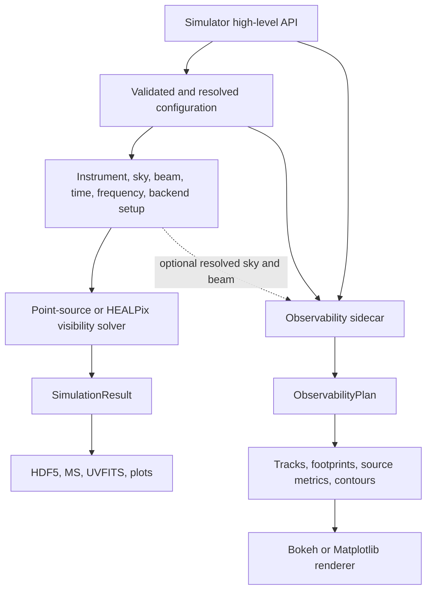
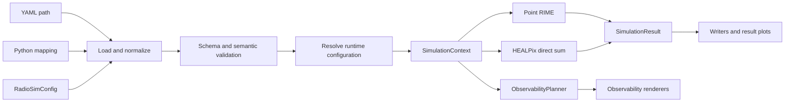
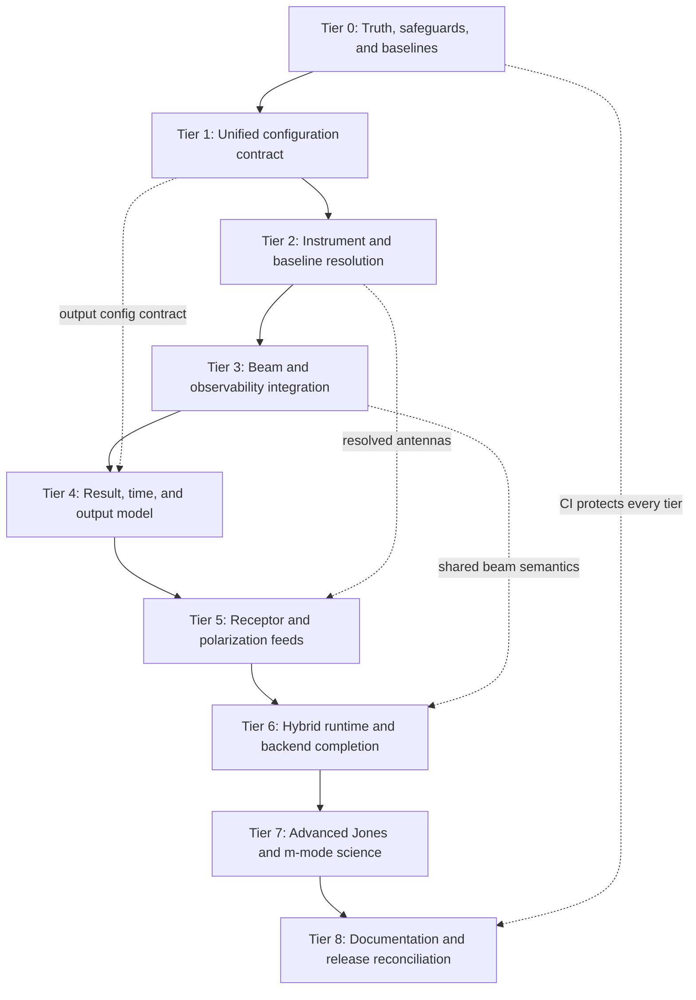

# RadioSim Remediation and Completion Plan

| Plan metadata | Value |
|---|---|
| Status | Tier 1 locally complete and independently accepted on 2026-07-17; Tier 2 independently accepted and complete after correction on 2026-07-20; INS-001, INS-002, and INS-003 closed; remote CI not yet observed |
| Prepared | 2026-07-14 |
| Current release | 0.2.0 |
| Baseline commit | `73ae7a3` (`main`, aligned with `origin/main`) |
| Test inventory | 1,178 tests collected from 69 test files |

## 1. Purpose

This document is the source-of-truth plan for resolving the configuration,
high-level API, instrument-model, beam, output, backend, documentation, and
scientific-completeness gaps found during a source-first review of RadioSim.

It records:

- every issue raised during the codebase walkthrough and follow-up questions;
- what the current implementation actually does;
- why the behavior is inconsistent or incomplete;
- the target behavior and architectural direction;
- a dependency-ordered implementation plan;
- tests, acceptance criteria, and stop gates for every tier;
- work that is a normal defect fix versus work that is a larger scientific
  feature.

This is not authorization to implement all tiers in one change. Each tier must
be delivered and reviewed independently.

### 1.1 History-rewrite boundary

The repository history was intentionally rewritten before this plan was
created. Files removed by that rewrite are outside this plan and must not be
restored merely because an older audit or commit mentioned them.

This plan is based on the live checkout at the baseline above. In particular:

- the former `FIX.md`, `CurrentIssues.md`, and `SkyRemediationPlan.md` are not
  present and are not prerequisites for this work;
- deleted GitHub-history content must not be reconstructed;
- `project.md` remains present locally, but is not treated as runtime truth;
- the current source, tests, manifests, README, Sphinx documentation, examples,
  and `AGENTS.md` govern this plan.

## 2. Repository baseline

The live checkout has the following relevant properties:

| Surface | Current state |
|---|---|
| Package version | `0.2.0` |
| Pixi workspace version | `0.2.0` |
| Sphinx version/release | `0.2.0` |
| Pixi lock format | v7 |
| Python package modules | 150 |
| Test files | 69 |
| Tests collected | 1,178 |
| Sample YAML configs | 2 |
| Jones classes | 46 |
| Integration test directory | Only `__init__.py` |
| Performance test directory | Only `__init__.py` |
| Tracked `.github/` directory | Absent |
| `huggingface_space/` directory | Absent |

The version and lockfile inconsistencies are already resolved by commit
`73ae7a3`. They remain documented below because they were part of the original
review and establish the expected release discipline.

## 3. Correct high-level architecture

The observability planner must not be described as a visibility-simulation
product. It is a sibling planning and visualization capability exposed through
the same high-level API.



The visibility branch produces baseline-dependent complex data. The
observability branch produces a renderer-neutral observing plan and does not
calculate baseline visibilities.

### 3.1 Target architecture after remediation

All entry points should pass through the same validation and resolution stages:



`SimulationContext` is a conceptual target name. The implementation may use
several focused immutable models instead of one large object, but the resolved
state must have a single owner.

## 4. Governing decisions

### 4.1 Pre-v1 API policy

RadioSim is pre-v1.0. The implementation should prefer a coherent replacement
over compatibility shims when the current API is misleading or structurally
wrong.

Therefore:

- do not add adapters merely to preserve legacy beam-config field names;
- remove redundant boolean switches when the presence of typed data expresses
  the same decision more clearly;
- reject unsupported settings instead of accepting silent no-ops;
- do not preserve raw-dictionary behavior if it prevents one reliable
  configuration contract;
- document intentional breaking changes in the changelog and migration guide;
- add this policy explicitly to `docs/contributing.rst` as required by
  `AGENTS.md`.

### 4.2 Truthfulness rule

A field or public class may be in one of four states:

1. implemented and tested;
2. experimental and explicitly gated;
3. unsupported and rejected with an actionable error;
4. absent from the public surface.

RadioSim must not validate a setting, silently ignore it, and then imply that
the setting affected the simulation.

### 4.3 Precedence must be explicit

Where several sources can provide the same value, resolution precedence must
be centralized, documented, and included in result provenance. It must not be
created accidentally through mutation order in `Simulator.setup()`.

### 4.4 Scientific features require scientific tests

Receptor bases, Jones terms, beam interpolation, hybrid-sky summation, and
spherical-harmonic solvers are not complete merely because code executes. They
require analytic invariants, reference cases, and cross-implementation checks.

## 5. Issue register

Status values used below:

- **DONE**: resolved and verified in the current checkout;
- **OPEN**: confirmed live defect or incomplete contract;
- **DECISION**: design choice required before implementation;
- **ROADMAP**: substantial scientific or performance feature;
- **DOCS**: documentation/example/release-truth work.

| ID | Status | Issue | Planned tier |
|---|---|---|---|
| REL-001 | DONE | Pixi workspace version differed from package/Sphinx | 0 |
| REL-002 | DONE | Pixi lockfile used v6 format | 0 |
| CFG-001 | DONE | CLI/API/mapping/model/parameter inputs share one strict resolution pipeline | 1 |
| CFG-002 | DONE | Typed config and every override surface honor centralized backend precedence | 1 |
| CFG-003 | DONE | Unsupported non-default fields are exhaustively classified and rejected before side effects | 1 |
| INS-001 | DONE | Per-antenna diameter map is ignored and loaded values are overwritten | 2 |
| INS-002 | DONE | pyuvdata telescope flags are not wired | 2 |
| INS-003 | DONE | Baseline-selection fields are ignored | 2 |
| BEAM-001 | OPEN | Modern FITS/per-antenna beam config is not connected to `Simulator` | 3 |
| BEAM-002 | OPEN | `BeamManager` expects a different legacy config contract | 3 |
| BEAM-003 | OPEN | HEALPix NSIDE beam advisor reads antenna dictionaries incorrectly | 3 |
| OBS-001 | OPEN | Observability is architecturally misclassified as a product | 3 |
| OBS-002 | DECISION | Heterogeneous-array observability beam semantics are undefined | 3 |
| OUT-001 | OPEN | Output controls are only partially honored | 4 |
| OUT-002 | OPEN | Point, HEALPix, and writer time-grid counts disagree | 4 |
| OUT-003 | OPEN | HDF5 drops correlations and forces `complex128` | 4 |
| OUT-004 | OPEN | JSON output contains no visibility data | 4 |
| OUT-005 | OPEN | HDF5 reader uses unsafe `eval()` | 4 |
| OUT-006 | OPEN | UVFITS is accepted by config but unsupported by `save()` | 4 |
| POL-001 | OPEN | Top-level feed/receptor config is ignored | 5 |
| POL-002 | ROADMAP | Receptor and basis-transform Jones terms are identity stubs | 5 |
| RUN-001 | OPEN | `run(n_workers=...)` is unused | 6 |
| RUN-002 | OPEN | Sky loading hard-codes `max_workers=8` | 6 |
| RUN-003 | OPEN | High-level API forces point or HEALPix and cannot preserve hybrid sky | 6 |
| RUN-004 | ROADMAP | Backend abstraction is not yet performance-bearing end to end | 6 |
| SCI-001 | ROADMAP | Most Jones classes are public identity-returning stubs | 7 |
| SCI-002 | ROADMAP | Spherical-harmonic/m-mode mode is advertised but unimplemented | 7 |
| SCI-003 | ROADMAP | Advanced beam-physics TODOs remain | 7 |
| DOC-001 | DOCS | `simple_simulation.py` uses stale private/result APIs | 8 |
| DOC-002 | DOCS | README low-level baseline example is invalid | 8 |
| DOC-003 | DOCS | Sphinx references removed Jones class names | 8 |
| DOC-004 | DOCS | README claims 15+ configs while two exist | 8 |
| DOC-005 | DOCS | README/backend documentation contradicts live backend behavior | 8 |
| DOC-006 | DOCS | `project.md` is stale and still describes RRIVis | 8 |
| DOC-007 | DOCS | `AGENTS.md` describes an absent Hugging Face app | 8 |
| DOC-008 | DOCS | No tracked CI and no real integration/performance suites | 8 |

## 6. Question-by-question findings and target behavior

### 6.1 REL-001 — Version inconsistency

#### Current state

Resolved. The following now agree on `0.2.0`:

- `pyproject.toml`;
- `pixi.toml`;
- `src/radiosim/__about__.py`;
- `docs/conf.py`.

#### Required ongoing control

Add a small release-metadata test or release script that reads all four values
and fails when they diverge. A future version bump should be one command or one
reviewable change set.

#### Acceptance criteria

- one automated check covers every authoritative version surface;
- documentation and CLI report the same release;
- the release checklist includes the version-consistency check.

### 6.2 REL-002 — Pixi v6 lockfile warning

#### Meaning

The warning meant that the dependency solution was current but stored in an
older Pixi lockfile schema. It was not an installation failure and did not mean
that dependencies were unresolved.

#### Current state

Resolved. `pixi.lock` is now v7 and records explicit platform virtual packages.
`pixi install` completes without the v6 warning.

#### Ongoing rule

Lockfile-format upgrades should be isolated or explicitly called out because
they can produce large structural diffs even when package intent is unchanged.

### 6.3 OBS-001 — Why observability is not a simulation product

`ObservabilityPlanner` builds a renderer-neutral `ObservabilityPlan` containing
tracks, footprint masks, contours, snapshots, and source metrics. It does not
calculate baseline-dependent visibilities.

`Simulator.plot_observability()` connects it to the public API, but that makes
it a sibling capability, not a child of the result writer. It can use config and
an optionally prepared sky model without consuming `Simulator.run()` output.

#### Target behavior

- architecture diagrams place observability beside the simulation pipeline;
- `plot_observability()` accepts a resolved context or clearly resolves the
  required subset itself;
- observability never implies that it is plotting calculated visibilities;
- documentation distinguishes visibility plots from observability plots.

#### Heterogeneous-array decision

For different per-antenna beams or diameters, a single array footprint is
ambiguous. Before wiring heterogeneous beams into observability, choose one of:

1. require a `reference_antenna`;
2. display a selected antenna and label it;
3. display an intersection/union envelope with explicit semantics;
4. display several antenna footprints.

Recommended first implementation: require or default a clearly reported
reference antenna, then add envelopes later.

### 6.4 INS-001 — Per-antenna diameters

#### Current behavior

`AntennaLayoutConfig` defines:

- `all_antenna_diameter`;
- `use_different_diameters`;
- `diameters`.

`Simulator.setup()` nevertheless assigns `all_antenna_diameter` to every loaded
antenna. This overwrites values read from supported antenna formats and ignores
the per-antenna map.

The downstream solver is already capable of using heterogeneous diameters:
point visibility builds a per-antenna diameter map, and the HEALPix path reads
each antenna's `diameter`. The missing work is resolution in setup.

#### Target configuration

Prefer a simpler pre-v1 contract:

```yaml
antenna_layout:
  default_diameter_m: 14.0
  diameters_by_antenna:
    "0": 12.0
    "1": 25.0
```

Remove `use_different_diameters`; the override map already expresses the
intent. If retaining current names temporarily is useful for the implementation
branch, remove them before finalizing the public API rather than creating a
long-lived deprecation shim.

#### Resolution precedence

Recommended precedence, highest first:

1. explicit per-antenna config override;
2. diameter supplied by the selected antenna-layout source;
3. explicitly enabled pyuvdata telescope diameter;
4. configured default diameter.

Every resolved diameter must be finite and positive. Unknown mapping keys and
unresolved antenna IDs must fail during setup.

#### Acceptance criteria

- heterogeneous diameters reach both solvers unchanged;
- file-provided diameters are not overwritten unless explicitly overridden;
- result metadata records the resolved diameter and its source per antenna;
- invalid, missing, or unknown mappings fail before sky loading;
- baseline metadata no longer encodes diameters as an opaque string.

#### Resolution (2026-07-20)

**DONE.** Tier 2 replaced the ignored legacy map with typed per-antenna overrides and
one complete canonical instrument. Resolution applies `override > source > configured
default`, records the winning source and the original source fact, rejects unknown,
duplicate, non-finite, non-positive, or unresolved values before runtime side effects,
and passes exact heterogeneous diameters to both solvers, results, plots, and writers.
No consumer invents a 14-metre fallback.

### 6.5 BEAM-001/002 — FITS, per-antenna, and mixed beams

#### Current behavior

The Pydantic schema validates a modern contract:

- `beam_mode: analytic | fits | mixed`;
- `per_antenna`;
- `beam_file`;
- `antenna_beam_map`;
- FITS normalization and interpolation settings.

The high-level simulator initializes `_beam_manager` to `None` and never
assigns it. Setup copies only analytic-beam fields into `_beam_config`.

The existing `BeamManager` uses a different contract:

- `use_beam_file`;
- `use_different_beams`;
- `beam_file_path`;
- `beam_files`;
- `beams_per_antenna`.

Consequently, validated modern beam fields never reach the FITS implementation.

#### Root cause

The configuration surface and the beam manager evolved independently. The
runtime contains the low-level FITS machinery, and the schema describes the
desired high-level behavior, but there is no modern resolution boundary between
them.

#### Target behavior

Refactor `BeamManager` to consume resolved modern beam assignments directly:

| Mode | Resolution |
|---|---|
| `analytic` | No FITS handler; every antenna uses analytic E-Jones |
| `fits`, shared | Load one FITS handler and assign it to every antenna |
| `fits`, per antenna | Resolve one FITS path per antenna |
| `mixed` | Resolve each antenna to either `analytic` or a FITS path |

Do not translate modern fields into the legacy keys as a permanent adapter.

#### Additional requirements

- normalize antenna mapping keys once;
- deduplicate identical FITS paths without changing assignments;
- validate file existence and coverage before simulation;
- propagate `beam_peak_normalize`, interpolation, ZA, and frequency-domain
  settings;
- fail loudly rather than silently falling back to analytic beams;
- use the same manager in point and HEALPix paths;
- use the same resolved beam definition in observability.

#### Acceptance criteria

- shared FITS, per-antenna FITS, and mixed modes have end-to-end tests;
- a known synthetic UVBeam gives predictable Jones values;
- both visibility paths agree for equivalent scalar/diagonal beams;
- missing antenna assignments and out-of-domain requests produce actionable
  errors;
- observability reports which antenna or envelope it displays.

### 6.6 INS-003 — Baseline-selection fields

#### Current behavior

`BaselineSelectionConfig` defines autocorrelation, cross-correlation, length,
tolerance, and angle controls. `generate_baselines()` always creates all
`ant1 <= ant2` combinations, including both autos and crosses. The high-level
simulator does not apply a selection stage.

The current CLI source itself lists advanced baseline filtering as unfinished
modular-API work.

#### Target design

Keep baseline generation and baseline selection separate:

```text
resolved antennas
    -> generate canonical baselines
    -> select baselines
    -> validate non-empty selection
    -> freeze selected baseline inventory
```

Create a focused function such as:

```python
select_baselines(
    baselines,
    *,
    include_autocorrelations,
    include_crosscorrelations,
    lengths_m,
    length_tolerance_m,
    azimuth_ranges_deg,
)
```

The exact public name may differ, but selection logic must not be embedded as a
large conditional block in `Simulator.setup()`.

#### Scientific details

- document ENU baseline azimuth convention;
- support ranges that wrap through 0 degrees;
- filter autocorrelations before computing angle because their direction is
  undefined;
- define whether a baseline matches either orientation or only the stored
  `ant1 -> ant2` direction;
- reject negative lengths and malformed angle ranges at schema validation;
- reject a final empty selection with the resolved criteria in the error.

#### Acceptance criteria

- exact baseline counts for auto-only, cross-only, and combined cases;
- tolerance-boundary tests;
- wrapped-angle and opposite-direction tests;
- selection metadata is saved with results;
- CLI and API produce the same selected baseline set.

#### Resolution (2026-07-20)

**DONE.** Tier 2 now generates one immutable, numeric-order baseline inventory with
`ant2 - ant1` vectors, then applies one typed selection pass shared by every consumer.
Correlation, target/range length, and axial-azimuth filters implement the documented
union/intersection algebra, tolerance boundaries, autocorrelation treatment, stable
empty failure, and complete stage-count provenance. YAML, mapping, model, parameter,
CLI, solver, result, plot, and writer paths use the same selected tuple.

### 6.7 POL-001 — Feed fields

#### Important terminology split

RadioSim currently uses “feed” for two different concepts:

1. `beams.feed_model` describes illumination of an aperture or reflector by a
   horn, waveguide, or dipole. This is wired into analytic beam computation.
2. top-level `feeds` describes receptor polarization/basis and per-antenna feed
   type. This is ignored by `Simulator`.

These concepts must not share ambiguous names in the final API.

#### Why top-level feeds cannot be wired mechanically

The solver assumes a linear X/Y basis and returns `XX`, `XY`, `YX`, and `YY`.
`ReceptorConfigJones` and `BasisTransformJones` are identity stubs. Merely
attaching `feed_type` strings to antennas would falsely imply correct circular
or heterogeneous polarization physics.

#### Target design

- rename beam illumination settings clearly, for example under
  `beams.illumination`;
- replace top-level `feeds` with a typed receptor/basis model;
- support at least `linear` and `circular` bases;
- model feed orientation separately from basis;
- define one output basis for heterogeneous arrays and transform each antenna
  into it;
- generate appropriate correlation labels and file-format polarization codes;
- implement C/H Jones matrices before claiming receptor support.

#### Acceptance criteria

- analytic linear-to-circular transform tests;
- Stokes-to-correlation energy-conservation tests;
- correct `XX/XY/YX/YY` and `RR/RL/LR/LL` labels;
- polarized-source cross-hand tests;
- Measurement Set and UVFITS polarization metadata round trips;
- unsupported heterogeneous combinations fail explicitly until implemented.

### 6.8 INS-002 — pyuvdata telescope flags

#### Current behavior

`TelescopeConfig` defines flags for known telescope, location, antennas, and
diameters. The high-level setup nevertheless requires an antenna file and reads
location directly from config. The flags are not consumed.

Reading antenna information from an MS or UVFITS file is not the same as
resolving `Telescope.from_known_telescopes()`.

#### Target design

Create an instrument resolver responsible for:

- loading a known pyuvdata telescope when requested;
- converting antenna positions into RadioSim's documented coordinate frame;
- merging explicit config, file, and pyuvdata sources according to one
  precedence table;
- resolving location, names, numbers, positions, diameters, and mount metadata;
- retaining provenance for every resolved field;
- detecting inconsistent antenna-number inventories across sources.

Recommended field precedence:

| Field | Highest precedence | Fallbacks |
|---|---|---|
| Location | Explicit config | pyuvdata, project default only if documented |
| Positions | Explicit selected layout source | pyuvdata when enabled |
| Diameter | Per-antenna override | layout, pyuvdata, default |
| Names/numbers | Selected position source | validated mapping |
| Mount/feed metadata | Explicit config | pyuvdata when enabled |

Avoid a master boolean plus several contradictory sub-flags. Prefer an explicit
source selection and per-field override model.

#### Resolution (2026-07-20)

**DONE.** Tier 2 removed the inert pyuvdata booleans and replaced them with an exact
`known_telescope` source contract, distinct from Measurement Set and UVFITS dataset
sources. The resolver loads the selected source through an offline-testable injected
boundary, preserves identity, location, positions, diameters, mount metadata, pyuvdata
version, and registry policy in provenance, disables both registry-update flags where
required, converts relative ECEF scientifically to canonical ENU, and rejects explicit
metadata mismatches. High-level Simulator setup uses this resolved source directly.

### 6.9 CFG-002 — Compute backend ignored by `Simulator.from_config()`

#### Current behavior

`Simulator.from_config()` extracts precision and then constructs `Simulator`
without passing `radiosim_config.compute.backend`. The constructor default
`backend="auto"` therefore wins.

The config-mode CLI separately resolves:

```text
explicit CLI backend unless it is "auto"
    -> otherwise config.compute.backend
```

The Python API and CLI can therefore run the same YAML on different backends.

#### Target behavior

Use `None` to mean “no explicit override” because `auto` is a legitimate
backend value:

```python
Simulator.from_config(path, *, backend: str | None = None)
```

Resolution order:

1. explicit API/CLI override;
2. `config.compute.backend`;
3. documented package default.

The resolved backend name and device must be included in result metadata.

#### Acceptance criteria

- `from_config()` honors `compute.backend`;
- explicit overrides win identically in CLI and Python;
- `auto` remains selectable as an actual strategy;
- unavailable explicit backends fail rather than silently falling back;
- backend-resolution tests do not depend on a physical GPU.

#### Resolved current behavior (2026-07-17)

`Simulator.from_config()` now accepts only typed `RadioSimConfig`, and all
document/API/CLI paths resolve `execution.backend` through the same frozen
override model and resolver. `None` means no override, explicit values win,
`auto` remains a real strategy, and NumPy remains the declared deterministic
default. The resolved strategy is retained in runtime/provenance. Explicitly
unavailable or precision-incompatible backends fail rather than falling back;
the backend factory also rejects any requested precision it cannot represent.

### 6.10 OUT-001 — What “output controls mostly honored” means

The current status is:

| Field | Current status | Required decision/fix |
|---|---|---|
| `simulation_data_dir` | Honored by config-mode CLI | Retain as CLI orchestration |
| `simulation_subdir` | Honored or auto-generated | Retain and test |
| `output_file_name` | Honored by `Simulator.save()` | Retain |
| `output_file_format` | HDF5/JSON/MS dispatched; UVFITS unsupported | Implement or reject UVFITS |
| `save_simulation_data` | Honored by CLI | Retain as CLI orchestration |
| `overwrite_output` | Partially honored | Unify folder and file policy |
| `skip_overwrite_confirmation` | Honored | Clarify noninteractive behavior |
| `prompt_for_output_suffix` | Ignored | Honor it or remove it |
| `plot_results` | Honored | Retain |
| `open_plots_in_browser` | Honored | Retain |
| `plotting_backend` | Passed to plotting | Type and validate choices |
| `save_log_data` | Honored | Retain |
| `angle_unit` | Ignored by high-level path | Thread through or remove |
| `skymodel_frequency` | Ignored | Thread through or remove |

The final design should separate scientific simulation configuration from CLI
workflow/output orchestration. Calling `Simulator.run()` from Python should not
implicitly perform CLI-style saving or prompting.

### 6.11 CFG-001 — Validation differences between entry points

There are currently three validation depths:

| Entry point | Current validation |
|---|---|
| Config-mode CLI | Pydantic construction plus explicit `config.validate()` preflight |
| `Simulator.from_config()` | Pydantic construction, but no explicit semantic preflight |
| `Simulator(config={...})` | Shallow dictionary copy; no full Pydantic validation |

`RadioSimConfig` also allows extra top-level fields, while nested models may
ignore extras under Pydantic defaults. This permits typos and unsupported fields
to survive differently depending on their location.

#### Why raw dictionaries exist

The raw path supports concise programmatic and test configurations. It is
convenient for constructing only the sections needed by a particular test, but
it makes behavior entry-point-dependent and moves failures into setup.

#### Target design

All configuration sources must pass through one boundary:

1. parse/coerce source-specific values;
2. validate types and local field constraints;
3. run semantic and cross-field validation;
4. resolve paths relative to the correct source;
5. resolve runtime defaults and explicit overrides;
6. produce immutable/frozen runtime configuration.

Before changing extras to `forbid`, inventory and type every legitimate live
field, including the explicit `frequencies_hz` array used by the programmatic
constructor.

#### Acceptance criteria

- equivalent YAML, mapping, and typed-model input resolve identically;
- validation errors occur before device detection, network checks, or sky
  loading;
- unsupported settings cannot silently become no-ops;
- partial test fixtures use explicit test builders instead of weakening the
  production constructor;
- path-resolution semantics are identical and documented.

#### Resolved current behavior (2026-07-17)

YAML, raw mapping, typed model, convenience parameters, root config mode,
`validate`, and the exposed `simulate` surface now use the same strict schema,
override, semantic/unsupported, path, and immutable-runtime resolution stages.
Direct `Simulator` construction accepts only `ResolvedSimulationConfig`; the
old raw/partial constructor path is absent. Invalid input fails before backend,
device, network, loader, output, plotting, browser, or workflow side effects.
Path bases and override origins remain explicit in immutable provenance.

### 6.12 CFG-003 — Unsupported fields silently becoming no-ops

#### Resolved current behavior (2026-07-17)

The complete strict input-model inventory covers 281 field occurrences. Every
accepted field is either resolved into supported scientific/workflow behavior
or classified as deferred. The operational deferred-feature matrix covers 34
non-default cases across the capable public entry points; all 34 reject with an
exact configuration error before side effects. Entry points such as
`radiosim simulate` omit deferred fields they cannot express. No unsupported
state is representable in `ResolvedSimulationConfig`, and no generic loader
option, raw mapping, compatibility-key, or partial-fixture escape hatch remains.

## 7. Additional confirmed gaps from the broader review

### 7.1 BEAM-003 — NSIDE beam advisor bug

`Simulator.setup()` iterates `self._antennas` as if it contains antenna objects
with `.diameter`; it actually contains dictionary keys. The broad exception
handler converts this bug into `beam_fwhm_rad=None`, silently disabling the
advisor.

Fix this only after diameter resolution has a canonical representation. Do not
patch it with another dictionary/object special case that perpetuates mixed
antenna representations.

### 7.2 RUN-001/002 — Worker controls

`Simulator.run(n_workers=...)` documents a worker count but never uses it.
Sky-model setup separately hard-codes `max_workers=8`.

These are two different concurrency concerns and should not share one ambiguous
parameter:

- sky-loader concurrency belongs to setup/data loading;
- visibility computation concurrency belongs to a solver execution policy.

Define them separately, for example through typed compute settings, and record
the resolved values in runtime metadata.

### 7.3 RUN-003 — Hybrid sky support

`SkyModel` can preserve point and HEALPix payloads simultaneously, but the
high-level `VisibilityConfig` accepts only `point_sources` or `healpix_map` and
`Simulator.run()` chooses one solver branch.

The correct hybrid implementation is not lossy conversion. It is:

```text
V_total = V_point + V_healpix
```

Both components must use the same resolved baselines, time grid, frequencies,
phase convention, polarization basis, backend policy, and result shape. Sky
provenance/disjointness rules must prevent accidental double counting.

### 7.4 RUN-004 — Backend reality

The backend abstraction is partially wired into point-source array operations,
but the orchestration remains dominated by host-side Python loops, Astropy
coordinate transforms, and host/device transfers. HEALPix code still contains
NumPy-specific operations. JAX/Numba selection therefore does not yet imply
end-to-end acceleration.

The README currently contains mutually inconsistent claims: some sections say
the solver is NumPy-only, while the live point path does dispatch selected array
operations. Documentation should say:

- backend array operations are partially integrated;
- correctness parity is more mature than performance integration;
- GPU acceleration is not yet demonstrated end to end;
- Numba must not be called a production JIT solver unless the solver actually
  uses compiled kernels.

### 7.5 SCI-001 — Jones identity stubs

The package exports 46 Jones classes. Only geometric phase K and primary beam E
currently provide substantive forward-model effects. Most other terms return
identity matrices.

This is not one defect. It is a collection of separate scientific features.
Public identity stubs are risky because a user can add a term to a chain and
observe no change without an error.

Until each term is implemented, choose one truthful policy:

- remove it from the public surface;
- raise `NotImplementedError` when used;
- place it behind an explicit experimental namespace.

Silently multiplying by identity is not an acceptable final behavior.

### 7.6 SCI-002 — Spherical-harmonic mode

The config accepts `calculation_type="spherical_harmonic"`, but setup raises
`NotImplementedError`. This is a roadmap solver, not a small conditional branch.

Until an m-mode solver exists, schema validation should reject the option or the
option should be removed. When implemented, it should be a separate simulator
strategy registered alongside direct RIME, with direct-sum agreement tests on
small tractable skies.

### 7.7 OUT-002 — Time-axis disagreement

The point solver uses floor-like `int(duration / step)`, the HEALPix solver uses
`ceil`, and `Simulator.save()` reconstructs a floor-like time axis. A duration
that is not evenly divisible by the cadence can therefore produce mismatched
result and file coordinates.

Create one authoritative time-grid function. Solvers and writers must consume
the resulting time array rather than independently reconstructing it.

The contract must define whether the observation endpoint is included. That
choice must be tested for divisible and non-divisible durations.

### 7.8 OUT-003/004/005/006 — Output correctness and safety

Current high-level HDF5 output:

- extracts only `I`, with `XX` fallback;
- drops `XY`, `YX`, `YY`, and basis metadata;
- forces `complex128` regardless of configured output precision;
- stringifies much of the metadata;
- stores baseline tuples in group names.

Current JSON output stores metadata, frequencies, and a baseline count, but no
visibility values.

The HDF5 reader uses `eval()` to parse baseline tuples. This is unsafe for
untrusted files and unnecessary even for trusted files.

UVFITS is present in `OutputConfig` but absent from `Simulator.save()`.

These problems should be fixed through a canonical result model and versioned
file schema, not by adding more conversion branches to `Simulator.save()`.

### 7.9 DOC-001 through DOC-008 — Documentation and project truth

Confirmed current drift includes:

- `examples/scripts/simple_simulation.py` references nonexistent
  `sim._sources`;
- it formats the memory-estimate dictionary as a float;
- it treats a per-baseline correlation dictionary as an array with `.shape`;
- README and Sphinx call `generate_baselines(antennas)` without its required
  beam metadata arguments;
- several Sphinx pages refer to nonexistent `GeometricDelayJones` rather than
  the live geometric class;
- README claims 15+ configs while `configs/` has two YAML files;
- `project.md` retains old RRIVis naming and stale claims;
- `AGENTS.md` describes `huggingface_space/`, which is absent;
- no `.github/` workflow is tracked;
- integration and performance directories contain no real tests.

Documentation should be corrected after each API tier, followed by a final
cross-repository truth sweep in Tier 8.

## 8. Tier dependency map



The linear order is deliberate. Some implementation work could technically be
parallelized, but merging it out of order would create temporary contracts and
duplicated migration work.

## 9. Tier 0 — Truth, safeguards, and baselines

### Objective

Establish a reliable baseline and prevent later tiers from adding more silent
drift.

### Already complete

- package/Pixi/Sphinx version alignment;
- Pixi lockfile v7 migration;
- creation of this plan.

### Implementation record — 2026-07-14

**Status:** Tier 0 is implemented and passes its local verification gate. The
new GitHub Actions workflow has been structurally validated and its commands
have been mirrored locally where the current macOS arm64 host permits. It has
not run remotely, so this record does not claim that GitHub Actions or the
Linux/macOS Intel jobs are green.

Implemented safeguards:

- added the contributor-facing pre-v1 API/configuration evolution policy;
- added one actionable release-metadata consistency test covering
  `pyproject.toml`, `pixi.toml`, `src/radiosim/__about__.py`, both Sphinx
  version fields, and the installed `radiosim.__version__`;
- added a v7 lock-format test and locked Pixi installs in CI;
- added Python 3.11 and 3.12 Pixi environments with lock solutions for
  `linux-64`, `osx-64`, and `osx-arm64`;
- added a six-combination non-slow CI matrix plus a Linux/Python 3.11 quality
  job for Ruff, release metadata, strict-Pyright debt enforcement, and Sphinx;
- added a checked-in strict-Pyright error ceiling and a typed helper that fails
  on an increase or an unreviewed Pyright-version change and refuses to raise
  the ceiling during an intentional update;
- added the Sphinx configuration-support matrix and linked it from the user
  guide toctree;
- added narrow, tested pre-setup guards for confirmed explicit silent no-ops;
- made the documented `make -C docs html` command invoke Sphinx through the
  checked-in Pixi environment.

#### Exact baseline and post-change results

| Command | Pre-change result | Post-change result |
|---|---|---|
| `pixi install` | exit 0 | exit 0; default Python 3.11 environment installed |
| `pixi run test -- --collect-only -q` | exit 0; 1,178 tests; 3.50 s | exit 0; 1,213 tests; 3.66 s |
| `pixi run test -- -m "not slow"` | exit 0; 1,177 passed, 1 skipped, 26 warnings; 132.60 s | exit 0; 1,212 passed, 1 skipped, 26 warnings; 138.27 s |
| `pixi run test` | exit 0; 1,177 passed, 1 skipped, 26 warnings; 134.31 s | exit 0; 1,212 passed, 1 skipped, 26 warnings; 136.97 s |
| `pixi run lint` | exit 0; all checks passed | exit 0; all checks passed |
| `pixi run check-format` | exit 0; 237 files already formatted | exit 0; 239 files already formatted |
| `pixi run typecheck` | exit 1; 4,600 errors, 0 warnings, 0 information; Pyright 1.1.408; 14.08 s | exit 0; strict ceiling satisfied at 4,600 <= 4,600; Pyright 1.1.408; 13.18 s |
| `make -C docs html` | exit 2; `sphinx-build` not found; Sphinx did not start | exit 0; build succeeded with 242 warnings; 26.67 s |

Additional verification completed:

- `pixi install --locked --environment py312` and `pixi lock --check` passed;
- the focused release/guard suite passed on both Python 3.11 and 3.12
  (39 passed in 6.00 s and 39 passed in 5.86 s, respectively);
- the release-metadata test passed directly (3 passed), including its
  actionable mismatch path without leaving a repository change;
- all new negative guard branches were exercised, the default/working analytic
  beam controls remained accepted, and aggregation of multiple unsupported
  fields was tested;
- the workflow YAML parsed structurally, the new Sphinx page is in the toctree,
  the rendered contributor policy and support matrix were inspected, and
  `git diff --check` passed.

#### Tier 0 disposition of unsupported-option candidates

| Candidate | Disposition |
|---|---|
| `visibility.calculation_type="spherical_harmonic"` | Guarded now; target Tier 7 |
| configured `UVFITS` output | Guarded now; direct `save(format="uvfits")` already fails clearly; target Tier 4 |
| FITS/mixed/per-antenna beam modes, maps, files, and FITS controls | Guarded now; target Tier 3 |
| heterogeneous-diameter switch or non-empty map | Guarded now; target Tier 2 |
| enabled `telescope.use_pyuvdata_*` flags | Guarded now; target Tier 2 |
| non-default top-level receptor/feed fields | Guarded now; target Tier 5 |
| alternative/cross-check simulator settings | Guarded now; target Tier 7 |
| non-default output angle or sky-model plot frequency | Guarded now; target Tier 4 |
| explicit `Simulator.run(n_workers=...)` | Guarded now; target Tier 6 |
| analytic `beams.feed_model`, `feed_computation`, and `feed_params` | Confirmed supported and left enabled |
| baseline-selection settings | Documented and deferred to Tier 2 because current defaults conflict with runtime behavior |
| `compute.backend` entry-point inconsistency | Documented and deferred to Tier 1 |
| `output.prompt_for_output_suffix` policy inconsistency | Documented and deferred to Tier 4 |

Optional GPU/accelerator behavior, optional JAX correctness, Measurement Set
round trips, and other optional scientific backends were not established by
this Tier 0 gate. No remote GitHub Actions result has been observed. Tier 1 and
all later implementation work remain open and unstarted.

### Work items

1. Add the pre-v1 breaking-change note to `docs/contributing.rst`.
2. Add a version-consistency test or release check.
3. Add a tracked CI workflow for supported Python/platform combinations.
4. Run and record the full test baseline.
5. Run type checking and record existing debt rather than requiring an
   unrealistic all-green conversion in the same tier.
6. Establish a “no new type errors” policy until the existing baseline is
   reduced.
7. Add a config-support matrix to developer documentation showing which fields
   are implemented, rejected, or roadmap.
8. Mark currently unsupported high-risk choices as errors where doing so does
   not depend on the Tier 1 redesign.

### Likely files

- `docs/contributing.rst`;
- `pyproject.toml`;
- `.github/workflows/ci.yml`;
- new focused tests under `tests/unit/`;
- `README.md` or a new developer-facing support-matrix document.

### Verification gate

```bash
pixi install
pixi run lint
pixi run check-format
pixi run test -- -m "not slow"
pixi run typecheck
make -C docs html
```

If type checking is not green, record the exact baseline and fail only on an
increase until a dedicated type-debt effort is approved.

### Suggested commits

- `docs: state pre-v1 API evolution policy`
- `test: enforce release metadata consistency`
- `ci: add baseline lint test and docs workflow`

### Exit criteria

- CI runs on every proposed change;
- version drift is automatically detectable;
- unsupported public settings are visibly classified;
- the test and type-check baselines are recorded.

## 10. Tier 1 — Unified configuration contract

### Objective

Ensure YAML, Python mappings, typed config objects, and CLI overrides resolve to
the same validated runtime configuration.

### Design work before coding

1. Inventory every key accessed through `config.get(...)` in source.
2. Compare that inventory with Pydantic fields.
3. Classify each field as scientific configuration, execution policy, output
   workflow, or deprecated/unsupported.
4. Decide the immutable resolved models required by setup.
5. Define override precedence and path-resolution rules.

### Implementation work

1. Add typed fields for legitimate live extras such as `frequencies_hz`.
2. Introduce one loader/normalizer used by:
   - `Simulator.from_config()`;
   - `Simulator(config=...)` or its clean replacement;
   - config-mode CLI;
   - `radiosim validate`.
3. Fold semantic preflight into a normal validation/resolution API instead of a
   separate method that only the CLI remembers to call.
4. Make `Simulator` retain typed or frozen configuration rather than a mutable
   raw dictionary.
5. Use `None` as the explicit-override sentinel for backend and precision.
6. Resolve `compute.backend` consistently.
7. Reject unknown/unsupported fields after the live-field inventory is typed.
8. Replace production partial-config behavior with explicit builders for tests
   and concise programmatic construction.
9. Preserve correct YAML-relative path resolution for every path field, not
   only the antenna file.

### Likely files

- `src/radiosim/io/config.py`;
- `src/radiosim/api/simulator.py`;
- `src/radiosim/cli/main.py`;
- `src/radiosim/utils/frequency.py`;
- `tests/unit/test_io/test_config.py`;
- `tests/unit/test_simulator/test_api.py`;
- new CLI tests under `tests/unit/test_cli/`.

### Required tests

- YAML/mapping/model equivalence;
- API/CLI backend precedence;
- explicit frequency arrays;
- unknown-field rejection;
- unsupported-field rejection;
- cross-field errors before side effects;
- relative paths from nested config locations;
- immutable resolved config behavior.

### Verification gate

```bash
pixi run test -- tests/unit/test_io/test_config.py
pixi run test -- tests/unit/test_simulator/test_api.py
pixi run test -- tests/unit/test_cli/
pixi run lint
pixi run check-format
pixi run test -- -m "not slow"
```

### Suggested commits

- `refactor(config): unify YAML mapping and API validation`
- `fix(api): honor configured backend resolution`
- `test(config): enforce CLI and API parity`

### Exit criteria

- one config has one resolved meaning regardless of entry point;
- `Simulator.from_config()` honors backend and semantic validation;
- raw typos cannot survive silently;
- no runtime stage mutates configuration to create precedence.

## 11. Tier 2 — Instrument and baseline resolution

### Status

**Complete and independently accepted after correction on 2026-07-20.** INS-001,
INS-002, and INS-003 are closed. Tier 3 implementation was not started. The next
authorized task is the separate Tier 3 design gate for beam and observability
integration.

### Objective

Create one resolved instrument inventory before sky and solver setup.

### Implementation work

1. Define typed resolved antenna/telescope models or an equivalent frozen
   internal representation.
2. Normalize antenna IDs and coordinate-frame metadata.
3. Implement known-telescope loading through pyuvdata.
4. Merge explicit config, selected layout source, and pyuvdata metadata using
   documented precedence.
5. Resolve per-antenna diameters without overwriting loaded values.
6. Validate complete, finite, positive diameters.
7. Generate canonical baselines from resolved antennas.
8. Implement a separate baseline-selection function.
9. Replace opaque baseline metadata strings such as `D1D2` with structured
   values or derive them from antenna references.
10. Store instrument and selection provenance in results.

### Likely files

- `src/radiosim/core/antenna.py`;
- `src/radiosim/core/baseline.py`;
- new focused instrument-resolution module under `core/` or `io/`;
- `src/radiosim/api/simulator.py`;
- `src/radiosim/io/config.py`;
- antenna, baseline, API, and config tests.

### Required tests

- uniform and heterogeneous diameter resolution;
- layout-file diameter preservation;
- explicit override precedence;
- pyuvdata location/position/diameter selection;
- source inventory mismatch errors;
- auto/cross baseline counts;
- length tolerance boundaries;
- angle wrap and orientation behavior;
- empty-selection error;
- point/HEALPix receipt of identical resolved antennas.

### Verification gate

```bash
pixi run test -- tests/unit/test_core/ -k "antenna or baseline"
pixi run test -- tests/unit/test_io/ -k "config or antenna"
pixi run test -- tests/unit/test_simulator/
pixi run test -- -m "not slow"
```

### Suggested commits

- `refactor(instrument): resolve telescope and antenna metadata once`
- `fix(instrument): apply heterogeneous antenna diameters`
- `feat(baseline): honor configured baseline selection`

### Exit criteria

- setup has one immutable antenna inventory;
- all enabled metadata sources follow tested precedence;
- every configured baseline-selection field affects the selected set;
- the solver no longer receives placeholder beam metadata from baseline
  generation.

## 12. Tier 3 — Beam and observability integration

### Objective

Connect modern analytic/FITS beam configuration to both solvers and ensure
observability represents the same instrument semantics.

### Implementation work

1. Replace `BeamManager`'s legacy config contract with resolved modern beam
   assignments.
2. Implement shared FITS, per-antenna FITS, and mixed modes.
3. Deduplicate handler instances for repeated paths.
4. Validate antenna coverage and beam domain before simulation.
5. Thread one manager through point and HEALPix solvers.
6. Remove silent analytic fallback on FITS initialization failures.
7. Fix the NSIDE advisor using the canonical antenna representation.
8. Make observability consume the resolved beam model.
9. Implement and document the reference-antenna/envelope decision.
10. Ensure analytic per-antenna diameter support remains intact.

### Likely files

- `src/radiosim/core/jones/beam/fits/handler.py`;
- `src/radiosim/core/jones/beam/fits/__init__.py`;
- `src/radiosim/core/jones/beam/analytic/`;
- `src/radiosim/core/visibility.py`;
- `src/radiosim/core/visibility_healpix.py`;
- `src/radiosim/api/simulator.py`;
- `src/radiosim/core/observability/`;
- beam, Jones, visibility, observability, config, and API tests.

### Required tests

- shared FITS assignment;
- unique and repeated per-antenna FITS assignment;
- mixed analytic/FITS assignment;
- missing/unknown antenna mapping;
- FITS frequency/ZA-domain errors;
- peak-normalization and interpolation propagation;
- point/HEALPix beam parity;
- observability reference-antenna labeling;
- advisor uses the widest beam from the resolved array.

### Verification gate

```bash
pixi run test -- tests/unit/test_jones/
pixi run test -- tests/unit/test_core/ -k "beam or visibility"
pixi run test -- tests/unit/test_observability/
pixi run test -- tests/unit/test_visualization/
pixi run test -- -m "not slow"
```

### Suggested commits

- `refactor(beam): replace legacy BeamManager config contract`
- `feat(beam): wire shared per-antenna and mixed FITS modes`
- `fix(observability): use resolved beam semantics`

### Exit criteria

- every valid beam mode changes the actual forward model as documented;
- FITS errors cannot become silent analytic simulations;
- observability and simulation share the same beam source;
- heterogeneous beam display semantics are explicit.

## 13. Tier 4 — Result, time, and output model

### Objective

Create one canonical result representation and make every writer preserve its
scientific content safely.

### Target result contract

The exact implementation may be a frozen dataclass, Pydantic model, or focused
container, but it must include:

- complex visibility data with named dimensions;
- baseline antenna IDs;
- time coordinates;
- frequency coordinates;
- correlation/feed-basis coordinates;
- antennas and location;
- phase center;
- precision/dtype;
- backend and simulator metadata;
- resolved config and provenance;
- timing/performance metadata.

Prefer a canonical dense visibility shape such as:

```text
(baseline, time, frequency, receptor_p, receptor_q)
```

Named correlation views may be exposed without making a nested dictionary the
storage format.

### Implementation work

1. Define one authoritative observation time-grid function.
2. Pass the resolved time axis into both solvers.
3. Return `SimulationResult` rather than a loosely structured dictionary.
4. Refactor plots and writers to consume the result model.
5. Define a versioned HDF5 schema.
6. Preserve all correlations and configured dtype.
7. Store structured baseline IDs and structured/JSON metadata.
8. Remove `eval()` completely.
9. Decide whether JSON is a full data format or rename it to metadata summary.
10. Implement UVFITS using pyuvdata after the result basis is explicit, or
    remove it from public config until that implementation lands.
11. Unify overwrite, suffix, and noninteractive output policy.
12. Honor or remove `angle_unit` and `skymodel_frequency`.

### Likely files

- new result model under `src/radiosim/core/` or `api/`;
- `src/radiosim/api/simulator.py`;
- `src/radiosim/core/visibility.py`;
- `src/radiosim/core/visibility_healpix.py`;
- `src/radiosim/io/writers.py`;
- `src/radiosim/io/measurement_set.py`;
- visualization modules;
- config and CLI output orchestration;
- new round-trip integration tests.

### Required tests

- divisible and non-divisible time-grid cases;
- point/HEALPix identical coordinates;
- HDF5 round trip for every correlation;
- float/complex precision preservation;
- structured metadata round trip;
- safe rejection of malformed baseline metadata;
- JSON contract test;
- MS round trip;
- UVFITS round trip when implemented;
- overwrite/suffix/noninteractive policy matrix.

### Verification gate

```bash
pixi run test -- tests/unit/test_io/
pixi run test -- tests/unit/test_simulator/
pixi run test -- tests/integration/ -m integration
pixi run test -- -m "not slow"
```

### Suggested commits

- `refactor(result): introduce canonical simulation result model`
- `fix(time): use one observation grid across solvers and writers`
- `refactor(io): add safe versioned visibility serialization`
- `feat(io): add UVFITS round-trip support`

### Exit criteria

- writers do not reconstruct scientific coordinates;
- no correlation or precision is silently discarded;
- no file reader evaluates input as Python code;
- file round trips preserve the result contract;
- every output config field is implemented or absent.

## 14. Tier 5 — Receptor and polarization feeds

### Objective

Implement physically meaningful receptor bases and eliminate ambiguous feed
configuration.

### Design decisions before coding

1. Define the sky polarization basis used internally.
2. Define supported receptor bases.
3. Define feed-angle convention and frame.
4. Define the common output basis for heterogeneous arrays.
5. Define correlation labels and file-format codes.
6. Separate aperture illumination feeds from receiving receptors in schema and
   documentation.

### Implementation work

1. Replace/rename top-level `FeedsConfig` with a typed receptor model.
2. Rename analytic-beam feed settings to illumination terminology.
3. Implement `ReceptorConfigJones` and `BasisTransformJones`.
4. Thread per-antenna receptor definitions into the Jones chain.
5. Generate correlation coordinates from the resolved output basis.
6. Update HDF5, MS, UVFITS, and plots.
7. Reject unsupported mixed-basis cases until their transform is implemented.

### Required tests

- identity for linear-to-linear;
- analytic linear/circular transforms;
- transform inverse/round trip;
- unpolarized energy conservation;
- fully Q/U/V-polarized reference cases;
- correct linear and circular correlation labels;
- heterogeneous antenna transforms into one output basis;
- file-format polarization metadata round trips.

### Verification gate

```bash
pixi run test -- tests/unit/test_jones/ -k "receptor or basis or polarization"
pixi run test -- tests/unit/test_core/ -k polarization
pixi run test -- tests/unit/test_io/
pixi run test -- tests/integration/ -m integration
pixi run test -- -m "not slow"
```

### Suggested commits

- `refactor(config): separate illumination and receptor models`
- `feat(jones): implement receptor basis transforms`
- `feat(result): support linear and circular correlations`

### Exit criteria

- top-level receptor configuration changes calculated correlations;
- basis labels are scientifically correct and serialized;
- no receptor option silently returns identity.

## 15. Tier 6 — Hybrid runtime and backend completion

### Objective

Expose core sky capabilities through the high-level API and make compute-policy
controls meaningful.

### Implementation work

1. Add high-level hybrid representation without lossy conversion.
2. Compute point and HEALPix visibility components on the same coordinates.
3. Sum components through the canonical result model.
4. Preserve component-level timing and provenance.
5. Split sky-loader worker policy from solver worker policy.
6. Remove hard-coded loader worker count.
7. Make solver worker settings effective or remove them.
8. Complete backend parity in the HEALPix path.
9. Reduce host/device transfers and isolate Astropy preprocessing.
10. Decide whether Numba gets real compiled kernels or a less misleading name.
11. Add end-to-end benchmarks before making acceleration claims.

### Required tests

- `V_hybrid == V_point + V_healpix` within precision tolerance;
- no double counting for disjoint and explicitly assumed-disjoint models;
- point/HEALPix/hybrid coordinate identity;
- NumPy/JAX parity for representative point and HEALPix workloads;
- loader-worker policy tests;
- solver-worker behavior tests;
- offline/network loader behavior under worker execution;
- backend error and explicit fallback semantics.

### Performance methodology

Every benchmark record must include:

- hardware and accelerator;
- backend and version;
- precision;
- antenna, baseline, source/pixel, time, and frequency counts;
- setup versus steady-state timing;
- compilation time;
- host/device transfer time;
- peak memory;
- correctness tolerance against NumPy.

### Verification gate

```bash
pixi run test -- tests/unit/test_backends/
pixi run test -- tests/unit/test_core/ -k "backend or hybrid or visibility"
pixi run test -- tests/integration/ -m integration
pixi run test -- tests/performance/ -m performance
pixi run test -- -m "not slow"
```

GPU claims require a real accelerator run; CPU-only collection or skipped GPU
tests are not sufficient evidence.

### Suggested commits

- `feat(simulator): preserve and simulate hybrid sky models`
- `refactor(compute): separate loader and solver concurrency`
- `perf(jax): reduce host device transfers in visibility solvers`
- `perf: add reproducible backend benchmarks`

### Exit criteria

- hybrid sky is a first-class high-level mode;
- every worker setting has observable tested behavior;
- backend documentation matches measured execution;
- acceleration claims have reproducible evidence.

## 16. Tier 7 — Advanced Jones and m-mode science

### Objective

Turn the scientific framework into implemented effects without treating 44+
independent models as one undifferentiated coding task.

### Workstream A — Calibration/receptor terms

- C/H receptor and basis transforms, started in Tier 5;
- G electronic gains;
- B bandpass;
- D polarization leakage;
- cross-hand phase and delay.

### Workstream B — Propagation terms

- ionospheric dispersive phase;
- ionospheric/telescope Faraday rotation;
- tropospheric delay and opacity;
- parallactic and field rotation.

### Workstream C — Wide-field and antenna terms

- W/non-coplanar effects where appropriate to the forward model;
- element beams;
- array factors and mutual coupling;
- differential beam residuals;
- cable reflections and electronic delays.

### Workstream D — Baseline-dependent effects

- multiplicative closure errors;
- time and bandwidth smearing;
- enforce the distinction between Jones matrix-chain terms and
  baseline-dependent Hadamard terms.

### Workstream E — Spherical-harmonic/m-mode simulator

- define the supported observing regime;
- define sky and beam harmonic representations;
- implement a separate registered simulator strategy;
- compare against direct sum on small skies;
- document accuracy, truncation, and performance boundaries.

### Rules for every Jones implementation

1. cite the adopted convention and scientific reference;
2. define units, axes, and sign conventions;
3. add analytic invariants;
4. add backend parity where supported;
5. add a test proving that a nonzero configured effect changes visibility;
6. update public status and remove the stub warning only for that term;
7. do not return identity for unsupported parameter combinations.

### Cross-implementation validation

Use suitable reference implementations where contracts overlap, such as
pyuvsim, matvis, RASCIL, or another scientifically appropriate code. Cross-check
results, not just API shapes.

### Suggested commit pattern

- `feat(jones): implement <specific term>`
- `test(jones): validate <term> against <reference>`
- `feat(simulator): add spherical harmonic strategy`

### Exit criteria

- every exported Jones class is implemented, explicitly experimental, or
  unavailable with an error;
- no public term silently multiplies by identity;
- m-mode is either implemented and tested or absent from accepted config;
- advanced beam TODOs have explicit scientific scope and verification.

## 17. Tier 8 — Documentation and release reconciliation

### Objective

Make every public statement, example, config, and project artifact match the
post-remediation implementation.

### Implementation work

1. Rewrite `examples/scripts/simple_simulation.py` against public APIs only.
2. Execute the example in CI.
3. Fix README and Sphinx low-level baseline examples.
4. Replace removed Jones class names.
5. Update backend status from measured Tier 6 results.
6. Replace the 15+ config claim with the actual curated config set.
7. Decide whether to update, replace, or delete stale `project.md`.
8. Decide whether `huggingface_space/` is restored as an intentionally
   maintained app; otherwise remove it from `AGENTS.md` and public docs.
9. Add real integration tests covering CLI-to-output workflows.
10. Add real performance tests using the Tier 6 methodology.
11. Build Sphinx with warnings treated as errors.
12. Execute or validate every documentation code example.
13. Update changelog and migration guide for breaking config/API changes.
14. Perform a final repository-wide search for old RRIVis naming, nonexistent
    symbols, unsupported claims, and stale version/config counts.

### Verification gate

```bash
pixi run radiosim --version
pixi run radiosim validate configs/config.yaml
pixi run python examples/scripts/simple_simulation.py --help
pixi run test
pixi run lint
pixi run check-format
pixi run typecheck
make -C docs clean html SPHINXOPTS="-W --keep-going"
```

Execute notebook validation using the repository's chosen notebook command once
the example data/network policy is defined.

### Suggested commits

- `fix(examples): update simulation walkthroughs to public API`
- `docs: reconcile config backend beam and Jones behavior`
- `test(integration): cover CLI simulation and output round trips`
- `test(performance): add reproducible solver benchmarks`

### Exit criteria

- every example executes;
- documentation builds with warnings as errors;
- README contains no unsupported claims;
- repository structure descriptions match the live tree;
- CI covers unit, integration, docs, and appropriate optional paths;
- the release notes disclose breaking changes and implemented capabilities.

## 18. Cross-tier sequencing rules

1. Do not wire individual config fields before Tier 1 defines the canonical
   configuration boundary.
2. Do not implement beams before Tier 2 supplies canonical antenna IDs and
   diameters.
3. Do not implement receptor bases before Tier 4 supplies an explicit result
   basis and correlation axis.
4. Do not implement hybrid addition before point and HEALPix results share one
   result/time contract.
5. Do not optimize JAX before parity tests identify the correct reference
   behavior.
6. Do not advertise Jones terms merely because their classes exist.
7. Do not update final documentation early and then let later tiers invalidate
   it; update focused docs per tier and do the full sweep in Tier 8.
8. Do not combine research-heavy Tier 7 work with foundational config/output
   refactors.
9. Do not restore history-rewritten files unless separately and explicitly
   requested.

## 19. Implementation workflow for each tier

Every tier follows the same lifecycle:

### 19.1 Audit and contract

- re-read the live files in scope;
- verify git status and preserve unrelated user changes;
- write the target contract and precedence rules;
- identify breaking changes;
- enumerate exact affected tests and docs.

### 19.2 Characterization

- add tests that capture correct existing behavior;
- add failing regression tests for the confirmed defect;
- avoid pinning accidental implementation details.

### 19.3 Implementation

- make the smallest coherent architectural change for the tier;
- remove replaced paths rather than keeping parallel old/new execution;
- avoid catch-all fallbacks that hide configuration errors;
- record provenance and resolved settings.

### 19.4 Focused verification

- run the exact unit suites for changed modules;
- run lint and format checks;
- run the non-slow suite;
- run optional/GPU/integration tests only when their prerequisites exist and
  report skipped coverage honestly.

### 19.5 Separate review pass

Review after the first green implementation for:

- ignored config fields;
- inconsistent CLI/API behavior;
- silent fallback;
- dtype or correlation loss;
- mutable shared state;
- unsafe file parsing;
- stale examples/docs;
- incomplete provenance;
- missing negative tests.

### 19.6 Handoff

For each tier, report:

- files changed;
- behavior changed;
- breaking changes;
- commands run and results;
- optional paths not tested;
- branch/commit state;
- intentionally deferred next-tier work.

## 20. Test strategy

### 20.1 Fast development loop

```bash
pixi run lint
pixi run check-format
pixi run test -- tests/unit/<affected-area>/
```

### 20.2 Pre-merge functional gate

```bash
pixi run test -- -m "not slow"
pixi run lint
pixi run check-format
```

### 20.3 Full release gate

```bash
pixi run test
pixi run lint
pixi run check-format
pixi run typecheck
make -C docs clean html SPHINXOPTS="-W --keep-going"
```

### 20.4 Required test categories by the end of the plan

- schema and semantic config validation;
- CLI/API resolution parity;
- instrument-source precedence;
- heterogeneous antennas and beams;
- baseline-selection geometry;
- point, HEALPix, and hybrid visibility correctness;
- polarization and basis transforms;
- backend parity;
- safe result serialization and round trips;
- CLI integration workflows;
- documented performance workloads;
- executable examples and docs.

## 21. Global definition of done

The remediation plan is complete only when all of the following are true:

### Configuration and API

- every accepted config field has tested runtime behavior;
- unsupported features are rejected before side effects;
- YAML, CLI, mapping, and typed API inputs resolve identically;
- backend and precision precedence are explicit;
- pre-v1 breaking changes are documented.

### Instrument and beams

- antenna metadata has one canonical resolved representation;
- per-antenna diameters work end to end;
- pyuvdata flags have defined behavior;
- baseline selection is fully honored;
- shared, per-antenna, and mixed beams affect both solvers;
- observability uses explicit compatible beam semantics.

### Results and I/O

- one time grid and one result model are used throughout;
- no correlation, dtype, or coordinate is silently lost;
- HDF5/MS/UVFITS round trips are tested as supported;
- JSON's contract is truthful;
- no reader uses `eval()` or equivalent unsafe parsing;
- every output control is honored or removed.

### Scientific runtime

- hybrid sky is supported without lossy coercion;
- worker settings have tested effects;
- backend documentation reflects measured behavior;
- public Jones terms are implemented or explicitly unavailable;
- spherical-harmonic mode is implemented or absent from accepted config.

### Documentation and engineering

- examples execute using public APIs;
- Sphinx builds with warnings as errors;
- README matches the live config count, paths, APIs, and feature status;
- CI is tracked and green;
- integration and performance suites contain meaningful tests;
- absent products/apps are not described as present;
- removed history files remain removed unless explicitly restored.

## 22. Recommended next action

Tier 0 is locally complete in the current working tree: the focused baseline,
CI workflow, pre-v1 contributor policy, support matrix, and type-debt gate are
present. Hosted CI has not been observed from this uncommitted local state, so
its remote result remains unverified.

The dedicated Tier 1 design and migration gate is documented in
[`Tier1ConfigPlan.md`](Tier1ConfigPlan.md), and its selected architecture is
accepted. Tier 1A through Tier 1D are accepted. The mandatory Tier 1D
acceptance review on 2026-07-15 reconfirmed the three public I/O boundaries,
obsolete-path removal, shared copy-owning normalization, typed YAML parse
failures, narrow path-check skipping, side-effect isolation,
later-slice-only xfail ownership, and clean whitespace. Its live seven-suite
gate reported 168 passed and 5 Tier 1E-owned xfailed tests, with no blocking
defect.

Tier 1E and Tier 1F are accepted after their independent 2026-07-16 reviews.
Config mode uses one `load_config` call with frozen tri-state
scientific/workflow overrides, constructs `Simulator` only from
`bundle.runtime`, and runs workflow separately. The root backend default is
`None`, explicit `auto` is a real override, and paired `--offline/--online`
preserves the document when omitted. Antenna and output overrides use the
captured invocation directory without input or bundle mutation.

Config mode and `radiosim validate` share the complete typed configuration
error renderer. Validate prints resolved source/base, backend, precision,
frequency, and path summaries without constructing Simulator or crossing
backend/device/network/loader/output/browser boundaries. Simulate requires
explicit location and start time, preserves the exact ordered nonuniform-Hz
frequency sequence through typed `from_parameters`, and passes output policy
only to explicit save/workflow calls. The migrated `configs/config.yaml` is the
only Tier 1H-owned sample touched because it is the Tier 1F smoke gate.

All ten Tier 1F-only and both shared Tier 1E/Tier 1F strict xfails are ordinary
passing regressions; repository-wide xfail and XPASS counts are zero. Final
focused Python 3.11 and 3.12 boundaries each report 239 passed. Collection is
1,413 tests; the non-slow and full suites each report 1,412 passed, 1 skipped,
0 xfailed, 0 XPASS, and 26 warnings. Ruff, formatting, and Git whitespace
validation pass. Strict Pyright passes at 4,471 under the unchanged 4,600
ceiling. Real root/simulate help and sample validation pass. Sphinx HTML passes;
the required incremental build reports 64 warnings, while a clean comparison
reports 266, 104 above the recorded 162-warning Tier 1E count. That broad
documentation debt remains assigned to Tier 1H.

The independent Tier 1F review reran the 44-test CLI boundary successfully,
reconfirmed the real sample-validation smoke, found zero repository xfails or
XPASS, and found no blocking Tier 1F defect. `git diff --check` passed; `main`,
HEAD, and `origin/main` remained aligned at
`73ae7a3d2f089d3523463f15f9b6ff569aec068d`; and nothing was staged, committed,
or pushed.

Tier 1G is accepted after independent review and a live 2026-07-17 drift
check. The public dictionary frequency parser, generic
dictionary validation fallback, every active `obs_frequency_config`
alternative, the raw `"frequencies_hz"` escape hatch, and the unused
`RadioSimConfig.generate_output_subdir()` helper are removed. Lower-level sky
combine, regrid, materialization, diffuse/PySM, PyRadioSky, skyh5, and synthetic
paths now consume copied, validated, strictly ascending explicit Hz arrays.
Nonuniform and one-channel arrays remain exact, and no configuration frequency
path sorts, refits, or uses `np.linspace`.

The separate Tier 1G review fixed a writable NumPy buffer retained by frozen
`PrepareSkyOptions` and two import-order issues; no compatibility shim, hidden
fallback, stale active export, CLI/workflow change, Tier 1H work, or Tier 2+
behavior was found. Final Python 3.11 and 3.12 focused boundaries each report
425 passed. The broad sky boundary reports 821 passed. Collection is 1,427;
the non-slow and full suites each report 1,426 passed, 1 skipped, zero xfailed,
zero XPASS, and 26 warnings. Ruff, formatting, Git whitespace, public-removal
smoke, root/simulate help, and real sample validation pass. Strict Pyright
passes at 4,460 under the unchanged 4,600 ceiling. A clean Sphinx build passes
with 265 warnings, one fewer than the Tier 1F clean baseline.

The independent acceptance reconfirmed the removed module and public surfaces,
the rejection-test-only legacy-name occurrences, the passing 122-test focused
gate, the public-removal import smoke, zero xfail/XPASS debt, and clean Git
whitespace. The live pre-Tier 1H drift check then passed 109 focused
cleanup/frequency/sky-support tests plus the public-removal smoke and found no
blocking regression.

Keep `CFG-001`, `CFG-002`, and `CFG-003` open. Hosted CI remains unobserved.
Tier 1 final acceptance has not occurred.

Tier 1H is independently accepted. The current README, Sphinx configuration
and API guides, migration guide, two shipped configs, complete antenna example,
primary Python script, and basic notebook now describe or exercise the strict
Tier 1 configuration architecture. They distinguish input models from resolved
runtime bundles, keep CLI workflow state separate, document discriminated
frequency modes and source-aware paths, state override/backend/precision
precedence, and reject rather than advertise later-tier FITS/per-antenna beams,
heterogeneous diameters, baseline subsets, feeds, pyuvdata flags, UVFITS, and
later simulator modes. Observability is a Simulator helper, and backend
selection is not claimed as proof of complete GPU execution.

The realistic foreground sample preserves its HERA-like Haslam plus GLEAM
intent within the supported analytic-beam/all-baseline contract. The antenna
example is now a complete strict RadioSim document. All three YAML documents
pass real CLI validation. The deterministic built-in script passes help and an
offline/no-plot temporary-directory run without output, and the cleared basic
notebook executes to a temporary artifact with the public API.

Tier 1H added `tests/unit/test_tier1h_documentation.py` and a typed-execution
regression in `tests/unit/test_simulator/test_api.py`. That regression exposed
and fixed one narrow Tier 1 defect: `Simulator.from_parameters` now serializes
typed input sections with `exclude_unset=True`, so a selected precision preset
does not conflict with unset default custom leaves. The default config generator
now emits explicit Tier 1 execution/workflow sections. No compatibility shim or
Tier 2 behavior was added.

After the separate review, the Tier 1H parity module reports 26 passed, the
Tier 1H plus Simulator review boundary 62 passed, and the complete focused
configuration/API/CLI/runtime/frequency boundary 324 passed. Ruff and format
checks pass. Strict Pyright remains at 4,460 diagnostics under the unchanged
4,600 ceiling. Non-slow and full suites each report 1,453 passed, 1 skipped,
zero xfailed, zero XPASS, and 26 warnings. A clean Sphinx build succeeds with
49 warnings, reducing the historical 265-warning baseline by 216; remaining
diagnostics are pre-existing lower-level docstring, historical
highlighting/toctree, and theme-option warnings. `git diff --check` passes.

Tier 1H changed `README.md`, both files under `configs/`, the antenna example
and README, the active configuration/backend/beam/sky/Jones/install/API Sphinx
pages, the migration and historical-status pages, the examples README/script/
notebook, `src/radiosim/io/config.py`, `src/radiosim/api/simulator.py`, the two
focused test modules, and the Tier 1 status records. It did not modify CI,
Pixi/dependency files, `pixi.lock`, the Pyright baseline, generated docs, or
historical design records. No optional GPU, scientific-network, or remote-CI
run was performed.

`CFG-001`, `CFG-002`, and `CFG-003` remain open. The next task is the separate
Tier 1 final-acceptance gate, not Tier 2. Tier 2 has not started, and nothing
was staged, committed, or pushed.

### 2026-07-17 Tier 1H independent acceptance

The independent review accepted Tier 1H after inspecting the implementation,
tests, active and historical documentation, examples, notebook, shipped YAML,
real CLI behavior, rendered backend autodoc, and clean documentation build. It
found and corrected five narrow truth-surface issue groups: blanket package and
CLI GPU/full-polarization claims, an unverified ultra-precision speed
multiplier, a strict-schema error in the documented `gsm2016` alias example,
and active backend autodoc that advertised unsupported Numba CUDA execution,
universal JAX device support, and unverified speedups. Four regressions were
added first and failed against the observed behavior before the corrections.
The production changes are limited to `src/radiosim/__init__.py`,
`src/radiosim/__about__.py`, `src/radiosim/core/precision.py`,
`src/radiosim/backends/{__init__,base,jax_backend,numba_backend}.py`, and
`docs/user_guide/sky_models.rst`; coverage is in
`tests/unit/test_tier1h_documentation.py`.

Final evidence is 30 Tier 1H parity passes, 66 Tier 1H plus Simulator API
passes, and 328 complete focused-boundary passes. Both non-slow and full suites
report 1,457 passed, 1 skipped, 26 warnings, zero xfailed, and zero XPASS. Ruff
lint and formatting pass. Strict Pyright remains at 4,460 diagnostics under the
unchanged 4,600 ceiling. All three shipped YAML documents validate through the
real CLI; root/validate/simulate/example help passes; the temporary offline
example writes no output; and the five-cell notebook executes through an
isolated current-Pixi kernelspec without modifying its source.

The clean Sphinx build succeeds with 49 warnings, independently classified as
39 lower-level docstring/docutils diagnostics, 3 antenna footnotes, 3
historical/not-in-toctree diagnostics, 3 historical HERA highlighting
diagnostics, and 1 pre-existing theme-option warning. No warning indicates a
Tier 1H truth error or duplicate Tier 1 configuration/API registration.

Optional GPU, external scientific-network, and remote-CI verification were not
performed; remote CI remains unobserved. `CFG-001`, `CFG-002`, and `CFG-003`
remain open. Tier 1 final acceptance is still pending, Tier 2 has not started,
and the next task is only the separate final whole-Tier-1 acceptance gate.

### 2026-07-17 final whole-Tier-1 independent acceptance

**Decision:** Tier 1 is locally accepted in full. The final review independently
traced all 16 acceptance groups (A-P) across the live source, strict schema,
resolver, runtime/provenance model, Simulator, CLI/workflow, backend/precision
factory, documentation, samples, and tests. Five regression-first corrections
closed silent backend precision downgrade, a map immutability escape hatch,
standard precision dump/reload conflict, a nonexistent documented backend
method, and a transitional provenance serialization alias. No Tier 2 behavior
was introduced.

Final issue disposition:

- **CFG-001 — DONE.** Every public input form reaches the same ordered schema,
  override, semantic/unsupported, path, and immutable-runtime resolution stages.
  Equivalent YAML, mapping, typed-model, and parameter inputs have equivalent
  scientific meaning; direct construction accepts resolved runtime only.
- **CFG-002 — DONE.** The resolved document backend is honored consistently;
  explicit overrides win, `None` preserves the document, `auto` is real, NumPy
  remains the declared deterministic default, and unavailable or
  precision-incompatible explicit choices fail without fallback.
- **CFG-003 — DONE.** The live strict-model inventory covers 281 field
  occurrences, and the operational deferred-feature inventory covers 34
  non-default cases. All 34 are classified and reject exactly before backend,
  device, network, loader, output, plotting, browser, or workflow side effects.

Final local evidence is 339 focused passes on each of Python 3.11 and 3.12;
1,466 collected tests; 1,465 passed, 1 skipped, and 26 warnings in both the
Python 3.11 non-slow and default full suites; and 1,458 passed, 8 genuine
optional-JAX/data skips, and 26 warnings in the Python 3.12 non-slow suite. Ruff
lint, Ruff format, Git whitespace, the unchanged 4,600-error Pyright ceiling
(4,446 live diagnostics), all three real YAML validations, CLI/example/
config-mode/exact-frequency/notebook smokes, and a clean Sphinx build all pass.
The Sphinx result remains 49 classified pre-existing warnings and contains no
Tier 1 configuration/API truth defect.

Remote CI, optional GPU hardware, and external scientific-network verification
remain unobserved and are not claimed by this local acceptance. Later issue IDs
remain open at their assigned tiers. Tier 2 has not started. The next task may
prepare or review the separate Tier 2 instrument-and-baseline-resolution
boundary. Nothing was staged, committed, pushed, branched, or submitted as a
pull request.

### 2026-07-17 Tier 2 instrument-resolution design gate

The implementation-ready instrument-and-baseline-resolution architecture is
recorded in `Tier2InstrumentPlan.md`. Tier 1 remains locally complete and
accepted. Tier 2 implementation has not started; INS-001, INS-002, and INS-003
remain open. Tier 3 and later work remains untouched, and remote CI remains
unobserved.

### 2026-07-17 independent Tier 2 design acceptance

**Decision:** the Tier 2 instrument-and-baseline-resolution design is accepted
for implementation. The independent review traced the plan against the live
source, all current readers and consumers, the accepted Tier 1 boundary,
relevant tests, and installed pyuvdata 3.2.1 behavior. It found no material
architecture, precedence, coordinate, selection-science, lifecycle, output, or
sequencing defect.

Before acceptance, the review made only minor source-derived corrections: use
pyuvdata's `2_147_483_647` antenna-number ceiling; disable both known-telescope
update defaults and let `UVData.new` derive unprojected UVW; align property
availability with instrument-only resolution/retry behavior; distinguish dense
dependency diameter arrays from row-level missing values; document the exact
registry/execution-offline composition, policy provenance, and Astropy
lock/restoration limitation; add the active CLI migration and legacy I/O
re-export deletion; define the direct/config-file CLI migration with no hidden
14-m default; and add internal 2G review checkpoints and tolerance rationale.
These corrections do not change the selected architecture.

Independent evidence is 144 passed/1 optional-data skip on Python 3.11 and 143
passed/2 optional JAX/data skips on Python 3.12 from the 145-test focused suite,
with four existing warnings in each environment. Ruff lint, Ruff format, and
Git whitespace pass. An offline pyuvdata construction probe confirms ENU/ECEF
round trip and dependency-derived UVW within `2.12e-10 m`, unprojected phase
semantics, Astropy setting restoration, and the identifier ceiling. All seven
Mermaid blocks are structurally paired; Mermaid CLI was unavailable, so no
raster-render result is claimed.

This accepts only the design gate. No production code or Tier 2A test was added.
INS-001, INS-002, and INS-003 remain **OPEN** until implementation completes
through 2H. The next authorized task is Tier 2A characterization only, with the
stop boundary in `Tier2InstrumentPlan.md`; Tier 2B and production work cannot
start until 2A is independently accepted. Remote CI, optional GPU hardware,
external scientific-network behavior, the full suite, Pyright, and Sphinx were
not rerun or claimed for this planning-only gate.

### 2026-07-18 Tier 2A independent acceptance

**Decision:** Tier 2A is independently accepted without correction. The review traced
implementation commit `b7f0dc9f10244d5e6d452407bc9fdb5cd8b8f2f7` against its
parent, the live antenna, baseline, point/HEALPix, Simulator, observability,
visualization, memory, result/save, and Measurement Set writer paths, and every source
and consumer in `Tier2InstrumentPlan.md` sections 4–6. The commit adds exactly the
three approved characterization modules, comprising 1,122 test-only lines, 30 test
functions, and 46 collected cases. No production, configuration, documentation, plan,
CI, dependency, lock, or existing-test file changed.

All six legacy readers, duplicate/malformed behavior, formatter mutability, uniform
diameter overwrite, mutable public/result aliases, complete sorted auto/cross baseline
inventory, exact `position(ant2)-position(ant1)` direction, negative point/HEALPix
phase, current point/HEALPix/observability/writer diameter fallbacks, dead opaque
baseline strings, visualization and count-only memory consumers, and both Measurement
Set missing-vector fallback branches have direct proving evidence. Fakes isolate only
dependency or side-effect boundaries; fixtures use temporary paths; the tests require
no network, physical GPU, browser, persistent output, or user cache. No skip or xfail
was added, no future Tier 2 behavior is asserted, and no minor correction was needed.

Fresh focused runs passed all 46 cases without skips or warnings on Python 3.11.13 and
3.12.13. The 191-case combined boundary reported 190 passed, 1 existing optional-data
skip, and 4 existing warnings on Python 3.11; Python 3.12 reported 189 passed, 2
existing optional JAX/data skips, and the same 4 warnings. Ruff lint passed, all 256
files passed Ruff's format check, and staged/unstaged Git whitespace checks passed. The
full suite, Pyright, Sphinx, remote CI, external-network behavior, and physical GPU
hardware were not run or claimed.

INS-001, INS-002, and INS-003 remain **OPEN** until Tier 2 completes through 2H. Tier
2B has not started; it is now the next authorized implementation slice and belongs to
a fresh task under its own stop and acceptance gates.

### 2026-07-18 Tier 2B independent acceptance

**Decision:** Tier 2B is independently accepted after repairing the Pyright
reproducibility gate. The first review accepted the production schema on substance but
rejected the mandatory gate because the wildcard Pixi dependency resolved Pyright
1.1.408 in Python 3.11 and 1.1.411 in Python 3.12 while the checked-in baseline
recorded 1.1.408. The version-sensitive checker correctly failed that mismatch before
ceiling acceptance. No Tier 2B production defect remained.

Tooling commit `611b3f86a3e638a2bdf20f73ffe20900ca5278cc` pins Pyright
exactly to 1.1.408 and regenerates the v7 Pixi lock. The pin solves for Python 3.11 and
3.12 on Linux x86-64, macOS x86-64, and macOS arm64, establishing manifest = both
environment locks = baseline version. The diagnostic ceiling remains unchanged at
4,600. No checker code, Pyright rule, include/exclude setting, strictness option,
environment, or platform changed.

Fresh raw Pyright reports in both synchronized environments used 1.1.408 and each
reported 4,446 errors, zero warnings, and zero information diagnostics across 153
analyzed files. Neither reported a diagnostic in
`src/radiosim/io/instrument_config.py`. The Tier 2B tests are outside Pyright's
configured `src/radiosim` include and are not claimed as type-checked. Both baseline
commands passed at 4,446 <= 4,600 without changing `pyright-baseline.json`.

The focused Tier 2B module collected 208 cases and passed all 208 on Python 3.11 and
3.12 with zero skips or warnings. The combined configuration boundary passed all 310
cases on both versions with zero skips or warnings. Ruff lint passed, all 258 files
passed Ruff's format check, staged and unstaged Git whitespace checks passed, and no
skip or xfail marker exists in the Tier 2B test. The same two typechecks, two 310-case
boundaries, lint, formatting, and whitespace checks passed again from the committed
tooling state.

Implementation commit `6bcf7854d57555cc23a1192f4628ff2852a7827e` remains the
strict inactive input contract. Test-only correction commit
`db0d849f50995e13c4c2aa01f4268a3fefdc3d88` adds strict invalid-path-type cases,
strengthens normalized and blank layout identity cases, and proves import isolation in
a fresh subprocess without the prior `importlib.reload()` class-identity
contamination. It changes no production behavior. The active schema, resolver, CLI,
Simulator, loaders, runtime, baselines, selection, and writers remain unchanged.

The full suite, Sphinx, remote CI, external-network behavior, live registry downloads,
and physical GPU hardware were not run or claimed. INS-001, INS-002, and INS-003
remain **OPEN**; Tier 2 is not complete. Tier 2C was not started and is now the next
authorized implementation slice under its existing independent stop and acceptance
gate.

### 2026-07-19 Tier 2C independent acceptance

**Decision:** Tier 2C is independently accepted after corrections. Implementation
commit `72f2f63953582fea9f6b4e6c617d98511bb66e17` adds exactly the seven Section 9
canonical public types and changes only the four authorized production, test, and
export files. The review confirmed every field one-to-one, frozen slotted dataclasses,
strict normalization and validation, deterministic ordering and hashing, fresh
mapping-proxy indexes, complete JSON-safe snapshots, identity-equal exports, and the
absence of loaders, coordinate conversion, precedence, baselines, selection,
Simulator, solver, writer, output, observability, dependency, lock, or CI changes.

The review found one caller-ownership defect: `isinstance` accepted mutable subclasses
of the frozen canonical dataclasses, allowing a caller-owned nested model to change
after construction. A regression was added first and failed as expected. Correction
commit `cba011aa052842edef23ae4f050997349781d501` requires exact nested canonical
classes and exact antenna inventory items. It also makes mapping-shaped coordinate
rejection explicit in the test matrix. No public field, fingerprint, snapshot, export,
or later-tier boundary changed.

The fixed independent fingerprint remains
`c57da5979e17852d23c51f15ba6006dac4536ff8b0c44aab3f9caeefbc6cdbf6`. Tests prove
canonical UTF-8 JSON, input-order and Unicode equivalence, negative-zero normalization,
scientific and field-source sensitivity, transport-path independence, hash-mismatch
rejection, fresh snapshot ownership, and public export identity. The complete Tier 2C
module passed 135 cases on Python 3.11.13 and 135 on Python 3.12.13. The combined Tier
2B/Tier 2C boundary passed 343 cases on each version. All four runs had zero failures,
skips, xfails, or warnings. The count increase from 131/339 is exactly the new
mutable-subclass regression and three mapping-coordinate cases.

Ruff lint passed; Ruff format reported 260 files formatted. Pyright 1.1.408 reported
4,446 full-source errors in both environments under the unchanged 4,600 ceiling, and
the Tier 2C production module had zero direct diagnostics on each. Both import/export
smokes, staged and unstaged whitespace checks, and the no-skip/xfail search passed.
The full suite, Sphinx, remote CI, external-network behavior, live registry downloads,
and physical GPU hardware were not run or observed.

INS-001, INS-002, and INS-003 remain **OPEN** until Tier 2 completes and receives final
acceptance through 2H. Tier 2 is not complete. Tier 2D was not started; it is now the
next authorized implementation slice and belongs to a separate fresh task under its
own stop and acceptance gates.

### 2026-07-19 Tier 2D independent acceptance

**Decision:** Tier 2D is independently accepted after corrections. Dependency
prerequisite `832640713c49dc730c2a813927663a0f9067b161` reproducibly pins pyuvdata
3.2.1 in both Python environments and all supported platform locks. Implementation
`37b30f3663a624456ae63b85bcd246c4754466b3` adds exactly the four authorized loader,
coordinate/staging, and test files. Correction
`244ba9f751555274602687adbbd1c81e4b3ccad0` adds selected-source context to normalized
row errors, removes internal records from module `__all__`, and replaces a timing-
sensitive concurrency assertion with event coordination. Regression tests for the
contract defects failed first. Legacy readers and all Tier 2E/later consumers remain
unchanged.

The lock audit found no Python 3.11 reference changes. Python 3.12 necessarily selects
pyradiosky 1.1.0 instead of 1.1.1 because the latter requires pyuvdata 3.2.3 or newer,
and moves numba/llvmlite from Conda 0.65.1/0.47.0 to PyPI 0.66.0/0.48.0 after removal
of pyuvdata 3.2.6's direct Conda numba constraint. Linux and macOS arm64 use wheels;
macOS x86-64 uses source distributions. Removed 3.2.6 transitive constraints are
expected solver consequences. Pyright 1.1.408, its 4,600 ceiling, platforms,
environments, package/project versions, and application dependencies are unchanged;
broader tests found no dependency regression.

Strict RadioSim ENU, replacement `casa_loc`, renamed `mwa_metafits`, metadata-only MS
and UVFITS, and distinct known-telescope loading are accepted. Ambiguous pyuvdata
text and legacy spellings/booleans have no new route. Parsing, identities, dense
metadata, optional source diameters, hashes, error classes/chaining, and source
references are strict. Relative ECEF is converted through public pyuvdata utilities
about an exact `EarthLocation`; independent expected and inverse round-trip results
agree within `1e-6 m`. Explicit/embedded separation tests cover zero, interior,
exactly 1.0 m, and just over 1.0 m. The known loader is injectable, offline by default,
serialized with a re-entrant lock, and restores Astropy configuration after success or
failure. Returned staging is owned, frozen, slotted, deterministic, dependency-free,
and deliberately diameter-incomplete.

Focused Tier 2D tests passed 99/99 on Python 3.11 and 3.12; Tier 2D plus legacy
characterization passed 135/135 on each; and the complete Tier 2 input/model/source
boundary passed 442/442 on each, all without skips, xfails, or warnings. The full
Python 3.11 suite reported 1,953 passed, one optional-data skip, and 26 existing
warnings. Python 3.12 non-slow reported 1,946 passed, eight optional data/JAX skips,
and the same 26 classified existing warnings. Ruff lint/format, both Pyright ceiling
checks at 4,446 diagnostics, zero direct diagnostics in the new modules, dual-Python
imports, lazy-import isolation, and whitespace passed.

Remote CI, physical GPU hardware, external scientific-network/live registry behavior,
and Sphinx remain unobserved. INS-001, INS-002, and INS-003 remain **OPEN**. Tier 2 is
not complete. Tier 2E was not started; it is now the next authorized slice and must be
implemented in a separate fresh task under its own acceptance gate.

### 2026-07-20 Tier 2E independent acceptance

**Decision:** Tier 2E is independently accepted without correction. Implementation
`61d65849461ab3c3ab001f6af5fbf57695dfb3ec` changes exactly the four authorized
canonical-model, final-resolution, and unit-test files. Git history reconstructs the
test-first failure because the parent contains neither the new test module nor the
final resolver surface. No baseline, selection, Simulator, solver, writer, plotting,
observability, root export, dependency, lock, or later-tier behavior changed.

The review accepted every identity, location, identifier, metadata, and diameter
precedence path. Known/local/dataset identities follow their exact stripped-NFC,
case-sensitive rules; explicit and embedded locations retain Tier 2D's 1.0-m contract;
positions remain source-only; generated `casa_loc` identity is recorded; and mount and
BeamID remain inert. Tagged override references use exact number/name namespaces and
reject unknown or repeated targets. Diameter precedence is override over valid source
over configured default; invalid present source values never fall through, incomplete
antennas are aggregated in canonical order, pre-override source values remain in
provenance, and every final diameter is finite and positive with no hidden 14-metre
fallback.

The complete `ResolvedInstrument` is frozen, sorted, copy-owned, hashable, JSON-safe,
and mutation-independent. Finalization reuses the staged location and the canonical
fingerprint seam, records every instrument and antenna provenance field, and does not
repeat source or coordinate work. Determinism, transport independence, field-source
sensitivity, hash revalidation, strict typed input, exact internal export scope, and
success/failure non-mutation are covered.

The model/final-resolver boundary passed 213/213 tests on Python 3.11.13 and 3.12.13;
the complete Tier 2 input/model/source/coordinate/resolution boundary passed 520/520
on each; and 46/46 legacy characterization tests passed on each. These focused runs
had no failures, skips, xfails, or warnings. The full Python 3.11 suite reported 2,031
passed, one optional-data skip, and 26 existing warnings; Python 3.12 non-slow reported
2,024 passed, eight optional data/JAX skips, and the same 26 existing non-instrument
warnings.

Ruff lint/format, both 4,446-diagnostic Pyright ceiling checks, zero direct diagnostics
in the changed production modules, no-skip/xfail and exact-scope guards, and whitespace
passed. Remote CI, physical GPU hardware, external scientific-network/live registry
behavior, and Sphinx remain unobserved. INS-001, INS-002, and INS-003 remain **OPEN**.
Tier 2 is not complete. Tier 2F was not started; it is now the next authorized slice
and must run separately under its own implementation and acceptance gate.

This decision was independently re-verified on 2026-07-20 after benign checkout drift
to acceptance-record commit `ccbe52a7a126f090870c00804de46ab796a158c1`.
The required Python 3.11.13 and 3.12.13 suites each passed exactly 77 focused resolver,
213 model-plus-resolver, 520 complete source/model/resolution, and 268 combined legacy-
characterization boundary cases. Direct dual-Python probes also proved rejection of
different-valued duplicate overrides and malformed source diameters despite an
override, exact handling of numeric-looking names, one staging call per final
resolution, and strict rejection of `InstrumentConfig` subclasses.

The re-verification found no production or test correction to make. Ruff lint and
formatting, Pyright 1.1.408 at 4,446 diagnostics under the unchanged 4,600 ceiling,
zero direct diagnostics in the two production modules, import/export smokes,
no-skip/xfail and no-hidden-fallback searches, later-tier and exact-scope audits, and
staged/unstaged whitespace checks passed. It did not rerun the full repository suite,
Sphinx, remote CI, physical GPU hardware, or external scientific-network/live registry
behavior. INS-001, INS-002, and INS-003 remain **OPEN**, Tier 2 remains incomplete,
and no Tier 2F work was started.

### 2026-07-20 Tier 2F independent acceptance

**Decision:** Tier 2F is independently accepted after corrections. Implementation
`9f42cf084052048d912711f537e696521a3f9654` changes exactly its six authorized
canonical-model, baseline-resolution, export, and test files. Its parent contains none
of the new module, tests, or four models. No root export, legacy baseline implementation,
active configuration, CLI, Simulator, solver, writer, Measurement Set, plotting,
observability, beam, dependency, lock, or Tier 2G behavior changed.

The review independently accepted exact numeric pair ordering and counts, exact
`ant2-ant1` ENU vectors and 3D norms, zero autos, the inclusive `1e-9 m` coincidence
threshold, North-zero/East-90 modulo-180 azimuth, endpoint and antenna-number
invariance, pure vertical geometry, target/range tolerances, normal and wrapped angle
ranges, within-category union, between-category intersection, stable order, truthful
auto exemption, deterministic empty errors, immutable snapshots, ownership, exports,
and the exact error hierarchy.

Regression-first review found that forged public provenance could encode
nontriangular or impossible correlation pipelines, final baseline geometry could
contradict active criteria, and angular tolerance was discontinuous at the axial
zero/180 seam. Correction `667850154740e0830d3535d3eb144c63a13c52eb` changes only
`instrument.py`, `baseline_resolution.py`, and the baseline-selection test. It enforces
triangular and exact correlation counts, selected identity cardinality, final
length/azimuth coherence, and circular axial boundary distance without changing the
accepted schema or later-tier boundary.

The committed Tier 2F suites passed 136/136 on Python 3.11.13 and 136/136 on Python
3.12.13. The affected boundary passed 571/571 and 570 passed/one existing optional-JAX
skip. The full Python 3.11 suite reported 2,167 passed, one existing Vivaldi-FITS skip,
and 26 existing non-instrument warnings. Python 3.12 non-slow reported 2,160 passed,
eight existing skips (seven missing-JAX and one Vivaldi-FITS), and the same 26 warnings.

Ruff lint and formatting passed for all 268 files. Pyright 1.1.408 remained at 4,446
diagnostics in both environments under the unchanged 4,600 ceiling, with zero direct
diagnostics in the two production modules. Fifteen dual-Python adversarial probe
groups, no-skip/xfail, exact-scope, later-tier, export, and whitespace checks passed.
`pyright-baseline.json`, dependencies, and lockfiles are unchanged.

Sphinx, remote CI, physical GPU hardware, and external scientific-network/live
registry behavior remain unobserved. Nothing was pushed or published. INS-001,
INS-002, and INS-003 remain **OPEN** until Tier 2 completes through 2H. Tier 2 remains
incomplete. Tier 2G was not started; it is now the next authorized separate slice under
its existing implementation and independent-acceptance stop gates.

### 2026-07-20 Tier 2G independent acceptance

Tier 2G is independently accepted after corrections. Implementation
`d32a4ff036de7f28afc1c1bfeb536ac103328f53` performs the 53-path atomic cutover to
one strict instrument/selection schema, one resolved state, typed public properties,
one lossless solver adapter, canonical results/provenance, and typed writer boundaries.
The implementation's narrow workflow and characterization-test expansions are
necessary and contain no unrelated cleanup or escape hatches.

Regression-first review found incomplete-state and direct-adapter ownership holes,
mutable runtime subclass paths, non-finite serialization, an active legacy-named path
override, Measurement Set resize/truncation, silently omitted HDF5 metadata,
first-antenna point-beam selection, non-strict solver zips, and misleading direct CLI
help/errors. The primary red probe reported 15 failures and 26 passes, with separate
beam and CLI regressions also observed red. Correction
`dd1b91a3be71aa5de017725c5db2543517e70147` changes 18 focused files and closes each
defect. Its sole path outside the original implementation list is
`src/radiosim/io/__init__.py`, required to replace the actively exported
`AntennaLayoutOverride` with `InstrumentSourcePathOverride`.

The corrected active path rejects all old spellings, resolves paths and offline policy
before runtime side effects, assigns canonical state atomically, preserves it across
later failures, rebuilds later state on retry, and exposes stable typed tuple identity.
Point and HEALPix receive identical IDs, selected pairs, vectors, and heterogeneous
diameters without a 14-metre, first-antenna, missing-ID, or dictionary fallback.
Heterogeneous observability rejects before renderer/browser/file work. JSON and HDF5
preserve one detached instrument snapshot and fail on non-finite metadata. Measurement
Set writes require exact selected keys and exact data shapes, preserve canonical
geometry/diameters, disable both registry-update flags, and use pyuvdata-generated
UVWs. A dual-Python local pyuvdata 3.2.1 probe confirmed row/data/frequency/polarization
alignment without persistent output or network access.

Final focused results are 584 passed, one optional skip, and four existing warnings on
Python 3.11.13; and 583 passed, two optional skips, and four existing warnings on
Python 3.12.13. The canonical boundary is 656/656 on both. Full results are 2,209
passed, one optional skip, and 26 existing warnings on Python 3.11; and 2,202 passed,
eight optional skips, and the same 26 warnings on Python 3.12 non-slow. Ruff and
formatting pass. Pyright 1.1.408 reports 4,265 diagnostics on both under the unchanged
4,600 ceiling, with zero direct adapter diagnostics. Sphinx succeeds with the same 11
classified pre-existing warnings. All shipped YAML validates, the offline script and
temporary-kernel notebook smokes pass, and committed outputs remain clean.

Inactive legacy declarations remain for Tier 2H. Because its old exact list could not
remove all of them, Tier 2H now also owns `src/radiosim/io/config.py` and
`src/radiosim/core/runtime_config.py`. No 2H deletion or issue closure was performed.
Remote CI, physical GPU hardware, and external scientific-network/live registry
behavior remain unobserved. Nothing was pushed or published. INS-001, INS-002, and
INS-003 remain **OPEN**, Tier 2 remains incomplete, and Tier 2H is the next authorized
task only in a separate fresh task.

### 2026-07-20 independent whole-Tier-2 acceptance

**Verdict: Tier 2 is independently accepted after corrections.** The review covered
the complete Tier 2A-through-2H history and the final combined checkout rather than
relying on any slice handoff. Tier 2H implementation
`112f52fb0f903e0361fb6ec38199c081f63a93ed` has the claimed 21-path,
553-insertion/2,455-deletion scope: three production modules and three superseded
characterization suites were deleted, one cleanup suite was added, and the approved
`CLAUDE.md` and sky-support lazy-import changes were necessary. No forwarding module,
compatibility alias, broad root-import guard, later-tier behavior, or unrelated
cleanup remains.

The review found one narrow acceptance defect in active truth surfaces: the
contributor guide still named a deleted reader and the old top-level schema, while two
live module docstrings described integrated Tier 2 code as inactive or deferred. A
new cleanup regression failed first on Python 3.11, then correction
`041ba778f835d1b5d9c11e3e8308e8d217951cdd` updated only those statements and the
regression. The cleanup suite then passed 13/13 on Python 3.11 and Python 3.12. A
separate post-correction source and diff review found no runtime or scientific change.

Source-first review confirmed each Section 31 criterion. Strict discriminated inputs
retain only `radiosim`, `casa_loc`, `mwa_metafits`, `measurement_set`, `uvfits`, and
the distinct `known_telescope` source. Identity, frame, Earth location, relative-ECEF
conversion, metadata-array lengths, source hashes, dependency facts, ordering, and
provenance are validated before backend/device work. Canonical instrument, baseline,
selection, state, and solver-view models enforce exact classes, immutability,
copy-ownership, deterministic JSON-safe snapshots, and fingerprints. Selection is
generated once and reused by both solvers, observability, results, plots, HDF5/JSON,
and Measurement Set writers. Uniform observability uses the exact common diameter;
heterogeneous observability still rejects before renderer/browser/file work, so no
Tier 3 semantics were introduced.

The deleted characterization assertions were mapped to live canonical coverage.
Accepted invariants now have stricter tests for every retained parser, malformed and
duplicate rejection, coordinate conversion, identity/order, diameter precedence and
provenance, baseline count/sign/length/coincidence and filter algebra, point/HEALPix
phase and heterogeneous-diameter parity, Measurement Set signatures and shapes,
observability diameter handling, and immutable independently owned state. Deleted
assertions for mutable dictionaries, opaque strings, permissive parsing, silent
overwrite/truncation, ambiguous formats, and hidden defaults were intentionally not
preserved.

INS-001 is closed by typed override/source/default precedence and complete positive
finite per-antenna diameters; controlled `[12.0, 25.0]` cases reach both solvers and
writers unchanged with field-source provenance. INS-002 is closed by the working
typed known-telescope path, separate dataset sources, explicit offline/registry policy,
disabled registry updates, pyuvdata-version provenance, mismatch rejection, and
high-level Simulator use. INS-003 is closed by canonical pair generation and one
typed correlation/length/axial-azimuth selection pass with exact counts, numeric
boundaries, algebra, empty failure, provenance, and shared consumer identity.

The required canonical boundary passed 704/704 on Python 3.11.13 and 704/704 on
Python 3.12.13. The config/API/CLI/provenance/consumer boundary reported 220 passed,
one optional Vivaldi-data skip, and four known warnings on Python 3.11; Python 3.12
reported 219 passed, two optional JAX/Vivaldi skips, and the same four warnings. The
full Python 3.11 suite collected 2,188 and reported 2,187 passed, one Vivaldi skip, and
26 existing non-instrument warnings. Python 3.12 non-slow reported 2,180 passed, eight
skips (seven unavailable-JAX cases and Vivaldi), and the same 26 warnings. There were
zero xfails and no new Tier 2 skip, skipif, or xfail marker. The warnings are explicit
lossy HEALPix notices, Astropy FITS-unit notices, a NumPy edge-case warning, an
explicit disjointness warning, and Matplotlib figure-reuse notices.

Ruff lint passed, all 267 files passed the Ruff format check, and Pyright 1.1.408
reported exactly 4,135 diagnostics in both environments under the unchanged 4,600
ceiling. Both Git whitespace checks passed. The three RadioSim YAML files validate;
the offline script completes with no save or plot; all five notebook code cells run
through a temporary Pixi kernelspec and temporary output while the committed notebook
remains output-free with SHA-256
`e328741a917535d298a672bdb3cb5b763f22ce3958ae37a6af062017a6079406`. CLI help,
validation output, the instrument guide/toctree, and fresh-process imports are current.
Both Python versions pass forward/reverse import orders, coherent lazy-helper identity,
`import *`, and unknown-attribute checks without a broad exception suppressor.

Fresh Sphinx 8.2.3 `-M html` builds used the same interpreter, corresponding detached
source trees, and new output/doctree directories. The parent
`4eedaf861b60bc020bbca5f1c17aa1a99f52955a` succeeded with 42 warning events and Tier
2H succeeded with 40. The current events classify as 35 pre-existing lower-level
docstring/docutils events, one historical document outside the toctree, three
historical HERA highlighting events, and one unsupported theme option. Tier 2H added
no category and removed exactly two legacy-baseline autodoc events. Both logs render
28 unique `WARNING:` lines because Sphinx suppresses repeated messages while still
counting their events. An incremental parent-to-current replay produced only seven
warnings, demonstrating that the earlier Tier 2G count of 11 was cache-dependent and
not a clean-build baseline. The Tier 2H handoff's 44/42 result was also not reproduced;
the reproducible clean comparison is 42/40, with the same two-warning reduction.

Repository-wide residual searches classify every remaining old name as migration
guidance, explicit rejection/absence coverage, historical plan text, or a substring
of a canonical replacement such as `baseline_resolution`. No active definition,
import, re-export, accepted field, fallback, opaque baseline dictionary, manual UVW
assignment, `np.resize`, first-antenna diameter selection, or generated writer identity
remains. Dependencies, `pixi.lock`, `pyright-baseline.json`, workflows, vendored
simulators, Tier 1 plans, generated outputs, and Tier 3+ implementation were untouched.

Remote CI, live scientific-network and registry behavior, physical GPU hardware, and
the optional Vivaldi data mount remain explicitly unobserved. During the review the
local `origin/main` reference advanced externally from
`cf353dbb1d6727ae308fda71a803576ab353bf5d` to the accepted Tier 2H commit; no fetch,
pull, push, publication, or history rewrite was performed by this task.

The next authorized task is **Tier 3 design gate — beam and observability
integration**. It must first turn the Tier 3 outline into an implementation-ready
design with no unresolved beam or observability decisions. Tier 3 implementation is
not authorized by this acceptance.

### 2026-07-20 Tier 3 beam and observability design gate

**Verdict: design complete and pending separate independent acceptance.** The
implementation-ready architecture is recorded in
[Tier3BeamObservabilityPlan.md](Tier3BeamObservabilityPlan.md). It selects a strict
four-mode beam schema, complete canonical assignments to Tier 2 antenna identity, one
Simulator-local `BeamSystem`, the validated scalar BeamFITS subset, one Jones RIME for
both visibility solvers, a minimum baseline-product NSIDE advisor, and sibling
observability planning with an explicit reference antenna whenever scientific beam
fingerprints differ.

Implementation is split into Tier 3A through 3I: dependency characterization,
strict schema/path replacement, immutable assignment resolution, BeamFITS validation,
BeamSystem lifecycle/deduplication, shared solver integration, observability
integration, NSIDE/provenance/legacy cleanup, and independent whole-tier acceptance.
Every slice has exact writable files, tests-first evidence, verification commands,
stop conditions, one narrow conventional commit, and a separate acceptance gate.

The pre-design focused baseline collected 205 tests in each environment. Python
3.11.13 reported 204 passed, one optional mounted-data skip, two known warnings, and
zero xfails; Python 3.12.13 reported 200 passed, five optional mounted-data/JAX skips,
two known warnings, and zero xfails. Ruff lint and formatting passed. Pyright 1.1.408
reported 4,135 diagnostics in both environments under the unchanged 4,600 ceiling.
A clean tracked-source Sphinx build succeeded with the accepted 40 classified events;
the live tree had two additional events caused only by local ignored documents. The
full suite, remote CI, physical GPU hardware, external network/registry behavior, and
optional mounted Vivaldi data remain unobserved.

No production, test, configuration, dependency, example, workflow, or generated file
was changed, and no implementation slice was started. `BEAM-001`, `BEAM-002`, and
`BEAM-003` remain **OPEN**; `OBS-001` remains **OPEN**; and `OBS-002` remains
**DECISION**. The selected designs close no issue. Separate design acceptance may
move `OBS-002` to **OPEN**; only independent whole-tier implementation acceptance may
mark any of the five issues done. Tier 3A is authorized only after a separate
independent acceptance of this design gate.
