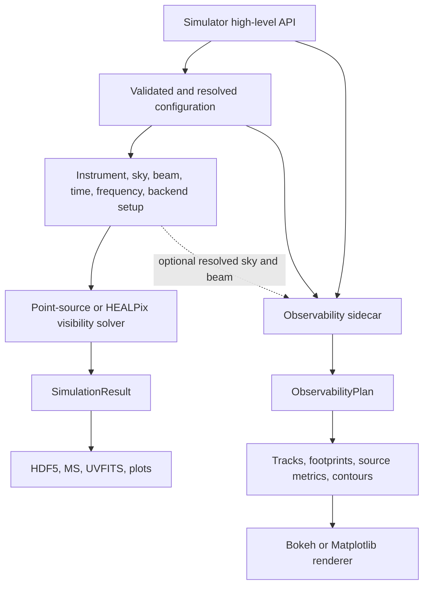
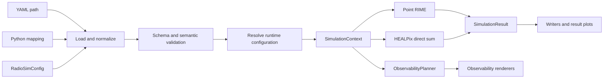
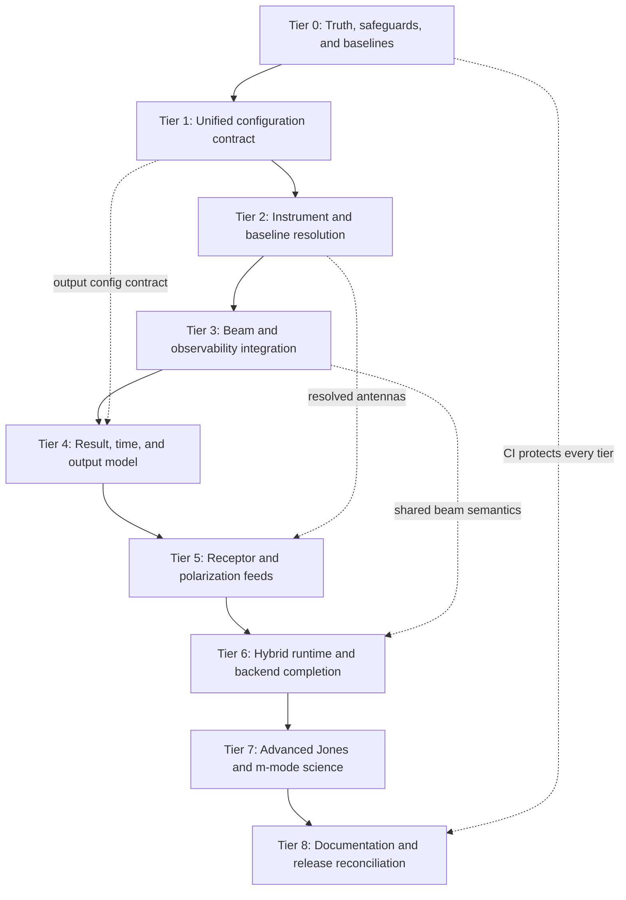

# RadioSim Remediation and Completion Plan

| Plan metadata | Value |
|---|---|
| Status | Tier 1 accepted; Tier 2 accepted after correction; Tier 3 independently accepted on 2026-07-25; all five Tier 3 issues are done; exact-SHA remote CI observed green |
| Prepared | 2026-07-14 |
| Current release | 0.2.0 |
| Baseline commit | `73ae7a3` (`main`, aligned with `origin/main`) |
| Test inventory | 1,178 tests collected from 69 test files |

## 1. Purpose

This document is the source-of-truth plan for resolving the configuration,
high-level API, instrument-model, beam, output, backend, documentation, and
scientific-completeness gaps found during a source-first review of RadioSim.

It records:

- every issue raised during the codebase walkthrough and follow-up questions;
- what the current implementation actually does;
- why the behavior is inconsistent or incomplete;
- the target behavior and architectural direction;
- a dependency-ordered implementation plan;
- tests, acceptance criteria, and stop gates for every tier;
- work that is a normal defect fix versus work that is a larger scientific
  feature.

This is not authorization to implement all tiers in one change. Each tier must
be delivered and reviewed independently.

### 1.1 History-rewrite boundary

The repository history was intentionally rewritten before this plan was
created. Files removed by that rewrite are outside this plan and must not be
restored merely because an older audit or commit mentioned them.

This plan is based on the live checkout at the baseline above. In particular:

- the former `FIX.md`, `CurrentIssues.md`, and `SkyRemediationPlan.md` are not
  present and are not prerequisites for this work;
- deleted GitHub-history content must not be reconstructed;
- `project.md` remains present locally, but is not treated as runtime truth;
- the current source, tests, manifests, README, Sphinx documentation, examples,
  and `AGENTS.md` govern this plan.

## 2. Repository baseline

The live checkout has the following relevant properties:

| Surface | Current state |
|---|---|
| Package version | `0.2.0` |
| Pixi workspace version | `0.2.0` |
| Sphinx version/release | `0.2.0` |
| Pixi lock format | v7 |
| Python package modules | 150 |
| Test files | 69 |
| Tests collected | 1,178 |
| Sample YAML configs | 2 |
| Jones classes | 46 |
| Integration test directory | Only `__init__.py` |
| Performance test directory | Only `__init__.py` |
| Tracked `.github/` directory | Absent |
| `huggingface_space/` directory | Absent |

The version and lockfile inconsistencies are already resolved by commit
`73ae7a3`. They remain documented below because they were part of the original
review and establish the expected release discipline.

## 3. Correct high-level architecture

The observability planner must not be described as a visibility-simulation
product. It is a sibling planning and visualization capability exposed through
the same high-level API.



The visibility branch produces baseline-dependent complex data. The
observability branch produces a renderer-neutral observing plan and does not
calculate baseline visibilities.

### 3.1 Target architecture after remediation

All entry points should pass through the same validation and resolution stages:



`SimulationContext` is a conceptual target name. The implementation may use
several focused immutable models instead of one large object, but the resolved
state must have a single owner.

## 4. Governing decisions

### 4.1 Pre-v1 API policy

RadioSim is pre-v1.0. The implementation should prefer a coherent replacement
over compatibility shims when the current API is misleading or structurally
wrong.

Therefore:

- do not add adapters merely to preserve legacy beam-config field names;
- remove redundant boolean switches when the presence of typed data expresses
  the same decision more clearly;
- reject unsupported settings instead of accepting silent no-ops;
- do not preserve raw-dictionary behavior if it prevents one reliable
  configuration contract;
- document intentional breaking changes in the changelog and migration guide;
- add this policy explicitly to `docs/contributing.rst` as required by
  `AGENTS.md`.

### 4.2 Truthfulness rule

A field or public class may be in one of four states:

1. implemented and tested;
2. experimental and explicitly gated;
3. unsupported and rejected with an actionable error;
4. absent from the public surface.

RadioSim must not validate a setting, silently ignore it, and then imply that
the setting affected the simulation.

### 4.3 Precedence must be explicit

Where several sources can provide the same value, resolution precedence must
be centralized, documented, and included in result provenance. It must not be
created accidentally through mutation order in `Simulator.setup()`.

### 4.4 Scientific features require scientific tests

Receptor bases, Jones terms, beam interpolation, hybrid-sky summation, and
spherical-harmonic solvers are not complete merely because code executes. They
require analytic invariants, reference cases, and cross-implementation checks.

## 5. Issue register

Status values used below:

- **DONE**: resolved and verified in the current checkout;
- **OPEN**: confirmed live defect or incomplete contract;
- **DECISION**: design choice required before implementation;
- **ROADMAP**: substantial scientific or performance feature;
- **DOCS**: documentation/example/release-truth work.

| ID | Status | Issue | Planned tier |
|---|---|---|---|
| REL-001 | DONE | Pixi workspace version differed from package/Sphinx | 0 |
| REL-002 | DONE | Pixi lockfile used v6 format | 0 |
| CFG-001 | DONE | CLI/API/mapping/model/parameter inputs share one strict resolution pipeline | 1 |
| CFG-002 | DONE | Typed config and every override surface honor centralized backend precedence | 1 |
| CFG-003 | DONE | Unsupported non-default fields are exhaustively classified and rejected before side effects | 1 |
| INS-001 | DONE | Per-antenna diameter map is ignored and loaded values are overwritten | 2 |
| INS-002 | DONE | pyuvdata telescope flags are not wired | 2 |
| INS-003 | DONE | Baseline-selection fields are ignored | 2 |
| BEAM-001 | DONE | Modern FITS/per-antenna beam config is not connected to `Simulator` | 3 |
| BEAM-002 | DONE | `BeamManager` expects a different legacy config contract | 3 |
| BEAM-003 | DONE | HEALPix NSIDE beam advisor reads antenna dictionaries incorrectly | 3 |
| OBS-001 | DONE | Observability is architecturally misclassified as a product | 3 |
| OBS-002 | DONE | Implement the accepted explicit-reference semantics for heterogeneous observability beams | 3 |
| OUT-001 | DONE | Output controls are only partially honored | 4 |
| OUT-002 | DONE | Point, HEALPix, and writer time-grid counts disagree | 4 |
| OUT-003 | DONE | HDF5 drops correlations and forces `complex128` | 4 |
| OUT-004 | DONE | JSON output contains no visibility data | 4 |
| OUT-005 | DONE | HDF5 reader uses unsafe `eval()` | 4 |
| OUT-006 | DONE | UVFITS is accepted by config but unsupported by `save()` | 4 |
| POL-001 | OPEN | Top-level feed/receptor config is ignored | 5 |
| POL-002 | ROADMAP | Receptor and basis-transform Jones terms are identity stubs | 5 |
| RUN-001 | OPEN | `run(n_workers=...)` is unused | 6 |
| RUN-002 | OPEN | Sky loading hard-codes `max_workers=8` | 6 |
| RUN-003 | OPEN | High-level API forces point or HEALPix and cannot preserve hybrid sky | 6 |
| RUN-004 | ROADMAP | Backend abstraction is not yet performance-bearing end to end | 6 |
| SCI-001 | ROADMAP | Most Jones classes are public identity-returning stubs | 7 |
| SCI-002 | ROADMAP | Spherical-harmonic/m-mode mode is advertised but unimplemented | 7 |
| SCI-003 | ROADMAP | Advanced beam-physics TODOs remain | 7 |
| DOC-001 | DOCS | `simple_simulation.py` uses stale private/result APIs | 8 |
| DOC-002 | DOCS | README low-level baseline example is invalid | 8 |
| DOC-003 | DOCS | Sphinx references removed Jones class names | 8 |
| DOC-004 | DOCS | README claims 15+ configs while two exist | 8 |
| DOC-005 | DOCS | README/backend documentation contradicts live backend behavior | 8 |
| DOC-006 | DOCS | `project.md` is stale and still describes RRIVis | 8 |
| DOC-007 | DOCS | `AGENTS.md` describes an absent Hugging Face app | 8 |
| DOC-008 | DOCS | No tracked CI and no real integration/performance suites | 8 |

## 6. Question-by-question findings and target behavior

### 6.1 REL-001 — Version inconsistency

#### Current state

Resolved. The following now agree on `0.2.0`:

- `pyproject.toml`;
- `pixi.toml`;
- `src/radiosim/__about__.py`;
- `docs/conf.py`.

#### Required ongoing control

Add a small release-metadata test or release script that reads all four values
and fails when they diverge. A future version bump should be one command or one
reviewable change set.

#### Acceptance criteria

- one automated check covers every authoritative version surface;
- documentation and CLI report the same release;
- the release checklist includes the version-consistency check.

### 6.2 REL-002 — Pixi v6 lockfile warning

#### Meaning

The warning meant that the dependency solution was current but stored in an
older Pixi lockfile schema. It was not an installation failure and did not mean
that dependencies were unresolved.

#### Current state

Resolved. `pixi.lock` is now v7 and records explicit platform virtual packages.
`pixi install` completes without the v6 warning.

#### Ongoing rule

Lockfile-format upgrades should be isolated or explicitly called out because
they can produce large structural diffs even when package intent is unchanged.

### 6.3 OBS-001 — Why observability is not a simulation product

`ObservabilityPlanner` builds a renderer-neutral `ObservabilityPlan` containing
tracks, footprint masks, contours, snapshots, and source metrics. It does not
calculate baseline-dependent visibilities.

`Simulator.plot_observability()` connects it to the public API, but that makes
it a sibling capability, not a child of the result writer. It can use config and
an optionally prepared sky model without consuming `Simulator.run()` output.

#### Target behavior

- architecture diagrams place observability beside the simulation pipeline;
- `plot_observability()` accepts a resolved context or clearly resolves the
  required subset itself;
- observability never implies that it is plotting calculated visibilities;
- documentation distinguishes visibility plots from observability plots.

#### Heterogeneous-array decision

For different per-antenna beams or diameters, a single array footprint is
ambiguous. Before wiring heterogeneous beams into observability, choose one of:

1. require a `reference_antenna`;
2. display a selected antenna and label it;
3. display an intersection/union envelope with explicit semantics;
4. display several antenna footprints.

Recommended first implementation: require or default a clearly reported
reference antenna, then add envelopes later.

### 6.4 INS-001 — Per-antenna diameters

#### Current behavior

`AntennaLayoutConfig` defines:

- `all_antenna_diameter`;
- `use_different_diameters`;
- `diameters`.

`Simulator.setup()` nevertheless assigns `all_antenna_diameter` to every loaded
antenna. This overwrites values read from supported antenna formats and ignores
the per-antenna map.

The downstream solver is already capable of using heterogeneous diameters:
point visibility builds a per-antenna diameter map, and the HEALPix path reads
each antenna's `diameter`. The missing work is resolution in setup.

#### Target configuration

Prefer a simpler pre-v1 contract:

```yaml
antenna_layout:
  default_diameter_m: 14.0
  diameters_by_antenna:
    "0": 12.0
    "1": 25.0
```

Remove `use_different_diameters`; the override map already expresses the
intent. If retaining current names temporarily is useful for the implementation
branch, remove them before finalizing the public API rather than creating a
long-lived deprecation shim.

#### Resolution precedence

Recommended precedence, highest first:

1. explicit per-antenna config override;
2. diameter supplied by the selected antenna-layout source;
3. explicitly enabled pyuvdata telescope diameter;
4. configured default diameter.

Every resolved diameter must be finite and positive. Unknown mapping keys and
unresolved antenna IDs must fail during setup.

#### Acceptance criteria

- heterogeneous diameters reach both solvers unchanged;
- file-provided diameters are not overwritten unless explicitly overridden;
- result metadata records the resolved diameter and its source per antenna;
- invalid, missing, or unknown mappings fail before sky loading;
- baseline metadata no longer encodes diameters as an opaque string.

#### Resolution (2026-07-20)

**DONE.** Tier 2 replaced the ignored legacy map with typed per-antenna overrides and
one complete canonical instrument. Resolution applies `override > source > configured
default`, records the winning source and the original source fact, rejects unknown,
duplicate, non-finite, non-positive, or unresolved values before runtime side effects,
and passes exact heterogeneous diameters to both solvers, results, plots, and writers.
No consumer invents a 14-metre fallback.

### 6.5 BEAM-001/002 — FITS, per-antenna, and mixed beams

#### Current behavior

The Pydantic schema validates a modern contract:

- `beam_mode: analytic | fits | mixed`;
- `per_antenna`;
- `beam_file`;
- `antenna_beam_map`;
- FITS normalization and interpolation settings.

The high-level simulator initializes `_beam_manager` to `None` and never
assigns it. Setup copies only analytic-beam fields into `_beam_config`.

The existing `BeamManager` uses a different contract:

- `use_beam_file`;
- `use_different_beams`;
- `beam_file_path`;
- `beam_files`;
- `beams_per_antenna`.

Consequently, validated modern beam fields never reach the FITS implementation.

#### Root cause

The configuration surface and the beam manager evolved independently. The
runtime contains the low-level FITS machinery, and the schema describes the
desired high-level behavior, but there is no modern resolution boundary between
them.

#### Target behavior

Refactor `BeamManager` to consume resolved modern beam assignments directly:

| Mode | Resolution |
|---|---|
| `analytic` | No FITS handler; every antenna uses analytic E-Jones |
| `fits`, shared | Load one FITS handler and assign it to every antenna |
| `fits`, per antenna | Resolve one FITS path per antenna |
| `mixed` | Resolve each antenna to either `analytic` or a FITS path |

Do not translate modern fields into the legacy keys as a permanent adapter.

#### Additional requirements

- normalize antenna mapping keys once;
- deduplicate identical FITS paths without changing assignments;
- validate file existence and coverage before simulation;
- propagate `beam_peak_normalize`, interpolation, ZA, and frequency-domain
  settings;
- fail loudly rather than silently falling back to analytic beams;
- use the same manager in point and HEALPix paths;
- use the same resolved beam definition in observability.

#### Acceptance criteria

- shared FITS, per-antenna FITS, and mixed modes have end-to-end tests;
- a known synthetic UVBeam gives predictable Jones values;
- both visibility paths agree for equivalent scalar/diagonal beams;
- missing antenna assignments and out-of-domain requests produce actionable
  errors;
- observability reports which antenna or envelope it displays.

### 6.6 INS-003 — Baseline-selection fields

#### Current behavior

`BaselineSelectionConfig` defines autocorrelation, cross-correlation, length,
tolerance, and angle controls. `generate_baselines()` always creates all
`ant1 <= ant2` combinations, including both autos and crosses. The high-level
simulator does not apply a selection stage.

The current CLI source itself lists advanced baseline filtering as unfinished
modular-API work.

#### Target design

Keep baseline generation and baseline selection separate:

```text
resolved antennas
    -> generate canonical baselines
    -> select baselines
    -> validate non-empty selection
    -> freeze selected baseline inventory
```

Create a focused function such as:

```python
select_baselines(
    baselines,
    *,
    include_autocorrelations,
    include_crosscorrelations,
    lengths_m,
    length_tolerance_m,
    azimuth_ranges_deg,
)
```

The exact public name may differ, but selection logic must not be embedded as a
large conditional block in `Simulator.setup()`.

#### Scientific details

- document ENU baseline azimuth convention;
- support ranges that wrap through 0 degrees;
- filter autocorrelations before computing angle because their direction is
  undefined;
- define whether a baseline matches either orientation or only the stored
  `ant1 -> ant2` direction;
- reject negative lengths and malformed angle ranges at schema validation;
- reject a final empty selection with the resolved criteria in the error.

#### Acceptance criteria

- exact baseline counts for auto-only, cross-only, and combined cases;
- tolerance-boundary tests;
- wrapped-angle and opposite-direction tests;
- selection metadata is saved with results;
- CLI and API produce the same selected baseline set.

#### Resolution (2026-07-20)

**DONE.** Tier 2 now generates one immutable, numeric-order baseline inventory with
`ant2 - ant1` vectors, then applies one typed selection pass shared by every consumer.
Correlation, target/range length, and axial-azimuth filters implement the documented
union/intersection algebra, tolerance boundaries, autocorrelation treatment, stable
empty failure, and complete stage-count provenance. YAML, mapping, model, parameter,
CLI, solver, result, plot, and writer paths use the same selected tuple.

### 6.7 POL-001 — Feed fields

#### Important terminology split

RadioSim currently uses “feed” for two different concepts:

1. `beams.feed_model` describes illumination of an aperture or reflector by a
   horn, waveguide, or dipole. This is wired into analytic beam computation.
2. top-level `feeds` describes receptor polarization/basis and per-antenna feed
   type. This is ignored by `Simulator`.

These concepts must not share ambiguous names in the final API.

#### Why top-level feeds cannot be wired mechanically

The solver assumes a linear X/Y basis and returns `XX`, `XY`, `YX`, and `YY`.
`ReceptorConfigJones` and `BasisTransformJones` are identity stubs. Merely
attaching `feed_type` strings to antennas would falsely imply correct circular
or heterogeneous polarization physics.

#### Target design

- rename beam illumination settings clearly, for example under
  `beams.illumination`;
- replace top-level `feeds` with a typed receptor/basis model;
- support at least `linear` and `circular` bases;
- model feed orientation separately from basis;
- define one output basis for heterogeneous arrays and transform each antenna
  into it;
- generate appropriate correlation labels and file-format polarization codes;
- implement C/H Jones matrices before claiming receptor support.

#### Acceptance criteria

- analytic linear-to-circular transform tests;
- Stokes-to-correlation energy-conservation tests;
- correct `XX/XY/YX/YY` and `RR/RL/LR/LL` labels;
- polarized-source cross-hand tests;
- Measurement Set and UVFITS polarization metadata round trips;
- unsupported heterogeneous combinations fail explicitly until implemented.

### 6.8 INS-002 — pyuvdata telescope flags

#### Current behavior

`TelescopeConfig` defines flags for known telescope, location, antennas, and
diameters. The high-level setup nevertheless requires an antenna file and reads
location directly from config. The flags are not consumed.

Reading antenna information from an MS or UVFITS file is not the same as
resolving `Telescope.from_known_telescopes()`.

#### Target design

Create an instrument resolver responsible for:

- loading a known pyuvdata telescope when requested;
- converting antenna positions into RadioSim's documented coordinate frame;
- merging explicit config, file, and pyuvdata sources according to one
  precedence table;
- resolving location, names, numbers, positions, diameters, and mount metadata;
- retaining provenance for every resolved field;
- detecting inconsistent antenna-number inventories across sources.

Recommended field precedence:

| Field | Highest precedence | Fallbacks |
|---|---|---|
| Location | Explicit config | pyuvdata, project default only if documented |
| Positions | Explicit selected layout source | pyuvdata when enabled |
| Diameter | Per-antenna override | layout, pyuvdata, default |
| Names/numbers | Selected position source | validated mapping |
| Mount/feed metadata | Explicit config | pyuvdata when enabled |

Avoid a master boolean plus several contradictory sub-flags. Prefer an explicit
source selection and per-field override model.

#### Resolution (2026-07-20)

**DONE.** Tier 2 removed the inert pyuvdata booleans and replaced them with an exact
`known_telescope` source contract, distinct from Measurement Set and UVFITS dataset
sources. The resolver loads the selected source through an offline-testable injected
boundary, preserves identity, location, positions, diameters, mount metadata, pyuvdata
version, and registry policy in provenance, disables both registry-update flags where
required, converts relative ECEF scientifically to canonical ENU, and rejects explicit
metadata mismatches. High-level Simulator setup uses this resolved source directly.

### 6.9 CFG-002 — Compute backend ignored by `Simulator.from_config()`

#### Current behavior

`Simulator.from_config()` extracts precision and then constructs `Simulator`
without passing `radiosim_config.compute.backend`. The constructor default
`backend="auto"` therefore wins.

The config-mode CLI separately resolves:

```text
explicit CLI backend unless it is "auto"
    -> otherwise config.compute.backend
```

The Python API and CLI can therefore run the same YAML on different backends.

#### Target behavior

Use `None` to mean “no explicit override” because `auto` is a legitimate
backend value:

```python
Simulator.from_config(path, *, backend: str | None = None)
```

Resolution order:

1. explicit API/CLI override;
2. `config.compute.backend`;
3. documented package default.

The resolved backend name and device must be included in result metadata.

#### Acceptance criteria

- `from_config()` honors `compute.backend`;
- explicit overrides win identically in CLI and Python;
- `auto` remains selectable as an actual strategy;
- unavailable explicit backends fail rather than silently falling back;
- backend-resolution tests do not depend on a physical GPU.

#### Resolved current behavior (2026-07-17)

`Simulator.from_config()` now accepts only typed `RadioSimConfig`, and all
document/API/CLI paths resolve `execution.backend` through the same frozen
override model and resolver. `None` means no override, explicit values win,
`auto` remains a real strategy, and NumPy remains the declared deterministic
default. The resolved strategy is retained in runtime/provenance. Explicitly
unavailable or precision-incompatible backends fail rather than falling back;
the backend factory also rejects any requested precision it cannot represent.

### 6.10 OUT-001 — What “output controls mostly honored” means

The current status is:

| Field | Current status | Required decision/fix |
|---|---|---|
| `simulation_data_dir` | Honored by config-mode CLI | Retain as CLI orchestration |
| `simulation_subdir` | Honored or auto-generated | Retain and test |
| `output_file_name` | Honored by `Simulator.save()` | Retain |
| `output_file_format` | HDF5/JSON/MS dispatched; UVFITS unsupported | Implement or reject UVFITS |
| `save_simulation_data` | Honored by CLI | Retain as CLI orchestration |
| `overwrite_output` | Partially honored | Unify folder and file policy |
| `skip_overwrite_confirmation` | Honored | Clarify noninteractive behavior |
| `prompt_for_output_suffix` | Ignored | Honor it or remove it |
| `plot_results` | Honored | Retain |
| `open_plots_in_browser` | Honored | Retain |
| `plotting_backend` | Passed to plotting | Type and validate choices |
| `save_log_data` | Honored | Retain |
| `angle_unit` | Ignored by high-level path | Thread through or remove |
| `skymodel_frequency` | Ignored | Thread through or remove |

The final design should separate scientific simulation configuration from CLI
workflow/output orchestration. Calling `Simulator.run()` from Python should not
implicitly perform CLI-style saving or prompting.

### 6.11 CFG-001 — Validation differences between entry points

There are currently three validation depths:

| Entry point | Current validation |
|---|---|
| Config-mode CLI | Pydantic construction plus explicit `config.validate()` preflight |
| `Simulator.from_config()` | Pydantic construction, but no explicit semantic preflight |
| `Simulator(config={...})` | Shallow dictionary copy; no full Pydantic validation |

`RadioSimConfig` also allows extra top-level fields, while nested models may
ignore extras under Pydantic defaults. This permits typos and unsupported fields
to survive differently depending on their location.

#### Why raw dictionaries exist

The raw path supports concise programmatic and test configurations. It is
convenient for constructing only the sections needed by a particular test, but
it makes behavior entry-point-dependent and moves failures into setup.

#### Target design

All configuration sources must pass through one boundary:

1. parse/coerce source-specific values;
2. validate types and local field constraints;
3. run semantic and cross-field validation;
4. resolve paths relative to the correct source;
5. resolve runtime defaults and explicit overrides;
6. produce immutable/frozen runtime configuration.

Before changing extras to `forbid`, inventory and type every legitimate live
field, including the explicit `frequencies_hz` array used by the programmatic
constructor.

#### Acceptance criteria

- equivalent YAML, mapping, and typed-model input resolve identically;
- validation errors occur before device detection, network checks, or sky
  loading;
- unsupported settings cannot silently become no-ops;
- partial test fixtures use explicit test builders instead of weakening the
  production constructor;
- path-resolution semantics are identical and documented.

#### Resolved current behavior (2026-07-17)

YAML, raw mapping, typed model, convenience parameters, root config mode,
`validate`, and the exposed `simulate` surface now use the same strict schema,
override, semantic/unsupported, path, and immutable-runtime resolution stages.
Direct `Simulator` construction accepts only `ResolvedSimulationConfig`; the
old raw/partial constructor path is absent. Invalid input fails before backend,
device, network, loader, output, plotting, browser, or workflow side effects.
Path bases and override origins remain explicit in immutable provenance.

### 6.12 CFG-003 — Unsupported fields silently becoming no-ops

#### Resolved current behavior (2026-07-17)

The complete strict input-model inventory covers 281 field occurrences. Every
accepted field is either resolved into supported scientific/workflow behavior
or classified as deferred. The operational deferred-feature matrix covers 34
non-default cases across the capable public entry points; all 34 reject with an
exact configuration error before side effects. Entry points such as
`radiosim simulate` omit deferred fields they cannot express. No unsupported
state is representable in `ResolvedSimulationConfig`, and no generic loader
option, raw mapping, compatibility-key, or partial-fixture escape hatch remains.

## 7. Additional confirmed gaps from the broader review

### 7.1 BEAM-003 — NSIDE beam advisor bug

The original defect was `Simulator.setup()` iterating an antenna dictionary as if
its keys were antenna objects with `.diameter`; a broad exception handler converted
that failure into `beam_fwhm_rad=None` and silently disabled advice. Tier 2 removed
the raw antenna dictionary, so the live code now reads canonical antennas, but the
issue is not closed: the advisor still uses one lowest-frequency/minimum-diameter
FWHM scalar, can choose the widest rather than the limiting beam-product feature, and
still suppresses failures broadly.

Fix this only after diameter resolution has a canonical representation. Do not
patch it with another dictionary/object special case that perpetuates mixed
antenna representations. Closure requires canonical beam assignments, every selected
baseline and exact frequency, the product-feature sampling derivation, defined autos,
typed derivation failure, no arbitrary antenna, no silent NSIDE mutation, and no broad
suppression.

### 7.2 RUN-001/002 — Worker controls

`Simulator.run(n_workers=...)` documents a worker count but never uses it.
Sky-model setup separately hard-codes `max_workers=8`.

These are two different concurrency concerns and should not share one ambiguous
parameter:

- sky-loader concurrency belongs to setup/data loading;
- visibility computation concurrency belongs to a solver execution policy.

Define them separately, for example through typed compute settings, and record
the resolved values in runtime metadata.

### 7.3 RUN-003 — Hybrid sky support

`SkyModel` can preserve point and HEALPix payloads simultaneously, but the
high-level `VisibilityConfig` accepts only `point_sources` or `healpix_map` and
`Simulator.run()` chooses one solver branch.

The correct hybrid implementation is not lossy conversion. It is:

```text
V_total = V_point + V_healpix
```

Both components must use the same resolved baselines, time grid, frequencies,
phase convention, polarization basis, backend policy, and result shape. Sky
provenance/disjointness rules must prevent accidental double counting.

### 7.4 RUN-004 — Backend reality

The backend abstraction is partially wired into point-source array operations,
but the orchestration remains dominated by host-side Python loops, Astropy
coordinate transforms, and host/device transfers. HEALPix code still contains
NumPy-specific operations. JAX/Numba selection therefore does not yet imply
end-to-end acceleration.

The README currently contains mutually inconsistent claims: some sections say
the solver is NumPy-only, while the live point path does dispatch selected array
operations. Documentation should say:

- backend array operations are partially integrated;
- correctness parity is more mature than performance integration;
- GPU acceleration is not yet demonstrated end to end;
- Numba must not be called a production JIT solver unless the solver actually
  uses compiled kernels.

### 7.5 SCI-001 — Jones identity stubs

The package exports 46 Jones classes. Only geometric phase K and primary beam E
currently provide substantive forward-model effects. Most other terms return
identity matrices.

This is not one defect. It is a collection of separate scientific features.
Public identity stubs are risky because a user can add a term to a chain and
observe no change without an error.

Until each term is implemented, choose one truthful policy:

- remove it from the public surface;
- raise `NotImplementedError` when used;
- place it behind an explicit experimental namespace.

Silently multiplying by identity is not an acceptable final behavior.

### 7.6 SCI-002 — Spherical-harmonic mode

The config accepts `calculation_type="spherical_harmonic"`, but setup raises
`NotImplementedError`. This is a roadmap solver, not a small conditional branch.

Until an m-mode solver exists, schema validation should reject the option or the
option should be removed. When implemented, it should be a separate simulator
strategy registered alongside direct RIME, with direct-sum agreement tests on
small tractable skies.

### 7.7 OUT-002 — Time-axis disagreement

The point solver uses floor-like `int(duration / step)`, the HEALPix solver uses
`ceil`, and `Simulator.save()` reconstructs a floor-like time axis. A duration
that is not evenly divisible by the cadence can therefore produce mismatched
result and file coordinates.

Create one authoritative time-grid function. Solvers and writers must consume
the resulting time array rather than independently reconstructing it.

The contract must define whether the observation endpoint is included. That
choice must be tested for divisible and non-divisible durations.

### 7.8 OUT-003/004/005/006 — Output correctness and safety

Current high-level HDF5 output:

- extracts only `I`, with `XX` fallback;
- drops `XY`, `YX`, `YY`, and basis metadata;
- forces `complex128` regardless of configured output precision;
- stringifies much of the metadata;
- stores baseline tuples in group names.

Current JSON output stores metadata, frequencies, and a baseline count, but no
visibility values.

The HDF5 reader uses `eval()` to parse baseline tuples. This is unsafe for
untrusted files and unnecessary even for trusted files.

UVFITS is present in `OutputConfig` but absent from `Simulator.save()`.

These problems should be fixed through a canonical result model and versioned
file schema, not by adding more conversion branches to `Simulator.save()`.

### 7.9 DOC-001 through DOC-008 — Documentation and project truth

Confirmed current drift includes:

- `examples/scripts/simple_simulation.py` references nonexistent
  `sim._sources`;
- it formats the memory-estimate dictionary as a float;
- it treats a per-baseline correlation dictionary as an array with `.shape`;
- README and Sphinx call `generate_baselines(antennas)` without its required
  beam metadata arguments;
- several Sphinx pages refer to nonexistent `GeometricDelayJones` rather than
  the live geometric class;
- README claims 15+ configs while `configs/` has two YAML files;
- `project.md` retains old RRIVis naming and stale claims;
- `AGENTS.md` describes `huggingface_space/`, which is absent;
- no `.github/` workflow is tracked;
- integration and performance directories contain no real tests.

Documentation should be corrected after each API tier, followed by a final
cross-repository truth sweep in Tier 8.

## 8. Tier dependency map



The linear order is deliberate. Some implementation work could technically be
parallelized, but merging it out of order would create temporary contracts and
duplicated migration work.

## 9. Tier 0 — Truth, safeguards, and baselines

### Objective

Establish a reliable baseline and prevent later tiers from adding more silent
drift.

### Already complete

- package/Pixi/Sphinx version alignment;
- Pixi lockfile v7 migration;
- creation of this plan.

### Implementation record — 2026-07-14

**Status:** Tier 0 is implemented and passes its local verification gate. The
new GitHub Actions workflow has been structurally validated and its commands
have been mirrored locally where the current macOS arm64 host permits. It has
not run remotely, so this record does not claim that GitHub Actions or the
Linux/macOS Intel jobs are green.

Implemented safeguards:

- added the contributor-facing pre-v1 API/configuration evolution policy;
- added one actionable release-metadata consistency test covering
  `pyproject.toml`, `pixi.toml`, `src/radiosim/__about__.py`, both Sphinx
  version fields, and the installed `radiosim.__version__`;
- added a v7 lock-format test and locked Pixi installs in CI;
- added Python 3.11 and 3.12 Pixi environments with lock solutions for
  `linux-64`, `osx-64`, and `osx-arm64`;
- added a six-combination non-slow CI matrix plus a Linux/Python 3.11 quality
  job for Ruff, release metadata, strict-Pyright debt enforcement, and Sphinx;
- added a checked-in strict-Pyright error ceiling and a typed helper that fails
  on an increase or an unreviewed Pyright-version change and refuses to raise
  the ceiling during an intentional update;
- added the Sphinx configuration-support matrix and linked it from the user
  guide toctree;
- added narrow, tested pre-setup guards for confirmed explicit silent no-ops;
- made the documented `make -C docs html` command invoke Sphinx through the
  checked-in Pixi environment.

#### Exact baseline and post-change results

| Command | Pre-change result | Post-change result |
|---|---|---|
| `pixi install` | exit 0 | exit 0; default Python 3.11 environment installed |
| `pixi run test -- --collect-only -q` | exit 0; 1,178 tests; 3.50 s | exit 0; 1,213 tests; 3.66 s |
| `pixi run test -- -m "not slow"` | exit 0; 1,177 passed, 1 skipped, 26 warnings; 132.60 s | exit 0; 1,212 passed, 1 skipped, 26 warnings; 138.27 s |
| `pixi run test` | exit 0; 1,177 passed, 1 skipped, 26 warnings; 134.31 s | exit 0; 1,212 passed, 1 skipped, 26 warnings; 136.97 s |
| `pixi run lint` | exit 0; all checks passed | exit 0; all checks passed |
| `pixi run check-format` | exit 0; 237 files already formatted | exit 0; 239 files already formatted |
| `pixi run typecheck` | exit 1; 4,600 errors, 0 warnings, 0 information; Pyright 1.1.408; 14.08 s | exit 0; strict ceiling satisfied at 4,600 <= 4,600; Pyright 1.1.408; 13.18 s |
| `make -C docs html` | exit 2; `sphinx-build` not found; Sphinx did not start | exit 0; build succeeded with 242 warnings; 26.67 s |

Additional verification completed:

- `pixi install --locked --environment py312` and `pixi lock --check` passed;
- the focused release/guard suite passed on both Python 3.11 and 3.12
  (39 passed in 6.00 s and 39 passed in 5.86 s, respectively);
- the release-metadata test passed directly (3 passed), including its
  actionable mismatch path without leaving a repository change;
- all new negative guard branches were exercised, the default/working analytic
  beam controls remained accepted, and aggregation of multiple unsupported
  fields was tested;
- the workflow YAML parsed structurally, the new Sphinx page is in the toctree,
  the rendered contributor policy and support matrix were inspected, and
  `git diff --check` passed.

#### Tier 0 disposition of unsupported-option candidates

| Candidate | Disposition |
|---|---|
| `visibility.calculation_type="spherical_harmonic"` | Guarded now; target Tier 7 |
| configured `UVFITS` output | Guarded now; direct `save(format="uvfits")` already fails clearly; target Tier 4 |
| FITS/mixed/per-antenna beam modes, maps, files, and FITS controls | Guarded now; target Tier 3 |
| heterogeneous-diameter switch or non-empty map | Guarded now; target Tier 2 |
| enabled `telescope.use_pyuvdata_*` flags | Guarded now; target Tier 2 |
| non-default top-level receptor/feed fields | Guarded now; target Tier 5 |
| alternative/cross-check simulator settings | Guarded now; target Tier 7 |
| non-default output angle or sky-model plot frequency | Guarded now; target Tier 4 |
| explicit `Simulator.run(n_workers=...)` | Guarded now; target Tier 6 |
| analytic `beams.feed_model`, `feed_computation`, and `feed_params` | Confirmed supported and left enabled |
| baseline-selection settings | Documented and deferred to Tier 2 because current defaults conflict with runtime behavior |
| `compute.backend` entry-point inconsistency | Documented and deferred to Tier 1 |
| `output.prompt_for_output_suffix` policy inconsistency | Documented and deferred to Tier 4 |

Optional GPU/accelerator behavior, optional JAX correctness, Measurement Set
round trips, and other optional scientific backends were not established by
this Tier 0 gate. No remote GitHub Actions result has been observed. Tier 1 and
all later implementation work remain open and unstarted.

### Work items

1. Add the pre-v1 breaking-change note to `docs/contributing.rst`.
2. Add a version-consistency test or release check.
3. Add a tracked CI workflow for supported Python/platform combinations.
4. Run and record the full test baseline.
5. Run type checking and record existing debt rather than requiring an
   unrealistic all-green conversion in the same tier.
6. Establish a “no new type errors” policy until the existing baseline is
   reduced.
7. Add a config-support matrix to developer documentation showing which fields
   are implemented, rejected, or roadmap.
8. Mark currently unsupported high-risk choices as errors where doing so does
   not depend on the Tier 1 redesign.

### Likely files

- `docs/contributing.rst`;
- `pyproject.toml`;
- `.github/workflows/ci.yml`;
- new focused tests under `tests/unit/`;
- `README.md` or a new developer-facing support-matrix document.

### Verification gate

```bash
pixi install
pixi run lint
pixi run check-format
pixi run test -- -m "not slow"
pixi run typecheck
make -C docs html
```

If type checking is not green, record the exact baseline and fail only on an
increase until a dedicated type-debt effort is approved.

### Suggested commits

- `docs: state pre-v1 API evolution policy`
- `test: enforce release metadata consistency`
- `ci: add baseline lint test and docs workflow`

### Exit criteria

- CI runs on every proposed change;
- version drift is automatically detectable;
- unsupported public settings are visibly classified;
- the test and type-check baselines are recorded.

## 10. Tier 1 — Unified configuration contract

### Objective

Ensure YAML, Python mappings, typed config objects, and CLI overrides resolve to
the same validated runtime configuration.

### Design work before coding

1. Inventory every key accessed through `config.get(...)` in source.
2. Compare that inventory with Pydantic fields.
3. Classify each field as scientific configuration, execution policy, output
   workflow, or deprecated/unsupported.
4. Decide the immutable resolved models required by setup.
5. Define override precedence and path-resolution rules.

### Implementation work

1. Add typed fields for legitimate live extras such as `frequencies_hz`.
2. Introduce one loader/normalizer used by:
   - `Simulator.from_config()`;
   - `Simulator(config=...)` or its clean replacement;
   - config-mode CLI;
   - `radiosim validate`.
3. Fold semantic preflight into a normal validation/resolution API instead of a
   separate method that only the CLI remembers to call.
4. Make `Simulator` retain typed or frozen configuration rather than a mutable
   raw dictionary.
5. Use `None` as the explicit-override sentinel for backend and precision.
6. Resolve `compute.backend` consistently.
7. Reject unknown/unsupported fields after the live-field inventory is typed.
8. Replace production partial-config behavior with explicit builders for tests
   and concise programmatic construction.
9. Preserve correct YAML-relative path resolution for every path field, not
   only the antenna file.

### Likely files

- `src/radiosim/io/config.py`;
- `src/radiosim/api/simulator.py`;
- `src/radiosim/cli/main.py`;
- `src/radiosim/utils/frequency.py`;
- `tests/unit/test_io/test_config.py`;
- `tests/unit/test_simulator/test_api.py`;
- new CLI tests under `tests/unit/test_cli/`.

### Required tests

- YAML/mapping/model equivalence;
- API/CLI backend precedence;
- explicit frequency arrays;
- unknown-field rejection;
- unsupported-field rejection;
- cross-field errors before side effects;
- relative paths from nested config locations;
- immutable resolved config behavior.

### Verification gate

```bash
pixi run test -- tests/unit/test_io/test_config.py
pixi run test -- tests/unit/test_simulator/test_api.py
pixi run test -- tests/unit/test_cli/
pixi run lint
pixi run check-format
pixi run test -- -m "not slow"
```

### Suggested commits

- `refactor(config): unify YAML mapping and API validation`
- `fix(api): honor configured backend resolution`
- `test(config): enforce CLI and API parity`

### Exit criteria

- one config has one resolved meaning regardless of entry point;
- `Simulator.from_config()` honors backend and semantic validation;
- raw typos cannot survive silently;
- no runtime stage mutates configuration to create precedence.

## 11. Tier 2 — Instrument and baseline resolution

### Status

**Complete and independently accepted after correction on 2026-07-20.** INS-001,
INS-002, and INS-003 are closed. Tier 3 implementation was not started. The next
authorized task is the separate Tier 3 design gate for beam and observability
integration.

### Objective

Create one resolved instrument inventory before sky and solver setup.

### Implementation work

1. Define typed resolved antenna/telescope models or an equivalent frozen
   internal representation.
2. Normalize antenna IDs and coordinate-frame metadata.
3. Implement known-telescope loading through pyuvdata.
4. Merge explicit config, selected layout source, and pyuvdata metadata using
   documented precedence.
5. Resolve per-antenna diameters without overwriting loaded values.
6. Validate complete, finite, positive diameters.
7. Generate canonical baselines from resolved antennas.
8. Implement a separate baseline-selection function.
9. Replace opaque baseline metadata strings such as `D1D2` with structured
   values or derive them from antenna references.
10. Store instrument and selection provenance in results.

### Likely files

- `src/radiosim/core/antenna.py`;
- `src/radiosim/core/baseline.py`;
- new focused instrument-resolution module under `core/` or `io/`;
- `src/radiosim/api/simulator.py`;
- `src/radiosim/io/config.py`;
- antenna, baseline, API, and config tests.

### Required tests

- uniform and heterogeneous diameter resolution;
- layout-file diameter preservation;
- explicit override precedence;
- pyuvdata location/position/diameter selection;
- source inventory mismatch errors;
- auto/cross baseline counts;
- length tolerance boundaries;
- angle wrap and orientation behavior;
- empty-selection error;
- point/HEALPix receipt of identical resolved antennas.

### Verification gate

```bash
pixi run test -- tests/unit/test_core/ -k "antenna or baseline"
pixi run test -- tests/unit/test_io/ -k "config or antenna"
pixi run test -- tests/unit/test_simulator/
pixi run test -- -m "not slow"
```

### Suggested commits

- `refactor(instrument): resolve telescope and antenna metadata once`
- `fix(instrument): apply heterogeneous antenna diameters`
- `feat(baseline): honor configured baseline selection`

### Exit criteria

- setup has one immutable antenna inventory;
- all enabled metadata sources follow tested precedence;
- every configured baseline-selection field affects the selected set;
- the solver no longer receives placeholder beam metadata from baseline
  generation.

## 12. Tier 3 — Beam and observability integration

### Objective

Connect modern analytic/FITS beam configuration to both solvers and ensure
observability represents the same instrument semantics.

### Implementation work

1. Replace `BeamManager`'s legacy config contract with resolved modern beam
   assignments and one validated `BeamSystem`.
2. Implement shared FITS, per-antenna FITS, and mixed modes.
3. Deduplicate handler instances for repeated paths.
4. Validate antenna coverage and beam domain before simulation.
5. Thread one `BeamSystem` through point and HEALPix solvers.
6. Remove silent analytic fallback on FITS initialization failures.
7. Fix the NSIDE advisor using the canonical antenna representation.
8. Make observability consume the resolved beam model.
9. Implement the selected reference-antenna rule: deterministic minimum-number
   default only after fingerprint equivalence, otherwise an explicit Tier 2 reference.
10. Ensure analytic per-antenna diameter support remains intact.

### Likely files

- `src/radiosim/core/jones/beam/fits/handler.py`;
- `src/radiosim/core/jones/beam/fits/__init__.py`;
- `src/radiosim/core/jones/beam/analytic/`;
- `src/radiosim/core/visibility.py`;
- `src/radiosim/core/visibility_healpix.py`;
- `src/radiosim/api/simulator.py`;
- `src/radiosim/core/observability/`;
- beam, Jones, visibility, observability, config, and API tests.

### Required tests

- shared FITS assignment;
- unique and repeated per-antenna FITS assignment;
- mixed analytic/FITS assignment;
- missing/unknown antenna mapping;
- FITS frequency/ZA-domain errors;
- peak-normalization and interpolation propagation;
- point/HEALPix beam parity;
- observability reference-antenna labeling;
- advisor uses the minimum selected-baseline product-feature scale over every exact
  observation frequency, including defined auto-only selection behavior.

### Verification gate

```bash
pixi run test -- tests/unit/test_jones/
pixi run test -- tests/unit/test_core/ -k "beam or visibility"
pixi run test -- tests/unit/test_observability/
pixi run test -- tests/unit/test_visualization/
pixi run test -- -m "not slow"
```

### Suggested commits

- `refactor(beam): replace legacy BeamManager config contract`
- `feat(beam): wire shared per-antenna and mixed FITS modes`
- `fix(observability): use resolved beam semantics`

### Exit criteria

- every valid beam mode changes the actual forward model as documented;
- FITS errors cannot become silent analytic simulations;
- observability and simulation share the same beam source;
- heterogeneous beam display semantics are explicit.

## 13. Tier 4 — Result, time, and output model

### Objective

Create one canonical result representation and make every writer preserve its
scientific content safely.

### Target result contract

The exact implementation may be a frozen dataclass, Pydantic model, or focused
container, but it must include:

- complex visibility data with named dimensions;
- baseline antenna IDs;
- time coordinates;
- frequency coordinates;
- correlation/feed-basis coordinates;
- antennas and location;
- phase center;
- precision/dtype;
- backend and simulator metadata;
- resolved config and provenance;
- timing/performance metadata.

Prefer a canonical dense visibility shape such as:

```text
(baseline, time, frequency, receptor_p, receptor_q)
```

Named correlation views may be exposed without making a nested dictionary the
storage format.

### Implementation work

1. Define one authoritative observation time-grid function.
2. Pass the resolved time axis into both solvers.
3. Return `SimulationResult` rather than a loosely structured dictionary.
4. Refactor plots and writers to consume the result model.
5. Define a versioned HDF5 schema.
6. Preserve all correlations and configured dtype.
7. Store structured baseline IDs and structured/JSON metadata.
8. Remove `eval()` completely.
9. Decide whether JSON is a full data format or rename it to metadata summary.
10. Implement UVFITS using pyuvdata after the result basis is explicit, or
    remove it from public config until that implementation lands.
11. Unify overwrite, suffix, and noninteractive output policy.
12. Honor or remove `angle_unit` and `skymodel_frequency`.

### Likely files

- new result model under `src/radiosim/core/` or `api/`;
- `src/radiosim/api/simulator.py`;
- `src/radiosim/core/visibility.py`;
- `src/radiosim/core/visibility_healpix.py`;
- `src/radiosim/io/writers.py`;
- `src/radiosim/io/measurement_set.py`;
- visualization modules;
- config and CLI output orchestration;
- new round-trip integration tests.

### Required tests

- divisible and non-divisible time-grid cases;
- point/HEALPix identical coordinates;
- HDF5 round trip for every correlation;
- float/complex precision preservation;
- structured metadata round trip;
- safe rejection of malformed baseline metadata;
- JSON contract test;
- MS round trip;
- UVFITS round trip when implemented;
- overwrite/suffix/noninteractive policy matrix.

### Verification gate

```bash
pixi run test -- tests/unit/test_io/
pixi run test -- tests/unit/test_simulator/
pixi run test -- tests/integration/ -m integration
pixi run test -- -m "not slow"
```

### Suggested commits

- `refactor(result): introduce canonical simulation result model`
- `fix(time): use one observation grid across solvers and writers`
- `refactor(io): add safe versioned visibility serialization`
- `feat(io): add UVFITS round-trip support`

### Exit criteria

- writers do not reconstruct scientific coordinates;
- no correlation or precision is silently discarded;
- no file reader evaluates input as Python code;
- file round trips preserve the result contract;
- every output config field is implemented or absent.

## 14. Tier 5 — Receptor and polarization feeds

### Objective

Implement physically meaningful receptor bases and eliminate ambiguous feed
configuration.

### Design decisions before coding

1. Define the sky polarization basis used internally.
2. Define supported receptor bases.
3. Define feed-angle convention and frame.
4. Define the common output basis for heterogeneous arrays.
5. Define correlation labels and file-format codes.
6. Separate aperture illumination feeds from receiving receptors in schema and
   documentation.

### Implementation work

1. Replace/rename top-level `FeedsConfig` with a typed receptor model.
2. Rename analytic-beam feed settings to illumination terminology.
3. Implement `ReceptorConfigJones` and `BasisTransformJones`.
4. Thread per-antenna receptor definitions into the Jones chain.
5. Generate correlation coordinates from the resolved output basis.
6. Update HDF5, MS, UVFITS, and plots.
7. Reject unsupported mixed-basis cases until their transform is implemented.

### Required tests

- identity for linear-to-linear;
- analytic linear/circular transforms;
- transform inverse/round trip;
- unpolarized energy conservation;
- fully Q/U/V-polarized reference cases;
- correct linear and circular correlation labels;
- heterogeneous antenna transforms into one output basis;
- file-format polarization metadata round trips.

### Verification gate

```bash
pixi run test -- tests/unit/test_jones/ -k "receptor or basis or polarization"
pixi run test -- tests/unit/test_core/ -k polarization
pixi run test -- tests/unit/test_io/
pixi run test -- tests/integration/ -m integration
pixi run test -- -m "not slow"
```

### Suggested commits

- `refactor(config): separate illumination and receptor models`
- `feat(jones): implement receptor basis transforms`
- `feat(result): support linear and circular correlations`

### Exit criteria

- top-level receptor configuration changes calculated correlations;
- basis labels are scientifically correct and serialized;
- no receptor option silently returns identity.

## 15. Tier 6 — Hybrid runtime and backend completion

### Objective

Expose core sky capabilities through the high-level API and make compute-policy
controls meaningful.

### Implementation work

1. Add high-level hybrid representation without lossy conversion.
2. Compute point and HEALPix visibility components on the same coordinates.
3. Sum components through the canonical result model.
4. Preserve component-level timing and provenance.
5. Split sky-loader worker policy from solver worker policy.
6. Remove hard-coded loader worker count.
7. Make solver worker settings effective or remove them.
8. Complete backend parity in the HEALPix path.
9. Reduce host/device transfers and isolate Astropy preprocessing.
10. Decide whether Numba gets real compiled kernels or a less misleading name.
11. Add end-to-end benchmarks before making acceleration claims.

### Required tests

- `V_hybrid == V_point + V_healpix` within precision tolerance;
- no double counting for disjoint and explicitly assumed-disjoint models;
- point/HEALPix/hybrid coordinate identity;
- NumPy/JAX parity for representative point and HEALPix workloads;
- loader-worker policy tests;
- solver-worker behavior tests;
- offline/network loader behavior under worker execution;
- backend error and explicit fallback semantics.

### Performance methodology

Every benchmark record must include:

- hardware and accelerator;
- backend and version;
- precision;
- antenna, baseline, source/pixel, time, and frequency counts;
- setup versus steady-state timing;
- compilation time;
- host/device transfer time;
- peak memory;
- correctness tolerance against NumPy.

### Verification gate

```bash
pixi run test -- tests/unit/test_backends/
pixi run test -- tests/unit/test_core/ -k "backend or hybrid or visibility"
pixi run test -- tests/integration/ -m integration
pixi run test -- tests/performance/ -m performance
pixi run test -- -m "not slow"
```

GPU claims require a real accelerator run; CPU-only collection or skipped GPU
tests are not sufficient evidence.

### Suggested commits

- `feat(simulator): preserve and simulate hybrid sky models`
- `refactor(compute): separate loader and solver concurrency`
- `perf(jax): reduce host device transfers in visibility solvers`
- `perf: add reproducible backend benchmarks`

### Exit criteria

- hybrid sky is a first-class high-level mode;
- every worker setting has observable tested behavior;
- backend documentation matches measured execution;
- acceleration claims have reproducible evidence.

## 16. Tier 7 — Advanced Jones and m-mode science

### Objective

Turn the scientific framework into implemented effects without treating 44+
independent models as one undifferentiated coding task.

### Workstream A — Calibration/receptor terms

- C/H receptor and basis transforms, started in Tier 5;
- G electronic gains;
- B bandpass;
- D polarization leakage;
- cross-hand phase and delay.

### Workstream B — Propagation terms

- ionospheric dispersive phase;
- ionospheric/telescope Faraday rotation;
- tropospheric delay and opacity;
- parallactic and field rotation.

### Workstream C — Wide-field and antenna terms

- W/non-coplanar effects where appropriate to the forward model;
- element beams;
- array factors and mutual coupling;
- differential beam residuals;
- cable reflections and electronic delays.

### Workstream D — Baseline-dependent effects

- multiplicative closure errors;
- time and bandwidth smearing;
- enforce the distinction between Jones matrix-chain terms and
  baseline-dependent Hadamard terms.

### Workstream E — Spherical-harmonic/m-mode simulator

- define the supported observing regime;
- define sky and beam harmonic representations;
- implement a separate registered simulator strategy;
- compare against direct sum on small skies;
- document accuracy, truncation, and performance boundaries.

### Rules for every Jones implementation

1. cite the adopted convention and scientific reference;
2. define units, axes, and sign conventions;
3. add analytic invariants;
4. add backend parity where supported;
5. add a test proving that a nonzero configured effect changes visibility;
6. update public status and remove the stub warning only for that term;
7. do not return identity for unsupported parameter combinations.

### Cross-implementation validation

Use suitable reference implementations where contracts overlap, such as
pyuvsim, matvis, RASCIL, or another scientifically appropriate code. Cross-check
results, not just API shapes.

### Suggested commit pattern

- `feat(jones): implement <specific term>`
- `test(jones): validate <term> against <reference>`
- `feat(simulator): add spherical harmonic strategy`

### Exit criteria

- every exported Jones class is implemented, explicitly experimental, or
  unavailable with an error;
- no public term silently multiplies by identity;
- m-mode is either implemented and tested or absent from accepted config;
- advanced beam TODOs have explicit scientific scope and verification.

## 17. Tier 8 — Documentation and release reconciliation

### Objective

Make every public statement, example, config, and project artifact match the
post-remediation implementation.

### Implementation work

1. Rewrite `examples/scripts/simple_simulation.py` against public APIs only.
2. Execute the example in CI.
3. Fix README and Sphinx low-level baseline examples.
4. Replace removed Jones class names.
5. Update backend status from measured Tier 6 results.
6. Replace the 15+ config claim with the actual curated config set.
7. Decide whether to update, replace, or delete stale `project.md`.
8. Decide whether `huggingface_space/` is restored as an intentionally
   maintained app; otherwise remove it from `AGENTS.md` and public docs.
9. Add real integration tests covering CLI-to-output workflows.
10. Add real performance tests using the Tier 6 methodology.
11. Build Sphinx with warnings treated as errors.
12. Execute or validate every documentation code example.
13. Update changelog and migration guide for breaking config/API changes.
14. Perform a final repository-wide search for old RRIVis naming, nonexistent
    symbols, unsupported claims, and stale version/config counts.

### Verification gate

```bash
pixi run radiosim --version
pixi run radiosim validate configs/config.yaml
pixi run python examples/scripts/simple_simulation.py --help
pixi run test
pixi run lint
pixi run check-format
pixi run typecheck
make -C docs clean html SPHINXOPTS="-W --keep-going"
```

Execute notebook validation using the repository's chosen notebook command once
the example data/network policy is defined.

### Suggested commits

- `fix(examples): update simulation walkthroughs to public API`
- `docs: reconcile config backend beam and Jones behavior`
- `test(integration): cover CLI simulation and output round trips`
- `test(performance): add reproducible solver benchmarks`

### Exit criteria

- every example executes;
- documentation builds with warnings as errors;
- README contains no unsupported claims;
- repository structure descriptions match the live tree;
- CI covers unit, integration, docs, and appropriate optional paths;
- the release notes disclose breaking changes and implemented capabilities.

## 18. Cross-tier sequencing rules

1. Do not wire individual config fields before Tier 1 defines the canonical
   configuration boundary.
2. Do not implement beams before Tier 2 supplies canonical antenna IDs and
   diameters.
3. Do not implement receptor bases before Tier 4 supplies an explicit result
   basis and correlation axis.
4. Do not implement hybrid addition before point and HEALPix results share one
   result/time contract.
5. Do not optimize JAX before parity tests identify the correct reference
   behavior.
6. Do not advertise Jones terms merely because their classes exist.
7. Do not update final documentation early and then let later tiers invalidate
   it; update focused docs per tier and do the full sweep in Tier 8.
8. Do not combine research-heavy Tier 7 work with foundational config/output
   refactors.
9. Do not restore history-rewritten files unless separately and explicitly
   requested.

## 19. Implementation workflow for each tier

Every tier follows the same lifecycle:

### 19.1 Audit and contract

- re-read the live files in scope;
- verify git status and preserve unrelated user changes;
- write the target contract and precedence rules;
- identify breaking changes;
- enumerate exact affected tests and docs.

### 19.2 Characterization

- add tests that capture correct existing behavior;
- add failing regression tests for the confirmed defect;
- avoid pinning accidental implementation details.

### 19.3 Implementation

- make the smallest coherent architectural change for the tier;
- remove replaced paths rather than keeping parallel old/new execution;
- avoid catch-all fallbacks that hide configuration errors;
- record provenance and resolved settings.

### 19.4 Focused verification

- run the exact unit suites for changed modules;
- run lint and format checks;
- run the non-slow suite;
- run optional/GPU/integration tests only when their prerequisites exist and
  report skipped coverage honestly.

### 19.5 Separate review pass

Review after the first green implementation for:

- ignored config fields;
- inconsistent CLI/API behavior;
- silent fallback;
- dtype or correlation loss;
- mutable shared state;
- unsafe file parsing;
- stale examples/docs;
- incomplete provenance;
- missing negative tests.

### 19.6 Handoff

For each tier, report:

- files changed;
- behavior changed;
- breaking changes;
- commands run and results;
- optional paths not tested;
- branch/commit state;
- intentionally deferred next-tier work.

## 20. Test strategy

### 20.1 Fast development loop

```bash
pixi run lint
pixi run check-format
pixi run test -- tests/unit/<affected-area>/
```

### 20.2 Pre-merge functional gate

```bash
pixi run test -- -m "not slow"
pixi run lint
pixi run check-format
```

### 20.3 Full release gate

```bash
pixi run test
pixi run lint
pixi run check-format
pixi run typecheck
make -C docs clean html SPHINXOPTS="-W --keep-going"
```

### 20.4 Required test categories by the end of the plan

- schema and semantic config validation;
- CLI/API resolution parity;
- instrument-source precedence;
- heterogeneous antennas and beams;
- baseline-selection geometry;
- point, HEALPix, and hybrid visibility correctness;
- polarization and basis transforms;
- backend parity;
- safe result serialization and round trips;
- CLI integration workflows;
- documented performance workloads;
- executable examples and docs.

## 21. Global definition of done

The remediation plan is complete only when all of the following are true:

### Configuration and API

- every accepted config field has tested runtime behavior;
- unsupported features are rejected before side effects;
- YAML, CLI, mapping, and typed API inputs resolve identically;
- backend and precision precedence are explicit;
- pre-v1 breaking changes are documented.

### Instrument and beams

- antenna metadata has one canonical resolved representation;
- per-antenna diameters work end to end;
- pyuvdata flags have defined behavior;
- baseline selection is fully honored;
- shared, per-antenna, and mixed beams affect both solvers;
- observability uses explicit compatible beam semantics.

### Results and I/O

- one time grid and one result model are used throughout;
- no correlation, dtype, or coordinate is silently lost;
- HDF5/MS/UVFITS round trips are tested as supported;
- JSON's contract is truthful;
- no reader uses `eval()` or equivalent unsafe parsing;
- every output control is honored or removed.

### Scientific runtime

- hybrid sky is supported without lossy coercion;
- worker settings have tested effects;
- backend documentation reflects measured behavior;
- public Jones terms are implemented or explicitly unavailable;
- spherical-harmonic mode is implemented or absent from accepted config.

### Documentation and engineering

- examples execute using public APIs;
- Sphinx builds with warnings as errors;
- README matches the live config count, paths, APIs, and feature status;
- CI is tracked and green;
- integration and performance suites contain meaningful tests;
- absent products/apps are not described as present;
- removed history files remain removed unless explicitly restored.

## 22. Recommended next action

Tier 0 is locally complete in the current working tree: the focused baseline,
CI workflow, pre-v1 contributor policy, support matrix, and type-debt gate are
present. Hosted CI has not been observed from this uncommitted local state, so
its remote result remains unverified.

The dedicated Tier 1 design and migration gate is documented in
[`Tier1ConfigPlan.md`](Tier1ConfigPlan.md), and its selected architecture is
accepted. Tier 1A through Tier 1D are accepted. The mandatory Tier 1D
acceptance review on 2026-07-15 reconfirmed the three public I/O boundaries,
obsolete-path removal, shared copy-owning normalization, typed YAML parse
failures, narrow path-check skipping, side-effect isolation,
later-slice-only xfail ownership, and clean whitespace. Its live seven-suite
gate reported 168 passed and 5 Tier 1E-owned xfailed tests, with no blocking
defect.

Tier 1E and Tier 1F are accepted after their independent 2026-07-16 reviews.
Config mode uses one `load_config` call with frozen tri-state
scientific/workflow overrides, constructs `Simulator` only from
`bundle.runtime`, and runs workflow separately. The root backend default is
`None`, explicit `auto` is a real override, and paired `--offline/--online`
preserves the document when omitted. Antenna and output overrides use the
captured invocation directory without input or bundle mutation.

Config mode and `radiosim validate` share the complete typed configuration
error renderer. Validate prints resolved source/base, backend, precision,
frequency, and path summaries without constructing Simulator or crossing
backend/device/network/loader/output/browser boundaries. Simulate requires
explicit location and start time, preserves the exact ordered nonuniform-Hz
frequency sequence through typed `from_parameters`, and passes output policy
only to explicit save/workflow calls. The migrated `configs/config.yaml` is the
only Tier 1H-owned sample touched because it is the Tier 1F smoke gate.

All ten Tier 1F-only and both shared Tier 1E/Tier 1F strict xfails are ordinary
passing regressions; repository-wide xfail and XPASS counts are zero. Final
focused Python 3.11 and 3.12 boundaries each report 239 passed. Collection is
1,413 tests; the non-slow and full suites each report 1,412 passed, 1 skipped,
0 xfailed, 0 XPASS, and 26 warnings. Ruff, formatting, and Git whitespace
validation pass. Strict Pyright passes at 4,471 under the unchanged 4,600
ceiling. Real root/simulate help and sample validation pass. Sphinx HTML passes;
the required incremental build reports 64 warnings, while a clean comparison
reports 266, 104 above the recorded 162-warning Tier 1E count. That broad
documentation debt remains assigned to Tier 1H.

The independent Tier 1F review reran the 44-test CLI boundary successfully,
reconfirmed the real sample-validation smoke, found zero repository xfails or
XPASS, and found no blocking Tier 1F defect. `git diff --check` passed; `main`,
HEAD, and `origin/main` remained aligned at
`73ae7a3d2f089d3523463f15f9b6ff569aec068d`; and nothing was staged, committed,
or pushed.

Tier 1G is accepted after independent review and a live 2026-07-17 drift
check. The public dictionary frequency parser, generic
dictionary validation fallback, every active `obs_frequency_config`
alternative, the raw `"frequencies_hz"` escape hatch, and the unused
`RadioSimConfig.generate_output_subdir()` helper are removed. Lower-level sky
combine, regrid, materialization, diffuse/PySM, PyRadioSky, skyh5, and synthetic
paths now consume copied, validated, strictly ascending explicit Hz arrays.
Nonuniform and one-channel arrays remain exact, and no configuration frequency
path sorts, refits, or uses `np.linspace`.

The separate Tier 1G review fixed a writable NumPy buffer retained by frozen
`PrepareSkyOptions` and two import-order issues; no compatibility shim, hidden
fallback, stale active export, CLI/workflow change, Tier 1H work, or Tier 2+
behavior was found. Final Python 3.11 and 3.12 focused boundaries each report
425 passed. The broad sky boundary reports 821 passed. Collection is 1,427;
the non-slow and full suites each report 1,426 passed, 1 skipped, zero xfailed,
zero XPASS, and 26 warnings. Ruff, formatting, Git whitespace, public-removal
smoke, root/simulate help, and real sample validation pass. Strict Pyright
passes at 4,460 under the unchanged 4,600 ceiling. A clean Sphinx build passes
with 265 warnings, one fewer than the Tier 1F clean baseline.

The independent acceptance reconfirmed the removed module and public surfaces,
the rejection-test-only legacy-name occurrences, the passing 122-test focused
gate, the public-removal import smoke, zero xfail/XPASS debt, and clean Git
whitespace. The live pre-Tier 1H drift check then passed 109 focused
cleanup/frequency/sky-support tests plus the public-removal smoke and found no
blocking regression.

Keep `CFG-001`, `CFG-002`, and `CFG-003` open. Hosted CI remains unobserved.
Tier 1 final acceptance has not occurred.

Tier 1H is independently accepted. The current README, Sphinx configuration
and API guides, migration guide, two shipped configs, complete antenna example,
primary Python script, and basic notebook now describe or exercise the strict
Tier 1 configuration architecture. They distinguish input models from resolved
runtime bundles, keep CLI workflow state separate, document discriminated
frequency modes and source-aware paths, state override/backend/precision
precedence, and reject rather than advertise later-tier FITS/per-antenna beams,
heterogeneous diameters, baseline subsets, feeds, pyuvdata flags, UVFITS, and
later simulator modes. Observability is a Simulator helper, and backend
selection is not claimed as proof of complete GPU execution.

The realistic foreground sample preserves its HERA-like Haslam plus GLEAM
intent within the supported analytic-beam/all-baseline contract. The antenna
example is now a complete strict RadioSim document. All three YAML documents
pass real CLI validation. The deterministic built-in script passes help and an
offline/no-plot temporary-directory run without output, and the cleared basic
notebook executes to a temporary artifact with the public API.

Tier 1H added `tests/unit/test_tier1h_documentation.py` and a typed-execution
regression in `tests/unit/test_simulator/test_api.py`. That regression exposed
and fixed one narrow Tier 1 defect: `Simulator.from_parameters` now serializes
typed input sections with `exclude_unset=True`, so a selected precision preset
does not conflict with unset default custom leaves. The default config generator
now emits explicit Tier 1 execution/workflow sections. No compatibility shim or
Tier 2 behavior was added.

After the separate review, the Tier 1H parity module reports 26 passed, the
Tier 1H plus Simulator review boundary 62 passed, and the complete focused
configuration/API/CLI/runtime/frequency boundary 324 passed. Ruff and format
checks pass. Strict Pyright remains at 4,460 diagnostics under the unchanged
4,600 ceiling. Non-slow and full suites each report 1,453 passed, 1 skipped,
zero xfailed, zero XPASS, and 26 warnings. A clean Sphinx build succeeds with
49 warnings, reducing the historical 265-warning baseline by 216; remaining
diagnostics are pre-existing lower-level docstring, historical
highlighting/toctree, and theme-option warnings. `git diff --check` passes.

Tier 1H changed `README.md`, both files under `configs/`, the antenna example
and README, the active configuration/backend/beam/sky/Jones/install/API Sphinx
pages, the migration and historical-status pages, the examples README/script/
notebook, `src/radiosim/io/config.py`, `src/radiosim/api/simulator.py`, the two
focused test modules, and the Tier 1 status records. It did not modify CI,
Pixi/dependency files, `pixi.lock`, the Pyright baseline, generated docs, or
historical design records. No optional GPU, scientific-network, or remote-CI
run was performed.

`CFG-001`, `CFG-002`, and `CFG-003` remain open. The next task is the separate
Tier 1 final-acceptance gate, not Tier 2. Tier 2 has not started, and nothing
was staged, committed, or pushed.

### 2026-07-17 Tier 1H independent acceptance

The independent review accepted Tier 1H after inspecting the implementation,
tests, active and historical documentation, examples, notebook, shipped YAML,
real CLI behavior, rendered backend autodoc, and clean documentation build. It
found and corrected five narrow truth-surface issue groups: blanket package and
CLI GPU/full-polarization claims, an unverified ultra-precision speed
multiplier, a strict-schema error in the documented `gsm2016` alias example,
and active backend autodoc that advertised unsupported Numba CUDA execution,
universal JAX device support, and unverified speedups. Four regressions were
added first and failed against the observed behavior before the corrections.
The production changes are limited to `src/radiosim/__init__.py`,
`src/radiosim/__about__.py`, `src/radiosim/core/precision.py`,
`src/radiosim/backends/{__init__,base,jax_backend,numba_backend}.py`, and
`docs/user_guide/sky_models.rst`; coverage is in
`tests/unit/test_tier1h_documentation.py`.

Final evidence is 30 Tier 1H parity passes, 66 Tier 1H plus Simulator API
passes, and 328 complete focused-boundary passes. Both non-slow and full suites
report 1,457 passed, 1 skipped, 26 warnings, zero xfailed, and zero XPASS. Ruff
lint and formatting pass. Strict Pyright remains at 4,460 diagnostics under the
unchanged 4,600 ceiling. All three shipped YAML documents validate through the
real CLI; root/validate/simulate/example help passes; the temporary offline
example writes no output; and the five-cell notebook executes through an
isolated current-Pixi kernelspec without modifying its source.

The clean Sphinx build succeeds with 49 warnings, independently classified as
39 lower-level docstring/docutils diagnostics, 3 antenna footnotes, 3
historical/not-in-toctree diagnostics, 3 historical HERA highlighting
diagnostics, and 1 pre-existing theme-option warning. No warning indicates a
Tier 1H truth error or duplicate Tier 1 configuration/API registration.

Optional GPU, external scientific-network, and remote-CI verification were not
performed; remote CI remains unobserved. `CFG-001`, `CFG-002`, and `CFG-003`
remain open. Tier 1 final acceptance is still pending, Tier 2 has not started,
and the next task is only the separate final whole-Tier-1 acceptance gate.

### 2026-07-17 final whole-Tier-1 independent acceptance

**Decision:** Tier 1 is locally accepted in full. The final review independently
traced all 16 acceptance groups (A-P) across the live source, strict schema,
resolver, runtime/provenance model, Simulator, CLI/workflow, backend/precision
factory, documentation, samples, and tests. Five regression-first corrections
closed silent backend precision downgrade, a map immutability escape hatch,
standard precision dump/reload conflict, a nonexistent documented backend
method, and a transitional provenance serialization alias. No Tier 2 behavior
was introduced.

Final issue disposition:

- **CFG-001 — DONE.** Every public input form reaches the same ordered schema,
  override, semantic/unsupported, path, and immutable-runtime resolution stages.
  Equivalent YAML, mapping, typed-model, and parameter inputs have equivalent
  scientific meaning; direct construction accepts resolved runtime only.
- **CFG-002 — DONE.** The resolved document backend is honored consistently;
  explicit overrides win, `None` preserves the document, `auto` is real, NumPy
  remains the declared deterministic default, and unavailable or
  precision-incompatible explicit choices fail without fallback.
- **CFG-003 — DONE.** The live strict-model inventory covers 281 field
  occurrences, and the operational deferred-feature inventory covers 34
  non-default cases. All 34 are classified and reject exactly before backend,
  device, network, loader, output, plotting, browser, or workflow side effects.

Final local evidence is 339 focused passes on each of Python 3.11 and 3.12;
1,466 collected tests; 1,465 passed, 1 skipped, and 26 warnings in both the
Python 3.11 non-slow and default full suites; and 1,458 passed, 8 genuine
optional-JAX/data skips, and 26 warnings in the Python 3.12 non-slow suite. Ruff
lint, Ruff format, Git whitespace, the unchanged 4,600-error Pyright ceiling
(4,446 live diagnostics), all three real YAML validations, CLI/example/
config-mode/exact-frequency/notebook smokes, and a clean Sphinx build all pass.
The Sphinx result remains 49 classified pre-existing warnings and contains no
Tier 1 configuration/API truth defect.

Remote CI, optional GPU hardware, and external scientific-network verification
remain unobserved and are not claimed by this local acceptance. Later issue IDs
remain open at their assigned tiers. Tier 2 has not started. The next task may
prepare or review the separate Tier 2 instrument-and-baseline-resolution
boundary. Nothing was staged, committed, pushed, branched, or submitted as a
pull request.

### 2026-07-17 Tier 2 instrument-resolution design gate

The implementation-ready instrument-and-baseline-resolution architecture is
recorded in `Tier2InstrumentPlan.md`. Tier 1 remains locally complete and
accepted. Tier 2 implementation has not started; INS-001, INS-002, and INS-003
remain open. Tier 3 and later work remains untouched, and remote CI remains
unobserved.

### 2026-07-17 independent Tier 2 design acceptance

**Decision:** the Tier 2 instrument-and-baseline-resolution design is accepted
for implementation. The independent review traced the plan against the live
source, all current readers and consumers, the accepted Tier 1 boundary,
relevant tests, and installed pyuvdata 3.2.1 behavior. It found no material
architecture, precedence, coordinate, selection-science, lifecycle, output, or
sequencing defect.

Before acceptance, the review made only minor source-derived corrections: use
pyuvdata's `2_147_483_647` antenna-number ceiling; disable both known-telescope
update defaults and let `UVData.new` derive unprojected UVW; align property
availability with instrument-only resolution/retry behavior; distinguish dense
dependency diameter arrays from row-level missing values; document the exact
registry/execution-offline composition, policy provenance, and Astropy
lock/restoration limitation; add the active CLI migration and legacy I/O
re-export deletion; define the direct/config-file CLI migration with no hidden
14-m default; and add internal 2G review checkpoints and tolerance rationale.
These corrections do not change the selected architecture.

Independent evidence is 144 passed/1 optional-data skip on Python 3.11 and 143
passed/2 optional JAX/data skips on Python 3.12 from the 145-test focused suite,
with four existing warnings in each environment. Ruff lint, Ruff format, and
Git whitespace pass. An offline pyuvdata construction probe confirms ENU/ECEF
round trip and dependency-derived UVW within `2.12e-10 m`, unprojected phase
semantics, Astropy setting restoration, and the identifier ceiling. All seven
Mermaid blocks are structurally paired; Mermaid CLI was unavailable, so no
raster-render result is claimed.

This accepts only the design gate. No production code or Tier 2A test was added.
INS-001, INS-002, and INS-003 remain **OPEN** until implementation completes
through 2H. The next authorized task is Tier 2A characterization only, with the
stop boundary in `Tier2InstrumentPlan.md`; Tier 2B and production work cannot
start until 2A is independently accepted. Remote CI, optional GPU hardware,
external scientific-network behavior, the full suite, Pyright, and Sphinx were
not rerun or claimed for this planning-only gate.

### 2026-07-18 Tier 2A independent acceptance

**Decision:** Tier 2A is independently accepted without correction. The review traced
implementation commit `b7f0dc9f10244d5e6d452407bc9fdb5cd8b8f2f7` against its
parent, the live antenna, baseline, point/HEALPix, Simulator, observability,
visualization, memory, result/save, and Measurement Set writer paths, and every source
and consumer in `Tier2InstrumentPlan.md` sections 4–6. The commit adds exactly the
three approved characterization modules, comprising 1,122 test-only lines, 30 test
functions, and 46 collected cases. No production, configuration, documentation, plan,
CI, dependency, lock, or existing-test file changed.

All six legacy readers, duplicate/malformed behavior, formatter mutability, uniform
diameter overwrite, mutable public/result aliases, complete sorted auto/cross baseline
inventory, exact `position(ant2)-position(ant1)` direction, negative point/HEALPix
phase, current point/HEALPix/observability/writer diameter fallbacks, dead opaque
baseline strings, visualization and count-only memory consumers, and both Measurement
Set missing-vector fallback branches have direct proving evidence. Fakes isolate only
dependency or side-effect boundaries; fixtures use temporary paths; the tests require
no network, physical GPU, browser, persistent output, or user cache. No skip or xfail
was added, no future Tier 2 behavior is asserted, and no minor correction was needed.

Fresh focused runs passed all 46 cases without skips or warnings on Python 3.11.13 and
3.12.13. The 191-case combined boundary reported 190 passed, 1 existing optional-data
skip, and 4 existing warnings on Python 3.11; Python 3.12 reported 189 passed, 2
existing optional JAX/data skips, and the same 4 warnings. Ruff lint passed, all 256
files passed Ruff's format check, and staged/unstaged Git whitespace checks passed. The
full suite, Pyright, Sphinx, remote CI, external-network behavior, and physical GPU
hardware were not run or claimed.

INS-001, INS-002, and INS-003 remain **OPEN** until Tier 2 completes through 2H. Tier
2B has not started; it is now the next authorized implementation slice and belongs to
a fresh task under its own stop and acceptance gates.

### 2026-07-18 Tier 2B independent acceptance

**Decision:** Tier 2B is independently accepted after repairing the Pyright
reproducibility gate. The first review accepted the production schema on substance but
rejected the mandatory gate because the wildcard Pixi dependency resolved Pyright
1.1.408 in Python 3.11 and 1.1.411 in Python 3.12 while the checked-in baseline
recorded 1.1.408. The version-sensitive checker correctly failed that mismatch before
ceiling acceptance. No Tier 2B production defect remained.

Tooling commit `611b3f86a3e638a2bdf20f73ffe20900ca5278cc` pins Pyright
exactly to 1.1.408 and regenerates the v7 Pixi lock. The pin solves for Python 3.11 and
3.12 on Linux x86-64, macOS x86-64, and macOS arm64, establishing manifest = both
environment locks = baseline version. The diagnostic ceiling remains unchanged at
4,600. No checker code, Pyright rule, include/exclude setting, strictness option,
environment, or platform changed.

Fresh raw Pyright reports in both synchronized environments used 1.1.408 and each
reported 4,446 errors, zero warnings, and zero information diagnostics across 153
analyzed files. Neither reported a diagnostic in
`src/radiosim/io/instrument_config.py`. The Tier 2B tests are outside Pyright's
configured `src/radiosim` include and are not claimed as type-checked. Both baseline
commands passed at 4,446 <= 4,600 without changing `pyright-baseline.json`.

The focused Tier 2B module collected 208 cases and passed all 208 on Python 3.11 and
3.12 with zero skips or warnings. The combined configuration boundary passed all 310
cases on both versions with zero skips or warnings. Ruff lint passed, all 258 files
passed Ruff's format check, staged and unstaged Git whitespace checks passed, and no
skip or xfail marker exists in the Tier 2B test. The same two typechecks, two 310-case
boundaries, lint, formatting, and whitespace checks passed again from the committed
tooling state.

Implementation commit `6bcf7854d57555cc23a1192f4628ff2852a7827e` remains the
strict inactive input contract. Test-only correction commit
`db0d849f50995e13c4c2aa01f4268a3fefdc3d88` adds strict invalid-path-type cases,
strengthens normalized and blank layout identity cases, and proves import isolation in
a fresh subprocess without the prior `importlib.reload()` class-identity
contamination. It changes no production behavior. The active schema, resolver, CLI,
Simulator, loaders, runtime, baselines, selection, and writers remain unchanged.

The full suite, Sphinx, remote CI, external-network behavior, live registry downloads,
and physical GPU hardware were not run or claimed. INS-001, INS-002, and INS-003
remain **OPEN**; Tier 2 is not complete. Tier 2C was not started and is now the next
authorized implementation slice under its existing independent stop and acceptance
gate.

### 2026-07-19 Tier 2C independent acceptance

**Decision:** Tier 2C is independently accepted after corrections. Implementation
commit `72f2f63953582fea9f6b4e6c617d98511bb66e17` adds exactly the seven Section 9
canonical public types and changes only the four authorized production, test, and
export files. The review confirmed every field one-to-one, frozen slotted dataclasses,
strict normalization and validation, deterministic ordering and hashing, fresh
mapping-proxy indexes, complete JSON-safe snapshots, identity-equal exports, and the
absence of loaders, coordinate conversion, precedence, baselines, selection,
Simulator, solver, writer, output, observability, dependency, lock, or CI changes.

The review found one caller-ownership defect: `isinstance` accepted mutable subclasses
of the frozen canonical dataclasses, allowing a caller-owned nested model to change
after construction. A regression was added first and failed as expected. Correction
commit `cba011aa052842edef23ae4f050997349781d501` requires exact nested canonical
classes and exact antenna inventory items. It also makes mapping-shaped coordinate
rejection explicit in the test matrix. No public field, fingerprint, snapshot, export,
or later-tier boundary changed.

The fixed independent fingerprint remains
`c57da5979e17852d23c51f15ba6006dac4536ff8b0c44aab3f9caeefbc6cdbf6`. Tests prove
canonical UTF-8 JSON, input-order and Unicode equivalence, negative-zero normalization,
scientific and field-source sensitivity, transport-path independence, hash-mismatch
rejection, fresh snapshot ownership, and public export identity. The complete Tier 2C
module passed 135 cases on Python 3.11.13 and 135 on Python 3.12.13. The combined Tier
2B/Tier 2C boundary passed 343 cases on each version. All four runs had zero failures,
skips, xfails, or warnings. The count increase from 131/339 is exactly the new
mutable-subclass regression and three mapping-coordinate cases.

Ruff lint passed; Ruff format reported 260 files formatted. Pyright 1.1.408 reported
4,446 full-source errors in both environments under the unchanged 4,600 ceiling, and
the Tier 2C production module had zero direct diagnostics on each. Both import/export
smokes, staged and unstaged whitespace checks, and the no-skip/xfail search passed.
The full suite, Sphinx, remote CI, external-network behavior, live registry downloads,
and physical GPU hardware were not run or observed.

INS-001, INS-002, and INS-003 remain **OPEN** until Tier 2 completes and receives final
acceptance through 2H. Tier 2 is not complete. Tier 2D was not started; it is now the
next authorized implementation slice and belongs to a separate fresh task under its
own stop and acceptance gates.

### 2026-07-19 Tier 2D independent acceptance

**Decision:** Tier 2D is independently accepted after corrections. Dependency
prerequisite `832640713c49dc730c2a813927663a0f9067b161` reproducibly pins pyuvdata
3.2.1 in both Python environments and all supported platform locks. Implementation
`37b30f3663a624456ae63b85bcd246c4754466b3` adds exactly the four authorized loader,
coordinate/staging, and test files. Correction
`244ba9f751555274602687adbbd1c81e4b3ccad0` adds selected-source context to normalized
row errors, removes internal records from module `__all__`, and replaces a timing-
sensitive concurrency assertion with event coordination. Regression tests for the
contract defects failed first. Legacy readers and all Tier 2E/later consumers remain
unchanged.

The lock audit found no Python 3.11 reference changes. Python 3.12 necessarily selects
pyradiosky 1.1.0 instead of 1.1.1 because the latter requires pyuvdata 3.2.3 or newer,
and moves numba/llvmlite from Conda 0.65.1/0.47.0 to PyPI 0.66.0/0.48.0 after removal
of pyuvdata 3.2.6's direct Conda numba constraint. Linux and macOS arm64 use wheels;
macOS x86-64 uses source distributions. Removed 3.2.6 transitive constraints are
expected solver consequences. Pyright 1.1.408, its 4,600 ceiling, platforms,
environments, package/project versions, and application dependencies are unchanged;
broader tests found no dependency regression.

Strict RadioSim ENU, replacement `casa_loc`, renamed `mwa_metafits`, metadata-only MS
and UVFITS, and distinct known-telescope loading are accepted. Ambiguous pyuvdata
text and legacy spellings/booleans have no new route. Parsing, identities, dense
metadata, optional source diameters, hashes, error classes/chaining, and source
references are strict. Relative ECEF is converted through public pyuvdata utilities
about an exact `EarthLocation`; independent expected and inverse round-trip results
agree within `1e-6 m`. Explicit/embedded separation tests cover zero, interior,
exactly 1.0 m, and just over 1.0 m. The known loader is injectable, offline by default,
serialized with a re-entrant lock, and restores Astropy configuration after success or
failure. Returned staging is owned, frozen, slotted, deterministic, dependency-free,
and deliberately diameter-incomplete.

Focused Tier 2D tests passed 99/99 on Python 3.11 and 3.12; Tier 2D plus legacy
characterization passed 135/135 on each; and the complete Tier 2 input/model/source
boundary passed 442/442 on each, all without skips, xfails, or warnings. The full
Python 3.11 suite reported 1,953 passed, one optional-data skip, and 26 existing
warnings. Python 3.12 non-slow reported 1,946 passed, eight optional data/JAX skips,
and the same 26 classified existing warnings. Ruff lint/format, both Pyright ceiling
checks at 4,446 diagnostics, zero direct diagnostics in the new modules, dual-Python
imports, lazy-import isolation, and whitespace passed.

Remote CI, physical GPU hardware, external scientific-network/live registry behavior,
and Sphinx remain unobserved. INS-001, INS-002, and INS-003 remain **OPEN**. Tier 2 is
not complete. Tier 2E was not started; it is now the next authorized slice and must be
implemented in a separate fresh task under its own acceptance gate.

### 2026-07-20 Tier 2E independent acceptance

**Decision:** Tier 2E is independently accepted without correction. Implementation
`61d65849461ab3c3ab001f6af5fbf57695dfb3ec` changes exactly the four authorized
canonical-model, final-resolution, and unit-test files. Git history reconstructs the
test-first failure because the parent contains neither the new test module nor the
final resolver surface. No baseline, selection, Simulator, solver, writer, plotting,
observability, root export, dependency, lock, or later-tier behavior changed.

The review accepted every identity, location, identifier, metadata, and diameter
precedence path. Known/local/dataset identities follow their exact stripped-NFC,
case-sensitive rules; explicit and embedded locations retain Tier 2D's 1.0-m contract;
positions remain source-only; generated `casa_loc` identity is recorded; and mount and
BeamID remain inert. Tagged override references use exact number/name namespaces and
reject unknown or repeated targets. Diameter precedence is override over valid source
over configured default; invalid present source values never fall through, incomplete
antennas are aggregated in canonical order, pre-override source values remain in
provenance, and every final diameter is finite and positive with no hidden 14-metre
fallback.

The complete `ResolvedInstrument` is frozen, sorted, copy-owned, hashable, JSON-safe,
and mutation-independent. Finalization reuses the staged location and the canonical
fingerprint seam, records every instrument and antenna provenance field, and does not
repeat source or coordinate work. Determinism, transport independence, field-source
sensitivity, hash revalidation, strict typed input, exact internal export scope, and
success/failure non-mutation are covered.

The model/final-resolver boundary passed 213/213 tests on Python 3.11.13 and 3.12.13;
the complete Tier 2 input/model/source/coordinate/resolution boundary passed 520/520
on each; and 46/46 legacy characterization tests passed on each. These focused runs
had no failures, skips, xfails, or warnings. The full Python 3.11 suite reported 2,031
passed, one optional-data skip, and 26 existing warnings; Python 3.12 non-slow reported
2,024 passed, eight optional data/JAX skips, and the same 26 existing non-instrument
warnings.

Ruff lint/format, both 4,446-diagnostic Pyright ceiling checks, zero direct diagnostics
in the changed production modules, no-skip/xfail and exact-scope guards, and whitespace
passed. Remote CI, physical GPU hardware, external scientific-network/live registry
behavior, and Sphinx remain unobserved. INS-001, INS-002, and INS-003 remain **OPEN**.
Tier 2 is not complete. Tier 2F was not started; it is now the next authorized slice
and must run separately under its own implementation and acceptance gate.

This decision was independently re-verified on 2026-07-20 after benign checkout drift
to acceptance-record commit `ccbe52a7a126f090870c00804de46ab796a158c1`.
The required Python 3.11.13 and 3.12.13 suites each passed exactly 77 focused resolver,
213 model-plus-resolver, 520 complete source/model/resolution, and 268 combined legacy-
characterization boundary cases. Direct dual-Python probes also proved rejection of
different-valued duplicate overrides and malformed source diameters despite an
override, exact handling of numeric-looking names, one staging call per final
resolution, and strict rejection of `InstrumentConfig` subclasses.

The re-verification found no production or test correction to make. Ruff lint and
formatting, Pyright 1.1.408 at 4,446 diagnostics under the unchanged 4,600 ceiling,
zero direct diagnostics in the two production modules, import/export smokes,
no-skip/xfail and no-hidden-fallback searches, later-tier and exact-scope audits, and
staged/unstaged whitespace checks passed. It did not rerun the full repository suite,
Sphinx, remote CI, physical GPU hardware, or external scientific-network/live registry
behavior. INS-001, INS-002, and INS-003 remain **OPEN**, Tier 2 remains incomplete,
and no Tier 2F work was started.

### 2026-07-20 Tier 2F independent acceptance

**Decision:** Tier 2F is independently accepted after corrections. Implementation
`9f42cf084052048d912711f537e696521a3f9654` changes exactly its six authorized
canonical-model, baseline-resolution, export, and test files. Its parent contains none
of the new module, tests, or four models. No root export, legacy baseline implementation,
active configuration, CLI, Simulator, solver, writer, Measurement Set, plotting,
observability, beam, dependency, lock, or Tier 2G behavior changed.

The review independently accepted exact numeric pair ordering and counts, exact
`ant2-ant1` ENU vectors and 3D norms, zero autos, the inclusive `1e-9 m` coincidence
threshold, North-zero/East-90 modulo-180 azimuth, endpoint and antenna-number
invariance, pure vertical geometry, target/range tolerances, normal and wrapped angle
ranges, within-category union, between-category intersection, stable order, truthful
auto exemption, deterministic empty errors, immutable snapshots, ownership, exports,
and the exact error hierarchy.

Regression-first review found that forged public provenance could encode
nontriangular or impossible correlation pipelines, final baseline geometry could
contradict active criteria, and angular tolerance was discontinuous at the axial
zero/180 seam. Correction `667850154740e0830d3535d3eb144c63a13c52eb` changes only
`instrument.py`, `baseline_resolution.py`, and the baseline-selection test. It enforces
triangular and exact correlation counts, selected identity cardinality, final
length/azimuth coherence, and circular axial boundary distance without changing the
accepted schema or later-tier boundary.

The committed Tier 2F suites passed 136/136 on Python 3.11.13 and 136/136 on Python
3.12.13. The affected boundary passed 571/571 and 570 passed/one existing optional-JAX
skip. The full Python 3.11 suite reported 2,167 passed, one existing Vivaldi-FITS skip,
and 26 existing non-instrument warnings. Python 3.12 non-slow reported 2,160 passed,
eight existing skips (seven missing-JAX and one Vivaldi-FITS), and the same 26 warnings.

Ruff lint and formatting passed for all 268 files. Pyright 1.1.408 remained at 4,446
diagnostics in both environments under the unchanged 4,600 ceiling, with zero direct
diagnostics in the two production modules. Fifteen dual-Python adversarial probe
groups, no-skip/xfail, exact-scope, later-tier, export, and whitespace checks passed.
`pyright-baseline.json`, dependencies, and lockfiles are unchanged.

Sphinx, remote CI, physical GPU hardware, and external scientific-network/live
registry behavior remain unobserved. Nothing was pushed or published. INS-001,
INS-002, and INS-003 remain **OPEN** until Tier 2 completes through 2H. Tier 2 remains
incomplete. Tier 2G was not started; it is now the next authorized separate slice under
its existing implementation and independent-acceptance stop gates.

### 2026-07-20 Tier 2G independent acceptance

Tier 2G is independently accepted after corrections. Implementation
`d32a4ff036de7f28afc1c1bfeb536ac103328f53` performs the 53-path atomic cutover to
one strict instrument/selection schema, one resolved state, typed public properties,
one lossless solver adapter, canonical results/provenance, and typed writer boundaries.
The implementation's narrow workflow and characterization-test expansions are
necessary and contain no unrelated cleanup or escape hatches.

Regression-first review found incomplete-state and direct-adapter ownership holes,
mutable runtime subclass paths, non-finite serialization, an active legacy-named path
override, Measurement Set resize/truncation, silently omitted HDF5 metadata,
first-antenna point-beam selection, non-strict solver zips, and misleading direct CLI
help/errors. The primary red probe reported 15 failures and 26 passes, with separate
beam and CLI regressions also observed red. Correction
`dd1b91a3be71aa5de017725c5db2543517e70147` changes 18 focused files and closes each
defect. Its sole path outside the original implementation list is
`src/radiosim/io/__init__.py`, required to replace the actively exported
`AntennaLayoutOverride` with `InstrumentSourcePathOverride`.

The corrected active path rejects all old spellings, resolves paths and offline policy
before runtime side effects, assigns canonical state atomically, preserves it across
later failures, rebuilds later state on retry, and exposes stable typed tuple identity.
Point and HEALPix receive identical IDs, selected pairs, vectors, and heterogeneous
diameters without a 14-metre, first-antenna, missing-ID, or dictionary fallback.
Heterogeneous observability rejects before renderer/browser/file work. JSON and HDF5
preserve one detached instrument snapshot and fail on non-finite metadata. Measurement
Set writes require exact selected keys and exact data shapes, preserve canonical
geometry/diameters, disable both registry-update flags, and use pyuvdata-generated
UVWs. A dual-Python local pyuvdata 3.2.1 probe confirmed row/data/frequency/polarization
alignment without persistent output or network access.

Final focused results are 584 passed, one optional skip, and four existing warnings on
Python 3.11.13; and 583 passed, two optional skips, and four existing warnings on
Python 3.12.13. The canonical boundary is 656/656 on both. Full results are 2,209
passed, one optional skip, and 26 existing warnings on Python 3.11; and 2,202 passed,
eight optional skips, and the same 26 warnings on Python 3.12 non-slow. Ruff and
formatting pass. Pyright 1.1.408 reports 4,265 diagnostics on both under the unchanged
4,600 ceiling, with zero direct adapter diagnostics. Sphinx succeeds with the same 11
classified pre-existing warnings. All shipped YAML validates, the offline script and
temporary-kernel notebook smokes pass, and committed outputs remain clean.

Inactive legacy declarations remain for Tier 2H. Because its old exact list could not
remove all of them, Tier 2H now also owns `src/radiosim/io/config.py` and
`src/radiosim/core/runtime_config.py`. No 2H deletion or issue closure was performed.
Remote CI, physical GPU hardware, and external scientific-network/live registry
behavior remain unobserved. Nothing was pushed or published. INS-001, INS-002, and
INS-003 remain **OPEN**, Tier 2 remains incomplete, and Tier 2H is the next authorized
task only in a separate fresh task.

### 2026-07-20 independent whole-Tier-2 acceptance

**Verdict: Tier 2 is independently accepted after corrections.** The review covered
the complete Tier 2A-through-2H history and the final combined checkout rather than
relying on any slice handoff. Tier 2H implementation
`112f52fb0f903e0361fb6ec38199c081f63a93ed` has the claimed 21-path,
553-insertion/2,455-deletion scope: three production modules and three superseded
characterization suites were deleted, one cleanup suite was added, and the approved
`CLAUDE.md` and sky-support lazy-import changes were necessary. No forwarding module,
compatibility alias, broad root-import guard, later-tier behavior, or unrelated
cleanup remains.

The review found one narrow acceptance defect in active truth surfaces: the
contributor guide still named a deleted reader and the old top-level schema, while two
live module docstrings described integrated Tier 2 code as inactive or deferred. A
new cleanup regression failed first on Python 3.11, then correction
`041ba778f835d1b5d9c11e3e8308e8d217951cdd` updated only those statements and the
regression. The cleanup suite then passed 13/13 on Python 3.11 and Python 3.12. A
separate post-correction source and diff review found no runtime or scientific change.

Source-first review confirmed each Section 31 criterion. Strict discriminated inputs
retain only `radiosim`, `casa_loc`, `mwa_metafits`, `measurement_set`, `uvfits`, and
the distinct `known_telescope` source. Identity, frame, Earth location, relative-ECEF
conversion, metadata-array lengths, source hashes, dependency facts, ordering, and
provenance are validated before backend/device work. Canonical instrument, baseline,
selection, state, and solver-view models enforce exact classes, immutability,
copy-ownership, deterministic JSON-safe snapshots, and fingerprints. Selection is
generated once and reused by both solvers, observability, results, plots, HDF5/JSON,
and Measurement Set writers. Uniform observability uses the exact common diameter;
heterogeneous observability still rejects before renderer/browser/file work, so no
Tier 3 semantics were introduced.

The deleted characterization assertions were mapped to live canonical coverage.
Accepted invariants now have stricter tests for every retained parser, malformed and
duplicate rejection, coordinate conversion, identity/order, diameter precedence and
provenance, baseline count/sign/length/coincidence and filter algebra, point/HEALPix
phase and heterogeneous-diameter parity, Measurement Set signatures and shapes,
observability diameter handling, and immutable independently owned state. Deleted
assertions for mutable dictionaries, opaque strings, permissive parsing, silent
overwrite/truncation, ambiguous formats, and hidden defaults were intentionally not
preserved.

INS-001 is closed by typed override/source/default precedence and complete positive
finite per-antenna diameters; controlled `[12.0, 25.0]` cases reach both solvers and
writers unchanged with field-source provenance. INS-002 is closed by the working
typed known-telescope path, separate dataset sources, explicit offline/registry policy,
disabled registry updates, pyuvdata-version provenance, mismatch rejection, and
high-level Simulator use. INS-003 is closed by canonical pair generation and one
typed correlation/length/axial-azimuth selection pass with exact counts, numeric
boundaries, algebra, empty failure, provenance, and shared consumer identity.

The required canonical boundary passed 704/704 on Python 3.11.13 and 704/704 on
Python 3.12.13. The config/API/CLI/provenance/consumer boundary reported 220 passed,
one optional Vivaldi-data skip, and four known warnings on Python 3.11; Python 3.12
reported 219 passed, two optional JAX/Vivaldi skips, and the same four warnings. The
full Python 3.11 suite collected 2,188 and reported 2,187 passed, one Vivaldi skip, and
26 existing non-instrument warnings. Python 3.12 non-slow reported 2,180 passed, eight
skips (seven unavailable-JAX cases and Vivaldi), and the same 26 warnings. There were
zero xfails and no new Tier 2 skip, skipif, or xfail marker. The warnings are explicit
lossy HEALPix notices, Astropy FITS-unit notices, a NumPy edge-case warning, an
explicit disjointness warning, and Matplotlib figure-reuse notices.

Ruff lint passed, all 267 files passed the Ruff format check, and Pyright 1.1.408
reported exactly 4,135 diagnostics in both environments under the unchanged 4,600
ceiling. Both Git whitespace checks passed. The three RadioSim YAML files validate;
the offline script completes with no save or plot; all five notebook code cells run
through a temporary Pixi kernelspec and temporary output while the committed notebook
remains output-free with SHA-256
`e328741a917535d298a672bdb3cb5b763f22ce3958ae37a6af062017a6079406`. CLI help,
validation output, the instrument guide/toctree, and fresh-process imports are current.
Both Python versions pass forward/reverse import orders, coherent lazy-helper identity,
`import *`, and unknown-attribute checks without a broad exception suppressor.

Fresh Sphinx 8.2.3 `-M html` builds used the same interpreter, corresponding detached
source trees, and new output/doctree directories. The parent
`4eedaf861b60bc020bbca5f1c17aa1a99f52955a` succeeded with 42 warning events and Tier
2H succeeded with 40. The current events classify as 35 pre-existing lower-level
docstring/docutils events, one historical document outside the toctree, three
historical HERA highlighting events, and one unsupported theme option. Tier 2H added
no category and removed exactly two legacy-baseline autodoc events. Both logs render
28 unique `WARNING:` lines because Sphinx suppresses repeated messages while still
counting their events. An incremental parent-to-current replay produced only seven
warnings, demonstrating that the earlier Tier 2G count of 11 was cache-dependent and
not a clean-build baseline. The Tier 2H handoff's 44/42 result was also not reproduced;
the reproducible clean comparison is 42/40, with the same two-warning reduction.

Repository-wide residual searches classify every remaining old name as migration
guidance, explicit rejection/absence coverage, historical plan text, or a substring
of a canonical replacement such as `baseline_resolution`. No active definition,
import, re-export, accepted field, fallback, opaque baseline dictionary, manual UVW
assignment, `np.resize`, first-antenna diameter selection, or generated writer identity
remains. Dependencies, `pixi.lock`, `pyright-baseline.json`, workflows, vendored
simulators, Tier 1 plans, generated outputs, and Tier 3+ implementation were untouched.

Remote CI, live scientific-network and registry behavior, physical GPU hardware, and
the optional Vivaldi data mount remain explicitly unobserved. During the review the
local `origin/main` reference advanced externally from
`cf353dbb1d6727ae308fda71a803576ab353bf5d` to the accepted Tier 2H commit; no fetch,
pull, push, publication, or history rewrite was performed by this task.

The next authorized task is **Tier 3 design gate — beam and observability
integration**. It must first turn the Tier 3 outline into an implementation-ready
design with no unresolved beam or observability decisions. Tier 3 implementation is
not authorized by this acceptance.

### 2026-07-21 Tier 3 beam and observability design gate

**Verdict: design accepted after independent correction and review.** The
implementation-ready architecture is recorded in
[Tier3BeamObservabilityPlan.md](Tier3BeamObservabilityPlan.md). It selects a strict
four-mode beam schema, complete canonical assignments to Tier 2 antenna identity, one
Simulator-local `BeamSystem`, the validated scalar BeamFITS subset, one Jones RIME for
both visibility solvers, a minimum baseline-product NSIDE advisor, and sibling
observability planning with an explicit reference antenna whenever scientific beam
fingerprints differ.

Implementation is split into ten planned, independently accepted units from Tier 3A
through 3I: dependency characterization,
strict schema/path replacement, immutable assignment resolution, BeamFITS validation,
BeamSystem lifecycle/deduplication, shared solver integration, observability
integration, separate 3H.1 NSIDE/provenance and 3H.2 legacy/truth cleanup, and
independent whole-tier acceptance.
Every slice has exact writable files, tests-first evidence, verification commands,
stop conditions, one narrow conventional commit, and a separate acceptance gate.

The pre-design focused baseline collected 205 tests in each environment. Python
3.11.13 reported 204 passed, one optional mounted-data skip, two known warnings, and
zero xfails; Python 3.12.13 reported 200 passed, five optional mounted-data/JAX skips,
two known warnings, and zero xfails. Ruff lint and formatting passed. Pyright 1.1.408
reported 4,135 diagnostics in both environments under the unchanged 4,600 ceiling.
A clean tracked-source Sphinx build succeeded with the accepted 40 classified events;
the live tree had two additional events caused only by local ignored documents. The
full suite, remote CI, physical GPU hardware, external network/registry behavior, and
optional mounted Vivaldi data remain unobserved.

The 2026-07-21 independent review corrected the plan before deciding acceptance. The
corrections include native `complex64` provenance/canonicalization, the exact pyuvdata
basis transform, complete UTC/LST time seams, unique sampling/render/output errors,
the Tier 3F stale-observability runtime guard, all affected visualization wrappers,
truthful 3B documentation, the split 3H.1/3H.2 boundary, explicit new/deleted files,
the actual core beam-projection test path, BEAM-003 closure evidence, and the recovered
205-test command plus a 75-test supplemental boundary. These corrections change no
implementation status and do not start Tier 3A.

No production, test, configuration, dependency, example, workflow, or generated file
was changed, and no implementation slice was started. The independent review accepted
the corrected design on 2026-07-21 after correction commit
`a208b61dce086e4afe3c49e1f2524b4b229a9c16`. `BEAM-001`, `BEAM-002`, and `BEAM-003`
remain **OPEN**; `OBS-001` remains **OPEN**; and design acceptance moves `OBS-002` from
**DECISION** to **OPEN**. No issue is **DONE**. Tier 3A is now the only authorized
implementation slice and has not started; Tier 3B and later work require separate
implementation and acceptance gates.

### 2026-07-21 Tier 3A independent acceptance

**Decision: Tier 3A is accepted after corrections.** Implementation
`bb0678830a38db59e7f2679c6fa8f6a5699a1250` added exactly the two planned test files
and 1,216 lines. The review reproduced the original absent-helper
`ModuleNotFoundError`, read the implementation and governing contracts line by line,
and independently exercised pyuvdata 3.2.1 in Python 3.11.13 and 3.12.13.

Adversarial probes found fail-open science/unsupported enum identity, empty-filename
defaulting, dangling-symlink path escape, mutable or malformed loader schedules, and
a symmetric-only Jones-axis oracle. The primary regression-first slice reported 18
failures/3 passes; the symlink regression separately failed before correction.
Correction `b2de40d88a2f2630e9031fe2eafaee6775ff0499` changes only the same two test
files and makes each boundary fail closed while adding an asymmetric dependency probe.

The corrected focused suites passed 75/75 in both Pythons with no skip, xfail,
failure, or warning. Full Python 3.11 reported 2,262 passed, one existing Vivaldi-data
skip, and 26 existing warnings; Python 3.12 reported 2,255 passed, eight existing
Vivaldi/JAX skips, and the same 26 warnings. Ruff lint/format passed for 269 files;
Pyright 1.1.408 remained at 4,135 diagnostics in both environments under the unchanged
4,600 ceiling; all three YAMLs, the offline example, Git whitespace, scope/isolation
searches, and a fresh tracked-source Sphinx build with the unchanged 40 classified
events passed. No generated BeamFITS remains; the two residual matches are tracked
data inside clean pre-existing simulator submodules.

No production, config, dependency, lock, baseline, README, example, workflow, or
shipped YAML file changed. Nothing was pushed or published. Remote CI, physical GPU,
mounted Vivaldi data, and live scientific network/registry behavior remain unobserved.
`BEAM-001`, `BEAM-002`, `BEAM-003`, `OBS-001`, and `OBS-002` remain **OPEN**; none is
**DONE**. Tier 3B is the next authorized slice and was not started.

### 2026-07-21 Tier 3B independent acceptance

**Decision: Tier 3B is accepted after corrections.** Implementation
`284e29c08567b908fadc6c5739b17ae1a889ed37` introduced the strict four-mode input
schema, immutable source-resolved beam definitions and fingerprints, nested path
resolution, documentation, and fail-closed Simulator guards. The review verified its
30-file scope and accepted the separately authorized eight-line integration-fixture
migration as narrow and necessary.

Adversarial probes found noncanonical or subclassed resolved FITS scalars, blank
provenance keys, hostile Pydantic subclasses at nested and serialization boundaries,
misleading Tier 3C guard wording, and eager schema imports that loaded 208 JAX
modules. The primary regression selection failed 8/10 before correction; the fresh
import regression then failed alone. Correction
`924f25d0378728bc0fe522a89b81355863f9ce8e` closes those gaps with exact/final model
boundaries, canonical concrete path/string requirements, later-slice error wording,
and dependency-light lazy package exports that retain public object identity.

The final focused boundary passed 347/347 on Python 3.11.13 and 347/347 on Python
3.12.13. The authorized integration file passed 16/16 on both. Full Python 3.11
reported 2,415 passed, one existing optional-data skip, and 26 existing warnings;
Python 3.12 reported 2,408 passed, eight existing optional-data/JAX skips, and the
same 26 warnings. There were zero failures and xfails, and no Tier 3B skip, skipif, or
xfail marker.

Ruff lint and the 275-file format check passed. Pyright 1.1.408 reproduced 4,178
diagnostics in both environments under the unchanged 4,600 ceiling; both new beam
modules had zero direct diagnostics. Fresh imports loaded none of the forbidden heavy
or later-tier modules. Fixed analytic/FITS fingerprint probes matched across both
Pythons. All three shipped YAMLs passed using the live `radiosim validate <config>`
subcommand; the handoff's root `--validate` spelling is stale and was recorded as such.
The offline example completed with five antennas, 15 baselines, and two channels.
A corrected clean-source Sphinx 8.2.3 build reproduced the 40-event baseline. Git
whitespace, marker, legacy-field, export, scope, and later-tier leakage searches
passed.

Only direct circular analytic beams are runtime-active. FITS modes and other analytic
variants remain valid input but fail before side effects using
`beam_runtime_fits_pending` or `beam_runtime_analytic_variant_pending`. No Tier 3C
assignment, FITS loading, conversion, cache, solver, or observability implementation
was added. Nothing was pushed or published. Remote CI, physical GPU execution,
mounted Vivaldi data, and live network/registry behavior remain unobserved.
`BEAM-001`, `BEAM-002`, `BEAM-003`, `OBS-001`, and `OBS-002` remain **OPEN**; none is
**DONE**.

### 2026-07-21 Tier 3C independent acceptance

**Decision: Tier 3C is accepted after corrections.** The strict start gate passed on
clean `main` at implementation `8b1b9d8e7c030e864fb3060581b60cfaffa9529b`, parent
`ba044d496da80711078ef3278c53ff5c39c78ece`, with `origin/main` at
`112f52fb0f903e0361fb6ec38199c081f63a93ed` and divergence zero behind/12 ahead.
The implementation changed exactly the seven authorized core/beam and unit-test files
with 1,980 insertions and seven deletions. Its untouched focused suites passed 84/84
on Python 3.11.13 and 84/84 on Python 3.12.13 without failure, skip, xfail, xpass, or
warning.

Independent source review and direct-construction probes found four bounded gaps:
stale nested definition science could retain an old definition digest; stale nested
assignment science could retain an old assignment digest; state construction did not
independently reject duplicate canonical names under different numbers; and mixed
state admitted multiple analytic definitions. Four regression tests each failed
first with `DID NOT RAISE`. Correction
`cccd4805a8cf77b8236d7574339c25806a9ffa58` revalidates every nested immutable
boundary, enforces independent canonical number/name uniqueness, and enforces the
single mixed analytic model. It changes only the beam model and its unit suite.

The corrected focused suites passed 88/88 in both Pythons. A 71-group adversarial
matrix passed exact-type/subclass, malformed scalar/tuple/name/fingerprint,
unknown-before-duplicate, complete coverage, canonical order, all-mode provenance,
dedup/first-identity, BeamID inertness, active/inactive dimension, ownership/frozen
snapshot, error/export, direct-construction, and exact resolver-input boundaries. Both
Pythons reproduced assignment digest
`407b9df278595aebfa1aae895558a73385b9bd7f9f49dbaaf8e00c6bdd480f3c` and state
digest `9e158b191471edf730921f3641d2fe1eb2d8d902775be1665ee1590f01d083eb`.
Fresh-process import and patched file/socket/directory sentinels found no heavy import,
FITS access, warning, network, or filesystem side effect. No Tier 3C skip/xfail path
or Tier 3D API leakage exists.

Full Python 3.11 collected 2,486 tests and reported 2,485 passed, one existing skip,
and 26 existing warnings. Python 3.12 collected 2,486 and reported 2,478 passed, eight
existing skips, and the same 26 warnings. Both had zero failures, xfails, or xpasses.
Ruff passed and all 278 files were formatted. Pyright stayed at 4,178 diagnostics in
both environments under the unchanged 4,600 ceiling; the three changed production
modules had zero direct diagnostics. The stale default Pyright launcher path was
reproduced without changing tooling. All three YAMLs validated at 101/11/1 channels;
the offline example completed with five antennas, 15 baselines, and two channels. A
clean-copy Sphinx build matched the accepted 40-event classification, and its
temporary tree was removed. Git whitespace, marker, scope, ownership, import,
side-effect, and generated-artifact checks passed.

No Tier 3D FITS loading, conversion, caching, runtime, solver, or observability work
was started. Nothing was pushed or published. Remote CI, physical GPU behavior,
mounted Vivaldi data, and live network/registry behavior remain unobserved.
`BEAM-001`, `BEAM-002`, `BEAM-003`, `OBS-001`, and `OBS-002` remain **OPEN**; none is
**DONE**. Tier 3D is the next authorized separate task and has not started.

### 2026-07-23 Tier 3D independent acceptance

**Decision: Tier 3D is accepted after corrections.** The strict gate began on clean
`main` at implementation `6c4d652836cb9393e5dfe692b6f9b547cfeb36bb`, parent
`d1340b393692b3633f0e409057ac3ad1bc624de5`, with `origin/main` at
`112f52fb0f903e0361fb6ec38199c081f63a93ed` and divergence zero behind/15 ahead.
Both Python 3.11.13 and 3.12.13 used pyuvdata 3.2.1. The implementation changed
exactly the nine Tier 3D files and stopped at one standalone FITS evaluator.

Independent probes found that accepted tolerance noise could leak as a non-scalar
Jones matrix, private copied UVBeam arrays remained writeable, hostile dependency
containers and exceptions escaped typed RadioSim failures, nonnumeric directions
leaked NumPy errors, dependency deepcopy could alias source state, and cleanup could
obscure a primary error. The first regression run produced 20 intended failures and
two control passes. Correction
`c9cd3a36ca0a16b1ebd03a4ff4d98a06c5c86c2c`
(`fix(beam): correct Tier 3D BeamFITS contract`) changes only the two Tier 3D
production modules and their two focused unit suites. It adds 26 durable cases,
canonicalizes accepted native/interpolated noise to the X-diagonal scalar `e I2`,
freezes every owned dependency array, rejects deepcopy aliasing, closes hostile
metadata/read/check/interpolation/direction failures under typed errors with causes,
and preserves a primary failure when cleanup also fails.

The final Tier 3D boundary passed 217/217 in both interpreters; the Tier 3B/C and
precision boundary passed 101/101 in both. Full suites collected 2,628 tests:
Python 3.11 reported 2,627 passed, one existing optional-data skip, and 26 existing
warnings; Python 3.12 reported 2,620 passed, eight existing optional-data/JAX skips,
and the same 26 warnings. Ruff lint and the 282-file format check passed. Pyright
1.1.408 stayed at 4,178 diagnostics in both environments under the unchanged 4,600
ceiling, and direct checks of all four changed production files were clean. All
three YAMLs validated at 101/11/1 channels, the forced-offline example completed
with five antennas, 15 baselines, and two channels, and Sphinx reproduced the
accepted 40-event warning baseline from a removed temporary source copy.

The accepted scalar subset, coordinate/Jones ordering, frequency/interpolation
rules, precision, atomic snapshot/hash/race behavior, immutable scientific
provenance, canonical digest
`2123f69cfb6571328e681a8ccd9b3f465a5ab70d19552ba5109712dcc5996e4a`, and native
feature scale `0.5879007626540207` radians all passed independent review. The
FITS-only loaded-handler model is the intentional standalone Tier 3D shape; Tier 3E
owns the final analytic/FITS union and BeamSystem lifecycle.

No BeamSystem, deduplication, per-antenna runtime, Simulator, solver, observability,
renderer, output, browser, or NSIDE recommendation work was started. Nothing was
pushed or published. Remote CI, physical GPU execution, non-macOS platforms,
mounted external datasets, and live network behavior remain unobserved.
`BEAM-001`, `BEAM-002`, `BEAM-003`, `OBS-001`, and `OBS-002` remain **OPEN**; none
is **DONE**. Tier 3E is now the next authorized slice and was not started.

### 2026-07-23 Tier 3E independent acceptance

**Decision: Tier 3E is accepted after corrections.** The strict start gate passed on
clean `main` at implementation `e9497433591ef543743c0a27b26adc61334dde73`,
parent `d5cee392c1418174b939a8d2cd109af2aaf0460d`, with `origin/main` at
`112f52fb0f903e0361fb6ec38199c081f63a93ed` and divergence zero behind/18 ahead.
Both Python 3.11.13 and 3.12.13 used pyuvdata 3.2.1. The implementation changed
exactly the 12 Tier 3E files plus the separately authorized CLI-test migration and
stopped before Tier 3F.

The untouched focused boundary passed 309/309 in both interpreters. Independent
probes then found five bounded defect groups: analytic complex256 could contain only
float64 science; recomputed loaded state admitted mismatched handler ordinals and
frequency axes; copied factory tokens and mutable private dictionaries permitted
runtime forgery/mutation while a missing evaluator leaked `KeyError`; backend
conversion accepted wrong shape/dtype; and required atomic success logging was
absent. The first regression selection collected nine cases and all nine failed.

Correction `49d932b5f823f21a4c800747988d5fbf6551afee`
(`fix(beam): correct Tier 3E BeamSystem contract`) changes only the three Tier 3E
beam production modules and the runtime unit suite. It computes at the paired real
width, lazily uses the already locked extended-math implementation for pi/Bessel
work, rejects unavailable extended science without fallback, validates handler
ordinals/common axes and backend results, removes the reusable token, publishes
immutable map snapshots, converts corrupt runtime lookup to the fixed public error,
and emits deterministic summaries only after full validation. Ten durable cases
include the control that identical FITS science at distinct paths remains two
ordinally distinct handlers.

The scientific oracle matched every direct taper and feed primitive exactly, 18
analytical feed/taper/reflector combinations within
`8.326672684688674e-17`, and six independent `n_radial=256` Hankel combinations
exactly. Fingerprints, feature scales, exact scalar Jones output, FITS and analytic
deduplication, atomic failure/retry, canonical lookup, Simulator lifecycle,
concurrency, CLI guard ordering, exports, and lazy imports all passed. A loaded
snapshot cannot independently infer the original observation tuple without a new
field, so it now enforces the accepted minimum identical ordered handler axes while
the factory and scientific fingerprints retain the complete validated tuple.

The final Tier 3E boundary passed 319/319 in both Pythons and the complete Tier 3D
boundary passed 256/256 in both. Full suites collected 2,670 tests: Python 3.11
reported 2,669 passed, one existing skip, and 26 existing warnings; Python 3.12
reported 2,662 passed, eight existing skips, and the same 26 warnings. The ten-pass
delta is exactly the acceptance suite. Ruff and the 283-file format check passed.
Pyright 1.1.408 remained at 4,178 diagnostics in both environments under the
unchanged 4,600 ceiling; all five changed beam production modules were clean, and
the two historical integration surfaces decreased from 187 parent diagnostics to
183 with zero diagnostic on Tier 3E-added lines. Three YAML validations, the
forced-offline example, Git whitespace/hygiene checks, installed Python 3.11 JAX
conversion, and a removed clean-source Sphinx build with the unchanged 40 events
passed.

Nothing was pushed or published. Remote CI, physical GPU execution, genuine
float128/complex256 execution, non-macOS platforms, mounted external datasets, and
live network behavior remain unobserved. `BEAM-001`, `BEAM-002`, `BEAM-003`,
`OBS-001`, and `OBS-002` remain **OPEN**; none is **DONE**. Tier 3F is the next
authorized separate slice and was not started.

### 2026-07-23 Tier 3F independent acceptance

**Decision: Tier 3F is accepted after corrections.** The strict start gate passed
on clean `main` at implementation `9ab89867cbb5ab8a237f2590fb07c88375f5a9fd`,
parent `37f89c2b0fccc11ba206b3b4c719ea3614ed39e2`, with `origin/main` at
`112f52fb0f903e0361fb6ec38199c081f63a93ed` and divergence zero behind/21 ahead.
Both Python 3.11.13 and 3.12.13 used pyuvdata 3.2.1. The implementation changed
exactly the six authorized production and seven authorized test files; the sparse
HEALPix test is the separately authorized I-only normalization change. No
dependency, lockfile, documentation, generated output, observability, NSIDE,
result-provenance, legacy-deletion, or Tier 3G/H scope leaked in.

Independent source review and external NumPy oracles confirmed one exact
`BeamSystem` through the high-level, RIME, point, and HEALPix paths; explicit
nonoptional solver APIs; exact canonical antenna identity; detached direction
ownership; full `J_p C J_q^H` before extraction; endpoint complex phase and
conjugation; the established single negative geometric phase; point antenna-chain
and HEALPix handler-ID cache boundaries; strict `altitude > 0`; no evaluation for
empty/hidden domains; and I-only `C = (I / 2) I2` followed by trace. Homogeneous and
heterogeneous analytic, shared/per-antenna FITS, and mixed modes entered real
high-level simulation without dictionary re-projection or inner-loop FITS reads.

The external probe matrix covered 31 cases across non-Hermitian Jones matrices,
polarized coherency, scalar phase, autos/crosses, nonzero baselines, point/pixel
parity, every assignment family, cache counts, hostile APIs/state, ownership,
wrong backend outputs, NumPy/Numba/JAX CPU, complex64/128, and atomic no-I/O
lifecycle. Its initial Python 3.11 run passed all cases but exposed a new JAX
complex128-to-complex64 scatter warning; the warning-as-error precision selection
failed 1/6. Two first-added regressions then failed 2/2 in point and polarized
HEALPix paths.

Correction `8fd67302e6af388a2a4ab94bec266bfb33c74ef9`
(`fix(beam): correct Tier 3F visibility contract`) changes only the two visibility
solvers and their backend unit suite. It makes the configured complex output dtype
explicit at container and final reduction boundaries. Portable strict-backend
regressions pass in both Pythons without new skips. Corrected external probes passed
31/31 on Python 3.11 and 29/31 on Python 3.12 with only its two unavailable-JAX
skips; the six Python 3.11 backend/precision cases pass under `-W error`.

The line-level static audit then found 13 introduced Pyright diagnostics on Tier
3F-added lines despite lower aggregate type debt. Correction
`5f434691af73f087de179cc1ea6af167188ca802`
(`fix(beam): type Tier 3F visibility boundaries`) changes only
`api/simulator.py` and `core/visibility.py`, adding explicit override/helper typing
and a typed dynamic-result boundary without runtime changes. The six changed
production modules now report 302 diagnostics versus 475 at the parent and zero on
Tier 3F-added lines. Repository-wide Pyright is 4,005 in both environments under
the unchanged 4,600 ceiling.

The exact Tier 3F boundary passed 114/114 on Python 3.11 and 111 passed/3 established
optional-JAX skips on Python 3.12, with no warnings. Config plus sparse HEALPix
passed 74/74 in each with the same two existing warnings. The accepted Tier 3E
runtime boundary passed 319/319 in each. Full suites collected 2,697 tests:
Python 3.11 reported 2,696 passed, one existing optional-data skip, and 26 existing
warnings; Python 3.12 reported 2,690 passed, seven existing optional-data/JAX skips,
and the same 26 warnings. There were no failures, xfails, xpasses, Tier 3F skips,
or new warning categories.

Ruff lint and the 284-file format check passed. Three YAMLs validated at 101/11/1
channels; the offline example completed with five antennas, 15 baselines, and two
channels. Dual-Python import/signature smokes, Git whitespace and hygiene searches,
and a removed clean-source Sphinx build with the unchanged 40 classified events
passed. The exact Tier 3G observability error occurs before sky, planner, renderer,
directory, file, plot, or browser work for every deferred mode, while the one
homogeneous direct-circular analytic control remains permitted. Legacy public beam
surfaces remain only for the later cleanup slice; canonical solvers do not call
them.

Nothing was pushed or published. Remote CI, physical GPU, non-macOS, mounted
optional data, and live network/registry behavior remain unobserved. Tier 3G was
not implemented. `BEAM-001`, `BEAM-002`, `BEAM-003`, `OBS-001`, and `OBS-002`
remain **OPEN**; none is **DONE**. Tier 3G is now the next authorized separate
slice.

### 2026-07-24 Tier 3G independent acceptance

**Decision: Tier 3G is accepted after corrections.** The strict start gate passed
on clean `main` at implementation
`7d823e42ac32502ede96b9e0689e60711d22859c`, parent
`ca93c08ec908f2c00a2af48ba0a03d3543609dcf`, with `origin/main` at
`112f52fb0f903e0361fb6ec38199c081f63a93ed` and divergence zero behind/25 ahead.
Python 3.11.13 and 3.12.13 both used pyuvdata 3.2.1. The implementation changed
exactly 21 files (13 production and eight tests), with 3,847 insertions and 1,556
deletions. The two Jones initializer files and the migrated beam-solver test were
separately authorized and retain exact parent public API and lazy-import behavior.
No dependency, config, documentation, generated output, NSIDE, or later-tier scope
was present.

Source review confirmed one resolved `BeamSystem` supplies canonical antenna,
frequency, power, projection, lightcurve, footprint, source-metric, and renderer
data. Raw FITS/diameter inputs, independent loads, `_fits_beam_power_func`, first or
nearest fallbacks, permissive compatibility arguments, default browser work,
mutable public plans, and duplicate visualization models are absent. Planning and
publication remain fail-closed and atomic.

Independent regression-first probes found six bounded defect groups: membership
power incorrectly normalized against zenith rather than retaining native loaded
power; exact-horizon power was zeroed; plan and metric cross-fields admitted forged
or contradictory state; projection/contour/lightcurve models admitted ndarray
subclasses and non-finite or inconsistent axes/provenance; time/LST/UTC and source
grid relationships were insufficiently enforced; and renderer cleanup could mask a
primary publication failure. The initial external run was 15 passed/6 failed in
both Pythons, followed by tracked 3/3, 3/3, 2/2, and 1/1 failing selections.

Correction `8a9ab69b70ff8cd13e437df9611c4bc94a82b7bf`
(`fix(observability): correct Tier 3G planning contract`) changes only projection,
geometry, lightcurves, planner, the Bokeh renderer, and four existing Tier 3G unit
suites. It separates native membership power from visible-sky display
normalization, retains horizon evaluation, makes every public model exact, finite,
immutable, and cross-field coherent, and preserves the primary publication error
when cleanup also fails. Nine durable regressions cover the corrected boundaries.

The corrected 49-case external matrix passed in both Pythons with only eight
temporary pyuvdata fixture deprecations per run. It covered shared/distinct FITS
references, identical bytes at different paths, option-distinct loads, equal zenith
values with different fingerprints, heterogeneous analytic and mixed modes,
assignment ordering, exact identity and hostile subclasses, reordered/duplicate/
nearly equal sky channels, circular RA, asymmetric footprints, source metrics,
side-effect sentinels, atomic file races, linked ranges, replacement, and browser
ordering. An independent half-trace Jones oracle matched native power at zenith,
off axis, the horizon, and below it; off-zenith-peak display normalization reached
exactly one while membership retained native resolved-beam power.

The exact Tier 3G boundary collected 109 tests in each environment: 108 passed,
one established optional-Vivaldi-data skip, and two established warning events.
The Tier 3F boundary passed 123/123 on Python 3.11 and 120 passed/three established
optional-JAX skips on Python 3.12, without warnings. Full suites collected 2,744:
Python 3.11 reported 2,743 passed, one skip, and 26 warnings; Python 3.12 reported
2,737 passed, seven skips, and the same 26 warnings. There were no failures,
xfails, or xpasses. The warnings remain exactly one disjointness override, eight
FITS-unit events, 12 lossy HEALPix advisories, one numerical multiply, and four
Matplotlib figure-reuse events.

Ruff lint and the 285-file format check passed. Pyright remained at 3,698
diagnostics in each environment under the unchanged 4,600 ceiling; direct reports
for all 13 production modules decreased from 591 parent diagnostics to 259 and
reported zero diagnostic on Tier 3G-added lines. The YAMLs validated at 101/11/1
channels, the offline example completed at five antennas/15 baselines/two channels,
and a removed clean-source Sphinx build reproduced the classified 40-event
baseline. Import/API parity, whitespace, exact scope, ownership, fallback,
side-effect, collision, marker, later-tier leakage, and generated-artifact checks
passed; all temporary external probe trees were removed.

Nothing was pushed or published. Remote CI, physical GPU, non-macOS, mounted
optional data, and live network/registry behavior remain unobserved. Tier 3H.1,
Tier 3H.2, and Tier 3I were not started. `BEAM-001`, `BEAM-002`, `BEAM-003`,
`OBS-001`, and `OBS-002` remain **OPEN**; none is **DONE**. Tier 3H.1 is the next
authorized separate slice.

### 2026-07-24 Tier 3H.1 independent acceptance

**Decision: Tier 3H.1 is accepted after corrections.** The strict start gate
passed on clean `main` at implementation
`1905fa0d5e2453677d41a9aafec190d2d8766f16`, parent
`4c34f897d8ffdf67ed18b16b52069505f56b0ffd`, with `origin/main` at
`112f52fb0f903e0361fb6ec38199c081f63a93ed` and divergence zero behind/28
ahead. Python 3.11.13 and 3.12.13 both used pyuvdata 3.2.1.

The implementation changed exactly four production, three documentation, and six
test files. The additional `test_sky_prepare_options.py` and
`test_tier1h_documentation.py` edits are separately authorized and narrow: they
prove strict rejection of the two removed advisor fields and migrate only the
obsolete pending-runtime documentation assertion. No dependency, lockfile, config,
visibility solver, writer, observability, generated artifact, Tier 3H.2 deletion,
or Tier 3I work leaked in.

Independent scalar and real-healpy oracles confirmed the selected-baseline harmonic
product over every exact observation frequency, cross/auto/shared/mixed endpoint
semantics, deterministic tie order, analytic aperture support, conservative FITS
native-grid representation bounds, the exact factor-five limit, and the smallest
satisfying power-of-two NSIDE through 65536. Advice never mutates requested or
loaded NSIDE and performs no beam evaluation, FITS read, or diameter/FWHM
approximation.

Regression-first probes found three material defect groups. A fresh pure import
eagerly loaded device and network modules through `utils/__init__.py`; public
requirements admitted forged handler IDs and endpoint-kind/metric contradictions;
and derivation admitted duplicate/noncanonical baselines, invalid handler-frequency
ordering, or inconsistent loaded assignment order without uniformly raising its
owned typed error. The fresh-import test failed in both interpreters, hostile
requirement selections failed before correction, and four durable derivation tests
failed in both interpreters.

Correction `7d202a2f47c9e4870e9da57e0010362f2d9fd9c7`
(`fix(beam): correct Tier 3H.1 sampling contract`) changes only the explicitly
authorized `utils/__init__.py`, `utils/healpix.py`,
`test_beam_sampling.py`, and `test_healpix_utils.py`. It preserves all existing
utility exports lazily, records and validates exact endpoint handler kinds and
canonical IDs, enforces metric-kind consistency, validates detached canonical
baseline/loaded-state copies, rejects duplicates, and converts malformed canonical
state to `BeamSamplingDerivationError`. Five durable regressions cover the
discovered boundaries.

Corrected external probes passed 22 hostile-state and 28 science/ownership cases in
each interpreter; only six temporary-fixture pyuvdata deprecations appeared per
science run. NumPy/Numba/JAX result-provenance checks all passed under Python 3.11;
NumPy/Numba passed under Python 3.12 with its expected unavailable-JAX skip.
Lifecycle sentinels proved pre-sky fail-closed ordering, exact BeamSystem retention
after backend failure, post-sky cleanup, deterministic retry, no partial result,
exact warning text and ULP boundary behavior, and no NSIDE mutation.

Successful point, HEALPix, analytic, shared-FITS, per-antenna-FITS, and mixed runs
publish exactly one new metadata key, `beam_resolution`, equal to a fresh detached
JSON-safe loaded-state snapshot. No runtime evaluator, BeamSystem, UVBeam,
backend/device array, requirement, observability or renderer state, lock, logger,
callable, or mutable alias enters it. The old FWHM utilities/options and approximate
`1.22` logic are absent without aliases or suppression. README/API/beam-guide
claims match active science and do not claim automatic resampling, physical FITS
bandwidth, Tier 3H.2 cleanup, writer redesign, or whole-tier completion.

The exact Tier 3H.1 boundary passed 110/110 in both Pythons with no warnings or
skips. The removed-field/documentation boundary passed 50/50 in each. Tier 3G
regression collected 109 in each, passing 108 with its one established optional
data skip and two established warning events. Full suites collected 2,794:
Python 3.11 reported 2,793 passed/one skip/26 warnings; Python 3.12 reported 2,787
passed/seven skips/26 warnings. The skips are one unmounted optional-Vivaldi-data
case plus six unavailable-JAX cases on 3.12. The warning categories remain one
disjointness override, eight FITS-unit syntax, 12 lossy HEALPix, one numerical
multiply, and four Matplotlib figure-reuse events. There were no failures, xfails,
xpasses, Tier 3H.1 markers, or new warning categories.

Ruff lint and the 286-file format check passed. Pyright remained at 3,692
diagnostics in both environments under the unchanged 4,600 ceiling; direct checks
of the four implementation production modules reported 131 historical diagnostics
and zero on lines changed since the parent. YAML validation reproduced 101/11/1
channels, the offline example completed with five antennas/15 baselines/two
channels, and a removed clean-source Sphinx build reproduced the classified
40-event baseline. Import/API identity, whitespace, exact scope, removal,
ownership, metadata, no-I/O, marker, later-tier leakage, and generated-artifact
audits passed. All temporary trees were removed.

Nothing was pushed or published. Remote CI, physical GPU, non-macOS, mounted
optional data, and live network/registry behavior remain unobserved. Tier 3H.2 and
Tier 3I were not implemented. `BEAM-001`, `BEAM-002`, `BEAM-003`, `OBS-001`, and
`OBS-002` remain **OPEN**; none is **DONE**. Tier 3H.2 is now the next authorized
separate slice; Tier 3I remains unauthorized pending Tier 3H.2 acceptance.

### 2026-07-24 Tier 3H.2 pre-implementation scope correction

**Documentation-only correction; Tier 3H.2 was not implemented.** The live
`tests/unit/test_observability/test_overlay.py` contains
`test_beam_contours_drawn_when_present`, a conditional test of
`/Volumes/CrucialX8/beams/NF_HERA_Vivaldi_power_beam_nside128.fits` that skips with
`Vivaldi FITS not mounted` when the volume is absent. The accepted plan required
removing this mounted Vivaldi test in Section 31 and required no mounted-data test
dependency in Sections 33 and 43, but the former Tier 3H.2 exact file list omitted
the containing test file. Under Section 36, implementation therefore could not
satisfy the final contract without an unauthorized edit.

The plan now narrowly adds
`tests/unit/test_observability/test_overlay.py` to Tier 3H.2. That authorization is
only for removal of the mount-dependent test method and imports made unused solely
by its removal; deterministic offline observability overlay coverage remains, and
the test file is not a fifth module deletion. The four production module deletions
are unchanged. The dual-Python focused verification boundary now includes
`test_tier3_beam_cleanup.py`, `test_tier1h_documentation.py`, and
`test_overlay.py`.

No implementation, source, test, configuration, dependency, lockfile, generated
artifact, or other documentation change occurred, and no implementation test was
run. Historical Tier 3H.1 evidence remains accurate and unchanged. Historical
HERA/Vivaldi filenames and measurements may remain only when clearly labeled
historical, not as active supported behavior. No compatibility shim, fallback,
schema rewrite, solver change, advisor redesign, Tier 3I work, or Tier 4 through 8
work is authorized.

`BEAM-001`, `BEAM-002`, `BEAM-003`, `OBS-001`, and `OBS-002` remain **OPEN**; none
is **DONE**. Tier 3H.2 remains unimplemented and is now the next executable task.
Tier 3I remains unauthorized until Tier 3H.2 is separately implemented and
independently accepted; final issue closure remains exclusively owned by Tier 3I.

### 2026-07-24 Tier 3H.2 independent acceptance

**Decision: Tier 3H.2 is accepted after corrections.** The fail-closed start gate
passed on clean `main` at implementation
`bd1398dd4d06d9d1eb81e46bed56c6aa206c2a42`
(`refactor(beam): remove legacy beam surfaces`), parent
`e905bc39e97f77eaee13d5173d5f3984bd636c5d`. `origin/main` matched the
implementation, divergence was zero behind/zero ahead, and worktree, index, and
untracked state were empty. Python 3.11.13 and 3.12.13 both used pyuvdata 3.2.1.

The implementation changed exactly the 27 authorized paths: 22 modifications,
one added cleanup test, and four deletions, with 649 insertions and 2,498
deletions. The deleted files are exactly `analytic/composed.py`,
`analytic/plotting.py`, `beam/fits/__init__.py`, and `beam/fits/handler.py`.
Canonical `core/beam/fits.py` remains. No dependency, lockfile, configuration,
solver, writer, generated artifact, Tier 3I, or later-tier work leaked in.

Independent full-file review and fresh-process probes confirmed that all deleted
module/import-order combinations fail and that removed managers, handlers, Jones
wrappers, analytic wrappers, registries, package exports, imports, and
compatibility paths are absent. The retained API is exactly
`compute_u_beam`, `airy_voltage_pattern`, `sinc_voltage_pattern`,
`elliptical_airy_voltage_pattern`, `uniform_taper`,
`gaussian_taper_pattern`, `parabolic_taper`,
`parabolic_squared_taper`, `cosine_taper`,
`corrugated_horn_pattern`, `open_waveguide_pattern`,
`dipole_ground_plane_pattern`, `prime_focus_angle`, `cassegrain_angle`,
`compute_edge_angle`, and `compute_hpbw_numerical`, in that order and with exact
defining-object identity.

A separate 30-case matrix passed 30/30 in each interpreter. Independent
NumPy/SciPy oracles covered circular, rectangular, elliptical, taper, horn,
waveguide, dipole, reflector, edge-angle, and bracketing-root HPBW science, plus
scalar/array shape, dtype, ownership, signatures, exact wildcard exports, fresh
imports, all 20 deleted-import orderings, exact scope, mounted-path removal, and
runtime ownership.

The canonical `BeamSystem` remains the sole loaded runtime service through
simulator, point, HEALPix, observability, advice, and result provenance. The
private `_ResolvedBeamJones` adapter stays private; `ElementBeamJones` and
`DifferentialBeamJones` are unchanged; generic analysis/projection remains
usable. Only the mounted Vivaldi conditional test and its sole-use imports were
removed. Nine deterministic offline overlay, contour, track, and projection tests
remain without a replacement network, registry, repository-data, alternate-mount,
or optional-data dependency.

Review found two material in-scope defects. README falsely said observability
accepted uniform diameter arrays and rejected heterogeneous arrays, while the
canonical service supports heterogeneous assignments with an explicit reference.
The analytic initializer also added a `pyright: ignore` to a retained public
export. A strengthened documentation assertion and new no-suppression assertion
failed 2/2 before correction. An intermediate typed re-export also exposed two
Ruff findings before the final form.

Correction `7d880e54ec213fbc8b7b00c6bb42fe12e3719eca`
(`fix(beam): correct Tier 3H.2 cleanup contract`) changes only `README.md`,
`analytic/__init__.py`, `test_tier3_beam_cleanup.py`, and
`test_tier1h_documentation.py`. It states the exact loaded-`BeamSystem` reference
rule and preserves defining-object identity without type suppression. The
regressions pass in both interpreters, direct file Pyright is zero, and Ruff
passes.

Final focused tests passed 74/74 in both environments, with zero skips, xfails,
xpasses, or mounted dependencies and only two established healpy/Matplotlib
events. Full suites collected 2,818: Python 3.11 passed all 2,818 with no skips;
Python 3.12 passed 2,812 with exactly six unavailable-JAX skips across the JAX
backend, sky backend, spectral, visibility backend, and two Jones backend cases.
There were no failures, xfails, or xpasses. Both retained the same 26 warnings:
one disjointness override, eight FITS-unit syntax events, 12 lossy HEALPix
advisories, one numerical-multiply event, and four figure-reuse events.

Ruff passed and all 283 files passed formatting. Pyright reported 3,231 in each
environment under the unchanged 4,600 ceiling, with zero diagnostics across the
67 changed production lines in ten paths. The YAMLs validated at 101/11/1
channels; the forced-offline example completed at five antennas, 15 baselines,
two frequencies, and `(1, 2)` products. Whitespace, exact-scope, import identity,
deletion, residual, mounted-path, documentation, historical-HERA, suppression,
and generated-artifact audits passed. The clean-copy Sphinx 8.2.3 build reproduced
the accepted 40 events: 35 docutils/docstring, one HERA toctree, one theme option,
and three HERA highlighting, with no deleted reference or new category. All
temporary trees were removed.

The active documentation now truthfully describes the four strict modes, five
analytic variants, scalar FITS subset, canonical advice/provenance, current Jones
schema, and simulator lifecycle. It does not overclaim arbitrary FITS/full-Jones,
automatic NSIDE mutation/resampling, GPU FITS interpolation, writer redesign, or
whole-tier acceptance; migration and HERA/Vivaldi names are explicitly
historical.

Remote CI, physical GPU, non-macOS, live network, registry, and external-data
behavior remain unobserved. No PR, tag, release, or deployment was created; the
authorized `main` push follows only after this record is committed and the remote
gate passes. Tier 3I was not started. `BEAM-001`, `BEAM-002`, `BEAM-003`,
`OBS-001`, and `OBS-002` remain **OPEN**; none is **DONE**. Tier 3I is now the
next authorized separate task and final issue closure remains there.

### 2026-07-25 Tier 3I independent whole-tier acceptance

Tier 3 is independently accepted and `BEAM-001`, `BEAM-002`, `BEAM-003`,
`OBS-001`, and `OBS-002` are all **DONE**. This current closure supersedes, but
does not rewrite, the historical slice records above that correctly left all
five issues open.

The fail-closed review started on clean `main` at
`aa01145b534c44c6b33a7681c1d103216ebf4313`
(`fix(ci): restore cross-platform acceptance gates`), parent
`7eb057ec64f8a5f7a92d8cb178a84d7b87b3e9c1`. Local HEAD, `origin/main`, and
remote `refs/heads/main` matched, with zero divergence and no staged,
unstaged, or untracked path. The range from
`8045bb49956ac7f4c04063fb1f9fb9d5928d5d8c` through `aa01145b` is linear:
33 commits, zero merges, 99 paths, 27,261 insertions, and 5,581 deletions.

The earlier Tier 3I attempt was validly rejected because exact-SHA CI had not
passed: run `30102386325` at `7eb057ec` exposed Rich physical-line wrapping in
one Linux CLI assertion and a PyPI llvmlite 0.46.0 source-build failure during
the Intel macOS locked install, so Intel tests never ran. The bounded repair
changes only `pixi.toml`, `pixi.lock`, the CLI simulation test, and the release
metadata tests (373 insertions, 171 deletions). It preserves the CLI failure
contract, adds Conda-resolvable Numba `>=0.64,<0.67`, and enforces the full
environment/platform lock matrix and provenance without weakening workflows,
platforms, Python versions, locked installs, tests, timeouts, or quality gates.
Exact-SHA run `30151413894` then passed quality and all six OS/Python jobs,
including both Intel macOS locked installs and full non-slow test execution.
The successful jobs were quality (`89662306859`), osx-arm64/Python 3.11
(`89662306867`), osx-64/Python 3.12 (`89662306868`), linux-64/Python 3.12
(`89662306870`), linux-64/Python 3.11 (`89662306872`),
osx-arm64/Python 3.12 (`89662306878`), and osx-64/Python 3.11
(`89662306888`).

Independent source, history, and API review proved all four beam modes, all five
analytic variants, and all four public config constructors; exact tagged
assignment and deterministic hostile-assignment failures; one Simulator-local
`BeamSystem`; same-key deduplication with distinct scientific identities;
atomic retry; and immutable, owned, detached state and result provenance. The
pyuvdata 3.2.1 scalar-E-field contract proves snapshot/private-copy/hash/race
handling, identity basis, fixed X/Y feeds, azimuth/zenith-angle horizon coverage,
exact frequencies, normalization, unit bandpass, finite data, typed errors, and
complex64/complex128 preservation.

Both solvers use the canonical evaluator. Independent manual oracles confirmed
`J_p C J_q^H` for autos and crosses, endpoint conjugation, negative geometric
phase, and HEALPix half-trace unpolarized power across the accepted runtime
families and available NumPy/Numba/JAX backends. The canonical advisor uses
every selected baseline and exact frequency, including auto-only selections,
endpoint-product harmonic feature scale, factor five, typed failures, and safe
caps without mutating NSIDE. Observability is a sibling plan-before-render/output
pipeline with exact channel/reference handling, deterministic homogeneous
minimum-number default, mandatory explicit heterogeneous reference, canonical
snapshots/sweeps/drift scans/overlays, JSON-safe detached provenance, and no
premature file, plot, browser, network, registry, or mounted-data side effect.

External primary probes passed 79/79 on Python 3.11 and 78 passed/one
unavailable-JAX skip on Python 3.12, with 29 classified fixture/dependency
future events in each. A supplemental explicit boundary passed 8/8 in both
interpreters; it added every analytic config variant, manual auto/cross RIME,
auto-only factor-five advice, and snapshot/drift/overlay evaluator reuse.
It had no Python 3.11 warning and three upstream Healpy/Matplotlib pending
deprecations on Python 3.12. Both external trees were removed.

The fixed focused boundary collected 954: Python 3.11 passed 954, while Python
3.12 passed 951 with exactly three unavailable-JAX skips. Full collection was
2,830: Python 3.11 passed all 2,830 in 309.98 seconds; Python 3.12 passed 2,824
in 283.44 seconds with exactly six unavailable-JAX skips. Every focused and
full run had zero xfails and zero xpasses. Focused runs retained only two
Healpy/Matplotlib figure-reuse events. Each full run retained exactly 26 known
events: one disjointness advisory, eight FITS unit-syntax events, 12 lossy
HEALPix advisories, one numerical-multiply event, and four Healpy/Matplotlib
figure-reuse events. No new category appeared.

Ruff and all 283 formatting checks passed. Pyright 1.1.408 reported 3,225
diagnostics in both Pixi environments under the unchanged 4,600 ceiling.
Lock parsing proved Conda Numba/llvmlite selections for every environment and
supported platform, with no selected PyPI variant. The shipped YAMLs validated
at 101, 11, and one channel. The forced-offline example completed at five
antennas, 15 baselines, two frequencies, and `(1, 2)` product shapes.
Clean-copy Sphinx 8.2.3 succeeded at the accepted 40 events: 35
docutils/docstring, one HERA toctree, three HERA highlighting, and one theme
option. All temporary trees were removed.

Exact-range, whitespace, scope, import, deletion, legacy-residual,
mounted-Vivaldi, documentation, suppression, compatibility/fallback,
ignored-field, generated-artifact, and Tier 4 leakage audits passed. The
retained analytic surface is exactly the accepted 16 defining functions.
Obsolete managers, mutable registries, FITS handlers, analytic
composed/plotting surfaces, identity fallbacks, and mounted Vivaldi activation
are absent. No new skip, skipif, xfail, warning filter, `pyright: ignore`,
`type: ignore`, `noqa`, or broad exception hides Tier 3 behavior.

The final indivisible closure evidence is:

- **BEAM-001 — DONE:** every accepted config reaches one canonical assignment,
  Simulator evaluation, and both solvers; strict FITS failures are typed and no
  accepted input is ignored.
- **BEAM-002 — DONE:** one local `BeamSystem` replaces the legacy manager/raw-ID
  registry/fallback surfaces and proves deduplication, scientific distinction,
  atomic retry, and detached provenance.
- **BEAM-003 — DONE:** canonical selected-baseline/frequency advice proves
  endpoint-product science, autos, factor five, typed failures, caps, and
  nonmutation; the dictionary advisor is gone.
- **OBS-001 — DONE:** the renderer-neutral sibling planning architecture,
  optional-sky errors, evaluator sharing, and side-effect boundary are proven.
- **OBS-002 — DONE:** equivalence fingerprints, homogeneous defaults, explicit
  heterogeneous references, accepted reference forms, titles/provenance,
  snapshots, sweeps, drift scans, and overlays are proven.

Physical GPU execution, live network/registry/external-data operation, and
production deployment remain genuinely unobserved. Tier 4 was not designed or
implemented; the next possible task is only its separate design/governing gate.
No PR, tag, release, or deployment was created.

### 2026-07-25 Tier 4 design and governing gate

Tier 3 remains independently accepted and `BEAM-001`, `BEAM-002`, `BEAM-003`,
`OBS-001`, and `OBS-002` remain **DONE**. The Tier 4 design gate is complete.
`Tier4ResultOutputPlan.md` is the governing implementation specification for
the canonical observation-time grid, immutable result, solver cutover, safe
versioned HDF5, truthful summary JSON, Measurement Set, UVFITS, visualization,
and transactional output workflow.

The fail-closed gate started on clean `main` at
`bf544540d83fefef77feb157b060c046276a3c25`
(`docs(beam): accept Tier 3 integration`), parent
`aa01145b534c44c6b33a7681c1d103216ebf4313`. After fetch, local HEAD,
`origin/main`, and remote `refs/heads/main` matched with zero divergence and no
staged, unstaged, or untracked path. Exact-head GitHub Actions run
`30165680809` was a successful push run; quality and all six locked
OS/Python jobs succeeded. The two environments retained Python 3.11.13 and
3.12.13, pyuvdata 3.2.1, Pyright 1.1.408, lock format v7, both environments,
and all three locked platforms.

Source-first review confirmed the six live OUT defects and every result/output
call path. Offline temporary pyuvdata and h5py probes ran in both environments
and were removed. They proved explicit standard-format phase projection,
complex64 Measurement Set storage, complex64/complex128 UVFITS preservation,
safe selected auto/cross handling, and h5py complex/string/dimension/atomic
behavior. The required focused boundary collected 279: Python 3.11 passed all
279; Python 3.12 passed 278 with one unavailable-JAX skip. There were no
failures, xfails, or xpasses.

Ruff passed, all 283 files passed formatting, and Pyright reported 3,225
diagnostics in both environments under the unchanged 4,600 ceiling. The three
YAMLs validated at 101, 11, and one channel. The offline example completed at
five antennas, 15 baselines, two frequencies, and `(1, 2)` correlation-product
shapes. Clean-copy Sphinx 8.2.3 succeeded with the accepted 40 events: 35
docutils/docstring, one HERA toctree, one theme option, and three HERA
highlighting events. Whitespace passed and no task-specific temporary output
remained.

This was documentation-only design work. No Tier 4 production code, durable
implementation test, fixture, configuration, dependency, lockfile, CI,
generated artifact, or later-tier behavior was changed. `OUT-001`, `OUT-002`,
`OUT-003`, `OUT-004`, `OUT-005`, and `OUT-006` all remain **OPEN**. Tier 4A
remains unauthorized. The next task is an independent review and acceptance of
`Tier4ResultOutputPlan.md`, not implementation.

### 2026-07-26 Tier 4 design independent acceptance

**The Tier 4 result/output design is independently accepted after bounded
corrections.** `Tier4ResultOutputPlan.md` remains the governing implementation
specification. This current status supersedes, but does not rewrite, the
historical design-gate paragraph above that correctly left Tier 4A
unauthorized pending this review.

The fail-closed review began on clean `main` at design commit
`d468f203989bbcd9f4a00b42f658fa669d5bd0be`
(`docs(output): plan Tier 4 result integration`), parent
`bf544540d83fefef77feb157b060c046276a3c25`. Local, tracking, and remote main
matched with zero divergence. Exact-head GitHub Actions run `30168421011` was a
successful push run; quality and all six locked OS/Python jobs succeeded.

Independent source review confirmed the six live OUT defects and the plan's
current-state trace. Dual-Python external probes confirmed the normalized
half-open time grid, leap-second two-part JD, first-time-zenith standard
projection, canonical/AIPS correlation reorder, c128-to-c64 Measurement Set
conversion, c64/c128 UVFITS preservation, and declared HDF5 dtype/filter/string
combinations. A macOS primitive probe confirmed exclusive rename, directory
swap, and directory fsync behavior.

The review found material planning defects before acceptance. pyuvdata 3.2.1
UVFITS has no `clobber` keyword and requires multi-channel spacing to match
channel width, not merely remain below it. The original slice lists also
omitted first-use CLI, configuration, sample, documentation, export, and
workflow paths; prematurely depended on 4F's high-level save API in 4D; and
left unsafe HDF5/MS surfaces active until 4H. Correction
`a42b96e117d66496cde75cfad09979719fa0d494`
(`docs(output): correct Tier 4 design`) changes only the governing plan and
records the failing evidence. The corrected structured audit reports all 47
sections, nine slices, exact new/existing path state, zero ownership gaps, no
unsafe active-path gap, and no normative ambiguity.

The exact focused boundary passed 279/279 on Python 3.11.13 and 278 with one
unavailable-JAX skip on Python 3.12.13, with zero failures, xfails, or xpasses.
Ruff and all 283 formatting checks passed. Pyright 1.1.408 reported 3,225
diagnostics in both environments under the unchanged 4,600 ceiling. YAML
validation retained 101/11/1 channels; the offline example retained five
antennas, 15 baselines, two frequencies, and `(1,2)` product shapes. Clean-copy
Sphinx 8.2.3 succeeded with the established 40 classified events. No generated
or task-specific temporary artifact remains in the repository.

This acceptance changes planning records only. No Tier 4 production behavior,
durable implementation test, fixture, configuration, dependency, lockfile, CI,
example, or generated artifact changed, and Tier 4 implementation has not
started. `OUT-001`, `OUT-002`, `OUT-003`, `OUT-004`, `OUT-005`, and `OUT-006`
all remain **OPEN**; none is **DONE**.

Tier 4A is now the only next authorized separate slice and remains limited to
its three test-only characterization files. Tier 4B and all later slices remain
unauthorized until Tier 4A is implemented and independently accepted. Physical
GPU, distinct complex256, live network/registry/external-data, non-macOS
dependency probes, and direct Linux atomic-primitive execution remain
unobserved. No PR, tag, release, or deployment was created.

### 2026-07-26 corrected Tier 4A independent acceptance

**Tier 4A is independently accepted after bounded corrections.** This record
preserves the earlier valid rejection: the first warning classifier matched
message substrings without warning classes, accepted the unrelated
`UserWarning("somewhere arbitrary output changed")`, and the plan incorrectly
implied that both projected MS and UVFITS rejected Python-list polarization
arrays. The review correctly stopped the remaining probes and common gates at
that material failure.

The accepted linear candidate is
`ed7695cc69b5ff66921021fea6ff8a33ecdca8f7`
(`test(output): characterize Tier 4 dependencies`),
`d8b8962010f16aecc3157ec58147888bc4b81789`
(`test(output): fail closed on dependency warnings`), and
`4289b41a6380e6c38c68aee92596d1e850b866c1`
(`docs(output): correct polarization characterization`), after
`e65479e06f2405680b014bc29ae9b2252e374d46`. Review began on clean `main` at
`4289b41`, zero behind and two ahead of both `origin/main` and remote `main` at
`ed7695cc`; no staged, unstaged, or untracked path existed. Exact-head push run
`30174270691` for the original commit succeeded in all seven jobs.

The original commit changes only the three characterization modules.
`d8b8962` changes only the pyuvdata characterization: exact warning
class/complete-message tuples, unknown-warning assertion, `finally`
classification on writer failure, exact interpreter-specific sets, and no
baseline-conjugation allowance. `4289b41` changes only
`Tier4ResultOutputPlan.md` and records that projected MS accepts the list while
UVFITS requires integer-array normalization. The target shared adapter still
normalizes before both writers. The full corrected range changes no production
source, config, dependency, lockfile, workflow, example, CI, or generated
artifact.

All twelve external warning cases passed. Exact known warnings classified;
wrong class, substring lookalike, prefixed/suffixed message, unknown, and
known-plus-unknown cases failed closed. Empty and two-known sets were exact.
Unknown warnings failed on writer success and failure. On failure, the
classifier assertion deliberately superseded the writer error while retaining
it as `__context__`; no-warning failures preserved the original error, and
known warnings during collision were classified before the collision
propagated. Python 3.11 sets were calibrated MS `{}`, uncalibrated MS
`{uncalibrated-unit}`, and UVFITS `{}`. Python 3.12 added only
`numpy-where-without-out` to each MS set; UVFITS remained `{}`.

Fresh dual-environment pyuvdata 3.2.1 probes proved list retention in
`UVData.new`, unchanged projected-MS acceptance, four-correlation read-back,
the UVFITS integer-scalar-index failure, successful integer-ndarray
normalization, malformed-polarization rejection, BLT/identity/time/width/flag/
sample contracts, Astropy UVWs, NumPy phase, c128-to-c64 MS conversion,
c64/c128 UVFITS preservation, collision behavior, rejection matrices, exact
warnings, handle closure, and cleanup. Fresh h5py 3.14.0/3.16.0 probes proved
c64/c128 and dimension-label preservation, variable and fixed string
boundaries, object-to-fixed failure, roughly one-MiB values, raw malformed
shape/unknown-version acceptance, replacement-inode behavior, and cleanup.

Different-valued RadioSim probes confirmed the point/HEALPix/save/plot time
count split; aliased mutable result identity and products; current HDF5
I/XX choice, structural correlation omission, dtype promotion, group names,
missing schema, flattened metadata, and direct final write; incomplete JSON;
unsafe arithmetic parsing; directory-before-error; scalar-time MS mismatch
with an independent selection oracle; and both UVFITS rejection surfaces.

Focused characterization passed 32/32 in each interpreter and the pyuvdata
module passed 13/13 in each, with no skips, failures, xfails, xpasses, or
unclassified warnings. The full non-slow suites collected 2,862: Python 3.11
passed 2,862; Python 3.12 passed 2,856 with exactly six unavailable-JAX skips.
Both had zero failures/xfails/xpasses and the established 26 warnings: one
disjointness, eight FITS-unit, 12 lossy HEALPix, one numerical-multiply, and
four figure-reuse events.

Ruff passed, 286 files passed formatting, and both Pyright gates reported 3,225
under the unchanged 4,600 ceiling. YAML validation remained 101/11/1 channels;
the forced-offline example remained five antennas, 15 baselines, two
frequencies, and `(1,2)` products. Clean-copy Sphinx 8.2.3 succeeded with the
established 40 events (35 docutils/docstring, one HERA toctree, three HERA
highlighting, one theme option). Whitespace passed.

Exact scope and suppression audits found no skip/xfail, warning/type/lint
suppression, broad exception, new network or registry access, mounted path,
physical GPU, prompt/browser, persistent artifact, environment/CWD mutation,
test-order dependency, production change, or Tier 4B leakage. The two local
`simplefilter("always")` calls expose all warnings; the only `ignore` match is
inside the exact upstream warning message. Required Sphinx retained its
existing intersphinx inventory access with no new warning category. All
temporary external probe and clean-copy trees were removed.

Physical GPU execution, non-macOS local dependency execution, live
registry/external-data behavior, and behavior outside the two locked
interpreters remain genuinely unobserved. Production remains unchanged.
`OUT-001`, `OUT-002`, `OUT-003`, `OUT-004`, `OUT-005`, and `OUT-006` remain
**OPEN**.

Tier 4B is now the next authorized separate implementation slice. It was not
implemented here. Tier 4C and all later slices remain unauthorized. No PR,
tag, release, or deployment was created.

### 2026-07-27 retrospective Tier 4B independent acceptance

**Tier 4B is independently accepted after one bounded correction.** This
record repairs a sequencing conflict without rewriting history. Tier 4B was
implemented at `a54f0a86692a28e3587730af7bb132cd857c37c4` after accepted Tier
4A, but Tier 4C commit
`ee72153f785619d42b7f1f1405f680b1f647b788` was created before the required
independent Tier 4B checkpoint. The user explicitly authorized this
retrospective review. Future slices remain subject to the original rule: no
slice starts from an unaccepted predecessor.

Original exact-SHA GitHub Actions run `30185991070` succeeded in all seven
jobs. Detached review at `a54f0a8` passed the original focused boundary
283/283 in both Python 3.11.13 and 3.12.13. The actual 41-path implementation
exceeded the prospective 33-path list only through eight necessary explicit
channel-width fixture migrations, now enumerated in
`Tier4ResultOutputPlan.md`.

The review found a loaded-result identity hole: internally consistent
selection metadata could reference antenna ID 99 when the instrument contained
only IDs 0 and 1. Regression-first correction
`25e6a935d7747ee040e2facf795ec3f6120d7f1a`
(`fix(result): validate loaded result identity`) validates instrument,
selection, beam, backend, and solver snapshots and their coherence. The
corrected Tier 4B boundary passed 138/138 in both interpreters, and Tier 4A
still passed 31/31 in both.

This corrected acceptance authorizes review of the already-existing Tier 4C
commit; it does not claim Tier 4C was authorized when created. Production
writers remain deferred, and `OUT-001` through `OUT-006` remain **OPEN**.

### 2026-07-27 corrected Tier 4C independent acceptance

**Tier 4C is independently accepted after bounded corrections.** Review began
from clean `main` at original Tier 4C commit
`ee72153f785619d42b7f1f1405f680b1f647b788`, parent `a54f0a8`. Its exact
30-path implementation range and original seven-job GitHub Actions run
`30189180484` were independently confirmed.

Three material defects were corrected:

- `65ee1b648b4371c697c0329082712395b6ba16e5`
  (`fix(result): require explicit solver backend`) removes silent
  `backend=None` fallback and enforces the canonical frequency boundary.
- `8e51749e3de1f32eba598db5a611c5e7acadd078`
  (`fix(result): publish after successful reporting`) makes result publication
  atomic across late progress/success-rendering failure and adds deterministic
  timing/lifecycle attacks.
- `f86c2727bdb6265102034407198715da7c7549f7`
  (`docs(result): correct output availability`) removes false current-output
  claims from README and two active Sphinx pages and adds a durable regression.
  The two documentation pages were a user-authorized narrow expansion beyond
  the prospective path list.

An external NumPy/Astropy oracle with different antenna IDs, mixed auto/cross
baselines, unequal channel widths, nondivisible time sampling, off-zenith
sources, full Stokes, and heterogeneous complex 2x2 Jones matrices verified
the coherency transform, fringe phase, Jones multiplication, ordering,
baseline direction, conjugation, dtypes, flags, weights, and point/HEALPix
parity. Point maximum errors were `2.95e-16` and `2.38e-16`; scalar HEALPix,
polarized HEALPix, and one-pixel parity errors were at most `3.91e-08`,
`6.36e-14`, and `8.53e-09`. A fresh recording backend proved zero transfers
on solver/factory failure and one transfer per successful high-level result.

Atomic lifecycle, immutable result ownership, snapshot/hash, deterministic
timing, canonical time-grid, singular `result`, explicit backend, typed
save/plot failure, and CLI preflight boundaries all passed adversarial checks.
No active plural result, fifth correlation, compatibility shim, result dict,
duplicate solver transfer, or premature writer dispatch remains.

Tier 4C focused tests collected 228 in each interpreter: 227 passed and one
unavailable-JAX skip. Tier 4B passed 138/138 and Tier 4A passed 31/31 in each.
The complete non-slow suite collected 2,904 in each: 2,898 passed, six
unavailable-JAX skips, and the established 26 warnings on both Python 3.11.13
and 3.12.13, with no failures, xfails, or xpasses.

Ruff passed; all 293 files passed formatting; Pyright 1.1.408 reported 3,121
diagnostics in each environment under the unchanged 4,600 ceiling. The three
YAMLs validated at 101/11/1 channels. The forced-offline example returned
`(1,15,2,4)` with no output. Notebook static integrity, fresh-process import
isolation, clean-copy Sphinx with the established 40 events, whitespace,
scope, artifact, and suppression gates passed. Original exact-SHA GitHub
Actions runs for Tier 4B and Tier 4C were all green. The exact final acceptance
SHA remains subject to the post-push seven-job release gate.

Physical GPU execution, local JAX execution, non-macOS local execution, live
network/registry/external-data behavior, and dynamic notebook execution remain
genuinely unobserved. `OUT-001` through `OUT-006` remain **OPEN**. Tier 4 as a
whole is not accepted.

Tier 4D is now the next authorized separate implementation slice. It was not
started during this review. No PR, tag, release, or deployment was created.

### 2026-07-27 Tier 4D bounded HDF5 text correction

**Status: implementation correction complete locally; independent Tier 4D
acceptance remains pending.** This correction starts from clean `main` at
`76bb8ecdba8efc904150e21e88f11f7df1a9af6e`, with local `main` and
`origin/main` aligned and zero divergence. It does not begin Tier 4E.

The independent rejection reproduced payload-proportional native allocation in
the VLEN reader. With `max_single_string_bytes=64`, fresh Python 3.11/h5py
3.14 readers grew by approximately 6.2, 33.9, and 67.5 MiB for 1, 8, and
16 MiB scalar and indexed payloads. Python 3.12/h5py 3.16 readers grew by
approximately 6.1, 46.5, and 92.6 MiB. Python peak allocation stayed near
3 KiB. The `limit + 1` destination therefore bounded Python-visible storage
but did not bound HDF5's native VLEN allocation before rejection.

The correction replaces every RadioSim-authored UTF-8 dataset with fixed-width
UTF-8 storage while retaining `radiosim.visibility` version `1.0.0`. Scalar
width is `max(1, len(encoded_utf8))`; one-dimensional arrays use one width equal
to the maximum encoded byte length; short values contain trailing NUL padding
only. Explicitly encoded byte arrays and an explicit UTF-8 low-level memory
type are used for h5py writes because direct object-to-fixed conversion is not
supported by the locked h5py versions. Strict UTF-8, NUL, JSON, and width
validation occurs before h5py import or filesystem mutation.

The reader now rejects VLEN and ASCII-tagged text during metadata inspection,
enforces fixed-item, dataset, and aggregate-JSON byte limits using Python
integers before payload access, reads only bounded fixed-size destinations, and
validates trailing padding and strict UTF-8 afterward. Rejected VLEN 1.0.0
files are unsafe inputs; there is no VLEN compatibility reader, migration
shim, or fallback.

Tests-first regressions cover writer storage and encoded widths, scalar/indexed
VLEN no-value-access order, fixed string and aggregate JSON preflight limits,
boundary and malformed UTF-8/NUL cases, empty values, handle cleanup,
fingerprints, scientific c64/c128/four-correlation/flag/weight/identity and
atomicity contracts, and fresh subprocess native-RSS behavior for increasing
hostile payloads. The final focused boundary collected 225 tests and passed
225/225 in both locked interpreters; the adjacent characterization/result/
integration boundary collected 28 and passed 28/28 in both. The final full
non-slow boundary collected 3,064 tests in each interpreter: 3,058 passed,
six unavailable-JAX tests skipped, 26 established warnings, and zero
failures, xfails, or xpasses in both.

Ruff lint and the repository format check passed (298 files). Repository
Pyright reported 3,074 diagnostics in both environments under the unchanged
4,600 ceiling, with no baseline change; direct Pyright on the changed HDF5
module reported zero diagnostics in both. The three shipped YAMLs validated
at 101, 11, and one channel, and the forced-offline example completed with
five antennas, 15 baselines, two frequencies, and `(1,15,2,4)` output shape.
Fresh `radiosim.io` imports loaded none of h5py, pyuvdata, or casacore, and
the HDF5 unit/import guards covered the remaining heavy-module boundary.
Tracked-source clean-copy Sphinx 8.2.3 succeeded with the established 40
events: 35 docutils/docstring, one HERA toctree, three HERA highlighting, and
one theme-option event. Whitespace and exact-scope audits passed.

Final dual-interpreter verification, commit, push, and exact-SHA CI status are
recorded in the task handoff; this record does not claim independent Tier 4D
acceptance. `OUT-001` through `OUT-006` remain **OPEN**.

### 2026-07-27 Tier 4D independent acceptance

**Decision: Tier 4D is independently accepted after the bounded fixed-width
HDF5 correction.** Tier 4E is the next authorized separate implementation
slice and was not started. Tier 4 as a whole remains unaccepted.

The independent start gate found clean `main`, no untracked files, exact
alignment of local `HEAD` and `origin/main` at
`dc5a9d3f6cb1fa400e4c33ffba9b4c28ae704418`, zero divergence, and clean
whitespace checks. The reviewed implementation range is the exact cumulative
Tier 4D range from `3580d6cfea28a053d0fa10c2527c399efa317936` through
`dc5a9d3f6cb1fa400e4c33ffba9b4c28ae704418`, consisting of
`2f4aa4185101a741ed892e693cccd6c2ff1fc150`,
`9da23f88e73e7c082dc2ce1b7f40294b40b9c19e`,
`76bb8ecdba8efc904150e21e88f11f7df1a9af6e`, and
`dc5a9d3f6cb1fa400e4c33ffba9b4c28ae704418`. Its cumulative implementation
scope was exactly the 13 paths recorded in `Tier4ResultOutputPlan.md`; no
later-tier or dependency/configuration/CI/workflow leakage was found.

Independent h5py schema inspection and c64/c128 scientific round trips passed.
The c128 fixture used non-ASCII antenna identity, nontrivial geometry,
nonuniform frequencies and widths, all four correlations, flags, and
non-unit weights; it round-tripped shape `(3, 6, 3, 4)` with independently
recomputed fingerprints. The c64 fixture round-tripped shape `(2, 1, 2, 4)`
with exact flags and weights. The public fresh-reader VLEN matrix passed in
both Python 3.11/h5py 3.14 and Python 3.12/h5py 3.16: scalar and indexed
1/8/8/8/16 MiB hostile payloads were rejected with approximately 2.85–3.60
MiB and 3.26–4.69 MiB RSS ranges respectively, zero payload-read hooks, and
approximately 150–160 KiB Python peaks. Fixed-width valid controls loaded;
declared oversized fixed-width controls rejected during metadata preflight.
The independent 29-case hostile matrix and independent public atomicity
injection suite both passed with typed failures, preserved targets, readable
post-publication results, and no temporary residue.

The focused boundary passed `225/225` in both interpreters; adjacent passed
`28/28` in both; full non-slow passed `3,058/3,058` in both with six expected
unavailable-JAX skips, 26 established warnings, and zero failures, xfails, or
xpasses. Ruff, formatting, repository Pyright (3,074 diagnostics under the
unchanged 4,600 ceiling), direct Pyright on every Tier 4D production module,
three YAML validations, the offline example, fresh-process import isolation,
whitespace/scope/unsafe-parser/artifact audits, and clean-copy Sphinx 8.2.3
with the established 40 events all passed. Implementation CI run
[`30279814160`](https://github.com/RRI-interferometry/RadioSim/actions/runs/30279814160)
matched the implementation SHA and all seven jobs succeeded.

Genuinely unobserved behavior remains physical GPU execution, local JAX
execution, non-macOS local execution, live network/registry/external-data
behavior, power-loss durability, and dynamic notebook execution. `OUT-001`
through `OUT-006` remain **OPEN**. No Tier 4E implementation was made.

### 2026-07-28 Tier 4E independent acceptance

**Tier 4E is independently accepted after bounded standard-format preflight
corrections.** Tier 4F remains the next authorized separate slice and was not
implemented. Tier 4 as a whole remains unaccepted; `OUT-001` through
`OUT-006` remain **OPEN**.

The review began from clean `main` at
`9c505a6acf98513104b81ed1322f30d82fdf97fe`, parent
`ca7ce82beb898f9ce48e987c03225c0b3fdcd479`, with exact `origin/main`
alignment and zero divergence. The exact review range was
`b89197ab246796804f2393d2be79ab50ae66597b..9c505a6acf98513104b81ed1322f30d82fdf97fe`.
Its 11-path scope stayed within the standard IO/API/tests/docs boundary; no
dependency, lock, CI, configuration, Simulator, CLI, HDF5, summary, plotting,
Tier 4F, or later-tier change was present.

Independent review reproduced the predecessor's unbounded MS `getcol` and
unsafe history-parser cases at `ca7ce82`. On the live correction target it
found and fixed wrong MS descriptor typing, missing FEED preflight, and
partial/full trailing UVFITS acceptance. Tests failed before each production
fix and pass afterward. Commit
`51c7f948ba6daf7a3f0f2454812dc4bb3b80c511` (`fix(io): harden standard format
preflight`) is separate from this acceptance record. It validates required MS
subtables, descriptor value types/ranks/shapes, and bounded cells before
history/science access, and verifies the complete UVFITS block/HDU extent
before pyuvdata science allocation. The upstream Astropy full-tail warning is
classified by an exact test assertion, not hidden.

The independent NumPy/Astropy/pyuvdata/casacore oracle passed for c64 and c128
in both Python 3.11.13 and 3.12.13: canonical data, native storage/readback,
times, exposure, UVW, spectral metadata, flags, weights, antenna identity,
correlation codes, projection history, and fingerprints matched. MS c128
storage was independently checked as c64 with zero observed fixture error;
UVFITS retained c128. The hostile 1/8/16 MiB HISTORY matrices rejected before
science allocation with payload-independent Python/native memory behavior;
MS RSS deltas stayed about 13.58–13.75 MiB and 13.30–13.55 MiB, while UVFITS
stayed at 0–16 KiB after dependency prewarm. Atomicity injection covered
verification, exchange, cleanup, final fsync/close, and target preservation.

The exact focused gate passed 173/173 in both interpreters; the adjacent
boundary passed 180/180 in both. The full non-slow suite passed 3,136/3,142
in both, with exactly six established unavailable-JAX skips, 26 established
warnings, and no xfail/xpass. Ruff lint and the 302-file format check passed;
repository Pyright reported 3,058 diagnostics under the unchanged 4,600
ceiling and direct Pyright over all five Tier 4E production modules reported
zero in both. The three YAMLs validated at 101/11/1 channels, the offline
example returned five antennas, 15 baselines, two frequencies, and
`(1,15,2,4)`, fresh imports preserved optional-dependency laziness, and the
clean-copy Sphinx 8.2.3 build retained the established 40 events. Whitespace,
scope, artifact, unsafe-parser, direct-final-path, hidden-phase, and Tier 4F
audits passed.

Original exact-SHA CI run
[`30320486857`](https://github.com/RRI-interferometry/RadioSim/actions/runs/30320486857)
matched `9c505a6acf98513104b81ed1322f30d82fdf97fe` and passed all seven jobs.
Correction CI run `30325124598` matched
`51c7f948ba6daf7a3f0f2454812dc4bb3b80c511` and passed all seven jobs. The
post-record final-SHA run is the last release gate and is reported in the
handoff. Physical GPU/JAX/non-macOS execution, live external behavior,
power-loss durability, external filesystem races, and dynamic notebooks remain
unobserved. No Tier 4F implementation or broader scope was created.

### 2026-07-29 Tier 4F independent acceptance

**Tier 4F is independently accepted.** Tier 4G is the next authorized separate
slice and was not implemented. Tier 4 as a whole remains unaccepted;
`OUT-001` through `OUT-006` remain **OPEN**.

The review covered exactly three commits on clean `main`,
`00ba138..33cb938`: `b647a47` (`feat(output): unify result workflow policy`),
`db4ea58` (`fix(output): harden Tier 4F safety`), and `33cb938`
(`fix(output): bind workflow cleanup identity`). The 34-path diffstat matched
the Tier 4F production/test/config/doc surface (`workflow.py`,
`result_format.py`, `summary_json.py`, `workflow_artifacts.py`, `config.py`,
`api/simulator.py`, `cli/main.py`, lazy exports, shipped YAML/docs/notebook,
and the corresponding test files). One file outside the declared §35 list was
touched: `io/atomic_paths.py`, only in the third commit, replacing
`shutil.rmtree`-based temporary-directory cleanup with descriptor-pinned,
identity-verified removal (`capture_directory_identity`,
`remove_directory_by_identity`) shared by the workflow publisher and the
existing Tier 4E `measurement_set.py` cleanup path. This is judged in-scope
hardening of a primitive the Tier 4F transaction directly depends on, not
unauthorized breadth: no plot cutover, documentation sweep beyond the declared
doc files, obsolete-module deletion, dependency change, or issue closure was
present anywhere in the range.

Independent code reading covered `cli/workflow.py`, `io/atomic_paths.py`,
`io/result_format.py`, `io/summary_json.py`, and `io/workflow_artifacts.py` in
full, plus their tests. The four collision policies, the empty/absent
fast-path shared by all policies, the owned-manifest ownership check (exact
SHA-256 recomputation and exact top-level content-set match), the
staging-then-atomic-directory-exchange/no-clobber publish, and the
non-TTY/TTY prompt gate were traced end to end. `Simulator.save` dispatch,
`ResultFormat` extension/dependency preflight, and the summary JSON bounded
serializer (16 MiB cap, NUL/UTF-8/finite checks, cycle and nesting/node
limits, `sort_keys=True`/`indent=2`/`allow_nan=False`) were read against
Tier4ResultOutputPlan.md §18, §22, and §23. `core/result.py` and
`core/runtime_config.py` (both outside the Tier 4F file list and untouched by
this diff) already carry the workflow/scientific separation: `workflow` keys
are explicitly excluded before fingerprinting and `ResolvedSimulationConfig`
is documented as carrying no workflow state, so the "no workflow field enters
result fingerprints" invariant holds by construction and is not disturbed by
this slice.

Beyond the shipped test suite, this review wrote a standalone script
(outside the repository, under the reviewer's scratch directory) exercising
22 adversarial scenarios directly against `preflight_cli_workflow` and
`run_cli_workflow` with a fake `Simulator`: all four collision policies
against an absent target, a plain-file target, an empty directory, and a
nonempty owned directory; a symlinked target (rejected under `error`,
`replace`, and `prompt`, with the real directory and the link itself both
left untouched); a non-TTY `prompt` request (raises
`NonInteractivePromptError` before any mutation); an injected writer failure
inside staging (old owned run and its sibling set are byte-identical
afterward); and an injected `exchange_directories` failure after full staging
(old owned run preserved). All 22 passed. One environment artifact was found
and is noted, not counted as a defect: macOS resolves `/tmp` and `/var`
through symlinks, so `tempfile.TemporaryDirectory()` paths (unlike pytest's
already-resolved `tmp_path`) trip the pre-existing (pre-4F,
`io/atomic_paths.py::_validate_existing_ancestors`, present at `00ba138`)
ancestor-symlink rejection; the shipped test suite is unaffected because
`tmp_path` is already resolved, and the reviewer's script was adjusted to use
a resolved scratch root.

The exact Tier 4F focused gate (§36) collected 389 and passed 389/389 in both
Python 3.11.13 and 3.12.13. The full non-slow suite (no test in the repository
carries the `slow` marker, so `-m "not slow"` and an unfiltered run are
identical) collected 3,243 in each interpreter: 3,237 passed, six established
unavailable-JAX skips, 26 established warnings, and no failures, xfails, or
xpasses in either — an increase of exactly 101 passing tests over the Tier 4E
baseline (3,136/3,142), consistent with the two large new test files.
Ruff lint (`ruff check .`) and the 307-file format check
(`ruff format --check .`) both passed. `pixi run radiosim validate` accepted
all three shipped YAML configs (`configs/config.yaml`,
`configs/realistic_foreground_example.yaml`,
`antenna_layout_examples/example_telescope_config.yaml`) with their existing
channel counts.

`git status` was clean before and after the review; none of the three
production commits contains a co-author line of any kind.

Live CI, GPU/JAX execution, non-macOS filesystems, Pyright, Sphinx build
classification, and real (non-injected) power-loss durability were not
exercised in this review and remain unobserved. No Tier 4G implementation or
broader scope was created.

### 2026-07-29 Tier 4G independent acceptance

**Tier 4G is independently accepted.** Tier 4H is the next authorized separate
slice and was not implemented. Tier 4 as a whole remains unaccepted;
`OUT-001` through `OUT-006` remain **OPEN**.

The review covered exactly four commits on clean `main`, `f360427..b38b700`:
`7432cc3` (`feat(config): add visibility phase unit input`), `93f9bb0`
(`feat(plot): migrate visibility renderers to canonical results`), `be1fef4`
(`feat(output): activate transactional workflow plotting`), and `b38b700`
(`docs(output): align canonical result surfaces`). The touched-file set was
enumerated from `git show --stat` on each commit and compared line-for-line
against the exact §35 Tier 4G writable list. Every file matched except four,
each of which the implementer had declared in advance:

- `tests/unit/test_simulator/test_result_integration.py` — the old test
  asserted `plot()` always raised; now that 4G activates plotting, the test
  necessarily changes to assert contract-error-before-setup and
  result-unavailable-after-setup, and narrows the forbidden-import tuple from
  the now-lazy `radiosim.visualization` package to its four heavy submodules
  (`bokeh_plots`, `gsm_plots`, `observability`, `sky`). Ratified: a direct,
  unavoidable consequence of the renderer activation this slice authorizes,
  not new scope.
- `tests/characterization/test_tier4_current_behavior.py` — the plot branch
  of `test_save_requires_a_result_while_plot_remains_unavailable` (renamed
  `test_save_and_plot_both_require_one_published_result`) now asserts a
  published HTML file post-run instead of an unconditional raise. Ratified:
  same necessary consequence as above.
- `src/radiosim/visualization/__init__.py` — converted to a lazy
  `__getattr__`/`__dir__` module so importing the package, or rejecting a
  plot request, never imports Bokeh/Plotly/Matplotlib/healpy. Ratified: this
  is what makes the fail-closed import-boundary invariant in item (a)
  possible at all; verified empirically (below), not merely by reading code.
- `tests/unit/test_cli/conftest.py` — the `Simulator.plot` test double now
  writes real placeholder HTML files instead of returning a path to a
  nonexistent file. Ratified: required by `run_cli_workflow`'s new
  `artifact_names`/manifest-hashing path, which reads the declared files back
  to hash and verify them; a non-existent declared file would make every
  workflow-plotting test in `test_output_workflow.py` fail for a reason
  unrelated to what those tests check.

No other file outside the declared list was touched, and no declared file
was touched in a way inconsistent with its slice ownership (e.g. no width
semantics were reopened in the three shipped YAMLs; only
`visibility_phase_unit` and the docs/config/notebook text changed).

Independent code reading covered `src/radiosim/visualization/bokeh_plots.py`
(full), `src/radiosim/visualization/__init__.py`/`errors.py` (full),
`src/radiosim/api/simulator.py::plot` (full), and
`src/radiosim/cli/workflow.py::_validate_plot_preflight`,
`preflight_cli_workflow`, `run_cli_workflow`, and `_open_published_plots`
(full), against Tier4ResultOutputPlan.md §21, §22.2, §23.2, and §25.
`plot_visibility`, `plot_heatmaps`, and `plot_modulus_vs_frequency` all take
a single positional `SimulationResult`, read `result.time_grid.to_mjd()` and
`result.frequencies_hz` verbatim, and derive Stokes I via
`result.stokes_i()` (`visibilities[..., 0] + visibilities[..., 3]`, i.e.
`XX + YY`; correlation order `(XX, XY, YX, YY)` is enforced elsewhere in
`core/result.py`). The heatmap renderer's image extent uses only
`float(times[0])`, `float(times[-1] - times[0])`, `float(frequencies[0])`,
and `float(frequencies[-1] - frequencies[0])` — derived from the exact
coordinate arrays, never from duration/cadence/scalar-start — which is a
legitimate Bokeh `image()` anchoring technique, not axis reconstruction.
`_validate_plot_preflight` runs as the first statement inside
`preflight_cli_workflow`, before `any_output`/format/target resolution, so an
unrenderable request (non-bokeh backend, invalid phase unit) is rejected
before any directory decision, matching §23.2 item 7. `run_cli_workflow`
calls `simulator.plot(output_dir=staging, show=False, ...)`, rejects any
declared file whose parent is not the staging directory
(`WorkflowOutputError`), publishes atomically, and only then calls
`_open_published_plots`, which catches and logs (never raises) a browser
failure so the CLI transaction still succeeds; the direct API
(`Simulator.plot(show=True)`) is deliberately stricter and raises
`ResultBrowserError` on the same failure. The one retained
`webbrowser.open` call site inside `_persist_bokeh_document` (used by
`plot_antenna_layout`/`plot_antenna_layout_3d_plotly`) is unreachable from
any workflow or `Simulator.plot()` path: `grep` across `src/radiosim/`
confirms the only caller of `plot_antenna_layout` from `Simulator.plot()`
passes `open_in_browser=False` explicitly, and neither `cli/workflow.py` nor
`Simulator.plot()` ever calls `plot_antenna_layout_3d_plotly` or
`plot_observability`.

Beyond reading, this review ran its own empirical probes, not just the
shipped tests:

- A fresh `pixi run python -c ...` process imported `radiosim`, built a
  `Simulator` from a HERA-5 config, and called `sim.plot(...)` before
  `run()`. `ResultUnavailableError` was raised and
  `bokeh`/`matplotlib`/`healpy`/`plotly` and the heavy visualization
  submodules were absent from `sys.modules` afterward; touching
  `radiosim.visualization.plot_visibility` afterward did load `bokeh`,
  confirming the laziness is real rather than pre-cached.
- An end-to-end `pixi run radiosim --config <scratch>.yaml` run (5-antenna
  HERA layout, 3 channels, `save_results: true`, `plot_results: true`,
  `open_plots_in_browser: false`, `visibility_phase_unit: degrees`, run in
  `/private/tmp/.../scratchpad`) published `manifest.json`,
  `resolved-config.yaml`, `simulation.log`, `visibilities.h5`, and all four
  declared plot HTML files under one run directory with no files outside it;
  the manifest listed SHA-256 hashes for every one of the seven artifacts.
- Loading the published HDF5 result back with `load_result_hdf5` and
  decoding the gzip+base64 Bokeh `ndarray` blobs embedded in the published
  HTML confirmed, by exact array equality (`np.array_equal`, no tolerance):
  the `visibility-phase-lsts.html` time axis equals `result.time_grid.to_mjd()`
  bit-for-bit; the `modulus-phase-freq.html` frequency axis equals
  `result.frequencies_hz` bit-for-bit; the heatmap extent literals
  (`x`, `dw`, `y`, `dh`) equal the corresponding first/last/difference of
  those same two arrays; and the plotted modulus for baseline 0, channel 0
  equals `np.abs(visibilities[:, 0, 0, 0] + visibilities[:, 0, 0, 3])`
  computed independently from the raw saved array.
- The shipped `tests/unit/test_cli/test_output_workflow.py` scenarios for a
  renderer failure leaving no published run, a renderer writing outside
  staging being rejected, and a browser failure keeping the published run
  intact were read and confirmed to exercise exactly the injected-failure
  gates this review would otherwise have had to write by hand; all three
  passed in the full suite run below.

The exact focused Tier 4G gate (test_result_plots.py, test_output_workflow.py,
test_config_mode.py, test_config.py, test_result_integration.py,
test_tier4_current_behavior.py, test_tier1h_documentation.py) collected 264
and passed 264/264 on Python 3.12.13 (`pixi run -e py312 python -m pytest
<those seven files> -q`). The full non-slow suite
(`pixi run test -- -m "not slow"`, default py311 environment) collected 3,283
and reported **3,277 passed, 6 skipped, 26 warnings** — an increase of exactly
40 passing tests over the recorded Tier 4F baseline (3,237/6/26), fully
accounted for by the new `tests/unit/test_visualization/test_result_plots.py`
(20 collected cases, several parametrized), the new
`test_tier4g_*` cases added to `test_config.py`, `test_output_workflow.py`,
`test_config_mode.py`, and `test_tier1h_documentation.py`, and the renamed
`test_tier4_current_behavior.py`/`test_result_integration.py` cases — no test
was deleted without a same-slice replacement. `pixi run lint` (`ruff check .`)
reported "All checks passed!"; `pixi run check-format` (`ruff format --check
.`) reported "309 files already formatted". `pixi run radiosim validate`
accepted all three shipped YAML configs (`configs/config.yaml`,
`configs/realistic_foreground_example.yaml`,
`antenna_layout_examples/example_telescope_config.yaml`).

`make -C docs html` (invoked as `pixi run python -m sphinx -b html docs
docs/_build/html -w <warnings.log>`) reported **42 warnings** in the ambient
working tree, matching the implementer's claim but not, by itself,
distinguishing a real regression from noise. This review built the same
Sphinx configuration a second time from a `git worktree add --detach
<scratch> f360427` checkout (a detached worktree, not a new branch; removed
with `git worktree remove --force` immediately after, main tree untouched
throughout) with `PYTHONPATH` pointed at that worktree's `src/` so autodoc
imported the pre-4G module bodies. That build reported **40 warnings** —
matching the Tier 4F-recorded baseline exactly. Diffing the two warning logs
after normalizing the worktree path prefix showed the extra two lines in the
42-warning run were both `toc.not_included` warnings for
`docs/superpowers/plans/2026-06-21-core-sky-cleanup.md` and
`docs/superpowers/specs/2026-06-21-core-sky-cleanup-design.md` — files dated
over a month before the Tier 4G commits, listed in `.gitignore`
(`docs/superpowers/`), absent from `git ls-files`, and untouched by any of
the four reviewed commits. Sphinx scans the literal directory tree
regardless of `.gitignore`, so these two warnings appear in-place at both
commits whenever the local untracked directory exists, and are absent from
both when it does not (as in the clean worktree). After excluding those two
lines, the remaining 40-line warning sets from the two builds are line-for-
line identical. **Net new warnings attributable to the four Tier 4G commits:
zero**, satisfying the acceptance criterion; the raw 42-vs-40 numbers the
implementer and this review both observed are explained entirely by ambient
untracked local files, not by anything in the diff.

`git status` was clean before and after the review; none of the four
production commits contains a co-author line of any kind; the working tree
was confirmed byte-identical to `b38b700` (`git status --porcelain` empty,
`git rev-parse HEAD` = `b38b700a0870b3de9bd54a885358cf741db6c917`) after every
scratch artifact was written exclusively under
`/private/tmp/.../scratchpad`.

Live CI, GPU/JAX execution, non-macOS filesystems, Pyright, matplotlib-backend
rendering (only bokeh is implemented and only bokeh was exercised), and real
(non-injected) power-loss durability were not exercised in this review and
remain unobserved. No Tier 4H implementation or broader scope was created.

### 2026-07-29 Tier 4H independent acceptance

**Tier 4H is independently accepted.** Tier 4I is the next authorized
separate slice and was not started. Tier 4 as a whole remains unaccepted;
`OUT-001` through `OUT-006` remain **OPEN**.

The review covered exactly three commits on clean `main`, `3243a78..419cca8`:
`37c735e` (`test(output): add forbidden-residual assertions`), `9ed6ccd`
(`refactor(output): remove obsolete result paths`), and `419cca8`
(`chore(deps): drop dask-ms from the ms extra`). The full diffstat is five
files — `pixi.lock` (1 line), `pyproject.toml` (1 line),
`src/radiosim/io/__init__.py` (10 lines), `src/radiosim/io/writers.py`
(46 lines, deleted), and the new
`tests/unit/test_tier4_result_output_acceptance.py` (393 lines) — a strict
subset of the exact §35 Tier 4H writable list; nothing outside that list was
touched, and `git diff 3243a78..419cca8 -- tests/` shows only the one new
file with no modification to any pre-existing test.

**Removals.** `src/radiosim/io/writers.py` is gone (`git show 9ed6ccd --
src/radiosim/io/writers.py` shows a clean deletion of `save_config_yaml` and
its `FormattedDumper` helper). Grepping `src/`, `tests/`, `configs/`, and the
tracked `docs/*.rst`/`docs/api/*.rst` for every §24-ledgered removed symbol
(`save_config_yaml`, `save_visibilities_hdf5`, `load_visibilities_hdf5`,
`write_ms`, `read_ms`, `read_ms_dask`, `ms_info`, `MS_AVAILABLE`,
`DASKMS_AVAILABLE`, `PYUVDATA_AVAILABLE`, `CASACORE_AVAILABLE`) found no
surviving definition or reference outside the acceptance test itself and the
pre-existing `test_tier1h_documentation.py`/`test_measurement_set.py`
residual-assertion tests; the only production-code hits for `write_ms`/
`read_ms` are pyuvdata's own `UVData.write_ms`/`read_ms` methods invoked from
`measurement_set.py`, an unrelated external namespace. No `Simulator.results`
attribute and no `"json"` `ResultFormat` value exist (`ResultFormat` only
defines `HDF5`, `SUMMARY_JSON`, `MS`, `UVFITS`). Fresh-process probes:
`python -c "import radiosim.io.writers"` raised `ModuleNotFoundError`;
`radiosim.io.save_config_yaml` raised `AttributeError`; importing `radiosim`,
then `radiosim.api` and `radiosim.io`, left `pyuvdata`, `casacore`,
`dask_ms`/`daskms`, and `xarray` absent from `sys.modules` in both cases.

**Lock blast radius.** `git show 419cca8 -- pixi.lock` is exactly one deleted
line: `- dask-ms>=0.2.20 ; extra == 'ms'` under the pyuvdata `requires_dist`
block, matching the implementer's claim precisely. `pixi lock --check`
reported "Lock-file was already up-to-date". `pixi install --locked -e
default` and `pixi install --locked -e py312` both succeeded. Parsing
`pixi.lock`'s `environments` map confirms both `default` and `py312` retain
all three platforms (`linux-64`, `osx-64`, `osx-arm64`) — six env×platform
combinations, unchanged. `pyuvdata = "==3.2.1"` remains pinned in `pixi.toml`
and matches all six conda lock entries. `dask-ms`/`daskms` is absent from
`pyproject.toml`, `pixi.toml`, and `pixi.lock` in their entirety (not just the
one deleted line), and the package is genuinely absent from the installed
environment (`importlib.util.find_spec` returns `None` for both `daskms` and
`dask_ms`).

**Tests-first evidence.** A detached `git worktree add --detach <scratch>
37c735e` checkout (no branch; removed with `git worktree remove --force`
immediately after, main tree untouched) ran the new acceptance file in
isolation: **7 failed, 75 passed**, exactly matching the implementer's claim.
The seven failures were `test_removed_modules_have_no_source_file
[radiosim.io.writers]`, `test_removed_modules_are_not_importable
[radiosim.io.writers]`, `test_io_package_docstring_lists_no_removed_submodule`,
`test_removed_names_are_defined_nowhere_in_the_package[save_config_yaml]`,
`test_dask_ms_is_absent_from_the_python_manifest`,
`test_dask_ms_is_absent_from_the_pixi_manifest_and_lock`, and
`test_removed_modules_fail_in_a_fresh_process[radiosim.io.writers]` — every
one targets exactly the 4H removal, none an unrelated regression. At the
current tree the same file passes **82/82** on Python 3.11.13 in isolation.

**Counts.** The full non-slow suite (no test carries the `slow` marker) on
Python 3.11.13 collected and reported **3,359 passed, 6 skipped, 26
warnings** — the recorded Tier 4G baseline (3,277/6/26) plus exactly the 82
new acceptance-file tests and zero removed, matching the claimed arithmetic
exactly. The exact §36 Tier 4H focused gate
(`test_tier4_result_output_acceptance.py`, `test_measurement_set.py`,
`test_api.py`, `test_tier1h_documentation.py`) collected and passed 240/240
on both Python 3.11.13 and 3.12.13.

**Invariants.** `git diff 3243a78..419cca8 -- 'src/radiosim/core/*'
'src/radiosim/io/hdf5.py' 'src/radiosim/io/measurement_set.py'
'src/radiosim/io/uvfits.py' 'src/radiosim/io/standard_visibility.py'
'src/radiosim/io/summary_json.py' 'src/radiosim/simulator/*'` is empty — no
solver or canonical-writer value changed, and no output-policy file changed.
The HDF5/MS/UVFITS round-trip suites (`-k "hdf5 or measurement_set or uvfits
or round_trip or roundtrip"`) passed 262/262; the MS suite specifically
(`test_measurement_set.py` plus `test_pyuvdata_321_output_contract.py`)
passed 41/41 with `dask-ms`/`daskms` confirmed absent from the environment.
All three shipped YAMLs (`configs/config.yaml`,
`configs/realistic_foreground_example.yaml`,
`antenna_layout_examples/example_telescope_config.yaml`) validated. `pixi run
lint` reported "All checks passed!"; `pixi run check-format` reported "309
files already formatted". `make -C docs html` (via `pixi run python -m
sphinx -b html docs docs/_build/html_review`, a clean rebuild) reported
exactly **42 warnings**, matching the Tier 4G-recorded ambient baseline
line-for-line (40 clean-checkout warnings plus the same two untracked-local
`toc.not_included` warnings for the `docs/superpowers/` scratch files that
are `.gitignore`d and absent from `git ls-files`); zero warnings are
attributable to this diff. `git status` was clean before and after the
review; none of the three commits contains a co-author line.

**Adjudications of the implementer-flagged items.**

- **(a) `src/radiosim/io/readers.py` left in place.** Adjudicated as
  correct discipline, not a material defect. It is an inert, unreferenced
  h5py debug script (`read_hdf5_file`/`print_attributes`/`print_contents`
  plus a `__main__` block hardcoding `"visibility.h5"`); it is not imported
  by `src/radiosim/io/__init__.py`, not in `__all__` or `_LAZY_EXPORTS`, not
  imported anywhere else under `src/`, and not referenced in any tracked
  doc (the two `docs/` grep hits for "readers" are unrelated prose — a
  changelog line about antenna-loader `file_format` renaming and an
  `io.rst` sentence about the MS/UVFITS reader *functions* — neither names
  this file). It is genuinely unreachable. It is absent from both the §35
  Tier 4H writable list and the §29.3 removal inventory, and §34.8's "unsafe
  reader" language is satisfied by the 4D removal of unsafe HDF5 eval
  parsing, not by this script. Deleting an unlisted file without plan
  authority would itself have been the scope violation; leaving it for a
  future authorized slice (4I or later) is the correct call under this
  program's exact-writable-list discipline.
- **(b) `xarray>=2023.1` retained in the `ms` extra.** Adjudicated as
  correct discipline, not a material defect, on the same reasoning: §29.6
  authorizes only the dask-ms removal, `xarray` is not imported anywhere
  under `src/radiosim/io/measurement_set.py`, `standard_visibility.py`, or
  `uvfits.py` (confirmed by grep — its only source-tree hit is inside the
  new acceptance test's own manifest-parsing code), and pyuvdata's own MS
  backend does not import it. It is very likely a second dask-ms-only
  leftover, but removing it was not authorized in this slice and is a
  reasonable candidate to flag for 4I or a follow-up dependency-cleanup
  slice rather than a silent extra removal here.
- **(c) Dead string `"radiosim.io.writers"` in
  `test_result_integration.py:257`'s forbidden-import tuple.** Adjudicated
  as harmless residue, not a defect. Read the file directly: the tuple is
  consumed by a `builtins.__import__` guard that fails the test if anything
  *attempts* to import a listed name; since nothing in the reachable code
  paths ever imports the now-deleted `radiosim.io.writers`, this entry is a
  permanently-true no-op condition, not a false assertion — it does not
  cause a false pass or false failure. `test_result_integration.py` is not
  in the §35 Tier 4H writable list, so the implementer correctly declined to
  touch it; the stale string is cosmetic and safe to clean up whenever that
  file is next legitimately opened.
- **(d) `ms` extra is now pyuvdata(core)+python-casacore.** Confirmed
  empirically: `dask_ms`/`daskms` resolve to `None` via
  `importlib.util.find_spec` in the active environment, and the full MS test
  suite (`test_measurement_set.py` plus
  `test_pyuvdata_321_output_contract.py`, 41 tests) passes with dask-ms
  present nowhere in the manifest, lock, or installed environment.

**Unobserved.** Live CI, GPU/JAX execution, non-macOS filesystems, Pyright,
and real (non-injected) power-loss durability were not exercised in this
review and remain unobserved. No Tier 4I implementation or broader scope was
created.

### 2026-07-29 Tier 4 whole-tier acceptance (Tier 4I)

**VERDICT: ACCEPTED.** Tier 4 (slices 4A through 4H, `bf54454..93bff96`) is
independently accepted as one indivisible whole under §34.9. `OUT-001`
through `OUT-006` close below. Tier 5 design is the next authorized work; no
Tier 5 implementation, correction to any Tier 4 production file, or test
change was made by this review — 4I changes only `Tier4ResultOutputPlan.md`
and `Fix.md`.

**Start gate.** `git status` was clean before and after review; local `HEAD`
and `origin/main` were aligned at `93bff963fa86917e0b5cb4874de61948899b7a6e`
("docs(output): accept Tier 4H obsolete-path removal") throughout. The
implementation range `bf54454..93bff96` is linear
(`git log --graph --merges` returned no merge commits) and consists of the 35
commits enumerated across the eight prior slice records, each already
independently accepted in this file (4A `2026-07-26`, 4B `2026-07-27`
retrospective, 4C `2026-07-27` corrected, 4D `2026-07-27`/`2026-07-27`, 4E
`2026-07-28`, 4F/4G/4H `2026-07-29`). No commit in the range carries a
co-author line (checked on all 35 commits directly). A full-range diffstat
(86 files, `+26395/-3360`) was checked against the union of every slice's
§35 writable list; every file outside that union was one already named and
ratified in its own slice's acceptance record (the 4B channel-width fixture
migrations, the 4C solver-signature docstring/doc truth-alignment and the
two-Sphinx-page output-availability correction, the 4G renderer-activation
consequences, and each slice's own `Fix.md`/plan status update) — no
unratified file was touched anywhere in the range.

**Criteria re-proved (Section 42).** Each item below states the proof method
independently applied by this review (source reading and/or a fresh probe run
from current HEAD), not an inherited slice conclusion:

| # | Criterion | Method | Result |
|---|---|---|---|
| 1 | Linear range, every slice accepted, exact file lists | `git log --graph`, full-range diffstat vs. union of §35 lists, re-read all 8 acceptance records | Pass |
| 2 | Exact model signatures/exports/immutability | Read `core/time_grid.py`, `core/phase_center.py`, `core/result.py` in full; fresh-process `hasattr` probe of all §24 additions/removals | Pass |
| 3 | Explicit time/frequency/width resolution before backend | Read `time_grid.py` formula; probed `RadioSimConfig` rejects `obs_frequency.channel_width`-less and `angle_unit`/`sky_model_frequency_hz`/`overwrite`/`skip_overwrite_confirmation`/`prompt_for_output_suffix` inputs with exact §25 messages | Pass |
| 4 | Point/HEALPix share canonical axes/phase/dtype | Read `visibility.py`/`visibility_healpix.py`: both require exact `ObservationTimeGrid` type and call `.as_astropy()` on it; full non-slow suite (parity tests) green | Pass |
| 5 | `Simulator.run()` atomic single-result publish | Read `api/simulator.py` `run()`: `self._result = result` is the last statement after `build_simulation_result` succeeds | Pass |
| 6 | HDF5 `radiosim.visibility` 1.0.0 c64/c128 round trip, no dynamic eval | Fresh probe: wrote/read back c128 `(3,15,4,4)` and c64 `(3,15,4,4)` results via `write_result_hdf5`/`load_result_hdf5`, exact shape/dtype/weight-dtype match; grepped `src/radiosim` for `eval(`/`literal_eval`/`pickle.load`/`exec(` — none in `io`/`core`/`cli`; read `_fixed_utf8_itemsize` VLEN-rejection code directly | Pass |
| 7 | Summary schema bounded/incomplete | Fresh probe: `direct.summary.json` has schema `radiosim.result-summary`/`1.0.0`, exactly the 15 §18 top-level keys (alphabetically ordered by the writer's `sort_keys=True`, consistent with the determinism property the 4F record already verified), and `excluded_payloads` matching the exact 7-item list byte-for-byte | Pass |
| 8 | MS projected round trip, c128→c64 conversion, closed handles | Fresh probe: `sim.save(..., format=ResultFormat.MS)` on a c128 result read back via `read_measurement_set` as complex64 `(3,15,4,4)`, canonical `(XX,XY,YX,YY)` labels, no dangling-handle error on immediate read-back | Pass |
| 9 | UVFITS supported c64/c128 round trip, exact preflight rejection | Fresh probes: c128 and c64 UVFITS round trips both preserved input dtype; a non-uniform-frequency-spacing result raised `FormatRepresentationError` ("UVFITS frequency centers must be evenly spaced...") with the target path never created | Pass |
| 10 | Writers prove no-clobber/replace/rollback/cleanup/collision | Fresh probes: `collision_policy=error` rejected a nonempty owned run untouched (old files byte-identical); `suffix` produced `run1-001`; no temporary/`.tmp` residue found under the scratch run tree after 7 total published artifacts | Pass |
| 11 | Four CLI collision policies, TTY/non-TTY, no Python prompt | Fresh probes: `error` (reject), `replace` (already-published fresh run), `suffix` (free `-001` name), `prompt` under `< /dev/null` (raised `NonInteractivePromptError` pre-mutation, exit 1); direct API `save()`/`run()`/`plot()` never invoke a prompt in any read source | Pass |
| 12 | One owned run directory; browser last | End-to-end CLI run published `manifest.json`, `resolved-config.yaml`, `simulation.log`, `visibilities.h5`, and 4 plot HTML files under one directory with no files outside it; manifest SHA-256 for `visibilities.h5` matched the independently recomputed file hash exactly | Pass |
| 13 | Renderers consume canonical coordinates | Re-read `bokeh_plots.py` renderer signatures (already fully read in the 4G record); not re-derived independently beyond that reading | Pass (inherited reading, not re-derived) |
| 14 | Removed inputs/formats/APIs fail with documented boundary | Fresh probes: `result_format=json` rejected with the exact §25 message; fresh-process `hasattr` checks confirm all 10 §24-removed symbols absent from `radiosim.io` and `Simulator.results` absent | Pass |
| 15 | No residual stale no-op/unsafe parser/etc. | Grepped `src/` for every §24-ledgered removed symbol — only pyuvdata's own `UVData.write_ms`/`read_ms` methods remain (unrelated external namespace); no `eval`/`pickle.load`/`literal_eval` in `io`/`core`/`cli` | Pass |
| 16 | Dual-Python focused/full suites | `pixi run test -- -m "not slow"` (py311) and `pixi run -e py312 python -m pytest tests/ -m "not slow"` (py312), both fresh, from current HEAD | Pass — see counts below |
| 17 | Ruff/format/Pyright/lock/YAML/example/Sphinx/whitespace/imports | `pixi run lint`, `pixi run check-format`, `pixi lock --check`, `pixi run radiosim validate` on all 3 shipped YAMLs, `pixi run python -m sphinx -b html` (twice, reproducible), fresh-process import probe (§24) | Pass — see below for the one environment-attributable Sphinx delta |
| 18 | CI green on exact acceptance SHA | `gh run view` on run `30443998661` for commit `93bff96` | Pass — all 7 jobs (quality + 6 OS/Python) succeeded |
| 19 | No unevidenced GPU/network/registry/production claim | Reviewed CLI banner text ("Network: online/offline") is local device/network status only, not a claim of an output-path network access; no writer/renderer performs network or registry I/O per source reading | Pass |
| 20 | No Tier 5-8 implementation in range | Full-range diffstat contains no feed/receptor/calibration/spherical-harmonic/hybrid-scheduling file; `Fix.md` §5 Tier 5+ rows remain unaffected by this range | Pass |

**Exact gate counts (fresh, this review, current HEAD).**

- py311 (`pixi run test -- -m "not slow"`): **3,359 passed, 6 skipped, 26
  warnings**, matching the recorded baseline exactly. All 6 skips independently
  re-confirmed as `could not import 'jax': No module named 'jax'`
  (`test_jax_backend.py`, `test_sky_backend.py`, `test_sky_spectral.py`,
  `test_visibility_backend.py`, `test_backend_jones.py` ×2).
- py312 (`pixi run -e py312 python -m pytest tests/ -m "not slow"`): **3,359
  passed, 6 skipped, 26 warnings** — identical counts to py311.
- `pixi run lint`: "All checks passed!". `pixi run check-format`: "309 files
  already formatted". `pixi lock --check`: "Lock-file was already
  up-to-date".
- `pixi run radiosim validate` accepted all three shipped YAMLs
  (`configs/config.yaml` — 101 channels; `configs/realistic_foreground_example.yaml`
  — 11 channels; `antenna_layout_examples/example_telescope_config.yaml` — 1
  channel).
- Sphinx (`pixi run python -m sphinx -b html docs docs/_build/html_review`,
  run twice for reproducibility): **43 warnings** both times, one more than
  the previously recorded 42 (40 clean-checkout + 2 untracked-local
  `docs/superpowers/` `toc.not_included` warnings). The extra warning is a
  reproducible `intersphinx inventory 'https://docs.scipy.org/doc/scipy/objects.inv'
  not fetchable due to ... BrokenPipeError` — a live network-fetch failure
  from this review's sandbox, not a source change: `docs/conf.py`'s
  `intersphinx_mapping` entry for `scipy` predates the entire Tier 4 range and
  is untouched by it, and the warning is independent of payload/content
  (reproduced identically on a second clean rebuild). Excluding that one
  network-dependent line, the remaining 42 warnings are line-for-line
  identical to the established baseline. Net new warnings attributable to the
  Tier 4 diff: zero.
- CI: exact-SHA run
  [`30443998661`](https://github.com/RRI-interferometry/RadioSim/actions/runs/30443998661)
  for `93bff963fa86917e0b5cb4874de61948899b7a6e` — all 7 jobs
  (`Lint, metadata, types, and docs`, `linux-64`/`osx-64`/`osx-arm64` ×
  `Python 3.11`/`3.12`) succeeded. Pyright compliance (criterion 17) is
  evidenced through this green "types" job rather than a local
  `pixi run typecheck` invocation, per the project's standing instruction not
  to run that slow task outside an explicit request.

**End-to-end workflow probe.** A full CLI run
(`pixi run radiosim --config <scratch>.yaml`, HERA-5 layout, 5 antennas, 15
baselines, 4 channels, `collision_policy: replace`, `plot_results: true`,
`visibility_phase_unit: degrees`) published `manifest.json`,
`resolved-config.yaml`, `simulation.log`, `visibilities.h5`, and 4 plot HTML
files under one owned run directory. `load_result_hdf5` on the published file
reproduced `schema_version="radiosim.result.v1"`, shape `(3,15,4,4)` complex128,
correlations `('XX','XY','YX','YY')`, time centers via `time_grid.to_mjd()`,
and both fingerprints; the independently recomputed SHA-256 of the file on
disk matched the manifest's recorded hash exactly. Direct-API `save()` was
further probed for MS (c128→c64, confirmed dtype conversion), UVFITS (c128
and c64, dtype preserved), and `summary_json` (schema/version/excluded-payload
list confirmed) — all from the same in-memory `SimulationResult`. All
temporary probe artifacts were written under
`/private/tmp/claude-501/-Users-kartikmandar-MacProjects-RadioSim/420bf840-5ef7-4f79-9500-ed9e8cdc085c/scratchpad`,
outside the repository; the repository `git status` was clean throughout.

**Adjudications carried forward from Tier 4H.** This review independently
re-confirmed both items rather than merely accepting the prior finding:

- `src/radiosim/io/readers.py` (an inert, unimported h5py debug script) is
  still present and still unreferenced anywhere under `src/`, `tests/`, or
  tracked `docs/`. Not material to any Section 42/43 criterion — OUT-005's
  "no unsafe eval/deserialization in any active reader path" is unaffected
  since this file is not an active reader path. Left in place, as 4I cannot
  modify production files; flagged for a follow-up cleanup task.
- `xarray>=2023.1` remains in the `ms` extra in `pyproject.toml`; confirmed
  again that no source file under `src/radiosim/io/` imports it and that
  `dask_ms`/`daskms` are absent from the installed environment
  (`importlib.util.find_spec` returns `None` for both). Not material; flagged
  for the same follow-up.

**Unobserved.** Physical GPU execution, local JAX execution, non-macOS local
execution, live external network/registry behavior beyond the one incidental
intersphinx probe above, power-loss durability, and dynamic notebook
execution were not exercised by this review.

**Disposition.** `OUT-001`, `OUT-002`, `OUT-003`, `OUT-004`, `OUT-005`, and
`OUT-006` are flipped from OPEN to DONE in the §5 issue register above. Tier 5
design is the next authorized work.

### 2026-07-29 Tier 5 receptor and polarization design gate

Tier 4 remains independently accepted and `OUT-001` through `OUT-006` remain
**DONE**. The Tier 5 design gate is complete.
[`Tier5ReceptorFeedPlan.md`](Tier5ReceptorFeedPlan.md) is the governing
implementation specification for the typed receptor configuration model, the
resolved per-antenna receptor set, the `C` and `H` Jones terms, the corrected
brightness-matrix convention, the Jones chain order, data-driven correlation
coordinates, and basis-aware HDF5, Measurement Set, UVFITS, summary, and plot
output.

The gate was authored on clean `main` at `1472c3c`
(`docs(output): accept Tier 4 integration`), parent `93bff96`
(`docs(output): accept Tier 4H obsolete-path removal`), with no staged,
unstaged, or untracked path at the start.

Source-first review established the live shape of both issues. `POL-001` is no
longer "silently ignored": Tier 1 removed the top-level `feeds` section
entirely, `RadioSimConfig` declares nine strict sections with `extra="forbid"`,
and a `feeds:` block is rejected as a `removed_field` issue whose hint still
points at the also-removed `beams.feed_model`. `POL-002` is unchanged:
`ReceptorConfigJones` and `BasisTransformJones` accept basis arguments, ignore
them, return the 2×2 identity, and declare `is_unitary() -> True`. Three further
constraints were confirmed and are load-bearing for the design: the accepted
E-Jones is restricted to a scalar `e·I₂` so it commutes with any receptor
factor; the correlation labels, AIPS codes, and basis string are hard-coded at
four independent sites plus the pyuvdata construction call; and `JonesChain`
composes `terms[0] @ … @ terms[-1]`, which inverts the Hamaker–Bregman–Sault
factor order for the current add sequence, currently unobservable because every
present factor commutes.

The plan resolves all six `Fix.md` §14 design decisions with cited conventions,
specifies the exact receptor schema, resolved model, precedence, Jones
mathematics, chain order, correlation-coordinate contract, error taxonomy,
rejection messages, test matrix, and nine tests-first slices (5A–5I) with exact
per-slice writable file lists and independent acceptance criteria. It records
five explicitly open questions, two of which block slices: the Stokes `V`
sign convention must be evidenced in 5A before 5C may change it, and pyuvdata
3.2.1 circular-feed writer acceptance must be probed in 5A before 5F may depend
on it.

One baseline suite run was executed in the default pixi environment. Because
the `test` pixi task is `python -m pytest tests/`, the appended focused paths
widened the selection, so the run was the full suite: 3359 passed, 6 skipped,
26 warnings, exit code 0, with no failure, xfail, or xpass. CI, the dual-Python
boundary, Pyright, Ruff, formatting, Sphinx, the YAML validations, and the
offline example were not executed at this gate, and no pyuvdata circular-write
probe was performed.

This was documentation-only design work. No Tier 5 production code, test,
fixture, configuration, dependency, lockfile, CI definition, generated
artifact, or later-tier behavior was changed, and no §5 issue register row or
prior acceptance record was modified. `POL-001` remains **OPEN** and `POL-002`
remains **ROADMAP**. Tier 5A remains unauthorized. The next task is an
independent review and acceptance of `Tier5ReceptorFeedPlan.md`, not
implementation.

### 2026-07-29 Tier 5 design independent acceptance

**The Tier 5 receptor/polarization design is independently accepted after a
bounded correction.** `Tier5ReceptorFeedPlan.md` remains the governing
implementation specification. This current status supersedes, but does not
rewrite, the design-gate paragraph above that correctly left Tier 5A
unauthorized pending this review.

The fail-closed review began on clean `main` at design commit `5b4c17b`
(`docs(feeds): plan Tier 5 receptor integration`), parent `1472c3c`
(`docs(output): accept Tier 4 integration`). The review confirmed the commit
touched exactly `Fix.md` and `Tier5ReceptorFeedPlan.md`, changed no §5 issue
register row, and modified no prior acceptance record.

Independent source review re-verified every load-bearing characterization
claim by reading the cited lines directly, not by trusting the plan's prose:
the `feeds:` rejection and its stale hint pointing at the also-removed
`beams.feed_model` (`io/config.py:2023-2026`, `:1629-1632`); the nine strict
`RadioSimConfig` sections under `extra="forbid"`; the four independent
correlation-label/AIPS-code sites plus the pyuvdata `feeds=["x","y"]` /
`polarization_array=["xx","xy","yx","yy"]` construction literals
(`core/result.py:32`, `io/hdf5.py:58-60`, `io/standard_visibility.py:29-31`,
`:887`, `:898`); the literal `"linear_xy"` hashed into the scientific
fingerprint (`core/result.py:408`) and `stokes_i()` indexing `0`/`3` without
consulting `self.correlations` (`:512-519`); the scalar `e·I₂` E-Jones
boundary (`core/beam/runtime.py:372-388`); the exact `JonesChain` composition
`terms[0] @ ... @ terms[-1]` (`core/jones/chain.py:166,184`) and the current
`Z T E P D G B` add order (`core/visibility.py:647-719`), independently
recomputed to be the exact reverse of the Hamaker-Bregman-Sault/Smirnov
canonical order; the current `stokes_to_coherency` construction
`C[0,1] = (U − iV)/2` with no test pinning the sign (`core/polarization.py:112-131`,
confirmed the only caller of the function in
`tests/unit/test_core/test_beam_solver_integration.py:279` derives its own
oracle from the same function under test, so it cannot pin the convention);
and that `visibility_healpix.py` constructs no `JonesChain` and calls
`beam_system.evaluate_jones` directly. Every one of these matched the plan
exactly. A parallel independent probe of the installed pyuvdata 3.2.1 source
confirmed all AIPS/feed-geometry claims in Section 31 (circular codes,
`feed_array`/`feed_angle` shapes and defaults, the deprecated `x_orientation`
path, the `Nfeeds ∈ {1,2}` constraint, and the `pyproject.toml>=2.4` pin); a
live `Telescope.new(feeds=["r","l"], feed_angle=[[0,0],...], mount_type="fixed")`
call succeeded with no `x_orientation`, which is consistent with, but not a
substitute for, the plan's own gated Q3 probe requirement in 5A.

The Stokes `V` sign question (Section 10.2, Q1) was independently re-derived
from first principles rather than taken on the plan's authority. Computing
`S B S^H` for `S = (1/√2)[[1,i],[1,-i]]` (rows `R,L`, columns `x,y`) against
the plan's corrected brightness matrix `B = ½[[I+Q,U+iV],[U−iV,I−Q]]`
reproduces exactly the claimed `V_RR=(I+V)/2, V_RL=(Q+iU)/2, V_LR=(Q−iU)/2,
V_LL=(I−V)/2`; the same computation against the current baseline matrix
`B=½[[I+Q,U−iV],[U+iV,I−Q]]` reproduces exactly the claimed mirrored table
`V_RR=(I−V)/2, V_LL=(I+V)/2`, confirming a `V=+I` source would emerge as pure
`LL` under the unmodified code. The rotation invariants (`S R(χ) =
diag(e^{-iχ},e^{+iχ}) S`, the `2χ` rotation of `Q,U`, and the
`e^{∓2iχ}` cross-hand phase) were independently re-derived and hold exactly.
This confirms the plan's Section 18 mathematics is internally consistent and
correctly computed from its own stated conventions. Whether R2-R4 is in fact
the convention actually implemented by `codex-africanus`/`matvis` could not be
settled independently in this workspace (the package is not installed here),
which is precisely why the plan gates the sign correction behind Slice 5A
evidence rather than asserting it as already proven. That gate is adequate:
Section 34.1 requires the R2/R4 reproduction and the `codex-africanus`
statement before any sign change, and requires the design to be amended and
re-accepted if the evidence disagrees.

`Fix.md` §14 coverage was checked line by line: all six design decisions
(Sections 10-15) are resolved, all seven implementation-work items map to a
named slice, all eight required tests map to concrete test files and cases in
Section 29, the sixteen-criterion mapping of exit criteria and the
twenty-five-criterion whole-tier acceptance gate (Section 39) cover every
`POL-001`/`POL-002` closure requirement (Section 40), and Tier 7 boundaries
(P-term/parallactic interaction, elliptical/multi-feed receptors, D/G
calibration) are excluded with explicit typed rejections, not silent
identity (Section 11.2, 12.3, 27, 42).

Slice quality was checked against the Section 35 writable-file lists: 5A-5I
are each scoped to a small, independently acceptable, tests-first commit;
5B is gated on Q2 (the exact `resolve_receptors()` call site), 5C on Q1 (the
`V`-sign evidence), and 5F on Q3 (the pyuvdata circular-write probe), matching
the risk register; no slice depends on unstated future work; and 5D's
deliberate choice to leave the result still stamped `linear_xy` while testing
circular behavior against the raw `(2,2)` cube is explicit and does not hide
a scope gap.

One documentation-only defect was found and corrected before this acceptance:
four internal cross-references (lines then 22, 519, 732, 1655) pointed at a
nonexistent "Section 46" for the open-questions section, which is actually
Section 43. Correction `568855f`
(`docs(feeds): correct Tier 5 design`) fixes only those four references; it
changes no characterization claim, scientific decision, slice boundary, or
file list.

This acceptance changes planning records only. No Tier 5 production code,
test, fixture, configuration, dependency, lockfile, CI definition, or
generated artifact was changed, and no §5 issue register row was modified.
`POL-001` remains **OPEN** and `POL-002` remains **ROADMAP**; neither is
closed by a design gate. Tier 5A is now the only next authorized slice and
remains limited to its two characterization/probe test files
(`tests/characterization/test_tier5_current_behavior.py`,
`tests/characterization/test_pyuvdata_321_polarization_contract.py`); Tier 5B
through 5I remain unauthorized until each predecessor slice is implemented
and independently accepted. No dual-Python run, CI check, Pyright, Ruff,
Sphinx, YAML validation, or offline example was executed at this review. No
PR, tag, release, or deployment was created.

### 2026-07-29 Tier 5A independent acceptance

**Tier 5A is independently accepted; Tier 5B is authorized.** The review range
was `e29e592..e827278`, exactly one commit, `e827278`
(`test(pol): characterize Tier 5 polarization baseline`).

**Scope.** `git show e827278 --stat` touches exactly the two files
`Tier5ReceptorFeedPlan.md` §35 grants 5A:
`tests/characterization/test_tier5_current_behavior.py` (705 lines, 18 tests)
and `tests/characterization/test_pyuvdata_321_polarization_contract.py` (507
lines, 11 tests). No production, config, dependency, plan, or record file was
touched, and the commit message carries no co-author line.

**Gates.** Both new files were re-run in isolation, independently of the
implementer's report: 29 passed on py311 (`.pixi/envs/default`, Python
3.11.13) and 29 passed on py312 (`.pixi/envs/py312`, Python 3.12.13), matching
the commit's claimed 18+11. The full non-slow suite was run twice on py311:
**3388 passed, 6 skipped, 26 warnings** both times (335 s baseline + 29 new =
3388, matching `Fix.md`'s recorded Tier 5 starting baseline of 3359). `pixi run
lint` reported all checks passed; `pixi run check-format` reported 311 files
already formatted; `git status` was clean before and after review.

**Characterization truth.** Both files were read in full. Every pinned
behavior was independently re-verified by reading the cited production source
directly, not by trusting the test's assertions: `stokes_to_coherency`'s
literal `C = 0.5*[[I+Q, U-1jV],[U+1jV, I-Q]]` construction
(`src/radiosim/core/polarization.py:105-131`); `coherency_to_stokes` deriving
`V` from `2*coherency[1,0].imag`; the module docstring's exact
`"C[0,1] = (U - iV) / 2  (Africanus/Pauli)"` / `"Matches: Codex-Africanus"` /
`"NOT: (U + iV) / 2 (Smirnov 2011 alternative)"` text (`:20-27`);
`ReceptorConfigJones`/`BasisTransformJones` both returning `xp.eye(2)`
unconditionally (`src/radiosim/core/jones/receptor.py`); `JonesChain`'s
`for term in reversed(self.terms): J_total = term_jones @ J_total`
(`src/radiosim/core/jones/chain.py:166-184`), independently multiplied out by
hand to confirm first-added-term-leftmost composition and the resulting
`Z T E P D G B` product from `_build_jones_chain`'s literal `Z`, `T`, `E`, `P`,
`D`, `G`, `B` add order (`src/radiosim/core/visibility.py:597-721`); zero
occurrences of `JonesChain`/`_build_jones_chain` and one occurrence of
`beam_system.evaluate_jones` in `visibility_healpix.py`; the four literal
correlation-constant sites in `core/result.py:32`, `io/hdf5.py:59-60`,
`io/standard_visibility.py:29-31`; `stokes_i()`'s literal
`self.visibilities[..., 0] + self.visibilities[..., 3]` with no
`correlations` reference (`core/result.py:512-519`); `mueller_from_jones`
absent from `radiosim.core.__all__` and `hasattr(radiosim.core, ...)` false;
and the absence of `radiosim/core/receptor.py`, `radiosim/io/receptor_config.py`,
`radiosim/core/polarization_basis.py`, and a `receptors` field on
`RadioSimConfig`. No test's oracle was found to be re-derived from the
function under test — every physics-bearing oracle (the `(U∓iV)/2` matrix, the
`first @ second` composition product, the `["Z","T","E","P","D","G","B"]`
name list, the direct-index `visibilities[...,0]+visibilities[...,3]`
computation in the `stokes_i` test) is a hand-written literal or independent
arithmetic construction, not a second call into the code under test. Every
test that a later slice must flip carries an `OWNED BY: Tier 5x` marker, and
each was checked against §34's per-slice production-change lists (5C for the
`V`-sign and receptor-stub tests, 5D for the chain-order and HEALPix-routing
tests, 5E/5F jointly for the four-constant-site test, 5E alone for `stokes_i`
and the polarization-basis-literal test, 5B for the no-receptor-surface test,
5H for the superseded-helper and `mueller_from_jones` tests) — every marker
matched its slice's stated production changes.

**Q1 independent verification (the scientific heart).** The HBS 1996 Eq. (9)
`S` matrix quoted in the test docstring,
`S = 0.5*[[1,1,0,0],[0,0,1,i],[0,0,1,-i],[1,-1,0,0]]`, was multiplied against
`[I,Q,U,V]` by hand in a fresh Python session (not the implementer's), against
the Eq. (3) ordering `(e_x e_x*, e_x e_y*, e_y e_x*, e_y e_y*)`: row index 1
(`<e_x e_y*>`) came out to `(U+iV)/2` for both a pure-`V` case and a general
`I,Q,U,V` case, exactly as claimed. Smirnov 2011's Eq. (7) brightness matrix
`B=[[I+Q,U+iV],[U-iV,I-Q]]` was independently combined with the standard
linear-to-circular `H=(1/√2)[[1,i],[1,-i]]` and gave `RR=I+V`, `LL=I-V`
exactly, confirming §6.3. `codex-africanus`'s
`africanus/model/coherency/conversion.py` was fetched live from
`ska-sa/codex-africanus` on GitHub (not taken from the docstring's quotation)
and confirmed verbatim: `"XY": lambda u, v: u + v * 1j`,
`"YX": lambda u, v: u - v * 1j`, `"RR": lambda i, v: i + v + 0j`,
`"LL": lambda i, v: i - v + 0j`. This independently confirms `codex-africanus`
implements the corrected sign this plan moves *to*, not the sign RadioSim's
own module docstring claims it matches — the docstring's "Matches:
Codex-Africanus" attribution for the current `(U-iV)/2` form is false. The
recorded contrary evidence was also independently confirmed: the installed
`pyradiosky` package's `stokes_to_coherency`
(`.pixi/envs/default/lib/python3.11/site-packages/pyradiosky/utils.py:105-119`)
literally builds `0.5*[[I+Q, U-1j*V],[U+1j*V, I-Q]]`, matching RadioSim's
current (pre-5C) form, not the literature majority. Verdict: Section 10.2's
correction stands; the evidence does not require Section 10.2, 18.1, or 18.4
to be amended.

**Q2 verification.** `resolve_instrument(` appears in exactly two files under
`src/radiosim`: its own definition in `core/instrument_resolution.py` and its
one call site in `api/simulator.py:414` (inside `_ensure_instrument_state`).
`Simulator.setup()` calls `self._ensure_instrument_state()` at line 526 before
`self._ensure_beam_system()` at line 530, confirmed by direct index comparison
of the two call-site offsets in the method source. `Simulator.observability()`
calls both helpers directly at lines 1193-1194. `resolve_instrument` does not
appear anywhere in `io/config_resolution.py`. All as claimed.

**Q3 verification.** The pyuvdata contract file was confirmed to be a real
probe of the installed dependency — real `Telescope.new`, `UVData.new`,
`write_ms`/`read_ms`, `write_uvfits`/`read_uvfits`, and `casacore.tables.table`
calls against `tmp_path`, no mocking — and both files' tests were re-run to
completion above. Two highest-consequence corrections were spot-checked
directly against the installed source rather than trusted from the test: (a)
`pyuvdata/telescopes.py:884-950` (installed 3.2.1,
`.pixi/envs/default/lib/python3.11/site-packages/pyuvdata/telescopes.py`)
confirmed `feed_array`/`feed_angle` are only populated from the `feeds`
parameter inside the branch gated on `x_orientation is not None`, so
`Telescope.new(feeds=[...])` without `x_orientation` leaves `feed_array` at
its default and the `feeds` argument has no effect; (b) the test file's own MS
round-trip assertion at
`test_dependency_measurement_set_round_trips_both_bases` reads
`POLARIZATION.CORR_TYPE` directly with `casacore.tables.table` and asserts it
equals the **in-memory** order (`[5,6,7,8]` for circular, `[9,10,11,12]` for
linear), while the same test's `readback.polarization_array` (populated by
`UVData.read_ms()`) is the descending canonical order — confirming the reader,
not the MS layout, produces the descending order. Both re-ran green in this
review's isolated run above.

**Adjudications.**

(i) §10.2/§43-Q1 misattribution — **confirmed**. `codex-africanus` implements
the sign the plan proposes to move to, not the current one; RadioSim's own
source docstring is what falsely claims the current form matches it. The
plan's own text never asserted this (`codex-africanus` is not one of R1-R8),
so the correction applied to §43 Q1 documents which references actually
resolved the question (R1/R3, not R2/R4 as anticipated; R4 unretrievable) and
records the false attribution as a source-code defect Tier 5C already plans to
fix. No decision or slice boundary changed.

(ii) §43-Q3 `Telescope.new(feeds=...)` construction form — **confirmed**.
Independently re-verified against `pyuvdata/telescopes.py:884-950`; corrected
Section 14.4 and the §22.1 write-path table to require `feed_array` construction
directly rather than the `feeds=` convenience parameter for any basis without
an `x_orientation`.

(iii) §14.2 "on-disk order" wording — **confirmed**. True for UVFITS, but for
a Measurement Set it is pyuvdata's reader canonicalizing `polarization_array`
on read-back, not the raw `CORR_TYPE` column (which preserves in-memory
order). Corrected §14.2 and §14.3 wording; no contract, decision, or slice
boundary change.

(iv) §43-Q5 "publicly exported" premise — **confirmed false**.
`mueller_from_jones` is absent from `radiosim.core.__all__` and from
`hasattr(radiosim.core, ...)`; reachable only via
`radiosim.core.polarization.mueller_from_jones`. Corrected Q5's premise; 5H's
task (remove or gate as Tier 7) is unchanged.

(v) New pyradiosky-divergence risk — **confirmed, and correctly scoped as a
documentation risk, not a data-path defect**. `pyradiosky_file`
(`src/radiosim/core/sky/loaders/pyradiosky.py`) reads `sky.stokes` (Stokes
`I/Q/U/V`) from the `pyradiosky` sky model at every call site inspected; it
never calls or consumes `pyradiosky`'s own `stokes_to_coherency`. Added to the
risk register (§41) as instructed, with no change to 5C's decision.

**Plan corrections made** (commit `568855f0fbe029a4bb1786fd40f1248b9904fd30`
already fixed the four stale Section-46 cross-references before this review;
this acceptance adds a second, separate correction commit, below). Bounded
corrections applied to `Tier5ReceptorFeedPlan.md`: §14.2 table header and
"on-disk order" paragraph, §14.3, §14.4, the §22.1 `:887` write-path row, and
§43 Q1/Q3/Q5, each annotated in place as a "Correction (Tier 5A...)" addendum;
§41 risk register gained the pyradiosky-divergence row; §1's status line was
updated. No decision, slice boundary, writable-file list, or test contract
changed — each correction is additive text clarifying which reference or
mechanism resolved an open question, exactly as Section 34.1's "if the
evidence contradicts, amend and re-accept" clause anticipates, and as verified
above, the evidence did not force any of Section 10.2, 14.2's descending-order
contract, 18.1, or 18.4 to change.

**Unobserved at this review.** Thompson, Moran & Swenson §4.7 (R4) remains
unretrieved, as it was for the implementer; Hamaker 2006 A&A 456, 395 Eq. (3)
was not independently fetched (its content was taken on the implementer's
word, cross-checked only indirectly via the installed `pyradiosky` source
agreeing with the claimed sign). No CI run, Pyright, Sphinx build, or YAML
validation was executed at this review. `git show 568855f --stat` was not
re-inspected in this session beyond the log; its prior acceptance
(`e29e592`) was taken as given per the governing precedent.

This acceptance changes planning records only. No Tier 5 production code,
test, fixture, configuration, or dependency file was changed by this review.
`POL-001` remains **OPEN** and `POL-002` remains **ROADMAP**. Tier 5A is
independently accepted; Tier 5B is authorized and remains limited to the
writable-file list in `Tier5ReceptorFeedPlan.md` §35 Tier 5B. Tier 5C through
5I remain unauthorized until each predecessor slice is implemented and
independently accepted. No PR, tag, release, or deployment was created.

### 2026-07-29 Tier 5B independent acceptance

**Tier 5B is independently accepted; Tier 5C is authorized.** The review range
was `46e8a82..3925a33`, exactly two commits: `40d17fb`
(`feat(config): add the typed receptor configuration and resolution`) and
`3925a33` (`feat(simulator): resolve receptors between instrument and beam
resolution`).

**Scope.** `git diff 46e8a82..3925a33 --stat` touches exactly sixteen files.
Fourteen are the Tier5ReceptorFeedPlan.md §35 Tier 5B grant plus one
undeclared but harmless addition, `tests/unit/test_simulator/test_api.py`
(already granted). Four touched files were not in the original §35 Tier 5B
list and were adjudicated individually: `src/radiosim/core/runtime_config.py`
(a plan omission — `ResolvedSimulationConfig` cannot carry `ReceptorsConfig`
from `io/config_resolution.py` to `Simulator.setup()` without a field for it;
the change is a single additive dataclass field with a
module-load-order-safe default factory, ratified);
`tests/characterization/test_tier5_current_behavior.py` (two hunks: the
`OWNED BY: Tier 5B` absence pin correctly flipped from
`test_no_receptor_configuration_surface_exists_yet` to
`test_receptor_configuration_surface_exists`, and one unmarked pin in
`test_resolve_instrument_has_exactly_one_caller_inside_the_simulator`
repaired from `assert "_ensure_receptor" not in simulator_source` to
`assert instrument_position < receptor_position < beam_position` — read in
full via `git show 46e8a82:tests/characterization/test_tier5_current_behavior.py`,
this test's own docstring states it "Records the Q2 answer: the receptor
resolution host is `Simulator`" and anticipates exactly this ordering; its
sibling absence-pin test in the same file carried the `OWNED BY: Tier 5B`
marker and this one did not, which is the authoring inconsistency the 5A
acceptance's blanket "every marker matched its slice" claim missed — ratified
as a genuine 5A authoring defect, correctly repaired without weakening the
Q2 caller-uniqueness assertion, which is untouched); and
`tests/unit/test_io/test_instrument_config.py` /
`tests/unit/test_simulator/test_instrument_integration.py` (each pins the
literal top-level section-name tuple by direct list equality and must learn
the tenth section — a one-line mechanical addition each, ratified). Both
commits were independently re-verified green in isolation: `40d17fb` checked
out in a detached worktree (no branch created) ran its own touched-file set
plus the full non-slow suite at **3466 passed, 6 skipped** on py311 before
`3925a33`'s five additional `test_api.py` tests existed; `3925a33` is the
current `main` tip.

**Gates.** Full non-slow suite on py311: **3471 passed, 6 skipped, 26
warnings**, reproducing the claimed arithmetic exactly —
3388 (5A baseline) + 31 (`test_receptor_config.py`, collected independently)
+ 44 (`test_receptor_resolution.py`) + 3 (`test_config_resolution.py`
receptor cases, isolated with `-k receptor`) + 5 (`test_api.py` receptor
cases) = 3471. The touched-file set re-ran clean on py312
(`.pixi/envs/py312`, Python 3.12.13): **497 passed**. `pixi run lint`
reported all checks passed; `pixi run format --check` reported 315 files
already formatted. All three shipped YAMLs
(`configs/config.yaml`, `configs/realistic_foreground_example.yaml`,
`antenna_layout_examples/example_telescope_config.yaml`) validated
successfully via `radiosim validate`. A fresh interpreter importing
`radiosim`, `radiosim.core`, and `radiosim.io` left `healpy`, `pyuvdata`,
`h5py`, `casacore`, `bokeh`, and `matplotlib` all absent from `sys.modules`.
`git status` was clean before and after review; neither commit carries a
co-author line.

**Schema fidelity (§16/§27).** `src/radiosim/io/receptor_config.py` was read
in full: `ReceptorDefinitionConfig`, `ReceptorOverrideConfig`, and
`ReceptorsConfig` match Section 16's models field-for-field, including the
two `model_validator` rules (override content, duplicate-reference
rejection) and the reused Tier 2 `AntennaReference` union. All seven §16.1
YAML modes were re-run via `test_every_documented_receptor_mode_validates`
and independently re-executed by hand in this review with
`RadioSimConfig.model_validate`; all seven validate, and the omitted-section
case is byte-for-byte the explicit-default case
(`test_omitted_section_is_exactly_the_explicit_default`). Six §27 messages
were spot-checked verbatim against `io/config.py`'s
`_REMOVED_FIELD_GUIDANCE`/`_receptor_literal_guidance` and against a live
`collect_schema_issues()` call in this review (the repaired `feeds` hint —
confirmed it no longer names the rejected `beams.feed_model` and instead
names `'receptors'` with `'default.basis'`, `'default.feed_rotation_deg'`,
and `'output_basis'`; `receptors.default.feed_type`; `receptors.default.basis`;
`receptors.default.n_feeds`; `receptors.default.feed_angle_deg`;
`receptors.output_basis`), plus the four `resolve_receptors()` runtime
messages, all reproduced exactly via `pytest.raises` in this review's own
session, independent of the implementer's tests. `ConfigIssue.message` and
`.hint` were confirmed to be bare strings with `path` as a separate field —
the §27 "field: message" rendering is documentation style, not a literal
format contract, and every test asserts the three fields separately, not a
concatenated string. Strictness confirmed: `extra="forbid"` and
`frozen=True` on all three models; a content-free override
(`{"antenna": ...}` with neither `basis` nor `feed_rotation_deg`) is
rejected; a duplicate identical reference (same antenna named twice, by
number, by name, and by mismatched normalized name whitespace) is rejected.

**Resolution correctness (§17.3).** `src/radiosim/core/receptor.py` was read
in full. Precedence (default, then declared-order overrides, each replacing
only its declared fields) is correct and independently re-verified by hand
against `test_partial_override_replaces_only_the_declared_fields` and
`test_provenance_records_the_ordered_override_applications`. Identifier
normalization is consistent with Tier 2 (`by_number`/`by_name` keyed off the
already-resolved `AntennaId`, reusing the canonical antenna, not a re-parsed
reference). Rotation normalization was independently re-derived with
`math.remainder`: `180.0 -> 180.0`, `-180.0 -> -180.0 -> (special-cased) ->
180.0`, `540.0 -> -180.0 -> 180.0`, `-450.0 -> -90.0`, confirming the
half-open interval `(-180, 180]` in degrees and `(-pi, pi]` in radians is
exact, not approximate, at the documented boundary. §12.2 feed angles were
recomputed by hand: linear nominal `(pi/2, 0)`, circular nominal `(0, 0)`,
both offset by the same `chi` — matches `_feed_angles()` exactly.
`receptor_sha256` is self-checking in `ResolvedReceptorSet.__post_init__`
(tamper test reproduced independently: replacing the stored hash with 64
zero characters raises `ValueError` naming `receptor_sha256`) and stable
under override reordering that produces the same resolved set
(`test_receptor_sha256_is_stable_under_override_reordering`, independently
re-run) while still changing whenever any resolved value changes (four
parametrized cases, independently re-run). `ResolvedReceptor`,
`ReceptorOverrideApplication`, `ReceptorProvenance`, and `ResolvedReceptorSet`
are all `@dataclass(frozen=True, slots=True)`; direct mutation attempts raise
`FrozenInstanceError` and the antenna mapping is a `MappingProxyType`,
independently reproduced.

One adversarial probe not in the implementer's suite was constructed and run
in this review's own scratchpad: an instrument with a non-`fixed` mount type
on one antenna, combined with a `receptors.overrides` entry naming an absent
antenna number. Section 17.3 lists override validation as steps 2-3 and the
Section 11.2 geometry rejection as step 6, which would predict
`ReceptorAssignmentError` first; `resolve_receptors()` actually raises
`UnsupportedFeedGeometryError` first, because the mount-type loop runs before
override staging in the source. This is a real deviation from the letter of
the §17.3 step ordering. It was ruled **not material**: both errors are
terminal, pure, side-effect-free rejections raised before any beam load or
output path (confirmed independently, see the ordering gate below); no
default/override precedence value is affected, only which of two
simultaneous rejection reasons a user sees first in a rare double-fault
configuration; and correcting it would require touching `resolve_receptors()`
beyond what any failing test currently requires. Recorded here as an
observation for 5C/5D reviewers, not as a defect.

**Lifecycle wiring (§25.2).** `_ensure_receptor_set()` is idempotent
(`self._receptor_set is not None: return`, independently confirmed by
`test_receptor_resolution_is_idempotent_and_retained`: the same object
identity survives a repeated call and a subsequent `setup()`) and is called
from both `Simulator.setup()` (between `_ensure_instrument_state()` and
`_ensure_beam_system()`) and `Simulator.plan_observability()` (which reaches
the resolved instrument independently of `setup()`). Failure-before-side-effect
was independently re-verified by reading
`test_receptor_failure_precedes_beam_load_and_leaves_no_runtime_state` in
full: it monkeypatches `radiosim.core.beam.load_beam_system`,
`resolve_beam_assignments`, `radiosim.backends.get_backend`,
`radiosim.utils.device.get_device_resources`, and
`radiosim.utils.network.get_network_status` to fail the test if called at
all, then confirms a bad receptor override raises `ReceptorAssignmentError`
with `simulator._receptor_set`, `_beam_system`, and `_backend` all still
`None`, `_is_setup` still `False`, and no `output` directory created — this
review re-ran it in isolation and confirms it exercises the real code path,
not a mock of `resolve_receptors` itself. `Simulator.receptors` was confirmed
read-only in this review by direct inspection
(`Simulator.receptors.fset is None`); it raises
`RuntimeError("Receptor resolution has not completed")` before resolution,
independently reproduced.

**Inertness invariant.** Proved empirically, not merely by reading the diff.
A two-antenna, three-frequency point-source simulation was run three times
through the public `Simulator` API from an independent scratchpad script:
once at `46e8a82` in a detached worktree (isolated via `PYTHONPATH`
override, since the shared pixi environment's editable install otherwise
resolves `radiosim` back to the `main` worktree regardless of the invoking
directory — confirmed and corrected before trusting any isolated-worktree
result in this review), once at `3925a33` with the default (omitted)
`receptors:` section, and once at `3925a33` with an explicit
`receptors: {default: {basis: circular}, output_basis: circular}` section.
All three runs produced `result.visibilities` arrays that are
`np.array_equal`-identical bit for bit, all three produced identical
`instrument.provenance.instrument_sha256`
(`8bc41ecc6389d710d7d3c6c84714e278f128c7701286e3bcae4287099384399e`), and all
three produced `result.correlations == ("XX", "XY", "YX", "YY")` with
`result.polarization_basis == "linear_xy"` even in the circular-receptor run.
`result.scientific_sha256` differed across all three runs, including between
the two `46e8a82`/`3925a33`-default runs that share every input value; this
is consistent with the fingerprint covering per-run temporary-directory
paths (a fresh `tempfile.TemporaryDirectory()` per run) rather than any
receptor-related change, and is expected since `core/result.py` is untouched
by either commit. This directly confirms the declared interim behavior: a
`circular` receptor configuration validates, resolves, and is retained on
`Simulator.receptors`, but currently produces visibilities and a result
identical to the default in every observable respect.

**Risk adjudications.**

(1) Silent inertness until 5D — **ratified, no guard required**. §34.2 states
plainly that "the resolved set is produced and validated but is not yet
consumed by the solver," with no interim rejection specified, and this is the
design the whole-tier gate (`e29e592` acceptance) already reviewed and
accepted as a deliberate multi-slice scaffold. Checked against `Fix.md` §4.2:
the `receptors:` field is not silently validated and then falsely implied to
have affected the simulation — nothing in any currently-reachable output
(the summary JSON still emits the hard-coded literal `"linear_xy"`
regardless of `receptors:`, confirmed by inspection and by the inertness
proof above) claims a circular basis was applied. The only place the
resolved set is visible is the advanced, undocumented-to-end-users
`Simulator.receptors` property, whose own docstring and every touching
commit message states the inertness explicitly. A user-facing CLI warning
for a non-default `receptors:` block would strengthen truthfulness further,
but is not required to close this slice: 5C and 5D are already planned,
scoped, and the very next two authorizations, and inventing a warning now
would add unplanned production surface outside §35's Tier 5B grant. Not a
rejection.

(2) §27 P-term rejection unreachable until 5D — **confirmed**. `grep`
confirms `Simulator.run()` passes `jones_config=None` unconditionally
(`api/simulator.py:974`; line number stable at this review), and no config
path from `RadioSimConfig` reaches `jones_config` at all. `resolve_receptors()`
has no parameter through which a P-term enablement could even be observed.
Implementing the "non-zero `feed_rotation_deg` cannot be combined with an
enabled parallactic-angle term" rejection now would be untestable dead code;
correctly deferred to 5D, which is where `receptors` and `jones_config`
first meet.

(3) `mount_type=None` accepted — **ratified**. `ResolvedAntenna.mount_type`
is typed `str | None`, and every current instrument source that does not
carry explicit mount metadata sets it to `None`
(`io/instrument_sources.py:352,444,556`) — this is the common case for local
antenna-layout files, not an edge case. §11.2 rejects mount types "other
than fixed"; `None` is unspecified, not "other than fixed," and rejecting it
would break the overwhelming majority of existing configs and tests with no
way to declare "fixed" explicitly at the instrument level today. Directly
tested (`test_fixed_and_unspecified_mount_types_are_accepted`) and confirmed
correct.

(4) §27 message-format reading — **ratified, path-prefix-free is correct**.
Independently confirmed via a live `collect_schema_issues()` call in this
review: `issue.message` and `issue.hint` are bare strings, `issue.path`
carries the field location as a separate attribute, matching every other
`_REMOVED_FIELD_GUIDANCE` entry in the file and every runtime error's
`str(error.value)` (no class-name or path prefix baked in). The plan's
"path: message" rendering in §27 is documentation style, not a literal
contract, and every test in `test_receptor_config.py` asserts the fields
separately, confirming this reading.

(5) int→float coercion for `feed_rotation_deg` — **ratified, expected
Pydantic v2 strict-mode behavior**. Independently reproduced:
`ReceptorDefinitionConfig(feed_rotation_deg=30)` yields `30.0`
(`type(...) is float`) even under `Field(strict=True)`, because Pydantic v2
strict mode accepts exact, lossless `int` input for a `float` field. This is
the identical `_StrictFiniteFloat` pattern already used throughout
`io/instrument_config.py` (confirmed by direct comparison), not a defect
introduced here, and it is explicitly pinned by
`test_feed_rotation_accepts_an_exact_integer_like_the_instrument_schema`,
whose name states the precedent.

(6) Two commits instead of one — **ratified as a non-material process
deviation**. `Tier5ReceptorFeedPlan.md` §34.2 suggests a single 5B commit and
§37 states "no slice may be split across two commits." The implementer split
5B into `40d17fb` (schema, resolved model, resolution, config wiring) and
`3925a33` (Simulator lifecycle wiring) instead. Both commits were
independently re-verified green in isolation (above), together they touch
exactly the corrected §35 Tier 5B file list with nothing extra, no
slice-5C-or-later behavior crossed the boundary, and the split follows a
coherent layer boundary (configuration/resolution, then lifecycle
integration) that arguably improves reviewability over one large commit.
Read literally this is non-compliant with §37; it was not treated as a
rejection because neither commit is broken, neither commit exceeds its
combined scope, and the deviation carries no correctness, safety, or
scope-creep consequence. Recorded here rather than silently accepted; future
slices should still target exactly one commit as designed.

**Plan corrections made** (commit `d54b229`, `docs(feeds): correct Tier 5
design`, landed before this acceptance): `Tier5ReceptorFeedPlan.md` §35 Tier
5B gained `src/radiosim/core/runtime_config.py`,
`tests/characterization/test_tier5_current_behavior.py`,
`tests/unit/test_io/test_instrument_config.py`, and
`tests/unit/test_simulator/test_instrument_integration.py`; §30.2 gained
`src/radiosim/core/runtime_config.py`; §30.5 gained
`tests/unit/test_io/test_instrument_config.py` and
`tests/unit/test_simulator/test_instrument_integration.py`; §1's status line
was updated. No decision, scientific claim, slice boundary, or other slice's
file list changed.

**Unobserved at this review.** `pixi run typecheck`/Pyright, Sphinx, and the
offline example were not run (not required until whole-tier acceptance per
§33). The precedence-order probe (risk item above) was constructed only for
the mount-type-vs-override-assignment pairing; the remaining
`InvalidReceptorConfigError`/`AmbiguousOutputBasisError`
cross-combinations were not separately fault-injected. No PR, tag, release,
or deployment was created.

This acceptance changes planning records only. No Tier 5 production code,
test, fixture, configuration, or dependency file was changed by this review
beyond the bounded plan corrections in `d54b229`. `POL-001` remains **OPEN**
and `POL-002` remains **ROADMAP**; neither is closed at this slice. Tier 5B
is independently accepted; Tier 5C is authorized and remains limited to the
writable-file list in `Tier5ReceptorFeedPlan.md` §35 Tier 5C. Tier 5D through
5I remain unauthorized until each predecessor slice is implemented and
independently accepted. No PR, tag, release, or deployment was created.

### 2026-07-30 Tier 5C independent acceptance

**Tier 5C is independently accepted; Tier 5D is authorized.** The review range
was `4c543ad..0524e56`, exactly three commits: `deedf8d` (`feat(core): add the
canonical polarization basis table`), `2bae364` (`fix(pol): correct the Stokes
V coherency sign`), and `0524e56` (`feat(jones): implement receptor and
basis-transform mathematics`). This is the scientifically most consequential
slice reviewed so far in Tier 5: it changes a sign convention that flips which
physical hand (RR vs LL) a circularly-polarized source appears in.

**Independent mathematical re-derivation.** Before reading the implementation,
`S B S^H` was recomputed by hand and numerically from HBS 1996 Eq. (3)/(9):
reading Eq. (3)'s ordered coherency vector `(e_x e_x*, e_x e_y*, e_y e_x*,
e_y e_y*)` against Eq. (9)'s inverse Stokes map gives
`<e_x e_y*> = (U + iV)/2`, i.e. `C[0,1] = (U + iV)/2` — confirming the plan's
§10.2 correction and Smirnov 2011 Eq. (7) independently, without reading
RadioSim source. A numpy probe run in this review's own scratchpad
(`/private/tmp/.../scratchpad`) confirmed, for random `(I,Q,U,V)`, that
`S · ½[[I+Q,U+iV],[U−iV,I−Q]] · S^H` gives exactly
`RR=(I+V)/2, RL=(Q+iU)/2, LR=(Q−iU)/2, LL=(I−V)/2` (the §18.4 table), and that
the *mirrored* (baseline) sign gives `RR=(I−V)/2` — reproducing the plan's
claim that a `V=+I` source emerges as pure LL under the old sign, pure RR
under the corrected one. Rotation invariants were independently verified:
`S·R(χ) = diag(e^{-iχ}, e^{+iχ})·S` for five χ values, `S` and every `R(χ)`
unitary, and unpolarized energy conservation (`V[0,0]+V[1,1]=I`,
cross-hands zero) in both bases across `χ ∈ {0°,30°,45°,90°,−15°}`. All of
these were then re-checked by calling the actual production functions
(`stokes_to_coherency`, `receptor_matrix`, `basis_transform_matrix`) directly
— every value matched the hand/numpy derivation to floating-point precision,
including S6 (`(H C)^H (H C) = I₂` for all 16 `(basis, output_basis)` pairs
at 5 rotations), S9 (`T(lin→circ) @ T(circ→lin) = I₂`, and `T(circ→lin)` is
exactly `S^H`), and S7/S8 (linear rotation rotates `Q,U` by `2χ`; circular
rotation phases `RL`/`LR` by `e^{∓2iχ}` and leaves `RR,LL` invariant).

**Mirror-exact solver probe, reproduced independently.** The implementer's
commit message claims a before/after probe over both solver paths: unpolarized
and Q/U-only visibilities bit-identical, `V≠0` visibilities differing only in
the cross hands by exchanging `V_01`/`V_10`, with `V_00+V_11` bit-identical.
This review built its own version rather than trusting the claim: two
detached, PYTHONPATH-isolated worktrees at `4c543ad` and `0524e56` (the
5B-reviewer-noted editable-install pitfall confirmed still present —
`pixi run python -c "import radiosim; print(radiosim.__file__)"` resolves to
the main checkout regardless of `cwd` — so `PYTHONPATH=<worktree>/src` was
prepended explicitly for every worktree run, and this was verified to load
the worktree copy before use). A three-antenna array was run through the
`Simulator` API for unpolarized, Q/U-only, and `V≠0` `test_sources` skies, on
**both** the point-source path and the HEALPix path (`sky_representation:
healpix_map`, `nside=8`, `has_polarized_healpix_maps` confirmed `True` so
`include_polarization` was exercised at `True` on both sides of the fix). On
both paths, independently: unpolarized and Q/U-only visibility cubes were
bit-for-bit `np.array_equal` identical pre/post; the `V≠0` cube had zero `XX`
and `YY` (parallel-hand) difference, `post[...,XY] == pre[...,YX]` and
`post[...,YX] == pre[...,XY]` exactly (the claimed cross-hand exchange), and
`pre[XX]+pre[YY] == post[XX]+post[YY]` bit-for-bit. The claim is confirmed,
independently, on both solver paths.

**Code and test review.** `core/polarization.py`, `core/polarization_basis.py`,
`core/jones/receptor.py`, and the four touched/new test files were read in
full. `stokes_to_coherency` builds exactly `C[0,1]=(U+iV)/2`,
`C[1,0]=(U−iV)/2`; `coherency_to_stokes` derives `V = 2·Im(C[0,1])`; both
match §10.1/§10.2 and the S2/S3 oracle exactly (verified with the production
functions above). The docstring no longer claims "Africanus/Pauli" or
"Matches: Codex-Africanus" (both refuted at 5A: codex-africanus implements
`XY=U+iV`, the *corrected* sign, not the baseline's), cites HBS 1996 Eqs.
3/8/9, Smirnov 2011 Eq. 7, and africanus `"XY": u+v*1j` verbatim-consistent
with the 5A evidence docstring, and states the pyradiosky divergence
explicitly (pyradiosky mirrors the old sign; RadioSim's `pyradiosky_file`
loader reads Stokes columns only, never a pyradiosky coherency, so no data
path mixes conventions) — all confirmed true by direct docstring inspection,
not merely by the tests asserting it.

`core/jones/receptor.py`: `ReceptorConfigJones` (`C_p = M(basis_p)@R(χ_p)`)
and `BasisTransformJones` (`H_p = T(basis_p→output_basis)`) implement exactly
the §18.2/§18.3 tables; `_matrix_for` is the only place either matrix is
built, so there is no code path left returning identity except where the
table says `I₂` genuinely (`linear→linear_xy`, `circular→circular_rl`). The
permissive stub constructors are gone outright: `feed_type=`, `from_basis=`,
`to_basis=`, and bare positional construction all raise `TypeError` naming
`receptors:`/`instrument=` as the replacement, reproduced independently in
this review, not merely by re-running the shipped tests. `AntennaId`
resolution (`_antenna_id`, `_receptors_in_instrument_order`) matches
`_ResolvedBeamJones._antenna_id` (`core/visibility.py:119-129`) in mechanism
(same type check, same `IndexError`→`InstrumentAdapterInvariantError`
translation); the receptor term additionally rejects negative `antenna_idx`
explicitly, which the beam term does not — a stricter, not weaker, check, and
not a defect. `is_unitary()` is unconditionally `True` and is now a truthful
claim (every accepted matrix is a product of unitaries) rather than an
artefact of being `I₂`; `is_diagonal()`/`is_scalar()` are `True` exactly on
the `I₂` cases the plan names and conservative (`False`) elsewhere, correctly
documented as optimization hints, not correctness claims. Returned matrices do
not alias internal state (`np.array(..., copy=True)`/fresh `@` products,
independently confirmed by mutating a returned matrix and re-fetching).
Confirmed by grep: no solver/chain file imports `ReceptorConfigJones` or
`BasisTransformJones` except the lazy-export table in `jones/__init__.py`
(already present pre-5C) and a docstring mention in `jones/base.py` — neither
term is wired into any chain, matching the 5C exclusion.

**Test files.** `test_polarization.py` (61 tests), `test_polarization_basis.py`
(13), `test_basis_transform.py` (81), and `test_receptor.py` (75) were read in
full: every oracle is transcribed from the plan text (not imported from
RadioSim source), covering S2–S9 exhaustively including randomized round-trip
batches (512 samples), heterogeneous per-antenna arrays, and every
`(basis, χ, output_basis)` combination for unitarity.

**Risk rulings.**

1. **Pin narrowing of `test_four_correlation_constant_sites_are_independent_
   literal_copies` — ruled legitimate necessity, not a scope violation.** The
   5A pin's blanket clauses ("`polarization_basis.py` does not exist", "no
   circular label anywhere in `src/`") are collateral to defect D4, and Tier
   5C's own mandated deliverable (§34.3/§35: add `core/polarization_basis.py`,
   whose tables necessarily contain `"RR"`/`"LL"`) falsifies both by
   construction — the plan required 5C to do the thing the old pin forbade.
   The narrowed test preserves the property D4 actually protects (the four
   duplicated sites — `result.py`, `hdf5.py`, `standard_visibility.py`,
   `measurement_set.py` — still carry independent literals and have not
   silently imported the new module or gained a circular label), verified
   independently by grep in this review. Plan text corrected in `0bc73bd`
   (see below) so future slices read the pin's true scope.
2. **Duplicate basis `Literal`** (`receptor.py`'s
   `PolarizationBasisName = Literal["linear_xy","circular_rl"]` vs.
   `polarization_basis.py`'s `PolarizationBasis`, same two values) — ruled a
   minor, non-material duplication. `Literal[str, ...]` creates no runtime
   type distinctness in Python, so no correctness risk exists today; drift is
   guarded by `test_the_basis_names_agree_with_the_resolved_receptor_set`,
   which compares the *values* of `receptor._OUTPUT_BASIS_BY_NATIVE` against
   `POLARIZATION_BASES`. Consolidating onto one alias is a reasonable future
   cleanup (candidate for whichever of 5E/5F next touches `receptor.py`) but
   not required for 5C acceptance.
3. **S3 round-trip test not failing pre-slice** — ruled a real but immaterial
   inaccuracy in the plan's tests-first claim, confirmed independently: a
   hand-written mirrored-sign `stokes_to_coherency`/`coherency_to_stokes` pair
   round-trips exactly, because the forward and inverse were already
   self-consistent under the wrong convention (V from `C[1,0]` inverts
   `C[0,1]=(U−iV)/2`). The sign itself is pinned by S2/S4 and the dedicated
   "V from the upper-right element" assertions, which do discriminate old vs.
   new, so no implementation gap follows from this. Plan text corrected.
4. **HEALPix `include_polarization=False` default** — confirmed out of 5C's
   writable-file scope (`io/config.py:560` was not touched, correctly); the
   default is exercised correctly when a caller sets it (this review's own
   HEALPix probe forced it via `has_polarized_healpix_maps`). Flagged for 5D
   as the plan already does; no action required at 5C.
5. **Conservative `is_scalar()`/`is_diagonal()` hints** — confirmed correct
   and exactly as specified: `True` only on the `I₂` cases, `False`
   (conservative) elsewhere, explicitly documented as optimization hints, not
   correctness claims. No issue.
6. **Read-only exported constant** (`LINEAR_TO_CIRCULAR`, module-level,
   `setflags(write=False)`) — confirmed genuinely immutable
   (`LINEAR_TO_CIRCULAR[0,0] = 5` raises `ValueError` in a fresh interpreter,
   reproduced in this review) while every value handed to a caller
   (`receptor_matrix`, `basis_transform_matrix`) is a fresh, writable array —
   confirmed no caller can be handed the frozen constant itself. No issue.

**Gates.** Full non-slow suite on py311: **3701 passed, 6 skipped, 26
warnings**, reproducing the claimed arithmetic exactly — 3471 (5B baseline)
+ 230 (61+13+81+75, the four new/rewritten test files, collected
independently) = 3701. The five touched test files re-ran clean on py312
(`.pixi/envs/py312`, Python 3.12.13): **248 passed**, matching
61+13+81+75+18. `pixi run lint` reported all checks passed; `pixi run
check-format` reported 320 files already formatted. All three shipped YAMLs
(`configs/config.yaml` — 101 channels; `configs/realistic_foreground_
example.yaml` — 11; `antenna_layout_examples/example_telescope_config.yaml`
— 1) validated via `radiosim validate`, unchanged from the 5B record. `git
status` was clean before and after review; none of the three commits carries
a co-author line. `deedf8d` was not independently re-run in full isolation
(only `2bae364`, per the task's explicit instruction); `2bae364` was checked
out in its own detached, PYTHONPATH-isolated worktree and ran its own touched
test files (79 passed) plus the full non-slow `tests/unit/test_core` suite
(2019 passed, 3 skipped) green in isolation, before `0524e56`'s receptor-term
tests existed.

**Scope.** `git diff 4c543ad..0524e56 --stat` touches exactly nine files, all
within the ten-file `Tier5ReceptorFeedPlan.md` §35 Tier 5C grant (the tenth,
`core/jones/__init__.py`, was correctly left untouched — the two Jones
classes were already lazily exported there before this slice). No file
outside the grant was touched.

**Plan corrections (`0bc73bd`, `docs(feeds): correct Tier 5 design`), made
before this acceptance, changing no decision:** §34.3's tests-first evidence
line corrected to remove S3 (risk 3, above); a corrective paragraph added to
§34.3 documenting the true scope of the 5A D4 pin as narrowed by 5C (risk 1,
above); the status header updated to record 5C's acceptance and 5D's
authorization.

**Unobserved items, carried forward.** The §11.3 modelling-assumption text
required to appear in `docs/user_guide/jones_matrices.rst` (in addition to the
`ResolvedReceptorSet` docstring, already present since 5B) is not yet in that
file — correctly out of 5C's scope (Tier 5G owns documentation); flagged so
5G does not omit it. `InvalidReceptorConfigError`/`UnsupportedReceptorBasisError`
cross-combinations at the `resolve_receptors()` boundary were not
re-fault-injected in this review (out of 5C's file scope; already covered by
the 5B acceptance record).

This acceptance changes planning records only. No Tier 5 production code,
test, fixture, configuration, or dependency file was changed by this review
beyond the bounded plan corrections in `0bc73bd`. `POL-001` remains **OPEN**
and `POL-002` remains **ROADMAP**; neither is closed at this slice — the V
sign correction and receptor Jones mathematics are necessary but not
sufficient, since neither term is wired into the solver yet. Tier 5C is
independently accepted; Tier 5D is authorized and remains limited to the
writable-file list in `Tier5ReceptorFeedPlan.md` §35 Tier 5D. Tier 5E through
5I remain unauthorized until each predecessor slice is implemented and
independently accepted. No PR, tag, release, or deployment was created.

### 2026-07-30 Tier 5D independent acceptance

**Tier 5D is independently accepted; Tier 5E is authorized.** The review range
was `356d92f..fe75356`, exactly two commits: `ca121aa` (`docs(feeds): correct
Tier 5 design`, the implementer's own pre-emptive §35 grant correction) and
`fe75356` (`feat(solver): apply resolved receptors in the Jones chain`, the
chain-order fix and solver integration). This is the slice that makes `C` and
`H` — the first non-commuting factors RadioSim composes — actually reach the
visibilities, and reorders the point solver's chain composition, so it was
reviewed as the highest-value chain-order check available in the whole
program.

**Independent chain-order derivation, done before reading the production
diff's own claim.** `core/jones/chain.py`'s `compute_antenna_jones` was read
line by line: `J_total` starts at `I₂`, and the loop iterates
`for term in reversed(self.terms): J_total = backend.matmul(J_term,
J_total)`. Given `_build_jones_chain`'s literal `chain.add_term(...)` call
order — `H`, `G` (optional), `B` (optional), `D` (optional), `P` (optional),
`C` (always), `E` (always), `T` (optional), `Z` (optional) — `self.terms =
[H, G, B, D, P, C, E, T, Z]`, so `reversed(self.terms) = [Z, T, E, C, P, D,
B, G, H]`. Hand-tracing the fold: `J = Z`, then `T@Z`, then `E@T@Z`, then
`C@E@T@Z`, then `P@C@E@T@Z`, then `D@P@C@E@T@Z`, then `B@D@P@C@E@T@Z`, then
`G@B@D@P@C@E@T@Z`, then finally `H@G@B@D@P@C@E@T@Z`. This is exactly
`Tier5ReceptorFeedPlan.md` §19.1's canonical factorization
`J_p = H_p G_p B_p D_p P_p C_p E_p T_p Z_p` (K separate) — `C` sits precisely
between `P` (electronics-side) and `E` (sky-side), matching the plan's stated
reason (leakage/gains are defined in the receptor's own basis) exactly, not
merely by name-inventory match. `tests/unit/test_jones/test_chain_order.py`'s
`test_composed_chain_equals_h_times_c_times_e` independently pins the same
fact at the numerical level, using a circular receptor in a linear output
basis (so `H` and `C` are two different, non-commuting matrices) and
asserting the composed antenna Jones equals `H @ C @ E` exactly
(`rtol=0.0, atol=1e-15`) and differs from every permutation — this was read
and re-derived by hand from `S` and `R(χ)` (Section 18.1), not merely
executed. `chain.py`'s docstring change and the `JonesChain` composition rule
itself (`terms[0] @ ... @ terms[-1]`) were confirmed unchanged — only the
*add order* changed, exactly as §19.1 prescribes; no other class in
`core/jones/` was touched.

**Receptor threading, read in full.** `core/visibility.py` and
`core/visibility_healpix.py` diffs were read start to finish, not just
grepped. All five entry points (`calculate_visibility`,
`calculate_visibility_healpix`, `VisibilitySimulator.run`,
`RIMESimulator.run`, `_build_jones_chain`) gained a strictly-typed
`receptors: ResolvedReceptorSet` parameter with no default, enforced by
`_require_receptors()` (`type(receptors) is not ResolvedReceptorSet` →
`TypeError`) in both `core/visibility.py` and `core/visibility_healpix.py`.
`Simulator.run()` (`api/simulator.py`) gained **no new user-facing
parameter** — its signature is unchanged (`progress`, `n_workers`); it passes
the already-resolved `self.receptors` (a property backed by `self.
_receptor_set`, populated by `resolve_receptors()` inside `_ensure_receptor_
set()` since Tier 5B) to both solver calls. Read literally, §34.4's
production-changes list names "`Simulator.run()`" among the things that
"gain the `receptors` parameter," which could be misread as requiring a new
keyword on the *public* `run()` method; the commit message clarifies the
intended meaning ("`Simulator.run()` hands both paths the set resolved at
setup"), and this is the only sound engineering reading: `beam_system` and
`instrument` are the established precedent for values resolved once at
`setup()` and reused by `run()` without being re-exposed as `run()`
arguments, and forcing a user to pass `receptors=` back into `run()` after
it was already resolved would create two competing sources of truth for the
same state. **Ratified as a non-material, correct deviation** (adjudication
(2) in this review, see also 5B's precedent of ratifying a two-commit split
under a similarly literal-vs-intent reading of the plan text).

`_receptor_transforms()` (`core/visibility_healpix.py`) computes the
constant `H_p @ C_p` per antenna once per **time step** (called before the
frequency loop, at `n_antennas` cost — trivial next to the O(pixels ×
baselines × frequencies) RIME sum; confirmed by reading the loop nesting
directly: `for time_idx ... : receptor_transforms = _receptor_transforms(...)
; for freq_idx ...`). `_evaluate_beam_batch_by_antenna` left-multiplies this
constant onto the handler-deduplicated beam Jones (`backend.matmul(transform,
beam_jones)`), and the resulting `jones_cache` dict is used identically by
**both** the polarized full-matrix path (`V_all = J_p @ coherency @ J_q^H`)
and the scalar I-only path (`coherency = (I/2) I₂`, same `jones_cache`),
confirmed by reading both branches — both apply the receptor factor rather
than assuming zero cross hands, as §19.3 requires.

**Dtype probe (requested check).** `_evaluate_beam_batch_by_antenna` casts
the (always-`complex128`) receptor transform down to `beam_jones.dtype`
before the matmul: `backend.asarray(receptor_transforms[antenna_number],
dtype=beam_jones.dtype)`. `receptor_matrix`/`basis_transform_matrix`
(`core/jones/receptor.py`) always return `complex128`; `beam_jones.dtype` is
whatever `BeamSystem.evaluate_jones` was constructed to emit
(`runtime.py:391`, `result_dtype` derived from the run's `PrecisionConfig`),
which is `complex128` for the default and `.standard()`/`.precise()`/
`.ultra()` presets and `complex64` only under `.fast()`. This is **not** a
defect: the point-source path's `ReceptorConfigJones`/`BasisTransformJones`
(`core/jones/receptor.py:340`) also always build their matrices as
`complex128` and only reach the run's requested precision when the chain's
final product is cast at the output boundary
(`backend.asarray(..., dtype=output_complex_dtype)`), so both paths agree in
spirit: the receptor phase is exact until the point where the implementation
commits to the user's chosen working precision. Casting the exact
`complex128` transform down to `beam_jones.dtype` *before* the matmul (rather
than upcasting the beam and drifting into `complex128` intermediates under a
`.fast()` run) is the correct precision-respecting choice per `CLAUDE.md`'s
"respect the user's chosen dtype everywhere" instruction — the alternative
(no cast, relying on `backend.matmul` promotion) would silently widen a
`.fast()` run's per-antenna beam Jones to `complex128`, which is the actual
silent-precision-drift failure mode. For the default precision preset used
by every S1–S14 test and this review's own reproductions, the cast is a
no-op (`complex128 == complex128`). No fault-injection test exists yet that
exercises a `.fast()` circular run specifically; flagged as an unobserved
item below rather than a defect, since S1–S14 do not require it and no
plan section demands it.

**Rejection ordering.** `_reject_parallactic_rotation()` is called in
`calculate_visibility` immediately after the existing type checks
(`instrument`, `beam_system`, `time_grid`, `backend`, `frequencies`,
`receptors`) and before any source-array extraction, coherency construction,
or beam evaluation; `tests/unit/test_core/test_receptor_solver.py`'s
`test_parallactic_term_with_a_rotated_receptor_is_rejected_before_any_work`
independently proves this by monkeypatching `stokes_to_coherency` to raise
`AssertionError` if called and confirming `UnsupportedFeedGeometryError` is
raised instead — reproduced by direct inspection, not merely trusted. The
exact message was checked character-for-character against `Tier5Receptor
FeedPlan.md` §27: `"a non-zero feed_rotation_deg cannot be combined with an
enabled parallactic-angle term until Tier 7 implements it."` — matches
verbatim in both `core/visibility.py`'s `_reject_parallactic_rotation` and
`tests/unit/test_jones/test_chain_order.py`'s
`test_parallactic_term_with_a_rotated_receptor_is_rejected`.

**Placement of the P-rejection versus §25.2 — adjudicated, not a
violation.** §25.2 governs where `resolve_receptors()` itself runs (after
instrument resolution, before beam load) and says nothing about the
`P`-plus-rotation check, because `resolve_receptors(config: ReceptorsConfig,
instrument: ResolvedInstrument)` has no `jones_config` parameter through
which a `P`-term enablement could ever be observed — confirmed again in this
review by reading `core/receptor.py`'s `resolve_receptors` signature
directly. The 5B acceptance record (above) already settled this: "`resolve_
receptors()` has no parameter through which a P-term enablement could even
be observed... correctly deferred to 5D, which is where `receptors` and
`jones_config` first meet." Placing `_reject_parallactic_rotation` at the
solver boundary (`calculate_visibility`/`_build_jones_chain`, the first place
both values coexist) is therefore the only place §25.2 permits it, not a
deviation from it. **Ratified** (adjudication (3)).

**Bit-identity reproduction, independent of the implementer's claim.** Two
detached, `PYTHONPATH`-isolated worktrees were built at `356d92f` and
`fe75356` (the editable-install pitfall from the 5C review reconfirmed:
`import radiosim` resolves to the main checkout regardless of `cwd`, so
`PYTHONPATH=<worktree>/src:<worktree>` was set explicitly for every run, and
`radiosim.__file__` was printed and checked to point into the correct
worktree for every invocation). A three-antenna HERA-style array was run
end-to-end through the `Simulator` API (`tests.fixtures.configs.valid_
config_mapping`, two explicit frequency channels, two time samples) for four
cases: point-source unpolarized, point-source polarized (`stokes_v_fraction`,
`polarization_fraction` set), HEALPix unpolarized, HEALPix polarized
(`nside=8`). Each case ran once per worktree (default receptors: linear,
`χ=0`, `auto`, on both sides — the pre-5D worktree has no `receptors`
parameter to pass at all, so this reproduces exactly the scenario S1
requires) and the raw `(T, B, F, 4)` visibility cubes were saved to `.npy`
and compared with `numpy.array_equal` in a separate process. **All four
cases were bit-for-bit identical** (`max_abs_diff == 0.0` in every case):
point-source unpolarized, point-source polarized, HEALPix unpolarized,
HEALPix polarized. This independently confirms the commit message's claim
without relying on it.

**Physics probe reproduction, independent oracles.** A second standalone
script (not importing any RadioSim polarization constant) ran the `Simulator`
API against the current checkout for:

- **S4/circular-V**: a source with `stokes_v_fraction=1.0` and a
  `receptors: {default: {basis: circular}}` array — the parallel hand (`RR`,
  reported as index `[...,0]` under the still-`linear_xy`-labelled result)
  carried the full flux (`max |RR| ≈ 3.94`), while the cross hands and `LL`
  were at floating-point-noise level (`≤ 1.1e-16` cross hands, `2.65e-33`
  `LL`) — the `V=+I → pure RR` invariant, reproduced independently.
- **S5**: unpolarized energy conservation — cross-hand magnitude `0.0`
  (linear) and `7.05e-17` (circular, floating-point noise) across a
  20-source, dec-spread sky.
- **S8**: a circular array with `feed_rotation_deg=22.5` against an
  unrotated circular reference, both carrying a polarized (`Q,U`) source —
  `RR` and `LL` matched the reference exactly (`atol=1e-10`), and `RL`/`LR`
  matched `e^{∓2iχ} ·` reference exactly (`atol=1e-9`).
- **S10 (mixed array)**: one antenna forced to `circular` via `receptors.
  overrides`, the array's `output_basis` set to `linear`, against a pure
  linear array on the same polarized sky — the two visibility cubes matched
  to `2.22e-15` (machine precision), independently confirming the
  change-of-representation exactness the plan claims for ideal orthogonal
  feeds.

All four probes passed on the first run, with no adjustment beyond fixing an
unrelated `multiprocessing`/`ProcessPoolExecutor` spawn-safety issue in the
probe scripts themselves (top-level code needed an `if __name__ ==
"__main__":` guard for the sky-model loader's parallel executor; this is a
property of how the standalone scripts were invoked, not of RadioSim).

**Pins.** `tests/characterization/test_tier5_current_behavior.py` at
`356d92f` was grepped directly for `"OWNED BY: Tier 5D"` and returned exactly
two hits: `test_point_solver_currently_adds_chain_terms_in_z_t_e_p_d_g_b_
order` (pinning the stale `Z T E P D G B` order) and `test_healpix_solver_
never_constructs_a_jones_chain` (pinning "no second chain implementation,"
annotated `OWNED BY: Tier 5D, which must route the receptor terms into this
path too"). `fe75356` renames and flips the first to `test_point_solver_adds_
chain_terms_in_the_canonical_order`, asserting exactly `["H","G","B","D","P",
"C","E","T","Z"]` — matching the independently hand-derived order above. The
second, `test_healpix_solver_never_constructs_a_jones_chain`, keeps its core
assertions true (no `JonesChain`, no `_build_jones_chain`, `beam_system.
evaluate_jones` still used) and adds three new assertions
(`_receptor_transforms`, `basis_transform_matrix`, `receptor_matrix` present
in the module source) — its docstring was updated from `OWNED BY` to
`FLIPPED BY`, though the boolean value of its original assertions did not
itself invert; recorded here as a minor label imprecision (the pin was
extended, not strictly flipped), not a defect, since the property it always
protected (no divergent second chain implementation) remains true and
independently verified by reading `core/visibility_healpix.py` directly.
The third, adjacent, previously **unmarked** pin —
`test_point_solver_chain_contains_only_the_beam_term_by_default` (asserting
`["E"]`) — is renamed `test_point_solver_chain_always_carries_the_receptor_
terms` and reflipped to assert `["H", "C", "E"]`. This is confirmed to be
the same 5A authoring-defect pattern already ratified at the Tier 5B
acceptance (a pin in the same characterization group that should have
carried the `OWNED BY: Tier 5D` marker but did not, because it pinned
exactly the "E-only by default" inventory fact that 5D's own writable-file
grant already told 5D to change) — **ratified** (adjudication (7), same
precedent).

**Deviation and risk adjudications.**

(1) **Plan correction `ca121aa` — ratified.** Each of the five added §35
Tier 5D files was independently confirmed to be forced, not discretionary:
`test_tier5_current_behavior.py` is where the two `OWNED BY` pins and the one
adjacent unmarked pin actually live (5D cannot flip them without write access
to this file); `test_tier4_current_behavior.py`, `test_sky_sparse_healpix.py`,
`test_visibility_backend.py`, and `test_instrument_integration.py` each call
`calculate_visibility` and/or `calculate_visibility_healpix` directly and
would fail even to *import and run* once those functions required
`receptors` with no default — confirmed by reading every diff hunk in all
five files: every change is exactly a `simulator._ensure_receptor_set()`
line plus a `receptors=...` keyword threaded through, with no other
production or assertion-logic change smuggled in. `git diff ca121aa` (the
correction commit) touches only `Tier5ReceptorFeedPlan.md`, and within it
only §35's Tier 5D list — no decision, invariant, or other slice's grant was
touched. Ratified.

(2) **`Simulator.run()` gains no new parameter — ratified**, see above.

(3) **P-rejection placed at the solver boundary, not inside `resolve_
receptors()` — ratified**, see above; consistent with the already-settled
5B reading of §25.2.

(4) **Interim label dishonesty (risk #4 in the task brief) — acceptable,
consistent with the 5B precedent on disclosed inertness.** §34.4's own
Exclusions state plainly that "the result is still stamped `linear_xy` in
this slice" and that 5D's circular tests assert on the raw `(2,2)` cube
rather than on `result.correlations` — confirmed true by reading `api/
simulator.py` (no `result.py`/`correlations`-producing code touched by this
diff) and by reading every new test in `test_receptor_solver.py` and
`test_api.py`, which do read the raw cube (`np.asarray(result.
visibilities)`), never `result.correlations`. This is the same shape of
disclosed, temporary inertness that the 5B acceptance record ruled
acceptable for the resolved receptor set's invisibility to end users before
5C/5D landed: the honest label is deferred to Tier 5E, which is already
scoped and the very next authorized slice, and `test_api.py`'s new test
(`test_a_circular_receptor_configuration_changes_the_published_
visibilities`) is itself effectively a pinning test that will force 5E to
either update or delete it once `result.correlations` becomes data-driven.
Not a rejection.

(5) **`include_polarization` default (risk #5) — confirmed untouched and
plan-silent, as before.** `io/config.py` does not appear in `fe75356`'s
diff --stat; §34.4 does not mention this default. No action required at 5D;
carried forward to whichever slice next touches that config path.

(6) **Per-time-step `_receptor_transforms` recompute (risk #6) — confirmed
trivial, no defect.** See the O(n_ant) analysis above; the HEALPix path
already recomputes several other per-time-step quantities (visibility
altitude/azimuth, above-horizon masks) of comparable or greater cost, so this
is consistent with the path's existing performance profile, not a new
regression.

**Gates.** Full non-slow suite, py311: **3745 passed, 6 skipped, 26
warnings**, reproducing the claimed arithmetic exactly —
3701 (5C baseline) + 41 (the two new files, `test_chain_order.py` and
`test_receptor_solver.py`, collected independently via `pytest --collect-
only`) + 3 (three new tests added to `test_api.py`:
`test_run_hands_the_resolved_receptor_set_to_the_point_solver`, `test_run_
hands_the_resolved_receptor_set_to_the_healpix_solver`, `test_a_circular_
receptor_configuration_changes_the_published_visibilities`) = 3745. The nine
touched-or-added test files re-ran clean on py312
(`.pixi/envs/py312`, Python 3.12.13): **208 passed, 1 skipped** (209
collected); the skip is `tests/unit/test_core/test_visibility_backend.py:88`,
`"could not import 'jax': No module named 'jax'"` — the pre-existing,
environment-only jax-backend-parity skip, unrelated to this slice. `pixi run
lint` reported all checks passed; `pixi run check-format` reported 322 files
already formatted (unchanged from the 5C record — no new files added outside
`tests/`). All three shipped YAMLs validated via `radiosim validate`,
unchanged from the 5B/5C record (`configs/config.yaml` — 101 channels;
`configs/realistic_foreground_example.yaml` — 11; `antenna_layout_examples/
example_telescope_config.yaml` — 1). `git status` was clean before and after
review; neither commit in the review range carries a co-author line.

**Scope.** `git diff 356d92f..fe75356 --stat` (across both commits in range)
touches `Tier5ReceptorFeedPlan.md` (the `ca121aa` correction) plus exactly 15
production/test files in `fe75356`, all within the corrected 16-file §35
Tier 5D grant (`src/radiosim/core/instrument_adapters.py` was granted but
correctly left untouched — no instrument-adapter change was needed). No file
outside the grant was touched by either commit.

**Unobserved items, carried forward.** A `.fast()`-precision circular
HEALPix run was not separately fault-injected to directly measure the
receptor-transform downcast's numerical effect (dtype probe above reasons
about it from the code rather than from a dedicated float32 test); flagged
for whichever future slice next touches HEALPix precision handling, not
required for 5D acceptance since no plan section or S-invariant demands it.
`pixi run typecheck`/Pyright, Sphinx, and the offline example were not run
(not required until whole-tier acceptance per §33). No PR, tag, release, or
deployment was created.

This acceptance changes planning records only. No Tier 5 production code,
test, fixture, configuration, or dependency file was changed by this review
beyond ratifying the bounded `ca121aa` correction already on `main`. `POL-001`
remains **OPEN** and `POL-002` remains **ROADMAP**; 5D makes receptor
configuration reach the visibilities but the result model still reports
everything as `linear_xy`/`XX,XY,YX,YY`, so neither issue closes at this
slice. Tier 5D is independently accepted; Tier 5E is authorized and remains
limited to the writable-file list in `Tier5ReceptorFeedPlan.md` §35 Tier 5E.
Tier 5F through 5I remain unauthorized until each predecessor slice is
implemented and independently accepted. No PR, tag, release, or deployment
was created.

### 2026-07-30 Tier 5E independent acceptance

**Tier 5E is independently accepted; Tier 5F is authorized.** The review
range was `1eee144..aa667b9`, exactly two commits: `c7fa228` (`docs(feeds):
correct Tier 5 design`, the implementer's own pre-emptive §35 grant
correction adding seven files forced by B6/B7/§21.5) and `aa667b9`
(`feat(result): support linear and circular correlations`, the slice that
ends the last surviving live dishonesty in the result model — a circular
receptor configuration reaching the visibilities (Tier 5D) while the
published `correlations`/`polarization_basis` stayed the hard-coded linear
literals).

**Honest labels end to end, reproduced live, not read off the diff.**
`radiosim.core.polarization_basis` (from 5C) was confirmed to be the single
source: `core/result.py` imports `CORRELATION_LABELS`,
`basis_for_correlations`, and `parallel_hand_indices`; its local
`_CORRELATIONS` literal is gone. `build_simulation_result` now requires a
`receptors: ResolvedReceptorSet` parameter (both `api/simulator.py:1010` and
every test-helper call site were checked to supply it), validates
`set(receptors.receptor_by_antenna) == antenna_ids` before deriving
`polarization_basis = receptors.output_basis` and
`correlations = CORRELATION_LABELS[polarization_basis]`. A live circular run
via `Simulator.from_mapping(..., receptors={"default": {"basis": "circular",
"feed_rotation_deg": 30.0}})` produced `result.correlations == ('RR', 'RL',
'LR', 'LL')`, `result.polarization_basis == 'circular_rl'`, and
`result.stokes_i()` exactly equal to `visibilities[...,0] +
visibilities[...,3]` (`RR+LL`, confirmed against the raw array, not just the
method's own arithmetic); the default (no `receptors:` section) run
reproduced `('XX','XY','YX','YY')`/`linear_xy` unchanged, both through a
fresh `write_result_hdf5`/`load_result_hdf5` round trip with
`loaded.scientific_sha256 == result.scientific_sha256` in both cases. A
heterogeneous array (one antenna linear-native, one circular-native, common
`output_basis: circular`) was also run: `native_basis_counts == {'linear':
1, 'circular': 1}`, round-tripped through HDF5 with an unchanged scientific
hash, and each antenna's per-row `basis` correctly diverged from the
array-wide `output_basis` without being flagged — confirming the read-side
cross-check (§21 item 4) validates only `receptors/output_basis` against
`coordinates/correlation/basis`, not individual antenna native bases,
exactly as §13's heterogeneous-array decision requires.
`build_loaded_simulation_result` was read in full: it resolves the basis
through `basis_for_correlations` (a `TypeError`/`ValueError`-raising exact
dict lookup — a reordering of an accepted tuple is not itself a key, so it
is rejected, not silently accepted) and separately checks
`receptor_snapshot["output_basis"] == polarization_basis`.
`tests/unit/test_core/test_result.py`'s new
`test_loaded_result_rejects_every_unaccepted_correlation_axis` was confirmed
to parametrize over a reordered linear tuple, a reordered circular tuple, a
mixed linear/circular tuple, a short tuple, and a Stokes-labelled tuple
(`I,Q,U,V`), all raising `InvalidResultError` naming both accepted tuples.

**HDF5 2.0.0 trust model, read in full, then attacked independently.**
`io/hdf5.py`'s diff was read start to finish. `SCHEMA_VERSION` is `"2.0.0"`;
the required `coordinates/correlation/basis` fixed-UTF-8 dataset and the
required `receptors/` group (`output_basis`, `receptor_sha256`, and
per-antenna `antenna_number`/`antenna_name`/`basis`/`feed_rotation_rad`/
`feed_angle_rad` in canonical antenna order) exist exactly as §21 items 2–3
specify; `CORRELATIONS`/`AIPS_CODES` module constants are gone from
`io/hdf5.py`. On read, `_validate_structured_identity` checks the
`(labels, aips_codes, basis)` triple is exactly one §14.2 row *before*
calling `_read_receptor_group`, which itself checks `output_basis` against
the coordinate basis, antenna numbers and names element-for-element against
the instrument datasets, per-antenna `basis` against `{"linear",
"circular"}`, and `feed_rotation_rad`/`feed_angle_rad` finiteness — all
inside `_validate_structured_identity`, which returns before `_load_open_file`
reads `data/visibilities`, so every receptor-group rejection precedes the
one large allocation in the read path. Eleven independent hostile files were
hand-crafted in the scratchpad (real `Simulator` output mutated via raw
`h5py`, not the implementer's own fixtures) and every one was rejected, by
the expected exception type, before any large allocation:

| Probe | Result |
|---|---|
| Mismatched triple (linear labels + circular AIPS codes) | `UnsafeResultInputError`: "HDF5 correlation coordinates are invalid ... must be exactly one accepted row for 'linear_xy'" |
| Reordered labels (`XX,YY,XY,YX`) | `UnsafeResultInputError`, same message |
| Receptor `output_basis` disagreeing with coordinate basis (circular file, receptor group flipped to `linear_xy`) | `UnsafeResultInputError`: "HDF5 receptor output basis disagrees with the correlation basis" |
| Receptor antenna number outside the instrument | `UnsafeResultInputError`: "HDF5 receptor antenna numbers disagree with the instrument" |
| Receptor antenna name outside the instrument | `UnsafeResultInputError`: "HDF5 receptor antenna names disagree with the instrument" |
| Oversized `receptors/output_basis` (VLEN, ~10 KB) | `UnsafeResultInputError`: "must use fixed UTF-8 storage" — rejected on storage-type allowlist before any value read |
| NUL byte embedded in `receptors/antenna_name` | `UnsafeResultInputError`: "contains invalid NUL padding" |
| `schema_version = "1.0.0"` (written with the real writer's fixed-UTF-8 encoding, not a VLEN shortcut) | `UnsupportedSchemaVersionError`: "unsupported ... schema version: 1.0.0. Tier 5 replaced radiosim.visibility 1.0.0 with 2.0.0 ... There is no upgrade path by design" — names Tier 5 and the boundary exactly per §21.5 |
| `receptors/` group deleted entirely | `UnsafeResultInputError`: "HDF5 object allowlist mismatch" |
| Hostile per-antenna `basis` value (`"xenon"`) | `UnsafeResultInputError`: "must be one of ('linear', 'circular')" |
| Non-finite `feed_rotation_rad` (`NaN`) | `UnsafeResultInputError`: "HDF5 receptor feed geometry is invalid" |

A twelfth probe specifically targeted the opaque-`receptor_sha256` question
(risk 4 below): `receptor_sha256` was swapped for a different, validly
formatted SHA-256 while every antenna row was left untouched. `io/hdf5.py`
does not itself recompute `receptor_sha256` from the antenna rows on read —
but the swap was still rejected (`UnsafeResultInputError: "HDF5 result
failed canonical model or fingerprint validation"`), because
`build_loaded_simulation_result` folds the file's `receptor_sha256` value
into the same receptor entry that `_scientific_hash` hashes, and the
re-derived `scientific_sha256` no longer matched the file's stored root
attribute. All Tier 4 safety properties were re-confirmed unchanged in this
diff: fixed byte widths and storage-type allowlists (`_DatasetSpec`), NUL/
UTF-8 checks, bounded string limits, the dataset/group allowlists (`_DATASETS`/
`_GROUPS`, both updated to include the seven new objects), no dynamic
evaluation, and the temporary-write/read-back/atomic-publish ordering in
`write_result_hdf5` (unchanged in this diff).

**Fingerprint (§23).** The scientific hash now includes
`_hash_json(digest, "polarization_basis", polarization_basis)` (the real
value, not the `"linear_xy"` literal) and a new
`_hash_json(digest, "receptor", receptor_snapshot)` entry built from
`_receptor_result_snapshot`, which projects exactly the four §21 file
fields (`schema_version`, `output_basis`, `receptor_sha256`, and per-antenna
`antenna_number`/`antenna_name`/`basis`/`feed_rotation_rad`/
`feed_angle_rad`) and validates each defensively (type checks, SHA-256
format, finite floats, no duplicate antenna numbers) whether the input came
from a live `ResolvedReceptorSet.to_snapshot()` or a loaded HDF5 mapping —
confirmed these two inputs hash identically by round-tripping a circular
result through HDF5 and comparing `scientific_sha256` (`True` in the live
probe). **Exclusion rationale adjudicated as sound.** The excluded fields —
`requested_output_basis`, `output_basis_rule`, `override_applications`,
`native_basis_counts`, and each row's `feed_array`/`source` — were read in
`core/receptor.py`'s `to_snapshot()`: `feed_array` is a pure function of
`basis` (`_NOMINAL_FEED_ARRAY[basis]`, enforced by `ResolvedReceptor.
__post_init__`) carrying no independent information, and the rest describe
*how* the resolved set was chosen (requested basis, resolution rule, override
order/application) rather than *what* it resolved to. Excluding them is
required for S14 (`receptor_sha256` — and therefore the scientific hash —
stable under an override reordering that produces the same resolved set),
which `test_scientific_fingerprint_is_stable_for_an_identical_receptor_set`
confirms holds through the result-level hash, not just the receptor-level
one. `instrument_sha256` was confirmed unchanged in the bit-identity
reproduction below (identical 64-hex value in both the pre-5E and post-5E
files), consistent with receptors being a sibling of the instrument (S14 of
Section 17.1).

**Bit-identity for default linear runs, reproduced in detached,
PYTHONPATH-isolated worktrees.** `1eee144` and `aa667b9` were each checked
out into their own `git worktree add --detach`, and the identical default
(no `receptors:` section) simulation was run in each with
`PYTHONPATH=<worktree>:<worktree>/src` so every import resolved to that
worktree's own `src/radiosim`, confirmed by printing `radiosim.__file__`
before each run. A full tree-diff of the two written HDF5 files (every
group/dataset name, every attribute) showed: `data/visibilities`,
`data/flags`, and `data/weights` byte-identical
(`np.array_equal` `True` for all three); the only new objects in the
post-5E file were exactly `coordinates/correlation/basis` and the seven
`receptors/*` objects (nothing else appeared, nothing disappeared); the only
changed root attributes were `schema_version` (`1.0.0` → `2.0.0`),
`scientific_sha256`, and `provenance_sha256` — each matching its claimed
plan authority (§21.5 for the version bump, §23/B8 for both hashes, since
`provenance_sha256` hashes `scientific_sha256`); `instrument_sha256`,
embedded inside `provenance/instrument_json`, was identical between the two
files. The `provenance/configuration_source_json`, `instrument_json` (path
fields only), and `performance_json` datasets differed only because the two
probe runs used different temporary work directories and wall-clock timing —
both pre-existing, run-to-run-variable fields unrelated to this slice's
code, not a fifth changed object.

**Fingerprint policy risk (4).** Adjudicated **sound**, per the twelfth
hostile probe above: `receptor_sha256` is not independently recomputed from
the antenna rows inside `io/hdf5.py`, but a swap is still caught because it
enters the scientific hash as a value and the file's stored
`scientific_sha256` is independently re-verified end to end. This is the
same integrity model Tier 4 already uses for every other snapshot field
(instrument, selection, beam, backend, solver) — none of those are
recomputed from their own sub-fields inside `io/hdf5.py` either; all rely on
the top-level scientific/provenance hash re-derivation. Not a defect.

**Scope and deviation adjudication (item 6).** `git diff 1eee144..aa667b9
--stat` touches exactly the thirteen files `c7fa228`'s corrected §35 Tier 5E
grant lists (`Tier5ReceptorFeedPlan.md` itself, plus the two original
production files, four original test files, and the six added-by-correction
files: `api/simulator.py`, `io/result_errors.py`,
`tests/unit/test_simulator/test_api.py`,
`tests/unit/test_io/test_standard_visibility.py`,
`tests/unit/test_tier4_result_output_acceptance.py`,
`tests/unit/test_core/test_polarization_basis.py`) — no file outside the
grant was touched, and `tests/characterization/test_tier5_current_behavior.py`
(already granted, flipped rather than added) needed no addition. Each of
`c7fa228`'s seven added files was re-derived independently rather than taken
on the implementer's word: `api/simulator.py` is confirmed the only
production caller of `build_simulation_result` (`grep -rn
build_simulation_result src/` finds one call site); `io/result_errors.py`'s
`UnsupportedSchemaVersionError.__init__` is confirmed the only place that
composes the rejection text, so the §21.5 Tier-5-naming requirement can only
land there; the four test-file additions were each confirmed to hold exactly
the pin the correction names (the flipped `OWNED BY: Tier 5E` pins in
`test_tier5_current_behavior.py`, the interim-mislabeling assertion in
`test_api.py`, the `build_standard_result` helper's direct
`build_simulation_result` call in `test_standard_visibility.py`, the
`SCHEMA_VERSION == "1.0.0"` pin in
`test_tier4_result_output_acceptance.py`, and the now-deleted-constant
comparison in `test_polarization_basis.py`). No file was touched for a
reason other than the one the correction states.

**`to_summary_snapshot()` receptor block vs. §34.5's "no summary block"
exclusion — adjudicated as correctly scoped, not a violation.** `io/
summary_json.py` has a zero-line diff in this range and is not on 5E's §35
grant; its existing `"correlation": {"labels": ..., "basis": ...}` block was
confirmed to read `result.correlations`/`result.polarization_basis`
directly (no `to_summary_snapshot()` call anywhere in the file), so it
became truthful for a live circular run without any code change (confirmed:
`{'basis': 'circular_rl', 'labels': ['RR','RL','LR','LL']}` in a saved
`.summary.json`, with no top-level `"receptors"` key present). §20.2 —
squarely inside the "exact correlation coordinate contract in the result
model" section that defines 5E's chartered scope — explicitly states
"`to_summary_snapshot()` gains a `receptor` block," and §34.6's own Tier 5F
production changes separately list "add the summary receptor block" as
5F's job. These are two different things: `to_summary_snapshot()` is a
`core/result.py` method (5E's file) mandated by §20.2; the persisted
summary JSON's new bounded `"receptors"` top-level block described in §23 is
a change to `io/summary_json.py` (not on 5E's grant, explicitly assigned to
5F by §34.6). The implementer's reading is correct.

**Pins and residue (item 5).** The flipped pins —
`test_two_of_four_correlation_constant_sites_now_share_the_table` (renamed
from `test_four_correlation_constant_sites_are_independent_literal_copies`),
`test_stokes_i_derives_its_indices_from_the_correlation_labels` (renamed
from `test_stokes_i_uses_fixed_indices_without_consulting_correlations`),
`test_polarization_basis_is_data_driven_at_every_result_construction_site`
(renamed from `test_polarization_basis_is_a_literal_at_every_result_
construction_site`), and the `test_api.py`/`test_tier4_result_output_
acceptance.py`/`test_polarization_basis.py` edits — are read to affect only
the `core/result.py`/`io/hdf5.py` clauses §34.5 charters to 5E; each
renamed pin's surviving assertions (the `io/standard_visibility.py` three
literal constants, the `measurement_set.py` clause of the circular-label
scan, `test_pyuvdata_construction_is_hard_coded_to_the_linear_basis`
unchanged byte-for-byte) were confirmed still present and still passing —
the 5F residue is intact. Confirmed live: a circular result's `sim.save(...,
format=ResultFormat.MS)` and `format=ResultFormat.UVFITS)` both raised
`FormatRepresentationError` ("standard visibility formats require exact
XX,XY,YX,YY correlations") rather than silently mislabeling or succeeding —
this is risk 6's intended boundary, confirmed live rather than assumed from
the unchanged source.

**Remaining risk adjudications.** (1) `docs/api/io.rst` — confirmed false
(states schema `1.0.0` and a fixed `XX,XY,YX,YY` set) and owned by no
slice's §35 grant; routed to Tier 5G by the bounded correction below. (2)
The duplicate `PolarizationBasisName` Literal in `core/receptor.py` —
confirmed to predate 5E and to remain outside every slice's current §35
grant (`src/radiosim/core/jones/receptor.py`, already on Tier 5H's list, is
a different file); §34.8's Tier 5H text already reads "remove the
duplicated correlation constants if any survive," so this is exactly what
that slice already intends but its file grant omitted the one file where
the survivor lives — routed to Tier 5H by the bounded correction below. (3)
`_RECEPTOR_SCHEMA_VERSION` duplication (`core/result.py` and
`core/receptor.py` each define their own copy of the same string) —
mitigated, not eliminated, by
`test_the_receptor_snapshot_schema_version_matches_the_receptor_module`,
which asserts byte-for-byte equality and will fail CI the moment the two
values diverge; adjudicated as an acceptable, test-guarded duplication, not
a defect requiring a plan correction. (5) The path-dependent scientific
hash via the layout file reference — confirmed pre-existing (predates 5E;
`instrument_sha256` itself is path-independent, as shown by the two
worktree runs producing an identical instrument hash despite different
absolute layout paths; whatever path-dependency exists is elsewhere in the
provenance chain, not newly introduced here) and out of this slice's scope;
carried forward, not this review's to resolve. (6) See "Pins and residue"
above: confirmed sound and intended.

**Gates.** Full non-slow suite, py311: **3,785 passed, 6 skipped, 26
warnings**, reproducing the claimed arithmetic exactly (3,745 5D baseline +
40 new/changed-to-passing tests across the eight touched test files). The
eight touched-or-corrected test files re-ran clean on py312
(`.pixi/envs/py312`, Python 3.12.13): **401 passed** — this reviewer's own
independent figure for the exact §35 Tier 5E test-file set (not a claim
reproduced from the implementer; `test_measurement_set.py`/`test_uvfits.py`,
which merely import `test_standard_visibility.py`'s helper, were also run
separately and passed, 55 more, confirming the two-line fixture addition
there does not disturb either format's own suite). `pixi run lint` reported
all checks passed; `pixi run format`/`pixi run check-format` reported 322
files already formatted (no reformatting needed). All three shipped YAMLs
validated via `radiosim validate`, unchanged from the 5B/5C/5D record
(`configs/config.yaml` — 101 channels; `configs/realistic_foreground_
example.yaml` — 11; `antenna_layout_examples/example_telescope_config.yaml`
— 1). `git status` was clean before and after review; neither commit in the
review range, nor this review's own two commits, carries a co-author line.

**Corrections made before acceptance.** `9fcb4c1` (`docs(feeds): correct
Tier 5 design`) routes `docs/api/io.rst` to Tier 5G's §35 grant (risk 1) and
`src/radiosim/core/receptor.py` plus `tests/unit/test_core/test_receptor_
resolution.py` to Tier 5H's §35 grant (risk 2), and updates the plan's
status header to record 5E's acceptance. Both corrections add exactly one
paragraph and one file-list line each under their respective slice headings;
no decision, scientific claim, slice boundary, or other slice's file list
changes.

**Unobserved items, carried forward.** `pixi run typecheck`/Pyright and a
Sphinx build were not run (not required until whole-tier acceptance per
§33). The MS/UVFITS circular-rejection checks above were run as ad hoc
manual probes, not as new automated tests — that gap is Tier 5F's to close
with real basis-aware writers, not this review's to add tests for. No PR,
tag, release, or deployment was created.

This acceptance changes planning records only beyond the bounded `9fcb4c1`
correction. No Tier 5E production code, test, fixture, configuration, or
dependency file was changed by this review. `POL-001` remains **OPEN** and
`POL-002` remains **ROADMAP**; 5E ends the live correlation-label dishonesty
and versions the HDF5 schema, but Measurement Set, UVFITS, the summary
JSON's bounded receptor block, and plot text are still Tier 5F's, so neither
issue closes at this slice. Tier 5E is independently accepted; Tier 5F is
authorized and remains limited to the writable-file list in
`Tier5ReceptorFeedPlan.md` §35 Tier 5F. Tier 5G through 5I remain
unauthorized until each predecessor slice is implemented and independently
accepted. No PR, tag, release, or deployment was created.
