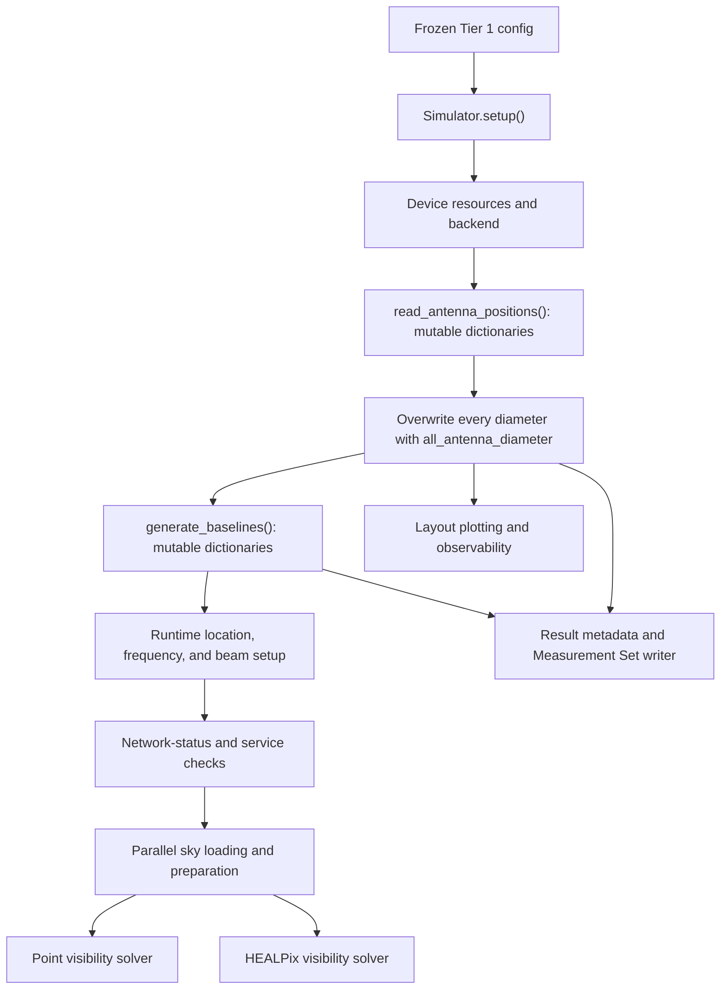
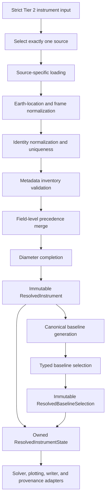
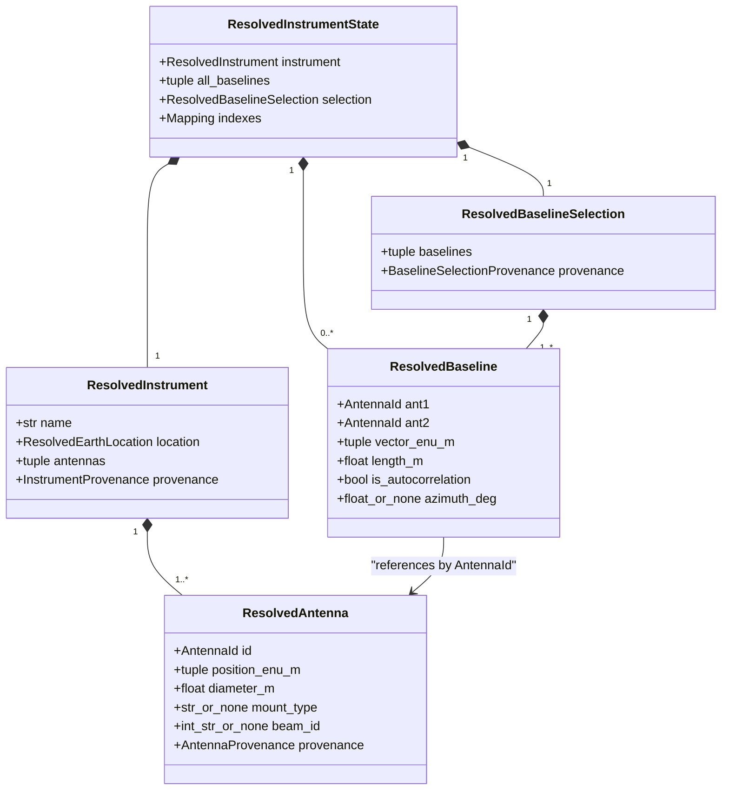
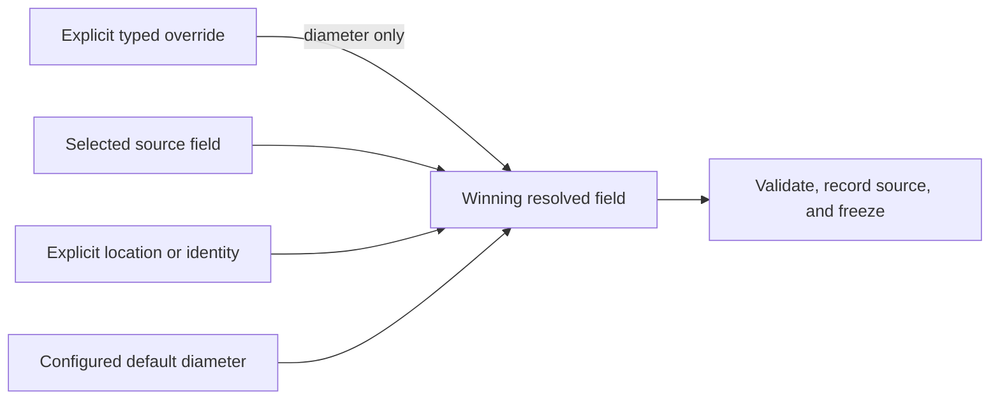
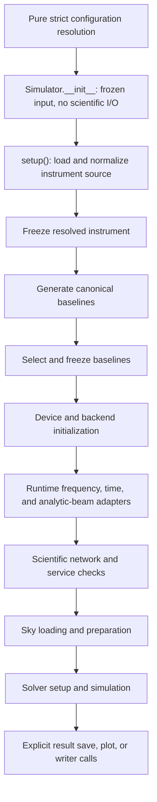
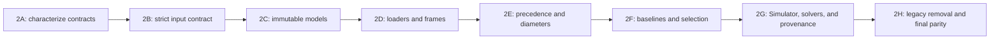

# Tier 2 Instrument and Baseline Resolution Plan

## 1. Metadata and status

| Field | Value |
|---|---|
| Repository | `RadioSim` |
| Design date | 2026-07-17 |
| Baseline commit | `fd461c180cd9eb8180d4458740a3eb2d5ab4f3fd` |
| Baseline `origin/main` | `f9ee87a5c1d4987fac1ee671d2c07711bcac8a41` |
| Baseline branch | `main`, one commit ahead of `origin/main` |
| Initial working tree | untracked `Fix.md` and `Tier1ConfigPlan.md`; nothing staged |
| Tier 1 status | Locally complete and independently accepted |
| Tier 2 issues | INS-001, INS-002, and INS-003 remain open |
| Gate status | Complete; awaits independent review and acceptance |
| Implementation status | Not started |
| Remote CI | Unobserved |

This document is the single implementation contract for Tier 2. It selects one
architecture and leaves no product, public-API, data-model, coordinate-frame,
precedence, or scientific-selection decision open. No Tier 2 implementation may
start until an independent review accepts this gate. The next task is that review,
not Tier 2A.

## 2. Decision and scope

Tier 2 will replace the current mutable antenna and baseline dictionaries with one
owned, immutable scientific state. A strict discriminated input selects exactly one
antenna-position source. Instrument resolution loads that source, normalizes every
position into ENU metres relative to a resolved Earth location, normalizes identity,
resolves one finite positive diameter per antenna, freezes the instrument, generates
canonical baselines, applies typed selection, and freezes the selected inventory.

The resolved state is created at the start of `Simulator.setup()`, before device,
backend, sky, scientific-network, output, plotting, or browser work. Configuration
resolution remains pure. The point and HEALPix solvers receive adapters derived from
the same state. Result metadata receives one JSON-safe snapshot of that state.

The design deliberately makes pre-v1 breaks:

- replace the boolean-heavy telescope, layout, diameter, and baseline input surfaces;
- remove the ambiguous `pyuvdata` text format and generic CASA XYZ interpretation;
- remove mutable dictionary public properties and opaque baseline strings;
- remove all silent `14.0` diameter fallbacks;
- provide no compatibility shim for removed fields or return shapes.

## 3. Tier 1 invariants inherited

Tier 2 preserves these accepted Tier 1 invariants:

1. Pydantic input models and runtime input are strict and frozen.
2. File, parameter, and CLI inputs have distinct source adapters and one common pure
   configuration resolver.
3. There is no raw-constructor or arbitrary-dictionary escape hatch.
4. Unknown, removed, contradictory, or unsupported input fails explicitly; accepted
   input never becomes a silent no-op.
5. Caller-owned models and containers are not mutated or retained as mutable aliases.
6. Runtime scientific state is immutable after successful resolution.
7. Validation occurs before avoidable side effects.
8. Workflow/orchestration configuration remains outside scientific runtime state.
9. Setup never establishes precedence by mutating resolved input.
10. Tier 3 and later features remain rejected rather than partially accepted.

## 4. Current-state source inventory

### 4.1 Current configuration and telescope fields

`TelescopeConfig` currently accepts `telescope_name`, whose default is `"Unknown"`,
as metadata. Its four flags—`use_pyuvdata_telescope`,
`use_pyuvdata_location`, `use_pyuvdata_antennas`, and
`use_pyuvdata_diameters`—default to false. Tier 1 rejects any true value through the
unsupported-feature collector. At their defaults they are accepted but inert. They
describe future, independently switchable field sources that can contradict each
other and are therefore not retained in the Tier 2 schema.

`AntennaLayoutConfig` currently requires a path, one of six format names, and
`all_antenna_diameter`. `use_different_diameters` and `diameters` are frozen but
non-default heterogeneous requests are rejected. `BaselineSelectionConfig` accepts
auto/cross booleans, length-selection fields, and angle-selection fields; non-default
length or angle requests are rejected. It rejects only the auto=false/cross=false
combination semantically.

`Simulator.from_parameters()` exposes separate file path, file format, uniform
diameter, and location arguments. Configuration resolution freezes those values but
does not read or resolve instrument content.

### 4.2 Current antenna representation

`read_antenna_positions()` returns `dict[int, dict[str, Any]]`. The outer key is an
integer antenna number and the nested `Number` is normally the same integer. Nested
records contain `Name: str`, `Number: int`, `BeamID: int | str | None`,
`Position: tuple[float, float, float]`, and sometimes `diameter: float`. Coordinate
units are intended to be metres, but the frame is reader-dependent and is not typed.

The readers create new dictionaries. Their insertion order is file/source order.
`format_antenna_data()` instead sorts outer integer keys and creates mutable NumPy
arrays. Duplicate numbers silently replace the previous dictionary entry. Duplicate
names are generally not checked. Missing diameters are omitted from nested records;
the formatter can turn a mixture of values and `None` into `NaN`. No common validator
enforces finite positions, positive diameters, unique identifiers, or aligned source
arrays.

`Simulator.setup()` retains the loaded dictionary, then overwrites every loaded
`diameter` with the configured `all_antenna_diameter`. The loaded values therefore do
not survive. The baseline builder copies positions into newly allocated NumPy arrays,
but the Simulator and result paths retain and publicly expose the mutable dictionaries.

### 4.3 Current format table

| Current format | Parser and identifiers | Current frame and location | Metadata/dependency behavior | Tier 2 decision |
|---|---|---|---|---|
| `radiosim` | `read_radiosim_format()`; file `Name` and `Number` | Documented local ENU metres; no embedded location | Optional diameter and BeamID; no mount/feed; standard-library local file I/O; malformed optional diameter may be omitted | Keep as strict `radiosim`; require explicit location; validate the exact ENU contract |
| `casa` | `read_casa_format()`; generated row number; file antenna/station name with generated fallback | `LOC`/`ENU` is local ENU; `XYZ` is currently recognized and then incorrectly passed through as ENU; observatory/COFA is ignored | Optional diameter; no BeamID/mount/feed; local file I/O; malformed rows may be skipped | Replace with `casa_loc`; require explicit `LOC` or `ENU` header and explicit location; reject XYZ, missing, or unknown frame |
| `measurement_set` | `read_measurement_set()`; `UVData.antenna_names` and `antenna_numbers` | Current code labels relative ECEF antenna positions as ENU and ignores embedded telescope location | Diameter may be present; current code drops mount/feed; requires `pyuvdata` and format backends such as `python-casacore`; currently reads the dataset, not metadata-only | Keep; metadata-only read; use embedded Earth location and ECEF-to-ENU conversion |
| `uvfits` | `read_uvfits()`; same pyuvdata arrays | Same relative-ECEF-as-ENU defect | Same pyuvdata metadata; local file reader may use library cache/known-telescope defaults not controlled by RadioSim | Keep; metadata-only read and the same normalized dataset loader boundary |
| `mwa` | `read_mwa_format()`; FITS `Antenna` number and `TileName`; duplicate polarization rows deduplicated by name | `East`, `North`, `Height` are local ENU; no embedded resolved Earth location | No diameter, BeamID, mount, or feed retained; requires Astropy FITS; local file I/O | Rename to `mwa_metafits`; require explicit location; keep one row per unique antenna after strict conflict checks |
| `pyuvdata` | `read_pyuvdata_format()`; generated sequential number/name from three text columns | Comments permit either ENU or ITRF, so `(x,y,z)` is ambiguous | No diameter/location/mount/feed; local file I/O; malformed lines may be skipped; despite its name it is not a known `Telescope` source | Remove; use strict `radiosim` for local ENU text or `known_telescope` for pyuvdata metadata |

The currently unused `_convert_coordinates_to_enu()` does not repair these contracts.
Its XYZ/ITRF path uses a spherical approximation and extracts only element zero of a
coordinate tuple for the reference point; unknown frames warn and pass through. No
reader calls it. Tier 2 removes it rather than building on it.

The native reader detects optional headers but still relies on fixed positional
columns; CASA and the three-column text reader silently skip some malformed rows; and
MS/UVFITS use `zip(..., strict=False)`, which can truncate inconsistent metadata arrays.
All retained Tier 2 parsers instead reject a malformed row or length mismatch with a
stable source-record location.

No current RadioSim file parser intentionally performs network I/O. The MS/UVFITS
readers delegate to `UVData.read()` without a metadata-only flag or a RadioSim-owned
offline policy, so dependency cache/site-registry behavior is uncontrolled. The
known-telescope integration selected below is a distinct source and has an explicit
offline seam.

Both shipped YAML configs and the complete antenna example select a local `radiosim`
layout and configure a uniform 14-metre diameter; their baseline-selection sections use
the current all-pairs defaults. The primary script and basic notebook use the old
`from_parameters()` path/format/diameter/location scalars. The antenna example folder
contains native, CASA, ambiguous three-column pyuvdata-text, and MWA metafits samples,
but no deterministic known-telescope, Measurement Set, or UVFITS contract fixture.
Nothing shipped exercises diameter precedence or non-default baseline selection. These
truth surfaces migrate atomically in 2G; source fixtures for dependency-backed formats
are created as local test fakes in 2D rather than committed scientific datasets.

### 4.4 Current baseline representation

`generate_baselines()` builds a dictionary keyed by `(ant1_number, ant2_number)`.
It reconstructs an antenna-number dictionary from nested `Number` fields, so number
collisions replace earlier records. It sorts numbers, then generates every pair with
`ant1 <= ant2`: all autos and all crosses.

Each value contains:

- `BaselineVector`: mutable NumPy array, `position(ant2) - position(ant1)`;
- `Length`: NumPy scalar Euclidean norm;
- `D1D2`: underscore-joined `diameter1_diameter2` string;
- `BT1BT2`: underscore-joined entries from `beams_per_antenna`;
- `A1A2`: underscore-joined entries from `beam_response_per_antenna`.

The coordinates are assumed to be ENU by both visibility paths. Exact source search
shows that `Length` has no scientific consumer and the three opaque strings have no
downstream consumer outside `baseline.py`. They are carried metadata, not physics.
Current setup passes the same `"gaussian"` map for both beam dictionaries, so the
last two strings are normally identical `gaussian_gaussian` values.
`BaselineVector` is the scientific field consumed by point and HEALPix solvers and by
the Measurement Set writer. `Simulator.baselines` exposes the mutable internal object.

Both phase implementations agree with the present sign:
`exp(-2*pi*i*(position(ant2)-position(ant1)) dot direction / wavelength)`.
The Measurement Set writer, however, treats the ENU baseline vector as if it were
time-dependent UVW, which is a separate representation error.

## 5. Current consumer graph



The point and HEALPix paths read baseline keys and `BaselineVector`. Both analytic
beam paths can evaluate per-antenna diameters, but both use hidden `14.0` fallbacks
when a record is incomplete. Neither needs raw antenna positions after baselines are
built. The point path also derives a default beam from the first antenna; both paths
need a complete typed diameter adapter to make heterogeneous behavior reliable.

Visualization reads `Position`, `Name`, `Number`, and optional diameter. Memory
estimation currently uses counts only, so it needs selected antenna/baseline counts but
no new diameter formula. Observability accepts one diameter and also defaults to
`14.0`. The Measurement Set writer regenerates `ANT###` names, defaults missing
diameters to `14.0`, assumes positions are ENU, and uses baseline vectors as UVW.
HDF5/JSON metadata serializes current config and mutable result dictionaries without a
canonical resolved-instrument snapshot.

## 6. Current defects and root causes

1. One untyped dictionary shape represents several frames and incomplete metadata.
2. Source insertion and mutation order, not a declared matrix, determines precedence.
3. Silent dictionary overwrite hides duplicate antenna identities.
4. Generic CASA XYZ and pyuvdata-text XYZ are scientifically ambiguous or mislabeled.
5. MS/UVFITS relative ECEF positions are mislabeled as local ENU.
6. The configured uniform diameter destroys source values; other consumers silently
   restore missing values as `14.0`.
7. Independently selectable pyuvdata booleans permit incoherent field-source requests.
8. Mutable NumPy and dictionary aliases escape through public and result surfaces.
9. Opaque baseline strings duplicate data but carry no scientific meaning.
10. No implemented baseline-selection stage exists despite a placeholder schema.
11. Instrument failures currently occur after device/backend selection.
12. Writer and observability consumers invent metadata instead of consuming one state.

The root cause is the absence of a domain boundary between strict input and solver
containers. Tier 2 creates that boundary; it does not patch individual dictionary
mutations.

## 7. Explicit out-of-scope boundary

Tier 2 does not add FITS beams, per-antenna beam assignment, mixed beams,
heterogeneous-beam observability semantics, feed/receptor polarization behavior, new
Jones terms, spherical-harmonic simulation, backend optimization, UVFITS output,
time-grid redesign, correlation-storage redesign, visibility-result redesign, or broad
documentation cleanup. `BeamID` and mount can be retained as inert source facts, but
no Tier 2 runtime decision may interpret them. Feed arrays and feed angles are dropped
at the loader boundary and remain Tier 5 work.

## 8. Selected target architecture



The only source that owns antenna positions and identities is the selected source.
Tier 2 never merges position inventories antenna by antenna. Explicit configuration may
provide location, a fallback diameter, and typed per-antenna diameter overrides, but
not a second layout. This removes extra/missing/cross-source identity ambiguity by
construction. All source facts are first represented in a private mutable staging
record, validated and merged without changing input, then converted once to frozen
public models.

The pure Tier 1 resolver produces frozen `InstrumentConfig` and
`BaselineSelectionConfig` values. File access, optional dependency import, known
telescope loading, conversion, and scientific validation happen only in the separate
instrument-resolution phase at the beginning of setup.

## 9. Canonical instrument data models

All public models below are `@dataclass(frozen=True, slots=True)` value objects. Every
container field is a tuple; every string is a built-in `str`; every real number is a
finite built-in `float` created from a float64 calculation. Public frozen state contains
no NumPy arrays, dictionaries, `EarthLocation`, `Path`, Pydantic model, or caller-owned
container. Equality and hashing are exact field-wise dataclass equality/hashing after
normalization. Numerical closeness is a validation/conversion concern, not equality.

| Type | Exact fields | Status and semantics |
|---|---|---|
| `AntennaId` | `number: int`; `name: str` | Public, required, hashable identity. Number is non-negative; name is normalized and unique. |
| `AntennaFieldSource` | enum values `explicit_config`, `explicit_override`, `layout_file`, `embedded_dataset`, `known_telescope`, `generated`, `config_default` | Public serialized source vocabulary. It records origin, not precedence logic. |
| `ResolvedEarthLocation` | `longitude_deg: float`; `latitude_deg: float`; `height_m: float`; `itrs_xyz_m: tuple[float, float, float]`; `source: AntennaFieldSource`; `reference: str` | Public Earth-only location. Longitude is normalized to `[-180,180)` and latitude is `[-90,90]`. `reference` is the config/source locator. |
| `AntennaProvenance` | `identity_source: AntennaFieldSource`; `position_source: AntennaFieldSource`; `diameter_source: AntennaFieldSource`; `source_diameter_m: float | None`; `mount_source: AntennaFieldSource | None`; `beam_id_source: AntennaFieldSource | None`; `source_record: str` | Public per-antenna field origins. `source_diameter_m` preserves the selected source fact even when an override wins. `source_record` is a stable row/index/name locator, never an object repr. |
| `ResolvedAntenna` | `id: AntennaId`; `position_enu_m: tuple[float, float, float]`; `diameter_m: float`; `mount_type: str | None`; `beam_id: int | str | None`; `provenance: AntennaProvenance` | Public canonical antenna. Position is East, North, Up metres relative to `ResolvedEarthLocation`. Mount and BeamID are inert. Feed metadata is absent. |
| `InstrumentProvenance` | `schema_version: str`; `source_kind: str`; `source_reference: str`; `source_format: str | None`; `telescope_name_source: AntennaFieldSource`; `location_source: AntennaFieldSource`; `source_location_itrs_xyz_m: tuple[float, float, float] | None`; `location_separation_m: float | None`; `pyuvdata_version: str | None`; `source_sha256: str | None`; `instrument_sha256: str` | Public inventory provenance. `schema_version` is initially `radiosim.instrument.v1`. `source_reference` is the resolved absolute path or canonical requested known name. A local single file has a content hash; known-telescope provenance has package version and name. |
| `ResolvedInstrument` | `name: str`; `location: ResolvedEarthLocation`; `antennas: tuple[ResolvedAntenna, ...]`; `provenance: InstrumentProvenance` | Public canonical inventory, sorted by antenna number. It is the single owner-visible source of telescope, location, positions, diameters, and inert metadata. |

`InstrumentProvenance.instrument_sha256` is SHA-256 over canonical UTF-8 JSON of the
resolved name, location, ordered antenna identifiers, ENU positions, diameters, inert
metadata, and field-source labels, excluding the hash field itself. JSON uses sorted
object keys, compact separators, UTF-8, and rejects NaN. File `source_sha256` hashes raw
bytes for single-file formats. It is `None` for Measurement Set directories and known
telescopes; their resolved absolute directory/name, extracted inventory fingerprint,
and pyuvdata version are the narrow Tier 2 provenance. Tier 2 does not recursively hash
large Measurement Set data tables. These rules make provenance reproducible without
claiming bitwise stability across a future schema version.

The owning private `ResolvedInstrumentState` has exactly:

- `instrument: ResolvedInstrument`;
- `all_baselines: tuple[ResolvedBaseline, ...]`;
- `selection: ResolvedBaselineSelection`;
- `by_number: Mapping[int, ResolvedAntenna]` and
  `by_name: Mapping[str, ResolvedAntenna]`, each an internally created
  `MappingProxyType` over a new dictionary.

It lives from the first successful setup through the Simulator lifetime. A failed
resolution is never assigned. `Simulator.instrument` returns `ResolvedInstrument`;
`Simulator.antennas` returns its immutable antenna tuple; `Simulator.baselines` returns
the immutable selected baseline tuple. Before successful setup all three raise the
same `RuntimeError("Simulator setup has not completed")`. No legacy serialized
dictionary is exposed.

Solver adapters allocate fresh float64 arrays and integer index arrays from this
state, set `writeable=False`, and remain private to the solver setup. They never share
memory with a caller or public model. Serialization is explicit `to_snapshot()` logic,
not `dataclasses.asdict()` over arbitrary objects.

### 9.1 Canonical data-model relationships



## 10. Coordinate-frame contract

The canonical position frame is right-handed local ENU in metres relative to the
resolved WGS84/ITRS Earth location:

- tuple index 0: East;
- tuple index 1: North;
- tuple index 2: Up, including source altitude/height difference;
- `East x North = Up`;
- arithmetic is float64, frozen storage is built-in float;
- every component and derived norm must be finite.

No decimal rounding is applied. Exact negative zero is canonicalized to positive
`0.0` before freezing and hashing.

Conversion rules are fixed:

| Selected source | Source coordinate contract | Conversion to canonical ENU |
|---|---|---|
| `radiosim` | Local ENU metres | Validate and copy; explicit Earth location is required. |
| `casa_loc` | `LOC` or `ENU` local metres only | Validate and copy; explicit Earth location is required. XYZ, missing header, or other frame is an error. |
| `mwa_metafits` | FITS East/North/Height local metres | Validate and copy; explicit Earth location is required. Repeated polarization rows must agree before deduplication. |
| `measurement_set` | pyuvdata antenna positions, relative ECEF metres about embedded telescope location | Compute absolute ECEF as embedded-location ITRS XYZ plus each relative vector, then call the public pyuvdata/Astropy ECEF-to-ENU utility with the resolved canonical location. |
| `uvfits` | Same pyuvdata relative-ECEF contract | Same conversion. |
| `known_telescope` | `Telescope.antenna_positions`, relative ECEF metres about `Telescope.location` | Same explicit absolute-ECEF conversion as dataset sources; `get_enu_antpos()` is characterized but not used by the target resolver. |

Tier 2 supports `astropy.coordinates.EarthLocation` only. A `MoonLocation` or any
non-Earth location fails `CoordinateFrameError`. Public conversion utilities are
fixed to `pyuvdata.utils.ENU_from_ECEF(absolute_ecef_m,
center_loc=resolved_earth_location)` and the inverse reference test uses
`pyuvdata.utils.ECEF_from_ENU`; the current spherical approximation is never used.
Source and explicit location ITRS XYZ separation must be
at most `1.0 m`. When both exist and pass, explicit location is canonical and absolute
ECEF antenna coordinates are reprojected about it. A greater separation is
`InstrumentLocationMismatchError`; there is no quiet override.

Reference tests use published/constructed Earth locations and compare conversion and
round-trip ECEF coordinates within `1e-6 m` absolute per component. Generation rejects
non-finite values. Two distinct antennas whose ENU separation is at most `1e-9 m`
cause `CoincidentAntennaError` during cross-baseline generation. That numerical
tolerance treats file noise below a nanometre as the same physical position while not
conflating realistic arrays.

## 11. Tier 2 input schema

The top-level scientific input contains `instrument` and `baseline_selection`.
The old top-level telescope/layout/location split is removed. The conceptual strict
schema is:

```yaml
instrument:
  source:
    kind: layout_file | known_telescope
    # layout_file only:
    path: path/to/layout
    format: radiosim | casa_loc | measurement_set | uvfits | mwa_metafits
    telescope_name: optional-nonblank-name
    # known_telescope only:
    name: required-known-telescope-name
    registry_policy: offline | allow_network   # default: offline
  location:                         # optional only when source embeds one
    longitude_deg: finite-number
    latitude_deg: finite-number
    height_m: finite-number
  default_diameter_m: positive-finite-number-or-null
  diameter_overrides:
    - antenna:
        kind: number
        number: non-negative-integer
      diameter_m: positive-finite-number
    - antenna:
        kind: name
        name: required-normalized-name
      diameter_m: positive-finite-number

baseline_selection:
  correlations: all | cross | auto
  length_filter: null | targets | ranges
  azimuth_ranges_deg: []
```

The actual frozen input types are a discriminated `LayoutFileSourceConfig |
KnownTelescopeSourceConfig`, `InstrumentConfig`, tagged `AntennaNumberReference |
AntennaNameReference`, and typed baseline criteria. `default_diameter_m` defaults to
`None`; explicit null and omission are identical and mean “no configured fallback.”
`diameter_overrides` defaults to an empty tuple. Presence of a filter expresses
intent; no enable boolean exists.

For `layout_file`, `telescope_name` is required for `radiosim`, `casa_loc`, and
`mwa_metafits`; it is optional for MS/UVFITS, where an embedded nonblank name wins only
when explicit identity is absent. For `known_telescope`, `name` is both source key and
instrument identity. Explicit location is required for sources without one; embedded
location satisfies the requirement otherwise. Source-specific schema checks reject
irrelevant keys.

Layout paths retain Tier 1 source-aware resolution and provenance. A Measurement Set
path must resolve to a directory; every other retained layout format must resolve to a
regular file. Environment-variable syntax remains rejected, and the resolver does not
change the process working directory.

`Simulator.from_parameters()` accepts the typed frozen `instrument: InstrumentConfig`
and optional typed `baseline_selection: BaselineSelectionConfig`, alongside the
remaining focused Tier 1 runtime parameters. It does not expand path, format,
diameter, location, or override lists into convenience scalars. File, parameters, and
CLI still converge on the same frozen input and instrument resolver.

### 11.1 Exact baseline input types

- `correlations: Literal["all", "cross", "auto"] = "all"`;
- `length_filter: LengthTargetsConfig | LengthRangesConfig | None = None`;
- `LengthTargetsConfig`: `mode="targets"`,
  `targets_m: tuple[positive-or-zero float, ...]` (non-empty),
  `tolerance_m: non-negative float`;
- `LengthRangesConfig`: `mode="ranges"`,
  `ranges_m: tuple[LengthRangeConfig, ...]` (non-empty), where each range has
  `min_m: non-negative float` and `max_m: float >= min_m`;
- `azimuth_ranges_deg: tuple[AzimuthRangeConfig, ...] = ()`, each with finite
  `start_deg` and `end_deg` in `[0,180)` and `start_deg != end_deg`.

A full axial circle is represented by omitting `azimuth_ranges_deg`; equal endpoints
are invalid, not a magic full-circle spelling. Exact duplicate targets or range pairs
are schema errors. Overlapping criteria are legal. The resolved criteria snapshot sorts
targets numerically and range pairs lexicographically without merging overlaps, so
equivalent CLI/API ordering serializes identically. All units are in field names.

## 12. Source selection

Exactly one discriminated source owns telescope positions and identities:

1. `layout_file` reads one explicitly named retained format.
2. `known_telescope` calls the pyuvdata known-telescope loader.

A dataset-backed `measurement_set` or `uvfits` is a layout-file source whose metadata
is read from that file. It is not a known-telescope source even if the dataset carries
a familiar telescope name. No schema can request known-telescope positions plus file
positions, so extra/missing antennas, position mismatch, and name/number disagreement
across two position inventories cannot arise. Any attempt to use removed
`use_pyuvdata_*` flags or multiple source keys fails strict schema validation.

Within a selected source, all parallel arrays must have identical length; every row
must contain one normalized number/name pair and position; duplicate or conflicting
rows fail. MWA's two polarization rows are the sole source-specific deduplication:
records with the same normalized name and number are collapsed only if their ENU
positions and all retained metadata agree exactly after numeric parsing; disagreement
fails.

## 13. pyuvdata integration

The live checkout contains pyuvdata `3.2.1`. Its selected public loader is:

`Telescope.from_known_telescopes(name: str, *, run_check=True, check_extra=True,
run_check_acceptability=True, **kwargs)`.

The characterized construction signature is
`Telescope.new(name, location, antenna_positions=None, antenna_names=None,
antenna_numbers=None, antname_format="{0:03d}", instrument=None,
x_orientation=None, antenna_diameters=None, feeds=None, feed_array=None,
feed_angle=None, mount_type=None, update_from_known=True)`. It is the public seam for
fakes and writer adapters. The related installed module APIs are
`known_telescopes()` and
`known_telescope_location(name: str, return_citation: bool=False, **kwargs)`.
The installed type contract accepts an antenna-position NumPy array or name/number-keyed
array dictionary; list/array names and numbers; optional list/array diameters; optional
`x_orientation` in east/north aliases; optional feeds/feed arrays/feed angles; and one
mount literal or mount list. `update_from_known` defaults true. These are loader inputs,
not objects retained in RadioSim frozen state.
Known telescope names can be returned by `known_telescopes()`, but that function
combines a set of packaged names and Astropy site-registry names. Its order is
nondeterministic and its membership may depend on cache/registry state. RadioSim
therefore neither prevalidates by enumeration nor lists registry-derived choices in
Tier 2 CLI/help. The CLI accepts a nonblank string; validity is determined by an
attempted load.

The loader returns EarthLocation, string-like NumPy name arrays, integer number arrays,
float64 relative-ECEF positions, optional float diameter arrays, and mount metadata.
Feeds may be absent and are out of scope. A locally loaded HERA object had 350 antennas,
14-metre diameters, fixed mounts, and relative-ECEF positions. `antenna_diameters` can
be `None`. Unknown names raise `ValueError`; RadioSim maps only the known “not in
astropy_sites or known_telescopes_dict” condition to `TelescopeNotFoundError`, while
other validation failures become `InstrumentSourceError` with exception chaining.

Known loading can consult Astropy's site registry, cache, and optional download path.
`KnownTelescopeSourceConfig` therefore includes
`registry_policy: Literal["offline", "allow_network"] = "offline"`. In offline mode,
the adapter temporarily sets Astropy data access to disallow internet under a private
module lock, calls the loader, and restores the prior setting in `finally`. This is the
only planned process-global interaction and it is serialized and scoped. In
`allow_network` mode, setup may consult the registry after instrument input has passed
pure validation, and provenance records the policy. Unit tests inject a
`KnownTelescopeLoader` protocol and never import network state or call a real registry.

The production dependency is imported lazily inside source adapters. Missing pyuvdata
or a format backend maps to `OptionalInstrumentDependencyError` with the format and
install extra. MS/UVFITS use `UVData.read(..., read_data=False)` through a separately
injectable `DatasetTelescopeLoader`; they extract `uvd.telescope` and never route
through the known-telescope adapter.

No RadioSim-level process cache is added. A successful `Simulator.setup()` retains its
one resolved state and repeated setup returns it by identity. A failed setup retains
nothing and a retry performs a fresh load. Any cache inside pyuvdata/Astropy is
dependency-owned and is reported only where it changes the registry policy/source.

## 14. Field-level precedence matrix



The diagram expresses allowed precedence, not a universal merge chain. Each field has
one exact rule:

| Field | Allowed sources, highest first | Mismatch/fallback/error rule |
|---|---|---|
| Instrument identity | `known_telescope.name`; explicit `layout_file.telescope_name`; embedded MS/UVFITS name | A known source has no second identity. For dataset files, explicit and embedded nonblank names must match after surrounding-whitespace/NFC normalization or fail; explicit fills a missing embedded name. Local formats require explicit identity. |
| Location | explicit `instrument.location`; selected source embedded Earth location | Both must be within 1.0 m ITRS separation. Explicit is canonical when present; embedded fills absence. Neither is an error. Non-Earth is an error. Winner and comparison are recorded. |
| Positions | selected source only | Never merged or overridden per antenna. Missing, invalid, or ambiguous frame fails. |
| Numbers | selected source; source-specific generated value only for `casa_loc` rows without a number | No cross-source fallback. Duplicates/conflicts fail. Generated values are deterministic row indices. |
| Names | selected source; source-specific generated `ANT{number:03d}` only where `casa_loc` lacks both antenna and station | No cross-source fallback. Empty or duplicate normalized names fail. |
| Diameter | explicit typed antenna override; selected source value; `default_diameter_m` | A valid override may differ from a valid source value with no tolerance because it is explicit intent; both source value and winner are recorded. Invalid present values fail rather than falling through. Missing source values may fall through. Every final value is required. |
| Mount | selected source only | Retain a normalized nonblank string as inert metadata; missing is `None`; no user override in Tier 2. |
| BeamID | selected `radiosim` source only | Retain `int | str | None` as inert future metadata; no precedence or interpretation. Other sources use `None`. |
| Feed/receptor | none | Drop/reject from Tier 2 state; no behavior until Tier 5. |

Position mismatch, extra antenna, or missing antenna between sources is not resolved
because two identity/position sources cannot be selected. Within one source, array
length disagreement, duplicate number, duplicate name, or conflicting repeated row is
an error. Ordering differences in parallel pyuvdata arrays are accepted only by index,
as defined by the Telescope contract; the normalized final inventory is re-sorted.

## 15. Identifier normalization

Canonical number is always a non-negative Python `int`; booleans, fractional values,
negative values, and values outside the platform-independent signed 64-bit range are
rejected. Canonical name is required, Unicode NFC-normalized, stripped of leading and
trailing whitespace, non-empty, and case-sensitive. Two names that normalize to the
same exact string are duplicates. Both number and name must be unique across the
inventory.

Native, MWA, MS/UVFITS, and known-telescope sources must supply both identifiers.
`casa_loc` may generate a number from zero-based data-row order if the format has no
number field; it may generate `ANT{number:03d}` only if both antenna and station names
are absent. Generated fields are allowed only for this explicit parser contract and are
marked `generated`. `radiosim` never generates identifiers.

Diameter overrides are a tuple of tagged name or number references. Strings are never
guessed to be numeric, lower-cased, or matched by both namespaces. Each reference must
match exactly one canonical antenna. An unknown reference fails. More than one override
that resolves to the same antenna fails even if values agree. This handles mixed
name/number references without ambiguity.

The canonical tuple is sorted by ascending number. Names do not affect ordering.
Number/name disagreement is a source-row conflict, never an instruction to merge two
antennas. A zero-antenna source fails; a one-antenna source is valid and can produce its
single autocorrelation if selection permits.

Instrument identity uses the same stripped NFC, case-sensitive nonblank string rule.
A present mount is converted to a stripped NFC nonblank string without case folding; a
missing mount is `None`. A present native BeamID must be a non-boolean integer or a
stripped NFC nonblank string; missing is `None`, while an empty/invalid present value is
an `InstrumentFormatError`. These inert fields never participate in identity.

## 16. Diameter resolution

Diameter resolution runs after source loading, frame/identity normalization, and
metadata validation, but before `ResolvedAntenna` construction and baseline generation.
It receives the complete normalized antenna staging tuple plus frozen
`default_diameter_m` and typed overrides.

The algorithm is fixed:

1. Validate every configured default and override as finite and greater than zero.
2. Build exact number and name indexes from the already validated inventory.
3. Resolve every tagged override; reject unknown references and repeated targets.
4. For each antenna in canonical order, choose override, else a present source value,
   else configured default.
5. A present source value that is NaN, infinite, zero, or negative is an error; it does
   not fall through. A missing value is distinct and may fall through.
6. If no winner exists for any antenna, collect its identifier and raise one
   `DiameterResolutionError` listing all incomplete antennas.
7. Store the winning float and `AntennaFieldSource` in the frozen antenna/provenance.

This is substantively `explicit per-antenna override > selected source > configured
default`. There is no boolean switch. Partial source diameter arrays are legal only
when missing entries can be completed. Source mismatches are retained in provenance:
an override may intentionally replace a valid source value, and both the winning
source and source-record identity remain visible in the snapshot.

Repeated setup never re-resolves or mutates a diameter because a successful state is
cached on the Simulator. Point, HEALPix, and analytic-beam adapters require a complete
number-to-diameter mapping and contain no `.get(..., 14.0)`. Plotting reads canonical
values. Memory estimates use exact resolved counts. The Measurement Set adapter writes
the ordered diameter array. Result provenance serializes every value and source.

## 17. Canonical baseline model

`ResolvedBaseline` is a public frozen, slotted, hashable value object with exactly:

- `ant1: AntennaId`;
- `ant2: AntennaId`;
- `vector_enu_m: tuple[float, float, float]`;
- `length_m: float`;
- `is_autocorrelation: bool`;
- `azimuth_deg: float | None`.

Pairs are generated from the canonical antenna tuple with `ant1.number <= ant2.number`
and sorted lexicographically by `(ant1.number, ant2.number)`. The mathematical invariant
is exactly:

`vector_enu_m = position_enu_m(ant2) - position_enu_m(ant1)`.

Length is the float64 Euclidean norm. Autos use identical IDs, exact `(0.0, 0.0,
0.0)`, exact `0.0`, `is_autocorrelation=True`, and `azimuth_deg=None`. A cross has
distinct IDs; separation at or below `1e-9 m` fails rather than producing a
directionless physical baseline. No physical-coordinate deduplication occurs above
that tolerance.

Cross azimuth is axial and defined by
`degrees(atan2(East, North)) mod 180`, normalized to `[0,180)`. Zero is North and
positive rotation is toward East. Modulo 180 makes selection invariant to swapping
physical endpoint direction and therefore independent of arbitrary antenna-number
ordering. Exact field-wise equality/hashing follows canonical construction. JSON uses
identifier objects, a three-number vector list, length, auto flag, and null azimuth for
autos.

Diameters, beam IDs, beam types, and concatenated antenna strings are not baseline
fields. They are obtained by referenced `AntennaId` through the owning state. Per-item
provenance is also not duplicated: the owning selection provenance holds the
instrument fingerprint and generation contract. `D1D2`, `BT1BT2`, `A1A2`, `Length`,
and `BaselineVector` legacy keys disappear.

## 18. Baseline-selection semantics

### 18.1 Generation and auto/cross inclusion

Canonical generation always creates all `n(n+1)/2` pairs, including autos, in
lexicographic order. `correlations="all"` retains both; `"cross"` retains only
distinct endpoints; `"auto"` retains only identical endpoints. “Neither” is
unrepresentable in the schema. Default is `all`. Zero input antennas is an instrument
error; a criterion that leaves zero baselines is an `EmptyBaselineSelectionError`.

### 18.2 Length filtering

Length target values and range endpoints are metres. Zero is legal so autos can be
selected; negative or non-finite values are schema errors. Target matching is
inclusive when `abs(length_m - target_m) <= tolerance_m + 1e-9 m`. Range matching is
inclusive when `min_m - 1e-9 m <= length_m <= max_m + 1e-9 m`. Multiple targets or
ranges form a union. The targets and ranges modes are mutually exclusive through the
discriminator. Autocorrelations participate normally with length zero.

### 18.3 Azimuth filtering

Each range is interpreted on the axial half-circle `[0,180)`. If `start < end`, it
matches the closed interval from start to end. If `start > end`, it wraps through
180/0 and matches `angle >= start` or `angle <= end`. Comparisons include a
`1e-12 degree` boundary allowance after normalized float64 calculation. Multiple
ranges form a union. Equal endpoints are invalid; omitting ranges represents the full
half-circle.

Autos have no direction. An azimuth filter applies only to crosses: autos that survived
correlation and length filtering pass through unchanged. This makes an angle criterion
compose truthfully with `correlations="all"`; users who want directional baselines only
select `cross`. Provenance reports the count of exempt autos so this behavior is not
hidden.

### 18.4 Pipeline and provenance


Categories combine by intersection in that order; alternatives inside one length or
angle category combine by union. Filtering never reorders the canonical tuple.

`BaselineSelectionProvenance` is public and frozen with exact fields:

- `schema_version: str` (`radiosim.baseline-selection.v1`);
- `instrument_sha256: str`;
- `criteria: BaselineSelectionCriteriaSnapshot` (the normalized frozen criteria);
- `generated_count: int`;
- `after_correlation_count: int`;
- `after_length_count: int`;
- `after_azimuth_count: int`;
- `azimuth_exempt_auto_count: int`;
- `selected_ids: tuple[tuple[int, int], ...]`.

`BaselineSelectionCriteriaSnapshot` is frozen and has exactly
`correlations: str`, `length_mode: str | None`,
`length_targets_m: tuple[float, ...]`, `length_tolerance_m: float | None`,
`length_ranges_m: tuple[tuple[float, float], ...]`, and
`azimuth_ranges_deg: tuple[tuple[float, float], ...]`. Inactive collections are empty
and inactive scalar fields are `None`; it never carries a Pydantic input model.

`ResolvedBaselineSelection` contains
`baselines: tuple[ResolvedBaseline, ...]` and
`provenance: BaselineSelectionProvenance`. Its tuple is non-empty. CLI and Python APIs
construct the same frozen criteria, so selection has one meaning.

## 19. Simulator lifecycle

### 19.1 Current exact ordering

`Simulator.__init__` receives already resolved frozen config, stores it, and performs no
scientific I/O. Current `setup()` guards idempotence, prints progress, selects device
resources/backend/simulator, reads the antenna file, overwrites all diameters, generates
baselines, resolves location/time/frequencies/wavelengths and beam configuration, checks
network/services, loads sky components in parallel, prepares the sky, attempts the beam
NSIDE advisory, and marks setup complete. `run()` can print a header before invoking
setup, then invokes the solver and stores results.

Save/plot calls happen after results and may create output directories or open display
resources. `plot_observability()` can currently run before setup, reads the configured
uniform diameter, and may save or open a browser without resolving the actual
instrument.

### 19.2 Target ordering and atomicity



`setup()` resolves instrument, all baselines, selection, indexes, and solver adapters
into local variables. It assigns `_instrument_state` only after the entire instrument
and selection phase succeeds. Later setup failure clears later partial runtime fields
but retains the already complete immutable instrument state for deterministic retry;
`_is_setup` remains false. No config object is rewritten.

At entry, an already successful setup returns immediately and preserves object
identity. A retry after instrument failure reloads because no state was assigned. A
retry after later backend/sky failure reuses the complete immutable instrument state
but recreates backend/sky state. This cache rule is internal and recorded by tests.

Backend/device selection moves after baseline selection. Thus every instrument and
selection error precedes backend allocation as well as sky/network/output/plot/browser
side effects. Progress text must not claim backend or sky work before resolution.
`run()` calls `setup()` before printing its simulation header, so an invalid instrument
does not emit a misleading run banner.

`plot_observability()` calls the same private `_ensure_instrument_state()` first. That
helper performs only the instrument and baseline phases, not backend/sky setup. It then
applies the uniform-only rule in section 21 before creating a plot, file, or browser.
Other layout plotting uses the same state. Save/writer APIs continue to require results
where they do today.

## 20. Solver integration

One private `SolverInstrumentView` is built from the resolved state. It owns:

- canonical antenna numbers and names in tuple order;
- a read-only float64 `[n,3]` ENU position array;
- a read-only float64 `[n]` diameter array;
- a number-to-row immutable index;
- selected pair numbers and a read-only float64 `[b,3]` baseline array.

The point and HEALPix setup paths receive that same view or lossless backend-specific
copies. They do not receive public dictionaries. Both preserve
`position(ant2)-position(ant1)` and the existing negative phase exponent. Every beam
lookup indexes a complete diameter array and raises an internal invariant error if an
ID is absent; no first-antenna or `14.0` fallback remains.

This activates existing analytic-beam support for heterogeneous diameters without
adding per-antenna beam types or FITS beams. Point and HEALPix parity tests prove the
same antenna order, pair order, vectors, and diameter values reach both paths. Memory
estimation uses resolved antenna count, selected baseline count, and existing sky/
frequency inputs; it does not invent a diameter-dependent memory term.

Plot adapters consume canonical names, numbers, positions, and diameters. They may
allocate mutable plotting arrays locally, but those arrays never flow back into the
resolved state.

## 21. Observability interim behavior

Tier 2 does not pretend one dish represents a heterogeneous array. Before planner,
plot, save, or browser work, `plot_observability()` compares canonical diameters for
exact normalized float equality:

- zero antennas is already impossible;
- if every value equals the first value, pass that exact common diameter to the current
  planner;
- otherwise raise `HeterogeneousObservabilityUnsupportedError`, naming the distinct
  values and stating that Tier 3 defines heterogeneous-beam footprint semantics.

There is no reference-antenna, average, minimum, maximum, or envelope heuristic. This
is a deliberate narrow rejection, not Tier 3 behavior.

## 22. Result and provenance boundary

The private `ResolvedInstrumentState` is the single owned scientific object. Its public
instrument and selection provenance are serialized into result metadata once, so the
Simulator state and outputs cannot disagree. The JSON-safe snapshot has this exact
top-level shape:

```text
instrument_resolution:
  schema_version
  instrument_sha256
  name
  source {kind, reference, format, source_sha256, pyuvdata_version}
  location {longitude_deg, latitude_deg, height_m, itrs_xyz_m, source,
            source_location_itrs_xyz_m, separation_m}
  antennas [{number, name, position_enu_m, diameter_m, source_diameter_m,
             mount_type, beam_id,
             provenance {...}}]
  baseline_selection {
    schema_version, criteria, generated_count, after_correlation_count,
    after_length_count, after_azimuth_count, azimuth_exempt_auto_count,
    selected_ids
  }
```

Tuple values serialize as JSON arrays, enums as their stable lowercase strings, and
optional values as null. Keys and canonical order are deterministic; NaN/Infinity is
forbidden. Baseline vectors and lengths remain available through the canonical state
and public property but are not duplicated in every result metadata record; selected
pair IDs plus instrument fingerprint and schema reconstruct their identity.

Existing HDF5/JSON writers add this one metadata object without changing visibility
array shape, time/correlation storage, or JSON visibility behavior. The Measurement Set
writer's public inputs become `instrument: ResolvedInstrument` and
`selection: ResolvedBaselineSelection` rather than legacy dictionaries. Its narrow
adapter preserves canonical antenna names/numbers/diameters, converts canonical ENU
positions to the relative-ECEF representation expected by `Telescope.new`, and calls
`UVData.set_uvws_from_antenna_positions(update_vis=False)` for the existing times
rather than labeling static ENU baselines as UVW. All broader
MS round-trip, result, time-grid, and correlation redesign remains Tier 4. UVFITS output
is not added.

The existing result mapping is not replaced in Tier 2. Its `antennas` value becomes the
same immutable `tuple[ResolvedAntenna, ...]` exposed by the Simulator and its
`baselines` value becomes the same selected `tuple[ResolvedBaseline, ...]`; existing
visibility/frequency/time keys and baseline-keyed visibility structure remain. The
metadata mapping adds only `instrument_resolution`. `Simulator.save()` passes the
owned state to writer adapters rather than reconstructing science from result dicts.

## 23. Error taxonomy

Tier 1 schema failures retain their existing configuration error classes. Tier 2 adds
`InstrumentResolutionError(ValueError)`. Source, format, telescope, optional-dependency,
location, identifier, coordinate, position, empty-instrument, diameter, generation,
coincidence, selection, and empty-selection errors below inherit from it;
`InstrumentFormatError`, `TelescopeNotFoundError`, and
`OptionalInstrumentDependencyError` also specialize `InstrumentSourceError`;
`DuplicateAntennaError` specializes `AntennaIdentifierError`,
`UnknownDiameterOverrideError` specializes `DiameterResolutionError`,
`CoincidentAntennaError` specializes `BaselineGenerationError`, and
`EmptyBaselineSelectionError` specializes `BaselineSelectionError`.
`HeterogeneousObservabilityUnsupportedError(RuntimeError)` is separate because the
instrument is valid and only that Tier 3-dependent presentation is unavailable.

| Error | Stage and triggering condition |
|---|---|
| `InstrumentSourceError` | Selected source cannot be read or returns incoherent metadata not covered below. |
| `InstrumentFormatError` | Malformed retained file format, skipped-row condition, unrecognized header, or parallel-array length mismatch. |
| `TelescopeNotFoundError` | Known-telescope loader reports the requested name absent. |
| `InstrumentLocationMismatchError` | Explicit and embedded locations differ by more than 1.0 m. |
| `AntennaIdentifierError` | Invalid/missing number or name, conflicting repeated row, or source-row identity mismatch. |
| `DuplicateAntennaError` | Duplicate normalized number or name. |
| `CoordinateFrameError` | Ambiguous/unsupported frame, non-Earth location, or conversion failure. |
| `InvalidAntennaPositionError` | Non-finite position/component/norm. |
| `EmptyInstrumentError` | Selected source contains zero antennas after format-specific normalization. |
| `DiameterResolutionError` | Invalid source/config diameter or incomplete final inventory. |
| `UnknownDiameterOverrideError` | Override reference is unknown or multiple references target one antenna. |
| `BaselineGenerationError` | Baseline invariant, numeric overflow, or internal pair-generation failure. |
| `CoincidentAntennaError` | Distinct antennas are within 1e-9 m. |
| `BaselineSelectionError` | Runtime selection invariant failure; malformed criteria should already be a schema error. |
| `EmptyBaselineSelectionError` | Valid criteria select zero baselines. |
| `OptionalInstrumentDependencyError` | pyuvdata, Astropy, casacore, or another selected format backend is unavailable. |
| `HeterogeneousObservabilityUnsupportedError` | Observability requested for more than one canonical diameter. |

Exceptions include the selected source and stable record/antenna reference, but not
secrets or arbitrary dependency object reprs. Dependency exceptions are chained.
Schema validation catches invalid discriminators, irrelevant/removed keys, malformed
ranges, non-finite configured values, and “neither” before setup.

## 24. Side-effect ordering

The enforceable order is:

1. pure config schema/semantic resolution;
2. selected local file or known-telescope source loading;
3. frame, identity, metadata, precedence, and diameter resolution;
4. canonical generation and selection;
5. immutable state assignment;
6. device/backend initialization;
7. runtime frequency/time/beam adapters;
8. scientific network/service checks;
9. sky loading/preparation;
10. solver setup/run;
11. explicitly requested result output, plotting, or browser operations.

Source loading is the only side effect allowed before a resolved instrument exists.
For known telescopes that includes the explicitly selected Astropy registry policy;
for dataset formats it includes metadata-only file/dependency I/O. An instrument error
must occur before sky access, scientific network checks, output-directory creation,
plot construction, browser opening, or workflow execution. It also occurs before
backend/device initialization. Temporary offline registry configuration is restored in
`finally` even on failure.

## 25. Public API and configuration migration

All migration is direct in this pre-v1 repository. A removed key fails strict Pydantic
validation as an extra/unknown field and points to the focused Tier 2 migration page;
there is no warning period or translation shim. For implementation sequencing, 2B
defines the new internal input value types while the current top-level schema remains
unchanged; 2G performs one atomic top-level cutover. No released or intermediate
top-level configuration accepts both old and new spellings.

| Removed surface | Direct replacement | Removal/proof slice |
|---|---|---|
| top-level `telescope` plus `telescope_name` | `instrument.source` identity | 2G; old-key rejection tests |
| `use_pyuvdata_telescope`, `use_pyuvdata_location`, `use_pyuvdata_antennas`, `use_pyuvdata_diameters` | one `source.kind: known_telescope` | 2G/2H; no boolean symbols remain |
| top-level `antenna_layout.path` and `format` | `instrument.source.kind: layout_file`, `path`, `format` | 2G |
| top-level `location` | `instrument.location` with embedded fallback/mismatch validation | 2G |
| `all_antenna_diameter` | `instrument.default_diameter_m` | 2G |
| `use_different_diameters` and `diameters` | typed `instrument.diameter_overrides` | 2G |
| format `casa` | strict `casa_loc` | 2D source implementation; 2G config cutover; 2H legacy parser removal |
| format `mwa` | `mwa_metafits` | 2D source implementation; 2G config cutover; 2H legacy parser removal |
| format `pyuvdata` text reader | `radiosim` ENU or `known_telescope` | 2G config removal; 2H reader removal |
| auto/cross booleans | `baseline_selection.correlations` | 2G |
| selective-length boolean/list/tolerance fields | tagged `length_filter` | 2G |
| trim-angle boolean/ranges | `azimuth_ranges_deg` | 2G |
| `Simulator.from_parameters()` layout/format/diameter/location scalars | typed `instrument` and `baseline_selection` objects | 2G |
| no canonical instrument property | add `Simulator.instrument: ResolvedInstrument` | 2C/2G |
| `Simulator.antennas` mutable dict | `tuple[ResolvedAntenna, ...]` plus `Simulator.instrument` | 2C/2G |
| `Simulator.baselines` mutable dict | `tuple[ResolvedBaseline, ...]` | 2F/2G |
| pre-setup `antennas`/`baselines` return `None` | all three resolved-state properties raise `RuntimeError("Simulator setup has not completed")` | 2G |
| public `read_antenna_positions()` | internal source-loader registry; canonical public state | 2D/2H |
| public `generate_baselines()` legacy dictionary | canonical generator returning frozen models | 2F/2H |
| opaque baseline fields | antenna references and typed baseline fields | 2F/2H |
| `write_measurement_set(..., antennas=dict, baselines=dict)` | typed `instrument` and `selection` arguments | 2G/2H |
| config-only result metadata | additive `instrument_resolution` snapshot | 2G |

Focused YAML examples, CLI help, API examples, and the Tier 2 migration page change in
the same atomic 2G public cutover, so no accepted slice leaves shipped truth surfaces
invalid. In 2H, Sphinx API references/exports to the then-unused legacy helpers are
deleted, not retained as aliases. Regression searches and import tests prove removed
symbols and keys are absent. Tier1ConfigPlan.md remains a historical accepted artifact
and is not rewritten.

## 26. Legacy removal inventory

The following implementation artifacts are removed or made private by the end of 2H:

- six-way public `read_antenna_positions()` dispatch and the ambiguous
  `_convert_coordinates_to_enu()` helper;
- `read_pyuvdata_format()` and the `pyuvdata` text-format literal;
- permissive CASA XYZ/pass-through branches and silent malformed-row skips;
- mutable `dict[int, dict[str, Any]]` antenna and
  `dict[tuple[int,int], dict[str, Any]]` baseline contracts;
- `format_antenna_data()` as a public scientific contract;
- `D1D2`, `BT1BT2`, `A1A2`, legacy `Length`, and legacy `BaselineVector` keys;
- setup's uniform-diameter overwrite loop;
- every `.get("diameter", 14.0)` and first-antenna diameter fallback;
- fake `"gaussian"` per-antenna beam maps used only to build opaque strings;
- old config fields, literals, validators, runtime fields, and convenience arguments;
- writer-generated names and writer diameter fallbacks;
- docs/tests/samples importing or asserting the old public shapes.

Mount metadata remains inert and typed. `BeamID` remains inert only for native
`radiosim` input. Neither is passed into Tier 3 behavior in Tier 2.

## 27. Test strategy

### 27.1 Current coverage and characterization baseline

There is no dedicated antenna-loader, canonical-instrument, baseline-generation,
baseline-selection, or Measurement Set writer unit module. `tests/integration/`
contains only `__init__.py`. Current coverage is distributed as follows:

| Category | Current coverage | Missing coverage |
|---|---|---|
| Loader parsing | Incidental setup paths only | Every format, malformed rows, duplicate IDs, ordering, optional metadata |
| Config validation | Strong Tier 1 schema/path/config-resolution tests | Tier 2 discriminators, removed-key rejection, typed overrides/selection |
| Simulator integration | Setup/run/result mocks and basic state tests | Immutable state, early failure, retry/cache, public return types |
| Point solver | Dictionary fixtures and baseline-vector behavior | Canonical adapter, complete heterogeneous diameters, no fallback |
| HEALPix solver | Dictionary/sparse fixtures | Same canonical adapter and point parity |
| Measurement Set/output | No focused writer contract | Names/numbers/positions/diameters/provenance and ENU/UVW correctness |
| pyuvdata | No deterministic Telescope source tests | Known/dataset loaders, offline seam, missing metadata, error mapping |
| Diameter behavior | Defaults in solver fixtures | All precedence, invalid/missing values, heterogeneous parity |
| Baseline count/selection | No comprehensive module | Counts, vector/sign, axial azimuth, all filters, empty result |
| Coordinate frames | None comprehensive | Every retained source and ECEF/ENU reference/round trip |
| Provenance | Config/sky provenance only | Instrument fingerprint, field origins, selection snapshot |

The design-task focused command added existing observability consumers to the five
prescribed paths. It collected 145 tests: 144 passed and 1 skipped, with four existing
warnings. Python was 3.11.13 in default Pixi and 3.12.13 in `py312`. Ruff lint passed;
Ruff format reported 253 files already formatted; `git diff --check` passed. No
network-dependent simulation ran. The accepted whole-Tier-1 baseline remains 1,466
collected, 1,465 passed/1 skipped on Python 3.11, 1,458 passed/8 skipped non-slow on
Python 3.12, 4,446 Pyright diagnostics under the unchanged 4,600 ceiling, 49 classified
Sphinx warnings, and remote CI unobserved. This design task did not rerun that full
baseline.

### 27.2 Future matrix

All Tier 2 tests use local temporary files and injected loaders. No physical GPU,
external scientific network, or mutable global fixture is required.

**Antenna identity**

- duplicate numbers and duplicate NFC-normalized names fail;
- missing identifiers fail for sources that require them;
- only `casa_loc` generates deterministic row numbers/names and records `generated`;
- mixed tagged name/number overrides resolve exactly, while an unknown reference or
  duplicate target fails;
- input order variations produce the same ascending-number tuple and fingerprint.

**Coordinates**

- exact local ENU reference layouts for `radiosim`, `casa_loc`, and `mwa_metafits`;
- MS/UVFITS/known-telescope relative-ECEF conversion against a public utility result;
- altitude/up retention and ECEF round trip within 1e-6 m;
- explicit/embedded location equality and the 1.0-m mismatch boundary;
- NaN/Infinity rejection and generic XYZ removal;
- known two/three-antenna geometry yielding exact signed baselines.

**Diameters**

- uniform configured fallback, complete source values, and partial source plus fallback;
- explicit per-antenna override precedence and winning provenance;
- unknown/duplicate target, source/config nonpositive/nonfinite, and incomplete final
  inventory errors;
- point and HEALPix receive identical heterogeneous values with no `14.0` fallback;
- plotting/MS/provenance preserve values; heterogeneous observability rejects before
  plotting/browser work.

**pyuvdata**

- fake `Telescope.new`-compatible object success with string/int/float arrays;
- injected known-telescope success and unknown-name mapping;
- `antenna_diameters=None`, partial invalid diameters, duplicate IDs, non-Earth
  location, and location mismatch;
- optional dependency error and MS/UVFITS metadata-only call assertion;
- offline policy prevents network and restores Astropy setting on success/failure;
- no test enumerates or downloads the live registry.

**Baseline generation**

- combined `n(n+1)/2`, cross `n(n-1)/2`, and auto `n` selected counts;
- exact pair order, signed vector, norm, zero autos, and hash/equality;
- coincident distinct positions at/below 1e-9 m fail;
- no opaque legacy fields or mutable array aliases.

**Baseline selection**

- auto-only, cross-only, combined/default, and schema-level impossibility of neither;
- target length exact/tolerance boundaries, multiple-target union, inclusive ranges,
  zero/negative rules, and autos at zero;
- North=0/East=90 axial convention, inclusive normal and wrapped ranges, opposite
  direction equivalence, number-order invariance, multiple-range union;
- autos pass angle filtering, and provenance reports exemptions;
- category intersection, stable ordering, stage counts, and empty-result error.

**Integration and provenance**

- mapping/YAML/CLI/typed-parameter input resolves to equal config and state;
- public instrument/antenna/baseline models are immutable and caller input is untouched;
- invalid instrument precedes device, backend, sky, network, output, plot, and browser;
- repeated successful setup preserves state identity; retries follow the specified cache
  boundary;
- point/HEALPix consume identical IDs/vectors/diameters;
- HDF5/JSON snapshot is deterministic, JSON-safe, and fingerprinted;
- MS adapter preserves canonical identity/location/diameter and derives UVW through
  pyuvdata;
- all sample migrations validate and removed imports/config/public shapes fail.

**Compatibility environments**

- focused tests and full non-network suite run on Pixi Python 3.11 and `py312` 3.12;
- optional-dependency absence is tested by import seam, not environment mutation;
- GPU-marked tests remain optional; no Tier 2 acceptance requires a physical GPU.

## 28. Implementation slices

Tests are written first in every slice. Each slice is one later fresh task at most, is
committed separately, and stops for independent acceptance before its dependent slice.
The listed files are the allowed implementation scope for that slice; a reviewer must
approve any scope adjustment before work.



### Tier 2A — Characterization and contract tests

- **Objective:** Lock current reader, baseline sign, solver dictionary consumption,
  writer assumptions, and observability diameter behavior before replacement.
- **Exact files:** add
  `tests/unit/test_core/test_antenna_characterization.py`,
  `tests/unit/test_core/test_baseline_characterization.py`, and
  `tests/unit/test_io/test_measurement_set_characterization.py`; no production files.
- **Tests first:** all six current parsers on minimal local fixtures; duplicate overwrite
  characterization; current `pos2-pos1`; dead opaque fields; current writer/solver/
  observability fallbacks. Mark undesirable behavior explicitly as characterization so
  later slices replace assertions, not preserve defects.
- **Production changes / breakage:** none.
- **Verification:** `pixi run python -m pytest` on the three new modules plus current
  config/Simulator/point/HEALPix/observability modules; `pixi run lint`;
  `pixi run check-format`; `git diff --check`.
- **Acceptance gate:** independent reviewer confirms every current source/consumer in
  sections 4–6 has a proving test and no implementation changed.
- **Stop boundary / exclusions:** stop after characterization; do not add schemas,
  models, resolvers, or fixes. Commit `test(instrument): characterize legacy contracts`.

### Tier 2B — Strict instrument input contract

- **Objective:** Define and freeze the exact discriminated instrument and selection
  value types behind an internal boundary. The live top-level input remains unchanged
  until the atomic 2G cutover and never accepts two spellings.
- **Exact files:** add `src/radiosim/io/instrument_config.py` and
  `tests/unit/test_io/test_instrument_config.py`.
- **Tests first:** discriminator exclusivity, format literals, location requirements,
  diameter reference/value validation, exact selection types/ranges, removed-key
  failures, canonical serialization, frozen copies, and caller non-mutation.
- **Production changes / breakage:** add target value types only; no public/top-level
  config break occurs in this slice and no compatibility translation is added.
- **Verification:** the new direct test module on both Pixi environments, current config
  tests unchanged, lint, format, Pyright ceiling, and `git diff --check`.
- **Acceptance gate:** independent review proves strict input exactly matches sections
  11 and Tier 1 invariants remain intact, and the active schema has not changed.
- **Stop boundary / exclusions:** no top-level migration, file/source loading,
  canonical model, or selection implementation. Commit
  `feat(config): define strict instrument inputs`.

### Tier 2C — Immutable canonical antenna and instrument models

- **Objective:** Add the exact frozen value objects, serialization, fingerprint, and
  private indexes without connecting them to Simulator.
- **Exact files:** add `src/radiosim/core/instrument.py` and
  `tests/unit/test_core/test_instrument.py`; update `src/radiosim/core/__init__.py` and
  `src/radiosim/__init__.py` only for selected public model exports.
- **Tests first:** field validation boundaries, tuple ownership, no NumPy/caller alias,
  equality/hash/order, mapping proxies, JSON snapshot, deterministic SHA, mount/BeamID
  inertness, and mutation failure.
- **Production changes / breakage:** introduce the new public models; do not yet change
  legacy Simulator property behavior.
- **Verification:** new module tests on 3.11/3.12, import/export tests, lint, format,
  Pyright ceiling, and whitespace.
- **Acceptance gate:** independent reviewer maps every implemented field one-to-one to
  section 9 and confirms no solver/source behavior exists.
- **Stop boundary / exclusions:** no loader, precedence, baseline, setup, or output
  integration. Commit `feat(instrument): add immutable canonical models`.

### Tier 2D — Source loaders, coordinate normalization, and pyuvdata support

- **Objective:** Implement the selected source boundary and produce a validated
  diameter-incomplete normalized staging inventory in canonical ENU.
- **Exact files:** add `src/radiosim/io/instrument_sources.py`,
  `src/radiosim/core/instrument_resolution.py`,
  `tests/unit/test_io/test_instrument_sources.py`, and
  `tests/unit/test_core/test_instrument_coordinates.py`. The current
  `src/radiosim/core/antenna.py` remains active and unchanged until the atomic cutover;
  the installed dependency set is unchanged, and Pixi/lock files are outside this
  slice.
- **Tests first:** every retained/renamed format, strict malformed rows, deterministic
  IDs, MWA duplicate-polarization agreement, Earth-location requirements, ECEF/ENU
  references/round trip, 1-m mismatch, fake known Telescope, metadata-only dataset
  read, unknown telescope/error mapping, offline lock/restore, and no-network seam.
- **Production changes / breakage:** add injectable target source protocols and strict
  loaders; current public readers remain unchanged but are not wrapped or reused.
- **Verification:** direct source/coordinate/characterization tests on 3.11/3.12 with
  network disabled, optional-dependency tests, lint, format, Pyright ceiling, and
  whitespace.
- **Acceptance gate:** independent reviewer proves every source in section 4 has an
  explicit kept/replaced/removed outcome and every retained coordinate reaches the
  section 10 contract.
- **Stop boundary / exclusions:** do not complete diameters, build baselines, or connect
  setup. Commit `feat(instrument): normalize instrument sources`.

### Tier 2E — Metadata merge and diameter resolution

- **Objective:** Apply exact identity/location/metadata precedence, resolve complete
  diameters, and freeze `ResolvedInstrument`.
- **Exact files:**
  `src/radiosim/core/instrument.py`,
  `src/radiosim/core/instrument_resolution.py`,
  `tests/unit/test_core/test_instrument.py`, and add
  `tests/unit/test_core/test_instrument_resolution.py`.
- **Tests first:** full matrix in sections 14–16: explicit/embedded location,
  name/number uniqueness, generated provenance, source/default/override diameters,
  mixed tagged references, all invalid/missing cases, zero/single antenna, ordering,
  fingerprint, and repeated resolver input non-mutation.
- **Production changes / breakage:** produce the complete frozen instrument; delete any
  source-value overwrite/fallback within the new path.
- **Verification:** direct instrument suites on 3.11/3.12, characterization tests,
  lint, format, Pyright ceiling, and whitespace.
- **Acceptance gate:** independent reviewer walks every precedence-table row and every
  failure path against tests; all antennas have positive finite diameters.
- **Stop boundary / exclusions:** no baseline, Simulator, solver, writer, plotting, or
  observability integration. Commit `feat(instrument): resolve antenna metadata`.

### Tier 2F — Canonical baseline generation and selection

- **Objective:** Replace the opaque baseline contract with frozen canonical generation,
  exact axial science selection, and provenance.
- **Exact files:** add `src/radiosim/core/baseline_resolution.py`,
  `tests/unit/test_core/test_baseline.py` and
  `tests/unit/test_core/test_baseline_selection.py`; update
  `src/radiosim/core/instrument.py` for owning selection types and
  `src/radiosim/core/__init__.py` for selected exports.
- **Tests first:** all count formulas, ordering/sign/length/hash, zero autos,
  coincidence tolerance, correlation modes, target/range boundaries, category
  intersection/within-category union, axial azimuth/reference reversal/wrap, auto
  exemption, stable stage counts, empty result, and absence of opaque fields.
- **Production changes / breakage:** add the canonical internal generator and selector;
  current `baseline.py` remains unchanged until 2G stops using it and 2H removes it.
- **Verification:** new/characterization/visibility backend suites on both Pythons,
  lint, format, Pyright ceiling, and whitespace.
- **Acceptance gate:** independent scientific review confirms sign, ENU azimuth,
  modulo-180 invariance, filter algebra, numeric boundaries, and empty behavior.
- **Stop boundary / exclusions:** do not connect Simulator/solver/output or change beam
  behavior. Commit `feat(instrument): add canonical baseline selection`.

### Tier 2G — Atomic public integration, truth surfaces, and narrow provenance

- **Objective:** Make one resolved state authoritative across public input, setup,
  point/HEALPix, plotting, observability, results, writers, and every shipped active
  truth surface in one cutover.
- **Exact files:**
  `src/radiosim/io/config.py`,
  `src/radiosim/io/config_resolution.py`,
  `src/radiosim/core/runtime_config.py`,
  `src/radiosim/api/simulator.py`,
  `src/radiosim/simulator/base.py`,
  `src/radiosim/simulator/rime.py`,
  `src/radiosim/core/visibility.py`,
  `src/radiosim/core/visibility_healpix.py`,
  `src/radiosim/core/observability/planner.py`,
  `src/radiosim/io/measurement_set.py`,
  `src/radiosim/io/writers.py`,
  `src/radiosim/visualization/bokeh_plots.py`, and add
  `src/radiosim/core/instrument_adapters.py`,
  `tests/unit/test_core/test_instrument_adapters.py`,
  `tests/unit/test_io/test_measurement_set.py`, and
  `tests/unit/test_simulator/test_instrument_integration.py`; update
  `tests/fixtures/configs.py`,
  `tests/unit/test_io/test_config.py`,
  `tests/unit/test_io/test_config_paths.py`,
  `tests/unit/test_io/test_config_resolution.py`,
  `tests/unit/test_core/test_runtime_config.py`,
  `tests/unit/test_core/test_tier1g_config_cleanup.py`,
  `tests/unit/test_cli/test_config_mode.py`,
  `tests/unit/test_cli/test_simulate.py`,
  `tests/unit/test_cli/test_validate.py`, and existing
  `tests/unit/test_simulator/test_api.py`,
  `tests/unit/test_core/test_visibility_backend.py`,
  `tests/unit/test_core/test_sky_sparse_healpix.py`,
  `tests/unit/test_observability/test_planner.py`,
  `tests/unit/test_observability/test_overlay.py`,
  `tests/unit/test_core/test_observability_lightcurve.py`, and
  `tests/unit/test_visualization/test_observability_bokeh_renderer.py` where they
  consume old shapes; `configs/config.yaml`,
  `configs/realistic_foreground_example.yaml`,
  `antenna_layout_examples/README_antenna_formats.md`,
  `antenna_layout_examples/example_telescope_config.yaml`, rename
  `antenna_layout_examples/example_casa_format.cfg` to
  `antenna_layout_examples/example_casa_loc.cfg`, delete
  `antenna_layout_examples/example_pyuvdata_format.txt`,
  `examples/scripts/simple_simulation.py`,
  `examples/notebooks/01_basic_usage.ipynb`, `README.md`, `docs/index.rst`,
  `docs/quickstart.rst`, `docs/migration_guide.md`,
  `docs/user_guide/configuration.rst`,
  `docs/user_guide/configuration_support.rst`,
  `docs/user_guide/beam_models.rst`, add
  `docs/user_guide/instrument_resolution.rst`, `docs/api/core.rst`,
  `docs/api/io.rst`, `docs/api/simulator.rst`, and
  `tests/unit/test_tier1h_documentation.py`.
- **Tests first:** exact schema and migration errors, lifecycle/early-failure/atomic
  retry, immutable public
  properties, adapter array ownership, point/HEALPix heterogeneous parity and no 14-m
  fallback, uniform observability success/heterogeneous early rejection, deterministic
  result snapshot, MS identity/diameter/ECEF/UVW behavior, and no Tier 4 result change.
  Update documentation/sample parity assertions before their content migration and
  require all shipped YAML/script/notebook smokes to use the new public contract.
- **Production changes / breakage:** atomically replace the active top-level and runtime
  schema, convenience API, and setup path; move backend after instrument selection;
  make properties typed; remove setup mutation and solver/writer fallbacks; add one
  snapshot. Old and new config spellings are never accepted together.
- **Verification:** all affected direct modules on both Pythons, non-slow unit suite,
  all shipped YAML validation, script/notebook smokes, Sphinx build/classification,
  no-network assertions, lint, format, Pyright ceiling, and whitespace.
- **Acceptance gate:** independent end-to-end review proves one state feeds all
  consumers, errors precede side effects, point/HEALPix agree, output changes stay
  within section 22, and every active sample/document is truthful.
- **Stop boundary / exclusions:** no FITS/mixed beams, heterogeneous observability
  semantics, broad result/time/correlation redesign, or performance work. Commit
  `refactor(instrument): integrate resolved state`.

### Tier 2H — Legacy removal and final parity

- **Objective:** Remove the now-unused old modules/exports and characterization-only
  tests, then prove Tier 2 as a complete coherent replacement.
- **Exact files:**
  `src/radiosim/__init__.py`, `src/radiosim/core/__init__.py`,
  `src/radiosim/io/__init__.py`, delete `src/radiosim/core/antenna.py` and
  `src/radiosim/core/baseline.py`,
  `tests/unit/test_core/test_tier2_instrument_cleanup.py`, and delete the superseded
  2A-only files `tests/unit/test_core/test_antenna_characterization.py`,
  `tests/unit/test_core/test_baseline_characterization.py`, and
  `tests/unit/test_io/test_measurement_set_characterization.py` after their target
  assertions are represented in the 2D–2G suites.
- **Tests first:** removed import/helper failures and repository `rg` guards for old
  symbols/fallbacks; retain the already-passing 2G sample/API/CLI/provenance matrix.
- **Production changes / breakage:** delete old modules, exports, dead strings,
  ambiguous format code, and every stale helper. No shim is created or retained.
- **Verification:** full Python 3.11 suite, Python 3.12 non-slow suite, lint, format,
  Pyright unchanged ceiling, Sphinx warning classification, sample/example commands,
  `git diff --check`, and exact old-symbol `rg` checks.
- **Acceptance gate:** independent whole-Tier-2 review confirms INS-001/2/3 acceptance
  evidence, all design criteria, no later-tier behavior, and no hidden compatibility
  surface. Only then may issue status change.
- **Stop boundary / exclusions:** no broad docs cleanup or Tier 3 work. Commit
  `refactor(instrument): complete Tier 2 migration`.

## 29. Slice acceptance gates

Every slice must satisfy all of these gates in addition to its specific gate:

1. Tests are committed with or before the production change and each new behavior or
   removal regression is observed failing before its implementation/removal.
2. Direct changed tests pass on Python 3.11 and 3.12; no network or physical GPU is
   required.
3. Ruff lint, Ruff formatting, `git diff --check`, and the current Pyright diagnostic
   ceiling pass whenever production Python changes.
4. Input and public models remain frozen; no caller mutable alias or raw constructor is
   introduced.
5. The slice stops at its named boundary and contains no Tier 3+ behavior.
6. An independent reviewer accepts the slice before its dependent slice starts.
7. The commit is narrow and local; publishing still requires explicit user approval.

2A is the immediate implementation slice only after this design receives independent
acceptance. 2B cannot start merely because 2A tests are green; its acceptance is a
separate gate. This rule repeats through 2H.

### 29.1 Design-gate verification record

The planning task ran these exact baseline commands:

```bash
pixi run python -VV
pixi run --environment py312 -- python -VV
pixi run python -m pytest \
  tests/unit/test_io/test_config.py \
  tests/unit/test_io/test_config_paths.py \
  tests/unit/test_simulator/test_api.py \
  tests/unit/test_core/test_visibility_backend.py \
  tests/unit/test_core/test_sky_sparse_healpix.py \
  tests/unit/test_observability/test_planner.py \
  tests/unit/test_observability/test_overlay.py \
  tests/unit/test_core/test_observability_lightcurve.py
pixi run lint
pixi run check-format
git diff --check
```

Results were Python 3.11.13 and 3.12.13; 145 tests collected, 144 passed,
1 skipped; Ruff lint passed; 253 files were already formatted; whitespace passed.
The four warnings were one existing lossy-HEALPix warning and three existing Matplotlib
figure warnings. The skipped beam-contour test reported `Vivaldi FITS not mounted`.

Read-only pyuvdata characterization used local installed source, public docstrings,
`inspect.signature`, controlled `Telescope.new` objects, and an offline HERA load with
Astropy internet access disabled. It made no intentional network call. Findings:

- pyuvdata is 3.2.1;
- the exact known loader is `Telescope.from_known_telescopes(...)` as recorded in
  section 13;
- `Telescope.new(...)` accepts name, location, positions, names, numbers, diameters,
  feeds, and mount metadata;
- locations are `EarthLocation` for the supported target; antenna positions are
  relative ECEF and `get_enu_antpos()` yields ENU;
- names/numbers/positions are NumPy arrays, diameters may be `None`, mount metadata is
  available, and feeds may be absent;
- offline HERA yielded 350 antennas with 14-m diameters; an unknown name raised
  `ValueError`;
- known-name enumeration is unsorted/set-derived and registry/cache-sensitive;
- Astropy registry/cache and optional internet behavior are involved.

The exact compact signature probe was:

```bash
pixi run python -c 'import inspect, pyuvdata; from pyuvdata import Telescope, UVData; from pyuvdata.telescopes import known_telescopes, known_telescope_location; print(pyuvdata.__version__); print(inspect.signature(Telescope.new)); print(inspect.signature(Telescope.from_known_telescopes)); print(inspect.signature(known_telescopes)); print(inspect.signature(known_telescope_location)); print(inspect.signature(UVData.set_uvws_from_antenna_positions))'
```

The controlled offline HERA probe ran under
`astropy.utils.data.conf.set_temp("allow_internet", False)`. Astropy emitted its
expected built-in-site-list fallback warning; the load still completed locally. A first
read-only probe queried a nonexistent convenience attribute named `feeds` and ended in
`AttributeError`; the corrected probe used `Nfeeds`, `feed_array`, and `feed_angle` and
completed. This probe error changed no repository state and is not counted as a passed
verification command.

No web source was needed. The complete suite, Pyright, and Sphinx were not rerun because
focused characterization exposed no regression and the task changed only planning
documents.

## 30. Risks and invariants

| Risk | Required control |
|---|---|
| Frame regression in dataset/known sources | Public ECEF/ENU utility, reference geometry, round-trip tests, and no generic XYZ |
| Dependency registry/cache nondeterminism | No name prevalidation, offline default, injected loader, scoped lock/restore, provenance policy |
| Identifier changes alter pair order | Exact normalization, ascending-number order, immutable pair tests, fingerprint |
| Floating boundaries differ by backend | Selection occurs once on host float64 state before backend copies, with specified epsilons |
| Hidden diameter fallback survives | Repository `rg` guard, complete resolver invariant, adapter missing-ID assertion |
| Compatibility work prolongs two models | Direct pre-v1 removal in 2H; no shim accepted in any slice |
| MS adapter expands into Tier 4 | Preserve current result/time/correlation structures; only identity/location/diameter/UVW adapter changes |
| Heterogeneous observability misleads users | Explicit pre-plot rejection; no representative-dish heuristic |
| Failed setup leaks partial state | Local construction, atomic assignment, explicit retry tests |
| Scope drifts into beam/feed behavior | BeamID/mount remain inert; feeds absent; every slice repeats later-tier exclusions |

The non-negotiable scientific invariants are one authoritative position source, one
Earth location, canonical ENU, unique stable identifiers, one positive finite diameter
per antenna, `baseline=ant2-ant1`, axial azimuth independent of identifier ordering,
one selection pass shared by every backend, and one immutable provenance-bearing state.

## 31. Final Tier 2 acceptance criteria

Tier 2 is complete only after 2H and independent whole-tier acceptance prove all of the
following:

- every retained source has strict identity, location, frame, dependency, and metadata
  behavior; ambiguous formats are absent;
- `ResolvedInstrument` is immutable, deterministically ordered, JSON-safe, and the sole
  scientific antenna inventory;
- every antenna has a unique non-negative number, unique required name, finite ENU
  position, and finite positive diameter with recorded origin;
- known-telescope and dataset sources are distinct, offline-testable, and correctly
  converted from relative ECEF;
- precedence and all mismatch/missing/duplicate cases implement section 14 exactly;
- no solver, planner, plotter, or writer silently invents a 14-m diameter;
- canonical baselines implement the exact sign, pair order, count, zero-auto, and
  coincidence rules without opaque strings;
- correlation, length, and axial-azimuth selection implement section 18, including auto
  treatment, filter algebra, numeric boundaries, and empty failure;
- instrument and selection errors precede backend, sky, scientific-network, output,
  plotting, and browser side effects;
- point and HEALPix consume equal IDs, vectors, order, and heterogeneous diameters;
- observability accepts only a truly uniform canonical diameter until Tier 3;
- result/writer adapters serialize the one narrow provenance snapshot without broader
  Tier 4 redesign;
- all old fields, formats, helpers, return shapes, opaque baseline fields, and fallback
  paths in sections 25–26 are absent;
- focused tests, full Python 3.11, Python 3.12 non-slow, lint, format, Pyright ceiling,
  Sphinx classification, sample validation, and whitespace checks pass;
- INS-001, INS-002, and INS-003 have evidence for closure, while Tier 3+ remains
  untouched.

Until then, all three INS issues remain open.

## 32. Decision log

| Decision | Selected outcome | Reason |
|---|---|---|
| Position-source composition | Exactly one discriminated source | Prevents accidental antenna-by-antenna merging and identity conflicts |
| Canonical frame | Right-handed local ENU metres about one Earth location | Matches both phase solvers and yields one unambiguous tuple contract |
| Location precedence | Explicit wins only after <=1.0-m agreement | Makes intent visible without silently relocating an array |
| Public inventory | Frozen typed tuple plus private immutable indexes | Deterministic, hashable state without legacy mutable shapes |
| Identifier rules | Required unique int number and NFC case-sensitive name | Stable pair/reference behavior and explicit override namespaces |
| Generated IDs | `casa_loc` only, deterministic row-based | Preserves a useful local format without general hidden identity invention |
| Ambiguous formats | Remove pyuvdata text; replace CASA with `casa_loc`; rename MWA | A generic XYZ tuple cannot carry multiple frames safely |
| Known telescope | Separate setup-phase loader, offline by default | Keeps config pure and makes dependency/global behavior testable |
| Diameter precedence | typed override > source > configured default | Preserves source facts and makes user intent authoritative |
| Missing diameter | Complete by fallback or fail | No solver may invent a physical dish size |
| BeamID/mount/feed | BeamID/mount inert; feed absent | Retains harmless source facts without implementing later-tier physics |
| Baseline direction | `position(ant2)-position(ant1)` in numeric pair order | Matches both current phase paths |
| Angle science | North=0, clockwise to East, modulo 180 | Physical baseline orientation is axial and ID-order independent |
| Autos under angle filter | Pass through unchanged | Autos have no direction; correlation/length criteria own their inclusion |
| Selection algebra | Intersection between categories, union within category | Predictable composition with one deterministic order |
| Heterogeneous observability | Reject before plot/browser | A single footprint would be scientifically misleading |
| Compatibility | Direct replacement, no shims | Project is pre-v1 and one coherent API is safer than dual state |
| Result scope | One additive instrument snapshot and narrow writer adapter | Meets provenance needs without taking Tier 4 ownership |
| Immediate next task | Independent design acceptance | Implementation is forbidden until the gate is accepted |

## 33. Unresolved decisions

None.
