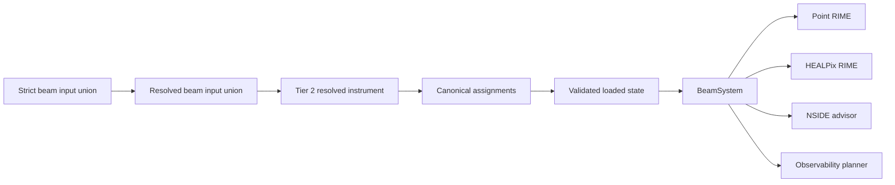
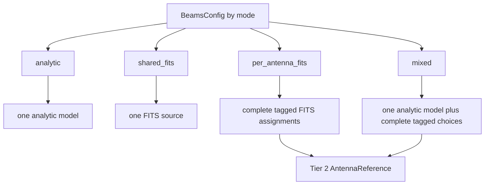
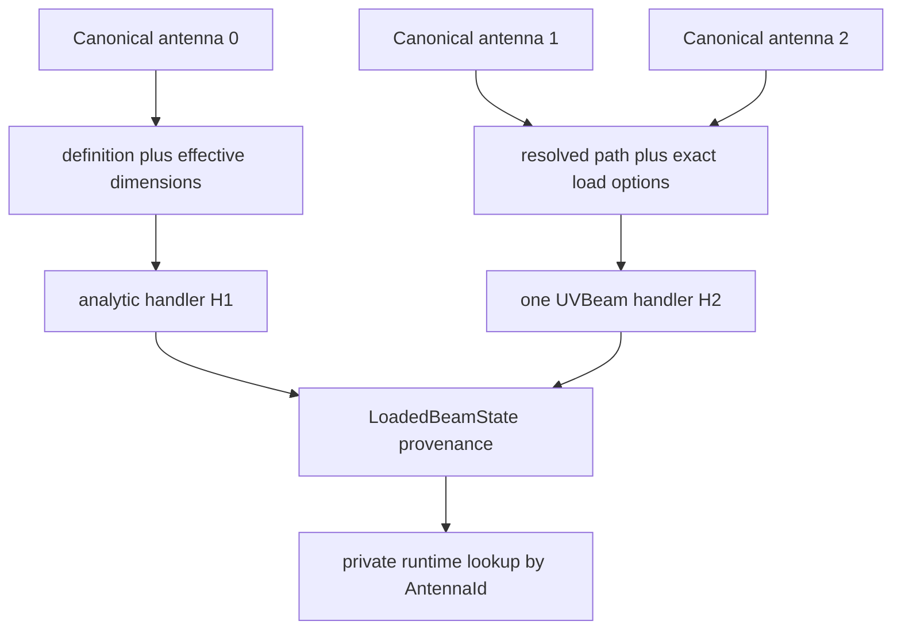
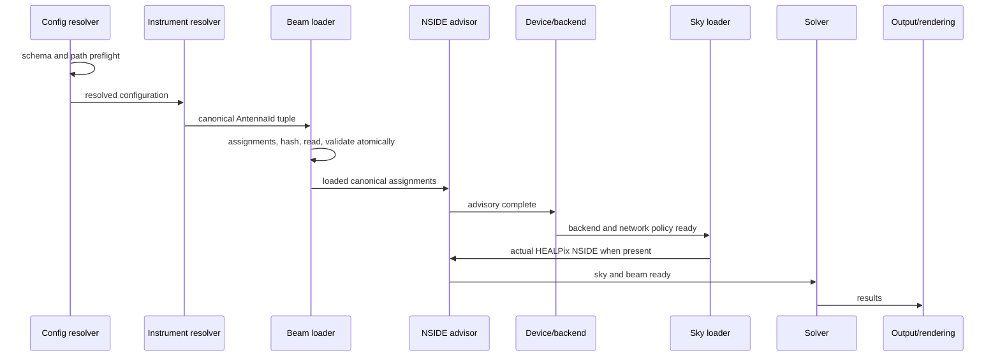
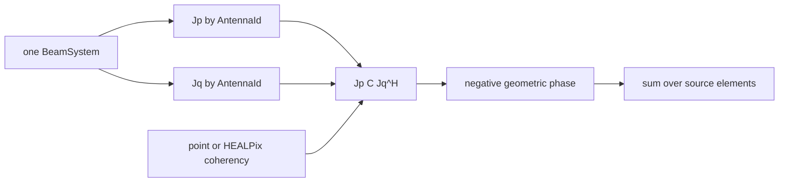
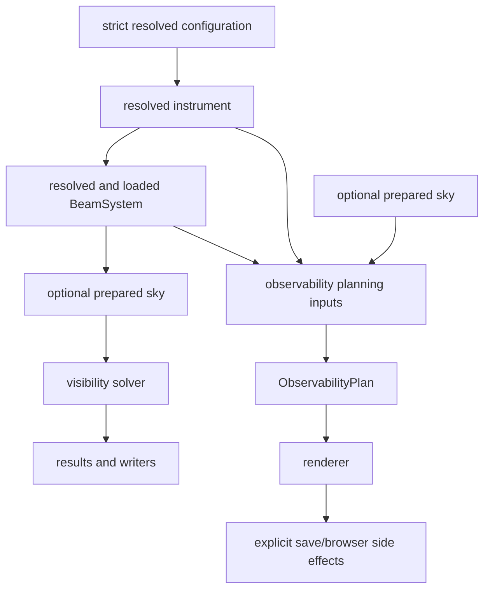
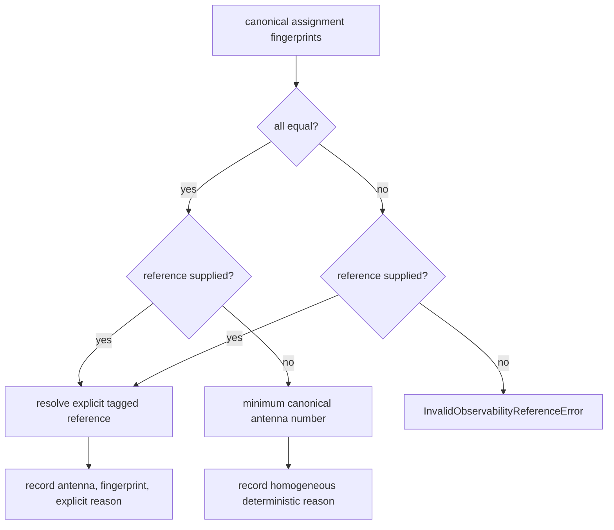

# Tier 3 beam and observability integration plan

## 1. Metadata and current Git baseline

| Item | Design-gate value |
|---|---|
| Date | 2026-07-21 |
| Repository | `/Users/kartikmandar/MacProjects/RadioSim` |
| Branch | `main` |
| Starting HEAD | `8045bb49956ac7f4c04063fb1f9fb9d5928d5d8c` |
| Starting subject | `docs(instrument): accept Tier 2 migration` |
| Starting `origin/main` | `112f52fb0f903e0361fb6ec38199c081f63a93ed` |
| Starting divergence | 2 ahead, 0 behind |
| Starting worktree/index | clean |
| Python | 3.11.13 and 3.12.13 |
| Pyright | 1.1.408 in both Pixi environments |
| pyuvdata | 3.2.1 in both Pixi environments |
| Governing predecessor | `Tier2InstrumentPlan.md`, independently accepted |
| Design artifact | `Tier3BeamObservabilityPlan.md` |

The start gate matched every required value. No fetch, pull, rebase, reset, push, or
publication occurred during design.

## 2. Design-gate status

This document completes the Tier 3 design gate only. The corrected design was
independently accepted on 2026-07-21, so Tier 3A test/fixture work is now the only
authorized implementation slice. Tier 3B and later work remain unauthorized until
3A is separately implemented and accepted. `BEAM-001`, `BEAM-002`, `BEAM-003`,
`OBS-001`, and `OBS-002` remain unresolved in implementation; design acceptance moved
only `OBS-002` from `DECISION` to `OPEN` and marked no issue done.

The selected design has zero unresolved product or scientific decisions. Unsupported
science fails closed and is assigned to a named later tier.

## 3. Scope and exclusions

Tier 3 owns:

- one strict analytic/shared-FITS/per-antenna-FITS/mixed input schema;
- canonical assignment to Tier 2 `AntennaId` values;
- immutable resolved and loaded beam provenance;
- a single Jones evaluator used by point, HEALPix, NSIDE, and observability paths;
- Simulator-local BeamFITS load deduplication and atomic retry behavior;
- point/HEALPix RIME parity for the accepted scalar-Jones subset;
- a beam-feature-aware HEALPix NSIDE advisory;
- observability as a sibling of visibility simulation;
- explicit reference-antenna semantics for scientifically heterogeneous arrays;
- narrow JSON-safe result beam provenance; and
- the related README, Sphinx, migration, YAML, and API truth surfaces.

Tier 3 excludes receptor configuration, circular-feed products, C/H basis transforms,
arbitrary polarization bases, genuine cross-polarized FITS response, Tier 4 result
redesign, UVFITS, unrelated HDF5 repair, worker scheduling, performance caching, GPU
claims, hybrid-sky execution changes, advanced propagation/calibration terms,
spherical-harmonic simulation, and blockage/support-leg/mutual-coupling physics. Those
remain in Tiers 4 through 8 exactly as recorded in `Fix.md`.
Beam coordinate/normalization expansion and union/intersection/multiple-footprint
products not owned by those existing tiers require a named **post-Tier-8 beam and
observability expansion gate**; Tier 3 does not create them implicitly.

## 4. Live-code characterization

The source-first inventory found these active facts:

1. `BeamsConfig` is strict and frozen, but it combines active analytic fields with
   deferred FITS fields and a redundant `per_antenna` boolean.
2. `config_resolution.py` resolves `beam_file` and every path value in
   `antenna_beam_map`; `ResolvedBeamsConfig` preserves every field.
3. `Simulator._setup_after_instrument_state()` turns only analytic fields back into
   mutable `_beam_config`. It never constructs `_beam_manager`.
4. Point visibility consumes `_beam_config` through `jones_config["beam"]`; FITS is
   selected only when a legacy manager happens to exist.
5. Polarized HEALPix uses Jones matrices, while scalar HEALPix collapses each antenna
   to power and uses `sqrt(P_p P_q)`. That loses the complex factor
   `e_p conjugate(e_q)` for different per-antenna beams.
6. `BeamManager` expects removed dictionary names, loads eagerly, uses a separate
   integer/string identity system, and has implicit default/fallback behavior.
7. `BeamFITSHandler` uses obsolete frequency field names, treats validation failures
   as warnings, assumes an obsolete interpolation return shape, ignores the returned
   basis, and builds `complex128` arrays unconditionally.
8. `FITSBeamJones` silently returns identity when its manager returns `None`.
9. `ObservabilityPlanner` accepts raw `config: Any`, hard-coded site defaults, raw
   beam dictionaries, a raw FITS path, a first-channel choice, and a second independent
   UVBeam implementation.
10. Drift-scan code calls the planner's private FITS loader. The external Vivaldi
    overlay test skips when `/Volumes/CrucialX8` is absent.
11. The current NSIDE advisor uses the lowest frequency and smallest diameter, which
    selects the widest beam rather than the smallest feature the visibility integrand
    must sample. Its broad exception handler silently disables advice.
12. Results already carry a JSON-safe instrument snapshot and resolved configuration;
    no beam-resolution snapshot exists.
13. Analytic composition silently ignores taper/illumination/reflector fields for
    rectangular and elliptical apertures, ignores taper for numerical illumination,
    and overwrites authored edge taper for analytical illumination. The Tier 3 model
    union removes those Cartesian combinations.

These are characterization facts, not retained contracts.

## 5. Complete current-field inventory

All current `BeamsConfig` fields receive one final disposition. No compatibility
property or alias remains.

| Current field | Current type/default | Tier 3 disposition | Exact replacement or error |
|---|---|---|---|
| `beam_mode` | `analytic|fits|mixed`, `analytic` | renamed/retyped | top-level `mode` with `analytic|shared_fits|per_antenna_fits|mixed`; old name reports `beams.beam_mode: removed; use beams.mode` |
| `per_antenna` | `bool`, `False` | deleted | express the choice with `mode`; error names `per_antenna_fits` |
| `beam_file` | `Path|None` | moved | `beams.beam.path` for `shared_fits`, or `assignments[].beam.path` |
| `antenna_beam_map` | mapping from string to path/`analytic` | replaced | ordered tagged `assignments`; error points to `assignments[].antenna` and `assignments[].beam` |
| `beam_za_max_deg` | finite float/`None` | deleted | accepted FITS files must cover ZA 0 through 90 degrees; no runtime cutoff |
| `beam_za_buffer_deg` | nonnegative float/`None` | deleted | no partial angular read in Tier 3; performance-window loading belongs to Tier 6 |
| `beam_freq_buffer_hz` | nonnegative float/`None` | deleted | full frequency axis is loaded; partial-load buffering belongs to Tier 6 |
| `beam_peak_normalize` | bool/`True` | replaced | FITS source has `normalization: peak`; non-peak file metadata is rejected, never mutated |
| `beam_interp_function` | nonblank string/`None` | replaced | `angular_interpolation: bilinear` and `frequency_interpolation: cubic|linear` |
| `aperture_shape` | shape literal/`circular` | moved/retyped | discriminated `model.kind`; illumination variants are explicitly circular |
| `taper` | taper literal/`gaussian` | moved/retyped | direct circular `model.taper` or analytical-illumination `taper_profile`; absent where ignored today |
| `edge_taper_dB` | nonnegative float/10 | moved/conditionally rejected | direct Gaussian/parabolic profiles use `edge_taper_db`; illumination-derived profiles accept no authored edge |
| `feed_model` | illumination literal/`none` | renamed/retyped | non-`none` becomes `model.illumination.kind`; `none` becomes a direct aperture model |
| `feed_computation` | `analytical|numerical` | structurally replaced | selects `model.kind=analytical_illumination|numerical_illumination` |
| `feed_params` | numeric mapping | replaced | typed `focal_ratio` plus the selected illumination parameter |
| `reflector_type` | `prime_focus|cassegrain` | moved/conditionally rejected | `model.reflector` only on illumination variants |
| `magnification` | positive float/1 | moved/conditionally rejected | only `model.reflector.magnification` on `cassegrain`, strictly greater than 1 |
| `aperture_params` | positive numeric mapping | replaced | typed north/east dimensions on rectangular and elliptical aperture variants |

Removed legacy manager keys `use_beam_file`, `use_different_beams`,
`beam_file_path`, `beam_files`, `beams_per_antenna`, `default_beam_id`,
`beam_freq_interp`, and `beam_freq_buffer_mhz` retain direct migration errors only in
the schema-error collector. They never enter a runtime dictionary.

## 6. Complete call-site and dictionary-boundary inventory

| Live boundary | Current input | Final input/disposition |
|---|---|---|
| `io.config.BeamsConfig` | flat model | discriminated models in `io.beam_config` |
| semantic/unsupported collectors | field-by-field FITS rejection | union-specific validation; unsupported guards stay until the slice that wires both solvers |
| `config_resolution.resolve_config` | `beam_file` plus string-key map | recursively resolved typed FITS sources |
| `core.runtime_config.ResolvedBeamsConfig` | flat strings/mappings | typed resolved union; old dataclass deleted |
| `Simulator._beam_config` | mutable analytic dictionary | deleted |
| `Simulator._beam_manager` | always-`None` legacy slot | deleted |
| point `jones_config["beam"]` | mutable dictionary | exact `BeamSystem` argument |
| `calculate_visibility(..., beam_manager=...)` | `Any|None` | `beam_system: BeamSystem` |
| `calculate_visibility_healpix(..., beam_manager, beam_config)` | manager plus dict | one `beam_system: BeamSystem` |
| `_compute_beam_power_pattern` | manager/dict/diameter | deleted; derive from shared Jones evaluation |
| `_compute_beam_jones_matrix` | manager/dict/diameter | deleted; shared Jones evaluation |
| `VisibilitySimulator` kwargs docs | manager and dict | exact beam-system parameter in abstract and RIME signatures |
| `ObservabilityPlanner(config: Any, ...)` | raw config, defaults, raw path | exact resolved objects; raw-config boundary deleted |
| planner FITS closures | direct UVBeam read/interpolation | deleted |
| drift-scan helper | raw FITS path and private planner method | exact `BeamSystem` and `AntennaId` |
| NSIDE advisor | approximate FWHM float | `BeamSamplingRequirement` from canonical assignments |
| result metadata | resolved config and instrument | add `beam_resolution` snapshot only |
| `radiosim.core` export | legacy `BeamManager` | canonical beam models and `BeamSystem` |

The exact live production reads are:

- `Simulator.__init__` and `_clear_later_runtime_state` create/reset `_beam_config`
  and `_beam_manager`; `_setup_after_instrument_state` copies only the nine analytic
  leaves into `_beam_config`; `run` passes both objects to HEALPix and passes
  `_beam_manager` plus `jones_config["beam"]` to point simulation. No live code ever
  assigns a `BeamManager` to `_beam_manager`.
- `calculate_visibility` constructs `FITSBeamJones` only when its optional
  `beam_manager` argument is non-null; `FITSBeamJones` calls
  `BeamManager.get_jones_matrix` and converts a returned `None` to identity.
  HEALPix separately reads the manager/config pair in both scalar and polarized
  loops and has independent analytic-power/Jones helpers.
- `BeamManager` reads raw `config["beams"]`, raw
  `antenna_data["antenna_numbers"]`, and raw `antenna_data["beam_ids"]`. It reads
  `beam_peak_normalize` and `beam_interp_function`, then the removed keys
  `use_beam_file`, `use_different_beams`, `beam_file_path`, `beam_files`,
  `beams_per_antenna`, and `default_beam_id`. It constructs one or more
  `BeamFITSHandler` objects and owns two mutable identifier dictionaries.
- `BeamFITSHandler` reads old raw `obs_frequency.freq_min_MHz` and
  `freq_max_MHz`, plus `beam_freq_interp`, `beam_freq_buffer_mhz`, and
  `beam_za_max_deg`; it reads its own `beam_fits_path` for file existence/load and
  passes the configured interpolation function to `UVBeam.interp`. The modern
  `beam_freq_buffer_hz` and `beam_za_buffer_deg` never reach it.
- `AnalyticBeamJones` owns raw `diameter_per_antenna`, `feed_params`, and
  `aperture_params` dictionaries. `compute_aperture_beam` and analytic plotting
  helpers accept the same string/dictionary Cartesian schema; public
  `APERTURE_SHAPES`, `TAPER_FUNCTIONS`, `FEED_MODELS`, and `REFLECTOR_TYPES` are
  mutable registries.
  Canonical Tier 3 runtime never calls those boundaries. The wrapper/composed/plotting
  surfaces and registries are deleted in 3H.2; pure numeric aperture, taper, feed-pattern,
  and reflector-geometry functions remain.
- The strict schema/unsupported collector reads `beam_mode` and every declared FITS
  control; resolution copies them into `ResolvedBeamsConfig`. Simulator reads the
  analytic leaves but not `beam_mode` during setup. `plot_observability` reads
  `beam_mode` only to reconstruct another raw dictionary.
- `Simulator.plot_observability` reads the first exact frequency, the sole uniform
  diameter, `beams.beam_file`, and all analytic fields, then passes raw
  `beam_config`, `beam_fits_path`, and `beam_diameter_m` to
  `ObservabilityPlanner`. The planner reads those values for analytic radius or an
  independently loaded UVBeam. `compute_drift_scan_lightcurve` also accepts and
  forwards `beam_fits_path` and `beam_diameter_m` to that planner.
- Simulator computes `beam_fwhm_rad` from the lowest frequency and minimum antenna
  diameter inside a broad catch. `SkyPreparationOptions`, the sky pipeline, and
  `utils.healpix` pass/read only that scalar. No assignment or FITS handler is
  consulted.
- Instrument adapters read native `beam_id`; instrument resolution normalizes it,
  stores its source, and includes it in immutable snapshots/fingerprints. Simulator
  never activates canonical `ResolvedAntenna.beam_id`. Only the disconnected legacy
  manager reads a separate raw `beam_ids` list.
- `ObservabilityPlanner` also reads raw `config: Any`, default latitude/longitude/
  height, and raw beam dictionaries. Its `_fits_beam_power_func*` branches perform a
  second UVBeam read, normalization choice, first/nearest-frequency selection, and
  regular-grid/HEALPix interpolation. The lightcurve helper depends on that private
  path. These are the duplicated FITS-reading boundaries deleted by Tier 3G.



## 7. Local dependency and API characterization

The design is pinned to the locally verified pyuvdata 3.2.1 contract in both Pixi
environments:

- `UVBeam.read_beamfits(path, freq_range=..., az_range=..., za_range=...)` mutates the
  object and returns `None`. Tier 3 passes no partial ranges.
- `UVBeam.write_beamfits(path, clobber=...)` writes the object and returns `None`;
  deterministic fixtures use `clobber=True` only inside fresh `tmp_path` targets.
- The public `UVBeam.new(**kwargs)` wrapper and `read_beamfits`/`write_beamfits`
  wrappers intentionally expose dependency keywords through `**kwargs`; contract tests
  pin the underlying 3.2.1 accepted names rather than copying wrapper signatures into
  RadioSim public APIs.
- `UVBeam.interp` supports `az_za_simple`, `az_za_map_coordinates`, and
  `healpix_simple`. Tier 3 exposes only `bilinear`, implemented as
  `az_za_simple` with `spline_opts={"kx": 1, "ky": 1, "s": 0}`.
- `UVBeam.interp(..., return_basis_vector=False)` still returns a two-item tuple
  `(data, None)`. E-field data shape is `(Naxes_vec, Nfeeds, Nfreq, Npoint)`.
  With `return_basis_vector=True`, the second item has shape
  `(Naxes_vec, Ncomponents_vec, Npoint)`.
- For E-field objects `feed_array` is populated and `polarization_array` is absent;
  power objects invert that contract and are rejected. A regular az/ZA object uses
  `axis1_array` for azimuth and `axis2_array` for ZA, while `pixel_array`, `nside`, and
  `ordering` are absent. HEALPix objects use those three pixel properties and are
  outside the accepted subset.
- The generated E-field `basis_vector_array` shape is
  `(Naxes_vec, Ncomponents_vec, Nza, Naz)`. `UVBeam.check` proves dependency-level
  structural consistency but does not prove RadioSim's scalar/basis/feed/normalization
  subset; Tier 3 therefore performs every Section 9 check after it.
- `return_basis_vector=None` emits a deprecation warning and returns a basis. Tier 3
  always passes `False` and unpacks the tuple.
- Frequency interpolation defaults to cubic. Exact intrinsic channels are selected as
  nearest values inside pyuvdata's tolerance. Tier 3 supplies a fixed `1e-6 Hz`
  tolerance, so only floating-point-equivalent channels snap; all other in-domain
  values use the configured linear or cubic interpolation. The comparison is strict:
  a nearest distance below `1e-6 Hz` snaps, while exactly `1e-6 Hz` interpolates. At
  the supported radio frequencies this absolute tolerance is roughly `1e-14`
  relative; it absorbs only binary/FITS representation noise around the exact-Hz
  configuration contract and is not a user-visible frequency bin.
- Cubic interpolation needs at least four intrinsic channels for a non-exact target;
  linear needs at least two. The loader validates this against every observation
  channel before setup succeeds. It passes `freq_interp_kind` explicitly and never
  falls back from cubic to linear.
- Out-of-frequency-domain interpolation raises `ValueError`.
- pyuvdata's az/ZA domain check permits a margin of twice the larger native grid step;
  `az_za_simple` can therefore extrapolate. Tier 3 performs exact RadioSim-owned
  domain validation first and leaves pyuvdata checking enabled as a second check.
- UVBeam azimuth is zero at East and increases through North. RadioSim/Astropy
  azimuth is zero at North and increases through East. The conversion is
  `az_uv = (pi/2 - az_radiosim) mod 2pi`.
- `peak_normalize()` mutates `data_array`, changes `data_normalization` to `peak`, and
  moves the former per-frequency peak into `bandpass_array`. Tier 3 never calls it;
  normalization must already be scientifically explicit in the file.
- BeamFITS round trips preserve native `complex64` and `complex128`. Interpolation
  returns host NumPy `complex128` for both, so the native dtype is provenance while
  backend casting is a RadioSim responsibility. Tier 3 records the native dtype,
  accepts finite complex data at either width, and canonicalizes the private owned
  data to `complex128` after native validation; it does not claim that upcasting
  restores source information.
- A controlled generated BeamFITS round-trip preserved shape
  `(2, 2, 4, 5, 8)`, X/Y feeds, identity basis, frequencies, and regular az/ZA axes.
  Partial reads using Hz frequency ranges and degree azimuth/ZA ranges changed the
  number of channels/grid rows exactly as requested, which confirms why Tier 3 avoids
  partial reads.
- `UVBeam.new` in 3.2.1 contains an initializer defect when an explicit `az_za`
  coordinate literal is supplied before internal assignment. The deterministic test
  fixture omits that redundant argument, then asserts the created coordinate system.

No network or mounted Vivaldi file was used for these findings.

## 8. Scientific conventions and equations

The canonical evaluator signature is:

```python
BeamSystem.evaluate_jones(
    antenna_id: AntennaId,
    *,
    altitude_rad: np.ndarray,
    azimuth_rad: np.ndarray,
    frequency_hz: float,
    time_mjd: float,
    backend: ArrayBackend | None = None,
) -> np.ndarray | ArrayLike
```

`altitude_rad` and `azimuth_rad` must be one-dimensional, finite, equal-shape arrays.
RadioSim azimuth is North through East. Altitude is `0` at the horizon and `pi/2` at
zenith. `time_mjd` is finite; accepted Tier 3 beams are time-independent but the value
is part of the contract and provenance seam. The return shape is `(N, 2, 2)`, rows are
receptors `(X, Y)`, columns are RadioSim's transverse linear sky basis, and dtype is
the resolved beam Jones dtype. `backend=None` returns owned read-only host NumPy and is
the only pre-setup observability path; solvers pass their one resolved backend. A scalar
direction is represented by length-one arrays, not scalar coordinate inputs.

Pyuvdata stores E-field samples as `E[a, f]`, where `a` indexes the beam's vector
axis, `f` indexes feeds, and `basis_vector_array[a, c]` maps that vector axis into the
sky coordinate component `c`. RadioSim therefore forms
`J[f, c] = sum_a E[a, f] * basis[a, c]`, equivalently
`J = data.transpose(1, 0) @ basis`, with no conjugation. The accepted identity basis
reduces this to the planned transpose. Fixed mount, exact X/Y feed order and angles,
and east X orientation pin the receptor metadata; the scalar requirement then gives
exactly `e I_2`, which commutes with any sky-basis rotation. This removes rather than
silently assumes Tier 5 basis/feed physics. A direction-dependent complex scalar phase
is meaningful: it cancels for identical antenna responses but produces the required
`e_p conjugate(e_q)` differential phase for heterogeneous antennas. The same Jones
equation applies unchanged to I/Q/U/V coherencies and to point and HEALPix solvers.

Both point and HEALPix paths use

\[
V_{pq}(t,\nu)=\sum_s K_{pq,s}\,J_p(s,t,\nu)\,
C_s(t,\nu)\,J_q(s,t,\nu)^{H}.
\]

RadioSim retains its half-power coherency convention

\[
C=\frac{1}{2}
\begin{bmatrix}I+Q&U-iV\\U+iV&I-Q\end{bmatrix},
\qquad I_{\mathrm{out}}=V_{XX}+V_{YY}.
\]

For unpolarized sky, `C=(I/2) I_2`, so the optimized integrand is
`(I/2) J_p J_q^H`. For accepted scalar beams, Stokes-I attenuation is the complex
factor `e_p conjugate(e_q)`. No power/geometric-mean approximation is permitted.

Observability displays unpolarized single-antenna power

\[
P_p=\tfrac12\operatorname{Tr}(J_pJ_p^H),
\]

which equals `abs(e_p)**2` for the accepted subset. Display normalization divides by
the finite positive maximum over the sampled visible hemisphere at the selected
frequency; it never changes solver evaluation.

## 9. Accepted FITS scientific subset

A BeamFITS source is accepted only when every condition below passes:

1. `UVBeam.check(check_extra=True, run_check_acceptability=True)` succeeds.
2. `beam_type == "efield"` and `antenna_type == "simple"`.
3. `pixel_coordinate_system == "az_za"`.
4. `feed_array` is exactly `("x", "y")`, `x_orientation` resolves to `east`, and
   feed angles match `(pi/2, 0)` within absolute tolerance `1e-12` radians.
5. `mount_type == "fixed"`.
6. `Naxes_vec == 2`, `Ncomponents_vec == 2`, and the stored basis is finite and the
   identity at every native point within `rtol=0`, `atol=1e-12`.
7. `data_normalization == "peak"`; `bandpass_array` is finite and equals one within
   the dtype-derived normalization tolerance below. Pyuvdata peak normalization can
   legitimately move direction-independent spectral amplitude into this array; Tier
   3 intentionally rejects that amplitude because E owns only the normalized
   direction-dependent primary beam and Tier 7 owns the B-Jones bandpass term.
8. Native data is finite `complex64` or `complex128` with shape
   `(2, 2, Nfreq, Nza, Naz)`. The source dtype is recorded before private owned data
   is canonicalized to `complex128` for validation and interpolation.
9. After forming `J[feed, sky_component] = data[sky_component, feed]`, off-diagonal
   entries are zero and the diagonals agree at every native point. For native real
   component epsilon `eps`, the recorded tolerances are
   `atol=max(1e-12, 32*eps)` and `rtol=max(1e-10, 32*eps)`; the bound is
   `atol + rtol * max(abs(J))`.
10. At every intrinsic frequency, the finite positive maximum of `abs(e)` across the
    visible native grid equals one within `rtol=0` and
    `normalization_atol=max(1e-12, 32*eps)`. The same tolerance applies to the unit
    bandpass check. A peak label without peak-valued data is rejected.
11. Frequency values are finite, positive, unique, and strictly increasing; every
    observation channel is inside the closed native interval.
12. Azimuth and ZA axes are finite, strictly increasing, and regularly spaced.
    Azimuth starts at zero and `last + step` closes `2pi` within `1e-10` radians.
    ZA starts at zero and covers at least `pi/2` within `1e-10` radians.
13. The file is local, regular, readable, and unchanged between hashing and load. A
    post-load stat mismatch fails setup.

The evaluator converts RadioSim azimuth to UVBeam azimuth, calls `interp` with
`return_basis_vector=False`, explicitly unpacks `(data, None)`, forms the Jones matrix,
revalidates scalar structure and finiteness after interpolation, and casts once to the
backend beam dtype. Frequencies never extrapolate. Visible-sky angles never
extrapolate. Below-horizon inputs return exact zero Jones matrices without invoking
pyuvdata; horizon inputs are evaluated. Altitudes outside `[-pi/2, pi/2]`, non-finite
coordinates, or a visible point outside validated file coverage raise typed errors.

## 10. Rejected and deferred FITS variants

| Variant | Tier 3 result | Owning later tier/reason |
|---|---|---|
| power BeamFITS | reject | phase is absent; any display-only support belongs to the post-Tier-8 expansion gate |
| circular R/L feeds | reject | Tier 5 receptor/output-basis contract |
| X/Y order or orientation other than the accepted contract | reject | Tier 5 basis transform |
| arbitrary/nonidentity `basis_vector_array` | reject | Tier 5 C/H basis transform |
| unequal X/Y diagonal response | reject | Tier 5 basis/receptor semantics |
| nonzero cross-polar response | reject | genuine full-2x2 basis physics belongs to Tier 5 |
| HEALPix BeamFITS | reject | post-Tier-8 expansion gate; Tier 3 has one regular az/ZA interpolator |
| orthoslant coordinates | reject | post-Tier-8 expansion gate; no selected coordinate transform |
| phased-array UVBeam/coupling | reject | post-Tier-8 advanced-beam expansion gate |
| non-fixed mounts | reject | post-Tier-8 mount/pointing expansion gate |
| physical or solid-angle normalization | reject | post-Tier-8 normalization gate; bandpass ownership is ambiguous |
| non-unit bandpass on a peak beam | reject | Tier 7 B-Jones owns direction-independent spectral response; Tier 3 E-Jones does not consume it |
| partial ZA/frequency loads | reject | Tier 6 performance work; complete axes support deterministic science checks |
| files not reaching the horizon | reject | no implicit zero/extrapolated visible-sky region |
| NaN/Inf metadata, native values, or interpolated values | reject | fail-closed scientific validity |
| resolved beam dtype `complex256` (the `float128` precision leaf) | reject | information/provenance ceiling: accepted files contain at most `complex128`, and pyuvdata interpolation supplies `complex128`; upcasting cannot add source information |

## 11. Selected strict input schema

All input classes derive from `StrictFrozenModel`; unknown fields are forbidden and
caller-owned containers are copied. Every union is discriminated.

### 11.1 Analytic leaves

- Direct circular taper union: `UniformTaperConfig(kind="uniform")`,
  `GaussianTaperConfig(kind="gaussian", edge_taper_db: strict nonnegative finite
  float=10.0)`, `ParabolicTaperConfig(kind="parabolic", edge_taper_db: strict
  nonnegative finite float=10.0)`, `ParabolicSquaredTaperConfig(
  kind="parabolic_squared", edge_taper_db: strict nonnegative finite float=10.0)`,
  and `CosineTaperConfig(kind="cosine")`.
- Feed-derived taper-profile union has no edge field:
  `DerivedGaussianTaperConfig(kind="gaussian")`,
  `DerivedParabolicTaperConfig(kind="parabolic")`, or
  `DerivedParabolicSquaredTaperConfig(kind="parabolic_squared")`. Its edge taper is
  calculated from the selected illumination and reflector, so no authored value is
  accepted and ignored.
- Illumination union: `CorrugatedHornIlluminationConfig(kind="corrugated_horn",
  focal_ratio: strict positive finite float=0.4, q: strict positive finite
  float=1.15)`, `OpenWaveguideIlluminationConfig(kind="open_waveguide",
  focal_ratio=0.4, b_over_lambda: strict positive finite float=0.7)`, or
  `DipoleGroundPlaneIlluminationConfig(kind="dipole_ground_plane",
  focal_ratio=0.4, height_wavelengths: strict positive finite float=0.25)`.
- Reflector union: `PrimeFocusReflectorConfig(kind="prime_focus")` or
  `CassegrainReflectorConfig(kind="cassegrain", magnification: strict finite float
  greater than 1)`.
- `CircularApertureBeamModelConfig(kind="circular_aperture",
  taper: DirectTaperConfig=GaussianTaperConfig())`; diameter comes from each target
  canonical antenna.
- `RectangularApertureBeamModelConfig(kind="rectangular_aperture",
  north_length_m: strict positive finite float, east_length_m: strict positive finite
  float)` and `EllipticalApertureBeamModelConfig(kind="elliptical_aperture",
  north_diameter_m: strict positive finite float, east_diameter_m: strict positive
  finite float)`. They expose no ignored taper, illumination, or reflector fields.
- `AnalyticalIlluminationBeamModelConfig(kind="analytical_illumination",
  illumination: IlluminationConfig, taper_profile:
  FeedDerivedTaperConfig=DerivedGaussianTaperConfig(), reflector:
  ReflectorConfig=PrimeFocusReflectorConfig())`. It derives the selected profile's
  edge taper from illumination at the reflector edge.
- `NumericalIlluminationBeamModelConfig(kind="numerical_illumination",
  illumination: IlluminationConfig, reflector:
  ReflectorConfig=PrimeFocusReflectorConfig())`. It uses the existing circular radial
  Hankel calculation with fixed `n_radial=256`, recorded in its fingerprint, and has
  no taper field.
- `AnalyticBeamModelConfig` is the discriminated union of those five model classes;
  its default is `CircularApertureBeamModelConfig()`.

North/east dimension names make the existing analytic orientation explicit:
RadioSim azimuth zero selects the north dimension and `pi/2` selects east.
Analytical/numerical illumination models are circular and obtain diameter from the
target antenna. Rectangular/elliptical illumination remains rejected until a model
with active two-axis illumination physics exists.

### 11.2 FITS leaf

`FITSBeamSourceConfig` has these exact fields:

```text
kind: Literal["fits"] = "fits"
path: Path
normalization: Literal["peak"] = "peak"
angular_interpolation: Literal["bilinear"] = "bilinear"
frequency_interpolation: Literal["cubic", "linear"] = "cubic"
```

There are no ZA or frequency buffer fields. Units are therefore not implicit:
frequency axes are Hz, internal angles are radians, file-range documentation is
degrees only at the pyuvdata read boundary, and full file axes are loaded.

### 11.3 Mode union

- `AnalyticBeamsConfig(mode: Literal["analytic"]="analytic",
  model: AnalyticBeamModelConfig=default)`.
- `SharedFITSBeamsConfig(mode: Literal["shared_fits"], beam:
  FITSBeamSourceConfig)`.
- `PerAntennaFITSBeamsConfig(mode: Literal["per_antenna_fits"], assignments:
  tuple[FITSBeamAssignmentConfig, ...])` with at least one assignment.
- `MixedBeamsConfig(mode: Literal["mixed"], analytic_model:
  AnalyticBeamModelConfig=default, assignments:
  tuple[MixedBeamAssignmentConfig, ...])` with at least one assignment.
- `FITSBeamAssignmentConfig(antenna: AntennaReference, beam:
  FITSBeamSourceConfig)`.
- `AnalyticBeamChoiceConfig(kind: Literal["analytic"]="analytic")`.
- `MixedBeamAssignmentConfig(antenna: AntennaReference, beam:
  AnalyticBeamChoiceConfig | FITSBeamSourceConfig)` discriminated by `beam.kind`.

`AntennaReference` is reused unchanged from Tier 2 as the discriminated union of
`{kind: number, number: strict nonnegative int}` and `{kind: name, name: normalized
case-sensitive string}`. Assignment lists have no default entry. All-analytic members
of a mixed array use the one `analytic_model`; circular diameter still comes from the
target antenna.



### 11.4 Direct migration and ignored-combination rejection

Old fields are never translated at runtime. The schema collector uses these exact
migration rules before rejecting them:

- default `feed_model=none`, circular aperture, and the direct taper migrate to
  `model.kind=circular_aperture` plus `model.taper`;
- old `beam_mode=analytic` maps to `mode=analytic`; `beam_mode=fits` maps to
  `shared_fits` only when `per_antenna=false` and to `per_antenna_fits` when true;
  `beam_mode=mixed` maps to `mode=mixed`. `beam_file` becomes the shared leaf and
  `antenna_beam_map` becomes a complete ordered tagged assignment list;
- rectangular `aperture_params.length_x/length_y` migrate to required
  `north_length_m/east_length_m`; elliptical `diameter_x/diameter_y` migrate to
  required north/east diameters; missing dimensions now error instead of falling back
  to an unrelated circular diameter;
- a non-`none` feed with `feed_computation=analytical` migrates to
  `analytical_illumination`; only circular aperture and the three feed-derived taper
  profiles are accepted, and authored `edge_taper_dB` is rejected because the feed
  derives it;
- a non-`none` feed with `feed_computation=numerical` migrates to
  `numerical_illumination`; authored taper/edge values and non-circular aperture fields
  are rejected because the Hankel path does not consume them; and
- reflector fields migrate only with an illumination model. Authored reflector fields
  on a direct aperture model are rejected.
- `beam_peak_normalize=true` maps to `normalization=peak` as a file requirement;
  `false` is rejected. Null or `az_za_simple` interpolation maps to `bilinear`; every
  other old interpolator is rejected. ZA/frequency max/buffer controls are removed and
  rejected when authored because Tier 3 always validates full axes and the full
  visible hemisphere.

Each error begins `beams.<old_name>: removed in Tier 3;` and names the complete new
tagged path. An old combination that currently ignores a value adds
`the old implementation ignored this value; select an active Tier 3 model`.

## 12. YAML examples for every accepted mode

Analytic:

```yaml
beams:
  mode: analytic
  model:
    kind: circular_aperture
    taper:
      kind: gaussian
      edge_taper_db: 10.0
```

Shared FITS:

```yaml
beams:
  mode: shared_fits
  beam:
    kind: fits
    path: beams/shared.beamfits
    normalization: peak
    angular_interpolation: bilinear
    frequency_interpolation: cubic
```

Per-antenna FITS:

```yaml
beams:
  mode: per_antenna_fits
  assignments:
    - antenna: {kind: number, number: 0}
      beam: {kind: fits, path: beams/a.beamfits}
    - antenna: {kind: name, name: ant-1}
      beam:
        kind: fits
        path: beams/b.beamfits
        frequency_interpolation: linear
```

Mixed:

```yaml
beams:
  mode: mixed
  analytic_model:
    kind: circular_aperture
    taper: {kind: uniform}
  assignments:
    - antenna: {kind: number, number: 0}
      beam: {kind: analytic}
    - antenna: {kind: name, name: ant-1}
      beam: {kind: fits, path: beams/b.beamfits}
```

`dump_config()` serializes these exact discriminators and ordinary YAML lists/maps.
It does not flatten the union or emit resolved absolute paths.

## 13. Exact path-resolution behavior

- YAML-relative FITS paths resolve against the YAML parent.
- Mapping and `RadioSimConfig` inputs require explicit `base_dir` when any FITS path
  is relative.
- `Simulator.from_parameters(..., beams=..., base_dir=...)` uses that explicit base;
  a relative path without it is a source error.
- Absolute paths need no base.
- No beam-specific call-site override is introduced. `SimulationOverrides` therefore
  cannot partially replace nested beam state.
- The Tier 1 path policy expands `~`, rejects environment-variable syntax, normalizes
  symlinks, and already requires an existing regular file. Tier 3B adds the explicit
  readability preflight and `input_path_unreadable` code at that common resolver
  boundary; it records authored path, normalized absolute path, base, source kind,
  and symlink resolution.
- Every nested shared or assignment path receives its indexed logical path, such as
  `beams.assignments[2].beam.path`.
- Resolution performs no UVBeam import or read. Schema/path errors still precede
  instrument, device, backend, network, output, plotting, and browser work.
- Result provenance follows the existing disclosure policy and contains the resolved
  absolute path. The deterministic scientific fingerprint excludes that path and uses
  file content hash instead.

## 14. Immutable resolved beam models

All models below are exact non-subclassed `@dataclass(frozen=True, slots=True)` types.
Constructors copy tuples, reject mutable subclasses at public boundaries, validate
finite values, and are hashable. Snapshot methods return new JSON-safe values.

### 14.1 Resolved definitions

`ResolvedAnalyticBeamDefinition` fields, in order:

```text
kind: Literal["analytic"]
model: ResolvedAnalyticBeamModel
definition_fingerprint: str
```

Each resolved leaf mirrors the exact tagged input fields using immutable primitives.
No free-form mapping remains.

The exact public leaf dataclasses, with fields in constructor order, are:

```text
ResolvedUniformTaper(kind: Literal["uniform"])
ResolvedGaussianTaper(kind: Literal["gaussian"], edge_taper_db: float)
ResolvedParabolicTaper(kind: Literal["parabolic"], edge_taper_db: float)
ResolvedParabolicSquaredTaper(kind: Literal["parabolic_squared"],
                              edge_taper_db: float)
ResolvedCosineTaper(kind: Literal["cosine"])
ResolvedDerivedGaussianTaper(kind: Literal["gaussian"])
ResolvedDerivedParabolicTaper(kind: Literal["parabolic"])
ResolvedDerivedParabolicSquaredTaper(kind: Literal["parabolic_squared"])

ResolvedCorrugatedHornIllumination(kind: Literal["corrugated_horn"],
    focal_ratio: float, q: float)
ResolvedOpenWaveguideIllumination(kind: Literal["open_waveguide"],
    focal_ratio: float, b_over_lambda: float)
ResolvedDipoleGroundPlaneIllumination(kind: Literal["dipole_ground_plane"],
    focal_ratio: float, height_wavelengths: float)

ResolvedPrimeFocusReflector(kind: Literal["prime_focus"])
ResolvedCassegrainReflector(kind: Literal["cassegrain"], magnification: float)

ResolvedCircularApertureBeamModel(kind: Literal["circular_aperture"],
    taper: ResolvedDirectTaper)
ResolvedRectangularApertureBeamModel(kind: Literal["rectangular_aperture"],
    north_length_m: float, east_length_m: float)
ResolvedEllipticalApertureBeamModel(kind: Literal["elliptical_aperture"],
    north_diameter_m: float, east_diameter_m: float)
ResolvedAnalyticalIlluminationBeamModel(kind: Literal["analytical_illumination"],
    illumination: ResolvedIllumination, taper_profile: ResolvedDerivedTaper,
    reflector: ResolvedReflector)
ResolvedNumericalIlluminationBeamModel(kind: Literal["numerical_illumination"],
    illumination: ResolvedIllumination, reflector: ResolvedReflector,
    n_radial: Literal[256])
```

`ResolvedDirectTaper`, `ResolvedDerivedTaper`, `ResolvedIllumination`,
`ResolvedReflector`, and `ResolvedAnalyticBeamModel` are exact public union aliases
over their corresponding listed classes; they are not base classes.

`ResolvedFITSBeamDefinition` fields:

```text
kind: Literal["fits"]
path: Path                         # absolute resolved transport path
normalization: Literal["peak"]
angular_interpolation: Literal["bilinear"]
frequency_interpolation: Literal["cubic", "linear"]
path_provenance_key: str
definition_fingerprint: str       # normalized real path plus pre-load options
```

The pre-load definition fingerprint includes the normalized real path and every load
option because it identifies transport work before file content exists. The loaded
scientific handler fingerprint replaces transport identity with the content hash and
validated scientific metadata, so it excludes path text as specified in Section 28.

The exact source-resolved input dataclasses are:

```text
ResolvedAnalyticBeamChoice(kind: Literal["analytic"])
ResolvedFITSBeamAssignmentInput(
    antenna: AntennaReference,
    beam: ResolvedFITSBeamDefinition,
)
ResolvedMixedBeamAssignmentInput(
    antenna: AntennaReference,
    beam: ResolvedAnalyticBeamChoice | ResolvedFITSBeamDefinition,
)
ResolvedAnalyticBeamsInput(
    mode: Literal["analytic"],
    model: ResolvedAnalyticBeamDefinition,
)
ResolvedSharedFITSBeamsInput(
    mode: Literal["shared_fits"],
    beam: ResolvedFITSBeamDefinition,
)
ResolvedPerAntennaFITSBeamsInput(
    mode: Literal["per_antenna_fits"],
    assignments: tuple[ResolvedFITSBeamAssignmentInput, ...],
)
ResolvedMixedBeamsInput(
    mode: Literal["mixed"],
    analytic_model: ResolvedAnalyticBeamDefinition,
    assignments: tuple[ResolvedMixedBeamAssignmentInput, ...],
)
```

`ResolvedBeamsInput` is the public discriminated union alias over those four mode
dataclasses. Assignment tuple order is authored order until canonical assignment
resolution. The common configuration provenance retains source-kind and authored
paths; each FITS definition links to its exact path record through
`path_provenance_key`.

### 14.2 Assignment state

`BeamAssignmentProvenance` fields:

```text
source: Literal["analytic_mode", "shared_mode", "explicit_assignment"]
input_index: int | None
authored_reference_kind: Literal["number", "name"] | None
authored_reference_value: int | str | None
canonical_antenna: AntennaId
```

`ResolvedBeamAssignment` fields:

```text
antenna_id: AntennaId
antenna_diameter_m: float
definition: ResolvedAnalyticBeamDefinition | ResolvedFITSBeamDefinition
provenance: BeamAssignmentProvenance
assignment_fingerprint: str
```

`ResolvedBeamState` fields:

```text
mode: Literal["analytic", "shared_fits", "per_antenna_fits", "mixed"]
instrument_fingerprint: str
assignments: tuple[ResolvedBeamAssignment, ...]
unique_definitions: tuple[ResolvedAnalyticBeamDefinition | ResolvedFITSBeamDefinition, ...]
state_fingerprint: str
```

Assignments are ordered exactly like `ResolvedInstrument.antennas`; unique definitions
are ordered by first canonical assignment. `to_snapshot()` includes every field except
Python class details.

### 14.3 Loaded public state

`BeamFileProvenance` fields:

```text
resolved_path: Path
size_bytes: int
sha256: str
pyuvdata_version: str
beam_type: str
antenna_type: str
pixel_coordinate_system: str
mount_type: str
data_normalization: str
feed_array: tuple[str, ...]
x_orientation: str
data_shape: tuple[int, ...]
native_dtype: str
frequency_min_hz: float
frequency_max_hz: float
frequency_count: int
azimuth_step_rad: float
zenith_angle_step_rad: float
zenith_angle_max_rad: float
basis_tolerance: float
scalar_absolute_tolerance: float
scalar_relative_tolerance: float
normalization_absolute_tolerance: float
```

`LoadedBeamHandlerState` fields:

```text
handler_id: str
kind: Literal["analytic", "fits"]
definition_fingerprint: str
scientific_fingerprint: str
file: BeamFileProvenance | None
voltage_feature_scale_by_frequency: tuple[tuple[float, float], ...]
```

`LoadedBeamState` fields:

```text
resolved: ResolvedBeamState
handlers: tuple[LoadedBeamHandlerState, ...]
assignment_handler_ids: tuple[tuple[AntennaId, str], ...]
loaded_fingerprint: str
```

Public loaded state contains no UVBeam, ndarray, interpolator, lock, logger, cache, or
backend object. `to_snapshot()` is safe for JSON/HDF5 metadata.

Handlers are ordered by first canonical assignment. Their deterministic ID is
`beam-{ordinal:04d}-{scientific_fingerprint[:12]}`; the ordinal prevents prefix
collisions and the fingerprint prefix makes diagnostics traceable.
`voltage_feature_scale_by_frequency` stores ordered `(frequency_hz,
feature_scale_rad)` pairs for every exact observation channel.
`assignment_handler_ids` follows canonical instrument order and has exactly one pair
per antenna.

### 14.4 Ownership, protocol, and validation rules

None of the Section 14 models implements `Mapping` or `Sequence`; tuple fields expose
ordinary immutable tuples and no mutable view. Constructors require exact listed
dataclass/tuple/`AntennaId` types, copy caller iterables before tuple construction,
reject subclasses at the public boundary, and keep `Path` only as normalized
transport provenance. `to_snapshot()` returns a detached ordinary dictionary/list
tree and never returns internal tuples by reference.

Pydantic owns input shape and finite scalar validation; the common resolver owns path
validation; the assignment resolver owns canonical identity, duplicate, coverage,
ordering, and pre-load fingerprints; the BeamFITS loader owns file metadata and
scientific validation; and `BeamSystem` owns loaded fingerprints plus evaluator
invariants. Dataclass `__post_init__` repeats exact-type, tuple-ownership, finite, and
fingerprint-format invariants so direct construction cannot bypass them. Fingerprint
contents and exclusions are fixed by Section 28.

## 15. Beam assignment and precedence rules

The exact public resolver is:

```python
resolve_beam_assignments(
    config: ResolvedBeamsInput,
    instrument: ResolvedInstrument,
) -> ResolvedBeamState
```

1. Instrument resolution finishes first.
2. Analytic mode assigns its definition to every canonical antenna.
3. Shared FITS mode assigns its one source to every canonical antenna.
4. Per-antenna and mixed modes resolve every tagged target through Tier 2 lookup.
5. Unknown names/numbers are collected in input order and fail as one typed error.
6. Two input entries that resolve to the same `AntennaId`, including one name and one
   number entry, fail as duplicate assignment. Last-write-wins is forbidden.
7. Every canonical antenna must have exactly one assignment. There is no default.
8. Assignment output is reordered to canonical instrument order only after all
   duplicate, unknown, and coverage checks pass.
9. Explicit assignment is the only per-antenna precedence source. Native BeamID,
   dictionary key coercion, manager default IDs, and first-antenna behavior have no
   precedence.
10. A failed resolution publishes no beam state.

For analytic assignments, effective aperture dimensions are exact: circular-aperture
and both illumination models use the target canonical antenna's positive `diameter_m`;
rectangular uses configured `north_length_m` and `east_length_m`; elliptical uses
configured `north_diameter_m` and `east_diameter_m`. Instrument diameter remains
assignment provenance for every shape but affects evaluation/fingerprints only for
circular and illumination models. FITS evaluation never consumes instrument diameter.

## 16. Native BeamID decision

Native layout `BeamID` remains inert in Tier 3. It stays in Tier 2 source provenance
when a source supplies it, but it does not select a file, analytic model, or assignment.
Activating it would require a new typed beam-library mapping and a second precedence
system. Tier 3 instead has one explicit assignment source. No warning is emitted for
inert provenance; documentation states that it is descriptive only.

## 17. Handler and evaluator architecture

`BeamSystem` is the final public, non-subclassable evaluation service. Its constructor
is private. Its public factory is:

```python
load_beam_system(
    resolved_state: ResolvedBeamState,
    *,
    observation_frequencies_hz: tuple[float, ...],
    precision: PrecisionConfig,
) -> BeamSystem
```

It is public because advanced solver/observability callers need one validated,
antenna-aware Jones service rather than a second manager protocol. Public status does
not expose construction freedom: only `load_beam_system` can create it, its class
rejects subclassing, it accepts no injected assignment map or handler, and its mutable
UVBeam/lock/runtime ownership stays private. The service has Simulator lifetime,
read-only immutable state properties, serialized per-handler evaluation, concurrent
independent-handler evaluation, and no close/reload/mutate operation.

The private `_load_beam_system(..., loader: _UVBeamLoaderProtocol)` supplies the test
seam; a private parameter never leaks into the public signature. Public properties
expose `state: LoadedBeamState` and no mutable internals. Its exact public operation is
`evaluate_jones` from Section 8.

`Simulator` owns exactly `_beam_system: BeamSystem | None`. Its public
`beam_system: BeamSystem` and `beam_state: LoadedBeamState` properties return the
already loaded objects and raise `RuntimeError("Beam resolution has not completed")`
before `_ensure_beam_system()` succeeds; reading a property never initiates I/O.

Private runtime types:

- `_BeamEvaluator` protocol: `evaluate_numpy(altitude_rad, azimuth_rad,
  frequency_hz, time_mjd) -> np.ndarray` and
  `voltage_feature_scale_rad(frequency_hz) -> float`.
- `_AnalyticScalarEvaluator`: owns one immutable analytic definition and canonical
  diameter, calls retained analytic aperture math, validates `e I_2`, and returns an
  owned NumPy array before backend conversion.
- `_UVBeamScalarEvaluator`: owns one private UVBeam, immutable load options, and one
  `threading.RLock`; it copies every loaded ndarray parameter into owned non-memmap
  storage before the temporary snapshot is removed, then performs exact domain checks
  and tuple unpacking.
- `_BeamRuntime`: owns `dict[str, _BeamEvaluator]` by handler ID and
  `dict[AntennaId, str]` by assignment. It is reachable only inside `BeamSystem`.

The dependency-injection seam is `_UVBeamLoaderProtocol.read(path) -> UVBeamLike`.
Production uses pyuvdata; tests inject counting, corrupt, and failure loaders. Logging
records handler ID, path, metadata summary, and dedup count only after validation.
Errors retain their typed class and chain the dependency exception; no broad catch,
warning-only validation, identity response, or analytic fallback exists.
Pyuvdata is imported lazily only when at least one FITS definition is assigned;
analytic-only modes do not require or probe that dependency.

The mutable UVBeam never enters a public frozen object. It is read-only after load.
The per-handler lock serializes dependency interpolation because pyuvdata does not
promise concurrent safety. Independent handlers can evaluate concurrently. Tier 6
owns vectorization/cache performance changes.

`Simulator._ensure_beam_system()` uses one private `threading.RLock` and checks state
again after acquiring it. Concurrent first callers therefore produce one atomic load;
waiters reuse success. A failed caller publishes nothing, releases the lock, and the
next caller performs a fresh complete retry. Runtime handler/assignment dictionaries
are never mutated after publication.

Every evaluation returns a newly allocated backend array with no alias to UVBeam,
input coordinates, or an evaluator cache. NumPy/Numba results are marked non-writeable
before return; JAX results use its immutable array semantics. Callers may derive new
arrays but do not mutate the returned Jones value in place.

## 18. Deduplication and cache policy

The pre-load dedup key is the tuple:

```text
(
  resolved_real_path,
  normalization,
  angular_interpolation,
  frequency_interpolation,
  fixed_frequency_match_tolerance_hz=1e-6,
  accepted_subset_version="tier3-scalar-v1",
)
```

Paths are normalized through the common resolver, so repeated symlink targets with
identical options share one load. Different interpolation or normalization semantics
never share. For each unique key, the loader opens the source, records `fstat`, streams
it once into a private temporary snapshot while computing SHA-256, verifies the source
descriptor stat did not change, and makes pyuvdata read that exact snapshot. It checks
the original path stat once more after scientific validation and fails if it changed.
The snapshot is removed in `finally` on success or failure. The digest therefore
identifies the exact bytes pyuvdata read. Two different paths with identical bytes are
not deduplicated; avoiding both reads requires process/content caches owned by Tier 6.

The compared stat identity is exactly `(st_dev, st_ino, st_size, st_mtime_ns,
st_ctime_ns)`. The snapshot is `beam.beamfits` with mode `0o600` inside a private
`TemporaryDirectory(prefix="radiosim-beam-")`; its directory object is owned by the
one load call and cleanup failure is chained as `BeamFileReadError` before publication.

Path resolution records transport identity but does not freeze file bytes. A file
changed after resolution and before the load begins is valid input to that load; the
bytes actually snapshotted and hashed are authoritative provenance. A change during
snapshot/read/validation is the typed race failure above. A change after successful
publication does not mutate the loaded BeamSystem: repeated setup/planning reuses its
owned validated data, while a new Simulator performs a new load and records the new
content hash.

Analytic evaluator keys include the complete analytic definition plus the effective
aperture dimensions for that antenna. Equal analytic science shares an evaluator;
heterogeneous circular diameters do not.

The cache is one `BeamSystem` inside one `Simulator`. There is no process-global,
module-global, weak-reference, disk, or response-grid cache. A successful load lives
until the Simulator is discarded. Repeated setup and observability reuse it. A failed
atomic load discards every local evaluator and publishes no cache. Evaluation results
are not cached across `BeamSystem.evaluate_jones` calls. Ephemeral solver-batch reuse
is defined in Sections 20 and 21 and never survives its one time/frequency batch.



## 19. Lifecycle and failure ordering

The exact order is:

1. strict schema/source/semantic validation;
2. common path resolution and local path preflight;
3. canonical instrument resolution;
4. canonical beam assignment resolution;
5. BeamFITS hash, read, scientific validation, and atomic `BeamSystem` publication;
6. pre-sky NSIDE advice for configured target NSIDEs;
7. device inspection and backend initialization;
8. offline/network-policy enforcement;
9. sky loading and preparation;
10. post-load NSIDE advice for an existing HEALPix payload's actual NSIDE;
11. solver execution;
12. result construction;
13. explicit plotting/rendering;
14. explicit user-visible output-file creation and browser opening.

The private BeamFITS snapshot in Section 18 is an internal atomic-load resource, is
always removed before the load returns, and is not an output or persistent cache.

Beam assignment needs canonical identity, so it cannot precede instrument resolution.
Beam scientific errors precede device, backend, network, sky, output, renderer, and
browser work. A later backend/sky failure retains the exact successful instrument and
beam states; retry reuses them without file I/O and rebuilds only later state. A beam
failure retains the instrument, publishes neither resolved beam state nor runtime,
and retries assignment/load from scratch. A new Simulator is the only invalidation
path because resolved configuration is immutable.



| Failure phase | Published state after failure | Retry behavior | Forbidden side effects already crossed |
|---|---|---|---|
| schema/path | none | rebuild source input | all runtime/external effects |
| instrument | none | reread instrument source | beam/device/network/output |
| assignment | instrument only | resolve assignments again | FITS/device/network/output |
| FITS hash/read/validation | instrument only | reload every beam atomically | device/network/sky/output |
| NSIDE characterization | instrument only | rebuild beam system because characterization is part of load validity | device/network/sky/output |
| backend | instrument plus beam | reuse beam; rebuild backend | network/sky/output |
| sky/network | instrument plus beam; later state cleared | reuse beam and backend policy path as defined by Tier 2 | solver/output |
| solver | complete setup state | rerun solver | result publication |
| planning | setup state unchanged | correct request and rebuild plan | renderer/file/browser |
| rendering | plan remains valid | rerender explicitly | no result mutation |

## 20. Point-solver integration

`calculate_visibility`, `RIMESimulator.calculate_visibilities`, and the abstract
`VisibilitySimulator.calculate_visibilities` gain one required exact
`beam_system: BeamSystem` parameter. `beam_manager`, `_beam_config`, and the beam entry
inside `jones_config` disappear.

A private `_ResolvedBeamJones` Jones term receives the exact `BeamSystem`, source
altitude/azimuth arrays, one frequency, and one MJD. Its all-source method resolves the
canonical `AntennaId` from `SolverInstrumentView`, calls `evaluate_jones` once per
antenna/time/frequency batch, and returns the backend array directly. Missing identity
is an invariant error, not a diameter/default fallback.

The existing per-antenna Jones cache remains. It now caches complete beam-inclusive
Jones chains by canonical antenna number for one time/frequency batch. Geometric phase
retains the accepted negative sign and is still applied once outside the chain. Empty
or below-horizon source batches return correctly shaped zeros without a FITS call.

Point invariants are:

- the ideal analytic zenith response is identity;
- analytic off-diagonals are zero and diagonals are equal;
- a homogeneous analytic setup reproduces current point results within its resolved
  beam dtype tolerance;
- heterogeneous analytic diameter changes each antenna response without fallback;
- shared FITS gives the same Jones values to every assigned antenna;
- different FITS or mixed assignments preserve complex `e_p conjugate(e_q)`;
- unpolarized optimization equals the full coherency expression; and
- no unsupported FITS metadata reaches a source/time/frequency loop.



## 21. HEALPix integration

HEALPix removes `_compute_beam_power_pattern`, `_compute_beam_jones_matrix`,
`beam_manager`, and `beam_config`. Every mode computes per-antenna Jones arrays through
the same `BeamSystem` used by the point solver.

For polarized maps, every pixel uses the existing half-power I/Q/U/V coherency and
`J_p C J_q^H`. For an I-only map, the optimized expression is
`(I/2) J_p J_q^H`; the returned Stokes-I visibility is the trace. This produces
`XX=I e_p conjugate(e_q)/2`, `YY` equal to `XX`, zero cross-hands for the accepted
subset, and `I=XX+YY`. The current scalar output that duplicates full `I` into both
parallel hands is deleted.

Both paths filter `altitude > 0` consistently before evaluation. The horizon boundary
is covered by direct evaluator tests even though a pixel exactly on it is normally
removed by the strict solver mask. Point and HEALPix use identical RadioSim azimuth,
frequency, MJD, backend dtype, assignment lookup, and finite-response policy.

For one HEALPix time/frequency/pixel batch, an ephemeral dictionary evaluates each
assigned handler ID once and lets every baseline endpoint reuse that owned Jones
array. It is discarded before the next time/frequency batch. Different handler IDs
remain separate even when their current numeric values happen to match.

Parity tests use a one-pixel/one-point equivalent sky, zero baseline, polarized and
unpolarized coherencies, homogeneous and heterogeneous analytic beams, shared FITS,
different FITS, and mixed assignments. They compare the complete 2x2 matrices before
correlation extraction.

## 22. Backend and precision behavior

- Analytic math uses the same formulas with host NumPy when `backend=None`, or the
  selected `ArrayBackend` when supplied. Dtype is the beam Jones dtype resolved from
  `PrecisionConfig`; no unconditional `complex128` literal remains in the canonical
  analytic path.
- FITS validation and interpolation are explicitly host-side NumPy/pyuvdata work.
  Native `complex64`/`complex128` provenance is retained, private data is
  canonicalized to `complex128`, and the interpolated host result is `complex128`.
  It is checked, then cast once to host `complex64`/`complex128` when `backend=None`,
  or through `backend.asarray` to the same resolved beam dtype when a backend is
  supplied. Upcasting a `complex64` source is allowed but its lower information width
  remains explicit in provenance.
- FITS plus requested beam `float128`/`complex256` fails before device inspection with
  `UnsupportedBeamPrecisionError`. This is an information/provenance ceiling, not a
  hidden backend limitation: accepted files and pyuvdata interpolation provide at
  most `complex128`, so a wider result dtype would not add source information.
- JAX and Numba receive values on their selected backend after host interpolation;
  observability receives host NumPy without initializing either backend.
  The documentation states this transfer and makes no complete-GPU or speed claim.
- Solver accumulators and result dtype continue to follow their existing resolved
  precision leaves; Tier 3 changes only E-Jones construction.
- Tests assert dtype and numeric parity on NumPy and Numba in both Python
  environments, and on JAX only where the environment provides JAX. Missing optional
  JAX remains a classified skip, never an implicit CPU claim.

## 23. NSIDE-advisor derivation

The advisor samples the smallest feature of the baseline beam product, not the widest
single-antenna FWHM.

For an analytic assignment at wavelength `lambda`, its conservative voltage feature
scale is

\[
s_p(\nu)=\lambda/D_{p,\max},
\]

where `D_p,max` is the canonical antenna diameter for circular/illumination models or
the larger north/east dimension for rectangular/elliptical apertures. Illumination and
taper do not extend the aperture's spatial support.

For an accepted az/ZA FITS handler, let `delta_za` be the regular ZA step and
`delta_az` the regular azimuth step. For every positive native ZA row within the
visible hemisphere, the great-circle horizontal neighbor distance is

\[
\delta_{az}(z)=\arccos(\cos^2 z+\sin^2 z\cos\delta_{az}).
\]

The native angular sample bound is
`delta_native = min(delta_za, all positive delta_az(z))`; the conservative voltage
representation period is `s_p = 2 delta_native`, the Nyquist period of the densest
native direction samples. The zenith row is excluded because its azimuth cells
represent the same direction. This is a conservative bound for the sampled/interpolated
representation RadioSim actually evaluates, not a measurement or proof of the true
physical beam's spatial bandwidth. The grid cannot reveal already aliased sub-grid
physics, and polar azimuth convergence can make the recommendation much finer than
the beam's real features. The accepted-file producer owns adequacy of the native
sampling; Tier 3 uses the bound because it does not assume radial symmetry, one lobe,
or a meaningful FWHM. Invalid or degenerate grids fail FITS loading.

For each selected canonical baseline `(p,q)` and every exact observation frequency,
the product bandwidth adds. Its feature scale is

\[
s_{pq}(\nu)=\left(s_p(\nu)^{-1}+s_q(\nu)^{-1}\right)^{-1}.
\]

The advisor selects `s_min` over every selected canonical baseline/frequency. Only
baselines retained by Tier 2 selection affect the simulated integrand, so rejected
baselines must not influence the recommendation. This naturally
selects the highest relevant frequency and largest analytic aperture, combines mixed
FITS/analytic assignments, and handles autocorrelations without choosing an antenna.
Tier 2 guarantees a nonempty selection; an auto-only selection evaluates every
selected `(p,p)` product with the same formula. A forged empty selection or any
missing/nonfinite/nonpositive handler scale raises
`BeamSamplingDerivationError` before sky/network work.
The required HEALPix pixel resolution is `s_min / 5`; five is the exact retained
safety factor. It is an explicit engineering oversampling margin, not a claim that the
grid-derived representation is strictly band-limited. `recommend_nside_for_beam` is renamed
`recommend_nside_for_angular_scale`, returns the smallest power-of-two NSIDE whose
`healpy.nside2resol` satisfies that bound up to NSIDE `65536`, and raises `ValueError`
for invalid inputs or an unsatisfied finer target instead of returning a capped but
insufficient value.

The advisor never changes user input. It warns when a requested or loaded NSIDE is
coarser and includes this deterministic text:

```text
HEALPix nside={actual} has pixel scale {pixel_rad:.6g} rad, above the Tier 3
beam-product limit {limit_rad:.6g} rad (smallest feature {feature_rad:.6g} rad,
safety factor 5, baseline {p}-{q}, frequency {frequency_hz:.6g} Hz). Use at least
nside={recommended}; the requested NSIDE is unchanged.
```

`BeamSamplingRequirement` is frozen and stores the actual/recommended NSIDE, feature
and limit, baseline AntennaIds, frequency, both handler IDs, metric kind, and safety
factor. Its FITS metric kind is `native_grid_representation_bound`, not physical
bandwidth. No broad catch exists. A failure to derive a scale is
`BeamSamplingDerivationError` before sky/network work; an otherwise valid but coarse
user NSIDE is advisory.

## 24. Observability sibling architecture

Observability is not a result writer and does not imply visibility execution. Its
state flow is a sibling of the solver flow:



`Simulator.plan_observability()` can run before full `setup()`. It resolves and loads
only instrument and beam state, so it can build beam-only plans without device,
backend, network, sky, solver, user-visible output file, or browser work. A
sky-dependent request requires an already prepared Simulator sky and fails explicitly
when absent.

## 25. Selected heterogeneous observability semantics

Tier 3 selects one reference antenna.

Scientific equivalence is defined by handler scientific fingerprint, which includes
analytic parameters and effective dimensions or FITS content/options/validated
metadata. It excludes AntennaId and transport path. Consequences are exact:

- uniform diameters with different FITS fingerprints are heterogeneous;
- identical FITS content/options remains equivalent even when instrument diameters
  differ, because diameter is not an input to a FITS evaluator;
- identical FITS paths with different interpolation settings are heterogeneous;
- mixed analytic/FITS arrays are heterogeneous;
- analytic arrays with different effective apertures are heterogeneous.

If every canonical assignment is scientifically equivalent, omitted reference input
selects the smallest canonical antenna number and records
`selection_reason="homogeneous_default_minimum_number"`. This is a deliberate sorted
identity rule after an equivalence proof, not layout-order or first-antenna fallback.
If fingerprints differ, the user must pass one Tier 2 `AntennaReference`. Unknown or
ambiguous references fail before planning. The context stores the resolved
`AntennaId`, fingerprint, and `selection_reason="explicit"`.

Snapshots and swept summaries use only that reference response. Titles, legends,
tables, and serialized plan provenance show canonical number, name, 12-character beam
fingerprint prefix, and selection reason. Drift-scan integration uses the same rule.
Union, intersection, and simultaneous multiple footprints belong to the named
post-Tier-8 beam and observability expansion gate; they are not hidden modes.

The default footprint is `beam_threshold`: normalized reference power at or above
0.5 (-3 dB), evaluated over time. `field_radius_deg` is forbidden with that model.
The alternative `manual_circular` requires a strict finite radius in `(0, 90]` and
uses that circle instead of beam response for footprint membership while retaining
the real beam overlay. Its label is `manual circular display approximation`; it never
changes solver, NSIDE, handler, or equivalence science. Current `rectangular_approx`
is deleted.



## 26. Observability context and public API

No public context model is added. A frozen public dataclass containing `BeamSystem` or
`SkyModel` would claim deep immutability while retaining private mutable dependency
state. `ObservabilityPlanner` instead creates a private frozen `_ObservabilityContext`
after exact public-boundary validation.

`_ObservabilityContext` fields are:

```text
instrument: ResolvedInstrument
beam_state: LoadedBeamState
beam_system: BeamSystem                   # private service reference
reference_antenna: AntennaId
reference_handler_id: str
reference_selection_reason: Literal["explicit", "homogeneous_default_minimum_number"]
location: ResolvedEarthLocation
frequency_hz: float
channel_index: int
window: ObservabilityWindow
sky_model: SkyModel | None                # private optional prepared state
options: ObservabilityOptions
```

The public frozen/slotted window types and union are exact:

```text
UTCObservabilityWindow(
    kind: Literal["utc"],
    start_time_iso: str,
    duration_seconds: float,
    source: Literal["resolved_utc"],
)
LSTObservabilityWindow(
    kind: Literal["lst"],
    start_hours: float,
    end_hours: float,
    wraps_midnight: bool,
    source: Literal["explicit_lst"],
    beam_evaluation_time_mjd: float,
)
ObservabilityWindow = UTCObservabilityWindow | LSTObservabilityWindow
```

UTC duration is finite and positive. LST endpoints are finite in `[0,24)` and
`wraps_midnight` must equal `end_hours < start_hours`.
`beam_evaluation_time_mjd` is finite. It is required because an LST-only window has no
unique UTC instant while the evaluator contract has an explicit time seam; accepted
fixed Tier 3 beams ignore it, but provenance may not invent a UTC mapping.

Passing only one LST endpoint is invalid. An explicit complete LST pair replaces the
UTC window and records `source="explicit_lst"`; `Simulator` supplies the resolved
observation start MJD as its deterministic evaluation seam. An advanced planner caller
must provide the field explicitly. Otherwise the resolved observation is used with
`source="resolved_utc"`. There is no `explicit_utc` source because no public Tier 3
API accepts an independent UTC start/end pair.

Public frozen/slotted `ObservabilityOptions` has these fields in order:

```text
x_axis: Literal["ra", "lst"] = "ra"
background_layer: Literal["none", "diffuse"] = "none"
footprint_model: Literal["beam_threshold", "manual_circular"] = "beam_threshold"
field_radius_deg: float | None = None
mode: Literal["summary", "snapshots"] = "summary"
snapshot_step_seconds: float = 3600.0
footprint_step_seconds: float = 60.0
beam_time_reference: Literal["start", "midpoint", "end"] = "midpoint"
beam_contour_min_db: float = -40.0
beam_contour_max_db: float = 0.0
grid_resolution_deg: float = 1.0
max_point_sources: int = 1000
top_n_sources: int = 5
nearby_source_count: int = 3
nearby_buffer_deg: float = 10.0
include_source_metrics: bool = False
```

Step sizes and grid resolution are finite and positive; grid resolution is at most
10 degrees. Contour limits are finite with `min < max <= 0`. Source counts are strict
nonnegative integers, `top_n_sources` and `nearby_source_count` do not exceed
`max_point_sources`, and nearby buffer is finite in `[0,180]`. Footprint/radius
co-validation follows Section 25. The old numeric `beam_reference` selector is removed
rather than retained as an ambiguous LST-to-UTC mapping.

`Simulator.plan_observability` has explicit typed keywords and no `**kwargs`:

```python
plan_observability(
    *, reference_antenna: AntennaReference | None = None,
    channel_index: int | None = None,
    lst_start_hours: float | None = None,
    lst_end_hours: float | None = None,
    x_axis: Literal["ra", "lst"] = "ra",
    background_layer: Literal["none", "diffuse"] = "none",
    footprint_model: Literal["beam_threshold", "manual_circular"] = "beam_threshold",
    field_radius_deg: float | None = None,
    mode: Literal["summary", "snapshots"] = "summary",
    snapshot_step_seconds: float = 3600.0,
    footprint_step_seconds: float = 60.0,
    beam_time_reference: Literal["start", "midpoint", "end"] = "midpoint",
    beam_contour_min_db: float = -40.0,
    beam_contour_max_db: float = 0.0,
    grid_resolution_deg: float = 1.0,
    max_point_sources: int = 1000,
    top_n_sources: int = 5,
    nearby_source_count: int = 3,
    nearby_buffer_deg: float = 10.0,
    include_source_metrics: bool = False,
) -> ObservabilityPlan
```

If one channel exists, omitted `channel_index` selects zero and records the default.
With multiple channels, omission is an error. A supplied index must be a strict int in
range; its exact resolved Hz value is used for evaluator and sky. There is no closest
channel selection.

`ObservabilityPlanner` remains public for advanced callers with this exact constructor:

```python
ObservabilityPlanner(
    *,
    instrument: ResolvedInstrument,
    beam_system: BeamSystem,
    reference_antenna: AntennaId,
    reference_selection_reason: Literal[
        "explicit", "homogeneous_default_minimum_number"
    ],
    location: ResolvedEarthLocation,
    frequency_hz: float,
    channel_index: int,
    window: ObservabilityWindow,
    sky_model: SkyModel | None,
    options: ObservabilityOptions,
)
```

It requires exact non-subclassed public model types. It has no raw config, raw FITS
path, hard-coded site, `Any`, or location/diameter fallback. `build()` is its only
public operation and returns `ObservabilityPlan` without rendering. The homogeneous
reason is accepted only when all handler scientific fingerprints are equal and the
selected antenna has the minimum canonical number; otherwise reference validation
fails.

`background_layer="diffuse"` requires a prepared HEALPix sky. Source metrics require
a prepared point payload. Missing requested sky raises `ObservabilitySkyUnavailableError`;
it never silently omits the layer or triggers an implicit network load.

`Simulator.plot_observability()` remains a convenience wrapper with the complete
`plan_observability` keyword set above plus these render-only keywords:

```text
show_source_colorbar: bool = False
color_scale: Literal["log", "linear"] = "log"
output_dir: Path | None = None
filename: str | None = None
overwrite: bool = False
open_in_browser: bool = False
```

It has no `**kwargs`, first calls `plan_observability`, then constructs
`ObservabilityBokehRenderer(plan, show_source_colorbar=..., color_scale=...)`, and
returns the Bokeh `UIElement`. `output_dir` and a bare `.html` `filename` must be
provided together; `open_in_browser=True` also requires that explicit target. The
renderer exposes `create_plot() -> UIElement` and
`save(layout: UIElement, *, output_dir: Path, filename: str,
overwrite: bool=False, open_in_browser: bool=False) -> Path`. The directory must
already exist and be writable; the filename must be one nonblank basename ending in
`.html`. An existing target fails unless `overwrite=True`. Persistence writes a
private same-directory temporary file; it atomically links into an absent target when
overwrite is false and uses `os.replace` when true. Failures remove the temporary file,
and browser opening occurs only after publication. All
context/planning errors precede renderer, output-file, and browser effects; render
validation precedes target creation.

The renderer-neutral public models use exact frozen/slotted dataclasses. Existing
`ObservabilitySnapshot` and `ObservabilitySourceMetrics` retain their current fields
and types. `BeamSkyProjection` retains its current fields. New
`BeamContour(level_db: float, segments: tuple[np.ndarray, ...])` replaces nested
mutable contour lists. Their exact retained fields are:

```text
ObservabilitySnapshot(
    label: str,
    utc_iso: str | None,
    lst_hours: float,
    zenith_ra_deg: float,
    zenith_dec_deg: float,
    footprint_mask: np.ndarray,
    visible_source_mask: np.ndarray | None,
)
ObservabilitySourceMetrics(
    ra_deg: np.ndarray,
    dec_deg: np.ndarray,
    flux_jy: np.ndarray,
    x_coord: np.ndarray,
    source_name: np.ndarray | None,
    visible_any: np.ndarray,
    visible_fraction: np.ndarray,
    min_separation_deg: np.ndarray,
    first_visible_index: np.ndarray,
    last_visible_index: np.ndarray,
    top_visible_indices: np.ndarray,
    nearby_indices: np.ndarray,
)
BeamSkyProjection(
    ra_grid_deg: np.ndarray,
    dec_grid_deg: np.ndarray,
    power_db: np.ndarray,
    zenith_ra_deg: float,
    zenith_dec_deg: float,
    max_za_deg: float,
)
```

The final `ObservabilityPlan` fields, in order, are:

```text
x_axis: Literal["ra", "lst"]
mode: Literal["summary", "snapshots"]
title: str
frequency_hz: float
channel_index: int
field_radius_deg: float | None
latitude_deg: float
longitude_deg: float
height_m: float
observation_start_iso: str | None
observation_end_iso: str | None
lst_start_hours: float | None
lst_end_hours: float | None
window_source: Literal["resolved_utc", "explicit_lst"]
track_labels: tuple[str, ...]
track_time_isos: tuple[str | None, ...]
track_lst_hours: np.ndarray
track_ra_deg: np.ndarray
ra_grid_deg: np.ndarray
dec_grid_deg: np.ndarray
background_layer: Literal["none", "diffuse"]
projected_background: np.ndarray | None
footprint_model: Literal["beam_threshold", "manual_circular"]
footprint_provenance: Literal[
    "reference_beam_half_power", "manual_circular_display_approximation"
]
footprint_mask: np.ndarray
footprint_contours: tuple[tuple[np.ndarray, ...], ...]
snapshots: tuple[ObservabilitySnapshot, ...]
source_metrics: ObservabilitySourceMetrics | None
beam_projection: BeamSkyProjection
beam_contours: tuple[BeamContour, ...]
beam_time_reference: Literal["start", "midpoint", "end"]
beam_time_reference_lst_hours: float
beam_time_reference_mjd: float
beam_time_reference_ra_deg: float
beam_state_fingerprint: str
reference_antenna: AntennaId
reference_handler_id: str
reference_scientific_fingerprint: str
reference_selection_reason: Literal[
    "explicit", "homogeneous_default_minimum_number"
]
power_convention: Literal["half_trace_unpolarized"]
```

For a UTC window, `start`, `midpoint`, and `end` select the exact UTC instant at
offset `0`, `duration/2`, or `duration`; MJD and LST are derived from that instant.
For an explicit LST window, they select the forward start, circular midpoint, or end
of the possibly wrapped LST arc. Its recorded MJD is the window's explicit
`beam_evaluation_time_mjd`, and no UTC ISO is fabricated. The selected LST, MJD, and
derived zenith RA are recorded in the plan. This seam is scientifically inert for the
accepted fixed beams but is deterministic and complete.

Every ndarray in the plan, snapshots, metrics, projection, contours, and nested tuple
is copied into owned C-contiguous storage and marked non-writeable before publication;
mutable lists and `Any` disappear. Array-bearing dataclasses use `eq=False` and
`__hash__ = None`; scientific comparison uses the recorded fingerprints, never ndarray
identity or element-wise dataclass equality. `provenance_snapshot()` returns only the
scalar identity/window/beam/footprint/power fields and no science or rendering arrays.

## 27. Drift-scan, overlay, and renderer migration

`compute_drift_scan_lightcurve` remains public with this replacement signature:

```python
compute_drift_scan_lightcurve(
    sky: SkyModel,
    *,
    beam_system: BeamSystem,
    reference_antenna: AntennaId,
    location: ResolvedEarthLocation,
    frequency_hz: float,
    lst_hours: np.ndarray,
    beam_evaluation_time_mjd: float,
    area_normalize: bool = False,
) -> DriftScanLightcurve
```

`DriftScanLightcurve` becomes a frozen/slotted, array-owning model with exact fields:

```text
lst_hours: np.ndarray
integrated_flux: np.ndarray
mean_brightness: np.ndarray | None
horizon_masked: Literal[True]
frequency_hz: float
nside: int
beam_evaluation_time_mjd: float
reference_antenna: AntennaId
reference_handler_id: str
reference_scientific_fingerprint: str
power_convention: Literal["half_trace_unpolarized"]
```

Its arrays follow the same copied, C-contiguous, non-writeable and unhashable rules as
`ObservabilityPlan`.

It accepts no path or diameter, performs no UVBeam read, never calls a private planner
method, and evaluates unpolarized power through the shared Jones service. Frequency
must be one exact BeamSystem observation channel and one exact sky channel; mismatch
is an error. `beam_evaluation_time_mjd` is finite and is recorded; accepted fixed
beams ignore it, while the explicit value keeps the public evaluator seam complete.
The `mask_horizon` argument is deleted: Tier 3 always masks the horizon
because its beam contract defines below-horizon Jones as zero and no accepted file
supplies subterranean science.

`compute_beam_map_on_healpix` has the exact replacement signature:

```python
compute_beam_map_on_healpix(
    *,
    beam_system: BeamSystem,
    reference_antenna: AntennaId,
    nside: int,
    zenith_ra_deg: float,
    zenith_dec_deg: float,
    frequency_hz: float,
    time_mjd: float,
) -> np.ndarray
```

It always zeros below-horizon pixels and peak-normalizes finite positive display power;
an all-zero map is `BeamDisplayNormalizationError` and a non-finite response is
`NonFiniteBeamResponseError`, never an unchanged map.
The generic
`compute_beam_power_on_full_sky_grid` remains as a renderer-neutral numerical helper,
but production planning constructs its callable solely from `BeamSystem`.

`radiosim.visualization.sky.overlay_observability` remains a convenience wrapper but
loses `Any` and `**kwargs`. Its exact signature mirrors the core renderer-neutral
function:

```python
overlay_observability(
    fig: Figure,
    plan: ObservabilityPlan,
    *,
    color: str = "white",
    linestyle: str = "--",
    linewidth: float = 1.5,
    alpha: float = 0.9,
    draw_footprint: bool = True,
    draw_beam: bool = True,
    beam_color: str = "yellow",
    beam_linestyle: str = "-",
    beam_linewidths: Mapping[float, float] | None = None,
    beam_alpha: float = 0.9,
    draw_tracks: bool = False,
    track_color: str = "yellow",
    track_marker_size: float = 20.0,
) -> Figure
```

It forwards named values only. `radiosim.visualization.__init__` retains this wrapper
and `ObservabilityBokehRenderer` but removes duplicate re-exports of core planner,
plan, snapshot, metrics, and ring helpers. The
`radiosim.visualization.observability.__init__` export is already exactly the renderer
and requires no source edit.

Planner `_fits_beam_power_func*` and all HEALPix/regular-grid FITS branches are deleted.
Missing pyuvdata is a typed load error, not `overlay disabled`. The Bokeh and Matplotlib
renderers consume only `ObservabilityPlan`; neither receives a beam service or path.

## 28. Provenance and fingerprint design

The existing result dictionary receives one narrow metadata key:

```text
metadata["beam_resolution"] = LoadedBeamState.to_snapshot()
```

This uses the existing JSON/HDF5 metadata transport and does not add a Tier 4 file
schema. The snapshot records mode, canonical per-antenna assignments, analytic
parameters and effective dimensions, FITS resolved path, content hash, pyuvdata
version, normalization, interpolation, validated frequency/ZA domains, handler IDs,
dedup relationships, tolerances, and deterministic fingerprints. It serializes no
UVBeam, data array, basis array, spline, lock, backend array, or logger.

Scientific fingerprints are SHA-256 of UTF-8 canonical JSON with sorted object keys,
compact separators, `ensure_ascii=False`, and
`schema_version="tier3-beam-v1"`. Before JSON encoding, every finite Python float is
replaced by its exact lowercase `float.hex()` string, enums by their literal value,
paths by normalized POSIX text only in transport/pre-load payloads, dataclasses by
their declared field order, and tuples by JSON arrays. Dictionary key order never
enters the digest. They include:

- the exact pyuvdata version for FITS handlers because interpolation behavior is part
  of reproducibility;
- accepted-subset version and every normalization/interpolation tolerance;
- FITS content hash and validated metadata, not path text;
- complete analytic parameters plus effective dimensions;
- canonical AntennaId assignment and Tier 2 instrument fingerprint in state-level
  fingerprints; and
- ordered observation frequencies for loaded-state validity.

Transport provenance includes authored/resolved path, path-resolution origin, file
size, and assignment input index. It is excluded from scientific handler fingerprint.
Modification time is used only for the pre/post-load race check and is not serialized
or fingerprinted. Observability reference choice belongs to `ObservabilityPlan`, not
visibility results, because it does not alter simulated visibilities.

## 29. Error taxonomy and stage ownership

Every new runtime error derives from one public `BeamError(RuntimeError)` or
`ObservabilityError(RuntimeError)` root. Configuration pipeline errors keep the
existing value-oriented hierarchy. Beam errors live in
`radiosim.core.beam.errors`; observability errors live in the new
`radiosim.core.observability.errors` and are re-exported only from
`radiosim.core.observability`.

| Condition | Exact class | Stage |
|---|---|---|
| invalid beam field/type/discriminator/old name | `ConfigSchemaError` with indexed `ConfigIssue` | Pydantic/schema collection |
| invalid union combination or precision/mode combination | `ConfigSemanticError` | semantic validation |
| missing/non-file/unreadable beam path | `ConfigPathError` with `input_path_missing`, `input_path_wrong_type`, or new `input_path_unreadable` | common path resolution |
| unknown tagged target | `UnknownBeamAntennaError(BeamAssignmentError)` | assignment resolution |
| duplicate canonical target | `DuplicateBeamAssignmentError(BeamAssignmentError)` | assignment resolution |
| incomplete coverage | `IncompleteBeamAssignmentError(BeamAssignmentError)` | assignment resolution |
| resolved assignment/runtime lookup disagreement | `InconsistentBeamAssignmentError(BeamAssignmentError)` | load/evaluation invariant |
| dependency import unavailable | `BeamDependencyError(BeamLoadError)` | FITS load |
| unreadable/invalid BeamFITS | `BeamFileReadError(BeamLoadError)` | FITS load |
| file changed during load/hash | `BeamFileChangedError(BeamLoadError)` | FITS load |
| unsupported beam/power type | `UnsupportedBeamTypeError(UnsupportedBeamMetadataError)` | FITS science validation |
| unsupported feed/order/orientation/mount | `UnsupportedBeamFeedError(UnsupportedBeamMetadataError)` | FITS science validation |
| unsupported basis or non-scalar Jones | `UnsupportedBeamBasisError(UnsupportedBeamMetadataError)` | FITS science validation |
| unsupported coordinate system or grid | `UnsupportedBeamCoordinateError(UnsupportedBeamMetadataError)` | FITS science validation |
| peak/unit-bandpass rule fails | `BeamNormalizationError(BeamLoadError)` | FITS science validation |
| observation/file frequency mismatch | `BeamFrequencyDomainError(BeamEvaluationError)` | load preflight or evaluation |
| insufficient full-horizon/angular coverage | `BeamAngularDomainError(BeamEvaluationError)` | load preflight or evaluation |
| NaN/Inf native or returned Jones | `NonFiniteBeamResponseError(BeamEvaluationError)` | load/evaluation |
| all-zero display normalization domain | `BeamDisplayNormalizationError(BeamEvaluationError)` | observability evaluation |
| unsupported FITS precision | `UnsupportedBeamPrecisionError(BeamLoadError)` | pre-load science validation |
| missing/invalid handler feature scale or empty selected-baseline domain | `BeamSamplingDerivationError(BeamLoadError)` | load characterization/advisor preflight |
| invalid observability selector | `InvalidObservabilityReferenceError(ObservabilityError)` | planning input resolution |
| invalid UTC/LST or channel selection | `InvalidObservabilityContextError(ObservabilityError)` | planning input resolution |
| requested sky/background unavailable | `ObservabilitySkyUnavailableError(ObservabilityError)` | planning |
| union/intersection/multiple/removed approximation request | `UnsupportedObservabilitySemanticsError(ObservabilityError)` | planning |
| invalid renderer input or layout creation failure | `ObservabilityRenderError(ObservabilityError)` | rendering only |
| invalid/unwritable output target or atomic publication failure | `ObservabilityOutputError(ObservabilityError)` | output persistence only |
| existing target with `overwrite=False` | `ObservabilityOutputCollisionError(ObservabilityOutputError)` | output persistence only |
| explicit browser open fails after publication | `ObservabilityBrowserError(ObservabilityOutputError)` | browser side effect only |

`BeamAssignmentError`, `BeamLoadError`, `UnsupportedBeamMetadataError`, and
`BeamEvaluationError` are intermediate public bases under `BeamError`. Messages name
logical config path, canonical AntennaId where available, handler/path identity,
observed metadata/value, accepted contract, and remediation. Collection errors are
ordered by input index or canonical antenna order. Dependency exceptions are chained
without replacing the public class. No `except Exception` suppresses, warns, or changes
beam mode.

`ObservabilityRenderError`, `ObservabilityOutputError`,
`ObservabilityOutputCollisionError`, and `ObservabilityBrowserError` are public with
the other observability errors. Dependency/render/browser exceptions are chained;
output collision has no dependency cause. Invalid scale inputs to the public pure
`recommend_nside_for_angular_scale` utility raise `ValueError`, including a target
that would require a power-of-two NSIDE above the retained maximum `65536`.

The manager-replacement messages are fixed templates:

```text
UnknownBeamAntennaError:
  beams.assignments[{index}].antenna={reference}: no canonical antenna matches;
  use an exact Tier 2 number or case-sensitive canonical name.
DuplicateBeamAssignmentError:
  beams.assignments[{index}].antenna={reference}: canonical antenna
  number={number}, name={name!r} was already assigned at index {first_index}.
IncompleteBeamAssignmentError:
  beams.assignments: missing canonical antennas [{number}:{name}, ...]; every
  antenna requires one explicit assignment and no default is supported.
InconsistentBeamAssignmentError:
  BeamSystem has no handler assignment for canonical antenna
  number={number}, name={name!r}; loaded beam state is inconsistent.
UnsupportedBeamTypeError:
  BeamFITS {path}: beam_type={observed!r} is unsupported; Tier 3 requires
  beam_type='efield', antenna_type='simple', scalar X/Y identity-basis response.
```

## 30. Public API and intentional breaking changes

| Surface | Final status | Final export/location |
|---|---|---|
| `BeamsConfig` | retained name, replaced union alias | `radiosim.io.BeamsConfig` from `io.beam_config` |
| old `ResolvedBeamsConfig` | deleted/replaced | resolved union types from `radiosim.core.beam` |
| `ResolvedBeamState`, `LoadedBeamState` | new public immutable models | `radiosim.core.beam`, re-exported by `radiosim.core` |
| `BeamSystem` | new public exact evaluator service | `radiosim.core.beam`, re-exported by `radiosim.core` |
| `resolve_beam_assignments` | new public exact resolver | `radiosim.core.beam`, re-exported by `radiosim.core` |
| `load_beam_system` | new public exact factory | `radiosim.core.beam`, re-exported by `radiosim.core` |
| beam error hierarchy | new public typed errors | `radiosim.core.beam`, re-exported by `radiosim.core` |
| `Simulator.beam_system`, `Simulator.beam_state` | new read-only properties | `radiosim.api.Simulator` |
| `BeamSamplingRequirement` | new public immutable advisor result | `radiosim.utils.healpix` |
| `BeamManager` | deleted | no alias/export |
| `BeamFITSHandler` | deleted | private `_UVBeamScalarEvaluator` replaces it |
| `FITSBeamJones` | deleted | private `_ResolvedBeamJones` uses `BeamSystem` |
| `BeamJones`, `AnalyticBeamJones` | deleted | exact BeamSystem adapter replaces mutable/fallback classes |
| pure numeric aperture/taper/feed/reflector functions | retained | `radiosim.core.jones.beam.analytic`; exact numeric primitives only |
| `compute_aperture_beam` and mutable analytic registries | deleted | canonical typed composition is private to `BeamSystem` |
| analytic plotting helpers | deleted | callers evaluate `BeamSystem`; no second raw composition schema remains |
| beam projection/analysis helpers | retained where generic | current modules, with FITS claims removed |
| `ObservabilityPlanner` | retained with exact constructor | `radiosim.core.observability` |
| `ObservabilityPlan` and plan dataclasses | retained/expanded | `radiosim.core.observability` |
| `ObservabilityWindow`, `ObservabilityOptions` | new public frozen inputs | `radiosim.core.observability` |
| observability error hierarchy | new public typed errors | `radiosim.core.observability` |
| drift-scan functions | retained with canonical signature | `radiosim.core.observability` |
| `Simulator.plan_observability` | new | `radiosim.api.Simulator` |
| `Simulator.plot_observability` | retained, explicit typed wrapper | `radiosim.api.Simulator` |
| `_beam_config`, `_beam_manager` | deleted | replaced by `_beam_system` and public immutable state property |

Tier 3 adds no package-root `radiosim` re-exports for beam or observability models,
factories, services, or errors. Their public boundary is exactly `radiosim.core` (and
the named `radiosim.core.beam` / `radiosim.core.observability` modules); only
`Simulator` keeps its existing package-root export. `radiosim.visualization` exports
plotting functions and `ObservabilityBokehRenderer`, not duplicate core planner/model
aliases.

The final analytic package `__all__` is exact: `compute_u_beam`,
`airy_voltage_pattern`, `sinc_voltage_pattern`, `elliptical_airy_voltage_pattern`,
`uniform_taper`, `gaussian_taper_pattern`, `parabolic_taper`,
`parabolic_squared_taper`, `cosine_taper`, `corrugated_horn_pattern`,
`open_waveguide_pattern`, `dipole_ground_plane_pattern`, `prime_focus_angle`,
`cassegrain_angle`, `compute_edge_angle`, and `compute_hpbw_numerical`. It exports no
registry, dictionary-taking composition helper, Jones wrapper, or plotting helper.

Breaking changes are immediate because the project is pre-v1:

- old flat YAML fields and old mode literals fail with migration hints;
- per-antenna maps become tagged complete assignment lists;
- analytic `feed_*` names become typed `illumination` variants;
- partial-read, runtime-normalization, arbitrary-interpolator, and max-ZA knobs are
  removed;
- low-level manager/handler/Jones classes and exports disappear;
- solver beam manager/dictionary signatures become exact BeamSystem signatures;
- observability loses raw config, raw FITS path, hard-coded defaults, first-channel
  selection, first-diameter behavior, `**kwargs`, implicit sky omission, and browser-on
  default;
- observability's old time selector `beam_reference` is renamed
  `beam_time_reference`, while `reference_antenna` exclusively selects beam identity;
- planner `beam_vmin_db`/`beam_vmax_db` become typed
  `beam_contour_min_db`/`beam_contour_max_db`; grid and nearby-source controls retain
  their Section 26 typed names, and `save_path` becomes the explicit
  `output_dir`/`filename` pair with overwrite policy;
- `rectangular_approx` becomes `manual_circular` with mandatory explicit labeling;
- scalar HEALPix parallel-hand output adopts the existing half-power convention.

No deprecated wrapper, alias, translation dictionary, forwarding module, permissive
`**kwargs`, or dual schema is retained.

## 31. Removal inventory

Final Tier 3 deletes:

- `src/radiosim/core/jones/beam/fits/handler.py`;
- `src/radiosim/core/jones/beam/fits/__init__.py`;
- `BeamJones` from `src/radiosim/core/jones/beam/__init__.py` and
  `AnalyticBeamJones` plus its fallback diameter dictionaries from
  `src/radiosim/core/jones/beam/analytic/__init__.py`;
- `src/radiosim/core/jones/beam/analytic/composed.py` and
  `src/radiosim/core/jones/beam/analytic/plotting.py`;
- dictionary-taking feed-composition helpers plus `APERTURE_SHAPES`, `FEED_MODELS`,
  `REFLECTOR_TYPES`, and `TAPER_FUNCTIONS`; pure numeric formula functions remain
  explicitly exported;
- `_ResolvedInstrumentAnalyticBeamJones` from `core/visibility.py`;
- `_compute_beam_power_pattern` and `_compute_beam_jones_matrix` from
  `core/visibility_healpix.py`;
- `_fits_beam_power_func`, `_fits_beam_power_func_azza`, and
  `_fits_beam_power_func_healpix` from observability planner;
- every legacy manager key, manager mode, default beam ID, and identity fallback;
- `_beam_config` and `_beam_manager` from `Simulator`;
- raw `config`, raw diameter, and raw FITS-path planner inputs;
- the mounted Vivaldi conditional unit test; and
- stale public exports and docs for those names.

Generic analytic formula, beam-analysis, contour, RGBA, and coordinate helpers remain
only when they have no independent load/assignment semantics.

## 32. Documentation and sample truth surfaces

Tier 3 updates exactly these user-facing categories:

- README feature summary, strict config example, output/observability description, and
  no-GPU-overclaim language;
- `docs/user_guide/beam_models.rst` for accepted FITS subset, modes, equations,
  assignments, rejected metadata, and precision;
- `docs/user_guide/configuration.rst` and `configuration_support.rst` for the union and
  support matrix;
- `docs/user_guide/jones_matrices.rst` for the scalar accepted E-Jones and Tier 5
  boundary;
- `docs/api/jones.rst`, `docs/api/simulator.rst`, and `docs/api/core.rst` for exports
  and observability sibling API;
- `docs/migration_guide.md` for every old field/class/signature;
- all three shipped YAML files: `configs/config.yaml`,
  `configs/realistic_foreground_example.yaml`, and
  `antenna_layout_examples/example_telescope_config.yaml`;
- CLI/config examples and `tests/fixtures/configs.py`; and
- `docs/HERA_VSIM_ANALYSIS.md` only where its active instructions claim old modes or
  arbitrary Vivaldi support. Historical measurements remain labeled historical.

Every shipped default stays analytic and offline-capable. The three YAMLs and the
schema/support/migration pages change in 3B, at the same checkout as the schema. The
advisor/provenance pages change in 3H.1, while final legacy/API/HERA cleanup changes in
3H.2. `examples/scripts/simple_simulation.py` needs no source edit because its omitted
beam input resolves to the retained analytic default; it remains an exact common-gate
smoke test. No large FITS binary enters the repository. The Sphinx index already
includes the beam guide, so no standalone unlinked Tier 3 document is added.

## 33. Deterministic offline fixture plan

`tests/fixtures/beamfits.py` generates temporary files with pyuvdata 3.2.1 and no
network. The canonical fixture has:

- 8 azimuth samples from `0` through `2pi` endpoint-excluded;
- 5 ZA samples from zenith through horizon;
- exact frequencies 100, 110, 120, and 130 MHz;
- X/Y feeds, east X orientation, fixed mount, identity basis, peak normalization, and
  unit bandpass;
- scalar diagonal voltage
  `e=cos(ZA)^2 exp(i [0.03 sin(az_uv)+0.01 frequency_index])`; and
- a second scientifically distinct file using `cos(ZA)^3` and the opposite phase
  sign. The canonical file is generated once as native `complex64` and once as native
  `complex128`; both round-trip and evaluate through the same scalar contract while
  preserving their source dtype in provenance.

Expected values are calculated analytically at native nodes and controlled midpoints.
File-hash assertions calculate SHA-256 from the generated bytes; they do not hard-code
a hash because FITS transport headers include generation metadata. A counting loader
proves same-key dedup and retry. In-memory UVBeam mutations generate power, circular,
nonidentity-basis, cross-polar, non-peak, non-unit-bandpass, HEALPix, short-ZA,
out-of-frequency, and non-finite negative fixtures.

The fixture helper explicitly works around and asserts the local `UVBeam.new`
coordinate-initializer behavior. All files live under `tmp_path`. No test references
`/Volumes/CrucialX8`, a repository `data/` file, a registry, or a download.

## 34. Required test matrix

### Configuration and resolution

- every exact discriminator/default and YAML round trip;
- strict unknown/old-field errors and illumination migration messages;
- every active analytic variant, ignored-combination rejection, impossible union
  combinations, duplicate raw entries, and no default assignment;
- YAML/mapping/model/parameters path bases, symlink resolution, environment rejection,
  indexed missing paths, and no beam-specific partial override;
- name, number, mixed name/number duplicate, unknown, incomplete, exact coverage,
  canonical order, inert BeamID, and caller-container ownership;
- immutable/hashable resolved/loaded models, exact-type boundaries, snapshots, and
  fingerprint inclusion/exclusion.

### FITS science and runtime

- local 3.2.1 signatures, tuple return, shapes, azimuth conversion, strict fixed
  tolerance edge, linear/cubic minimum-channel rules with no fallback, endpoints, and
  no extrapolation;
- every accepted metadata condition and every rejected row in Section 10;
- native complex64/complex128 provenance and canonicalization, plus
  power/circular/basis/cross-pol/coordinate/mount/normalization/bandpass/precision
  errors;
- below-horizon zero, horizon evaluation, invalid angle, frequency mismatch,
  non-finite native/interpolated values, and actionable chained dependency error;
- shared-path one-load behavior, different-option no-dedup, per-antenna lookup,
  failure cleanup, post-load file-race detection, retry, no global cache, and lock seam.

### Solvers and backend precision

- analytic zenith/diagonal/equal-hand invariants and heterogeneous diameter;
- synthetic shared/per-antenna/mixed FITS complex response;
- point/HEALPix equivalence before extraction for I-only and I/Q/U/V;
- `e_p conjugate(e_q)` phase preservation and deletion of `sqrt(P_p P_q)`;
- negative geometric phase, exact baseline identity, empty sky, and no fallback;
- NumPy/Numba dtype and parity in both Pythons, plus classified optional JAX.

### Lifecycle, observability, NSIDE, and provenance

- every failure-state row in Section 19 with device/network/renderer/browser/output
  sentinels;
- repeated setup/plan reuse, later-failure retention, and failed-load atomicity;
- homogeneous deterministic reference, every heterogeneous case, explicit selector,
  unknown selector, manual circle labeling, exact channel selection, UTC/LST rules,
  and missing background/source payload;
- snapshots/sweeps/drift scan/overlay use the same handler and power equation;
- analytic heterogeneous, FITS, and mixed feature scales; frequency extremes;
  baseline product versus widest FWHM; exact safety threshold; no arbitrary antenna;
  no broad suppression; and warning provenance;
- result beam snapshot JSON/HDF5 transport, scientific/path fingerprint boundaries,
  no mutable dependency serialization, and observability provenance only in plans.

## 35. Implementation slices and dependency sequence

Tier 3 is implemented in ten sequential, independently accepted slices. Tier 3H is
split into 3H.1 and 3H.2 so sampling/provenance science and destructive legacy cleanup
are separately reviewable. A later slice does not start in the task that implements or
accepts its predecessor.

```mermaid
flowchart LR
    A["3A dependency contract and fixtures"] --> B["3B strict schema and paths"]
    B --> C["3C immutable models and assignments"]
    C --> D["3D BeamFITS validation/evaluator"]
    D --> E["3E BeamSystem assignment and dedup"]
    E --> F["3F point and HEALPix integration"]
    F --> G["3G observability sibling integration"]
    G --> H1["3H.1 NSIDE and result provenance"]
    H1 --> H2["3H.2 legacy cleanup and final truth"]
    H2 --> I["3I independent whole-tier acceptance"]
```



### 35.1 Tier 3A — dependency contract and deterministic seams

- **Objective:** lock pyuvdata 3.2.1 behavior and generate offline valid/invalid
  BeamFITS fixtures without changing production behavior.
- **First red evidence:** imports of the nonexistent deterministic fixture helper and
  its expected scalar reference fail.
- **Production changes:** none.
- **Scientific invariants:** tuple shape, axis order, azimuth convention, basis,
  normalization mutation, interpolation domain, round trip, and both Python versions
  are explicit.
- **Stop:** focused and common gates pass; no schema or runtime capability changes.
- **Excluded:** all Tier 3B+ implementation.
- **Breaking change:** none.
- **Commit:** `test(beam): characterize pyuvdata contract`.
- **Independent acceptance:** source inspection confirms no repository or external
  data dependency and reruns both environments.
- **Next authorized slice after acceptance:** 3B only.

### 35.2 Tier 3B — strict input schema and path resolution

- **Objective:** replace the flat schema, resolve every nested path, migrate the three
  YAMLs and all active schema/support/migration truth surfaces, and keep unwired
  high-level execution explicitly rejected.
- **First red evidence:** exact new mode/YAML/path tests fail against the flat model;
  old names still parse.
- **Production changes:** Section 11 models, recursive path resolution, nested JSON/YAML
  serialization, Section 14 source-resolved input/definition models, direct deletion
  of `ResolvedBeamsConfig`, migration errors, the common path-readability check,
  required user documentation, and the analytic configuration projection required to
  preserve current direct-circular execution during the transition.
- **Scientific invariants:** strict unions, no contradictory boolean, typed
  illumination, no accepted-but-ignored non-analytic execution.
- **Stop:** common config/CLI validation parses every final mode and preserves its
  discriminator/path meaning. Simulator construction keeps only the proven
  direct-circular analytic path active; FITS/mixed and analytic variants not yet
  routed through the canonical evaluator raise `UnsupportedConfigError` with
  `beam_runtime_fits_pending` or `beam_runtime_analytic_variant_pending` before device
  work. The retained observability adapter consumes every field
  of that active direct-circular model, so no represented-but-unwired field is a no-op.
- **Excluded:** assignment resolution, UVBeam load, solver FITS use, and observability
  redesign; the existing direct-circular observability path is kept truthful only.
- **Breaking change:** all Section 5 input migrations and the source-resolved union
  replacement become active.
- **Commit:** `refactor(config): define strict beam modes`.
- **Independent acceptance:** validates every entry path, serialized discriminator, old
  error, YAML, and unsupported boundary.
- **Next authorized slice after acceptance:** 3C only.

### 35.3 Tier 3C — immutable models and canonical assignment resolution

- **Objective:** add Section 14 resolved models and Section 15 canonical assignment
  resolver, with BeamID inert.
- **First red evidence:** model exact-type/hash/fingerprint and name/number
  assignment tests fail because the models/resolver do not exist.
- **Production changes:** frozen state, the complete final public beam error hierarchy
  (including later load/evaluation/sampling classes) and root-core exports, lookup
  through Tier 2 instrument, complete coverage, deterministic ordering, snapshots,
  and pre-load fingerprints.
- **Scientific invariants:** one exact assignment per AntennaId; no fallback, overwrite,
  separate ID space, or mutable mapping.
- **Stop:** standalone resolution and analytic assignment work; non-analytic Simulator
  entry remains explicitly unsupported.
- **Excluded:** pyuvdata import/read, BeamSystem evaluation, solvers, observability.
- **Breaking change:** canonical assignment-state and resolver APIs are added; no
  second replacement of the already-active source-resolved union occurs.
- **Commit:** `feat(beam): resolve canonical assignments`.
- **Independent acceptance:** adversarial target/coverage/fingerprint review in both
  Pythons and no FITS side effect.
- **Next authorized slice after acceptance:** 3D only.

### 35.4 Tier 3D — BeamFITS load, validation, and scalar evaluation

- **Objective:** implement the complete Sections 7, 9, 10, 17, 22, and 29 FITS
  contract for one resolved definition, including its Section 23 native-grid
  representation-scale characterization but not NSIDE recommendation.
- **First red evidence:** generated valid file cannot load/evaluate and every invalid
  metadata fixture lacks its required typed error.
- **Production changes:** private loader/evaluator, validation, hashing, provenance,
  coordinate conversion, fixed interpolation policy, locking, precision guard, and
  dependency seams.
- **Scientific invariants:** only peak/unit-bandpass full-horizon scalar `e I_2` enters
  evaluation; no extrapolation, non-finite value, mutation, or fallback.
- **Stop:** standalone evaluator passes; Simulator and both solvers still reject
  non-analytic modes.
- **Excluded:** per-antenna runtime, solver, observability, and NSIDE recommendation;
  validated feature-scale metadata is part of load validity rather than advice.
- **Breaking change:** none beyond the already accepted schema; legacy low-level FITS
  classes remain present but are not used by the new evaluator.
- **Commit:** `feat(beam): validate scalar BeamFITS`.
- **Independent acceptance:** reopens fixture metadata and verifies every rejection,
  tuple/basis/azimuth calculation, and no external data.
- **Next authorized slice after acceptance:** 3E only.

### 35.5 Tier 3E — BeamSystem, per-antenna behavior, and deduplication

- **Objective:** build the public BeamSystem, atomic loaded state, analytic/FITS/mixed
  assignment runtime, and Simulator lifecycle through the beam phase.
- **First red evidence:** counting-loader, duplicate-path, different-option, mixed
  lookup, failure atomicity, and retry tests fail.
- **Production changes:** private runtime, handler maps, analytic evaluators, exact
  properties, Simulator `_ensure_beam_system`, retention/invalidation, and loaded
  snapshots.
- **Scientific invariants:** definition/effective-dimension dedup, one file load for one
  exact key, no global cache, exact AntennaId lookup, no partial state, and complete
  per-observation-frequency analytic/FITS feature-scale metadata in loaded handlers.
- **Stop:** direct BeamSystem evaluation works for every mode; high-level non-analytic
  unsupported guard remains until both solvers are converted.
- **Excluded:** visibility, observability, NSIDE, result metadata, legacy deletion.
- **Breaking change:** new canonical BeamSystem API is public; legacy manager remains
  temporarily exported only until 3H.2 and is never used by BeamSystem.
- **Commit:** `feat(beam): load canonical beam systems`.
- **Independent acceptance:** loader-count and failure-order probes verify lifecycle and
  inspect for global/mutable public leakage.
- **Next authorized slice after acceptance:** 3F only.

### 35.6 Tier 3F — point and HEALPix shared evaluator integration

- **Objective:** route both solver representations through BeamSystem and remove the
  high-level non-analytic unsupported guard only after parity is green.
- **First red evidence:** complex per-antenna synthetic FITS exposes point/HEALPix
  phase loss, old manager/dict signatures, and scalar parallel-hand normalization.
- **Production changes:** exact solver signatures, `_ResolvedBeamJones`, common RIME,
  backend dtype handling, high-level mode activation, correlation extraction, and
  replacement of every legacy-specific assertion/import in
  `tests/unit/test_jones/test_backend_jones.py` with canonical BeamSystem/Jones-chain
  coverage.
- **Scientific invariants:** Sections 8, 20, and 21, including matrix parity before
  extraction and `e_p conjugate(e_q)`.
- **Stop:** all accepted modes run point and HEALPix. Until 3G, the old observability
  path remains available only for the exact legacy-equivalent direct-circular analytic
  model. `Simulator.plot_observability` rejects all newly activated FITS, mixed, and
  other analytic variants with `NotImplementedError` and the fixed
  message `Tier 3G observability migration is required for this beam mode` before
  sky, renderer, file, or browser work; scientifically stale output is impossible.
  The legacy production symbols remain temporarily but no test imports them, so their
  3H.2 deletion requires no unlisted second edit to that test file.
- **Excluded:** observability, NSIDE redesign, final exports/docs cleanup.
- **Breaking change:** solver manager/dict kwargs disappear and I-only HEALPix adopts
  half-power parallel hands.
- **Commit:** `feat(beam): unify visibility beam evaluation`.
- **Independent acceptance:** full analytic regression and synthetic FITS/mixed parity
  in both Pythons, plus post-implementation source review.
- **Next authorized slice after acceptance:** 3G only.

### 35.7 Tier 3G — observability sibling and heterogeneous semantics

- **Objective:** implement Sections 24 through 27 with one canonical reference and no
  independent FITS interpretation.
- **First red evidence:** heterogeneous selection, multi-channel, missing-sky,
  pre-setup side-effect, drift-scan reopen, and title/provenance tests fail.
- **Production changes:** exact planner inputs, private context, plan method, plot
  wrapper, reference equivalence/selection, actual beam-threshold footprints, drift
  and map helper signatures, every affected public visualization wrapper/export,
  renderer labels, and side-effect order.
- **Scientific invariants:** one selected handler and `0.5 trace(J J^H)` everywhere;
  deterministic homogeneous default only after fingerprint equivalence.
- **Stop:** planning/rendering behavior and pre-setup flow pass; NSIDE and result
  provenance remain for 3H.1.
- **Excluded:** union/intersection/multiple footprints and every later-tier basis mode.
- **Breaking change:** every observability signature/default listed in Section 30.
- **Commit:** `feat(observability): use resolved beam references`.
- **Independent acceptance:** adversarial heterogeneity and renderer/file/browser
  sentinels, followed by a separate source review.
- **Next authorized slice after acceptance:** 3H.1 only.

### 35.8 Tier 3H.1 — NSIDE advice and result provenance

- **Objective:** complete Sections 23 and 28 for advisor behavior and visibility-result
  beam provenance without deleting legacy modules or exports.
- **First red evidence:** widest-versus-smallest feature, selected baseline product,
  invalid derivation, pre/post-sky warning, and result snapshot tests fail.
- **Production changes:** sampling requirement/advisor, pre/post-sky calls, result
  snapshot, and the exact active advisor/provenance documentation.
- **Scientific invariants:** selected-baseline/frequency minimum scale with factor 5;
  no broad catch; no mutable serialization; no legacy deletion.
- **Stop:** advisor and result provenance are active, documented, green, and committed;
  legacy cleanup remains wholly in 3H.2.
- **Excluded:** module/export deletion, final migration cleanup, all Tiers 4 through 8,
  and unrelated warning/type cleanup.
- **Breaking change:** old FWHM-only advisor names are removed; result metadata gains
  only `beam_resolution`.
- **Commit:** `feat(beam): add sampling provenance`.
- **Independent acceptance:** adversarial autos/cross/mixed/empty-domain and immutable
  snapshot review after the implementation commit.
- **Next authorized slice after acceptance:** 3H.2 only.

### 35.9 Tier 3H.2 — legacy removal and final truth surfaces

- **Objective:** complete Sections 30 through 32, delete the four named modules and
  every old runtime/export surface, and make all final docs truthful.
- **First red evidence:** legacy/raw-registry exports and residual imports remain;
  cleanup, public export, documentation, migration, and historical-truth tests fail.
- **Production changes:** exact module deletion/export cutover, retained numeric
  analytic API, residual-name cleanup, README/Sphinx/API/migration/HERA truth, and no
  schema/YAML rewrite already completed in 3B.
- **Scientific invariants:** canonical BeamSystem remains the only beam owner; no
  compatibility shim, fallback, stale supported claim, or solver behavior change.
- **Stop:** every final Tier 3 acceptance criterion is locally green and committed;
  all five issues still await the independent 3I whole-tier gate.
- **Excluded:** advisor/result redesign, all Tiers 4 through 8, and unrelated debt.
- **Breaking change:** final Section 31 removal inventory and public export cutover.
- **Commit:** `refactor(beam): remove legacy beam surfaces`.
- **Independent acceptance:** destructive-scope, residual-import, numeric-export, docs,
  and clean-build review after the implementation commit.
- **Next authorized slice after acceptance:** 3I only.

### 35.10 Tier 3I — independent whole-Tier-3 acceptance

- **Objective:** audit the complete 3A-through-3H.2 history and final checkout against
  this plan, rerun all gates, reconcile evidence, and close issues only when proven.
- **First red evidence:** acceptance probes are written before any correction; any
  discovered defect leaves the tier unaccepted.
- **Production changes:** none are authorized in the acceptance task. A defect stops
  acceptance and requires a separately designed correction slice with exact scope.
- **Scientific invariants:** every Section 43 criterion and every issue evidence row.
- **Stop:** accepted and documented, or rejected with exact evidence; Tier 4 does not
  start in either case.
- **Excluded:** Tier 4 implementation and opportunistic cleanup.
- **Breaking change:** none.
- **Commit:** `docs(beam): accept Tier 3 integration` only when `Fix.md` and this plan
  receive the independent acceptance record; otherwise no acceptance commit.
- **Independent acceptance:** this slice is the independent gate.
- **Next authorized slice after acceptance:** Tier 4 design/implementation only under
  its own governing gate.

## 36. Per-slice exact file lists

Only listed files are writable in each future slice. A required unlisted correction
stops the slice and returns for plan amendment.

The following proposed paths do not exist at the design baseline and are created in
the first slice that lists them: `tests/fixtures/beamfits.py`,
`tests/unit/test_core/test_beam_pyuvdata_contract.py`,
`src/radiosim/io/beam_config.py`, every listed file under the new
`src/radiosim/core/beam/` package (`__init__.py`, `models.py`, `errors.py`,
`resolution.py`, `fits.py`, `runtime.py`, and `analytic.py`),
`tests/unit/test_core/test_beam_models.py`,
`tests/unit/test_io/test_beam_config.py`,
`tests/unit/test_core/test_beam_resolution.py`,
`tests/unit/test_core/test_beam_fits.py`,
`tests/unit/test_core/test_beam_runtime.py`,
`tests/unit/test_core/test_beam_solver_integration.py`,
`src/radiosim/core/observability/errors.py`,
`tests/unit/test_core/test_beam_sampling.py`, and
`tests/unit/test_core/test_tier3_beam_cleanup.py`. Every other listed path exists at
the baseline. The four paths explicitly deleted in 3H.2 are named after its list.

### Tier 3A files

```text
tests/fixtures/beamfits.py
tests/unit/test_core/test_beam_pyuvdata_contract.py
```

### Tier 3B files

```text
src/radiosim/io/beam_config.py
src/radiosim/io/config.py
src/radiosim/io/config_resolution.py
src/radiosim/io/__init__.py
src/radiosim/core/beam/__init__.py
src/radiosim/core/beam/models.py
src/radiosim/core/runtime_config.py
src/radiosim/core/__init__.py
src/radiosim/api/simulator.py
tests/fixtures/configs.py
tests/unit/test_cli/test_config_mode.py
tests/unit/test_core/test_beam_models.py
tests/unit/test_core/test_runtime_config.py
tests/unit/test_core/test_tier2_instrument_cleanup.py
tests/unit/test_io/test_beam_config.py
tests/unit/test_io/test_config.py
tests/unit/test_io/test_config_paths.py
tests/unit/test_io/test_config_resolution.py
tests/unit/test_simulator/test_api.py
tests/unit/test_tier1h_documentation.py
configs/config.yaml
configs/realistic_foreground_example.yaml
antenna_layout_examples/example_telescope_config.yaml
README.md
docs/user_guide/beam_models.rst
docs/user_guide/configuration.rst
docs/user_guide/configuration_support.rst
docs/api/core.rst
docs/migration_guide.md
```

### Tier 3C files

```text
src/radiosim/core/beam/__init__.py
src/radiosim/core/beam/errors.py
src/radiosim/core/beam/models.py
src/radiosim/core/beam/resolution.py
src/radiosim/core/__init__.py
tests/unit/test_core/test_beam_models.py
tests/unit/test_core/test_beam_resolution.py
```

### Tier 3D files

```text
src/radiosim/core/beam/errors.py
src/radiosim/core/beam/models.py
src/radiosim/core/beam/fits.py
src/radiosim/core/beam/runtime.py
src/radiosim/core/beam/__init__.py
tests/fixtures/beamfits.py
tests/unit/test_core/test_beam_pyuvdata_contract.py
tests/unit/test_core/test_beam_fits.py
tests/unit/test_core/test_beam_runtime.py
```

### Tier 3E files

```text
src/radiosim/core/beam/models.py
src/radiosim/core/beam/analytic.py
src/radiosim/core/beam/fits.py
src/radiosim/core/beam/runtime.py
src/radiosim/core/beam/__init__.py
src/radiosim/core/__init__.py
src/radiosim/api/simulator.py
tests/unit/test_core/test_beam_models.py
tests/unit/test_core/test_beam_resolution.py
tests/unit/test_core/test_beam_fits.py
tests/unit/test_core/test_beam_runtime.py
tests/unit/test_simulator/test_api.py
tests/unit/test_simulator/test_instrument_integration.py
```

### Tier 3F files

```text
src/radiosim/core/visibility.py
src/radiosim/core/visibility_healpix.py
src/radiosim/simulator/base.py
src/radiosim/simulator/rime.py
src/radiosim/api/simulator.py
src/radiosim/io/config.py
src/radiosim/core/jones/__init__.py
src/radiosim/core/beam/runtime.py
tests/unit/test_jones/test_backend_jones.py
tests/unit/test_core/test_beam_solver_integration.py
tests/unit/test_core/test_visibility_backend.py
tests/unit/test_io/test_config.py
tests/unit/test_simulator/test_api.py
tests/unit/test_simulator/test_instrument_integration.py
```

### Tier 3G files

```text
src/radiosim/core/observability/__init__.py
src/radiosim/core/observability/errors.py
src/radiosim/core/observability/geometry.py
src/radiosim/core/observability/lightcurves.py
src/radiosim/core/observability/planner.py
src/radiosim/core/observability/overlay.py
src/radiosim/core/jones/beam/projection.py
src/radiosim/visualization/__init__.py
src/radiosim/visualization/sky/__init__.py
src/radiosim/visualization/observability/bokeh_renderer.py
src/radiosim/api/simulator.py
tests/unit/test_observability/test_planner.py
tests/unit/test_observability/test_overlay.py
tests/unit/test_core/test_observability_lightcurve.py
tests/unit/test_jones/test_beam_analysis.py
tests/unit/test_core/test_beam_projection.py
tests/unit/test_visualization/test_observability_bokeh_renderer.py
tests/unit/test_simulator/test_instrument_integration.py
```

### Tier 3H.1 files

```text
src/radiosim/utils/healpix.py
src/radiosim/core/sky/combine/options.py
src/radiosim/core/sky/combine/pipeline.py
src/radiosim/api/simulator.py
README.md
docs/user_guide/beam_models.rst
docs/api/simulator.rst
tests/unit/test_utils/test_healpix_utils.py
tests/unit/test_core/test_beam_sampling.py
tests/unit/test_core/test_sky_pipeline.py
tests/unit/test_simulator/test_api.py
```

### Tier 3H.2 files

```text
src/radiosim/core/__init__.py
src/radiosim/core/jones/__init__.py
src/radiosim/core/jones/beam/__init__.py
src/radiosim/core/jones/beam/analysis.py
src/radiosim/core/jones/beam/analytic/__init__.py
src/radiosim/core/jones/beam/analytic/aperture.py
src/radiosim/core/jones/beam/analytic/composed.py
src/radiosim/core/jones/beam/analytic/feed.py
src/radiosim/core/jones/beam/analytic/plotting.py
src/radiosim/core/jones/beam/analytic/taper.py
src/radiosim/core/jones/beam/fits/__init__.py
src/radiosim/core/jones/beam/fits/handler.py
src/radiosim/core/jones/base.py
src/radiosim/core/jones/chain.py
README.md
docs/user_guide/beam_models.rst
docs/user_guide/configuration.rst
docs/user_guide/configuration_support.rst
docs/user_guide/jones_matrices.rst
docs/api/core.rst
docs/api/jones.rst
docs/api/simulator.rst
docs/migration_guide.md
docs/HERA_VSIM_ANALYSIS.md
tests/unit/test_tier1h_documentation.py
tests/unit/test_core/test_tier3_beam_cleanup.py
```

Tier 3H.2 deletes, rather than rewrites, exactly these four module paths:

```text
src/radiosim/core/jones/beam/fits/handler.py
src/radiosim/core/jones/beam/fits/__init__.py
src/radiosim/core/jones/beam/analytic/composed.py
src/radiosim/core/jones/beam/analytic/plotting.py
```

If an empty directory remains after those deletions, Git naturally omits it.

### Tier 3I files

```text
Tier3BeamObservabilityPlan.md
Fix.md
```

Adversarial acceptance probes run from a temporary directory and do not modify the
repository. A durable missing regression stops acceptance and is owned by a separately
designed correction slice; it is never added opportunistically by 3I.

## 37. Per-slice tests-first red evidence

Before production editing, each implementation task runs its focused test set once and
records the new failures. Existing unrelated failures stop the task. Required first-red
targets are:

| Slice | Required new red assertion |
|---|---|
| 3A | deterministic helper import/reference absent |
| 3B | new union/path/YAML rejected and old field accepted |
| 3C | canonical model/resolver types absent; duplicate name/number not detected |
| 3D | valid fixture lacks evaluator; invalid metadata lacks typed rejection |
| 3E | repeated exact path loads twice; failure exposes or retains partial runtime |
| 3F | different complex beams lose baseline phase in scalar HEALPix |
| 3G | heterogeneous no-reference path or old first-channel/default behavior survives |
| 3H.1 | widest-beam advisor, invalid/empty derivation, or missing result snapshot survives |
| 3H.2 | legacy export/module/residual import or stale final docs survive |
| 3I | acceptance probes fail on any discovered whole-tier gap; no correction is made in 3I |

Red evidence must show the intended contract failure, not syntax/import damage from
premature production edits. The same focused set turns green before common gates.

## 38. Per-slice verification commands

The exact focused command for each slice runs once with `pixi run python -m pytest`
and once with `pixi run --environment py312 -- python -m pytest` followed by the same
paths:

| Slice | Exact focused paths |
|---|---|
| 3A | `tests/unit/test_core/test_beam_pyuvdata_contract.py` |
| 3B | `tests/unit/test_cli/test_config_mode.py tests/unit/test_core/test_beam_models.py tests/unit/test_core/test_runtime_config.py tests/unit/test_core/test_tier2_instrument_cleanup.py tests/unit/test_io/test_beam_config.py tests/unit/test_io/test_config.py tests/unit/test_io/test_config_paths.py tests/unit/test_io/test_config_resolution.py tests/unit/test_simulator/test_api.py` |
| 3C | `tests/unit/test_core/test_beam_models.py tests/unit/test_core/test_beam_resolution.py` |
| 3D | `tests/unit/test_core/test_beam_pyuvdata_contract.py tests/unit/test_core/test_beam_fits.py tests/unit/test_core/test_beam_runtime.py` |
| 3E | `tests/unit/test_core/test_beam_models.py tests/unit/test_core/test_beam_resolution.py tests/unit/test_core/test_beam_fits.py tests/unit/test_core/test_beam_runtime.py tests/unit/test_simulator/test_api.py tests/unit/test_simulator/test_instrument_integration.py` |
| 3F | `tests/unit/test_jones tests/unit/test_core/test_beam_solver_integration.py tests/unit/test_core/test_visibility_backend.py tests/unit/test_simulator/test_api.py tests/unit/test_simulator/test_instrument_integration.py` |
| 3G | `tests/unit/test_observability tests/unit/test_core/test_observability_lightcurve.py tests/unit/test_core/test_observability_rings.py tests/unit/test_jones/test_beam_analysis.py tests/unit/test_core/test_beam_projection.py tests/unit/test_visualization/test_observability_bokeh_renderer.py tests/unit/test_simulator/test_instrument_integration.py` |
| 3H.1 | `tests/unit/test_utils/test_healpix_utils.py tests/unit/test_core/test_beam_sampling.py tests/unit/test_core/test_sky_pipeline.py tests/unit/test_simulator/test_api.py` |
| 3H.2 | `tests/unit/test_core/test_tier3_beam_cleanup.py tests/unit/test_tier1h_documentation.py` |
| 3I | the exact two commands below |

Tier 3I runs this fixed whole-tier focused boundary; it contains no optional glob and
names no nonexistent acceptance file:

```bash
pixi run python -m pytest \
  tests/unit/test_cli/test_config_mode.py \
  tests/unit/test_io/test_beam_config.py \
  tests/unit/test_io/test_config.py \
  tests/unit/test_io/test_config_paths.py \
  tests/unit/test_io/test_config_resolution.py \
  tests/unit/test_jones \
  tests/unit/test_core/test_beam_models.py \
  tests/unit/test_core/test_beam_resolution.py \
  tests/unit/test_core/test_beam_pyuvdata_contract.py \
  tests/unit/test_core/test_beam_fits.py \
  tests/unit/test_core/test_beam_runtime.py \
  tests/unit/test_core/test_beam_sampling.py \
  tests/unit/test_core/test_beam_solver_integration.py \
  tests/unit/test_core/test_runtime_config.py \
  tests/unit/test_core/test_visibility_backend.py \
  tests/unit/test_core/test_sky_pipeline.py \
  tests/unit/test_core/test_observability_lightcurve.py \
  tests/unit/test_core/test_observability_rings.py \
  tests/unit/test_core/test_beam_projection.py \
  tests/unit/test_core/test_tier2_instrument_cleanup.py \
  tests/unit/test_core/test_tier3_beam_cleanup.py \
  tests/unit/test_observability \
  tests/unit/test_utils/test_healpix_utils.py \
  tests/unit/test_visualization/test_observability_bokeh_renderer.py \
  tests/unit/test_simulator/test_api.py \
  tests/unit/test_simulator/test_instrument_integration.py \
  tests/unit/test_tier1h_documentation.py

pixi run --environment py312 -- python -m pytest \
  tests/unit/test_cli/test_config_mode.py \
  tests/unit/test_io/test_beam_config.py \
  tests/unit/test_io/test_config.py \
  tests/unit/test_io/test_config_paths.py \
  tests/unit/test_io/test_config_resolution.py \
  tests/unit/test_jones \
  tests/unit/test_core/test_beam_models.py \
  tests/unit/test_core/test_beam_resolution.py \
  tests/unit/test_core/test_beam_pyuvdata_contract.py \
  tests/unit/test_core/test_beam_fits.py \
  tests/unit/test_core/test_beam_runtime.py \
  tests/unit/test_core/test_beam_sampling.py \
  tests/unit/test_core/test_beam_solver_integration.py \
  tests/unit/test_core/test_runtime_config.py \
  tests/unit/test_core/test_visibility_backend.py \
  tests/unit/test_core/test_sky_pipeline.py \
  tests/unit/test_core/test_observability_lightcurve.py \
  tests/unit/test_core/test_observability_rings.py \
  tests/unit/test_core/test_beam_projection.py \
  tests/unit/test_core/test_tier2_instrument_cleanup.py \
  tests/unit/test_core/test_tier3_beam_cleanup.py \
  tests/unit/test_observability \
  tests/unit/test_utils/test_healpix_utils.py \
  tests/unit/test_visualization/test_observability_bokeh_renderer.py \
  tests/unit/test_simulator/test_api.py \
  tests/unit/test_simulator/test_instrument_integration.py \
  tests/unit/test_tier1h_documentation.py
```

After the focused commands, every slice including 3A runs this exact common gate:

```bash
pixi run test
pixi run --environment py312 -- python -m pytest tests/
pixi run lint
pixi run check-format
pixi run typecheck
pixi run --environment py312 -- python tools/check_pyright_baseline.py
pixi run radiosim validate configs/config.yaml
pixi run radiosim validate configs/realistic_foreground_example.yaml
pixi run radiosim validate antenna_layout_examples/example_telescope_config.yaml
pixi run python examples/scripts/simple_simulation.py
git diff --check
```

The Pyright ceiling stays 4,600; diagnostics must not increase without line-level
classification and a separate baseline decision. The offline example must complete
without a download, save, plot, or browser action.

Every slice also runs Sphinx against live source while excluding the two known local,
Git-ignored `docs/superpowers` files from the source copy:

```bash
tier3_sphinx_dir="$(mktemp -d)"
tar -cf "$tier3_sphinx_dir/source.tar" \
  --exclude='docs/superpowers' --exclude='docs/_build' --exclude='docs/.doctrees' \
  docs src
tar -xf "$tier3_sphinx_dir/source.tar" -C "$tier3_sphinx_dir"
.pixi/envs/default/bin/python -m sphinx -M html \
  "$tier3_sphinx_dir/docs" "$tier3_sphinx_dir/build" \
  -d "$tier3_sphinx_dir/doctrees"
```

The build must succeed with no new warning category. The tracked clean baseline is 40
raw events; any numerical delta is classified rather than assumed safe. Before commit,
the slice stages only its exact files and runs:

```bash
git diff --cached --check
git diff --cached --name-only
```

## 39. Per-slice stop boundaries

- 3A stops with test-only dependency truth.
- 3B stops with only analytic high-level execution supported.
- 3C stops before dependency import or loaded state.
- 3D stops with a single-definition standalone evaluator.
- 3E stops with BeamSystem direct evaluation while solver activation stays guarded.
- 3F stops after both solvers, before observability redesign.
- 3G stops after observability, before NSIDE/provenance/cleanup.
- 3H.1 stops after advisor/result provenance, before any legacy deletion.
- 3H.2 stops with implementation complete but all five issues still awaiting 3I.
- 3I stops at acceptance documentation or rejection evidence; Tier 4 never starts.

No slice starts its successor, changes unrelated debt, lowers warning/type baselines as
cleanup, or publishes a commit.

## 40. Per-slice breaking-change ledger

| Slice | Intentional breaking change activated |
|---|---|
| 3A | none |
| 3B | complete input/YAML/source-resolved schema replacement and illumination rename |
| 3C | canonical assignment-state and resolver APIs |
| 3D | new strict standalone FITS subset; no high-level activation |
| 3E | public BeamSystem addition and exact loaded-state property |
| 3F | solver signatures, non-analytic activation, scalar HEALPix hand normalization |
| 3G | observability signatures/defaults/reference semantics and removed approximation |
| 3H.1 | advisor rename/science and narrow result beam provenance |
| 3H.2 | legacy class/export/module deletion and final truth surfaces |
| 3I | none |

## 41. Suggested conventional commits

The one allowed local commit per accepted slice is exactly the subject recorded in its
Section 35 entry. Corrections discovered by an independent acceptance task use a
separate narrowly scoped conventional commit selected by that correction plan. No
commit includes AI attribution. No slice pushes or opens a pull request without the
user's explicit approval.

## 42. Independent acceptance gate after every slice

Acceptance is performed in a fresh task from the exact implementation commit. It:

1. verifies branch, HEAD, divergence, cleanliness, Python/dependency versions;
2. reads this plan, `Fix.md`, implementation diff, and every changed source/test;
3. runs focused and common Section 38 gates;
4. writes independent adversarial probes before any correction;
5. checks exact scope and later-tier boundaries;
6. confirms no accepted field is ignored and no compatibility shim/fallback exists;
7. records pass/skip/xfail/warning/type/Sphinx/YAML/offline evidence;
8. records acceptance and names only the next slice; a failure instead stops with a
   bounded correction requirement; and
9. leaves all Tier 3 issues open until whole-tier 3I acceptance.

## 43. Final Tier 3 acceptance criteria

Whole-tier acceptance requires all of the following at one clean committed checkout:

- one strict schema exactly matching Sections 11 through 13 and zero old accepted
  fields;
- canonical complete assignments to Tier 2 AntennaIds in every mode;
- public immutable resolved/loaded state with no mutable dependency leakage;
- one Simulator-local BeamSystem, correct dedup, atomic load, retry, and no global
  cache;
- exact accepted FITS subset and typed rejection of every deferred variant;
- point and HEALPix use the same Jones service and RIME for polarized and unpolarized
  sky;
- complex per-antenna phase, half-power correlation normalization, backend dtype, and
  negative geometric phase are proven;
- NSIDE derives the minimum selected-baseline product feature across all frequencies
  with factor 5 and no broad suppression;
- observability is a sibling plan pipeline with exact channel/time/reference behavior,
  no raw config/path/default, and no side effects before planning success;
- heterogeneous reference semantics, labels, snapshots, sweep, drift, and overlays all
  use one selected canonical evaluator;
- result and plan provenance/fingerprints contain the selected facts and no arrays or
  unrelated Tier 4 redesign;
- legacy manager/handler/Jones classes, keys, slots, exports, docs, and mounted-data
  test are absent;
- three YAMLs, README, Sphinx, migration, API docs, offline example, full suites,
  Ruff, format, Pyright, whitespace, and exact-scope checks pass and are classified;
- no new skip/xfail masks accepted science; and
- a separate post-implementation review finds no correctness, fallback, or
  later-tier leak.

## 44. Evidence required to close the five issues

| Issue | Whole-tier closure evidence |
|---|---|
| `BEAM-001` | all four strict modes resolve from every public config entry, every antenna has one canonical assignment, Simulator loads/evaluates it, both solvers use it, every FITS metadata/domain/finite/precision failure is typed before external side effects, and no accepted input is ignored |
| `BEAM-002` | BeamManager/raw IDs/defaults and identity/analytic fallbacks are absent; one BeamSystem proves shared/per-antenna/mixed lookup, same-key one-load dedup, different-option separation, atomic retry, and immutable provenance |
| `BEAM-003` | the old antenna-dictionary advisor read is absent; advice derives from canonical assignments over every selected baseline and exact frequency, uses the accepted product-scale science, handles autos without an arbitrary antenna, raises typed derivation failures, never mutates NSIDE, and has no broad suppression |
| `OBS-001` | plan-before-run sibling flow, exact planner inputs, renderer separation, optional-sky errors, shared evaluator use, and no result-plot implication are proven |
| `OBS-002` | scientific-equivalence fingerprints, deterministic homogeneous default, mandatory heterogeneous explicit reference, every named heterogeneity case, titles/provenance, and drift/snapshot/sweep reuse are proven |

No implementation commit, slice acceptance, passing subset, or documentation claim
alone closes an issue. Acceptance of this design moved `OBS-002` from `DECISION` to
`OPEN` and marked no issue done. Closure occurs only in the independently accepted 3I
record.

## 45. Risk register

| Risk | Consequence | Control and required evidence |
|---|---|---|
| pyuvdata 3.2 tuple/basis/azimuth semantics are misread | transposed or rotated Jones | pinned contract tests in both Pythons and analytic native-node fixture values |
| scalar validation accepts basis-dependent response | polarized science is wrong | identity-basis, exact X/Y orientation, scalar-diagonal native and post-interpolation checks |
| analytic Cartesian fields remain accepted | authored values are ignored | five active model variants plus exact old-combination migration rejection tests |
| peak normalization discards real bandpass | hidden amplitude change | require already-peak file and unit bandpass; never call mutating normalize |
| cubic interpolation has too few channels | runtime dependency failure | observation-wide count/domain validation at load; linear remains explicit |
| FITS path changes during load | hash/data provenance mismatch | hash exact private snapshot bytes, source stat checks, guaranteed cleanup, typed atomic failure |
| dedup merges different science | wrong per-antenna response | complete key plus scientific handler fingerprint and different-option counting test |
| partial runtime survives a failure | retries depend on order | local construction and atomic publication with sentinel tests |
| host FITS work is presented as GPU | performance/user-trust error | explicit host interpolation, cast boundary, docs and no speed claims |
| scalar HEALPix migration changes public hands | downstream expectation break | deliberate half-power migration docs and complete correlation regression |
| basis-invariant subset is later widened casually | Tier 5 physics leaks | accepted-subset version in fingerprints and exact metadata rejection tests |
| NSIDE formula over-recommends on dense polar az grid | conservative warning noise | advisory-only behavior, exact provenance, no automatic NSIDE mutation |
| NSIDE formula misses a product feature | diffuse aliasing | additive inverse-scale baseline product and all-frequency/all-baseline minimum tests |
| observability reintroduces a first antenna | misleading footprint | fingerprint equivalence plus sorted-number default/mandatory explicit tests |
| planning triggers sky/network/browser work | surprising side effect | beam-only method, explicit missing-sky error, renderer sentinels |
| plan arrays mutate after construction | render/provenance drift | copy-owned read-only arrays and mutation tests |
| local ignored docs change Sphinx count | false regression | live-source and tracked-source classification; never delete user-local ignored files |
| implementation expands into Tier 4-8 | unreviewable scope | exact files, slice stops, residual searches, independent gate |

## 46. Decision log and rejected alternatives

| Topic | Selected decision | Rejected alternative and reason |
|---|---|---|
| FITS science | scalar `e I_2`, X/Y, identity basis, az/ZA, fixed mount | arbitrary full 2x2 needs Tier 5 basis/receptor physics |
| power BeamFITS | reject | power lacks complex phase for heterogeneous interferometry |
| normalization | require peak plus unit bandpass | runtime `peak_normalize()` mutates data and transfers amplitude into an unconsumed bandpass |
| coordinate formats | regular full-horizon az/ZA | HEALPix/orthoslant creates a second interpolation/coordinate contract |
| file loading | full axes | partial ranges and buffers are Tier 6 optimization and complicate interpolation validity |
| input modes | four top-level discriminator literals | flat mode plus boolean admits contradictory combinations |
| analytic models | five active discriminated variants | aperture/taper/feed/reflector Cartesian product silently ignores fields in multiple branches |
| assignments | complete ordered tagged list, no default | mappings coerce identity and default entries hide missing coverage |
| BeamID | inert provenance | activation needs a second library/precedence contract |
| evaluator | BeamSystem with private UVBeam | public UVBeam leaks mutable dependency state; manager dictionaries reintroduce legacy protocol |
| cache | Simulator-local handler dedup | process-global cache retains large state and makes tests/order nondeterministic |
| solver math | one Jones RIME | scalar HEALPix geometric-mean power loses complex baseline response |
| precision | accept native complex64/complex128, record it, canonicalize privately to host complex128, then cast once; reject requested complex256 | native source width is provenance, while a wider-than-dependency output would falsely claim added information |
| NSIDE metric | minimum baseline-product feature scale | widest FWHM does not bound narrow sidelobes, asymmetric grids, or product bandwidth |
| observability reference | explicit for heterogeneity; sorted minimum number only after equivalence | first layout antenna is arbitrary; union/intersection/multiple footprints belong to the post-Tier-8 expansion gate |
| manual footprint | explicitly labeled circular approximation | old rectangular approximation and silent radius substitution misstate beam science |
| observability context | private frozen context | public frozen context would contain mutable BeamSystem/SkyModel references and overstate immutability |
| sky preparation | require already prepared sky for requested layers | implicit load can cross offline/network and side-effect boundaries |
| compatibility | direct pre-v1 replacement | aliases, forwarding classes, raw kwargs, and translation shims preserve ambiguous APIs |

## 47. Baseline verification record

The required characterization baseline ran before this plan was written.

### Focused tests

The original design command was reconstructed from local design-run evidence and is
now reproducible from this document:

```bash
pixi run python -m pytest \
  tests/unit/test_io/test_config.py \
  tests/unit/test_io/test_config_paths.py \
  tests/unit/test_io/test_config_resolution.py \
  tests/unit/test_jones \
  tests/unit/test_core/test_visibility_backend.py \
  tests/unit/test_core/test_sky_pipeline.py \
  tests/unit/test_observability \
  tests/unit/test_visualization/test_observability_bokeh_renderer.py \
  tests/unit/test_simulator/test_api.py \
  tests/unit/test_simulator/test_instrument_integration.py
```

The Python 3.12 command inserts `--environment py312 --` before
`python -m pytest` and uses the same paths. All paths existed. Original results:

| Environment | Collected | Passed | Skipped | Xfail/XPASS | Warnings | Time |
|---|---:|---:|---:|---:|---:|---:|
| Python 3.11.13 | 205 | 204 | 1 | 0/0 | 2 | 24.34 s |
| Python 3.12.13 | 205 | 200 | 5 | 0/0 | 2 | 20.19 s |

The one common skip is the observability contour test that requires
`/Volumes/CrucialX8/beams/NF_HERA_Vivaldi_power_beam_nside128.fits`. Python 3.12 has
four additional unavailable-JAX skips: Jones-chain construction, backend aperture
construction, analytic Jones JAX parity, and point-visibility JAX parity. No test
xfails. Both warnings are the existing Healpy/Matplotlib message about ignoring figure
arguments when figure 1 already exists.

The independent review reproduced that exact boundary on 2026-07-21: Python 3.11
reported 204 passed, one skip, and two warnings in 21.40 seconds; Python 3.12 reported
200 passed, five skips, and two warnings in 18.27 seconds. It also ran this disjoint
75-test supplement in both environments so the complete current relevant boundary
includes projection, lightcurves/rings, runtime state, and current HEALPix advice:

```bash
python -m pytest \
  tests/unit/test_core/test_beam_projection.py \
  tests/unit/test_core/test_observability_lightcurve.py \
  tests/unit/test_core/test_observability_rings.py \
  tests/unit/test_core/test_runtime_config.py \
  tests/unit/test_core/test_sky_healpix_builder.py \
  tests/unit/test_core/test_sky_sparse_healpix.py \
  tests/unit/test_utils/test_healpix_utils.py
```

Run that suffix through `pixi run` and `pixi run --environment py312 --` as above.
Both runs reported 75 passed and two classified existing warnings.

The baseline deliberately proves that current high-level FITS behavior is missing and
rejected by unsupported-config guards; low-level FITS fallback/manager scaffolding is
not proof of support. Heterogeneous observability is deliberately rejected today.

### Tooling and documentation

- `pixi run lint`: passed, all checks.
- `pixi run check-format`: passed, 267 files formatted.
- `pixi run typecheck`: 4,135 Pyright errors, at or below the unchanged 4,600 ceiling.
- Python 3.12 `tools/check_pyright_baseline.py`: the same 4,135/4,600 result.
- `git diff --check`: passed before documentation edits.
- pyuvdata characterization: Python 3.11.13 and 3.12.13 both use pyuvdata 3.2.1 and
  the exact Section 7 signature/shape. Independent temporary probes reproduced the
  `UVBeam.new` explicit-`az_za` initializer failure, `None` read/write returns,
  `(data, basis)` interpolation tuple, basis shape, full/partial axes, strict frequency
  tolerance edge, host `complex128` interpolation, mutating peak normalization, exact
  domain behavior, and native `complex64`/`complex128` BeamFITS round trips in both
  environments.
- Sphinx 8.2.3 against the live `docs/` tree succeeded with 42 events. Two are caused
  solely by local Git-ignored `docs/superpowers/plans/...` and `docs/superpowers/specs/...`
  files discovered as out-of-toctree documents.
- A fresh temporary archive of tracked `HEAD` `docs/` and `src/`, using the exact Pixi
  Python and new output/doctree directories, succeeded with the accepted 40 events:
  35 lower-level docstring/docutils events, one historical HERA document outside the
  toctree, three HERA highlighting events, and one unsupported theme option.
- An initial `pixi run sphinx-build` launcher probe did not start because that command
  is not exposed by the Pixi environment. It changed no state; the documented
  `.pixi/.../python -m sphinx` command produced the successful evidence above.

The full suite was not rerun because the task explicitly made it optional after the
accepted Tier 2 baseline. Remote CI, physical GPU hardware, external scientific
network/registry behavior, and mounted Vivaldi data remain unobserved.

## 48. Decision completeness

There are zero unresolved design decisions in this plan. Every unsupported FITS,
basis, feed, observability, caching, precision, output, performance, or later-tier
case has an explicit rejection or owner. Implementation work remains substantial, but
implementation agents have no product or scientific choice left to make.

The independent acceptance is recorded below. Tier 3A is authorized and has not
started; no later slice is authorized.

## 49. Independent design acceptance record

**Verdict: ACCEPTED on 2026-07-21 after correction commit
`a208b61dce086e4afe3c49e1f2524b4b229a9c16`.** The review reconstructed the design
from live source and local pyuvdata behavior rather than relying on the handoff. It
found correctable design defects, committed only `Tier3BeamObservabilityPlan.md` and
`Fix.md` as `docs(beam): correct Tier 3 design`, reran the corrected gates, and found
no remaining scientific, product, ownership, slice, or verification blocker.

Accepted corrections include the actual 2026-07-21 date; native complex64/complex128
BeamFITS provenance and canonicalization; the exact pyuvdata basis equation; explicit
bandpass/B-Jones ownership; strict frequency-tolerance and cubic-channel behavior;
complete fixed-beam UTC/LST/MJD seams; public export/lifecycle boundaries; typed
sampling/render/output failures; representation-bound NSIDE wording and auto-only
behavior; the Tier 3F stale-observability guard; all affected visualization wrappers;
truthful Tier 3B docs; separate 3H.1 and 3H.2 units; explicit new/deleted paths; the
actual core beam-projection test path; and corrected BEAM-003 closure evidence.

Post-correction evidence:

- the recovered 205-test command reported 204 passed, one optional Vivaldi skip, and
  two known warnings on Python 3.11.13; Python 3.12.13 reported 200 passed, five
  optional Vivaldi/JAX skips, and two known warnings;
- the disjoint 75-test projection/lightcurve/ring/runtime/HEALPix supplement passed in
  both environments with two classified existing warnings;
- Ruff lint and format passed; Pyright 1.1.408 stayed at 4,135 diagnostics in both
  environments under the unchanged 4,600 ceiling;
- all three shipped YAML validations and the offline no-save/no-plot/no-browser
  example passed;
- the fresh source-copy Sphinx build succeeded with the same 40 classified raw
  events: 35 existing docstring/docutils events, one historical HERA toctree event,
  three HERA highlighting events, and one theme-option event; and
- `git diff --check`, exact file-list duplicate checks, new/deleted path checks, scope,
  and clean post-correction Git state passed.

The full repository suite was optional for this documentation-only review and was not
rerun. Remote CI, physical GPU execution, mounted Vivaldi data, and live external
network/registry behavior remain unobserved. `BEAM-001`, `BEAM-002`, `BEAM-003`,
`OBS-001`, and `OBS-002` are all `OPEN`; none is `DONE`. Tier 3A only is authorized,
and this acceptance performed no Tier 3A production or test implementation.

## 50. Tier 3A independent acceptance record

**Verdict: ACCEPTED AFTER CORRECTIONS on 2026-07-21.** The review started from clean
`main` at implementation commit `bb0678830a38db59e7f2679c6fa8f6a5699a1250`, with
`origin/main` at `112f52fb0f903e0361fb6ec38199c081f63a93ed` and divergence
0 behind/6 ahead. The implementation diff from parent
`c05acb922436cb405aa59fe2765d73d8a389ee91` added exactly the two Tier 3A files and
1,216 test-only lines. Python 3.11.13/NumPy 2.3.2 and Python 3.12.13/NumPy 2.4.6
both used pyuvdata 3.2.1.

The original tests-first record was independently recovered from the implementation
run rather than assumed from its handoff. Before the helper existed, the focused
Python 3.11 command exited 2 with zero collected tests, two collection errors, and the
exact cause `ModuleNotFoundError: No module named 'tests.fixtures.beamfits'`. No
unrelated dependency, syntax, or repository failure preceded that intended red state.

Fresh source review and temporary probes in both Pythons found bounded Tier 3A defects:

- raw, unexpected, other-enum, or `None` science identity could select the distinct
  formula, while malformed unsupported-fixture identity could return canonical
  science;
- an explicit empty filename selected the default, and a dangling basename symlink
  could redirect pyuvdata writes outside the caller-owned temporary directory;
- the counting loader accepted mutable, absent, non-positive, Boolean, and non-integer
  failure schedules, including externally mutable shared state; and
- the Jones-index test used equal diagonals and zero cross terms, so it could not
  distinguish transpose from no transpose.

Regression-first evidence selected 21 cases and reported 18 intended failures/3
passes before the first correction. The independent dangling-symlink regression then
failed alone before its containment fix. Correction commit
`b2de40d88a2f2630e9031fe2eafaee6775ff0499` (`fix(test): enforce BeamFITS fixture
contract`) changes only the two Tier 3A files. It validates exact enum identity,
preserves `None` as the only filename-default sentinel, rejects existing symlinks,
requires an immutable frozenset of positive one-based integer failure attempts, and
uses a controlled asymmetric dependency object to prove
`J[feed, component] = data[component, feed]` by transpose without conjugation. No
canonical scalar fixture, accepted equation, dependency classification, or production
surface changed.

Final evidence from that correction commit is:

- focused contract suites: 75/75 passed in Python 3.11 and 75/75 in Python 3.12,
  with zero failures, skips, xfails, or warnings;
- full Python 3.11 suite: 2,263 collected, 2,262 passed, one existing optional Vivaldi
  data skip, 26 existing warnings, zero failures/xfails;
- full Python 3.12 suite: 2,263 collected, 2,255 passed, eight existing optional
  Vivaldi/JAX skips, 26 existing warnings, zero failures/xfails;
- Ruff lint passed; all 269 files passed Ruff format; Pyright 1.1.408 remained at
  4,135 diagnostics in both environments under the unchanged 4,600 ceiling;
- all three shipped YAML documents validated and the offline example completed with
  5 antennas, 15 baselines, 2 frequencies, and no save/plot/browser/network action;
- the fresh tracked-source Sphinx 8.2.3 build succeeded with the unchanged 40 events:
  35 existing docstring/docutils events, one historical HERA toctree event, three
  historical HERA highlighting events, and one theme-option event; and
- whitespace, skip/xfail-marker, external-dependency, production-import, runtime-hash,
  ownership, residual-file, and exact-scope checks passed. The only `.beamfits` paths
  found are clean tracked data inside the pre-existing `healvis` and `pyuvsim`
  submodules; no Tier 3A-generated file remains.

Independent formulas covered both science variants, both native dtypes, zenith,
interior samples, horizon, multiple frequencies and azimuths, bilinear angular and
linear/cubic frequency interpolation, the representable strict `1e-6 Hz` boundary,
azimuth conversion/wrap, dependency extrapolation behavior, normalization mutation,
and every invalid/deferred fixture classification. Round trips retained native dtype
while interpolation returned host `complex128`. Builders, arrays, files, hashes, and
loader state are independently owned; no mutable/global UVBeam cache, broad exception,
network, registry, download, mounted volume, repository data, or production import is
present.

`BEAM-001`, `BEAM-002`, `BEAM-003`, `OBS-001`, and `OBS-002` remain `OPEN`; none is
`DONE`. Tier 3B is now the next authorized slice but was not started. No production,
configuration, dependency, lock, baseline, README, example, workflow, or shipped YAML
file changed. Nothing was pushed or published. Remote CI, physical GPU execution,
mounted Vivaldi data, and live scientific network/registry behavior remain unobserved.

## 51. Tier 3B independent acceptance record

**Verdict: ACCEPTED AFTER CORRECTIONS on 2026-07-21.** The review began from clean
`main` at implementation `284e29c08567b908fadc6c5739b17ae1a889ed37`, whose parent
is `daa734c53e0b2e98519a0e569c23d0e53ed3b9da`. `origin/main` was
`112f52fb0f903e0361fb6ec38199c081f63a93ed`; the checkout was zero behind and nine
ahead. The 30-file implementation scope matched the handoff. The eight-line change
to `test_instrument_integration.py` only replaced its removed flat beam fixture with
the accepted direct circular Gaussian shape and is accepted as the authorized scope
exception.

Source review and independent probes found four bounded contract defects. Resolved
FITS values accepted lexically non-normal paths, concrete `Path` subclasses, `str`
subclasses, and blank provenance keys. Hostile Pydantic subclasses could survive in
nested beam input and root serialization. The FITS runtime guard incorrectly assigned
loading to Tier 3C. Finally, importing the two schema modules loaded 208 JAX modules
through eager package initializers. The first regression selection reported eight
intended failures and two passes before correction; the import-isolation regression
then failed alone with the 208-module list. No assertion was weakened.

Correction `924f25d0378728bc0fe522a89b81355863f9ce8e` makes beam input classes final,
requires exact root and nested model types, requires exact canonical local `Path` and
string values in resolved FITS definitions, rejects blank provenance, gives the FITS
guard later-slice wording, and lazily preserves the existing package-root, core, and
I/O public API. `StrictFrozenModel` moved to a small dependency-light module so schema
imports do not traverse the full sky/backend graph. Fresh-process identity and
`import *` boundaries remain intact; neither schema import loads pyuvdata, JAX,
Matplotlib, Bokeh, browser modules, or observability.

Final evidence:

- the required focused boundary passed 347/347 on Python 3.11.13 and 347/347 on
  Python 3.12.13, with no failure, skip, xfail, or warning;
- the authorized integration file passed 16/16 in both environments with no failure,
  skip, xfail, or warning;
- the full suite collected 2,416 tests: Python 3.11 reported 2,415 passed, one existing
  optional-data skip, and 26 classified existing warnings; Python 3.12 reported 2,408
  passed, eight existing optional-data/JAX skips, and the same 26 warnings;
- Ruff lint passed and all 275 files passed the format check; Pyright 1.1.408 reported
  the implementation's exact 4,178 diagnostics in both environments under the
  unchanged 4,600 ceiling, while direct checks of both new beam modules reported zero
  diagnostics;
- analytic and FITS pre-load fingerprints were identical across both Pythons. The
  independent fixed inputs produced
  `f79b164f5ae8b08fcc728f5f6a25bd14e5566312230eb668c14b7f5765b628d4` and
  `0cec81d7fcc642b4bba5839cf94b0ac546655543aed3f70d1428f60909fa6e8f`;
- the handoff's literal root `--validate` form is stale and exits 2 because validation
  is a subcommand. The live equivalents, `radiosim validate <config>`, passed for all
  three shipped YAML documents with 101, 11, and one resolved frequency channels;
- the offline example completed with five antennas, 15 selected baselines, two
  frequency channels, 15 visibility baselines, and `(1, 2)` product shapes, without
  save, plot, browser, registry, or network action;
- a clean temporary archive of tracked source with the correction applied built under
  Sphinx 8.2.3 with the unchanged 40 events: 35 lower-level docstring/docutils events,
  one historical HERA toctree event, three HERA highlighting events, and one theme
  option event; and
- whitespace, marker, old-field, public-export, path, runtime-side-effect, scope, and
  later-slice leakage checks passed. Residual old fields are confined to migration
  rejection, the private active analytic projection, lower-level pre-existing solver
  inputs, or clearly historical documentation.

Only direct circular analytic beams are runnable. The other analytic variants and all
FITS modes remain configuration-valid and fail closed before device, backend, sky,
output, plot, browser, or BeamFITS work with their two stable pending codes. Tier 3C
assignment resolution, FITS loading, basis conversion, caching, solver integration,
and observability work were not started. `BEAM-001`, `BEAM-002`, `BEAM-003`,
`OBS-001`, and `OBS-002` remain **OPEN**; none is **DONE**. Nothing was pushed or
published. Remote CI, physical GPU execution, mounted Vivaldi data, and live external
network/registry behavior remain unobserved.
