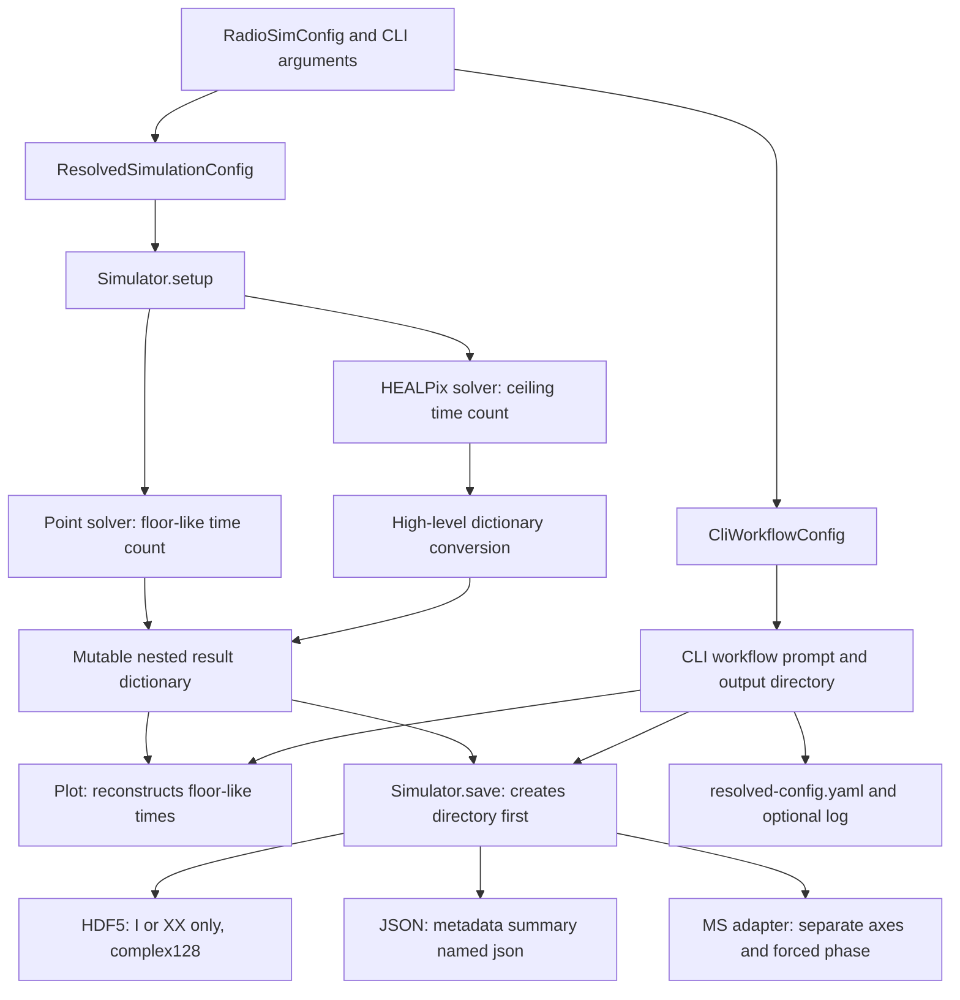
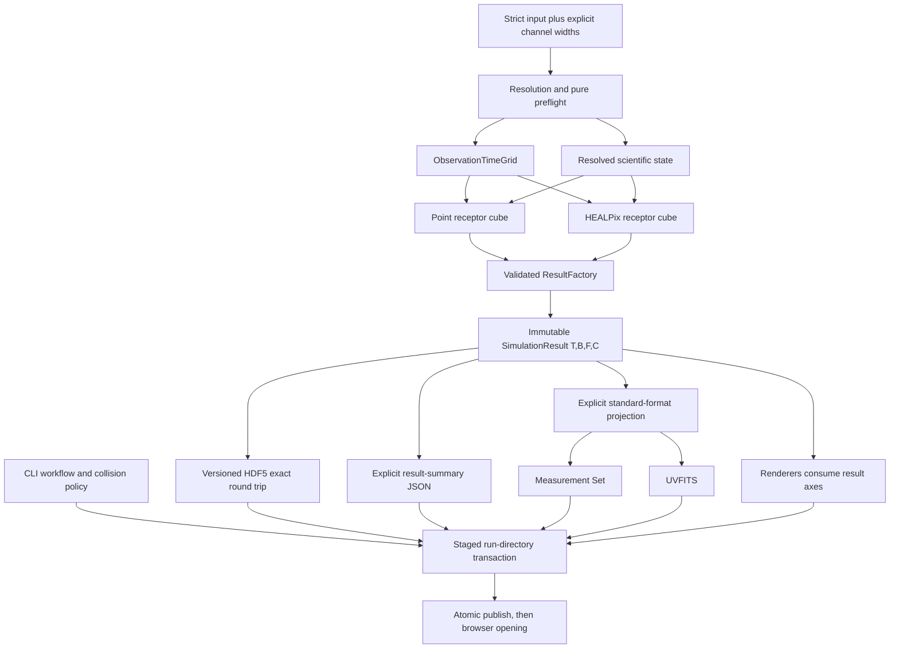

# Tier 4 Result, Time, Serialization, and Output Integration Plan

## 1. Identity, status, and governing sources

| Fact | Value |
|---|---|
| Status | Design gate complete; implementation not accepted |
| Date | 2026-07-25 |
| Repository | `/Users/kartikmandar/MacProjects/RadioSim` |
| Branch | `main` |
| Baseline | `bf544540d83fefef77feb157b060c046276a3c25` |
| Baseline subject | `docs(beam): accept Tier 3 integration` |
| Baseline parent | `aa01145b534c44c6b33a7681c1d103216ebf4313` |
| Tier 3 CI | GitHub Actions run `30165680809`, seven jobs successful |
| Governing roadmap | `Fix.md` |
| Prior accepted architecture | `Tier2InstrumentPlan.md`, `Tier3BeamObservabilityPlan.md` |
| Repository policy | `AGENTS.md`, including the pre-v1 direct-replacement policy |

`Tier1ConfigPlan.md` is absent at the baseline. The complete active source,
tests, shipped configuration, examples, documentation, dependency manifests,
lockfile, and CI workflow relevant to result and output behavior were inspected.
Historical statements in the governing records remain historical.

## 2. Design-only authority

This document is an implementation specification, not Tier 4 implementation.
The design gate changes only this file and the current-status record in
`Fix.md`. It adds no production behavior, test fixture, configuration value,
dependency, generated artifact, or CI behavior. Every implementation slice
requires a separate authorization and an independent acceptance after its
implementation commit.

## 3. Tier 3 dependency and acceptance state

Tier 3 is independently accepted at the baseline. `BEAM-001`, `BEAM-002`,
`BEAM-003`, `OBS-001`, and `OBS-002` are `DONE`. Tier 4 preserves:

- canonical `ResolvedInstrument`, `ResolvedBaselineSelection`, and baseline
  order;
- one Simulator-local `BeamSystem` and immutable `LoadedBeamState`;
- the scalar E-Jones FITS boundary and all accepted analytic beam behavior;
- the point and HEALPix RIME equation, endpoint conjugation, and negative
  geometric phase;
- observability as a sibling plan-before-render pipeline with its own timing;
- failure-before-side-effect ordering for configuration, instrument, beam, and
  observability work.

Tier 4 does not reopen or rewrite Tier 3 acceptance evidence.

## 4. Current architecture



The current graph has no single owner for time coordinates, result shape,
phase reference, collision policy, or artifact transaction.

## 5. Target architecture



Writers consume only `SimulationResult` coordinates. They never receive
duration, cadence, an observation start string, a mutable result mapping, or
workflow policy.

## 6. Current source and test inventory

### 6.1 Configuration and workflow inventory

The numbered `Class` column uses exactly one required classification:
1 scientific result state; 2 writer format option; 3 visualization preference;
4 CLI workflow orchestration; 5 logging concern; 6 implemented and retained;
7 removed as misleading or redundant; 8 later-tier behavior rejected before
side effects.

| Current field or argument | Owner and current behavior | Class | Tier 4 disposition |
|---|---|---:|---|
| `obs_time.start_time` | `ObsTimeConfig`; Astropy-parseable string | 1 | Retain; define first sample center |
| `duration_seconds` | input, resolved state, direct CLI/API | 1 | Retain; half-open center-selection span |
| `time_step_seconds` | input, resolved state, direct CLI/API | 1 | Rename resolved meaning to cadence; retain input spelling |
| grid frequency fields | exact center generation | 1 | Retain and add explicit `channel_width` |
| `channel_frequencies_hz` | exact explicit centers | 1 | Retain and require matching `channel_widths_hz` |
| `workflow.output_dir` | resolved output root, path resolution only | 4 | Retain |
| `workflow.run_subdir` | safe component or deterministic name | 4 | Retain |
| `workflow.result_filename` | safe stem | 2 | Retain |
| `workflow.result_format` | `hdf5`, `json`, `ms`, guarded `uvfits` | 2 | Replace `json` with `summary_json`; activate `uvfits` |
| `workflow.save_results` | post-run action | 4 | Retain |
| `workflow.overwrite` | mixed prompt and writer flag | 7 | Replace with `collision_policy` |
| `skip_overwrite_confirmation` | requires overwrite, still mixed ownership | 7 | Remove |
| `prompt_for_output_suffix` | accepted then rejected | 7 | Remove; deterministic `suffix` policy replaces it |
| `workflow.plot_results` | post-run action | 3 | Retain |
| `open_plots_in_browser` | renderer side effect | 3 | Retain; execute after artifact publication |
| `plotting_backend` | Bokeh or Matplotlib dispatch | 3 | Retain |
| `angle_unit` | accepted then rejected; ambiguous target | 7 | Replace with `visibility_phase_unit` |
| `sky_model_frequency_hz` | accepted then rejected; no matching plot | 7 | Remove |
| `save_log` | initializes file logging after directory creation | 5 | Retain inside the staged workflow transaction |
| `visibility.calculation_type=spherical_harmonic` | accepted then rejected | 8 | Keep rejected for Tier 7 |
| `run(n_workers=...)` | rejected before setup | 8 | Keep rejected for Tier 6 |
| phase-center input | no active field; old RA/Dec fields rejected | 6 | No new input in Tier 4; resolve current zenith-drift truth |

`ResolvedObservationConfig` stores the start string, duration, and time step.
`ResolvedFrequencyConfig` stores only center frequencies. `ResolvedConfiguration`
separates runtime and workflow. `SimulationOverrides` owns backend, precision,
offline, instrument path, complete frequency input, location, start, and
simulator. `WorkflowOverrides` owns only `output_dir`. The direct `simulate`
command owns layout, telescope, diameter, baseline selection, frequencies, sky
alias, output, format, backend, location, start, duration, and time step.
There is no phase-center, duration, cadence, format, filename, or plotting
override in `SimulationOverrides`.

Precedence is explicit call-site override, then document value, then declared
default. YAML-relative paths use the YAML parent; call-site paths use the
captured invocation directory. Configuration resolution checks output path type
without creating a directory. `Simulator.save` arguments are explicit Python
API choices and ignore workflow state.

Current `run_cli_workflow` exits without output when saving, plotting, and
logging are all false. Otherwise it computes a run directory, prompts for any
nonempty existing directory unless confirmation is skipped, creates the
directory, initializes optional file logging, always writes
`resolved-config.yaml`, then calls result saving and plotting. A declined prompt
returns without modification. Prompting has no explicit TTY rule.

### 6.2 Runtime and result production inventory

| Surface | Confirmed baseline behavior | Tier 4 treatment |
|---|---|---|
| `Simulator.run` | Returns and stores one mutable dictionary in `self._results` | Replace |
| `Simulator.results` | Returns the internal alias or `None` | Remove; add singular `result` |
| Point solver | Mapping keyed by selected pair; each product has `(T,F)`; `T=max(1,int(duration/cadence))` | Dense receptor cube on shared grid |
| HEALPix solver | Dense `(B,T,F)` or `(B,T,F,2,2)`; `T=ceil(duration/cadence)` | Dense receptor cube on shared grid |
| High-level HEALPix adapter | Creates `XX,XY,YX,YY,I` dictionary | Remove |
| Baselines | Canonical selected-pair order from Tier 2 | Preserve |
| Correlations | Dictionary keys; normal high-level results contain `XX,XY,YX,YY,I` | Fixed `XX,XY,YX,YY` axis; derive I |
| Dtype | Backend output complex dtype at solver boundary | Preserve exactly in result |
| Frequencies | Exact increasing centers, internal NumPy array | Owned read-only centers plus explicit widths |
| Observation start | Scalar Astropy `Time` in setup | Canonical two-part UTC JD axis |
| Phase reference | Local ENU zenith at every sample; no explicit model | Explicit `zenith_drift` model |
| Geometric phase | `exp(-2πi[u l + v m + w(n-1)])` | Preserve |
| Instrument | Canonical runtime objects and detached metadata snapshot | Exact object plus snapshot |
| Beam | `BeamSystem` evaluation and detached `beam_resolution` snapshot | Preserve loaded-state snapshot |
| Backend/precision | Requested and actual values in metadata | Typed snapshots |
| Timing | mutable `total` and `setup` dictionary | Immutable performance record |
| Failure | assignment occurs after solver; first failure leaves no result | Define last-success publication |
| Retry | setup state has atomic rules; old successful result survives a later failure by current accident | Make last-success retention normative |
| Memory estimate | omits `n_times`, so the simulator default of one is used | Consume canonical count |
| Plot | reads dictionary and rebuilds times with floor-like count | Consume result only |

Point and HEALPix use the same selected baseline vector orientation and negative
phase sign. The baseline vector is antenna 2 minus antenna 1 in local ENU. Both
transform ICRS sky coordinates to the local frame at each sample. Scalar
HEALPix constructs equal parallel hands and zero cross hands; polarized paths
retain the full 2-by-2 matrix. Stokes I is `XX + YY`, without division.

Current dictionary callers are `Simulator.save`, `Simulator.plot`,
`calculate_modulus_phase`, README and Sphinx examples, the offline script,
CLI test doubles, beam solver integration tests, Simulator API tests, and
instrument integration assertions.

### 6.3 Serialization and writer inventory

`src/radiosim/io/writers.py` owns HDF5 save/load and YAML artifact writing.
HDF5 creates its parent, opens the final path in `w` mode, creates one group per
baseline string, stores only the caller-selected `I` or `XX` array as
`complex128`, stores frequency and MJD arrays, and stringifies portions of
metadata. Its reader accepts unversioned files and invokes `eval()` when a
baseline group suffix starts with `(`.

The JSON branch in `Simulator.save` writes metadata, center frequencies, and a
baseline count. It contains no visibility, flag, weight, time-coordinate,
channel-width, or baseline-coordinate array.

`src/radiosim/io/measurement_set.py` imports optional libraries at module load,
detects polarization from unordered sets, infers channel width from the first
frequency difference or invents 1 MHz for one channel, promotes data to
`complex128`, constructs time and baseline rows separately, catches and warns
on every `UVData.check()` failure, and calls `write_ms(..., force_phase=True)`.
The high-level caller passes only scalar start time, so multi-time result shapes
do not match. Generic `read_ms`, `read_ms_dask`, and `ms_info` return external
structures rather than a RadioSim result.

`radiosim.io` lazily exports the unsafe HDF5 functions and generic MS functions,
plus dependency booleans. UVFITS appears in workflow configuration, is rejected
by unsupported-feature validation, is absent from direct CLI choices, and is
rejected by `Simulator.save`.

All writers check collisions differently. HDF5 and JSON write directly to a
final file. MS writes directly to a final directory. Plotters own additional
save/open behavior. There is no atomic multi-artifact transaction.

### 6.4 Tests and truth surfaces

| Truth surface | Current contract encoded | Tier 4 classification |
|---|---|---|
| `tests/unit/test_io/test_config.py` | strict/frozen models, workflow defaults, guards, cadence constraint | Preserve strictness; migrate output enums and width fields |
| `test_config_paths.py` | YAML/call-site path ownership and MS directory type | Preserve; extend exact target types |
| `test_config_resolution.py` | precedence, pure validation, immutable provenance | Preserve and strengthen |
| `test_core/test_runtime_config.py` | exact centers, immutable runtime, JSON-safe provenance | Preserve; replace no-array assertion with immutable-grid assertion |
| `test_core/test_visibility_backend.py` | backend parity and explicit output dtype casts | Preserve |
| `test_io/test_measurement_set.py` | Tier 2 identity, time-major order, current HDF5 metadata | Replace writer assumptions with canonical format coverage |
| `test_simulator/test_api.py` | construction boundaries, mutable result metadata, save dispatch | Preserve construction; deliberately migrate result/save assertions |
| `test_simulator/test_instrument_integration.py` | canonical identity, phase sign, memory counts, failure ordering | Preserve and strengthen time count |
| `test_core/test_beam_solver_integration.py` | dictionary products and beam science | Preserve science; migrate shape access |
| `test_cli/test_config_mode.py` | workflow forwarding, prompt, deterministic subdirectory | Preserve orchestration boundary; replace collision behavior |
| `test_cli/test_simulate.py` | direct typed API and current three formats | Preserve directness; migrate widths, target path, and formats |
| visualization tests | renderer outputs and collision behavior, mostly observability | Preserve observability; add result-renderer coverage |
| `tests/fixtures/configs.py` | complete active input fixture | Migrate widths and workflow policy |
| three shipped YAML files | 101, 11, and 1 channel | Migrate with explicit widths |
| README, quickstart, API and configuration docs | dictionary result and current output claims | Replace with canonical result truth |
| `examples/scripts/simple_simulation.py` and notebook | dictionary indexing and two frequencies | Migrate |
| `pyproject.toml`, `pixi.toml`, `pixi.lock` | pyuvdata, h5py, casacore and two environments | Preserve versions in Tier 4 |
| `.github/workflows/ci.yml` | six OS/Python jobs plus quality | Preserve |

No durable test currently covers a public result model, a shared non-divisible
time grid, full-correlation HDF5 round trip, dtype-preserving HDF5, hostile HDF5,
truthful summary naming, end-to-end multi-time MS, UVFITS, atomic publication,
noninteractive prompting, or renderer use of canonical coordinates. These gaps
receive tests before production edits in the assigned slices.

## 7. Current data-flow trace

1. Pydantic validates `RadioSimConfig`; semantic validation checks cadence no
   greater than duration and parses the start with Astropy.
2. Unsupported validation rejects UVFITS, suffix prompting, nonempty angle
   unit, and sky-model plotting frequency.
3. Resolution freezes runtime values and separates workflow and provenance.
4. `Simulator.setup` resolves instrument, selected baselines, beam system,
   backend, scalar `Time`, center frequencies, wavelengths, and sky.
5. `Simulator.run` passes scalar start, duration, and cadence to one solver.
6. The selected solver independently computes its count and builds its own time
   samples.
7. The high-level HEALPix path converts its dense result to the point-style
   nested dictionary.
8. `Simulator.run` builds mutable metadata and publishes the dictionary.
9. `Simulator.plot` computes modulus/phase from the dictionary and reconstructs
   a floor-like MJD axis.
10. `Simulator.save` creates the output directory, dispatches a format, and
    reconstructs or infers format coordinates.
11. Config-mode CLI wraps saving, plotting, logging, and config artifact output
    around a separate prompt and directory policy.
12. Direct Python calls and direct `simulate` calls bypass workflow policy.

## 8. Confirmed defect matrix

| Issue | Evidence | Required closure evidence | Design status |
|---|---|---|---|
| `OUT-001` | split API/CLI collision, prompt, directory, logging, plotting, and writer ownership | one preflighted workflow transaction and prompt isolation | Design closed; issue `OPEN` |
| `OUT-002` | point floor-like, HEALPix ceiling, save and plot floor-like | every consumer receives one `ObservationTimeGrid` | Design closed; issue `OPEN` |
| `OUT-003` | HDF5 extracts I or XX and writes `complex128` | four correlations and exact supported dtype round trip | Design closed; issue `OPEN` |
| `OUT-004` | JSON has no visibility while named as a result format | rename to `summary_json` with explicit exclusions | Design closed; issue `OPEN` |
| `OUT-005` | HDF5 reader executes baseline text with `eval()` | versioned structural baseline arrays and hostile-file tests | Design closed; issue `OPEN` |
| `OUT-006` | workflow accepts then rejects UVFITS; save omits it | explicit projected UVFITS round trip and active config/API | Design closed; issue `OPEN` |

Only Tier 4I changes these six statuses.

## 9. Scientific invariants

1. Selected baseline order and antenna identity equal the Tier 2 canonical
   selection.
2. Frequency center order remains strictly increasing and caller-authored.
3. Channel widths are explicit positive scientific inputs; no writer infers one.
4. The visibility basis is linear X/Y with canonical correlation order
   `XX, XY, YX, YY`.
5. Stokes I is derived as `XX + YY`; it is not a stored fifth correlation.
6. Point and HEALPix use the same time centers, integration durations, baseline
   vectors, frequency centers, correlation basis, phase reference, and output
   dtype.
7. The current zenith-drift reference and
   `exp(-2πi[u l + v m + w(n-1)])` convention remain unchanged.
8. Scalar HEALPix power remains split equally between XX and YY with zero XY
   and YX.
9. Instrument and beam state remain exact, immutable, and detached from caller
   mutation.
10. Standard-format projection changes reference coordinates, not represented
    sky physics, and records the transformation.
11. No visibility, coordinate, width, weight, or scientific provenance number
    is non-finite.
12. No implicit dtype promotion or downcast occurs.

## 10. Product and CLI workflow invariants

1. Python result, save, and plot APIs never prompt.
2. A CLI prompt occurs only for `collision_policy: prompt`, only on a TTY, and
   before filesystem mutation.
3. Every accepted configuration field has active behavior.
4. Every rejected later-tier field fails during resolution before runtime,
   network, backend, output, renderer, logger, or browser work.
5. A workflow run directory is one owned transaction.
6. A failed transaction leaves the previous published run directory unchanged.
7. Browser opening occurs only after successful publication.
8. Direct API output remains explicit and never reads workflow configuration.
9. Extensions and result names are deterministic and format-specific.
10. No output format silently falls back to another.

## 11. Exact authoritative time-grid contract

### 11.1 Model and interval

`src/radiosim/core/time_grid.py` defines public exact-type
`ObservationTimeGrid` and

```python
def build_observation_time_grid(
    *,
    start_time: str,
    duration_seconds: float,
    cadence_seconds: float,
) -> ObservationTimeGrid: ...
```

The configured start is the center of sample zero. Duration defines the
half-open sample-center selection interval `[start, start + duration)`. The
endpoint is excluded. All integrations have exposure exactly equal to cadence.
There is no partial final integration. Exposure support extends one half
cadence around each center; duration describes center selection, not the union
of exposure windows.

Let `q = duration_seconds / cadence_seconds`, `e = finfo(float64).eps`, and
`tau = 32 * e * max(1, abs(q))`. Let `q_norm = round(q)` when
`abs(q - round(q)) <= tau`; otherwise `q_norm = q`. The sample count is
`N = ceil(q_norm)`. Offsets are `k * cadence_seconds` for integer
`k in [0, N)`. Repeated floating addition and `linspace` are prohibited.

The input schema keeps cadence positive, duration positive, and cadence no
greater than duration, so `N >= 1`.

### 11.2 Boundary cases and examples

| Start | Duration | Cadence | Centers in seconds from start | Count |
|---|---:|---:|---|---:|
| `t0` | 1 | 1 | `0` | 1 |
| `t0` | 3 | 1 | `0,1,2` | 3 |
| `t0` | 2.5 | 1 | `0,1,2` | 3 |
| `t0` | 2.2 | 1 | `0,1,2` | 3 |
| `t0` | 1 | 0.4 | `0,0.4,0.8` | 3 |
| `t0` | `3*(1+8e)` | 1 | `0,1,2` | 3 |

Cadence equal to duration produces one sample. A duration just above an exact
multiple outside `tau` produces one additional center. A duration just below an
exact multiple outside `tau` keeps the exact-multiple count because `ceil`
selects every center below the endpoint.

### 11.3 Limits and representation

`MAX_TIME_SAMPLES` is `10_000_000`. Count computation uses Python integers and
checks the limit before allocating an array. A larger count raises
`TimeGridLimitError` with requested count and limit. Overflow, an Astropy
conversion failure, a non-finite generated coordinate, or loss of monotonicity
raises `InvalidTimeGridError` before backend/device work.

The canonical UTC coordinate consists of owned read-only float64 arrays
`utc_jd1` and `utc_jd2`, each shape `(N,)`, using Astropy two-part JD. The model
also owns read-only float64 `integration_time_seconds`, shape `(N,)`, filled
with cadence, plus `start_time_iso`, `duration_seconds`, `cadence_seconds`,
`interval_semantics="half_open_sample_centers"`, and
`schema_version="radiosim.time-grid.v1"`.

Astropy owns parsing, scale conversion, leap-second handling, ISO rendering,
and JD/MJD conversion. `as_astropy()`, `to_jd()`, and `to_mjd()` return new
objects or arrays. No writer performs `JD - 2400000.5` itself.

`ResolvedObservationConfig` contains this exact grid as `time_grid`; it no
longer stores parallel start/duration/step fields. Point, HEALPix, result
construction, memory estimation, plotting, HDF5, MS, UVFITS, summary metadata,
and provenance receive the exact object or its owned coordinates. Observability
keeps its independent UTC window, sweep, and drift-track timing and never
aliases the visibility integration grid.

## 12. Exact canonical result model

### 12.1 Public models and factories

`src/radiosim/core/phase_center.py` defines `PhaseCenter`.
`src/radiosim/core/result.py` defines `SimulationResult`,
`LoadedSimulationResult`, `ResultPerformance`, `BackendResultProvenance`,
`SolverResultProvenance`, and the errors listed in Section 23.

Only these factories construct array-bearing objects:

```python
def build_simulation_result(
    *,
    receptor_visibilities: object,
    backend: ArrayBackend,
    time_grid: ObservationTimeGrid,
    frequencies_hz: Sequence[float],
    channel_widths_hz: Sequence[float],
    instrument: ResolvedInstrument,
    selection: ResolvedBaselineSelection,
    beam_state: LoadedBeamState,
    phase_center: PhaseCenter,
    backend_provenance: BackendResultProvenance,
    solver_provenance: SolverResultProvenance,
    resolved_config: Mapping[str, object],
    configuration_provenance: Mapping[str, object] | None,
    performance: ResultPerformance,
    history: Sequence[str] = (),
) -> SimulationResult: ...

def build_loaded_simulation_result(
    *,
    visibilities: object,
    flags: object,
    weights: object,
    time_grid: ObservationTimeGrid,
    frequencies_hz: object,
    channel_widths_hz: object,
    correlations: Sequence[str],
    phase_center: PhaseCenter,
    instrument_snapshot: Mapping[str, object],
    selection_snapshot: Mapping[str, object],
    beam_snapshot: Mapping[str, object],
    backend_snapshot: Mapping[str, object],
    solver_snapshot: Mapping[str, object],
    resolved_config_snapshot: Mapping[str, object],
    configuration_provenance_snapshot: Mapping[str, object] | None,
    performance_snapshot: Mapping[str, object],
    history: Sequence[str],
    expected_scientific_sha256: str,
    expected_provenance_sha256: str,
) -> LoadedSimulationResult: ...
```

Factories require exact model types and reject subclasses. Callers cannot
invoke dataclass initializers directly; array-bearing model initializers are
private through `init=False`.

### 12.2 Fields and shapes

`SimulationResult` has these fields:

| Field | Exact type and meaning |
|---|---|
| `schema_version` | literal `radiosim.result.v1` |
| `visibilities` | complex NumPy array `(T,B,F,C)` |
| `flags` | bool NumPy array `(T,B,F,C)`; simulated default all false |
| `weights` | float32 for complex64, float64 for complex128/complex256, same shape; simulated default one |
| `time_grid` | exact `ObservationTimeGrid` |
| `frequencies_hz` | float64 `(F,)`, positive and strictly increasing |
| `channel_widths_hz` | float64 `(F,)`, finite and positive |
| `correlations` | exact tuple `("XX","XY","YX","YY")` |
| `polarization_basis` | literal `linear_xy` |
| `instrument` | exact `ResolvedInstrument` |
| `selection` | exact `ResolvedBaselineSelection` belonging to instrument |
| `beam_state` | exact `LoadedBeamState` |
| `phase_center` | exact `PhaseCenter` |
| `backend` | exact `BackendResultProvenance` |
| `solver` | exact `SolverResultProvenance` |
| `resolved_config` | immutable JSON-safe `FrozenMapping` |
| `configuration_provenance` | immutable JSON-safe `FrozenMapping` or `None` |
| `performance` | exact immutable `ResultPerformance` |
| `history` | tuple of finite, nonblank UTF-8 strings |
| `scientific_sha256` | 64 lower-case hex characters |
| `provenance_sha256` | 64 lower-case hex characters |

`B` equals the selected baseline count and preserves its order. Autos and
crosses occupy the same axis and are identified by the selection. `T`, `B`,
`F`, and `C` are all nonempty; `C` is exactly four. Every shape is coherent
before publication.

`BackendResultProvenance` stores requested backend, actual backend, requested
precision snapshot, actual precision snapshot, and result dtype.
`SolverResultProvenance` stores solver name `rime`, sky representation
`point_sources` or `healpix_map`, geometric convention version
`radiosim.rime-zenith-drift.v1`, and scalar or polarized execution path.
`ResultPerformance` stores finite nonnegative setup, solver, result-build,
host-transfer, and total seconds.

`LoadedSimulationResult` has the same science arrays, time, frequency,
correlation, phase, performance, history, and fingerprints. It replaces live
instrument, selection, beam, backend, solver, resolved-config, and source
provenance objects with exact immutable JSON-safe snapshots. Its name prevents
users from treating deserialized state as a live runtime service.

### 12.3 Ownership, equality, and lifecycle

Every numeric input is copied to an exact base `np.ndarray`, C-contiguous order,
then exposed from an immutable bytes-backed buffer. `writeable=True` cannot be
re-enabled. No caller array, backend buffer, device buffer, view, mutable base,
object array, memmap, or ndarray subclass is retained. Returned helper arrays
are new copies.

Array models use identity equality and are unhashable. They expose:

```python
def scientifically_equal(
    self,
    other: SimulationResult | LoadedSimulationResult,
    *,
    rtol: float = 0.0,
    atol: float = 0.0,
) -> bool: ...
```

The method checks schema, dtype, shapes, coordinates, labels, phase, identity
snapshots, flags, weights, and values. Default comparison is exact.

`SimulationResult.stokes_i()` returns a newly owned array equal to XX plus YY.
`to_summary_snapshot()` returns a new JSON-safe tree and never embeds the
visibility, flag, or weight arrays.

`Simulator.run() -> SimulationResult` builds into locals and assigns
`self._result` only after all solver, transfer, validation, snapshot, and
fingerprint work succeeds. It returns the identical published object.
`Simulator.result -> SimulationResult | None` is `None` before setup and before
the first successful run. A failed first run leaves it `None`. A failed retry
retains the last successful result. A later successful retry atomically
replaces it. The plural `results` property and mutable dictionary are removed
without a compatibility shim.

## 13. Array dimensions, coordinates, and dtype contract

Canonical dimension order is time, baseline, frequency, correlation:
`(T,B,F,C)`. Low-level solver receptor matrices use the private order
`(T,B,F,2,2)` with receptor rows and columns `(X,Y)`. The factory flattens
`[0,0], [0,1], [1,0], [1,1]` to `XX,XY,YX,YY`.

The configured output precision selects `complex64`, `complex128`, or, on a
supporting NumPy platform, `complex256`. A backend performs accumulation under
its configured accumulation precision. The result factory performs one
explicit host transfer and one explicit cast to configured output dtype. A
format that cannot represent the result dtype rejects it before path mutation.

Frequencies and channel widths are independent coordinates. Uniform-grid input
adds required positive `channel_width` in `frequency_unit`. Explicit input adds
required positive `channel_widths_hz` with length exactly equal to
`channel_frequencies_hz`. `Simulator.from_parameters` requires
`channel_widths_hz`. The direct CLI requires `--channel-widths-mhz` with the
same number of comma-separated entries as `--frequencies`.

Flags are false and weights are one for Tier 4 simulation. The fields exist so
formats have one exact contract and future calibration import does not alter
the result schema. Tier 4 does not add calibration or noise weighting.

## 14. Exact phase-center contract

`PhaseCenter` is an immutable exact-type model with:

| Field | Tier 4 value |
|---|---|
| `schema_version` | `radiosim.phase-center.v1` |
| `kind` | `zenith_drift` |
| `frame` | `altaz` |
| `azimuth_rad` | `0.0`, conventional at zenith |
| `altitude_rad` | `π/2` |
| `time_dependent` | `True` |
| `geometric_phase_sign` | `-1` |
| `w_reference` | `n_minus_one` |

Validation requires exact literals, finite radians, azimuth in `[0,2π)`,
altitude in `[-π/2,π/2]`, and coherence between kind, frame, and time
dependence. `InvalidPhaseCenterError` owns failures.

At each canonical UTC center, ICRS sky coordinates transform through Astropy to
local AltAz and then local ENU direction cosines `(l,m,n)`. Both solvers apply
the same antenna-2-minus-antenna-1 baseline and negative phase. Point and
HEALPix behavior is identical at this boundary.

HDF5 stores this model without transformation. MS and UVFITS require a
sidereal projected reference in pyuvdata 3.2.1. Their shared adapter:

1. builds an unprojected `UVData` view from canonical data and coordinates;
2. derives ICRS zenith at the first canonical time with Astropy;
3. invokes `UVData.phase_to_time(first_time)` explicitly;
4. verifies the resulting catalog is one sidereal source;
5. records original `PhaseCenter`, derived ICRS longitude/latitude, reference
   time, transformation name, and result fingerprint in history;
6. calls format writers with `force_phase=False`.

This projection is a coordinate-reference transformation. It is never hidden
inside a writer flag. Standard-format readers return the projected
`StandardVisibilityData`; exact reconstruction of the original zenith-drift
`SimulationResult` is not claimed.

Tier 4 introduces no phase-center configuration input. Fixed ICRS tracking and
other frames are rejected as unknown input until a separate scientific design
changes solver behavior. This contract adds no Tier 5 receptor physics.

## 15. Solver migration contract

Both low-level solvers accept the exact `ObservationTimeGrid`, exact
`SolverInstrumentView`, exact `BeamSystem`, exact frequency-center array, and
backend. They no longer accept scalar start, duration, cadence, or an
independently ordered baseline list.

Both return one backend-native receptor cube `(T,B,F,2,2)` in canonical time,
baseline, and frequency order. Scalar HEALPix fills the matrix as
`diag(I/2,I/2)`. The point solver stops extracting dictionaries. The high-level
Simulator stops converting HEALPix output.

`build_simulation_result` owns the only device-to-host transfer, correlation
flattening, output cast, default flag/weight allocation, copy hardening,
validation, and publication. A solver failure, transfer failure, non-finite
value, shape mismatch, or factory failure publishes nothing.

Migration tests use:

- an independent one-source zenith analytic oracle for autos and a nonzero
  east-west cross baseline;
- off-zenith analytic phase at two times and two frequencies;
- manual `J_p C J_q^H` for heterogeneous beam endpoints;
- scalar HEALPix half-trace power;
- polarized HEALPix matrix values;
- point versus equivalent one-pixel HEALPix values within the established
  discretization tolerance;
- NumPy versus available Numba/JAX results;
- complex64 and complex128 output;
- divisible, non-divisible, and one-sample grids;
- exact baseline, time, frequency, and correlation order;
- failure on the second run proving retention of the first result.

Expected values come from direct equations, not from a solver under test. Existing
Tier 3 regression vectors remain unchanged at their existing sample centers.
Tier 6 hybrid execution will sum compatible point and HEALPix receptor cubes
before the result factory. Tier 4 defines this seam and implements no hybrid
selection, scheduling, chunking, or performance policy.

## 16. HDF5 schema specification

### 16.1 Identity and root

The complete-data schema is named `radiosim.visibility` with semantic version
`1.0.0`. The canonical extension is `.h5`. Root attributes are:

```text
schema_name = "radiosim.visibility"
schema_version = "1.0.0"
radiosim_version = "<package version>"
scientific_sha256 = "<64 lower-case hex>"
provenance_sha256 = "<64 lower-case hex>"
dimension_order = "time,baseline,frequency,correlation"
visibility_unit = "Jy"
```

No creation timestamp enters the schema. The result performance snapshot
already records run timing; deterministic result content does not depend on
serialization time.

### 16.2 Required tree

| Dataset | Shape | Exact storage |
|---|---:|---|
| `/data/visibilities` | `(T,B,F,4)` | little-endian `<c8` or `<c16` |
| `/data/flags` | `(T,B,F,4)` | HDF5 boolean |
| `/data/weights` | `(T,B,F,4)` | little-endian `<f4` or `<f8` |
| `/coordinates/time/utc_jd1` | `(T,)` | `<f8`, unit day, scale UTC |
| `/coordinates/time/utc_jd2` | `(T,)` | `<f8`, unit day, scale UTC |
| `/coordinates/time/integration_time_seconds` | `(T,)` | `<f8`, unit second |
| `/coordinates/frequency/center_hz` | `(F,)` | `<f8`, unit Hz |
| `/coordinates/frequency/channel_width_hz` | `(F,)` | `<f8`, unit Hz |
| `/coordinates/correlation/labels` | `(4,)` | fixed ASCII `S2` |
| `/coordinates/correlation/aips_codes` | `(4,)` | `<i4`, `-5,-7,-8,-6` |
| `/coordinates/baseline/antenna1_number` | `(B,)` | `<i8` |
| `/coordinates/baseline/antenna2_number` | `(B,)` | `<i8` |
| `/coordinates/baseline/vector_enu_m` | `(B,3)` | `<f8`, unit metre |
| `/instrument/name` | scalar | variable-length UTF-8 |
| `/instrument/antenna/number` | `(A,)` | `<i8` |
| `/instrument/antenna/name` | `(A,)` | variable-length UTF-8 |
| `/instrument/antenna/position_enu_m` | `(A,3)` | `<f8`, unit metre |
| `/instrument/antenna/diameter_m` | `(A,)` | `<f8`, unit metre |
| `/instrument/location/itrs_xyz_m` | `(3,)` | `<f8`, unit metre |
| `/instrument/location/geodetic_lon_lat_height` | `(3,)` | `<f8`, degree, degree, metre |
| `/phase_center/kind` | scalar | variable-length UTF-8 |
| `/phase_center/frame` | scalar | variable-length UTF-8 |
| `/phase_center/azimuth_rad` | scalar | `<f8` |
| `/phase_center/altitude_rad` | scalar | `<f8` |
| `/phase_center/time_dependent` | scalar | HDF5 boolean |
| `/phase_center/geometric_phase_sign` | scalar | `<i1` |
| `/phase_center/w_reference` | scalar | variable-length UTF-8 |
| `/provenance/instrument_json` | scalar | variable-length UTF-8 JSON |
| `/provenance/selection_json` | scalar | variable-length UTF-8 JSON |
| `/provenance/beam_json` | scalar | variable-length UTF-8 JSON |
| `/provenance/backend_json` | scalar | variable-length UTF-8 JSON |
| `/provenance/solver_json` | scalar | variable-length UTF-8 JSON |
| `/provenance/resolved_config_json` | scalar | variable-length UTF-8 JSON |
| `/provenance/configuration_source_json` | scalar | variable-length UTF-8 JSON or JSON `null` |
| `/provenance/performance_json` | scalar | variable-length UTF-8 JSON |
| `/provenance/history_json` | scalar | variable-length UTF-8 JSON array |

Each numeric dataset has exact dimension labels matching the table. Baseline
identity is data, never a group name. Antenna numbers are canonical numbers,
not positional indices. Baseline vectors are redundant verification data and
must match antenna positions and the selection snapshot within `1e-9` metre.

JSON is UTF-8, sorted by key, encoded with separators `,` and `:`, and rejects
non-finite constants. Structured coordinate datasets are authoritative;
snapshots must agree with them. Strings contain no NUL and are bounded by the
reader limits.

### 16.3 Chunks, filters, and ordering

`/data/visibilities`, `/data/flags`, and `/data/weights` use chunk shape:

```text
(min(T,16), min(B,64), min(F,64), 4)
```

They use gzip level 4 and Fletcher32. Numeric visibility and weight datasets
also use shuffle. One-dimensional coordinate arrays use chunks
`(min(axis_length,4096),)` and Fletcher32 without compression. Two-dimensional
coordinate arrays use `(min(first_axis,4096), full_second_axis)` and
Fletcher32. Scalar and UTF-8 datasets use no filter. Group and dataset creation
follows the lexical path order shown above.

Complex256 is not a portable HDF5 type in the supported h5py matrix. An HDF5
request for complex256 raises `FormatRepresentationError`; it does not cast.

### 16.4 Writer transaction

The public signature is:

```python
def write_result_hdf5(
    result: SimulationResult,
    path: str | Path,
    *,
    overwrite: bool = False,
) -> Path: ...
```

The function validates exact result type, schema representability, normalized
target, parent safety, extension, and collision before creating anything. A
missing parent is created only after all pure validation and imports. The
writer creates a sibling temporary regular file named
`.target-name.<128-bit-random-hex>.tmp`, writes and flushes HDF5, fsyncs the
file, closes it, reads it through `load_result_hdf5`, verifies both
fingerprints, then publishes it.

For `overwrite=False`, publication uses same-filesystem atomic no-clobber
linking followed by removal of the temporary name. For `overwrite=True`,
`os.replace` atomically replaces a regular non-symlink target. The parent
directory is fsynced. A symlink, special file, or directory target is rejected.
The old target remains intact until publication.

Any pre-publication failure closes all handles and removes the temporary file.
Failure to remove a temporary path raises `PartialCleanupError` with the exact
path and leaves the final target unchanged. The caller never receives a
half-written final file.

## 17. HDF5 trust and safety model

The public reader is:

```python
@dataclass(frozen=True, slots=True)
class HDF5ReadLimits:
    max_time: int = 10_000_000
    max_baseline: int = 10_000_000
    max_frequency: int = 1_000_000
    max_antenna: int = 1_000_000
    max_visibility_elements: int = 100_000_000
    max_single_dataset_bytes: int = 2_147_483_648
    max_total_json_bytes: int = 67_108_864
    max_single_string_bytes: int = 1_048_576

def load_result_hdf5(
    path: str | Path,
    *,
    limits: HDF5ReadLimits = HDF5ReadLimits(),
) -> LoadedSimulationResult: ...
```

Validation order is fixed:

1. reject missing paths, symlinks, non-regular files, and non-HDF5 signatures;
2. read only bounded scalar root attributes;
3. require exact schema name, then exact supported version;
4. require the exact group/dataset allowlist and reject links and object
   references;
5. inspect ranks, shapes, dtypes, byte order, dimension labels, chunks, and
   filter allowlist without loading payloads;
6. compute all element and byte counts with Python integers and enforce every
   limit;
7. read bounded UTF-8 and parse JSON with `json.loads`, a rejecting
   `parse_constant`, and no object hook;
8. validate coordinate monotonicity, finite values, positivity, exact
   correlations, baseline membership/order, antenna uniqueness, phase
   coherence, and snapshot agreement;
9. read science arrays, allowing HDF5 to verify Fletcher32;
10. construct `LoadedSimulationResult` through its validated factory;
11. recompute and compare both fingerprints.

An unknown version raises `UnsupportedSchemaVersionError` before payload
allocation. Malformed shape, dtype, link, filter, JSON, coordinate, checksum,
fingerprint, or snapshot input raises `UnsafeResultInputError`. Error text
identifies the failing path and invariant without echoing untrusted bulk data.

An unversioned legacy file raises `LegacyHDF5Error` with this guidance:
`Legacy unversioned RadioSim HDF5 is not accepted because baseline names were
parsed unsafely and scientific fields were incomplete. Re-run the simulation
with Tier 4 or convert a trusted file in an isolated pre-Tier-4 environment.`
There is no legacy parser. `eval`, `literal_eval`, executable YAML, pickle,
dynamic import, and equivalent evaluation are prohibited.

The reader reconstructs `LoadedSimulationResult`, not live instrument or beam
services, and never guesses a channel width, correlation, phase reference,
flag, weight, or missing coordinate.

## 18. JSON decision and schema

JSON is an explicitly named summary, not a visibility format. The config and
API value is `summary_json`; the extension is `.summary.json`; the schema name
is `radiosim.result-summary`; the version is `1.0.0`.

```python
def write_result_summary_json(
    result: SimulationResult,
    path: str | Path,
    *,
    overwrite: bool = False,
) -> Path: ...
```

The top-level keys, in lexical output order, are:

```text
schema
result
observation
frequency
correlation
instrument
phase_center
beam
backend
solver
resolved_config
configuration_provenance
performance
history
excluded_payloads
```

`schema` contains name and version. `result` contains result schema, shape,
dtype, units, both fingerprints, flag count, weight minimum/maximum, and axis
counts. `observation` contains first and last center ISO UTC, count, cadence,
duration, interval semantics, and exposure rule. `frequency` contains count,
minimum/maximum center, and minimum/maximum width. `correlation` contains
labels and basis. `instrument` contains name, instrument hash, antenna count,
selected-baseline count, and selection snapshot. Phase, beam, backend, solver,
resolved config, source provenance, performance, and history use detached
JSON-safe snapshots.

`excluded_payloads` is exactly:

```json
[
  "visibility_samples",
  "flags_array",
  "weights_array",
  "full_time_coordinate",
  "full_frequency_coordinate",
  "per_baseline_geometry",
  "per_antenna_geometry"
]
```

The writer serializes with UTF-8, indent two, sorted keys, and `allow_nan=False`.
The complete encoded summary is limited to 16 MiB before filesystem mutation.
It uses the atomic regular-file policy in Section 16.4. There is no summary
reader; standard `json.load` is sufficient and cannot reconstruct a result.

Legacy `json` is rejected with:

```text
format 'json' was removed before v1.0 because it did not contain visibility
data; use 'summary_json' for metadata or 'hdf5' for a lossless RadioSim result
```

No alias or automatic rewrite remains.

## 19. Measurement Set mapping

### 19.1 Public contract

`src/radiosim/io/standard_visibility.py` defines immutable
`ProjectedPhaseCenter`, `StandardVisibilityData`, `StandardReadLimits`, and
shared projection utilities.
`src/radiosim/io/measurement_set.py` exports:

```python
def write_measurement_set(
    result: SimulationResult,
    path: str | Path,
    *,
    overwrite: bool = False,
) -> Path: ...

def read_measurement_set(
    path: str | Path,
    *,
    data_column: str = "DATA",
    limits: StandardReadLimits = StandardReadLimits(),
) -> StandardVisibilityData: ...
```

pyuvdata and casacore imports stay inside these functions. Missing dependencies
raise `OptionalResultDependencyError` before parent creation.

`ProjectedPhaseCenter` stores schema
`radiosim.projected-phase-center.v1`, kind `sidereal`, frame `icrs`,
finite longitude in `[0,2π)`, finite latitude in `[-π/2,π/2]`, two-part UTC
reference JD, and an immutable original-phase snapshot.

`StandardVisibilityData` is an exact-type, unhashable, bytes-backed immutable
model with schema `radiosim.standard-visibility.v1`, format `ms` or `uvfits`,
visibility/flag/weight arrays `(T,B,F,4)`, two-part UTC JD `(T,)`, exposure
`(T,)`, centers and widths `(F,)`, canonical labels
`XX,XY,YX,YY`, antenna-one/antenna-two number arrays `(B,)`, UVW metres
`(T,B,3)`, an immutable telescope/antenna snapshot, exact
`ProjectedPhaseCenter`, history tuple, and optional RadioSim source
fingerprints. It applies the same finite, nonempty, shape, exact-type,
copy-ownership, equality, and subclass rules as loaded HDF5 results.

`StandardReadLimits` defaults to 10,000,000 times, 10,000,000 baselines,
1,000,000 frequencies, 1,000,000 antennas, 100,000,000 visibility elements,
and 2,147,483,648 data bytes.

### 19.2 Axis and metadata mapping

The adapter reorders canonical correlations from `XX,XY,YX,YY` to AIPS/MS
order `XX,YY,XY,YX` with integer codes `-5,-6,-7,-8`. It converts
`(T,B,F,C)` to BLT order `row = time_index * B + baseline_index`, producing
`(T*B,F,C)`. Flags and weights use the identical permutation; weights map to
`nsample_array`. Immediately after `UVData.new`, the adapter replaces
pyuvdata's list-valued polarization array with an exact integer NumPy array.

All selected autos and crosses are supported. Antenna names, numbers,
diameters, local ENU positions, telescope name, and ITRS location come from the
canonical instrument. pyuvdata converts ENU positions and owns UVW generation.
The adapter verifies its unprojected UVWs against canonical baseline geometry
before phase projection.

For auto XX and YY, an imaginary magnitude no greater than
`64 * eps(real_dtype) * max(1, abs(real_part))` is set to positive zero in the
projected export copy and recorded in HISTORY. A larger value raises
`FormatRepresentationError`. Cross-hand autos retain their complex conjugate
pair.

Times are `utc_jd1 + utc_jd2`, repeated in BLT order. Integration time repeats
the exact per-time exposure for every baseline. Center frequencies and
per-channel widths are exact arrays. The adapter sets `vis_units="Jy"`.
Complex64 and
complex128 inputs are supported; complex256 is rejected before import side
effects. pyuvdata/casacore stores the MS DATA column as complex64. Complex64 is
preserved; complex128 is explicitly converted to complex64 in the projected
export view, with input dtype, stored dtype, and lossy conversion recorded in
HISTORY. Standard-format weights are explicitly converted to float32 and the
conversion is recorded. `UVData.check()` must pass; no exception is downgraded.

The explicit standard projection in Section 14 produces a fixed sidereal
reference at the first-time zenith. `write_ms` receives `force_phase=False`.
It also receives `clobber=False` because the temporary directory is new.
Original phase semantics and the projection record enter HISTORY.

### 19.3 Publication and round trip

The adapter writes a sibling temporary `.ms` directory, closes all casacore
handles, reads it back, and compares projected data and metadata. Default
tolerances are:

| Quantity | complex64 | complex128 |
|---|---:|---:|
| visibility | `rtol=5e-6`, `atol=1e-7 Jy` | `rtol=5e-6`, `atol=1e-7 Jy` after required complex64 storage |
| time | `5e-10 day` | `5e-10 day` |
| UVW | `1e-6 metre` | `1e-6 metre` |
| frequency | `1e-6 Hz` | `1e-6 Hz` |
| width/exposure | `1e-9` in native unit | `1e-9` in native unit |

Flags, antenna identity, baseline order after canonical remapping, and
correlation labels must compare exactly. Weights compare at float32 tolerance
`rtol=5e-6`, `atol=1e-7`.

Directory publication uses `src/radiosim/io/atomic_paths.py`. Linux uses
`renameat2` no-replace/exchange operations; macOS uses `renameatx_np`
exclusive/swap operations. Unsupported platforms raise
`AtomicWriteUnsupportedError` before invoking pyuvdata. Replacement exchanges
the new and old directories, then removes the old directory at its temporary
name. Cleanup failure raises `PartialCleanupError`; the new verified result
remains final and the recoverable old directory path is reported.

Measurement Set does not preserve the original time-varying AltAz phase model
or complex128 samples as native standard data. The projected complex64 values
plus HISTORY are the declared contract. `read_measurement_set` returns
`StandardVisibilityData` in the fixed sidereal reference; it never claims an
exact `SimulationResult` round trip.

The reader rejects symlinks and wrong path kinds, performs a metadata-only
pyuvdata read, enforces `StandardReadLimits`, rectangular time-by-baseline
coverage, one spectral window, exact supported correlations, finite
coordinates, positive widths/exposures, unique antenna identity, and one
sidereal phase catalog before loading data. Malformed or oversized input raises
`UnsafeResultInputError`; an unsupported external MS layout raises
`FormatRepresentationError`. No scientific fact is filled from a RadioSim
default.

## 20. UVFITS decision and mapping

Tier 4 implements UVFITS. This closes the global `Fix.md` round-trip requirement
only after Tier 4I proves the complete implementation. The public functions are:

```python
def write_uvfits(
    result: SimulationResult,
    path: str | Path,
    *,
    overwrite: bool = False,
) -> Path: ...

def read_uvfits(
    path: str | Path,
    *,
    limits: StandardReadLimits = StandardReadLimits(),
) -> StandardVisibilityData: ...
```

The UVFITS adapter reuses the exact MS projection, BLT order, antenna metadata,
time, UVW, integration, flag, weight, and AIPS correlation mapping. It sets
`polarization_array` to an exact integer NumPy array before calling pyuvdata,
because pyuvdata 3.2.1 creates a list that fails advanced indexing in its
UVFITS writer. It calls `write_uvfits(..., force_phase=False)`.
It passes `clobber=False`; atomic publication owns replacement.

Supported results satisfy all of these preflight rules:

- complex64 or complex128 visibility;
- one through 255 antennas, with canonical numbers in `0..254`;
- one frequency, or evenly spaced centers within
  `32 * eps64 * max(abs(center))`;
- equal channel widths within the same tolerance;
- adjacent center spacing no greater than channel width;
- the exact four linear correlations;
- finite data, coordinates, weights, and metadata;
- auto XX and YY imaginary magnitude no greater than
  `64 * eps(real_dtype) * max(1, abs(real_part))`.

An unsupported result raises `FormatRepresentationError` with every violated
constraint and directs the user to HDF5 or Measurement Set. No reorder,
resampling, channel-width invention, data cast, antenna renumbering, or format
fallback occurs silently.

For accepted autos, the projected UVFITS copy sets those bounded XX/YY
imaginary parts to positive zero and records the normalization in HISTORY. A
larger value is rejected. The canonical result is never changed.

The writer uses the atomic regular-file policy, reads the temporary UVFITS back,
and verifies with the MS tolerances. Complex64 and complex128 must retain dtype.
Weights use the standard-format float32 conversion and record that fact.
History includes RadioSim version, both fingerprints, original phase model,
projection record, and JSON-safe instrument/beam/solver summaries within
UVFITS history limits. Larger provenance stays in HDF5 or summary JSON and the
UVFITS history states that limitation.

Native UVFITS cannot retain the complete RadioSim configuration tree, beam
snapshot, arbitrary nonuniform channels, complex256, or the original
time-varying phase model. Those cases are rejected or explicitly summarized;
they are never presented as lossless.

The UVFITS reader rejects symlinks and non-regular files, inspects FITS
random-group and antenna-table headers with Astropy before pyuvdata allocation,
enforces `StandardReadLimits`, then applies the same rectangular, finite,
identity, correlation, phase, and shape checks as the MS reader. Malformed,
truncated, oversized, multi-source-phase, unsupported polarization, or
unsupported spectral layout raises `UnsafeResultInputError` or
`FormatRepresentationError` without returning partial data.

## 21. Plot and renderer migration

`plot_results`, `open_plots_in_browser`, and `plotting_backend` remain workflow
visualization preferences. `angle_unit` is removed and replaced by
`visibility_phase_unit: Literal["radians","degrees"] = "radians"`.
`sky_model_frequency_hz` is removed because Tier 4 has no workflow sky-image
renderer. A future sky renderer requires its own typed request.

`Simulator.plot` becomes:

```python
def plot(
    self,
    *,
    plot_type: Literal["all","antenna","visibility","heatmap","frequency"] = "all",
    output_dir: str | Path | None = None,
    backend: Literal["bokeh","matplotlib"] = "bokeh",
    show: bool = True,
    overwrite: bool = False,
    visibility_phase_unit: Literal["radians","degrees"] = "radians",
) -> tuple[Path, ...]: ...
```

Visibility renderers accept `SimulationResult`, select or derive Stokes I
explicitly, and consume result time centers, frequency centers, baseline order,
and correlations. They do not receive duration, cadence, scalar start, or a
nested mapping. Antenna-only renderers consume `result.instrument`.

Workflow plots render into the staged run directory. `show=False` during
staging regardless of the configured browser flag. After successful directory
publication, browser opening uses final paths. A render or browser failure has
a typed error; browser failure does not invalidate already published data and
is reported separately.

## 22. Output collision, overwrite, prompting, and atomicity

### 22.1 Format and path rules

`src/radiosim/io/result_format.py` defines public `ResultFormat`, an enum with
values `hdf5`, `summary_json`, `ms`, and `uvfits`. Canonical extensions are
`.h5`, `.summary.json`, `.ms`, and
`.uvfits`. Config and CLI values are lower-case and case-sensitive. Python APIs
require the enum; passing a string raises `TypeError`.

`Simulator.save` is:

```python
def save(
    self,
    path: str | Path,
    /,
    *,
    format: ResultFormat = ResultFormat.HDF5,
    overwrite: bool = False,
) -> Path: ...
```

`path` is the final artifact path. A missing extension is appended. A wrong or
ambiguous extension raises `OutputPathError`. Direct CLI `simulate --output`
also names the final artifact path and requires
`--format hdf5|summary_json|ms|uvfits`. Direct API and direct CLI create a
missing parent only after complete preflight. They never prompt or generate a
suffix.

Existing target rules are exact:

- absent target: publish;
- regular file target for file format: replace only when `overwrite=True`;
- `.ms` directory target: replace only when `overwrite=True`;
- wrong target kind: reject;
- symlink or special target: reject;
- existing empty output root or workflow run directory: safe;
- nonempty parent with no target collision: safe for a direct single artifact.

### 22.2 CLI workflow policy

`overwrite`, `skip_overwrite_confirmation`, and
`prompt_for_output_suffix` are replaced by:

```python
collision_policy: Literal["error","replace","suffix","prompt"] = "error"
```

The policies are:

| Policy | Behavior |
|---|---|
| `error` | accept an absent or empty run directory; reject a nonempty owned run before mutation |
| `replace` | accept an absent or empty run; stage and atomically swap a nonempty owned run |
| `suffix` | use an absent or empty base; otherwise choose the first free deterministic `-001` through `-999`; fail after 999 |
| `prompt` | accept an absent or empty run; for a nonempty owned run on a TTY, show the exact target and ask once; yes becomes replace, no returns no outputs |

`prompt` in a noninteractive session raises `NonInteractivePromptError` before
directory, logger, writer, renderer, or browser work. Suffix choice is never
interactive.

A nonempty run is owned only when `manifest.json` has schema
`radiosim.workflow-manifest.v1`, validates safely, and lists paths contained
under that exact directory. `error`, `replace`, and `prompt` reject a nonempty
directory without a valid owned manifest as `UnsafeOutputDirectoryError`.
`suffix` leaves it untouched and selects a free suffixed directory. An empty
run is published by directory exchange so a later staging failure does not
need to remove it early.

The run subdirectory remains explicit or uses the current deterministic
telescope/frequency/start/duration name. It is an exclusively owned workflow
transaction. The workflow precomputes an artifact manifest containing:

```text
manifest.json
resolved-config.yaml
simulation.log                 when save_log
<result_filename><extension>   when save_results
renderer-declared plot files   when plot_results
```

It validates all writers, optional dependencies, format representability,
renderer requests, target safety, and prompt outcome first. It then creates a
sibling staging directory, attaches file logging there, writes and verifies all
artifacts, closes logging and file handles, writes a sorted manifest with
SHA-256 hashes, fsyncs files and directories, and atomically publishes the run
directory through `atomic_paths.py`.

Failure before publication removes staging and leaves the old run untouched.
Only console messages remain. Failure to clean staging raises
`PartialCleanupError`. After publication, browser opening is the sole remaining
side effect. Workflow replacement replaces the entire previously owned run
directory, including old logs and plots; it does not touch output-root siblings.

## 23. Error taxonomy and side-effect ordering

### 23.1 Typed errors

`src/radiosim/core/result.py` defines:

- `ResultError(RuntimeError)`;
- `ResultUnavailableError(ResultError)`;
- `InvalidResultError(ResultError)`;
- `ResultShapeError(InvalidResultError)`;
- `ResultCoordinateError(InvalidResultError)`;
- `InvalidPhaseCenterError(InvalidResultError)`;
- `InvalidTimeGridError(InvalidResultError)`;
- `TimeGridLimitError(InvalidTimeGridError)`.

`src/radiosim/io/result_errors.py` defines:

- `ResultIOError(RuntimeError)`;
- `UnsupportedResultFormatError(ResultIOError)`;
- `OptionalResultDependencyError(ResultIOError)`;
- `OutputPathError(ResultIOError)`;
- `OutputCollisionError(ResultIOError)`;
- `UnsafeOutputDirectoryError(OutputCollisionError)`;
- `OverwriteRefusedError(OutputCollisionError)`;
- `AtomicWriteError(ResultIOError)`;
- `AtomicWriteUnsupportedError(AtomicWriteError)`;
- `PartialCleanupError(AtomicWriteError)`;
- `SummaryContractError(ResultIOError)`;
- `FormatRepresentationError(ResultIOError)`;
- `UnsafeResultInputError(ResultIOError)`;
- `UnsupportedSchemaVersionError(UnsafeResultInputError)`;
- `LegacyHDF5Error(UnsafeResultInputError)`.

`src/radiosim/cli/workflow.py` defines `WorkflowOutputError` and
`NonInteractivePromptError`. `src/radiosim/visualization/errors.py` defines
`ResultPlotContractError` and `ResultBrowserError`.

### 23.2 Mandatory order

1. Schema, semantic, time-count, width, and phase validation precede setup.
2. Instrument and beam resolution retain their Tier 3 order.
3. Result shape, dtype, finite, coordinate, and identity validation precede
   publication.
4. Save request, format, result type, extension, representability, dependency
   availability, target kind, collision, and prompt validation precede parent
   creation.
5. Writer import precedes path creation only after pure request validation;
   optional heavy imports occur after result representability checks.
6. A temporary artifact is fully written, closed, read back, and verified
   before final overwrite or publish.
7. Plot contract validation precedes staging; rendering precedes publication;
   browser opening follows publication.
8. Workflow file logging begins only inside staging and closes before publish.
9. No writer or renderer initiates network or registry access.

Unsupported format, unavailable dependency, invalid phase, malformed input,
unsupported schema, collision, overwrite refusal, summary-size failure,
standard-format representation failure, and plot mismatch therefore leave no
new output path.

## 24. Public API additions, removals, exports, and signatures

Add lazy exports from `radiosim`, `radiosim.api`, `radiosim.core`, or
`radiosim.io` according to ownership:

```python
# radiosim and radiosim.api
SimulationResult
LoadedSimulationResult
ObservationTimeGrid
PhaseCenter
ResultFormat
Simulator

# radiosim.io
HDF5ReadLimits
StandardVisibilityData
write_result_hdf5
load_result_hdf5
write_result_summary_json
write_measurement_set
read_measurement_set
write_uvfits
read_uvfits
```

Keep all imports lazy at optional dependency boundaries. Remove:

```text
Simulator.results
save_visibilities_hdf5
load_visibilities_hdf5
write_ms
read_ms
read_ms_dask
ms_info
PYUVDATA_AVAILABLE
CASACORE_AVAILABLE
DASKMS_AVAILABLE
MS_AVAILABLE
```

Dependency availability is reported by typed operation errors, not public
module booleans. `save_config_yaml` moves to private workflow artifact code.
There is no nested-dictionary adapter, legacy result alias, deprecated format
alias, or compatibility module.

## 25. Configuration additions, removals, migrations, and rejection messages

Add required scientific fields:

```yaml
obs_frequency:
  mode: grid
  starting_frequency: 50
  frequency_interval: 1
  frequency_bandwidth: 100
  channel_width: 1
  frequency_unit: MHz
```

```yaml
obs_frequency:
  mode: explicit
  channel_frequencies_hz: [100000000, 101500000]
  channel_widths_hz: [1000000, 1000000]
```

Add workflow fields:

```yaml
workflow:
  result_format: hdf5
  collision_policy: error
  visibility_phase_unit: radians
```

Remove `overwrite`, `skip_overwrite_confirmation`,
`prompt_for_output_suffix`, `angle_unit`, and `sky_model_frequency_hz`.
Replace result-format value `json` with `summary_json`. Activate `uvfits`.

Exact migration errors are:

```text
obs_frequency.channel_width: required scientific channel width in frequency_unit
obs_frequency.channel_widths_hz: required and must match channel_frequencies_hz length
workflow.overwrite: removed before v1.0; use workflow.collision_policy
workflow.skip_overwrite_confirmation: removed before v1.0; use collision_policy=replace
workflow.prompt_for_output_suffix: removed before v1.0; use collision_policy=suffix
workflow.angle_unit: removed before v1.0; use workflow.visibility_phase_unit
workflow.sky_model_frequency_hz: removed before v1.0; no Tier 4 sky renderer consumes it
workflow.result_format=json: removed before v1.0; use summary_json or hdf5
```

Every YAML, fixture, Python constructor, direct CLI command, example, and
active documentation page receives explicit widths. There is no inferred
single-channel width and no transitional default.

## 26. Provenance and fingerprint policy

The scientific fingerprint is SHA-256 over a tagged canonical byte stream:

1. schema version;
2. little-endian C-order visibility bytes and dtype string;
3. flag and weight bytes and dtypes;
4. two-part UTC JD and exposure bytes;
5. center and width bytes;
6. correlation labels and basis;
7. canonical instrument, selection, beam, and phase JSON;
8. solver identity and geometric convention.

JSON uses sorted keys, compact separators, UTF-8, and finite numbers. Numeric
arrays normalize to declared little-endian storage before hashing.

The provenance fingerprint hashes the scientific fingerprint plus requested
and actual backend/precision, resolved scientific config, source and override
provenance, package version, and history. Performance durations are excluded
because repeated runs differ. Workflow preferences and output paths are
excluded from both fingerprints.

HDF5 stores and verifies both hashes. Summary JSON reports both. MS and UVFITS
history reports both and the projection record. Equality never relies only on
a hash; acceptance compares fields and arrays, then checks hashes.

## 27. Optional dependency policy

h5py and JSON are core dependencies. Measurement Set requires pyuvdata and
python-casacore. UVFITS requires pyuvdata and Astropy FITS. Imports occur inside
the requested writer/reader. Importing `radiosim`, `radiosim.api`, or
`radiosim.io` must not import casacore, dask-ms, or construct a `UVData`.

`OptionalResultDependencyError` names the requested format, missing package,
installed pyuvdata version when available, and the documented installation
extra. It never suggests that another format was written.

Tier 4 removes the generic dask-ms reader and its public availability flag.
Dependency removal from the `ms` extra occurs only in Tier 4H after no active
surface imports it. The locked pyuvdata version remains 3.2.1 for the whole
tier.

## 28. Backward compatibility and pre-v1 migration policy

RadioSim is pre-v1. The mutable dictionary result, plural `results`, ambiguous
`json`, unsafe HDF5 reader, generic MS functions, availability flags, output
confirmation fields, suffix-prompt field, ambiguous angle field, unused sky
frequency field, inferred widths, and reconstructed axes are removed directly.

The migration guide gives one-to-one replacements and explicit error text.
No deprecation window, adapter, alias, hidden conversion, or dual schema is
retained. Historical unversioned HDF5 remains rejected. Users rerun simulations
for exact HDF5 or use an isolated older environment for trusted one-time
inspection.

## 29. Exact implementation file inventory

The whole-tier implementation inventory is closed below.

### 29.1 New production files

```text
src/radiosim/core/time_grid.py
src/radiosim/core/phase_center.py
src/radiosim/core/result.py
src/radiosim/io/result_errors.py
src/radiosim/io/result_format.py
src/radiosim/io/atomic_paths.py
src/radiosim/io/hdf5.py
src/radiosim/io/summary_json.py
src/radiosim/io/standard_visibility.py
src/radiosim/io/uvfits.py
src/radiosim/io/workflow_artifacts.py
src/radiosim/visualization/errors.py
```

### 29.2 Modified production files

```text
src/radiosim/__init__.py
src/radiosim/api/__init__.py
src/radiosim/api/simulator.py
src/radiosim/core/__init__.py
src/radiosim/core/runtime_config.py
src/radiosim/core/visibility.py
src/radiosim/core/visibility_healpix.py
src/radiosim/simulator/base.py
src/radiosim/simulator/rime.py
src/radiosim/io/__init__.py
src/radiosim/io/config.py
src/radiosim/io/config_resolution.py
src/radiosim/io/measurement_set.py
src/radiosim/cli/main.py
src/radiosim/cli/workflow.py
src/radiosim/visualization/bokeh_plots.py
src/radiosim/visualization/gsm_plots.py
```

### 29.3 Removed production file

```text
src/radiosim/io/writers.py
```

Its HDF5 paths are replaced by `hdf5.py`; workflow YAML writing moves to
`workflow_artifacts.py`.

### 29.4 New test files

```text
tests/characterization/test_tier4_current_behavior.py
tests/characterization/test_pyuvdata_321_output_contract.py
tests/characterization/test_h5py_output_contract.py
tests/unit/test_core/test_time_grid.py
tests/unit/test_core/test_phase_center.py
tests/unit/test_core/test_result.py
tests/unit/test_io/test_hdf5_result.py
tests/unit/test_io/test_result_summary.py
tests/unit/test_io/test_standard_visibility.py
tests/unit/test_io/test_uvfits.py
tests/unit/test_io/test_output_atomicity.py
tests/unit/test_simulator/test_result_integration.py
tests/unit/test_cli/test_output_workflow.py
tests/unit/test_visualization/test_result_plots.py
tests/unit/test_tier4_result_output_acceptance.py
```

### 29.5 Modified tests and fixtures

```text
tests/fixtures/configs.py
tests/unit/test_cli/conftest.py
tests/unit/test_cli/test_config_mode.py
tests/unit/test_cli/test_simulate.py
tests/unit/test_cli/test_validate.py
tests/unit/test_core/test_beam_solver_integration.py
tests/unit/test_core/test_runtime_config.py
tests/unit/test_core/test_visibility_backend.py
tests/unit/test_io/test_config.py
tests/unit/test_io/test_config_paths.py
tests/unit/test_io/test_config_resolution.py
tests/unit/test_io/test_measurement_set.py
tests/unit/test_simulator/test_api.py
tests/unit/test_simulator/test_instrument_integration.py
tests/unit/test_tier1h_documentation.py
```

### 29.6 Configuration, examples, documentation, and manifests

```text
configs/config.yaml
configs/realistic_foreground_example.yaml
antenna_layout_examples/example_telescope_config.yaml
README.md
docs/api/io.rst
docs/api/simulator.rst
docs/index.rst
docs/quickstart.rst
docs/user_guide/configuration.rst
docs/user_guide/configuration_support.rst
docs/migration_guide.md
examples/scripts/simple_simulation.py
examples/notebooks/01_basic_usage.ipynb
pyproject.toml
pixi.toml
pixi.lock
```

No CI workflow file belongs to Tier 4. Dependency-manifest edits only remove
the obsolete dask-ms surface after all imports are gone; pyuvdata, h5py,
casacore, Python, platforms, environments, and Pyright remain locked as
accepted.

## 30. Exact test and fixture inventory

Tests are assigned by invariant:

| Test group | Required assertions |
|---|---|
| current characterization | three conflicting counts, dictionary aliasing, HDF5 loss/promotion, JSON omission, unsafe legacy name, directory-before-error, MS scalar-time mismatch, UVFITS rejection |
| dependency characterization | exact installed versions, pyuvdata construction, phase requirements, dtype behavior, correlation reorder, autos/crosses/subsets, collisions, cleanup, h5py strings/dtypes/dimensions/replace |
| time grid | formula, tolerance boundary, leap second, two-part JD, one sample, divisible/non-divisible, maximum count, overflow, immutability, subclass rejection |
| phase center | exact literals, validation, JSON snapshot, two-time local zenith relation, standard projection |
| result | all fields/shapes/dtypes, immutable bytes-backed arrays, finite checks, no empty axis, selection membership, fingerprints, summary, equality, failed construction |
| solver integration | analytic equations, point/HEALPix parity, backend parity, phase sign, scalar split, dtype, single transfer, publication lifecycle |
| HDF5 | exact tree, dimension labels, c64/c128, four correlations, flags/weights, snapshots, hashes, chunks/filters, atomic collision, hostile limits, unknown/legacy versions, no dynamic evaluation |
| summary JSON | exact name/version/keys/exclusions, size limit, atomicity, old `json` rejection, no reader |
| standard projection | BLT order, AIPS reorder, UVW, time, exposure, widths, phase history, autos/crosses/subsets, c128-to-c64 MS conversion record |
| MS | optional import, temporary directory, checks, read-back tolerances, collision/exchange, handle closure, malformed metadata |
| UVFITS | c64/c128 preservation, constraints, projection, history, read-back, collision, malformed metadata |
| output atomicity | file no-clobber/replace, directory no-replace/swap, rollback, cleanup failure, symlink/special rejection, concurrent collision |
| workflow | four collision policies, TTY/non-TTY, manifest, staging, log close, config artifact, failure rollback, browser-last |
| renderer | canonical time/frequency/baseline use, phase unit, no reconstructed axis, staged save, browser-last |
| documentation assertions | no dictionary result, no old fields/exports/formats, explicit widths, exact phase and dtype claims |
| whole-tier acceptance | issue evidence, forbidden residuals, exact exports/signatures/schema versions, no compatibility paths, scope and dependency matrix |

`tests/fixtures/configs.py` adds explicit widths and the new workflow policy.
Tiny standard-format fixtures use deterministic two-time, two-baseline,
two-frequency, four-correlation arrays with one auto, one cross, one flag, and
non-unit weights. They create output only under pytest temporary directories.
No registry, network, mounted path, external data, or repository output
directory enters a Tier 4 test.

Existing tests that assert canonical identity, resolution precedence, strict
input, phase sign, backend dtype, failure ordering, and Tier 3 beam behavior
remain. Tests that assert dictionary access, inferred widths, current prompt
semantics, ambiguous JSON, caught `UVData.check`, forced writer phase, HDF5
promotion, or unsafe legacy reading are replaced. No unsafe behavior is kept as
an accepted regression.

## 31. Documentation and sample-config inventory

`README.md`, `docs/index.rst`, `docs/quickstart.rst`, and
`docs/api/simulator.rst` replace dictionary examples with `SimulationResult`
attributes and singular lifecycle. `docs/api/io.rst` documents the versioned
HDF5 schema, loaded-result distinction, summary contract, MS projection, and
UVFITS restrictions.

`docs/user_guide/configuration.rst` and
`configuration_support.rst` list explicit channel widths, four result formats,
four collision policies, retained visualization controls, removed fields, and
pre-side-effect rejection. `docs/migration_guide.md` gives exact replacements
for every removed API/config field and legacy file behavior.

All three YAML samples add widths and new workflow fields while preserving
101/11/1 centers. The Python script and notebook add two explicit widths and
use result attributes. Generated notebook outputs are cleared. No HDF5, MS,
UVFITS, plot, log, or output directory is committed.

Historical `docs/HERA_VSIM_ANALYSIS.md` stays historical. Tier 4 edits no
simulator survey repository under `simulators/`.

## 32. Dependency characterization results

All probes were offline, deterministic, and executed in temporary directories
that were removed. They used no registry, network, external data, mounted data,
or persistent repository path.

### 32.1 Installed matrix

| Environment | Python | NumPy | Astropy | pyuvdata | casacore | h5py |
|---|---:|---:|---:|---:|---:|---:|
| `default` | 3.11.13 | 2.3.2 | 7.1.0 | 3.2.1 | 3.7.1 | 3.14.0 |
| `py312` | 3.12.13 | 2.4.6 | 8.0.1 | 3.2.1 | 3.8.1 | 3.16.0 |

### 32.2 pyuvdata findings

- `UVData.new` accepted exact time arrays, selected auto/cross pairs, all three
  antennas with a two-antenna selected subset, exact widths, integration times,
  flags, weights, complex64 data, and four linear correlations.
- With `do_blt_outer=True` and `time_axis_faster_than_bls=False`, BLT order was
  time-major and baseline-inner.
- The linear labels `XX,XY,YX,YY` mapped to codes `-5,-7,-8,-6`.
- New data were `unprojected`; `check()` passed with finite UVWs.
- MS and UVFITS rejected unprojected data when `force_phase=False`.
- Hidden force phase projected to a fixed ICRS zenith at the first timestamp.
  This proves the need for the explicit Section 14 transformation.
- `UVData.new` retained `polarization_array` as a Python list. MS and UVFITS
  advanced-index paths failed with `TypeError` until the adapter replaced it
  with an integer NumPy array.
- After explicit projection and integer polarization normalization, MS
  preserved complex64, data, flags, weights, correlations, selected pairs,
  times, widths, exposure, antenna names/numbers, UVWs, and sidereal catalog.
- pyuvdata/casacore stored complex128 MS input as complex64. The observed
  maximum difference on the deterministic probe was
  `4.318372e-7 Jy`. Tier 4 therefore records and verifies this mandatory lossy
  conversion; it never claims complex128 MS storage.
- MS collision with `clobber=False` raised `OSError`; `clobber=True` replaced
  it. The directory was removable immediately after reader return, proving
  handles closed in both environments.
- UVFITS preserved complex64 and complex128 exactly on the probe after explicit
  projection and normalization. It preserved labels, pairs, times, exposure,
  widths, antennas, flags, weights, UVWs, and sidereal phase metadata.
- UVFITS rejected unprojected data. It requires regular channels, compatible
  widths, evenly spaced polarization codes, and non-metadata-only data.
- A malformed width array failed `UVData.check()` with an exact shape error.
- Python 3.12 MS writes emitted the upstream NumPy `where`-without-`out`
  warning in addition to the common uncalibrated-unit warning. Python 3.11
  emitted only the unit warning. Neither changed values.

### 32.3 h5py findings

- h5py 3.14.0 and 3.16.0 preserved complex64 and complex128 dtype and values.
- Dimension labels round-tripped.
- Variable UTF-8 strings preserved ASCII and `β`; fixed UTF-8 worked from
  explicitly encoded bytes. Direct object-string to fixed-string conversion
  failed, so the schema uses variable UTF-8 except fixed ASCII labels.
- A 1 MiB JSON attribute and a 1 MiB scalar UTF-8 dataset both worked. The
  schema still uses datasets for bounded provenance and keeps root attributes
  small.
- HDF5 accepted a malformed `(2,3)` visibility dataset and an unknown version
  as raw storage. RadioSim must enforce schema semantics itself.
- Same-filesystem `os.replace` published a closed temporary file. An already
  open handle continued to read the old inode while a new open saw the
  replacement. Writers therefore close verification handles before publish.
- Both temporary trees were removed and no platform/interpreter value
  difference affected the selected schema.

## 33. Tests-first implementation strategy

Each slice starts by adding or strengthening tests that fail for the exact
missing contract. The implementation commit retains the red output in the task
record, then makes only the slice tests green. A test is not weakened, skipped,
xfail-marked, warning-filtered, or converted to implementation introspection to
obtain a pass.

Dependency characterization tests assert public dependency behavior in tiny
temporary data. Scientific tests use independent equations. Schema tests
inspect files independently with h5py or pyuvdata before invoking RadioSim
readers. Atomicity tests inject failures at write, flush, verify, publish, and
cleanup boundaries. Workflow tests use a controlled Click TTY and non-TTY.

After focused green tests, every slice runs the common gate in Section 37.
An independent reviewer then runs Section 38 from the exact implementation
commit. A failed independent gate leaves the next slice unauthorized.

## 34. Tier 4 implementation slices

### 34.1 Tier 4A — characterization and dependency contract

**Objective.** Freeze the confirmed current contradictions and the exact
pyuvdata/h5py behavior before replacement.

**Tests-first evidence.** The three characterization modules initially fail
where a claimed current or dependency fact is stated incorrectly. Correct the
tests or this plan only when direct offline evidence disproves the statement;
do not alter production.

**Production changes.** None.

**Scientific invariants.** Probes are tiny, offline, deterministic,
dual-Python, and temporary. They assert current unsafe behavior without marking
it accepted future behavior.

**Workflow invariants.** Probes create no persistent output and exercise no
interactive prompt.

**Breaking changes.** None.

**Exclusions.** No model, solver, writer, API, configuration, documentation,
dependency, or issue-status change.

**Stop.** Commit only green characterization tests. Tier 4B remains
unauthorized until independent 4A acceptance.

**Independent acceptance.** Re-run each probe from a clean checkout, inspect
temporary cleanup, and compare both environment reports to Section 32.

**Suggested commit.** `test(output): characterize Tier 4 dependencies`

**Next slice.** Tier 4B.

### 34.2 Tier 4B — authoritative time grid and result models

**Objective.** Add immutable time, phase, result, frequency-width, fingerprint,
and error contracts without cutting over solvers or writers.

**Tests-first evidence.** New model tests fail because modules, required width
fields, factories, immutability, and validation do not exist.

**Production changes.** Add the three core model modules; extend resolved time
and frequency state; require explicit widths; add exports and input resolution.
The old result dictionary and old writers remain temporarily active and are
not accepted final state.

**Scientific invariants.** Existing center frequencies, start instant,
instrument, beam, and solver values do not change. Time-grid tests own new
non-divisible semantics.

**Workflow invariants.** No output or prompt behavior changes.

**Breaking changes.** Required channel widths and new direct-constructor
argument.

**Exclusions.** No solver cutover, writer, renderer, phase projection, workflow,
or obsolete-path deletion.

**Stop.** Commit green model/config tests and common gate. Tier 4C remains
unauthorized pending independent 4B acceptance.

**Independent acceptance.** Attempt mutation, subclass, alias, non-finite,
shape, tolerance-boundary, and maximum-count attacks from a fresh process.

**Suggested commit.** `feat(result): add canonical time and result models`

**Next slice.** Tier 4C.

### 34.3 Tier 4C — point, HEALPix, and high-level result cutover

**Objective.** Make both solvers and `Simulator.run()` produce one
`SimulationResult`.

**Tests-first evidence.** Analytic and integration tests fail on current
dictionary results, conflicting counts, repeated transfer, and absent lifecycle.

**Production changes.** Change solver signatures and return cubes, use the
resolved grid, build the result once, publish singular result, and correct
memory estimation.

**Scientific invariants.** Tier 3 RIME equation, beam endpoints, baseline
orientation/order, frequency order, phase sign, scalar split, and output dtype
pass independent equations.

**Workflow invariants.** Save and plot remain temporarily unavailable for the
new result and raise typed pre-side-effect errors. Config-mode tests stub those
actions until their assigned slices.

**Breaking changes.** `run()` return type, singular `result`, solver signatures,
and removal of public dictionary access.

**Exclusions.** No file schema, standard writer, workflow policy, plot rewrite,
or issue closure.

**Stop.** Commit only after both solver families and lifecycle pass. Tier 4D
remains unauthorized pending independent 4C acceptance.

**Independent acceptance.** Run manual equations and backend comparisons from
the exact commit; inspect transfer calls and failed-retry state.

**Suggested commit.** `refactor(result): publish canonical simulation results`

**Next slice.** Tier 4D.

### 34.4 Tier 4D — versioned safe HDF5

**Objective.** Implement the complete v1 HDF5 writer/reader and atomic regular
file publication.

**Tests-first evidence.** Schema, hostile-input, dtype, correlation, fingerprint,
and atomicity tests fail before the new modules exist.

**Production changes.** Add HDF5, result I/O errors, and atomic file utilities;
wire HDF5 through explicit save dispatch and lazy exports.

**Scientific invariants.** Exact c64/c128 values, four correlations, flags,
weights, coordinates, identities, phase, and fingerprints round-trip.

**Workflow invariants.** Python never prompts; validation and read-back precede
path publication.

**Breaking changes.** New versioned schema and rejection of all unversioned
files.

**Exclusions.** No MS, UVFITS, summary, CLI workflow transaction, plot, or
legacy reader.

**Stop.** Commit only after hostile and failure-injection matrices pass. Tier
4E remains unauthorized pending independent 4D acceptance.

**Independent acceptance.** Inspect a produced file with independent h5py,
mutate each structural class, verify old-target retention, and search for
dynamic evaluation.

**Suggested commit.** `feat(output): add safe versioned HDF5 results`

**Next slice.** Tier 4E.

### 34.5 Tier 4E — standard visibility formats

**Objective.** Migrate MS and implement UVFITS through one explicit standard
projection.

**Tests-first evidence.** BLT, AIPS order, phase, dtype conversion,
representability, optional dependency, atomic directory, and read-back tests
fail on the current writer.

**Production changes.** Add standard view and UVFITS modules; replace the MS
module; extend atomic directory operations and lazy exports.

**Scientific invariants.** Projected data are compared to an independent
reference; c128-to-c64 MS conversion is explicit and measured; UVFITS c64/c128
is preserved.

**Workflow invariants.** No prompt, no hidden force phase, no direct final-path
write, and no caught validation error.

**Breaking changes.** Canonical-result-only writer signatures and named
`StandardVisibilityData` readers.

**Exclusions.** No summary, workflow transaction, plot, config cleanup, or
issue closure.

**Stop.** Commit only after both formats pass dual-Python round trip and cleanup.
Tier 4F remains unauthorized pending independent 4E acceptance.

**Independent acceptance.** Open both formats with raw pyuvdata, compare
projected coordinates/data, test every rejection, and inspect HISTORY.

**Suggested commit.** `feat(output): integrate standard visibility formats`

**Next slice.** Tier 4F.

### 34.6 Tier 4F — summary and workflow/output policy

**Objective.** Add truthful summary JSON, exact save dispatch, four collision
policies, staged run transactions, manifests, logging, and prompt isolation.

**Tests-first evidence.** Summary keys/limits, direct API, TTY/non-TTY,
rollback, suffix, logging, manifest, and browser-order tests fail.

**Production changes.** Add summary and workflow artifact modules; replace
workflow fields and orchestration; change direct CLI target semantics; complete
file/directory dispatch.

**Scientific invariants.** Summary identifies exclusions; no workflow field
enters result fingerprints.

**Workflow invariants.** One preflight, one optional prompt, one staged owned
directory, one atomic publish, browser last.

**Breaking changes.** `summary_json`, final-path save, collision policy, removed
overwrite/confirmation/suffix fields, and direct CLI width/target options.

**Exclusions.** No result plot cutover, documentation sweep, obsolete module
deletion, dependency change, or issue closure.

**Stop.** Commit only after injected failures preserve old output. Tier 4G
remains unauthorized pending independent 4F acceptance.

**Independent acceptance.** Exercise all four policies with file, empty
directory, nonempty directory, symlink, non-TTY, writer failure, logger failure,
and publish failure.

**Suggested commit.** `feat(output): unify result workflow policy`

**Next slice.** Tier 4G.

### 34.7 Tier 4G — plots, configuration, documentation, and sample parity

**Objective.** Cut renderers to canonical results and align every active truth
surface.

**Tests-first evidence.** Renderer coordinate spies and documentation residual
assertions fail on reconstructed axes, old fields, dictionary examples, and
missing widths.

**Production changes.** Migrate visibility renderers, phase-unit input, configs,
README, Sphinx docs, scripts, and notebook; clear notebook output.

**Scientific invariants.** Plot x axes equal result coordinate arrays exactly;
Stokes I derivation is explicit.

**Workflow invariants.** Renderer writes staging paths and browser opening uses
published paths.

**Breaking changes.** `visibility_phase_unit`, removed sky-model frequency, and
new renderer signatures.

**Exclusions.** No new plot family, sky rendering, Tier 5 feed behavior, solver
science, output schema, or issue closure.

**Stop.** Commit after YAML counts, offline example, docs build, and renderer
tests pass. Tier 4H remains unauthorized pending independent 4G acceptance.

**Independent acceptance.** Compare plotted coordinates to result arrays,
inspect all active docs/config/examples, and classify Sphinx events.

**Suggested commit.** `docs(output): align canonical result surfaces`

**Next slice.** Tier 4H.

### 34.8 Tier 4H — obsolete-path removal

**Objective.** Remove every old dictionary, reconstructed-axis, unsafe-reader,
generic-format, compatibility, and stale dependency surface.

**Tests-first evidence.** Residual/import/export/dependency assertions fail
until old names and modules are absent.

**Production changes.** Delete `writers.py`; remove old exports/functions,
generic dask reader, availability booleans, stale helpers, and dask-ms
dependency; update lockfile without changing the accepted environment/platform
matrix.

**Scientific invariants.** No solver or canonical writer value changes.

**Workflow invariants.** No output policy changes.

**Breaking changes.** Final removal of all ledgered old symbols and optional
dask-ms surface.

**Exclusions.** No new feature, performance work, CI weakening, issue closure,
or acceptance-record edit.

**Stop.** Commit only after forbidden-residual, full suite, lock, docs, and
fresh-import gates pass. Tier 4I remains unauthorized pending independent 4H
acceptance.

**Independent acceptance.** Search exact source/history boundaries, attempt
every removed import/API/config, validate the lock matrix, and rerun all format
round trips.

**Suggested commit.** `refactor(output): remove obsolete result paths`

**Next slice.** Tier 4I.

### 34.9 Tier 4I — independent whole-tier acceptance

**Objective.** Review the indivisible Tier 4 range and close issues only when
all acceptance criteria pass.

**Tests-first evidence.** None; this slice changes no implementation or test.

**Production changes.** None.

**Scientific invariants.** Independently re-prove every scientific criterion in
Section 42 and every issue-specific Section 43 item from current source and
external probes.

**Workflow invariants.** Independently re-prove every output, prompt, atomicity,
and side-effect criterion in Section 42.

**Breaking changes.** None.

**Exclusions.** No correction, implementation, test, dependency, config, or
later-tier work. A material defect rejects Tier 4 and returns a bounded repair
task.

**Stop.** Update only this plan's acceptance appendix and `Fix.md` when the
whole gate passes. Otherwise record rejection without closing an issue.

**Independent acceptance.** This slice is the independent acceptance.

**Suggested commit.** `docs(output): accept Tier 4 integration`

**Next slice.** Tier 5 design only after successful Tier 4I.

## 35. Exact writable file list for every slice

### Tier 4A

```text
tests/characterization/test_tier4_current_behavior.py
tests/characterization/test_pyuvdata_321_output_contract.py
tests/characterization/test_h5py_output_contract.py
```

### Tier 4B

```text
src/radiosim/__init__.py
src/radiosim/api/__init__.py
src/radiosim/api/simulator.py
src/radiosim/core/__init__.py
src/radiosim/core/time_grid.py
src/radiosim/core/phase_center.py
src/radiosim/core/result.py
src/radiosim/core/runtime_config.py
src/radiosim/io/config.py
src/radiosim/io/config_resolution.py
tests/fixtures/configs.py
tests/unit/test_core/test_time_grid.py
tests/unit/test_core/test_phase_center.py
tests/unit/test_core/test_result.py
tests/unit/test_core/test_runtime_config.py
tests/unit/test_io/test_config.py
tests/unit/test_io/test_config_resolution.py
tests/unit/test_simulator/test_api.py
tests/unit/test_simulator/test_instrument_integration.py
configs/config.yaml
configs/realistic_foreground_example.yaml
antenna_layout_examples/example_telescope_config.yaml
examples/scripts/simple_simulation.py
```

### Tier 4C

```text
src/radiosim/api/simulator.py
src/radiosim/core/result.py
src/radiosim/core/visibility.py
src/radiosim/core/visibility_healpix.py
src/radiosim/simulator/base.py
src/radiosim/simulator/rime.py
tests/unit/test_core/test_beam_solver_integration.py
tests/unit/test_core/test_result.py
tests/unit/test_core/test_visibility_backend.py
tests/unit/test_simulator/test_api.py
tests/unit/test_simulator/test_instrument_integration.py
tests/unit/test_simulator/test_result_integration.py
```

### Tier 4D

```text
src/radiosim/api/simulator.py
src/radiosim/io/__init__.py
src/radiosim/io/result_errors.py
src/radiosim/io/atomic_paths.py
src/radiosim/io/hdf5.py
tests/unit/test_io/test_hdf5_result.py
tests/unit/test_io/test_output_atomicity.py
tests/unit/test_simulator/test_api.py
```

### Tier 4E

```text
src/radiosim/io/__init__.py
src/radiosim/io/result_errors.py
src/radiosim/io/atomic_paths.py
src/radiosim/io/standard_visibility.py
src/radiosim/io/measurement_set.py
src/radiosim/io/uvfits.py
tests/unit/test_io/test_measurement_set.py
tests/unit/test_io/test_standard_visibility.py
tests/unit/test_io/test_uvfits.py
tests/unit/test_io/test_output_atomicity.py
```

### Tier 4F

```text
src/radiosim/api/simulator.py
src/radiosim/cli/main.py
src/radiosim/cli/workflow.py
src/radiosim/io/config.py
src/radiosim/io/config_resolution.py
src/radiosim/io/result_format.py
src/radiosim/io/summary_json.py
src/radiosim/io/workflow_artifacts.py
src/radiosim/io/result_errors.py
tests/fixtures/configs.py
tests/unit/test_cli/conftest.py
tests/unit/test_cli/test_config_mode.py
tests/unit/test_cli/test_output_workflow.py
tests/unit/test_cli/test_simulate.py
tests/unit/test_cli/test_validate.py
tests/unit/test_io/test_config.py
tests/unit/test_io/test_config_paths.py
tests/unit/test_io/test_config_resolution.py
tests/unit/test_io/test_result_summary.py
tests/unit/test_simulator/test_api.py
```

### Tier 4G

```text
src/radiosim/api/simulator.py
src/radiosim/visualization/errors.py
src/radiosim/visualization/bokeh_plots.py
src/radiosim/visualization/gsm_plots.py
tests/unit/test_visualization/test_result_plots.py
tests/unit/test_tier1h_documentation.py
README.md
docs/api/io.rst
docs/api/simulator.rst
docs/index.rst
docs/quickstart.rst
docs/user_guide/configuration.rst
docs/user_guide/configuration_support.rst
docs/migration_guide.md
examples/notebooks/01_basic_usage.ipynb
```

The three YAML files and Python example already receive scientific widths in
4B; 4G verifies and documents them without a second behavior change.

### Tier 4H

```text
src/radiosim/__init__.py
src/radiosim/api/__init__.py
src/radiosim/api/simulator.py
src/radiosim/core/__init__.py
src/radiosim/core/visibility.py
src/radiosim/io/__init__.py
src/radiosim/io/measurement_set.py
src/radiosim/io/writers.py
src/radiosim/cli/workflow.py
tests/unit/test_cli/test_config_mode.py
tests/unit/test_core/test_beam_solver_integration.py
tests/unit/test_io/test_measurement_set.py
tests/unit/test_simulator/test_api.py
tests/unit/test_tier1h_documentation.py
tests/unit/test_tier4_result_output_acceptance.py
pyproject.toml
pixi.toml
pixi.lock
```

`src/radiosim/io/writers.py` is deleted in this slice.

### Tier 4I

```text
Tier4ResultOutputPlan.md
Fix.md
```

No path outside a slice list is writable for that slice. A newly discovered
necessary path stops the slice and requires a separately accepted plan
correction.

## 36. Exact focused commands for every slice

All pytest commands run once in each environment.

### Tier 4A

```bash
pixi run python -m pytest \
  tests/characterization/test_tier4_current_behavior.py \
  tests/characterization/test_pyuvdata_321_output_contract.py \
  tests/characterization/test_h5py_output_contract.py
pixi run --environment py312 -- python -m pytest \
  tests/characterization/test_tier4_current_behavior.py \
  tests/characterization/test_pyuvdata_321_output_contract.py \
  tests/characterization/test_h5py_output_contract.py
```

### Tier 4B

```bash
pixi run python -m pytest \
  tests/unit/test_core/test_time_grid.py \
  tests/unit/test_core/test_phase_center.py \
  tests/unit/test_core/test_result.py \
  tests/unit/test_core/test_runtime_config.py \
  tests/unit/test_io/test_config.py \
  tests/unit/test_io/test_config_resolution.py
pixi run --environment py312 -- python -m pytest \
  tests/unit/test_core/test_time_grid.py \
  tests/unit/test_core/test_phase_center.py \
  tests/unit/test_core/test_result.py \
  tests/unit/test_core/test_runtime_config.py \
  tests/unit/test_io/test_config.py \
  tests/unit/test_io/test_config_resolution.py
```

### Tier 4C

```bash
pixi run python -m pytest \
  tests/unit/test_core/test_beam_solver_integration.py \
  tests/unit/test_core/test_visibility_backend.py \
  tests/unit/test_simulator/test_api.py \
  tests/unit/test_simulator/test_instrument_integration.py \
  tests/unit/test_simulator/test_result_integration.py
pixi run --environment py312 -- python -m pytest \
  tests/unit/test_core/test_beam_solver_integration.py \
  tests/unit/test_core/test_visibility_backend.py \
  tests/unit/test_simulator/test_api.py \
  tests/unit/test_simulator/test_instrument_integration.py \
  tests/unit/test_simulator/test_result_integration.py
```

### Tier 4D

```bash
pixi run python -m pytest \
  tests/unit/test_io/test_hdf5_result.py \
  tests/unit/test_io/test_output_atomicity.py \
  tests/unit/test_simulator/test_api.py
pixi run --environment py312 -- python -m pytest \
  tests/unit/test_io/test_hdf5_result.py \
  tests/unit/test_io/test_output_atomicity.py \
  tests/unit/test_simulator/test_api.py
```

### Tier 4E

```bash
pixi run python -m pytest \
  tests/unit/test_io/test_measurement_set.py \
  tests/unit/test_io/test_standard_visibility.py \
  tests/unit/test_io/test_uvfits.py \
  tests/unit/test_io/test_output_atomicity.py
pixi run --environment py312 -- python -m pytest \
  tests/unit/test_io/test_measurement_set.py \
  tests/unit/test_io/test_standard_visibility.py \
  tests/unit/test_io/test_uvfits.py \
  tests/unit/test_io/test_output_atomicity.py
```

### Tier 4F

```bash
pixi run python -m pytest \
  tests/unit/test_cli/test_config_mode.py \
  tests/unit/test_cli/test_output_workflow.py \
  tests/unit/test_cli/test_simulate.py \
  tests/unit/test_cli/test_validate.py \
  tests/unit/test_io/test_config.py \
  tests/unit/test_io/test_config_paths.py \
  tests/unit/test_io/test_config_resolution.py \
  tests/unit/test_io/test_result_summary.py \
  tests/unit/test_simulator/test_api.py
pixi run --environment py312 -- python -m pytest \
  tests/unit/test_cli/test_config_mode.py \
  tests/unit/test_cli/test_output_workflow.py \
  tests/unit/test_cli/test_simulate.py \
  tests/unit/test_cli/test_validate.py \
  tests/unit/test_io/test_config.py \
  tests/unit/test_io/test_config_paths.py \
  tests/unit/test_io/test_config_resolution.py \
  tests/unit/test_io/test_result_summary.py \
  tests/unit/test_simulator/test_api.py
```

### Tier 4G

```bash
pixi run python -m pytest \
  tests/unit/test_visualization/test_result_plots.py \
  tests/unit/test_tier1h_documentation.py
pixi run --environment py312 -- python -m pytest \
  tests/unit/test_visualization/test_result_plots.py \
  tests/unit/test_tier1h_documentation.py
```

### Tier 4H

```bash
pixi run python -m pytest \
  tests/unit/test_tier4_result_output_acceptance.py \
  tests/unit/test_io/test_measurement_set.py \
  tests/unit/test_simulator/test_api.py \
  tests/unit/test_tier1h_documentation.py
pixi run --environment py312 -- python -m pytest \
  tests/unit/test_tier4_result_output_acceptance.py \
  tests/unit/test_io/test_measurement_set.py \
  tests/unit/test_simulator/test_api.py \
  tests/unit/test_tier1h_documentation.py
```

### Tier 4I

Tier 4I runs every focused command above from the exact Tier 4H commit, followed
by the whole-tier gate in Section 42. It changes no test.

## 37. Common verification gate

Every implementation slice runs:

```bash
pixi run lint
pixi run check-format
pixi run typecheck
pixi run --environment py312 -- python tools/check_pyright_baseline.py
pixi run test -- -m "not slow"
pixi run --environment py312 -- test -- -m "not slow"
pixi run radiosim validate configs/config.yaml
pixi run radiosim validate configs/realistic_foreground_example.yaml
pixi run radiosim validate antenna_layout_examples/example_telescope_config.yaml
pixi run python examples/scripts/simple_simulation.py
git diff --check
```

After 4G, each gate also runs the clean-copy Sphinx command from the design
request. Before 4G, it runs whenever a changed public signature appears in an
active autodoc page. All generated and temporary content is removed.

The gate records pass/skip/xfail/xpass/warning totals, Pyright count against the
unchanged 4,600 ceiling, YAML center counts, offline example counts/shapes,
Sphinx event count/categories, and Python-version differences.

## 38. Independent acceptance gate after every slice

An independent task starts with:

```bash
git fetch origin
git status --short --branch
git rev-parse HEAD
git rev-parse origin/main
git rev-list --left-right --count origin/main...HEAD
git diff --check HEAD^ HEAD
git diff --name-only HEAD^ HEAD
git show --stat --oneline --decorate HEAD
```

It verifies the expected parent, exact authorized file set, one narrow commit,
no untracked/generated content, and no push drift. It reads the full changed
files, runs the slice-focused commands, runs Section 37, and performs the
external checks stated in Section 34. It searches for skips, xfails, warning
filters, suppression comments, compatibility aliases, broad exception catches,
unsafe parsing, coordinate reconstruction, and final-path direct writes.

Acceptance produces a documentation-only record after evidence passes. A
material defect rejects the slice; it does not patch implementation inside the
acceptance task.

## 39. Stop boundary after every slice

| Slice | Last authorized outcome | Explicitly unauthorized next action |
|---|---|---|
| 4A | characterization tests committed | creating result models |
| 4B | models and widths committed | solver cutover |
| 4C | canonical run result committed | HDF5 implementation |
| 4D | safe HDF5 committed | standard formats |
| 4E | MS/UVFITS committed | workflow and summary |
| 4F | transaction policy committed | renderer/docs cutover |
| 4G | plot and truth-surface parity committed | obsolete deletion |
| 4H | obsolete paths removed | issue closure |
| 4I | accepted range recorded | Tier 5 implementation |

No slice starts from an unaccepted predecessor.

## 40. Breaking-change ledger

| Removed or changed surface | Replacement | Owning slice |
|---|---|---|
| mutable dictionary from `run` | `SimulationResult` | 4C |
| `Simulator.results` | `Simulator.result` | 4C |
| dictionary solver returns | receptor cube | 4C |
| duration/cadence solver inputs | `ObservationTimeGrid` | 4C |
| missing channel widths | required explicit widths | 4B |
| unversioned HDF5 | `radiosim.visibility` 1.0.0 | 4D |
| `save/load_visibilities_hdf5` | `write/load_result_hdf5` | 4D/4H |
| `json` | `summary_json` | 4F |
| generic `write_ms/read_ms` | canonical MS functions | 4E/4H |
| `read_ms_dask`, `ms_info`, availability flags | no public replacement; typed reader/errors | 4H |
| hidden `force_phase` | explicit standard projection | 4E |
| `save(output_dir, filename=...)` | exact final `path` | 4F |
| workflow `overwrite` and confirmation skip | `collision_policy` | 4F |
| suffix prompt | deterministic suffix policy | 4F |
| `angle_unit` | `visibility_phase_unit` | 4G |
| `sky_model_frequency_hz` | removed; no Tier 4 sky renderer | 4G |
| reconstructed plot axes | result coordinates | 4G |
| `writers.py` | format-specific modules | 4H |

## 41. Suggested conventional commit for every slice

1. 4A: `test(output): characterize Tier 4 dependencies`
2. 4B: `feat(result): add canonical time and result models`
3. 4C: `refactor(result): publish canonical simulation results`
4. 4D: `feat(output): add safe versioned HDF5 results`
5. 4E: `feat(output): integrate standard visibility formats`
6. 4F: `feat(output): unify result workflow policy`
7. 4G: `docs(output): align canonical result surfaces`
8. 4H: `refactor(output): remove obsolete result paths`
9. 4I: `docs(output): accept Tier 4 integration`

Every commit is local until its task receives explicit push authorization.

## 42. Final whole-tier acceptance criteria

Tier 4I accepts Tier 4 only when all criteria pass as one indivisible gate:

1. The implementation range is linear, every slice was independently accepted,
   and every commit contains only its exact file list.
2. `SimulationResult`, `LoadedSimulationResult`, `ObservationTimeGrid`, and
   `PhaseCenter` have the exact public signatures, exports, immutability, and
   attack resistance in this plan.
3. Every active scientific input resolves to explicit time centers, exposures,
   frequency centers, and channel widths before backend work.
4. Point and HEALPix pass independent equations and share all canonical axes,
   basis, phase, dtype, transfer, and publication behavior.
5. `Simulator.run()` returns and stores one identical immutable result; first
   failure and retry behavior match Section 12.3.
6. HDF5 schema `radiosim.visibility` version `1.0.0` passes exact c64/c128
   round trip and hostile-file limits without dynamic evaluation.
7. Summary schema `radiosim.result-summary` version `1.0.0` is explicitly
   incomplete, bounded, and unambiguous.
8. MS passes projected multi-time auto/cross/subset round trip, records the
   mandatory c128-to-c64 conversion, and closes handles.
9. UVFITS passes supported c64/c128 projected round trip and rejects every
   nonrepresentable case before path mutation.
10. All file and directory writers prove no-clobber, replacement, read-back,
    rollback, cleanup, symlink, and concurrent-collision behavior.
11. All four CLI collision policies pass TTY and non-TTY tests; Python never
    prompts.
12. Logs, config artifact, manifest, result, and plots publish as one owned run
    directory; browser opening is last.
13. Every result renderer consumes canonical coordinates and data.
14. Every removed input, format, API, export, helper, and module fails with its
    documented migration boundary.
15. No nested result mapping, reconstructed axis, width inference, hidden
    phase force, caught `UVData.check`, unsafe parser, direct final-path write,
    public dependency boolean, or stale no-op remains.
16. Dual-Python focused and full non-slow suites pass with only independently
    classified unavailable-backend skips and established warnings.
17. Ruff, all formatting, Pyright under the unchanged ceiling, lock metadata,
    YAML validation, offline example, clean-copy Sphinx, whitespace, fresh
    imports, and generated-artifact checks pass.
18. CI succeeds for quality and all six locked OS/Python jobs on the exact
    acceptance SHA.
19. No physical GPU, network, registry, external-data, or production claim
    appears without direct evidence.
20. No Tier 5 through Tier 8 implementation enters the range.

Any failed criterion keeps all six OUT issues open.

## 43. Evidence required to close every OUT issue

| Issue | Tier 4I evidence |
|---|---|
| `OUT-001` | direct API no-prompt tests; four CLI policies; manifest/staging/rollback/browser ordering; no old control residual |
| `OUT-002` | time-grid formula tests; point/HEALPix count equality; result, plot, HDF5, MS, UVFITS, summary, provenance, and memory consumers all reference canonical coordinates |
| `OUT-003` | independent HDF5 inspection and c64/c128 four-correlation round trip with exact dtype |
| `OUT-004` | old `json` rejection; exact `summary_json` schema and exclusions; HDF5 identified as complete JSON-adjacent choice |
| `OUT-005` | hostile legacy/group-name files rejected; no `eval`, `literal_eval`, executable deserializer, or dynamic evaluator in the range or active source |
| `OUT-006` | active config, CLI, API, docs, c64/c128 UVFITS round trips, representability rejections, projection history, and exact-SHA CI |

Tier 4I updates the master issue table only after the complete row set and
Section 42 pass. A partial format success closes no issue.

## 44. Risk register

| Risk | Control and acceptance evidence |
|---|---|
| Floating ratio creates an extra or missing sample | normalized-ratio formula and adjacent-boundary tests |
| UTC precision loss | Astropy two-part JD throughout; conversion tolerance tests |
| Read-only arrays regain mutation | immutable bytes-backed arrays and hostile flag/base tests |
| Result size exhausts memory | count and byte limits before allocation |
| HDF5 parser executes content | structural arrays, strict JSON, exact allowlist, no legacy parser |
| HDF5 partial overwrite | sibling temporary file, close/read-back/fsync, atomic publish |
| MS directory replacement loses old data | platform no-replace/swap primitives and recoverable old path |
| MS silently reduces precision | declared c128-to-c64 record and c64-tolerance verification |
| pyuvdata changes axis order | explicit integer codes, permutations, and read-back remap |
| pyuvdata hides phase change | explicit `phase_to_time`, `force_phase=False`, history comparison |
| UVFITS accepts an unrepresentable grid | complete preflight constraint aggregation |
| Workflow prompt mutates before answer | manifest and prompt preflight with filesystem spies |
| Multi-output failure leaves mixed run | staged owned directory and one publish |
| Browser opens staging path | show disabled during render and final-path open after publish |
| Provenance hash changes with timing/path | performance and workflow excluded from scientific/provenance hashes as specified |
| Optional import changes base imports | fresh-process import graph tests |
| Slice leaks later-tier physics | exact file lists, analytic invariants, and exclusions audit |
| Lock update changes platform matrix | release-metadata test and exact environment/platform comparison |

## 45. Explicit exclusions and Tier 5+ boundary

Tier 4 does not implement:

- feed/receptor configuration, receptor rotation, arbitrary polarization basis,
  leakage, or other Tier 5 physics;
- hybrid-sky scheduling, worker control, distributed execution, chunk planning,
  backend performance claims, or Tier 6 execution;
- spherical harmonics, m-mode, additional Jones chains, calibration, or Tier 7
  algorithms;
- a repository-wide historical documentation rewrite or Tier 8 cleanup;
- fixed ICRS tracking configuration or phase-center selection beyond the exact
  current zenith-drift truth;
- sky-image workflow plotting;
- noise, calibration weights, flagging algorithms, or imported observation
  editing;
- physical GPU validation, live registry/network validation, mounted datasets,
  deployment, release, or production operation.

The standard-format projection is output-coordinate integration, not new
solver physics. The fixed four linear correlations record current Tier 3 RIME
output and do not introduce Tier 5 feed semantics.

## 46. Design-gate verification evidence

### 46.1 Starting state

The gate passed on clean `main` at
`bf544540d83fefef77feb157b060c046276a3c25`, subject
`docs(beam): accept Tier 3 integration`, parent
`aa01145b534c44c6b33a7681c1d103216ebf4313`. After fetch, local HEAD,
`origin/main`, and remote `refs/heads/main` matched; divergence was zero
behind/zero ahead; index, worktree, and untracked state were empty; both
whitespace checks passed.

GitHub Actions run `30165680809` was a successful `push` run for the exact
head. All seven jobs succeeded:

1. `Lint, metadata, types, and docs`
2. `linux-64 / Python 3.11`
3. `linux-64 / Python 3.12`
4. `osx-arm64 / Python 3.11`
5. `osx-64 / Python 3.11`
6. `osx-64 / Python 3.12`
7. `osx-arm64 / Python 3.12`

The environments reported Python 3.11.13 and 3.12.13, pyuvdata 3.2.1, and
Pyright 1.1.408. The lock format is version 7 and retains `default`, `py312`,
`linux-64`, `osx-64`, and `osx-arm64`.

### 46.2 Existing focused baseline

The required ten-module pytest boundary collected 279 in each environment.
Python 3.11 passed 279/279 in 67.94 seconds. Python 3.12 passed 278 with one
unavailable-JAX skip in 54.18 seconds. There were zero failures, xfails, and
xpasses. No warning summary appeared.

Ruff passed. All 283 files passed formatting. Pyright reported 3,225 diagnostics
in both environments under the unchanged 4,600 ceiling. The three YAMLs
validated with 101, 11, and 1 center channels. The offline example completed
with five antennas, 15 baselines, two frequencies, and `(1,2)` products for
each correlation.

Clean-copy Sphinx 8.2.3 succeeded with 40 established events: 35
docutils/docstring events, one HERA toctree event, one theme-option event, and
three HERA highlighting events. No new category appeared. The temporary Sphinx
tree and all dependency-probe trees were removed.

### 46.3 Completeness and contradiction audit

The completed design audit searched the plan for every ambiguity token named
in the task, dynamic evaluation, hidden phase forcing, reconstructed time
formulas, issue coverage, and numbered-section completeness. It also ran:

```bash
rg -n 'eval\(|literal_eval|force_phase=True|duration.*/.*time_step|int\(.*duration|ceil\(.*duration|linspace' Tier4ResultOutputPlan.md
rg -n 'OUT-00[1-6]' Tier4ResultOutputPlan.md Fix.md
rg -n '^## [0-9]+\\.' Tier4ResultOutputPlan.md
git diff --check
```

The audit passed: zero ambiguous normative words, zero writer coordinate
reconstruction, `force_phase=True` only in a historical finding and the
residual-search expression, all six issue rows with Tier 4I-only closure, and
all 47 numbered sections. A structured assertion script reported
`structured_audit=pass`, 47 sections, six issues, nine slices, complete
per-slice contracts, and zero ambiguity tokens. Structured tables in Sections
6, 29, 30, 35, 36, 39, 40, 42, and 43 prove field disposition,
file/slice ownership, test-first commands, stop boundaries, public
paths/signatures, explicit schema versions, trust behavior,
canonical-coordinate consumers, and final closure ownership.

No format is called lossless beyond its stated contract. HDF5 alone
reconstructs a loaded canonical result. Summary JSON is explicitly incomplete.
MS records mandatory precision conversion and projection. UVFITS declares and
tests representability limits. There is no compatibility shim.

## 47. Design-gate conclusion

This specification closes every Tier 4 product, scientific, schema, API,
safety, migration, and sequencing decision. `OUT-001` through `OUT-006` remain
`OPEN`. No Tier 4 implementation has started. Tier 4A remains unauthorized
pending a separate independent review and acceptance of this design.
